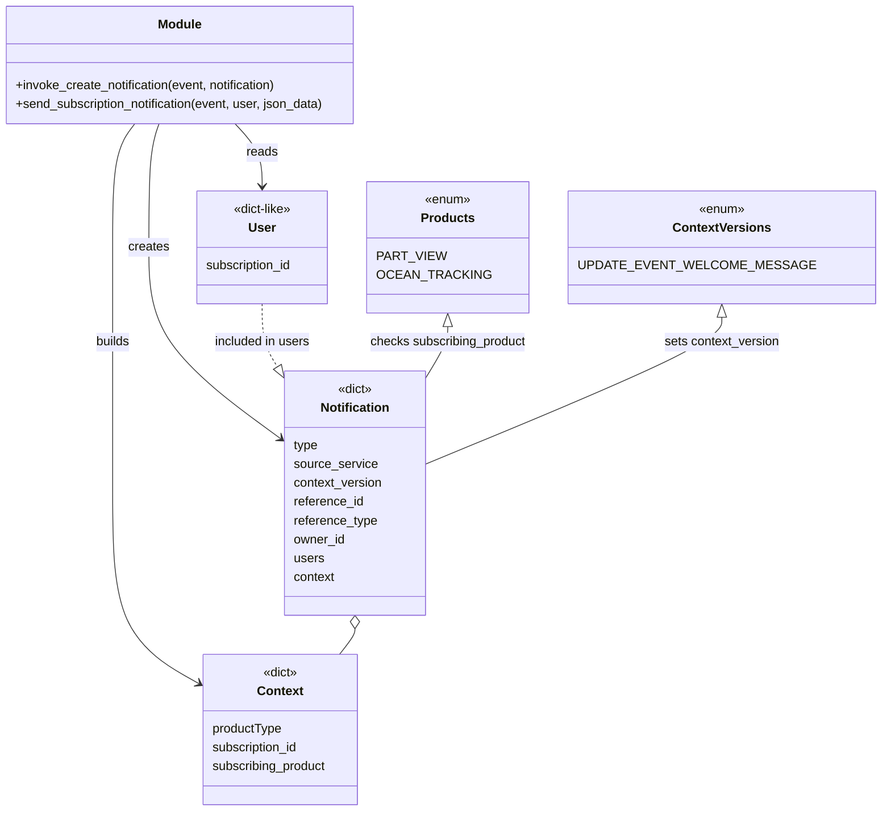

# Diagram: common/subscription_service/subscription_service/common/notifications.py


> Auto-generated by Obscura crawlers

## Diagram 1



### SVG

<svg id="container" width="1065.630859375" xmlns="http://www.w3.org/2000/svg" class="classDiagram" height="1060" viewBox="0 0 1065.630859375 1060" role="graphics-document document" aria-roledescription="class"><style>#container{font-family:"trebuchet ms",verdana,arial,sans-serif;font-size:16px;fill:#333;}@keyframes edge-animation-frame{from{stroke-dashoffset:0;}}@keyframes dash{to{stroke-dashoffset:0;}}#container .edge-animation-slow{stroke-dasharray:9,5!important;stroke-dashoffset:900;animation:dash 50s linear infinite;stroke-linecap:round;}#container .edge-animation-fast{stroke-dasharray:9,5!important;stroke-dashoffset:900;animation:dash 20s linear infinite;stroke-linecap:round;}#container .error-icon{fill:#552222;}#container .error-text{fill:#552222;stroke:#552222;}#container .edge-thickness-normal{stroke-width:1px;}#container .edge-thickness-thick{stroke-width:3.5px;}#container .edge-pattern-solid{stroke-dasharray:0;}#container .edge-thickness-invisible{stroke-width:0;fill:none;}#container .edge-pattern-dashed{stroke-dasharray:3;}#container .edge-pattern-dotted{stroke-dasharray:2;}#container .marker{fill:#333333;stroke:#333333;}#container .marker.cross{stroke:#333333;}#container svg{font-family:"trebuchet ms",verdana,arial,sans-serif;font-size:16px;}#container p{margin:0;}#container g.classGroup text{fill:#9370DB;stroke:none;font-family:"trebuchet ms",verdana,arial,sans-serif;font-size:10px;}#container g.classGroup text .title{font-weight:bolder;}#container .nodeLabel,#container .edgeLabel{color:#131300;}#container .edgeLabel .label rect{fill:#ECECFF;}#container .label text{fill:#131300;}#container .labelBkg{background:#ECECFF;}#container .edgeLabel .label span{background:#ECECFF;}#container .classTitle{font-weight:bolder;}#container .node rect,#container .node circle,#container .node ellipse,#container .node polygon,#container .node path{fill:#ECECFF;stroke:#9370DB;stroke-width:1px;}#container .divider{stroke:#9370DB;stroke-width:1;}#container g.clickable{cursor:pointer;}#container g.classGroup rect{fill:#ECECFF;stroke:#9370DB;}#container g.classGroup line{stroke:#9370DB;stroke-width:1;}#container .classLabel .box{stroke:none;stroke-width:0;fill:#ECECFF;opacity:0.5;}#container .classLabel .label{fill:#9370DB;font-size:10px;}#container .relation{stroke:#333333;stroke-width:1;fill:none;}#container .dashed-line{stroke-dasharray:3;}#container .dotted-line{stroke-dasharray:1 2;}#container #compositionStart,#container .composition{fill:#333333!important;stroke:#333333!important;stroke-width:1;}#container #compositionEnd,#container .composition{fill:#333333!important;stroke:#333333!important;stroke-width:1;}#container #dependencyStart,#container .dependency{fill:#333333!important;stroke:#333333!important;stroke-width:1;}#container #dependencyStart,#container .dependency{fill:#333333!important;stroke:#333333!important;stroke-width:1;}#container #extensionStart,#container .extension{fill:transparent!important;stroke:#333333!important;stroke-width:1;}#container #extensionEnd,#container .extension{fill:transparent!important;stroke:#333333!important;stroke-width:1;}#container #aggregationStart,#container .aggregation{fill:transparent!important;stroke:#333333!important;stroke-width:1;}#container #aggregationEnd,#container .aggregation{fill:transparent!important;stroke:#333333!important;stroke-width:1;}#container #lollipopStart,#container .lollipop{fill:#ECECFF!important;stroke:#333333!important;stroke-width:1;}#container #lollipopEnd,#container .lollipop{fill:#ECECFF!important;stroke:#333333!important;stroke-width:1;}#container .edgeTerminals{font-size:11px;line-height:initial;}#container .classTitleText{text-anchor:middle;font-size:18px;fill:#333;}#container .label-icon{display:inline-block;height:1em;overflow:visible;vertical-align:-0.125em;}#container .node .label-icon path{fill:currentColor;stroke:revert;stroke-width:revert;}#container :root{--mermaid-font-family:"trebuchet ms",verdana,arial,sans-serif;}</style><g><defs><marker id="container_class-aggregationStart" class="marker aggregation class" refX="18" refY="7" markerWidth="190" markerHeight="240" orient="auto"><path d="M 18,7 L9,13 L1,7 L9,1 Z"></path></marker></defs><defs><marker id="container_class-aggregationEnd" class="marker aggregation class" refX="1" refY="7" markerWidth="20" markerHeight="28" orient="auto"><path d="M 18,7 L9,13 L1,7 L9,1 Z"></path></marker></defs><defs><marker id="container_class-extensionStart" class="marker extension class" refX="18" refY="7" markerWidth="190" markerHeight="240" orient="auto"><path d="M 1,7 L18,13 V 1 Z"></path></marker></defs><defs><marker id="container_class-extensionEnd" class="marker extension class" refX="1" refY="7" markerWidth="20" markerHeight="28" orient="auto"><path d="M 1,1 V 13 L18,7 Z"></path></marker></defs><defs><marker id="container_class-compositionStart" class="marker composition class" refX="18" refY="7" markerWidth="190" markerHeight="240" orient="auto"><path d="M 18,7 L9,13 L1,7 L9,1 Z"></path></marker></defs><defs><marker id="container_class-compositionEnd" class="marker composition class" refX="1" refY="7" markerWidth="20" markerHeight="28" orient="auto"><path d="M 18,7 L9,13 L1,7 L9,1 Z"></path></marker></defs><defs><marker id="container_class-dependencyStart" class="marker dependency class" refX="6" refY="7" markerWidth="190" markerHeight="240" orient="auto"><path d="M 5,7 L9,13 L1,7 L9,1 Z"></path></marker></defs><defs><marker id="container_class-dependencyEnd" class="marker dependency class" refX="13" refY="7" markerWidth="20" markerHeight="28" orient="auto"><path d="M 18,7 L9,13 L14,7 L9,1 Z"></path></marker></defs><defs><marker id="container_class-lollipopStart" class="marker lollipop class" refX="13" refY="7" markerWidth="190" markerHeight="240" orient="auto"><circle stroke="black" fill="transparent" cx="7" cy="7" r="6"></circle></marker></defs><defs><marker id="container_class-lollipopEnd" class="marker lollipop class" refX="1" refY="7" markerWidth="190" markerHeight="240" orient="auto"><circle stroke="black" fill="transparent" cx="7" cy="7" r="6"></circle></marker></defs><g class="root"><g class="clusters"></g><g class="edgePaths"><path d="M208.096,158L205.904,164.167C203.712,170.333,199.328,182.667,197.136,209C194.943,235.333,194.943,275.667,194.943,318C194.943,360.333,194.943,404.667,222.972,448.622C251,492.577,307.057,536.154,335.086,557.943L363.115,579.732" id="id_Module_Notification_1" class="edge-thickness-normal edge-pattern-solid relation" style=";;;" data-edge="true" data-et="edge" data-id="id_Module_Notification_1" data-points="W3sieCI6MjA4LjA5NjM0ODM1Mzc5NDY0LCJ5IjoxNTh9LHsieCI6MTk0Ljk0MzM1OTM3NSwieSI6MTk1fSx7IngiOjE5NC45NDMzNTkzNzUsInkiOjMxNn0seyJ4IjoxOTQuOTQzMzU5Mzc1LCJ5Ijo0NDl9LHsieCI6MzY3Ljg1MTU2MjUsInkiOjU4My40MTQwMDgzOTg4MTc5fV0=" marker-end="url(#container_class-dependencyEnd)"></path><path d="M177.178,158L172.443,164.167C167.709,170.333,158.24,182.667,153.506,209C148.771,235.333,148.771,275.667,148.771,318C148.771,360.333,148.771,404.667,148.771,461C148.771,517.333,148.771,585.667,148.771,650C148.771,714.333,148.771,774.667,166.525,814.95C184.278,855.233,219.784,875.466,237.538,885.582L255.291,895.699" id="id_Module_Context_2" class="edge-thickness-normal edge-pattern-solid relation" style=";;;" data-edge="true" data-et="edge" data-id="id_Module_Context_2" data-points="W3sieCI6MTc3LjE3NzY4MjA1OTE1MTc4LCJ5IjoxNTh9LHsieCI6MTQ4Ljc3MTQ4NDM3NSwieSI6MTk1fSx7IngiOjE0OC43NzE0ODQzNzUsInkiOjMxNn0seyJ4IjoxNDguNzcxNDg0Mzc1LCJ5Ijo0NDl9LHsieCI6MTQ4Ljc3MTQ4NDM3NSwieSI6NjU0fSx7IngiOjE0OC43NzE0ODQzNzUsInkiOjgzNX0seyJ4IjoyNjAuNTAzOTA2MjUsInkiOjg5OC42NjkxNTYyNjUyMzQzfV0=" marker-end="url(#container_class-dependencyEnd)"></path><path d="M307.81,158L313.817,164.167C319.823,170.333,331.837,182.667,337.843,196C343.85,209.333,343.85,223.667,343.85,230.833L343.85,238" id="id_Module_User_3" class="edge-thickness-normal edge-pattern-solid relation" style=";;;" data-edge="true" data-et="edge" data-id="id_Module_User_3" data-points="W3sieCI6MzA3LjgxMDM1NTA1MDIyMzIsInkiOjE1OH0seyJ4IjozNDMuODQ5NjA5Mzc1LCJ5IjoxOTV9LHsieCI6MzQzLjg0OTYwOTM3NSwieSI6MjQ0fV0=" marker-end="url(#container_class-dependencyEnd)"></path><path d="M458.652,827.25L458.652,828.542C458.652,829.833,458.652,832.417,455.294,837.875C451.935,843.333,445.217,851.667,441.858,855.833L438.5,860" id="id_Notification_Context_4" class="edge-thickness-normal edge-pattern-solid relation" style=";;;" data-edge="true" data-et="edge" data-id="id_Notification_Context_4" data-points="W3sieCI6NDU4LjY1MjM0Mzc1LCJ5Ijo4MTB9LHsieCI6NDU4LjY1MjM0Mzc1LCJ5Ijo4MzV9LHsieCI6NDM4LjQ5OTY0NDg4NjM2MzYsInkiOjg2MH1d" marker-start="url(#container_class-aggregationStart)"></path><path d="M343.85,388L343.85,398.167C343.85,408.333,343.85,428.667,347.018,444.492C350.187,460.316,356.524,471.633,359.693,477.291L362.862,482.949" id="id_User_Notification_5" class="edge-thickness-normal edge-pattern-dashed relation" style=";;;" data-edge="true" data-et="edge" data-id="id_User_Notification_5" data-points="W3sieCI6MzQzLjg0OTYwOTM3NSwieSI6Mzg4fSx7IngiOjM0My44NDk2MDkzNzUsInkiOjQ0OX0seyJ4IjozNzEuMjkwMjYyOTU3MzE3MDUsInkiOjQ5OH1d" marker-end="url(#container_class-extensionEnd)"></path><path d="M573.455,417.25L573.455,422.542C573.455,427.833,573.455,438.417,568.882,451.875C564.308,465.333,555.161,481.667,550.588,489.833L546.014,498" id="id_Products_Notification_6" class="edge-thickness-normal edge-pattern-solid relation" style=";;;" data-edge="true" data-et="edge" data-id="id_Products_Notification_6" data-points="W3sieCI6NTczLjQ1NTA3ODEyNSwieSI6NDAwfSx7IngiOjU3My40NTUwNzgxMjUsInkiOjQ0OX0seyJ4Ijo1NDYuMDE0NDI0NTQyNjgzLCJ5Ijo0OTh9XQ==" marker-start="url(#container_class-extensionStart)"></path><path d="M886.479,405.25L886.479,412.542C886.479,419.833,886.479,434.417,830.308,468.624C774.137,502.83,661.795,556.661,605.624,583.576L549.453,610.491" id="id_ContextVersions_Notification_7" class="edge-thickness-normal edge-pattern-solid relation" style=";;;" data-edge="true" data-et="edge" data-id="id_ContextVersions_Notification_7" data-points="W3sieCI6ODg2LjQ3ODUxNTYyNSwieSI6Mzg4fSx7IngiOjg4Ni40Nzg1MTU2MjUsInkiOjQ0OX0seyJ4Ijo1NDkuNDUzMTI1LCJ5Ijo2MTAuNDkxMzAwOTUzNjc2Nn1d" marker-start="url(#container_class-extensionStart)"></path></g><g class="edgeLabels"><g class="edgeLabel" transform="translate(194.943359375, 316)"><g class="label" data-id="id_Module_Notification_1" transform="translate(-26.171875, -12)"><foreignObject width="52.34375" height="24"><div xmlns="http://www.w3.org/1999/xhtml" class="labelBkg" style="display: table-cell; white-space: nowrap; line-height: 1.5; max-width: 200px; text-align: center;"><span class="edgeLabel"><p>creates</p></span></div></foreignObject></g></g><g class="edgeLabel" transform="translate(148.771484375, 449)"><g class="label" data-id="id_Module_Context_2" transform="translate(-22.4921875, -12)"><foreignObject width="44.984375" height="24"><div xmlns="http://www.w3.org/1999/xhtml" class="labelBkg" style="display: table-cell; white-space: nowrap; line-height: 1.5; max-width: 200px; text-align: center;"><span class="edgeLabel"><p>builds</p></span></div></foreignObject></g></g><g class="edgeLabel" transform="translate(343.849609375, 195)"><g class="label" data-id="id_Module_User_3" transform="translate(-20.0078125, -12)"><foreignObject width="40.015625" height="24"><div xmlns="http://www.w3.org/1999/xhtml" class="labelBkg" style="display: table-cell; white-space: nowrap; line-height: 1.5; max-width: 200px; text-align: center;"><span class="edgeLabel"><p>reads</p></span></div></foreignObject></g></g><g class="edgeLabel"><g class="label" data-id="id_Notification_Context_4" transform="translate(0, 0)"><foreignObject width="0" height="0"><div xmlns="http://www.w3.org/1999/xhtml" class="labelBkg" style="display: table-cell; white-space: nowrap; line-height: 1.5; max-width: 200px; text-align: center;"><span class="edgeLabel"></span></div></foreignObject></g></g><g class="edgeLabel" transform="translate(343.849609375, 449)"><g class="label" data-id="id_User_Notification_5" transform="translate(-62.34375, -12)"><foreignObject width="124.6875" height="24"><div xmlns="http://www.w3.org/1999/xhtml" class="labelBkg" style="display: table-cell; white-space: nowrap; line-height: 1.5; max-width: 200px; text-align: center;"><span class="edgeLabel"><p>included in users</p></span></div></foreignObject></g></g><g class="edgeLabel" transform="translate(573.455078125, 449)"><g class="label" data-id="id_Products_Notification_6" transform="translate(-100, -24)"><foreignObject width="200" height="48"><div xmlns="http://www.w3.org/1999/xhtml" class="labelBkg" style="display: table; white-space: break-spaces; line-height: 1.5; max-width: 200px; text-align: center; width: 200px;"><span class="edgeLabel"><p>checks subscribing_product</p></span></div></foreignObject></g></g><g class="edgeLabel" transform="translate(886.478515625, 449)"><g class="label" data-id="id_ContextVersions_Notification_7" transform="translate(-74.1953125, -12)"><foreignObject width="148.390625" height="24"><div xmlns="http://www.w3.org/1999/xhtml" class="labelBkg" style="display: table-cell; white-space: nowrap; line-height: 1.5; max-width: 200px; text-align: center;"><span class="edgeLabel"><p>sets context_version</p></span></div></foreignObject></g></g></g><g class="nodes"><g class="node default" id="classId-Module-0" transform="translate(234.7578125, 83)"><g class="basic label-container"><path d="M-226.7578125 -75 L226.7578125 -75 L226.7578125 75 L-226.7578125 75" stroke="none" stroke-width="0" fill="#ECECFF" style=""></path><path d="M-226.7578125 -75 C-135.7403178892555 -75, -44.72282327851099 -75, 226.7578125 -75 M-226.7578125 -75 C-105.39250820076587 -75, 15.972796098468251 -75, 226.7578125 -75 M226.7578125 -75 C226.7578125 -19.20510725580496, 226.7578125 36.58978548839008, 226.7578125 75 M226.7578125 -75 C226.7578125 -35.36608760768121, 226.7578125 4.2678247846375825, 226.7578125 75 M226.7578125 75 C72.96802788888175 75, -80.8217567222365 75, -226.7578125 75 M226.7578125 75 C109.14579911142194 75, -8.466214277156126 75, -226.7578125 75 M-226.7578125 75 C-226.7578125 37.56242625541572, -226.7578125 0.12485251083144533, -226.7578125 -75 M-226.7578125 75 C-226.7578125 34.158801074867476, -226.7578125 -6.682397850265048, -226.7578125 -75" stroke="#9370DB" stroke-width="1.3" fill="none" stroke-dasharray="0 0" style=""></path></g><g class="annotation-group text" transform="translate(0, -51)"></g><g class="label-group text" transform="translate(-27.09375, -51)"><g class="label" style="font-weight: bolder" transform="translate(0,-12)"><foreignObject width="54.1875" height="24"><div xmlns="http://www.w3.org/1999/xhtml" style="display: table-cell; white-space: nowrap; line-height: 1.5; max-width: 104px; text-align: center;"><span class="nodeLabel markdown-node-label" style=""><p>Module</p></span></div></foreignObject></g></g><g class="members-group text" transform="translate(-214.7578125, -3)"></g><g class="methods-group text" transform="translate(-214.7578125, 27)"><g class="label" style="" transform="translate(0,-12)"><foreignObject width="341.890625" height="24"><div xmlns="http://www.w3.org/1999/xhtml" style="display: table-cell; white-space: nowrap; line-height: 1.5; max-width: 399px; text-align: center;"><span class="nodeLabel markdown-node-label" style=""><p>+invoke_create_notification(event, notification)</p></span></div></foreignObject></g><g class="label" style="" transform="translate(0,12)"><foreignObject width="402.421875" height="24"><div xmlns="http://www.w3.org/1999/xhtml" style="display: table-cell; white-space: nowrap; line-height: 1.5; max-width: 460px; text-align: center;"><span class="nodeLabel markdown-node-label" style=""><p>+send_subscription_notification(event, user, json_data)</p></span></div></foreignObject></g></g><g class="divider" style=""><path d="M-226.7578125 -27 C-78.57528403922075 -27, 69.6072444215585 -27, 226.7578125 -27 M-226.7578125 -27 C-127.87235620270987 -27, -28.986899905419733 -27, 226.7578125 -27" stroke="#9370DB" stroke-width="1.3" fill="none" stroke-dasharray="0 0" style=""></path></g><g class="divider" style=""><path d="M-226.7578125 -3 C-105.27791131269109 -3, 16.201989874617823 -3, 226.7578125 -3 M-226.7578125 -3 C-86.54719473965326 -3, 53.66342302069347 -3, 226.7578125 -3" stroke="#9370DB" stroke-width="1.3" fill="none" stroke-dasharray="0 0" style=""></path></g></g><g class="node default" id="classId-Context-1" transform="translate(361.11328125, 956)"><g class="basic label-container"><path d="M-100.609375 -96 L100.609375 -96 L100.609375 96 L-100.609375 96" stroke="none" stroke-width="0" fill="#ECECFF" style=""></path><path d="M-100.609375 -96 C-37.001054652363024 -96, 26.607265695273952 -96, 100.609375 -96 M-100.609375 -96 C-51.624084824472654 -96, -2.638794648945307 -96, 100.609375 -96 M100.609375 -96 C100.609375 -20.470629423178394, 100.609375 55.05874115364321, 100.609375 96 M100.609375 -96 C100.609375 -52.21399700838897, 100.609375 -8.427994016777944, 100.609375 96 M100.609375 96 C49.285423840997666 96, -2.038527318004668 96, -100.609375 96 M100.609375 96 C20.261075636113034 96, -60.08722372777393 96, -100.609375 96 M-100.609375 96 C-100.609375 44.49642484918955, -100.609375 -7.0071503016208965, -100.609375 -96 M-100.609375 96 C-100.609375 39.94427576450378, -100.609375 -16.111448470992443, -100.609375 -96" stroke="#9370DB" stroke-width="1.3" fill="none" stroke-dasharray="0 0" style=""></path></g><g class="annotation-group text" transform="translate(-22.7265625, -72)"><g class="label" style="" transform="translate(0,-12)"><foreignObject width="45.453125" height="24"><div xmlns="http://www.w3.org/1999/xhtml" style="display: table-cell; white-space: nowrap; line-height: 1.5; max-width: 95px; text-align: center;"><span class="nodeLabel markdown-node-label" style=""><p>«dict»</p></span></div></foreignObject></g></g><g class="label-group text" transform="translate(-28.171875, -48)"><g class="label" style="font-weight: bolder" transform="translate(0,-12)"><foreignObject width="56.34375" height="24"><div xmlns="http://www.w3.org/1999/xhtml" style="display: table-cell; white-space: nowrap; line-height: 1.5; max-width: 105px; text-align: center;"><span class="nodeLabel markdown-node-label" style=""><p>Context</p></span></div></foreignObject></g></g><g class="members-group text" transform="translate(-88.609375, 0)"><g class="label" style="" transform="translate(0,-12)"><foreignObject width="90.578125" height="24"><div xmlns="http://www.w3.org/1999/xhtml" style="display: table-cell; white-space: nowrap; line-height: 1.5; max-width: 141px; text-align: center;"><span class="nodeLabel markdown-node-label" style=""><p>productType</p></span></div></foreignObject></g><g class="label" style="" transform="translate(0,12)"><foreignObject width="113.015625" height="24"><div xmlns="http://www.w3.org/1999/xhtml" style="display: table-cell; white-space: nowrap; line-height: 1.5; max-width: 163px; text-align: center;"><span class="nodeLabel markdown-node-label" style=""><p>subscription_id</p></span></div></foreignObject></g><g class="label" style="" transform="translate(0,36)"><foreignObject width="149.046875" height="24"><div xmlns="http://www.w3.org/1999/xhtml" style="display: table-cell; white-space: nowrap; line-height: 1.5; max-width: 199px; text-align: center;"><span class="nodeLabel markdown-node-label" style=""><p>subscribing_product</p></span></div></foreignObject></g></g><g class="methods-group text" transform="translate(-88.609375, 96)"></g><g class="divider" style=""><path d="M-100.609375 -24 C-35.20705717097317 -24, 30.195260658053655 -24, 100.609375 -24 M-100.609375 -24 C-26.66036038842644 -24, 47.28865422314712 -24, 100.609375 -24" stroke="#9370DB" stroke-width="1.3" fill="none" stroke-dasharray="0 0" style=""></path></g><g class="divider" style=""><path d="M-100.609375 72 C-44.224928909063394 72, 12.159517181873213 72, 100.609375 72 M-100.609375 72 C-40.71722272137328 72, 19.174929557253435 72, 100.609375 72" stroke="#9370DB" stroke-width="1.3" fill="none" stroke-dasharray="0 0" style=""></path></g></g><g class="node default" id="classId-Notification-2" transform="translate(458.65234375, 654)"><g class="basic label-container"><path d="M-90.80078125 -156 L90.80078125 -156 L90.80078125 156 L-90.80078125 156" stroke="none" stroke-width="0" fill="#ECECFF" style=""></path><path d="M-90.80078125 -156 C-48.101603408599814 -156, -5.402425567199629 -156, 90.80078125 -156 M-90.80078125 -156 C-36.552028258012896 -156, 17.696724733974207 -156, 90.80078125 -156 M90.80078125 -156 C90.80078125 -68.86714804245746, 90.80078125 18.265703915085084, 90.80078125 156 M90.80078125 -156 C90.80078125 -72.15894773196811, 90.80078125 11.682104536063775, 90.80078125 156 M90.80078125 156 C46.7695057423598 156, 2.7382302347195946 156, -90.80078125 156 M90.80078125 156 C49.97965354746479 156, 9.158525844929585 156, -90.80078125 156 M-90.80078125 156 C-90.80078125 49.90473394684601, -90.80078125 -56.190532106307984, -90.80078125 -156 M-90.80078125 156 C-90.80078125 67.9250767532033, -90.80078125 -20.1498464935934, -90.80078125 -156" stroke="#9370DB" stroke-width="1.3" fill="none" stroke-dasharray="0 0" style=""></path></g><g class="annotation-group text" transform="translate(-22.7265625, -132)"><g class="label" style="" transform="translate(0,-12)"><foreignObject width="45.453125" height="24"><div xmlns="http://www.w3.org/1999/xhtml" style="display: table-cell; white-space: nowrap; line-height: 1.5; max-width: 95px; text-align: center;"><span class="nodeLabel markdown-node-label" style=""><p>«dict»</p></span></div></foreignObject></g></g><g class="label-group text" transform="translate(-42.8828125, -108)"><g class="label" style="font-weight: bolder" transform="translate(0,-12)"><foreignObject width="85.765625" height="24"><div xmlns="http://www.w3.org/1999/xhtml" style="display: table-cell; white-space: nowrap; line-height: 1.5; max-width: 135px; text-align: center;"><span class="nodeLabel markdown-node-label" style=""><p>Notification</p></span></div></foreignObject></g></g><g class="members-group text" transform="translate(-78.80078125, -60)"><g class="label" style="" transform="translate(0,-12)"><foreignObject width="31.796875" height="24"><div xmlns="http://www.w3.org/1999/xhtml" style="display: table-cell; white-space: nowrap; line-height: 1.5; max-width: 82px; text-align: center;"><span class="nodeLabel markdown-node-label" style=""><p>type</p></span></div></foreignObject></g><g class="label" style="" transform="translate(0,12)"><foreignObject width="106.6875" height="24"><div xmlns="http://www.w3.org/1999/xhtml" style="display: table-cell; white-space: nowrap; line-height: 1.5; max-width: 157px; text-align: center;"><span class="nodeLabel markdown-node-label" style=""><p>source_service</p></span></div></foreignObject></g><g class="label" style="" transform="translate(0,36)"><foreignObject width="114.71875" height="24"><div xmlns="http://www.w3.org/1999/xhtml" style="display: table-cell; white-space: nowrap; line-height: 1.5; max-width: 165px; text-align: center;"><span class="nodeLabel markdown-node-label" style=""><p>context_version</p></span></div></foreignObject></g><g class="label" style="" transform="translate(0,60)"><foreignObject width="90.265625" height="24"><div xmlns="http://www.w3.org/1999/xhtml" style="display: table-cell; white-space: nowrap; line-height: 1.5; max-width: 140px; text-align: center;"><span class="nodeLabel markdown-node-label" style=""><p>reference_id</p></span></div></foreignObject></g><g class="label" style="" transform="translate(0,84)"><foreignObject width="107.65625" height="24"><div xmlns="http://www.w3.org/1999/xhtml" style="display: table-cell; white-space: nowrap; line-height: 1.5; max-width: 158px; text-align: center;"><span class="nodeLabel markdown-node-label" style=""><p>reference_type</p></span></div></foreignObject></g><g class="label" style="" transform="translate(0,108)"><foreignObject width="66.21875" height="24"><div xmlns="http://www.w3.org/1999/xhtml" style="display: table-cell; white-space: nowrap; line-height: 1.5; max-width: 116px; text-align: center;"><span class="nodeLabel markdown-node-label" style=""><p>owner_id</p></span></div></foreignObject></g><g class="label" style="" transform="translate(0,132)"><foreignObject width="38.921875" height="24"><div xmlns="http://www.w3.org/1999/xhtml" style="display: table-cell; white-space: nowrap; line-height: 1.5; max-width: 89px; text-align: center;"><span class="nodeLabel markdown-node-label" style=""><p>users</p></span></div></foreignObject></g><g class="label" style="" transform="translate(0,156)"><foreignObject width="53.703125" height="24"><div xmlns="http://www.w3.org/1999/xhtml" style="display: table-cell; white-space: nowrap; line-height: 1.5; max-width: 104px; text-align: center;"><span class="nodeLabel markdown-node-label" style=""><p>context</p></span></div></foreignObject></g></g><g class="methods-group text" transform="translate(-78.80078125, 156)"></g><g class="divider" style=""><path d="M-90.80078125 -84 C-35.84308386663578 -84, 19.11461351672844 -84, 90.80078125 -84 M-90.80078125 -84 C-50.77883298488202 -84, -10.756884719764045 -84, 90.80078125 -84" stroke="#9370DB" stroke-width="1.3" fill="none" stroke-dasharray="0 0" style=""></path></g><g class="divider" style=""><path d="M-90.80078125 132 C-25.06017631082848 132, 40.68042862834304 132, 90.80078125 132 M-90.80078125 132 C-52.08053704465792 132, -13.360292839315846 132, 90.80078125 132" stroke="#9370DB" stroke-width="1.3" fill="none" stroke-dasharray="0 0" style=""></path></g></g><g class="node default" id="classId-User-3" transform="translate(343.849609375, 316)"><g class="basic label-container"><path d="M-87.734375 -72 L87.734375 -72 L87.734375 72 L-87.734375 72" stroke="none" stroke-width="0" fill="#ECECFF" style=""></path><path d="M-87.734375 -72 C-20.16909430853049 -72, 47.39618638293902 -72, 87.734375 -72 M-87.734375 -72 C-45.18511219866751 -72, -2.635849397335022 -72, 87.734375 -72 M87.734375 -72 C87.734375 -28.93169244656996, 87.734375 14.136615106860077, 87.734375 72 M87.734375 -72 C87.734375 -25.918724421658354, 87.734375 20.162551156683293, 87.734375 72 M87.734375 72 C24.27254441103937 72, -39.18928617792126 72, -87.734375 72 M87.734375 72 C51.85705262991613 72, 15.979730259832266 72, -87.734375 72 M-87.734375 72 C-87.734375 29.75094464019118, -87.734375 -12.498110719617642, -87.734375 -72 M-87.734375 72 C-87.734375 37.984020735819065, -87.734375 3.9680414716381307, -87.734375 -72" stroke="#9370DB" stroke-width="1.3" fill="none" stroke-dasharray="0 0" style=""></path></g><g class="annotation-group text" transform="translate(-38.453125, -48)"><g class="label" style="" transform="translate(0,-12)"><foreignObject width="76.90625" height="24"><div xmlns="http://www.w3.org/1999/xhtml" style="display: table-cell; white-space: nowrap; line-height: 1.5; max-width: 127px; text-align: center;"><span class="nodeLabel markdown-node-label" style=""><p>«dict-like»</p></span></div></foreignObject></g></g><g class="label-group text" transform="translate(-16.65625, -24)"><g class="label" style="font-weight: bolder" transform="translate(0,-12)"><foreignObject width="33.3125" height="24"><div xmlns="http://www.w3.org/1999/xhtml" style="display: table-cell; white-space: nowrap; line-height: 1.5; max-width: 84px; text-align: center;"><span class="nodeLabel markdown-node-label" style=""><p>User</p></span></div></foreignObject></g></g><g class="members-group text" transform="translate(-75.734375, 24)"><g class="label" style="" transform="translate(0,-12)"><foreignObject width="113.015625" height="24"><div xmlns="http://www.w3.org/1999/xhtml" style="display: table-cell; white-space: nowrap; line-height: 1.5; max-width: 163px; text-align: center;"><span class="nodeLabel markdown-node-label" style=""><p>subscription_id</p></span></div></foreignObject></g></g><g class="methods-group text" transform="translate(-75.734375, 72)"></g><g class="divider" style=""><path d="M-87.734375 0 C-21.416944034075627 0, 44.90048693184875 0, 87.734375 0 M-87.734375 0 C-21.17943887783879 0, 45.37549724432242 0, 87.734375 0" stroke="#9370DB" stroke-width="1.3" fill="none" stroke-dasharray="0 0" style=""></path></g><g class="divider" style=""><path d="M-87.734375 48 C-42.31621974546744 48, 3.1019355090651146 48, 87.734375 48 M-87.734375 48 C-23.204653721389093 48, 41.325067557221814 48, 87.734375 48" stroke="#9370DB" stroke-width="1.3" fill="none" stroke-dasharray="0 0" style=""></path></g></g><g class="node default" id="classId-Products-4" transform="translate(573.455078125, 316)"><g class="basic label-container"><path d="M-91.87109375 -84 L91.87109375 -84 L91.87109375 84 L-91.87109375 84" stroke="none" stroke-width="0" fill="#ECECFF" style=""></path><path d="M-91.87109375 -84 C-53.49588534599225 -84, -15.120676941984499 -84, 91.87109375 -84 M-91.87109375 -84 C-37.862586406333776 -84, 16.14592093733245 -84, 91.87109375 -84 M91.87109375 -84 C91.87109375 -35.97194094442001, 91.87109375 12.056118111159975, 91.87109375 84 M91.87109375 -84 C91.87109375 -18.548526481159968, 91.87109375 46.902947037680065, 91.87109375 84 M91.87109375 84 C51.01372152600107 84, 10.156349302002141 84, -91.87109375 84 M91.87109375 84 C19.773092561824924 84, -52.32490862635015 84, -91.87109375 84 M-91.87109375 84 C-91.87109375 33.2991806750149, -91.87109375 -17.401638649970195, -91.87109375 -84 M-91.87109375 84 C-91.87109375 20.64497997846479, -91.87109375 -42.71004004307042, -91.87109375 -84" stroke="#9370DB" stroke-width="1.3" fill="none" stroke-dasharray="0 0" style=""></path></g><g class="annotation-group text" transform="translate(-29.53125, -60)"><g class="label" style="" transform="translate(0,-12)"><foreignObject width="59.0625" height="24"><div xmlns="http://www.w3.org/1999/xhtml" style="display: table-cell; white-space: nowrap; line-height: 1.5; max-width: 109px; text-align: center;"><span class="nodeLabel markdown-node-label" style=""><p>«enum»</p></span></div></foreignObject></g></g><g class="label-group text" transform="translate(-32.4453125, -36)"><g class="label" style="font-weight: bolder" transform="translate(0,-12)"><foreignObject width="64.890625" height="24"><div xmlns="http://www.w3.org/1999/xhtml" style="display: table-cell; white-space: nowrap; line-height: 1.5; max-width: 114px; text-align: center;"><span class="nodeLabel markdown-node-label" style=""><p>Products</p></span></div></foreignObject></g></g><g class="members-group text" transform="translate(-79.87109375, 12)"><g class="label" style="" transform="translate(0,-12)"><foreignObject width="77.25" height="24"><div xmlns="http://www.w3.org/1999/xhtml" style="display: table-cell; white-space: nowrap; line-height: 1.5; max-width: 127px; text-align: center;"><span class="nodeLabel markdown-node-label" style=""><p>PART_VIEW</p></span></div></foreignObject></g><g class="label" style="" transform="translate(0,12)"><foreignObject width="127.296875" height="24"><div xmlns="http://www.w3.org/1999/xhtml" style="display: table-cell; white-space: nowrap; line-height: 1.5; max-width: 177px; text-align: center;"><span class="nodeLabel markdown-node-label" style=""><p>OCEAN_TRACKING</p></span></div></foreignObject></g></g><g class="methods-group text" transform="translate(-79.87109375, 84)"></g><g class="divider" style=""><path d="M-91.87109375 -12 C-29.162578208006103 -12, 33.545937333987794 -12, 91.87109375 -12 M-91.87109375 -12 C-44.41102138182323 -12, 3.049050986353535 -12, 91.87109375 -12" stroke="#9370DB" stroke-width="1.3" fill="none" stroke-dasharray="0 0" style=""></path></g><g class="divider" style=""><path d="M-91.87109375 60 C-29.79901851111837 60, 32.27305672776326 60, 91.87109375 60 M-91.87109375 60 C-35.17016438939524 60, 21.53076497120952 60, 91.87109375 60" stroke="#9370DB" stroke-width="1.3" fill="none" stroke-dasharray="0 0" style=""></path></g></g><g class="node default" id="classId-ContextVersions-5" transform="translate(886.478515625, 316)"><g class="basic label-container"><path d="M-171.15234375 -72 L171.15234375 -72 L171.15234375 72 L-171.15234375 72" stroke="none" stroke-width="0" fill="#ECECFF" style=""></path><path d="M-171.15234375 -72 C-77.2469748594185 -72, 16.658394031163 -72, 171.15234375 -72 M-171.15234375 -72 C-35.58040121295102 -72, 99.99154132409797 -72, 171.15234375 -72 M171.15234375 -72 C171.15234375 -42.45455255798083, 171.15234375 -12.909105115961665, 171.15234375 72 M171.15234375 -72 C171.15234375 -42.53800885632694, 171.15234375 -13.076017712653886, 171.15234375 72 M171.15234375 72 C73.14668008407533 72, -24.858983581849344 72, -171.15234375 72 M171.15234375 72 C69.7907683331251 72, -31.5708070837498 72, -171.15234375 72 M-171.15234375 72 C-171.15234375 15.046039670468495, -171.15234375 -41.90792065906301, -171.15234375 -72 M-171.15234375 72 C-171.15234375 18.982678589272368, -171.15234375 -34.034642821455265, -171.15234375 -72" stroke="#9370DB" stroke-width="1.3" fill="none" stroke-dasharray="0 0" style=""></path></g><g class="annotation-group text" transform="translate(-29.53125, -48)"><g class="label" style="" transform="translate(0,-12)"><foreignObject width="59.0625" height="24"><div xmlns="http://www.w3.org/1999/xhtml" style="display: table-cell; white-space: nowrap; line-height: 1.5; max-width: 109px; text-align: center;"><span class="nodeLabel markdown-node-label" style=""><p>«enum»</p></span></div></foreignObject></g></g><g class="label-group text" transform="translate(-59.3359375, -24)"><g class="label" style="font-weight: bolder" transform="translate(0,-12)"><foreignObject width="118.671875" height="24"><div xmlns="http://www.w3.org/1999/xhtml" style="display: table-cell; white-space: nowrap; line-height: 1.5; max-width: 166px; text-align: center;"><span class="nodeLabel markdown-node-label" style=""><p>ContextVersions</p></span></div></foreignObject></g></g><g class="members-group text" transform="translate(-159.15234375, 24)"><g class="label" style="" transform="translate(0,-12)"><foreignObject width="258.96875" height="24"><div xmlns="http://www.w3.org/1999/xhtml" style="display: table-cell; white-space: nowrap; line-height: 1.5; max-width: 309px; text-align: center;"><span class="nodeLabel markdown-node-label" style=""><p>UPDATE_EVENT_WELCOME_MESSAGE</p></span></div></foreignObject></g></g><g class="methods-group text" transform="translate(-159.15234375, 72)"></g><g class="divider" style=""><path d="M-171.15234375 0 C-36.96204989633236 0, 97.22824395733528 0, 171.15234375 0 M-171.15234375 0 C-42.0383281797115 0, 87.075687390577 0, 171.15234375 0" stroke="#9370DB" stroke-width="1.3" fill="none" stroke-dasharray="0 0" style=""></path></g><g class="divider" style=""><path d="M-171.15234375 48 C-47.0649785060385 48, 77.022386737923 48, 171.15234375 48 M-171.15234375 48 C-41.887051623199596 48, 87.37824050360081 48, 171.15234375 48" stroke="#9370DB" stroke-width="1.3" fill="none" stroke-dasharray="0 0" style=""></path></g></g></g></g></g></svg>

## Diagram 2

```mermaid
flowchart TD
    A[Start: send_subscription_notification] --> B{json_data.reference_type present?}
    B -- Yes --> C[reference_type = json_data.reference_type]
    B -- No --> D{json_data.source_service == "shipment"?}
    D -- Yes --> C2[reference_type = "shipment"]
    D -- No --> C3[reference_type = "vin"]
    C2 --> E[Build context dict with productType, subscription_id, subscribing_product]
    C3 --> E
    C --> E
    E --> F{json_data.context exists?}
    F -- Yes --> G[Merge key/value pairs into context]
    F -- No --> H[skip merge]
    G --> I[Construct notification dict with fields and context_version]
    H --> I
    I --> J{json_data.subscribing_product in [PART_VIEW, OCEAN_TRACKING]?}
    J -- Yes --> K[Parse reference_description JSON]
    K --> L[Set package_type, parts, containerNumber in notification.context]
    J -- No --> M[skip package enrichment]
    L --> N[Log notification]
    M --> N
    N --> O[invoke_create_notification(event, notification)]
    O --> P[Calls fv.aws.lambdas.invoke_lambda("create_notification", full_payload=event_copy)]
    P --> Z[End]
```

> SVG rendering failed for this diagram.
