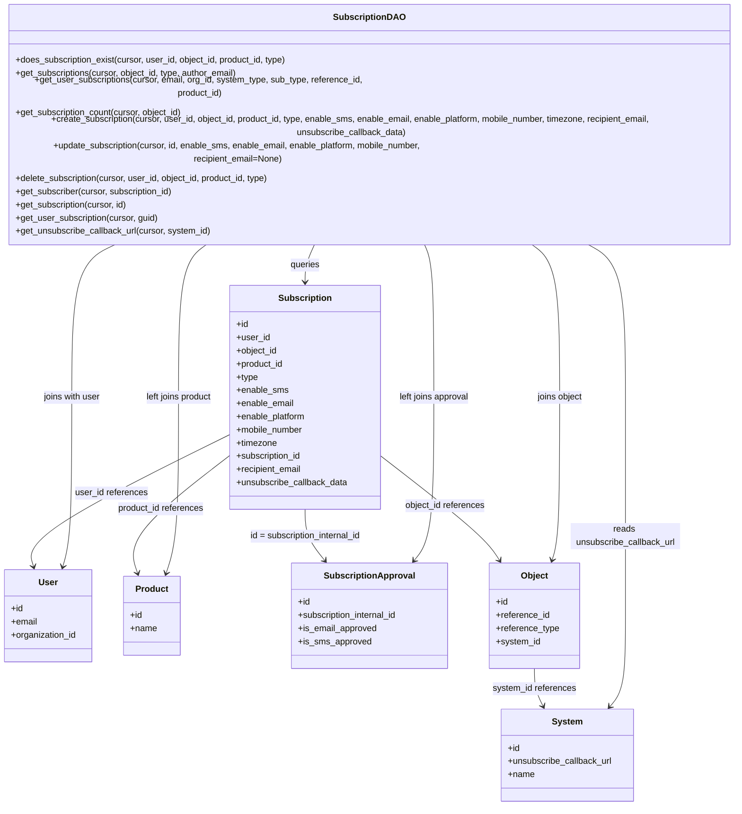

# Diagram: common/subscription_service/subscription_service/db/db_subscription.py

> Auto-generated by Obscura crawlers

## Mermaid

### SVG

<svg id="container" width="1423.34375" xmlns="http://www.w3.org/2000/svg" class="classDiagram" height="1396" viewBox="2.4140625 0 1423.34375 1396" role="graphics-document document" aria-roledescription="class"><g><defs><marker id="container_class-aggregationStart" class="marker aggregation class" refX="18" refY="7" markerWidth="190" markerHeight="240" orient="auto"><path d="M 18,7 L9,13 L1,7 L9,1 Z"></path></marker></defs><defs><marker id="container_class-aggregationEnd" class="marker aggregation class" refX="1" refY="7" markerWidth="20" markerHeight="28" orient="auto"><path d="M 18,7 L9,13 L1,7 L9,1 Z"></path></marker></defs><defs><marker id="container_class-extensionStart" class="marker extension class" refX="18" refY="7" markerWidth="190" markerHeight="240" orient="auto"><path d="M 1,7 L18,13 V 1 Z"></path></marker></defs><defs><marker id="container_class-extensionEnd" class="marker extension class" refX="1" refY="7" markerWidth="20" markerHeight="28" orient="auto"><path d="M 1,1 V 13 L18,7 Z"></path></marker></defs><defs><marker id="container_class-compositionStart" class="marker composition class" refX="18" refY="7" markerWidth="190" markerHeight="240" orient="auto"><path d="M 18,7 L9,13 L1,7 L9,1 Z"></path></marker></defs><defs><marker id="container_class-compositionEnd" class="marker composition class" refX="1" refY="7" markerWidth="20" markerHeight="28" orient="auto"><path d="M 18,7 L9,13 L1,7 L9,1 Z"></path></marker></defs><defs><marker id="container_class-dependencyStart" class="marker dependency class" refX="6" refY="7" markerWidth="190" markerHeight="240" orient="auto"><path d="M 5,7 L9,13 L1,7 L9,1 Z"></path></marker></defs><defs><marker id="container_class-dependencyEnd" class="marker dependency class" refX="13" refY="7" markerWidth="20" markerHeight="28" orient="auto"><path d="M 18,7 L9,13 L14,7 L9,1 Z"></path></marker></defs><defs><marker id="container_class-lollipopStart" class="marker lollipop class" refX="13" refY="7" markerWidth="190" markerHeight="240" orient="auto"><circle stroke="black" fill="transparent" cx="7" cy="7" r="6"></circle></marker></defs><defs><marker id="container_class-lollipopEnd" class="marker lollipop class" refX="1" refY="7" markerWidth="190" markerHeight="240" orient="auto"><circle stroke="black" fill="transparent" cx="7" cy="7" r="6"></circle></marker></defs><g class="root"><g class="clusters"></g><g class="edgePaths"><path d="M614.937,374L611.596,380.167C608.255,386.333,601.573,398.667,598.232,410C594.891,421.333,594.891,431.667,594.891,436.833L594.891,442" id="id_SubscriptionDAO_Subscription_1" class="edge-thickness-normal edge-pattern-solid relation" style=";;;" data-edge="true" data-et="edge" data-id="id_SubscriptionDAO_Subscription_1" data-points="W3sieCI6NjE0LjkzNzEwOTM3NSwieSI6Mzc0fSx7IngiOjU5NC44OTA2MjUsInkiOjQxMX0seyJ4Ijo1OTQuODkwNjI1LCJ5Ijo0NDh9XQ==" marker-end="url(#container_class-dependencyEnd)"></path><path d="M253.772,374L238.261,380.167C222.749,386.333,191.726,398.667,176.215,445C160.703,491.333,160.703,571.667,160.703,654C160.703,736.333,160.703,820.667,157.961,872.042C155.219,923.417,149.736,941.833,146.994,951.041L144.252,960.25" id="id_SubscriptionDAO_User_2" class="edge-thickness-normal edge-pattern-solid relation" style=";;;" data-edge="true" data-et="edge" data-id="id_SubscriptionDAO_User_2" data-points="W3sieCI6MjUzLjc3MjA1MjU1NjgxODIsInkiOjM3NH0seyJ4IjoxNjAuNzAzMTI1LCJ5Ijo0MTF9LHsieCI6MTYwLjcwMzEyNSwieSI6NjUyfSx7IngiOjE2MC43MDMxMjUsInkiOjkwNX0seyJ4IjoxNDIuNTM5NTIwNDc0MTM3OTMsInkiOjk2Nn1d" marker-end="url(#container_class-dependencyEnd)"></path><path d="M419.421,374L409.491,380.167C399.562,386.333,379.703,398.667,369.773,445C359.844,491.333,359.844,571.667,359.844,654C359.844,736.333,359.844,820.667,355.991,874.054C352.138,927.442,344.433,949.883,340.581,961.104L336.728,972.325" id="id_SubscriptionDAO_Product_3" class="edge-thickness-normal edge-pattern-solid relation" style=";;;" data-edge="true" data-et="edge" data-id="id_SubscriptionDAO_Product_3" data-points="W3sieCI6NDE5LjQyMDg0NTE3MDQ1NDUsInkiOjM3NH0seyJ4IjozNTkuODQzNzUsInkiOjQxMX0seyJ4IjozNTkuODQzNzUsInkiOjY1Mn0seyJ4IjozNTkuODQzNzUsInkiOjkwNX0seyJ4IjozMzQuNzc5NDk4OTIyNDEzOCwieSI6OTc4fV0=" marker-end="url(#container_class-dependencyEnd)"></path><path d="M813.235,374L816.576,380.167C819.917,386.333,826.599,398.667,829.94,445C833.281,491.333,833.281,571.667,833.281,654C833.281,736.333,833.281,820.667,827.203,870.228C821.125,919.788,808.968,934.577,802.89,941.971L796.812,949.365" id="id_SubscriptionDAO_SubscriptionApproval_4" class="edge-thickness-normal edge-pattern-solid relation" style=";;;" data-edge="true" data-et="edge" data-id="id_SubscriptionDAO_SubscriptionApproval_4" data-points="W3sieCI6ODEzLjIzNDc2NTYyNSwieSI6Mzc0fSx7IngiOjgzMy4yODEyNSwieSI6NDExfSx7IngiOjgzMy4yODEyNSwieSI6NjUyfSx7IngiOjgzMy4yODEyNSwieSI6OTA1fSx7IngiOjc5My4wMDE0NTQ3NDEzNzkzLCJ5Ijo5NTR9XQ==" marker-end="url(#container_class-dependencyEnd)"></path><path d="M1006.272,374L1016.118,380.167C1025.964,386.333,1045.656,398.667,1055.502,445C1065.348,491.333,1065.348,571.667,1065.348,654C1065.348,736.333,1065.348,820.667,1063.012,870.049C1060.676,919.431,1056.004,933.861,1053.669,941.076L1051.333,948.292" id="id_SubscriptionDAO_Object_5" class="edge-thickness-normal edge-pattern-solid relation" style=";;;" data-edge="true" data-et="edge" data-id="id_SubscriptionDAO_Object_5" data-points="W3sieCI6MTAwNi4yNzE4MjE3MzI5NTQ1LCJ5IjozNzR9LHsieCI6MTA2NS4zNDc2NTYyNSwieSI6NDExfSx7IngiOjEwNjUuMzQ3NjU2MjUsInkiOjY1Mn0seyJ4IjoxMDY1LjM0NzY1NjI1LCJ5Ijo5MDV9LHsieCI6MTA0OS40ODQ2OTgyNzU4NjIsInkiOjk1NH1d" marker-end="url(#container_class-dependencyEnd)"></path><path d="M1106.09,374L1119.3,380.167C1132.509,386.333,1158.928,398.667,1172.138,445C1185.348,491.333,1185.348,571.667,1185.348,654C1185.348,736.333,1185.348,820.667,1185.348,887C1185.348,953.333,1185.348,1001.667,1185.348,1048C1185.348,1094.333,1185.348,1138.667,1180.56,1166.251C1175.772,1193.835,1166.196,1204.669,1161.408,1210.087L1156.62,1215.504" id="id_SubscriptionDAO_System_6" class="edge-thickness-normal edge-pattern-solid relation" style=";;;" data-edge="true" data-et="edge" data-id="id_SubscriptionDAO_System_6" data-points="W3sieCI6MTEwNi4wOTAwMDM1NTExMzYzLCJ5IjozNzR9LHsieCI6MTE4NS4zNDc2NTYyNSwieSI6NDExfSx7IngiOjExODUuMzQ3NjU2MjUsInkiOjY1Mn0seyJ4IjoxMTg1LjM0NzY1NjI1LCJ5Ijo5MDV9LHsieCI6MTE4NS4zNDc2NTYyNSwieSI6MTA1MH0seyJ4IjoxMTg1LjM0NzY1NjI1LCJ5IjoxMTgzfSx7IngiOjExNTIuNjQ2NTY1MDgyNjQ0NywieSI6MTIyMH1d" marker-end="url(#container_class-dependencyEnd)"></path><path d="M457.336,718.856L393.505,749.88C329.674,780.904,202.013,842.952,140.924,883.184C79.835,923.417,85.319,941.833,88.061,951.041L90.803,960.25" id="id_Subscription_User_7" class="edge-thickness-normal edge-pattern-solid relation" style=";;;" data-edge="true" data-et="edge" data-id="id_Subscription_User_7" data-points="W3sieCI6NDU3LjMzNTkzNzUsInkiOjcxOC44NTYzMzg4MzE0Mzk4fSx7IngiOjc0LjM1MTU2MjUsInkiOjkwNX0seyJ4Ijo5Mi41MTUxNjcwMjU4NjIwNywieSI6OTY2fV0=" marker-end="url(#container_class-dependencyEnd)"></path><path d="M457.336,756.003L424.492,780.836C391.648,805.669,325.961,855.334,296.97,891.388C267.979,927.442,275.684,949.883,279.537,961.104L283.389,972.325" id="id_Subscription_Product_8" class="edge-thickness-normal edge-pattern-solid relation" style=";;;" data-edge="true" data-et="edge" data-id="id_Subscription_Product_8" data-points="W3sieCI6NDU3LjMzNTkzNzUsInkiOjc1Ni4wMDM0MzIwOTM1NzcxfSx7IngiOjI2MC4yNzM0Mzc1LCJ5Ijo5MDV9LHsieCI6Mjg1LjMzNzY4ODU3NzU4NjIsInkiOjk3OH1d" marker-end="url(#container_class-dependencyEnd)"></path><path d="M594.891,856L594.891,864.167C594.891,872.333,594.891,888.667,600.969,904.228C607.047,919.788,619.204,934.577,625.282,941.971L631.36,949.365" id="id_Subscription_SubscriptionApproval_9" class="edge-thickness-normal edge-pattern-solid relation" style=";;;" data-edge="true" data-et="edge" data-id="id_Subscription_SubscriptionApproval_9" data-points="W3sieCI6NTk0Ljg5MDYyNSwieSI6ODU2fSx7IngiOjU5NC44OTA2MjUsInkiOjkwNX0seyJ4Ijo2MzUuMTcwNDIwMjU4NjIwNywieSI6OTU0fV0=" marker-end="url(#container_class-dependencyEnd)"></path><path d="M732.445,756.737L764.898,781.448C797.352,806.158,862.258,855.579,899.317,887.61C936.377,919.641,945.589,934.281,950.196,941.601L954.802,948.922" id="id_Subscription_Object_10" class="edge-thickness-normal edge-pattern-solid relation" style=";;;" data-edge="true" data-et="edge" data-id="id_Subscription_Object_10" data-points="W3sieCI6NzMyLjQ0NTMxMjUsInkiOjc1Ni43MzcwMzg4NjU3Njg1fSx7IngiOjkyNy4xNjQwNjI1LCJ5Ijo5MDV9LHsieCI6OTU3Ljk5NzYyOTMxMDM0NDgsInkiOjk1NH1d" marker-end="url(#container_class-dependencyEnd)"></path><path d="M1018.406,1146L1018.406,1152.167C1018.406,1158.333,1018.406,1170.667,1021.02,1182.104C1023.633,1193.542,1028.861,1204.083,1031.474,1209.354L1034.088,1214.625" id="id_Object_System_11" class="edge-thickness-normal edge-pattern-solid relation" style=";;;" data-edge="true" data-et="edge" data-id="id_Object_System_11" data-points="W3sieCI6MTAxOC40MDYyNSwieSI6MTE0Nn0seyJ4IjoxMDE4LjQwNjI1LCJ5IjoxMTgzfSx7IngiOjEwMzYuNzUzMzU3NDM4MDE2NiwieSI6MTIyMH1d" marker-end="url(#container_class-dependencyEnd)"></path></g><g class="edgeLabels"><g class="edgeLabel" transform="translate(594.890625, 411)"><g class="label" data-id="id_SubscriptionDAO_Subscription_1" transform="translate(-27.2421875, -12)"><foreignObject width="54.484375" height="24">

queries

</foreignObject></g></g><g class="edgeLabel" transform="translate(160.703125, 652)"><g class="label" data-id="id_SubscriptionDAO_User_2" transform="translate(-53.2421875, -12)"><foreignObject width="106.484375" height="24">

joins with user

</foreignObject></g></g><g class="edgeLabel" transform="translate(359.84375, 652)"><g class="label" data-id="id_SubscriptionDAO_Product_3" transform="translate(-62.4921875, -12)"><foreignObject width="124.984375" height="24">

left joins product

</foreignObject></g></g><g class="edgeLabel" transform="translate(833.28125, 652)"><g class="label" data-id="id_SubscriptionDAO_SubscriptionApproval_4" transform="translate(-65.8359375, -12)"><foreignObject width="131.671875" height="24">

left joins approval

</foreignObject></g></g><g class="edgeLabel" transform="translate(1065.34765625, 652)"><g class="label" data-id="id_SubscriptionDAO_Object_5" transform="translate(-42.453125, -12)"><foreignObject width="84.90625" height="24">

joins object

</foreignObject></g></g><g class="edgeLabel" transform="translate(1185.34765625, 905)"><g class="label" data-id="id_SubscriptionDAO_System_6" transform="translate(-100, -24)"><foreignObject width="200" height="48">

reads unsubscribe_callback_url

</foreignObject></g></g><g class="edgeLabel" transform="translate(237.22194, 825.83936)"><g class="label" data-id="id_Subscription_User_7" transform="translate(-66.3515625, -12)"><foreignObject width="132.703125" height="24">

user_id references

</foreignObject></g></g><g class="edgeLabel" transform="translate(328.02167, 853.77638)"><g class="label" data-id="id_Subscription_Product_8" transform="translate(-79.5703125, -12)"><foreignObject width="159.140625" height="24">

product_id references

</foreignObject></g></g><g class="edgeLabel" transform="translate(594.890625, 905)"><g class="label" data-id="id_Subscription_SubscriptionApproval_9" transform="translate(-100, -24)"><foreignObject width="200" height="48">

id = subscription_internal_id

</foreignObject></g></g><g class="edgeLabel" transform="translate(852.8354, 848.40459)"><g class="label" data-id="id_Subscription_Object_10" transform="translate(-73.8828125, -12)"><foreignObject width="147.765625" height="24">

object_id references

</foreignObject></g></g><g class="edgeLabel" transform="translate(1018.40625, 1183)"><g class="label" data-id="id_Object_System_11" transform="translate(-76.3515625, -12)"><foreignObject width="152.703125" height="24">

system_id references

</foreignObject></g></g></g><g class="nodes"><g class="node default" id="classId-SubscriptionDAO-0" transform="translate(714.0859375, 191)"><g class="basic label-container"><path d="M-703.671875 -183 L703.671875 -183 L703.671875 183 L-703.671875 183" stroke="none" stroke-width="0" fill="#ECECFF" style=""></path><path d="M-703.671875 -183 C-296.6970697410394 -183, 110.2777355179212 -183, 703.671875 -183 M-703.671875 -183 C-142.3869855276297 -183, 418.8979039447406 -183, 703.671875 -183 M703.671875 -183 C703.671875 -51.66950181479086, 703.671875 79.66099637041827, 703.671875 183 M703.671875 -183 C703.671875 -102.8384693056977, 703.671875 -22.6769386113954, 703.671875 183 M703.671875 183 C285.1588865577624 183, -133.3541018844752 183, -703.671875 183 M703.671875 183 C294.76102989260846 183, -114.14981521478308 183, -703.671875 183 M-703.671875 183 C-703.671875 99.80096891876899, -703.671875 16.601937837537974, -703.671875 -183 M-703.671875 183 C-703.671875 64.2539527786308, -703.671875 -54.49209444273839, -703.671875 -183" stroke="#9370DB" stroke-width="1.3" fill="none" stroke-dasharray="0 0" style=""></path></g><g class="annotation-group text" transform="translate(0, -159)"></g><g class="label-group text" transform="translate(-61.796875, -159)"><g class="label" style="font-weight: bolder" transform="translate(0,-12)"><foreignObject width="123.59375" height="24">

SubscriptionDAO

</foreignObject></g></g><g class="members-group text" transform="translate(-691.671875, -111)"></g><g class="methods-group text" transform="translate(-691.671875, -81)"><g class="label" style="" transform="translate(0,-12)"><foreignObject width="502.65625" height="24">

+does_subscription_exist(cursor, user_id, object_id, product_id, type)

</foreignObject></g><g class="label" style="" transform="translate(0,12)"><foreignObject width="411.25" height="24">

+get_subscriptions(cursor, object_id, type, author_email)

</foreignObject></g><g class="label" style="" transform="translate(0,36)"><foreignObject width="690.25" height="24">

+get_user_subscriptions(cursor, email, org_id, system_type, sub_type, reference_id, product_id)

</foreignObject></g><g class="label" style="" transform="translate(0,60)"><foreignObject width="309.390625" height="24">

+get_subscription_count(cursor, object_id)

</foreignObject></g><g class="label" style="" transform="translate(0,84)"><foreignObject width="1321.546875" height="24">

+create_subscription(cursor, user_id, object_id, product_id, type, enable_sms, enable_email, enable_platform, mobile_number, timezone, recipient_email, unsubscribe_callback_data)

</foreignObject></g><g class="label" style="" transform="translate(0,108)"><foreignObject width="853.0625" height="24">

+update_subscription(cursor, id, enable_sms, enable_email, enable_platform, mobile_number, recipient_email=None)

</foreignObject></g><g class="label" style="" transform="translate(0,132)"><foreignObject width="471.328125" height="24">

+delete_subscription(cursor, user_id, object_id, product_id, type)

</foreignObject></g><g class="label" style="" transform="translate(0,156)"><foreignObject width="291.265625" height="24">

+get_subscriber(cursor, subscription_id)

</foreignObject></g><g class="label" style="" transform="translate(0,180)"><foreignObject width="206.453125" height="24">

+get_subscription(cursor, id)

</foreignObject></g><g class="label" style="" transform="translate(0,204)"><foreignObject width="262.328125" height="24">

+get_user_subscription(cursor, guid)

</foreignObject></g><g class="label" style="" transform="translate(0,228)"><foreignObject width="358.40625" height="24">

+get_unsubscribe_callback_url(cursor, system_id)

</foreignObject></g></g><g class="divider" style=""><path d="M-703.671875 -135 C-205.66133654864626 -135, 292.3492019027075 -135, 703.671875 -135 M-703.671875 -135 C-213.7928033065013 -135, 276.0862683869974 -135, 703.671875 -135" stroke="#9370DB" stroke-width="1.3" fill="none" stroke-dasharray="0 0" style=""></path></g><g class="divider" style=""><path d="M-703.671875 -111 C-399.5233305033829 -111, -95.37478600676582 -111, 703.671875 -111 M-703.671875 -111 C-384.0629492864281 -111, -64.45402357285616 -111, 703.671875 -111" stroke="#9370DB" stroke-width="1.3" fill="none" stroke-dasharray="0 0" style=""></path></g></g><g class="node default" id="classId-Subscription-1" transform="translate(594.890625, 652)"><g class="basic label-container"><path d="M-137.5546875 -204 L137.5546875 -204 L137.5546875 204 L-137.5546875 204" stroke="none" stroke-width="0" fill="#ECECFF" style=""></path><path d="M-137.5546875 -204 C-59.156582662281465 -204, 19.24152217543707 -204, 137.5546875 -204 M-137.5546875 -204 C-74.82338674242804 -204, -12.092085984856084 -204, 137.5546875 -204 M137.5546875 -204 C137.5546875 -92.89058879653092, 137.5546875 18.21882240693816, 137.5546875 204 M137.5546875 -204 C137.5546875 -105.53721873341121, 137.5546875 -7.074437466822417, 137.5546875 204 M137.5546875 204 C66.72304513120073 204, -4.108597237598531 204, -137.5546875 204 M137.5546875 204 C65.29836230293483 204, -6.957962894130333 204, -137.5546875 204 M-137.5546875 204 C-137.5546875 49.21282286376788, -137.5546875 -105.57435427246423, -137.5546875 -204 M-137.5546875 204 C-137.5546875 74.54299264785934, -137.5546875 -54.91401470428133, -137.5546875 -204" stroke="#9370DB" stroke-width="1.3" fill="none" stroke-dasharray="0 0" style=""></path></g><g class="annotation-group text" transform="translate(0, -180)"></g><g class="label-group text" transform="translate(-46.5, -180)"><g class="label" style="font-weight: bolder" transform="translate(0,-12)"><foreignObject width="93" height="24">

Subscription

</foreignObject></g></g><g class="members-group text" transform="translate(-125.5546875, -132)"><g class="label" style="" transform="translate(0,-12)"><foreignObject width="22.078125" height="24">

+id

</foreignObject></g><g class="label" style="" transform="translate(0,12)"><foreignObject width="60.796875" height="24">

+user_id

</foreignObject></g><g class="label" style="" transform="translate(0,36)"><foreignObject width="75.859375" height="24">

+object_id

</foreignObject></g><g class="label" style="" transform="translate(0,60)"><foreignObject width="87.234375" height="24">

+product_id

</foreignObject></g><g class="label" style="" transform="translate(0,84)"><foreignObject width="39.703125" height="24">

+type

</foreignObject></g><g class="label" style="" transform="translate(0,108)"><foreignObject width="94.28125" height="24">

+enable_sms

</foreignObject></g><g class="label" style="" transform="translate(0,132)"><foreignObject width="105.640625" height="24">

+enable_email

</foreignObject></g><g class="label" style="" transform="translate(0,156)"><foreignObject width="128.640625" height="24">

+enable_platform

</foreignObject></g><g class="label" style="" transform="translate(0,180)"><foreignObject width="123.1875" height="24">

+mobile_number

</foreignObject></g><g class="label" style="" transform="translate(0,204)"><foreignObject width="74.84375" height="24">

+timezone

</foreignObject></g><g class="label" style="" transform="translate(0,228)"><foreignObject width="121" height="24">

+subscription_id

</foreignObject></g><g class="label" style="" transform="translate(0,252)"><foreignObject width="120.796875" height="24">

+recipient_email

</foreignObject></g><g class="label" style="" transform="translate(0,276)"><foreignObject width="204.609375" height="24">

+unsubscribe_callback_data

</foreignObject></g></g><g class="methods-group text" transform="translate(-125.5546875, 204)"></g><g class="divider" style=""><path d="M-137.5546875 -156 C-30.561597218005176 -156, 76.43149306398965 -156, 137.5546875 -156 M-137.5546875 -156 C-58.4892994048797 -156, 20.576088690240596 -156, 137.5546875 -156" stroke="#9370DB" stroke-width="1.3" fill="none" stroke-dasharray="0 0" style=""></path></g><g class="divider" style=""><path d="M-137.5546875 180 C-79.47014715100238 180, -21.385606802004773 180, 137.5546875 180 M-137.5546875 180 C-78.62359477628043 180, -19.692502052560855 180, 137.5546875 180" stroke="#9370DB" stroke-width="1.3" fill="none" stroke-dasharray="0 0" style=""></path></g></g><g class="node default" id="classId-User-2" transform="translate(117.52734375, 1050)"><g class="basic label-container"><path d="M-80.703125 -84 L80.703125 -84 L80.703125 84 L-80.703125 84" stroke="none" stroke-width="0" fill="#ECECFF" style=""></path><path d="M-80.703125 -84 C-42.6458543685556 -84, -4.588583737111193 -84, 80.703125 -84 M-80.703125 -84 C-22.727500361837805 -84, 35.24812427632439 -84, 80.703125 -84 M80.703125 -84 C80.703125 -38.502130814320346, 80.703125 6.995738371359309, 80.703125 84 M80.703125 -84 C80.703125 -29.625180602808086, 80.703125 24.749638794383827, 80.703125 84 M80.703125 84 C39.61083184466378 84, -1.4814613106724437 84, -80.703125 84 M80.703125 84 C37.55596603862607 84, -5.591192922747865 84, -80.703125 84 M-80.703125 84 C-80.703125 48.61902120938958, -80.703125 13.238042418779159, -80.703125 -84 M-80.703125 84 C-80.703125 49.215129770891735, -80.703125 14.430259541783471, -80.703125 -84" stroke="#9370DB" stroke-width="1.3" fill="none" stroke-dasharray="0 0" style=""></path></g><g class="annotation-group text" transform="translate(0, -60)"></g><g class="label-group text" transform="translate(-16.65625, -60)"><g class="label" style="font-weight: bolder" transform="translate(0,-12)"><foreignObject width="33.3125" height="24">

User

</foreignObject></g></g><g class="members-group text" transform="translate(-68.703125, -12)"><g class="label" style="" transform="translate(0,-12)"><foreignObject width="22.078125" height="24">

+id

</foreignObject></g><g class="label" style="" transform="translate(0,12)"><foreignObject width="48.328125" height="24">

+email

</foreignObject></g><g class="label" style="" transform="translate(0,36)"><foreignObject width="120.75" height="24">

+organization_id

</foreignObject></g></g><g class="methods-group text" transform="translate(-68.703125, 84)"></g><g class="divider" style=""><path d="M-80.703125 -36 C-33.8596715976487 -36, 12.983781804702602 -36, 80.703125 -36 M-80.703125 -36 C-47.842577951652416 -36, -14.982030903304832 -36, 80.703125 -36" stroke="#9370DB" stroke-width="1.3" fill="none" stroke-dasharray="0 0" style=""></path></g><g class="divider" style=""><path d="M-80.703125 60 C-44.34365857559973 60, -7.984192151199466 60, 80.703125 60 M-80.703125 60 C-37.823355662164225 60, 5.05641367567155 60, 80.703125 60" stroke="#9370DB" stroke-width="1.3" fill="none" stroke-dasharray="0 0" style=""></path></g></g><g class="node default" id="classId-Product-3" transform="translate(310.05859375, 1050)"><g class="basic label-container"><path d="M-50.5390625 -72 L50.5390625 -72 L50.5390625 72 L-50.5390625 72" stroke="none" stroke-width="0" fill="#ECECFF" style=""></path><path d="M-50.5390625 -72 C-19.247219877935844 -72, 12.044622744128311 -72, 50.5390625 -72 M-50.5390625 -72 C-13.812493887590584 -72, 22.914074724818832 -72, 50.5390625 -72 M50.5390625 -72 C50.5390625 -15.602267961176437, 50.5390625 40.795464077647125, 50.5390625 72 M50.5390625 -72 C50.5390625 -41.54591621004229, 50.5390625 -11.091832420084579, 50.5390625 72 M50.5390625 72 C17.04401967322422 72, -16.45102315355156 72, -50.5390625 72 M50.5390625 72 C27.361191281784663 72, 4.183320063569326 72, -50.5390625 72 M-50.5390625 72 C-50.5390625 28.686719739881234, -50.5390625 -14.626560520237533, -50.5390625 -72 M-50.5390625 72 C-50.5390625 29.552609688102464, -50.5390625 -12.894780623795072, -50.5390625 -72" stroke="#9370DB" stroke-width="1.3" fill="none" stroke-dasharray="0 0" style=""></path></g><g class="annotation-group text" transform="translate(0, -48)"></g><g class="label-group text" transform="translate(-28.578125, -48)"><g class="label" style="font-weight: bolder" transform="translate(0,-12)"><foreignObject width="57.15625" height="24">

Product

</foreignObject></g></g><g class="members-group text" transform="translate(-38.5390625, 0)"><g class="label" style="" transform="translate(0,-12)"><foreignObject width="22.078125" height="24">

+id

</foreignObject></g><g class="label" style="" transform="translate(0,12)"><foreignObject width="48.5" height="24">

+name

</foreignObject></g></g><g class="methods-group text" transform="translate(-38.5390625, 72)"></g><g class="divider" style=""><path d="M-50.5390625 -24 C-28.66695517328048 -24, -6.7948478465609625 -24, 50.5390625 -24 M-50.5390625 -24 C-22.905428357712942 -24, 4.728205784574115 -24, 50.5390625 -24" stroke="#9370DB" stroke-width="1.3" fill="none" stroke-dasharray="0 0" style=""></path></g><g class="divider" style=""><path d="M-50.5390625 48 C-23.850229503329917 48, 2.838603493340166 48, 50.5390625 48 M-50.5390625 48 C-28.624086536270784 48, -6.709110572541569 48, 50.5390625 48" stroke="#9370DB" stroke-width="1.3" fill="none" stroke-dasharray="0 0" style=""></path></g></g><g class="node default" id="classId-SubscriptionApproval-4" transform="translate(714.0859375, 1050)"><g class="basic label-container"><path d="M-144.6015625 -96 L144.6015625 -96 L144.6015625 96 L-144.6015625 96" stroke="none" stroke-width="0" fill="#ECECFF" style=""></path><path d="M-144.6015625 -96 C-47.345579071237694 -96, 49.91040435752461 -96, 144.6015625 -96 M-144.6015625 -96 C-31.714623634418018 -96, 81.17231523116396 -96, 144.6015625 -96 M144.6015625 -96 C144.6015625 -55.634047247168716, 144.6015625 -15.268094494337433, 144.6015625 96 M144.6015625 -96 C144.6015625 -35.67425000523988, 144.6015625 24.651499989520246, 144.6015625 96 M144.6015625 96 C49.05930925213842 96, -46.48294399572316 96, -144.6015625 96 M144.6015625 96 C37.46502529972042 96, -69.67151190055915 96, -144.6015625 96 M-144.6015625 96 C-144.6015625 39.10547248176651, -144.6015625 -17.789055036466976, -144.6015625 -96 M-144.6015625 96 C-144.6015625 38.537456836893305, -144.6015625 -18.92508632621339, -144.6015625 -96" stroke="#9370DB" stroke-width="1.3" fill="none" stroke-dasharray="0 0" style=""></path></g><g class="annotation-group text" transform="translate(0, -72)"></g><g class="label-group text" transform="translate(-78.953125, -72)"><g class="label" style="font-weight: bolder" transform="translate(0,-12)"><foreignObject width="157.90625" height="24">

SubscriptionApproval

</foreignObject></g></g><g class="members-group text" transform="translate(-132.6015625, -24)"><g class="label" style="" transform="translate(0,-12)"><foreignObject width="22.078125" height="24">

+id

</foreignObject></g><g class="label" style="" transform="translate(0,12)"><foreignObject width="186.25" height="24">

+subscription_internal_id

</foreignObject></g><g class="label" style="" transform="translate(0,36)"><foreignObject width="144.78125" height="24">

+is_email_approved

</foreignObject></g><g class="label" style="" transform="translate(0,60)"><foreignObject width="133.09375" height="24">

+is_sms_approved

</foreignObject></g></g><g class="methods-group text" transform="translate(-132.6015625, 96)"></g><g class="divider" style=""><path d="M-144.6015625 -48 C-31.415269698028368 -48, 81.77102310394326 -48, 144.6015625 -48 M-144.6015625 -48 C-46.58912131037181 -48, 51.42331987925638 -48, 144.6015625 -48" stroke="#9370DB" stroke-width="1.3" fill="none" stroke-dasharray="0 0" style=""></path></g><g class="divider" style=""><path d="M-144.6015625 72 C-83.08581148139936 72, -21.570060462798736 72, 144.6015625 72 M-144.6015625 72 C-84.74797715829084 72, -24.894391816581688 72, 144.6015625 72" stroke="#9370DB" stroke-width="1.3" fill="none" stroke-dasharray="0 0" style=""></path></g></g><g class="node default" id="classId-Object-5" transform="translate(1018.40625, 1050)"><g class="basic label-container"><path d="M-81.765625 -96 L81.765625 -96 L81.765625 96 L-81.765625 96" stroke="none" stroke-width="0" fill="#ECECFF" style=""></path><path d="M-81.765625 -96 C-45.557956607805 -96, -9.350288215609993 -96, 81.765625 -96 M-81.765625 -96 C-37.54009904600268 -96, 6.685426907994639 -96, 81.765625 -96 M81.765625 -96 C81.765625 -35.597498051314865, 81.765625 24.80500389737027, 81.765625 96 M81.765625 -96 C81.765625 -42.455020909784785, 81.765625 11.089958180430429, 81.765625 96 M81.765625 96 C17.074902514121973 96, -47.61581997175605 96, -81.765625 96 M81.765625 96 C31.934416787728587 96, -17.896791424542826 96, -81.765625 96 M-81.765625 96 C-81.765625 21.13438706366786, -81.765625 -53.73122587266428, -81.765625 -96 M-81.765625 96 C-81.765625 24.837149893574846, -81.765625 -46.32570021285031, -81.765625 -96" stroke="#9370DB" stroke-width="1.3" fill="none" stroke-dasharray="0 0" style=""></path></g><g class="annotation-group text" transform="translate(0, -72)"></g><g class="label-group text" transform="translate(-23.890625, -72)"><g class="label" style="font-weight: bolder" transform="translate(0,-12)"><foreignObject width="47.78125" height="24">

Object

</foreignObject></g></g><g class="members-group text" transform="translate(-69.765625, -24)"><g class="label" style="" transform="translate(0,-12)"><foreignObject width="22.078125" height="24">

+id

</foreignObject></g><g class="label" style="" transform="translate(0,12)"><foreignObject width="98.25" height="24">

+reference_id

</foreignObject></g><g class="label" style="" transform="translate(0,36)"><foreignObject width="115.640625" height="24">

+reference_type

</foreignObject></g><g class="label" style="" transform="translate(0,60)"><foreignObject width="80.796875" height="24">

+system_id

</foreignObject></g></g><g class="methods-group text" transform="translate(-69.765625, 96)"></g><g class="divider" style=""><path d="M-81.765625 -48 C-25.831669210214606 -48, 30.102286579570787 -48, 81.765625 -48 M-81.765625 -48 C-48.50976902833358 -48, -15.253913056667159 -48, 81.765625 -48" stroke="#9370DB" stroke-width="1.3" fill="none" stroke-dasharray="0 0" style=""></path></g><g class="divider" style=""><path d="M-81.765625 72 C-44.98568907280785 72, -8.205753145615702 72, 81.765625 72 M-81.765625 72 C-44.628595390559326 72, -7.491565781118652 72, 81.765625 72" stroke="#9370DB" stroke-width="1.3" fill="none" stroke-dasharray="0 0" style=""></path></g></g><g class="node default" id="classId-System-6" transform="translate(1078.40625, 1304)"><g class="basic label-container"><path d="M-121.35546875 -84 L121.35546875 -84 L121.35546875 84 L-121.35546875 84" stroke="none" stroke-width="0" fill="#ECECFF" style=""></path><path d="M-121.35546875 -84 C-58.32146476808892 -84, 4.712539213822154 -84, 121.35546875 -84 M-121.35546875 -84 C-24.89468221375155 -84, 71.5661043224969 -84, 121.35546875 -84 M121.35546875 -84 C121.35546875 -39.29551904311291, 121.35546875 5.408961913774178, 121.35546875 84 M121.35546875 -84 C121.35546875 -23.929297282360224, 121.35546875 36.14140543527955, 121.35546875 84 M121.35546875 84 C32.48564442410296 84, -56.384179901794084 84, -121.35546875 84 M121.35546875 84 C72.29324790669266 84, 23.231027063385312 84, -121.35546875 84 M-121.35546875 84 C-121.35546875 28.95003880181433, -121.35546875 -26.09992239637134, -121.35546875 -84 M-121.35546875 84 C-121.35546875 48.640895959548125, -121.35546875 13.28179191909625, -121.35546875 -84" stroke="#9370DB" stroke-width="1.3" fill="none" stroke-dasharray="0 0" style=""></path></g><g class="annotation-group text" transform="translate(0, -60)"></g><g class="label-group text" transform="translate(-26.5546875, -60)"><g class="label" style="font-weight: bolder" transform="translate(0,-12)"><foreignObject width="53.109375" height="24">

System

</foreignObject></g></g><g class="members-group text" transform="translate(-109.35546875, -12)"><g class="label" style="" transform="translate(0,-12)"><foreignObject width="22.078125" height="24">

+id

</foreignObject></g><g class="label" style="" transform="translate(0,12)"><foreignObject width="192.15625" height="24">

+unsubscribe_callback_url

</foreignObject></g><g class="label" style="" transform="translate(0,36)"><foreignObject width="48.5" height="24">

+name

</foreignObject></g></g><g class="methods-group text" transform="translate(-109.35546875, 84)"></g><g class="divider" style=""><path d="M-121.35546875 -36 C-34.051566829015144 -36, 53.25233509196971 -36, 121.35546875 -36 M-121.35546875 -36 C-41.8112880027233 -36, 37.732892744553396 -36, 121.35546875 -36" stroke="#9370DB" stroke-width="1.3" fill="none" stroke-dasharray="0 0" style=""></path></g><g class="divider" style=""><path d="M-121.35546875 60 C-31.12736105724511 60, 59.10074663550978 60, 121.35546875 60 M-121.35546875 60 C-44.357898021447696 60, 32.63967270710461 60, 121.35546875 60" stroke="#9370DB" stroke-width="1.3" fill="none" stroke-dasharray="0 0" style=""></path></g></g></g></g></g></svg>
