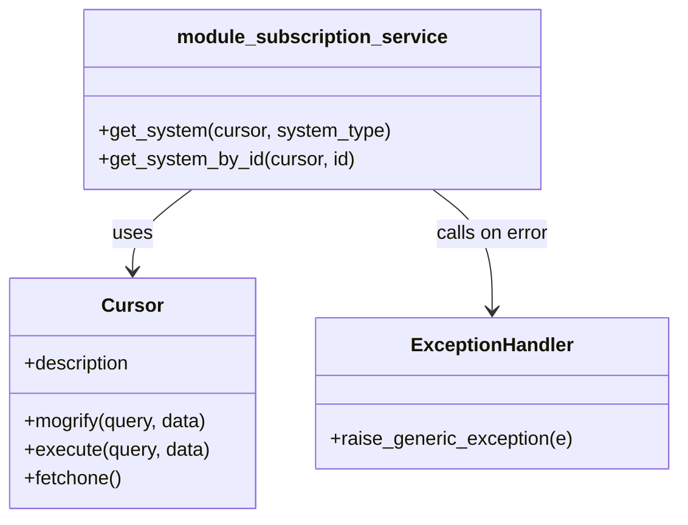

# Diagram: common/subscription_service/subscription_service/db/db_system.py


> Auto-generated by Obscura crawlers

## Diagram 1



### SVG

<svg id="container" width="560.9765625" xmlns="http://www.w3.org/2000/svg" class="classDiagram" height="432" viewBox="0 0 560.9765625 432" role="graphics-document document" aria-roledescription="class"><style>#container{font-family:"trebuchet ms",verdana,arial,sans-serif;font-size:16px;fill:#333;}@keyframes edge-animation-frame{from{stroke-dashoffset:0;}}@keyframes dash{to{stroke-dashoffset:0;}}#container .edge-animation-slow{stroke-dasharray:9,5!important;stroke-dashoffset:900;animation:dash 50s linear infinite;stroke-linecap:round;}#container .edge-animation-fast{stroke-dasharray:9,5!important;stroke-dashoffset:900;animation:dash 20s linear infinite;stroke-linecap:round;}#container .error-icon{fill:#552222;}#container .error-text{fill:#552222;stroke:#552222;}#container .edge-thickness-normal{stroke-width:1px;}#container .edge-thickness-thick{stroke-width:3.5px;}#container .edge-pattern-solid{stroke-dasharray:0;}#container .edge-thickness-invisible{stroke-width:0;fill:none;}#container .edge-pattern-dashed{stroke-dasharray:3;}#container .edge-pattern-dotted{stroke-dasharray:2;}#container .marker{fill:#333333;stroke:#333333;}#container .marker.cross{stroke:#333333;}#container svg{font-family:"trebuchet ms",verdana,arial,sans-serif;font-size:16px;}#container p{margin:0;}#container g.classGroup text{fill:#9370DB;stroke:none;font-family:"trebuchet ms",verdana,arial,sans-serif;font-size:10px;}#container g.classGroup text .title{font-weight:bolder;}#container .nodeLabel,#container .edgeLabel{color:#131300;}#container .edgeLabel .label rect{fill:#ECECFF;}#container .label text{fill:#131300;}#container .labelBkg{background:#ECECFF;}#container .edgeLabel .label span{background:#ECECFF;}#container .classTitle{font-weight:bolder;}#container .node rect,#container .node circle,#container .node ellipse,#container .node polygon,#container .node path{fill:#ECECFF;stroke:#9370DB;stroke-width:1px;}#container .divider{stroke:#9370DB;stroke-width:1;}#container g.clickable{cursor:pointer;}#container g.classGroup rect{fill:#ECECFF;stroke:#9370DB;}#container g.classGroup line{stroke:#9370DB;stroke-width:1;}#container .classLabel .box{stroke:none;stroke-width:0;fill:#ECECFF;opacity:0.5;}#container .classLabel .label{fill:#9370DB;font-size:10px;}#container .relation{stroke:#333333;stroke-width:1;fill:none;}#container .dashed-line{stroke-dasharray:3;}#container .dotted-line{stroke-dasharray:1 2;}#container #compositionStart,#container .composition{fill:#333333!important;stroke:#333333!important;stroke-width:1;}#container #compositionEnd,#container .composition{fill:#333333!important;stroke:#333333!important;stroke-width:1;}#container #dependencyStart,#container .dependency{fill:#333333!important;stroke:#333333!important;stroke-width:1;}#container #dependencyStart,#container .dependency{fill:#333333!important;stroke:#333333!important;stroke-width:1;}#container #extensionStart,#container .extension{fill:transparent!important;stroke:#333333!important;stroke-width:1;}#container #extensionEnd,#container .extension{fill:transparent!important;stroke:#333333!important;stroke-width:1;}#container #aggregationStart,#container .aggregation{fill:transparent!important;stroke:#333333!important;stroke-width:1;}#container #aggregationEnd,#container .aggregation{fill:transparent!important;stroke:#333333!important;stroke-width:1;}#container #lollipopStart,#container .lollipop{fill:#ECECFF!important;stroke:#333333!important;stroke-width:1;}#container #lollipopEnd,#container .lollipop{fill:#ECECFF!important;stroke:#333333!important;stroke-width:1;}#container .edgeTerminals{font-size:11px;line-height:initial;}#container .classTitleText{text-anchor:middle;font-size:18px;fill:#333;}#container .label-icon{display:inline-block;height:1em;overflow:visible;vertical-align:-0.125em;}#container .node .label-icon path{fill:currentColor;stroke:revert;stroke-width:revert;}#container :root{--mermaid-font-family:"trebuchet ms",verdana,arial,sans-serif;}</style><g><defs><marker id="container_class-aggregationStart" class="marker aggregation class" refX="18" refY="7" markerWidth="190" markerHeight="240" orient="auto"><path d="M 18,7 L9,13 L1,7 L9,1 Z"></path></marker></defs><defs><marker id="container_class-aggregationEnd" class="marker aggregation class" refX="1" refY="7" markerWidth="20" markerHeight="28" orient="auto"><path d="M 18,7 L9,13 L1,7 L9,1 Z"></path></marker></defs><defs><marker id="container_class-extensionStart" class="marker extension class" refX="18" refY="7" markerWidth="190" markerHeight="240" orient="auto"><path d="M 1,7 L18,13 V 1 Z"></path></marker></defs><defs><marker id="container_class-extensionEnd" class="marker extension class" refX="1" refY="7" markerWidth="20" markerHeight="28" orient="auto"><path d="M 1,1 V 13 L18,7 Z"></path></marker></defs><defs><marker id="container_class-compositionStart" class="marker composition class" refX="18" refY="7" markerWidth="190" markerHeight="240" orient="auto"><path d="M 18,7 L9,13 L1,7 L9,1 Z"></path></marker></defs><defs><marker id="container_class-compositionEnd" class="marker composition class" refX="1" refY="7" markerWidth="20" markerHeight="28" orient="auto"><path d="M 18,7 L9,13 L1,7 L9,1 Z"></path></marker></defs><defs><marker id="container_class-dependencyStart" class="marker dependency class" refX="6" refY="7" markerWidth="190" markerHeight="240" orient="auto"><path d="M 5,7 L9,13 L1,7 L9,1 Z"></path></marker></defs><defs><marker id="container_class-dependencyEnd" class="marker dependency class" refX="13" refY="7" markerWidth="20" markerHeight="28" orient="auto"><path d="M 18,7 L9,13 L14,7 L9,1 Z"></path></marker></defs><defs><marker id="container_class-lollipopStart" class="marker lollipop class" refX="13" refY="7" markerWidth="190" markerHeight="240" orient="auto"><circle stroke="black" fill="transparent" cx="7" cy="7" r="6"></circle></marker></defs><defs><marker id="container_class-lollipopEnd" class="marker lollipop class" refX="1" refY="7" markerWidth="190" markerHeight="240" orient="auto"><circle stroke="black" fill="transparent" cx="7" cy="7" r="6"></circle></marker></defs><g class="root"><g class="clusters"></g><g class="edgePaths"><path d="M159.123,158L150.933,164.167C142.744,170.333,126.364,182.667,118.174,194C109.984,205.333,109.984,215.667,109.984,220.833L109.984,226" id="id_module_subscription_service_Cursor_1" class="edge-thickness-normal edge-pattern-solid relation" style=";;;" data-edge="true" data-et="edge" data-id="id_module_subscription_service_Cursor_1" data-points="W3sieCI6MTU5LjEyMzA2NDMxMzYxNjA2LCJ5IjoxNTh9LHsieCI6MTA5Ljk4NDM3NSwieSI6MTk1fSx7IngiOjEwOS45ODQzNzUsInkiOjIzMn1d" marker-end="url(#container_class-dependencyEnd)"></path><path d="M358.334,158L366.524,164.167C374.714,170.333,391.093,182.667,399.283,199.5C407.473,216.333,407.473,237.667,407.473,248.333L407.473,259" id="id_module_subscription_service_ExceptionHandler_2" class="edge-thickness-normal edge-pattern-solid relation" style=";;;" data-edge="true" data-et="edge" data-id="id_module_subscription_service_ExceptionHandler_2" data-points="W3sieCI6MzU4LjMzMzk2NjkzNjM4Mzk0LCJ5IjoxNTh9LHsieCI6NDA3LjQ3MjY1NjI1LCJ5IjoxOTV9LHsieCI6NDA3LjQ3MjY1NjI1LCJ5IjoyNjV9XQ==" marker-end="url(#container_class-dependencyEnd)"></path></g><g class="edgeLabels"><g class="edgeLabel" transform="translate(109.984375, 195)"><g class="label" data-id="id_module_subscription_service_Cursor_1" transform="translate(-16.4921875, -12)"><foreignObject width="32.984375" height="24"><div xmlns="http://www.w3.org/1999/xhtml" class="labelBkg" style="display: table-cell; white-space: nowrap; line-height: 1.5; max-width: 200px; text-align: center;"><span class="edgeLabel"><p>uses</p></span></div></foreignObject></g></g><g class="edgeLabel" transform="translate(407.47265625, 195)"><g class="label" data-id="id_module_subscription_service_ExceptionHandler_2" transform="translate(-48.1015625, -12)"><foreignObject width="96.203125" height="24"><div xmlns="http://www.w3.org/1999/xhtml" class="labelBkg" style="display: table-cell; white-space: nowrap; line-height: 1.5; max-width: 200px; text-align: center;"><span class="edgeLabel"><p>calls on error</p></span></div></foreignObject></g></g></g><g class="nodes"><g class="node default" id="classId-module_subscription_service-0" transform="translate(258.728515625, 83)"><g class="basic label-container"><path d="M-186.90234375 -75 L186.90234375 -75 L186.90234375 75 L-186.90234375 75" stroke="none" stroke-width="0" fill="#ECECFF" style=""></path><path d="M-186.90234375 -75 C-111.67318239517162 -75, -36.444021040343245 -75, 186.90234375 -75 M-186.90234375 -75 C-41.46118413845991 -75, 103.97997547308017 -75, 186.90234375 -75 M186.90234375 -75 C186.90234375 -31.626932333145547, 186.90234375 11.746135333708907, 186.90234375 75 M186.90234375 -75 C186.90234375 -16.347318818870427, 186.90234375 42.305362362259146, 186.90234375 75 M186.90234375 75 C38.71316430132822 75, -109.47601514734356 75, -186.90234375 75 M186.90234375 75 C83.18805790497812 75, -20.526227940043754 75, -186.90234375 75 M-186.90234375 75 C-186.90234375 39.24420125740668, -186.90234375 3.488402514813359, -186.90234375 -75 M-186.90234375 75 C-186.90234375 23.825051825129314, -186.90234375 -27.34989634974137, -186.90234375 -75" stroke="#9370DB" stroke-width="1.3" fill="none" stroke-dasharray="0 0" style=""></path></g><g class="annotation-group text" transform="translate(0, -51)"></g><g class="label-group text" transform="translate(-107.4453125, -51)"><g class="label" style="font-weight: bolder" transform="translate(0,-12)"><foreignObject width="214.890625" height="24"><div xmlns="http://www.w3.org/1999/xhtml" style="display: table-cell; white-space: nowrap; line-height: 1.5; max-width: 263px; text-align: center;"><span class="nodeLabel markdown-node-label" style=""><p>module_subscription_service</p></span></div></foreignObject></g></g><g class="members-group text" transform="translate(-174.90234375, -3)"></g><g class="methods-group text" transform="translate(-174.90234375, 27)"><g class="label" style="" transform="translate(0,-12)"><foreignObject width="242.359375" height="24"><div xmlns="http://www.w3.org/1999/xhtml" style="display: table-cell; white-space: nowrap; line-height: 1.5; max-width: 300px; text-align: center;"><span class="nodeLabel markdown-node-label" style=""><p>+get_system(cursor, system_type)</p></span></div></foreignObject></g><g class="label" style="" transform="translate(0,12)"><foreignObject width="213.796875" height="24"><div xmlns="http://www.w3.org/1999/xhtml" style="display: table-cell; white-space: nowrap; line-height: 1.5; max-width: 271px; text-align: center;"><span class="nodeLabel markdown-node-label" style=""><p>+get_system_by_id(cursor, id)</p></span></div></foreignObject></g></g><g class="divider" style=""><path d="M-186.90234375 -27 C-44.45335917510204 -27, 97.99562539979593 -27, 186.90234375 -27 M-186.90234375 -27 C-71.50302480534972 -27, 43.89629413930055 -27, 186.90234375 -27" stroke="#9370DB" stroke-width="1.3" fill="none" stroke-dasharray="0 0" style=""></path></g><g class="divider" style=""><path d="M-186.90234375 -3 C-93.81370816891568 -3, -0.7250725878313631 -3, 186.90234375 -3 M-186.90234375 -3 C-57.68919286785854 -3, 71.52395801428293 -3, 186.90234375 -3" stroke="#9370DB" stroke-width="1.3" fill="none" stroke-dasharray="0 0" style=""></path></g></g><g class="node default" id="classId-Cursor-1" transform="translate(109.984375, 328)"><g class="basic label-container"><path d="M-101.984375 -96 L101.984375 -96 L101.984375 96 L-101.984375 96" stroke="none" stroke-width="0" fill="#ECECFF" style=""></path><path d="M-101.984375 -96 C-58.17737274543063 -96, -14.370370490861262 -96, 101.984375 -96 M-101.984375 -96 C-34.12763920469091 -96, 33.729096590618184 -96, 101.984375 -96 M101.984375 -96 C101.984375 -37.24530190042657, 101.984375 21.509396199146863, 101.984375 96 M101.984375 -96 C101.984375 -46.02634142224058, 101.984375 3.9473171555188458, 101.984375 96 M101.984375 96 C52.76335492344846 96, 3.542334846896921 96, -101.984375 96 M101.984375 96 C44.732922613456736 96, -12.518529773086527 96, -101.984375 96 M-101.984375 96 C-101.984375 22.21103108089838, -101.984375 -51.57793783820324, -101.984375 -96 M-101.984375 96 C-101.984375 56.18921127448253, -101.984375 16.378422548965062, -101.984375 -96" stroke="#9370DB" stroke-width="1.3" fill="none" stroke-dasharray="0 0" style=""></path></g><g class="annotation-group text" transform="translate(0, -72)"></g><g class="label-group text" transform="translate(-23.90625, -72)"><g class="label" style="font-weight: bolder" transform="translate(0,-12)"><foreignObject width="47.8125" height="24"><div xmlns="http://www.w3.org/1999/xhtml" style="display: table-cell; white-space: nowrap; line-height: 1.5; max-width: 98px; text-align: center;"><span class="nodeLabel markdown-node-label" style=""><p>Cursor</p></span></div></foreignObject></g></g><g class="members-group text" transform="translate(-89.984375, -24)"><g class="label" style="" transform="translate(0,-12)"><foreignObject width="90.59375" height="24"><div xmlns="http://www.w3.org/1999/xhtml" style="display: table-cell; white-space: nowrap; line-height: 1.5; max-width: 148px; text-align: center;"><span class="nodeLabel markdown-node-label" style=""><p>+description</p></span></div></foreignObject></g></g><g class="methods-group text" transform="translate(-89.984375, 24)"><g class="label" style="" transform="translate(0,-12)"><foreignObject width="155.390625" height="24"><div xmlns="http://www.w3.org/1999/xhtml" style="display: table-cell; white-space: nowrap; line-height: 1.5; max-width: 213px; text-align: center;"><span class="nodeLabel markdown-node-label" style=""><p>+mogrify(query, data)</p></span></div></foreignObject></g><g class="label" style="" transform="translate(0,12)"><foreignObject width="156.0625" height="24"><div xmlns="http://www.w3.org/1999/xhtml" style="display: table-cell; white-space: nowrap; line-height: 1.5; max-width: 213px; text-align: center;"><span class="nodeLabel markdown-node-label" style=""><p>+execute(query, data)</p></span></div></foreignObject></g><g class="label" style="" transform="translate(0,36)"><foreignObject width="82.046875" height="24"><div xmlns="http://www.w3.org/1999/xhtml" style="display: table-cell; white-space: nowrap; line-height: 1.5; max-width: 139px; text-align: center;"><span class="nodeLabel markdown-node-label" style=""><p>+fetchone()</p></span></div></foreignObject></g></g><g class="divider" style=""><path d="M-101.984375 -48 C-44.14785431505708 -48, 13.688666369885837 -48, 101.984375 -48 M-101.984375 -48 C-58.595470205313916 -48, -15.206565410627832 -48, 101.984375 -48" stroke="#9370DB" stroke-width="1.3" fill="none" stroke-dasharray="0 0" style=""></path></g><g class="divider" style=""><path d="M-101.984375 0 C-28.346319458397048 0, 45.291736083205905 0, 101.984375 0 M-101.984375 0 C-27.376585590087203 0, 47.231203819825595 0, 101.984375 0" stroke="#9370DB" stroke-width="1.3" fill="none" stroke-dasharray="0 0" style=""></path></g></g><g class="node default" id="classId-ExceptionHandler-2" transform="translate(407.47265625, 328)"><g class="basic label-container"><path d="M-145.50390625 -63 L145.50390625 -63 L145.50390625 63 L-145.50390625 63" stroke="none" stroke-width="0" fill="#ECECFF" style=""></path><path d="M-145.50390625 -63 C-47.98175082063416 -63, 49.54040460873168 -63, 145.50390625 -63 M-145.50390625 -63 C-30.583906016847607 -63, 84.33609421630479 -63, 145.50390625 -63 M145.50390625 -63 C145.50390625 -36.46072739881987, 145.50390625 -9.92145479763974, 145.50390625 63 M145.50390625 -63 C145.50390625 -31.971212787830886, 145.50390625 -0.9424255756617725, 145.50390625 63 M145.50390625 63 C70.32364259934288 63, -4.856621051314249 63, -145.50390625 63 M145.50390625 63 C30.969310543526078 63, -83.56528516294784 63, -145.50390625 63 M-145.50390625 63 C-145.50390625 17.334649884666653, -145.50390625 -28.330700230666693, -145.50390625 -63 M-145.50390625 63 C-145.50390625 17.17966381369598, -145.50390625 -28.640672372608037, -145.50390625 -63" stroke="#9370DB" stroke-width="1.3" fill="none" stroke-dasharray="0 0" style=""></path></g><g class="annotation-group text" transform="translate(0, -39)"></g><g class="label-group text" transform="translate(-64.7890625, -39)"><g class="label" style="font-weight: bolder" transform="translate(0,-12)"><foreignObject width="129.578125" height="24"><div xmlns="http://www.w3.org/1999/xhtml" style="display: table-cell; white-space: nowrap; line-height: 1.5; max-width: 180px; text-align: center;"><span class="nodeLabel markdown-node-label" style=""><p>ExceptionHandler</p></span></div></foreignObject></g></g><g class="members-group text" transform="translate(-133.50390625, 9)"></g><g class="methods-group text" transform="translate(-133.50390625, 39)"><g class="label" style="" transform="translate(0,-12)"><foreignObject width="202.21875" height="24"><div xmlns="http://www.w3.org/1999/xhtml" style="display: table-cell; white-space: nowrap; line-height: 1.5; max-width: 260px; text-align: center;"><span class="nodeLabel markdown-node-label" style=""><p>+raise_generic_exception(e)</p></span></div></foreignObject></g></g><g class="divider" style=""><path d="M-145.50390625 -15 C-74.4460943564613 -15, -3.3882824629226036 -15, 145.50390625 -15 M-145.50390625 -15 C-40.25531533312186 -15, 64.99327558375629 -15, 145.50390625 -15" stroke="#9370DB" stroke-width="1.3" fill="none" stroke-dasharray="0 0" style=""></path></g><g class="divider" style=""><path d="M-145.50390625 9 C-32.261498801684326 9, 80.98090864663135 9, 145.50390625 9 M-145.50390625 9 C-71.86254523291836 9, 1.778815784163271 9, 145.50390625 9" stroke="#9370DB" stroke-width="1.3" fill="none" stroke-dasharray="0 0" style=""></path></g></g></g></g></g></svg>

## Diagram 2

```mermaid
flowchart TD
    A[call get_system(cursor, system_type)] --> B[build data & query]
    B --> C[logging.info(cursor.mogrify(query, data).decode())]
    C --> D[cursor.execute(query, data)]
    D --> E[row = cursor.fetchone()]
    E --> F{row exists?}
    F -- yes --> G[column_names = [desc[0] for desc in cursor.description]]
    G --> H[result = dict(zip(column_names, row))]
    H --> I[return result]
    F -- no --> J[return None]
    D --> K{Exception}
    K -- occurs --> L[raise_generic_exception(e)]

    A2[call get_system_by_id(cursor, id)] --> B2[build data & query]
    B2 --> C2[logging.info(cursor.mogrify(query, data).decode())]
    C2 --> D2[cursor.execute(query, data)]
    D2 --> E2[row = cursor.fetchone()]
    E2 --> F2{row exists?}
    F2 -- yes --> G2[column_names = [desc[0] for desc in cursor.description]]
    G2 --> H2[result = dict(zip(column_names, row))]
    H2 --> I2[return result]
    F2 -- no --> J2[return None]
    D2 --> K2{Exception}
    K2 -- occurs --> L2[raise_generic_exception(e)]

    style K fill:#fdd,stroke:#f66,stroke-width:1px
    style K2 fill:#fdd,stroke:#f66,stroke-width:1px
```

> SVG rendering failed for this diagram.
