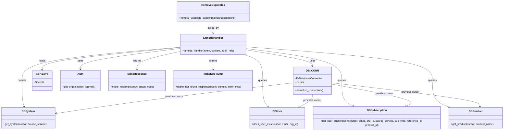

# Diagram: common/subscription_service/subscription_service/get_user_subscriptions.py


> Auto-generated by Obscura crawlers

## Diagram 1

```mermaid
flowchart TD
    Start([Start]) --> EstablishDB[Establish DB_CONN]
    EstablishDB --> GetParams[Get query & path parameters]
    GetParams --> CheckSystem{system exists?}
    CheckSystem -- No --> NotFound1[make_not_found_response<br/>(404)]
    CheckSystem -- Yes --> CheckUser{user exists?}
    CheckUser -- No --> EmptyOK[make_response({}, 200)]
    CheckUser -- Yes --> CheckProduct{type == UPDATE?}
    CheckProduct -- Yes --> GetProduct[get_product(product_name)]
    GetProduct -- NotFound --> NotFound2[make_not_found_response<br/>(404)]
    GetProduct -- Found --> SetProductId[set product_id]
    CheckProduct -- No --> SkipProduct[product_id = None]
    SetProductId --> FetchLegacy
    SkipProduct --> FetchLegacy
    FetchLegacy[db_subscription.get_user_subscriptions(..., product_id=None)] --> FetchUserSubs[db_subscription.get_user_subscriptions(..., product_id)]
    FetchUserSubs --> Combine[subscriptions = legacy + user_subscriptions]
    Combine --> RemoveDup[remove_duplicate_subscriptions]
    RemoveDup --> ReturnOK[make_response(subscriptions, 200)]
    NotFound1 --> End([End])
    EmptyOK --> End
    NotFound2 --> End
    ReturnOK --> End
```

> SVG rendering failed for this diagram.

## Diagram 2



### SVG

<svg id="container" width="3056.453125" xmlns="http://www.w3.org/2000/svg" class="classDiagram" height="784" viewBox="0 0 3056.453125 784" role="graphics-document document" aria-roledescription="class"><style>#container{font-family:"trebuchet ms",verdana,arial,sans-serif;font-size:16px;fill:#333;}@keyframes edge-animation-frame{from{stroke-dashoffset:0;}}@keyframes dash{to{stroke-dashoffset:0;}}#container .edge-animation-slow{stroke-dasharray:9,5!important;stroke-dashoffset:900;animation:dash 50s linear infinite;stroke-linecap:round;}#container .edge-animation-fast{stroke-dasharray:9,5!important;stroke-dashoffset:900;animation:dash 20s linear infinite;stroke-linecap:round;}#container .error-icon{fill:#552222;}#container .error-text{fill:#552222;stroke:#552222;}#container .edge-thickness-normal{stroke-width:1px;}#container .edge-thickness-thick{stroke-width:3.5px;}#container .edge-pattern-solid{stroke-dasharray:0;}#container .edge-thickness-invisible{stroke-width:0;fill:none;}#container .edge-pattern-dashed{stroke-dasharray:3;}#container .edge-pattern-dotted{stroke-dasharray:2;}#container .marker{fill:#333333;stroke:#333333;}#container .marker.cross{stroke:#333333;}#container svg{font-family:"trebuchet ms",verdana,arial,sans-serif;font-size:16px;}#container p{margin:0;}#container g.classGroup text{fill:#9370DB;stroke:none;font-family:"trebuchet ms",verdana,arial,sans-serif;font-size:10px;}#container g.classGroup text .title{font-weight:bolder;}#container .nodeLabel,#container .edgeLabel{color:#131300;}#container .edgeLabel .label rect{fill:#ECECFF;}#container .label text{fill:#131300;}#container .labelBkg{background:#ECECFF;}#container .edgeLabel .label span{background:#ECECFF;}#container .classTitle{font-weight:bolder;}#container .node rect,#container .node circle,#container .node ellipse,#container .node polygon,#container .node path{fill:#ECECFF;stroke:#9370DB;stroke-width:1px;}#container .divider{stroke:#9370DB;stroke-width:1;}#container g.clickable{cursor:pointer;}#container g.classGroup rect{fill:#ECECFF;stroke:#9370DB;}#container g.classGroup line{stroke:#9370DB;stroke-width:1;}#container .classLabel .box{stroke:none;stroke-width:0;fill:#ECECFF;opacity:0.5;}#container .classLabel .label{fill:#9370DB;font-size:10px;}#container .relation{stroke:#333333;stroke-width:1;fill:none;}#container .dashed-line{stroke-dasharray:3;}#container .dotted-line{stroke-dasharray:1 2;}#container #compositionStart,#container .composition{fill:#333333!important;stroke:#333333!important;stroke-width:1;}#container #compositionEnd,#container .composition{fill:#333333!important;stroke:#333333!important;stroke-width:1;}#container #dependencyStart,#container .dependency{fill:#333333!important;stroke:#333333!important;stroke-width:1;}#container #dependencyStart,#container .dependency{fill:#333333!important;stroke:#333333!important;stroke-width:1;}#container #extensionStart,#container .extension{fill:transparent!important;stroke:#333333!important;stroke-width:1;}#container #extensionEnd,#container .extension{fill:transparent!important;stroke:#333333!important;stroke-width:1;}#container #aggregationStart,#container .aggregation{fill:transparent!important;stroke:#333333!important;stroke-width:1;}#container #aggregationEnd,#container .aggregation{fill:transparent!important;stroke:#333333!important;stroke-width:1;}#container #lollipopStart,#container .lollipop{fill:#ECECFF!important;stroke:#333333!important;stroke-width:1;}#container #lollipopEnd,#container .lollipop{fill:#ECECFF!important;stroke:#333333!important;stroke-width:1;}#container .edgeTerminals{font-size:11px;line-height:initial;}#container .classTitleText{text-anchor:middle;font-size:18px;fill:#333;}#container .label-icon{display:inline-block;height:1em;overflow:visible;vertical-align:-0.125em;}#container .node .label-icon path{fill:currentColor;stroke:revert;stroke-width:revert;}#container :root{--mermaid-font-family:"trebuchet ms",verdana,arial,sans-serif;}</style><g><defs><marker id="container_class-aggregationStart" class="marker aggregation class" refX="18" refY="7" markerWidth="190" markerHeight="240" orient="auto"><path d="M 18,7 L9,13 L1,7 L9,1 Z"></path></marker></defs><defs><marker id="container_class-aggregationEnd" class="marker aggregation class" refX="1" refY="7" markerWidth="20" markerHeight="28" orient="auto"><path d="M 18,7 L9,13 L1,7 L9,1 Z"></path></marker></defs><defs><marker id="container_class-extensionStart" class="marker extension class" refX="18" refY="7" markerWidth="190" markerHeight="240" orient="auto"><path d="M 1,7 L18,13 V 1 Z"></path></marker></defs><defs><marker id="container_class-extensionEnd" class="marker extension class" refX="1" refY="7" markerWidth="20" markerHeight="28" orient="auto"><path d="M 1,1 V 13 L18,7 Z"></path></marker></defs><defs><marker id="container_class-compositionStart" class="marker composition class" refX="18" refY="7" markerWidth="190" markerHeight="240" orient="auto"><path d="M 18,7 L9,13 L1,7 L9,1 Z"></path></marker></defs><defs><marker id="container_class-compositionEnd" class="marker composition class" refX="1" refY="7" markerWidth="20" markerHeight="28" orient="auto"><path d="M 18,7 L9,13 L1,7 L9,1 Z"></path></marker></defs><defs><marker id="container_class-dependencyStart" class="marker dependency class" refX="6" refY="7" markerWidth="190" markerHeight="240" orient="auto"><path d="M 5,7 L9,13 L1,7 L9,1 Z"></path></marker></defs><defs><marker id="container_class-dependencyEnd" class="marker dependency class" refX="13" refY="7" markerWidth="20" markerHeight="28" orient="auto"><path d="M 18,7 L9,13 L14,7 L9,1 Z"></path></marker></defs><defs><marker id="container_class-lollipopStart" class="marker lollipop class" refX="13" refY="7" markerWidth="190" markerHeight="240" orient="auto"><circle stroke="black" fill="transparent" cx="7" cy="7" r="6"></circle></marker></defs><defs><marker id="container_class-lollipopEnd" class="marker lollipop class" refX="1" refY="7" markerWidth="190" markerHeight="240" orient="auto"><circle stroke="black" fill="transparent" cx="7" cy="7" r="6"></circle></marker></defs><g class="root"><g class="clusters"></g><g class="edgePaths"><path d="M1480.527,304.352L1547.789,315.46C1615.05,326.568,1749.573,348.784,1816.834,365.059C1884.096,381.333,1884.096,391.667,1884.096,396.833L1884.096,402" id="id_LambdaHandler_DB_CONN_1" class="edge-thickness-normal edge-pattern-solid relation" style=";;;" data-edge="true" data-et="edge" data-id="id_LambdaHandler_DB_CONN_1" data-points="W3sieCI6MTQ4MC41MjczNDM3NSwieSI6MzA0LjM1MTkzMzg2MzgyNDc0fSx7IngiOjE4ODQuMDk1NzAzMTI1LCJ5IjozNzF9LHsieCI6MTg4NC4wOTU3MDMxMjUsInkiOjQwOH1d" marker-end="url(#container_class-dependencyEnd)"></path><path d="M1076.621,296.195L976.687,308.663C876.753,321.13,676.884,346.065,576.95,367.199C477.016,388.333,477.016,405.667,477.016,414.333L477.016,423" id="id_LambdaHandler_Auth_2" class="edge-thickness-normal edge-pattern-solid relation" style=";;;" data-edge="true" data-et="edge" data-id="id_LambdaHandler_Auth_2" data-points="W3sieCI6MTA3Ni42MjEwOTM3NSwieSI6Mjk2LjE5NTA1NDU1Njc5NjF9LHsieCI6NDc3LjAxNTYyNSwieSI6MzcxfSx7IngiOjQ3Ny4wMTU2MjUsInkiOjQyOX1d" marker-end="url(#container_class-dependencyEnd)"></path><path d="M1076.621,288.576L918.775,302.313C760.928,316.051,445.236,343.525,287.389,377.429C129.543,411.333,129.543,451.667,129.543,492C129.543,532.333,129.543,572.667,131.539,598.066C133.535,623.465,137.527,633.929,139.523,639.162L141.519,644.394" id="id_LambdaHandler_DBSystem_3" class="edge-thickness-normal edge-pattern-solid relation" style=";;;" data-edge="true" data-et="edge" data-id="id_LambdaHandler_DBSystem_3" data-points="W3sieCI6MTA3Ni42MjEwOTM3NSwieSI6Mjg4LjU3NTk0NzEyOTM3NTI3fSx7IngiOjEyOS41NDI5Njg3NSwieSI6MzcxfSx7IngiOjEyOS41NDI5Njg3NSwieSI6NDkyfSx7IngiOjEyOS41NDI5Njg3NSwieSI6NjEzfSx7IngiOjE0My42NTc4OTA2MjUsInkiOjY1MH1d" marker-end="url(#container_class-dependencyEnd)"></path><path d="M1468.101,334L1486.652,340.167C1505.204,346.333,1542.307,358.667,1560.859,385C1579.41,411.333,1579.41,451.667,1579.41,492C1579.41,532.333,1579.41,572.667,1584.236,598.253C1589.062,623.84,1598.713,634.679,1603.539,640.099L1608.365,645.519" id="id_LambdaHandler_DBUser_4" class="edge-thickness-normal edge-pattern-solid relation" style=";;;" data-edge="true" data-et="edge" data-id="id_LambdaHandler_DBUser_4" data-points="W3sieCI6MTQ2OC4xMDA4NTkzNzUsInkiOjMzNH0seyJ4IjoxNTc5LjQxMDE1NjI1LCJ5IjozNzF9LHsieCI6MTU3OS40MTAxNTYyNSwieSI6NDkyfSx7IngiOjE1NzkuNDEwMTU2MjUsInkiOjYxM30seyJ4IjoxNjEyLjM1NDYwOTM3NSwieSI6NjUwfV0=" marker-end="url(#container_class-dependencyEnd)"></path><path d="M1480.527,286.06L1670.361,300.217C1860.195,314.374,2239.862,342.687,2429.696,377.01C2619.529,411.333,2619.529,451.667,2619.529,492C2619.529,532.333,2619.529,572.667,2635.577,598.88C2651.625,625.093,2683.72,637.185,2699.767,643.232L2715.815,649.278" id="id_LambdaHandler_DBProduct_5" class="edge-thickness-normal edge-pattern-solid relation" style=";;;" data-edge="true" data-et="edge" data-id="id_LambdaHandler_DBProduct_5" data-points="W3sieCI6MTQ4MC41MjczNDM3NSwieSI6Mjg2LjA2MDM5NDUxMjQyMzR9LHsieCI6MjYxOS41MjkyOTY4NzUsInkiOjM3MX0seyJ4IjoyNjE5LjUyOTI5Njg3NSwieSI6NDkyfSx7IngiOjI2MTkuNTI5Mjk2ODc1LCJ5Ijo2MTN9LHsieCI6MjcyMS40Mjk2ODc1LCJ5Ijo2NTEuMzkzMjcxMDc3NTU0OH1d" marker-end="url(#container_class-dependencyEnd)"></path><path d="M1480.527,296.772L1577.468,309.144C1674.41,321.515,1868.292,346.257,1965.233,378.795C2062.174,411.333,2062.174,451.667,2062.174,492C2062.174,532.333,2062.174,572.667,2074.565,598.579C2086.956,624.492,2111.738,635.984,2124.129,641.73L2136.52,647.476" id="id_LambdaHandler_DBSubscription_6" class="edge-thickness-normal edge-pattern-solid relation" style=";;;" data-edge="true" data-et="edge" data-id="id_LambdaHandler_DBSubscription_6" data-points="W3sieCI6MTQ4MC41MjczNDM3NSwieSI6Mjk2Ljc3MjQ4OTIzODYxNDg3fSx7IngiOjIwNjIuMTczODI4MTI1LCJ5IjozNzF9LHsieCI6MjA2Mi4xNzM4MjgxMjUsInkiOjQ5Mn0seyJ4IjoyMDYyLjE3MzgyODEyNSwieSI6NjEzfSx7IngiOjIxNDEuOTYzMDI3MzQzNzUsInkiOjY1MH1d" marker-end="url(#container_class-dependencyEnd)"></path><path d="M1076.621,314.968L1033.727,324.307C990.832,333.645,905.043,352.323,862.148,370.328C819.254,388.333,819.254,405.667,819.254,414.333L819.254,423" id="id_LambdaHandler_MakeResponse_7" class="edge-thickness-normal edge-pattern-solid relation" style=";;;" data-edge="true" data-et="edge" data-id="id_LambdaHandler_MakeResponse_7" data-points="W3sieCI6MTA3Ni42MjEwOTM3NSwieSI6MzE0Ljk2NzgxOTI5ODIxNTh9LHsieCI6ODE5LjI1MzkwNjI1LCJ5IjozNzF9LHsieCI6ODE5LjI1MzkwNjI1LCJ5Ijo0Mjl9XQ==" marker-end="url(#container_class-dependencyEnd)"></path><path d="M1278.574,334L1278.574,340.167C1278.574,346.333,1278.574,358.667,1278.574,373.5C1278.574,388.333,1278.574,405.667,1278.574,414.333L1278.574,423" id="id_LambdaHandler_MakeNotFound_8" class="edge-thickness-normal edge-pattern-solid relation" style=";;;" data-edge="true" data-et="edge" data-id="id_LambdaHandler_MakeNotFound_8" data-points="W3sieCI6MTI3OC41NzQyMTg3NSwieSI6MzM0fSx7IngiOjEyNzguNTc0MjE4NzUsInkiOjM3MX0seyJ4IjoxMjc4LjU3NDIxODc1LCJ5Ijo0Mjl9XQ==" marker-end="url(#container_class-dependencyEnd)"></path><path d="M1076.621,290.608L938.625,304.007C800.629,317.406,524.637,344.203,386.641,366.768C248.645,389.333,248.645,407.667,248.645,416.833L248.645,426" id="id_LambdaHandler_SECRETS_9" class="edge-thickness-normal edge-pattern-solid relation" style=";;;" data-edge="true" data-et="edge" data-id="id_LambdaHandler_SECRETS_9" data-points="W3sieCI6MTA3Ni42MjEwOTM3NSwieSI6MjkwLjYwODQzODA3NjAyMTU3fSx7IngiOjI0OC42NDQ1MzEyNSwieSI6MzcxfSx7IngiOjI0OC42NDQ1MzEyNSwieSI6NDMyfV0=" marker-end="url(#container_class-dependencyEnd)"></path><path d="M1278.574,134L1278.574,140.167C1278.574,146.333,1278.574,158.667,1278.574,170C1278.574,181.333,1278.574,191.667,1278.574,196.833L1278.574,202" id="id_RemoveDuplicates_LambdaHandler_10" class="edge-thickness-normal edge-pattern-solid relation" style=";;;" data-edge="true" data-et="edge" data-id="id_RemoveDuplicates_LambdaHandler_10" data-points="W3sieCI6MTI3OC41NzQyMTg3NSwieSI6MTM0fSx7IngiOjEyNzguNTc0MjE4NzUsInkiOjE3MX0seyJ4IjoxMjc4LjU3NDIxODc1LCJ5IjoyMDh9XQ==" marker-end="url(#container_class-dependencyEnd)"></path><path d="M1768.26,505.613L1615.963,523.511C1463.665,541.409,1159.071,577.204,919.914,607.749C680.758,638.294,507.039,663.589,420.18,676.236L333.32,688.883" id="id_DB_CONN_DBSystem_11" class="edge-thickness-normal edge-pattern-solid relation" style=";;;" data-edge="true" data-et="edge" data-id="id_DB_CONN_DBSystem_11" data-points="W3sieCI6MTc2OC4yNTk3NjU2MjUsInkiOjUwNS42MTI5NDQ3MTM3MDQ0NX0seyJ4Ijo4NTQuNDc2NTYyNSwieSI6NjEzfSx7IngiOjMyNy4zODI4MTI1LCJ5Ijo2ODkuNzQ3OTgyMjc3MDI2N31d" marker-end="url(#container_class-dependencyEnd)"></path><path d="M1884.096,576L1884.096,582.167C1884.096,588.333,1884.096,600.667,1871.705,612.579C1859.314,624.492,1834.532,635.984,1822.141,641.73L1809.75,647.476" id="id_DB_CONN_DBUser_12" class="edge-thickness-normal edge-pattern-solid relation" style=";;;" data-edge="true" data-et="edge" data-id="id_DB_CONN_DBUser_12" data-points="W3sieCI6MTg4NC4wOTU3MDMxMjUsInkiOjU3Nn0seyJ4IjoxODg0LjA5NTcwMzEyNSwieSI6NjEzfSx7IngiOjE4MDQuMzA2NTAzOTA2MjQ5OSwieSI6NjUwfV0=" marker-end="url(#container_class-dependencyEnd)"></path><path d="M1999.932,513.264L2090.482,529.887C2181.032,546.51,2362.132,579.755,2437.251,602.191C2512.37,624.628,2481.507,636.256,2466.076,642.07L2450.645,647.885" id="id_DB_CONN_DBSubscription_13" class="edge-thickness-normal edge-pattern-solid relation" style=";;;" data-edge="true" data-et="edge" data-id="id_DB_CONN_DBSubscription_13" data-points="W3sieCI6MTk5OS45MzE2NDA2MjUsInkiOjUxMy4yNjQ0MDI0MjAzMDU5fSx7IngiOjI1NDMuMjMyNDIxODc1LCJ5Ijo2MTN9LHsieCI6MjQ0NS4wMjk5NDE0MDYyNSwieSI6NjUwfV0=" marker-end="url(#container_class-dependencyEnd)"></path><path d="M1999.932,505.49L2153.791,523.408C2307.651,541.327,2615.37,577.163,2767.234,600.314C2919.098,623.465,2915.106,633.929,2913.11,639.162L2911.113,644.394" id="id_DB_CONN_DBProduct_14" class="edge-thickness-normal edge-pattern-solid relation" style=";;;" data-edge="true" data-et="edge" data-id="id_DB_CONN_DBProduct_14" data-points="W3sieCI6MTk5OS45MzE2NDA2MjUsInkiOjUwNS40OTAxMTMwNzEzNDg3fSx7IngiOjI5MjMuMDg5ODQzNzUsInkiOjYxM30seyJ4IjoyOTA4Ljk3NDkyMTg3NSwieSI6NjUwfV0=" marker-end="url(#container_class-dependencyEnd)"></path></g><g class="edgeLabels"><g class="edgeLabel" transform="translate(1884.095703125, 371)"><g class="label" data-id="id_LambdaHandler_DB_CONN_1" transform="translate(-16.4921875, -12)"><foreignObject width="32.984375" height="24"><div xmlns="http://www.w3.org/1999/xhtml" class="labelBkg" style="display: table-cell; white-space: nowrap; line-height: 1.5; max-width: 200px; text-align: center;"><span class="edgeLabel"><p>uses</p></span></div></foreignObject></g></g><g class="edgeLabel" transform="translate(477.015625, 371)"><g class="label" data-id="id_LambdaHandler_Auth_2" transform="translate(-16.4921875, -12)"><foreignObject width="32.984375" height="24"><div xmlns="http://www.w3.org/1999/xhtml" class="labelBkg" style="display: table-cell; white-space: nowrap; line-height: 1.5; max-width: 200px; text-align: center;"><span class="edgeLabel"><p>uses</p></span></div></foreignObject></g></g><g class="edgeLabel" transform="translate(129.54296875, 492)"><g class="label" data-id="id_LambdaHandler_DBSystem_3" transform="translate(-27.2421875, -12)"><foreignObject width="54.484375" height="24"><div xmlns="http://www.w3.org/1999/xhtml" class="labelBkg" style="display: table-cell; white-space: nowrap; line-height: 1.5; max-width: 200px; text-align: center;"><span class="edgeLabel"><p>queries</p></span></div></foreignObject></g></g><g class="edgeLabel" transform="translate(1579.41015625, 492)"><g class="label" data-id="id_LambdaHandler_DBUser_4" transform="translate(-27.2421875, -12)"><foreignObject width="54.484375" height="24"><div xmlns="http://www.w3.org/1999/xhtml" class="labelBkg" style="display: table-cell; white-space: nowrap; line-height: 1.5; max-width: 200px; text-align: center;"><span class="edgeLabel"><p>queries</p></span></div></foreignObject></g></g><g class="edgeLabel" transform="translate(2619.529296875, 492)"><g class="label" data-id="id_LambdaHandler_DBProduct_5" transform="translate(-27.2421875, -12)"><foreignObject width="54.484375" height="24"><div xmlns="http://www.w3.org/1999/xhtml" class="labelBkg" style="display: table-cell; white-space: nowrap; line-height: 1.5; max-width: 200px; text-align: center;"><span class="edgeLabel"><p>queries</p></span></div></foreignObject></g></g><g class="edgeLabel" transform="translate(2062.173828125, 492)"><g class="label" data-id="id_LambdaHandler_DBSubscription_6" transform="translate(-27.2421875, -12)"><foreignObject width="54.484375" height="24"><div xmlns="http://www.w3.org/1999/xhtml" class="labelBkg" style="display: table-cell; white-space: nowrap; line-height: 1.5; max-width: 200px; text-align: center;"><span class="edgeLabel"><p>queries</p></span></div></foreignObject></g></g><g class="edgeLabel" transform="translate(819.25390625, 371)"><g class="label" data-id="id_LambdaHandler_MakeResponse_7" transform="translate(-26.265625, -12)"><foreignObject width="52.53125" height="24"><div xmlns="http://www.w3.org/1999/xhtml" class="labelBkg" style="display: table-cell; white-space: nowrap; line-height: 1.5; max-width: 200px; text-align: center;"><span class="edgeLabel"><p>returns</p></span></div></foreignObject></g></g><g class="edgeLabel" transform="translate(1278.57421875, 371)"><g class="label" data-id="id_LambdaHandler_MakeNotFound_8" transform="translate(-26.265625, -12)"><foreignObject width="52.53125" height="24"><div xmlns="http://www.w3.org/1999/xhtml" class="labelBkg" style="display: table-cell; white-space: nowrap; line-height: 1.5; max-width: 200px; text-align: center;"><span class="edgeLabel"><p>returns</p></span></div></foreignObject></g></g><g class="edgeLabel" transform="translate(248.64453125, 371)"><g class="label" data-id="id_LambdaHandler_SECRETS_9" transform="translate(-20.0078125, -12)"><foreignObject width="40.015625" height="24"><div xmlns="http://www.w3.org/1999/xhtml" class="labelBkg" style="display: table-cell; white-space: nowrap; line-height: 1.5; max-width: 200px; text-align: center;"><span class="edgeLabel"><p>reads</p></span></div></foreignObject></g></g><g class="edgeLabel" transform="translate(1278.57421875, 171)"><g class="label" data-id="id_RemoveDuplicates_LambdaHandler_10" transform="translate(-34.625, -12)"><foreignObject width="69.25" height="24"><div xmlns="http://www.w3.org/1999/xhtml" class="labelBkg" style="display: table-cell; white-space: nowrap; line-height: 1.5; max-width: 200px; text-align: center;"><span class="edgeLabel"><p>called_by</p></span></div></foreignObject></g></g><g class="edgeLabel" transform="translate(1046.86245, 590.39097)"><g class="label" data-id="id_DB_CONN_DBSystem_11" transform="translate(-56.296875, -12)"><foreignObject width="112.59375" height="24"><div xmlns="http://www.w3.org/1999/xhtml" class="labelBkg" style="display: table-cell; white-space: nowrap; line-height: 1.5; max-width: 200px; text-align: center;"><span class="edgeLabel"><p>provides cursor</p></span></div></foreignObject></g></g><g class="edgeLabel" transform="translate(1884.095703125, 613)"><g class="label" data-id="id_DB_CONN_DBUser_12" transform="translate(-56.296875, -12)"><foreignObject width="112.59375" height="24"><div xmlns="http://www.w3.org/1999/xhtml" class="labelBkg" style="display: table-cell; white-space: nowrap; line-height: 1.5; max-width: 200px; text-align: center;"><span class="edgeLabel"><p>provides cursor</p></span></div></foreignObject></g></g><g class="edgeLabel" transform="translate(2323.19043, 572.60613)"><g class="label" data-id="id_DB_CONN_DBSubscription_13" transform="translate(-56.296875, -12)"><foreignObject width="112.59375" height="24"><div xmlns="http://www.w3.org/1999/xhtml" class="labelBkg" style="display: table-cell; white-space: nowrap; line-height: 1.5; max-width: 200px; text-align: center;"><span class="edgeLabel"><p>provides cursor</p></span></div></foreignObject></g></g><g class="edgeLabel" transform="translate(2481.17827, 561.53551)"><g class="label" data-id="id_DB_CONN_DBProduct_14" transform="translate(-56.296875, -12)"><foreignObject width="112.59375" height="24"><div xmlns="http://www.w3.org/1999/xhtml" class="labelBkg" style="display: table-cell; white-space: nowrap; line-height: 1.5; max-width: 200px; text-align: center;"><span class="edgeLabel"><p>provides cursor</p></span></div></foreignObject></g></g></g><g class="nodes"><g class="node default" id="classId-LambdaHandler-0" transform="translate(1278.57421875, 271)"><g class="basic label-container"><path d="M-201.953125 -63 L201.953125 -63 L201.953125 63 L-201.953125 63" stroke="none" stroke-width="0" fill="#ECECFF" style=""></path><path d="M-201.953125 -63 C-75.87183678623677 -63, 50.20945142752646 -63, 201.953125 -63 M-201.953125 -63 C-71.25322767755912 -63, 59.44666964488175 -63, 201.953125 -63 M201.953125 -63 C201.953125 -36.653431294070174, 201.953125 -10.306862588140355, 201.953125 63 M201.953125 -63 C201.953125 -24.845805965640217, 201.953125 13.308388068719566, 201.953125 63 M201.953125 63 C50.87761934154551 63, -100.19788631690898 63, -201.953125 63 M201.953125 63 C93.67282521016017 63, -14.60747457967966 63, -201.953125 63 M-201.953125 63 C-201.953125 33.87220085304024, -201.953125 4.744401706080474, -201.953125 -63 M-201.953125 63 C-201.953125 16.949009160042117, -201.953125 -29.101981679915767, -201.953125 -63" stroke="#9370DB" stroke-width="1.3" fill="none" stroke-dasharray="0 0" style=""></path></g><g class="annotation-group text" transform="translate(0, -39)"></g><g class="label-group text" transform="translate(-58.21875, -39)"><g class="label" style="font-weight: bolder" transform="translate(0,-12)"><foreignObject width="116.4375" height="24"><div xmlns="http://www.w3.org/1999/xhtml" style="display: table-cell; white-space: nowrap; line-height: 1.5; max-width: 167px; text-align: center;"><span class="nodeLabel markdown-node-label" style=""><p>LambdaHandler</p></span></div></foreignObject></g></g><g class="members-group text" transform="translate(-189.953125, 9)"></g><g class="methods-group text" transform="translate(-189.953125, 39)"><g class="label" style="" transform="translate(0,-12)"><foreignObject width="321.6875" height="24"><div xmlns="http://www.w3.org/1999/xhtml" style="display: table-cell; white-space: nowrap; line-height: 1.5; max-width: 379px; text-align: center;"><span class="nodeLabel markdown-node-label" style=""><p>+lambda_handler(event, context, audit_refs)</p></span></div></foreignObject></g></g><g class="divider" style=""><path d="M-201.953125 -15 C-76.53089973379164 -15, 48.891325532416715 -15, 201.953125 -15 M-201.953125 -15 C-73.50906818014451 -15, 54.93498863971098 -15, 201.953125 -15" stroke="#9370DB" stroke-width="1.3" fill="none" stroke-dasharray="0 0" style=""></path></g><g class="divider" style=""><path d="M-201.953125 9 C-84.22258753126077 9, 33.50794993747846 9, 201.953125 9 M-201.953125 9 C-66.29505306506258 9, 69.36301886987485 9, 201.953125 9" stroke="#9370DB" stroke-width="1.3" fill="none" stroke-dasharray="0 0" style=""></path></g></g><g class="node default" id="classId-RemoveDuplicates-1" transform="translate(1278.57421875, 71)"><g class="basic label-container"><path d="M-221.890625 -63 L221.890625 -63 L221.890625 63 L-221.890625 63" stroke="none" stroke-width="0" fill="#ECECFF" style=""></path><path d="M-221.890625 -63 C-105.34928596349538 -63, 11.192053073009248 -63, 221.890625 -63 M-221.890625 -63 C-84.215558741633 -63, 53.45950751673399 -63, 221.890625 -63 M221.890625 -63 C221.890625 -13.543552331911833, 221.890625 35.912895336176334, 221.890625 63 M221.890625 -63 C221.890625 -20.419496486277517, 221.890625 22.161007027444967, 221.890625 63 M221.890625 63 C58.21085199781186 63, -105.46892100437628 63, -221.890625 63 M221.890625 63 C108.11883352535837 63, -5.6529579492832625 63, -221.890625 63 M-221.890625 63 C-221.890625 14.350917763638215, -221.890625 -34.29816447272357, -221.890625 -63 M-221.890625 63 C-221.890625 16.282480504397924, -221.890625 -30.435038991204152, -221.890625 -63" stroke="#9370DB" stroke-width="1.3" fill="none" stroke-dasharray="0 0" style=""></path></g><g class="annotation-group text" transform="translate(0, -39)"></g><g class="label-group text" transform="translate(-67.609375, -39)"><g class="label" style="font-weight: bolder" transform="translate(0,-12)"><foreignObject width="135.21875" height="24"><div xmlns="http://www.w3.org/1999/xhtml" style="display: table-cell; white-space: nowrap; line-height: 1.5; max-width: 184px; text-align: center;"><span class="nodeLabel markdown-node-label" style=""><p>RemoveDuplicates</p></span></div></foreignObject></g></g><g class="members-group text" transform="translate(-209.890625, 9)"></g><g class="methods-group text" transform="translate(-209.890625, 39)"><g class="label" style="" transform="translate(0,-12)"><foreignObject width="352.171875" height="24"><div xmlns="http://www.w3.org/1999/xhtml" style="display: table-cell; white-space: nowrap; line-height: 1.5; max-width: 410px; text-align: center;"><span class="nodeLabel markdown-node-label" style=""><p>+remove_duplicate_subscriptions(subscriptions)</p></span></div></foreignObject></g></g><g class="divider" style=""><path d="M-221.890625 -15 C-92.04090885399211 -15, 37.808807292015786 -15, 221.890625 -15 M-221.890625 -15 C-127.17657522667763 -15, -32.462525453355255 -15, 221.890625 -15" stroke="#9370DB" stroke-width="1.3" fill="none" stroke-dasharray="0 0" style=""></path></g><g class="divider" style=""><path d="M-221.890625 9 C-49.86429468038796 9, 122.16203563922409 9, 221.890625 9 M-221.890625 9 C-56.86126336685942 9, 108.16809826628116 9, 221.890625 9" stroke="#9370DB" stroke-width="1.3" fill="none" stroke-dasharray="0 0" style=""></path></g></g><g class="node default" id="classId-DB_CONN-2" transform="translate(1884.095703125, 492)"><g class="basic label-container"><path d="M-115.8359375 -84 L115.8359375 -84 L115.8359375 84 L-115.8359375 84" stroke="none" stroke-width="0" fill="#ECECFF" style=""></path><path d="M-115.8359375 -84 C-31.917300574753 -84, 52.001336350494 -84, 115.8359375 -84 M-115.8359375 -84 C-35.70755627549762 -84, 44.42082494900475 -84, 115.8359375 -84 M115.8359375 -84 C115.8359375 -19.02777075618384, 115.8359375 45.94445848763232, 115.8359375 84 M115.8359375 -84 C115.8359375 -33.920913474135936, 115.8359375 16.158173051728127, 115.8359375 84 M115.8359375 84 C55.30903056685648 84, -5.217876366287044 84, -115.8359375 84 M115.8359375 84 C27.91042893897486 84, -60.01507962205028 84, -115.8359375 84 M-115.8359375 84 C-115.8359375 35.45353911587129, -115.8359375 -13.092921768257426, -115.8359375 -84 M-115.8359375 84 C-115.8359375 30.939551581682167, -115.8359375 -22.120896836635666, -115.8359375 -84" stroke="#9370DB" stroke-width="1.3" fill="none" stroke-dasharray="0 0" style=""></path></g><g class="annotation-group text" transform="translate(0, -60)"></g><g class="label-group text" transform="translate(-34.40625, -60)"><g class="label" style="font-weight: bolder" transform="translate(0,-12)"><foreignObject width="68.8125" height="24"><div xmlns="http://www.w3.org/1999/xhtml" style="display: table-cell; white-space: nowrap; line-height: 1.5; max-width: 119px; text-align: center;"><span class="nodeLabel markdown-node-label" style=""><p>DB_CONN</p></span></div></foreignObject></g></g><g class="members-group text" transform="translate(-103.8359375, -12)"><g class="label" style="" transform="translate(0,-12)"><foreignObject width="163.078125" height="24"><div xmlns="http://www.w3.org/1999/xhtml" style="display: table-cell; white-space: nowrap; line-height: 1.5; max-width: 221px; text-align: center;"><span class="nodeLabel markdown-node-label" style=""><p>-FvDatabaseConnector</p></span></div></foreignObject></g><g class="label" style="" transform="translate(0,12)"><foreignObject width="53.71875" height="24"><div xmlns="http://www.w3.org/1999/xhtml" style="display: table-cell; white-space: nowrap; line-height: 1.5; max-width: 112px; text-align: center;"><span class="nodeLabel markdown-node-label" style=""><p>+cursor</p></span></div></foreignObject></g></g><g class="methods-group text" transform="translate(-103.8359375, 60)"><g class="label" style="" transform="translate(0,-12)"><foreignObject width="173.265625" height="24"><div xmlns="http://www.w3.org/1999/xhtml" style="display: table-cell; white-space: nowrap; line-height: 1.5; max-width: 231px; text-align: center;"><span class="nodeLabel markdown-node-label" style=""><p>+establish_connection()</p></span></div></foreignObject></g></g><g class="divider" style=""><path d="M-115.8359375 -36 C-36.59284580368927 -36, 42.650245892621456 -36, 115.8359375 -36 M-115.8359375 -36 C-35.673915080408236 -36, 44.48810733918353 -36, 115.8359375 -36" stroke="#9370DB" stroke-width="1.3" fill="none" stroke-dasharray="0 0" style=""></path></g><g class="divider" style=""><path d="M-115.8359375 36 C-26.808395287477936 36, 62.21914692504413 36, 115.8359375 36 M-115.8359375 36 C-55.24828024496368 36, 5.3393770100726385 36, 115.8359375 36" stroke="#9370DB" stroke-width="1.3" fill="none" stroke-dasharray="0 0" style=""></path></g></g><g class="node default" id="classId-SECRETS-3" transform="translate(248.64453125, 492)"><g class="basic label-container"><path d="M-56.859375 -60 L56.859375 -60 L56.859375 60 L-56.859375 60" stroke="none" stroke-width="0" fill="#ECECFF" style=""></path><path d="M-56.859375 -60 C-24.306196965839646 -60, 8.246981068320707 -60, 56.859375 -60 M-56.859375 -60 C-27.87459048127934 -60, 1.1101940374413175 -60, 56.859375 -60 M56.859375 -60 C56.859375 -35.77908863392274, 56.859375 -11.558177267845487, 56.859375 60 M56.859375 -60 C56.859375 -17.375384373193917, 56.859375 25.249231253612166, 56.859375 60 M56.859375 60 C13.957403176961577 60, -28.944568646076846 60, -56.859375 60 M56.859375 60 C31.837270574981723 60, 6.815166149963446 60, -56.859375 60 M-56.859375 60 C-56.859375 27.769606616957205, -56.859375 -4.46078676608559, -56.859375 -60 M-56.859375 60 C-56.859375 28.72423563790489, -56.859375 -2.55152872419022, -56.859375 -60" stroke="#9370DB" stroke-width="1.3" fill="none" stroke-dasharray="0 0" style=""></path></g><g class="annotation-group text" transform="translate(0, -36)"></g><g class="label-group text" transform="translate(-31.15625, -36)"><g class="label" style="font-weight: bolder" transform="translate(0,-12)"><foreignObject width="62.3125" height="24"><div xmlns="http://www.w3.org/1999/xhtml" style="display: table-cell; white-space: nowrap; line-height: 1.5; max-width: 111px; text-align: center;"><span class="nodeLabel markdown-node-label" style=""><p>SECRETS</p></span></div></foreignObject></g></g><g class="members-group text" transform="translate(-44.859375, 12)"><g class="label" style="" transform="translate(0,-12)"><foreignObject width="58.5625" height="24"><div xmlns="http://www.w3.org/1999/xhtml" style="display: table-cell; white-space: nowrap; line-height: 1.5; max-width: 116px; text-align: center;"><span class="nodeLabel markdown-node-label" style=""><p>-Secrets</p></span></div></foreignObject></g></g><g class="methods-group text" transform="translate(-44.859375, 60)"></g><g class="divider" style=""><path d="M-56.859375 -12 C-33.403510231280535 -12, -9.947645462561077 -12, 56.859375 -12 M-56.859375 -12 C-27.16599417288054 -12, 2.527386654238917 -12, 56.859375 -12" stroke="#9370DB" stroke-width="1.3" fill="none" stroke-dasharray="0 0" style=""></path></g><g class="divider" style=""><path d="M-56.859375 36 C-14.302715538774642 36, 28.253943922450716 36, 56.859375 36 M-56.859375 36 C-33.2449452004586 36, -9.630515400917211 36, 56.859375 36" stroke="#9370DB" stroke-width="1.3" fill="none" stroke-dasharray="0 0" style=""></path></g></g><g class="node default" id="classId-DBSystem-4" transform="translate(167.69140625, 713)"><g class="basic label-container"><path d="M-159.69140625 -63 L159.69140625 -63 L159.69140625 63 L-159.69140625 63" stroke="none" stroke-width="0" fill="#ECECFF" style=""></path><path d="M-159.69140625 -63 C-44.969210858101675 -63, 69.75298453379665 -63, 159.69140625 -63 M-159.69140625 -63 C-74.25802018718788 -63, 11.175365875624237 -63, 159.69140625 -63 M159.69140625 -63 C159.69140625 -37.15811505485692, 159.69140625 -11.31623010971385, 159.69140625 63 M159.69140625 -63 C159.69140625 -13.217393939696393, 159.69140625 36.565212120607214, 159.69140625 63 M159.69140625 63 C90.32322224218309 63, 20.955038234366185 63, -159.69140625 63 M159.69140625 63 C36.5156736342346 63, -86.6600589815308 63, -159.69140625 63 M-159.69140625 63 C-159.69140625 13.359789943589547, -159.69140625 -36.280420112820906, -159.69140625 -63 M-159.69140625 63 C-159.69140625 26.457538854712965, -159.69140625 -10.08492229057407, -159.69140625 -63" stroke="#9370DB" stroke-width="1.3" fill="none" stroke-dasharray="0 0" style=""></path></g><g class="annotation-group text" transform="translate(0, -39)"></g><g class="label-group text" transform="translate(-36.5390625, -39)"><g class="label" style="font-weight: bolder" transform="translate(0,-12)"><foreignObject width="73.078125" height="24"><div xmlns="http://www.w3.org/1999/xhtml" style="display: table-cell; white-space: nowrap; line-height: 1.5; max-width: 121px; text-align: center;"><span class="nodeLabel markdown-node-label" style=""><p>DBSystem</p></span></div></foreignObject></g></g><g class="members-group text" transform="translate(-147.69140625, 9)"></g><g class="methods-group text" transform="translate(-147.69140625, 39)"><g class="label" style="" transform="translate(0,-12)"><foreignObject width="258.84375" height="24"><div xmlns="http://www.w3.org/1999/xhtml" style="display: table-cell; white-space: nowrap; line-height: 1.5; max-width: 316px; text-align: center;"><span class="nodeLabel markdown-node-label" style=""><p>+get_system(cursor, source_service)</p></span></div></foreignObject></g></g><g class="divider" style=""><path d="M-159.69140625 -15 C-35.293994411437794 -15, 89.10341742712441 -15, 159.69140625 -15 M-159.69140625 -15 C-84.1783822411847 -15, -8.665358232369414 -15, 159.69140625 -15" stroke="#9370DB" stroke-width="1.3" fill="none" stroke-dasharray="0 0" style=""></path></g><g class="divider" style=""><path d="M-159.69140625 9 C-94.48894158056171 9, -29.28647691112343 9, 159.69140625 9 M-159.69140625 9 C-78.42517999694262 9, 2.8410462561147654 9, 159.69140625 9" stroke="#9370DB" stroke-width="1.3" fill="none" stroke-dasharray="0 0" style=""></path></g></g><g class="node default" id="classId-DBUser-5" transform="translate(1668.44921875, 713)"><g class="basic label-container"><path d="M-165.76171875 -63 L165.76171875 -63 L165.76171875 63 L-165.76171875 63" stroke="none" stroke-width="0" fill="#ECECFF" style=""></path><path d="M-165.76171875 -63 C-54.98876441389177 -63, 55.784189922216456 -63, 165.76171875 -63 M-165.76171875 -63 C-42.81409582575802 -63, 80.13352709848397 -63, 165.76171875 -63 M165.76171875 -63 C165.76171875 -33.48455197811968, 165.76171875 -3.9691039562393655, 165.76171875 63 M165.76171875 -63 C165.76171875 -29.54637845872403, 165.76171875 3.9072430825519433, 165.76171875 63 M165.76171875 63 C60.059874113444835 63, -45.64197052311033 63, -165.76171875 63 M165.76171875 63 C34.867633793470645 63, -96.02645116305871 63, -165.76171875 63 M-165.76171875 63 C-165.76171875 27.334474043587115, -165.76171875 -8.331051912825771, -165.76171875 -63 M-165.76171875 63 C-165.76171875 14.158882214100295, -165.76171875 -34.68223557179941, -165.76171875 -63" stroke="#9370DB" stroke-width="1.3" fill="none" stroke-dasharray="0 0" style=""></path></g><g class="annotation-group text" transform="translate(0, -39)"></g><g class="label-group text" transform="translate(-26.8046875, -39)"><g class="label" style="font-weight: bolder" transform="translate(0,-12)"><foreignObject width="53.609375" height="24"><div xmlns="http://www.w3.org/1999/xhtml" style="display: table-cell; white-space: nowrap; line-height: 1.5; max-width: 104px; text-align: center;"><span class="nodeLabel markdown-node-label" style=""><p>DBUser</p></span></div></foreignObject></g></g><g class="members-group text" transform="translate(-153.76171875, 9)"></g><g class="methods-group text" transform="translate(-153.76171875, 39)"><g class="label" style="" transform="translate(0,-12)"><foreignObject width="280.71875" height="24"><div xmlns="http://www.w3.org/1999/xhtml" style="display: table-cell; white-space: nowrap; line-height: 1.5; max-width: 338px; text-align: center;"><span class="nodeLabel markdown-node-label" style=""><p>+does_user_exist(cursor, email, org_id)</p></span></div></foreignObject></g></g><g class="divider" style=""><path d="M-165.76171875 -15 C-79.2119889425129 -15, 7.337740864974194 -15, 165.76171875 -15 M-165.76171875 -15 C-57.850656418962316 -15, 50.06040591207537 -15, 165.76171875 -15" stroke="#9370DB" stroke-width="1.3" fill="none" stroke-dasharray="0 0" style=""></path></g><g class="divider" style=""><path d="M-165.76171875 9 C-82.3617456576747 9, 1.0382274346505938 9, 165.76171875 9 M-165.76171875 9 C-38.243209901104564 9, 89.27529894779087 9, 165.76171875 9" stroke="#9370DB" stroke-width="1.3" fill="none" stroke-dasharray="0 0" style=""></path></g></g><g class="node default" id="classId-DBSubscription-6" transform="translate(2277.8203125, 713)"><g class="basic label-container"><path d="M-393.609375 -63 L393.609375 -63 L393.609375 63 L-393.609375 63" stroke="none" stroke-width="0" fill="#ECECFF" style=""></path><path d="M-393.609375 -63 C-166.50581275252557 -63, 60.59774949494886 -63, 393.609375 -63 M-393.609375 -63 C-233.38419270209178 -63, -73.15901040418356 -63, 393.609375 -63 M393.609375 -63 C393.609375 -21.823430291378756, 393.609375 19.353139417242488, 393.609375 63 M393.609375 -63 C393.609375 -15.97182501307423, 393.609375 31.05634997385154, 393.609375 63 M393.609375 63 C132.4876319280226 63, -128.63411114395478 63, -393.609375 63 M393.609375 63 C196.14008816754895 63, -1.3291986649020942 63, -393.609375 63 M-393.609375 63 C-393.609375 18.72800883295607, -393.609375 -25.543982334087858, -393.609375 -63 M-393.609375 63 C-393.609375 14.585549751993483, -393.609375 -33.828900496013034, -393.609375 -63" stroke="#9370DB" stroke-width="1.3" fill="none" stroke-dasharray="0 0" style=""></path></g><g class="annotation-group text" transform="translate(0, -39)"></g><g class="label-group text" transform="translate(-56.484375, -39)"><g class="label" style="font-weight: bolder" transform="translate(0,-12)"><foreignObject width="112.96875" height="24"><div xmlns="http://www.w3.org/1999/xhtml" style="display: table-cell; white-space: nowrap; line-height: 1.5; max-width: 162px; text-align: center;"><span class="nodeLabel markdown-node-label" style=""><p>DBSubscription</p></span></div></foreignObject></g></g><g class="members-group text" transform="translate(-381.609375, 9)"></g><g class="methods-group text" transform="translate(-381.609375, 39)"><g class="label" style="" transform="translate(0,-12)"><foreignObject width="706.734375" height="24"><div xmlns="http://www.w3.org/1999/xhtml" style="display: table-cell; white-space: nowrap; line-height: 1.5; max-width: 764px; text-align: center;"><span class="nodeLabel markdown-node-label" style=""><p>+get_user_subscriptions(cursor, email, org_id, source_service, sub_type, reference_id, product_id)</p></span></div></foreignObject></g></g><g class="divider" style=""><path d="M-393.609375 -15 C-127.86566907609676 -15, 137.87803684780647 -15, 393.609375 -15 M-393.609375 -15 C-192.9049491378937 -15, 7.799476724212582 -15, 393.609375 -15" stroke="#9370DB" stroke-width="1.3" fill="none" stroke-dasharray="0 0" style=""></path></g><g class="divider" style=""><path d="M-393.609375 9 C-224.0535362597403 9, -54.497697519480596 9, 393.609375 9 M-393.609375 9 C-223.44751508061893 9, -53.285655161237855 9, 393.609375 9" stroke="#9370DB" stroke-width="1.3" fill="none" stroke-dasharray="0 0" style=""></path></g></g><g class="node default" id="classId-DBProduct-7" transform="translate(2884.94140625, 713)"><g class="basic label-container"><path d="M-163.51171875 -63 L163.51171875 -63 L163.51171875 63 L-163.51171875 63" stroke="none" stroke-width="0" fill="#ECECFF" style=""></path><path d="M-163.51171875 -63 C-70.48060715746068 -63, 22.550504435078636 -63, 163.51171875 -63 M-163.51171875 -63 C-51.265255433661196 -63, 60.98120788267761 -63, 163.51171875 -63 M163.51171875 -63 C163.51171875 -27.530561764271063, 163.51171875 7.938876471457874, 163.51171875 63 M163.51171875 -63 C163.51171875 -19.891915518491494, 163.51171875 23.21616896301701, 163.51171875 63 M163.51171875 63 C58.271703280930794 63, -46.96831218813841 63, -163.51171875 63 M163.51171875 63 C97.43016057508257 63, 31.348602400165134 63, -163.51171875 63 M-163.51171875 63 C-163.51171875 31.946262356091047, -163.51171875 0.8925247121820945, -163.51171875 -63 M-163.51171875 63 C-163.51171875 15.424614991489257, -163.51171875 -32.150770017021486, -163.51171875 -63" stroke="#9370DB" stroke-width="1.3" fill="none" stroke-dasharray="0 0" style=""></path></g><g class="annotation-group text" transform="translate(0, -39)"></g><g class="label-group text" transform="translate(-38.7265625, -39)"><g class="label" style="font-weight: bolder" transform="translate(0,-12)"><foreignObject width="77.453125" height="24"><div xmlns="http://www.w3.org/1999/xhtml" style="display: table-cell; white-space: nowrap; line-height: 1.5; max-width: 127px; text-align: center;"><span class="nodeLabel markdown-node-label" style=""><p>DBProduct</p></span></div></foreignObject></g></g><g class="members-group text" transform="translate(-151.51171875, 9)"></g><g class="methods-group text" transform="translate(-151.51171875, 39)"><g class="label" style="" transform="translate(0,-12)"><foreignObject width="264.296875" height="24"><div xmlns="http://www.w3.org/1999/xhtml" style="display: table-cell; white-space: nowrap; line-height: 1.5; max-width: 322px; text-align: center;"><span class="nodeLabel markdown-node-label" style=""><p>+get_product(cursor, product_name)</p></span></div></foreignObject></g></g><g class="divider" style=""><path d="M-163.51171875 -15 C-62.89397066047262 -15, 37.72377742905476 -15, 163.51171875 -15 M-163.51171875 -15 C-47.85861476532163 -15, 67.79448921935673 -15, 163.51171875 -15" stroke="#9370DB" stroke-width="1.3" fill="none" stroke-dasharray="0 0" style=""></path></g><g class="divider" style=""><path d="M-163.51171875 9 C-88.56101764592577 9, -13.610316541851546 9, 163.51171875 9 M-163.51171875 9 C-45.00722001449033 9, 73.49727872101934 9, 163.51171875 9" stroke="#9370DB" stroke-width="1.3" fill="none" stroke-dasharray="0 0" style=""></path></g></g><g class="node default" id="classId-Auth-8" transform="translate(477.015625, 492)"><g class="basic label-container"><path d="M-121.51171875 -63 L121.51171875 -63 L121.51171875 63 L-121.51171875 63" stroke="none" stroke-width="0" fill="#ECECFF" style=""></path><path d="M-121.51171875 -63 C-52.65643973429739 -63, 16.198839281405213 -63, 121.51171875 -63 M-121.51171875 -63 C-57.68917819243878 -63, 6.133362365122437 -63, 121.51171875 -63 M121.51171875 -63 C121.51171875 -34.17385746896709, 121.51171875 -5.347714937934185, 121.51171875 63 M121.51171875 -63 C121.51171875 -13.209652114953904, 121.51171875 36.58069577009219, 121.51171875 63 M121.51171875 63 C60.694654315949585 63, -0.1224101181008308 63, -121.51171875 63 M121.51171875 63 C37.64205315945887 63, -46.227612431082264 63, -121.51171875 63 M-121.51171875 63 C-121.51171875 30.14219096329444, -121.51171875 -2.7156180734111217, -121.51171875 -63 M-121.51171875 63 C-121.51171875 31.474684728758284, -121.51171875 -0.05063054248343235, -121.51171875 -63" stroke="#9370DB" stroke-width="1.3" fill="none" stroke-dasharray="0 0" style=""></path></g><g class="annotation-group text" transform="translate(0, -39)"></g><g class="label-group text" transform="translate(-17.0078125, -39)"><g class="label" style="font-weight: bolder" transform="translate(0,-12)"><foreignObject width="34.015625" height="24"><div xmlns="http://www.w3.org/1999/xhtml" style="display: table-cell; white-space: nowrap; line-height: 1.5; max-width: 84px; text-align: center;"><span class="nodeLabel markdown-node-label" style=""><p>Auth</p></span></div></foreignObject></g></g><g class="members-group text" transform="translate(-109.51171875, 9)"></g><g class="methods-group text" transform="translate(-109.51171875, 39)"><g class="label" style="" transform="translate(0,-12)"><foreignObject width="202.015625" height="24"><div xmlns="http://www.w3.org/1999/xhtml" style="display: table-cell; white-space: nowrap; line-height: 1.5; max-width: 259px; text-align: center;"><span class="nodeLabel markdown-node-label" style=""><p>+get_organization_id(event)</p></span></div></foreignObject></g></g><g class="divider" style=""><path d="M-121.51171875 -15 C-56.9982845854241 -15, 7.515149579151796 -15, 121.51171875 -15 M-121.51171875 -15 C-50.78691099895009 -15, 19.937896752099817 -15, 121.51171875 -15" stroke="#9370DB" stroke-width="1.3" fill="none" stroke-dasharray="0 0" style=""></path></g><g class="divider" style=""><path d="M-121.51171875 9 C-34.553487632079 9, 52.404743485842005 9, 121.51171875 9 M-121.51171875 9 C-28.139724875812206 9, 65.23226899837559 9, 121.51171875 9" stroke="#9370DB" stroke-width="1.3" fill="none" stroke-dasharray="0 0" style=""></path></g></g><g class="node default" id="classId-MakeResponse-9" transform="translate(819.25390625, 492)"><g class="basic label-container"><path d="M-170.7265625 -63 L170.7265625 -63 L170.7265625 63 L-170.7265625 63" stroke="none" stroke-width="0" fill="#ECECFF" style=""></path><path d="M-170.7265625 -63 C-94.72158704252072 -63, -18.71661158504145 -63, 170.7265625 -63 M-170.7265625 -63 C-48.273877306839964 -63, 74.17880788632007 -63, 170.7265625 -63 M170.7265625 -63 C170.7265625 -35.95934969003555, 170.7265625 -8.91869938007111, 170.7265625 63 M170.7265625 -63 C170.7265625 -37.237740666827456, 170.7265625 -11.475481333654912, 170.7265625 63 M170.7265625 63 C67.91887405472815 63, -34.8888143905437 63, -170.7265625 63 M170.7265625 63 C44.7974960875671 63, -81.1315703248658 63, -170.7265625 63 M-170.7265625 63 C-170.7265625 22.106133286889765, -170.7265625 -18.78773342622047, -170.7265625 -63 M-170.7265625 63 C-170.7265625 24.27472700191332, -170.7265625 -14.45054599617336, -170.7265625 -63" stroke="#9370DB" stroke-width="1.3" fill="none" stroke-dasharray="0 0" style=""></path></g><g class="annotation-group text" transform="translate(0, -39)"></g><g class="label-group text" transform="translate(-54.84375, -39)"><g class="label" style="font-weight: bolder" transform="translate(0,-12)"><foreignObject width="109.6875" height="24"><div xmlns="http://www.w3.org/1999/xhtml" style="display: table-cell; white-space: nowrap; line-height: 1.5; max-width: 158px; text-align: center;"><span class="nodeLabel markdown-node-label" style=""><p>MakeResponse</p></span></div></foreignObject></g></g><g class="members-group text" transform="translate(-158.7265625, 9)"></g><g class="methods-group text" transform="translate(-158.7265625, 39)"><g class="label" style="" transform="translate(0,-12)"><foreignObject width="262.609375" height="24"><div xmlns="http://www.w3.org/1999/xhtml" style="display: table-cell; white-space: nowrap; line-height: 1.5; max-width: 320px; text-align: center;"><span class="nodeLabel markdown-node-label" style=""><p>+make_response(body, status_code)</p></span></div></foreignObject></g></g><g class="divider" style=""><path d="M-170.7265625 -15 C-96.0968958369259 -15, -21.46722917385179 -15, 170.7265625 -15 M-170.7265625 -15 C-83.60280692593075 -15, 3.5209486481385 -15, 170.7265625 -15" stroke="#9370DB" stroke-width="1.3" fill="none" stroke-dasharray="0 0" style=""></path></g><g class="divider" style=""><path d="M-170.7265625 9 C-82.34512840166148 9, 6.036305696677033 9, 170.7265625 9 M-170.7265625 9 C-35.48475394121917 9, 99.75705461756166 9, 170.7265625 9" stroke="#9370DB" stroke-width="1.3" fill="none" stroke-dasharray="0 0" style=""></path></g></g><g class="node default" id="classId-MakeNotFound-10" transform="translate(1278.57421875, 492)"><g class="basic label-container"><path d="M-238.59375 -63 L238.59375 -63 L238.59375 63 L-238.59375 63" stroke="none" stroke-width="0" fill="#ECECFF" style=""></path><path d="M-238.59375 -63 C-107.40811334541814 -63, 23.777523309163712 -63, 238.59375 -63 M-238.59375 -63 C-142.53673719347432 -63, -46.47972438694862 -63, 238.59375 -63 M238.59375 -63 C238.59375 -23.563220522774863, 238.59375 15.873558954450274, 238.59375 63 M238.59375 -63 C238.59375 -17.60040068822618, 238.59375 27.79919862354764, 238.59375 63 M238.59375 63 C67.682225953581 63, -103.22929809283801 63, -238.59375 63 M238.59375 63 C100.75690617031987 63, -37.07993765936027 63, -238.59375 63 M-238.59375 63 C-238.59375 37.2153642649255, -238.59375 11.430728529850995, -238.59375 -63 M-238.59375 63 C-238.59375 23.458714302580567, -238.59375 -16.082571394838865, -238.59375 -63" stroke="#9370DB" stroke-width="1.3" fill="none" stroke-dasharray="0 0" style=""></path></g><g class="annotation-group text" transform="translate(0, -39)"></g><g class="label-group text" transform="translate(-54.75, -39)"><g class="label" style="font-weight: bolder" transform="translate(0,-12)"><foreignObject width="109.5" height="24"><div xmlns="http://www.w3.org/1999/xhtml" style="display: table-cell; white-space: nowrap; line-height: 1.5; max-width: 159px; text-align: center;"><span class="nodeLabel markdown-node-label" style=""><p>MakeNotFound</p></span></div></foreignObject></g></g><g class="members-group text" transform="translate(-226.59375, 9)"></g><g class="methods-group text" transform="translate(-226.59375, 39)"><g class="label" style="" transform="translate(0,-12)"><foreignObject width="398.4375" height="24"><div xmlns="http://www.w3.org/1999/xhtml" style="display: table-cell; white-space: nowrap; line-height: 1.5; max-width: 456px; text-align: center;"><span class="nodeLabel markdown-node-label" style=""><p>+make_not_found_response(event, context, error_msg)</p></span></div></foreignObject></g></g><g class="divider" style=""><path d="M-238.59375 -15 C-91.20011815943619 -15, 56.19351368112763 -15, 238.59375 -15 M-238.59375 -15 C-50.42235723927587 -15, 137.74903552144826 -15, 238.59375 -15" stroke="#9370DB" stroke-width="1.3" fill="none" stroke-dasharray="0 0" style=""></path></g><g class="divider" style=""><path d="M-238.59375 9 C-83.94307975452335 9, 70.7075904909533 9, 238.59375 9 M-238.59375 9 C-106.44596919731342 9, 25.701811605373166 9, 238.59375 9" stroke="#9370DB" stroke-width="1.3" fill="none" stroke-dasharray="0 0" style=""></path></g></g></g></g></g></svg>
