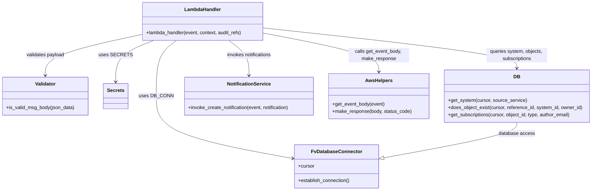

# Diagram: common/subscription_service/subscription_service/send_event.py


> Auto-generated by Obscura crawlers

## Diagram 1



### SVG

<svg id="container" width="1950.59375" xmlns="http://www.w3.org/2000/svg" class="classDiagram" height="632" viewBox="0 0 1950.59375 632" role="graphics-document document" aria-roledescription="class"><style>#container{font-family:"trebuchet ms",verdana,arial,sans-serif;font-size:16px;fill:#333;}@keyframes edge-animation-frame{from{stroke-dashoffset:0;}}@keyframes dash{to{stroke-dashoffset:0;}}#container .edge-animation-slow{stroke-dasharray:9,5!important;stroke-dashoffset:900;animation:dash 50s linear infinite;stroke-linecap:round;}#container .edge-animation-fast{stroke-dasharray:9,5!important;stroke-dashoffset:900;animation:dash 20s linear infinite;stroke-linecap:round;}#container .error-icon{fill:#552222;}#container .error-text{fill:#552222;stroke:#552222;}#container .edge-thickness-normal{stroke-width:1px;}#container .edge-thickness-thick{stroke-width:3.5px;}#container .edge-pattern-solid{stroke-dasharray:0;}#container .edge-thickness-invisible{stroke-width:0;fill:none;}#container .edge-pattern-dashed{stroke-dasharray:3;}#container .edge-pattern-dotted{stroke-dasharray:2;}#container .marker{fill:#333333;stroke:#333333;}#container .marker.cross{stroke:#333333;}#container svg{font-family:"trebuchet ms",verdana,arial,sans-serif;font-size:16px;}#container p{margin:0;}#container g.classGroup text{fill:#9370DB;stroke:none;font-family:"trebuchet ms",verdana,arial,sans-serif;font-size:10px;}#container g.classGroup text .title{font-weight:bolder;}#container .nodeLabel,#container .edgeLabel{color:#131300;}#container .edgeLabel .label rect{fill:#ECECFF;}#container .label text{fill:#131300;}#container .labelBkg{background:#ECECFF;}#container .edgeLabel .label span{background:#ECECFF;}#container .classTitle{font-weight:bolder;}#container .node rect,#container .node circle,#container .node ellipse,#container .node polygon,#container .node path{fill:#ECECFF;stroke:#9370DB;stroke-width:1px;}#container .divider{stroke:#9370DB;stroke-width:1;}#container g.clickable{cursor:pointer;}#container g.classGroup rect{fill:#ECECFF;stroke:#9370DB;}#container g.classGroup line{stroke:#9370DB;stroke-width:1;}#container .classLabel .box{stroke:none;stroke-width:0;fill:#ECECFF;opacity:0.5;}#container .classLabel .label{fill:#9370DB;font-size:10px;}#container .relation{stroke:#333333;stroke-width:1;fill:none;}#container .dashed-line{stroke-dasharray:3;}#container .dotted-line{stroke-dasharray:1 2;}#container #compositionStart,#container .composition{fill:#333333!important;stroke:#333333!important;stroke-width:1;}#container #compositionEnd,#container .composition{fill:#333333!important;stroke:#333333!important;stroke-width:1;}#container #dependencyStart,#container .dependency{fill:#333333!important;stroke:#333333!important;stroke-width:1;}#container #dependencyStart,#container .dependency{fill:#333333!important;stroke:#333333!important;stroke-width:1;}#container #extensionStart,#container .extension{fill:transparent!important;stroke:#333333!important;stroke-width:1;}#container #extensionEnd,#container .extension{fill:transparent!important;stroke:#333333!important;stroke-width:1;}#container #aggregationStart,#container .aggregation{fill:transparent!important;stroke:#333333!important;stroke-width:1;}#container #aggregationEnd,#container .aggregation{fill:transparent!important;stroke:#333333!important;stroke-width:1;}#container #lollipopStart,#container .lollipop{fill:#ECECFF!important;stroke:#333333!important;stroke-width:1;}#container #lollipopEnd,#container .lollipop{fill:#ECECFF!important;stroke:#333333!important;stroke-width:1;}#container .edgeTerminals{font-size:11px;line-height:initial;}#container .classTitleText{text-anchor:middle;font-size:18px;fill:#333;}#container .label-icon{display:inline-block;height:1em;overflow:visible;vertical-align:-0.125em;}#container .node .label-icon path{fill:currentColor;stroke:revert;stroke-width:revert;}#container :root{--mermaid-font-family:"trebuchet ms",verdana,arial,sans-serif;}</style><g><defs><marker id="container_class-aggregationStart" class="marker aggregation class" refX="18" refY="7" markerWidth="190" markerHeight="240" orient="auto"><path d="M 18,7 L9,13 L1,7 L9,1 Z"></path></marker></defs><defs><marker id="container_class-aggregationEnd" class="marker aggregation class" refX="1" refY="7" markerWidth="20" markerHeight="28" orient="auto"><path d="M 18,7 L9,13 L1,7 L9,1 Z"></path></marker></defs><defs><marker id="container_class-extensionStart" class="marker extension class" refX="18" refY="7" markerWidth="190" markerHeight="240" orient="auto"><path d="M 1,7 L18,13 V 1 Z"></path></marker></defs><defs><marker id="container_class-extensionEnd" class="marker extension class" refX="1" refY="7" markerWidth="20" markerHeight="28" orient="auto"><path d="M 1,1 V 13 L18,7 Z"></path></marker></defs><defs><marker id="container_class-compositionStart" class="marker composition class" refX="18" refY="7" markerWidth="190" markerHeight="240" orient="auto"><path d="M 18,7 L9,13 L1,7 L9,1 Z"></path></marker></defs><defs><marker id="container_class-compositionEnd" class="marker composition class" refX="1" refY="7" markerWidth="20" markerHeight="28" orient="auto"><path d="M 18,7 L9,13 L1,7 L9,1 Z"></path></marker></defs><defs><marker id="container_class-dependencyStart" class="marker dependency class" refX="6" refY="7" markerWidth="190" markerHeight="240" orient="auto"><path d="M 5,7 L9,13 L1,7 L9,1 Z"></path></marker></defs><defs><marker id="container_class-dependencyEnd" class="marker dependency class" refX="13" refY="7" markerWidth="20" markerHeight="28" orient="auto"><path d="M 18,7 L9,13 L14,7 L9,1 Z"></path></marker></defs><defs><marker id="container_class-lollipopStart" class="marker lollipop class" refX="13" refY="7" markerWidth="190" markerHeight="240" orient="auto"><circle stroke="black" fill="transparent" cx="7" cy="7" r="6"></circle></marker></defs><defs><marker id="container_class-lollipopEnd" class="marker lollipop class" refX="1" refY="7" markerWidth="190" markerHeight="240" orient="auto"><circle stroke="black" fill="transparent" cx="7" cy="7" r="6"></circle></marker></defs><g class="root"><g class="clusters"></g><g class="edgePaths"><path d="M575.676,134L564.527,142.167C553.378,150.333,531.08,166.667,519.93,197.5C508.781,228.333,508.781,273.667,508.781,317C508.781,360.333,508.781,401.667,584.2,436.11C659.619,470.554,810.457,498.107,885.876,511.884L961.295,525.661" id="id_LambdaHandler_FvDatabaseConnector_1" class="edge-thickness-normal edge-pattern-solid relation" style=";;;" data-edge="true" data-et="edge" data-id="id_LambdaHandler_FvDatabaseConnector_1" data-points="W3sieCI6NTc1LjY3NjAyNTM5MDYyNSwieSI6MTM0fSx7IngiOjUwOC43ODEyNSwieSI6MTgzfSx7IngiOjUwOC43ODEyNSwieSI6MzE5fSx7IngiOjUwOC43ODEyNSwieSI6NDQzfSx7IngiOjk2Ny4xOTcyNjU2MjUsInkiOjUyNi43MzkzMTIxNjg3OTI2fV0=" marker-end="url(#container_class-dependencyEnd)"></path><path d="M504.094,134L483.665,142.167C463.237,150.333,422.38,166.667,401.952,189.5C381.523,212.333,381.523,241.667,381.523,256.333L381.523,271" id="id_LambdaHandler_Secrets_2" class="edge-thickness-normal edge-pattern-solid relation" style=";;;" data-edge="true" data-et="edge" data-id="id_LambdaHandler_Secrets_2" data-points="W3sieCI6NTA0LjA5MzUwNTg1OTM3NSwieSI6MTM0fSx7IngiOjM4MS41MjM0Mzc1LCJ5IjoxODN9LHsieCI6MzgxLjUyMzQzNzUsInkiOjI3N31d" marker-end="url(#container_class-dependencyEnd)"></path><path d="M863.637,109.641L927.536,121.868C991.436,134.094,1119.236,158.547,1183.135,179.94C1247.035,201.333,1247.035,219.667,1247.035,228.833L1247.035,238" id="id_LambdaHandler_AwsHelpers_3" class="edge-thickness-normal edge-pattern-solid relation" style=";;;" data-edge="true" data-et="edge" data-id="id_LambdaHandler_AwsHelpers_3" data-points="W3sieCI6ODYzLjYzNjcxODc1LCJ5IjoxMDkuNjQxMzA3OTc0NjQxMzF9LHsieCI6MTI0Ny4wMzUxNTYyNSwieSI6MTgzfSx7IngiOjEyNDcuMDM1MTU2MjUsInkiOjI0NH1d" marker-end="url(#container_class-dependencyEnd)"></path><path d="M459.73,115.22L408.139,126.517C356.547,137.813,253.363,160.407,201.771,182.87C150.18,205.333,150.18,227.667,150.18,238.833L150.18,250" id="id_LambdaHandler_Validator_4" class="edge-thickness-normal edge-pattern-solid relation" style=";;;" data-edge="true" data-et="edge" data-id="id_LambdaHandler_Validator_4" data-points="W3sieCI6NDU5LjczMDQ2ODc1LCJ5IjoxMTUuMjIwMDkyNDA1MjA4Mjl9LHsieCI6MTUwLjE3OTY4NzUsInkiOjE4M30seyJ4IjoxNTAuMTc5Njg3NSwieSI6MjU2fV0=" marker-end="url(#container_class-dependencyEnd)"></path><path d="M863.637,92.738L1003.395,107.782C1143.152,122.826,1422.668,152.913,1562.426,175.123C1702.184,197.333,1702.184,211.667,1702.184,218.833L1702.184,226" id="id_LambdaHandler_DB_5" class="edge-thickness-normal edge-pattern-solid relation" style=";;;" data-edge="true" data-et="edge" data-id="id_LambdaHandler_DB_5" data-points="W3sieCI6ODYzLjYzNjcxODc1LCJ5Ijo5Mi43MzgzNDY5NDg1ODI0fSx7IngiOjE3MDIuMTgzNTkzNzUsInkiOjE4M30seyJ4IjoxNzAyLjE4MzU5Mzc1LCJ5IjoyMzJ9XQ==" marker-end="url(#container_class-dependencyEnd)"></path><path d="M747.691,134L758.84,142.167C769.989,150.333,792.288,166.667,803.437,186C814.586,205.333,814.586,227.667,814.586,238.833L814.586,250" id="id_LambdaHandler_NotificationService_6" class="edge-thickness-normal edge-pattern-solid relation" style=";;;" data-edge="true" data-et="edge" data-id="id_LambdaHandler_NotificationService_6" data-points="W3sieCI6NzQ3LjY5MTE2MjEwOTM3NSwieSI6MTM0fSx7IngiOjgxNC41ODU5Mzc1LCJ5IjoxODN9LHsieCI6ODE0LjU4NTkzNzUsInkiOjI1Nn1d" marker-end="url(#container_class-dependencyEnd)"></path><path d="M1702.184,406L1702.184,412.167C1702.184,418.333,1702.184,430.667,1628.609,450.273C1555.035,469.88,1407.886,496.76,1334.311,510.2L1260.737,523.64" id="id_DB_FvDatabaseConnector_7" class="edge-thickness-normal edge-pattern-solid relation" style=";;;" data-edge="true" data-et="edge" data-id="id_DB_FvDatabaseConnector_7" data-points="W3sieCI6MTcwMi4xODM1OTM3NSwieSI6NDA2fSx7IngiOjE3MDIuMTgzNTkzNzUsInkiOjQ0M30seyJ4IjoxMjQzLjc2NzU3ODEyNSwieSI6NTI2LjczOTMxMjE2ODc5MjZ9XQ==" marker-end="url(#container_class-extensionEnd)"></path></g><g class="edgeLabels"><g class="edgeLabel" transform="translate(508.78125, 319)"><g class="label" data-id="id_LambdaHandler_FvDatabaseConnector_1" transform="translate(-53.09375, -12)"><foreignObject width="106.1875" height="24"><div xmlns="http://www.w3.org/1999/xhtml" class="labelBkg" style="display: table-cell; white-space: nowrap; line-height: 1.5; max-width: 200px; text-align: center;"><span class="edgeLabel"><p>uses DB_CONN</p></span></div></foreignObject></g></g><g class="edgeLabel" transform="translate(381.5234375, 183)"><g class="label" data-id="id_LambdaHandler_Secrets_2" transform="translate(-49.09375, -12)"><foreignObject width="98.1875" height="24"><div xmlns="http://www.w3.org/1999/xhtml" class="labelBkg" style="display: table-cell; white-space: nowrap; line-height: 1.5; max-width: 200px; text-align: center;"><span class="edgeLabel"><p>uses SECRETS</p></span></div></foreignObject></g></g><g class="edgeLabel" transform="translate(1247.03515625, 183)"><g class="label" data-id="id_LambdaHandler_AwsHelpers_3" transform="translate(-100, -24)"><foreignObject width="200" height="48"><div xmlns="http://www.w3.org/1999/xhtml" class="labelBkg" style="display: table; white-space: break-spaces; line-height: 1.5; max-width: 200px; text-align: center; width: 200px;"><span class="edgeLabel"><p>calls get_event_body, make_response</p></span></div></foreignObject></g></g><g class="edgeLabel" transform="translate(150.1796875, 183)"><g class="label" data-id="id_LambdaHandler_Validator_4" transform="translate(-63.6796875, -12)"><foreignObject width="127.359375" height="24"><div xmlns="http://www.w3.org/1999/xhtml" class="labelBkg" style="display: table-cell; white-space: nowrap; line-height: 1.5; max-width: 200px; text-align: center;"><span class="edgeLabel"><p>validates payload</p></span></div></foreignObject></g></g><g class="edgeLabel" transform="translate(1702.18359375, 183)"><g class="label" data-id="id_LambdaHandler_DB_5" transform="translate(-100, -24)"><foreignObject width="200" height="48"><div xmlns="http://www.w3.org/1999/xhtml" class="labelBkg" style="display: table; white-space: break-spaces; line-height: 1.5; max-width: 200px; text-align: center; width: 200px;"><span class="edgeLabel"><p>queries system, objects, subscriptions</p></span></div></foreignObject></g></g><g class="edgeLabel" transform="translate(814.5859375, 183)"><g class="label" data-id="id_LambdaHandler_NotificationService_6" transform="translate(-75.1484375, -12)"><foreignObject width="150.296875" height="24"><div xmlns="http://www.w3.org/1999/xhtml" class="labelBkg" style="display: table-cell; white-space: nowrap; line-height: 1.5; max-width: 200px; text-align: center;"><span class="edgeLabel"><p>invokes notifications</p></span></div></foreignObject></g></g><g class="edgeLabel" transform="translate(1702.18359375, 443)"><g class="label" data-id="id_DB_FvDatabaseConnector_7" transform="translate(-58.9140625, -12)"><foreignObject width="117.828125" height="24"><div xmlns="http://www.w3.org/1999/xhtml" class="labelBkg" style="display: table-cell; white-space: nowrap; line-height: 1.5; max-width: 200px; text-align: center;"><span class="edgeLabel"><p>database access</p></span></div></foreignObject></g></g></g><g class="nodes"><g class="node default" id="classId-LambdaHandler-0" transform="translate(661.68359375, 71)"><g class="basic label-container"><path d="M-201.953125 -63 L201.953125 -63 L201.953125 63 L-201.953125 63" stroke="none" stroke-width="0" fill="#ECECFF" style=""></path><path d="M-201.953125 -63 C-113.27208240424153 -63, -24.59103980848306 -63, 201.953125 -63 M-201.953125 -63 C-120.68448177790427 -63, -39.415838555808534 -63, 201.953125 -63 M201.953125 -63 C201.953125 -23.310452610119313, 201.953125 16.379094779761374, 201.953125 63 M201.953125 -63 C201.953125 -23.840453231806414, 201.953125 15.319093536387172, 201.953125 63 M201.953125 63 C97.58003931896651 63, -6.793046362066974 63, -201.953125 63 M201.953125 63 C99.94498780387931 63, -2.063149392241371 63, -201.953125 63 M-201.953125 63 C-201.953125 23.093730847932584, -201.953125 -16.812538304134833, -201.953125 -63 M-201.953125 63 C-201.953125 35.223503534476386, -201.953125 7.447007068952772, -201.953125 -63" stroke="#9370DB" stroke-width="1.3" fill="none" stroke-dasharray="0 0" style=""></path></g><g class="annotation-group text" transform="translate(0, -39)"></g><g class="label-group text" transform="translate(-58.21875, -39)"><g class="label" style="font-weight: bolder" transform="translate(0,-12)"><foreignObject width="116.4375" height="24"><div xmlns="http://www.w3.org/1999/xhtml" style="display: table-cell; white-space: nowrap; line-height: 1.5; max-width: 167px; text-align: center;"><span class="nodeLabel markdown-node-label" style=""><p>LambdaHandler</p></span></div></foreignObject></g></g><g class="members-group text" transform="translate(-189.953125, 9)"></g><g class="methods-group text" transform="translate(-189.953125, 39)"><g class="label" style="" transform="translate(0,-12)"><foreignObject width="321.6875" height="24"><div xmlns="http://www.w3.org/1999/xhtml" style="display: table-cell; white-space: nowrap; line-height: 1.5; max-width: 379px; text-align: center;"><span class="nodeLabel markdown-node-label" style=""><p>+lambda_handler(event, context, audit_refs)</p></span></div></foreignObject></g></g><g class="divider" style=""><path d="M-201.953125 -15 C-102.72637772314982 -15, -3.4996304462996477 -15, 201.953125 -15 M-201.953125 -15 C-72.33497718905622 -15, 57.283170621887564 -15, 201.953125 -15" stroke="#9370DB" stroke-width="1.3" fill="none" stroke-dasharray="0 0" style=""></path></g><g class="divider" style=""><path d="M-201.953125 9 C-73.76674148306986 9, 54.41964203386027 9, 201.953125 9 M-201.953125 9 C-114.41370254590697 9, -26.874280091813944 9, 201.953125 9" stroke="#9370DB" stroke-width="1.3" fill="none" stroke-dasharray="0 0" style=""></path></g></g><g class="node default" id="classId-Validator-1" transform="translate(150.1796875, 319)"><g class="basic label-container"><path d="M-142.1796875 -63 L142.1796875 -63 L142.1796875 63 L-142.1796875 63" stroke="none" stroke-width="0" fill="#ECECFF" style=""></path><path d="M-142.1796875 -63 C-41.94343730682853 -63, 58.292812886342944 -63, 142.1796875 -63 M-142.1796875 -63 C-41.87362313244931 -63, 58.43244123510138 -63, 142.1796875 -63 M142.1796875 -63 C142.1796875 -35.99846575279868, 142.1796875 -8.99693150559736, 142.1796875 63 M142.1796875 -63 C142.1796875 -37.37688878934956, 142.1796875 -11.753777578699115, 142.1796875 63 M142.1796875 63 C65.56159458585304 63, -11.056498328293912 63, -142.1796875 63 M142.1796875 63 C32.858099803329196 63, -76.46348789334161 63, -142.1796875 63 M-142.1796875 63 C-142.1796875 36.77415287957237, -142.1796875 10.548305759144746, -142.1796875 -63 M-142.1796875 63 C-142.1796875 25.06079900237583, -142.1796875 -12.878401995248339, -142.1796875 -63" stroke="#9370DB" stroke-width="1.3" fill="none" stroke-dasharray="0 0" style=""></path></g><g class="annotation-group text" transform="translate(0, -39)"></g><g class="label-group text" transform="translate(-33.1875, -39)"><g class="label" style="font-weight: bolder" transform="translate(0,-12)"><foreignObject width="66.375" height="24"><div xmlns="http://www.w3.org/1999/xhtml" style="display: table-cell; white-space: nowrap; line-height: 1.5; max-width: 116px; text-align: center;"><span class="nodeLabel markdown-node-label" style=""><p>Validator</p></span></div></foreignObject></g></g><g class="members-group text" transform="translate(-130.1796875, 9)"></g><g class="methods-group text" transform="translate(-130.1796875, 39)"><g class="label" style="" transform="translate(0,-12)"><foreignObject width="227.171875" height="24"><div xmlns="http://www.w3.org/1999/xhtml" style="display: table-cell; white-space: nowrap; line-height: 1.5; max-width: 285px; text-align: center;"><span class="nodeLabel markdown-node-label" style=""><p>+is_valid_msg_body(json_data)</p></span></div></foreignObject></g></g><g class="divider" style=""><path d="M-142.1796875 -15 C-62.04731104196148 -15, 18.085065416077043 -15, 142.1796875 -15 M-142.1796875 -15 C-61.03051297518223 -15, 20.118661549635533 -15, 142.1796875 -15" stroke="#9370DB" stroke-width="1.3" fill="none" stroke-dasharray="0 0" style=""></path></g><g class="divider" style=""><path d="M-142.1796875 9 C-72.02176075764604 9, -1.8638340152920705 9, 142.1796875 9 M-142.1796875 9 C-59.94069725189158 9, 22.298292996216844 9, 142.1796875 9" stroke="#9370DB" stroke-width="1.3" fill="none" stroke-dasharray="0 0" style=""></path></g></g><g class="node default" id="classId-FvDatabaseConnector-2" transform="translate(1105.482421875, 552)"><g class="basic label-container"><path d="M-138.28515625 -72 L138.28515625 -72 L138.28515625 72 L-138.28515625 72" stroke="none" stroke-width="0" fill="#ECECFF" style=""></path><path d="M-138.28515625 -72 C-79.07854787272697 -72, -19.871939495453958 -72, 138.28515625 -72 M-138.28515625 -72 C-62.04913092022427 -72, 14.186894409551456 -72, 138.28515625 -72 M138.28515625 -72 C138.28515625 -40.164693028754535, 138.28515625 -8.329386057509069, 138.28515625 72 M138.28515625 -72 C138.28515625 -39.68832517406159, 138.28515625 -7.376650348123178, 138.28515625 72 M138.28515625 72 C52.087995287054724 72, -34.10916567589055 72, -138.28515625 72 M138.28515625 72 C54.22017117217436 72, -29.84481390565128 72, -138.28515625 72 M-138.28515625 72 C-138.28515625 27.70924561322829, -138.28515625 -16.58150877354342, -138.28515625 -72 M-138.28515625 72 C-138.28515625 26.710209791145942, -138.28515625 -18.579580417708115, -138.28515625 -72" stroke="#9370DB" stroke-width="1.3" fill="none" stroke-dasharray="0 0" style=""></path></g><g class="annotation-group text" transform="translate(0, -48)"></g><g class="label-group text" transform="translate(-79.3046875, -48)"><g class="label" style="font-weight: bolder" transform="translate(0,-12)"><foreignObject width="158.609375" height="24"><div xmlns="http://www.w3.org/1999/xhtml" style="display: table-cell; white-space: nowrap; line-height: 1.5; max-width: 207px; text-align: center;"><span class="nodeLabel markdown-node-label" style=""><p>FvDatabaseConnector</p></span></div></foreignObject></g></g><g class="members-group text" transform="translate(-126.28515625, 0)"><g class="label" style="" transform="translate(0,-12)"><foreignObject width="53.71875" height="24"><div xmlns="http://www.w3.org/1999/xhtml" style="display: table-cell; white-space: nowrap; line-height: 1.5; max-width: 112px; text-align: center;"><span class="nodeLabel markdown-node-label" style=""><p>+cursor</p></span></div></foreignObject></g></g><g class="methods-group text" transform="translate(-126.28515625, 48)"><g class="label" style="" transform="translate(0,-12)"><foreignObject width="173.265625" height="24"><div xmlns="http://www.w3.org/1999/xhtml" style="display: table-cell; white-space: nowrap; line-height: 1.5; max-width: 231px; text-align: center;"><span class="nodeLabel markdown-node-label" style=""><p>+establish_connection()</p></span></div></foreignObject></g></g><g class="divider" style=""><path d="M-138.28515625 -24 C-47.865088586189515 -24, 42.55497907762097 -24, 138.28515625 -24 M-138.28515625 -24 C-54.007318231673196 -24, 30.270519786653608 -24, 138.28515625 -24" stroke="#9370DB" stroke-width="1.3" fill="none" stroke-dasharray="0 0" style=""></path></g><g class="divider" style=""><path d="M-138.28515625 24 C-34.922533218760464 24, 68.44008981247907 24, 138.28515625 24 M-138.28515625 24 C-45.919356426951055 24, 46.44644339609789 24, 138.28515625 24" stroke="#9370DB" stroke-width="1.3" fill="none" stroke-dasharray="0 0" style=""></path></g></g><g class="node default" id="classId-Secrets-3" transform="translate(381.5234375, 319)"><g class="basic label-container"><path d="M-39.1640625 -42 L39.1640625 -42 L39.1640625 42 L-39.1640625 42" stroke="none" stroke-width="0" fill="#ECECFF" style=""></path><path d="M-39.1640625 -42 C-19.05345911084306 -42, 1.0571442783138778 -42, 39.1640625 -42 M-39.1640625 -42 C-20.234684740018253 -42, -1.3053069800365051 -42, 39.1640625 -42 M39.1640625 -42 C39.1640625 -13.3548717438414, 39.1640625 15.2902565123172, 39.1640625 42 M39.1640625 -42 C39.1640625 -8.829300596604647, 39.1640625 24.341398806790707, 39.1640625 42 M39.1640625 42 C13.007288486207372 42, -13.149485527585256 42, -39.1640625 42 M39.1640625 42 C9.608758491236834 42, -19.94654551752633 42, -39.1640625 42 M-39.1640625 42 C-39.1640625 12.516664821830052, -39.1640625 -16.966670356339897, -39.1640625 -42 M-39.1640625 42 C-39.1640625 24.19556871873823, -39.1640625 6.391137437476459, -39.1640625 -42" stroke="#9370DB" stroke-width="1.3" fill="none" stroke-dasharray="0 0" style=""></path></g><g class="annotation-group text" transform="translate(0, -18)"></g><g class="label-group text" transform="translate(-27.1640625, -18)"><g class="label" style="font-weight: bolder" transform="translate(0,-12)"><foreignObject width="54.328125" height="24"><div xmlns="http://www.w3.org/1999/xhtml" style="display: table-cell; white-space: nowrap; line-height: 1.5; max-width: 103px; text-align: center;"><span class="nodeLabel markdown-node-label" style=""><p>Secrets</p></span></div></foreignObject></g></g><g class="members-group text" transform="translate(-27.1640625, 30)"></g><g class="methods-group text" transform="translate(-27.1640625, 60)"></g><g class="divider" style=""><path d="M-39.1640625 6 C-22.64811962628065 6, -6.1321767525613 6, 39.1640625 6 M-39.1640625 6 C-21.85379965282413 6, -4.543536805648259 6, 39.1640625 6" stroke="#9370DB" stroke-width="1.3" fill="none" stroke-dasharray="0 0" style=""></path></g><g class="divider" style=""><path d="M-39.1640625 24 C-9.259714527540307 24, 20.644633444919386 24, 39.1640625 24 M-39.1640625 24 C-19.07837907318556 24, 1.0073043536288822 24, 39.1640625 24" stroke="#9370DB" stroke-width="1.3" fill="none" stroke-dasharray="0 0" style=""></path></g></g><g class="node default" id="classId-DB-4" transform="translate(1702.18359375, 319)"><g class="basic label-container"><path d="M-240.41015625 -87 L240.41015625 -87 L240.41015625 87 L-240.41015625 87" stroke="none" stroke-width="0" fill="#ECECFF" style=""></path><path d="M-240.41015625 -87 C-137.12708694103588 -87, -33.84401763207174 -87, 240.41015625 -87 M-240.41015625 -87 C-82.7496747649675 -87, 74.91080672006501 -87, 240.41015625 -87 M240.41015625 -87 C240.41015625 -46.902248503523346, 240.41015625 -6.804497007046692, 240.41015625 87 M240.41015625 -87 C240.41015625 -38.05022374174648, 240.41015625 10.899552516507043, 240.41015625 87 M240.41015625 87 C77.87921363731857 87, -84.65172897536286 87, -240.41015625 87 M240.41015625 87 C105.2832239987917 87, -29.843708252416604 87, -240.41015625 87 M-240.41015625 87 C-240.41015625 28.66159203512055, -240.41015625 -29.676815929758902, -240.41015625 -87 M-240.41015625 87 C-240.41015625 41.800269662563956, -240.41015625 -3.3994606748720884, -240.41015625 -87" stroke="#9370DB" stroke-width="1.3" fill="none" stroke-dasharray="0 0" style=""></path></g><g class="annotation-group text" transform="translate(0, -63)"></g><g class="label-group text" transform="translate(-10.1484375, -63)"><g class="label" style="font-weight: bolder" transform="translate(0,-12)"><foreignObject width="20.296875" height="24"><div xmlns="http://www.w3.org/1999/xhtml" style="display: table-cell; white-space: nowrap; line-height: 1.5; max-width: 70px; text-align: center;"><span class="nodeLabel markdown-node-label" style=""><p>DB</p></span></div></foreignObject></g></g><g class="members-group text" transform="translate(-228.41015625, -15)"></g><g class="methods-group text" transform="translate(-228.41015625, 15)"><g class="label" style="" transform="translate(0,-12)"><foreignObject width="258.84375" height="24"><div xmlns="http://www.w3.org/1999/xhtml" style="display: table-cell; white-space: nowrap; line-height: 1.5; max-width: 316px; text-align: center;"><span class="nodeLabel markdown-node-label" style=""><p>+get_system(cursor, source_service)</p></span></div></foreignObject></g><g class="label" style="" transform="translate(0,12)"><foreignObject width="446.671875" height="24"><div xmlns="http://www.w3.org/1999/xhtml" style="display: table-cell; white-space: nowrap; line-height: 1.5; max-width: 504px; text-align: center;"><span class="nodeLabel markdown-node-label" style=""><p>+does_object_exist(cursor, reference_id, system_id, owner_id)</p></span></div></foreignObject></g><g class="label" style="" transform="translate(0,36)"><foreignObject width="411.25" height="24"><div xmlns="http://www.w3.org/1999/xhtml" style="display: table-cell; white-space: nowrap; line-height: 1.5; max-width: 469px; text-align: center;"><span class="nodeLabel markdown-node-label" style=""><p>+get_subscriptions(cursor, object_id, type, author_email)</p></span></div></foreignObject></g></g><g class="divider" style=""><path d="M-240.41015625 -39 C-83.21710422584732 -39, 73.97594779830536 -39, 240.41015625 -39 M-240.41015625 -39 C-77.45309194728037 -39, 85.50397235543926 -39, 240.41015625 -39" stroke="#9370DB" stroke-width="1.3" fill="none" stroke-dasharray="0 0" style=""></path></g><g class="divider" style=""><path d="M-240.41015625 -15 C-85.05017752398078 -15, 70.30980120203844 -15, 240.41015625 -15 M-240.41015625 -15 C-108.47447253314789 -15, 23.461211183704222 -15, 240.41015625 -15" stroke="#9370DB" stroke-width="1.3" fill="none" stroke-dasharray="0 0" style=""></path></g></g><g class="node default" id="classId-NotificationService-5" transform="translate(814.5859375, 319)"><g class="basic label-container"><path d="M-217.7109375 -63 L217.7109375 -63 L217.7109375 63 L-217.7109375 63" stroke="none" stroke-width="0" fill="#ECECFF" style=""></path><path d="M-217.7109375 -63 C-121.68295191477955 -63, -25.6549663295591 -63, 217.7109375 -63 M-217.7109375 -63 C-87.48542919428874 -63, 42.74007911142252 -63, 217.7109375 -63 M217.7109375 -63 C217.7109375 -18.26274123309517, 217.7109375 26.47451753380966, 217.7109375 63 M217.7109375 -63 C217.7109375 -22.00447386019313, 217.7109375 18.99105227961374, 217.7109375 63 M217.7109375 63 C75.1144935722076 63, -67.48195035558479 63, -217.7109375 63 M217.7109375 63 C124.06962990569609 63, 30.42832231139218 63, -217.7109375 63 M-217.7109375 63 C-217.7109375 35.10332267313224, -217.7109375 7.20664534626448, -217.7109375 -63 M-217.7109375 63 C-217.7109375 21.705652133146863, -217.7109375 -19.588695733706274, -217.7109375 -63" stroke="#9370DB" stroke-width="1.3" fill="none" stroke-dasharray="0 0" style=""></path></g><g class="annotation-group text" transform="translate(0, -39)"></g><g class="label-group text" transform="translate(-69.53125, -39)"><g class="label" style="font-weight: bolder" transform="translate(0,-12)"><foreignObject width="139.0625" height="24"><div xmlns="http://www.w3.org/1999/xhtml" style="display: table-cell; white-space: nowrap; line-height: 1.5; max-width: 187px; text-align: center;"><span class="nodeLabel markdown-node-label" style=""><p>NotificationService</p></span></div></foreignObject></g></g><g class="members-group text" transform="translate(-205.7109375, 9)"></g><g class="methods-group text" transform="translate(-205.7109375, 39)"><g class="label" style="" transform="translate(0,-12)"><foreignObject width="341.890625" height="24"><div xmlns="http://www.w3.org/1999/xhtml" style="display: table-cell; white-space: nowrap; line-height: 1.5; max-width: 399px; text-align: center;"><span class="nodeLabel markdown-node-label" style=""><p>+invoke_create_notification(event, notification)</p></span></div></foreignObject></g></g><g class="divider" style=""><path d="M-217.7109375 -15 C-69.74375949814228 -15, 78.22341850371544 -15, 217.7109375 -15 M-217.7109375 -15 C-118.88324143913499 -15, -20.055545378269983 -15, 217.7109375 -15" stroke="#9370DB" stroke-width="1.3" fill="none" stroke-dasharray="0 0" style=""></path></g><g class="divider" style=""><path d="M-217.7109375 9 C-122.35013521718665 9, -26.989332934373294 9, 217.7109375 9 M-217.7109375 9 C-52.09299496236085 9, 113.5249475752783 9, 217.7109375 9" stroke="#9370DB" stroke-width="1.3" fill="none" stroke-dasharray="0 0" style=""></path></g></g><g class="node default" id="classId-AwsHelpers-6" transform="translate(1247.03515625, 319)"><g class="basic label-container"><path d="M-164.73828125 -75 L164.73828125 -75 L164.73828125 75 L-164.73828125 75" stroke="none" stroke-width="0" fill="#ECECFF" style=""></path><path d="M-164.73828125 -75 C-44.8096880244632 -75, 75.1189052010736 -75, 164.73828125 -75 M-164.73828125 -75 C-97.17273513498134 -75, -29.607189019962675 -75, 164.73828125 -75 M164.73828125 -75 C164.73828125 -20.85977792755336, 164.73828125 33.28044414489328, 164.73828125 75 M164.73828125 -75 C164.73828125 -38.58496182266614, 164.73828125 -2.1699236453322754, 164.73828125 75 M164.73828125 75 C97.51007641023753 75, 30.28187157047506 75, -164.73828125 75 M164.73828125 75 C35.88789744998351 75, -92.96248635003298 75, -164.73828125 75 M-164.73828125 75 C-164.73828125 21.423437840557675, -164.73828125 -32.15312431888465, -164.73828125 -75 M-164.73828125 75 C-164.73828125 33.690659599581124, -164.73828125 -7.618680800837751, -164.73828125 -75" stroke="#9370DB" stroke-width="1.3" fill="none" stroke-dasharray="0 0" style=""></path></g><g class="annotation-group text" transform="translate(0, -51)"></g><g class="label-group text" transform="translate(-42.8671875, -51)"><g class="label" style="font-weight: bolder" transform="translate(0,-12)"><foreignObject width="85.734375" height="24"><div xmlns="http://www.w3.org/1999/xhtml" style="display: table-cell; white-space: nowrap; line-height: 1.5; max-width: 134px; text-align: center;"><span class="nodeLabel markdown-node-label" style=""><p>AwsHelpers</p></span></div></foreignObject></g></g><g class="members-group text" transform="translate(-152.73828125, -3)"></g><g class="methods-group text" transform="translate(-152.73828125, 27)"><g class="label" style="" transform="translate(0,-12)"><foreignObject width="174.203125" height="24"><div xmlns="http://www.w3.org/1999/xhtml" style="display: table-cell; white-space: nowrap; line-height: 1.5; max-width: 232px; text-align: center;"><span class="nodeLabel markdown-node-label" style=""><p>+get_event_body(event)</p></span></div></foreignObject></g><g class="label" style="" transform="translate(0,12)"><foreignObject width="262.609375" height="24"><div xmlns="http://www.w3.org/1999/xhtml" style="display: table-cell; white-space: nowrap; line-height: 1.5; max-width: 320px; text-align: center;"><span class="nodeLabel markdown-node-label" style=""><p>+make_response(body, status_code)</p></span></div></foreignObject></g></g><g class="divider" style=""><path d="M-164.73828125 -27 C-61.72231822816832 -27, 41.29364479366336 -27, 164.73828125 -27 M-164.73828125 -27 C-46.270444626403005 -27, 72.19739199719399 -27, 164.73828125 -27" stroke="#9370DB" stroke-width="1.3" fill="none" stroke-dasharray="0 0" style=""></path></g><g class="divider" style=""><path d="M-164.73828125 -3 C-58.015243567953846 -3, 48.70779411409231 -3, 164.73828125 -3 M-164.73828125 -3 C-77.27530006851737 -3, 10.187681112965265 -3, 164.73828125 -3" stroke="#9370DB" stroke-width="1.3" fill="none" stroke-dasharray="0 0" style=""></path></g></g></g></g></g></svg>

## Diagram 2

```mermaid
flowchart TD
    Event[Incoming event] --> Parse[get_event_body(event)]
    Parse --> Validate{is_valid_msg_body valid?}
    Validate -- No --> BadRequest[Raise BadRequestError]
    Validate -- Yes --> Connect[DB_CONN.establish_connection()]
    Connect --> GetSystem[db_system.get_system(cursor, source_service)]
    GetSystem -->|not found| NotFound[make_not_found_response]
    GetSystem -->|found| CheckObject[db_object.does_object_exist(cursor, reference_id, system_id, owner_id)]
    CheckObject --> ForEachObj[for each object]
    ForEachObj --> GetSubscribers[db_subscription.get_subscriptions(cursor, object_id, type, author_email)]
    GetSubscribers --> HasSubscribers{users_to_be_notified?}
    HasSubscribers -- No --> Continue[continue]
    HasSubscribers -- Yes --> BuildNotif[build notification payload]
    BuildNotif --> Log[logging.info("Sending notification")]
    Log --> Invoke[invoke_create_notification(event, notification)]
    Continue --> EndResponse[make_response({}, status_code=200)]
    Invoke --> EndResponse
```

> SVG rendering failed for this diagram.
