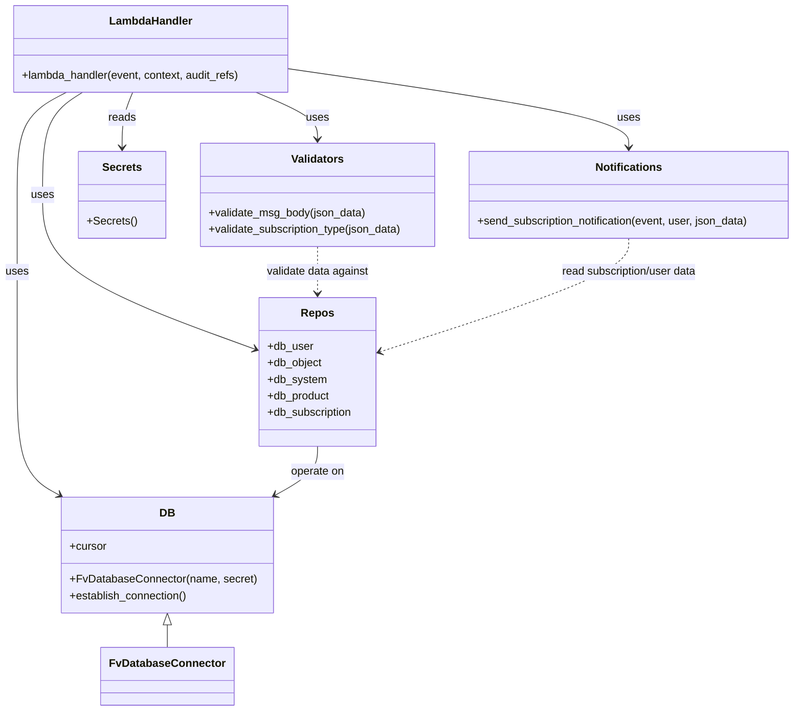

# Diagram: common/subscription_service/subscription_service/subscribe.py


> Auto-generated by Obscura crawlers

## Diagram 1

```mermaid
flowchart TD
    Start([Event Received]) --> GetBody[get_event_body(event)]
    GetBody --> ValidateBody[validate_msg_body(json_data)]
    ValidateBody --> ValidateType[validate_subscription_type(json_data)]
    ValidateType --> DBConnect[DB_CONN.establish_connection()]
    DBConnect --> SystemCheck[get_system(source_service)]
    SystemCheck -->|missing| BadRequest1[BadRequestError: invalid system]
    SystemCheck --> ProductCheck{type == UPDATE?}
    ProductCheck -->|yes| ProductLookup[get_product(subscribing_product)]
    ProductLookup -->|missing| BadRequest2[BadRequestError: invalid product]
    ProductCheck -->|no| UserCheck[does_user_exist(email, org_id)]
    UserCheck --> ObjCheck[does_object_exist(reference_id, system.id, owner_id)]
    ObjCheck --> SubExists{user && object -> subscription exists?}
    SubExists -->|yes & saved_search| InvokeSync1[invoke_lambda(sync_saved_seach_subscription)]
    SubExists -->|yes| ReturnConflict[make_error_response(CONFLICT)]
    SubExists -->|no| StartTx[START TRANSACTION]
    StartTx --> CreateUser{user exists?}
    CreateUser -->|no| CreateUserCall[create_user(...)]
    StartTx --> CreateObj{object exists?}
    CreateObj -->|no| CreateObjCall[create_object(...)]
    CreateObj -->|exists but missing reference_type| UpdateObjRef[update_object_reference_type(...)]
    CreateObjCall --> CreateSub[create_subscription(...)]
    CreateUserCall --> CreateSub
    UpdateObjRef --> CreateSub
    CreateSub --> Approval{requires_approval?}
    Approval -->|yes| InsertApproval[insert_subscription_approval(...)]
    CreateSub --> Commit[COMMIT]
    Commit --> NotifyCheck{type==UPDATE & (enable_sms|enable_email)?}
    NotifyCheck -->|yes| GetSubscriber[get_subscriber(id)]
    Commit -->|saved_search_subscription| InvokeSync2[invoke_lambda(sync_saved_seach_subscription)]
    GetSubscriber --> SendNotification[send_subscription_notification(event, user, json_data)]
    SendNotification --> Respond[make_response({"id": id}, 201)]
    ReturnConflict --> End([End])
    BadRequest1 --> End
    BadRequest2 --> End
```

> SVG rendering failed for this diagram.

## Diagram 2



### SVG

<svg id="container" width="1162.609375" xmlns="http://www.w3.org/2000/svg" class="classDiagram" height="1056" viewBox="0 0 1162.609375 1056" role="graphics-document document" aria-roledescription="class"><style>#container{font-family:"trebuchet ms",verdana,arial,sans-serif;font-size:16px;fill:#333;}@keyframes edge-animation-frame{from{stroke-dashoffset:0;}}@keyframes dash{to{stroke-dashoffset:0;}}#container .edge-animation-slow{stroke-dasharray:9,5!important;stroke-dashoffset:900;animation:dash 50s linear infinite;stroke-linecap:round;}#container .edge-animation-fast{stroke-dasharray:9,5!important;stroke-dashoffset:900;animation:dash 20s linear infinite;stroke-linecap:round;}#container .error-icon{fill:#552222;}#container .error-text{fill:#552222;stroke:#552222;}#container .edge-thickness-normal{stroke-width:1px;}#container .edge-thickness-thick{stroke-width:3.5px;}#container .edge-pattern-solid{stroke-dasharray:0;}#container .edge-thickness-invisible{stroke-width:0;fill:none;}#container .edge-pattern-dashed{stroke-dasharray:3;}#container .edge-pattern-dotted{stroke-dasharray:2;}#container .marker{fill:#333333;stroke:#333333;}#container .marker.cross{stroke:#333333;}#container svg{font-family:"trebuchet ms",verdana,arial,sans-serif;font-size:16px;}#container p{margin:0;}#container g.classGroup text{fill:#9370DB;stroke:none;font-family:"trebuchet ms",verdana,arial,sans-serif;font-size:10px;}#container g.classGroup text .title{font-weight:bolder;}#container .nodeLabel,#container .edgeLabel{color:#131300;}#container .edgeLabel .label rect{fill:#ECECFF;}#container .label text{fill:#131300;}#container .labelBkg{background:#ECECFF;}#container .edgeLabel .label span{background:#ECECFF;}#container .classTitle{font-weight:bolder;}#container .node rect,#container .node circle,#container .node ellipse,#container .node polygon,#container .node path{fill:#ECECFF;stroke:#9370DB;stroke-width:1px;}#container .divider{stroke:#9370DB;stroke-width:1;}#container g.clickable{cursor:pointer;}#container g.classGroup rect{fill:#ECECFF;stroke:#9370DB;}#container g.classGroup line{stroke:#9370DB;stroke-width:1;}#container .classLabel .box{stroke:none;stroke-width:0;fill:#ECECFF;opacity:0.5;}#container .classLabel .label{fill:#9370DB;font-size:10px;}#container .relation{stroke:#333333;stroke-width:1;fill:none;}#container .dashed-line{stroke-dasharray:3;}#container .dotted-line{stroke-dasharray:1 2;}#container #compositionStart,#container .composition{fill:#333333!important;stroke:#333333!important;stroke-width:1;}#container #compositionEnd,#container .composition{fill:#333333!important;stroke:#333333!important;stroke-width:1;}#container #dependencyStart,#container .dependency{fill:#333333!important;stroke:#333333!important;stroke-width:1;}#container #dependencyStart,#container .dependency{fill:#333333!important;stroke:#333333!important;stroke-width:1;}#container #extensionStart,#container .extension{fill:transparent!important;stroke:#333333!important;stroke-width:1;}#container #extensionEnd,#container .extension{fill:transparent!important;stroke:#333333!important;stroke-width:1;}#container #aggregationStart,#container .aggregation{fill:transparent!important;stroke:#333333!important;stroke-width:1;}#container #aggregationEnd,#container .aggregation{fill:transparent!important;stroke:#333333!important;stroke-width:1;}#container #lollipopStart,#container .lollipop{fill:#ECECFF!important;stroke:#333333!important;stroke-width:1;}#container #lollipopEnd,#container .lollipop{fill:#ECECFF!important;stroke:#333333!important;stroke-width:1;}#container .edgeTerminals{font-size:11px;line-height:initial;}#container .classTitleText{text-anchor:middle;font-size:18px;fill:#333;}#container .label-icon{display:inline-block;height:1em;overflow:visible;vertical-align:-0.125em;}#container .node .label-icon path{fill:currentColor;stroke:revert;stroke-width:revert;}#container :root{--mermaid-font-family:"trebuchet ms",verdana,arial,sans-serif;}</style><g><defs><marker id="container_class-aggregationStart" class="marker aggregation class" refX="18" refY="7" markerWidth="190" markerHeight="240" orient="auto"><path d="M 18,7 L9,13 L1,7 L9,1 Z"></path></marker></defs><defs><marker id="container_class-aggregationEnd" class="marker aggregation class" refX="1" refY="7" markerWidth="20" markerHeight="28" orient="auto"><path d="M 18,7 L9,13 L1,7 L9,1 Z"></path></marker></defs><defs><marker id="container_class-extensionStart" class="marker extension class" refX="18" refY="7" markerWidth="190" markerHeight="240" orient="auto"><path d="M 1,7 L18,13 V 1 Z"></path></marker></defs><defs><marker id="container_class-extensionEnd" class="marker extension class" refX="1" refY="7" markerWidth="20" markerHeight="28" orient="auto"><path d="M 1,1 V 13 L18,7 Z"></path></marker></defs><defs><marker id="container_class-compositionStart" class="marker composition class" refX="18" refY="7" markerWidth="190" markerHeight="240" orient="auto"><path d="M 18,7 L9,13 L1,7 L9,1 Z"></path></marker></defs><defs><marker id="container_class-compositionEnd" class="marker composition class" refX="1" refY="7" markerWidth="20" markerHeight="28" orient="auto"><path d="M 18,7 L9,13 L1,7 L9,1 Z"></path></marker></defs><defs><marker id="container_class-dependencyStart" class="marker dependency class" refX="6" refY="7" markerWidth="190" markerHeight="240" orient="auto"><path d="M 5,7 L9,13 L1,7 L9,1 Z"></path></marker></defs><defs><marker id="container_class-dependencyEnd" class="marker dependency class" refX="13" refY="7" markerWidth="20" markerHeight="28" orient="auto"><path d="M 18,7 L9,13 L14,7 L9,1 Z"></path></marker></defs><defs><marker id="container_class-lollipopStart" class="marker lollipop class" refX="13" refY="7" markerWidth="190" markerHeight="240" orient="auto"><circle stroke="black" fill="transparent" cx="7" cy="7" r="6"></circle></marker></defs><defs><marker id="container_class-lollipopEnd" class="marker lollipop class" refX="1" refY="7" markerWidth="190" markerHeight="240" orient="auto"><circle stroke="black" fill="transparent" cx="7" cy="7" r="6"></circle></marker></defs><g class="root"><g class="clusters"></g><g class="edgePaths"><path d="M368.17,134L383.104,140.167C398.038,146.333,427.906,158.667,442.84,170C457.773,181.333,457.773,191.667,457.773,196.833L457.773,202" id="id_LambdaHandler_Validators_1" class="edge-thickness-normal edge-pattern-solid relation" style=";;;" data-edge="true" data-et="edge" data-id="id_LambdaHandler_Validators_1" data-points="W3sieCI6MzY4LjE2OTg0Mzc1MDAwMDA0LCJ5IjoxMzR9LHsieCI6NDU3Ljc3MzQzNzUsInkiOjE3MX0seyJ4Ijo0NTcuNzczNDM3NSwieSI6MjA4fV0=" marker-end="url(#container_class-dependencyEnd)"></path><path d="M95.203,134L83.418,140.167C71.633,146.333,48.062,158.667,36.277,183.5C24.492,208.333,24.492,245.667,24.492,285C24.492,324.333,24.492,365.667,24.492,412.5C24.492,459.333,24.492,511.667,24.492,562C24.492,612.333,24.492,660.667,34.66,690.512C44.828,720.358,65.164,731.716,75.331,737.395L85.499,743.074" id="id_LambdaHandler_DB_2" class="edge-thickness-normal edge-pattern-solid relation" style=";;;" data-edge="true" data-et="edge" data-id="id_LambdaHandler_DB_2" data-points="W3sieCI6OTUuMjAyNjU2MjUsInkiOjEzNH0seyJ4IjoyNC40OTIxODc1LCJ5IjoxNzF9LHsieCI6MjQuNDkyMTg3NSwieSI6MjgzfSx7IngiOjI0LjQ5MjE4NzUsInkiOjQwN30seyJ4IjoyNC40OTIxODc1LCJ5Ijo1NjR9LHsieCI6MjQuNDkyMTg3NSwieSI6NzA5fSx7IngiOjkwLjczNzY2Nzg3MTkwMDg0LCJ5Ijo3NDZ9XQ==" marker-end="url(#container_class-dependencyEnd)"></path><path d="M118.193,134L108.658,140.167C99.123,146.333,80.054,158.667,70.519,183.5C60.984,208.333,60.984,245.667,60.984,285C60.984,324.333,60.984,365.667,111.834,406.454C162.685,447.24,264.385,487.481,315.235,507.601L366.085,527.721" id="id_LambdaHandler_Repos_3" class="edge-thickness-normal edge-pattern-solid relation" style=";;;" data-edge="true" data-et="edge" data-id="id_LambdaHandler_Repos_3" data-points="W3sieCI6MTE4LjE5MjczNDM3NSwieSI6MTM0fSx7IngiOjYwLjk4NDM3NSwieSI6MTcxfSx7IngiOjYwLjk4NDM3NSwieSI6MjgzfSx7IngiOjYwLjk4NDM3NSwieSI6NDA3fSx7IngiOjM3MS42NjQwNjI1LCJ5Ijo1MjkuOTI4NTY3MjA5NDM1MX1d" marker-end="url(#container_class-dependencyEnd)"></path><path d="M417.555,99.751L500.966,111.626C584.378,123.501,751.201,147.25,834.612,166.292C918.023,185.333,918.023,199.667,918.023,206.833L918.023,214" id="id_LambdaHandler_Notifications_4" class="edge-thickness-normal edge-pattern-solid relation" style=";;;" data-edge="true" data-et="edge" data-id="id_LambdaHandler_Notifications_4" data-points="W3sieCI6NDE3LjU1NDY4NzUsInkiOjk5Ljc1MDk3MzE5NTQxNzY0fSx7IngiOjkxOC4wMjM0Mzc1LCJ5IjoxNzF9LHsieCI6OTE4LjAyMzQzNzUsInkiOjIyMH1d" marker-end="url(#container_class-dependencyEnd)"></path><path d="M188.947,134L186.338,140.167C183.729,146.333,178.511,158.667,175.902,172C173.293,185.333,173.293,199.667,173.293,206.833L173.293,214" id="id_LambdaHandler_Secrets_5" class="edge-thickness-normal edge-pattern-solid relation" style=";;;" data-edge="true" data-et="edge" data-id="id_LambdaHandler_Secrets_5" data-points="W3sieCI6MTg4Ljk0NzE0ODQzNzUsInkiOjEzNH0seyJ4IjoxNzMuMjkyOTY4NzUsInkiOjE3MX0seyJ4IjoxNzMuMjkyOTY4NzUsInkiOjIyMH1d" marker-end="url(#container_class-dependencyEnd)"></path><path d="M241.133,931.25L241.133,932.542C241.133,933.833,241.133,936.417,241.133,941.875C241.133,947.333,241.133,955.667,241.133,959.833L241.133,964" id="id_DB_FvDatabaseConnector_6" class="edge-thickness-normal edge-pattern-solid relation" style=";;;" data-edge="true" data-et="edge" data-id="id_DB_FvDatabaseConnector_6" data-points="W3sieCI6MjQxLjEzMjgxMjUsInkiOjkxNH0seyJ4IjoyNDEuMTMyODEyNSwieSI6OTM5fSx7IngiOjI0MS4xMzI4MTI1LCJ5Ijo5NjR9XQ==" marker-start="url(#container_class-extensionStart)"></path><path d="M457.773,672L457.773,678.167C457.773,684.333,457.773,696.667,447.606,708.512C437.438,720.358,417.102,731.716,406.934,737.395L396.766,743.074" id="id_Repos_DB_7" class="edge-thickness-normal edge-pattern-solid relation" style=";;;" data-edge="true" data-et="edge" data-id="id_Repos_DB_7" data-points="W3sieCI6NDU3Ljc3MzQzNzUsInkiOjY3Mn0seyJ4Ijo0NTcuNzczNDM3NSwieSI6NzA5fSx7IngiOjM5MS41Mjc5NTcxMjgwOTkxNiwieSI6NzQ2fV0=" marker-end="url(#container_class-dependencyEnd)"></path><path d="M457.773,358L457.773,366.167C457.773,374.333,457.773,390.667,457.773,406C457.773,421.333,457.773,435.667,457.773,442.833L457.773,450" id="id_Validators_Repos_8" class="edge-thickness-normal edge-pattern-dashed relation" style=";;;" data-edge="true" data-et="edge" data-id="id_Validators_Repos_8" data-points="W3sieCI6NDU3Ljc3MzQzNzUsInkiOjM1OH0seyJ4Ijo0NTcuNzczNDM3NSwieSI6NDA3fSx7IngiOjQ1Ny43NzM0Mzc1LCJ5Ijo0NTZ9XQ==" marker-end="url(#container_class-dependencyEnd)"></path><path d="M918.023,346L918.023,356.167C918.023,366.333,918.023,386.667,856.613,417.782C795.203,448.896,672.382,490.793,610.972,511.741L549.562,532.689" id="id_Notifications_Repos_9" class="edge-thickness-normal edge-pattern-dashed relation" style=";;;" data-edge="true" data-et="edge" data-id="id_Notifications_Repos_9" data-points="W3sieCI6OTE4LjAyMzQzNzUsInkiOjM0Nn0seyJ4Ijo5MTguMDIzNDM3NSwieSI6NDA3fSx7IngiOjU0My44ODI4MTI1LCJ5Ijo1MzQuNjI2NDU5ODA0NDU0fV0=" marker-end="url(#container_class-dependencyEnd)"></path></g><g class="edgeLabels"><g class="edgeLabel" transform="translate(457.7734375, 171)"><g class="label" data-id="id_LambdaHandler_Validators_1" transform="translate(-16.4921875, -12)"><foreignObject width="32.984375" height="24"><div xmlns="http://www.w3.org/1999/xhtml" class="labelBkg" style="display: table-cell; white-space: nowrap; line-height: 1.5; max-width: 200px; text-align: center;"><span class="edgeLabel"><p>uses</p></span></div></foreignObject></g></g><g class="edgeLabel" transform="translate(24.4921875, 407)"><g class="label" data-id="id_LambdaHandler_DB_2" transform="translate(-16.4921875, -12)"><foreignObject width="32.984375" height="24"><div xmlns="http://www.w3.org/1999/xhtml" class="labelBkg" style="display: table-cell; white-space: nowrap; line-height: 1.5; max-width: 200px; text-align: center;"><span class="edgeLabel"><p>uses</p></span></div></foreignObject></g></g><g class="edgeLabel" transform="translate(60.984375, 283)"><g class="label" data-id="id_LambdaHandler_Repos_3" transform="translate(-16.4921875, -12)"><foreignObject width="32.984375" height="24"><div xmlns="http://www.w3.org/1999/xhtml" class="labelBkg" style="display: table-cell; white-space: nowrap; line-height: 1.5; max-width: 200px; text-align: center;"><span class="edgeLabel"><p>uses</p></span></div></foreignObject></g></g><g class="edgeLabel" transform="translate(918.0234375, 171)"><g class="label" data-id="id_LambdaHandler_Notifications_4" transform="translate(-16.4921875, -12)"><foreignObject width="32.984375" height="24"><div xmlns="http://www.w3.org/1999/xhtml" class="labelBkg" style="display: table-cell; white-space: nowrap; line-height: 1.5; max-width: 200px; text-align: center;"><span class="edgeLabel"><p>uses</p></span></div></foreignObject></g></g><g class="edgeLabel" transform="translate(173.29296875, 171)"><g class="label" data-id="id_LambdaHandler_Secrets_5" transform="translate(-20.0078125, -12)"><foreignObject width="40.015625" height="24"><div xmlns="http://www.w3.org/1999/xhtml" class="labelBkg" style="display: table-cell; white-space: nowrap; line-height: 1.5; max-width: 200px; text-align: center;"><span class="edgeLabel"><p>reads</p></span></div></foreignObject></g></g><g class="edgeLabel"><g class="label" data-id="id_DB_FvDatabaseConnector_6" transform="translate(0, 0)"><foreignObject width="0" height="0"><div xmlns="http://www.w3.org/1999/xhtml" class="labelBkg" style="display: table-cell; white-space: nowrap; line-height: 1.5; max-width: 200px; text-align: center;"><span class="edgeLabel"></span></div></foreignObject></g></g><g class="edgeLabel" transform="translate(457.7734375, 709)"><g class="label" data-id="id_Repos_DB_7" transform="translate(-39.5546875, -12)"><foreignObject width="79.109375" height="24"><div xmlns="http://www.w3.org/1999/xhtml" class="labelBkg" style="display: table-cell; white-space: nowrap; line-height: 1.5; max-width: 200px; text-align: center;"><span class="edgeLabel"><p>operate on</p></span></div></foreignObject></g></g><g class="edgeLabel" transform="translate(457.7734375, 407)"><g class="label" data-id="id_Validators_Repos_8" transform="translate(-75.7109375, -12)"><foreignObject width="151.421875" height="24"><div xmlns="http://www.w3.org/1999/xhtml" class="labelBkg" style="display: table-cell; white-space: nowrap; line-height: 1.5; max-width: 200px; text-align: center;"><span class="edgeLabel"><p>validate data against</p></span></div></foreignObject></g></g><g class="edgeLabel" transform="translate(918.0234375, 407)"><g class="label" data-id="id_Notifications_Repos_9" transform="translate(-100, -24)"><foreignObject width="200" height="48"><div xmlns="http://www.w3.org/1999/xhtml" class="labelBkg" style="display: table; white-space: break-spaces; line-height: 1.5; max-width: 200px; text-align: center; width: 200px;"><span class="edgeLabel"><p>read subscription/user data</p></span></div></foreignObject></g></g></g><g class="nodes"><g class="node default" id="classId-LambdaHandler-0" transform="translate(215.6015625, 71)"><g class="basic label-container"><path d="M-201.953125 -63 L201.953125 -63 L201.953125 63 L-201.953125 63" stroke="none" stroke-width="0" fill="#ECECFF" style=""></path><path d="M-201.953125 -63 C-66.15099337142351 -63, 69.65113825715298 -63, 201.953125 -63 M-201.953125 -63 C-58.68225032253841 -63, 84.58862435492318 -63, 201.953125 -63 M201.953125 -63 C201.953125 -32.88924664176223, 201.953125 -2.7784932835244476, 201.953125 63 M201.953125 -63 C201.953125 -17.033402355047173, 201.953125 28.933195289905655, 201.953125 63 M201.953125 63 C66.14690317301293 63, -69.65931865397414 63, -201.953125 63 M201.953125 63 C59.33016875438511 63, -83.29278749122977 63, -201.953125 63 M-201.953125 63 C-201.953125 35.207983894106704, -201.953125 7.415967788213415, -201.953125 -63 M-201.953125 63 C-201.953125 27.866633885604656, -201.953125 -7.266732228790687, -201.953125 -63" stroke="#9370DB" stroke-width="1.3" fill="none" stroke-dasharray="0 0" style=""></path></g><g class="annotation-group text" transform="translate(0, -39)"></g><g class="label-group text" transform="translate(-58.21875, -39)"><g class="label" style="font-weight: bolder" transform="translate(0,-12)"><foreignObject width="116.4375" height="24"><div xmlns="http://www.w3.org/1999/xhtml" style="display: table-cell; white-space: nowrap; line-height: 1.5; max-width: 167px; text-align: center;"><span class="nodeLabel markdown-node-label" style=""><p>LambdaHandler</p></span></div></foreignObject></g></g><g class="members-group text" transform="translate(-189.953125, 9)"></g><g class="methods-group text" transform="translate(-189.953125, 39)"><g class="label" style="" transform="translate(0,-12)"><foreignObject width="321.6875" height="24"><div xmlns="http://www.w3.org/1999/xhtml" style="display: table-cell; white-space: nowrap; line-height: 1.5; max-width: 379px; text-align: center;"><span class="nodeLabel markdown-node-label" style=""><p>+lambda_handler(event, context, audit_refs)</p></span></div></foreignObject></g></g><g class="divider" style=""><path d="M-201.953125 -15 C-73.45200049744076 -15, 55.04912400511847 -15, 201.953125 -15 M-201.953125 -15 C-67.0334045500424 -15, 67.88631589991519 -15, 201.953125 -15" stroke="#9370DB" stroke-width="1.3" fill="none" stroke-dasharray="0 0" style=""></path></g><g class="divider" style=""><path d="M-201.953125 9 C-92.95989701036362 9, 16.033330979272762 9, 201.953125 9 M-201.953125 9 C-47.35637264715345 9, 107.2403797056931 9, 201.953125 9" stroke="#9370DB" stroke-width="1.3" fill="none" stroke-dasharray="0 0" style=""></path></g></g><g class="node default" id="classId-Validators-1" transform="translate(457.7734375, 283)"><g class="basic label-container"><path d="M-173.6640625 -75 L173.6640625 -75 L173.6640625 75 L-173.6640625 75" stroke="none" stroke-width="0" fill="#ECECFF" style=""></path><path d="M-173.6640625 -75 C-55.43857913598099 -75, 62.786904228038026 -75, 173.6640625 -75 M-173.6640625 -75 C-50.82288576449592 -75, 72.01829097100816 -75, 173.6640625 -75 M173.6640625 -75 C173.6640625 -15.393585433848756, 173.6640625 44.21282913230249, 173.6640625 75 M173.6640625 -75 C173.6640625 -26.524654109101434, 173.6640625 21.950691781797133, 173.6640625 75 M173.6640625 75 C76.41445864292048 75, -20.83514521415904 75, -173.6640625 75 M173.6640625 75 C92.27563593067228 75, 10.88720936134456 75, -173.6640625 75 M-173.6640625 75 C-173.6640625 36.64289521517252, -173.6640625 -1.7142095696549546, -173.6640625 -75 M-173.6640625 75 C-173.6640625 38.16311370866525, -173.6640625 1.3262274173305002, -173.6640625 -75" stroke="#9370DB" stroke-width="1.3" fill="none" stroke-dasharray="0 0" style=""></path></g><g class="annotation-group text" transform="translate(0, -51)"></g><g class="label-group text" transform="translate(-36.953125, -51)"><g class="label" style="font-weight: bolder" transform="translate(0,-12)"><foreignObject width="73.90625" height="24"><div xmlns="http://www.w3.org/1999/xhtml" style="display: table-cell; white-space: nowrap; line-height: 1.5; max-width: 123px; text-align: center;"><span class="nodeLabel markdown-node-label" style=""><p>Validators</p></span></div></foreignObject></g></g><g class="members-group text" transform="translate(-161.6640625, -3)"></g><g class="methods-group text" transform="translate(-161.6640625, 27)"><g class="label" style="" transform="translate(0,-12)"><foreignObject width="230.15625" height="24"><div xmlns="http://www.w3.org/1999/xhtml" style="display: table-cell; white-space: nowrap; line-height: 1.5; max-width: 288px; text-align: center;"><span class="nodeLabel markdown-node-label" style=""><p>+validate_msg_body(json_data)</p></span></div></foreignObject></g><g class="label" style="" transform="translate(0,12)"><foreignObject width="286.375" height="24"><div xmlns="http://www.w3.org/1999/xhtml" style="display: table-cell; white-space: nowrap; line-height: 1.5; max-width: 344px; text-align: center;"><span class="nodeLabel markdown-node-label" style=""><p>+validate_subscription_type(json_data)</p></span></div></foreignObject></g></g><g class="divider" style=""><path d="M-173.6640625 -27 C-67.34615087030988 -27, 38.97176075938023 -27, 173.6640625 -27 M-173.6640625 -27 C-88.98499291950844 -27, -4.305923339016886 -27, 173.6640625 -27" stroke="#9370DB" stroke-width="1.3" fill="none" stroke-dasharray="0 0" style=""></path></g><g class="divider" style=""><path d="M-173.6640625 -3 C-42.0041932586324 -3, 89.6556759827352 -3, 173.6640625 -3 M-173.6640625 -3 C-83.2909942967666 -3, 7.082073906466803 -3, 173.6640625 -3" stroke="#9370DB" stroke-width="1.3" fill="none" stroke-dasharray="0 0" style=""></path></g></g><g class="node default" id="classId-DB-2" transform="translate(241.1328125, 830)"><g class="basic label-container"><path d="M-150.80078125 -84 L150.80078125 -84 L150.80078125 84 L-150.80078125 84" stroke="none" stroke-width="0" fill="#ECECFF" style=""></path><path d="M-150.80078125 -84 C-52.39892802664184 -84, 46.00292519671632 -84, 150.80078125 -84 M-150.80078125 -84 C-78.80712145385192 -84, -6.81346165770384 -84, 150.80078125 -84 M150.80078125 -84 C150.80078125 -29.333951772320404, 150.80078125 25.332096455359192, 150.80078125 84 M150.80078125 -84 C150.80078125 -35.523006954623746, 150.80078125 12.953986090752508, 150.80078125 84 M150.80078125 84 C72.19522316241692 84, -6.410334925166154 84, -150.80078125 84 M150.80078125 84 C46.134625816787945 84, -58.53152961642411 84, -150.80078125 84 M-150.80078125 84 C-150.80078125 40.490280830068144, -150.80078125 -3.0194383398637115, -150.80078125 -84 M-150.80078125 84 C-150.80078125 38.53655150280048, -150.80078125 -6.926896994399044, -150.80078125 -84" stroke="#9370DB" stroke-width="1.3" fill="none" stroke-dasharray="0 0" style=""></path></g><g class="annotation-group text" transform="translate(0, -60)"></g><g class="label-group text" transform="translate(-10.1484375, -60)"><g class="label" style="font-weight: bolder" transform="translate(0,-12)"><foreignObject width="20.296875" height="24"><div xmlns="http://www.w3.org/1999/xhtml" style="display: table-cell; white-space: nowrap; line-height: 1.5; max-width: 70px; text-align: center;"><span class="nodeLabel markdown-node-label" style=""><p>DB</p></span></div></foreignObject></g></g><g class="members-group text" transform="translate(-138.80078125, -12)"><g class="label" style="" transform="translate(0,-12)"><foreignObject width="53.71875" height="24"><div xmlns="http://www.w3.org/1999/xhtml" style="display: table-cell; white-space: nowrap; line-height: 1.5; max-width: 112px; text-align: center;"><span class="nodeLabel markdown-node-label" style=""><p>+cursor</p></span></div></foreignObject></g></g><g class="methods-group text" transform="translate(-138.80078125, 36)"><g class="label" style="" transform="translate(0,-12)"><foreignObject width="267.453125" height="24"><div xmlns="http://www.w3.org/1999/xhtml" style="display: table-cell; white-space: nowrap; line-height: 1.5; max-width: 325px; text-align: center;"><span class="nodeLabel markdown-node-label" style=""><p>+FvDatabaseConnector(name, secret)</p></span></div></foreignObject></g><g class="label" style="" transform="translate(0,12)"><foreignObject width="173.265625" height="24"><div xmlns="http://www.w3.org/1999/xhtml" style="display: table-cell; white-space: nowrap; line-height: 1.5; max-width: 231px; text-align: center;"><span class="nodeLabel markdown-node-label" style=""><p>+establish_connection()</p></span></div></foreignObject></g></g><g class="divider" style=""><path d="M-150.80078125 -36 C-55.52805250893033 -36, 39.74467623213934 -36, 150.80078125 -36 M-150.80078125 -36 C-84.80515645051527 -36, -18.80953165103054 -36, 150.80078125 -36" stroke="#9370DB" stroke-width="1.3" fill="none" stroke-dasharray="0 0" style=""></path></g><g class="divider" style=""><path d="M-150.80078125 12 C-48.68559308844365 12, 53.429595073112694 12, 150.80078125 12 M-150.80078125 12 C-68.43178243843512 12, 13.937216373129758 12, 150.80078125 12" stroke="#9370DB" stroke-width="1.3" fill="none" stroke-dasharray="0 0" style=""></path></g></g><g class="node default" id="classId-Repos-3" transform="translate(457.7734375, 564)"><g class="basic label-container"><path d="M-86.109375 -108 L86.109375 -108 L86.109375 108 L-86.109375 108" stroke="none" stroke-width="0" fill="#ECECFF" style=""></path><path d="M-86.109375 -108 C-22.975125817789397 -108, 40.159123364421205 -108, 86.109375 -108 M-86.109375 -108 C-31.071169157405187 -108, 23.967036685189626 -108, 86.109375 -108 M86.109375 -108 C86.109375 -60.41149522352364, 86.109375 -12.822990447047275, 86.109375 108 M86.109375 -108 C86.109375 -40.96381227297748, 86.109375 26.072375454045044, 86.109375 108 M86.109375 108 C28.291503832192966 108, -29.52636733561407 108, -86.109375 108 M86.109375 108 C29.085939134684608 108, -27.937496730630784 108, -86.109375 108 M-86.109375 108 C-86.109375 23.389282373930314, -86.109375 -61.22143525213937, -86.109375 -108 M-86.109375 108 C-86.109375 53.318093369294445, -86.109375 -1.36381326141111, -86.109375 -108" stroke="#9370DB" stroke-width="1.3" fill="none" stroke-dasharray="0 0" style=""></path></g><g class="annotation-group text" transform="translate(0, -84)"></g><g class="label-group text" transform="translate(-22.546875, -84)"><g class="label" style="font-weight: bolder" transform="translate(0,-12)"><foreignObject width="45.09375" height="24"><div xmlns="http://www.w3.org/1999/xhtml" style="display: table-cell; white-space: nowrap; line-height: 1.5; max-width: 94px; text-align: center;"><span class="nodeLabel markdown-node-label" style=""><p>Repos</p></span></div></foreignObject></g></g><g class="members-group text" transform="translate(-74.109375, -36)"><g class="label" style="" transform="translate(0,-12)"><foreignObject width="66.421875" height="24"><div xmlns="http://www.w3.org/1999/xhtml" style="display: table-cell; white-space: nowrap; line-height: 1.5; max-width: 125px; text-align: center;"><span class="nodeLabel markdown-node-label" style=""><p>+db_user</p></span></div></foreignObject></g><g class="label" style="" transform="translate(0,12)"><foreignObject width="80.21875" height="24"><div xmlns="http://www.w3.org/1999/xhtml" style="display: table-cell; white-space: nowrap; line-height: 1.5; max-width: 138px; text-align: center;"><span class="nodeLabel markdown-node-label" style=""><p>+db_object</p></span></div></foreignObject></g><g class="label" style="" transform="translate(0,36)"><foreignObject width="85.46875" height="24"><div xmlns="http://www.w3.org/1999/xhtml" style="display: table-cell; white-space: nowrap; line-height: 1.5; max-width: 143px; text-align: center;"><span class="nodeLabel markdown-node-label" style=""><p>+db_system</p></span></div></foreignObject></g><g class="label" style="" transform="translate(0,60)"><foreignObject width="91.90625" height="24"><div xmlns="http://www.w3.org/1999/xhtml" style="display: table-cell; white-space: nowrap; line-height: 1.5; max-width: 149px; text-align: center;"><span class="nodeLabel markdown-node-label" style=""><p>+db_product</p></span></div></foreignObject></g><g class="label" style="" transform="translate(0,84)"><foreignObject width="125.671875" height="24"><div xmlns="http://www.w3.org/1999/xhtml" style="display: table-cell; white-space: nowrap; line-height: 1.5; max-width: 183px; text-align: center;"><span class="nodeLabel markdown-node-label" style=""><p>+db_subscription</p></span></div></foreignObject></g></g><g class="methods-group text" transform="translate(-74.109375, 108)"></g><g class="divider" style=""><path d="M-86.109375 -60 C-46.51338262966829 -60, -6.917390259336585 -60, 86.109375 -60 M-86.109375 -60 C-25.262969976574233 -60, 35.583435046851534 -60, 86.109375 -60" stroke="#9370DB" stroke-width="1.3" fill="none" stroke-dasharray="0 0" style=""></path></g><g class="divider" style=""><path d="M-86.109375 84 C-31.313684780773066 84, 23.482005438453868 84, 86.109375 84 M-86.109375 84 C-26.872724887162136 84, 32.36392522567573 84, 86.109375 84" stroke="#9370DB" stroke-width="1.3" fill="none" stroke-dasharray="0 0" style=""></path></g></g><g class="node default" id="classId-Notifications-4" transform="translate(918.0234375, 283)"><g class="basic label-container"><path d="M-236.5859375 -63 L236.5859375 -63 L236.5859375 63 L-236.5859375 63" stroke="none" stroke-width="0" fill="#ECECFF" style=""></path><path d="M-236.5859375 -63 C-82.41479370753825 -63, 71.7563500849235 -63, 236.5859375 -63 M-236.5859375 -63 C-127.78491225245928 -63, -18.983887004918557 -63, 236.5859375 -63 M236.5859375 -63 C236.5859375 -21.738430730543477, 236.5859375 19.523138538913045, 236.5859375 63 M236.5859375 -63 C236.5859375 -26.115453340357178, 236.5859375 10.769093319285645, 236.5859375 63 M236.5859375 63 C124.37557856615253 63, 12.165219632305053 63, -236.5859375 63 M236.5859375 63 C90.30989088209628 63, -55.96615573580743 63, -236.5859375 63 M-236.5859375 63 C-236.5859375 21.40652859879276, -236.5859375 -20.186942802414478, -236.5859375 -63 M-236.5859375 63 C-236.5859375 24.29755255677923, -236.5859375 -14.40489488644154, -236.5859375 -63" stroke="#9370DB" stroke-width="1.3" fill="none" stroke-dasharray="0 0" style=""></path></g><g class="annotation-group text" transform="translate(0, -39)"></g><g class="label-group text" transform="translate(-46.75, -39)"><g class="label" style="font-weight: bolder" transform="translate(0,-12)"><foreignObject width="93.5" height="24"><div xmlns="http://www.w3.org/1999/xhtml" style="display: table-cell; white-space: nowrap; line-height: 1.5; max-width: 142px; text-align: center;"><span class="nodeLabel markdown-node-label" style=""><p>Notifications</p></span></div></foreignObject></g></g><g class="members-group text" transform="translate(-224.5859375, 9)"></g><g class="methods-group text" transform="translate(-224.5859375, 39)"><g class="label" style="" transform="translate(0,-12)"><foreignObject width="402.421875" height="24"><div xmlns="http://www.w3.org/1999/xhtml" style="display: table-cell; white-space: nowrap; line-height: 1.5; max-width: 460px; text-align: center;"><span class="nodeLabel markdown-node-label" style=""><p>+send_subscription_notification(event, user, json_data)</p></span></div></foreignObject></g></g><g class="divider" style=""><path d="M-236.5859375 -15 C-131.71744900158942 -15, -26.84896050317883 -15, 236.5859375 -15 M-236.5859375 -15 C-76.58057890026035 -15, 83.4247796994793 -15, 236.5859375 -15" stroke="#9370DB" stroke-width="1.3" fill="none" stroke-dasharray="0 0" style=""></path></g><g class="divider" style=""><path d="M-236.5859375 9 C-83.87583590091049 9, 68.83426569817902 9, 236.5859375 9 M-236.5859375 9 C-124.41508197528397 9, -12.244226450567936 9, 236.5859375 9" stroke="#9370DB" stroke-width="1.3" fill="none" stroke-dasharray="0 0" style=""></path></g></g><g class="node default" id="classId-Secrets-5" transform="translate(173.29296875, 283)"><g class="basic label-container"><path d="M-60.81640625 -63 L60.81640625 -63 L60.81640625 63 L-60.81640625 63" stroke="none" stroke-width="0" fill="#ECECFF" style=""></path><path d="M-60.81640625 -63 C-24.857993607592817 -63, 11.100419034814365 -63, 60.81640625 -63 M-60.81640625 -63 C-19.94881422882154 -63, 20.91877779235692 -63, 60.81640625 -63 M60.81640625 -63 C60.81640625 -37.582866913676554, 60.81640625 -12.165733827353108, 60.81640625 63 M60.81640625 -63 C60.81640625 -20.333331210060408, 60.81640625 22.333337579879185, 60.81640625 63 M60.81640625 63 C13.227342631282802 63, -34.361720987434396 63, -60.81640625 63 M60.81640625 63 C16.30495494910715 63, -28.206496351785702 63, -60.81640625 63 M-60.81640625 63 C-60.81640625 31.511481897027515, -60.81640625 0.022963794055030462, -60.81640625 -63 M-60.81640625 63 C-60.81640625 30.238429067649477, -60.81640625 -2.5231418647010457, -60.81640625 -63" stroke="#9370DB" stroke-width="1.3" fill="none" stroke-dasharray="0 0" style=""></path></g><g class="annotation-group text" transform="translate(0, -39)"></g><g class="label-group text" transform="translate(-27.1640625, -39)"><g class="label" style="font-weight: bolder" transform="translate(0,-12)"><foreignObject width="54.328125" height="24"><div xmlns="http://www.w3.org/1999/xhtml" style="display: table-cell; white-space: nowrap; line-height: 1.5; max-width: 103px; text-align: center;"><span class="nodeLabel markdown-node-label" style=""><p>Secrets</p></span></div></foreignObject></g></g><g class="members-group text" transform="translate(-48.81640625, 9)"></g><g class="methods-group text" transform="translate(-48.81640625, 39)"><g class="label" style="" transform="translate(0,-12)"><foreignObject width="70.46875" height="24"><div xmlns="http://www.w3.org/1999/xhtml" style="display: table-cell; white-space: nowrap; line-height: 1.5; max-width: 128px; text-align: center;"><span class="nodeLabel markdown-node-label" style=""><p>+Secrets()</p></span></div></foreignObject></g></g><g class="divider" style=""><path d="M-60.81640625 -15 C-32.20393845509138 -15, -3.5914706601827646 -15, 60.81640625 -15 M-60.81640625 -15 C-30.985695440028312 -15, -1.1549846300566244 -15, 60.81640625 -15" stroke="#9370DB" stroke-width="1.3" fill="none" stroke-dasharray="0 0" style=""></path></g><g class="divider" style=""><path d="M-60.81640625 9 C-27.947092549571778 9, 4.922221150856444 9, 60.81640625 9 M-60.81640625 9 C-14.242334531831261 9, 32.33173718633748 9, 60.81640625 9" stroke="#9370DB" stroke-width="1.3" fill="none" stroke-dasharray="0 0" style=""></path></g></g><g class="node default" id="classId-FvDatabaseConnector-6" transform="translate(241.1328125, 1006)"><g class="basic label-container"><path d="M-91.3046875 -42 L91.3046875 -42 L91.3046875 42 L-91.3046875 42" stroke="none" stroke-width="0" fill="#ECECFF" style=""></path><path d="M-91.3046875 -42 C-53.075110548332454 -42, -14.845533596664907 -42, 91.3046875 -42 M-91.3046875 -42 C-36.570088933705115 -42, 18.16450963258977 -42, 91.3046875 -42 M91.3046875 -42 C91.3046875 -23.81181321168033, 91.3046875 -5.623626423360662, 91.3046875 42 M91.3046875 -42 C91.3046875 -19.606185511338914, 91.3046875 2.7876289773221714, 91.3046875 42 M91.3046875 42 C19.32461296114228 42, -52.65546157771544 42, -91.3046875 42 M91.3046875 42 C29.76432526651306 42, -31.776036966973876 42, -91.3046875 42 M-91.3046875 42 C-91.3046875 22.71544717355058, -91.3046875 3.430894347101159, -91.3046875 -42 M-91.3046875 42 C-91.3046875 23.155682918673698, -91.3046875 4.311365837347395, -91.3046875 -42" stroke="#9370DB" stroke-width="1.3" fill="none" stroke-dasharray="0 0" style=""></path></g><g class="annotation-group text" transform="translate(0, -18)"></g><g class="label-group text" transform="translate(-79.3046875, -18)"><g class="label" style="font-weight: bolder" transform="translate(0,-12)"><foreignObject width="158.609375" height="24"><div xmlns="http://www.w3.org/1999/xhtml" style="display: table-cell; white-space: nowrap; line-height: 1.5; max-width: 207px; text-align: center;"><span class="nodeLabel markdown-node-label" style=""><p>FvDatabaseConnector</p></span></div></foreignObject></g></g><g class="members-group text" transform="translate(-79.3046875, 30)"></g><g class="methods-group text" transform="translate(-79.3046875, 60)"></g><g class="divider" style=""><path d="M-91.3046875 6 C-18.522715678871265 6, 54.25925614225747 6, 91.3046875 6 M-91.3046875 6 C-50.8825095598257 6, -10.460331619651399 6, 91.3046875 6" stroke="#9370DB" stroke-width="1.3" fill="none" stroke-dasharray="0 0" style=""></path></g><g class="divider" style=""><path d="M-91.3046875 24 C-41.829707824698886 24, 7.645271850602228 24, 91.3046875 24 M-91.3046875 24 C-45.096598262756714 24, 1.1114909744865713 24, 91.3046875 24" stroke="#9370DB" stroke-width="1.3" fill="none" stroke-dasharray="0 0" style=""></path></g></g></g></g></g></svg>
