# Diagram: common/subscription_service/subscription_service/unsubscribe.py


> Auto-generated by Obscura crawlers

## Diagram 1

```mermaid
flowchart TD
    Start[Event Received] --> Parse[get_event_body(event)]
    Parse --> Validate[is_valid_msg_body(json_data)]
    Validate --> Establish[DB_CONN.establish_connection()]
    Establish --> GetCursor[cursor = DB_CONN.cursor]
    GetCursor --> GetOrg[org_id = json_data.org_id or auth.get_organization_id(event)]
    GetOrg --> CheckSystem[db_system.get_system(cursor, source_service)]
    CheckSystem -->|missing| NotFound1[make_not_found_response(event, context, "system does not exist")]
    CheckSystem --> CheckUser[db_user.does_user_exist(cursor, email, org_id)]
    CheckUser -->|missing| NotFound2[make_not_found_response(event, context, "user does not exist")]
    CheckUser --> CheckObject[db_object.does_object_exist(cursor, reference_id, system.id, owner_id)]
    CheckObject -->|missing| NotFound3[make_not_found_response(event, context, "object does not exist")]
    CheckObject --> DetermineProduct{type == UPDATE?}
    DetermineProduct -->|yes| GetProduct[db_product.get_product(cursor, subscribing_product)]
    GetProduct --> SetProductID[product_id = product.id]
    DetermineProduct -->|no| SkipProduct[product_id = None]
    SetProductID --> DeleteLegacy[db_subscription.delete_subscription(cursor, user.id, obj.id, None, type)]
    SkipProduct --> DeleteLegacy
    DeleteLegacy --> IfProduct{product_id?}
    IfProduct -->|yes| DeleteProduct[db_subscription.delete_subscription(cursor, user.id, obj.id, product_id, type)]
    IfProduct -->|no| AfterDeletes
    DeleteProduct --> AfterDeletes
    AfterDeletes --> Count[db_subscription.get_subscription_count(cursor, obj.id)]
    Count -->|0| DeleteObject[db_object.delete_object(cursor, obj.id)]
    Count -->|>0| KeepObject
    DeleteObject --> Respond[make_response({}, status_code=204)]
    KeepObject --> Respond
```

> SVG rendering failed for this diagram.

## Diagram 2

```mermaid
classDiagram
    class DB_CONN {
        +establish_connection()
        +cursor
    }
    class SECRETS {
    }
    class LambdaHandler {
        +lambda_handler(event, context, audit_refs)
    }
    class Validator {
        +is_valid_msg_body(json_data)
    }
    class Auth {
        +get_organization_id(event)
    }
    class DB_System {
        +get_system(cursor, source_service)
        +delete_object(cursor, object_id)
    }
    class DB_User {
        +does_user_exist(cursor, email, org_id)
    }
    class DB_Object {
        +does_object_exist(cursor, reference_id, system_id, owner_id)
        +delete_object(cursor, object_id)
    }
    class DB_Subscription {
        +delete_subscription(cursor, user_id, object_id, product_id, type)
        +get_subscription_count(cursor, object_id)
    }
    class DB_Product {
        +get_product(cursor, subscribing_product)
    }
    class HTTP {
        +make_response(body, status_code)
        +make_not_found_response(event, context, message)
    }

    LambdaHandler --> DB_CONN
    LambdaHandler --> SECRETS
    LambdaHandler --> Validator
    LambdaHandler --> Auth
    LambdaHandler --> DB_System
    LambdaHandler --> DB_User
    LambdaHandler --> DB_Object
    LambdaHandler --> DB_Subscription
    LambdaHandler --> DB_Product
    LambdaHandler --> HTTP
```



### SVG

<svg id="container" width="3839.5625" xmlns="http://www.w3.org/2000/svg" class="classDiagram" height="342" viewBox="0 0 3839.5625 342" role="graphics-document document" aria-roledescription="class"><style>#container{font-family:"trebuchet ms",verdana,arial,sans-serif;font-size:16px;fill:#333;}@keyframes edge-animation-frame{from{stroke-dashoffset:0;}}@keyframes dash{to{stroke-dashoffset:0;}}#container .edge-animation-slow{stroke-dasharray:9,5!important;stroke-dashoffset:900;animation:dash 50s linear infinite;stroke-linecap:round;}#container .edge-animation-fast{stroke-dasharray:9,5!important;stroke-dashoffset:900;animation:dash 20s linear infinite;stroke-linecap:round;}#container .error-icon{fill:#552222;}#container .error-text{fill:#552222;stroke:#552222;}#container .edge-thickness-normal{stroke-width:1px;}#container .edge-thickness-thick{stroke-width:3.5px;}#container .edge-pattern-solid{stroke-dasharray:0;}#container .edge-thickness-invisible{stroke-width:0;fill:none;}#container .edge-pattern-dashed{stroke-dasharray:3;}#container .edge-pattern-dotted{stroke-dasharray:2;}#container .marker{fill:#333333;stroke:#333333;}#container .marker.cross{stroke:#333333;}#container svg{font-family:"trebuchet ms",verdana,arial,sans-serif;font-size:16px;}#container p{margin:0;}#container g.classGroup text{fill:#9370DB;stroke:none;font-family:"trebuchet ms",verdana,arial,sans-serif;font-size:10px;}#container g.classGroup text .title{font-weight:bolder;}#container .nodeLabel,#container .edgeLabel{color:#131300;}#container .edgeLabel .label rect{fill:#ECECFF;}#container .label text{fill:#131300;}#container .labelBkg{background:#ECECFF;}#container .edgeLabel .label span{background:#ECECFF;}#container .classTitle{font-weight:bolder;}#container .node rect,#container .node circle,#container .node ellipse,#container .node polygon,#container .node path{fill:#ECECFF;stroke:#9370DB;stroke-width:1px;}#container .divider{stroke:#9370DB;stroke-width:1;}#container g.clickable{cursor:pointer;}#container g.classGroup rect{fill:#ECECFF;stroke:#9370DB;}#container g.classGroup line{stroke:#9370DB;stroke-width:1;}#container .classLabel .box{stroke:none;stroke-width:0;fill:#ECECFF;opacity:0.5;}#container .classLabel .label{fill:#9370DB;font-size:10px;}#container .relation{stroke:#333333;stroke-width:1;fill:none;}#container .dashed-line{stroke-dasharray:3;}#container .dotted-line{stroke-dasharray:1 2;}#container #compositionStart,#container .composition{fill:#333333!important;stroke:#333333!important;stroke-width:1;}#container #compositionEnd,#container .composition{fill:#333333!important;stroke:#333333!important;stroke-width:1;}#container #dependencyStart,#container .dependency{fill:#333333!important;stroke:#333333!important;stroke-width:1;}#container #dependencyStart,#container .dependency{fill:#333333!important;stroke:#333333!important;stroke-width:1;}#container #extensionStart,#container .extension{fill:transparent!important;stroke:#333333!important;stroke-width:1;}#container #extensionEnd,#container .extension{fill:transparent!important;stroke:#333333!important;stroke-width:1;}#container #aggregationStart,#container .aggregation{fill:transparent!important;stroke:#333333!important;stroke-width:1;}#container #aggregationEnd,#container .aggregation{fill:transparent!important;stroke:#333333!important;stroke-width:1;}#container #lollipopStart,#container .lollipop{fill:#ECECFF!important;stroke:#333333!important;stroke-width:1;}#container #lollipopEnd,#container .lollipop{fill:#ECECFF!important;stroke:#333333!important;stroke-width:1;}#container .edgeTerminals{font-size:11px;line-height:initial;}#container .classTitleText{text-anchor:middle;font-size:18px;fill:#333;}#container .label-icon{display:inline-block;height:1em;overflow:visible;vertical-align:-0.125em;}#container .node .label-icon path{fill:currentColor;stroke:revert;stroke-width:revert;}#container :root{--mermaid-font-family:"trebuchet ms",verdana,arial,sans-serif;}</style><g><defs><marker id="container_class-aggregationStart" class="marker aggregation class" refX="18" refY="7" markerWidth="190" markerHeight="240" orient="auto"><path d="M 18,7 L9,13 L1,7 L9,1 Z"></path></marker></defs><defs><marker id="container_class-aggregationEnd" class="marker aggregation class" refX="1" refY="7" markerWidth="20" markerHeight="28" orient="auto"><path d="M 18,7 L9,13 L1,7 L9,1 Z"></path></marker></defs><defs><marker id="container_class-extensionStart" class="marker extension class" refX="18" refY="7" markerWidth="190" markerHeight="240" orient="auto"><path d="M 1,7 L18,13 V 1 Z"></path></marker></defs><defs><marker id="container_class-extensionEnd" class="marker extension class" refX="1" refY="7" markerWidth="20" markerHeight="28" orient="auto"><path d="M 1,1 V 13 L18,7 Z"></path></marker></defs><defs><marker id="container_class-compositionStart" class="marker composition class" refX="18" refY="7" markerWidth="190" markerHeight="240" orient="auto"><path d="M 18,7 L9,13 L1,7 L9,1 Z"></path></marker></defs><defs><marker id="container_class-compositionEnd" class="marker composition class" refX="1" refY="7" markerWidth="20" markerHeight="28" orient="auto"><path d="M 18,7 L9,13 L1,7 L9,1 Z"></path></marker></defs><defs><marker id="container_class-dependencyStart" class="marker dependency class" refX="6" refY="7" markerWidth="190" markerHeight="240" orient="auto"><path d="M 5,7 L9,13 L1,7 L9,1 Z"></path></marker></defs><defs><marker id="container_class-dependencyEnd" class="marker dependency class" refX="13" refY="7" markerWidth="20" markerHeight="28" orient="auto"><path d="M 18,7 L9,13 L14,7 L9,1 Z"></path></marker></defs><defs><marker id="container_class-lollipopStart" class="marker lollipop class" refX="13" refY="7" markerWidth="190" markerHeight="240" orient="auto"><circle stroke="black" fill="transparent" cx="7" cy="7" r="6"></circle></marker></defs><defs><marker id="container_class-lollipopEnd" class="marker lollipop class" refX="1" refY="7" markerWidth="190" markerHeight="240" orient="auto"><circle stroke="black" fill="transparent" cx="7" cy="7" r="6"></circle></marker></defs><g class="root"><g class="clusters"></g><g class="edgePaths"><path d="M1202.771,84.875L1022.949,97.229C843.126,109.583,483.481,134.292,303.659,150.312C123.836,166.333,123.836,173.667,123.836,177.333L123.836,181" id="id_LambdaHandler_DB_CONN_1" class="edge-thickness-normal edge-pattern-solid relation" style=";;;" data-edge="true" data-et="edge" data-id="id_LambdaHandler_DB_CONN_1" data-points="W3sieCI6MTIwMi43NzE0ODQzNzUsInkiOjg0Ljg3NDY0NDUyNjI3NjQ3fSx7IngiOjEyMy44MzU5Mzc1LCJ5IjoxNTl9LHsieCI6MTIzLjgzNTkzNzUsInkiOjE4N31d" marker-end="url(#container_class-dependencyEnd)"></path><path d="M1202.771,87.58L1057.781,99.483C912.79,111.387,622.809,135.193,477.819,155.763C332.828,176.333,332.828,193.667,332.828,202.333L332.828,211" id="id_LambdaHandler_SECRETS_2" class="edge-thickness-normal edge-pattern-solid relation" style=";;;" data-edge="true" data-et="edge" data-id="id_LambdaHandler_SECRETS_2" data-points="W3sieCI6MTIwMi43NzE0ODQzNzUsInkiOjg3LjU3OTg0MjYwNTE5NTZ9LHsieCI6MzMyLjgyODEyNSwieSI6MTU5fSx7IngiOjMzMi44MjgxMjUsInkiOjIxN31d" marker-end="url(#container_class-dependencyEnd)"></path><path d="M1202.771,92.244L1097.004,103.37C991.236,114.496,779.7,136.748,673.932,153.041C568.164,169.333,568.164,179.667,568.164,184.833L568.164,190" id="id_LambdaHandler_Validator_3" class="edge-thickness-normal edge-pattern-solid relation" style=";;;" data-edge="true" data-et="edge" data-id="id_LambdaHandler_Validator_3" data-points="W3sieCI6MTIwMi43NzE0ODQzNzUsInkiOjkyLjI0Mzk3OTM3MDUxNTl9LHsieCI6NTY4LjE2NDA2MjUsInkiOjE1OX0seyJ4Ijo1NjguMTY0MDYyNSwieSI6MTk2fV0=" marker-end="url(#container_class-dependencyEnd)"></path><path d="M1202.771,104.989L1149.285,113.991C1095.799,122.993,988.827,140.996,935.341,155.165C881.855,169.333,881.855,179.667,881.855,184.833L881.855,190" id="id_LambdaHandler_Auth_4" class="edge-thickness-normal edge-pattern-solid relation" style=";;;" data-edge="true" data-et="edge" data-id="id_LambdaHandler_Auth_4" data-points="W3sieCI6MTIwMi43NzE0ODQzNzUsInkiOjEwNC45ODkxNDQ5Mjk3NTU4MX0seyJ4Ijo4ODEuODU1NDY4NzUsInkiOjE1OX0seyJ4Ijo4ODEuODU1NDY4NzUsInkiOjE5Nn1d" marker-end="url(#container_class-dependencyEnd)"></path><path d="M1268.941,134L1259.961,138.167C1250.98,142.333,1233.019,150.667,1224.039,158C1215.059,165.333,1215.059,171.667,1215.059,174.833L1215.059,178" id="id_LambdaHandler_DB_System_5" class="edge-thickness-normal edge-pattern-solid relation" style=";;;" data-edge="true" data-et="edge" data-id="id_LambdaHandler_DB_System_5" data-points="W3sieCI6MTI2OC45NDA5ODQ1NTI1NTY4LCJ5IjoxMzR9LHsieCI6MTIxNS4wNTg1OTM3NSwieSI6MTU5fSx7IngiOjEyMTUuMDU4NTkzNzUsInkiOjE4NH1d" marker-end="url(#container_class-dependencyEnd)"></path><path d="M1540.508,134L1549.489,138.167C1558.469,142.333,1576.43,150.667,1585.41,160C1594.391,169.333,1594.391,179.667,1594.391,184.833L1594.391,190" id="id_LambdaHandler_DB_User_6" class="edge-thickness-normal edge-pattern-solid relation" style=";;;" data-edge="true" data-et="edge" data-id="id_LambdaHandler_DB_User_6" data-points="W3sieCI6MTU0MC41MDgyMzQxOTc0NDMyLCJ5IjoxMzR9LHsieCI6MTU5NC4zOTA2MjUsInkiOjE1OX0seyJ4IjoxNTk0LjM5MDYyNSwieSI6MTk2fV0=" marker-end="url(#container_class-dependencyEnd)"></path><path d="M1606.678,97.866L1683.269,108.055C1759.861,118.244,1913.044,138.622,1989.635,151.978C2066.227,165.333,2066.227,171.667,2066.227,174.833L2066.227,178" id="id_LambdaHandler_DB_Object_7" class="edge-thickness-normal edge-pattern-solid relation" style=";;;" data-edge="true" data-et="edge" data-id="id_LambdaHandler_DB_Object_7" data-points="W3sieCI6MTYwNi42Nzc3MzQzNzUsInkiOjk3Ljg2NTk0NDg2Mzg3MjE2fSx7IngiOjIwNjYuMjI2NTYyNSwieSI6MTU5fSx7IngiOjIwNjYuMjI2NTYyNSwieSI6MTg0fV0=" marker-end="url(#container_class-dependencyEnd)"></path><path d="M1606.678,85.291L1780.286,97.576C1953.895,109.86,2301.111,134.43,2474.72,149.882C2648.328,165.333,2648.328,171.667,2648.328,174.833L2648.328,178" id="id_LambdaHandler_DB_Subscription_8" class="edge-thickness-normal edge-pattern-solid relation" style=";;;" data-edge="true" data-et="edge" data-id="id_LambdaHandler_DB_Subscription_8" data-points="W3sieCI6MTYwNi42Nzc3MzQzNzUsInkiOjg1LjI5MDYyNzgyMjA1ODE4fSx7IngiOjI2NDguMzI4MTI1LCJ5IjoxNTl9LHsieCI6MjY0OC4zMjgxMjUsInkiOjE4NH1d" marker-end="url(#container_class-dependencyEnd)"></path><path d="M1606.678,81.105L1866.136,94.088C2125.594,107.07,2644.51,133.035,2903.968,151.184C3163.426,169.333,3163.426,179.667,3163.426,184.833L3163.426,190" id="id_LambdaHandler_DB_Product_9" class="edge-thickness-normal edge-pattern-solid relation" style=";;;" data-edge="true" data-et="edge" data-id="id_LambdaHandler_DB_Product_9" data-points="W3sieCI6MTYwNi42Nzc3MzQzNzUsInkiOjgxLjEwNTExMzUyNTkzOTY2fSx7IngiOjMxNjMuNDI1NzgxMjUsInkiOjE1OX0seyJ4IjozMTYzLjQyNTc4MTI1LCJ5IjoxOTZ9XQ==" marker-end="url(#container_class-dependencyEnd)"></path><path d="M1606.678,79.037L1941.58,92.364C2276.482,105.691,2946.286,132.346,3281.188,148.839C3616.09,165.333,3616.09,171.667,3616.09,174.833L3616.09,178" id="id_LambdaHandler_HTTP_10" class="edge-thickness-normal edge-pattern-solid relation" style=";;;" data-edge="true" data-et="edge" data-id="id_LambdaHandler_HTTP_10" data-points="W3sieCI6MTYwNi42Nzc3MzQzNzUsInkiOjc5LjAzNjYwNzc1ODc0NjMzfSx7IngiOjM2MTYuMDg5ODQzNzUsInkiOjE1OX0seyJ4IjozNjE2LjA4OTg0Mzc1LCJ5IjoxODR9XQ==" marker-end="url(#container_class-dependencyEnd)"></path></g><g class="edgeLabels"><g class="edgeLabel"><g class="label" data-id="id_LambdaHandler_DB_CONN_1" transform="translate(0, 0)"><foreignObject width="0" height="0"><div xmlns="http://www.w3.org/1999/xhtml" class="labelBkg" style="display: table-cell; white-space: nowrap; line-height: 1.5; max-width: 200px; text-align: center;"><span class="edgeLabel"></span></div></foreignObject></g></g><g class="edgeLabel"><g class="label" data-id="id_LambdaHandler_SECRETS_2" transform="translate(0, 0)"><foreignObject width="0" height="0"><div xmlns="http://www.w3.org/1999/xhtml" class="labelBkg" style="display: table-cell; white-space: nowrap; line-height: 1.5; max-width: 200px; text-align: center;"><span class="edgeLabel"></span></div></foreignObject></g></g><g class="edgeLabel"><g class="label" data-id="id_LambdaHandler_Validator_3" transform="translate(0, 0)"><foreignObject width="0" height="0"><div xmlns="http://www.w3.org/1999/xhtml" class="labelBkg" style="display: table-cell; white-space: nowrap; line-height: 1.5; max-width: 200px; text-align: center;"><span class="edgeLabel"></span></div></foreignObject></g></g><g class="edgeLabel"><g class="label" data-id="id_LambdaHandler_Auth_4" transform="translate(0, 0)"><foreignObject width="0" height="0"><div xmlns="http://www.w3.org/1999/xhtml" class="labelBkg" style="display: table-cell; white-space: nowrap; line-height: 1.5; max-width: 200px; text-align: center;"><span class="edgeLabel"></span></div></foreignObject></g></g><g class="edgeLabel"><g class="label" data-id="id_LambdaHandler_DB_System_5" transform="translate(0, 0)"><foreignObject width="0" height="0"><div xmlns="http://www.w3.org/1999/xhtml" class="labelBkg" style="display: table-cell; white-space: nowrap; line-height: 1.5; max-width: 200px; text-align: center;"><span class="edgeLabel"></span></div></foreignObject></g></g><g class="edgeLabel"><g class="label" data-id="id_LambdaHandler_DB_User_6" transform="translate(0, 0)"><foreignObject width="0" height="0"><div xmlns="http://www.w3.org/1999/xhtml" class="labelBkg" style="display: table-cell; white-space: nowrap; line-height: 1.5; max-width: 200px; text-align: center;"><span class="edgeLabel"></span></div></foreignObject></g></g><g class="edgeLabel"><g class="label" data-id="id_LambdaHandler_DB_Object_7" transform="translate(0, 0)"><foreignObject width="0" height="0"><div xmlns="http://www.w3.org/1999/xhtml" class="labelBkg" style="display: table-cell; white-space: nowrap; line-height: 1.5; max-width: 200px; text-align: center;"><span class="edgeLabel"></span></div></foreignObject></g></g><g class="edgeLabel"><g class="label" data-id="id_LambdaHandler_DB_Subscription_8" transform="translate(0, 0)"><foreignObject width="0" height="0"><div xmlns="http://www.w3.org/1999/xhtml" class="labelBkg" style="display: table-cell; white-space: nowrap; line-height: 1.5; max-width: 200px; text-align: center;"><span class="edgeLabel"></span></div></foreignObject></g></g><g class="edgeLabel"><g class="label" data-id="id_LambdaHandler_DB_Product_9" transform="translate(0, 0)"><foreignObject width="0" height="0"><div xmlns="http://www.w3.org/1999/xhtml" class="labelBkg" style="display: table-cell; white-space: nowrap; line-height: 1.5; max-width: 200px; text-align: center;"><span class="edgeLabel"></span></div></foreignObject></g></g><g class="edgeLabel"><g class="label" data-id="id_LambdaHandler_HTTP_10" transform="translate(0, 0)"><foreignObject width="0" height="0"><div xmlns="http://www.w3.org/1999/xhtml" class="labelBkg" style="display: table-cell; white-space: nowrap; line-height: 1.5; max-width: 200px; text-align: center;"><span class="edgeLabel"></span></div></foreignObject></g></g></g><g class="nodes"><g class="node default" id="classId-DB_CONN-0" transform="translate(123.8359375, 259)"><g class="basic label-container"><path d="M-115.8359375 -72 L115.8359375 -72 L115.8359375 72 L-115.8359375 72" stroke="none" stroke-width="0" fill="#ECECFF" style=""></path><path d="M-115.8359375 -72 C-51.401733458987025 -72, 13.032470582025951 -72, 115.8359375 -72 M-115.8359375 -72 C-59.75376560917856 -72, -3.6715937183571157 -72, 115.8359375 -72 M115.8359375 -72 C115.8359375 -29.884640068951875, 115.8359375 12.230719862096251, 115.8359375 72 M115.8359375 -72 C115.8359375 -17.060865694755613, 115.8359375 37.878268610488774, 115.8359375 72 M115.8359375 72 C34.8205029231805 72, -46.194931653639 72, -115.8359375 72 M115.8359375 72 C54.568339460060976 72, -6.699258579878048 72, -115.8359375 72 M-115.8359375 72 C-115.8359375 20.023935285932687, -115.8359375 -31.952129428134626, -115.8359375 -72 M-115.8359375 72 C-115.8359375 33.150883091900326, -115.8359375 -5.698233816199348, -115.8359375 -72" stroke="#9370DB" stroke-width="1.3" fill="none" stroke-dasharray="0 0" style=""></path></g><g class="annotation-group text" transform="translate(0, -48)"></g><g class="label-group text" transform="translate(-34.40625, -48)"><g class="label" style="font-weight: bolder" transform="translate(0,-12)"><foreignObject width="68.8125" height="24"><div xmlns="http://www.w3.org/1999/xhtml" style="display: table-cell; white-space: nowrap; line-height: 1.5; max-width: 119px; text-align: center;"><span class="nodeLabel markdown-node-label" style=""><p>DB_CONN</p></span></div></foreignObject></g></g><g class="members-group text" transform="translate(-103.8359375, 0)"><g class="label" style="" transform="translate(0,-12)"><foreignObject width="53.71875" height="24"><div xmlns="http://www.w3.org/1999/xhtml" style="display: table-cell; white-space: nowrap; line-height: 1.5; max-width: 112px; text-align: center;"><span class="nodeLabel markdown-node-label" style=""><p>+cursor</p></span></div></foreignObject></g></g><g class="methods-group text" transform="translate(-103.8359375, 48)"><g class="label" style="" transform="translate(0,-12)"><foreignObject width="173.265625" height="24"><div xmlns="http://www.w3.org/1999/xhtml" style="display: table-cell; white-space: nowrap; line-height: 1.5; max-width: 231px; text-align: center;"><span class="nodeLabel markdown-node-label" style=""><p>+establish_connection()</p></span></div></foreignObject></g></g><g class="divider" style=""><path d="M-115.8359375 -24 C-39.881567228460355 -24, 36.07280304307929 -24, 115.8359375 -24 M-115.8359375 -24 C-65.32830920714355 -24, -14.820680914287081 -24, 115.8359375 -24" stroke="#9370DB" stroke-width="1.3" fill="none" stroke-dasharray="0 0" style=""></path></g><g class="divider" style=""><path d="M-115.8359375 24 C-34.65759778456159 24, 46.520741930876824 24, 115.8359375 24 M-115.8359375 24 C-33.582514699451366 24, 48.67090810109727 24, 115.8359375 24" stroke="#9370DB" stroke-width="1.3" fill="none" stroke-dasharray="0 0" style=""></path></g></g><g class="node default" id="classId-SECRETS-1" transform="translate(332.828125, 259)"><g class="basic label-container"><path d="M-43.15625 -42 L43.15625 -42 L43.15625 42 L-43.15625 42" stroke="none" stroke-width="0" fill="#ECECFF" style=""></path><path d="M-43.15625 -42 C-15.346621000541557 -42, 12.463007998916886 -42, 43.15625 -42 M-43.15625 -42 C-17.844535519856333 -42, 7.467178960287335 -42, 43.15625 -42 M43.15625 -42 C43.15625 -14.041365296432925, 43.15625 13.91726940713415, 43.15625 42 M43.15625 -42 C43.15625 -18.696445029624943, 43.15625 4.607109940750114, 43.15625 42 M43.15625 42 C25.325506972571343 42, 7.494763945142687 42, -43.15625 42 M43.15625 42 C24.753653577395852 42, 6.351057154791704 42, -43.15625 42 M-43.15625 42 C-43.15625 21.979568485975555, -43.15625 1.9591369719511107, -43.15625 -42 M-43.15625 42 C-43.15625 8.548229500668974, -43.15625 -24.903540998662052, -43.15625 -42" stroke="#9370DB" stroke-width="1.3" fill="none" stroke-dasharray="0 0" style=""></path></g><g class="annotation-group text" transform="translate(0, -18)"></g><g class="label-group text" transform="translate(-31.15625, -18)"><g class="label" style="font-weight: bolder" transform="translate(0,-12)"><foreignObject width="62.3125" height="24"><div xmlns="http://www.w3.org/1999/xhtml" style="display: table-cell; white-space: nowrap; line-height: 1.5; max-width: 111px; text-align: center;"><span class="nodeLabel markdown-node-label" style=""><p>SECRETS</p></span></div></foreignObject></g></g><g class="members-group text" transform="translate(-31.15625, 30)"></g><g class="methods-group text" transform="translate(-31.15625, 60)"></g><g class="divider" style=""><path d="M-43.15625 6 C-24.733440480627294 6, -6.3106309612545886 6, 43.15625 6 M-43.15625 6 C-18.26708325811624 6, 6.622083483767518 6, 43.15625 6" stroke="#9370DB" stroke-width="1.3" fill="none" stroke-dasharray="0 0" style=""></path></g><g class="divider" style=""><path d="M-43.15625 24 C-18.428884391995176 24, 6.298481216009648 24, 43.15625 24 M-43.15625 24 C-10.972994463479658 24, 21.210261073040684 24, 43.15625 24" stroke="#9370DB" stroke-width="1.3" fill="none" stroke-dasharray="0 0" style=""></path></g></g><g class="node default" id="classId-LambdaHandler-2" transform="translate(1404.724609375, 71)"><g class="basic label-container"><path d="M-201.953125 -63 L201.953125 -63 L201.953125 63 L-201.953125 63" stroke="none" stroke-width="0" fill="#ECECFF" style=""></path><path d="M-201.953125 -63 C-83.2677012637443 -63, 35.4177224725114 -63, 201.953125 -63 M-201.953125 -63 C-101.30798766806106 -63, -0.6628503361221192 -63, 201.953125 -63 M201.953125 -63 C201.953125 -15.12545122928534, 201.953125 32.74909754142932, 201.953125 63 M201.953125 -63 C201.953125 -19.341911929258494, 201.953125 24.316176141483012, 201.953125 63 M201.953125 63 C52.5204000096453 63, -96.9123249807094 63, -201.953125 63 M201.953125 63 C70.7522887042208 63, -60.448547591558395 63, -201.953125 63 M-201.953125 63 C-201.953125 30.400590939163713, -201.953125 -2.1988181216725735, -201.953125 -63 M-201.953125 63 C-201.953125 33.050577199324835, -201.953125 3.101154398649662, -201.953125 -63" stroke="#9370DB" stroke-width="1.3" fill="none" stroke-dasharray="0 0" style=""></path></g><g class="annotation-group text" transform="translate(0, -39)"></g><g class="label-group text" transform="translate(-58.21875, -39)"><g class="label" style="font-weight: bolder" transform="translate(0,-12)"><foreignObject width="116.4375" height="24"><div xmlns="http://www.w3.org/1999/xhtml" style="display: table-cell; white-space: nowrap; line-height: 1.5; max-width: 167px; text-align: center;"><span class="nodeLabel markdown-node-label" style=""><p>LambdaHandler</p></span></div></foreignObject></g></g><g class="members-group text" transform="translate(-189.953125, 9)"></g><g class="methods-group text" transform="translate(-189.953125, 39)"><g class="label" style="" transform="translate(0,-12)"><foreignObject width="321.6875" height="24"><div xmlns="http://www.w3.org/1999/xhtml" style="display: table-cell; white-space: nowrap; line-height: 1.5; max-width: 379px; text-align: center;"><span class="nodeLabel markdown-node-label" style=""><p>+lambda_handler(event, context, audit_refs)</p></span></div></foreignObject></g></g><g class="divider" style=""><path d="M-201.953125 -15 C-71.69242204072268 -15, 58.56828091855465 -15, 201.953125 -15 M-201.953125 -15 C-110.05233418525488 -15, -18.151543370509756 -15, 201.953125 -15" stroke="#9370DB" stroke-width="1.3" fill="none" stroke-dasharray="0 0" style=""></path></g><g class="divider" style=""><path d="M-201.953125 9 C-73.18063036798563 9, 55.59186426402874 9, 201.953125 9 M-201.953125 9 C-48.16499105127269 9, 105.62314289745461 9, 201.953125 9" stroke="#9370DB" stroke-width="1.3" fill="none" stroke-dasharray="0 0" style=""></path></g></g><g class="node default" id="classId-Validator-3" transform="translate(568.1640625, 259)"><g class="basic label-container"><path d="M-142.1796875 -63 L142.1796875 -63 L142.1796875 63 L-142.1796875 63" stroke="none" stroke-width="0" fill="#ECECFF" style=""></path><path d="M-142.1796875 -63 C-40.0698492834848 -63, 62.0399889330304 -63, 142.1796875 -63 M-142.1796875 -63 C-46.35138399351834 -63, 49.47691951296332 -63, 142.1796875 -63 M142.1796875 -63 C142.1796875 -16.640459093526346, 142.1796875 29.71908181294731, 142.1796875 63 M142.1796875 -63 C142.1796875 -29.60969628136295, 142.1796875 3.7806074372740994, 142.1796875 63 M142.1796875 63 C64.52053038521291 63, -13.138626729574185 63, -142.1796875 63 M142.1796875 63 C67.17027929552411 63, -7.839128908951778 63, -142.1796875 63 M-142.1796875 63 C-142.1796875 33.723229477256965, -142.1796875 4.446458954513929, -142.1796875 -63 M-142.1796875 63 C-142.1796875 32.469660448727694, -142.1796875 1.9393208974553815, -142.1796875 -63" stroke="#9370DB" stroke-width="1.3" fill="none" stroke-dasharray="0 0" style=""></path></g><g class="annotation-group text" transform="translate(0, -39)"></g><g class="label-group text" transform="translate(-33.1875, -39)"><g class="label" style="font-weight: bolder" transform="translate(0,-12)"><foreignObject width="66.375" height="24"><div xmlns="http://www.w3.org/1999/xhtml" style="display: table-cell; white-space: nowrap; line-height: 1.5; max-width: 116px; text-align: center;"><span class="nodeLabel markdown-node-label" style=""><p>Validator</p></span></div></foreignObject></g></g><g class="members-group text" transform="translate(-130.1796875, 9)"></g><g class="methods-group text" transform="translate(-130.1796875, 39)"><g class="label" style="" transform="translate(0,-12)"><foreignObject width="227.171875" height="24"><div xmlns="http://www.w3.org/1999/xhtml" style="display: table-cell; white-space: nowrap; line-height: 1.5; max-width: 285px; text-align: center;"><span class="nodeLabel markdown-node-label" style=""><p>+is_valid_msg_body(json_data)</p></span></div></foreignObject></g></g><g class="divider" style=""><path d="M-142.1796875 -15 C-71.31637093803236 -15, -0.45305437606472765 -15, 142.1796875 -15 M-142.1796875 -15 C-58.676733824628414 -15, 24.826219850743172 -15, 142.1796875 -15" stroke="#9370DB" stroke-width="1.3" fill="none" stroke-dasharray="0 0" style=""></path></g><g class="divider" style=""><path d="M-142.1796875 9 C-51.0594169681999 9, 40.060853563600205 9, 142.1796875 9 M-142.1796875 9 C-62.12049548015011 9, 17.938696539699777 9, 142.1796875 9" stroke="#9370DB" stroke-width="1.3" fill="none" stroke-dasharray="0 0" style=""></path></g></g><g class="node default" id="classId-Auth-4" transform="translate(881.85546875, 259)"><g class="basic label-container"><path d="M-121.51171875 -63 L121.51171875 -63 L121.51171875 63 L-121.51171875 63" stroke="none" stroke-width="0" fill="#ECECFF" style=""></path><path d="M-121.51171875 -63 C-41.71925172636013 -63, 38.073215297279745 -63, 121.51171875 -63 M-121.51171875 -63 C-41.26753497565248 -63, 38.97664879869504 -63, 121.51171875 -63 M121.51171875 -63 C121.51171875 -14.519395110027396, 121.51171875 33.96120977994521, 121.51171875 63 M121.51171875 -63 C121.51171875 -12.631026931823513, 121.51171875 37.737946136352974, 121.51171875 63 M121.51171875 63 C44.957076126807195 63, -31.59756649638561 63, -121.51171875 63 M121.51171875 63 C54.87895097405405 63, -11.753816801891901 63, -121.51171875 63 M-121.51171875 63 C-121.51171875 33.81818243999302, -121.51171875 4.636364879986054, -121.51171875 -63 M-121.51171875 63 C-121.51171875 37.51241211513829, -121.51171875 12.024824230276572, -121.51171875 -63" stroke="#9370DB" stroke-width="1.3" fill="none" stroke-dasharray="0 0" style=""></path></g><g class="annotation-group text" transform="translate(0, -39)"></g><g class="label-group text" transform="translate(-17.0078125, -39)"><g class="label" style="font-weight: bolder" transform="translate(0,-12)"><foreignObject width="34.015625" height="24"><div xmlns="http://www.w3.org/1999/xhtml" style="display: table-cell; white-space: nowrap; line-height: 1.5; max-width: 84px; text-align: center;"><span class="nodeLabel markdown-node-label" style=""><p>Auth</p></span></div></foreignObject></g></g><g class="members-group text" transform="translate(-109.51171875, 9)"></g><g class="methods-group text" transform="translate(-109.51171875, 39)"><g class="label" style="" transform="translate(0,-12)"><foreignObject width="202.015625" height="24"><div xmlns="http://www.w3.org/1999/xhtml" style="display: table-cell; white-space: nowrap; line-height: 1.5; max-width: 259px; text-align: center;"><span class="nodeLabel markdown-node-label" style=""><p>+get_organization_id(event)</p></span></div></foreignObject></g></g><g class="divider" style=""><path d="M-121.51171875 -15 C-69.12294167359143 -15, -16.734164597182854 -15, 121.51171875 -15 M-121.51171875 -15 C-43.90363119414309 -15, 33.704456361713824 -15, 121.51171875 -15" stroke="#9370DB" stroke-width="1.3" fill="none" stroke-dasharray="0 0" style=""></path></g><g class="divider" style=""><path d="M-121.51171875 9 C-30.587553604024635 9, 60.33661154195073 9, 121.51171875 9 M-121.51171875 9 C-54.6151621391421 9, 12.2813944717158 9, 121.51171875 9" stroke="#9370DB" stroke-width="1.3" fill="none" stroke-dasharray="0 0" style=""></path></g></g><g class="node default" id="classId-DB_System-5" transform="translate(1215.05859375, 259)"><g class="basic label-container"><path d="M-161.69140625 -75 L161.69140625 -75 L161.69140625 75 L-161.69140625 75" stroke="none" stroke-width="0" fill="#ECECFF" style=""></path><path d="M-161.69140625 -75 C-92.46764564138677 -75, -23.243885032773534 -75, 161.69140625 -75 M-161.69140625 -75 C-36.82208920425103 -75, 88.04722784149794 -75, 161.69140625 -75 M161.69140625 -75 C161.69140625 -37.67757327349556, 161.69140625 -0.35514654699112214, 161.69140625 75 M161.69140625 -75 C161.69140625 -30.61640631593803, 161.69140625 13.767187368123942, 161.69140625 75 M161.69140625 75 C70.83028352155516 75, -20.03083920688968 75, -161.69140625 75 M161.69140625 75 C38.09563104519826 75, -85.50014415960348 75, -161.69140625 75 M-161.69140625 75 C-161.69140625 18.935270377255748, -161.69140625 -37.129459245488505, -161.69140625 -75 M-161.69140625 75 C-161.69140625 18.19124917430942, -161.69140625 -38.61750165138116, -161.69140625 -75" stroke="#9370DB" stroke-width="1.3" fill="none" stroke-dasharray="0 0" style=""></path></g><g class="annotation-group text" transform="translate(0, -51)"></g><g class="label-group text" transform="translate(-40.5390625, -51)"><g class="label" style="font-weight: bolder" transform="translate(0,-12)"><foreignObject width="81.078125" height="24"><div xmlns="http://www.w3.org/1999/xhtml" style="display: table-cell; white-space: nowrap; line-height: 1.5; max-width: 129px; text-align: center;"><span class="nodeLabel markdown-node-label" style=""><p>DB_System</p></span></div></foreignObject></g></g><g class="members-group text" transform="translate(-149.69140625, -3)"></g><g class="methods-group text" transform="translate(-149.69140625, 27)"><g class="label" style="" transform="translate(0,-12)"><foreignObject width="258.84375" height="24"><div xmlns="http://www.w3.org/1999/xhtml" style="display: table-cell; white-space: nowrap; line-height: 1.5; max-width: 316px; text-align: center;"><span class="nodeLabel markdown-node-label" style=""><p>+get_system(cursor, source_service)</p></span></div></foreignObject></g><g class="label" style="" transform="translate(0,12)"><foreignObject width="237.78125" height="24"><div xmlns="http://www.w3.org/1999/xhtml" style="display: table-cell; white-space: nowrap; line-height: 1.5; max-width: 295px; text-align: center;"><span class="nodeLabel markdown-node-label" style=""><p>+delete_object(cursor, object_id)</p></span></div></foreignObject></g></g><g class="divider" style=""><path d="M-161.69140625 -27 C-68.80390757538392 -27, 24.083591099232166 -27, 161.69140625 -27 M-161.69140625 -27 C-79.22379654741049 -27, 3.2438131551790264 -27, 161.69140625 -27" stroke="#9370DB" stroke-width="1.3" fill="none" stroke-dasharray="0 0" style=""></path></g><g class="divider" style=""><path d="M-161.69140625 -3 C-39.355566272193485 -3, 82.98027370561303 -3, 161.69140625 -3 M-161.69140625 -3 C-46.3242314446111 -3, 69.0429433607778 -3, 161.69140625 -3" stroke="#9370DB" stroke-width="1.3" fill="none" stroke-dasharray="0 0" style=""></path></g></g><g class="node default" id="classId-DB_User-6" transform="translate(1594.390625, 259)"><g class="basic label-container"><path d="M-167.640625 -63 L167.640625 -63 L167.640625 63 L-167.640625 63" stroke="none" stroke-width="0" fill="#ECECFF" style=""></path><path d="M-167.640625 -63 C-59.60121408719266 -63, 48.43819682561468 -63, 167.640625 -63 M-167.640625 -63 C-42.59377852353265 -63, 82.4530679529347 -63, 167.640625 -63 M167.640625 -63 C167.640625 -28.720510801987913, 167.640625 5.558978396024173, 167.640625 63 M167.640625 -63 C167.640625 -26.894450443191623, 167.640625 9.211099113616754, 167.640625 63 M167.640625 63 C79.8777778332615 63, -7.8850693334769915 63, -167.640625 63 M167.640625 63 C59.39117601686975 63, -48.8582729662605 63, -167.640625 63 M-167.640625 63 C-167.640625 28.159298947737256, -167.640625 -6.681402104525489, -167.640625 -63 M-167.640625 63 C-167.640625 30.02499138059467, -167.640625 -2.950017238810659, -167.640625 -63" stroke="#9370DB" stroke-width="1.3" fill="none" stroke-dasharray="0 0" style=""></path></g><g class="annotation-group text" transform="translate(0, -39)"></g><g class="label-group text" transform="translate(-30.5625, -39)"><g class="label" style="font-weight: bolder" transform="translate(0,-12)"><foreignObject width="61.125" height="24"><div xmlns="http://www.w3.org/1999/xhtml" style="display: table-cell; white-space: nowrap; line-height: 1.5; max-width: 111px; text-align: center;"><span class="nodeLabel markdown-node-label" style=""><p>DB_User</p></span></div></foreignObject></g></g><g class="members-group text" transform="translate(-155.640625, 9)"></g><g class="methods-group text" transform="translate(-155.640625, 39)"><g class="label" style="" transform="translate(0,-12)"><foreignObject width="280.71875" height="24"><div xmlns="http://www.w3.org/1999/xhtml" style="display: table-cell; white-space: nowrap; line-height: 1.5; max-width: 338px; text-align: center;"><span class="nodeLabel markdown-node-label" style=""><p>+does_user_exist(cursor, email, org_id)</p></span></div></foreignObject></g></g><g class="divider" style=""><path d="M-167.640625 -15 C-70.65254470516307 -15, 26.335535589673867 -15, 167.640625 -15 M-167.640625 -15 C-40.759103975839096 -15, 86.12241704832181 -15, 167.640625 -15" stroke="#9370DB" stroke-width="1.3" fill="none" stroke-dasharray="0 0" style=""></path></g><g class="divider" style=""><path d="M-167.640625 9 C-48.0557353558232 9, 71.5291542883536 9, 167.640625 9 M-167.640625 9 C-39.2147619234633 9, 89.2111011530734 9, 167.640625 9" stroke="#9370DB" stroke-width="1.3" fill="none" stroke-dasharray="0 0" style=""></path></g></g><g class="node default" id="classId-DB_Object-7" transform="translate(2066.2265625, 259)"><g class="basic label-container"><path d="M-254.1953125 -75 L254.1953125 -75 L254.1953125 75 L-254.1953125 75" stroke="none" stroke-width="0" fill="#ECECFF" style=""></path><path d="M-254.1953125 -75 C-82.49581875825345 -75, 89.2036749834931 -75, 254.1953125 -75 M-254.1953125 -75 C-82.66986629954127 -75, 88.85557990091746 -75, 254.1953125 -75 M254.1953125 -75 C254.1953125 -40.85857886558295, 254.1953125 -6.717157731165898, 254.1953125 75 M254.1953125 -75 C254.1953125 -23.62572391133709, 254.1953125 27.74855217732582, 254.1953125 75 M254.1953125 75 C134.22590326135457 75, 14.256494022709148 75, -254.1953125 75 M254.1953125 75 C127.438480502178 75, 0.6816485043559908 75, -254.1953125 75 M-254.1953125 75 C-254.1953125 18.73676262989489, -254.1953125 -37.52647474021022, -254.1953125 -75 M-254.1953125 75 C-254.1953125 25.36410275745809, -254.1953125 -24.271794485083817, -254.1953125 -75" stroke="#9370DB" stroke-width="1.3" fill="none" stroke-dasharray="0 0" style=""></path></g><g class="annotation-group text" transform="translate(0, -51)"></g><g class="label-group text" transform="translate(-37.71875, -51)"><g class="label" style="font-weight: bolder" transform="translate(0,-12)"><foreignObject width="75.4375" height="24"><div xmlns="http://www.w3.org/1999/xhtml" style="display: table-cell; white-space: nowrap; line-height: 1.5; max-width: 125px; text-align: center;"><span class="nodeLabel markdown-node-label" style=""><p>DB_Object</p></span></div></foreignObject></g></g><g class="members-group text" transform="translate(-242.1953125, -3)"></g><g class="methods-group text" transform="translate(-242.1953125, 27)"><g class="label" style="" transform="translate(0,-12)"><foreignObject width="446.671875" height="24"><div xmlns="http://www.w3.org/1999/xhtml" style="display: table-cell; white-space: nowrap; line-height: 1.5; max-width: 504px; text-align: center;"><span class="nodeLabel markdown-node-label" style=""><p>+does_object_exist(cursor, reference_id, system_id, owner_id)</p></span></div></foreignObject></g><g class="label" style="" transform="translate(0,12)"><foreignObject width="237.78125" height="24"><div xmlns="http://www.w3.org/1999/xhtml" style="display: table-cell; white-space: nowrap; line-height: 1.5; max-width: 295px; text-align: center;"><span class="nodeLabel markdown-node-label" style=""><p>+delete_object(cursor, object_id)</p></span></div></foreignObject></g></g><g class="divider" style=""><path d="M-254.1953125 -27 C-115.556948495115 -27, 23.08141550977001 -27, 254.1953125 -27 M-254.1953125 -27 C-108.16133465413131 -27, 37.87264319173738 -27, 254.1953125 -27" stroke="#9370DB" stroke-width="1.3" fill="none" stroke-dasharray="0 0" style=""></path></g><g class="divider" style=""><path d="M-254.1953125 -3 C-98.17537515078186 -3, 57.84456219843628 -3, 254.1953125 -3 M-254.1953125 -3 C-81.81155209480548 -3, 90.57220831038904 -3, 254.1953125 -3" stroke="#9370DB" stroke-width="1.3" fill="none" stroke-dasharray="0 0" style=""></path></g></g><g class="node default" id="classId-DB_Subscription-8" transform="translate(2648.328125, 259)"><g class="basic label-container"><path d="M-277.90625 -75 L277.90625 -75 L277.90625 75 L-277.90625 75" stroke="none" stroke-width="0" fill="#ECECFF" style=""></path><path d="M-277.90625 -75 C-148.30513464023528 -75, -18.70401928047056 -75, 277.90625 -75 M-277.90625 -75 C-105.23228433407539 -75, 67.44168133184922 -75, 277.90625 -75 M277.90625 -75 C277.90625 -21.765378119312388, 277.90625 31.469243761375225, 277.90625 75 M277.90625 -75 C277.90625 -33.53381850971756, 277.90625 7.932362980564875, 277.90625 75 M277.90625 75 C154.8795091699273 75, 31.852768339854634 75, -277.90625 75 M277.90625 75 C59.22208319401193 75, -159.46208361197614 75, -277.90625 75 M-277.90625 75 C-277.90625 26.400851841396893, -277.90625 -22.198296317206214, -277.90625 -75 M-277.90625 75 C-277.90625 28.56558150503642, -277.90625 -17.86883698992716, -277.90625 -75" stroke="#9370DB" stroke-width="1.3" fill="none" stroke-dasharray="0 0" style=""></path></g><g class="annotation-group text" transform="translate(0, -51)"></g><g class="label-group text" transform="translate(-60.484375, -51)"><g class="label" style="font-weight: bolder" transform="translate(0,-12)"><foreignObject width="120.96875" height="24"><div xmlns="http://www.w3.org/1999/xhtml" style="display: table-cell; white-space: nowrap; line-height: 1.5; max-width: 170px; text-align: center;"><span class="nodeLabel markdown-node-label" style=""><p>DB_Subscription</p></span></div></foreignObject></g></g><g class="members-group text" transform="translate(-265.90625, -3)"></g><g class="methods-group text" transform="translate(-265.90625, 27)"><g class="label" style="" transform="translate(0,-12)"><foreignObject width="471.328125" height="24"><div xmlns="http://www.w3.org/1999/xhtml" style="display: table-cell; white-space: nowrap; line-height: 1.5; max-width: 529px; text-align: center;"><span class="nodeLabel markdown-node-label" style=""><p>+delete_subscription(cursor, user_id, object_id, product_id, type)</p></span></div></foreignObject></g><g class="label" style="" transform="translate(0,12)"><foreignObject width="309.390625" height="24"><div xmlns="http://www.w3.org/1999/xhtml" style="display: table-cell; white-space: nowrap; line-height: 1.5; max-width: 367px; text-align: center;"><span class="nodeLabel markdown-node-label" style=""><p>+get_subscription_count(cursor, object_id)</p></span></div></foreignObject></g></g><g class="divider" style=""><path d="M-277.90625 -27 C-56.456456875135586 -27, 164.99333624972883 -27, 277.90625 -27 M-277.90625 -27 C-158.68285488412346 -27, -39.45945976824689 -27, 277.90625 -27" stroke="#9370DB" stroke-width="1.3" fill="none" stroke-dasharray="0 0" style=""></path></g><g class="divider" style=""><path d="M-277.90625 -3 C-57.76585616087593 -3, 162.37453767824815 -3, 277.90625 -3 M-277.90625 -3 C-160.17467318125136 -3, -42.44309636250276 -3, 277.90625 -3" stroke="#9370DB" stroke-width="1.3" fill="none" stroke-dasharray="0 0" style=""></path></g></g><g class="node default" id="classId-DB_Product-9" transform="translate(3163.42578125, 259)"><g class="basic label-container"><path d="M-187.19140625 -63 L187.19140625 -63 L187.19140625 63 L-187.19140625 63" stroke="none" stroke-width="0" fill="#ECECFF" style=""></path><path d="M-187.19140625 -63 C-111.52023383671866 -63, -35.84906142343732 -63, 187.19140625 -63 M-187.19140625 -63 C-84.67978681053006 -63, 17.83183262893988 -63, 187.19140625 -63 M187.19140625 -63 C187.19140625 -13.21758631739695, 187.19140625 36.5648273652061, 187.19140625 63 M187.19140625 -63 C187.19140625 -35.2542344432584, 187.19140625 -7.508468886516795, 187.19140625 63 M187.19140625 63 C106.44346377292996 63, 25.69552129585992 63, -187.19140625 63 M187.19140625 63 C42.312724203954076 63, -102.56595784209185 63, -187.19140625 63 M-187.19140625 63 C-187.19140625 25.435750171358855, -187.19140625 -12.12849965728229, -187.19140625 -63 M-187.19140625 63 C-187.19140625 21.24355801240951, -187.19140625 -20.512883975180983, -187.19140625 -63" stroke="#9370DB" stroke-width="1.3" fill="none" stroke-dasharray="0 0" style=""></path></g><g class="annotation-group text" transform="translate(0, -39)"></g><g class="label-group text" transform="translate(-42.7265625, -39)"><g class="label" style="font-weight: bolder" transform="translate(0,-12)"><foreignObject width="85.453125" height="24"><div xmlns="http://www.w3.org/1999/xhtml" style="display: table-cell; white-space: nowrap; line-height: 1.5; max-width: 135px; text-align: center;"><span class="nodeLabel markdown-node-label" style=""><p>DB_Product</p></span></div></foreignObject></g></g><g class="members-group text" transform="translate(-175.19140625, 9)"></g><g class="methods-group text" transform="translate(-175.19140625, 39)"><g class="label" style="" transform="translate(0,-12)"><foreignObject width="307.65625" height="24"><div xmlns="http://www.w3.org/1999/xhtml" style="display: table-cell; white-space: nowrap; line-height: 1.5; max-width: 365px; text-align: center;"><span class="nodeLabel markdown-node-label" style=""><p>+get_product(cursor, subscribing_product)</p></span></div></foreignObject></g></g><g class="divider" style=""><path d="M-187.19140625 -15 C-90.92746769176344 -15, 5.336470866473121 -15, 187.19140625 -15 M-187.19140625 -15 C-38.365115767730344 -15, 110.46117471453931 -15, 187.19140625 -15" stroke="#9370DB" stroke-width="1.3" fill="none" stroke-dasharray="0 0" style=""></path></g><g class="divider" style=""><path d="M-187.19140625 9 C-109.9741272766151 9, -32.756848303230214 9, 187.19140625 9 M-187.19140625 9 C-60.99315153908266 9, 65.20510317183468 9, 187.19140625 9" stroke="#9370DB" stroke-width="1.3" fill="none" stroke-dasharray="0 0" style=""></path></g></g><g class="node default" id="classId-HTTP-10" transform="translate(3616.08984375, 259)"><g class="basic label-container"><path d="M-215.47265625 -75 L215.47265625 -75 L215.47265625 75 L-215.47265625 75" stroke="none" stroke-width="0" fill="#ECECFF" style=""></path><path d="M-215.47265625 -75 C-125.95312340002695 -75, -36.43359055005391 -75, 215.47265625 -75 M-215.47265625 -75 C-85.17317793964128 -75, 45.126300370717445 -75, 215.47265625 -75 M215.47265625 -75 C215.47265625 -35.19909267826832, 215.47265625 4.6018146434633564, 215.47265625 75 M215.47265625 -75 C215.47265625 -43.41539484242149, 215.47265625 -11.830789684842976, 215.47265625 75 M215.47265625 75 C46.17118707769097 75, -123.13028209461805 75, -215.47265625 75 M215.47265625 75 C108.09245979138458 75, 0.7122633327691688 75, -215.47265625 75 M-215.47265625 75 C-215.47265625 44.11844723336053, -215.47265625 13.236894466721061, -215.47265625 -75 M-215.47265625 75 C-215.47265625 40.4839391550418, -215.47265625 5.967878310083606, -215.47265625 -75" stroke="#9370DB" stroke-width="1.3" fill="none" stroke-dasharray="0 0" style=""></path></g><g class="annotation-group text" transform="translate(0, -51)"></g><g class="label-group text" transform="translate(-18.7734375, -51)"><g class="label" style="font-weight: bolder" transform="translate(0,-12)"><foreignObject width="37.546875" height="24"><div xmlns="http://www.w3.org/1999/xhtml" style="display: table-cell; white-space: nowrap; line-height: 1.5; max-width: 87px; text-align: center;"><span class="nodeLabel markdown-node-label" style=""><p>HTTP</p></span></div></foreignObject></g></g><g class="members-group text" transform="translate(-203.47265625, -3)"></g><g class="methods-group text" transform="translate(-203.47265625, 27)"><g class="label" style="" transform="translate(0,-12)"><foreignObject width="262.609375" height="24"><div xmlns="http://www.w3.org/1999/xhtml" style="display: table-cell; white-space: nowrap; line-height: 1.5; max-width: 320px; text-align: center;"><span class="nodeLabel markdown-node-label" style=""><p>+make_response(body, status_code)</p></span></div></foreignObject></g><g class="label" style="" transform="translate(0,12)"><foreignObject width="388.171875" height="24"><div xmlns="http://www.w3.org/1999/xhtml" style="display: table-cell; white-space: nowrap; line-height: 1.5; max-width: 446px; text-align: center;"><span class="nodeLabel markdown-node-label" style=""><p>+make_not_found_response(event, context, message)</p></span></div></foreignObject></g></g><g class="divider" style=""><path d="M-215.47265625 -27 C-108.32532541963732 -27, -1.1779945892746468 -27, 215.47265625 -27 M-215.47265625 -27 C-68.38132933553734 -27, 78.70999757892531 -27, 215.47265625 -27" stroke="#9370DB" stroke-width="1.3" fill="none" stroke-dasharray="0 0" style=""></path></g><g class="divider" style=""><path d="M-215.47265625 -3 C-115.21408127133444 -3, -14.955506292668872 -3, 215.47265625 -3 M-215.47265625 -3 C-126.4549544739777 -3, -37.43725269795539 -3, 215.47265625 -3" stroke="#9370DB" stroke-width="1.3" fill="none" stroke-dasharray="0 0" style=""></path></g></g></g></g></g></svg>
