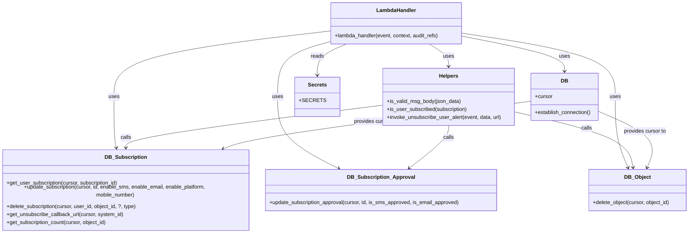

# Diagram: common/subscription_service/subscription_service/unsubscribe_by_uuid.py


> Auto-generated by Obscura crawlers

## Diagram 1

```mermaid
flowchart TD
    Start([Event Received]) --> ParseBody{is_valid_msg_body(json_data)}
    ParseBody -->|invalid| BadRequest[Raise BadRequestError]
    ParseBody --> ValidBody[Get subscription via db_subscription.get_user_subscription]
    ValidBody --> CheckCategory{category == "phone" or "email"}
    CheckCategory -->|no| NotFound[make_not_found_response -> Return 404]
    CheckCategory -->|yes, phone| DisableSMS[set enable_sms=False]
    CheckCategory -->|yes, email| DisableEmail[set enable_email=False]
    DisableSMS --> UpdateApprovalSMS[db_subscription_approval.update_subscription_approval(is_sms_approved=False)]
    DisableEmail --> UpdateApprovalEmail[db_subscription_approval.update_subscription_approval(is_email_approved=False)]
    UpdateApprovalSMS --> CheckSubscribed{is_user_subscribed(subscription)}
    UpdateApprovalEmail --> CheckSubscribed
    CheckSubscribed -->|yes| UpdateSubscription[db_subscription.update_subscription -> Return 204]
    CheckSubscribed -->|no| GetCallback[db_subscription.get_unsubscribe_callback_url]
    GetCallback -->|has url & missing data| RaiseHandled[Raise HandledException 500]
    GetCallback -->|has url & has data| InvokeCallback[invoke_unsubscribe_user_alert -> invoke lambda callback]
    InvokeCallback --> DeleteSub[db_subscription.delete_subscription]
    GetCallback -->|no url| DeleteSub
    DeleteSub --> CheckObjectCount[db_subscription.get_subscription_count]
    CheckObjectCount -->|count == 0| DeleteObject[db_object.delete_object]
    DeleteSub --> Return204[make_response({}, 204)]
    DeleteObject --> Return204
```

> SVG rendering failed for this diagram.

## Diagram 2



### SVG

<svg id="container" width="2116.431640625" xmlns="http://www.w3.org/2000/svg" class="classDiagram" height="686" viewBox="0 0 2116.431640625 686" role="graphics-document document" aria-roledescription="class"><style>#container{font-family:"trebuchet ms",verdana,arial,sans-serif;font-size:16px;fill:#333;}@keyframes edge-animation-frame{from{stroke-dashoffset:0;}}@keyframes dash{to{stroke-dashoffset:0;}}#container .edge-animation-slow{stroke-dasharray:9,5!important;stroke-dashoffset:900;animation:dash 50s linear infinite;stroke-linecap:round;}#container .edge-animation-fast{stroke-dasharray:9,5!important;stroke-dashoffset:900;animation:dash 20s linear infinite;stroke-linecap:round;}#container .error-icon{fill:#552222;}#container .error-text{fill:#552222;stroke:#552222;}#container .edge-thickness-normal{stroke-width:1px;}#container .edge-thickness-thick{stroke-width:3.5px;}#container .edge-pattern-solid{stroke-dasharray:0;}#container .edge-thickness-invisible{stroke-width:0;fill:none;}#container .edge-pattern-dashed{stroke-dasharray:3;}#container .edge-pattern-dotted{stroke-dasharray:2;}#container .marker{fill:#333333;stroke:#333333;}#container .marker.cross{stroke:#333333;}#container svg{font-family:"trebuchet ms",verdana,arial,sans-serif;font-size:16px;}#container p{margin:0;}#container g.classGroup text{fill:#9370DB;stroke:none;font-family:"trebuchet ms",verdana,arial,sans-serif;font-size:10px;}#container g.classGroup text .title{font-weight:bolder;}#container .nodeLabel,#container .edgeLabel{color:#131300;}#container .edgeLabel .label rect{fill:#ECECFF;}#container .label text{fill:#131300;}#container .labelBkg{background:#ECECFF;}#container .edgeLabel .label span{background:#ECECFF;}#container .classTitle{font-weight:bolder;}#container .node rect,#container .node circle,#container .node ellipse,#container .node polygon,#container .node path{fill:#ECECFF;stroke:#9370DB;stroke-width:1px;}#container .divider{stroke:#9370DB;stroke-width:1;}#container g.clickable{cursor:pointer;}#container g.classGroup rect{fill:#ECECFF;stroke:#9370DB;}#container g.classGroup line{stroke:#9370DB;stroke-width:1;}#container .classLabel .box{stroke:none;stroke-width:0;fill:#ECECFF;opacity:0.5;}#container .classLabel .label{fill:#9370DB;font-size:10px;}#container .relation{stroke:#333333;stroke-width:1;fill:none;}#container .dashed-line{stroke-dasharray:3;}#container .dotted-line{stroke-dasharray:1 2;}#container #compositionStart,#container .composition{fill:#333333!important;stroke:#333333!important;stroke-width:1;}#container #compositionEnd,#container .composition{fill:#333333!important;stroke:#333333!important;stroke-width:1;}#container #dependencyStart,#container .dependency{fill:#333333!important;stroke:#333333!important;stroke-width:1;}#container #dependencyStart,#container .dependency{fill:#333333!important;stroke:#333333!important;stroke-width:1;}#container #extensionStart,#container .extension{fill:transparent!important;stroke:#333333!important;stroke-width:1;}#container #extensionEnd,#container .extension{fill:transparent!important;stroke:#333333!important;stroke-width:1;}#container #aggregationStart,#container .aggregation{fill:transparent!important;stroke:#333333!important;stroke-width:1;}#container #aggregationEnd,#container .aggregation{fill:transparent!important;stroke:#333333!important;stroke-width:1;}#container #lollipopStart,#container .lollipop{fill:#ECECFF!important;stroke:#333333!important;stroke-width:1;}#container #lollipopEnd,#container .lollipop{fill:#ECECFF!important;stroke:#333333!important;stroke-width:1;}#container .edgeTerminals{font-size:11px;line-height:initial;}#container .classTitleText{text-anchor:middle;font-size:18px;fill:#333;}#container .label-icon{display:inline-block;height:1em;overflow:visible;vertical-align:-0.125em;}#container .node .label-icon path{fill:currentColor;stroke:revert;stroke-width:revert;}#container :root{--mermaid-font-family:"trebuchet ms",verdana,arial,sans-serif;}</style><g><defs><marker id="container_class-aggregationStart" class="marker aggregation class" refX="18" refY="7" markerWidth="190" markerHeight="240" orient="auto"><path d="M 18,7 L9,13 L1,7 L9,1 Z"></path></marker></defs><defs><marker id="container_class-aggregationEnd" class="marker aggregation class" refX="1" refY="7" markerWidth="20" markerHeight="28" orient="auto"><path d="M 18,7 L9,13 L1,7 L9,1 Z"></path></marker></defs><defs><marker id="container_class-extensionStart" class="marker extension class" refX="18" refY="7" markerWidth="190" markerHeight="240" orient="auto"><path d="M 1,7 L18,13 V 1 Z"></path></marker></defs><defs><marker id="container_class-extensionEnd" class="marker extension class" refX="1" refY="7" markerWidth="20" markerHeight="28" orient="auto"><path d="M 1,1 V 13 L18,7 Z"></path></marker></defs><defs><marker id="container_class-compositionStart" class="marker composition class" refX="18" refY="7" markerWidth="190" markerHeight="240" orient="auto"><path d="M 18,7 L9,13 L1,7 L9,1 Z"></path></marker></defs><defs><marker id="container_class-compositionEnd" class="marker composition class" refX="1" refY="7" markerWidth="20" markerHeight="28" orient="auto"><path d="M 18,7 L9,13 L1,7 L9,1 Z"></path></marker></defs><defs><marker id="container_class-dependencyStart" class="marker dependency class" refX="6" refY="7" markerWidth="190" markerHeight="240" orient="auto"><path d="M 5,7 L9,13 L1,7 L9,1 Z"></path></marker></defs><defs><marker id="container_class-dependencyEnd" class="marker dependency class" refX="13" refY="7" markerWidth="20" markerHeight="28" orient="auto"><path d="M 18,7 L9,13 L14,7 L9,1 Z"></path></marker></defs><defs><marker id="container_class-lollipopStart" class="marker lollipop class" refX="13" refY="7" markerWidth="190" markerHeight="240" orient="auto"><circle stroke="black" fill="transparent" cx="7" cy="7" r="6"></circle></marker></defs><defs><marker id="container_class-lollipopEnd" class="marker lollipop class" refX="1" refY="7" markerWidth="190" markerHeight="240" orient="auto"><circle stroke="black" fill="transparent" cx="7" cy="7" r="6"></circle></marker></defs><g class="root"><g class="clusters"></g><g class="edgePaths"><path d="M1320.539,134L1330.156,140.167C1339.773,146.333,1359.006,158.667,1368.623,170C1378.24,181.333,1378.24,191.667,1378.24,196.833L1378.24,202" id="id_LambdaHandler_Helpers_1" class="edge-thickness-normal edge-pattern-solid relation" style=";;;" data-edge="true" data-et="edge" data-id="id_LambdaHandler_Helpers_1" data-points="W3sieCI6MTMyMC41MzkwMjM0Mzc1LCJ5IjoxMzR9LHsieCI6MTM3OC4yNDAyMzQzNzUsInkiOjE3MX0seyJ4IjoxMzc4LjI0MDIzNDM3NSwieSI6MjA4fV0=" marker-end="url(#container_class-dependencyEnd)"></path><path d="M1424.244,110.458L1475.888,120.548C1527.532,130.639,1630.82,150.819,1682.464,168.576C1734.107,186.333,1734.107,201.667,1734.107,209.333L1734.107,217" id="id_LambdaHandler_DB_2" class="edge-thickness-normal edge-pattern-solid relation" style=";;;" data-edge="true" data-et="edge" data-id="id_LambdaHandler_DB_2" data-points="W3sieCI6MTQyNC4yNDQxNDA2MjUsInkiOjExMC40NTgxMTg2Nzk2NDEyOX0seyJ4IjoxNzM0LjEwNzQyMTg3NSwieSI6MTcxfSx7IngiOjE3MzQuMTA3NDIxODc1LCJ5IjoyMjN9XQ==" marker-end="url(#container_class-dependencyEnd)"></path><path d="M1066.607,134L1051.368,140.167C1036.129,146.333,1005.652,158.667,990.413,174.5C975.174,190.333,975.174,209.667,975.174,219.333L975.174,229" id="id_LambdaHandler_Secrets_3" class="edge-thickness-normal edge-pattern-solid relation" style=";;;" data-edge="true" data-et="edge" data-id="id_LambdaHandler_Secrets_3" data-points="W3sieCI6MTA2Ni42MDcxODc1LCJ5IjoxMzR9LHsieCI6OTc1LjE3MzgyODEyNSwieSI6MTcxfSx7IngiOjk3NS4xNzM4MjgxMjUsInkiOjIzNX1d" marker-end="url(#container_class-dependencyEnd)"></path><path d="M1020.338,94.349L909.839,107.124C799.34,119.899,578.342,145.45,467.843,178.891C357.344,212.333,357.344,253.667,357.344,295C357.344,336.333,357.344,377.667,358.623,403.529C359.903,429.391,362.462,439.783,363.741,444.978L365.02,450.174" id="id_LambdaHandler_DB_Subscription_4" class="edge-thickness-normal edge-pattern-solid relation" style=";;;" data-edge="true" data-et="edge" data-id="id_LambdaHandler_DB_Subscription_4" data-points="W3sieCI6MTAyMC4zMzc4OTA2MjUsInkiOjk0LjM0ODYwNTUxOTIxMjkyfSx7IngiOjM1Ny4zNDM3NSwieSI6MTcxfSx7IngiOjM1Ny4zNDM3NSwieSI6Mjk1fSx7IngiOjM1Ny4zNDM3NSwieSI6NDE5fSx7IngiOjM2Ni40NTUwNzgxMjUsInkiOjQ1Nn1d" marker-end="url(#container_class-dependencyEnd)"></path><path d="M1020.338,127.357L994.272,134.631C968.206,141.905,916.075,156.452,890.009,184.393C863.943,212.333,863.943,253.667,863.943,295C863.943,336.333,863.943,377.667,893.517,412.079C923.091,446.49,982.24,473.981,1011.814,487.726L1041.388,501.471" id="id_LambdaHandler_DB_Subscription_Approval_5" class="edge-thickness-normal edge-pattern-solid relation" style=";;;" data-edge="true" data-et="edge" data-id="id_LambdaHandler_DB_Subscription_Approval_5" data-points="W3sieCI6MTAyMC4zMzc4OTA2MjUsInkiOjEyNy4zNTY3NTg5OTU4MjUwMn0seyJ4Ijo4NjMuOTQzMzU5Mzc1LCJ5IjoxNzF9LHsieCI6ODYzLjk0MzM1OTM3NSwieSI6Mjk1fSx7IngiOjg2My45NDMzNTkzNzUsInkiOjQxOX0seyJ4IjoxMDQ2LjgyODYzOTY3NDgzMSwieSI6NTA0fV0=" marker-end="url(#container_class-dependencyEnd)"></path><path d="M1424.244,101.277L1501.755,112.898C1579.265,124.518,1734.286,147.759,1811.796,180.046C1889.307,212.333,1889.307,253.667,1889.307,295C1889.307,336.333,1889.307,377.667,1895.523,411.595C1901.739,445.522,1914.171,472.045,1920.388,485.306L1926.604,498.567" id="id_LambdaHandler_DB_Object_6" class="edge-thickness-normal edge-pattern-solid relation" style=";;;" data-edge="true" data-et="edge" data-id="id_LambdaHandler_DB_Object_6" data-points="W3sieCI6MTQyNC4yNDQxNDA2MjUsInkiOjEwMS4yNzcxMjA1Njk3MDE4fSx7IngiOjE4ODkuMzA2NjQwNjI1LCJ5IjoxNzF9LHsieCI6MTg4OS4zMDY2NDA2MjUsInkiOjI5NX0seyJ4IjoxODg5LjMwNjY0MDYyNSwieSI6NDE5fSx7IngiOjE5MjkuMTUwMzkwNjI1LCJ5Ijo1MDR9XQ==" marker-end="url(#container_class-dependencyEnd)"></path><path d="M1176.08,320.464L1045.698,336.886C915.316,353.309,654.553,386.155,524.171,407.744C393.789,429.333,393.789,439.667,393.789,444.833L393.789,450" id="id_Helpers_DB_Subscription_7" class="edge-thickness-normal edge-pattern-solid relation" style=";;;" data-edge="true" data-et="edge" data-id="id_Helpers_DB_Subscription_7" data-points="W3sieCI6MTE3Ni4wODAwNzgxMjUsInkiOjMyMC40NjM3OTE0OTIzMjV9LHsieCI6MzkzLjc4OTA2MjUsInkiOjQxOX0seyJ4IjozOTMuNzg5MDYyNSwieSI6NDU2fV0=" marker-end="url(#container_class-dependencyEnd)"></path><path d="M1378.24,382L1378.24,388.167C1378.24,394.333,1378.24,406.667,1360.29,426.397C1342.34,446.128,1306.44,473.255,1288.489,486.819L1270.539,500.383" id="id_Helpers_DB_Subscription_Approval_8" class="edge-thickness-normal edge-pattern-solid relation" style=";;;" data-edge="true" data-et="edge" data-id="id_Helpers_DB_Subscription_Approval_8" data-points="W3sieCI6MTM3OC4yNDAyMzQzNzUsInkiOjM4Mn0seyJ4IjoxMzc4LjI0MDIzNDM3NSwieSI6NDE5fSx7IngiOjEyNjUuNzUyMzA5NDM4MzQ0NiwieSI6NTA0fV0=" marker-end="url(#container_class-dependencyEnd)"></path><path d="M1580.4,340.785L1637.959,353.821C1695.518,366.857,1810.635,392.928,1871.128,419.155C1931.622,445.381,1937.491,471.762,1940.426,484.953L1943.361,498.143" id="id_Helpers_DB_Object_9" class="edge-thickness-normal edge-pattern-solid relation" style=";;;" data-edge="true" data-et="edge" data-id="id_Helpers_DB_Object_9" data-points="W3sieCI6MTU4MC40MDAzOTA2MjUsInkiOjM0MC43ODUwNjQ1MzIwMDkyfSx7IngiOjE5MjUuNzUxOTUzMTI1LCJ5Ijo0MTl9LHsieCI6MTk0NC42NjQyNzM2NDg2NDg4LCJ5Ijo1MDR9XQ==" marker-end="url(#container_class-dependencyEnd)"></path><path d="M1630.4,308.451L1488.348,326.876C1346.295,345.301,1062.189,382.15,905.058,406.382C747.926,430.615,717.768,442.229,702.688,448.036L687.609,453.844" id="id_DB_DB_Subscription_10" class="edge-thickness-normal edge-pattern-solid relation" style=";;;" data-edge="true" data-et="edge" data-id="id_DB_DB_Subscription_10" data-points="W3sieCI6MTYzMC40MDAzOTA2MjUsInkiOjMwOC40NTEyMDk4NDU0Njk5fSx7IngiOjc3OC4wODM5ODQzNzUsInkiOjQxOX0seyJ4Ijo2ODIuMDEwMjUzOTA2MjUsInkiOjQ1Nn1d" marker-end="url(#container_class-dependencyEnd)"></path><path d="M1837.814,338.748L1869.521,352.123C1901.229,365.499,1964.643,392.249,1990.133,418.886C2015.624,445.522,2003.192,472.045,1996.976,485.306L1990.759,498.567" id="id_DB_DB_Object_11" class="edge-thickness-normal edge-pattern-solid relation" style=";;;" data-edge="true" data-et="edge" data-id="id_DB_DB_Object_11" data-points="W3sieCI6MTgzNy44MTQ0NTMxMjUsInkiOjMzOC43NDc5MzY5MDQ0OTN9LHsieCI6MjAyOC4wNTY2NDA2MjUsInkiOjQxOX0seyJ4IjoxOTg4LjIxMjg5MDYyNSwieSI6NTA0fV0=" marker-end="url(#container_class-dependencyEnd)"></path></g><g class="edgeLabels"><g class="edgeLabel" transform="translate(1378.240234375, 171)"><g class="label" data-id="id_LambdaHandler_Helpers_1" transform="translate(-16.4921875, -12)"><foreignObject width="32.984375" height="24"><div xmlns="http://www.w3.org/1999/xhtml" class="labelBkg" style="display: table-cell; white-space: nowrap; line-height: 1.5; max-width: 200px; text-align: center;"><span class="edgeLabel"><p>uses</p></span></div></foreignObject></g></g><g class="edgeLabel" transform="translate(1734.107421875, 171)"><g class="label" data-id="id_LambdaHandler_DB_2" transform="translate(-16.4921875, -12)"><foreignObject width="32.984375" height="24"><div xmlns="http://www.w3.org/1999/xhtml" class="labelBkg" style="display: table-cell; white-space: nowrap; line-height: 1.5; max-width: 200px; text-align: center;"><span class="edgeLabel"><p>uses</p></span></div></foreignObject></g></g><g class="edgeLabel" transform="translate(975.173828125, 171)"><g class="label" data-id="id_LambdaHandler_Secrets_3" transform="translate(-20.0078125, -12)"><foreignObject width="40.015625" height="24"><div xmlns="http://www.w3.org/1999/xhtml" class="labelBkg" style="display: table-cell; white-space: nowrap; line-height: 1.5; max-width: 200px; text-align: center;"><span class="edgeLabel"><p>reads</p></span></div></foreignObject></g></g><g class="edgeLabel" transform="translate(357.34375, 295)"><g class="label" data-id="id_LambdaHandler_DB_Subscription_4" transform="translate(-16.4921875, -12)"><foreignObject width="32.984375" height="24"><div xmlns="http://www.w3.org/1999/xhtml" class="labelBkg" style="display: table-cell; white-space: nowrap; line-height: 1.5; max-width: 200px; text-align: center;"><span class="edgeLabel"><p>uses</p></span></div></foreignObject></g></g><g class="edgeLabel" transform="translate(863.943359375, 295)"><g class="label" data-id="id_LambdaHandler_DB_Subscription_Approval_5" transform="translate(-16.4921875, -12)"><foreignObject width="32.984375" height="24"><div xmlns="http://www.w3.org/1999/xhtml" class="labelBkg" style="display: table-cell; white-space: nowrap; line-height: 1.5; max-width: 200px; text-align: center;"><span class="edgeLabel"><p>uses</p></span></div></foreignObject></g></g><g class="edgeLabel" transform="translate(1889.306640625, 295)"><g class="label" data-id="id_LambdaHandler_DB_Object_6" transform="translate(-16.4921875, -12)"><foreignObject width="32.984375" height="24"><div xmlns="http://www.w3.org/1999/xhtml" class="labelBkg" style="display: table-cell; white-space: nowrap; line-height: 1.5; max-width: 200px; text-align: center;"><span class="edgeLabel"><p>uses</p></span></div></foreignObject></g></g><g class="edgeLabel" transform="translate(393.7890625, 419)"><g class="label" data-id="id_Helpers_DB_Subscription_7" transform="translate(-16.4453125, -12)"><foreignObject width="32.890625" height="24"><div xmlns="http://www.w3.org/1999/xhtml" class="labelBkg" style="display: table-cell; white-space: nowrap; line-height: 1.5; max-width: 200px; text-align: center;"><span class="edgeLabel"><p>calls</p></span></div></foreignObject></g></g><g class="edgeLabel" transform="translate(1378.240234375, 419)"><g class="label" data-id="id_Helpers_DB_Subscription_Approval_8" transform="translate(-16.4453125, -12)"><foreignObject width="32.890625" height="24"><div xmlns="http://www.w3.org/1999/xhtml" class="labelBkg" style="display: table-cell; white-space: nowrap; line-height: 1.5; max-width: 200px; text-align: center;"><span class="edgeLabel"><p>calls</p></span></div></foreignObject></g></g><g class="edgeLabel" transform="translate(1925.751953125, 419)"><g class="label" data-id="id_Helpers_DB_Object_9" transform="translate(-16.4453125, -12)"><foreignObject width="32.890625" height="24"><div xmlns="http://www.w3.org/1999/xhtml" class="labelBkg" style="display: table-cell; white-space: nowrap; line-height: 1.5; max-width: 200px; text-align: center;"><span class="edgeLabel"><p>calls</p></span></div></foreignObject></g></g><g class="edgeLabel" transform="translate(1153.19368, 370.3468)"><g class="label" data-id="id_DB_DB_Subscription_10" transform="translate(-65.859375, -12)"><foreignObject width="131.71875" height="24"><div xmlns="http://www.w3.org/1999/xhtml" class="labelBkg" style="display: table-cell; white-space: nowrap; line-height: 1.5; max-width: 200px; text-align: center;"><span class="edgeLabel"><p>provides cursor to</p></span></div></foreignObject></g></g><g class="edgeLabel" transform="translate(2028.056640625, 419)"><g class="label" data-id="id_DB_DB_Object_11" transform="translate(-65.859375, -12)"><foreignObject width="131.71875" height="24"><div xmlns="http://www.w3.org/1999/xhtml" class="labelBkg" style="display: table-cell; white-space: nowrap; line-height: 1.5; max-width: 200px; text-align: center;"><span class="edgeLabel"><p>provides cursor to</p></span></div></foreignObject></g></g></g><g class="nodes"><g class="node default" id="classId-LambdaHandler-0" transform="translate(1222.291015625, 71)"><g class="basic label-container"><path d="M-201.953125 -63 L201.953125 -63 L201.953125 63 L-201.953125 63" stroke="none" stroke-width="0" fill="#ECECFF" style=""></path><path d="M-201.953125 -63 C-56.4671983045352 -63, 89.0187283909296 -63, 201.953125 -63 M-201.953125 -63 C-53.7521926169768 -63, 94.4487397660464 -63, 201.953125 -63 M201.953125 -63 C201.953125 -27.143867564778084, 201.953125 8.712264870443832, 201.953125 63 M201.953125 -63 C201.953125 -26.647776846458477, 201.953125 9.704446307083046, 201.953125 63 M201.953125 63 C64.80389236005621 63, -72.34534027988758 63, -201.953125 63 M201.953125 63 C71.01173414740771 63, -59.929656705184584 63, -201.953125 63 M-201.953125 63 C-201.953125 30.363874095042526, -201.953125 -2.2722518099149482, -201.953125 -63 M-201.953125 63 C-201.953125 21.620072522137846, -201.953125 -19.759854955724308, -201.953125 -63" stroke="#9370DB" stroke-width="1.3" fill="none" stroke-dasharray="0 0" style=""></path></g><g class="annotation-group text" transform="translate(0, -39)"></g><g class="label-group text" transform="translate(-58.21875, -39)"><g class="label" style="font-weight: bolder" transform="translate(0,-12)"><foreignObject width="116.4375" height="24"><div xmlns="http://www.w3.org/1999/xhtml" style="display: table-cell; white-space: nowrap; line-height: 1.5; max-width: 167px; text-align: center;"><span class="nodeLabel markdown-node-label" style=""><p>LambdaHandler</p></span></div></foreignObject></g></g><g class="members-group text" transform="translate(-189.953125, 9)"></g><g class="methods-group text" transform="translate(-189.953125, 39)"><g class="label" style="" transform="translate(0,-12)"><foreignObject width="321.6875" height="24"><div xmlns="http://www.w3.org/1999/xhtml" style="display: table-cell; white-space: nowrap; line-height: 1.5; max-width: 379px; text-align: center;"><span class="nodeLabel markdown-node-label" style=""><p>+lambda_handler(event, context, audit_refs)</p></span></div></foreignObject></g></g><g class="divider" style=""><path d="M-201.953125 -15 C-96.24011902273551 -15, 9.472886954528974 -15, 201.953125 -15 M-201.953125 -15 C-68.07585430365071 -15, 65.80141639269857 -15, 201.953125 -15" stroke="#9370DB" stroke-width="1.3" fill="none" stroke-dasharray="0 0" style=""></path></g><g class="divider" style=""><path d="M-201.953125 9 C-79.41692394740343 9, 43.119277105193135 9, 201.953125 9 M-201.953125 9 C-45.25645551661367 9, 111.44021396677266 9, 201.953125 9" stroke="#9370DB" stroke-width="1.3" fill="none" stroke-dasharray="0 0" style=""></path></g></g><g class="node default" id="classId-Helpers-1" transform="translate(1378.240234375, 295)"><g class="basic label-container"><path d="M-202.16015625 -87 L202.16015625 -87 L202.16015625 87 L-202.16015625 87" stroke="none" stroke-width="0" fill="#ECECFF" style=""></path><path d="M-202.16015625 -87 C-120.92468528175849 -87, -39.68921431351697 -87, 202.16015625 -87 M-202.16015625 -87 C-64.53800985200621 -87, 73.08413654598758 -87, 202.16015625 -87 M202.16015625 -87 C202.16015625 -32.85046510620179, 202.16015625 21.299069787596423, 202.16015625 87 M202.16015625 -87 C202.16015625 -42.84409842668875, 202.16015625 1.3118031466224949, 202.16015625 87 M202.16015625 87 C52.684400749779144 87, -96.79135475044171 87, -202.16015625 87 M202.16015625 87 C66.78778879713715 87, -68.5845786557257 87, -202.16015625 87 M-202.16015625 87 C-202.16015625 34.02211529646084, -202.16015625 -18.95576940707832, -202.16015625 -87 M-202.16015625 87 C-202.16015625 38.65641360435315, -202.16015625 -9.687172791293705, -202.16015625 -87" stroke="#9370DB" stroke-width="1.3" fill="none" stroke-dasharray="0 0" style=""></path></g><g class="annotation-group text" transform="translate(0, -63)"></g><g class="label-group text" transform="translate(-28.2890625, -63)"><g class="label" style="font-weight: bolder" transform="translate(0,-12)"><foreignObject width="56.578125" height="24"><div xmlns="http://www.w3.org/1999/xhtml" style="display: table-cell; white-space: nowrap; line-height: 1.5; max-width: 106px; text-align: center;"><span class="nodeLabel markdown-node-label" style=""><p>Helpers</p></span></div></foreignObject></g></g><g class="members-group text" transform="translate(-190.16015625, -15)"></g><g class="methods-group text" transform="translate(-190.16015625, 15)"><g class="label" style="" transform="translate(0,-12)"><foreignObject width="227.171875" height="24"><div xmlns="http://www.w3.org/1999/xhtml" style="display: table-cell; white-space: nowrap; line-height: 1.5; max-width: 285px; text-align: center;"><span class="nodeLabel markdown-node-label" style=""><p>+is_valid_msg_body(json_data)</p></span></div></foreignObject></g><g class="label" style="" transform="translate(0,12)"><foreignObject width="247.234375" height="24"><div xmlns="http://www.w3.org/1999/xhtml" style="display: table-cell; white-space: nowrap; line-height: 1.5; max-width: 305px; text-align: center;"><span class="nodeLabel markdown-node-label" style=""><p>+is_user_subscribed(subscription)</p></span></div></foreignObject></g><g class="label" style="" transform="translate(0,36)"><foreignObject width="352.03125" height="24"><div xmlns="http://www.w3.org/1999/xhtml" style="display: table-cell; white-space: nowrap; line-height: 1.5; max-width: 409px; text-align: center;"><span class="nodeLabel markdown-node-label" style=""><p>+invoke_unsubscribe_user_alert(event, data, url)</p></span></div></foreignObject></g></g><g class="divider" style=""><path d="M-202.16015625 -39 C-59.67939446374302 -39, 82.80136732251395 -39, 202.16015625 -39 M-202.16015625 -39 C-114.76650743802152 -39, -27.37285862604304 -39, 202.16015625 -39" stroke="#9370DB" stroke-width="1.3" fill="none" stroke-dasharray="0 0" style=""></path></g><g class="divider" style=""><path d="M-202.16015625 -15 C-103.47746598859399 -15, -4.794775727187982 -15, 202.16015625 -15 M-202.16015625 -15 C-98.13958273864999 -15, 5.880990772700017 -15, 202.16015625 -15" stroke="#9370DB" stroke-width="1.3" fill="none" stroke-dasharray="0 0" style=""></path></g></g><g class="node default" id="classId-DB-2" transform="translate(1734.107421875, 295)"><g class="basic label-container"><path d="M-103.70703125 -72 L103.70703125 -72 L103.70703125 72 L-103.70703125 72" stroke="none" stroke-width="0" fill="#ECECFF" style=""></path><path d="M-103.70703125 -72 C-58.078556644819955 -72, -12.45008203963991 -72, 103.70703125 -72 M-103.70703125 -72 C-61.681134849228286 -72, -19.655238448456572 -72, 103.70703125 -72 M103.70703125 -72 C103.70703125 -14.733027983009059, 103.70703125 42.53394403398188, 103.70703125 72 M103.70703125 -72 C103.70703125 -16.043158641017882, 103.70703125 39.913682717964235, 103.70703125 72 M103.70703125 72 C20.821298513948605 72, -62.06443422210279 72, -103.70703125 72 M103.70703125 72 C48.48500681065097 72, -6.737017628698055 72, -103.70703125 72 M-103.70703125 72 C-103.70703125 29.837380408086325, -103.70703125 -12.32523918382735, -103.70703125 -72 M-103.70703125 72 C-103.70703125 41.63753931843218, -103.70703125 11.275078636864365, -103.70703125 -72" stroke="#9370DB" stroke-width="1.3" fill="none" stroke-dasharray="0 0" style=""></path></g><g class="annotation-group text" transform="translate(0, -48)"></g><g class="label-group text" transform="translate(-10.1484375, -48)"><g class="label" style="font-weight: bolder" transform="translate(0,-12)"><foreignObject width="20.296875" height="24"><div xmlns="http://www.w3.org/1999/xhtml" style="display: table-cell; white-space: nowrap; line-height: 1.5; max-width: 70px; text-align: center;"><span class="nodeLabel markdown-node-label" style=""><p>DB</p></span></div></foreignObject></g></g><g class="members-group text" transform="translate(-91.70703125, 0)"><g class="label" style="" transform="translate(0,-12)"><foreignObject width="53.71875" height="24"><div xmlns="http://www.w3.org/1999/xhtml" style="display: table-cell; white-space: nowrap; line-height: 1.5; max-width: 112px; text-align: center;"><span class="nodeLabel markdown-node-label" style=""><p>+cursor</p></span></div></foreignObject></g></g><g class="methods-group text" transform="translate(-91.70703125, 48)"><g class="label" style="" transform="translate(0,-12)"><foreignObject width="173.265625" height="24"><div xmlns="http://www.w3.org/1999/xhtml" style="display: table-cell; white-space: nowrap; line-height: 1.5; max-width: 231px; text-align: center;"><span class="nodeLabel markdown-node-label" style=""><p>+establish_connection()</p></span></div></foreignObject></g></g><g class="divider" style=""><path d="M-103.70703125 -24 C-39.34258837614266 -24, 25.021854497714685 -24, 103.70703125 -24 M-103.70703125 -24 C-38.784714976648175 -24, 26.13760129670365 -24, 103.70703125 -24" stroke="#9370DB" stroke-width="1.3" fill="none" stroke-dasharray="0 0" style=""></path></g><g class="divider" style=""><path d="M-103.70703125 24 C-30.966897957753915 24, 41.77323533449217 24, 103.70703125 24 M-103.70703125 24 C-41.2836486224025 24, 21.139734005194995 24, 103.70703125 24" stroke="#9370DB" stroke-width="1.3" fill="none" stroke-dasharray="0 0" style=""></path></g></g><g class="node default" id="classId-Secrets-3" transform="translate(975.173828125, 295)"><g class="basic label-container"><path d="M-59.73828125 -60 L59.73828125 -60 L59.73828125 60 L-59.73828125 60" stroke="none" stroke-width="0" fill="#ECECFF" style=""></path><path d="M-59.73828125 -60 C-14.880327488781212 -60, 29.977626272437575 -60, 59.73828125 -60 M-59.73828125 -60 C-30.125086643584 -60, -0.5118920371680034 -60, 59.73828125 -60 M59.73828125 -60 C59.73828125 -33.615936180240666, 59.73828125 -7.23187236048134, 59.73828125 60 M59.73828125 -60 C59.73828125 -28.048062753909637, 59.73828125 3.9038744921807265, 59.73828125 60 M59.73828125 60 C14.69995803588828 60, -30.33836517822344 60, -59.73828125 60 M59.73828125 60 C24.09204519653253 60, -11.554190856934937 60, -59.73828125 60 M-59.73828125 60 C-59.73828125 24.39436095393257, -59.73828125 -11.211278092134862, -59.73828125 -60 M-59.73828125 60 C-59.73828125 15.17857682808296, -59.73828125 -29.64284634383408, -59.73828125 -60" stroke="#9370DB" stroke-width="1.3" fill="none" stroke-dasharray="0 0" style=""></path></g><g class="annotation-group text" transform="translate(0, -36)"></g><g class="label-group text" transform="translate(-27.1640625, -36)"><g class="label" style="font-weight: bolder" transform="translate(0,-12)"><foreignObject width="54.328125" height="24"><div xmlns="http://www.w3.org/1999/xhtml" style="display: table-cell; white-space: nowrap; line-height: 1.5; max-width: 103px; text-align: center;"><span class="nodeLabel markdown-node-label" style=""><p>Secrets</p></span></div></foreignObject></g></g><g class="members-group text" transform="translate(-47.73828125, 12)"><g class="label" style="" transform="translate(0,-12)"><foreignObject width="68.3125" height="24"><div xmlns="http://www.w3.org/1999/xhtml" style="display: table-cell; white-space: nowrap; line-height: 1.5; max-width: 126px; text-align: center;"><span class="nodeLabel markdown-node-label" style=""><p>+SECRETS</p></span></div></foreignObject></g></g><g class="methods-group text" transform="translate(-47.73828125, 60)"></g><g class="divider" style=""><path d="M-59.73828125 -12 C-12.091607533372162 -12, 35.555066183255676 -12, 59.73828125 -12 M-59.73828125 -12 C-25.248399319746717 -12, 9.241482610506566 -12, 59.73828125 -12" stroke="#9370DB" stroke-width="1.3" fill="none" stroke-dasharray="0 0" style=""></path></g><g class="divider" style=""><path d="M-59.73828125 36 C-25.381541903503127 36, 8.975197442993746 36, 59.73828125 36 M-59.73828125 36 C-23.83993633804655 36, 12.058408573906902 36, 59.73828125 36" stroke="#9370DB" stroke-width="1.3" fill="none" stroke-dasharray="0 0" style=""></path></g></g><g class="node default" id="classId-DB_Subscription-4" transform="translate(393.7890625, 567)"><g class="basic label-container"><path d="M-385.7890625 -111 L385.7890625 -111 L385.7890625 111 L-385.7890625 111" stroke="none" stroke-width="0" fill="#ECECFF" style=""></path><path d="M-385.7890625 -111 C-188.1133247687413 -111, 9.562412962517385 -111, 385.7890625 -111 M-385.7890625 -111 C-218.24128878213097 -111, -50.69351506426193 -111, 385.7890625 -111 M385.7890625 -111 C385.7890625 -43.84040343657993, 385.7890625 23.319193126840133, 385.7890625 111 M385.7890625 -111 C385.7890625 -45.7053139380191, 385.7890625 19.589372123961795, 385.7890625 111 M385.7890625 111 C126.51532340599658 111, -132.75841568800683 111, -385.7890625 111 M385.7890625 111 C223.45393892967084 111, 61.11881535934168 111, -385.7890625 111 M-385.7890625 111 C-385.7890625 62.98233654968937, -385.7890625 14.964673099378743, -385.7890625 -111 M-385.7890625 111 C-385.7890625 22.85473045479685, -385.7890625 -65.2905390904063, -385.7890625 -111" stroke="#9370DB" stroke-width="1.3" fill="none" stroke-dasharray="0 0" style=""></path></g><g class="annotation-group text" transform="translate(0, -87)"></g><g class="label-group text" transform="translate(-60.484375, -87)"><g class="label" style="font-weight: bolder" transform="translate(0,-12)"><foreignObject width="120.96875" height="24"><div xmlns="http://www.w3.org/1999/xhtml" style="display: table-cell; white-space: nowrap; line-height: 1.5; max-width: 170px; text-align: center;"><span class="nodeLabel markdown-node-label" style=""><p>DB_Subscription</p></span></div></foreignObject></g></g><g class="members-group text" transform="translate(-373.7890625, -39)"></g><g class="methods-group text" transform="translate(-373.7890625, -9)"><g class="label" style="" transform="translate(0,-12)"><foreignObject width="343.78125" height="24"><div xmlns="http://www.w3.org/1999/xhtml" style="display: table-cell; white-space: nowrap; line-height: 1.5; max-width: 401px; text-align: center;"><span class="nodeLabel markdown-node-label" style=""><p>+get_user_subscription(cursor, subscription_id)</p></span></div></foreignObject></g><g class="label" style="" transform="translate(0,12)"><foreignObject width="687.09375" height="24"><div xmlns="http://www.w3.org/1999/xhtml" style="display: table-cell; white-space: nowrap; line-height: 1.5; max-width: 744px; text-align: center;"><span class="nodeLabel markdown-node-label" style=""><p>+update_subscription(cursor, id, enable_sms, enable_email, enable_platform, mobile_number)</p></span></div></foreignObject></g><g class="label" style="" transform="translate(0,36)"><foreignObject width="397.8125" height="24"><div xmlns="http://www.w3.org/1999/xhtml" style="display: table-cell; white-space: nowrap; line-height: 1.5; max-width: 455px; text-align: center;"><span class="nodeLabel markdown-node-label" style=""><p>+delete_subscription(cursor, user_id, object_id, ?, type)</p></span></div></foreignObject></g><g class="label" style="" transform="translate(0,60)"><foreignObject width="358.40625" height="24"><div xmlns="http://www.w3.org/1999/xhtml" style="display: table-cell; white-space: nowrap; line-height: 1.5; max-width: 416px; text-align: center;"><span class="nodeLabel markdown-node-label" style=""><p>+get_unsubscribe_callback_url(cursor, system_id)</p></span></div></foreignObject></g><g class="label" style="" transform="translate(0,84)"><foreignObject width="309.390625" height="24"><div xmlns="http://www.w3.org/1999/xhtml" style="display: table-cell; white-space: nowrap; line-height: 1.5; max-width: 367px; text-align: center;"><span class="nodeLabel markdown-node-label" style=""><p>+get_subscription_count(cursor, object_id)</p></span></div></foreignObject></g></g><g class="divider" style=""><path d="M-385.7890625 -63 C-164.56236315443917 -63, 56.66433619112166 -63, 385.7890625 -63 M-385.7890625 -63 C-139.95969857908867 -63, 105.86966534182267 -63, 385.7890625 -63" stroke="#9370DB" stroke-width="1.3" fill="none" stroke-dasharray="0 0" style=""></path></g><g class="divider" style=""><path d="M-385.7890625 -39 C-216.48839491238232 -39, -47.18772732476464 -39, 385.7890625 -39 M-385.7890625 -39 C-117.40242929207176 -39, 150.98420391585648 -39, 385.7890625 -39" stroke="#9370DB" stroke-width="1.3" fill="none" stroke-dasharray="0 0" style=""></path></g></g><g class="node default" id="classId-DB_Object-5" transform="translate(1958.681640625, 567)"><g class="basic label-container"><path d="M-149.75 -63 L149.75 -63 L149.75 63 L-149.75 63" stroke="none" stroke-width="0" fill="#ECECFF" style=""></path><path d="M-149.75 -63 C-32.07609564518869 -63, 85.59780870962263 -63, 149.75 -63 M-149.75 -63 C-34.13093192857791 -63, 81.48813614284418 -63, 149.75 -63 M149.75 -63 C149.75 -32.13563551040963, 149.75 -1.271271020819249, 149.75 63 M149.75 -63 C149.75 -35.89541338410005, 149.75 -8.790826768200105, 149.75 63 M149.75 63 C41.97171459284766 63, -65.80657081430468 63, -149.75 63 M149.75 63 C44.11555644241487 63, -61.51888711517026 63, -149.75 63 M-149.75 63 C-149.75 22.32755533000625, -149.75 -18.344889339987503, -149.75 -63 M-149.75 63 C-149.75 19.90570001290414, -149.75 -23.188599974191717, -149.75 -63" stroke="#9370DB" stroke-width="1.3" fill="none" stroke-dasharray="0 0" style=""></path></g><g class="annotation-group text" transform="translate(0, -39)"></g><g class="label-group text" transform="translate(-37.71875, -39)"><g class="label" style="font-weight: bolder" transform="translate(0,-12)"><foreignObject width="75.4375" height="24"><div xmlns="http://www.w3.org/1999/xhtml" style="display: table-cell; white-space: nowrap; line-height: 1.5; max-width: 125px; text-align: center;"><span class="nodeLabel markdown-node-label" style=""><p>DB_Object</p></span></div></foreignObject></g></g><g class="members-group text" transform="translate(-137.75, 9)"></g><g class="methods-group text" transform="translate(-137.75, 39)"><g class="label" style="" transform="translate(0,-12)"><foreignObject width="237.78125" height="24"><div xmlns="http://www.w3.org/1999/xhtml" style="display: table-cell; white-space: nowrap; line-height: 1.5; max-width: 295px; text-align: center;"><span class="nodeLabel markdown-node-label" style=""><p>+delete_object(cursor, object_id)</p></span></div></foreignObject></g></g><g class="divider" style=""><path d="M-149.75 -15 C-85.84011383987749 -15, -21.930227679754992 -15, 149.75 -15 M-149.75 -15 C-79.91783376571253 -15, -10.08566753142506 -15, 149.75 -15" stroke="#9370DB" stroke-width="1.3" fill="none" stroke-dasharray="0 0" style=""></path></g><g class="divider" style=""><path d="M-149.75 9 C-41.85403173727444 9, 66.04193652545112 9, 149.75 9 M-149.75 9 C-77.36238310904547 9, -4.9747662180909344 9, 149.75 9" stroke="#9370DB" stroke-width="1.3" fill="none" stroke-dasharray="0 0" style=""></path></g></g><g class="node default" id="classId-DB_Subscription_Approval-6" transform="translate(1182.37890625, 567)"><g class="basic label-container"><path d="M-352.80078125 -63 L352.80078125 -63 L352.80078125 63 L-352.80078125 63" stroke="none" stroke-width="0" fill="#ECECFF" style=""></path><path d="M-352.80078125 -63 C-169.57077719269154 -63, 13.659226864616926 -63, 352.80078125 -63 M-352.80078125 -63 C-73.12961125699883 -63, 206.54155873600234 -63, 352.80078125 -63 M352.80078125 -63 C352.80078125 -36.42110494548071, 352.80078125 -9.84220989096142, 352.80078125 63 M352.80078125 -63 C352.80078125 -13.869044094756092, 352.80078125 35.26191181048782, 352.80078125 63 M352.80078125 63 C207.2537553368751 63, 61.706729423750176 63, -352.80078125 63 M352.80078125 63 C160.59230810308165 63, -31.616165043836702 63, -352.80078125 63 M-352.80078125 63 C-352.80078125 34.828331489395225, -352.80078125 6.656662978790457, -352.80078125 -63 M-352.80078125 63 C-352.80078125 22.429876853315882, -352.80078125 -18.140246293368236, -352.80078125 -63" stroke="#9370DB" stroke-width="1.3" fill="none" stroke-dasharray="0 0" style=""></path></g><g class="annotation-group text" transform="translate(0, -39)"></g><g class="label-group text" transform="translate(-97.1015625, -39)"><g class="label" style="font-weight: bolder" transform="translate(0,-12)"><foreignObject width="194.203125" height="24"><div xmlns="http://www.w3.org/1999/xhtml" style="display: table-cell; white-space: nowrap; line-height: 1.5; max-width: 242px; text-align: center;"><span class="nodeLabel markdown-node-label" style=""><p>DB_Subscription_Approval</p></span></div></foreignObject></g></g><g class="members-group text" transform="translate(-340.80078125, 9)"></g><g class="methods-group text" transform="translate(-340.80078125, 39)"><g class="label" style="" transform="translate(0,-12)"><foreignObject width="584.5" height="24"><div xmlns="http://www.w3.org/1999/xhtml" style="display: table-cell; white-space: nowrap; line-height: 1.5; max-width: 642px; text-align: center;"><span class="nodeLabel markdown-node-label" style=""><p>+update_subscription_approval(cursor, id, is_sms_approved, is_email_approved)</p></span></div></foreignObject></g></g><g class="divider" style=""><path d="M-352.80078125 -15 C-186.3979325314103 -15, -19.99508381282061 -15, 352.80078125 -15 M-352.80078125 -15 C-189.38494076178765 -15, -25.969100273575293 -15, 352.80078125 -15" stroke="#9370DB" stroke-width="1.3" fill="none" stroke-dasharray="0 0" style=""></path></g><g class="divider" style=""><path d="M-352.80078125 9 C-195.95962453871704 9, -39.118467827434074 9, 352.80078125 9 M-352.80078125 9 C-71.11461222767247 9, 210.57155679465507 9, 352.80078125 9" stroke="#9370DB" stroke-width="1.3" fill="none" stroke-dasharray="0 0" style=""></path></g></g></g></g></g></svg>
