# Diagram: common/subscription_service/subscription_service/update_subscription.py


> Auto-generated by Obscura crawlers

## Diagram 1

```mermaid
flowchart TD
  A[lambda_handler(event, context, audit_refs)] --> B[log Received update subscribe event]
  B --> C[DB_CONN.establish_connection()]
  C --> D[get_path_parameter(id)]
  D --> E[get_event_body(json_data)]
  E --> F[is_valid_msg_body(json_data)]
  F --> G[get_subscription(cursor, id)]
  G --> H[get_notification_flag_map(subscription, json_data)]
  H --> I[update_subscription(...)]
  I --> J{subscription.requires_approval?}
  J -- yes --> K[should_revoke_approval_for_email?]
  K -- yes --> L[update_subscription_approval(is_email_approved=False)]
  J -- yes --> M[should_revoke_approval_for_sms?]
  M -- yes --> N[update_subscription_approval(is_sms_approved=False)]
  I --> O{Should send confirmation notification?}
  O -- yes --> P[get_object(obj_id) and get_system(system_id)]
  P --> Q[populate subscription fields from json and obj/system]
  Q --> R[get_subscriber(user)]
  R --> S{notification_flag_map?}
  S -- yes --> T[user.update(**notification_flag_map)]
  R --> U[send_subscription_notification(event, user, subscription)]
  O --> V[make_response({}, 204)]
  L --> V
  N --> V
  U --> V
```

> SVG rendering failed for this diagram.

## Diagram 2

```mermaid
classDiagram
  class Modules {
    <<module>>
  }
  class fv.aws.lambdas {
    +mandatory_lambda_handling()
    +get_path_parameter(event, name, required)
    +get_event_body(event)
    +make_response(body, status_code)
  }
  class fv.db {
    +FvDatabaseConnector(db_name, secret)
    +establish_connection()
    +cursor
  }
  class db_subscription {
    +get_subscription(cursor, id)
    +update_subscription(cursor, id, enable_sms, enable_email, enable_platform, mobile_number, recipient_email)
    +get_subscriber(cursor, id)
  }
  class db_subscription_approval {
    +update_subscription_approval(cursor, id, is_email_approved=False, is_sms_approved=False)
  }
  class db_object {
    +get_object(cursor, object_id)
  }
  class db_system {
    +get_system_by_id(cursor, system_id)
  }
  class notification {
    +send_subscription_notification(event, user, subscription)
  }
  class util {
    +is_valid_msg_body(json_data)
    +email_disabled(json_data, subscription)
    +sms_disabled(json_data, subscription)
    +email_changed(json_data, subscription)
    +mobile_number_changed(json_data, subscription)
    +should_revoke_approval_for_email(json_data, subscription)
    +should_revoke_approval_for_sms(json_data, subscription)
    +should_send_susbscription_approval_notification(json_data, subscription)
    +get_notification_flag_map(subscription, json_data)
  }
  Modules <|-- fv.aws.lambdas
  Modules <|-- fv.db
  Modules <|-- db_subscription
  Modules <|-- db_subscription_approval
  Modules <|-- db_object
  Modules <|-- db_system
  Modules <|-- notification
  Modules <|-- util
```



### SVG

<svg id="container" width="4476.7734375" xmlns="http://www.w3.org/2000/svg" class="classDiagram" height="492" viewBox="0 0 4476.7734375 492" role="graphics-document document" aria-roledescription="class"><style>#container{font-family:"trebuchet ms",verdana,arial,sans-serif;font-size:16px;fill:#333;}@keyframes edge-animation-frame{from{stroke-dashoffset:0;}}@keyframes dash{to{stroke-dashoffset:0;}}#container .edge-animation-slow{stroke-dasharray:9,5!important;stroke-dashoffset:900;animation:dash 50s linear infinite;stroke-linecap:round;}#container .edge-animation-fast{stroke-dasharray:9,5!important;stroke-dashoffset:900;animation:dash 20s linear infinite;stroke-linecap:round;}#container .error-icon{fill:#552222;}#container .error-text{fill:#552222;stroke:#552222;}#container .edge-thickness-normal{stroke-width:1px;}#container .edge-thickness-thick{stroke-width:3.5px;}#container .edge-pattern-solid{stroke-dasharray:0;}#container .edge-thickness-invisible{stroke-width:0;fill:none;}#container .edge-pattern-dashed{stroke-dasharray:3;}#container .edge-pattern-dotted{stroke-dasharray:2;}#container .marker{fill:#333333;stroke:#333333;}#container .marker.cross{stroke:#333333;}#container svg{font-family:"trebuchet ms",verdana,arial,sans-serif;font-size:16px;}#container p{margin:0;}#container g.classGroup text{fill:#9370DB;stroke:none;font-family:"trebuchet ms",verdana,arial,sans-serif;font-size:10px;}#container g.classGroup text .title{font-weight:bolder;}#container .nodeLabel,#container .edgeLabel{color:#131300;}#container .edgeLabel .label rect{fill:#ECECFF;}#container .label text{fill:#131300;}#container .labelBkg{background:#ECECFF;}#container .edgeLabel .label span{background:#ECECFF;}#container .classTitle{font-weight:bolder;}#container .node rect,#container .node circle,#container .node ellipse,#container .node polygon,#container .node path{fill:#ECECFF;stroke:#9370DB;stroke-width:1px;}#container .divider{stroke:#9370DB;stroke-width:1;}#container g.clickable{cursor:pointer;}#container g.classGroup rect{fill:#ECECFF;stroke:#9370DB;}#container g.classGroup line{stroke:#9370DB;stroke-width:1;}#container .classLabel .box{stroke:none;stroke-width:0;fill:#ECECFF;opacity:0.5;}#container .classLabel .label{fill:#9370DB;font-size:10px;}#container .relation{stroke:#333333;stroke-width:1;fill:none;}#container .dashed-line{stroke-dasharray:3;}#container .dotted-line{stroke-dasharray:1 2;}#container #compositionStart,#container .composition{fill:#333333!important;stroke:#333333!important;stroke-width:1;}#container #compositionEnd,#container .composition{fill:#333333!important;stroke:#333333!important;stroke-width:1;}#container #dependencyStart,#container .dependency{fill:#333333!important;stroke:#333333!important;stroke-width:1;}#container #dependencyStart,#container .dependency{fill:#333333!important;stroke:#333333!important;stroke-width:1;}#container #extensionStart,#container .extension{fill:transparent!important;stroke:#333333!important;stroke-width:1;}#container #extensionEnd,#container .extension{fill:transparent!important;stroke:#333333!important;stroke-width:1;}#container #aggregationStart,#container .aggregation{fill:transparent!important;stroke:#333333!important;stroke-width:1;}#container #aggregationEnd,#container .aggregation{fill:transparent!important;stroke:#333333!important;stroke-width:1;}#container #lollipopStart,#container .lollipop{fill:#ECECFF!important;stroke:#333333!important;stroke-width:1;}#container #lollipopEnd,#container .lollipop{fill:#ECECFF!important;stroke:#333333!important;stroke-width:1;}#container .edgeTerminals{font-size:11px;line-height:initial;}#container .classTitleText{text-anchor:middle;font-size:18px;fill:#333;}#container .label-icon{display:inline-block;height:1em;overflow:visible;vertical-align:-0.125em;}#container .node .label-icon path{fill:currentColor;stroke:revert;stroke-width:revert;}#container :root{--mermaid-font-family:"trebuchet ms",verdana,arial,sans-serif;}</style><g><defs><marker id="container_class-aggregationStart" class="marker aggregation class" refX="18" refY="7" markerWidth="190" markerHeight="240" orient="auto"><path d="M 18,7 L9,13 L1,7 L9,1 Z"></path></marker></defs><defs><marker id="container_class-aggregationEnd" class="marker aggregation class" refX="1" refY="7" markerWidth="20" markerHeight="28" orient="auto"><path d="M 18,7 L9,13 L1,7 L9,1 Z"></path></marker></defs><defs><marker id="container_class-extensionStart" class="marker extension class" refX="18" refY="7" markerWidth="190" markerHeight="240" orient="auto"><path d="M 1,7 L18,13 V 1 Z"></path></marker></defs><defs><marker id="container_class-extensionEnd" class="marker extension class" refX="1" refY="7" markerWidth="20" markerHeight="28" orient="auto"><path d="M 1,1 V 13 L18,7 Z"></path></marker></defs><defs><marker id="container_class-compositionStart" class="marker composition class" refX="18" refY="7" markerWidth="190" markerHeight="240" orient="auto"><path d="M 18,7 L9,13 L1,7 L9,1 Z"></path></marker></defs><defs><marker id="container_class-compositionEnd" class="marker composition class" refX="1" refY="7" markerWidth="20" markerHeight="28" orient="auto"><path d="M 18,7 L9,13 L1,7 L9,1 Z"></path></marker></defs><defs><marker id="container_class-dependencyStart" class="marker dependency class" refX="6" refY="7" markerWidth="190" markerHeight="240" orient="auto"><path d="M 5,7 L9,13 L1,7 L9,1 Z"></path></marker></defs><defs><marker id="container_class-dependencyEnd" class="marker dependency class" refX="13" refY="7" markerWidth="20" markerHeight="28" orient="auto"><path d="M 18,7 L9,13 L14,7 L9,1 Z"></path></marker></defs><defs><marker id="container_class-lollipopStart" class="marker lollipop class" refX="13" refY="7" markerWidth="190" markerHeight="240" orient="auto"><circle stroke="black" fill="transparent" cx="7" cy="7" r="6"></circle></marker></defs><defs><marker id="container_class-lollipopEnd" class="marker lollipop class" refX="1" refY="7" markerWidth="190" markerHeight="240" orient="auto"><circle stroke="black" fill="transparent" cx="7" cy="7" r="6"></circle></marker></defs><g class="root"><g class="clusters"></g><g class="edgePaths"><path d="M2411.565,64.294L2044.688,77.079C1677.81,89.863,944.056,115.431,577.178,142.382C210.301,169.333,210.301,197.667,210.301,211.833L210.301,226" id="id_Modules_fv.aws.lambdas_1" class="edge-thickness-normal edge-pattern-solid relation" style=";;;" data-edge="true" data-et="edge" data-id="id_Modules_fv.aws.lambdas_1" data-points="W3sieCI6MjQyOC44MDQ2ODc1LCJ5Ijo2My42OTM1Nzk1NDAyNjU5M30seyJ4IjoyMTAuMzAwNzgxMjUsInkiOjE0MX0seyJ4IjoyMTAuMzAwNzgxMjUsInkiOjIyNn1d" marker-start="url(#container_class-extensionStart)"></path><path d="M2411.57,64.817L2114.79,77.514C1818.009,90.211,1224.448,115.606,927.667,144.969C630.887,174.333,630.887,207.667,630.887,224.333L630.887,241" id="id_Modules_fv.db_2" class="edge-thickness-normal edge-pattern-solid relation" style=";;;" data-edge="true" data-et="edge" data-id="id_Modules_fv.db_2" data-points="W3sieCI6MjQyOC44MDQ2ODc1LCJ5Ijo2NC4wNzkzMjk5ODk0ODYxM30seyJ4Ijo2MzAuODg2NzE4NzUsInkiOjE0MX0seyJ4Ijo2MzAuODg2NzE4NzUsInkiOjI0MX1d" marker-start="url(#container_class-extensionStart)"></path><path d="M2411.593,66.394L2225.362,78.829C2039.131,91.263,1666.669,116.131,1480.438,144.732C1294.207,173.333,1294.207,205.667,1294.207,221.833L1294.207,238" id="id_Modules_db_subscription_3" class="edge-thickness-normal edge-pattern-solid relation" style=";;;" data-edge="true" data-et="edge" data-id="id_Modules_db_subscription_3" data-points="W3sieCI6MjQyOC44MDQ2ODc1LCJ5Ijo2NS4yNDUwMzU0NzM4NzA4M30seyJ4IjoxMjk0LjIwNzAzMTI1LCJ5IjoxNDF9LHsieCI6MTI5NC4yMDcwMzEyNSwieSI6MjM4fV0=" marker-start="url(#container_class-extensionStart)"></path><path d="M2412.154,79.658L2374.374,89.882C2336.595,100.105,2261.036,120.553,2223.256,150.943C2185.477,181.333,2185.477,221.667,2185.477,241.833L2185.477,262" id="id_Modules_db_subscription_approval_4" class="edge-thickness-normal edge-pattern-solid relation" style=";;;" data-edge="true" data-et="edge" data-id="id_Modules_db_subscription_approval_4" data-points="W3sieCI6MjQyOC44MDQ2ODc1LCJ5Ijo3NS4xNTIyMTk4NzMxNTAxfSx7IngiOjIxODUuNDc2NTYyNSwieSI6MTQxfSx7IngiOjIxODUuNDc2NTYyNSwieSI6MjYyfV0=" marker-start="url(#container_class-extensionStart)"></path><path d="M2542.659,79.658L2580.438,89.882C2618.218,100.105,2693.777,120.553,2731.556,150.943C2769.336,181.333,2769.336,221.667,2769.336,241.833L2769.336,262" id="id_Modules_db_object_5" class="edge-thickness-normal edge-pattern-solid relation" style=";;;" data-edge="true" data-et="edge" data-id="id_Modules_db_object_5" data-points="W3sieCI6MjUyNi4wMDc4MTI1LCJ5Ijo3NS4xNTIyMTk4NzMxNTAxfSx7IngiOjI3NjkuMzM1OTM3NSwieSI6MTQxfSx7IngiOjI3NjkuMzM1OTM3NSwieSI6MjYyfV0=" marker-start="url(#container_class-extensionStart)"></path><path d="M2543.131,70.019L2640.091,81.849C2737.052,93.679,2930.973,117.34,3027.934,149.337C3124.895,181.333,3124.895,221.667,3124.895,241.833L3124.895,262" id="id_Modules_db_system_6" class="edge-thickness-normal edge-pattern-solid relation" style=";;;" data-edge="true" data-et="edge" data-id="id_Modules_db_system_6" data-points="W3sieCI6MjUyNi4wMDc4MTI1LCJ5Ijo2Ny45Mjk4NzMyNDgxODg2MX0seyJ4IjozMTI0Ljg5NDUzMTI1LCJ5IjoxNDF9LHsieCI6MzEyNC44OTQ1MzEyNSwieSI6MjYyfV0=" marker-start="url(#container_class-extensionStart)"></path><path d="M2543.214,66.686L2717.143,79.072C2891.071,91.458,3238.928,116.229,3412.857,148.781C3586.785,181.333,3586.785,221.667,3586.785,241.833L3586.785,262" id="id_Modules_notification_7" class="edge-thickness-normal edge-pattern-solid relation" style=";;;" data-edge="true" data-et="edge" data-id="id_Modules_notification_7" data-points="W3sieCI6MjUyNi4wMDc4MTI1LCJ5Ijo2NS40NjA5NjY2ODY3MzcwMn0seyJ4IjozNTg2Ljc4NTE1NjI1LCJ5IjoxNDF9LHsieCI6MzU4Ni43ODUxNTYyNSwieSI6MjYyfV0=" marker-start="url(#container_class-extensionStart)"></path><path d="M2543.239,65.064L2815.159,77.72C3087.079,90.376,3630.918,115.688,3902.838,132.511C4174.758,149.333,4174.758,157.667,4174.758,161.833L4174.758,166" id="id_Modules_util_8" class="edge-thickness-normal edge-pattern-solid relation" style=";;;" data-edge="true" data-et="edge" data-id="id_Modules_util_8" data-points="W3sieCI6MjUyNi4wMDc4MTI1LCJ5Ijo2NC4yNjIwNjcyODMxMjk1MX0seyJ4Ijo0MTc0Ljc1NzgxMjUsInkiOjE0MX0seyJ4Ijo0MTc0Ljc1NzgxMjUsInkiOjE2Nn1d" marker-start="url(#container_class-extensionStart)"></path></g><g class="edgeLabels"><g class="edgeLabel"><g class="label" data-id="id_Modules_fv.aws.lambdas_1" transform="translate(0, 0)"><foreignObject width="0" height="0"><div xmlns="http://www.w3.org/1999/xhtml" class="labelBkg" style="display: table-cell; white-space: nowrap; line-height: 1.5; max-width: 200px; text-align: center;"><span class="edgeLabel"></span></div></foreignObject></g></g><g class="edgeLabel"><g class="label" data-id="id_Modules_fv.db_2" transform="translate(0, 0)"><foreignObject width="0" height="0"><div xmlns="http://www.w3.org/1999/xhtml" class="labelBkg" style="display: table-cell; white-space: nowrap; line-height: 1.5; max-width: 200px; text-align: center;"><span class="edgeLabel"></span></div></foreignObject></g></g><g class="edgeLabel"><g class="label" data-id="id_Modules_db_subscription_3" transform="translate(0, 0)"><foreignObject width="0" height="0"><div xmlns="http://www.w3.org/1999/xhtml" class="labelBkg" style="display: table-cell; white-space: nowrap; line-height: 1.5; max-width: 200px; text-align: center;"><span class="edgeLabel"></span></div></foreignObject></g></g><g class="edgeLabel"><g class="label" data-id="id_Modules_db_subscription_approval_4" transform="translate(0, 0)"><foreignObject width="0" height="0"><div xmlns="http://www.w3.org/1999/xhtml" class="labelBkg" style="display: table-cell; white-space: nowrap; line-height: 1.5; max-width: 200px; text-align: center;"><span class="edgeLabel"></span></div></foreignObject></g></g><g class="edgeLabel"><g class="label" data-id="id_Modules_db_object_5" transform="translate(0, 0)"><foreignObject width="0" height="0"><div xmlns="http://www.w3.org/1999/xhtml" class="labelBkg" style="display: table-cell; white-space: nowrap; line-height: 1.5; max-width: 200px; text-align: center;"><span class="edgeLabel"></span></div></foreignObject></g></g><g class="edgeLabel"><g class="label" data-id="id_Modules_db_system_6" transform="translate(0, 0)"><foreignObject width="0" height="0"><div xmlns="http://www.w3.org/1999/xhtml" class="labelBkg" style="display: table-cell; white-space: nowrap; line-height: 1.5; max-width: 200px; text-align: center;"><span class="edgeLabel"></span></div></foreignObject></g></g><g class="edgeLabel"><g class="label" data-id="id_Modules_notification_7" transform="translate(0, 0)"><foreignObject width="0" height="0"><div xmlns="http://www.w3.org/1999/xhtml" class="labelBkg" style="display: table-cell; white-space: nowrap; line-height: 1.5; max-width: 200px; text-align: center;"><span class="edgeLabel"></span></div></foreignObject></g></g><g class="edgeLabel"><g class="label" data-id="id_Modules_util_8" transform="translate(0, 0)"><foreignObject width="0" height="0"><div xmlns="http://www.w3.org/1999/xhtml" class="labelBkg" style="display: table-cell; white-space: nowrap; line-height: 1.5; max-width: 200px; text-align: center;"><span class="edgeLabel"></span></div></foreignObject></g></g></g><g class="nodes"><g class="node default" id="classId-Modules-0" transform="translate(2477.40625, 62)"><g class="basic label-container"><path d="M-48.6015625 -54 L48.6015625 -54 L48.6015625 54 L-48.6015625 54" stroke="none" stroke-width="0" fill="#ECECFF" style=""></path><path d="M-48.6015625 -54 C-24.002758758698363 -54, 0.5960449826032743 -54, 48.6015625 -54 M-48.6015625 -54 C-28.232051098209226 -54, -7.862539696418452 -54, 48.6015625 -54 M48.6015625 -54 C48.6015625 -24.929514104729016, 48.6015625 4.140971790541968, 48.6015625 54 M48.6015625 -54 C48.6015625 -12.491724128165899, 48.6015625 29.016551743668202, 48.6015625 54 M48.6015625 54 C26.77365860577243 54, 4.945754711544858 54, -48.6015625 54 M48.6015625 54 C16.400084582345713 54, -15.801393335308575 54, -48.6015625 54 M-48.6015625 54 C-48.6015625 27.6500441855529, -48.6015625 1.3000883711058009, -48.6015625 -54 M-48.6015625 54 C-48.6015625 23.11442751352068, -48.6015625 -7.771144972958638, -48.6015625 -54" stroke="#9370DB" stroke-width="1.3" fill="none" stroke-dasharray="0 0" style=""></path></g><g class="annotation-group text" transform="translate(-36.6015625, -30)"><g class="label" style="" transform="translate(0,-12)"><foreignObject width="73.203125" height="24"><div xmlns="http://www.w3.org/1999/xhtml" style="display: table-cell; white-space: nowrap; line-height: 1.5; max-width: 123px; text-align: center;"><span class="nodeLabel markdown-node-label" style=""><p>«module»</p></span></div></foreignObject></g></g><g class="label-group text" transform="translate(-30.953125, -6)"><g class="label" style="font-weight: bolder" transform="translate(0,-12)"><foreignObject width="61.90625" height="24"><div xmlns="http://www.w3.org/1999/xhtml" style="display: table-cell; white-space: nowrap; line-height: 1.5; max-width: 111px; text-align: center;"><span class="nodeLabel markdown-node-label" style=""><p>Modules</p></span></div></foreignObject></g></g><g class="members-group text" transform="translate(-36.6015625, 42)"></g><g class="methods-group text" transform="translate(-36.6015625, 72)"></g><g class="divider" style=""><path d="M-48.6015625 18 C-15.800212557535836 18, 17.001137384928327 18, 48.6015625 18 M-48.6015625 18 C-11.963255532980966 18, 24.675051434038068 18, 48.6015625 18" stroke="#9370DB" stroke-width="1.3" fill="none" stroke-dasharray="0 0" style=""></path></g><g class="divider" style=""><path d="M-48.6015625 36 C-20.249416887703582 36, 8.102728724592836 36, 48.6015625 36 M-48.6015625 36 C-12.243883553473516 36, 24.113795393052968 36, 48.6015625 36" stroke="#9370DB" stroke-width="1.3" fill="none" stroke-dasharray="0 0" style=""></path></g></g><g class="node default" id="classId-fv.aws.lambdas-1" transform="translate(210.30078125, 325)"><g class="basic label-container"><path d="M-202.30078125 -99 L202.30078125 -99 L202.30078125 99 L-202.30078125 99" stroke="none" stroke-width="0" fill="#ECECFF" style=""></path><path d="M-202.30078125 -99 C-97.52536430668283 -99, 7.2500526366343365 -99, 202.30078125 -99 M-202.30078125 -99 C-51.42902496104858 -99, 99.44273132790283 -99, 202.30078125 -99 M202.30078125 -99 C202.30078125 -47.723067711008795, 202.30078125 3.5538645779824094, 202.30078125 99 M202.30078125 -99 C202.30078125 -28.748554980000932, 202.30078125 41.502890039998135, 202.30078125 99 M202.30078125 99 C119.30798113286646 99, 36.31518101573292 99, -202.30078125 99 M202.30078125 99 C72.01298207136006 99, -58.27481710727989 99, -202.30078125 99 M-202.30078125 99 C-202.30078125 48.081153349920825, -202.30078125 -2.8376933001583495, -202.30078125 -99 M-202.30078125 99 C-202.30078125 42.36958242247841, -202.30078125 -14.260835155043182, -202.30078125 -99" stroke="#9370DB" stroke-width="1.3" fill="none" stroke-dasharray="0 0" style=""></path></g><g class="annotation-group text" transform="translate(0, -75)"></g><g class="label-group text" transform="translate(-55.8984375, -75)"><g class="label" style="font-weight: bolder" transform="translate(0,-12)"><foreignObject width="111.796875" height="24"><div xmlns="http://www.w3.org/1999/xhtml" style="display: table-cell; white-space: nowrap; line-height: 1.5; max-width: 160px; text-align: center;"><span class="nodeLabel markdown-node-label" style=""><p>fv.aws.lambdas</p></span></div></foreignObject></g></g><g class="members-group text" transform="translate(-190.30078125, -27)"></g><g class="methods-group text" transform="translate(-190.30078125, 3)"><g class="label" style="" transform="translate(0,-12)"><foreignObject width="232.078125" height="24"><div xmlns="http://www.w3.org/1999/xhtml" style="display: table-cell; white-space: nowrap; line-height: 1.5; max-width: 289px; text-align: center;"><span class="nodeLabel markdown-node-label" style=""><p>+mandatory_lambda_handling()</p></span></div></foreignObject></g><g class="label" style="" transform="translate(0,12)"><foreignObject width="324.703125" height="24"><div xmlns="http://www.w3.org/1999/xhtml" style="display: table-cell; white-space: nowrap; line-height: 1.5; max-width: 382px; text-align: center;"><span class="nodeLabel markdown-node-label" style=""><p>+get_path_parameter(event, name, required)</p></span></div></foreignObject></g><g class="label" style="" transform="translate(0,36)"><foreignObject width="174.203125" height="24"><div xmlns="http://www.w3.org/1999/xhtml" style="display: table-cell; white-space: nowrap; line-height: 1.5; max-width: 232px; text-align: center;"><span class="nodeLabel markdown-node-label" style=""><p>+get_event_body(event)</p></span></div></foreignObject></g><g class="label" style="" transform="translate(0,60)"><foreignObject width="262.609375" height="24"><div xmlns="http://www.w3.org/1999/xhtml" style="display: table-cell; white-space: nowrap; line-height: 1.5; max-width: 320px; text-align: center;"><span class="nodeLabel markdown-node-label" style=""><p>+make_response(body, status_code)</p></span></div></foreignObject></g></g><g class="divider" style=""><path d="M-202.30078125 -51 C-113.52257701084284 -51, -24.744372771685676 -51, 202.30078125 -51 M-202.30078125 -51 C-99.38858625886586 -51, 3.5236087322682863 -51, 202.30078125 -51" stroke="#9370DB" stroke-width="1.3" fill="none" stroke-dasharray="0 0" style=""></path></g><g class="divider" style=""><path d="M-202.30078125 -27 C-79.76317042817564 -27, 42.77444039364872 -27, 202.30078125 -27 M-202.30078125 -27 C-85.1658676394012 -27, 31.969045971197602 -27, 202.30078125 -27" stroke="#9370DB" stroke-width="1.3" fill="none" stroke-dasharray="0 0" style=""></path></g></g><g class="node default" id="classId-fv.db-2" transform="translate(630.88671875, 325)"><g class="basic label-container"><path d="M-168.28515625 -84 L168.28515625 -84 L168.28515625 84 L-168.28515625 84" stroke="none" stroke-width="0" fill="#ECECFF" style=""></path><path d="M-168.28515625 -84 C-77.49820495266371 -84, 13.288746344672575 -84, 168.28515625 -84 M-168.28515625 -84 C-52.92129823762531 -84, 62.442559774749384 -84, 168.28515625 -84 M168.28515625 -84 C168.28515625 -28.494360968033114, 168.28515625 27.011278063933773, 168.28515625 84 M168.28515625 -84 C168.28515625 -38.90022366117073, 168.28515625 6.199552677658545, 168.28515625 84 M168.28515625 84 C47.45234612489794 84, -73.38046400020411 84, -168.28515625 84 M168.28515625 84 C62.319014491367554 84, -43.64712726726489 84, -168.28515625 84 M-168.28515625 84 C-168.28515625 46.23345119516986, -168.28515625 8.466902390339726, -168.28515625 -84 M-168.28515625 84 C-168.28515625 38.146788337663274, -168.28515625 -7.706423324673452, -168.28515625 -84" stroke="#9370DB" stroke-width="1.3" fill="none" stroke-dasharray="0 0" style=""></path></g><g class="annotation-group text" transform="translate(0, -60)"></g><g class="label-group text" transform="translate(-18.0546875, -60)"><g class="label" style="font-weight: bolder" transform="translate(0,-12)"><foreignObject width="36.109375" height="24"><div xmlns="http://www.w3.org/1999/xhtml" style="display: table-cell; white-space: nowrap; line-height: 1.5; max-width: 85px; text-align: center;"><span class="nodeLabel markdown-node-label" style=""><p>fv.db</p></span></div></foreignObject></g></g><g class="members-group text" transform="translate(-156.28515625, -12)"><g class="label" style="" transform="translate(0,-12)"><foreignObject width="53.71875" height="24"><div xmlns="http://www.w3.org/1999/xhtml" style="display: table-cell; white-space: nowrap; line-height: 1.5; max-width: 112px; text-align: center;"><span class="nodeLabel markdown-node-label" style=""><p>+cursor</p></span></div></foreignObject></g></g><g class="methods-group text" transform="translate(-156.28515625, 36)"><g class="label" style="" transform="translate(0,-12)"><foreignObject width="294.515625" height="24"><div xmlns="http://www.w3.org/1999/xhtml" style="display: table-cell; white-space: nowrap; line-height: 1.5; max-width: 352px; text-align: center;"><span class="nodeLabel markdown-node-label" style=""><p>+FvDatabaseConnector(db_name, secret)</p></span></div></foreignObject></g><g class="label" style="" transform="translate(0,12)"><foreignObject width="173.265625" height="24"><div xmlns="http://www.w3.org/1999/xhtml" style="display: table-cell; white-space: nowrap; line-height: 1.5; max-width: 231px; text-align: center;"><span class="nodeLabel markdown-node-label" style=""><p>+establish_connection()</p></span></div></foreignObject></g></g><g class="divider" style=""><path d="M-168.28515625 -36 C-50.68440245770371 -36, 66.91635133459258 -36, 168.28515625 -36 M-168.28515625 -36 C-72.31307084020563 -36, 23.65901456958875 -36, 168.28515625 -36" stroke="#9370DB" stroke-width="1.3" fill="none" stroke-dasharray="0 0" style=""></path></g><g class="divider" style=""><path d="M-168.28515625 12 C-95.3813683513641 12, -22.477580452728205 12, 168.28515625 12 M-168.28515625 12 C-84.01039591903658 12, 0.26436441192683446 12, 168.28515625 12" stroke="#9370DB" stroke-width="1.3" fill="none" stroke-dasharray="0 0" style=""></path></g></g><g class="node default" id="classId-db_subscription-3" transform="translate(1294.20703125, 325)"><g class="basic label-container"><path d="M-445.03515625 -87 L445.03515625 -87 L445.03515625 87 L-445.03515625 87" stroke="none" stroke-width="0" fill="#ECECFF" style=""></path><path d="M-445.03515625 -87 C-137.28820792808534 -87, 170.45874039382932 -87, 445.03515625 -87 M-445.03515625 -87 C-239.3748670096055 -87, -33.71457776921102 -87, 445.03515625 -87 M445.03515625 -87 C445.03515625 -51.5880909108897, 445.03515625 -16.176181821779394, 445.03515625 87 M445.03515625 -87 C445.03515625 -49.52473690548883, 445.03515625 -12.04947381097766, 445.03515625 87 M445.03515625 87 C185.46012779821552 87, -74.11490065356895 87, -445.03515625 87 M445.03515625 87 C224.52377983690553 87, 4.012403423811065 87, -445.03515625 87 M-445.03515625 87 C-445.03515625 46.51198534646098, -445.03515625 6.023970692921964, -445.03515625 -87 M-445.03515625 87 C-445.03515625 27.227816479245476, -445.03515625 -32.54436704150905, -445.03515625 -87" stroke="#9370DB" stroke-width="1.3" fill="none" stroke-dasharray="0 0" style=""></path></g><g class="annotation-group text" transform="translate(0, -63)"></g><g class="label-group text" transform="translate(-59.3671875, -63)"><g class="label" style="font-weight: bolder" transform="translate(0,-12)"><foreignObject width="118.734375" height="24"><div xmlns="http://www.w3.org/1999/xhtml" style="display: table-cell; white-space: nowrap; line-height: 1.5; max-width: 168px; text-align: center;"><span class="nodeLabel markdown-node-label" style=""><p>db_subscription</p></span></div></foreignObject></g></g><g class="members-group text" transform="translate(-433.03515625, -15)"></g><g class="methods-group text" transform="translate(-433.03515625, 15)"><g class="label" style="" transform="translate(0,-12)"><foreignObject width="206.453125" height="24"><div xmlns="http://www.w3.org/1999/xhtml" style="display: table-cell; white-space: nowrap; line-height: 1.5; max-width: 264px; text-align: center;"><span class="nodeLabel markdown-node-label" style=""><p>+get_subscription(cursor, id)</p></span></div></foreignObject></g><g class="label" style="" transform="translate(0,12)"><foreignObject width="806.703125" height="24"><div xmlns="http://www.w3.org/1999/xhtml" style="display: table-cell; white-space: nowrap; line-height: 1.5; max-width: 864px; text-align: center;"><span class="nodeLabel markdown-node-label" style=""><p>+update_subscription(cursor, id, enable_sms, enable_email, enable_platform, mobile_number, recipient_email)</p></span></div></foreignObject></g><g class="label" style="" transform="translate(0,36)"><foreignObject width="192.34375" height="24"><div xmlns="http://www.w3.org/1999/xhtml" style="display: table-cell; white-space: nowrap; line-height: 1.5; max-width: 250px; text-align: center;"><span class="nodeLabel markdown-node-label" style=""><p>+get_subscriber(cursor, id)</p></span></div></foreignObject></g></g><g class="divider" style=""><path d="M-445.03515625 -39 C-118.52370037739297 -39, 207.98775549521406 -39, 445.03515625 -39 M-445.03515625 -39 C-184.9999644963828 -39, 75.0352272572344 -39, 445.03515625 -39" stroke="#9370DB" stroke-width="1.3" fill="none" stroke-dasharray="0 0" style=""></path></g><g class="divider" style=""><path d="M-445.03515625 -15 C-168.84683108136323 -15, 107.34149408727353 -15, 445.03515625 -15 M-445.03515625 -15 C-184.62197227823236 -15, 75.79121169353527 -15, 445.03515625 -15" stroke="#9370DB" stroke-width="1.3" fill="none" stroke-dasharray="0 0" style=""></path></g></g><g class="node default" id="classId-db_subscription_approval-4" transform="translate(2185.4765625, 325)"><g class="basic label-container"><path d="M-396.234375 -63 L396.234375 -63 L396.234375 63 L-396.234375 63" stroke="none" stroke-width="0" fill="#ECECFF" style=""></path><path d="M-396.234375 -63 C-213.68711650788347 -63, -31.139858015766947 -63, 396.234375 -63 M-396.234375 -63 C-98.22841605640241 -63, 199.77754288719518 -63, 396.234375 -63 M396.234375 -63 C396.234375 -33.150182769821996, 396.234375 -3.300365539643984, 396.234375 63 M396.234375 -63 C396.234375 -34.77212336049881, 396.234375 -6.54424672099762, 396.234375 63 M396.234375 63 C206.86610274316695 63, 17.497830486333896 63, -396.234375 63 M396.234375 63 C80.1479041112994 63, -235.9385667774012 63, -396.234375 63 M-396.234375 63 C-396.234375 31.2599791902169, -396.234375 -0.48004161956620095, -396.234375 -63 M-396.234375 63 C-396.234375 20.441739340674616, -396.234375 -22.11652131865077, -396.234375 -63" stroke="#9370DB" stroke-width="1.3" fill="none" stroke-dasharray="0 0" style=""></path></g><g class="annotation-group text" transform="translate(0, -39)"></g><g class="label-group text" transform="translate(-95.484375, -39)"><g class="label" style="font-weight: bolder" transform="translate(0,-12)"><foreignObject width="190.96875" height="24"><div xmlns="http://www.w3.org/1999/xhtml" style="display: table-cell; white-space: nowrap; line-height: 1.5; max-width: 240px; text-align: center;"><span class="nodeLabel markdown-node-label" style=""><p>db_subscription_approval</p></span></div></foreignObject></g></g><g class="members-group text" transform="translate(-384.234375, 9)"></g><g class="methods-group text" transform="translate(-384.234375, 39)"><g class="label" style="" transform="translate(0,-12)"><foreignObject width="672.984375" height="24"><div xmlns="http://www.w3.org/1999/xhtml" style="display: table-cell; white-space: nowrap; line-height: 1.5; max-width: 730px; text-align: center;"><span class="nodeLabel markdown-node-label" style=""><p>+update_subscription_approval(cursor, id, is_email_approved=False, is_sms_approved=False)</p></span></div></foreignObject></g></g><g class="divider" style=""><path d="M-396.234375 -15 C-100.92070947880069 -15, 194.39295604239862 -15, 396.234375 -15 M-396.234375 -15 C-221.54808647853437 -15, -46.861797957068745 -15, 396.234375 -15" stroke="#9370DB" stroke-width="1.3" fill="none" stroke-dasharray="0 0" style=""></path></g><g class="divider" style=""><path d="M-396.234375 9 C-99.5309758089029 9, 197.1724233821942 9, 396.234375 9 M-396.234375 9 C-209.53889040946478 9, -22.84340581892957 9, 396.234375 9" stroke="#9370DB" stroke-width="1.3" fill="none" stroke-dasharray="0 0" style=""></path></g></g><g class="node default" id="classId-db_object-5" transform="translate(2769.3359375, 325)"><g class="basic label-container"><path d="M-137.625 -63 L137.625 -63 L137.625 63 L-137.625 63" stroke="none" stroke-width="0" fill="#ECECFF" style=""></path><path d="M-137.625 -63 C-30.810770574360888 -63, 76.00345885127822 -63, 137.625 -63 M-137.625 -63 C-78.06406630154723 -63, -18.50313260309447 -63, 137.625 -63 M137.625 -63 C137.625 -19.786748522021128, 137.625 23.426502955957744, 137.625 63 M137.625 -63 C137.625 -22.224941019173514, 137.625 18.550117961652973, 137.625 63 M137.625 63 C59.68604585163352 63, -18.252908296732954 63, -137.625 63 M137.625 63 C34.42413581206807 63, -68.77672837586385 63, -137.625 63 M-137.625 63 C-137.625 13.523656365731746, -137.625 -35.95268726853651, -137.625 -63 M-137.625 63 C-137.625 35.58659611878949, -137.625 8.173192237578967, -137.625 -63" stroke="#9370DB" stroke-width="1.3" fill="none" stroke-dasharray="0 0" style=""></path></g><g class="annotation-group text" transform="translate(0, -39)"></g><g class="label-group text" transform="translate(-36.453125, -39)"><g class="label" style="font-weight: bolder" transform="translate(0,-12)"><foreignObject width="72.90625" height="24"><div xmlns="http://www.w3.org/1999/xhtml" style="display: table-cell; white-space: nowrap; line-height: 1.5; max-width: 122px; text-align: center;"><span class="nodeLabel markdown-node-label" style=""><p>db_object</p></span></div></foreignObject></g></g><g class="members-group text" transform="translate(-125.625, 9)"></g><g class="methods-group text" transform="translate(-125.625, 39)"><g class="label" style="" transform="translate(0,-12)"><foreignObject width="214.796875" height="24"><div xmlns="http://www.w3.org/1999/xhtml" style="display: table-cell; white-space: nowrap; line-height: 1.5; max-width: 272px; text-align: center;"><span class="nodeLabel markdown-node-label" style=""><p>+get_object(cursor, object_id)</p></span></div></foreignObject></g></g><g class="divider" style=""><path d="M-137.625 -15 C-64.78522917916726 -15, 8.05454164166548 -15, 137.625 -15 M-137.625 -15 C-66.21804266309486 -15, 5.188914673810274 -15, 137.625 -15" stroke="#9370DB" stroke-width="1.3" fill="none" stroke-dasharray="0 0" style=""></path></g><g class="divider" style=""><path d="M-137.625 9 C-42.641738008414436 9, 52.34152398317113 9, 137.625 9 M-137.625 9 C-72.81945513614122 9, -8.01391027228243 9, 137.625 9" stroke="#9370DB" stroke-width="1.3" fill="none" stroke-dasharray="0 0" style=""></path></g></g><g class="node default" id="classId-db_system-6" transform="translate(3124.89453125, 325)"><g class="basic label-container"><path d="M-167.93359375 -63 L167.93359375 -63 L167.93359375 63 L-167.93359375 63" stroke="none" stroke-width="0" fill="#ECECFF" style=""></path><path d="M-167.93359375 -63 C-42.85429547874864 -63, 82.22500279250272 -63, 167.93359375 -63 M-167.93359375 -63 C-45.510221777294475 -63, 76.91315019541105 -63, 167.93359375 -63 M167.93359375 -63 C167.93359375 -25.307874353036688, 167.93359375 12.384251293926624, 167.93359375 63 M167.93359375 -63 C167.93359375 -24.045153057910206, 167.93359375 14.909693884179589, 167.93359375 63 M167.93359375 63 C77.33060167712856 63, -13.272390395742889 63, -167.93359375 63 M167.93359375 63 C51.3812047433684 63, -65.1711842632632 63, -167.93359375 63 M-167.93359375 63 C-167.93359375 29.755389269995682, -167.93359375 -3.489221460008636, -167.93359375 -63 M-167.93359375 63 C-167.93359375 13.590442522061863, -167.93359375 -35.81911495587627, -167.93359375 -63" stroke="#9370DB" stroke-width="1.3" fill="none" stroke-dasharray="0 0" style=""></path></g><g class="annotation-group text" transform="translate(0, -39)"></g><g class="label-group text" transform="translate(-39.3515625, -39)"><g class="label" style="font-weight: bolder" transform="translate(0,-12)"><foreignObject width="78.703125" height="24"><div xmlns="http://www.w3.org/1999/xhtml" style="display: table-cell; white-space: nowrap; line-height: 1.5; max-width: 127px; text-align: center;"><span class="nodeLabel markdown-node-label" style=""><p>db_system</p></span></div></foreignObject></g></g><g class="members-group text" transform="translate(-155.93359375, 9)"></g><g class="methods-group text" transform="translate(-155.93359375, 39)"><g class="label" style="" transform="translate(0,-12)"><foreignObject width="272.515625" height="24"><div xmlns="http://www.w3.org/1999/xhtml" style="display: table-cell; white-space: nowrap; line-height: 1.5; max-width: 330px; text-align: center;"><span class="nodeLabel markdown-node-label" style=""><p>+get_system_by_id(cursor, system_id)</p></span></div></foreignObject></g></g><g class="divider" style=""><path d="M-167.93359375 -15 C-49.763089289285745 -15, 68.40741517142851 -15, 167.93359375 -15 M-167.93359375 -15 C-61.3883297077527 -15, 45.15693433449459 -15, 167.93359375 -15" stroke="#9370DB" stroke-width="1.3" fill="none" stroke-dasharray="0 0" style=""></path></g><g class="divider" style=""><path d="M-167.93359375 9 C-48.259187756349064 9, 71.41521823730187 9, 167.93359375 9 M-167.93359375 9 C-75.63055897523783 9, 16.672475799524335 9, 167.93359375 9" stroke="#9370DB" stroke-width="1.3" fill="none" stroke-dasharray="0 0" style=""></path></g></g><g class="node default" id="classId-notification-7" transform="translate(3586.78515625, 325)"><g class="basic label-container"><path d="M-243.95703125 -63 L243.95703125 -63 L243.95703125 63 L-243.95703125 63" stroke="none" stroke-width="0" fill="#ECECFF" style=""></path><path d="M-243.95703125 -63 C-138.3366291506768 -63, -32.71622705135363 -63, 243.95703125 -63 M-243.95703125 -63 C-68.75048009319468 -63, 106.45607106361064 -63, 243.95703125 -63 M243.95703125 -63 C243.95703125 -33.73629143195946, 243.95703125 -4.472582863918916, 243.95703125 63 M243.95703125 -63 C243.95703125 -35.69813674585322, 243.95703125 -8.396273491706431, 243.95703125 63 M243.95703125 63 C55.044900024292446 63, -133.8672312014151 63, -243.95703125 63 M243.95703125 63 C144.59885855989552 63, 45.24068586979104 63, -243.95703125 63 M-243.95703125 63 C-243.95703125 27.345900284313707, -243.95703125 -8.308199431372586, -243.95703125 -63 M-243.95703125 63 C-243.95703125 33.850173284930705, -243.95703125 4.700346569861409, -243.95703125 -63" stroke="#9370DB" stroke-width="1.3" fill="none" stroke-dasharray="0 0" style=""></path></g><g class="annotation-group text" transform="translate(0, -39)"></g><g class="label-group text" transform="translate(-42.1953125, -39)"><g class="label" style="font-weight: bolder" transform="translate(0,-12)"><foreignObject width="84.390625" height="24"><div xmlns="http://www.w3.org/1999/xhtml" style="display: table-cell; white-space: nowrap; line-height: 1.5; max-width: 133px; text-align: center;"><span class="nodeLabel markdown-node-label" style=""><p>notification</p></span></div></foreignObject></g></g><g class="members-group text" transform="translate(-231.95703125, 9)"></g><g class="methods-group text" transform="translate(-231.95703125, 39)"><g class="label" style="" transform="translate(0,-12)"><foreignObject width="421.71875" height="24"><div xmlns="http://www.w3.org/1999/xhtml" style="display: table-cell; white-space: nowrap; line-height: 1.5; max-width: 479px; text-align: center;"><span class="nodeLabel markdown-node-label" style=""><p>+send_subscription_notification(event, user, subscription)</p></span></div></foreignObject></g></g><g class="divider" style=""><path d="M-243.95703125 -15 C-125.08254617502237 -15, -6.208061100044745 -15, 243.95703125 -15 M-243.95703125 -15 C-86.18796080354164 -15, 71.58110964291672 -15, 243.95703125 -15" stroke="#9370DB" stroke-width="1.3" fill="none" stroke-dasharray="0 0" style=""></path></g><g class="divider" style=""><path d="M-243.95703125 9 C-74.28725316070398 9, 95.38252492859203 9, 243.95703125 9 M-243.95703125 9 C-72.98443333818031 9, 97.98816457363938 9, 243.95703125 9" stroke="#9370DB" stroke-width="1.3" fill="none" stroke-dasharray="0 0" style=""></path></g></g><g class="node default" id="classId-util-8" transform="translate(4174.7578125, 325)"><g class="basic label-container"><path d="M-294.015625 -159 L294.015625 -159 L294.015625 159 L-294.015625 159" stroke="none" stroke-width="0" fill="#ECECFF" style=""></path><path d="M-294.015625 -159 C-104.3372152804778 -159, 85.34119443904439 -159, 294.015625 -159 M-294.015625 -159 C-96.46005575514454 -159, 101.09551348971092 -159, 294.015625 -159 M294.015625 -159 C294.015625 -84.84966146232199, 294.015625 -10.69932292464398, 294.015625 159 M294.015625 -159 C294.015625 -71.11388371120586, 294.015625 16.772232577588284, 294.015625 159 M294.015625 159 C107.9629334120823 159, -78.08975817583541 159, -294.015625 159 M294.015625 159 C155.2900997777643 159, 16.564574555528623 159, -294.015625 159 M-294.015625 159 C-294.015625 36.23402540281502, -294.015625 -86.53194919436996, -294.015625 -159 M-294.015625 159 C-294.015625 92.05165468319424, -294.015625 25.103309366388487, -294.015625 -159" stroke="#9370DB" stroke-width="1.3" fill="none" stroke-dasharray="0 0" style=""></path></g><g class="annotation-group text" transform="translate(0, -135)"></g><g class="label-group text" transform="translate(-12.296875, -135)"><g class="label" style="font-weight: bolder" transform="translate(0,-12)"><foreignObject width="24.59375" height="24"><div xmlns="http://www.w3.org/1999/xhtml" style="display: table-cell; white-space: nowrap; line-height: 1.5; max-width: 75px; text-align: center;"><span class="nodeLabel markdown-node-label" style=""><p>util</p></span></div></foreignObject></g></g><g class="members-group text" transform="translate(-282.015625, -87)"></g><g class="methods-group text" transform="translate(-282.015625, -57)"><g class="label" style="" transform="translate(0,-12)"><foreignObject width="227.171875" height="24"><div xmlns="http://www.w3.org/1999/xhtml" style="display: table-cell; white-space: nowrap; line-height: 1.5; max-width: 285px; text-align: center;"><span class="nodeLabel markdown-node-label" style=""><p>+is_valid_msg_body(json_data)</p></span></div></foreignObject></g><g class="label" style="" transform="translate(0,12)"><foreignObject width="299.765625" height="24"><div xmlns="http://www.w3.org/1999/xhtml" style="display: table-cell; white-space: nowrap; line-height: 1.5; max-width: 357px; text-align: center;"><span class="nodeLabel markdown-node-label" style=""><p>+email_disabled(json_data, subscription)</p></span></div></foreignObject></g><g class="label" style="" transform="translate(0,36)"><foreignObject width="287.765625" height="24"><div xmlns="http://www.w3.org/1999/xhtml" style="display: table-cell; white-space: nowrap; line-height: 1.5; max-width: 345px; text-align: center;"><span class="nodeLabel markdown-node-label" style=""><p>+sms_disabled(json_data, subscription)</p></span></div></foreignObject></g><g class="label" style="" transform="translate(0,60)"><foreignObject width="298.734375" height="24"><div xmlns="http://www.w3.org/1999/xhtml" style="display: table-cell; white-space: nowrap; line-height: 1.5; max-width: 356px; text-align: center;"><span class="nodeLabel markdown-node-label" style=""><p>+email_changed(json_data, subscription)</p></span></div></foreignObject></g><g class="label" style="" transform="translate(0,84)"><foreignObject width="372.3125" height="24"><div xmlns="http://www.w3.org/1999/xhtml" style="display: table-cell; white-space: nowrap; line-height: 1.5; max-width: 430px; text-align: center;"><span class="nodeLabel markdown-node-label" style=""><p>+mobile_number_changed(json_data, subscription)</p></span></div></foreignObject></g><g class="label" style="" transform="translate(0,108)"><foreignObject width="442.203125" height="24"><div xmlns="http://www.w3.org/1999/xhtml" style="display: table-cell; white-space: nowrap; line-height: 1.5; max-width: 500px; text-align: center;"><span class="nodeLabel markdown-node-label" style=""><p>+should_revoke_approval_for_email(json_data, subscription)</p></span></div></foreignObject></g><g class="label" style="" transform="translate(0,132)"><foreignObject width="430.84375" height="24"><div xmlns="http://www.w3.org/1999/xhtml" style="display: table-cell; white-space: nowrap; line-height: 1.5; max-width: 488px; text-align: center;"><span class="nodeLabel markdown-node-label" style=""><p>+should_revoke_approval_for_sms(json_data, subscription)</p></span></div></foreignObject></g><g class="label" style="" transform="translate(0,156)"><foreignObject width="551.734375" height="24"><div xmlns="http://www.w3.org/1999/xhtml" style="display: table-cell; white-space: nowrap; line-height: 1.5; max-width: 609px; text-align: center;"><span class="nodeLabel markdown-node-label" style=""><p>+should_send_susbscription_approval_notification(json_data, subscription)</p></span></div></foreignObject></g><g class="label" style="" transform="translate(0,180)"><foreignObject width="377.203125" height="24"><div xmlns="http://www.w3.org/1999/xhtml" style="display: table-cell; white-space: nowrap; line-height: 1.5; max-width: 435px; text-align: center;"><span class="nodeLabel markdown-node-label" style=""><p>+get_notification_flag_map(subscription, json_data)</p></span></div></foreignObject></g></g><g class="divider" style=""><path d="M-294.015625 -111 C-129.20263624116063 -111, 35.610352517678734 -111, 294.015625 -111 M-294.015625 -111 C-60.642051795027754 -111, 172.7315214099445 -111, 294.015625 -111" stroke="#9370DB" stroke-width="1.3" fill="none" stroke-dasharray="0 0" style=""></path></g><g class="divider" style=""><path d="M-294.015625 -87 C-172.3745179297666 -87, -50.733410859533194 -87, 294.015625 -87 M-294.015625 -87 C-104.8240842408251 -87, 84.3674565183498 -87, 294.015625 -87" stroke="#9370DB" stroke-width="1.3" fill="none" stroke-dasharray="0 0" style=""></path></g></g></g></g></g></svg>
