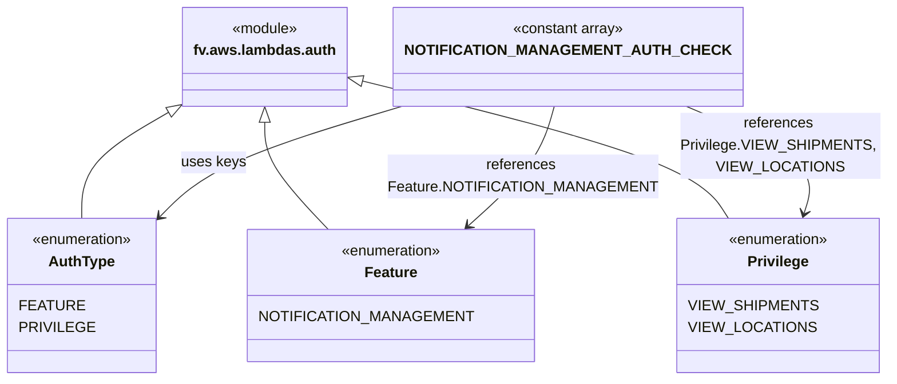

# Diagram: common/subscription_service/subscription_service/v2/auth_check.py


> Auto-generated by Obscura crawlers

## Diagram 1



### SVG

<svg id="container" width="902.390625" xmlns="http://www.w3.org/2000/svg" class="classDiagram" height="414" viewBox="0 0 902.390625 414" role="graphics-document document" aria-roledescription="class"><style>#container{font-family:"trebuchet ms",verdana,arial,sans-serif;font-size:16px;fill:#333;}@keyframes edge-animation-frame{from{stroke-dashoffset:0;}}@keyframes dash{to{stroke-dashoffset:0;}}#container .edge-animation-slow{stroke-dasharray:9,5!important;stroke-dashoffset:900;animation:dash 50s linear infinite;stroke-linecap:round;}#container .edge-animation-fast{stroke-dasharray:9,5!important;stroke-dashoffset:900;animation:dash 20s linear infinite;stroke-linecap:round;}#container .error-icon{fill:#552222;}#container .error-text{fill:#552222;stroke:#552222;}#container .edge-thickness-normal{stroke-width:1px;}#container .edge-thickness-thick{stroke-width:3.5px;}#container .edge-pattern-solid{stroke-dasharray:0;}#container .edge-thickness-invisible{stroke-width:0;fill:none;}#container .edge-pattern-dashed{stroke-dasharray:3;}#container .edge-pattern-dotted{stroke-dasharray:2;}#container .marker{fill:#333333;stroke:#333333;}#container .marker.cross{stroke:#333333;}#container svg{font-family:"trebuchet ms",verdana,arial,sans-serif;font-size:16px;}#container p{margin:0;}#container g.classGroup text{fill:#9370DB;stroke:none;font-family:"trebuchet ms",verdana,arial,sans-serif;font-size:10px;}#container g.classGroup text .title{font-weight:bolder;}#container .nodeLabel,#container .edgeLabel{color:#131300;}#container .edgeLabel .label rect{fill:#ECECFF;}#container .label text{fill:#131300;}#container .labelBkg{background:#ECECFF;}#container .edgeLabel .label span{background:#ECECFF;}#container .classTitle{font-weight:bolder;}#container .node rect,#container .node circle,#container .node ellipse,#container .node polygon,#container .node path{fill:#ECECFF;stroke:#9370DB;stroke-width:1px;}#container .divider{stroke:#9370DB;stroke-width:1;}#container g.clickable{cursor:pointer;}#container g.classGroup rect{fill:#ECECFF;stroke:#9370DB;}#container g.classGroup line{stroke:#9370DB;stroke-width:1;}#container .classLabel .box{stroke:none;stroke-width:0;fill:#ECECFF;opacity:0.5;}#container .classLabel .label{fill:#9370DB;font-size:10px;}#container .relation{stroke:#333333;stroke-width:1;fill:none;}#container .dashed-line{stroke-dasharray:3;}#container .dotted-line{stroke-dasharray:1 2;}#container #compositionStart,#container .composition{fill:#333333!important;stroke:#333333!important;stroke-width:1;}#container #compositionEnd,#container .composition{fill:#333333!important;stroke:#333333!important;stroke-width:1;}#container #dependencyStart,#container .dependency{fill:#333333!important;stroke:#333333!important;stroke-width:1;}#container #dependencyStart,#container .dependency{fill:#333333!important;stroke:#333333!important;stroke-width:1;}#container #extensionStart,#container .extension{fill:transparent!important;stroke:#333333!important;stroke-width:1;}#container #extensionEnd,#container .extension{fill:transparent!important;stroke:#333333!important;stroke-width:1;}#container #aggregationStart,#container .aggregation{fill:transparent!important;stroke:#333333!important;stroke-width:1;}#container #aggregationEnd,#container .aggregation{fill:transparent!important;stroke:#333333!important;stroke-width:1;}#container #lollipopStart,#container .lollipop{fill:#ECECFF!important;stroke:#333333!important;stroke-width:1;}#container #lollipopEnd,#container .lollipop{fill:#ECECFF!important;stroke:#333333!important;stroke-width:1;}#container .edgeTerminals{font-size:11px;line-height:initial;}#container .classTitleText{text-anchor:middle;font-size:18px;fill:#333;}#container .label-icon{display:inline-block;height:1em;overflow:visible;vertical-align:-0.125em;}#container .node .label-icon path{fill:currentColor;stroke:revert;stroke-width:revert;}#container :root{--mermaid-font-family:"trebuchet ms",verdana,arial,sans-serif;}</style><g><defs><marker id="container_class-aggregationStart" class="marker aggregation class" refX="18" refY="7" markerWidth="190" markerHeight="240" orient="auto"><path d="M 18,7 L9,13 L1,7 L9,1 Z"></path></marker></defs><defs><marker id="container_class-aggregationEnd" class="marker aggregation class" refX="1" refY="7" markerWidth="20" markerHeight="28" orient="auto"><path d="M 18,7 L9,13 L1,7 L9,1 Z"></path></marker></defs><defs><marker id="container_class-extensionStart" class="marker extension class" refX="18" refY="7" markerWidth="190" markerHeight="240" orient="auto"><path d="M 1,7 L18,13 V 1 Z"></path></marker></defs><defs><marker id="container_class-extensionEnd" class="marker extension class" refX="1" refY="7" markerWidth="20" markerHeight="28" orient="auto"><path d="M 1,1 V 13 L18,7 Z"></path></marker></defs><defs><marker id="container_class-compositionStart" class="marker composition class" refX="18" refY="7" markerWidth="190" markerHeight="240" orient="auto"><path d="M 18,7 L9,13 L1,7 L9,1 Z"></path></marker></defs><defs><marker id="container_class-compositionEnd" class="marker composition class" refX="1" refY="7" markerWidth="20" markerHeight="28" orient="auto"><path d="M 18,7 L9,13 L1,7 L9,1 Z"></path></marker></defs><defs><marker id="container_class-dependencyStart" class="marker dependency class" refX="6" refY="7" markerWidth="190" markerHeight="240" orient="auto"><path d="M 5,7 L9,13 L1,7 L9,1 Z"></path></marker></defs><defs><marker id="container_class-dependencyEnd" class="marker dependency class" refX="13" refY="7" markerWidth="20" markerHeight="28" orient="auto"><path d="M 18,7 L9,13 L14,7 L9,1 Z"></path></marker></defs><defs><marker id="container_class-lollipopStart" class="marker lollipop class" refX="13" refY="7" markerWidth="190" markerHeight="240" orient="auto"><circle stroke="black" fill="transparent" cx="7" cy="7" r="6"></circle></marker></defs><defs><marker id="container_class-lollipopEnd" class="marker lollipop class" refX="1" refY="7" markerWidth="190" markerHeight="240" orient="auto"><circle stroke="black" fill="transparent" cx="7" cy="7" r="6"></circle></marker></defs><g class="root"><g class="clusters"></g><g class="edgePaths"><path d="M172.156,123.448L157.453,132.373C142.749,141.299,113.341,159.149,98.637,178.241C83.934,197.333,83.934,217.667,83.934,227.833L83.934,238" id="id_fv.aws.lambdas.auth_AuthType_1" class="edge-thickness-normal edge-pattern-solid relation" style=";;;" data-edge="true" data-et="edge" data-id="id_fv.aws.lambdas.auth_AuthType_1" data-points="W3sieCI6MTg2LjkwMjM0Mzc1LCJ5IjoxMTQuNDk2OTA3MjE2NDk0ODV9LHsieCI6ODMuOTMzNTkzNzUsInkiOjE3N30seyJ4Ijo4My45MzM1OTM3NSwieSI6MjM4fV0=" marker-start="url(#container_class-extensionStart)"></path><path d="M273.387,133.25L273.387,140.542C273.387,147.833,273.387,162.417,283.84,181.875C294.294,201.333,315.2,225.667,325.654,237.833L336.107,250" id="id_fv.aws.lambdas.auth_Feature_2" class="edge-thickness-normal edge-pattern-solid relation" style=";;;" data-edge="true" data-et="edge" data-id="id_fv.aws.lambdas.auth_Feature_2" data-points="W3sieCI6MjczLjM4NjcxODc1LCJ5IjoxMTZ9LHsieCI6MjczLjM4NjcxODc1LCJ5IjoxNzd9LHsieCI6MzM2LjEwNzMyNzU4NjIwNjksInkiOjI1MH1d" marker-start="url(#container_class-extensionStart)"></path><path d="M376.524,89.874L430.253,104.395C483.983,118.916,591.443,147.958,651.737,172.646C712.03,197.333,725.158,217.667,731.722,227.833L738.286,238" id="id_fv.aws.lambdas.auth_Privilege_3" class="edge-thickness-normal edge-pattern-solid relation" style=";;;" data-edge="true" data-et="edge" data-id="id_fv.aws.lambdas.auth_Privilege_3" data-points="W3sieCI6MzU5Ljg3MTA5Mzc1LCJ5Ijo4NS4zNzMyOTcxMDI3Nzk3Mn0seyJ4Ijo2OTguOTAyMzQzNzUsInkiOjE3N30seyJ4Ijo3MzguMjg2MTI2MDc3NTg2MiwieSI6MjM4fV0=" marker-start="url(#container_class-extensionStart)"></path><path d="M409.871,115.68L378.027,125.9C346.184,136.12,282.496,156.56,241.51,176.609C200.524,196.658,182.239,216.315,173.096,226.144L163.954,235.973" id="id_NOTIFICATION_MANAGEMENT_AUTH_CHECK_AuthType_4" class="edge-thickness-normal edge-pattern-solid relation" style=";;;" data-edge="true" data-et="edge" data-id="id_NOTIFICATION_MANAGEMENT_AUTH_CHECK_AuthType_4" data-points="W3sieCI6NDA5Ljg3MTA5Mzc1LCJ5IjoxMTUuNjgwMDM5MjQ1NjEyMTJ9LHsieCI6MjE4LjgwODU5Mzc1LCJ5IjoxNzd9LHsieCI6MTU5Ljg2NzE4NzUsInkiOjI0MC4zNjYxMDg2NjU0MzA5NH1d" marker-end="url(#container_class-dependencyEnd)"></path><path d="M562.51,116L559.758,126.167C557.005,136.333,551.501,156.667,537.042,178.3C522.583,199.934,499.171,222.868,487.465,234.335L475.758,245.801" id="id_NOTIFICATION_MANAGEMENT_AUTH_CHECK_Feature_5" class="edge-thickness-normal edge-pattern-solid relation" style=";;;" data-edge="true" data-et="edge" data-id="id_NOTIFICATION_MANAGEMENT_AUTH_CHECK_Feature_5" data-points="W3sieCI6NTYyLjUxMDAyMDM4MDQzNDgsInkiOjExNn0seyJ4Ijo1NDUuOTk2MDkzNzUsInkiOjE3N30seyJ4Ijo0NzEuNDcxOTgyNzU4NjIwNywieSI6MjUwfV0=" marker-end="url(#container_class-dependencyEnd)"></path><path d="M696.006,116L718.387,126.167C740.768,136.333,785.531,156.667,805.515,176.032C825.5,195.398,820.707,213.796,818.311,222.995L815.915,232.194" id="id_NOTIFICATION_MANAGEMENT_AUTH_CHECK_Privilege_6" class="edge-thickness-normal edge-pattern-solid relation" style=";;;" data-edge="true" data-et="edge" data-id="id_NOTIFICATION_MANAGEMENT_AUTH_CHECK_Privilege_6" data-points="W3sieCI6Njk2LjAwNTk0NDI5MzQ3ODMsInkiOjExNn0seyJ4Ijo4MzAuMjkyOTY4NzUsInkiOjE3N30seyJ4Ijo4MTQuNDAyMDc0MzUzNDQ4MywieSI6MjM4fV0=" marker-end="url(#container_class-dependencyEnd)"></path></g><g class="edgeLabels"><g class="edgeLabel"><g class="label" data-id="id_fv.aws.lambdas.auth_AuthType_1" transform="translate(0, 0)"><foreignObject width="0" height="0"><div xmlns="http://www.w3.org/1999/xhtml" class="labelBkg" style="display: table-cell; white-space: nowrap; line-height: 1.5; max-width: 200px; text-align: center;"><span class="edgeLabel"></span></div></foreignObject></g></g><g class="edgeLabel"><g class="label" data-id="id_fv.aws.lambdas.auth_Feature_2" transform="translate(0, 0)"><foreignObject width="0" height="0"><div xmlns="http://www.w3.org/1999/xhtml" class="labelBkg" style="display: table-cell; white-space: nowrap; line-height: 1.5; max-width: 200px; text-align: center;"><span class="edgeLabel"></span></div></foreignObject></g></g><g class="edgeLabel"><g class="label" data-id="id_fv.aws.lambdas.auth_Privilege_3" transform="translate(0, 0)"><foreignObject width="0" height="0"><div xmlns="http://www.w3.org/1999/xhtml" class="labelBkg" style="display: table-cell; white-space: nowrap; line-height: 1.5; max-width: 200px; text-align: center;"><span class="edgeLabel"></span></div></foreignObject></g></g><g class="edgeLabel" transform="translate(218.80859375, 177)"><g class="label" data-id="id_NOTIFICATION_MANAGEMENT_AUTH_CHECK_AuthType_4" transform="translate(-34.578125, -12)"><foreignObject width="69.15625" height="24"><div xmlns="http://www.w3.org/1999/xhtml" class="labelBkg" style="display: table-cell; white-space: nowrap; line-height: 1.5; max-width: 200px; text-align: center;"><span class="edgeLabel"><p>uses keys</p></span></div></foreignObject></g></g><g class="edgeLabel" transform="translate(531.30676, 191.38892)"><g class="label" data-id="id_NOTIFICATION_MANAGEMENT_AUTH_CHECK_Feature_5" transform="translate(-132.90625, -24)"><foreignObject width="265.8125" height="48"><div xmlns="http://www.w3.org/1999/xhtml" class="labelBkg" style="display: table; white-space: break-spaces; line-height: 1.5; max-width: 200px; text-align: center; width: 200px;"><span class="edgeLabel"><p>references Feature.NOTIFICATION_MANAGEMENT</p></span></div></foreignObject></g></g><g class="edgeLabel" transform="translate(791.84551, 159.53521)"><g class="label" data-id="id_NOTIFICATION_MANAGEMENT_AUTH_CHECK_Privilege_6" transform="translate(-100, -36)"><foreignObject width="200" height="72"><div xmlns="http://www.w3.org/1999/xhtml" class="labelBkg" style="display: table; white-space: break-spaces; line-height: 1.5; max-width: 200px; text-align: center; width: 200px;"><span class="edgeLabel"><p>references Privilege.VIEW_SHIPMENTS, VIEW_LOCATIONS</p></span></div></foreignObject></g></g></g><g class="nodes"><g class="node default" id="classId-fv.aws.lambdas.auth-0" transform="translate(273.38671875, 62)"><g class="basic label-container"><path d="M-86.484375 -54 L86.484375 -54 L86.484375 54 L-86.484375 54" stroke="none" stroke-width="0" fill="#ECECFF" style=""></path><path d="M-86.484375 -54 C-36.81847203696161 -54, 12.847430926076782 -54, 86.484375 -54 M-86.484375 -54 C-34.8515299908449 -54, 16.781315018310195 -54, 86.484375 -54 M86.484375 -54 C86.484375 -16.712998333054927, 86.484375 20.574003333890147, 86.484375 54 M86.484375 -54 C86.484375 -28.05049321048595, 86.484375 -2.1009864209719, 86.484375 54 M86.484375 54 C41.566554455769 54, -3.3512660884619976 54, -86.484375 54 M86.484375 54 C45.744585553449994 54, 5.004796106899988 54, -86.484375 54 M-86.484375 54 C-86.484375 12.583178825461765, -86.484375 -28.83364234907647, -86.484375 -54 M-86.484375 54 C-86.484375 23.584420089976938, -86.484375 -6.831159820046125, -86.484375 -54" stroke="#9370DB" stroke-width="1.3" fill="none" stroke-dasharray="0 0" style=""></path></g><g class="annotation-group text" transform="translate(-36.6015625, -30)"><g class="label" style="" transform="translate(0,-12)"><foreignObject width="73.203125" height="24"><div xmlns="http://www.w3.org/1999/xhtml" style="display: table-cell; white-space: nowrap; line-height: 1.5; max-width: 123px; text-align: center;"><span class="nodeLabel markdown-node-label" style=""><p>«module»</p></span></div></foreignObject></g></g><g class="label-group text" transform="translate(-74.484375, -6)"><g class="label" style="font-weight: bolder" transform="translate(0,-12)"><foreignObject width="148.96875" height="24"><div xmlns="http://www.w3.org/1999/xhtml" style="display: table-cell; white-space: nowrap; line-height: 1.5; max-width: 197px; text-align: center;"><span class="nodeLabel markdown-node-label" style=""><p>fv.aws.lambdas.auth</p></span></div></foreignObject></g></g><g class="members-group text" transform="translate(-74.484375, 42)"></g><g class="methods-group text" transform="translate(-74.484375, 72)"></g><g class="divider" style=""><path d="M-86.484375 18 C-21.484660850402747 18, 43.515053299194506 18, 86.484375 18 M-86.484375 18 C-22.541963786593755 18, 41.40044742681249 18, 86.484375 18" stroke="#9370DB" stroke-width="1.3" fill="none" stroke-dasharray="0 0" style=""></path></g><g class="divider" style=""><path d="M-86.484375 36 C-24.04119142974333 36, 38.40199214051334 36, 86.484375 36 M-86.484375 36 C-51.45603740050941 36, -16.427699801018818 36, 86.484375 36" stroke="#9370DB" stroke-width="1.3" fill="none" stroke-dasharray="0 0" style=""></path></g></g><g class="node default" id="classId-AuthType-1" transform="translate(83.93359375, 322)"><g class="basic label-container"><path d="M-75.93359375 -84 L75.93359375 -84 L75.93359375 84 L-75.93359375 84" stroke="none" stroke-width="0" fill="#ECECFF" style=""></path><path d="M-75.93359375 -84 C-36.09750201369325 -84, 3.738589722613497 -84, 75.93359375 -84 M-75.93359375 -84 C-26.58817754138221 -84, 22.757238667235583 -84, 75.93359375 -84 M75.93359375 -84 C75.93359375 -44.50565575250652, 75.93359375 -5.01131150501304, 75.93359375 84 M75.93359375 -84 C75.93359375 -22.5541543268399, 75.93359375 38.8916913463202, 75.93359375 84 M75.93359375 84 C20.254198207848802 84, -35.425197334302396 84, -75.93359375 84 M75.93359375 84 C22.764512798808987 84, -30.404568152382026 84, -75.93359375 84 M-75.93359375 84 C-75.93359375 38.23248795861907, -75.93359375 -7.535024082761865, -75.93359375 -84 M-75.93359375 84 C-75.93359375 33.782086509790204, -75.93359375 -16.43582698041959, -75.93359375 -84" stroke="#9370DB" stroke-width="1.3" fill="none" stroke-dasharray="0 0" style=""></path></g><g class="annotation-group text" transform="translate(-55.5546875, -60)"><g class="label" style="" transform="translate(0,-12)"><foreignObject width="111.109375" height="24"><div xmlns="http://www.w3.org/1999/xhtml" style="display: table-cell; white-space: nowrap; line-height: 1.5; max-width: 161px; text-align: center;"><span class="nodeLabel markdown-node-label" style=""><p>«enumeration»</p></span></div></foreignObject></g></g><g class="label-group text" transform="translate(-34.34375, -36)"><g class="label" style="font-weight: bolder" transform="translate(0,-12)"><foreignObject width="68.6875" height="24"><div xmlns="http://www.w3.org/1999/xhtml" style="display: table-cell; white-space: nowrap; line-height: 1.5; max-width: 117px; text-align: center;"><span class="nodeLabel markdown-node-label" style=""><p>AuthType</p></span></div></foreignObject></g></g><g class="members-group text" transform="translate(-63.93359375, 12)"><g class="label" style="" transform="translate(0,-12)"><foreignObject width="61.890625" height="24"><div xmlns="http://www.w3.org/1999/xhtml" style="display: table-cell; white-space: nowrap; line-height: 1.5; max-width: 112px; text-align: center;"><span class="nodeLabel markdown-node-label" style=""><p>FEATURE</p></span></div></foreignObject></g><g class="label" style="" transform="translate(0,12)"><foreignObject width="72.3125" height="24"><div xmlns="http://www.w3.org/1999/xhtml" style="display: table-cell; white-space: nowrap; line-height: 1.5; max-width: 122px; text-align: center;"><span class="nodeLabel markdown-node-label" style=""><p>PRIVILEGE</p></span></div></foreignObject></g></g><g class="methods-group text" transform="translate(-63.93359375, 84)"></g><g class="divider" style=""><path d="M-75.93359375 -12 C-39.631181618835654 -12, -3.328769487671309 -12, 75.93359375 -12 M-75.93359375 -12 C-38.61008200805154 -12, -1.2865702661030838 -12, 75.93359375 -12" stroke="#9370DB" stroke-width="1.3" fill="none" stroke-dasharray="0 0" style=""></path></g><g class="divider" style=""><path d="M-75.93359375 60 C-36.4936343253427 60, 2.946325099314606 60, 75.93359375 60 M-75.93359375 60 C-38.670996438549636 60, -1.4083991270992726 60, 75.93359375 60" stroke="#9370DB" stroke-width="1.3" fill="none" stroke-dasharray="0 0" style=""></path></g></g><g class="node default" id="classId-Feature-2" transform="translate(397.96875, 322)"><g class="basic label-container"><path d="M-143.81640625 -72 L143.81640625 -72 L143.81640625 72 L-143.81640625 72" stroke="none" stroke-width="0" fill="#ECECFF" style=""></path><path d="M-143.81640625 -72 C-78.06810226023192 -72, -12.31979827046385 -72, 143.81640625 -72 M-143.81640625 -72 C-74.76213161254452 -72, -5.707856975089044 -72, 143.81640625 -72 M143.81640625 -72 C143.81640625 -33.69301924067575, 143.81640625 4.613961518648495, 143.81640625 72 M143.81640625 -72 C143.81640625 -41.94501671675414, 143.81640625 -11.890033433508272, 143.81640625 72 M143.81640625 72 C32.961198264491586 72, -77.89400972101683 72, -143.81640625 72 M143.81640625 72 C62.015100906994945 72, -19.78620443601011 72, -143.81640625 72 M-143.81640625 72 C-143.81640625 28.328859120972623, -143.81640625 -15.342281758054753, -143.81640625 -72 M-143.81640625 72 C-143.81640625 16.199398327916107, -143.81640625 -39.601203344167786, -143.81640625 -72" stroke="#9370DB" stroke-width="1.3" fill="none" stroke-dasharray="0 0" style=""></path></g><g class="annotation-group text" transform="translate(-55.5546875, -48)"><g class="label" style="" transform="translate(0,-12)"><foreignObject width="111.109375" height="24"><div xmlns="http://www.w3.org/1999/xhtml" style="display: table-cell; white-space: nowrap; line-height: 1.5; max-width: 161px; text-align: center;"><span class="nodeLabel markdown-node-label" style=""><p>«enumeration»</p></span></div></foreignObject></g></g><g class="label-group text" transform="translate(-27.390625, -24)"><g class="label" style="font-weight: bolder" transform="translate(0,-12)"><foreignObject width="54.78125" height="24"><div xmlns="http://www.w3.org/1999/xhtml" style="display: table-cell; white-space: nowrap; line-height: 1.5; max-width: 104px; text-align: center;"><span class="nodeLabel markdown-node-label" style=""><p>Feature</p></span></div></foreignObject></g></g><g class="members-group text" transform="translate(-131.81640625, 24)"><g class="label" style="" transform="translate(0,-12)"><foreignObject width="208.078125" height="24"><div xmlns="http://www.w3.org/1999/xhtml" style="display: table-cell; white-space: nowrap; line-height: 1.5; max-width: 259px; text-align: center;"><span class="nodeLabel markdown-node-label" style=""><p>NOTIFICATION_MANAGEMENT</p></span></div></foreignObject></g></g><g class="methods-group text" transform="translate(-131.81640625, 72)"></g><g class="divider" style=""><path d="M-143.81640625 0 C-63.70453825338194 0, 16.40732974323612 0, 143.81640625 0 M-143.81640625 0 C-42.31079355757666 0, 59.19481913484668 0, 143.81640625 0" stroke="#9370DB" stroke-width="1.3" fill="none" stroke-dasharray="0 0" style=""></path></g><g class="divider" style=""><path d="M-143.81640625 48 C-30.786993519915427 48, 82.24241921016915 48, 143.81640625 48 M-143.81640625 48 C-75.66844780951561 48, -7.520489369031225 48, 143.81640625 48" stroke="#9370DB" stroke-width="1.3" fill="none" stroke-dasharray="0 0" style=""></path></g></g><g class="node default" id="classId-Privilege-3" transform="translate(792.51953125, 322)"><g class="basic label-container"><path d="M-101.87109375 -84 L101.87109375 -84 L101.87109375 84 L-101.87109375 84" stroke="none" stroke-width="0" fill="#ECECFF" style=""></path><path d="M-101.87109375 -84 C-50.032862565324734 -84, 1.8053686193505314 -84, 101.87109375 -84 M-101.87109375 -84 C-51.80151551280095 -84, -1.7319372756018936 -84, 101.87109375 -84 M101.87109375 -84 C101.87109375 -21.551115097511307, 101.87109375 40.897769804977386, 101.87109375 84 M101.87109375 -84 C101.87109375 -49.611274897681334, 101.87109375 -15.222549795362667, 101.87109375 84 M101.87109375 84 C61.08811372314198 84, 20.30513369628396 84, -101.87109375 84 M101.87109375 84 C55.038706771895164 84, 8.206319793790328 84, -101.87109375 84 M-101.87109375 84 C-101.87109375 41.78701533838164, -101.87109375 -0.4259693232367141, -101.87109375 -84 M-101.87109375 84 C-101.87109375 27.703640930796254, -101.87109375 -28.59271813840749, -101.87109375 -84" stroke="#9370DB" stroke-width="1.3" fill="none" stroke-dasharray="0 0" style=""></path></g><g class="annotation-group text" transform="translate(-55.5546875, -60)"><g class="label" style="" transform="translate(0,-12)"><foreignObject width="111.109375" height="24"><div xmlns="http://www.w3.org/1999/xhtml" style="display: table-cell; white-space: nowrap; line-height: 1.5; max-width: 161px; text-align: center;"><span class="nodeLabel markdown-node-label" style=""><p>«enumeration»</p></span></div></foreignObject></g></g><g class="label-group text" transform="translate(-31.8671875, -36)"><g class="label" style="font-weight: bolder" transform="translate(0,-12)"><foreignObject width="63.734375" height="24"><div xmlns="http://www.w3.org/1999/xhtml" style="display: table-cell; white-space: nowrap; line-height: 1.5; max-width: 112px; text-align: center;"><span class="nodeLabel markdown-node-label" style=""><p>Privilege</p></span></div></foreignObject></g></g><g class="members-group text" transform="translate(-89.87109375, 12)"><g class="label" style="" transform="translate(0,-12)"><foreignObject width="124.1875" height="24"><div xmlns="http://www.w3.org/1999/xhtml" style="display: table-cell; white-space: nowrap; line-height: 1.5; max-width: 174px; text-align: center;"><span class="nodeLabel markdown-node-label" style=""><p>VIEW_SHIPMENTS</p></span></div></foreignObject></g><g class="label" style="" transform="translate(0,12)"><foreignObject width="122.125" height="24"><div xmlns="http://www.w3.org/1999/xhtml" style="display: table-cell; white-space: nowrap; line-height: 1.5; max-width: 172px; text-align: center;"><span class="nodeLabel markdown-node-label" style=""><p>VIEW_LOCATIONS</p></span></div></foreignObject></g></g><g class="methods-group text" transform="translate(-89.87109375, 84)"></g><g class="divider" style=""><path d="M-101.87109375 -12 C-37.60296937995416 -12, 26.66515499009168 -12, 101.87109375 -12 M-101.87109375 -12 C-53.95075015122538 -12, -6.030406552450756 -12, 101.87109375 -12" stroke="#9370DB" stroke-width="1.3" fill="none" stroke-dasharray="0 0" style=""></path></g><g class="divider" style=""><path d="M-101.87109375 60 C-39.887710965760455 60, 22.09567181847909 60, 101.87109375 60 M-101.87109375 60 C-26.884095452066376 60, 48.10290284586725 60, 101.87109375 60" stroke="#9370DB" stroke-width="1.3" fill="none" stroke-dasharray="0 0" style=""></path></g></g><g class="node default" id="classId-NOTIFICATION_MANAGEMENT_AUTH_CHECK-4" transform="translate(577.12890625, 62)"><g class="basic label-container"><path d="M-167.2578125 -54 L167.2578125 -54 L167.2578125 54 L-167.2578125 54" stroke="none" stroke-width="0" fill="#ECECFF" style=""></path><path d="M-167.2578125 -54 C-62.58626422180633 -54, 42.08528405638734 -54, 167.2578125 -54 M-167.2578125 -54 C-64.36100602739617 -54, 38.535800445207656 -54, 167.2578125 -54 M167.2578125 -54 C167.2578125 -17.397892073502994, 167.2578125 19.20421585299401, 167.2578125 54 M167.2578125 -54 C167.2578125 -17.730569207546033, 167.2578125 18.538861584907934, 167.2578125 54 M167.2578125 54 C35.44554752206545 54, -96.3667174558691 54, -167.2578125 54 M167.2578125 54 C41.210846776682615 54, -84.83611894663477 54, -167.2578125 54 M-167.2578125 54 C-167.2578125 30.629003159611525, -167.2578125 7.25800631922305, -167.2578125 -54 M-167.2578125 54 C-167.2578125 20.82897210594173, -167.2578125 -12.34205578811654, -167.2578125 -54" stroke="#9370DB" stroke-width="1.3" fill="none" stroke-dasharray="0 0" style=""></path></g><g class="annotation-group text" transform="translate(-61.03125, -30)"><g class="label" style="" transform="translate(0,-12)"><foreignObject width="122.0625" height="24"><div xmlns="http://www.w3.org/1999/xhtml" style="display: table-cell; white-space: nowrap; line-height: 1.5; max-width: 172px; text-align: center;"><span class="nodeLabel markdown-node-label" style=""><p>«constant array»</p></span></div></foreignObject></g></g><g class="label-group text" transform="translate(-155.2578125, -6)"><g class="label" style="font-weight: bolder" transform="translate(0,-12)"><foreignObject width="310.515625" height="24"><div xmlns="http://www.w3.org/1999/xhtml" style="display: table-cell; white-space: nowrap; line-height: 1.5; max-width: 359px; text-align: center;"><span class="nodeLabel markdown-node-label" style=""><p>NOTIFICATION_MANAGEMENT_AUTH_CHECK</p></span></div></foreignObject></g></g><g class="members-group text" transform="translate(-155.2578125, 42)"></g><g class="methods-group text" transform="translate(-155.2578125, 72)"></g><g class="divider" style=""><path d="M-167.2578125 18 C-53.53506862979499 18, 60.187675240410016 18, 167.2578125 18 M-167.2578125 18 C-57.15513288985399 18, 52.947546720292024 18, 167.2578125 18" stroke="#9370DB" stroke-width="1.3" fill="none" stroke-dasharray="0 0" style=""></path></g><g class="divider" style=""><path d="M-167.2578125 36 C-86.22296314980642 36, -5.188113799612836 36, 167.2578125 36 M-167.2578125 36 C-66.89346144821741 36, 33.47088960356518 36, 167.2578125 36" stroke="#9370DB" stroke-width="1.3" fill="none" stroke-dasharray="0 0" style=""></path></g></g></g></g></g></svg>

## Diagram 2

```mermaid
flowchart LR
    A[Module: fv.aws.lambdas.auth] --> B[AuthType.FEATURE]
    A --> C[AuthType.PRIVILEGE]
    B --> D[Feature.NOTIFICATION_MANAGEMENT]
    C --> E[Privilege.VIEW_SHIPMENTS]
    C --> F[Privilege.VIEW_LOCATIONS]
    subgraph CHECK[NOTIFICATION_MANAGEMENT_AUTH_CHECK[0]]
        direction TB
        G{AuthType.FEATURE} --> H[list: ["list": Feature.NOTIFICATION_MANAGEMENT]]
        H --> I[path: {"feature": "requestContext.authorizer.features"}]
        J{AuthType.PRIVILEGE} --> K[list: [Privilege.VIEW_SHIPMENTS, Privilege.VIEW_LOCATIONS]]
    end
    B --> G
    C --> J
```

> SVG rendering failed for this diagram.
