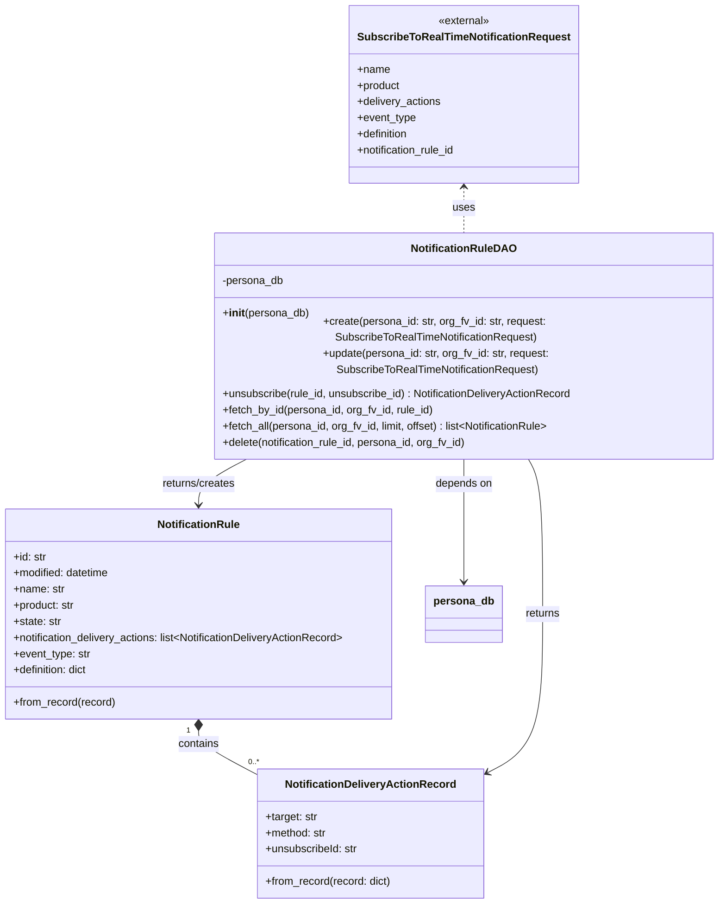

# Diagram: common/subscription_service/subscription_service/v2/db/notification_rule_dao.py

> Auto-generated by Obscura crawlers

## Mermaid

### SVG

<svg id="container" width="1082.18359375" xmlns="http://www.w3.org/2000/svg" class="classDiagram" height="1294" viewBox="0 0 1082.18359375 1294" role="graphics-document document" aria-roledescription="class"><g><defs><marker id="container_class-aggregationStart" class="marker aggregation class" refX="18" refY="7" markerWidth="190" markerHeight="240" orient="auto"><path d="M 18,7 L9,13 L1,7 L9,1 Z"></path></marker></defs><defs><marker id="container_class-aggregationEnd" class="marker aggregation class" refX="1" refY="7" markerWidth="20" markerHeight="28" orient="auto"><path d="M 18,7 L9,13 L1,7 L9,1 Z"></path></marker></defs><defs><marker id="container_class-extensionStart" class="marker extension class" refX="18" refY="7" markerWidth="190" markerHeight="240" orient="auto"><path d="M 1,7 L18,13 V 1 Z"></path></marker></defs><defs><marker id="container_class-extensionEnd" class="marker extension class" refX="1" refY="7" markerWidth="20" markerHeight="28" orient="auto"><path d="M 1,1 V 13 L18,7 Z"></path></marker></defs><defs><marker id="container_class-compositionStart" class="marker composition class" refX="18" refY="7" markerWidth="190" markerHeight="240" orient="auto"><path d="M 18,7 L9,13 L1,7 L9,1 Z"></path></marker></defs><defs><marker id="container_class-compositionEnd" class="marker composition class" refX="1" refY="7" markerWidth="20" markerHeight="28" orient="auto"><path d="M 18,7 L9,13 L1,7 L9,1 Z"></path></marker></defs><defs><marker id="container_class-dependencyStart" class="marker dependency class" refX="6" refY="7" markerWidth="190" markerHeight="240" orient="auto"><path d="M 5,7 L9,13 L1,7 L9,1 Z"></path></marker></defs><defs><marker id="container_class-dependencyEnd" class="marker dependency class" refX="13" refY="7" markerWidth="20" markerHeight="28" orient="auto"><path d="M 18,7 L9,13 L14,7 L9,1 Z"></path></marker></defs><defs><marker id="container_class-lollipopStart" class="marker lollipop class" refX="13" refY="7" markerWidth="190" markerHeight="240" orient="auto"><circle stroke="black" fill="transparent" cx="7" cy="7" r="6"></circle></marker></defs><defs><marker id="container_class-lollipopEnd" class="marker lollipop class" refX="1" refY="7" markerWidth="190" markerHeight="240" orient="auto"><circle stroke="black" fill="transparent" cx="7" cy="7" r="6"></circle></marker></defs><g class="root"><g class="clusters"></g><g class="edgePaths"><path d="M700.602,278L700.602,283.167C700.602,288.333,700.602,298.667,700.602,310C700.602,321.333,700.602,333.667,700.602,339.833L700.602,346" id="id_SubscribeToRealTimeNotificationRequest_NotificationRuleDAO_1" class="edge-thickness-normal edge-pattern-dashed relation" style=";;;" data-edge="true" data-et="edge" data-id="id_SubscribeToRealTimeNotificationRequest_NotificationRuleDAO_1" data-points="W3sieCI6NzAwLjYwMTU2MjUsInkiOjI3Mn0seyJ4Ijo3MDAuNjAxNTYyNSwieSI6MzA5fSx7IngiOjcwMC42MDE1NjI1LCJ5IjozNDZ9XQ==" marker-start="url(#container_class-dependencyStart)"></path><path d="M301.59,1037.25L301.59,1040.542C301.59,1043.833,301.59,1050.417,316.705,1061.505C331.82,1072.593,362.049,1088.185,377.164,1095.982L392.279,1103.778" id="id_NotificationRule_NotificationDeliveryActionRecord_2" class="edge-thickness-normal edge-pattern-solid relation" style=";;;" data-edge="true" data-et="edge" data-id="id_NotificationRule_NotificationDeliveryActionRecord_2" data-points="W3sieCI6MzAxLjU4OTg0Mzc1LCJ5IjoxMDIwfSx7IngiOjMwMS41ODk4NDM3NSwieSI6MTA1N30seyJ4IjozOTIuMjc5Mjk2ODc1LCJ5IjoxMTAzLjc3ODAzMTk0OTk0NjZ9XQ==" marker-start="url(#container_class-compositionStart)"></path><path d="M383.156,634L369.561,640.167C355.967,646.333,328.778,658.667,315.184,670C301.59,681.333,301.59,691.667,301.59,696.833L301.59,702" id="id_NotificationRuleDAO_NotificationRule_3" class="edge-thickness-normal edge-pattern-solid relation" style=";;;" data-edge="true" data-et="edge" data-id="id_NotificationRuleDAO_NotificationRule_3" data-points="W3sieCI6MzgzLjE1NTc3NTIwNzE4MjMzLCJ5Ijo2MzR9LHsieCI6MzAxLjU4OTg0Mzc1LCJ5Ijo2NzF9LHsieCI6MzAxLjU4OTg0Mzc1LCJ5Ijo3MDh9XQ==" marker-end="url(#container_class-dependencyEnd)"></path><path d="M793.436,634L797.411,640.167C801.387,646.333,809.338,658.667,813.314,697C817.289,735.333,817.289,799.667,817.289,864C817.289,928.333,817.289,992.667,803.063,1032.171C788.837,1071.676,760.384,1086.352,746.158,1093.69L731.932,1101.028" id="id_NotificationRuleDAO_NotificationDeliveryActionRecord_4" class="edge-thickness-normal edge-pattern-solid relation" style=";;;" data-edge="true" data-et="edge" data-id="id_NotificationRuleDAO_NotificationDeliveryActionRecord_4" data-points="W3sieCI6NzkzLjQzNTgxNjY0MzY0NjQsInkiOjYzNH0seyJ4Ijo4MTcuMjg5MDYyNSwieSI6NjcxfSx7IngiOjgxNy4yODkwNjI1LCJ5Ijo4NjR9LHsieCI6ODE3LjI4OTA2MjUsInkiOjEwNTd9LHsieCI6NzI2LjU5OTYwOTM3NSwieSI6MTEwMy43NzgwMzE5NDk5NDY2fV0=" marker-end="url(#container_class-dependencyEnd)"></path><path d="M700.602,634L700.602,640.167C700.602,646.333,700.602,658.667,700.602,689C700.602,719.333,700.602,767.667,700.602,791.833L700.602,816" id="id_NotificationRuleDAO_persona_db_5" class="edge-thickness-normal edge-pattern-solid relation" style=";;;" data-edge="true" data-et="edge" data-id="id_NotificationRuleDAO_persona_db_5" data-points="W3sieCI6NzAwLjYwMTU2MjUsInkiOjYzNH0seyJ4Ijo3MDAuNjAxNTYyNSwieSI6NjcxfSx7IngiOjcwMC42MDE1NjI1LCJ5Ijo4MjJ9XQ==" marker-end="url(#container_class-dependencyEnd)"></path></g><g class="edgeLabels"><g class="edgeLabel" transform="translate(700.6015625, 309)"><g class="label" data-id="id_SubscribeToRealTimeNotificationRequest_NotificationRuleDAO_1" transform="translate(-16.4921875, -12)"><foreignObject width="32.984375" height="24">

uses

</foreignObject></g></g><g class="edgeLabel" transform="translate(301.58984375, 1057)"><g class="label" data-id="id_NotificationRule_NotificationDeliveryActionRecord_2" transform="translate(-30.890625, -12)"><foreignObject width="61.78125" height="24">

contains

</foreignObject></g></g><g class="edgeLabel" transform="translate(301.58984375, 671)"><g class="label" data-id="id_NotificationRuleDAO_NotificationRule_3" transform="translate(-56.1953125, -12)"><foreignObject width="112.390625" height="24">

returns/creates

</foreignObject></g></g><g class="edgeLabel" transform="translate(817.2890625, 864)"><g class="label" data-id="id_NotificationRuleDAO_NotificationDeliveryActionRecord_4" transform="translate(-26.265625, -12)"><foreignObject width="52.53125" height="24">

returns

</foreignObject></g></g><g class="edgeLabel" transform="translate(700.6015625, 671)"><g class="label" data-id="id_NotificationRuleDAO_persona_db_5" transform="translate(-42.9453125, -12)"><foreignObject width="85.890625" height="24">

depends on

</foreignObject></g></g><g class="edgeTerminals" transform="translate(286.5898418750001, 1037.4999983928572)"><g class="inner" transform="translate(0, 0)"><foreignObject style="width: 9px; height: 12px;">
1
</foreignObject></g></g><g class="edgeTerminals" transform="translate(378.6026061545078, 1077.4246935355986)"><g class="inner" transform="translate(0, 0)"></g><foreignObject style="width: 36px; height: 12px;">
0..*
</foreignObject></g></g><g class="nodes"><g class="node default" id="classId-SubscribeToRealTimeNotificationRequest-0" transform="translate(700.6015625, 140)"><g class="basic label-container"><path d="M-163.2734375 -132 L163.2734375 -132 L163.2734375 132 L-163.2734375 132" stroke="none" stroke-width="0" fill="#ECECFF" style=""></path><path d="M-163.2734375 -132 C-62.03451397083445 -132, 39.20440955833109 -132, 163.2734375 -132 M-163.2734375 -132 C-71.95398960076258 -132, 19.365458298474834 -132, 163.2734375 -132 M163.2734375 -132 C163.2734375 -77.10366309946019, 163.2734375 -22.207326198920384, 163.2734375 132 M163.2734375 -132 C163.2734375 -43.69354269494005, 163.2734375 44.6129146101199, 163.2734375 132 M163.2734375 132 C37.448008910807985 132, -88.37741967838403 132, -163.2734375 132 M163.2734375 132 C32.963520597537496 132, -97.34639630492501 132, -163.2734375 132 M-163.2734375 132 C-163.2734375 31.851536700499253, -163.2734375 -68.2969265990015, -163.2734375 -132 M-163.2734375 132 C-163.2734375 59.47019107611574, -163.2734375 -13.059617847768521, -163.2734375 -132" stroke="#9370DB" stroke-width="1.3" fill="none" stroke-dasharray="0 0" style=""></path></g><g class="annotation-group text" transform="translate(-38.65625, -108)"><g class="label" style="" transform="translate(0,-12)"><foreignObject width="77.3125" height="24">

«external»

</foreignObject></g></g><g class="label-group text" transform="translate(-151.2734375, -84)"><g class="label" style="font-weight: bolder" transform="translate(0,-12)"><foreignObject width="302.546875" height="24">

SubscribeToRealTimeNotificationRequest

</foreignObject></g></g><g class="members-group text" transform="translate(-151.2734375, -36)"><g class="label" style="" transform="translate(0,-12)"><foreignObject width="48.5" height="24">

+name

</foreignObject></g><g class="label" style="" transform="translate(0,12)"><foreignObject width="64.84375" height="24">

+product

</foreignObject></g><g class="label" style="" transform="translate(0,36)"><foreignObject width="126.40625" height="24">

+delivery_actions

</foreignObject></g><g class="label" style="" transform="translate(0,60)"><foreignObject width="88.125" height="24">

+event_type

</foreignObject></g><g class="label" style="" transform="translate(0,84)"><foreignObject width="78.375" height="24">

+definition

</foreignObject></g><g class="label" style="" transform="translate(0,108)"><foreignObject width="150.609375" height="24">

+notification_rule_id

</foreignObject></g></g><g class="methods-group text" transform="translate(-151.2734375, 132)"></g><g class="divider" style=""><path d="M-163.2734375 -60 C-55.49615446883887 -60, 52.281128562322266 -60, 163.2734375 -60 M-163.2734375 -60 C-95.12960773076932 -60, -26.985777961538645 -60, 163.2734375 -60" stroke="#9370DB" stroke-width="1.3" fill="none" stroke-dasharray="0 0" style=""></path></g><g class="divider" style=""><path d="M-163.2734375 108 C-44.034250117204664 108, 75.20493726559067 108, 163.2734375 108 M-163.2734375 108 C-55.83194600530079 108, 51.609545489398414 108, 163.2734375 108" stroke="#9370DB" stroke-width="1.3" fill="none" stroke-dasharray="0 0" style=""></path></g></g><g class="node default" id="classId-NotificationDeliveryActionRecord-1" transform="translate(559.439453125, 1190)"><g class="basic label-container"><path d="M-167.16015625 -96 L167.16015625 -96 L167.16015625 96 L-167.16015625 96" stroke="none" stroke-width="0" fill="#ECECFF" style=""></path><path d="M-167.16015625 -96 C-82.15297317692311 -96, 2.854209896153776 -96, 167.16015625 -96 M-167.16015625 -96 C-71.89154657099942 -96, 23.377063108001153 -96, 167.16015625 -96 M167.16015625 -96 C167.16015625 -41.70329628695029, 167.16015625 12.593407426099418, 167.16015625 96 M167.16015625 -96 C167.16015625 -42.12451386367606, 167.16015625 11.750972272647886, 167.16015625 96 M167.16015625 96 C38.96018176878525 96, -89.2397927124295 96, -167.16015625 96 M167.16015625 96 C96.1529830194183 96, 25.1458097888366 96, -167.16015625 96 M-167.16015625 96 C-167.16015625 26.718867560267483, -167.16015625 -42.56226487946503, -167.16015625 -96 M-167.16015625 96 C-167.16015625 25.636225875601326, -167.16015625 -44.72754824879735, -167.16015625 -96" stroke="#9370DB" stroke-width="1.3" fill="none" stroke-dasharray="0 0" style=""></path></g><g class="annotation-group text" transform="translate(0, -72)"></g><g class="label-group text" transform="translate(-121.4765625, -72)"><g class="label" style="font-weight: bolder" transform="translate(0,-12)"><foreignObject width="242.953125" height="24">

NotificationDeliveryActionRecord

</foreignObject></g></g><g class="members-group text" transform="translate(-155.16015625, -24)"><g class="label" style="" transform="translate(0,-12)"><foreignObject width="78.34375" height="24">

+target: str

</foreignObject></g><g class="label" style="" transform="translate(0,12)"><foreignObject width="91.984375" height="24">

+method: str

</foreignObject></g><g class="label" style="" transform="translate(0,36)"><foreignObject width="138.796875" height="24">

+unsubscribeId: str

</foreignObject></g></g><g class="methods-group text" transform="translate(-155.16015625, 72)"><g class="label" style="" transform="translate(0,-12)"><foreignObject width="188.84375" height="24">

+from_record(record: dict)

</foreignObject></g></g><g class="divider" style=""><path d="M-167.16015625 -48 C-84.81498550006009 -48, -2.469814750120179 -48, 167.16015625 -48 M-167.16015625 -48 C-42.693412163448045 -48, 81.77333192310391 -48, 167.16015625 -48" stroke="#9370DB" stroke-width="1.3" fill="none" stroke-dasharray="0 0" style=""></path></g><g class="divider" style=""><path d="M-167.16015625 48 C-72.55484087889874 48, 22.05047449220251 48, 167.16015625 48 M-167.16015625 48 C-85.73900584213587 48, -4.317855434271735 48, 167.16015625 48" stroke="#9370DB" stroke-width="1.3" fill="none" stroke-dasharray="0 0" style=""></path></g></g><g class="node default" id="classId-NotificationRule-2" transform="translate(301.58984375, 864)"><g class="basic label-container"><path d="M-293.58984375 -156 L293.58984375 -156 L293.58984375 156 L-293.58984375 156" stroke="none" stroke-width="0" fill="#ECECFF" style=""></path><path d="M-293.58984375 -156 C-138.91533591202503 -156, 15.759171925949943 -156, 293.58984375 -156 M-293.58984375 -156 C-152.2430902774506 -156, -10.896336804901182 -156, 293.58984375 -156 M293.58984375 -156 C293.58984375 -40.61356986003469, 293.58984375 74.77286027993063, 293.58984375 156 M293.58984375 -156 C293.58984375 -70.70958406652373, 293.58984375 14.580831866952536, 293.58984375 156 M293.58984375 156 C163.9496901082556 156, 34.30953646651119 156, -293.58984375 156 M293.58984375 156 C63.122645192795375 156, -167.34455336440925 156, -293.58984375 156 M-293.58984375 156 C-293.58984375 54.516867149847684, -293.58984375 -46.96626570030463, -293.58984375 -156 M-293.58984375 156 C-293.58984375 33.304870028710795, -293.58984375 -89.39025994257841, -293.58984375 -156" stroke="#9370DB" stroke-width="1.3" fill="none" stroke-dasharray="0 0" style=""></path></g><g class="annotation-group text" transform="translate(0, -132)"></g><g class="label-group text" transform="translate(-59.1484375, -132)"><g class="label" style="font-weight: bolder" transform="translate(0,-12)"><foreignObject width="118.296875" height="24">

NotificationRule

</foreignObject></g></g><g class="members-group text" transform="translate(-281.58984375, -84)"><g class="label" style="" transform="translate(0,-12)"><foreignObject width="49.578125" height="24">

+id: str

</foreignObject></g><g class="label" style="" transform="translate(0,12)"><foreignObject width="145.9375" height="24">

+modified: datetime

</foreignObject></g><g class="label" style="" transform="translate(0,36)"><foreignObject width="76.015625" height="24">

+name: str

</foreignObject></g><g class="label" style="" transform="translate(0,60)"><foreignObject width="92.40625" height="24">

+product: str

</foreignObject></g><g class="label" style="" transform="translate(0,84)"><foreignObject width="71.59375" height="24">

+state: str

</foreignObject></g><g class="label" style="" transform="translate(0,108)"><foreignObject width="504.03125" height="24">

+notification_delivery_actions: list&lt;NotificationDeliveryActionRecord&gt;

</foreignObject></g><g class="label" style="" transform="translate(0,132)"><foreignObject width="115.625" height="24">

+event_type: str

</foreignObject></g><g class="label" style="" transform="translate(0,156)"><foreignObject width="113.953125" height="24">

+definition: dict

</foreignObject></g></g><g class="methods-group text" transform="translate(-281.58984375, 132)"><g class="label" style="" transform="translate(0,-12)"><foreignObject width="153.25" height="24">

+from_record(record)

</foreignObject></g></g><g class="divider" style=""><path d="M-293.58984375 -108 C-161.28892597688312 -108, -28.988008203766242 -108, 293.58984375 -108 M-293.58984375 -108 C-119.16654280049028 -108, 55.25675814901945 -108, 293.58984375 -108" stroke="#9370DB" stroke-width="1.3" fill="none" stroke-dasharray="0 0" style=""></path></g><g class="divider" style=""><path d="M-293.58984375 108 C-91.10646184685416 108, 111.37692005629168 108, 293.58984375 108 M-293.58984375 108 C-128.1488124212465 108, 37.29221890750699 108, 293.58984375 108" stroke="#9370DB" stroke-width="1.3" fill="none" stroke-dasharray="0 0" style=""></path></g></g><g class="node default" id="classId-NotificationRuleDAO-3" transform="translate(700.6015625, 490)"><g class="basic label-container"><path d="M-373.58203125 -144 L373.58203125 -144 L373.58203125 144 L-373.58203125 144" stroke="none" stroke-width="0" fill="#ECECFF" style=""></path><path d="M-373.58203125 -144 C-117.27915231982627 -144, 139.02372661034747 -144, 373.58203125 -144 M-373.58203125 -144 C-218.17569232334637 -144, -62.769353396692736 -144, 373.58203125 -144 M373.58203125 -144 C373.58203125 -75.93183008176565, 373.58203125 -7.863660163531307, 373.58203125 144 M373.58203125 -144 C373.58203125 -35.7946423991215, 373.58203125 72.410715201757, 373.58203125 144 M373.58203125 144 C132.13944459108438 144, -109.30314206783123 144, -373.58203125 144 M373.58203125 144 C156.78952693144288 144, -60.00297738711424 144, -373.58203125 144 M-373.58203125 144 C-373.58203125 68.07976091288427, -373.58203125 -7.840478174231464, -373.58203125 -144 M-373.58203125 144 C-373.58203125 66.8273505424714, -373.58203125 -10.345298915057214, -373.58203125 -144" stroke="#9370DB" stroke-width="1.3" fill="none" stroke-dasharray="0 0" style=""></path></g><g class="annotation-group text" transform="translate(0, -120)"></g><g class="label-group text" transform="translate(-74.4453125, -120)"><g class="label" style="font-weight: bolder" transform="translate(0,-12)"><foreignObject width="148.890625" height="24">

NotificationRuleDAO

</foreignObject></g></g><g class="members-group text" transform="translate(-361.58203125, -72)"><g class="label" style="" transform="translate(0,-12)"><foreignObject width="92.578125" height="24">

-persona_db

</foreignObject></g></g><g class="methods-group text" transform="translate(-361.58203125, -24)"><g class="label" style="" transform="translate(0,-12)"><foreignObject width="128.921875" height="24">

+<strong>init</strong>(persona_db)

</foreignObject></g><g class="label" style="" transform="translate(0,12)"><foreignObject width="642.234375" height="24">

+create(persona_id: str, org_fv_id: str, request: SubscribeToRealTimeNotificationRequest)

</foreignObject></g><g class="label" style="" transform="translate(0,36)"><foreignObject width="648.71875" height="24">

+update(persona_id: str, org_fv_id: str, request: SubscribeToRealTimeNotificationRequest)

</foreignObject></g><g class="label" style="" transform="translate(0,60)"><foreignObject width="529.4375" height="24">

+unsubscribe(rule_id, unsubscribe_id) : NotificationDeliveryActionRecord

</foreignObject></g><g class="label" style="" transform="translate(0,84)"><foreignObject width="317.484375" height="24">

+fetch_by_id(persona_id, org_fv_id, rule_id)

</foreignObject></g><g class="label" style="" transform="translate(0,108)"><foreignObject width="496.296875" height="24">

+fetch_all(persona_id, org_fv_id, limit, offset) : list&lt;NotificationRule&gt;

</foreignObject></g><g class="label" style="" transform="translate(0,132)"><foreignObject width="371.28125" height="24">

+delete(notification_rule_id, persona_id, org_fv_id)

</foreignObject></g></g><g class="divider" style=""><path d="M-373.58203125 -96 C-158.6269011468095 -96, 56.328228956381 -96, 373.58203125 -96 M-373.58203125 -96 C-113.45199891124895 -96, 146.6780334275021 -96, 373.58203125 -96" stroke="#9370DB" stroke-width="1.3" fill="none" stroke-dasharray="0 0" style=""></path></g><g class="divider" style=""><path d="M-373.58203125 -48 C-132.11719857797317 -48, 109.34763409405366 -48, 373.58203125 -48 M-373.58203125 -48 C-131.6483527197042 -48, 110.28532581059159 -48, 373.58203125 -48" stroke="#9370DB" stroke-width="1.3" fill="none" stroke-dasharray="0 0" style=""></path></g></g><g class="node default" id="classId-persona_db-4" transform="translate(700.6015625, 864)"><g class="basic label-container"><path d="M-55.421875 -42 L55.421875 -42 L55.421875 42 L-55.421875 42" stroke="none" stroke-width="0" fill="#ECECFF" style=""></path><path d="M-55.421875 -42 C-23.814530577387384 -42, 7.792813845225233 -42, 55.421875 -42 M-55.421875 -42 C-22.642691114953024 -42, 10.136492770093952 -42, 55.421875 -42 M55.421875 -42 C55.421875 -10.874111104912888, 55.421875 20.251777790174224, 55.421875 42 M55.421875 -42 C55.421875 -14.390932869898684, 55.421875 13.218134260202632, 55.421875 42 M55.421875 42 C25.066137890804143 42, -5.289599218391714 42, -55.421875 42 M55.421875 42 C22.7574373064404 42, -9.907000387119197 42, -55.421875 42 M-55.421875 42 C-55.421875 24.049185150661717, -55.421875 6.098370301323435, -55.421875 -42 M-55.421875 42 C-55.421875 21.38261611098448, -55.421875 0.765232221968958, -55.421875 -42" stroke="#9370DB" stroke-width="1.3" fill="none" stroke-dasharray="0 0" style=""></path></g><g class="annotation-group text" transform="translate(0, -18)"></g><g class="label-group text" transform="translate(-43.421875, -18)"><g class="label" style="font-weight: bolder" transform="translate(0,-12)"><foreignObject width="86.84375" height="24">

persona_db

</foreignObject></g></g><g class="members-group text" transform="translate(-43.421875, 30)"></g><g class="methods-group text" transform="translate(-43.421875, 60)"></g><g class="divider" style=""><path d="M-55.421875 6 C-32.08160352247877 6, -8.741332044957545 6, 55.421875 6 M-55.421875 6 C-29.755211462497922 6, -4.088547924995844 6, 55.421875 6" stroke="#9370DB" stroke-width="1.3" fill="none" stroke-dasharray="0 0" style=""></path></g><g class="divider" style=""><path d="M-55.421875 24 C-21.663720218148974 24, 12.094434563702052 24, 55.421875 24 M-55.421875 24 C-21.020106384891363 24, 13.381662230217273 24, 55.421875 24" stroke="#9370DB" stroke-width="1.3" fill="none" stroke-dasharray="0 0" style=""></path></g></g></g></g></g></svg>
