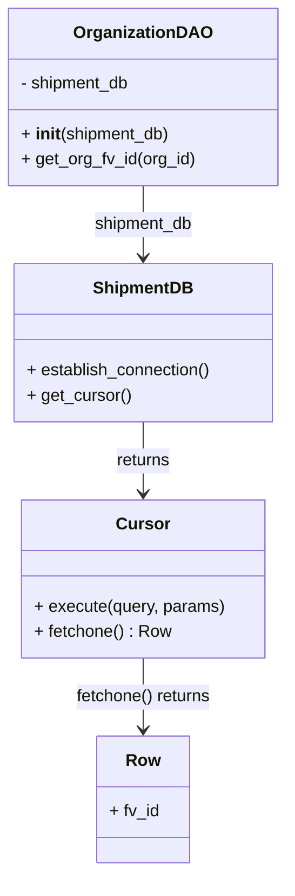

# Diagram: common/subscription_service/subscription_service/v2/db/organization_dao.py

> Auto-generated by Obscura crawlers

## Mermaid

### SVG

<svg id="container" width="268.03125" xmlns="http://www.w3.org/2000/svg" class="classDiagram" height="826" viewBox="0 0 268.03125 826" role="graphics-document document" aria-roledescription="class"><g><defs><marker id="container_class-aggregationStart" class="marker aggregation class" refX="18" refY="7" markerWidth="190" markerHeight="240" orient="auto"><path d="M 18,7 L9,13 L1,7 L9,1 Z"></path></marker></defs><defs><marker id="container_class-aggregationEnd" class="marker aggregation class" refX="1" refY="7" markerWidth="20" markerHeight="28" orient="auto"><path d="M 18,7 L9,13 L1,7 L9,1 Z"></path></marker></defs><defs><marker id="container_class-extensionStart" class="marker extension class" refX="18" refY="7" markerWidth="190" markerHeight="240" orient="auto"><path d="M 1,7 L18,13 V 1 Z"></path></marker></defs><defs><marker id="container_class-extensionEnd" class="marker extension class" refX="1" refY="7" markerWidth="20" markerHeight="28" orient="auto"><path d="M 1,1 V 13 L18,7 Z"></path></marker></defs><defs><marker id="container_class-compositionStart" class="marker composition class" refX="18" refY="7" markerWidth="190" markerHeight="240" orient="auto"><path d="M 18,7 L9,13 L1,7 L9,1 Z"></path></marker></defs><defs><marker id="container_class-compositionEnd" class="marker composition class" refX="1" refY="7" markerWidth="20" markerHeight="28" orient="auto"><path d="M 18,7 L9,13 L1,7 L9,1 Z"></path></marker></defs><defs><marker id="container_class-dependencyStart" class="marker dependency class" refX="6" refY="7" markerWidth="190" markerHeight="240" orient="auto"><path d="M 5,7 L9,13 L1,7 L9,1 Z"></path></marker></defs><defs><marker id="container_class-dependencyEnd" class="marker dependency class" refX="13" refY="7" markerWidth="20" markerHeight="28" orient="auto"><path d="M 18,7 L9,13 L14,7 L9,1 Z"></path></marker></defs><defs><marker id="container_class-lollipopStart" class="marker lollipop class" refX="13" refY="7" markerWidth="190" markerHeight="240" orient="auto"><circle stroke="black" fill="transparent" cx="7" cy="7" r="6"></circle></marker></defs><defs><marker id="container_class-lollipopEnd" class="marker lollipop class" refX="1" refY="7" markerWidth="190" markerHeight="240" orient="auto"><circle stroke="black" fill="transparent" cx="7" cy="7" r="6"></circle></marker></defs><g class="root"><g class="clusters"></g><g class="edgePaths"><path d="M134.016,176L134.016,182.167C134.016,188.333,134.016,200.667,134.016,212C134.016,223.333,134.016,233.667,134.016,238.833L134.016,244" id="id_OrganizationDAO_ShipmentDB_1" class="edge-thickness-normal edge-pattern-solid relation" style=";;;" data-edge="true" data-et="edge" data-id="id_OrganizationDAO_ShipmentDB_1" data-points="W3sieCI6MTM0LjAxNTYyNSwieSI6MTc2fSx7IngiOjEzNC4wMTU2MjUsInkiOjIxM30seyJ4IjoxMzQuMDE1NjI1LCJ5IjoyNTB9XQ==" marker-end="url(#container_class-dependencyEnd)"></path><path d="M134.016,400L134.016,406.167C134.016,412.333,134.016,424.667,134.016,436C134.016,447.333,134.016,457.667,134.016,462.833L134.016,468" id="id_ShipmentDB_Cursor_2" class="edge-thickness-normal edge-pattern-solid relation" style=";;;" data-edge="true" data-et="edge" data-id="id_ShipmentDB_Cursor_2" data-points="W3sieCI6MTM0LjAxNTYyNSwieSI6NDAwfSx7IngiOjEzNC4wMTU2MjUsInkiOjQzN30seyJ4IjoxMzQuMDE1NjI1LCJ5Ijo0NzR9XQ==" marker-end="url(#container_class-dependencyEnd)"></path><path d="M134.016,624L134.016,630.167C134.016,636.333,134.016,648.667,134.016,660C134.016,671.333,134.016,681.667,134.016,686.833L134.016,692" id="id_Cursor_Row_3" class="edge-thickness-normal edge-pattern-solid relation" style=";;;" data-edge="true" data-et="edge" data-id="id_Cursor_Row_3" data-points="W3sieCI6MTM0LjAxNTYyNSwieSI6NjI0fSx7IngiOjEzNC4wMTU2MjUsInkiOjY2MX0seyJ4IjoxMzQuMDE1NjI1LCJ5Ijo2OTh9XQ==" marker-end="url(#container_class-dependencyEnd)"></path></g><g class="edgeLabels"><g class="edgeLabel" transform="translate(134.015625, 213)"><g class="label" data-id="id_OrganizationDAO_ShipmentDB_1" transform="translate(-47.765625, -12)"><foreignObject width="95.53125" height="24">

shipment_db

</foreignObject></g></g><g class="edgeLabel" transform="translate(134.015625, 437)"><g class="label" data-id="id_ShipmentDB_Cursor_2" transform="translate(-26.265625, -12)"><foreignObject width="52.53125" height="24">

returns

</foreignObject></g></g><g class="edgeLabel" transform="translate(134.015625, 661)"><g class="label" data-id="id_Cursor_Row_3" transform="translate(-65.53125, -12)"><foreignObject width="131.0625" height="24">

fetchone() returns

</foreignObject></g></g></g><g class="nodes"><g class="node default" id="classId-OrganizationDAO-0" transform="translate(134.015625, 92)"><g class="basic label-container"><path d="M-126.015625 -84 L126.015625 -84 L126.015625 84 L-126.015625 84" stroke="none" stroke-width="0" fill="#ECECFF" style=""></path><path d="M-126.015625 -84 C-37.09299866693024 -84, 51.829627666139515 -84, 126.015625 -84 M-126.015625 -84 C-29.312088119986214 -84, 67.39144876002757 -84, 126.015625 -84 M126.015625 -84 C126.015625 -18.7386963422704, 126.015625 46.5226073154592, 126.015625 84 M126.015625 -84 C126.015625 -26.067199252357334, 126.015625 31.865601495285333, 126.015625 84 M126.015625 84 C42.97744808488896 84, -40.060728830222075 84, -126.015625 84 M126.015625 84 C42.934161856440866 84, -40.14730128711827 84, -126.015625 84 M-126.015625 84 C-126.015625 28.22761509649183, -126.015625 -27.544769807016337, -126.015625 -84 M-126.015625 84 C-126.015625 23.227808913450524, -126.015625 -37.54438217309895, -126.015625 -84" stroke="#9370DB" stroke-width="1.3" fill="none" stroke-dasharray="0 0" style=""></path></g><g class="annotation-group text" transform="translate(0, -60)"></g><g class="label-group text" transform="translate(-61.984375, -60)"><g class="label" style="font-weight: bolder" transform="translate(0,-12)"><foreignObject width="123.96875" height="24">

OrganizationDAO

</foreignObject></g></g><g class="members-group text" transform="translate(-114.015625, -12)"><g class="label" style="" transform="translate(0,-12)"><foreignObject width="106.21875" height="24">

- shipment_db

</foreignObject></g></g><g class="methods-group text" transform="translate(-114.015625, 36)"><g class="label" style="" transform="translate(0,-12)"><foreignObject width="142.5625" height="24">

+ <strong>init</strong>(shipment_db)

</foreignObject></g><g class="label" style="" transform="translate(0,12)"><foreignObject width="166.046875" height="24">

+ get_org_fv_id(org_id)

</foreignObject></g></g><g class="divider" style=""><path d="M-126.015625 -36 C-35.28074513238039 -36, 55.45413473523922 -36, 126.015625 -36 M-126.015625 -36 C-62.711404892571885 -36, 0.5928152148562305 -36, 126.015625 -36" stroke="#9370DB" stroke-width="1.3" fill="none" stroke-dasharray="0 0" style=""></path></g><g class="divider" style=""><path d="M-126.015625 12 C-61.58477330170692 12, 2.846078396586165 12, 126.015625 12 M-126.015625 12 C-72.03613316102275 12, -18.056641322045508 12, 126.015625 12" stroke="#9370DB" stroke-width="1.3" fill="none" stroke-dasharray="0 0" style=""></path></g></g><g class="node default" id="classId-ShipmentDB-1" transform="translate(134.015625, 325)"><g class="basic label-container"><path d="M-123.3828125 -75 L123.3828125 -75 L123.3828125 75 L-123.3828125 75" stroke="none" stroke-width="0" fill="#ECECFF" style=""></path><path d="M-123.3828125 -75 C-31.193830032701115 -75, 60.99515243459777 -75, 123.3828125 -75 M-123.3828125 -75 C-38.51897134032096 -75, 46.34486981935808 -75, 123.3828125 -75 M123.3828125 -75 C123.3828125 -33.09879154939845, 123.3828125 8.802416901203102, 123.3828125 75 M123.3828125 -75 C123.3828125 -26.320780148100525, 123.3828125 22.35843970379895, 123.3828125 75 M123.3828125 75 C59.08535021436778 75, -5.212112071264443 75, -123.3828125 75 M123.3828125 75 C70.54161041273096 75, 17.700408325461936 75, -123.3828125 75 M-123.3828125 75 C-123.3828125 20.271950127243898, -123.3828125 -34.456099745512205, -123.3828125 -75 M-123.3828125 75 C-123.3828125 30.899441225839375, -123.3828125 -13.20111754832125, -123.3828125 -75" stroke="#9370DB" stroke-width="1.3" fill="none" stroke-dasharray="0 0" style=""></path></g><g class="annotation-group text" transform="translate(0, -51)"></g><g class="label-group text" transform="translate(-45.25, -51)"><g class="label" style="font-weight: bolder" transform="translate(0,-12)"><foreignObject width="90.5" height="24">

ShipmentDB

</foreignObject></g></g><g class="members-group text" transform="translate(-111.3828125, -3)"></g><g class="methods-group text" transform="translate(-111.3828125, 27)"><g class="label" style="" transform="translate(0,-12)"><foreignObject width="177.515625" height="24">

+ establish_connection()

</foreignObject></g><g class="label" style="" transform="translate(0,12)"><foreignObject width="98.890625" height="24">

+ get_cursor()

</foreignObject></g></g><g class="divider" style=""><path d="M-123.3828125 -27 C-46.617233064677166 -27, 30.14834637064567 -27, 123.3828125 -27 M-123.3828125 -27 C-66.62734303416516 -27, -9.871873568330315 -27, 123.3828125 -27" stroke="#9370DB" stroke-width="1.3" fill="none" stroke-dasharray="0 0" style=""></path></g><g class="divider" style=""><path d="M-123.3828125 -3 C-70.90249122118644 -3, -18.42216994237289 -3, 123.3828125 -3 M-123.3828125 -3 C-66.13858619551674 -3, -8.894359891033474 -3, 123.3828125 -3" stroke="#9370DB" stroke-width="1.3" fill="none" stroke-dasharray="0 0" style=""></path></g></g><g class="node default" id="classId-Cursor-2" transform="translate(134.015625, 549)"><g class="basic label-container"><path d="M-114.5546875 -75 L114.5546875 -75 L114.5546875 75 L-114.5546875 75" stroke="none" stroke-width="0" fill="#ECECFF" style=""></path><path d="M-114.5546875 -75 C-43.02362549484485 -75, 28.5074365103103 -75, 114.5546875 -75 M-114.5546875 -75 C-39.32715574975819 -75, 35.90037600048362 -75, 114.5546875 -75 M114.5546875 -75 C114.5546875 -42.05240207926161, 114.5546875 -9.104804158523223, 114.5546875 75 M114.5546875 -75 C114.5546875 -26.70601465288209, 114.5546875 21.58797069423582, 114.5546875 75 M114.5546875 75 C28.32703074457511 75, -57.90062601084978 75, -114.5546875 75 M114.5546875 75 C59.363871320812926 75, 4.173055141625852 75, -114.5546875 75 M-114.5546875 75 C-114.5546875 16.753553966047782, -114.5546875 -41.492892067904435, -114.5546875 -75 M-114.5546875 75 C-114.5546875 37.835160509460096, -114.5546875 0.6703210189201911, -114.5546875 -75" stroke="#9370DB" stroke-width="1.3" fill="none" stroke-dasharray="0 0" style=""></path></g><g class="annotation-group text" transform="translate(0, -51)"></g><g class="label-group text" transform="translate(-23.90625, -51)"><g class="label" style="font-weight: bolder" transform="translate(0,-12)"><foreignObject width="47.8125" height="24">

Cursor

</foreignObject></g></g><g class="members-group text" transform="translate(-102.5546875, -3)"></g><g class="methods-group text" transform="translate(-102.5546875, 27)"><g class="label" style="" transform="translate(0,-12)"><foreignObject width="181.203125" height="24">

+ execute(query, params)

</foreignObject></g><g class="label" style="" transform="translate(0,12)"><foreignObject width="129.09375" height="24">

+ fetchone() : Row

</foreignObject></g></g><g class="divider" style=""><path d="M-114.5546875 -27 C-47.343194862589726 -27, 19.868297774820547 -27, 114.5546875 -27 M-114.5546875 -27 C-49.42389027191926 -27, 15.706906956161475 -27, 114.5546875 -27" stroke="#9370DB" stroke-width="1.3" fill="none" stroke-dasharray="0 0" style=""></path></g><g class="divider" style=""><path d="M-114.5546875 -3 C-31.398761963338288 -3, 51.757163573323425 -3, 114.5546875 -3 M-114.5546875 -3 C-66.71301976667684 -3, -18.871352033353688 -3, 114.5546875 -3" stroke="#9370DB" stroke-width="1.3" fill="none" stroke-dasharray="0 0" style=""></path></g></g><g class="node default" id="classId-Row-3" transform="translate(134.015625, 758)"><g class="basic label-container"><path d="M-43.4375 -60 L43.4375 -60 L43.4375 60 L-43.4375 60" stroke="none" stroke-width="0" fill="#ECECFF" style=""></path><path d="M-43.4375 -60 C-17.830896365265975 -60, 7.77570726946805 -60, 43.4375 -60 M-43.4375 -60 C-19.542138481790186 -60, 4.353223036419628 -60, 43.4375 -60 M43.4375 -60 C43.4375 -20.547174511318737, 43.4375 18.905650977362527, 43.4375 60 M43.4375 -60 C43.4375 -27.484551971516083, 43.4375 5.030896056967833, 43.4375 60 M43.4375 60 C15.726431965229871 60, -11.984636069540258 60, -43.4375 60 M43.4375 60 C14.431395704164434 60, -14.574708591671133 60, -43.4375 60 M-43.4375 60 C-43.4375 18.9564640317963, -43.4375 -22.087071936407398, -43.4375 -60 M-43.4375 60 C-43.4375 22.053056535623583, -43.4375 -15.893886928752835, -43.4375 -60" stroke="#9370DB" stroke-width="1.3" fill="none" stroke-dasharray="0 0" style=""></path></g><g class="annotation-group text" transform="translate(0, -36)"></g><g class="label-group text" transform="translate(-15.484375, -36)"><g class="label" style="font-weight: bolder" transform="translate(0,-12)"><foreignObject width="30.96875" height="24">

Row

</foreignObject></g></g><g class="members-group text" transform="translate(-31.4375, 12)"><g class="label" style="" transform="translate(0,-12)"><foreignObject width="47.390625" height="24">

+ fv_id

</foreignObject></g></g><g class="methods-group text" transform="translate(-31.4375, 60)"></g><g class="divider" style=""><path d="M-43.4375 -12 C-20.133319364607413 -12, 3.170861270785174 -12, 43.4375 -12 M-43.4375 -12 C-20.687259494628286 -12, 2.062981010743428 -12, 43.4375 -12" stroke="#9370DB" stroke-width="1.3" fill="none" stroke-dasharray="0 0" style=""></path></g><g class="divider" style=""><path d="M-43.4375 36 C-16.9842699195567 36, 9.468960160886603 36, 43.4375 36 M-43.4375 36 C-9.550812283787636 36, 24.33587543242473 36, 43.4375 36" stroke="#9370DB" stroke-width="1.3" fill="none" stroke-dasharray="0 0" style=""></path></g></g></g></g></g></svg>
