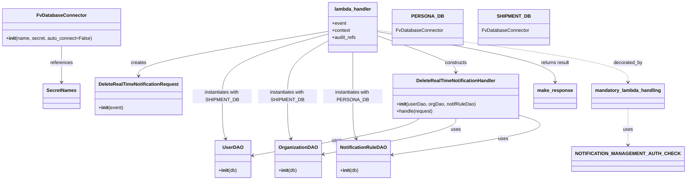

# Diagram: common/subscription_service/subscription_service/v2/delete_a_real_time_notification_subscription.py


> Auto-generated by Obscura crawlers

## Diagram 1



### SVG

<svg id="container" width="2259.08203125" xmlns="http://www.w3.org/2000/svg" class="classDiagram" height="608" viewBox="0 0 2259.08203125 608" role="graphics-document document" aria-roledescription="class"><style>#container{font-family:"trebuchet ms",verdana,arial,sans-serif;font-size:16px;fill:#333;}@keyframes edge-animation-frame{from{stroke-dashoffset:0;}}@keyframes dash{to{stroke-dashoffset:0;}}#container .edge-animation-slow{stroke-dasharray:9,5!important;stroke-dashoffset:900;animation:dash 50s linear infinite;stroke-linecap:round;}#container .edge-animation-fast{stroke-dasharray:9,5!important;stroke-dashoffset:900;animation:dash 20s linear infinite;stroke-linecap:round;}#container .error-icon{fill:#552222;}#container .error-text{fill:#552222;stroke:#552222;}#container .edge-thickness-normal{stroke-width:1px;}#container .edge-thickness-thick{stroke-width:3.5px;}#container .edge-pattern-solid{stroke-dasharray:0;}#container .edge-thickness-invisible{stroke-width:0;fill:none;}#container .edge-pattern-dashed{stroke-dasharray:3;}#container .edge-pattern-dotted{stroke-dasharray:2;}#container .marker{fill:#333333;stroke:#333333;}#container .marker.cross{stroke:#333333;}#container svg{font-family:"trebuchet ms",verdana,arial,sans-serif;font-size:16px;}#container p{margin:0;}#container g.classGroup text{fill:#9370DB;stroke:none;font-family:"trebuchet ms",verdana,arial,sans-serif;font-size:10px;}#container g.classGroup text .title{font-weight:bolder;}#container .nodeLabel,#container .edgeLabel{color:#131300;}#container .edgeLabel .label rect{fill:#ECECFF;}#container .label text{fill:#131300;}#container .labelBkg{background:#ECECFF;}#container .edgeLabel .label span{background:#ECECFF;}#container .classTitle{font-weight:bolder;}#container .node rect,#container .node circle,#container .node ellipse,#container .node polygon,#container .node path{fill:#ECECFF;stroke:#9370DB;stroke-width:1px;}#container .divider{stroke:#9370DB;stroke-width:1;}#container g.clickable{cursor:pointer;}#container g.classGroup rect{fill:#ECECFF;stroke:#9370DB;}#container g.classGroup line{stroke:#9370DB;stroke-width:1;}#container .classLabel .box{stroke:none;stroke-width:0;fill:#ECECFF;opacity:0.5;}#container .classLabel .label{fill:#9370DB;font-size:10px;}#container .relation{stroke:#333333;stroke-width:1;fill:none;}#container .dashed-line{stroke-dasharray:3;}#container .dotted-line{stroke-dasharray:1 2;}#container #compositionStart,#container .composition{fill:#333333!important;stroke:#333333!important;stroke-width:1;}#container #compositionEnd,#container .composition{fill:#333333!important;stroke:#333333!important;stroke-width:1;}#container #dependencyStart,#container .dependency{fill:#333333!important;stroke:#333333!important;stroke-width:1;}#container #dependencyStart,#container .dependency{fill:#333333!important;stroke:#333333!important;stroke-width:1;}#container #extensionStart,#container .extension{fill:transparent!important;stroke:#333333!important;stroke-width:1;}#container #extensionEnd,#container .extension{fill:transparent!important;stroke:#333333!important;stroke-width:1;}#container #aggregationStart,#container .aggregation{fill:transparent!important;stroke:#333333!important;stroke-width:1;}#container #aggregationEnd,#container .aggregation{fill:transparent!important;stroke:#333333!important;stroke-width:1;}#container #lollipopStart,#container .lollipop{fill:#ECECFF!important;stroke:#333333!important;stroke-width:1;}#container #lollipopEnd,#container .lollipop{fill:#ECECFF!important;stroke:#333333!important;stroke-width:1;}#container .edgeTerminals{font-size:11px;line-height:initial;}#container .classTitleText{text-anchor:middle;font-size:18px;fill:#333;}#container .label-icon{display:inline-block;height:1em;overflow:visible;vertical-align:-0.125em;}#container .node .label-icon path{fill:currentColor;stroke:revert;stroke-width:revert;}#container :root{--mermaid-font-family:"trebuchet ms",verdana,arial,sans-serif;}</style><g><defs><marker id="container_class-aggregationStart" class="marker aggregation class" refX="18" refY="7" markerWidth="190" markerHeight="240" orient="auto"><path d="M 18,7 L9,13 L1,7 L9,1 Z"></path></marker></defs><defs><marker id="container_class-aggregationEnd" class="marker aggregation class" refX="1" refY="7" markerWidth="20" markerHeight="28" orient="auto"><path d="M 18,7 L9,13 L1,7 L9,1 Z"></path></marker></defs><defs><marker id="container_class-extensionStart" class="marker extension class" refX="18" refY="7" markerWidth="190" markerHeight="240" orient="auto"><path d="M 1,7 L18,13 V 1 Z"></path></marker></defs><defs><marker id="container_class-extensionEnd" class="marker extension class" refX="1" refY="7" markerWidth="20" markerHeight="28" orient="auto"><path d="M 1,1 V 13 L18,7 Z"></path></marker></defs><defs><marker id="container_class-compositionStart" class="marker composition class" refX="18" refY="7" markerWidth="190" markerHeight="240" orient="auto"><path d="M 18,7 L9,13 L1,7 L9,1 Z"></path></marker></defs><defs><marker id="container_class-compositionEnd" class="marker composition class" refX="1" refY="7" markerWidth="20" markerHeight="28" orient="auto"><path d="M 18,7 L9,13 L1,7 L9,1 Z"></path></marker></defs><defs><marker id="container_class-dependencyStart" class="marker dependency class" refX="6" refY="7" markerWidth="190" markerHeight="240" orient="auto"><path d="M 5,7 L9,13 L1,7 L9,1 Z"></path></marker></defs><defs><marker id="container_class-dependencyEnd" class="marker dependency class" refX="13" refY="7" markerWidth="20" markerHeight="28" orient="auto"><path d="M 18,7 L9,13 L14,7 L9,1 Z"></path></marker></defs><defs><marker id="container_class-lollipopStart" class="marker lollipop class" refX="13" refY="7" markerWidth="190" markerHeight="240" orient="auto"><circle stroke="black" fill="transparent" cx="7" cy="7" r="6"></circle></marker></defs><defs><marker id="container_class-lollipopEnd" class="marker lollipop class" refX="1" refY="7" markerWidth="190" markerHeight="240" orient="auto"><circle stroke="black" fill="transparent" cx="7" cy="7" r="6"></circle></marker></defs><g class="root"><g class="clusters"></g><g class="edgePaths"><path d="M1089.438,105.926L983.665,123.772C877.892,141.618,666.346,177.309,560.574,202.321C454.801,227.333,454.801,241.667,454.801,248.833L454.801,256" id="id_lambda_handler_DeleteRealTimeNotificationRequest_1" class="edge-thickness-normal edge-pattern-solid relation" style=";;;" data-edge="true" data-et="edge" data-id="id_lambda_handler_DeleteRealTimeNotificationRequest_1" data-points="W3sieCI6MTA4OS40Mzc1LCJ5IjoxMDUuOTI2MzU1NDA2OTIxNjR9LHsieCI6NDU0LjgwMDc4MTI1LCJ5IjoyMTN9LHsieCI6NDU0LjgwMDc4MTI1LCJ5IjoyNjJ9XQ==" marker-end="url(#container_class-dependencyEnd)"></path><path d="M1089.438,114.699L1029.861,131.083C970.285,147.466,851.133,180.233,791.557,215.283C731.98,250.333,731.98,287.667,731.98,325C731.98,362.333,731.98,399.667,733.94,423.564C735.899,447.46,739.818,457.921,741.777,463.151L743.736,468.381" id="id_lambda_handler_UserDAO_2" class="edge-thickness-normal edge-pattern-solid relation" style=";;;" data-edge="true" data-et="edge" data-id="id_lambda_handler_UserDAO_2" data-points="W3sieCI6MTA4OS40Mzc1LCJ5IjoxMTQuNjk5MzE2NDA2MjV9LHsieCI6NzMxLjk4MDQ2ODc1LCJ5IjoyMTN9LHsieCI6NzMxLjk4MDQ2ODc1LCJ5IjozMjV9LHsieCI6NzMxLjk4MDQ2ODc1LCJ5Ijo0Mzd9LHsieCI6NzQ1Ljg0MTAxNTYyNSwieSI6NDc0fV0=" marker-end="url(#container_class-dependencyEnd)"></path><path d="M1089.438,137.399L1066.528,149.999C1043.618,162.599,997.799,187.8,974.89,219.066C951.98,250.333,951.98,287.667,951.98,325C951.98,362.333,951.98,399.667,953.94,423.564C955.899,447.46,959.818,457.921,961.777,463.151L963.736,468.381" id="id_lambda_handler_OrganizationDAO_3" class="edge-thickness-normal edge-pattern-solid relation" style=";;;" data-edge="true" data-et="edge" data-id="id_lambda_handler_OrganizationDAO_3" data-points="W3sieCI6MTA4OS40Mzc1LCJ5IjoxMzcuMzk4NjMyODEyNX0seyJ4Ijo5NTEuOTgwNDY4NzUsInkiOjIxM30seyJ4Ijo5NTEuOTgwNDY4NzUsInkiOjMyNX0seyJ4Ijo5NTEuOTgwNDY4NzUsInkiOjQzN30seyJ4Ijo5NjUuODQxMDE1NjI1LCJ5Ijo0NzR9XQ==" marker-end="url(#container_class-dependencyEnd)"></path><path d="M1171.98,176L1171.98,182.167C1171.98,188.333,1171.98,200.667,1171.98,225.5C1171.98,250.333,1171.98,287.667,1171.98,325C1171.98,362.333,1171.98,399.667,1173.94,423.564C1175.899,447.46,1179.818,457.921,1181.777,463.151L1183.736,468.381" id="id_lambda_handler_NotificationRuleDAO_4" class="edge-thickness-normal edge-pattern-solid relation" style=";;;" data-edge="true" data-et="edge" data-id="id_lambda_handler_NotificationRuleDAO_4" data-points="W3sieCI6MTE3MS45ODA0Njg3NSwieSI6MTc2fSx7IngiOjExNzEuOTgwNDY4NzUsInkiOjIxM30seyJ4IjoxMTcxLjk4MDQ2ODc1LCJ5IjozMjV9LHsieCI6MTE3MS45ODA0Njg3NSwieSI6NDM3fSx7IngiOjExODUuODQxMDE1NjI1LCJ5Ijo0NzR9XQ==" marker-end="url(#container_class-dependencyEnd)"></path><path d="M1254.523,121.014L1298.139,136.345C1341.755,151.676,1428.987,182.338,1472.603,202.836C1516.219,223.333,1516.219,233.667,1516.219,238.833L1516.219,244" id="id_lambda_handler_DeleteRealTimeNotificationHandler_5" class="edge-thickness-normal edge-pattern-solid relation" style=";;;" data-edge="true" data-et="edge" data-id="id_lambda_handler_DeleteRealTimeNotificationHandler_5" data-points="W3sieCI6MTI1NC41MjM0Mzc1LCJ5IjoxMjEuMDEzOTEyMDU2NzM3NTh9LHsieCI6MTUxNi4yMTg3NSwieSI6MjEzfSx7IngiOjE1MTYuMjE4NzUsInkiOjI1MH1d" marker-end="url(#container_class-dependencyEnd)"></path><path d="M1395.438,400L1385.508,406.167C1375.577,412.333,1355.715,424.667,1262.186,445.593C1168.657,466.519,1001.461,496.037,917.862,510.796L834.264,525.556" id="id_DeleteRealTimeNotificationHandler_UserDAO_6" class="edge-thickness-normal edge-pattern-solid relation" style=";;;" data-edge="true" data-et="edge" data-id="id_DeleteRealTimeNotificationHandler_UserDAO_6" data-points="W3sieCI6MTM5NS40Mzg0NTkxMjM4ODM4LCJ5Ijo0MDB9LHsieCI6MTMzNS44NTM1MTU2MjUsInkiOjQzN30seyJ4Ijo4MjguMzU1NDY4NzUsInkiOjUyNi41OTg3MjgyODkwMTc3fV0=" marker-end="url(#container_class-dependencyEnd)"></path><path d="M1516.219,400L1516.219,406.167C1516.219,412.333,1516.219,424.667,1441.736,444.973C1367.253,465.279,1218.287,493.558,1143.804,507.697L1069.321,521.836" id="id_DeleteRealTimeNotificationHandler_OrganizationDAO_7" class="edge-thickness-normal edge-pattern-solid relation" style=";;;" data-edge="true" data-et="edge" data-id="id_DeleteRealTimeNotificationHandler_OrganizationDAO_7" data-points="W3sieCI6MTUxNi4yMTg3NSwieSI6NDAwfSx7IngiOjE1MTYuMjE4NzUsInkiOjQzN30seyJ4IjoxMDYzLjQyNTc4MTI1LCJ5Ijo1MjIuOTU1Mjg1MzA2NDQwM31d" marker-end="url(#container_class-dependencyEnd)"></path><path d="M1725.457,389.643L1751.005,397.536C1776.553,405.429,1827.648,421.214,1757.042,443.473C1686.436,465.733,1494.129,494.465,1397.975,508.831L1301.821,523.198" id="id_DeleteRealTimeNotificationHandler_NotificationRuleDAO_8" class="edge-thickness-normal edge-pattern-solid relation" style=";;;" data-edge="true" data-et="edge" data-id="id_DeleteRealTimeNotificationHandler_NotificationRuleDAO_8" data-points="W3sieCI6MTcyNS40NTcwMzEyNSwieSI6Mzg5LjY0Mjg4NjAwNDc1MTh9LHsieCI6MTg3OC43NDQxNDA2MjUsInkiOjQzN30seyJ4IjoxMjk1Ljg4NjcxODc1LCJ5Ijo1MjQuMDg0MjczMjIwNDM5OX1d" marker-end="url(#container_class-dependencyEnd)"></path><path d="M1254.523,106.842L1352.924,124.535C1451.324,142.228,1648.125,177.614,1746.525,205.974C1844.926,234.333,1844.926,255.667,1844.926,266.333L1844.926,277" id="id_lambda_handler_make_response_9" class="edge-thickness-normal edge-pattern-solid relation" style=";;;" data-edge="true" data-et="edge" data-id="id_lambda_handler_make_response_9" data-points="W3sieCI6MTI1NC41MjM0Mzc1LCJ5IjoxMDYuODQxNzY5NTA2NzE2MDV9LHsieCI6MTg0NC45MjU3ODEyNSwieSI6MjEzfSx7IngiOjE4NDQuOTI1NzgxMjUsInkiOjI4M31d" marker-end="url(#container_class-dependencyEnd)"></path><path d="M202.59,155L202.59,164.667C202.59,174.333,202.59,193.667,202.59,214C202.59,234.333,202.59,255.667,202.59,266.333L202.59,277" id="id_FvDatabaseConnector_SecretNames_10" class="edge-thickness-normal edge-pattern-solid relation" style=";;;" data-edge="true" data-et="edge" data-id="id_FvDatabaseConnector_SecretNames_10" data-points="W3sieCI6MjAyLjU4OTg0Mzc1LCJ5IjoxNTV9LHsieCI6MjAyLjU4OTg0Mzc1LCJ5IjoyMTN9LHsieCI6MjAyLjU4OTg0Mzc1LCJ5IjoyODN9XQ==" marker-end="url(#container_class-dependencyEnd)"></path><path d="M1254.523,102.953L1392.74,121.294C1530.957,139.636,1807.391,176.318,1945.607,205.326C2083.824,234.333,2083.824,255.667,2083.824,266.333L2083.824,277" id="id_lambda_handler_mandatory_lambda_handling_11" class="edge-thickness-normal edge-pattern-dashed relation" style=";;;" data-edge="true" data-et="edge" data-id="id_lambda_handler_mandatory_lambda_handling_11" data-points="W3sieCI6MTI1NC41MjM0Mzc1LCJ5IjoxMDIuOTUzMzAxMTc1NTAyOTN9LHsieCI6MjA4My44MjQyMTg3NSwieSI6MjEzfSx7IngiOjIwODMuODI0MjE4NzUsInkiOjI4M31d" marker-end="url(#container_class-dependencyEnd)"></path><path d="M2083.824,367L2083.824,378.667C2083.824,390.333,2083.824,413.667,2083.824,434C2083.824,454.333,2083.824,471.667,2083.824,480.333L2083.824,489" id="id_mandatory_lambda_handling_NOTIFICATION_MANAGEMENT_AUTH_CHECK_12" class="edge-thickness-normal edge-pattern-dashed relation" style=";;;" data-edge="true" data-et="edge" data-id="id_mandatory_lambda_handling_NOTIFICATION_MANAGEMENT_AUTH_CHECK_12" data-points="W3sieCI6MjA4My44MjQyMTg3NSwieSI6MzY3fSx7IngiOjIwODMuODI0MjE4NzUsInkiOjQzN30seyJ4IjoyMDgzLjgyNDIxODc1LCJ5Ijo0OTV9XQ==" marker-end="url(#container_class-dependencyEnd)"></path></g><g class="edgeLabels"><g class="edgeLabel" transform="translate(454.80078125, 213)"><g class="label" data-id="id_lambda_handler_DeleteRealTimeNotificationRequest_1" transform="translate(-26.171875, -12)"><foreignObject width="52.34375" height="24"><div xmlns="http://www.w3.org/1999/xhtml" class="labelBkg" style="display: table-cell; white-space: nowrap; line-height: 1.5; max-width: 200px; text-align: center;"><span class="edgeLabel"><p>creates</p></span></div></foreignObject></g></g><g class="edgeLabel" transform="translate(731.98046875, 325)"><g class="label" data-id="id_lambda_handler_UserDAO_2" transform="translate(-100, -24)"><foreignObject width="200" height="48"><div xmlns="http://www.w3.org/1999/xhtml" class="labelBkg" style="display: table; white-space: break-spaces; line-height: 1.5; max-width: 200px; text-align: center; width: 200px;"><span class="edgeLabel"><p>instantiates with SHIPMENT_DB</p></span></div></foreignObject></g></g><g class="edgeLabel" transform="translate(951.98046875, 325)"><g class="label" data-id="id_lambda_handler_OrganizationDAO_3" transform="translate(-100, -24)"><foreignObject width="200" height="48"><div xmlns="http://www.w3.org/1999/xhtml" class="labelBkg" style="display: table; white-space: break-spaces; line-height: 1.5; max-width: 200px; text-align: center; width: 200px;"><span class="edgeLabel"><p>instantiates with SHIPMENT_DB</p></span></div></foreignObject></g></g><g class="edgeLabel" transform="translate(1171.98046875, 325)"><g class="label" data-id="id_lambda_handler_NotificationRuleDAO_4" transform="translate(-100, -24)"><foreignObject width="200" height="48"><div xmlns="http://www.w3.org/1999/xhtml" class="labelBkg" style="display: table; white-space: break-spaces; line-height: 1.5; max-width: 200px; text-align: center; width: 200px;"><span class="edgeLabel"><p>instantiates with PERSONA_DB</p></span></div></foreignObject></g></g><g class="edgeLabel" transform="translate(1516.21875, 213)"><g class="label" data-id="id_lambda_handler_DeleteRealTimeNotificationHandler_5" transform="translate(-37.84375, -12)"><foreignObject width="75.6875" height="24"><div xmlns="http://www.w3.org/1999/xhtml" class="labelBkg" style="display: table-cell; white-space: nowrap; line-height: 1.5; max-width: 200px; text-align: center;"><span class="edgeLabel"><p>constructs</p></span></div></foreignObject></g></g><g class="edgeLabel" transform="translate(1116.63949, 475.70221)"><g class="label" data-id="id_DeleteRealTimeNotificationHandler_UserDAO_6" transform="translate(-16.4921875, -12)"><foreignObject width="32.984375" height="24"><div xmlns="http://www.w3.org/1999/xhtml" class="labelBkg" style="display: table-cell; white-space: nowrap; line-height: 1.5; max-width: 200px; text-align: center;"><span class="edgeLabel"><p>uses</p></span></div></foreignObject></g></g><g class="edgeLabel" transform="translate(1516.21875, 437)"><g class="label" data-id="id_DeleteRealTimeNotificationHandler_OrganizationDAO_7" transform="translate(-16.4921875, -12)"><foreignObject width="32.984375" height="24"><div xmlns="http://www.w3.org/1999/xhtml" class="labelBkg" style="display: table-cell; white-space: nowrap; line-height: 1.5; max-width: 200px; text-align: center;"><span class="edgeLabel"><p>uses</p></span></div></foreignObject></g></g><g class="edgeLabel" transform="translate(1666.65267, 468.68842)"><g class="label" data-id="id_DeleteRealTimeNotificationHandler_NotificationRuleDAO_8" transform="translate(-16.4921875, -12)"><foreignObject width="32.984375" height="24"><div xmlns="http://www.w3.org/1999/xhtml" class="labelBkg" style="display: table-cell; white-space: nowrap; line-height: 1.5; max-width: 200px; text-align: center;"><span class="edgeLabel"><p>uses</p></span></div></foreignObject></g></g><g class="edgeLabel" transform="translate(1844.92578125, 213)"><g class="label" data-id="id_lambda_handler_make_response_9" transform="translate(-49.21875, -12)"><foreignObject width="98.4375" height="24"><div xmlns="http://www.w3.org/1999/xhtml" class="labelBkg" style="display: table-cell; white-space: nowrap; line-height: 1.5; max-width: 200px; text-align: center;"><span class="edgeLabel"><p>returns result</p></span></div></foreignObject></g></g><g class="edgeLabel" transform="translate(202.58984375, 213)"><g class="label" data-id="id_FvDatabaseConnector_SecretNames_10" transform="translate(-37.828125, -12)"><foreignObject width="75.65625" height="24"><div xmlns="http://www.w3.org/1999/xhtml" class="labelBkg" style="display: table-cell; white-space: nowrap; line-height: 1.5; max-width: 200px; text-align: center;"><span class="edgeLabel"><p>references</p></span></div></foreignObject></g></g><g class="edgeLabel" transform="translate(2083.82421875, 213)"><g class="label" data-id="id_lambda_handler_mandatory_lambda_handling_11" transform="translate(-49.375, -12)"><foreignObject width="98.75" height="24"><div xmlns="http://www.w3.org/1999/xhtml" class="labelBkg" style="display: table-cell; white-space: nowrap; line-height: 1.5; max-width: 200px; text-align: center;"><span class="edgeLabel"><p>decorated_by</p></span></div></foreignObject></g></g><g class="edgeLabel" transform="translate(2083.82421875, 437)"><g class="label" data-id="id_mandatory_lambda_handling_NOTIFICATION_MANAGEMENT_AUTH_CHECK_12" transform="translate(-16.4921875, -12)"><foreignObject width="32.984375" height="24"><div xmlns="http://www.w3.org/1999/xhtml" class="labelBkg" style="display: table-cell; white-space: nowrap; line-height: 1.5; max-width: 200px; text-align: center;"><span class="edgeLabel"><p>uses</p></span></div></foreignObject></g></g></g><g class="nodes"><g class="node default" id="classId-lambda_handler-0" transform="translate(1171.98046875, 92)"><g class="basic label-container"><path d="M-82.54296875 -84 L82.54296875 -84 L82.54296875 84 L-82.54296875 84" stroke="none" stroke-width="0" fill="#ECECFF" style=""></path><path d="M-82.54296875 -84 C-48.36114137652298 -84, -14.17931400304596 -84, 82.54296875 -84 M-82.54296875 -84 C-30.228668845620682 -84, 22.085631058758636 -84, 82.54296875 -84 M82.54296875 -84 C82.54296875 -45.11604052556478, 82.54296875 -6.232081051129555, 82.54296875 84 M82.54296875 -84 C82.54296875 -34.924084322726145, 82.54296875 14.15183135454771, 82.54296875 84 M82.54296875 84 C18.946800252680596 84, -44.64936824463881 84, -82.54296875 84 M82.54296875 84 C32.565340462387695 84, -17.41228782522461 84, -82.54296875 84 M-82.54296875 84 C-82.54296875 25.910043308270446, -82.54296875 -32.17991338345911, -82.54296875 -84 M-82.54296875 84 C-82.54296875 49.12259813936948, -82.54296875 14.245196278738959, -82.54296875 -84" stroke="#9370DB" stroke-width="1.3" fill="none" stroke-dasharray="0 0" style=""></path></g><g class="annotation-group text" transform="translate(0, -60)"></g><g class="label-group text" transform="translate(-59.9765625, -60)"><g class="label" style="font-weight: bolder" transform="translate(0,-12)"><foreignObject width="119.953125" height="24"><div xmlns="http://www.w3.org/1999/xhtml" style="display: table-cell; white-space: nowrap; line-height: 1.5; max-width: 170px; text-align: center;"><span class="nodeLabel markdown-node-label" style=""><p>lambda_handler</p></span></div></foreignObject></g></g><g class="members-group text" transform="translate(-70.54296875, -12)"><g class="label" style="" transform="translate(0,-12)"><foreignObject width="48.328125" height="24"><div xmlns="http://www.w3.org/1999/xhtml" style="display: table-cell; white-space: nowrap; line-height: 1.5; max-width: 106px; text-align: center;"><span class="nodeLabel markdown-node-label" style=""><p>+event</p></span></div></foreignObject></g><g class="label" style="" transform="translate(0,12)"><foreignObject width="61.6875" height="24"><div xmlns="http://www.w3.org/1999/xhtml" style="display: table-cell; white-space: nowrap; line-height: 1.5; max-width: 119px; text-align: center;"><span class="nodeLabel markdown-node-label" style=""><p>+context</p></span></div></foreignObject></g><g class="label" style="" transform="translate(0,36)"><foreignObject width="81.109375" height="24"><div xmlns="http://www.w3.org/1999/xhtml" style="display: table-cell; white-space: nowrap; line-height: 1.5; max-width: 138px; text-align: center;"><span class="nodeLabel markdown-node-label" style=""><p>+audit_refs</p></span></div></foreignObject></g></g><g class="methods-group text" transform="translate(-70.54296875, 84)"></g><g class="divider" style=""><path d="M-82.54296875 -36 C-24.733023155823886 -36, 33.07692243835223 -36, 82.54296875 -36 M-82.54296875 -36 C-25.971297416747547 -36, 30.600373916504907 -36, 82.54296875 -36" stroke="#9370DB" stroke-width="1.3" fill="none" stroke-dasharray="0 0" style=""></path></g><g class="divider" style=""><path d="M-82.54296875 60 C-25.184132275469132 60, 32.174704199061736 60, 82.54296875 60 M-82.54296875 60 C-22.251711983005933 60, 38.039544783988134 60, 82.54296875 60" stroke="#9370DB" stroke-width="1.3" fill="none" stroke-dasharray="0 0" style=""></path></g></g><g class="node default" id="classId-DeleteRealTimeNotificationRequest-1" transform="translate(454.80078125, 325)"><g class="basic label-container"><path d="M-142.1796875 -63 L142.1796875 -63 L142.1796875 63 L-142.1796875 63" stroke="none" stroke-width="0" fill="#ECECFF" style=""></path><path d="M-142.1796875 -63 C-47.11652851770363 -63, 47.946630464592744 -63, 142.1796875 -63 M-142.1796875 -63 C-39.25922264717741 -63, 63.66124220564518 -63, 142.1796875 -63 M142.1796875 -63 C142.1796875 -28.136740163883985, 142.1796875 6.72651967223203, 142.1796875 63 M142.1796875 -63 C142.1796875 -15.522104773062054, 142.1796875 31.955790453875892, 142.1796875 63 M142.1796875 63 C43.116994696324426 63, -55.94569810735115 63, -142.1796875 63 M142.1796875 63 C83.78484571700565 63, 25.390003934011304 63, -142.1796875 63 M-142.1796875 63 C-142.1796875 18.559646342674483, -142.1796875 -25.880707314651033, -142.1796875 -63 M-142.1796875 63 C-142.1796875 23.977379817143436, -142.1796875 -15.045240365713127, -142.1796875 -63" stroke="#9370DB" stroke-width="1.3" fill="none" stroke-dasharray="0 0" style=""></path></g><g class="annotation-group text" transform="translate(0, -39)"></g><g class="label-group text" transform="translate(-130.1796875, -39)"><g class="label" style="font-weight: bolder" transform="translate(0,-12)"><foreignObject width="260.359375" height="24"><div xmlns="http://www.w3.org/1999/xhtml" style="display: table-cell; white-space: nowrap; line-height: 1.5; max-width: 307px; text-align: center;"><span class="nodeLabel markdown-node-label" style=""><p>DeleteRealTimeNotificationRequest</p></span></div></foreignObject></g></g><g class="members-group text" transform="translate(-130.1796875, 9)"></g><g class="methods-group text" transform="translate(-130.1796875, 39)"><g class="label" style="" transform="translate(0,-12)"><foreignObject width="83.140625" height="24"><div xmlns="http://www.w3.org/1999/xhtml" style="display: table-cell; white-space: nowrap; line-height: 1.5; max-width: 172px; text-align: center;"><span class="nodeLabel markdown-node-label" style=""><p>+<strong>init</strong>(event)</p></span></div></foreignObject></g></g><g class="divider" style=""><path d="M-142.1796875 -15 C-54.88396635354792 -15, 32.41175479290416 -15, 142.1796875 -15 M-142.1796875 -15 C-35.12857572308802 -15, 71.92253605382396 -15, 142.1796875 -15" stroke="#9370DB" stroke-width="1.3" fill="none" stroke-dasharray="0 0" style=""></path></g><g class="divider" style=""><path d="M-142.1796875 9 C-84.63660353230364 9, -27.09351956460729 9, 142.1796875 9 M-142.1796875 9 C-65.63597353091916 9, 10.907740438161682 9, 142.1796875 9" stroke="#9370DB" stroke-width="1.3" fill="none" stroke-dasharray="0 0" style=""></path></g></g><g class="node default" id="classId-UserDAO-2" transform="translate(769.44140625, 537)"><g class="basic label-container"><path d="M-58.9140625 -63 L58.9140625 -63 L58.9140625 63 L-58.9140625 63" stroke="none" stroke-width="0" fill="#ECECFF" style=""></path><path d="M-58.9140625 -63 C-15.479967177928977 -63, 27.954128144142047 -63, 58.9140625 -63 M-58.9140625 -63 C-17.961129625126894 -63, 22.991803249746212 -63, 58.9140625 -63 M58.9140625 -63 C58.9140625 -30.929216261679542, 58.9140625 1.1415674766409154, 58.9140625 63 M58.9140625 -63 C58.9140625 -33.69595990801339, 58.9140625 -4.391919816026778, 58.9140625 63 M58.9140625 63 C15.806500789033365 63, -27.30106092193327 63, -58.9140625 63 M58.9140625 63 C26.167138576900676 63, -6.579785346198648 63, -58.9140625 63 M-58.9140625 63 C-58.9140625 20.90936550423733, -58.9140625 -21.181268991525343, -58.9140625 -63 M-58.9140625 63 C-58.9140625 31.05069419070911, -58.9140625 -0.8986116185817821, -58.9140625 -63" stroke="#9370DB" stroke-width="1.3" fill="none" stroke-dasharray="0 0" style=""></path></g><g class="annotation-group text" transform="translate(0, -39)"></g><g class="label-group text" transform="translate(-31.953125, -39)"><g class="label" style="font-weight: bolder" transform="translate(0,-12)"><foreignObject width="63.90625" height="24"><div xmlns="http://www.w3.org/1999/xhtml" style="display: table-cell; white-space: nowrap; line-height: 1.5; max-width: 113px; text-align: center;"><span class="nodeLabel markdown-node-label" style=""><p>UserDAO</p></span></div></foreignObject></g></g><g class="members-group text" transform="translate(-46.9140625, 9)"></g><g class="methods-group text" transform="translate(-46.9140625, 39)"><g class="label" style="" transform="translate(0,-12)"><foreignObject width="61.875" height="24"><div xmlns="http://www.w3.org/1999/xhtml" style="display: table-cell; white-space: nowrap; line-height: 1.5; max-width: 151px; text-align: center;"><span class="nodeLabel markdown-node-label" style=""><p>+<strong>init</strong>(db)</p></span></div></foreignObject></g></g><g class="divider" style=""><path d="M-58.9140625 -15 C-19.037360830293345 -15, 20.83934083941331 -15, 58.9140625 -15 M-58.9140625 -15 C-31.179971635162993 -15, -3.445880770325985 -15, 58.9140625 -15" stroke="#9370DB" stroke-width="1.3" fill="none" stroke-dasharray="0 0" style=""></path></g><g class="divider" style=""><path d="M-58.9140625 9 C-18.25702405351496 9, 22.40001439297008 9, 58.9140625 9 M-58.9140625 9 C-34.216445375563254 9, -9.5188282511265 9, 58.9140625 9" stroke="#9370DB" stroke-width="1.3" fill="none" stroke-dasharray="0 0" style=""></path></g></g><g class="node default" id="classId-OrganizationDAO-3" transform="translate(989.44140625, 537)"><g class="basic label-container"><path d="M-73.984375 -63 L73.984375 -63 L73.984375 63 L-73.984375 63" stroke="none" stroke-width="0" fill="#ECECFF" style=""></path><path d="M-73.984375 -63 C-17.53416398896195 -63, 38.9160470220761 -63, 73.984375 -63 M-73.984375 -63 C-23.002644714859066 -63, 27.979085570281867 -63, 73.984375 -63 M73.984375 -63 C73.984375 -25.932072196860346, 73.984375 11.135855606279307, 73.984375 63 M73.984375 -63 C73.984375 -14.531458284436923, 73.984375 33.937083431126155, 73.984375 63 M73.984375 63 C27.641167097293277 63, -18.702040805413446 63, -73.984375 63 M73.984375 63 C39.813644809436916 63, 5.6429146188738315 63, -73.984375 63 M-73.984375 63 C-73.984375 31.174555937075425, -73.984375 -0.6508881258491499, -73.984375 -63 M-73.984375 63 C-73.984375 26.911988859502166, -73.984375 -9.176022280995667, -73.984375 -63" stroke="#9370DB" stroke-width="1.3" fill="none" stroke-dasharray="0 0" style=""></path></g><g class="annotation-group text" transform="translate(0, -39)"></g><g class="label-group text" transform="translate(-61.984375, -39)"><g class="label" style="font-weight: bolder" transform="translate(0,-12)"><foreignObject width="123.96875" height="24"><div xmlns="http://www.w3.org/1999/xhtml" style="display: table-cell; white-space: nowrap; line-height: 1.5; max-width: 172px; text-align: center;"><span class="nodeLabel markdown-node-label" style=""><p>OrganizationDAO</p></span></div></foreignObject></g></g><g class="members-group text" transform="translate(-61.984375, 9)"></g><g class="methods-group text" transform="translate(-61.984375, 39)"><g class="label" style="" transform="translate(0,-12)"><foreignObject width="61.875" height="24"><div xmlns="http://www.w3.org/1999/xhtml" style="display: table-cell; white-space: nowrap; line-height: 1.5; max-width: 151px; text-align: center;"><span class="nodeLabel markdown-node-label" style=""><p>+<strong>init</strong>(db)</p></span></div></foreignObject></g></g><g class="divider" style=""><path d="M-73.984375 -15 C-17.217433159884834 -15, 39.54950868023033 -15, 73.984375 -15 M-73.984375 -15 C-41.392303986016096 -15, -8.800232972032191 -15, 73.984375 -15" stroke="#9370DB" stroke-width="1.3" fill="none" stroke-dasharray="0 0" style=""></path></g><g class="divider" style=""><path d="M-73.984375 9 C-20.277337430402895 9, 33.42970013919421 9, 73.984375 9 M-73.984375 9 C-33.4089897721815 9, 7.1663954556370015 9, 73.984375 9" stroke="#9370DB" stroke-width="1.3" fill="none" stroke-dasharray="0 0" style=""></path></g></g><g class="node default" id="classId-NotificationRuleDAO-4" transform="translate(1209.44140625, 537)"><g class="basic label-container"><path d="M-86.4453125 -63 L86.4453125 -63 L86.4453125 63 L-86.4453125 63" stroke="none" stroke-width="0" fill="#ECECFF" style=""></path><path d="M-86.4453125 -63 C-27.26724714863729 -63, 31.910818202725423 -63, 86.4453125 -63 M-86.4453125 -63 C-26.79373936493063 -63, 32.85783377013874 -63, 86.4453125 -63 M86.4453125 -63 C86.4453125 -30.368094816933848, 86.4453125 2.2638103661323044, 86.4453125 63 M86.4453125 -63 C86.4453125 -26.14060896626252, 86.4453125 10.718782067474962, 86.4453125 63 M86.4453125 63 C28.402216659277386 63, -29.64087918144523 63, -86.4453125 63 M86.4453125 63 C47.719860469914344 63, 8.994408439828689 63, -86.4453125 63 M-86.4453125 63 C-86.4453125 30.200354134648727, -86.4453125 -2.5992917307025465, -86.4453125 -63 M-86.4453125 63 C-86.4453125 27.099194617690493, -86.4453125 -8.801610764619014, -86.4453125 -63" stroke="#9370DB" stroke-width="1.3" fill="none" stroke-dasharray="0 0" style=""></path></g><g class="annotation-group text" transform="translate(0, -39)"></g><g class="label-group text" transform="translate(-74.4453125, -39)"><g class="label" style="font-weight: bolder" transform="translate(0,-12)"><foreignObject width="148.890625" height="24"><div xmlns="http://www.w3.org/1999/xhtml" style="display: table-cell; white-space: nowrap; line-height: 1.5; max-width: 198px; text-align: center;"><span class="nodeLabel markdown-node-label" style=""><p>NotificationRuleDAO</p></span></div></foreignObject></g></g><g class="members-group text" transform="translate(-74.4453125, 9)"></g><g class="methods-group text" transform="translate(-74.4453125, 39)"><g class="label" style="" transform="translate(0,-12)"><foreignObject width="61.875" height="24"><div xmlns="http://www.w3.org/1999/xhtml" style="display: table-cell; white-space: nowrap; line-height: 1.5; max-width: 151px; text-align: center;"><span class="nodeLabel markdown-node-label" style=""><p>+<strong>init</strong>(db)</p></span></div></foreignObject></g></g><g class="divider" style=""><path d="M-86.4453125 -15 C-37.33732398720287 -15, 11.770664525594256 -15, 86.4453125 -15 M-86.4453125 -15 C-44.730425247543806 -15, -3.0155379950876124 -15, 86.4453125 -15" stroke="#9370DB" stroke-width="1.3" fill="none" stroke-dasharray="0 0" style=""></path></g><g class="divider" style=""><path d="M-86.4453125 9 C-23.279370191610766 9, 39.88657211677847 9, 86.4453125 9 M-86.4453125 9 C-42.277565703642985 9, 1.8901810927140303 9, 86.4453125 9" stroke="#9370DB" stroke-width="1.3" fill="none" stroke-dasharray="0 0" style=""></path></g></g><g class="node default" id="classId-DeleteRealTimeNotificationHandler-5" transform="translate(1516.21875, 325)"><g class="basic label-container"><path d="M-209.23828125 -75 L209.23828125 -75 L209.23828125 75 L-209.23828125 75" stroke="none" stroke-width="0" fill="#ECECFF" style=""></path><path d="M-209.23828125 -75 C-80.80579917764422 -75, 47.626682894711564 -75, 209.23828125 -75 M-209.23828125 -75 C-105.20164460373226 -75, -1.1650079574645247 -75, 209.23828125 -75 M209.23828125 -75 C209.23828125 -20.637676120754257, 209.23828125 33.724647758491486, 209.23828125 75 M209.23828125 -75 C209.23828125 -44.07450102992648, 209.23828125 -13.149002059852968, 209.23828125 75 M209.23828125 75 C85.14521591741898 75, -38.94784941516204 75, -209.23828125 75 M209.23828125 75 C91.65881201423004 75, -25.920657221539926 75, -209.23828125 75 M-209.23828125 75 C-209.23828125 44.77032711989352, -209.23828125 14.540654239787045, -209.23828125 -75 M-209.23828125 75 C-209.23828125 38.000327091594485, -209.23828125 1.0006541831889706, -209.23828125 -75" stroke="#9370DB" stroke-width="1.3" fill="none" stroke-dasharray="0 0" style=""></path></g><g class="annotation-group text" transform="translate(0, -51)"></g><g class="label-group text" transform="translate(-129.2890625, -51)"><g class="label" style="font-weight: bolder" transform="translate(0,-12)"><foreignObject width="258.578125" height="24"><div xmlns="http://www.w3.org/1999/xhtml" style="display: table-cell; white-space: nowrap; line-height: 1.5; max-width: 307px; text-align: center;"><span class="nodeLabel markdown-node-label" style=""><p>DeleteRealTimeNotificationHandler</p></span></div></foreignObject></g></g><g class="members-group text" transform="translate(-197.23828125, -3)"></g><g class="methods-group text" transform="translate(-197.23828125, 27)"><g class="label" style="" transform="translate(0,-12)"><foreignObject width="265.1875" height="24"><div xmlns="http://www.w3.org/1999/xhtml" style="display: table-cell; white-space: nowrap; line-height: 1.5; max-width: 354px; text-align: center;"><span class="nodeLabel markdown-node-label" style=""><p>+<strong>init</strong>(userDao, orgDao, notifRuleDao)</p></span></div></foreignObject></g><g class="label" style="" transform="translate(0,12)"><foreignObject width="123.96875" height="24"><div xmlns="http://www.w3.org/1999/xhtml" style="display: table-cell; white-space: nowrap; line-height: 1.5; max-width: 181px; text-align: center;"><span class="nodeLabel markdown-node-label" style=""><p>+handle(request)</p></span></div></foreignObject></g></g><g class="divider" style=""><path d="M-209.23828125 -27 C-110.08718769353955 -27, -10.936094137079095 -27, 209.23828125 -27 M-209.23828125 -27 C-67.94124327483351 -27, 73.35579470033298 -27, 209.23828125 -27" stroke="#9370DB" stroke-width="1.3" fill="none" stroke-dasharray="0 0" style=""></path></g><g class="divider" style=""><path d="M-209.23828125 -3 C-66.32693037336804 -3, 76.58442050326391 -3, 209.23828125 -3 M-209.23828125 -3 C-97.5467612408581 -3, 14.144758768283793 -3, 209.23828125 -3" stroke="#9370DB" stroke-width="1.3" fill="none" stroke-dasharray="0 0" style=""></path></g></g><g class="node default" id="classId-FvDatabaseConnector-6" transform="translate(202.58984375, 92)"><g class="basic label-container"><path d="M-194.58984375 -63 L194.58984375 -63 L194.58984375 63 L-194.58984375 63" stroke="none" stroke-width="0" fill="#ECECFF" style=""></path><path d="M-194.58984375 -63 C-97.11994923396021 -63, 0.34994528207957387 -63, 194.58984375 -63 M-194.58984375 -63 C-80.87719938271329 -63, 32.83544498457343 -63, 194.58984375 -63 M194.58984375 -63 C194.58984375 -22.9126222147568, 194.58984375 17.174755570486397, 194.58984375 63 M194.58984375 -63 C194.58984375 -14.643124375827327, 194.58984375 33.713751248345346, 194.58984375 63 M194.58984375 63 C92.87691375967576 63, -8.836016230648482 63, -194.58984375 63 M194.58984375 63 C42.99167427232223 63, -108.60649520535554 63, -194.58984375 63 M-194.58984375 63 C-194.58984375 36.50052507673921, -194.58984375 10.00105015347841, -194.58984375 -63 M-194.58984375 63 C-194.58984375 30.12474795807929, -194.58984375 -2.7505040838414203, -194.58984375 -63" stroke="#9370DB" stroke-width="1.3" fill="none" stroke-dasharray="0 0" style=""></path></g><g class="annotation-group text" transform="translate(0, -39)"></g><g class="label-group text" transform="translate(-79.3046875, -39)"><g class="label" style="font-weight: bolder" transform="translate(0,-12)"><foreignObject width="158.609375" height="24"><div xmlns="http://www.w3.org/1999/xhtml" style="display: table-cell; white-space: nowrap; line-height: 1.5; max-width: 207px; text-align: center;"><span class="nodeLabel markdown-node-label" style=""><p>FvDatabaseConnector</p></span></div></foreignObject></g></g><g class="members-group text" transform="translate(-182.58984375, 9)"></g><g class="methods-group text" transform="translate(-182.58984375, 39)"><g class="label" style="" transform="translate(0,-12)"><foreignObject width="285.875" height="24"><div xmlns="http://www.w3.org/1999/xhtml" style="display: table-cell; white-space: nowrap; line-height: 1.5; max-width: 375px; text-align: center;"><span class="nodeLabel markdown-node-label" style=""><p>+<strong>init</strong>(name, secret, auto_connect=False)</p></span></div></foreignObject></g></g><g class="divider" style=""><path d="M-194.58984375 -15 C-103.34393147840723 -15, -12.098019206814456 -15, 194.58984375 -15 M-194.58984375 -15 C-67.03035029261304 -15, 60.52914316477393 -15, 194.58984375 -15" stroke="#9370DB" stroke-width="1.3" fill="none" stroke-dasharray="0 0" style=""></path></g><g class="divider" style=""><path d="M-194.58984375 9 C-68.03930780039077 9, 58.511228149218454 9, 194.58984375 9 M-194.58984375 9 C-75.47299923749011 9, 43.64384527501977 9, 194.58984375 9" stroke="#9370DB" stroke-width="1.3" fill="none" stroke-dasharray="0 0" style=""></path></g></g><g class="node default" id="classId-SecretNames-7" transform="translate(202.58984375, 325)"><g class="basic label-container"><path d="M-60.03125 -42 L60.03125 -42 L60.03125 42 L-60.03125 42" stroke="none" stroke-width="0" fill="#ECECFF" style=""></path><path d="M-60.03125 -42 C-29.533954550549545 -42, 0.9633408989009098 -42, 60.03125 -42 M-60.03125 -42 C-35.938444965307596 -42, -11.845639930615192 -42, 60.03125 -42 M60.03125 -42 C60.03125 -25.130164969057475, 60.03125 -8.26032993811495, 60.03125 42 M60.03125 -42 C60.03125 -21.233580755820824, 60.03125 -0.467161511641649, 60.03125 42 M60.03125 42 C22.226952601902987 42, -15.577344796194026 42, -60.03125 42 M60.03125 42 C31.90446921584969 42, 3.7776884316993815 42, -60.03125 42 M-60.03125 42 C-60.03125 18.650445585332445, -60.03125 -4.69910882933511, -60.03125 -42 M-60.03125 42 C-60.03125 23.665618815561412, -60.03125 5.331237631122825, -60.03125 -42" stroke="#9370DB" stroke-width="1.3" fill="none" stroke-dasharray="0 0" style=""></path></g><g class="annotation-group text" transform="translate(0, -18)"></g><g class="label-group text" transform="translate(-48.03125, -18)"><g class="label" style="font-weight: bolder" transform="translate(0,-12)"><foreignObject width="96.0625" height="24"><div xmlns="http://www.w3.org/1999/xhtml" style="display: table-cell; white-space: nowrap; line-height: 1.5; max-width: 145px; text-align: center;"><span class="nodeLabel markdown-node-label" style=""><p>SecretNames</p></span></div></foreignObject></g></g><g class="members-group text" transform="translate(-48.03125, 30)"></g><g class="methods-group text" transform="translate(-48.03125, 60)"></g><g class="divider" style=""><path d="M-60.03125 6 C-19.129747478740747 6, 21.771755042518507 6, 60.03125 6 M-60.03125 6 C-26.960610489291028 6, 6.110029021417944 6, 60.03125 6" stroke="#9370DB" stroke-width="1.3" fill="none" stroke-dasharray="0 0" style=""></path></g><g class="divider" style=""><path d="M-60.03125 24 C-18.17825411288849 24, 23.674741774223023 24, 60.03125 24 M-60.03125 24 C-27.366136185124688 24, 5.298977629750624 24, 60.03125 24" stroke="#9370DB" stroke-width="1.3" fill="none" stroke-dasharray="0 0" style=""></path></g></g><g class="node default" id="classId-make_response-8" transform="translate(1844.92578125, 325)"><g class="basic label-container"><path d="M-69.46875 -42 L69.46875 -42 L69.46875 42 L-69.46875 42" stroke="none" stroke-width="0" fill="#ECECFF" style=""></path><path d="M-69.46875 -42 C-33.73119619429287 -42, 2.006357611414259 -42, 69.46875 -42 M-69.46875 -42 C-20.307849598470106 -42, 28.853050803059787 -42, 69.46875 -42 M69.46875 -42 C69.46875 -21.94266651350065, 69.46875 -1.8853330270013018, 69.46875 42 M69.46875 -42 C69.46875 -23.421575224768652, 69.46875 -4.843150449537305, 69.46875 42 M69.46875 42 C16.993095096244765 42, -35.48255980751047 42, -69.46875 42 M69.46875 42 C37.441212017496284 42, 5.413674034992567 42, -69.46875 42 M-69.46875 42 C-69.46875 10.748129455663197, -69.46875 -20.503741088673607, -69.46875 -42 M-69.46875 42 C-69.46875 8.944332527068937, -69.46875 -24.111334945862126, -69.46875 -42" stroke="#9370DB" stroke-width="1.3" fill="none" stroke-dasharray="0 0" style=""></path></g><g class="annotation-group text" transform="translate(0, -18)"></g><g class="label-group text" transform="translate(-57.46875, -18)"><g class="label" style="font-weight: bolder" transform="translate(0,-12)"><foreignObject width="114.9375" height="24"><div xmlns="http://www.w3.org/1999/xhtml" style="display: table-cell; white-space: nowrap; line-height: 1.5; max-width: 164px; text-align: center;"><span class="nodeLabel markdown-node-label" style=""><p>make_response</p></span></div></foreignObject></g></g><g class="members-group text" transform="translate(-57.46875, 30)"></g><g class="methods-group text" transform="translate(-57.46875, 60)"></g><g class="divider" style=""><path d="M-69.46875 6 C-33.34453998055576 6, 2.779670038888483 6, 69.46875 6 M-69.46875 6 C-40.44879430162483 6, -11.428838603249666 6, 69.46875 6" stroke="#9370DB" stroke-width="1.3" fill="none" stroke-dasharray="0 0" style=""></path></g><g class="divider" style=""><path d="M-69.46875 24 C-35.96118417008387 24, -2.4536183401677363 24, 69.46875 24 M-69.46875 24 C-35.76109112543007 24, -2.0534322508601406 24, 69.46875 24" stroke="#9370DB" stroke-width="1.3" fill="none" stroke-dasharray="0 0" style=""></path></g></g><g class="node default" id="classId-mandatory_lambda_handling-9" transform="translate(2083.82421875, 325)"><g class="basic label-container"><path d="M-119.4296875 -42 L119.4296875 -42 L119.4296875 42 L-119.4296875 42" stroke="none" stroke-width="0" fill="#ECECFF" style=""></path><path d="M-119.4296875 -42 C-52.7179633001537 -42, 13.993760899692603 -42, 119.4296875 -42 M-119.4296875 -42 C-40.61527308221743 -42, 38.199141335565145 -42, 119.4296875 -42 M119.4296875 -42 C119.4296875 -22.166227638336064, 119.4296875 -2.3324552766721283, 119.4296875 42 M119.4296875 -42 C119.4296875 -18.55721952891925, 119.4296875 4.885560942161497, 119.4296875 42 M119.4296875 42 C49.66412535204242 42, -20.101436795915163 42, -119.4296875 42 M119.4296875 42 C26.129032015300496 42, -67.17162346939901 42, -119.4296875 42 M-119.4296875 42 C-119.4296875 14.812806501168907, -119.4296875 -12.374386997662185, -119.4296875 -42 M-119.4296875 42 C-119.4296875 17.296979981796802, -119.4296875 -7.406040036406395, -119.4296875 -42" stroke="#9370DB" stroke-width="1.3" fill="none" stroke-dasharray="0 0" style=""></path></g><g class="annotation-group text" transform="translate(0, -18)"></g><g class="label-group text" transform="translate(-107.4296875, -18)"><g class="label" style="font-weight: bolder" transform="translate(0,-12)"><foreignObject width="214.859375" height="24"><div xmlns="http://www.w3.org/1999/xhtml" style="display: table-cell; white-space: nowrap; line-height: 1.5; max-width: 264px; text-align: center;"><span class="nodeLabel markdown-node-label" style=""><p>mandatory_lambda_handling</p></span></div></foreignObject></g></g><g class="members-group text" transform="translate(-107.4296875, 30)"></g><g class="methods-group text" transform="translate(-107.4296875, 60)"></g><g class="divider" style=""><path d="M-119.4296875 6 C-60.72695386212697 6, -2.0242202242539378 6, 119.4296875 6 M-119.4296875 6 C-51.199559437473454 6, 17.030568625053093 6, 119.4296875 6" stroke="#9370DB" stroke-width="1.3" fill="none" stroke-dasharray="0 0" style=""></path></g><g class="divider" style=""><path d="M-119.4296875 24 C-30.832583605011706 24, 57.76452028997659 24, 119.4296875 24 M-119.4296875 24 C-65.0635704111275 24, -10.697453322255 24, 119.4296875 24" stroke="#9370DB" stroke-width="1.3" fill="none" stroke-dasharray="0 0" style=""></path></g></g><g class="node default" id="classId-NOTIFICATION_MANAGEMENT_AUTH_CHECK-10" transform="translate(2083.82421875, 537)"><g class="basic label-container"><path d="M-167.2578125 -42 L167.2578125 -42 L167.2578125 42 L-167.2578125 42" stroke="none" stroke-width="0" fill="#ECECFF" style=""></path><path d="M-167.2578125 -42 C-75.28787528835676 -42, 16.682061923286483 -42, 167.2578125 -42 M-167.2578125 -42 C-54.96944570755511 -42, 57.31892108488978 -42, 167.2578125 -42 M167.2578125 -42 C167.2578125 -19.375390555917573, 167.2578125 3.2492188881648545, 167.2578125 42 M167.2578125 -42 C167.2578125 -19.869214786026706, 167.2578125 2.2615704279465874, 167.2578125 42 M167.2578125 42 C34.276546016324886 42, -98.70472046735023 42, -167.2578125 42 M167.2578125 42 C83.17994035274204 42, -0.8979317945159266 42, -167.2578125 42 M-167.2578125 42 C-167.2578125 20.2322697418258, -167.2578125 -1.535460516348401, -167.2578125 -42 M-167.2578125 42 C-167.2578125 16.046412310909748, -167.2578125 -9.907175378180504, -167.2578125 -42" stroke="#9370DB" stroke-width="1.3" fill="none" stroke-dasharray="0 0" style=""></path></g><g class="annotation-group text" transform="translate(0, -18)"></g><g class="label-group text" transform="translate(-155.2578125, -18)"><g class="label" style="font-weight: bolder" transform="translate(0,-12)"><foreignObject width="310.515625" height="24"><div xmlns="http://www.w3.org/1999/xhtml" style="display: table-cell; white-space: nowrap; line-height: 1.5; max-width: 359px; text-align: center;"><span class="nodeLabel markdown-node-label" style=""><p>NOTIFICATION_MANAGEMENT_AUTH_CHECK</p></span></div></foreignObject></g></g><g class="members-group text" transform="translate(-155.2578125, 30)"></g><g class="methods-group text" transform="translate(-155.2578125, 60)"></g><g class="divider" style=""><path d="M-167.2578125 6 C-59.63395268695392 6, 47.98990712609216 6, 167.2578125 6 M-167.2578125 6 C-82.16887859229328 6, 2.9200553154134354 6, 167.2578125 6" stroke="#9370DB" stroke-width="1.3" fill="none" stroke-dasharray="0 0" style=""></path></g><g class="divider" style=""><path d="M-167.2578125 24 C-88.26764635310674 24, -9.277480206213482 24, 167.2578125 24 M-167.2578125 24 C-91.858742744452 24, -16.459672988904003 24, 167.2578125 24" stroke="#9370DB" stroke-width="1.3" fill="none" stroke-dasharray="0 0" style=""></path></g></g><g class="node default" id="classId-PERSONA_DB-11" transform="translate(1418.98828125, 92)"><g class="basic label-container"><path d="M-114.46484375 -60 L114.46484375 -60 L114.46484375 60 L-114.46484375 60" stroke="none" stroke-width="0" fill="#ECECFF" style=""></path><path d="M-114.46484375 -60 C-25.06190990395511 -60, 64.34102394208978 -60, 114.46484375 -60 M-114.46484375 -60 C-58.69602909815152 -60, -2.92721444630304 -60, 114.46484375 -60 M114.46484375 -60 C114.46484375 -14.06614689001914, 114.46484375 31.86770621996172, 114.46484375 60 M114.46484375 -60 C114.46484375 -34.1419523901254, 114.46484375 -8.283904780250786, 114.46484375 60 M114.46484375 60 C47.82240409476594 60, -18.820035560468114 60, -114.46484375 60 M114.46484375 60 C39.6266158325938 60, -35.2116120848124 60, -114.46484375 60 M-114.46484375 60 C-114.46484375 32.19055535986604, -114.46484375 4.381110719732071, -114.46484375 -60 M-114.46484375 60 C-114.46484375 27.19997155465061, -114.46484375 -5.600056890698781, -114.46484375 -60" stroke="#9370DB" stroke-width="1.3" fill="none" stroke-dasharray="0 0" style=""></path></g><g class="annotation-group text" transform="translate(0, -36)"></g><g class="label-group text" transform="translate(-48.3046875, -36)"><g class="label" style="font-weight: bolder" transform="translate(0,-12)"><foreignObject width="96.609375" height="24"><div xmlns="http://www.w3.org/1999/xhtml" style="display: table-cell; white-space: nowrap; line-height: 1.5; max-width: 146px; text-align: center;"><span class="nodeLabel markdown-node-label" style=""><p>PERSONA_DB</p></span></div></foreignObject></g></g><g class="members-group text" transform="translate(-102.46484375, 12)"><g class="label" style="" transform="translate(0,-12)"><foreignObject width="156.625" height="24"><div xmlns="http://www.w3.org/1999/xhtml" style="display: table-cell; white-space: nowrap; line-height: 1.5; max-width: 207px; text-align: center;"><span class="nodeLabel markdown-node-label" style=""><p>FvDatabaseConnector</p></span></div></foreignObject></g></g><g class="methods-group text" transform="translate(-102.46484375, 60)"></g><g class="divider" style=""><path d="M-114.46484375 -12 C-41.84108854066997 -12, 30.782666668660056 -12, 114.46484375 -12 M-114.46484375 -12 C-58.398282108276106 -12, -2.3317204665522127 -12, 114.46484375 -12" stroke="#9370DB" stroke-width="1.3" fill="none" stroke-dasharray="0 0" style=""></path></g><g class="divider" style=""><path d="M-114.46484375 36 C-61.35151067710799 36, -8.238177604215977 36, 114.46484375 36 M-114.46484375 36 C-41.578690460455576 36, 31.30746282908885 36, 114.46484375 36" stroke="#9370DB" stroke-width="1.3" fill="none" stroke-dasharray="0 0" style=""></path></g></g><g class="node default" id="classId-SHIPMENT_DB-12" transform="translate(1699.18359375, 92)"><g class="basic label-container"><path d="M-115.73046875 -60 L115.73046875 -60 L115.73046875 60 L-115.73046875 60" stroke="none" stroke-width="0" fill="#ECECFF" style=""></path><path d="M-115.73046875 -60 C-51.28805428572882 -60, 13.154360178542362 -60, 115.73046875 -60 M-115.73046875 -60 C-66.09777402435343 -60, -16.465079298706854 -60, 115.73046875 -60 M115.73046875 -60 C115.73046875 -34.37004509494006, 115.73046875 -8.74009018988012, 115.73046875 60 M115.73046875 -60 C115.73046875 -22.621538638213885, 115.73046875 14.756922723572231, 115.73046875 60 M115.73046875 60 C61.8828539680067 60, 8.0352391860134 60, -115.73046875 60 M115.73046875 60 C42.61888095556226 60, -30.492706838875478 60, -115.73046875 60 M-115.73046875 60 C-115.73046875 23.541978653450307, -115.73046875 -12.916042693099385, -115.73046875 -60 M-115.73046875 60 C-115.73046875 13.326177816738756, -115.73046875 -33.34764436652249, -115.73046875 -60" stroke="#9370DB" stroke-width="1.3" fill="none" stroke-dasharray="0 0" style=""></path></g><g class="annotation-group text" transform="translate(0, -36)"></g><g class="label-group text" transform="translate(-50.8359375, -36)"><g class="label" style="font-weight: bolder" transform="translate(0,-12)"><foreignObject width="101.671875" height="24"><div xmlns="http://www.w3.org/1999/xhtml" style="display: table-cell; white-space: nowrap; line-height: 1.5; max-width: 151px; text-align: center;"><span class="nodeLabel markdown-node-label" style=""><p>SHIPMENT_DB</p></span></div></foreignObject></g></g><g class="members-group text" transform="translate(-103.73046875, 12)"><g class="label" style="" transform="translate(0,-12)"><foreignObject width="156.625" height="24"><div xmlns="http://www.w3.org/1999/xhtml" style="display: table-cell; white-space: nowrap; line-height: 1.5; max-width: 207px; text-align: center;"><span class="nodeLabel markdown-node-label" style=""><p>FvDatabaseConnector</p></span></div></foreignObject></g></g><g class="methods-group text" transform="translate(-103.73046875, 60)"></g><g class="divider" style=""><path d="M-115.73046875 -12 C-54.183811613189796 -12, 7.362845523620408 -12, 115.73046875 -12 M-115.73046875 -12 C-56.04165615039865 -12, 3.647156449202697 -12, 115.73046875 -12" stroke="#9370DB" stroke-width="1.3" fill="none" stroke-dasharray="0 0" style=""></path></g><g class="divider" style=""><path d="M-115.73046875 36 C-36.52433148720887 36, 42.68180577558226 36, 115.73046875 36 M-115.73046875 36 C-43.70124353713348 36, 28.327981675733042 36, 115.73046875 36" stroke="#9370DB" stroke-width="1.3" fill="none" stroke-dasharray="0 0" style=""></path></g></g></g></g></g></svg>

## Diagram 2

```mermaid
flowchart LR
    Event[Incoming event] --> AuthCheck{auth_check: NOTIFICATION_MANAGEMENT_AUTH_CHECK}
    AuthCheck --> Parse[Create DeleteRealTimeNotificationRequest(event)]
    Parse --> InstantiateDAOs[Instantiate DAOs]
    InstantiateDAOs -->|PERSONA_DB| PersonaDB[FvDatabaseConnector(PERSONA_DB)]
    InstantiateDAOs -->|SHIPMENT_DB| ShipmentDB[FvDatabaseConnector(SHIPMENT_DB)]
    InstantiateDAOs --> UserDAOObj[UserDAO(SHIPMENT_DB)]
    InstantiateDAOs --> OrgDAOObj[OrganizationDAO(SHIPMENT_DB)]
    InstantiateDAOs --> NotifRuleDAOObj[NotificationRuleDAO(PERSONA_DB)]
    InstantiateDAOs --> HandlerCtor[Create DeleteRealTimeNotificationHandler]
    HandlerCtor --> CallHandle[Handler.handle(request)]
    CallHandle --> MakeResponse[make_response({})]
    MakeResponse --> Return[Return HTTP response]
```

> SVG rendering failed for this diagram.
