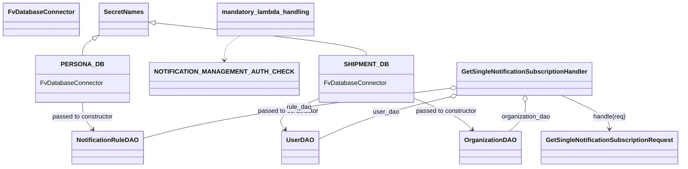

# Diagram: common/subscription_service/subscription_service/v2/get_a_real_time_notification_subscription.py


> Auto-generated by Obscura crawlers

## Diagram 1



### SVG

<svg id="container" width="1642.560546875" xmlns="http://www.w3.org/2000/svg" class="classDiagram" height="428" viewBox="0 0 1642.560546875 428" role="graphics-document document" aria-roledescription="class"><style>#container{font-family:"trebuchet ms",verdana,arial,sans-serif;font-size:16px;fill:#333;}@keyframes edge-animation-frame{from{stroke-dashoffset:0;}}@keyframes dash{to{stroke-dashoffset:0;}}#container .edge-animation-slow{stroke-dasharray:9,5!important;stroke-dashoffset:900;animation:dash 50s linear infinite;stroke-linecap:round;}#container .edge-animation-fast{stroke-dasharray:9,5!important;stroke-dashoffset:900;animation:dash 20s linear infinite;stroke-linecap:round;}#container .error-icon{fill:#552222;}#container .error-text{fill:#552222;stroke:#552222;}#container .edge-thickness-normal{stroke-width:1px;}#container .edge-thickness-thick{stroke-width:3.5px;}#container .edge-pattern-solid{stroke-dasharray:0;}#container .edge-thickness-invisible{stroke-width:0;fill:none;}#container .edge-pattern-dashed{stroke-dasharray:3;}#container .edge-pattern-dotted{stroke-dasharray:2;}#container .marker{fill:#333333;stroke:#333333;}#container .marker.cross{stroke:#333333;}#container svg{font-family:"trebuchet ms",verdana,arial,sans-serif;font-size:16px;}#container p{margin:0;}#container g.classGroup text{fill:#9370DB;stroke:none;font-family:"trebuchet ms",verdana,arial,sans-serif;font-size:10px;}#container g.classGroup text .title{font-weight:bolder;}#container .nodeLabel,#container .edgeLabel{color:#131300;}#container .edgeLabel .label rect{fill:#ECECFF;}#container .label text{fill:#131300;}#container .labelBkg{background:#ECECFF;}#container .edgeLabel .label span{background:#ECECFF;}#container .classTitle{font-weight:bolder;}#container .node rect,#container .node circle,#container .node ellipse,#container .node polygon,#container .node path{fill:#ECECFF;stroke:#9370DB;stroke-width:1px;}#container .divider{stroke:#9370DB;stroke-width:1;}#container g.clickable{cursor:pointer;}#container g.classGroup rect{fill:#ECECFF;stroke:#9370DB;}#container g.classGroup line{stroke:#9370DB;stroke-width:1;}#container .classLabel .box{stroke:none;stroke-width:0;fill:#ECECFF;opacity:0.5;}#container .classLabel .label{fill:#9370DB;font-size:10px;}#container .relation{stroke:#333333;stroke-width:1;fill:none;}#container .dashed-line{stroke-dasharray:3;}#container .dotted-line{stroke-dasharray:1 2;}#container #compositionStart,#container .composition{fill:#333333!important;stroke:#333333!important;stroke-width:1;}#container #compositionEnd,#container .composition{fill:#333333!important;stroke:#333333!important;stroke-width:1;}#container #dependencyStart,#container .dependency{fill:#333333!important;stroke:#333333!important;stroke-width:1;}#container #dependencyStart,#container .dependency{fill:#333333!important;stroke:#333333!important;stroke-width:1;}#container #extensionStart,#container .extension{fill:transparent!important;stroke:#333333!important;stroke-width:1;}#container #extensionEnd,#container .extension{fill:transparent!important;stroke:#333333!important;stroke-width:1;}#container #aggregationStart,#container .aggregation{fill:transparent!important;stroke:#333333!important;stroke-width:1;}#container #aggregationEnd,#container .aggregation{fill:transparent!important;stroke:#333333!important;stroke-width:1;}#container #lollipopStart,#container .lollipop{fill:#ECECFF!important;stroke:#333333!important;stroke-width:1;}#container #lollipopEnd,#container .lollipop{fill:#ECECFF!important;stroke:#333333!important;stroke-width:1;}#container .edgeTerminals{font-size:11px;line-height:initial;}#container .classTitleText{text-anchor:middle;font-size:18px;fill:#333;}#container .label-icon{display:inline-block;height:1em;overflow:visible;vertical-align:-0.125em;}#container .node .label-icon path{fill:currentColor;stroke:revert;stroke-width:revert;}#container :root{--mermaid-font-family:"trebuchet ms",verdana,arial,sans-serif;}</style><g><defs><marker id="container_class-aggregationStart" class="marker aggregation class" refX="18" refY="7" markerWidth="190" markerHeight="240" orient="auto"><path d="M 18,7 L9,13 L1,7 L9,1 Z"></path></marker></defs><defs><marker id="container_class-aggregationEnd" class="marker aggregation class" refX="1" refY="7" markerWidth="20" markerHeight="28" orient="auto"><path d="M 18,7 L9,13 L1,7 L9,1 Z"></path></marker></defs><defs><marker id="container_class-extensionStart" class="marker extension class" refX="18" refY="7" markerWidth="190" markerHeight="240" orient="auto"><path d="M 1,7 L18,13 V 1 Z"></path></marker></defs><defs><marker id="container_class-extensionEnd" class="marker extension class" refX="1" refY="7" markerWidth="20" markerHeight="28" orient="auto"><path d="M 1,1 V 13 L18,7 Z"></path></marker></defs><defs><marker id="container_class-compositionStart" class="marker composition class" refX="18" refY="7" markerWidth="190" markerHeight="240" orient="auto"><path d="M 18,7 L9,13 L1,7 L9,1 Z"></path></marker></defs><defs><marker id="container_class-compositionEnd" class="marker composition class" refX="1" refY="7" markerWidth="20" markerHeight="28" orient="auto"><path d="M 18,7 L9,13 L1,7 L9,1 Z"></path></marker></defs><defs><marker id="container_class-dependencyStart" class="marker dependency class" refX="6" refY="7" markerWidth="190" markerHeight="240" orient="auto"><path d="M 5,7 L9,13 L1,7 L9,1 Z"></path></marker></defs><defs><marker id="container_class-dependencyEnd" class="marker dependency class" refX="13" refY="7" markerWidth="20" markerHeight="28" orient="auto"><path d="M 18,7 L9,13 L14,7 L9,1 Z"></path></marker></defs><defs><marker id="container_class-lollipopStart" class="marker lollipop class" refX="13" refY="7" markerWidth="190" markerHeight="240" orient="auto"><circle stroke="black" fill="transparent" cx="7" cy="7" r="6"></circle></marker></defs><defs><marker id="container_class-lollipopEnd" class="marker lollipop class" refX="1" refY="7" markerWidth="190" markerHeight="240" orient="auto"><circle stroke="black" fill="transparent" cx="7" cy="7" r="6"></circle></marker></defs><g class="root"><g class="clusters"></g><g class="edgePaths"><path d="M226.249,99.512L221.87,102.426C217.49,105.341,208.731,111.171,204.352,118.252C199.973,125.333,199.973,133.667,199.973,137.833L199.973,142" id="id_SecretNames_PERSONA_DB_1" class="edge-thickness-normal edge-pattern-solid relation" style=";;;" data-edge="true" data-et="edge" data-id="id_SecretNames_PERSONA_DB_1" data-points="W3sieCI6MjQwLjYwOTM3NSwieSI6ODkuOTU0MDU2ODg1NjQ2NjV9LHsieCI6MTk5Ljk3MjY1NjI1LCJ5IjoxMTd9LHsieCI6MTk5Ljk3MjY1NjI1LCJ5IjoxNDJ9XQ==" marker-start="url(#container_class-extensionStart)"></path><path d="M377.801,59.166L458.948,68.805C540.095,78.444,702.39,97.722,783.537,111.528C864.684,125.333,864.684,133.667,864.684,137.833L864.684,142" id="id_SecretNames_SHIPMENT_DB_2" class="edge-thickness-normal edge-pattern-solid relation" style=";;;" data-edge="true" data-et="edge" data-id="id_SecretNames_SHIPMENT_DB_2" data-points="W3sieCI6MzYwLjY3MTg3NSwieSI6NTcuMTMwODI4NjI5ODAwMn0seyJ4Ijo4NjQuNjgzNTkzNzUsInkiOjExN30seyJ4Ijo4NjQuNjgzNTkzNzUsInkiOjE0Mn1d" marker-start="url(#container_class-extensionStart)"></path><path d="M199.973,262L199.973,268.167C199.973,274.333,199.973,286.667,204.446,298.23C208.92,309.794,217.867,320.587,222.34,325.984L226.814,331.381" id="id_PERSONA_DB_NotificationRuleDAO_3" class="edge-thickness-normal edge-pattern-solid relation" style=";;;" data-edge="true" data-et="edge" data-id="id_PERSONA_DB_NotificationRuleDAO_3" data-points="W3sieCI6MTk5Ljk3MjY1NjI1LCJ5IjoyNjJ9LHsieCI6MTk5Ljk3MjY1NjI1LCJ5IjoyOTl9LHsieCI6MjMwLjY0MjU1MzQwMTg5ODc0LCJ5IjozMzZ9XQ==" marker-end="url(#container_class-dependencyEnd)"></path><path d="M748.953,257.743L734.677,264.619C720.401,271.495,691.849,285.248,682.081,297.523C672.313,309.798,681.329,320.596,685.837,325.995L690.344,331.394" id="id_SHIPMENT_DB_UserDAO_4" class="edge-thickness-normal edge-pattern-solid relation" style=";;;" data-edge="true" data-et="edge" data-id="id_SHIPMENT_DB_UserDAO_4" data-points="W3sieCI6NzQ4Ljk1MzEyNSwieSI6MjU3Ljc0Mjc3OTU1NTgxNDJ9LHsieCI6NjYzLjI5Njg3NSwieSI6Mjk5fSx7IngiOjY5NC4xODk5NzIzMTAxMjY2LCJ5IjozMzZ9XQ==" marker-end="url(#container_class-dependencyEnd)"></path><path d="M980.414,250.451L999.742,258.542C1019.07,266.634,1057.725,282.817,1082.656,296.377C1107.587,309.936,1118.792,320.873,1124.395,326.341L1129.998,331.809" id="id_SHIPMENT_DB_OrganizationDAO_5" class="edge-thickness-normal edge-pattern-solid relation" style=";;;" data-edge="true" data-et="edge" data-id="id_SHIPMENT_DB_OrganizationDAO_5" data-points="W3sieCI6OTgwLjQxNDA2MjUsInkiOjI1MC40NTA1MzA2NDU5NjM0NX0seyJ4IjoxMDk2LjM4MDg1OTM3NSwieSI6Mjk5fSx7IngiOjExMzQuMjkxOTU1MTAyODQ4LCJ5IjozMzZ9XQ==" marker-end="url(#container_class-dependencyEnd)"></path><path d="M1083.407,248.468L1052.005,256.89C1020.603,265.312,957.798,282.156,906.099,300.253C854.4,318.35,813.805,337.7,793.508,347.374L773.211,357.049" id="id_GetSingleNotificationSubscriptionHandler_UserDAO_6" class="edge-thickness-normal edge-pattern-solid relation" style=";;;" data-edge="true" data-et="edge" data-id="id_GetSingleNotificationSubscriptionHandler_UserDAO_6" data-points="W3sieCI6MTEwMC4wNjgwMzcyMTAwNTE0LCJ5IjoyNDR9LHsieCI6ODk0Ljk5NDE0MDYyNSwieSI6Mjk5fSx7IngiOjc3My4yMTA5Mzc1LCJ5IjozNTcuMDQ5MjcxMTI2NzE5MX1d" marker-start="url(#container_class-aggregationStart)"></path><path d="M1258.679,261.24L1258.892,267.533C1259.105,273.827,1259.532,286.413,1253.295,298.873C1247.059,311.333,1234.158,323.667,1227.708,329.833L1221.258,336" id="id_GetSingleNotificationSubscriptionHandler_OrganizationDAO_7" class="edge-thickness-normal edge-pattern-solid relation" style=";;;" data-edge="true" data-et="edge" data-id="id_GetSingleNotificationSubscriptionHandler_OrganizationDAO_7" data-points="W3sieCI6MTI1OC4wOTQwNTIwMjk2MzkyLCJ5IjoyNDR9LHsieCI6MTI1OS45NTg5ODQzNzUsInkiOjI5OX0seyJ4IjoxMjIxLjI1NzU0MDU0NTg4NiwieSI6MzM2fV0=" marker-start="url(#container_class-aggregationStart)"></path><path d="M1073.83,226.485L983.58,238.571C893.33,250.657,712.829,274.828,592.508,295.816C472.186,316.803,412.044,334.607,381.973,343.508L351.902,352.41" id="id_GetSingleNotificationSubscriptionHandler_NotificationRuleDAO_8" class="edge-thickness-normal edge-pattern-solid relation" style=";;;" data-edge="true" data-et="edge" data-id="id_GetSingleNotificationSubscriptionHandler_NotificationRuleDAO_8" data-points="W3sieCI6MTA5MC45Mjc3MzQzNzUsInkiOjIyNC4xOTUzMTIwMTU0ODgxOH0seyJ4Ijo1MzIuMzI4MTI1LCJ5IjoyOTl9LHsieCI6MzUxLjkwMjM0Mzc1LCJ5IjozNTIuNDEwMTkzMzU3NjMxMX1d" marker-start="url(#container_class-aggregationStart)"></path><path d="M1348.146,244L1368.111,253.167C1388.076,262.333,1428.006,280.667,1447.971,295C1467.936,309.333,1467.936,319.667,1467.936,324.833L1467.936,330" id="id_GetSingleNotificationSubscriptionHandler_GetSingleNotificationSubscriptionRequest_9" class="edge-thickness-normal edge-pattern-solid relation" style=";;;" data-edge="true" data-et="edge" data-id="id_GetSingleNotificationSubscriptionHandler_GetSingleNotificationSubscriptionRequest_9" data-points="W3sieCI6MTM0OC4xNDU3NTk1MDM4NjYsInkiOjI0NH0seyJ4IjoxNDY3LjkzNTU0Njg3NSwieSI6Mjk5fSx7IngiOjE0NjcuOTM1NTQ2ODc1LCJ5IjozMzZ9XQ==" marker-end="url(#container_class-dependencyEnd)"></path><path d="M569.258,92L562.998,96.167C556.737,100.333,544.216,108.667,537.956,119C531.695,129.333,531.695,141.667,531.695,147.833L531.695,154" id="id_mandatory_lambda_handling_NOTIFICATION_MANAGEMENT_AUTH_CHECK_10" class="edge-thickness-normal edge-pattern-dashed relation" style=";;;" data-edge="true" data-et="edge" data-id="id_mandatory_lambda_handling_NOTIFICATION_MANAGEMENT_AUTH_CHECK_10" data-points="W3sieCI6NTY5LjI1Nzk4NzQwNjcxNjQsInkiOjkyfSx7IngiOjUzMS42OTUzMTI1LCJ5IjoxMTd9LHsieCI6NTMxLjY5NTMxMjUsInkiOjE2MH1d" marker-end="url(#container_class-dependencyEnd)"></path></g><g class="edgeLabels"><g class="edgeLabel"><g class="label" data-id="id_SecretNames_PERSONA_DB_1" transform="translate(0, 0)"><foreignObject width="0" height="0"><div xmlns="http://www.w3.org/1999/xhtml" class="labelBkg" style="display: table-cell; white-space: nowrap; line-height: 1.5; max-width: 200px; text-align: center;"><span class="edgeLabel"></span></div></foreignObject></g></g><g class="edgeLabel"><g class="label" data-id="id_SecretNames_SHIPMENT_DB_2" transform="translate(0, 0)"><foreignObject width="0" height="0"><div xmlns="http://www.w3.org/1999/xhtml" class="labelBkg" style="display: table-cell; white-space: nowrap; line-height: 1.5; max-width: 200px; text-align: center;"><span class="edgeLabel"></span></div></foreignObject></g></g><g class="edgeLabel" transform="translate(199.97265625, 299)"><g class="label" data-id="id_PERSONA_DB_NotificationRuleDAO_3" transform="translate(-78.90625, -12)"><foreignObject width="157.8125" height="24"><div xmlns="http://www.w3.org/1999/xhtml" class="labelBkg" style="display: table-cell; white-space: nowrap; line-height: 1.5; max-width: 200px; text-align: center;"><span class="edgeLabel"><p>passed to constructor</p></span></div></foreignObject></g></g><g class="edgeLabel" transform="translate(684.41171, 288.82982)"><g class="label" data-id="id_SHIPMENT_DB_UserDAO_4" transform="translate(-78.90625, -12)"><foreignObject width="157.8125" height="24"><div xmlns="http://www.w3.org/1999/xhtml" class="labelBkg" style="display: table-cell; white-space: nowrap; line-height: 1.5; max-width: 200px; text-align: center;"><span class="edgeLabel"><p>passed to constructor</p></span></div></foreignObject></g></g><g class="edgeLabel" transform="translate(1062.82979, 284.95385)"><g class="label" data-id="id_SHIPMENT_DB_OrganizationDAO_5" transform="translate(-78.90625, -12)"><foreignObject width="157.8125" height="24"><div xmlns="http://www.w3.org/1999/xhtml" class="labelBkg" style="display: table-cell; white-space: nowrap; line-height: 1.5; max-width: 200px; text-align: center;"><span class="edgeLabel"><p>passed to constructor</p></span></div></foreignObject></g></g><g class="edgeLabel" transform="translate(932.3783, 288.97372)"><g class="label" data-id="id_GetSingleNotificationSubscriptionHandler_UserDAO_6" transform="translate(-33.015625, -12)"><foreignObject width="66.03125" height="24"><div xmlns="http://www.w3.org/1999/xhtml" class="labelBkg" style="display: table-cell; white-space: nowrap; line-height: 1.5; max-width: 200px; text-align: center;"><span class="edgeLabel"><p>user_dao</p></span></div></foreignObject></g></g><g class="edgeLabel" transform="translate(1259.958984375, 299)"><g class="label" data-id="id_GetSingleNotificationSubscriptionHandler_OrganizationDAO_7" transform="translate(-62.984375, -12)"><foreignObject width="125.96875" height="24"><div xmlns="http://www.w3.org/1999/xhtml" class="labelBkg" style="display: table-cell; white-space: nowrap; line-height: 1.5; max-width: 200px; text-align: center;"><span class="edgeLabel"><p>organization_dao</p></span></div></foreignObject></g></g><g class="edgeLabel" transform="translate(718.37779, 274.08522)"><g class="label" data-id="id_GetSingleNotificationSubscriptionHandler_NotificationRuleDAO_8" transform="translate(-32.0625, -12)"><foreignObject width="64.125" height="24"><div xmlns="http://www.w3.org/1999/xhtml" class="labelBkg" style="display: table-cell; white-space: nowrap; line-height: 1.5; max-width: 200px; text-align: center;"><span class="edgeLabel"><p>rule_dao</p></span></div></foreignObject></g></g><g class="edgeLabel" transform="translate(1467.935546875, 299)"><g class="label" data-id="id_GetSingleNotificationSubscriptionHandler_GetSingleNotificationSubscriptionRequest_9" transform="translate(-42.359375, -12)"><foreignObject width="84.71875" height="24"><div xmlns="http://www.w3.org/1999/xhtml" class="labelBkg" style="display: table-cell; white-space: nowrap; line-height: 1.5; max-width: 200px; text-align: center;"><span class="edgeLabel"><p>handle(req)</p></span></div></foreignObject></g></g><g class="edgeLabel"><g class="label" data-id="id_mandatory_lambda_handling_NOTIFICATION_MANAGEMENT_AUTH_CHECK_10" transform="translate(0, 0)"><foreignObject width="0" height="0"><div xmlns="http://www.w3.org/1999/xhtml" class="labelBkg" style="display: table-cell; white-space: nowrap; line-height: 1.5; max-width: 200px; text-align: center;"><span class="edgeLabel"></span></div></foreignObject></g></g></g><g class="nodes"><g class="node default" id="classId-FvDatabaseConnector-0" transform="translate(99.3046875, 50)"><g class="basic label-container"><path d="M-91.3046875 -42 L91.3046875 -42 L91.3046875 42 L-91.3046875 42" stroke="none" stroke-width="0" fill="#ECECFF" style=""></path><path d="M-91.3046875 -42 C-40.91437923699434 -42, 9.475929026011315 -42, 91.3046875 -42 M-91.3046875 -42 C-18.724018362855162 -42, 53.856650774289676 -42, 91.3046875 -42 M91.3046875 -42 C91.3046875 -10.694130057291854, 91.3046875 20.61173988541629, 91.3046875 42 M91.3046875 -42 C91.3046875 -15.666191886158007, 91.3046875 10.667616227683986, 91.3046875 42 M91.3046875 42 C36.7162513765576 42, -17.8721847468848 42, -91.3046875 42 M91.3046875 42 C38.373073224845626 42, -14.558541050308747 42, -91.3046875 42 M-91.3046875 42 C-91.3046875 17.78625783266789, -91.3046875 -6.427484334664221, -91.3046875 -42 M-91.3046875 42 C-91.3046875 17.642660120199356, -91.3046875 -6.714679759601289, -91.3046875 -42" stroke="#9370DB" stroke-width="1.3" fill="none" stroke-dasharray="0 0" style=""></path></g><g class="annotation-group text" transform="translate(0, -18)"></g><g class="label-group text" transform="translate(-79.3046875, -18)"><g class="label" style="font-weight: bolder" transform="translate(0,-12)"><foreignObject width="158.609375" height="24"><div xmlns="http://www.w3.org/1999/xhtml" style="display: table-cell; white-space: nowrap; line-height: 1.5; max-width: 207px; text-align: center;"><span class="nodeLabel markdown-node-label" style=""><p>FvDatabaseConnector</p></span></div></foreignObject></g></g><g class="members-group text" transform="translate(-79.3046875, 30)"></g><g class="methods-group text" transform="translate(-79.3046875, 60)"></g><g class="divider" style=""><path d="M-91.3046875 6 C-48.059660283628105 6, -4.81463306725621 6, 91.3046875 6 M-91.3046875 6 C-41.58273113006571 6, 8.13922523986858 6, 91.3046875 6" stroke="#9370DB" stroke-width="1.3" fill="none" stroke-dasharray="0 0" style=""></path></g><g class="divider" style=""><path d="M-91.3046875 24 C-44.619345396951054 24, 2.0659967060978914 24, 91.3046875 24 M-91.3046875 24 C-49.11735560698205 24, -6.930023713964104 24, 91.3046875 24" stroke="#9370DB" stroke-width="1.3" fill="none" stroke-dasharray="0 0" style=""></path></g></g><g class="node default" id="classId-SecretNames-1" transform="translate(300.640625, 50)"><g class="basic label-container"><path d="M-60.03125 -42 L60.03125 -42 L60.03125 42 L-60.03125 42" stroke="none" stroke-width="0" fill="#ECECFF" style=""></path><path d="M-60.03125 -42 C-29.14777971295966 -42, 1.735690574080678 -42, 60.03125 -42 M-60.03125 -42 C-28.100565200928656 -42, 3.830119598142687 -42, 60.03125 -42 M60.03125 -42 C60.03125 -14.100664549030896, 60.03125 13.798670901938209, 60.03125 42 M60.03125 -42 C60.03125 -16.612374469020086, 60.03125 8.775251061959828, 60.03125 42 M60.03125 42 C30.526478521564947 42, 1.0217070431298936 42, -60.03125 42 M60.03125 42 C30.918340092283643 42, 1.8054301845672853 42, -60.03125 42 M-60.03125 42 C-60.03125 17.840908534177967, -60.03125 -6.318182931644067, -60.03125 -42 M-60.03125 42 C-60.03125 23.123600862193964, -60.03125 4.247201724387928, -60.03125 -42" stroke="#9370DB" stroke-width="1.3" fill="none" stroke-dasharray="0 0" style=""></path></g><g class="annotation-group text" transform="translate(0, -18)"></g><g class="label-group text" transform="translate(-48.03125, -18)"><g class="label" style="font-weight: bolder" transform="translate(0,-12)"><foreignObject width="96.0625" height="24"><div xmlns="http://www.w3.org/1999/xhtml" style="display: table-cell; white-space: nowrap; line-height: 1.5; max-width: 145px; text-align: center;"><span class="nodeLabel markdown-node-label" style=""><p>SecretNames</p></span></div></foreignObject></g></g><g class="members-group text" transform="translate(-48.03125, 30)"></g><g class="methods-group text" transform="translate(-48.03125, 60)"></g><g class="divider" style=""><path d="M-60.03125 6 C-31.62224595063814 6, -3.2132419012762767 6, 60.03125 6 M-60.03125 6 C-28.60528144712768 6, 2.820687105744639 6, 60.03125 6" stroke="#9370DB" stroke-width="1.3" fill="none" stroke-dasharray="0 0" style=""></path></g><g class="divider" style=""><path d="M-60.03125 24 C-26.983990751531138 24, 6.063268496937724 24, 60.03125 24 M-60.03125 24 C-29.23829998215014 24, 1.5546500356997228 24, 60.03125 24" stroke="#9370DB" stroke-width="1.3" fill="none" stroke-dasharray="0 0" style=""></path></g></g><g class="node default" id="classId-UserDAO-2" transform="translate(729.2578125, 378)"><g class="basic label-container"><path d="M-43.953125 -42 L43.953125 -42 L43.953125 42 L-43.953125 42" stroke="none" stroke-width="0" fill="#ECECFF" style=""></path><path d="M-43.953125 -42 C-19.018497780204694 -42, 5.9161294395906125 -42, 43.953125 -42 M-43.953125 -42 C-11.217595416193411 -42, 21.517934167613177 -42, 43.953125 -42 M43.953125 -42 C43.953125 -21.338255160180964, 43.953125 -0.6765103203619276, 43.953125 42 M43.953125 -42 C43.953125 -16.219292586232694, 43.953125 9.561414827534612, 43.953125 42 M43.953125 42 C16.525868131215343 42, -10.901388737569313 42, -43.953125 42 M43.953125 42 C10.253450221308825 42, -23.44622455738235 42, -43.953125 42 M-43.953125 42 C-43.953125 16.379206527986625, -43.953125 -9.24158694402675, -43.953125 -42 M-43.953125 42 C-43.953125 19.276582278381298, -43.953125 -3.446835443237404, -43.953125 -42" stroke="#9370DB" stroke-width="1.3" fill="none" stroke-dasharray="0 0" style=""></path></g><g class="annotation-group text" transform="translate(0, -18)"></g><g class="label-group text" transform="translate(-31.953125, -18)"><g class="label" style="font-weight: bolder" transform="translate(0,-12)"><foreignObject width="63.90625" height="24"><div xmlns="http://www.w3.org/1999/xhtml" style="display: table-cell; white-space: nowrap; line-height: 1.5; max-width: 113px; text-align: center;"><span class="nodeLabel markdown-node-label" style=""><p>UserDAO</p></span></div></foreignObject></g></g><g class="members-group text" transform="translate(-31.953125, 30)"></g><g class="methods-group text" transform="translate(-31.953125, 60)"></g><g class="divider" style=""><path d="M-43.953125 6 C-19.644417465958785 6, 4.66429006808243 6, 43.953125 6 M-43.953125 6 C-18.427517194664002 6, 7.098090610671996 6, 43.953125 6" stroke="#9370DB" stroke-width="1.3" fill="none" stroke-dasharray="0 0" style=""></path></g><g class="divider" style=""><path d="M-43.953125 24 C-15.841372203069476 24, 12.270380593861049 24, 43.953125 24 M-43.953125 24 C-11.140951018147483 24, 21.671222963705034 24, 43.953125 24" stroke="#9370DB" stroke-width="1.3" fill="none" stroke-dasharray="0 0" style=""></path></g></g><g class="node default" id="classId-OrganizationDAO-3" transform="translate(1177.326171875, 378)"><g class="basic label-container"><path d="M-73.984375 -42 L73.984375 -42 L73.984375 42 L-73.984375 42" stroke="none" stroke-width="0" fill="#ECECFF" style=""></path><path d="M-73.984375 -42 C-41.18069577374 -42, -8.377016547479997 -42, 73.984375 -42 M-73.984375 -42 C-25.099241502646088 -42, 23.785891994707825 -42, 73.984375 -42 M73.984375 -42 C73.984375 -20.86384644938782, 73.984375 0.27230710122435653, 73.984375 42 M73.984375 -42 C73.984375 -15.520993770325749, 73.984375 10.958012459348502, 73.984375 42 M73.984375 42 C40.84122658963172 42, 7.698078179263433 42, -73.984375 42 M73.984375 42 C28.85292751761765 42, -16.278519964764698 42, -73.984375 42 M-73.984375 42 C-73.984375 12.536731611675737, -73.984375 -16.926536776648526, -73.984375 -42 M-73.984375 42 C-73.984375 9.17178362469651, -73.984375 -23.65643275060698, -73.984375 -42" stroke="#9370DB" stroke-width="1.3" fill="none" stroke-dasharray="0 0" style=""></path></g><g class="annotation-group text" transform="translate(0, -18)"></g><g class="label-group text" transform="translate(-61.984375, -18)"><g class="label" style="font-weight: bolder" transform="translate(0,-12)"><foreignObject width="123.96875" height="24"><div xmlns="http://www.w3.org/1999/xhtml" style="display: table-cell; white-space: nowrap; line-height: 1.5; max-width: 172px; text-align: center;"><span class="nodeLabel markdown-node-label" style=""><p>OrganizationDAO</p></span></div></foreignObject></g></g><g class="members-group text" transform="translate(-61.984375, 30)"></g><g class="methods-group text" transform="translate(-61.984375, 60)"></g><g class="divider" style=""><path d="M-73.984375 6 C-39.26898749085242 6, -4.553599981704835 6, 73.984375 6 M-73.984375 6 C-25.93739083018948 6, 22.109593339621043 6, 73.984375 6" stroke="#9370DB" stroke-width="1.3" fill="none" stroke-dasharray="0 0" style=""></path></g><g class="divider" style=""><path d="M-73.984375 24 C-41.82603411751578 24, -9.667693235031564 24, 73.984375 24 M-73.984375 24 C-35.502365794506176 24, 2.9796434109876486 24, 73.984375 24" stroke="#9370DB" stroke-width="1.3" fill="none" stroke-dasharray="0 0" style=""></path></g></g><g class="node default" id="classId-NotificationRuleDAO-4" transform="translate(265.45703125, 378)"><g class="basic label-container"><path d="M-86.4453125 -42 L86.4453125 -42 L86.4453125 42 L-86.4453125 42" stroke="none" stroke-width="0" fill="#ECECFF" style=""></path><path d="M-86.4453125 -42 C-23.839280748189267 -42, 38.766751003621465 -42, 86.4453125 -42 M-86.4453125 -42 C-48.05388088469415 -42, -9.662449269388304 -42, 86.4453125 -42 M86.4453125 -42 C86.4453125 -21.148155058727607, 86.4453125 -0.29631011745521363, 86.4453125 42 M86.4453125 -42 C86.4453125 -8.876734756997969, 86.4453125 24.246530486004062, 86.4453125 42 M86.4453125 42 C22.01656965431809 42, -42.41217319136382 42, -86.4453125 42 M86.4453125 42 C39.45981125787278 42, -7.525689984254441 42, -86.4453125 42 M-86.4453125 42 C-86.4453125 21.176388964107254, -86.4453125 0.3527779282145076, -86.4453125 -42 M-86.4453125 42 C-86.4453125 13.72991201079406, -86.4453125 -14.540175978411881, -86.4453125 -42" stroke="#9370DB" stroke-width="1.3" fill="none" stroke-dasharray="0 0" style=""></path></g><g class="annotation-group text" transform="translate(0, -18)"></g><g class="label-group text" transform="translate(-74.4453125, -18)"><g class="label" style="font-weight: bolder" transform="translate(0,-12)"><foreignObject width="148.890625" height="24"><div xmlns="http://www.w3.org/1999/xhtml" style="display: table-cell; white-space: nowrap; line-height: 1.5; max-width: 198px; text-align: center;"><span class="nodeLabel markdown-node-label" style=""><p>NotificationRuleDAO</p></span></div></foreignObject></g></g><g class="members-group text" transform="translate(-74.4453125, 30)"></g><g class="methods-group text" transform="translate(-74.4453125, 60)"></g><g class="divider" style=""><path d="M-86.4453125 6 C-32.84698992081748 6, 20.751332658365044 6, 86.4453125 6 M-86.4453125 6 C-49.85590635746289 6, -13.266500214925784 6, 86.4453125 6" stroke="#9370DB" stroke-width="1.3" fill="none" stroke-dasharray="0 0" style=""></path></g><g class="divider" style=""><path d="M-86.4453125 24 C-37.76677327890326 24, 10.911765942193483 24, 86.4453125 24 M-86.4453125 24 C-43.89111776449538 24, -1.3369230289907534 24, 86.4453125 24" stroke="#9370DB" stroke-width="1.3" fill="none" stroke-dasharray="0 0" style=""></path></g></g><g class="node default" id="classId-GetSingleNotificationSubscriptionHandler-5" transform="translate(1256.669921875, 202)"><g class="basic label-container"><path d="M-165.7421875 -42 L165.7421875 -42 L165.7421875 42 L-165.7421875 42" stroke="none" stroke-width="0" fill="#ECECFF" style=""></path><path d="M-165.7421875 -42 C-86.67856749706807 -42, -7.614947494136146 -42, 165.7421875 -42 M-165.7421875 -42 C-41.48046890216129 -42, 82.78124969567742 -42, 165.7421875 -42 M165.7421875 -42 C165.7421875 -24.799014133020624, 165.7421875 -7.598028266041247, 165.7421875 42 M165.7421875 -42 C165.7421875 -11.925626715809344, 165.7421875 18.148746568381313, 165.7421875 42 M165.7421875 42 C70.111147216899 42, -25.519893066202002 42, -165.7421875 42 M165.7421875 42 C66.38644881037268 42, -32.96928987925463 42, -165.7421875 42 M-165.7421875 42 C-165.7421875 22.810528711187136, -165.7421875 3.621057422374271, -165.7421875 -42 M-165.7421875 42 C-165.7421875 12.660131350719539, -165.7421875 -16.679737298560923, -165.7421875 -42" stroke="#9370DB" stroke-width="1.3" fill="none" stroke-dasharray="0 0" style=""></path></g><g class="annotation-group text" transform="translate(0, -18)"></g><g class="label-group text" transform="translate(-153.7421875, -18)"><g class="label" style="font-weight: bolder" transform="translate(0,-12)"><foreignObject width="307.484375" height="24"><div xmlns="http://www.w3.org/1999/xhtml" style="display: table-cell; white-space: nowrap; line-height: 1.5; max-width: 355px; text-align: center;"><span class="nodeLabel markdown-node-label" style=""><p>GetSingleNotificationSubscriptionHandler</p></span></div></foreignObject></g></g><g class="members-group text" transform="translate(-153.7421875, 30)"></g><g class="methods-group text" transform="translate(-153.7421875, 60)"></g><g class="divider" style=""><path d="M-165.7421875 6 C-83.50818684249955 6, -1.2741861849991096 6, 165.7421875 6 M-165.7421875 6 C-69.57953131049416 6, 26.583124879011677 6, 165.7421875 6" stroke="#9370DB" stroke-width="1.3" fill="none" stroke-dasharray="0 0" style=""></path></g><g class="divider" style=""><path d="M-165.7421875 24 C-55.56239684749559 24, 54.61739380500882 24, 165.7421875 24 M-165.7421875 24 C-50.00965330357495 24, 65.7228808928501 24, 165.7421875 24" stroke="#9370DB" stroke-width="1.3" fill="none" stroke-dasharray="0 0" style=""></path></g></g><g class="node default" id="classId-GetSingleNotificationSubscriptionRequest-6" transform="translate(1467.935546875, 378)"><g class="basic label-container"><path d="M-166.625 -42 L166.625 -42 L166.625 42 L-166.625 42" stroke="none" stroke-width="0" fill="#ECECFF" style=""></path><path d="M-166.625 -42 C-85.84544717212302 -42, -5.065894344246033 -42, 166.625 -42 M-166.625 -42 C-54.38460708011836 -42, 57.855785839763286 -42, 166.625 -42 M166.625 -42 C166.625 -10.614922211177863, 166.625 20.770155577644275, 166.625 42 M166.625 -42 C166.625 -22.091699555557344, 166.625 -2.1833991111146887, 166.625 42 M166.625 42 C69.577623590953 42, -27.46975281809401 42, -166.625 42 M166.625 42 C51.60300858608613 42, -63.41898282782773 42, -166.625 42 M-166.625 42 C-166.625 11.882813990274407, -166.625 -18.234372019451186, -166.625 -42 M-166.625 42 C-166.625 24.80316804963827, -166.625 7.60633609927654, -166.625 -42" stroke="#9370DB" stroke-width="1.3" fill="none" stroke-dasharray="0 0" style=""></path></g><g class="annotation-group text" transform="translate(0, -18)"></g><g class="label-group text" transform="translate(-154.625, -18)"><g class="label" style="font-weight: bolder" transform="translate(0,-12)"><foreignObject width="309.25" height="24"><div xmlns="http://www.w3.org/1999/xhtml" style="display: table-cell; white-space: nowrap; line-height: 1.5; max-width: 355px; text-align: center;"><span class="nodeLabel markdown-node-label" style=""><p>GetSingleNotificationSubscriptionRequest</p></span></div></foreignObject></g></g><g class="members-group text" transform="translate(-154.625, 30)"></g><g class="methods-group text" transform="translate(-154.625, 60)"></g><g class="divider" style=""><path d="M-166.625 6 C-46.2110803830889 6, 74.2028392338222 6, 166.625 6 M-166.625 6 C-35.385175635072045 6, 95.85464872985591 6, 166.625 6" stroke="#9370DB" stroke-width="1.3" fill="none" stroke-dasharray="0 0" style=""></path></g><g class="divider" style=""><path d="M-166.625 24 C-82.02400146964527 24, 2.576997060709459 24, 166.625 24 M-166.625 24 C-40.95682420739193 24, 84.71135158521614 24, 166.625 24" stroke="#9370DB" stroke-width="1.3" fill="none" stroke-dasharray="0 0" style=""></path></g></g><g class="node default" id="classId-NOTIFICATION_MANAGEMENT_AUTH_CHECK-7" transform="translate(531.6953125, 202)"><g class="basic label-container"><path d="M-167.2578125 -42 L167.2578125 -42 L167.2578125 42 L-167.2578125 42" stroke="none" stroke-width="0" fill="#ECECFF" style=""></path><path d="M-167.2578125 -42 C-65.87361088146581 -42, 35.510590737068384 -42, 167.2578125 -42 M-167.2578125 -42 C-81.76019383198968 -42, 3.7374248360206366 -42, 167.2578125 -42 M167.2578125 -42 C167.2578125 -21.525209881100253, 167.2578125 -1.0504197622005051, 167.2578125 42 M167.2578125 -42 C167.2578125 -14.133575668809993, 167.2578125 13.732848662380015, 167.2578125 42 M167.2578125 42 C50.12759681925054 42, -67.00261886149892 42, -167.2578125 42 M167.2578125 42 C81.7434827058471 42, -3.7708470883058 42, -167.2578125 42 M-167.2578125 42 C-167.2578125 16.80619587914564, -167.2578125 -8.387608241708719, -167.2578125 -42 M-167.2578125 42 C-167.2578125 21.534419451886716, -167.2578125 1.0688389037734325, -167.2578125 -42" stroke="#9370DB" stroke-width="1.3" fill="none" stroke-dasharray="0 0" style=""></path></g><g class="annotation-group text" transform="translate(0, -18)"></g><g class="label-group text" transform="translate(-155.2578125, -18)"><g class="label" style="font-weight: bolder" transform="translate(0,-12)"><foreignObject width="310.515625" height="24"><div xmlns="http://www.w3.org/1999/xhtml" style="display: table-cell; white-space: nowrap; line-height: 1.5; max-width: 359px; text-align: center;"><span class="nodeLabel markdown-node-label" style=""><p>NOTIFICATION_MANAGEMENT_AUTH_CHECK</p></span></div></foreignObject></g></g><g class="members-group text" transform="translate(-155.2578125, 30)"></g><g class="methods-group text" transform="translate(-155.2578125, 60)"></g><g class="divider" style=""><path d="M-167.2578125 6 C-41.10958628208627 6, 85.03863993582746 6, 167.2578125 6 M-167.2578125 6 C-35.79162226455958 6, 95.67456797088084 6, 167.2578125 6" stroke="#9370DB" stroke-width="1.3" fill="none" stroke-dasharray="0 0" style=""></path></g><g class="divider" style=""><path d="M-167.2578125 24 C-55.761856064799176 24, 55.73410037040165 24, 167.2578125 24 M-167.2578125 24 C-59.68375943932244 24, 47.89029362135511 24, 167.2578125 24" stroke="#9370DB" stroke-width="1.3" fill="none" stroke-dasharray="0 0" style=""></path></g></g><g class="node default" id="classId-PERSONA_DB-8" transform="translate(199.97265625, 202)"><g class="basic label-container"><path d="M-114.46484375 -60 L114.46484375 -60 L114.46484375 60 L-114.46484375 60" stroke="none" stroke-width="0" fill="#ECECFF" style=""></path><path d="M-114.46484375 -60 C-36.95772001078801 -60, 40.54940372842398 -60, 114.46484375 -60 M-114.46484375 -60 C-53.00010892223013 -60, 8.464625905539734 -60, 114.46484375 -60 M114.46484375 -60 C114.46484375 -17.17013493853468, 114.46484375 25.65973012293064, 114.46484375 60 M114.46484375 -60 C114.46484375 -13.764034946835018, 114.46484375 32.471930106329964, 114.46484375 60 M114.46484375 60 C34.72771095594311 60, -45.00942183811378 60, -114.46484375 60 M114.46484375 60 C64.31739586118485 60, 14.169947972369712 60, -114.46484375 60 M-114.46484375 60 C-114.46484375 28.376483153944765, -114.46484375 -3.2470336921104703, -114.46484375 -60 M-114.46484375 60 C-114.46484375 32.47689873998618, -114.46484375 4.953797479972373, -114.46484375 -60" stroke="#9370DB" stroke-width="1.3" fill="none" stroke-dasharray="0 0" style=""></path></g><g class="annotation-group text" transform="translate(0, -36)"></g><g class="label-group text" transform="translate(-48.3046875, -36)"><g class="label" style="font-weight: bolder" transform="translate(0,-12)"><foreignObject width="96.609375" height="24"><div xmlns="http://www.w3.org/1999/xhtml" style="display: table-cell; white-space: nowrap; line-height: 1.5; max-width: 146px; text-align: center;"><span class="nodeLabel markdown-node-label" style=""><p>PERSONA_DB</p></span></div></foreignObject></g></g><g class="members-group text" transform="translate(-102.46484375, 12)"><g class="label" style="" transform="translate(0,-12)"><foreignObject width="156.625" height="24"><div xmlns="http://www.w3.org/1999/xhtml" style="display: table-cell; white-space: nowrap; line-height: 1.5; max-width: 207px; text-align: center;"><span class="nodeLabel markdown-node-label" style=""><p>FvDatabaseConnector</p></span></div></foreignObject></g></g><g class="methods-group text" transform="translate(-102.46484375, 60)"></g><g class="divider" style=""><path d="M-114.46484375 -12 C-38.544834729887015 -12, 37.37517429022597 -12, 114.46484375 -12 M-114.46484375 -12 C-56.535009339391905 -12, 1.3948250712161894 -12, 114.46484375 -12" stroke="#9370DB" stroke-width="1.3" fill="none" stroke-dasharray="0 0" style=""></path></g><g class="divider" style=""><path d="M-114.46484375 36 C-60.30692769371251 36, -6.149011637425019 36, 114.46484375 36 M-114.46484375 36 C-25.76501089279776 36, 62.93482196440448 36, 114.46484375 36" stroke="#9370DB" stroke-width="1.3" fill="none" stroke-dasharray="0 0" style=""></path></g></g><g class="node default" id="classId-SHIPMENT_DB-9" transform="translate(864.68359375, 202)"><g class="basic label-container"><path d="M-115.73046875 -60 L115.73046875 -60 L115.73046875 60 L-115.73046875 60" stroke="none" stroke-width="0" fill="#ECECFF" style=""></path><path d="M-115.73046875 -60 C-31.917324360070438 -60, 51.895820029859124 -60, 115.73046875 -60 M-115.73046875 -60 C-56.896632174971174 -60, 1.9372044000576523 -60, 115.73046875 -60 M115.73046875 -60 C115.73046875 -12.30507448438091, 115.73046875 35.38985103123818, 115.73046875 60 M115.73046875 -60 C115.73046875 -18.39013582830527, 115.73046875 23.219728343389463, 115.73046875 60 M115.73046875 60 C68.66723305489234 60, 21.603997359784657 60, -115.73046875 60 M115.73046875 60 C57.28769318694315 60, -1.1550823761136968 60, -115.73046875 60 M-115.73046875 60 C-115.73046875 33.42148809175225, -115.73046875 6.842976183504504, -115.73046875 -60 M-115.73046875 60 C-115.73046875 13.415033375943523, -115.73046875 -33.169933248112955, -115.73046875 -60" stroke="#9370DB" stroke-width="1.3" fill="none" stroke-dasharray="0 0" style=""></path></g><g class="annotation-group text" transform="translate(0, -36)"></g><g class="label-group text" transform="translate(-50.8359375, -36)"><g class="label" style="font-weight: bolder" transform="translate(0,-12)"><foreignObject width="101.671875" height="24"><div xmlns="http://www.w3.org/1999/xhtml" style="display: table-cell; white-space: nowrap; line-height: 1.5; max-width: 151px; text-align: center;"><span class="nodeLabel markdown-node-label" style=""><p>SHIPMENT_DB</p></span></div></foreignObject></g></g><g class="members-group text" transform="translate(-103.73046875, 12)"><g class="label" style="" transform="translate(0,-12)"><foreignObject width="156.625" height="24"><div xmlns="http://www.w3.org/1999/xhtml" style="display: table-cell; white-space: nowrap; line-height: 1.5; max-width: 207px; text-align: center;"><span class="nodeLabel markdown-node-label" style=""><p>FvDatabaseConnector</p></span></div></foreignObject></g></g><g class="methods-group text" transform="translate(-103.73046875, 60)"></g><g class="divider" style=""><path d="M-115.73046875 -12 C-56.91112434778662 -12, 1.9082200544267636 -12, 115.73046875 -12 M-115.73046875 -12 C-29.92091124562782 -12, 55.88864625874436 -12, 115.73046875 -12" stroke="#9370DB" stroke-width="1.3" fill="none" stroke-dasharray="0 0" style=""></path></g><g class="divider" style=""><path d="M-115.73046875 36 C-40.398202742643704 36, 34.93406326471259 36, 115.73046875 36 M-115.73046875 36 C-24.089212749247793 36, 67.55204325150441 36, 115.73046875 36" stroke="#9370DB" stroke-width="1.3" fill="none" stroke-dasharray="0 0" style=""></path></g></g><g class="node default" id="classId-mandatory_lambda_handling-10" transform="translate(632.36328125, 50)"><g class="basic label-container"><path d="M-119.4296875 -42 L119.4296875 -42 L119.4296875 42 L-119.4296875 42" stroke="none" stroke-width="0" fill="#ECECFF" style=""></path><path d="M-119.4296875 -42 C-32.75829733811155 -42, 53.91309282377691 -42, 119.4296875 -42 M-119.4296875 -42 C-28.25072845930066 -42, 62.92823058139868 -42, 119.4296875 -42 M119.4296875 -42 C119.4296875 -17.29657064051532, 119.4296875 7.40685871896936, 119.4296875 42 M119.4296875 -42 C119.4296875 -22.71668817844618, 119.4296875 -3.43337635689236, 119.4296875 42 M119.4296875 42 C29.41769127469638 42, -60.59430495060724 42, -119.4296875 42 M119.4296875 42 C65.79442613180069 42, 12.159164763601368 42, -119.4296875 42 M-119.4296875 42 C-119.4296875 12.841836801923993, -119.4296875 -16.316326396152014, -119.4296875 -42 M-119.4296875 42 C-119.4296875 23.093238977636826, -119.4296875 4.186477955273652, -119.4296875 -42" stroke="#9370DB" stroke-width="1.3" fill="none" stroke-dasharray="0 0" style=""></path></g><g class="annotation-group text" transform="translate(0, -18)"></g><g class="label-group text" transform="translate(-107.4296875, -18)"><g class="label" style="font-weight: bolder" transform="translate(0,-12)"><foreignObject width="214.859375" height="24"><div xmlns="http://www.w3.org/1999/xhtml" style="display: table-cell; white-space: nowrap; line-height: 1.5; max-width: 264px; text-align: center;"><span class="nodeLabel markdown-node-label" style=""><p>mandatory_lambda_handling</p></span></div></foreignObject></g></g><g class="members-group text" transform="translate(-107.4296875, 30)"></g><g class="methods-group text" transform="translate(-107.4296875, 60)"></g><g class="divider" style=""><path d="M-119.4296875 6 C-59.38101160443726 6, 0.667664291125476 6, 119.4296875 6 M-119.4296875 6 C-58.375782687669904 6, 2.6781221246601916 6, 119.4296875 6" stroke="#9370DB" stroke-width="1.3" fill="none" stroke-dasharray="0 0" style=""></path></g><g class="divider" style=""><path d="M-119.4296875 24 C-42.081815506345436 24, 35.26605648730913 24, 119.4296875 24 M-119.4296875 24 C-36.93067646498578 24, 45.56833457002844 24, 119.4296875 24" stroke="#9370DB" stroke-width="1.3" fill="none" stroke-dasharray="0 0" style=""></path></g></g></g></g></g></svg>

## Diagram 2

```mermaid
flowchart TD
    A[Module import / init] --> B[Create PERSONA_DB (FvDatabaseConnector)]
    A --> C[Create SHIPMENT_DB (FvDatabaseConnector)]
    D[Lambda invocation: lambda_handler(event, context, audit_refs)] --> E[mandatory_lambda_handling auth_check]
    E --> F[Construct UserDAO with SHIPMENT_DB]
    E --> G[Construct OrganizationDAO with SHIPMENT_DB]
    E --> H[Construct NotificationRuleDAO with PERSONA_DB]
    F --> I[Instantiate GetSingleNotificationSubscriptionHandler(user_dao, organization_dao, rule_dao)]
    G --> I
    H --> I
    I --> J[Create GetSingleNotificationSubscriptionRequest(event)]
    J --> K[handler.handle(request)]
    K --> L[Return result to caller]
```

> SVG rendering failed for this diagram.
