# Diagram: common/subscription_service/subscription_service/v2/service/definition_json_schema.py

> Auto-generated by Obscura crawlers

## Mermaid

```mermaid
classDiagram
class ISO8601DurationRegexPattern {
  +pattern: string
}
class CommonSchema {
  +$schema: string
  +$id: string
  +type: object
  +definitions: ISO8601DurationRegexPattern
}
class WithinRangeOfDestination {
  +value: integer
  +unit: "miles" | "kilometers"
}
class OriginCodesFilter { +items: string[] }
class DestinationCodesFilter { +items: string[] }
class ScheduledArrivalFilter { +enum: ["TODAY","TOMORROW","THIS_WEEK","THIS_MONTH"] }
class PartNumbersFilter { +items: string[] }
class CarrierFvIdsFilter { +items: string[] }
class ModeFilter {
  +items: enum["Air","Parcel","Rail","Truck","Ocean","Intermodal","Multimodal","LTL"]
}
class CarrierDelayEventsModeFilter {
  +items: enum["Parcel","Rail","Truck"]
}
class AllFilters {
  +originCodes: OriginCodesFilter
  +destinationCodes: DestinationCodesFilter
  +scheduledArrival: ScheduledArrivalFilter
  +partNumbers: PartNumbersFilter
  +carrierFvIds: CarrierFvIdsFilter
  +withinRangeOfDestination: WithinRangeOfDestination
  +mode: ModeFilter
}
class ShipmentsBehindSchedule {
  +behindScheduleV1.lateBy: string (ISO8601)
  +behindScheduleV1.scheduledArrivalWindowBoundary: "CLOSE" | "OPEN"
  +filters: AllFilters
}
class ShipmentsEarlyArrival {
  +earlyArrivalV1.earlyBy: string (ISO8601)
  +filters: AllFilters
}
class ShipmentsCarrierDelay {
  +carrierDelayV1.filters: CarrierDelaySpecificFilters
}
class ShipmentsCarrierDelayCleared {
  +carrierDelayClearedV1.filters: CarrierDelaySpecificFilters
}
class ShipmentsExcessiveDwell {
  +excessiveDwellV1.filters: ExcessiveDwellFilters
}
class ShipmentsOffRouteRail {
  +offRouteRailV1.filters: AllFilters
}
class CarrierDelaySpecificFilters {
  +originCodes: OriginCodesFilter
  +destinationCodes: DestinationCodesFilter
  +scheduledArrival: ScheduledArrivalFilter
  +partNumbers: PartNumbersFilter
  +carrierFvIds: CarrierFvIdsFilter
  +withinRangeOfDestination: WithinRangeOfDestination
  +mode: CarrierDelayEventsModeFilter
}
class ExcessiveDwellFilters {
  +originCodes: OriginCodesFilter
  +destinationCodes: DestinationCodesFilter
  +scheduledArrival: ScheduledArrivalFilter
  +partNumbers: PartNumbersFilter
  +carrierFvIds: CarrierFvIdsFilter
  +withinRangeOfDestination: WithinRangeOfDestination
  +mode: enum["Truck"]
}

CommonSchema --> ISO8601DurationRegexPattern
AllFilters --> OriginCodesFilter
AllFilters --> DestinationCodesFilter
AllFilters --> ScheduledArrivalFilter
AllFilters --> PartNumbersFilter
AllFilters --> CarrierFvIdsFilter
AllFilters --> WithinRangeOfDestination
AllFilters --> ModeFilter

ShipmentsBehindSchedule --> CommonSchema
ShipmentsBehindSchedule --> AllFilters

ShipmentsEarlyArrival --> CommonSchema
ShipmentsEarlyArrival --> AllFilters

ShipmentsCarrierDelay --> CommonSchema
ShipmentsCarrierDelay --> CarrierDelaySpecificFilters

ShipmentsCarrierDelayCleared --> CommonSchema
ShipmentsCarrierDelayCleared --> CarrierDelaySpecificFilters

ShipmentsExcessiveDwell --> CommonSchema
ShipmentsExcessiveDwell --> ExcessiveDwellFilters

ShipmentsOffRouteRail --> CommonSchema
ShipmentsOffRouteRail --> AllFilters
```

### SVG

<svg id="container" width="4696.880859375" xmlns="http://www.w3.org/2000/svg" class="classDiagram" height="692" viewBox="0 0 4696.880859375 692" role="graphics-document document" aria-roledescription="class"><g><defs><marker id="container_class-aggregationStart" class="marker aggregation class" refX="18" refY="7" markerWidth="190" markerHeight="240" orient="auto"><path d="M 18,7 L9,13 L1,7 L9,1 Z"></path></marker></defs><defs><marker id="container_class-aggregationEnd" class="marker aggregation class" refX="1" refY="7" markerWidth="20" markerHeight="28" orient="auto"><path d="M 18,7 L9,13 L1,7 L9,1 Z"></path></marker></defs><defs><marker id="container_class-extensionStart" class="marker extension class" refX="18" refY="7" markerWidth="190" markerHeight="240" orient="auto"><path d="M 1,7 L18,13 V 1 Z"></path></marker></defs><defs><marker id="container_class-extensionEnd" class="marker extension class" refX="1" refY="7" markerWidth="20" markerHeight="28" orient="auto"><path d="M 1,1 V 13 L18,7 Z"></path></marker></defs><defs><marker id="container_class-compositionStart" class="marker composition class" refX="18" refY="7" markerWidth="190" markerHeight="240" orient="auto"><path d="M 18,7 L9,13 L1,7 L9,1 Z"></path></marker></defs><defs><marker id="container_class-compositionEnd" class="marker composition class" refX="1" refY="7" markerWidth="20" markerHeight="28" orient="auto"><path d="M 18,7 L9,13 L1,7 L9,1 Z"></path></marker></defs><defs><marker id="container_class-dependencyStart" class="marker dependency class" refX="6" refY="7" markerWidth="190" markerHeight="240" orient="auto"><path d="M 5,7 L9,13 L1,7 L9,1 Z"></path></marker></defs><defs><marker id="container_class-dependencyEnd" class="marker dependency class" refX="13" refY="7" markerWidth="20" markerHeight="28" orient="auto"><path d="M 18,7 L9,13 L14,7 L9,1 Z"></path></marker></defs><defs><marker id="container_class-lollipopStart" class="marker lollipop class" refX="13" refY="7" markerWidth="190" markerHeight="240" orient="auto"><circle stroke="black" fill="transparent" cx="7" cy="7" r="6"></circle></marker></defs><defs><marker id="container_class-lollipopEnd" class="marker lollipop class" refX="1" refY="7" markerWidth="190" markerHeight="240" orient="auto"><circle stroke="black" fill="transparent" cx="7" cy="7" r="6"></circle></marker></defs><g class="root"><g class="clusters"></g><g class="edgePaths"><path d="M2786.975,454L2786.975,464.167C2786.975,474.333,2786.975,494.667,2786.975,510C2786.975,525.333,2786.975,535.667,2786.975,540.833L2786.975,546" id="id_CommonSchema_ISO8601DurationRegexPattern_1" class="edge-thickness-normal edge-pattern-solid relation" style=";;;" data-edge="true" data-et="edge" data-id="id_CommonSchema_ISO8601DurationRegexPattern_1" data-points="W3sieCI6Mjc4Ni45NzQ2MDkzNzUsInkiOjQ1NH0seyJ4IjoyNzg2Ljk3NDYwOTM3NSwieSI6NTE1fSx7IngiOjI3ODYuOTc0NjA5Mzc1LCJ5Ijo1NTJ9XQ==" marker-end="url(#container_class-dependencyEnd)"></path><path d="M1662.939,390.947L1805.187,411.622C1947.434,432.298,2231.929,473.649,2374.176,499.491C2516.424,525.333,2516.424,535.667,2516.424,540.833L2516.424,546" id="id_AllFilters_OriginCodesFilter_2" class="edge-thickness-normal edge-pattern-solid relation" style=";;;" data-edge="true" data-et="edge" data-id="id_AllFilters_OriginCodesFilter_2" data-points="W3sieCI6MTY2Mi45Mzk0NTMxMjUsInkiOjM5MC45NDY2MDc4NDAzMDA5fSx7IngiOjI1MTYuNDIzODI4MTI1LCJ5Ijo1MTV9LHsieCI6MjUxNi40MjM4MjgxMjUsInkiOjU1Mn1d" marker-end="url(#container_class-dependencyEnd)"></path><path d="M1662.939,401.148L1762.623,420.123C1862.307,439.099,2061.674,477.049,2161.357,501.191C2261.041,525.333,2261.041,535.667,2261.041,540.833L2261.041,546" id="id_AllFilters_DestinationCodesFilter_3" class="edge-thickness-normal edge-pattern-solid relation" style=";;;" data-edge="true" data-et="edge" data-id="id_AllFilters_DestinationCodesFilter_3" data-points="W3sieCI6MTY2Mi45Mzk0NTMxMjUsInkiOjQwMS4xNDgxOTQxMDYzMzZ9LHsieCI6MjI2MS4wNDEwMTU2MjUsInkiOjUxNX0seyJ4IjoyMjYxLjA0MTAxNTYyNSwieSI6NTUyfV0=" marker-end="url(#container_class-dependencyEnd)"></path><path d="M1662.939,446.694L1692.034,458.078C1721.128,469.463,1779.317,492.231,1808.411,508.782C1837.506,525.333,1837.506,535.667,1837.506,540.833L1837.506,546" id="id_AllFilters_ScheduledArrivalFilter_4" class="edge-thickness-normal edge-pattern-solid relation" style=";;;" data-edge="true" data-et="edge" data-id="id_AllFilters_ScheduledArrivalFilter_4" data-points="W3sieCI6MTY2Mi45Mzk0NTMxMjUsInkiOjQ0Ni42OTQxNDAyMTA0ODEyNH0seyJ4IjoxODM3LjUwNTg1OTM3NSwieSI6NTE1fSx7IngiOjE4MzcuNTA1ODU5Mzc1LCJ5Ijo1NTJ9XQ==" marker-end="url(#container_class-dependencyEnd)"></path><path d="M1413.542,490L1412.825,494.167C1412.108,498.333,1410.673,506.667,1409.956,516C1409.238,525.333,1409.238,535.667,1409.238,540.833L1409.238,546" id="id_AllFilters_PartNumbersFilter_5" class="edge-thickness-normal edge-pattern-solid relation" style=";;;" data-edge="true" data-et="edge" data-id="id_AllFilters_PartNumbersFilter_5" data-points="W3sieCI6MTQxMy41NDIzMDk0MTQ4MDg5LCJ5Ijo0OTB9LHsieCI6MTQwOS4yMzgyODEyNSwieSI6NTE1fSx7IngiOjE0MDkuMjM4MjgxMjUsInkiOjU1Mn1d" marker-end="url(#container_class-dependencyEnd)"></path><path d="M1209.596,487.999L1201.749,492.499C1193.902,496.999,1178.209,506,1170.362,515.667C1162.516,525.333,1162.516,535.667,1162.516,540.833L1162.516,546" id="id_AllFilters_CarrierFvIdsFilter_6" class="edge-thickness-normal edge-pattern-solid relation" style=";;;" data-edge="true" data-et="edge" data-id="id_AllFilters_CarrierFvIdsFilter_6" data-points="W3sieCI6MTIwOS41OTU3MDMxMjUsInkiOjQ4Ny45OTkwMTU0MTc5ODM2fSx7IngiOjExNjIuNTE1NjI1LCJ5Ijo1MTV9LHsieCI6MTE2Mi41MTU2MjUsInkiOjU1Mn1d" marker-end="url(#container_class-dependencyEnd)"></path><path d="M1209.596,419.143L1150.368,435.119C1091.139,451.095,972.683,483.048,913.455,502.19C854.227,521.333,854.227,527.667,854.227,530.833L854.227,534" id="id_AllFilters_WithinRangeOfDestination_7" class="edge-thickness-normal edge-pattern-solid relation" style=";;;" data-edge="true" data-et="edge" data-id="id_AllFilters_WithinRangeOfDestination_7" data-points="W3sieCI6MTIwOS41OTU3MDMxMjUsInkiOjQxOS4xNDI1NzE0MzMzNjUyfSx7IngiOjg1NC4yMjY1NjI1LCJ5Ijo1MTV9LHsieCI6ODU0LjIyNjU2MjUsInkiOjU0MH1d" marker-end="url(#container_class-dependencyEnd)"></path><path d="M1209.596,390.043L1062.272,410.869C914.949,431.695,620.303,473.348,472.979,499.341C325.656,525.333,325.656,535.667,325.656,540.833L325.656,546" id="id_AllFilters_ModeFilter_8" class="edge-thickness-normal edge-pattern-solid relation" style=";;;" data-edge="true" data-et="edge" data-id="id_AllFilters_ModeFilter_8" data-points="W3sieCI6MTIwOS41OTU3MDMxMjUsInkiOjM5MC4wNDMxNDkwOTYxNjU3M30seyJ4IjozMjUuNjU2MjUsInkiOjUxNX0seyJ4IjozMjUuNjU2MjUsInkiOjU1Mn1d" marker-end="url(#container_class-dependencyEnd)"></path><path d="M1926.334,142.922L1988.091,152.602C2049.848,162.281,2173.363,181.641,2283.02,206.665C2392.678,231.689,2488.479,262.379,2536.38,277.723L2584.28,293.068" id="id_ShipmentsBehindSchedule_CommonSchema_9" class="edge-thickness-normal edge-pattern-solid relation" style=";;;" data-edge="true" data-et="edge" data-id="id_ShipmentsBehindSchedule_CommonSchema_9" data-points="W3sieCI6MTkyNi4zMzM5ODQzNzUsInkiOjE0Mi45MjE5NzM4MjQ2MzYzfSx7IngiOjIyOTYuODc2OTUzMTI1LCJ5IjoyMDF9LHsieCI6MjU4OS45OTQxNDA2MjUsInkiOjI5NC44OTg0MjU4NTU4MTYzNn1d" marker-end="url(#container_class-dependencyEnd)"></path><path d="M1437.91,176L1429.798,180.167C1421.686,184.333,1405.462,192.667,1398.311,200.042C1391.161,207.417,1393.083,213.835,1394.044,217.044L1395.005,220.252" id="id_ShipmentsBehindSchedule_AllFilters_10" class="edge-thickness-normal edge-pattern-solid relation" style=";;;" data-edge="true" data-et="edge" data-id="id_ShipmentsBehindSchedule_AllFilters_10" data-points="W3sieCI6MTQzNy45MTAwNjY2NTcxMSwieSI6MTc2fSx7IngiOjEzODkuMjM4MjgxMjUsInkiOjIwMX0seyJ4IjoxMzk2LjcyNzAyMjc5MDYwNTEsInkiOjIyNn1d" marker-end="url(#container_class-dependencyEnd)"></path><path d="M2362.256,141.899L2400.347,151.749C2438.438,161.599,2514.619,181.3,2564.633,200.692C2614.646,220.084,2638.491,239.167,2650.414,248.709L2662.337,258.251" id="id_ShipmentsEarlyArrival_CommonSchema_11" class="edge-thickness-normal edge-pattern-solid relation" style=";;;" data-edge="true" data-et="edge" data-id="id_ShipmentsEarlyArrival_CommonSchema_11" data-points="W3sieCI6MjM2Mi4yNTU4NTkzNzUsInkiOjE0MS44OTkwNTA1NTgxMjcyNH0seyJ4IjoyNTkwLjgwMDc4MTI1LCJ5IjoyMDF9LHsieCI6MjY2Ny4wMjExODU4MDgxMjEsInkiOjI2Mn1d" marker-end="url(#container_class-dependencyEnd)"></path><path d="M1976.334,129.504L1915.024,141.42C1853.715,153.336,1731.096,177.168,1665.955,192.577C1600.814,207.986,1593.151,214.972,1589.32,218.465L1585.489,221.958" id="id_ShipmentsEarlyArrival_AllFilters_12" class="edge-thickness-normal edge-pattern-solid relation" style=";;;" data-edge="true" data-et="edge" data-id="id_ShipmentsEarlyArrival_AllFilters_12" data-points="W3sieCI6MTk3Ni4zMzM5ODQzNzUsInkiOjEyOS41MDM2NjE5ODk0ODk0Mn0seyJ4IjoxNjA4LjQ3NjU2MjUsInkiOjIwMX0seyJ4IjoxNTgxLjA1NDc0OTcwMTQzMzEsInkiOjIyNn1d" marker-end="url(#container_class-dependencyEnd)"></path><path d="M2993.238,133.076L2929.499,144.397C2865.759,155.718,2738.28,178.359,2685.202,199.181C2632.124,220.003,2653.448,239.005,2664.109,248.507L2674.771,258.008" id="id_ShipmentsCarrierDelay_CommonSchema_13" class="edge-thickness-normal edge-pattern-solid relation" style=";;;" data-edge="true" data-et="edge" data-id="id_ShipmentsCarrierDelay_CommonSchema_13" data-points="W3sieCI6Mjk5My4yMzgyODEyNSwieSI6MTMzLjA3NjQ1NTQ5OTYxNDkyfSx7IngiOjI2MTAuODAwNzgxMjUsInkiOjIwMX0seyJ4IjoyNjc5LjI1MDQ4NTE3MTE3ODMsInkiOjI2Mn1d" marker-end="url(#container_class-dependencyEnd)"></path><path d="M3433.475,152L3461.917,160.167C3490.358,168.333,3547.242,184.667,3582.162,196.507C3617.082,208.347,3630.038,215.694,3636.517,219.367L3642.995,223.04" id="id_ShipmentsCarrierDelay_CarrierDelaySpecificFilters_14" class="edge-thickness-normal edge-pattern-solid relation" style=";;;" data-edge="true" data-et="edge" data-id="id_ShipmentsCarrierDelay_CarrierDelaySpecificFilters_14" data-points="W3sieCI6MzQzMy40NzQ5MTM5OTA4MjYsInkiOjE1Mn0seyJ4IjozNjA0LjEyNSwieSI6MjAxfSx7IngiOjM2NDguMjE0MzA4ODE3Njc1NCwieSI6MjI2fV0=" marker-end="url(#container_class-dependencyEnd)"></path><path d="M3505.793,125.728L3404.441,138.273C3303.089,150.819,3100.385,175.909,2992.441,197.804C2884.496,219.699,2871.311,238.398,2864.718,247.747L2858.126,257.096" id="id_ShipmentsCarrierDelayCleared_CommonSchema_15" class="edge-thickness-normal edge-pattern-solid relation" style=";;;" data-edge="true" data-et="edge" data-id="id_ShipmentsCarrierDelayCleared_CommonSchema_15" data-points="W3sieCI6MzUwNS43OTI5Njg3NSwieSI6MTI1LjcyODA3MzgxMzY2OTI4fSx7IngiOjI4OTcuNjgxNjQwNjI1LCJ5IjoyMDF9LHsieCI6Mjg1NC42NjgwODA3MTI1Nzk1LCJ5IjoyNjJ9XQ==" marker-end="url(#container_class-dependencyEnd)"></path><path d="M3983.014,152L4010.88,160.167C4038.747,168.333,4094.481,184.667,4116.067,196.496C4137.653,208.326,4125.092,215.652,4118.811,219.314L4112.53,222.977" id="id_ShipmentsCarrierDelayCleared_CarrierDelaySpecificFilters_16" class="edge-thickness-normal edge-pattern-solid relation" style=";;;" data-edge="true" data-et="edge" data-id="id_ShipmentsCarrierDelayCleared_CarrierDelaySpecificFilters_16" data-points="W3sieCI6Mzk4My4wMTM1ODIyODIxMTAzLCJ5IjoxNTJ9LHsieCI6NDE1MC4yMTQ4NDM3NSwieSI6MjAxfSx7IngiOjQxMDcuMzQ3MTcxMDc4ODIyLCJ5IjoyMjZ9XQ==" marker-end="url(#container_class-dependencyEnd)"></path><path d="M4109.305,113.477L3954.857,128.064C3800.41,142.651,3491.514,171.826,3304.886,199.183C3118.257,226.54,3053.894,252.081,3021.713,264.851L2989.532,277.621" id="id_ShipmentsExcessiveDwell_CommonSchema_17" class="edge-thickness-normal edge-pattern-solid relation" style=";;;" data-edge="true" data-et="edge" data-id="id_ShipmentsExcessiveDwell_CommonSchema_17" data-points="W3sieCI6NDEwOS4zMDQ2ODc1LCJ5IjoxMTMuNDc2NTUzMDQ2NTIxNTl9LHsieCI6MzE4Mi42MTkxNDA2MjUsInkiOjIwMX0seyJ4IjoyOTgzLjk1NTA3ODEyNSwieSI6Mjc5LjgzNDA0MjU1MzE5MTQ3fV0=" marker-end="url(#container_class-dependencyEnd)"></path><path d="M4393.243,152L4400.94,160.167C4408.637,168.333,4424.03,184.667,4431.727,196C4439.424,207.333,4439.424,213.667,4439.424,216.833L4439.424,220" id="id_ShipmentsExcessiveDwell_ExcessiveDwellFilters_18" class="edge-thickness-normal edge-pattern-solid relation" style=";;;" data-edge="true" data-et="edge" data-id="id_ShipmentsExcessiveDwell_ExcessiveDwellFilters_18" data-points="W3sieCI6NDM5My4yNDMxMTkyNjYwNTUsInkiOjE1Mn0seyJ4Ijo0NDM5LjQyMzgyODEyNSwieSI6MjAxfSx7IngiOjQ0MzkuNDIzODI4MTI1LCJ5IjoyMjZ9XQ==" marker-end="url(#container_class-dependencyEnd)"></path><path d="M2943.238,123.034L3014.164,136.028C3085.09,149.022,3226.941,175.011,3234.693,205.053C3242.445,235.094,3116.096,269.189,3052.922,286.236L2989.748,303.283" id="id_ShipmentsOffRouteRail_CommonSchema_19" class="edge-thickness-normal edge-pattern-solid relation" style=";;;" data-edge="true" data-et="edge" data-id="id_ShipmentsOffRouteRail_CommonSchema_19" data-points="W3sieCI6Mjk0My4yMzgyODEyNSwieSI6MTIzLjAzMzU2NDIyOTY3MDczfSx7IngiOjMzNjguNzkyOTY4NzUsInkiOjIwMX0seyJ4IjoyOTgzLjk1NTA3ODEyNSwieSI6MzA0Ljg0NjA2Nzg1NzAzNDk0fV0=" marker-end="url(#container_class-dependencyEnd)"></path><path d="M2604.465,118.669L2517.312,132.391C2430.158,146.113,2255.852,173.556,2099.902,204.017C1943.953,234.477,1806.361,267.954,1737.565,284.692L1668.769,301.431" id="id_ShipmentsOffRouteRail_AllFilters_20" class="edge-thickness-normal edge-pattern-solid relation" style=";;;" data-edge="true" data-et="edge" data-id="id_ShipmentsOffRouteRail_AllFilters_20" data-points="W3sieCI6MjYwNC40NjQ4NDM3NSwieSI6MTE4LjY2OTAzODM0MjcyMzE4fSx7IngiOjIwODEuNTQ0OTIxODc1LCJ5IjoyMDF9LHsieCI6MTY2Mi45Mzk0NTMxMjUsInkiOjMwMi44NDkzMTk4NzgyMDE2fV0=" marker-end="url(#container_class-dependencyEnd)"></path></g><g class="edgeLabels"><g class="edgeLabel"><g class="label" data-id="id_CommonSchema_ISO8601DurationRegexPattern_1" transform="translate(0, 0)"><foreignObject width="0" height="0">

</foreignObject></g></g><g class="edgeLabel"><g class="label" data-id="id_AllFilters_OriginCodesFilter_2" transform="translate(0, 0)"><foreignObject width="0" height="0">

</foreignObject></g></g><g class="edgeLabel"><g class="label" data-id="id_AllFilters_DestinationCodesFilter_3" transform="translate(0, 0)"><foreignObject width="0" height="0">

</foreignObject></g></g><g class="edgeLabel"><g class="label" data-id="id_AllFilters_ScheduledArrivalFilter_4" transform="translate(0, 0)"><foreignObject width="0" height="0">

</foreignObject></g></g><g class="edgeLabel"><g class="label" data-id="id_AllFilters_PartNumbersFilter_5" transform="translate(0, 0)"><foreignObject width="0" height="0">

</foreignObject></g></g><g class="edgeLabel"><g class="label" data-id="id_AllFilters_CarrierFvIdsFilter_6" transform="translate(0, 0)"><foreignObject width="0" height="0">

</foreignObject></g></g><g class="edgeLabel"><g class="label" data-id="id_AllFilters_WithinRangeOfDestination_7" transform="translate(0, 0)"><foreignObject width="0" height="0">

</foreignObject></g></g><g class="edgeLabel"><g class="label" data-id="id_AllFilters_ModeFilter_8" transform="translate(0, 0)"><foreignObject width="0" height="0">

</foreignObject></g></g><g class="edgeLabel"><g class="label" data-id="id_ShipmentsBehindSchedule_CommonSchema_9" transform="translate(0, 0)"><foreignObject width="0" height="0">

</foreignObject></g></g><g class="edgeLabel"><g class="label" data-id="id_ShipmentsBehindSchedule_AllFilters_10" transform="translate(0, 0)"><foreignObject width="0" height="0">

</foreignObject></g></g><g class="edgeLabel"><g class="label" data-id="id_ShipmentsEarlyArrival_CommonSchema_11" transform="translate(0, 0)"><foreignObject width="0" height="0">

</foreignObject></g></g><g class="edgeLabel"><g class="label" data-id="id_ShipmentsEarlyArrival_AllFilters_12" transform="translate(0, 0)"><foreignObject width="0" height="0">

</foreignObject></g></g><g class="edgeLabel"><g class="label" data-id="id_ShipmentsCarrierDelay_CommonSchema_13" transform="translate(0, 0)"><foreignObject width="0" height="0">

</foreignObject></g></g><g class="edgeLabel"><g class="label" data-id="id_ShipmentsCarrierDelay_CarrierDelaySpecificFilters_14" transform="translate(0, 0)"><foreignObject width="0" height="0">

</foreignObject></g></g><g class="edgeLabel"><g class="label" data-id="id_ShipmentsCarrierDelayCleared_CommonSchema_15" transform="translate(0, 0)"><foreignObject width="0" height="0">

</foreignObject></g></g><g class="edgeLabel"><g class="label" data-id="id_ShipmentsCarrierDelayCleared_CarrierDelaySpecificFilters_16" transform="translate(0, 0)"><foreignObject width="0" height="0">

</foreignObject></g></g><g class="edgeLabel"><g class="label" data-id="id_ShipmentsExcessiveDwell_CommonSchema_17" transform="translate(0, 0)"><foreignObject width="0" height="0">

</foreignObject></g></g><g class="edgeLabel"><g class="label" data-id="id_ShipmentsExcessiveDwell_ExcessiveDwellFilters_18" transform="translate(0, 0)"><foreignObject width="0" height="0">

</foreignObject></g></g><g class="edgeLabel"><g class="label" data-id="id_ShipmentsOffRouteRail_CommonSchema_19" transform="translate(0, 0)"><foreignObject width="0" height="0">

</foreignObject></g></g><g class="edgeLabel"><g class="label" data-id="id_ShipmentsOffRouteRail_AllFilters_20" transform="translate(0, 0)"><foreignObject width="0" height="0">

</foreignObject></g></g></g><g class="nodes"><g class="node default" id="classId-ISO8601DurationRegexPattern-0" transform="translate(2786.974609375, 612)"><g class="basic label-container"><path d="M-122.90625 -60 L122.90625 -60 L122.90625 60 L-122.90625 60" stroke="none" stroke-width="0" fill="#ECECFF" style=""></path><path d="M-122.90625 -60 C-51.16959201548032 -60, 20.567065969039362 -60, 122.90625 -60 M-122.90625 -60 C-52.304644864596625 -60, 18.29696027080675 -60, 122.90625 -60 M122.90625 -60 C122.90625 -24.58300387782996, 122.90625 10.833992244340081, 122.90625 60 M122.90625 -60 C122.90625 -33.77542366660903, 122.90625 -7.5508473332180515, 122.90625 60 M122.90625 60 C61.87344729418423 60, 0.8406445883684626 60, -122.90625 60 M122.90625 60 C39.481127836450355 60, -43.94399432709929 60, -122.90625 60 M-122.90625 60 C-122.90625 28.896506481602987, -122.90625 -2.2069870367940254, -122.90625 -60 M-122.90625 60 C-122.90625 21.974896131003533, -122.90625 -16.050207737992935, -122.90625 -60" stroke="#9370DB" stroke-width="1.3" fill="none" stroke-dasharray="0 0" style=""></path></g><g class="annotation-group text" transform="translate(0, -36)"></g><g class="label-group text" transform="translate(-110.46875, -36)"><g class="label" style="font-weight: bolder" transform="translate(0,-12)"><foreignObject width="220.9375" height="24">

ISO8601DurationRegexPattern

</foreignObject></g></g><g class="members-group text" transform="translate(-110.90625, 12)"><g class="label" style="" transform="translate(0,-12)"><foreignObject width="111.34375" height="24">

+pattern: string

</foreignObject></g></g><g class="methods-group text" transform="translate(-110.90625, 60)"></g><g class="divider" style=""><path d="M-122.90625 -12 C-49.958568523766786 -12, 22.989112952466428 -12, 122.90625 -12 M-122.90625 -12 C-73.10394920697357 -12, -23.301648413947134 -12, 122.90625 -12" stroke="#9370DB" stroke-width="1.3" fill="none" stroke-dasharray="0 0" style=""></path></g><g class="divider" style=""><path d="M-122.90625 36 C-42.17387117848618 36, 38.55850764302764 36, 122.90625 36 M-122.90625 36 C-36.7113887313143 36, 49.4834725373714 36, 122.90625 36" stroke="#9370DB" stroke-width="1.3" fill="none" stroke-dasharray="0 0" style=""></path></g></g><g class="node default" id="classId-CommonSchema-1" transform="translate(2786.974609375, 358)"><g class="basic label-container"><path d="M-196.98046875 -96 L196.98046875 -96 L196.98046875 96 L-196.98046875 96" stroke="none" stroke-width="0" fill="#ECECFF" style=""></path><path d="M-196.98046875 -96 C-102.11378818076372 -96, -7.24710761152744 -96, 196.98046875 -96 M-196.98046875 -96 C-85.11668302304857 -96, 26.74710270390287 -96, 196.98046875 -96 M196.98046875 -96 C196.98046875 -30.398905258005087, 196.98046875 35.20218948398983, 196.98046875 96 M196.98046875 -96 C196.98046875 -50.72283393850361, 196.98046875 -5.445667877007224, 196.98046875 96 M196.98046875 96 C97.4255500374229 96, -2.129368675154211 96, -196.98046875 96 M196.98046875 96 C50.76791861218331 96, -95.44463152563338 96, -196.98046875 96 M-196.98046875 96 C-196.98046875 46.924540242822346, -196.98046875 -2.1509195143553086, -196.98046875 -96 M-196.98046875 96 C-196.98046875 27.125881157428765, -196.98046875 -41.74823768514247, -196.98046875 -96" stroke="#9370DB" stroke-width="1.3" fill="none" stroke-dasharray="0 0" style=""></path></g><g class="annotation-group text" transform="translate(0, -72)"></g><g class="label-group text" transform="translate(-60.5078125, -72)"><g class="label" style="font-weight: bolder" transform="translate(0,-12)"><foreignObject width="121.015625" height="24">

CommonSchema

</foreignObject></g></g><g class="members-group text" transform="translate(-184.98046875, -24)"><g class="label" style="" transform="translate(0,-12)"><foreignObject width="121.1875" height="24">

+$schema: string

</foreignObject></g><g class="label" style="" transform="translate(0,12)"><foreignObject width="79.640625" height="24">

+$id: string

</foreignObject></g><g class="label" style="" transform="translate(0,36)"><foreignObject width="93.25" height="24">

+type: object

</foreignObject></g><g class="label" style="" transform="translate(0,60)"><foreignObject width="309.453125" height="24">

+definitions: ISO8601DurationRegexPattern

</foreignObject></g></g><g class="methods-group text" transform="translate(-184.98046875, 96)"></g><g class="divider" style=""><path d="M-196.98046875 -48 C-102.24420090736065 -48, -7.5079330647213 -48, 196.98046875 -48 M-196.98046875 -48 C-69.22873850617967 -48, 58.522991737640666 -48, 196.98046875 -48" stroke="#9370DB" stroke-width="1.3" fill="none" stroke-dasharray="0 0" style=""></path></g><g class="divider" style=""><path d="M-196.98046875 72 C-78.36787290758132 72, 40.24472293483737 72, 196.98046875 72 M-196.98046875 72 C-111.94364023536939 72, -26.906811720738773 72, 196.98046875 72" stroke="#9370DB" stroke-width="1.3" fill="none" stroke-dasharray="0 0" style=""></path></g></g><g class="node default" id="classId-WithinRangeOfDestination-2" transform="translate(854.2265625, 612)"><g class="basic label-container"><path d="M-160.9140625 -72 L160.9140625 -72 L160.9140625 72 L-160.9140625 72" stroke="none" stroke-width="0" fill="#ECECFF" style=""></path><path d="M-160.9140625 -72 C-62.23654154724237 -72, 36.440979405515264 -72, 160.9140625 -72 M-160.9140625 -72 C-73.30311244083808 -72, 14.307837618323845 -72, 160.9140625 -72 M160.9140625 -72 C160.9140625 -21.127731669581536, 160.9140625 29.74453666083693, 160.9140625 72 M160.9140625 -72 C160.9140625 -28.668600473335076, 160.9140625 14.662799053329849, 160.9140625 72 M160.9140625 72 C64.17797650098858 72, -32.558109498022844 72, -160.9140625 72 M160.9140625 72 C57.75255791909167 72, -45.40894666181666 72, -160.9140625 72 M-160.9140625 72 C-160.9140625 15.360856966940318, -160.9140625 -41.278286066119364, -160.9140625 -72 M-160.9140625 72 C-160.9140625 20.14579891404044, -160.9140625 -31.70840217191912, -160.9140625 -72" stroke="#9370DB" stroke-width="1.3" fill="none" stroke-dasharray="0 0" style=""></path></g><g class="annotation-group text" transform="translate(0, -48)"></g><g class="label-group text" transform="translate(-96.953125, -48)"><g class="label" style="font-weight: bolder" transform="translate(0,-12)"><foreignObject width="193.90625" height="24">

WithinRangeOfDestination

</foreignObject></g></g><g class="members-group text" transform="translate(-148.9140625, 0)"><g class="label" style="" transform="translate(0,-12)"><foreignObject width="105.890625" height="24">

+value: integer

</foreignObject></g><g class="label" style="" transform="translate(0,12)"><foreignObject width="200.875" height="24">

+unit: "miles" | "kilometers"

</foreignObject></g></g><g class="methods-group text" transform="translate(-148.9140625, 72)"></g><g class="divider" style=""><path d="M-160.9140625 -24 C-54.60762648100432 -24, 51.698809537991366 -24, 160.9140625 -24 M-160.9140625 -24 C-59.278434009204645 -24, 42.35719448159071 -24, 160.9140625 -24" stroke="#9370DB" stroke-width="1.3" fill="none" stroke-dasharray="0 0" style=""></path></g><g class="divider" style=""><path d="M-160.9140625 48 C-82.53163085795363 48, -4.1491992159072595 48, 160.9140625 48 M-160.9140625 48 C-94.73053883695594 48, -28.547015173911888 48, 160.9140625 48" stroke="#9370DB" stroke-width="1.3" fill="none" stroke-dasharray="0 0" style=""></path></g></g><g class="node default" id="classId-OriginCodesFilter-3" transform="translate(2516.423828125, 612)"><g class="basic label-container"><path d="M-97.64453125 -60 L97.64453125 -60 L97.64453125 60 L-97.64453125 60" stroke="none" stroke-width="0" fill="#ECECFF" style=""></path><path d="M-97.64453125 -60 C-54.19569119921292 -60, -10.746851148425847 -60, 97.64453125 -60 M-97.64453125 -60 C-35.752806699866184 -60, 26.13891785026763 -60, 97.64453125 -60 M97.64453125 -60 C97.64453125 -15.646331427594006, 97.64453125 28.707337144811987, 97.64453125 60 M97.64453125 -60 C97.64453125 -34.72141209468626, 97.64453125 -9.442824189372523, 97.64453125 60 M97.64453125 60 C42.933594367044186 60, -11.777342515911627 60, -97.64453125 60 M97.64453125 60 C54.0888822431256 60, 10.533233236251206 60, -97.64453125 60 M-97.64453125 60 C-97.64453125 26.29093110112416, -97.64453125 -7.418137797751683, -97.64453125 -60 M-97.64453125 60 C-97.64453125 34.54178697286014, -97.64453125 9.083573945720268, -97.64453125 -60" stroke="#9370DB" stroke-width="1.3" fill="none" stroke-dasharray="0 0" style=""></path></g><g class="annotation-group text" transform="translate(0, -36)"></g><g class="label-group text" transform="translate(-63.3359375, -36)"><g class="label" style="font-weight: bolder" transform="translate(0,-12)"><foreignObject width="126.671875" height="24">

OriginCodesFilter

</foreignObject></g></g><g class="members-group text" transform="translate(-85.64453125, 12)"><g class="label" style="" transform="translate(0,-12)"><foreignObject width="107.953125" height="24">

+items: string[]

</foreignObject></g></g><g class="methods-group text" transform="translate(-85.64453125, 60)"></g><g class="divider" style=""><path d="M-97.64453125 -12 C-38.94668844307775 -12, 19.751154363844506 -12, 97.64453125 -12 M-97.64453125 -12 C-21.51315646384073 -12, 54.61821832231854 -12, 97.64453125 -12" stroke="#9370DB" stroke-width="1.3" fill="none" stroke-dasharray="0 0" style=""></path></g><g class="divider" style=""><path d="M-97.64453125 36 C-44.91662448176071 36, 7.811282286478587 36, 97.64453125 36 M-97.64453125 36 C-27.42922446149393 36, 42.78608232701214 36, 97.64453125 36" stroke="#9370DB" stroke-width="1.3" fill="none" stroke-dasharray="0 0" style=""></path></g></g><g class="node default" id="classId-DestinationCodesFilter-4" transform="translate(2261.041015625, 612)"><g class="basic label-container"><path d="M-107.73828125 -60 L107.73828125 -60 L107.73828125 60 L-107.73828125 60" stroke="none" stroke-width="0" fill="#ECECFF" style=""></path><path d="M-107.73828125 -60 C-59.61490160984533 -60, -11.491521969690666 -60, 107.73828125 -60 M-107.73828125 -60 C-42.20979537661211 -60, 23.318690496775787 -60, 107.73828125 -60 M107.73828125 -60 C107.73828125 -27.915102648665027, 107.73828125 4.169794702669947, 107.73828125 60 M107.73828125 -60 C107.73828125 -15.642057071135056, 107.73828125 28.715885857729887, 107.73828125 60 M107.73828125 60 C37.39051051884236 60, -32.957260212315276 60, -107.73828125 60 M107.73828125 60 C50.23347589412594 60, -7.271329461748124 60, -107.73828125 60 M-107.73828125 60 C-107.73828125 19.26451100553662, -107.73828125 -21.470977988926762, -107.73828125 -60 M-107.73828125 60 C-107.73828125 20.772049913272348, -107.73828125 -18.455900173455305, -107.73828125 -60" stroke="#9370DB" stroke-width="1.3" fill="none" stroke-dasharray="0 0" style=""></path></g><g class="annotation-group text" transform="translate(0, -36)"></g><g class="label-group text" transform="translate(-83.5234375, -36)"><g class="label" style="font-weight: bolder" transform="translate(0,-12)"><foreignObject width="167.046875" height="24">

DestinationCodesFilter

</foreignObject></g></g><g class="members-group text" transform="translate(-95.73828125, 12)"><g class="label" style="" transform="translate(0,-12)"><foreignObject width="107.953125" height="24">

+items: string[]

</foreignObject></g></g><g class="methods-group text" transform="translate(-95.73828125, 60)"></g><g class="divider" style=""><path d="M-107.73828125 -12 C-46.329807644179404 -12, 15.078665961641192 -12, 107.73828125 -12 M-107.73828125 -12 C-35.338574507443994 -12, 37.06113223511201 -12, 107.73828125 -12" stroke="#9370DB" stroke-width="1.3" fill="none" stroke-dasharray="0 0" style=""></path></g><g class="divider" style=""><path d="M-107.73828125 36 C-32.60449838823487 36, 42.529284473530254 36, 107.73828125 36 M-107.73828125 36 C-49.64316973991054 36, 8.45194177017892 36, 107.73828125 36" stroke="#9370DB" stroke-width="1.3" fill="none" stroke-dasharray="0 0" style=""></path></g></g><g class="node default" id="classId-ScheduledArrivalFilter-5" transform="translate(1837.505859375, 612)"><g class="basic label-container"><path d="M-265.796875 -60 L265.796875 -60 L265.796875 60 L-265.796875 60" stroke="none" stroke-width="0" fill="#ECECFF" style=""></path><path d="M-265.796875 -60 C-108.39719429981298 -60, 49.00248640037404 -60, 265.796875 -60 M-265.796875 -60 C-135.7120848106982 -60, -5.627294621396402 -60, 265.796875 -60 M265.796875 -60 C265.796875 -31.489723679228256, 265.796875 -2.979447358456511, 265.796875 60 M265.796875 -60 C265.796875 -22.057611088350562, 265.796875 15.884777823298876, 265.796875 60 M265.796875 60 C113.8558119188304 60, -38.085251162339205 60, -265.796875 60 M265.796875 60 C69.33497313463158 60, -127.12692873073684 60, -265.796875 60 M-265.796875 60 C-265.796875 17.94071301185859, -265.796875 -24.118573976282818, -265.796875 -60 M-265.796875 60 C-265.796875 34.492320854413, -265.796875 8.984641708826004, -265.796875 -60" stroke="#9370DB" stroke-width="1.3" fill="none" stroke-dasharray="0 0" style=""></path></g><g class="annotation-group text" transform="translate(0, -36)"></g><g class="label-group text" transform="translate(-81.234375, -36)"><g class="label" style="font-weight: bolder" transform="translate(0,-12)"><foreignObject width="162.46875" height="24">

ScheduledArrivalFilter

</foreignObject></g></g><g class="members-group text" transform="translate(-253.796875, 12)"><g class="label" style="" transform="translate(0,-12)"><foreignObject width="426.359375" height="24">

+enum: ["TODAY","TOMORROW","THIS_WEEK","THIS_MONTH"]

</foreignObject></g></g><g class="methods-group text" transform="translate(-253.796875, 60)"></g><g class="divider" style=""><path d="M-265.796875 -12 C-67.68515376307485 -12, 130.4265674738503 -12, 265.796875 -12 M-265.796875 -12 C-107.11405748223095 -12, 51.568760035538105 -12, 265.796875 -12" stroke="#9370DB" stroke-width="1.3" fill="none" stroke-dasharray="0 0" style=""></path></g><g class="divider" style=""><path d="M-265.796875 36 C-54.36682504212777 36, 157.06322491574446 36, 265.796875 36 M-265.796875 36 C-122.36134099096799 36, 21.074193018064022 36, 265.796875 36" stroke="#9370DB" stroke-width="1.3" fill="none" stroke-dasharray="0 0" style=""></path></g></g><g class="node default" id="classId-PartNumbersFilter-6" transform="translate(1409.23828125, 612)"><g class="basic label-container"><path d="M-99.34765625 -60 L99.34765625 -60 L99.34765625 60 L-99.34765625 60" stroke="none" stroke-width="0" fill="#ECECFF" style=""></path><path d="M-99.34765625 -60 C-53.261473484276976 -60, -7.175290718553953 -60, 99.34765625 -60 M-99.34765625 -60 C-47.702947678297264 -60, 3.9417608934054726 -60, 99.34765625 -60 M99.34765625 -60 C99.34765625 -16.558686302231976, 99.34765625 26.882627395536048, 99.34765625 60 M99.34765625 -60 C99.34765625 -21.121418535309964, 99.34765625 17.757162929380073, 99.34765625 60 M99.34765625 60 C20.886972594775628 60, -57.573711060448744 60, -99.34765625 60 M99.34765625 60 C35.42739253195257 60, -28.49287118609486 60, -99.34765625 60 M-99.34765625 60 C-99.34765625 23.245940150010874, -99.34765625 -13.508119699978252, -99.34765625 -60 M-99.34765625 60 C-99.34765625 24.006117973938295, -99.34765625 -11.98776405212341, -99.34765625 -60" stroke="#9370DB" stroke-width="1.3" fill="none" stroke-dasharray="0 0" style=""></path></g><g class="annotation-group text" transform="translate(0, -36)"></g><g class="label-group text" transform="translate(-66.7421875, -36)"><g class="label" style="font-weight: bolder" transform="translate(0,-12)"><foreignObject width="133.484375" height="24">

PartNumbersFilter

</foreignObject></g></g><g class="members-group text" transform="translate(-87.34765625, 12)"><g class="label" style="" transform="translate(0,-12)"><foreignObject width="107.953125" height="24">

+items: string[]

</foreignObject></g></g><g class="methods-group text" transform="translate(-87.34765625, 60)"></g><g class="divider" style=""><path d="M-99.34765625 -12 C-20.105352934714148 -12, 59.136950380571704 -12, 99.34765625 -12 M-99.34765625 -12 C-42.03923620720308 -12, 15.269183835593836 -12, 99.34765625 -12" stroke="#9370DB" stroke-width="1.3" fill="none" stroke-dasharray="0 0" style=""></path></g><g class="divider" style=""><path d="M-99.34765625 36 C-32.54883621350686 36, 34.24998382298628 36, 99.34765625 36 M-99.34765625 36 C-43.86863466057431 36, 11.610386928851383 36, 99.34765625 36" stroke="#9370DB" stroke-width="1.3" fill="none" stroke-dasharray="0 0" style=""></path></g></g><g class="node default" id="classId-CarrierFvIdsFilter-7" transform="translate(1162.515625, 612)"><g class="basic label-container"><path d="M-97.375 -60 L97.375 -60 L97.375 60 L-97.375 60" stroke="none" stroke-width="0" fill="#ECECFF" style=""></path><path d="M-97.375 -60 C-50.35626549578583 -60, -3.3375309915716542 -60, 97.375 -60 M-97.375 -60 C-22.903017778863997 -60, 51.568964442272005 -60, 97.375 -60 M97.375 -60 C97.375 -19.155492550121544, 97.375 21.689014899756913, 97.375 60 M97.375 -60 C97.375 -24.58493674938446, 97.375 10.830126501231078, 97.375 60 M97.375 60 C41.332316434769254 60, -14.710367130461492 60, -97.375 60 M97.375 60 C41.51263325209057 60, -14.349733495818853 60, -97.375 60 M-97.375 60 C-97.375 31.90388413871692, -97.375 3.807768277433837, -97.375 -60 M-97.375 60 C-97.375 31.254950490645733, -97.375 2.509900981291466, -97.375 -60" stroke="#9370DB" stroke-width="1.3" fill="none" stroke-dasharray="0 0" style=""></path></g><g class="annotation-group text" transform="translate(0, -36)"></g><g class="label-group text" transform="translate(-62.796875, -36)"><g class="label" style="font-weight: bolder" transform="translate(0,-12)"><foreignObject width="125.59375" height="24">

CarrierFvIdsFilter

</foreignObject></g></g><g class="members-group text" transform="translate(-85.375, 12)"><g class="label" style="" transform="translate(0,-12)"><foreignObject width="107.953125" height="24">

+items: string[]

</foreignObject></g></g><g class="methods-group text" transform="translate(-85.375, 60)"></g><g class="divider" style=""><path d="M-97.375 -12 C-40.55024488163541 -12, 16.274510236729185 -12, 97.375 -12 M-97.375 -12 C-32.718491545066456 -12, 31.938016909867088 -12, 97.375 -12" stroke="#9370DB" stroke-width="1.3" fill="none" stroke-dasharray="0 0" style=""></path></g><g class="divider" style=""><path d="M-97.375 36 C-53.81736703321107 36, -10.25973406642214 36, 97.375 36 M-97.375 36 C-46.249657938612984 36, 4.875684122774032 36, 97.375 36" stroke="#9370DB" stroke-width="1.3" fill="none" stroke-dasharray="0 0" style=""></path></g></g><g class="node default" id="classId-ModeFilter-8" transform="translate(325.65625, 612)"><g class="basic label-container"><path d="M-317.65625 -60 L317.65625 -60 L317.65625 60 L-317.65625 60" stroke="none" stroke-width="0" fill="#ECECFF" style=""></path><path d="M-317.65625 -60 C-126.15227873653896 -60, 65.35169252692208 -60, 317.65625 -60 M-317.65625 -60 C-67.6037035975962 -60, 182.4488428048076 -60, 317.65625 -60 M317.65625 -60 C317.65625 -25.469070761851142, 317.65625 9.061858476297715, 317.65625 60 M317.65625 -60 C317.65625 -20.590975041238146, 317.65625 18.81804991752371, 317.65625 60 M317.65625 60 C161.188046350033 60, 4.71984270006601 60, -317.65625 60 M317.65625 60 C64.80419280099238 60, -188.04786439801524 60, -317.65625 60 M-317.65625 60 C-317.65625 14.40449226915937, -317.65625 -31.19101546168126, -317.65625 -60 M-317.65625 60 C-317.65625 31.457204498560678, -317.65625 2.914408997121356, -317.65625 -60" stroke="#9370DB" stroke-width="1.3" fill="none" stroke-dasharray="0 0" style=""></path></g><g class="annotation-group text" transform="translate(0, -36)"></g><g class="label-group text" transform="translate(-39.046875, -36)"><g class="label" style="font-weight: bolder" transform="translate(0,-12)"><foreignObject width="78.09375" height="24">

ModeFilter

</foreignObject></g></g><g class="members-group text" transform="translate(-305.65625, 12)"><g class="label" style="" transform="translate(0,-12)"><foreignObject width="572.265625" height="24">

+items: enum["Air","Parcel","Rail","Truck","Ocean","Intermodal","Multimodal","LTL"]

</foreignObject></g></g><g class="methods-group text" transform="translate(-305.65625, 60)"></g><g class="divider" style=""><path d="M-317.65625 -12 C-77.32940541712011 -12, 162.99743916575977 -12, 317.65625 -12 M-317.65625 -12 C-78.2458539541557 -12, 161.1645420916886 -12, 317.65625 -12" stroke="#9370DB" stroke-width="1.3" fill="none" stroke-dasharray="0 0" style=""></path></g><g class="divider" style=""><path d="M-317.65625 36 C-130.50063643864289 36, 56.65497712271423 36, 317.65625 36 M-317.65625 36 C-127.05070575786058 36, 63.55483848427883 36, 317.65625 36" stroke="#9370DB" stroke-width="1.3" fill="none" stroke-dasharray="0 0" style=""></path></g></g><g class="node default" id="classId-CarrierDelayEventsModeFilter-9" transform="translate(1031.654296875, 92)"><g class="basic label-container"><path d="M-194.90625 -60 L194.90625 -60 L194.90625 60 L-194.90625 60" stroke="none" stroke-width="0" fill="#ECECFF" style=""></path><path d="M-194.90625 -60 C-91.9844003488645 -60, 10.937449302271006 -60, 194.90625 -60 M-194.90625 -60 C-92.07860798861999 -60, 10.749034022760014 -60, 194.90625 -60 M194.90625 -60 C194.90625 -27.987310758858342, 194.90625 4.025378482283315, 194.90625 60 M194.90625 -60 C194.90625 -25.4445743748471, 194.90625 9.1108512503058, 194.90625 60 M194.90625 60 C46.99166749774034 60, -100.92291500451933 60, -194.90625 60 M194.90625 60 C112.94493452614927 60, 30.983619052298536 60, -194.90625 60 M-194.90625 60 C-194.90625 13.014144037871546, -194.90625 -33.97171192425691, -194.90625 -60 M-194.90625 60 C-194.90625 15.429466841411212, -194.90625 -29.141066317177575, -194.90625 -60" stroke="#9370DB" stroke-width="1.3" fill="none" stroke-dasharray="0 0" style=""></path></g><g class="annotation-group text" transform="translate(0, -36)"></g><g class="label-group text" transform="translate(-108.6875, -36)"><g class="label" style="font-weight: bolder" transform="translate(0,-12)"><foreignObject width="217.375" height="24">

CarrierDelayEventsModeFilter

</foreignObject></g></g><g class="members-group text" transform="translate(-182.90625, 12)"><g class="label" style="" transform="translate(0,-12)"><foreignObject width="257.125" height="24">

+items: enum["Parcel","Rail","Truck"]

</foreignObject></g></g><g class="methods-group text" transform="translate(-182.90625, 60)"></g><g class="divider" style=""><path d="M-194.90625 -12 C-98.91903452354272 -12, -2.9318190470854404 -12, 194.90625 -12 M-194.90625 -12 C-94.48081627685767 -12, 5.944617446284667 -12, 194.90625 -12" stroke="#9370DB" stroke-width="1.3" fill="none" stroke-dasharray="0 0" style=""></path></g><g class="divider" style=""><path d="M-194.90625 36 C-82.60356474220403 36, 29.699120515591943 36, 194.90625 36 M-194.90625 36 C-112.21618397217873 36, -29.526117944357452 36, 194.90625 36" stroke="#9370DB" stroke-width="1.3" fill="none" stroke-dasharray="0 0" style=""></path></g></g><g class="node default" id="classId-AllFilters-10" transform="translate(1436.267578125, 358)"><g class="basic label-container"><path d="M-226.671875 -132 L226.671875 -132 L226.671875 132 L-226.671875 132" stroke="none" stroke-width="0" fill="#ECECFF" style=""></path><path d="M-226.671875 -132 C-68.78085832045053 -132, 89.11015835909893 -132, 226.671875 -132 M-226.671875 -132 C-67.75064196747326 -132, 91.17059106505349 -132, 226.671875 -132 M226.671875 -132 C226.671875 -73.16846342727635, 226.671875 -14.336926854552715, 226.671875 132 M226.671875 -132 C226.671875 -49.575825072224234, 226.671875 32.84834985555153, 226.671875 132 M226.671875 132 C72.66907502243154 132, -81.33372495513692 132, -226.671875 132 M226.671875 132 C76.29840162016265 132, -74.0750717596747 132, -226.671875 132 M-226.671875 132 C-226.671875 43.40239710348936, -226.671875 -45.19520579302127, -226.671875 -132 M-226.671875 132 C-226.671875 44.23101453915068, -226.671875 -43.537970921698644, -226.671875 -132" stroke="#9370DB" stroke-width="1.3" fill="none" stroke-dasharray="0 0" style=""></path></g><g class="annotation-group text" transform="translate(0, -108)"></g><g class="label-group text" transform="translate(-32.109375, -108)"><g class="label" style="font-weight: bolder" transform="translate(0,-12)"><foreignObject width="64.21875" height="24">

AllFilters

</foreignObject></g></g><g class="members-group text" transform="translate(-214.671875, -60)"><g class="label" style="" transform="translate(0,-12)"><foreignObject width="226.703125" height="24">

+originCodes: OriginCodesFilter

</foreignObject></g><g class="label" style="" transform="translate(0,12)"><foreignObject width="307.5" height="24">

+destinationCodes: DestinationCodesFilter

</foreignObject></g><g class="label" style="" transform="translate(0,36)"><foreignObject width="298.15625" height="24">

+scheduledArrival: ScheduledArrivalFilter

</foreignObject></g><g class="label" style="" transform="translate(0,60)"><foreignObject width="243.234375" height="24">

+partNumbers: PartNumbersFilter

</foreignObject></g><g class="label" style="" transform="translate(0,84)"><foreignObject width="224.078125" height="24">

+carrierFvIds: CarrierFvIdsFilter

</foreignObject></g><g class="label" style="" transform="translate(0,108)"><foreignObject width="397.234375" height="24">

+withinRangeOfDestination: WithinRangeOfDestination

</foreignObject></g><g class="label" style="" transform="translate(0,132)"><foreignObject width="134.421875" height="24">

+mode: ModeFilter

</foreignObject></g></g><g class="methods-group text" transform="translate(-214.671875, 132)"></g><g class="divider" style=""><path d="M-226.671875 -84 C-47.60469705742372 -84, 131.46248088515256 -84, 226.671875 -84 M-226.671875 -84 C-54.21042312662851 -84, 118.25102874674297 -84, 226.671875 -84" stroke="#9370DB" stroke-width="1.3" fill="none" stroke-dasharray="0 0" style=""></path></g><g class="divider" style=""><path d="M-226.671875 108 C-54.277767363217464 108, 118.11634027356507 108, 226.671875 108 M-226.671875 108 C-97.82009581553979 108, 31.031683368920426 108, 226.671875 108" stroke="#9370DB" stroke-width="1.3" fill="none" stroke-dasharray="0 0" style=""></path></g></g><g class="node default" id="classId-ShipmentsBehindSchedule-11" transform="translate(1601.447265625, 92)"><g class="basic label-container"><path d="M-324.88671875 -84 L324.88671875 -84 L324.88671875 84 L-324.88671875 84" stroke="none" stroke-width="0" fill="#ECECFF" style=""></path><path d="M-324.88671875 -84 C-152.80718518819086 -84, 19.272348373618286 -84, 324.88671875 -84 M-324.88671875 -84 C-174.35767925104346 -84, -23.82863975208693 -84, 324.88671875 -84 M324.88671875 -84 C324.88671875 -30.972131535877217, 324.88671875 22.055736928245565, 324.88671875 84 M324.88671875 -84 C324.88671875 -33.81723742086002, 324.88671875 16.365525158279965, 324.88671875 84 M324.88671875 84 C185.85301056319832 84, 46.81930237639665 84, -324.88671875 84 M324.88671875 84 C95.25824251295546 84, -134.37023372408908 84, -324.88671875 84 M-324.88671875 84 C-324.88671875 38.44446262400873, -324.88671875 -7.111074751982542, -324.88671875 -84 M-324.88671875 84 C-324.88671875 36.231178942862286, -324.88671875 -11.537642114275428, -324.88671875 -84" stroke="#9370DB" stroke-width="1.3" fill="none" stroke-dasharray="0 0" style=""></path></g><g class="annotation-group text" transform="translate(0, -60)"></g><g class="label-group text" transform="translate(-98.1796875, -60)"><g class="label" style="font-weight: bolder" transform="translate(0,-12)"><foreignObject width="196.359375" height="24">

ShipmentsBehindSchedule

</foreignObject></g></g><g class="members-group text" transform="translate(-312.88671875, -12)"><g class="label" style="" transform="translate(0,-12)"><foreignObject width="527.59375" height="24">

+behindScheduleV1.scheduledArrivalWindowBoundary: "CLOSE" | "OPEN"

</foreignObject></g><g class="label" style="" transform="translate(0,12)"><foreignObject width="120.09375" height="24">

+filters: AllFilters

</foreignObject></g></g><g class="methods-group text" transform="translate(-312.88671875, 60)"><g class="label" style="" transform="translate(0,-12)"><foreignObject width="307.6875" height="24">

+behindScheduleV1.lateBy: string(ISO8601)

</foreignObject></g></g><g class="divider" style=""><path d="M-324.88671875 -36 C-92.98841224176019 -36, 138.90989426647963 -36, 324.88671875 -36 M-324.88671875 -36 C-133.25400422415603 -36, 58.37871030168793 -36, 324.88671875 -36" stroke="#9370DB" stroke-width="1.3" fill="none" stroke-dasharray="0 0" style=""></path></g><g class="divider" style=""><path d="M-324.88671875 36 C-182.16207078572253 36, -39.43742282144507 36, 324.88671875 36 M-324.88671875 36 C-117.28270537975732 36, 90.32130799048537 36, 324.88671875 36" stroke="#9370DB" stroke-width="1.3" fill="none" stroke-dasharray="0 0" style=""></path></g></g><g class="node default" id="classId-ShipmentsEarlyArrival-12" transform="translate(2169.294921875, 92)"><g class="basic label-container"><path d="M-192.9609375 -72 L192.9609375 -72 L192.9609375 72 L-192.9609375 72" stroke="none" stroke-width="0" fill="#ECECFF" style=""></path><path d="M-192.9609375 -72 C-78.29153748946338 -72, 36.37786252107324 -72, 192.9609375 -72 M-192.9609375 -72 C-109.99366816287781 -72, -27.02639882575562 -72, 192.9609375 -72 M192.9609375 -72 C192.9609375 -25.609285810383447, 192.9609375 20.781428379233105, 192.9609375 72 M192.9609375 -72 C192.9609375 -41.48386415641171, 192.9609375 -10.967728312823425, 192.9609375 72 M192.9609375 72 C103.4137671189472 72, 13.866596737894412 72, -192.9609375 72 M192.9609375 72 C65.54345024606603 72, -61.87403700786794 72, -192.9609375 72 M-192.9609375 72 C-192.9609375 35.655691555527156, -192.9609375 -0.6886168889456883, -192.9609375 -72 M-192.9609375 72 C-192.9609375 34.79332145903615, -192.9609375 -2.4133570819276997, -192.9609375 -72" stroke="#9370DB" stroke-width="1.3" fill="none" stroke-dasharray="0 0" style=""></path></g><g class="annotation-group text" transform="translate(0, -48)"></g><g class="label-group text" transform="translate(-81.125, -48)"><g class="label" style="font-weight: bolder" transform="translate(0,-12)"><foreignObject width="162.25" height="24">

ShipmentsEarlyArrival

</foreignObject></g></g><g class="members-group text" transform="translate(-180.9609375, 0)"><g class="label" style="" transform="translate(0,-12)"><foreignObject width="120.09375" height="24">

+filters: AllFilters

</foreignObject></g></g><g class="methods-group text" transform="translate(-180.9609375, 48)"><g class="label" style="" transform="translate(0,-12)"><foreignObject width="280.796875" height="24">

+earlyArrivalV1.earlyBy: string(ISO8601)

</foreignObject></g></g><g class="divider" style=""><path d="M-192.9609375 -24 C-41.88834945848771 -24, 109.18423858302458 -24, 192.9609375 -24 M-192.9609375 -24 C-91.21644180961977 -24, 10.528053880760467 -24, 192.9609375 -24" stroke="#9370DB" stroke-width="1.3" fill="none" stroke-dasharray="0 0" style=""></path></g><g class="divider" style=""><path d="M-192.9609375 24 C-95.44536987600019 24, 2.0701977479996287 24, 192.9609375 24 M-192.9609375 24 C-52.36041548920619 24, 88.24010652158762 24, 192.9609375 24" stroke="#9370DB" stroke-width="1.3" fill="none" stroke-dasharray="0 0" style=""></path></g></g><g class="node default" id="classId-ShipmentsCarrierDelay-13" transform="translate(3224.515625, 92)"><g class="basic label-container"><path d="M-231.27734375 -60 L231.27734375 -60 L231.27734375 60 L-231.27734375 60" stroke="none" stroke-width="0" fill="#ECECFF" style=""></path><path d="M-231.27734375 -60 C-107.71761164747932 -60, 15.842120455041368 -60, 231.27734375 -60 M-231.27734375 -60 C-109.75359490011748 -60, 11.770153949765046 -60, 231.27734375 -60 M231.27734375 -60 C231.27734375 -29.80961615044094, 231.27734375 0.3807676991181168, 231.27734375 60 M231.27734375 -60 C231.27734375 -32.92394322716375, 231.27734375 -5.847886454327501, 231.27734375 60 M231.27734375 60 C50.423905846532335 60, -130.42953205693533 60, -231.27734375 60 M231.27734375 60 C107.30476411366274 60, -16.667815522674516 60, -231.27734375 60 M-231.27734375 60 C-231.27734375 18.347832023875768, -231.27734375 -23.304335952248465, -231.27734375 -60 M-231.27734375 60 C-231.27734375 27.80506053769686, -231.27734375 -4.389878924606279, -231.27734375 -60" stroke="#9370DB" stroke-width="1.3" fill="none" stroke-dasharray="0 0" style=""></path></g><g class="annotation-group text" transform="translate(0, -36)"></g><g class="label-group text" transform="translate(-84.5390625, -36)"><g class="label" style="font-weight: bolder" transform="translate(0,-12)"><foreignObject width="169.078125" height="24">

ShipmentsCarrierDelay

</foreignObject></g></g><g class="members-group text" transform="translate(-219.27734375, 12)"><g class="label" style="" transform="translate(0,-12)"><foreignObject width="354.015625" height="24">

+carrierDelayV1.filters: CarrierDelaySpecificFilters

</foreignObject></g></g><g class="methods-group text" transform="translate(-219.27734375, 60)"></g><g class="divider" style=""><path d="M-231.27734375 -12 C-94.88846722975268 -12, 41.500409290494645 -12, 231.27734375 -12 M-231.27734375 -12 C-47.4405199864959 -12, 136.3963037770082 -12, 231.27734375 -12" stroke="#9370DB" stroke-width="1.3" fill="none" stroke-dasharray="0 0" style=""></path></g><g class="divider" style=""><path d="M-231.27734375 36 C-122.56904022126939 36, -13.86073669253878 36, 231.27734375 36 M-231.27734375 36 C-91.45567726213528 36, 48.365989225729436 36, 231.27734375 36" stroke="#9370DB" stroke-width="1.3" fill="none" stroke-dasharray="0 0" style=""></path></g></g><g class="node default" id="classId-ShipmentsCarrierDelayCleared-14" transform="translate(3778.27734375, 92)"><g class="basic label-container"><path d="M-272.484375 -60 L272.484375 -60 L272.484375 60 L-272.484375 60" stroke="none" stroke-width="0" fill="#ECECFF" style=""></path><path d="M-272.484375 -60 C-144.5587234118559 -60, -16.633071823711816 -60, 272.484375 -60 M-272.484375 -60 C-84.92601944484932 -60, 102.63233611030137 -60, 272.484375 -60 M272.484375 -60 C272.484375 -12.594148279603928, 272.484375 34.811703440792144, 272.484375 60 M272.484375 -60 C272.484375 -30.068342652001096, 272.484375 -0.13668530400219225, 272.484375 60 M272.484375 60 C120.51734353395682 60, -31.449687932086363 60, -272.484375 60 M272.484375 60 C110.1382142762281 60, -52.207946447543804 60, -272.484375 60 M-272.484375 60 C-272.484375 30.16767516168, -272.484375 0.3353503233599966, -272.484375 -60 M-272.484375 60 C-272.484375 26.2974830895944, -272.484375 -7.405033820811198, -272.484375 -60" stroke="#9370DB" stroke-width="1.3" fill="none" stroke-dasharray="0 0" style=""></path></g><g class="annotation-group text" transform="translate(0, -36)"></g><g class="label-group text" transform="translate(-112.296875, -36)"><g class="label" style="font-weight: bolder" transform="translate(0,-12)"><foreignObject width="224.59375" height="24">

ShipmentsCarrierDelayCleared

</foreignObject></g></g><g class="members-group text" transform="translate(-260.484375, 12)"><g class="label" style="" transform="translate(0,-12)"><foreignObject width="408.671875" height="24">

+carrierDelayClearedV1.filters: CarrierDelaySpecificFilters

</foreignObject></g></g><g class="methods-group text" transform="translate(-260.484375, 60)"></g><g class="divider" style=""><path d="M-272.484375 -12 C-123.52199037125143 -12, 25.440394257497132 -12, 272.484375 -12 M-272.484375 -12 C-87.7035692405486 -12, 97.0772365189028 -12, 272.484375 -12" stroke="#9370DB" stroke-width="1.3" fill="none" stroke-dasharray="0 0" style=""></path></g><g class="divider" style=""><path d="M-272.484375 36 C-111.84732871461685 36, 48.7897175707663 36, 272.484375 36 M-272.484375 36 C-67.12736298340656 36, 138.2296490331869 36, 272.484375 36" stroke="#9370DB" stroke-width="1.3" fill="none" stroke-dasharray="0 0" style=""></path></g></g><g class="node default" id="classId-ShipmentsExcessiveDwell-15" transform="translate(4336.6953125, 92)"><g class="basic label-container"><path d="M-227.390625 -60 L227.390625 -60 L227.390625 60 L-227.390625 60" stroke="none" stroke-width="0" fill="#ECECFF" style=""></path><path d="M-227.390625 -60 C-125.95363307689908 -60, -24.51664115379816 -60, 227.390625 -60 M-227.390625 -60 C-108.33985981649268 -60, 10.710905367014647 -60, 227.390625 -60 M227.390625 -60 C227.390625 -26.929847344353966, 227.390625 6.140305311292067, 227.390625 60 M227.390625 -60 C227.390625 -28.440619655186556, 227.390625 3.118760689626889, 227.390625 60 M227.390625 60 C83.49805848405248 60, -60.39450803189504 60, -227.390625 60 M227.390625 60 C67.48836996429631 60, -92.41388507140738 60, -227.390625 60 M-227.390625 60 C-227.390625 25.382561808113174, -227.390625 -9.234876383773653, -227.390625 -60 M-227.390625 60 C-227.390625 27.3650736326545, -227.390625 -5.269852734691, -227.390625 -60" stroke="#9370DB" stroke-width="1.3" fill="none" stroke-dasharray="0 0" style=""></path></g><g class="annotation-group text" transform="translate(0, -36)"></g><g class="label-group text" transform="translate(-94.015625, -36)"><g class="label" style="font-weight: bolder" transform="translate(0,-12)"><foreignObject width="188.03125" height="24">

ShipmentsExcessiveDwell

</foreignObject></g></g><g class="members-group text" transform="translate(-215.390625, 12)"><g class="label" style="" transform="translate(0,-12)"><foreignObject width="336.765625" height="24">

+excessiveDwellV1.filters: ExcessiveDwellFilters

</foreignObject></g></g><g class="methods-group text" transform="translate(-215.390625, 60)"></g><g class="divider" style=""><path d="M-227.390625 -12 C-93.69197630005067 -12, 40.00667239989866 -12, 227.390625 -12 M-227.390625 -12 C-72.88664038306862 -12, 81.61734423386275 -12, 227.390625 -12" stroke="#9370DB" stroke-width="1.3" fill="none" stroke-dasharray="0 0" style=""></path></g><g class="divider" style=""><path d="M-227.390625 36 C-53.14363063609355 36, 121.1033637278129 36, 227.390625 36 M-227.390625 36 C-68.55072892383828 36, 90.28916715232344 36, 227.390625 36" stroke="#9370DB" stroke-width="1.3" fill="none" stroke-dasharray="0 0" style=""></path></g></g><g class="node default" id="classId-ShipmentsOffRouteRail-16" transform="translate(2773.8515625, 92)"><g class="basic label-container"><path d="M-169.38671875 -60 L169.38671875 -60 L169.38671875 60 L-169.38671875 60" stroke="none" stroke-width="0" fill="#ECECFF" style=""></path><path d="M-169.38671875 -60 C-60.263164417679576 -60, 48.86038991464085 -60, 169.38671875 -60 M-169.38671875 -60 C-53.30281581573165 -60, 62.7810871185367 -60, 169.38671875 -60 M169.38671875 -60 C169.38671875 -28.721681155727914, 169.38671875 2.5566376885441713, 169.38671875 60 M169.38671875 -60 C169.38671875 -19.228294051564085, 169.38671875 21.54341189687183, 169.38671875 60 M169.38671875 60 C89.92272280628065 60, 10.458726862561292 60, -169.38671875 60 M169.38671875 60 C65.24289551047009 60, -38.900927729059816 60, -169.38671875 60 M-169.38671875 60 C-169.38671875 20.531315149704717, -169.38671875 -18.937369700590565, -169.38671875 -60 M-169.38671875 60 C-169.38671875 22.267966083346963, -169.38671875 -15.464067833306075, -169.38671875 -60" stroke="#9370DB" stroke-width="1.3" fill="none" stroke-dasharray="0 0" style=""></path></g><g class="annotation-group text" transform="translate(0, -36)"></g><g class="label-group text" transform="translate(-85.4921875, -36)"><g class="label" style="font-weight: bolder" transform="translate(0,-12)"><foreignObject width="170.984375" height="24">

ShipmentsOffRouteRail

</foreignObject></g></g><g class="members-group text" transform="translate(-157.38671875, 12)"><g class="label" style="" transform="translate(0,-12)"><foreignObject width="229.28125" height="24">

+offRouteRailV1.filters: AllFilters

</foreignObject></g></g><g class="methods-group text" transform="translate(-157.38671875, 60)"></g><g class="divider" style=""><path d="M-169.38671875 -12 C-69.33103750159005 -12, 30.724643746819908 -12, 169.38671875 -12 M-169.38671875 -12 C-69.4949695194637 -12, 30.39677971107261 -12, 169.38671875 -12" stroke="#9370DB" stroke-width="1.3" fill="none" stroke-dasharray="0 0" style=""></path></g><g class="divider" style=""><path d="M-169.38671875 36 C-43.517883854356754 36, 82.35095104128649 36, 169.38671875 36 M-169.38671875 36 C-98.7373324164908 36, -28.087946082981603 36, 169.38671875 36" stroke="#9370DB" stroke-width="1.3" fill="none" stroke-dasharray="0 0" style=""></path></g></g><g class="node default" id="classId-CarrierDelaySpecificFilters-17" transform="translate(3881.005859375, 358)"><g class="basic label-container"><path d="M-258.9609375 -132 L258.9609375 -132 L258.9609375 132 L-258.9609375 132" stroke="none" stroke-width="0" fill="#ECECFF" style=""></path><path d="M-258.9609375 -132 C-95.95699858542571 -132, 67.04694032914858 -132, 258.9609375 -132 M-258.9609375 -132 C-110.775029412668 -132, 37.41087867466399 -132, 258.9609375 -132 M258.9609375 -132 C258.9609375 -73.76850757364409, 258.9609375 -15.537015147288159, 258.9609375 132 M258.9609375 -132 C258.9609375 -30.87388836362642, 258.9609375 70.25222327274716, 258.9609375 132 M258.9609375 132 C119.07622821686721 132, -20.808481066265585 132, -258.9609375 132 M258.9609375 132 C148.8076479220395 132, 38.654358344078986 132, -258.9609375 132 M-258.9609375 132 C-258.9609375 76.99346295704555, -258.9609375 21.986925914091103, -258.9609375 -132 M-258.9609375 132 C-258.9609375 68.21021613569599, -258.9609375 4.420432271391974, -258.9609375 -132" stroke="#9370DB" stroke-width="1.3" fill="none" stroke-dasharray="0 0" style=""></path></g><g class="annotation-group text" transform="translate(0, -108)"></g><g class="label-group text" transform="translate(-96.6875, -108)"><g class="label" style="font-weight: bolder" transform="translate(0,-12)"><foreignObject width="193.375" height="24">

CarrierDelaySpecificFilters

</foreignObject></g></g><g class="members-group text" transform="translate(-246.9609375, -60)"><g class="label" style="" transform="translate(0,-12)"><foreignObject width="226.703125" height="24">

+originCodes: OriginCodesFilter

</foreignObject></g><g class="label" style="" transform="translate(0,12)"><foreignObject width="307.5" height="24">

+destinationCodes: DestinationCodesFilter

</foreignObject></g><g class="label" style="" transform="translate(0,36)"><foreignObject width="298.15625" height="24">

+scheduledArrival: ScheduledArrivalFilter

</foreignObject></g><g class="label" style="" transform="translate(0,60)"><foreignObject width="243.234375" height="24">

+partNumbers: PartNumbersFilter

</foreignObject></g><g class="label" style="" transform="translate(0,84)"><foreignObject width="224.078125" height="24">

+carrierFvIds: CarrierFvIdsFilter

</foreignObject></g><g class="label" style="" transform="translate(0,108)"><foreignObject width="397.234375" height="24">

+withinRangeOfDestination: WithinRangeOfDestination

</foreignObject></g><g class="label" style="" transform="translate(0,132)"><foreignObject width="271.046875" height="24">

+mode: CarrierDelayEventsModeFilter

</foreignObject></g></g><g class="methods-group text" transform="translate(-246.9609375, 132)"></g><g class="divider" style=""><path d="M-258.9609375 -84 C-83.6969893996542 -84, 91.5669587006916 -84, 258.9609375 -84 M-258.9609375 -84 C-150.1245331772919 -84, -41.28812885458382 -84, 258.9609375 -84" stroke="#9370DB" stroke-width="1.3" fill="none" stroke-dasharray="0 0" style=""></path></g><g class="divider" style=""><path d="M-258.9609375 108 C-119.45047284773244 108, 20.059991804535116 108, 258.9609375 108 M-258.9609375 108 C-119.15449826523934 108, 20.65194096952132 108, 258.9609375 108" stroke="#9370DB" stroke-width="1.3" fill="none" stroke-dasharray="0 0" style=""></path></g></g><g class="node default" id="classId-ExcessiveDwellFilters-18" transform="translate(4439.423828125, 358)"><g class="basic label-container"><path d="M-249.45703125 -132 L249.45703125 -132 L249.45703125 132 L-249.45703125 132" stroke="none" stroke-width="0" fill="#ECECFF" style=""></path><path d="M-249.45703125 -132 C-110.06022198559026 -132, 29.33658727881948 -132, 249.45703125 -132 M-249.45703125 -132 C-142.9679071689934 -132, -36.47878308798681 -132, 249.45703125 -132 M249.45703125 -132 C249.45703125 -42.70365536364832, 249.45703125 46.59268927270335, 249.45703125 132 M249.45703125 -132 C249.45703125 -42.356782736592166, 249.45703125 47.28643452681567, 249.45703125 132 M249.45703125 132 C91.29910474904835 132, -66.85882175190329 132, -249.45703125 132 M249.45703125 132 C58.49015873466968 132, -132.47671378066065 132, -249.45703125 132 M-249.45703125 132 C-249.45703125 70.54132334667916, -249.45703125 9.082646693358328, -249.45703125 -132 M-249.45703125 132 C-249.45703125 41.447440128959215, -249.45703125 -49.10511974208157, -249.45703125 -132" stroke="#9370DB" stroke-width="1.3" fill="none" stroke-dasharray="0 0" style=""></path></g><g class="annotation-group text" transform="translate(0, -108)"></g><g class="label-group text" transform="translate(-77.6796875, -108)"><g class="label" style="font-weight: bolder" transform="translate(0,-12)"><foreignObject width="155.359375" height="24">

ExcessiveDwellFilters

</foreignObject></g></g><g class="members-group text" transform="translate(-237.45703125, -60)"><g class="label" style="" transform="translate(0,-12)"><foreignObject width="226.703125" height="24">

+originCodes: OriginCodesFilter

</foreignObject></g><g class="label" style="" transform="translate(0,12)"><foreignObject width="307.5" height="24">

+destinationCodes: DestinationCodesFilter

</foreignObject></g><g class="label" style="" transform="translate(0,36)"><foreignObject width="298.15625" height="24">

+scheduledArrival: ScheduledArrivalFilter

</foreignObject></g><g class="label" style="" transform="translate(0,60)"><foreignObject width="243.234375" height="24">

+partNumbers: PartNumbersFilter

</foreignObject></g><g class="label" style="" transform="translate(0,84)"><foreignObject width="224.078125" height="24">

+carrierFvIds: CarrierFvIdsFilter

</foreignObject></g><g class="label" style="" transform="translate(0,108)"><foreignObject width="397.234375" height="24">

+withinRangeOfDestination: WithinRangeOfDestination

</foreignObject></g><g class="label" style="" transform="translate(0,132)"><foreignObject width="161.203125" height="24">

+mode: enum["Truck"]

</foreignObject></g></g><g class="methods-group text" transform="translate(-237.45703125, 132)"></g><g class="divider" style=""><path d="M-249.45703125 -84 C-100.90992721307546 -84, 47.637176823849074 -84, 249.45703125 -84 M-249.45703125 -84 C-116.00143514730419 -84, 17.454160955391615 -84, 249.45703125 -84" stroke="#9370DB" stroke-width="1.3" fill="none" stroke-dasharray="0 0" style=""></path></g><g class="divider" style=""><path d="M-249.45703125 108 C-135.2643956262406 108, -21.0717600024812 108, 249.45703125 108 M-249.45703125 108 C-125.55906005081448 108, -1.6610888516289606 108, 249.45703125 108" stroke="#9370DB" stroke-width="1.3" fill="none" stroke-dasharray="0 0" style=""></path></g></g></g></g></g></svg>
