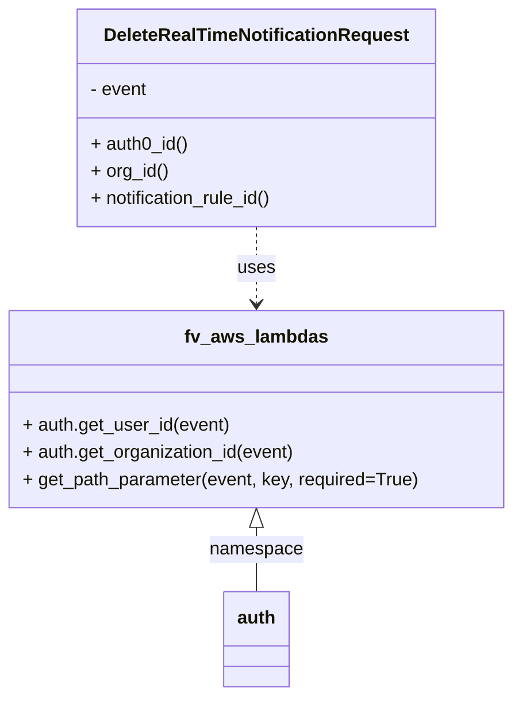

# Diagram: common/subscription_service/subscription_service/v2/service/delete_a_real_time_notification_subscription_request.py


> Auto-generated by Obscura crawlers

## Diagram 1



### SVG

<svg id="container" width="452.578125" xmlns="http://www.w3.org/2000/svg" class="classDiagram" height="614" viewBox="0 0 452.578125 614" role="graphics-document document" aria-roledescription="class"><style>#container{font-family:"trebuchet ms",verdana,arial,sans-serif;font-size:16px;fill:#333;}@keyframes edge-animation-frame{from{stroke-dashoffset:0;}}@keyframes dash{to{stroke-dashoffset:0;}}#container .edge-animation-slow{stroke-dasharray:9,5!important;stroke-dashoffset:900;animation:dash 50s linear infinite;stroke-linecap:round;}#container .edge-animation-fast{stroke-dasharray:9,5!important;stroke-dashoffset:900;animation:dash 20s linear infinite;stroke-linecap:round;}#container .error-icon{fill:#552222;}#container .error-text{fill:#552222;stroke:#552222;}#container .edge-thickness-normal{stroke-width:1px;}#container .edge-thickness-thick{stroke-width:3.5px;}#container .edge-pattern-solid{stroke-dasharray:0;}#container .edge-thickness-invisible{stroke-width:0;fill:none;}#container .edge-pattern-dashed{stroke-dasharray:3;}#container .edge-pattern-dotted{stroke-dasharray:2;}#container .marker{fill:#333333;stroke:#333333;}#container .marker.cross{stroke:#333333;}#container svg{font-family:"trebuchet ms",verdana,arial,sans-serif;font-size:16px;}#container p{margin:0;}#container g.classGroup text{fill:#9370DB;stroke:none;font-family:"trebuchet ms",verdana,arial,sans-serif;font-size:10px;}#container g.classGroup text .title{font-weight:bolder;}#container .nodeLabel,#container .edgeLabel{color:#131300;}#container .edgeLabel .label rect{fill:#ECECFF;}#container .label text{fill:#131300;}#container .labelBkg{background:#ECECFF;}#container .edgeLabel .label span{background:#ECECFF;}#container .classTitle{font-weight:bolder;}#container .node rect,#container .node circle,#container .node ellipse,#container .node polygon,#container .node path{fill:#ECECFF;stroke:#9370DB;stroke-width:1px;}#container .divider{stroke:#9370DB;stroke-width:1;}#container g.clickable{cursor:pointer;}#container g.classGroup rect{fill:#ECECFF;stroke:#9370DB;}#container g.classGroup line{stroke:#9370DB;stroke-width:1;}#container .classLabel .box{stroke:none;stroke-width:0;fill:#ECECFF;opacity:0.5;}#container .classLabel .label{fill:#9370DB;font-size:10px;}#container .relation{stroke:#333333;stroke-width:1;fill:none;}#container .dashed-line{stroke-dasharray:3;}#container .dotted-line{stroke-dasharray:1 2;}#container #compositionStart,#container .composition{fill:#333333!important;stroke:#333333!important;stroke-width:1;}#container #compositionEnd,#container .composition{fill:#333333!important;stroke:#333333!important;stroke-width:1;}#container #dependencyStart,#container .dependency{fill:#333333!important;stroke:#333333!important;stroke-width:1;}#container #dependencyStart,#container .dependency{fill:#333333!important;stroke:#333333!important;stroke-width:1;}#container #extensionStart,#container .extension{fill:transparent!important;stroke:#333333!important;stroke-width:1;}#container #extensionEnd,#container .extension{fill:transparent!important;stroke:#333333!important;stroke-width:1;}#container #aggregationStart,#container .aggregation{fill:transparent!important;stroke:#333333!important;stroke-width:1;}#container #aggregationEnd,#container .aggregation{fill:transparent!important;stroke:#333333!important;stroke-width:1;}#container #lollipopStart,#container .lollipop{fill:#ECECFF!important;stroke:#333333!important;stroke-width:1;}#container #lollipopEnd,#container .lollipop{fill:#ECECFF!important;stroke:#333333!important;stroke-width:1;}#container .edgeTerminals{font-size:11px;line-height:initial;}#container .classTitleText{text-anchor:middle;font-size:18px;fill:#333;}#container .label-icon{display:inline-block;height:1em;overflow:visible;vertical-align:-0.125em;}#container .node .label-icon path{fill:currentColor;stroke:revert;stroke-width:revert;}#container :root{--mermaid-font-family:"trebuchet ms",verdana,arial,sans-serif;}</style><g><defs><marker id="container_class-aggregationStart" class="marker aggregation class" refX="18" refY="7" markerWidth="190" markerHeight="240" orient="auto"><path d="M 18,7 L9,13 L1,7 L9,1 Z"></path></marker></defs><defs><marker id="container_class-aggregationEnd" class="marker aggregation class" refX="1" refY="7" markerWidth="20" markerHeight="28" orient="auto"><path d="M 18,7 L9,13 L1,7 L9,1 Z"></path></marker></defs><defs><marker id="container_class-extensionStart" class="marker extension class" refX="18" refY="7" markerWidth="190" markerHeight="240" orient="auto"><path d="M 1,7 L18,13 V 1 Z"></path></marker></defs><defs><marker id="container_class-extensionEnd" class="marker extension class" refX="1" refY="7" markerWidth="20" markerHeight="28" orient="auto"><path d="M 1,1 V 13 L18,7 Z"></path></marker></defs><defs><marker id="container_class-compositionStart" class="marker composition class" refX="18" refY="7" markerWidth="190" markerHeight="240" orient="auto"><path d="M 18,7 L9,13 L1,7 L9,1 Z"></path></marker></defs><defs><marker id="container_class-compositionEnd" class="marker composition class" refX="1" refY="7" markerWidth="20" markerHeight="28" orient="auto"><path d="M 18,7 L9,13 L1,7 L9,1 Z"></path></marker></defs><defs><marker id="container_class-dependencyStart" class="marker dependency class" refX="6" refY="7" markerWidth="190" markerHeight="240" orient="auto"><path d="M 5,7 L9,13 L1,7 L9,1 Z"></path></marker></defs><defs><marker id="container_class-dependencyEnd" class="marker dependency class" refX="13" refY="7" markerWidth="20" markerHeight="28" orient="auto"><path d="M 18,7 L9,13 L14,7 L9,1 Z"></path></marker></defs><defs><marker id="container_class-lollipopStart" class="marker lollipop class" refX="13" refY="7" markerWidth="190" markerHeight="240" orient="auto"><circle stroke="black" fill="transparent" cx="7" cy="7" r="6"></circle></marker></defs><defs><marker id="container_class-lollipopEnd" class="marker lollipop class" refX="1" refY="7" markerWidth="190" markerHeight="240" orient="auto"><circle stroke="black" fill="transparent" cx="7" cy="7" r="6"></circle></marker></defs><g class="root"><g class="clusters"></g><g class="edgePaths"><path d="M226.289,200L226.289,206.167C226.289,212.333,226.289,224.667,226.289,236C226.289,247.333,226.289,257.667,226.289,262.833L226.289,268" id="id_DeleteRealTimeNotificationRequest_fv_aws_lambdas_1" class="edge-thickness-normal edge-pattern-dashed relation" style=";;;" data-edge="true" data-et="edge" data-id="id_DeleteRealTimeNotificationRequest_fv_aws_lambdas_1" data-points="W3sieCI6MjI2LjI4OTA2MjUsInkiOjIwMH0seyJ4IjoyMjYuMjg5MDYyNSwieSI6MjM3fSx7IngiOjIyNi4yODkwNjI1LCJ5IjoyNzR9XQ==" marker-end="url(#container_class-dependencyEnd)"></path><path d="M226.289,465.25L226.289,468.542C226.289,471.833,226.289,478.417,226.289,487.875C226.289,497.333,226.289,509.667,226.289,515.833L226.289,522" id="id_fv_aws_lambdas_auth_2" class="edge-thickness-normal edge-pattern-solid relation" style=";;;" data-edge="true" data-et="edge" data-id="id_fv_aws_lambdas_auth_2" data-points="W3sieCI6MjI2LjI4OTA2MjUsInkiOjQ0OH0seyJ4IjoyMjYuMjg5MDYyNSwieSI6NDg1fSx7IngiOjIyNi4yODkwNjI1LCJ5Ijo1MjJ9XQ==" marker-start="url(#container_class-extensionStart)"></path></g><g class="edgeLabels"><g class="edgeLabel" transform="translate(226.2890625, 237)"><g class="label" data-id="id_DeleteRealTimeNotificationRequest_fv_aws_lambdas_1" transform="translate(-16.4921875, -12)"><foreignObject width="32.984375" height="24"><div xmlns="http://www.w3.org/1999/xhtml" class="labelBkg" style="display: table-cell; white-space: nowrap; line-height: 1.5; max-width: 200px; text-align: center;"><span class="edgeLabel"><p>uses</p></span></div></foreignObject></g></g><g class="edgeLabel" transform="translate(226.2890625, 485)"><g class="label" data-id="id_fv_aws_lambdas_auth_2" transform="translate(-41.046875, -12)"><foreignObject width="82.09375" height="24"><div xmlns="http://www.w3.org/1999/xhtml" class="labelBkg" style="display: table-cell; white-space: nowrap; line-height: 1.5; max-width: 200px; text-align: center;"><span class="edgeLabel"><p>namespace</p></span></div></foreignObject></g></g></g><g class="nodes"><g class="node default" id="classId-DeleteRealTimeNotificationRequest-0" transform="translate(226.2890625, 104)"><g class="basic label-container"><path d="M-159.69921875 -96 L159.69921875 -96 L159.69921875 96 L-159.69921875 96" stroke="none" stroke-width="0" fill="#ECECFF" style=""></path><path d="M-159.69921875 -96 C-40.3332323839886 -96, 79.0327539820228 -96, 159.69921875 -96 M-159.69921875 -96 C-88.83500618303465 -96, -17.9707936160693 -96, 159.69921875 -96 M159.69921875 -96 C159.69921875 -36.38767413125801, 159.69921875 23.22465173748398, 159.69921875 96 M159.69921875 -96 C159.69921875 -26.741090009260503, 159.69921875 42.51781998147899, 159.69921875 96 M159.69921875 96 C73.19691327988524 96, -13.305392190229526 96, -159.69921875 96 M159.69921875 96 C73.53332530518733 96, -12.632568139625334 96, -159.69921875 96 M-159.69921875 96 C-159.69921875 34.239484351576294, -159.69921875 -27.52103129684741, -159.69921875 -96 M-159.69921875 96 C-159.69921875 51.827077990523065, -159.69921875 7.654155981046131, -159.69921875 -96" stroke="#9370DB" stroke-width="1.3" fill="none" stroke-dasharray="0 0" style=""></path></g><g class="annotation-group text" transform="translate(0, -72)"></g><g class="label-group text" transform="translate(-130.1796875, -72)"><g class="label" style="font-weight: bolder" transform="translate(0,-12)"><foreignObject width="260.359375" height="24"><div xmlns="http://www.w3.org/1999/xhtml" style="display: table-cell; white-space: nowrap; line-height: 1.5; max-width: 307px; text-align: center;"><span class="nodeLabel markdown-node-label" style=""><p>DeleteRealTimeNotificationRequest</p></span></div></foreignObject></g></g><g class="members-group text" transform="translate(-147.69921875, -24)"><g class="label" style="" transform="translate(0,-12)"><foreignObject width="51.03125" height="24"><div xmlns="http://www.w3.org/1999/xhtml" style="display: table-cell; white-space: nowrap; line-height: 1.5; max-width: 109px; text-align: center;"><span class="nodeLabel markdown-node-label" style=""><p>- event</p></span></div></foreignObject></g></g><g class="methods-group text" transform="translate(-147.69921875, 24)"><g class="label" style="" transform="translate(0,-12)"><foreignObject width="86.609375" height="24"><div xmlns="http://www.w3.org/1999/xhtml" style="display: table-cell; white-space: nowrap; line-height: 1.5; max-width: 144px; text-align: center;"><span class="nodeLabel markdown-node-label" style=""><p>+ auth0_id()</p></span></div></foreignObject></g><g class="label" style="" transform="translate(0,12)"><foreignObject width="68.65625" height="24"><div xmlns="http://www.w3.org/1999/xhtml" style="display: table-cell; white-space: nowrap; line-height: 1.5; max-width: 126px; text-align: center;"><span class="nodeLabel markdown-node-label" style=""><p>+ org_id()</p></span></div></foreignObject></g><g class="label" style="" transform="translate(0,36)"><foreignObject width="165.21875" height="24"><div xmlns="http://www.w3.org/1999/xhtml" style="display: table-cell; white-space: nowrap; line-height: 1.5; max-width: 223px; text-align: center;"><span class="nodeLabel markdown-node-label" style=""><p>+ notification_rule_id()</p></span></div></foreignObject></g></g><g class="divider" style=""><path d="M-159.69921875 -48 C-93.75964952519335 -48, -27.820080300386707 -48, 159.69921875 -48 M-159.69921875 -48 C-40.92481540515698 -48, 77.84958793968605 -48, 159.69921875 -48" stroke="#9370DB" stroke-width="1.3" fill="none" stroke-dasharray="0 0" style=""></path></g><g class="divider" style=""><path d="M-159.69921875 0 C-70.79942681782354 0, 18.10036511435291 0, 159.69921875 0 M-159.69921875 0 C-76.44108318052247 0, 6.817052388955062 0, 159.69921875 0" stroke="#9370DB" stroke-width="1.3" fill="none" stroke-dasharray="0 0" style=""></path></g></g><g class="node default" id="classId-fv_aws_lambdas-1" transform="translate(226.2890625, 361)"><g class="basic label-container"><path d="M-218.2890625 -87 L218.2890625 -87 L218.2890625 87 L-218.2890625 87" stroke="none" stroke-width="0" fill="#ECECFF" style=""></path><path d="M-218.2890625 -87 C-93.19435244653917 -87, 31.90035760692166 -87, 218.2890625 -87 M-218.2890625 -87 C-92.66219196594429 -87, 32.964678568111424 -87, 218.2890625 -87 M218.2890625 -87 C218.2890625 -52.094852449975434, 218.2890625 -17.18970489995087, 218.2890625 87 M218.2890625 -87 C218.2890625 -23.58988576424911, 218.2890625 39.82022847150178, 218.2890625 87 M218.2890625 87 C84.3724454183455 87, -49.54417166330899 87, -218.2890625 87 M218.2890625 87 C48.41398319504316 87, -121.46109610991368 87, -218.2890625 87 M-218.2890625 87 C-218.2890625 23.33987306202073, -218.2890625 -40.32025387595854, -218.2890625 -87 M-218.2890625 87 C-218.2890625 48.26119139624852, -218.2890625 9.52238279249704, -218.2890625 -87" stroke="#9370DB" stroke-width="1.3" fill="none" stroke-dasharray="0 0" style=""></path></g><g class="annotation-group text" transform="translate(0, -63)"></g><g class="label-group text" transform="translate(-60.0625, -63)"><g class="label" style="font-weight: bolder" transform="translate(0,-12)"><foreignObject width="120.125" height="24"><div xmlns="http://www.w3.org/1999/xhtml" style="display: table-cell; white-space: nowrap; line-height: 1.5; max-width: 168px; text-align: center;"><span class="nodeLabel markdown-node-label" style=""><p>fv_aws_lambdas</p></span></div></foreignObject></g></g><g class="members-group text" transform="translate(-206.2890625, -15)"></g><g class="methods-group text" transform="translate(-206.2890625, 15)"><g class="label" style="" transform="translate(0,-12)"><foreignObject width="183.140625" height="24"><div xmlns="http://www.w3.org/1999/xhtml" style="display: table-cell; white-space: nowrap; line-height: 1.5; max-width: 241px; text-align: center;"><span class="nodeLabel markdown-node-label" style=""><p>+ auth.get_user_id(event)</p></span></div></foreignObject></g><g class="label" style="" transform="translate(0,12)"><foreignObject width="243.09375" height="24"><div xmlns="http://www.w3.org/1999/xhtml" style="display: table-cell; white-space: nowrap; line-height: 1.5; max-width: 300px; text-align: center;"><span class="nodeLabel markdown-node-label" style=""><p>+ auth.get_organization_id(event)</p></span></div></foreignObject></g><g class="label" style="" transform="translate(0,36)"><foreignObject width="352.515625" height="24"><div xmlns="http://www.w3.org/1999/xhtml" style="display: table-cell; white-space: nowrap; line-height: 1.5; max-width: 410px; text-align: center;"><span class="nodeLabel markdown-node-label" style=""><p>+ get_path_parameter(event, key, required=True)</p></span></div></foreignObject></g></g><g class="divider" style=""><path d="M-218.2890625 -39 C-81.7101517108982 -39, 54.868759078203595 -39, 218.2890625 -39 M-218.2890625 -39 C-117.64637005312564 -39, -17.003677606251273 -39, 218.2890625 -39" stroke="#9370DB" stroke-width="1.3" fill="none" stroke-dasharray="0 0" style=""></path></g><g class="divider" style=""><path d="M-218.2890625 -15 C-66.85131357907608 -15, 84.58643534184785 -15, 218.2890625 -15 M-218.2890625 -15 C-116.80139978268505 -15, -15.313737065370105 -15, 218.2890625 -15" stroke="#9370DB" stroke-width="1.3" fill="none" stroke-dasharray="0 0" style=""></path></g></g><g class="node default" id="classId-auth-2" transform="translate(226.2890625, 564)"><g class="basic label-container"><path d="M-28.6640625 -42 L28.6640625 -42 L28.6640625 42 L-28.6640625 42" stroke="none" stroke-width="0" fill="#ECECFF" style=""></path><path d="M-28.6640625 -42 C-11.598931353097385 -42, 5.466199793805231 -42, 28.6640625 -42 M-28.6640625 -42 C-13.646969092078214 -42, 1.3701243158435723 -42, 28.6640625 -42 M28.6640625 -42 C28.6640625 -24.948805821430085, 28.6640625 -7.89761164286017, 28.6640625 42 M28.6640625 -42 C28.6640625 -18.866859906080943, 28.6640625 4.266280187838113, 28.6640625 42 M28.6640625 42 C6.49855694101791 42, -15.66694861796418 42, -28.6640625 42 M28.6640625 42 C7.632379923663972 42, -13.399302652672056 42, -28.6640625 42 M-28.6640625 42 C-28.6640625 23.080358352200452, -28.6640625 4.160716704400905, -28.6640625 -42 M-28.6640625 42 C-28.6640625 23.356998194705824, -28.6640625 4.713996389411648, -28.6640625 -42" stroke="#9370DB" stroke-width="1.3" fill="none" stroke-dasharray="0 0" style=""></path></g><g class="annotation-group text" transform="translate(0, -18)"></g><g class="label-group text" transform="translate(-16.6640625, -18)"><g class="label" style="font-weight: bolder" transform="translate(0,-12)"><foreignObject width="33.328125" height="24"><div xmlns="http://www.w3.org/1999/xhtml" style="display: table-cell; white-space: nowrap; line-height: 1.5; max-width: 83px; text-align: center;"><span class="nodeLabel markdown-node-label" style=""><p>auth</p></span></div></foreignObject></g></g><g class="members-group text" transform="translate(-16.6640625, 30)"></g><g class="methods-group text" transform="translate(-16.6640625, 60)"></g><g class="divider" style=""><path d="M-28.6640625 6 C-5.845654271959479 6, 16.972753956081043 6, 28.6640625 6 M-28.6640625 6 C-8.412054613761619 6, 11.839953272476762 6, 28.6640625 6" stroke="#9370DB" stroke-width="1.3" fill="none" stroke-dasharray="0 0" style=""></path></g><g class="divider" style=""><path d="M-28.6640625 24 C-10.259020187746543 24, 8.146022124506914 24, 28.6640625 24 M-28.6640625 24 C-15.20903215992741 24, -1.754001819854821 24, 28.6640625 24" stroke="#9370DB" stroke-width="1.3" fill="none" stroke-dasharray="0 0" style=""></path></g></g></g></g></g></svg>

## Diagram 2

```mermaid
flowchart TD
    Event[Incoming AWS Lambda Event] --> DRTN[DeleteRealTimeNotificationRequest]
    DRTN -->|auth.get_user_id(event)| AuthGetUserId[auth.get_user_id]
    DRTN -->|auth.get_organization_id(event)| AuthGetOrgId[auth.get_organization_id]
    DRTN -->|get_path_parameter(event, "notification_rule_id")| GetPathParam[get_path_parameter]
    AuthGetUserId -->|returns| Auth0ID[auth0_id]
    AuthGetOrgId -->|returns| OrgID[org_id]
    GetPathParam -->|returns| RuleID[notification_rule_id]
```

> SVG rendering failed for this diagram.
