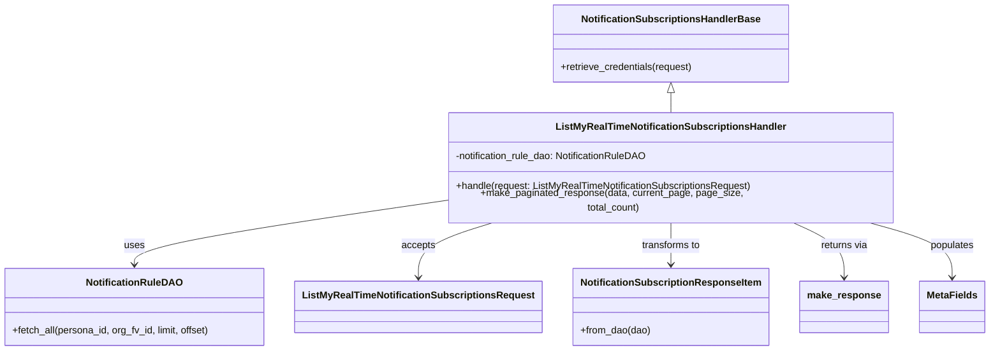
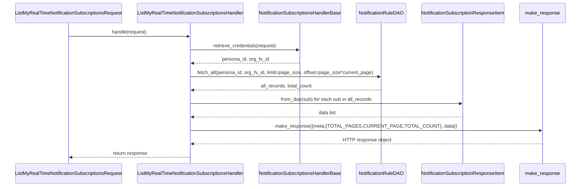

# Diagram: common/subscription_service/subscription_service/v2/service/list_my_real_time_notification_subscription_handler.py

> Auto-generated by Obscura crawlers

## Diagram 1

### SVG

<svg id="container" width="1576.1328125" xmlns="http://www.w3.org/2000/svg" class="classDiagram" height="560" viewBox="0 0 1576.1328125 560" role="graphics-document document" aria-roledescription="class"><g><defs><marker id="container_class-aggregationStart" class="marker aggregation class" refX="18" refY="7" markerWidth="190" markerHeight="240" orient="auto"><path d="M 18,7 L9,13 L1,7 L9,1 Z"></path></marker></defs><defs><marker id="container_class-aggregationEnd" class="marker aggregation class" refX="1" refY="7" markerWidth="20" markerHeight="28" orient="auto"><path d="M 18,7 L9,13 L1,7 L9,1 Z"></path></marker></defs><defs><marker id="container_class-extensionStart" class="marker extension class" refX="18" refY="7" markerWidth="190" markerHeight="240" orient="auto"><path d="M 1,7 L18,13 V 1 Z"></path></marker></defs><defs><marker id="container_class-extensionEnd" class="marker extension class" refX="1" refY="7" markerWidth="20" markerHeight="28" orient="auto"><path d="M 1,1 V 13 L18,7 Z"></path></marker></defs><defs><marker id="container_class-compositionStart" class="marker composition class" refX="18" refY="7" markerWidth="190" markerHeight="240" orient="auto"><path d="M 18,7 L9,13 L1,7 L9,1 Z"></path></marker></defs><defs><marker id="container_class-compositionEnd" class="marker composition class" refX="1" refY="7" markerWidth="20" markerHeight="28" orient="auto"><path d="M 18,7 L9,13 L1,7 L9,1 Z"></path></marker></defs><defs><marker id="container_class-dependencyStart" class="marker dependency class" refX="6" refY="7" markerWidth="190" markerHeight="240" orient="auto"><path d="M 5,7 L9,13 L1,7 L9,1 Z"></path></marker></defs><defs><marker id="container_class-dependencyEnd" class="marker dependency class" refX="13" refY="7" markerWidth="20" markerHeight="28" orient="auto"><path d="M 18,7 L9,13 L14,7 L9,1 Z"></path></marker></defs><defs><marker id="container_class-lollipopStart" class="marker lollipop class" refX="13" refY="7" markerWidth="190" markerHeight="240" orient="auto"><circle stroke="black" fill="transparent" cx="7" cy="7" r="6"></circle></marker></defs><defs><marker id="container_class-lollipopEnd" class="marker lollipop class" refX="1" refY="7" markerWidth="190" markerHeight="240" orient="auto"><circle stroke="black" fill="transparent" cx="7" cy="7" r="6"></circle></marker></defs><g class="root"><g class="clusters"></g><g class="edgePaths"><path d="M1073.07,151.25L1073.07,152.542C1073.07,153.833,1073.07,156.417,1073.07,161.875C1073.07,167.333,1073.07,175.667,1073.07,179.833L1073.07,184" id="id_NotificationSubscriptionsHandlerBase_ListMyRealTimeNotificationSubscriptionsHandler_1" class="edge-thickness-normal edge-pattern-solid relation" style=";;;" data-edge="true" data-et="edge" data-id="id_NotificationSubscriptionsHandlerBase_ListMyRealTimeNotificationSubscriptionsHandler_1" data-points="W3sieCI6MTA3My4wNzAzMTI1LCJ5IjoxMzR9LHsieCI6MTA3My4wNzAzMTI1LCJ5IjoxNTl9LHsieCI6MTA3My4wNzAzMTI1LCJ5IjoxODR9XQ==" marker-start="url(#container_class-extensionStart)"></path><path d="M712.207,319.266L630.397,330.888C548.587,342.511,384.967,365.755,303.158,382.544C221.348,399.333,221.348,409.667,221.348,414.833L221.348,420" id="id_ListMyRealTimeNotificationSubscriptionsHandler_NotificationRuleDAO_2" class="edge-thickness-normal edge-pattern-solid relation" style=";;;" data-edge="true" data-et="edge" data-id="id_ListMyRealTimeNotificationSubscriptionsHandler_NotificationRuleDAO_2" data-points="W3sieCI6NzEyLjIwNzAzMTI1LCJ5IjozMTkuMjY2MDUwODgwMzM5MDR9LHsieCI6MjIxLjM0NzY1NjI1LCJ5IjozODl9LHsieCI6MjIxLjM0NzY1NjI1LCJ5Ijo0MjZ9XQ==" marker-end="url(#container_class-dependencyEnd)"></path><path d="M798.281,352L778.107,358.167C757.934,364.333,717.588,376.667,697.415,391.5C677.242,406.333,677.242,423.667,677.242,432.333L677.242,441" id="id_ListMyRealTimeNotificationSubscriptionsHandler_ListMyRealTimeNotificationSubscriptionsRequest_3" class="edge-thickness-normal edge-pattern-solid relation" style=";;;" data-edge="true" data-et="edge" data-id="id_ListMyRealTimeNotificationSubscriptionsHandler_ListMyRealTimeNotificationSubscriptionsRequest_3" data-points="W3sieCI6Nzk4LjI4MDUzOTc3MjcyNzMsInkiOjM1Mn0seyJ4Ijo2NzcuMjQyMTg3NSwieSI6Mzg5fSx7IngiOjY3Ny4yNDIxODc1LCJ5Ijo0NDd9XQ==" marker-end="url(#container_class-dependencyEnd)"></path><path d="M1073.07,352L1073.07,358.167C1073.07,364.333,1073.07,376.667,1073.07,388C1073.07,399.333,1073.07,409.667,1073.07,414.833L1073.07,420" id="id_ListMyRealTimeNotificationSubscriptionsHandler_NotificationSubscriptionResponseItem_4" class="edge-thickness-normal edge-pattern-solid relation" style=";;;" data-edge="true" data-et="edge" data-id="id_ListMyRealTimeNotificationSubscriptionsHandler_NotificationSubscriptionResponseItem_4" data-points="W3sieCI6MTA3My4wNzAzMTI1LCJ5IjozNTJ9LHsieCI6MTA3My4wNzAzMTI1LCJ5IjozODl9LHsieCI6MTA3My4wNzAzMTI1LCJ5Ijo0MjZ9XQ==" marker-end="url(#container_class-dependencyEnd)"></path><path d="M1262.417,352L1276.318,358.167C1290.218,364.333,1318.019,376.667,1331.92,391.5C1345.82,406.333,1345.82,423.667,1345.82,432.333L1345.82,441" id="id_ListMyRealTimeNotificationSubscriptionsHandler_make_response_5" class="edge-thickness-normal edge-pattern-solid relation" style=";;;" data-edge="true" data-et="edge" data-id="id_ListMyRealTimeNotificationSubscriptionsHandler_make_response_5" data-points="W3sieCI6MTI2Mi40MTc0MTk5MzgwMTY2LCJ5IjozNTJ9LHsieCI6MTM0NS44MjAzMTI1LCJ5IjozODl9LHsieCI6MTM0NS44MjAzMTI1LCJ5Ijo0NDd9XQ==" marker-end="url(#container_class-dependencyEnd)"></path><path d="M1381.052,352L1403.662,358.167C1426.272,364.333,1471.491,376.667,1494.101,391.5C1516.711,406.333,1516.711,423.667,1516.711,432.333L1516.711,441" id="id_ListMyRealTimeNotificationSubscriptionsHandler_MetaFields_6" class="edge-thickness-normal edge-pattern-solid relation" style=";;;" data-edge="true" data-et="edge" data-id="id_ListMyRealTimeNotificationSubscriptionsHandler_MetaFields_6" data-points="W3sieCI6MTM4MS4wNTIyMzM5ODc2MDM0LCJ5IjozNTJ9LHsieCI6MTUxNi43MTA5Mzc1LCJ5IjozODl9LHsieCI6MTUxNi43MTA5Mzc1LCJ5Ijo0NDd9XQ==" marker-end="url(#container_class-dependencyEnd)"></path></g><g class="edgeLabels"><g class="edgeLabel"><g class="label" data-id="id_NotificationSubscriptionsHandlerBase_ListMyRealTimeNotificationSubscriptionsHandler_1" transform="translate(0, 0)"><foreignObject width="0" height="0">

</foreignObject></g></g><g class="edgeLabel" transform="translate(221.34765625, 389)"><g class="label" data-id="id_ListMyRealTimeNotificationSubscriptionsHandler_NotificationRuleDAO_2" transform="translate(-16.4921875, -12)"><foreignObject width="32.984375" height="24">

uses

</foreignObject></g></g><g class="edgeLabel" transform="translate(677.2421875, 389)"><g class="label" data-id="id_ListMyRealTimeNotificationSubscriptionsHandler_ListMyRealTimeNotificationSubscriptionsRequest_3" transform="translate(-27.421875, -12)"><foreignObject width="54.84375" height="24">

accepts

</foreignObject></g></g><g class="edgeLabel" transform="translate(1073.0703125, 389)"><g class="label" data-id="id_ListMyRealTimeNotificationSubscriptionsHandler_NotificationSubscriptionResponseItem_4" transform="translate(-48.984375, -12)"><foreignObject width="97.96875" height="24">

transforms to

</foreignObject></g></g><g class="edgeLabel" transform="translate(1345.8203125, 389)"><g class="label" data-id="id_ListMyRealTimeNotificationSubscriptionsHandler_make_response_5" transform="translate(-38.9296875, -12)"><foreignObject width="77.859375" height="24">

returns via

</foreignObject></g></g><g class="edgeLabel" transform="translate(1516.7109375, 389)"><g class="label" data-id="id_ListMyRealTimeNotificationSubscriptionsHandler_MetaFields_6" transform="translate(-36.359375, -12)"><foreignObject width="72.71875" height="24">

populates

</foreignObject></g></g></g><g class="nodes"><g class="node default" id="classId-NotificationSubscriptionsHandlerBase-0" transform="translate(1073.0703125, 71)"><g class="basic label-container"><path d="M-190.97265625 -63 L190.97265625 -63 L190.97265625 63 L-190.97265625 63" stroke="none" stroke-width="0" fill="#ECECFF" style=""></path><path d="M-190.97265625 -63 C-102.18847270775478 -63, -13.404289165509567 -63, 190.97265625 -63 M-190.97265625 -63 C-88.29015133729635 -63, 14.392353575407299 -63, 190.97265625 -63 M190.97265625 -63 C190.97265625 -17.237523917332368, 190.97265625 28.524952165335264, 190.97265625 63 M190.97265625 -63 C190.97265625 -14.038729129742713, 190.97265625 34.922541740514575, 190.97265625 63 M190.97265625 63 C67.09241709641508 63, -56.78782205716985 63, -190.97265625 63 M190.97265625 63 C54.0776796657218 63, -82.8172969185564 63, -190.97265625 63 M-190.97265625 63 C-190.97265625 27.94181917201707, -190.97265625 -7.116361655965861, -190.97265625 -63 M-190.97265625 63 C-190.97265625 16.195234888422327, -190.97265625 -30.609530223155346, -190.97265625 -63" stroke="#9370DB" stroke-width="1.3" fill="none" stroke-dasharray="0 0" style=""></path></g><g class="annotation-group text" transform="translate(0, -39)"></g><g class="label-group text" transform="translate(-139.8515625, -39)"><g class="label" style="font-weight: bolder" transform="translate(0,-12)"><foreignObject width="279.703125" height="24">

NotificationSubscriptionsHandlerBase

</foreignObject></g></g><g class="members-group text" transform="translate(-178.97265625, 9)"></g><g class="methods-group text" transform="translate(-178.97265625, 39)"><g class="label" style="" transform="translate(0,-12)"><foreignObject width="218.09375" height="24">

+retrieve_credentials(request)

</foreignObject></g></g><g class="divider" style=""><path d="M-190.97265625 -15 C-62.75429131716854 -15, 65.46407361566293 -15, 190.97265625 -15 M-190.97265625 -15 C-47.083288674195785 -15, 96.80607890160843 -15, 190.97265625 -15" stroke="#9370DB" stroke-width="1.3" fill="none" stroke-dasharray="0 0" style=""></path></g><g class="divider" style=""><path d="M-190.97265625 9 C-94.52101087736143 9, 1.9306344952771326 9, 190.97265625 9 M-190.97265625 9 C-45.08912723164093 9, 100.79440178671814 9, 190.97265625 9" stroke="#9370DB" stroke-width="1.3" fill="none" stroke-dasharray="0 0" style=""></path></g></g><g class="node default" id="classId-ListMyRealTimeNotificationSubscriptionsHandler-1" transform="translate(1073.0703125, 268)"><g class="basic label-container"><path d="M-360.86328125 -84 L360.86328125 -84 L360.86328125 84 L-360.86328125 84" stroke="none" stroke-width="0" fill="#ECECFF" style=""></path><path d="M-360.86328125 -84 C-183.73882181595658 -84, -6.614362381913168 -84, 360.86328125 -84 M-360.86328125 -84 C-81.93045565238424 -84, 197.00236994523152 -84, 360.86328125 -84 M360.86328125 -84 C360.86328125 -35.618441017548335, 360.86328125 12.76311796490333, 360.86328125 84 M360.86328125 -84 C360.86328125 -46.693653058752595, 360.86328125 -9.38730611750519, 360.86328125 84 M360.86328125 84 C97.91321988015517 84, -165.03684148968966 84, -360.86328125 84 M360.86328125 84 C159.9523313301068 84, -40.9586185897864 84, -360.86328125 84 M-360.86328125 84 C-360.86328125 34.03603244092629, -360.86328125 -15.927935118147417, -360.86328125 -84 M-360.86328125 84 C-360.86328125 29.920099812929394, -360.86328125 -24.159800374141213, -360.86328125 -84" stroke="#9370DB" stroke-width="1.3" fill="none" stroke-dasharray="0 0" style=""></path></g><g class="annotation-group text" transform="translate(0, -60)"></g><g class="label-group text" transform="translate(-179.6640625, -60)"><g class="label" style="font-weight: bolder" transform="translate(0,-12)"><foreignObject width="359.328125" height="24">

ListMyRealTimeNotificationSubscriptionsHandler

</foreignObject></g></g><g class="members-group text" transform="translate(-348.86328125, -12)"><g class="label" style="" transform="translate(0,-12)"><foreignObject width="317.875" height="24">

-notification_rule_dao: NotificationRuleDAO

</foreignObject></g></g><g class="methods-group text" transform="translate(-348.86328125, 36)"><g class="label" style="" transform="translate(0,-12)"><foreignObject width="487.90625" height="24">

+handle(request: ListMyRealTimeNotificationSubscriptionsRequest)

</foreignObject></g><g class="label" style="" transform="translate(0,12)"><foreignObject width="518.0625" height="24">

+make_paginated_response(data, current_page, page_size, total_count)

</foreignObject></g></g><g class="divider" style=""><path d="M-360.86328125 -36 C-196.36773357923724 -36, -31.872185908474478 -36, 360.86328125 -36 M-360.86328125 -36 C-154.16435333754563 -36, 52.53457457490873 -36, 360.86328125 -36" stroke="#9370DB" stroke-width="1.3" fill="none" stroke-dasharray="0 0" style=""></path></g><g class="divider" style=""><path d="M-360.86328125 12 C-136.10093893250072 12, 88.66140338499855 12, 360.86328125 12 M-360.86328125 12 C-195.98738791566123 12, -31.11149458132246 12, 360.86328125 12" stroke="#9370DB" stroke-width="1.3" fill="none" stroke-dasharray="0 0" style=""></path></g></g><g class="node default" id="classId-NotificationRuleDAO-2" transform="translate(221.34765625, 489)"><g class="basic label-container"><path d="M-213.34765625 -63 L213.34765625 -63 L213.34765625 63 L-213.34765625 63" stroke="none" stroke-width="0" fill="#ECECFF" style=""></path><path d="M-213.34765625 -63 C-44.5997306953081 -63, 124.1481948593838 -63, 213.34765625 -63 M-213.34765625 -63 C-86.17184361884587 -63, 41.00396901230826 -63, 213.34765625 -63 M213.34765625 -63 C213.34765625 -24.653113355630452, 213.34765625 13.693773288739095, 213.34765625 63 M213.34765625 -63 C213.34765625 -28.660773036728607, 213.34765625 5.678453926542787, 213.34765625 63 M213.34765625 63 C62.51950460377688 63, -88.30864704244624 63, -213.34765625 63 M213.34765625 63 C88.81747479298868 63, -35.71270666402265 63, -213.34765625 63 M-213.34765625 63 C-213.34765625 17.796013646030715, -213.34765625 -27.40797270793857, -213.34765625 -63 M-213.34765625 63 C-213.34765625 35.82964930734718, -213.34765625 8.659298614694372, -213.34765625 -63" stroke="#9370DB" stroke-width="1.3" fill="none" stroke-dasharray="0 0" style=""></path></g><g class="annotation-group text" transform="translate(0, -39)"></g><g class="label-group text" transform="translate(-74.4453125, -39)"><g class="label" style="font-weight: bolder" transform="translate(0,-12)"><foreignObject width="148.890625" height="24">

NotificationRuleDAO

</foreignObject></g></g><g class="members-group text" transform="translate(-201.34765625, 9)"></g><g class="methods-group text" transform="translate(-201.34765625, 39)"><g class="label" style="" transform="translate(0,-12)"><foreignObject width="328.25" height="24">

+fetch_all(persona_id, org_fv_id, limit, offset)

</foreignObject></g></g><g class="divider" style=""><path d="M-213.34765625 -15 C-96.99689606899945 -15, 19.353864112001105 -15, 213.34765625 -15 M-213.34765625 -15 C-81.13047889130752 -15, 51.08669846738496 -15, 213.34765625 -15" stroke="#9370DB" stroke-width="1.3" fill="none" stroke-dasharray="0 0" style=""></path></g><g class="divider" style=""><path d="M-213.34765625 9 C-68.64064381785661 9, 76.06636861428677 9, 213.34765625 9 M-213.34765625 9 C-75.39475710241689 9, 62.55814204516622 9, 213.34765625 9" stroke="#9370DB" stroke-width="1.3" fill="none" stroke-dasharray="0 0" style=""></path></g></g><g class="node default" id="classId-ListMyRealTimeNotificationSubscriptionsRequest-3" transform="translate(677.2421875, 489)"><g class="basic label-container"><path d="M-192.546875 -42 L192.546875 -42 L192.546875 42 L-192.546875 42" stroke="none" stroke-width="0" fill="#ECECFF" style=""></path><path d="M-192.546875 -42 C-87.45112206120419 -42, 17.644630877591624 -42, 192.546875 -42 M-192.546875 -42 C-44.9672740972581 -42, 102.6123268054838 -42, 192.546875 -42 M192.546875 -42 C192.546875 -16.014466718395404, 192.546875 9.971066563209192, 192.546875 42 M192.546875 -42 C192.546875 -9.028978284909677, 192.546875 23.942043430180647, 192.546875 42 M192.546875 42 C41.923887011842965 42, -108.69910097631407 42, -192.546875 42 M192.546875 42 C41.1141293439787 42, -110.3186163120426 42, -192.546875 42 M-192.546875 42 C-192.546875 12.233016189397102, -192.546875 -17.533967621205797, -192.546875 -42 M-192.546875 42 C-192.546875 9.122682197948052, -192.546875 -23.754635604103896, -192.546875 -42" stroke="#9370DB" stroke-width="1.3" fill="none" stroke-dasharray="0 0" style=""></path></g><g class="annotation-group text" transform="translate(0, -18)"></g><g class="label-group text" transform="translate(-180.546875, -18)"><g class="label" style="font-weight: bolder" transform="translate(0,-12)"><foreignObject width="361.09375" height="24">

ListMyRealTimeNotificationSubscriptionsRequest

</foreignObject></g></g><g class="members-group text" transform="translate(-180.546875, 30)"></g><g class="methods-group text" transform="translate(-180.546875, 60)"></g><g class="divider" style=""><path d="M-192.546875 6 C-70.70779864575785 6, 51.131277708484305 6, 192.546875 6 M-192.546875 6 C-48.294557002150185 6, 95.95776099569963 6, 192.546875 6" stroke="#9370DB" stroke-width="1.3" fill="none" stroke-dasharray="0 0" style=""></path></g><g class="divider" style=""><path d="M-192.546875 24 C-81.70598040506275 24, 29.134914189874507 24, 192.546875 24 M-192.546875 24 C-101.81399039268203 24, -11.081105785364059 24, 192.546875 24" stroke="#9370DB" stroke-width="1.3" fill="none" stroke-dasharray="0 0" style=""></path></g></g><g class="node default" id="classId-NotificationSubscriptionResponseItem-4" transform="translate(1073.0703125, 489)"><g class="basic label-container"><path d="M-153.28125 -63 L153.28125 -63 L153.28125 63 L-153.28125 63" stroke="none" stroke-width="0" fill="#ECECFF" style=""></path><path d="M-153.28125 -63 C-80.10759723338091 -63, -6.9339444667618295 -63, 153.28125 -63 M-153.28125 -63 C-87.77773020451946 -63, -22.274210409038915 -63, 153.28125 -63 M153.28125 -63 C153.28125 -31.77047381097377, 153.28125 -0.540947621947538, 153.28125 63 M153.28125 -63 C153.28125 -33.35067039300101, 153.28125 -3.7013407860020138, 153.28125 63 M153.28125 63 C66.19220127623359 63, -20.89684744753282 63, -153.28125 63 M153.28125 63 C47.39274368177321 63, -58.49576263645358 63, -153.28125 63 M-153.28125 63 C-153.28125 14.262453326187284, -153.28125 -34.47509334762543, -153.28125 -63 M-153.28125 63 C-153.28125 24.535073686065715, -153.28125 -13.92985262786857, -153.28125 -63" stroke="#9370DB" stroke-width="1.3" fill="none" stroke-dasharray="0 0" style=""></path></g><g class="annotation-group text" transform="translate(0, -39)"></g><g class="label-group text" transform="translate(-141.28125, -39)"><g class="label" style="font-weight: bolder" transform="translate(0,-12)"><foreignObject width="282.5625" height="24">

NotificationSubscriptionResponseItem

</foreignObject></g></g><g class="members-group text" transform="translate(-141.28125, 9)"></g><g class="methods-group text" transform="translate(-141.28125, 39)"><g class="label" style="" transform="translate(0,-12)"><foreignObject width="115.46875" height="24">

+from_dao(dao)

</foreignObject></g></g><g class="divider" style=""><path d="M-153.28125 -15 C-65.07468362431634 -15, 23.13188275136733 -15, 153.28125 -15 M-153.28125 -15 C-30.924635082963945 -15, 91.43197983407211 -15, 153.28125 -15" stroke="#9370DB" stroke-width="1.3" fill="none" stroke-dasharray="0 0" style=""></path></g><g class="divider" style=""><path d="M-153.28125 9 C-61.20833938584795 9, 30.8645712283041 9, 153.28125 9 M-153.28125 9 C-65.89596784548546 9, 21.489314309029083 9, 153.28125 9" stroke="#9370DB" stroke-width="1.3" fill="none" stroke-dasharray="0 0" style=""></path></g></g><g class="node default" id="classId-make_response-5" transform="translate(1345.8203125, 489)"><g class="basic label-container"><path d="M-69.46875 -42 L69.46875 -42 L69.46875 42 L-69.46875 42" stroke="none" stroke-width="0" fill="#ECECFF" style=""></path><path d="M-69.46875 -42 C-15.60635866646141 -42, 38.25603266707718 -42, 69.46875 -42 M-69.46875 -42 C-33.76336137382482 -42, 1.942027252350357 -42, 69.46875 -42 M69.46875 -42 C69.46875 -21.144009831426327, 69.46875 -0.2880196628526548, 69.46875 42 M69.46875 -42 C69.46875 -22.854831101948974, 69.46875 -3.709662203897949, 69.46875 42 M69.46875 42 C30.121823008059337 42, -9.225103983881326 42, -69.46875 42 M69.46875 42 C39.42294146851866 42, 9.377132937037317 42, -69.46875 42 M-69.46875 42 C-69.46875 17.934059024053553, -69.46875 -6.131881951892893, -69.46875 -42 M-69.46875 42 C-69.46875 8.691534222709521, -69.46875 -24.616931554580958, -69.46875 -42" stroke="#9370DB" stroke-width="1.3" fill="none" stroke-dasharray="0 0" style=""></path></g><g class="annotation-group text" transform="translate(0, -18)"></g><g class="label-group text" transform="translate(-57.46875, -18)"><g class="label" style="font-weight: bolder" transform="translate(0,-12)"><foreignObject width="114.9375" height="24">

make_response

</foreignObject></g></g><g class="members-group text" transform="translate(-57.46875, 30)"></g><g class="methods-group text" transform="translate(-57.46875, 60)"></g><g class="divider" style=""><path d="M-69.46875 6 C-27.40117054703768 6, 14.66640890592464 6, 69.46875 6 M-69.46875 6 C-25.585891637598976 6, 18.296966724802047 6, 69.46875 6" stroke="#9370DB" stroke-width="1.3" fill="none" stroke-dasharray="0 0" style=""></path></g><g class="divider" style=""><path d="M-69.46875 24 C-17.01853725965578 24, 35.43167548068844 24, 69.46875 24 M-69.46875 24 C-23.672175222393363 24, 22.124399555213273 24, 69.46875 24" stroke="#9370DB" stroke-width="1.3" fill="none" stroke-dasharray="0 0" style=""></path></g></g><g class="node default" id="classId-MetaFields-6" transform="translate(1516.7109375, 489)"><g class="basic label-container"><path d="M-51.421875 -42 L51.421875 -42 L51.421875 42 L-51.421875 42" stroke="none" stroke-width="0" fill="#ECECFF" style=""></path><path d="M-51.421875 -42 C-19.800517715165192 -42, 11.820839569669616 -42, 51.421875 -42 M-51.421875 -42 C-14.593112144060619 -42, 22.235650711878762 -42, 51.421875 -42 M51.421875 -42 C51.421875 -8.609009934881584, 51.421875 24.781980130236832, 51.421875 42 M51.421875 -42 C51.421875 -17.235212368889513, 51.421875 7.529575262220973, 51.421875 42 M51.421875 42 C15.949539779976114 42, -19.522795440047773 42, -51.421875 42 M51.421875 42 C22.85016477228813 42, -5.721545455423737 42, -51.421875 42 M-51.421875 42 C-51.421875 9.586707653337896, -51.421875 -22.826584693324207, -51.421875 -42 M-51.421875 42 C-51.421875 12.914637739308628, -51.421875 -16.170724521382745, -51.421875 -42" stroke="#9370DB" stroke-width="1.3" fill="none" stroke-dasharray="0 0" style=""></path></g><g class="annotation-group text" transform="translate(0, -18)"></g><g class="label-group text" transform="translate(-39.421875, -18)"><g class="label" style="font-weight: bolder" transform="translate(0,-12)"><foreignObject width="78.84375" height="24">

MetaFields

</foreignObject></g></g><g class="members-group text" transform="translate(-39.421875, 30)"></g><g class="methods-group text" transform="translate(-39.421875, 60)"></g><g class="divider" style=""><path d="M-51.421875 6 C-16.056157257051524 6, 19.309560485896952 6, 51.421875 6 M-51.421875 6 C-28.226668609068987 6, -5.031462218137975 6, 51.421875 6" stroke="#9370DB" stroke-width="1.3" fill="none" stroke-dasharray="0 0" style=""></path></g><g class="divider" style=""><path d="M-51.421875 24 C-25.513075781383606 24, 0.3957234372327889 24, 51.421875 24 M-51.421875 24 C-29.112769533649868 24, -6.803664067299735 24, 51.421875 24" stroke="#9370DB" stroke-width="1.3" fill="none" stroke-dasharray="0 0" style=""></path></g></g></g></g></g></svg>

## Diagram 2

### SVG

<svg id="container" width="2017" xmlns="http://www.w3.org/2000/svg" height="651" viewBox="-50 -10 2017 651" role="graphics-document document" aria-roledescription="sequence"><g><rect x="1767" y="565" fill="#eaeaea" stroke="#666" width="150" height="65" name="Responder" rx="3" ry="3" class="actor actor-bottom"></rect><text x="1842" y="597.5" dominant-baseline="central" alignment-baseline="central" class="actor actor-box" style="text-anchor: middle; font-size: 16px; font-weight: 400;"><tspan x="1842" dy="0">make_response</tspan></text></g><g><rect x="1417" y="565" fill="#eaeaea" stroke="#666" width="300" height="65" name="Item" rx="3" ry="3" class="actor actor-bottom"></rect><text x="1567" y="597.5" dominant-baseline="central" alignment-baseline="central" class="actor actor-box" style="text-anchor: middle; font-size: 16px; font-weight: 400;"><tspan x="1567" dy="0">NotificationSubscriptionResponseItem</tspan></text></g><g><rect x="1199" y="565" fill="#eaeaea" stroke="#666" width="168" height="65" name="DAO" rx="3" ry="3" class="actor actor-bottom"></rect><text x="1283" y="597.5" dominant-baseline="central" alignment-baseline="central" class="actor actor-box" style="text-anchor: middle; font-size: 16px; font-weight: 400;"><tspan x="1283" dy="0">NotificationRuleDAO</tspan></text></g><g><rect x="852" y="565" fill="#eaeaea" stroke="#666" width="297" height="65" name="Auth" rx="3" ry="3" class="actor actor-bottom"></rect><text x="1000.5" y="597.5" dominant-baseline="central" alignment-baseline="central" class="actor actor-box" style="text-anchor: middle; font-size: 16px; font-weight: 400;"><tspan x="1000.5" dy="0">NotificationSubscriptionsHandlerBase</tspan></text></g><g><rect x="426" y="565" fill="#eaeaea" stroke="#666" width="376" height="65" name="Handler" rx="3" ry="3" class="actor actor-bottom"></rect><text x="614" y="597.5" dominant-baseline="central" alignment-baseline="central" class="actor actor-box" style="text-anchor: middle; font-size: 16px; font-weight: 400;"><tspan x="614" dy="0">ListMyRealTimeNotificationSubscriptionsHandler</tspan></text></g><g><rect x="0" y="565" fill="#eaeaea" stroke="#666" width="376" height="65" name="Request" rx="3" ry="3" class="actor actor-bottom"></rect><text x="188" y="597.5" dominant-baseline="central" alignment-baseline="central" class="actor actor-box" style="text-anchor: middle; font-size: 16px; font-weight: 400;"><tspan x="188" dy="0">ListMyRealTimeNotificationSubscriptionsRequest</tspan></text></g><g><line id="actor5" x1="1842" y1="65" x2="1842" y2="565" class="actor-line 200" stroke-width="0.5px" stroke="#999" name="Responder"></line><g id="root-5"><rect x="1767" y="0" fill="#eaeaea" stroke="#666" width="150" height="65" name="Responder" rx="3" ry="3" class="actor actor-top"></rect><text x="1842" y="32.5" dominant-baseline="central" alignment-baseline="central" class="actor actor-box" style="text-anchor: middle; font-size: 16px; font-weight: 400;"><tspan x="1842" dy="0">make_response</tspan></text></g></g><g><line id="actor4" x1="1567" y1="65" x2="1567" y2="565" class="actor-line 200" stroke-width="0.5px" stroke="#999" name="Item"></line><g id="root-4"><rect x="1417" y="0" fill="#eaeaea" stroke="#666" width="300" height="65" name="Item" rx="3" ry="3" class="actor actor-top"></rect><text x="1567" y="32.5" dominant-baseline="central" alignment-baseline="central" class="actor actor-box" style="text-anchor: middle; font-size: 16px; font-weight: 400;"><tspan x="1567" dy="0">NotificationSubscriptionResponseItem</tspan></text></g></g><g><line id="actor3" x1="1283" y1="65" x2="1283" y2="565" class="actor-line 200" stroke-width="0.5px" stroke="#999" name="DAO"></line><g id="root-3"><rect x="1199" y="0" fill="#eaeaea" stroke="#666" width="168" height="65" name="DAO" rx="3" ry="3" class="actor actor-top"></rect><text x="1283" y="32.5" dominant-baseline="central" alignment-baseline="central" class="actor actor-box" style="text-anchor: middle; font-size: 16px; font-weight: 400;"><tspan x="1283" dy="0">NotificationRuleDAO</tspan></text></g></g><g><line id="actor2" x1="1000.5" y1="65" x2="1000.5" y2="565" class="actor-line 200" stroke-width="0.5px" stroke="#999" name="Auth"></line><g id="root-2"><rect x="852" y="0" fill="#eaeaea" stroke="#666" width="297" height="65" name="Auth" rx="3" ry="3" class="actor actor-top"></rect><text x="1000.5" y="32.5" dominant-baseline="central" alignment-baseline="central" class="actor actor-box" style="text-anchor: middle; font-size: 16px; font-weight: 400;"><tspan x="1000.5" dy="0">NotificationSubscriptionsHandlerBase</tspan></text></g></g><g><line id="actor1" x1="614" y1="65" x2="614" y2="565" class="actor-line 200" stroke-width="0.5px" stroke="#999" name="Handler"></line><g id="root-1"><rect x="426" y="0" fill="#eaeaea" stroke="#666" width="376" height="65" name="Handler" rx="3" ry="3" class="actor actor-top"></rect><text x="614" y="32.5" dominant-baseline="central" alignment-baseline="central" class="actor actor-box" style="text-anchor: middle; font-size: 16px; font-weight: 400;"><tspan x="614" dy="0">ListMyRealTimeNotificationSubscriptionsHandler</tspan></text></g></g><g><line id="actor0" x1="188" y1="65" x2="188" y2="565" class="actor-line 200" stroke-width="0.5px" stroke="#999" name="Request"></line><g id="root-0"><rect x="0" y="0" fill="#eaeaea" stroke="#666" width="376" height="65" name="Request" rx="3" ry="3" class="actor actor-top"></rect><text x="188" y="32.5" dominant-baseline="central" alignment-baseline="central" class="actor actor-box" style="text-anchor: middle; font-size: 16px; font-weight: 400;"><tspan x="188" dy="0">ListMyRealTimeNotificationSubscriptionsRequest</tspan></text></g></g><g></g><defs><symbol id="computer" width="24" height="24"><path transform="scale(.5)" d="M2 2v13h20v-13h-20zm18 11h-16v-9h16v9zm-10.228 6l.466-1h3.524l.467 1h-4.457zm14.228 3h-24l2-6h2.104l-1.33 4h18.45l-1.297-4h2.073l2 6zm-5-10h-14v-7h14v7z"></path></symbol></defs><defs><symbol id="database" fill-rule="evenodd" clip-rule="evenodd"><path transform="scale(.5)" d="M12.258.001l.256.004.255.005.253.008.251.01.249.012.247.015.246.016.242.019.241.02.239.023.236.024.233.027.231.028.229.031.225.032.223.034.22.036.217.038.214.04.211.041.208.043.205.045.201.046.198.048.194.05.191.051.187.053.183.054.18.056.175.057.172.059.168.06.163.061.16.063.155.064.15.066.074.033.073.033.071.034.07.034.069.035.068.035.067.035.066.035.064.036.064.036.062.036.06.036.06.037.058.037.058.037.055.038.055.038.053.038.052.038.051.039.05.039.048.039.047.039.045.04.044.04.043.04.041.04.04.041.039.041.037.041.036.041.034.041.033.042.032.042.03.042.029.042.027.042.026.043.024.043.023.043.021.043.02.043.018.044.017.043.015.044.013.044.012.044.011.045.009.044.007.045.006.045.004.045.002.045.001.045v17l-.001.045-.002.045-.004.045-.006.045-.007.045-.009.044-.011.045-.012.044-.013.044-.015.044-.017.043-.018.044-.02.043-.021.043-.023.043-.024.043-.026.043-.027.042-.029.042-.03.042-.032.042-.033.042-.034.041-.036.041-.037.041-.039.041-.04.041-.041.04-.043.04-.044.04-.045.04-.047.039-.048.039-.05.039-.051.039-.052.038-.053.038-.055.038-.055.038-.058.037-.058.037-.06.037-.06.036-.062.036-.064.036-.064.036-.066.035-.067.035-.068.035-.069.035-.07.034-.071.034-.073.033-.074.033-.15.066-.155.064-.16.063-.163.061-.168.06-.172.059-.175.057-.18.056-.183.054-.187.053-.191.051-.194.05-.198.048-.201.046-.205.045-.208.043-.211.041-.214.04-.217.038-.22.036-.223.034-.225.032-.229.031-.231.028-.233.027-.236.024-.239.023-.241.02-.242.019-.246.016-.247.015-.249.012-.251.01-.253.008-.255.005-.256.004-.258.001-.258-.001-.256-.004-.255-.005-.253-.008-.251-.01-.249-.012-.247-.015-.245-.016-.243-.019-.241-.02-.238-.023-.236-.024-.234-.027-.231-.028-.228-.031-.226-.032-.223-.034-.22-.036-.217-.038-.214-.04-.211-.041-.208-.043-.204-.045-.201-.046-.198-.048-.195-.05-.19-.051-.187-.053-.184-.054-.179-.056-.176-.057-.172-.059-.167-.06-.164-.061-.159-.063-.155-.064-.151-.066-.074-.033-.072-.033-.072-.034-.07-.034-.069-.035-.068-.035-.067-.035-.066-.035-.064-.036-.063-.036-.062-.036-.061-.036-.06-.037-.058-.037-.057-.037-.056-.038-.055-.038-.053-.038-.052-.038-.051-.039-.049-.039-.049-.039-.046-.039-.046-.04-.044-.04-.043-.04-.041-.04-.04-.041-.039-.041-.037-.041-.036-.041-.034-.041-.033-.042-.032-.042-.03-.042-.029-.042-.027-.042-.026-.043-.024-.043-.023-.043-.021-.043-.02-.043-.018-.044-.017-.043-.015-.044-.013-.044-.012-.044-.011-.045-.009-.044-.007-.045-.006-.045-.004-.045-.002-.045-.001-.045v-17l.001-.045.002-.045.004-.045.006-.045.007-.045.009-.044.011-.045.012-.044.013-.044.015-.044.017-.043.018-.044.02-.043.021-.043.023-.043.024-.043.026-.043.027-.042.029-.042.03-.042.032-.042.033-.042.034-.041.036-.041.037-.041.039-.041.04-.041.041-.04.043-.04.044-.04.046-.04.046-.039.049-.039.049-.039.051-.039.052-.038.053-.038.055-.038.056-.038.057-.037.058-.037.06-.037.061-.036.062-.036.063-.036.064-.036.066-.035.067-.035.068-.035.069-.035.07-.034.072-.034.072-.033.074-.033.151-.066.155-.064.159-.063.164-.061.167-.06.172-.059.176-.057.179-.056.184-.054.187-.053.19-.051.195-.05.198-.048.201-.046.204-.045.208-.043.211-.041.214-.04.217-.038.22-.036.223-.034.226-.032.228-.031.231-.028.234-.027.236-.024.238-.023.241-.02.243-.019.245-.016.247-.015.249-.012.251-.01.253-.008.255-.005.256-.004.258-.001.258.001zm-9.258 20.499v.01l.001.021.003.021.004.022.005.021.006.022.007.022.009.023.01.022.011.023.012.023.013.023.015.023.016.024.017.023.018.024.019.024.021.024.022.025.023.024.024.025.052.049.056.05.061.051.066.051.07.051.075.051.079.052.084.052.088.052.092.052.097.052.102.051.105.052.11.052.114.051.119.051.123.051.127.05.131.05.135.05.139.048.144.049.147.047.152.047.155.047.16.045.163.045.167.043.171.043.176.041.178.041.183.039.187.039.19.037.194.035.197.035.202.033.204.031.209.03.212.029.216.027.219.025.222.024.226.021.23.02.233.018.236.016.24.015.243.012.246.01.249.008.253.005.256.004.259.001.26-.001.257-.004.254-.005.25-.008.247-.011.244-.012.241-.014.237-.016.233-.018.231-.021.226-.021.224-.024.22-.026.216-.027.212-.028.21-.031.205-.031.202-.034.198-.034.194-.036.191-.037.187-.039.183-.04.179-.04.175-.042.172-.043.168-.044.163-.045.16-.046.155-.046.152-.047.148-.048.143-.049.139-.049.136-.05.131-.05.126-.05.123-.051.118-.052.114-.051.11-.052.106-.052.101-.052.096-.052.092-.052.088-.053.083-.051.079-.052.074-.052.07-.051.065-.051.06-.051.056-.05.051-.05.023-.024.023-.025.021-.024.02-.024.019-.024.018-.024.017-.024.015-.023.014-.024.013-.023.012-.023.01-.023.01-.022.008-.022.006-.022.006-.022.004-.022.004-.021.001-.021.001-.021v-4.127l-.077.055-.08.053-.083.054-.085.053-.087.052-.09.052-.093.051-.095.05-.097.05-.1.049-.102.049-.105.048-.106.047-.109.047-.111.046-.114.045-.115.045-.118.044-.12.043-.122.042-.124.042-.126.041-.128.04-.13.04-.132.038-.134.038-.135.037-.138.037-.139.035-.142.035-.143.034-.144.033-.147.032-.148.031-.15.03-.151.03-.153.029-.154.027-.156.027-.158.026-.159.025-.161.024-.162.023-.163.022-.165.021-.166.02-.167.019-.169.018-.169.017-.171.016-.173.015-.173.014-.175.013-.175.012-.177.011-.178.01-.179.008-.179.008-.181.006-.182.005-.182.004-.184.003-.184.002h-.37l-.184-.002-.184-.003-.182-.004-.182-.005-.181-.006-.179-.008-.179-.008-.178-.01-.176-.011-.176-.012-.175-.013-.173-.014-.172-.015-.171-.016-.17-.017-.169-.018-.167-.019-.166-.02-.165-.021-.163-.022-.162-.023-.161-.024-.159-.025-.157-.026-.156-.027-.155-.027-.153-.029-.151-.03-.15-.03-.148-.031-.146-.032-.145-.033-.143-.034-.141-.035-.14-.035-.137-.037-.136-.037-.134-.038-.132-.038-.13-.04-.128-.04-.126-.041-.124-.042-.122-.042-.12-.044-.117-.043-.116-.045-.113-.045-.112-.046-.109-.047-.106-.047-.105-.048-.102-.049-.1-.049-.097-.05-.095-.05-.093-.052-.09-.051-.087-.052-.085-.053-.083-.054-.08-.054-.077-.054v4.127zm0-5.654v.011l.001.021.003.021.004.021.005.022.006.022.007.022.009.022.01.022.011.023.012.023.013.023.015.024.016.023.017.024.018.024.019.024.021.024.022.024.023.025.024.024.052.05.056.05.061.05.066.051.07.051.075.052.079.051.084.052.088.052.092.052.097.052.102.052.105.052.11.051.114.051.119.052.123.05.127.051.131.05.135.049.139.049.144.048.147.048.152.047.155.046.16.045.163.045.167.044.171.042.176.042.178.04.183.04.187.038.19.037.194.036.197.034.202.033.204.032.209.03.212.028.216.027.219.025.222.024.226.022.23.02.233.018.236.016.24.014.243.012.246.01.249.008.253.006.256.003.259.001.26-.001.257-.003.254-.006.25-.008.247-.01.244-.012.241-.015.237-.016.233-.018.231-.02.226-.022.224-.024.22-.025.216-.027.212-.029.21-.03.205-.032.202-.033.198-.035.194-.036.191-.037.187-.039.183-.039.179-.041.175-.042.172-.043.168-.044.163-.045.16-.045.155-.047.152-.047.148-.048.143-.048.139-.05.136-.049.131-.05.126-.051.123-.051.118-.051.114-.052.11-.052.106-.052.101-.052.096-.052.092-.052.088-.052.083-.052.079-.052.074-.051.07-.052.065-.051.06-.05.056-.051.051-.049.023-.025.023-.024.021-.025.02-.024.019-.024.018-.024.017-.024.015-.023.014-.023.013-.024.012-.022.01-.023.01-.023.008-.022.006-.022.006-.022.004-.021.004-.022.001-.021.001-.021v-4.139l-.077.054-.08.054-.083.054-.085.052-.087.053-.09.051-.093.051-.095.051-.097.05-.1.049-.102.049-.105.048-.106.047-.109.047-.111.046-.114.045-.115.044-.118.044-.12.044-.122.042-.124.042-.126.041-.128.04-.13.039-.132.039-.134.038-.135.037-.138.036-.139.036-.142.035-.143.033-.144.033-.147.033-.148.031-.15.03-.151.03-.153.028-.154.028-.156.027-.158.026-.159.025-.161.024-.162.023-.163.022-.165.021-.166.02-.167.019-.169.018-.169.017-.171.016-.173.015-.173.014-.175.013-.175.012-.177.011-.178.009-.179.009-.179.007-.181.007-.182.005-.182.004-.184.003-.184.002h-.37l-.184-.002-.184-.003-.182-.004-.182-.005-.181-.007-.179-.007-.179-.009-.178-.009-.176-.011-.176-.012-.175-.013-.173-.014-.172-.015-.171-.016-.17-.017-.169-.018-.167-.019-.166-.02-.165-.021-.163-.022-.162-.023-.161-.024-.159-.025-.157-.026-.156-.027-.155-.028-.153-.028-.151-.03-.15-.03-.148-.031-.146-.033-.145-.033-.143-.033-.141-.035-.14-.036-.137-.036-.136-.037-.134-.038-.132-.039-.13-.039-.128-.04-.126-.041-.124-.042-.122-.043-.12-.043-.117-.044-.116-.044-.113-.046-.112-.046-.109-.046-.106-.047-.105-.048-.102-.049-.1-.049-.097-.05-.095-.051-.093-.051-.09-.051-.087-.053-.085-.052-.083-.054-.08-.054-.077-.054v4.139zm0-5.666v.011l.001.02.003.022.004.021.005.022.006.021.007.022.009.023.01.022.011.023.012.023.013.023.015.023.016.024.017.024.018.023.019.024.021.025.022.024.023.024.024.025.052.05.056.05.061.05.066.051.07.051.075.052.079.051.084.052.088.052.092.052.097.052.102.052.105.051.11.052.114.051.119.051.123.051.127.05.131.05.135.05.139.049.144.048.147.048.152.047.155.046.16.045.163.045.167.043.171.043.176.042.178.04.183.04.187.038.19.037.194.036.197.034.202.033.204.032.209.03.212.028.216.027.219.025.222.024.226.021.23.02.233.018.236.017.24.014.243.012.246.01.249.008.253.006.256.003.259.001.26-.001.257-.003.254-.006.25-.008.247-.01.244-.013.241-.014.237-.016.233-.018.231-.02.226-.022.224-.024.22-.025.216-.027.212-.029.21-.03.205-.032.202-.033.198-.035.194-.036.191-.037.187-.039.183-.039.179-.041.175-.042.172-.043.168-.044.163-.045.16-.045.155-.047.152-.047.148-.048.143-.049.139-.049.136-.049.131-.051.126-.05.123-.051.118-.052.114-.051.11-.052.106-.052.101-.052.096-.052.092-.052.088-.052.083-.052.079-.052.074-.052.07-.051.065-.051.06-.051.056-.05.051-.049.023-.025.023-.025.021-.024.02-.024.019-.024.018-.024.017-.024.015-.023.014-.024.013-.023.012-.023.01-.022.01-.023.008-.022.006-.022.006-.022.004-.022.004-.021.001-.021.001-.021v-4.153l-.077.054-.08.054-.083.053-.085.053-.087.053-.09.051-.093.051-.095.051-.097.05-.1.049-.102.048-.105.048-.106.048-.109.046-.111.046-.114.046-.115.044-.118.044-.12.043-.122.043-.124.042-.126.041-.128.04-.13.039-.132.039-.134.038-.135.037-.138.036-.139.036-.142.034-.143.034-.144.033-.147.032-.148.032-.15.03-.151.03-.153.028-.154.028-.156.027-.158.026-.159.024-.161.024-.162.023-.163.023-.165.021-.166.02-.167.019-.169.018-.169.017-.171.016-.173.015-.173.014-.175.013-.175.012-.177.01-.178.01-.179.009-.179.007-.181.006-.182.006-.182.004-.184.003-.184.001-.185.001-.185-.001-.184-.001-.184-.003-.182-.004-.182-.006-.181-.006-.179-.007-.179-.009-.178-.01-.176-.01-.176-.012-.175-.013-.173-.014-.172-.015-.171-.016-.17-.017-.169-.018-.167-.019-.166-.02-.165-.021-.163-.023-.162-.023-.161-.024-.159-.024-.157-.026-.156-.027-.155-.028-.153-.028-.151-.03-.15-.03-.148-.032-.146-.032-.145-.033-.143-.034-.141-.034-.14-.036-.137-.036-.136-.037-.134-.038-.132-.039-.13-.039-.128-.041-.126-.041-.124-.041-.122-.043-.12-.043-.117-.044-.116-.044-.113-.046-.112-.046-.109-.046-.106-.048-.105-.048-.102-.048-.1-.05-.097-.049-.095-.051-.093-.051-.09-.052-.087-.052-.085-.053-.083-.053-.08-.054-.077-.054v4.153zm8.74-8.179l-.257.004-.254.005-.25.008-.247.011-.244.012-.241.014-.237.016-.233.018-.231.021-.226.022-.224.023-.22.026-.216.027-.212.028-.21.031-.205.032-.202.033-.198.034-.194.036-.191.038-.187.038-.183.04-.179.041-.175.042-.172.043-.168.043-.163.045-.16.046-.155.046-.152.048-.148.048-.143.048-.139.049-.136.05-.131.05-.126.051-.123.051-.118.051-.114.052-.11.052-.106.052-.101.052-.096.052-.092.052-.088.052-.083.052-.079.052-.074.051-.07.052-.065.051-.06.05-.056.05-.051.05-.023.025-.023.024-.021.024-.02.025-.019.024-.018.024-.017.023-.015.024-.014.023-.013.023-.012.023-.01.023-.01.022-.008.022-.006.023-.006.021-.004.022-.004.021-.001.021-.001.021.001.021.001.021.004.021.004.022.006.021.006.023.008.022.01.022.01.023.012.023.013.023.014.023.015.024.017.023.018.024.019.024.02.025.021.024.023.024.023.025.051.05.056.05.06.05.065.051.07.052.074.051.079.052.083.052.088.052.092.052.096.052.101.052.106.052.11.052.114.052.118.051.123.051.126.051.131.05.136.05.139.049.143.048.148.048.152.048.155.046.16.046.163.045.168.043.172.043.175.042.179.041.183.04.187.038.191.038.194.036.198.034.202.033.205.032.21.031.212.028.216.027.22.026.224.023.226.022.231.021.233.018.237.016.241.014.244.012.247.011.25.008.254.005.257.004.26.001.26-.001.257-.004.254-.005.25-.008.247-.011.244-.012.241-.014.237-.016.233-.018.231-.021.226-.022.224-.023.22-.026.216-.027.212-.028.21-.031.205-.032.202-.033.198-.034.194-.036.191-.038.187-.038.183-.04.179-.041.175-.042.172-.043.168-.043.163-.045.16-.046.155-.046.152-.048.148-.048.143-.048.139-.049.136-.05.131-.05.126-.051.123-.051.118-.051.114-.052.11-.052.106-.052.101-.052.096-.052.092-.052.088-.052.083-.052.079-.052.074-.051.07-.052.065-.051.06-.05.056-.05.051-.05.023-.025.023-.024.021-.024.02-.025.019-.024.018-.024.017-.023.015-.024.014-.023.013-.023.012-.023.01-.023.01-.022.008-.022.006-.023.006-.021.004-.022.004-.021.001-.021.001-.021-.001-.021-.001-.021-.004-.021-.004-.022-.006-.021-.006-.023-.008-.022-.01-.022-.01-.023-.012-.023-.013-.023-.014-.023-.015-.024-.017-.023-.018-.024-.019-.024-.02-.025-.021-.024-.023-.024-.023-.025-.051-.05-.056-.05-.06-.05-.065-.051-.07-.052-.074-.051-.079-.052-.083-.052-.088-.052-.092-.052-.096-.052-.101-.052-.106-.052-.11-.052-.114-.052-.118-.051-.123-.051-.126-.051-.131-.05-.136-.05-.139-.049-.143-.048-.148-.048-.152-.048-.155-.046-.16-.046-.163-.045-.168-.043-.172-.043-.175-.042-.179-.041-.183-.04-.187-.038-.191-.038-.194-.036-.198-.034-.202-.033-.205-.032-.21-.031-.212-.028-.216-.027-.22-.026-.224-.023-.226-.022-.231-.021-.233-.018-.237-.016-.241-.014-.244-.012-.247-.011-.25-.008-.254-.005-.257-.004-.26-.001-.26.001z"></path></symbol></defs><defs><symbol id="clock" width="24" height="24"><path transform="scale(.5)" d="M12 2c5.514 0 10 4.486 10 10s-4.486 10-10 10-10-4.486-10-10 4.486-10 10-10zm0-2c-6.627 0-12 5.373-12 12s5.373 12 12 12 12-5.373 12-12-5.373-12-12-12zm5.848 12.459c.202.038.202.333.001.372-1.907.361-6.045 1.111-6.547 1.111-.719 0-1.301-.582-1.301-1.301 0-.512.77-5.447 1.125-7.445.034-.192.312-.181.343.014l.985 6.238 5.394 1.011z"></path></symbol></defs><defs><marker id="arrowhead" refX="7.9" refY="5" markerUnits="userSpaceOnUse" markerWidth="12" markerHeight="12" orient="auto-start-reverse"><path d="M -1 0 L 10 5 L 0 10 z"></path></marker></defs><defs><marker id="crosshead" markerWidth="15" markerHeight="8" orient="auto" refX="4" refY="4.5"><path fill="none" stroke="#000000" stroke-width="1pt" d="M 1,2 L 6,7 M 6,2 L 1,7" style="stroke-dasharray: 0, 0;"></path></marker></defs><defs><marker id="filled-head" refX="15.5" refY="7" markerWidth="20" markerHeight="28" orient="auto"><path d="M 18,7 L9,13 L14,7 L9,1 Z"></path></marker></defs><defs><marker id="sequencenumber" refX="15" refY="15" markerWidth="60" markerHeight="40" orient="auto"><circle cx="15" cy="15" r="6"></circle></marker></defs><text x="400" y="80" text-anchor="middle" dominant-baseline="middle" alignment-baseline="middle" class="messageText" dy="1em" style="font-size: 16px; font-weight: 400;">handle(request)</text><line x1="189" y1="113" x2="610" y2="113" class="messageLine0" stroke-width="2" stroke="none" marker-end="url(#arrowhead)" style="fill: none;"></line><text x="806" y="128" text-anchor="middle" dominant-baseline="middle" alignment-baseline="middle" class="messageText" dy="1em" style="font-size: 16px; font-weight: 400;">retrieve_credentials(request)</text><line x1="615" y1="161" x2="996.5" y2="161" class="messageLine0" stroke-width="2" stroke="none" marker-end="url(#arrowhead)" style="fill: none;"></line><text x="809" y="176" text-anchor="middle" dominant-baseline="middle" alignment-baseline="middle" class="messageText" dy="1em" style="font-size: 16px; font-weight: 400;">persona_id, org_fv_id</text><line x1="999.5" y1="209" x2="618" y2="209" class="messageLine1" stroke-width="2" stroke="none" marker-end="url(#arrowhead)" style="stroke-dasharray: 3, 3; fill: none;"></line><text x="947" y="224" text-anchor="middle" dominant-baseline="middle" alignment-baseline="middle" class="messageText" dy="1em" style="font-size: 16px; font-weight: 400;">fetch_all(persona_id, org_fv_id, limit=page_size, offset=page_size*current_page)</text><line x1="615" y1="257" x2="1279" y2="257" class="messageLine0" stroke-width="2" stroke="none" marker-end="url(#arrowhead)" style="fill: none;"></line><text x="950" y="272" text-anchor="middle" dominant-baseline="middle" alignment-baseline="middle" class="messageText" dy="1em" style="font-size: 16px; font-weight: 400;">all_records, total_count</text><line x1="1282" y1="305" x2="618" y2="305" class="messageLine1" stroke-width="2" stroke="none" marker-end="url(#arrowhead)" style="stroke-dasharray: 3, 3; fill: none;"></line><text x="1089" y="320" text-anchor="middle" dominant-baseline="middle" alignment-baseline="middle" class="messageText" dy="1em" style="font-size: 16px; font-weight: 400;">from_dao(sub) for each sub in all_records</text><line x1="615" y1="353" x2="1563" y2="353" class="messageLine0" stroke-width="2" stroke="none" marker-end="url(#arrowhead)" style="fill: none;"></line><text x="1092" y="368" text-anchor="middle" dominant-baseline="middle" alignment-baseline="middle" class="messageText" dy="1em" style="font-size: 16px; font-weight: 400;">data list</text><line x1="1566" y1="401" x2="618" y2="401" class="messageLine1" stroke-width="2" stroke="none" marker-end="url(#arrowhead)" style="stroke-dasharray: 3, 3; fill: none;"></line><text x="1227" y="416" text-anchor="middle" dominant-baseline="middle" alignment-baseline="middle" class="messageText" dy="1em" style="font-size: 16px; font-weight: 400;">make_response({meta:{TOTAL_PAGES,CURRENT_PAGE,TOTAL_COUNT}, data})</text><line x1="615" y1="449" x2="1838" y2="449" class="messageLine0" stroke-width="2" stroke="none" marker-end="url(#arrowhead)" style="fill: none;"></line><text x="1230" y="464" text-anchor="middle" dominant-baseline="middle" alignment-baseline="middle" class="messageText" dy="1em" style="font-size: 16px; font-weight: 400;">HTTP response object</text><line x1="1841" y1="497" x2="618" y2="497" class="messageLine1" stroke-width="2" stroke="none" marker-end="url(#arrowhead)" style="stroke-dasharray: 3, 3; fill: none;"></line><text x="403" y="512" text-anchor="middle" dominant-baseline="middle" alignment-baseline="middle" class="messageText" dy="1em" style="font-size: 16px; font-weight: 400;">return response</text><line x1="613" y1="545" x2="192" y2="545" class="messageLine1" stroke-width="2" stroke="none" marker-end="url(#arrowhead)" style="stroke-dasharray: 3, 3; fill: none;"></line></svg>
