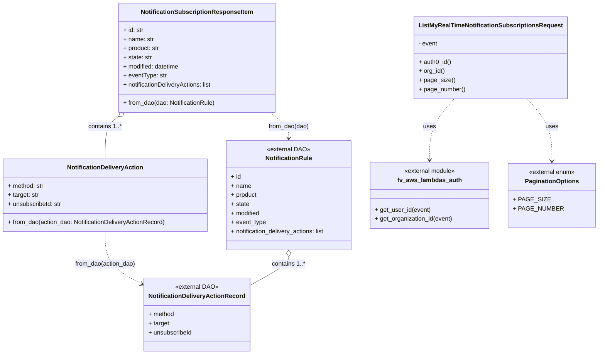
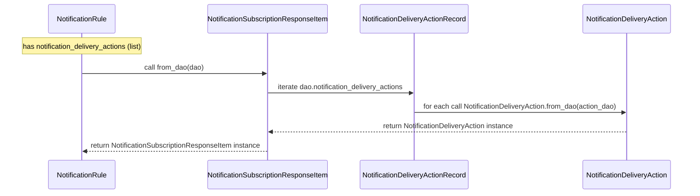

# Diagram: common/subscription_service/subscription_service/v2/service/list_my_real_time_notification_subscription_models.py

> Auto-generated by Obscura crawlers

## Diagram 1

### SVG

<svg id="container" width="1564.0078125" xmlns="http://www.w3.org/2000/svg" class="classDiagram" height="932" viewBox="0 0 1564.0078125 932" role="graphics-document document" aria-roledescription="class"><g><defs><marker id="container_class-aggregationStart" class="marker aggregation class" refX="18" refY="7" markerWidth="190" markerHeight="240" orient="auto"><path d="M 18,7 L9,13 L1,7 L9,1 Z"></path></marker></defs><defs><marker id="container_class-aggregationEnd" class="marker aggregation class" refX="1" refY="7" markerWidth="20" markerHeight="28" orient="auto"><path d="M 18,7 L9,13 L1,7 L9,1 Z"></path></marker></defs><defs><marker id="container_class-extensionStart" class="marker extension class" refX="18" refY="7" markerWidth="190" markerHeight="240" orient="auto"><path d="M 1,7 L18,13 V 1 Z"></path></marker></defs><defs><marker id="container_class-extensionEnd" class="marker extension class" refX="1" refY="7" markerWidth="20" markerHeight="28" orient="auto"><path d="M 1,1 V 13 L18,7 Z"></path></marker></defs><defs><marker id="container_class-compositionStart" class="marker composition class" refX="18" refY="7" markerWidth="190" markerHeight="240" orient="auto"><path d="M 18,7 L9,13 L1,7 L9,1 Z"></path></marker></defs><defs><marker id="container_class-compositionEnd" class="marker composition class" refX="1" refY="7" markerWidth="20" markerHeight="28" orient="auto"><path d="M 18,7 L9,13 L1,7 L9,1 Z"></path></marker></defs><defs><marker id="container_class-dependencyStart" class="marker dependency class" refX="6" refY="7" markerWidth="190" markerHeight="240" orient="auto"><path d="M 5,7 L9,13 L1,7 L9,1 Z"></path></marker></defs><defs><marker id="container_class-dependencyEnd" class="marker dependency class" refX="13" refY="7" markerWidth="20" markerHeight="28" orient="auto"><path d="M 18,7 L9,13 L14,7 L9,1 Z"></path></marker></defs><defs><marker id="container_class-lollipopStart" class="marker lollipop class" refX="13" refY="7" markerWidth="190" markerHeight="240" orient="auto"><circle stroke="black" fill="transparent" cx="7" cy="7" r="6"></circle></marker></defs><defs><marker id="container_class-lollipopEnd" class="marker lollipop class" refX="1" refY="7" markerWidth="190" markerHeight="240" orient="auto"><circle stroke="black" fill="transparent" cx="7" cy="7" r="6"></circle></marker></defs><g class="root"><g class="clusters"></g><g class="edgePaths"><path d="M1202.951,260L1192.514,272.167C1182.077,284.333,1161.203,308.667,1150.765,335.5C1140.328,362.333,1140.328,391.667,1140.328,406.333L1140.328,421" id="id_ListMyRealTimeNotificationSubscriptionsRequest_fv_aws_lambdas_auth_1" class="edge-thickness-normal edge-pattern-dashed relation" style=";;;" data-edge="true" data-et="edge" data-id="id_ListMyRealTimeNotificationSubscriptionsRequest_fv_aws_lambdas_auth_1" data-points="W3sieCI6MTIwMi45NTE0MzA4NTI5MDA2LCJ5IjoyNjB9LHsieCI6MTE0MC4zMjgxMjUsInkiOjMzM30seyJ4IjoxMTQwLjMyODEyNSwieSI6NDI3fV0=" marker-end="url(#container_class-dependencyEnd)"></path><path d="M1388.248,260L1398.685,272.167C1409.122,284.333,1429.997,308.667,1440.434,336C1450.871,363.333,1450.871,393.667,1450.871,408.833L1450.871,424" id="id_ListMyRealTimeNotificationSubscriptionsRequest_PaginationOptions_2" class="edge-thickness-normal edge-pattern-dashed relation" style=";;;" data-edge="true" data-et="edge" data-id="id_ListMyRealTimeNotificationSubscriptionsRequest_PaginationOptions_2" data-points="W3sieCI6MTM4OC4yNDc3ODc4OTcwOTk0LCJ5IjoyNjB9LHsieCI6MTQ1MC44NzEwOTM3NSwieSI6MzMzfSx7IngiOjE0NTAuODcxMDkzNzUsInkiOjQzMH1d" marker-end="url(#container_class-dependencyEnd)"></path><path d="M278.598,610L278.598,624.167C278.598,638.333,278.598,666.667,296.178,690.407C313.759,714.148,348.921,733.296,366.501,742.87L384.082,752.443" id="id_NotificationDeliveryAction_NotificationDeliveryActionRecord_3" class="edge-thickness-normal edge-pattern-dashed relation" style=";;;" data-edge="true" data-et="edge" data-id="id_NotificationDeliveryAction_NotificationDeliveryActionRecord_3" data-points="W3sieCI6Mjc4LjU5NzY1NjI1LCJ5Ijo2MTB9LHsieCI6Mjc4LjU5NzY1NjI1LCJ5Ijo2OTV9LHsieCI6Mzg5LjM1MTU2MjUsInkiOjc1NS4zMTI5ODg4MjAxMTQyfV0=" marker-end="url(#container_class-dependencyEnd)"></path><path d="M717.133,296L725.454,302.167C733.775,308.333,750.417,320.667,758.738,332C767.059,343.333,767.059,353.667,767.059,358.833L767.059,364" id="id_NotificationSubscriptionResponseItem_NotificationRule_4" class="edge-thickness-normal edge-pattern-dashed relation" style=";;;" data-edge="true" data-et="edge" data-id="id_NotificationSubscriptionResponseItem_NotificationRule_4" data-points="W3sieCI6NzE3LjEzMzAyODMxNDkxNzIsInkiOjI5Nn0seyJ4Ijo3NjcuMDU4NTkzNzUsInkiOjMzM30seyJ4Ijo3NjcuMDU4NTkzNzUsInkiOjM3MH1d" marker-end="url(#container_class-dependencyEnd)"></path><path d="M314.664,306.271L308.653,310.726C302.642,315.181,290.62,324.09,284.609,342.712C278.598,361.333,278.598,389.667,278.598,403.833L278.598,418" id="id_NotificationSubscriptionResponseItem_NotificationDeliveryAction_5" class="edge-thickness-normal edge-pattern-solid relation" style=";;;" data-edge="true" data-et="edge" data-id="id_NotificationSubscriptionResponseItem_NotificationDeliveryAction_5" data-points="W3sieCI6MzI4LjUyMzIyMTY4NTA4MjgzLCJ5IjoyOTZ9LHsieCI6Mjc4LjU5NzY1NjI1LCJ5IjozMzN9LHsieCI6Mjc4LjU5NzY1NjI1LCJ5Ijo0MTh9XQ==" marker-start="url(#container_class-aggregationStart)"></path><path d="M767.059,675.25L767.059,678.542C767.059,681.833,767.059,688.417,748.6,701.76C730.141,715.104,693.223,735.209,674.764,745.261L656.305,755.313" id="id_NotificationRule_NotificationDeliveryActionRecord_6" class="edge-thickness-normal edge-pattern-solid relation" style=";;;" data-edge="true" data-et="edge" data-id="id_NotificationRule_NotificationDeliveryActionRecord_6" data-points="W3sieCI6NzY3LjA1ODU5Mzc1LCJ5Ijo2NTh9LHsieCI6NzY3LjA1ODU5Mzc1LCJ5Ijo2OTV9LHsieCI6NjU2LjMwNDY4NzUsInkiOjc1NS4zMTI5ODg4MjAxMTQyfV0=" marker-start="url(#container_class-aggregationStart)"></path></g><g class="edgeLabels"><g class="edgeLabel" transform="translate(1140.328125, 333)"><g class="label" data-id="id_ListMyRealTimeNotificationSubscriptionsRequest_fv_aws_lambdas_auth_1" transform="translate(-16.4921875, -12)"><foreignObject width="32.984375" height="24">

uses

</foreignObject></g></g><g class="edgeLabel" transform="translate(1450.87109375, 333)"><g class="label" data-id="id_ListMyRealTimeNotificationSubscriptionsRequest_PaginationOptions_2" transform="translate(-16.4921875, -12)"><foreignObject width="32.984375" height="24">

uses

</foreignObject></g></g><g class="edgeLabel" transform="translate(278.59765625, 695)"><g class="label" data-id="id_NotificationDeliveryAction_NotificationDeliveryActionRecord_3" transform="translate(-80.5390625, -12)"><foreignObject width="161.078125" height="24">

from_dao(action_dao)

</foreignObject></g></g><g class="edgeLabel" transform="translate(767.05859375, 333)"><g class="label" data-id="id_NotificationSubscriptionResponseItem_NotificationRule_4" transform="translate(-53.859375, -12)"><foreignObject width="107.71875" height="24">

from_dao(dao)

</foreignObject></g></g><g class="edgeLabel" transform="translate(278.59765625, 333)"><g class="label" data-id="id_NotificationSubscriptionResponseItem_NotificationDeliveryAction_5" transform="translate(-43.03125, -12)"><foreignObject width="86.0625" height="24">

contains 1..*

</foreignObject></g></g><g class="edgeLabel" transform="translate(767.05859375, 695)"><g class="label" data-id="id_NotificationRule_NotificationDeliveryActionRecord_6" transform="translate(-43.03125, -12)"><foreignObject width="86.0625" height="24">

contains 1..*

</foreignObject></g></g></g><g class="nodes"><g class="node default" id="classId-ListMyRealTimeNotificationSubscriptionsRequest-0" transform="translate(1295.599609375, 152)"><g class="basic label-container"><path d="M-192.546875 -108 L192.546875 -108 L192.546875 108 L-192.546875 108" stroke="none" stroke-width="0" fill="#ECECFF" style=""></path><path d="M-192.546875 -108 C-58.03856709752847 -108, 76.46974080494306 -108, 192.546875 -108 M-192.546875 -108 C-84.62394166212901 -108, 23.298991675741973 -108, 192.546875 -108 M192.546875 -108 C192.546875 -60.55523178808375, 192.546875 -13.110463576167504, 192.546875 108 M192.546875 -108 C192.546875 -23.98293020769239, 192.546875 60.03413958461522, 192.546875 108 M192.546875 108 C48.53867647118253 108, -95.46952205763495 108, -192.546875 108 M192.546875 108 C74.22921142614355 108, -44.0884521477129 108, -192.546875 108 M-192.546875 108 C-192.546875 35.4597491380721, -192.546875 -37.080501723855804, -192.546875 -108 M-192.546875 108 C-192.546875 47.377980622166774, -192.546875 -13.244038755666452, -192.546875 -108" stroke="#9370DB" stroke-width="1.3" fill="none" stroke-dasharray="0 0" style=""></path></g><g class="annotation-group text" transform="translate(0, -84)"></g><g class="label-group text" transform="translate(-180.546875, -84)"><g class="label" style="font-weight: bolder" transform="translate(0,-12)"><foreignObject width="361.09375" height="24">

ListMyRealTimeNotificationSubscriptionsRequest

</foreignObject></g></g><g class="members-group text" transform="translate(-180.546875, -36)"><g class="label" style="" transform="translate(0,-12)"><foreignObject width="51.03125" height="24">

- event

</foreignObject></g></g><g class="methods-group text" transform="translate(-180.546875, 12)"><g class="label" style="" transform="translate(0,-12)"><foreignObject width="86.609375" height="24">

+ auth0_id()

</foreignObject></g><g class="label" style="" transform="translate(0,12)"><foreignObject width="68.65625" height="24">

+ org_id()

</foreignObject></g><g class="label" style="" transform="translate(0,36)"><foreignObject width="92.859375" height="24">

+ page_size()

</foreignObject></g><g class="label" style="" transform="translate(0,60)"><foreignObject width="122.078125" height="24">

+ page_number()

</foreignObject></g></g><g class="divider" style=""><path d="M-192.546875 -60 C-80.93594138212057 -60, 30.67499223575885 -60, 192.546875 -60 M-192.546875 -60 C-40.630934318098326 -60, 111.28500636380335 -60, 192.546875 -60" stroke="#9370DB" stroke-width="1.3" fill="none" stroke-dasharray="0 0" style=""></path></g><g class="divider" style=""><path d="M-192.546875 -12 C-79.31373081941206 -12, 33.919413361175884 -12, 192.546875 -12 M-192.546875 -12 C-107.58870367313469 -12, -22.630532346269376 -12, 192.546875 -12" stroke="#9370DB" stroke-width="1.3" fill="none" stroke-dasharray="0 0" style=""></path></g></g><g class="node default" id="classId-NotificationDeliveryAction-1" transform="translate(278.59765625, 514)"><g class="basic label-container"><path d="M-270.59765625 -96 L270.59765625 -96 L270.59765625 96 L-270.59765625 96" stroke="none" stroke-width="0" fill="#ECECFF" style=""></path><path d="M-270.59765625 -96 C-101.26626020997193 -96, 68.06513583005614 -96, 270.59765625 -96 M-270.59765625 -96 C-106.09864211119157 -96, 58.40037202761687 -96, 270.59765625 -96 M270.59765625 -96 C270.59765625 -47.69331931526131, 270.59765625 0.6133613694773743, 270.59765625 96 M270.59765625 -96 C270.59765625 -24.081180979543646, 270.59765625 47.83763804091271, 270.59765625 96 M270.59765625 96 C104.1375257482789 96, -62.32260475344219 96, -270.59765625 96 M270.59765625 96 C142.407367533892 96, 14.217078817784 96, -270.59765625 96 M-270.59765625 96 C-270.59765625 51.23828406710817, -270.59765625 6.476568134216336, -270.59765625 -96 M-270.59765625 96 C-270.59765625 53.44279278304595, -270.59765625 10.885585566091905, -270.59765625 -96" stroke="#9370DB" stroke-width="1.3" fill="none" stroke-dasharray="0 0" style=""></path></g><g class="annotation-group text" transform="translate(0, -72)"></g><g class="label-group text" transform="translate(-96.1328125, -72)"><g class="label" style="font-weight: bolder" transform="translate(0,-12)"><foreignObject width="192.265625" height="24">

NotificationDeliveryAction

</foreignObject></g></g><g class="members-group text" transform="translate(-258.59765625, -24)"><g class="label" style="" transform="translate(0,-12)"><foreignObject width="96.234375" height="24">

+ method: str

</foreignObject></g><g class="label" style="" transform="translate(0,12)"><foreignObject width="82.65625" height="24">

+ target: str

</foreignObject></g><g class="label" style="" transform="translate(0,36)"><foreignObject width="143.03125" height="24">

+ unsubscribeId: str

</foreignObject></g></g><g class="methods-group text" transform="translate(-258.59765625, 72)"><g class="label" style="" transform="translate(0,-12)"><foreignObject width="421.0625" height="24">

+ from_dao(action_dao: NotificationDeliveryActionRecord)

</foreignObject></g></g><g class="divider" style=""><path d="M-270.59765625 -48 C-129.76176277490597 -48, 11.07413070018805 -48, 270.59765625 -48 M-270.59765625 -48 C-103.79852041540875 -48, 63.00061541918251 -48, 270.59765625 -48" stroke="#9370DB" stroke-width="1.3" fill="none" stroke-dasharray="0 0" style=""></path></g><g class="divider" style=""><path d="M-270.59765625 48 C-156.1341904851306 48, -41.670724720261234 48, 270.59765625 48 M-270.59765625 48 C-101.5080885898256 48, 67.58147907034879 48, 270.59765625 48" stroke="#9370DB" stroke-width="1.3" fill="none" stroke-dasharray="0 0" style=""></path></g></g><g class="node default" id="classId-NotificationSubscriptionResponseItem-2" transform="translate(522.828125, 152)"><g class="basic label-container"><path d="M-205.2890625 -144 L205.2890625 -144 L205.2890625 144 L-205.2890625 144" stroke="none" stroke-width="0" fill="#ECECFF" style=""></path><path d="M-205.2890625 -144 C-103.2997460170619 -144, -1.3104295341238128 -144, 205.2890625 -144 M-205.2890625 -144 C-111.15794995504177 -144, -17.026837410083544 -144, 205.2890625 -144 M205.2890625 -144 C205.2890625 -85.70882650948043, 205.2890625 -27.417653018960863, 205.2890625 144 M205.2890625 -144 C205.2890625 -41.45483685783306, 205.2890625 61.090326284333884, 205.2890625 144 M205.2890625 144 C65.49759163760191 144, -74.29387922479617 144, -205.2890625 144 M205.2890625 144 C59.691168868276776 144, -85.90672476344645 144, -205.2890625 144 M-205.2890625 144 C-205.2890625 52.24605710992256, -205.2890625 -39.50788578015488, -205.2890625 -144 M-205.2890625 144 C-205.2890625 63.37669455281157, -205.2890625 -17.246610894376857, -205.2890625 -144" stroke="#9370DB" stroke-width="1.3" fill="none" stroke-dasharray="0 0" style=""></path></g><g class="annotation-group text" transform="translate(0, -120)"></g><g class="label-group text" transform="translate(-141.28125, -120)"><g class="label" style="font-weight: bolder" transform="translate(0,-12)"><foreignObject width="282.5625" height="24">

NotificationSubscriptionResponseItem

</foreignObject></g></g><g class="members-group text" transform="translate(-193.2890625, -72)"><g class="label" style="" transform="translate(0,-12)"><foreignObject width="53.8125" height="24">

+ id: str

</foreignObject></g><g class="label" style="" transform="translate(0,12)"><foreignObject width="80.25" height="24">

+ name: str

</foreignObject></g><g class="label" style="" transform="translate(0,36)"><foreignObject width="96.640625" height="24">

+ product: str

</foreignObject></g><g class="label" style="" transform="translate(0,60)"><foreignObject width="75.828125" height="24">

+ state: str

</foreignObject></g><g class="label" style="" transform="translate(0,84)"><foreignObject width="150.1875" height="24">

+ modified: datetime

</foreignObject></g><g class="label" style="" transform="translate(0,108)"><foreignObject width="113.796875" height="24">

+ eventType: str

</foreignObject></g><g class="label" style="" transform="translate(0,132)"><foreignObject width="238.265625" height="24">

+ notificationDeliveryActions: list

</foreignObject></g></g><g class="methods-group text" transform="translate(-193.2890625, 120)"><g class="label" style="" transform="translate(0,-12)"><foreignObject width="245.296875" height="24">

+ from_dao(dao: NotificationRule)

</foreignObject></g></g><g class="divider" style=""><path d="M-205.2890625 -96 C-51.96753541990057 -96, 101.35399166019886 -96, 205.2890625 -96 M-205.2890625 -96 C-107.9589286271209 -96, -10.628794754241795 -96, 205.2890625 -96" stroke="#9370DB" stroke-width="1.3" fill="none" stroke-dasharray="0 0" style=""></path></g><g class="divider" style=""><path d="M-205.2890625 96 C-105.27171697865708 96, -5.254371457314164 96, 205.2890625 96 M-205.2890625 96 C-69.6424512980621 96, 66.0041599038758 96, 205.2890625 96" stroke="#9370DB" stroke-width="1.3" fill="none" stroke-dasharray="0 0" style=""></path></g></g><g class="node default" id="classId-NotificationDeliveryActionRecord-3" transform="translate(522.828125, 828)"><g class="basic label-container"><path d="M-133.4765625 -96 L133.4765625 -96 L133.4765625 96 L-133.4765625 96" stroke="none" stroke-width="0" fill="#ECECFF" style=""></path><path d="M-133.4765625 -96 C-72.5927331495401 -96, -11.70890379908019 -96, 133.4765625 -96 M-133.4765625 -96 C-49.37612867023016 -96, 34.72430515953968 -96, 133.4765625 -96 M133.4765625 -96 C133.4765625 -32.7549394842748, 133.4765625 30.4901210314504, 133.4765625 96 M133.4765625 -96 C133.4765625 -21.434813691698594, 133.4765625 53.13037261660281, 133.4765625 96 M133.4765625 96 C57.66147284571369 96, -18.15361680857262 96, -133.4765625 96 M133.4765625 96 C75.83738249293744 96, 18.198202485874873 96, -133.4765625 96 M-133.4765625 96 C-133.4765625 22.95897249927448, -133.4765625 -50.08205500145104, -133.4765625 -96 M-133.4765625 96 C-133.4765625 19.834880162781474, -133.4765625 -56.33023967443705, -133.4765625 -96" stroke="#9370DB" stroke-width="1.3" fill="none" stroke-dasharray="0 0" style=""></path></g><g class="annotation-group text" transform="translate(-55.890625, -72)"><g class="label" style="" transform="translate(0,-12)"><foreignObject width="111.78125" height="24">

«external DAO»

</foreignObject></g></g><g class="label-group text" transform="translate(-121.4765625, -48)"><g class="label" style="font-weight: bolder" transform="translate(0,-12)"><foreignObject width="242.953125" height="24">

NotificationDeliveryActionRecord

</foreignObject></g></g><g class="members-group text" transform="translate(-121.4765625, 0)"><g class="label" style="" transform="translate(0,-12)"><foreignObject width="68.734375" height="24">

+ method

</foreignObject></g><g class="label" style="" transform="translate(0,12)"><foreignObject width="55.09375" height="24">

+ target

</foreignObject></g><g class="label" style="" transform="translate(0,36)"><foreignObject width="115.53125" height="24">

+ unsubscribeId

</foreignObject></g></g><g class="methods-group text" transform="translate(-121.4765625, 96)"></g><g class="divider" style=""><path d="M-133.4765625 -24 C-66.83618659516068 -24, -0.1958106903213661 -24, 133.4765625 -24 M-133.4765625 -24 C-75.32840102434804 -24, -17.180239548696093 -24, 133.4765625 -24" stroke="#9370DB" stroke-width="1.3" fill="none" stroke-dasharray="0 0" style=""></path></g><g class="divider" style=""><path d="M-133.4765625 72 C-35.84930277413096 72, 61.777956951738076 72, 133.4765625 72 M-133.4765625 72 C-46.51856145207202 72, 40.43943959585596 72, 133.4765625 72" stroke="#9370DB" stroke-width="1.3" fill="none" stroke-dasharray="0 0" style=""></path></g></g><g class="node default" id="classId-NotificationRule-4" transform="translate(767.05859375, 514)"><g class="basic label-container"><path d="M-167.86328125 -144 L167.86328125 -144 L167.86328125 144 L-167.86328125 144" stroke="none" stroke-width="0" fill="#ECECFF" style=""></path><path d="M-167.86328125 -144 C-87.80515196244151 -144, -7.747022674883027 -144, 167.86328125 -144 M-167.86328125 -144 C-43.45924157782167 -144, 80.94479809435666 -144, 167.86328125 -144 M167.86328125 -144 C167.86328125 -58.98982935089592, 167.86328125 26.020341298208166, 167.86328125 144 M167.86328125 -144 C167.86328125 -56.83821790155571, 167.86328125 30.323564196888583, 167.86328125 144 M167.86328125 144 C49.32314353461251 144, -69.21699418077498 144, -167.86328125 144 M167.86328125 144 C84.12682861015998 144, 0.3903759703199512 144, -167.86328125 144 M-167.86328125 144 C-167.86328125 73.4995167891029, -167.86328125 2.999033578205797, -167.86328125 -144 M-167.86328125 144 C-167.86328125 59.02640156380146, -167.86328125 -25.947196872397086, -167.86328125 -144" stroke="#9370DB" stroke-width="1.3" fill="none" stroke-dasharray="0 0" style=""></path></g><g class="annotation-group text" transform="translate(-55.890625, -120)"><g class="label" style="" transform="translate(0,-12)"><foreignObject width="111.78125" height="24">

«external DAO»

</foreignObject></g></g><g class="label-group text" transform="translate(-59.1484375, -96)"><g class="label" style="font-weight: bolder" transform="translate(0,-12)"><foreignObject width="118.296875" height="24">

NotificationRule

</foreignObject></g></g><g class="members-group text" transform="translate(-155.86328125, -48)"><g class="label" style="" transform="translate(0,-12)"><foreignObject width="26.3125" height="24">

+ id

</foreignObject></g><g class="label" style="" transform="translate(0,12)"><foreignObject width="52.75" height="24">

+ name

</foreignObject></g><g class="label" style="" transform="translate(0,36)"><foreignObject width="69.078125" height="24">

+ product

</foreignObject></g><g class="label" style="" transform="translate(0,60)"><foreignObject width="48.328125" height="24">

+ state

</foreignObject></g><g class="label" style="" transform="translate(0,84)"><foreignObject width="76.859375" height="24">

+ modified

</foreignObject></g><g class="label" style="" transform="translate(0,108)"><foreignObject width="92.359375" height="24">

+ event_type

</foreignObject></g><g class="label" style="" transform="translate(0,132)"><foreignObject width="252.578125" height="24">

+ notification_delivery_actions: list

</foreignObject></g></g><g class="methods-group text" transform="translate(-155.86328125, 144)"></g><g class="divider" style=""><path d="M-167.86328125 -72 C-36.89555041177675 -72, 94.0721804264465 -72, 167.86328125 -72 M-167.86328125 -72 C-71.88953321140858 -72, 24.084214827182848 -72, 167.86328125 -72" stroke="#9370DB" stroke-width="1.3" fill="none" stroke-dasharray="0 0" style=""></path></g><g class="divider" style=""><path d="M-167.86328125 120 C-46.048433167161676 120, 75.76641491567665 120, 167.86328125 120 M-167.86328125 120 C-86.59486602697243 120, -5.3264508039448515 120, 167.86328125 120" stroke="#9370DB" stroke-width="1.3" fill="none" stroke-dasharray="0 0" style=""></path></g></g><g class="node default" id="classId-fv_aws_lambdas_auth-5" transform="translate(1140.328125, 514)"><g class="basic label-container"><path d="M-155.40625 -87 L155.40625 -87 L155.40625 87 L-155.40625 87" stroke="none" stroke-width="0" fill="#ECECFF" style=""></path><path d="M-155.40625 -87 C-35.66212515168671 -87, 84.08199969662658 -87, 155.40625 -87 M-155.40625 -87 C-69.48614303781213 -87, 16.433963924375746 -87, 155.40625 -87 M155.40625 -87 C155.40625 -28.728906806505364, 155.40625 29.542186386989272, 155.40625 87 M155.40625 -87 C155.40625 -24.404984086992428, 155.40625 38.190031826015144, 155.40625 87 M155.40625 87 C41.9671116455998 87, -71.4720267088004 87, -155.40625 87 M155.40625 87 C39.52913215439604 87, -76.34798569120792 87, -155.40625 87 M-155.40625 87 C-155.40625 28.542140734059714, -155.40625 -29.91571853188057, -155.40625 -87 M-155.40625 87 C-155.40625 31.34265934348577, -155.40625 -24.31468131302846, -155.40625 -87" stroke="#9370DB" stroke-width="1.3" fill="none" stroke-dasharray="0 0" style=""></path></g><g class="annotation-group text" transform="translate(-68.25, -63)"><g class="label" style="" transform="translate(0,-12)"><foreignObject width="136.5" height="24">

«external module»

</foreignObject></g></g><g class="label-group text" transform="translate(-80.5625, -39)"><g class="label" style="font-weight: bolder" transform="translate(0,-12)"><foreignObject width="161.125" height="24">

fv_aws_lambdas_auth

</foreignObject></g></g><g class="members-group text" transform="translate(-143.40625, 9)"></g><g class="methods-group text" transform="translate(-143.40625, 39)"><g class="label" style="" transform="translate(0,-12)"><foreignObject width="146.296875" height="24">

+ get_user_id(event)

</foreignObject></g><g class="label" style="" transform="translate(0,12)"><foreignObject width="206.25" height="24">

+ get_organization_id(event)

</foreignObject></g></g><g class="divider" style=""><path d="M-155.40625 -15 C-51.90004883728642 -15, 51.60615232542716 -15, 155.40625 -15 M-155.40625 -15 C-57.83468801698557 -15, 39.73687396602887 -15, 155.40625 -15" stroke="#9370DB" stroke-width="1.3" fill="none" stroke-dasharray="0 0" style=""></path></g><g class="divider" style=""><path d="M-155.40625 9 C-75.00697730847403 9, 5.3922953830519305 9, 155.40625 9 M-155.40625 9 C-68.92717521874083 9, 17.551899562518344 9, 155.40625 9" stroke="#9370DB" stroke-width="1.3" fill="none" stroke-dasharray="0 0" style=""></path></g></g><g class="node default" id="classId-PaginationOptions-6" transform="translate(1450.87109375, 514)"><g class="basic label-container"><path d="M-105.13671875 -84 L105.13671875 -84 L105.13671875 84 L-105.13671875 84" stroke="none" stroke-width="0" fill="#ECECFF" style=""></path><path d="M-105.13671875 -84 C-39.37146673279419 -84, 26.39378528441162 -84, 105.13671875 -84 M-105.13671875 -84 C-29.037497558605537 -84, 47.061723632788926 -84, 105.13671875 -84 M105.13671875 -84 C105.13671875 -32.76015944966744, 105.13671875 18.47968110066512, 105.13671875 84 M105.13671875 -84 C105.13671875 -49.68206351204212, 105.13671875 -15.36412702408424, 105.13671875 84 M105.13671875 84 C27.57908126098461 84, -49.97855622803078 84, -105.13671875 84 M105.13671875 84 C36.354074240403094 84, -32.42857026919381 84, -105.13671875 84 M-105.13671875 84 C-105.13671875 22.396954011053978, -105.13671875 -39.206091977892044, -105.13671875 -84 M-105.13671875 84 C-105.13671875 19.210903148990297, -105.13671875 -45.578193702019405, -105.13671875 -84" stroke="#9370DB" stroke-width="1.3" fill="none" stroke-dasharray="0 0" style=""></path></g><g class="annotation-group text" transform="translate(-61.34375, -60)"><g class="label" style="" transform="translate(0,-12)"><foreignObject width="122.6875" height="24">

«external enum»

</foreignObject></g></g><g class="label-group text" transform="translate(-67.7890625, -36)"><g class="label" style="font-weight: bolder" transform="translate(0,-12)"><foreignObject width="135.578125" height="24">

PaginationOptions

</foreignObject></g></g><g class="members-group text" transform="translate(-93.13671875, 12)"><g class="label" style="" transform="translate(0,-12)"><foreignObject width="86.578125" height="24">

+ PAGE_SIZE

</foreignObject></g><g class="label" style="" transform="translate(0,12)"><foreignObject width="118.484375" height="24">

+ PAGE_NUMBER

</foreignObject></g></g><g class="methods-group text" transform="translate(-93.13671875, 84)"></g><g class="divider" style=""><path d="M-105.13671875 -12 C-39.63611201813826 -12, 25.864494713723474 -12, 105.13671875 -12 M-105.13671875 -12 C-38.16841327251072 -12, 28.799892204978562 -12, 105.13671875 -12" stroke="#9370DB" stroke-width="1.3" fill="none" stroke-dasharray="0 0" style=""></path></g><g class="divider" style=""><path d="M-105.13671875 60 C-52.966822638972275 60, -0.7969265279445494 60, 105.13671875 60 M-105.13671875 60 C-62.17749440701996 60, -19.218270064039913 60, 105.13671875 60" stroke="#9370DB" stroke-width="1.3" fill="none" stroke-dasharray="0 0" style=""></path></g></g></g></g></g></svg>

## Diagram 2

### SVG

<svg id="container" width="1697.5" xmlns="http://www.w3.org/2000/svg" height="460" viewBox="-123.5 -10 1697.5 460" role="graphics-document document" aria-roledescription="sequence"><g><rect x="1314" y="374" fill="#eaeaea" stroke="#666" width="210" height="65" name="Action" rx="3" ry="3" class="actor actor-bottom"></rect><text x="1419" y="406.5" dominant-baseline="central" alignment-baseline="central" class="actor actor-box" style="text-anchor: middle; font-size: 16px; font-weight: 400;"><tspan x="1419" dy="0">NotificationDeliveryAction</tspan></text></g><g><rect x="772" y="374" fill="#eaeaea" stroke="#666" width="260" height="65" name="ActionRec" rx="3" ry="3" class="actor actor-bottom"></rect><text x="902" y="406.5" dominant-baseline="central" alignment-baseline="central" class="actor actor-box" style="text-anchor: middle; font-size: 16px; font-weight: 400;"><tspan x="902" dy="0">NotificationDeliveryActionRecord</tspan></text></g><g><rect x="389" y="374" fill="#eaeaea" stroke="#666" width="300" height="65" name="Resp" rx="3" ry="3" class="actor actor-bottom"></rect><text x="539" y="406.5" dominant-baseline="central" alignment-baseline="central" class="actor actor-box" style="text-anchor: middle; font-size: 16px; font-weight: 400;"><tspan x="539" dy="0">NotificationSubscriptionResponseItem</tspan></text></g><g><rect x="0" y="374" fill="#eaeaea" stroke="#666" width="150" height="65" name="Rule" rx="3" ry="3" class="actor actor-bottom"></rect><text x="75" y="406.5" dominant-baseline="central" alignment-baseline="central" class="actor actor-box" style="text-anchor: middle; font-size: 16px; font-weight: 400;"><tspan x="75" dy="0">NotificationRule</tspan></text></g><g><line id="actor3" x1="1419" y1="65" x2="1419" y2="374" class="actor-line 200" stroke-width="0.5px" stroke="#999" name="Action"></line><g id="root-3"><rect x="1314" y="0" fill="#eaeaea" stroke="#666" width="210" height="65" name="Action" rx="3" ry="3" class="actor actor-top"></rect><text x="1419" y="32.5" dominant-baseline="central" alignment-baseline="central" class="actor actor-box" style="text-anchor: middle; font-size: 16px; font-weight: 400;"><tspan x="1419" dy="0">NotificationDeliveryAction</tspan></text></g></g><g><line id="actor2" x1="902" y1="65" x2="902" y2="374" class="actor-line 200" stroke-width="0.5px" stroke="#999" name="ActionRec"></line><g id="root-2"><rect x="772" y="0" fill="#eaeaea" stroke="#666" width="260" height="65" name="ActionRec" rx="3" ry="3" class="actor actor-top"></rect><text x="902" y="32.5" dominant-baseline="central" alignment-baseline="central" class="actor actor-box" style="text-anchor: middle; font-size: 16px; font-weight: 400;"><tspan x="902" dy="0">NotificationDeliveryActionRecord</tspan></text></g></g><g><line id="actor1" x1="539" y1="65" x2="539" y2="374" class="actor-line 200" stroke-width="0.5px" stroke="#999" name="Resp"></line><g id="root-1"><rect x="389" y="0" fill="#eaeaea" stroke="#666" width="300" height="65" name="Resp" rx="3" ry="3" class="actor actor-top"></rect><text x="539" y="32.5" dominant-baseline="central" alignment-baseline="central" class="actor actor-box" style="text-anchor: middle; font-size: 16px; font-weight: 400;"><tspan x="539" dy="0">NotificationSubscriptionResponseItem</tspan></text></g></g><g><line id="actor0" x1="75" y1="65" x2="75" y2="374" class="actor-line 200" stroke-width="0.5px" stroke="#999" name="Rule"></line><g id="root-0"><rect x="0" y="0" fill="#eaeaea" stroke="#666" width="150" height="65" name="Rule" rx="3" ry="3" class="actor actor-top"></rect><text x="75" y="32.5" dominant-baseline="central" alignment-baseline="central" class="actor actor-box" style="text-anchor: middle; font-size: 16px; font-weight: 400;"><tspan x="75" dy="0">NotificationRule</tspan></text></g></g><g></g><defs><symbol id="computer" width="24" height="24"><path transform="scale(.5)" d="M2 2v13h20v-13h-20zm18 11h-16v-9h16v9zm-10.228 6l.466-1h3.524l.467 1h-4.457zm14.228 3h-24l2-6h2.104l-1.33 4h18.45l-1.297-4h2.073l2 6zm-5-10h-14v-7h14v7z"></path></symbol></defs><defs><symbol id="database" fill-rule="evenodd" clip-rule="evenodd"><path transform="scale(.5)" d="M12.258.001l.256.004.255.005.253.008.251.01.249.012.247.015.246.016.242.019.241.02.239.023.236.024.233.027.231.028.229.031.225.032.223.034.22.036.217.038.214.04.211.041.208.043.205.045.201.046.198.048.194.05.191.051.187.053.183.054.18.056.175.057.172.059.168.06.163.061.16.063.155.064.15.066.074.033.073.033.071.034.07.034.069.035.068.035.067.035.066.035.064.036.064.036.062.036.06.036.06.037.058.037.058.037.055.038.055.038.053.038.052.038.051.039.05.039.048.039.047.039.045.04.044.04.043.04.041.04.04.041.039.041.037.041.036.041.034.041.033.042.032.042.03.042.029.042.027.042.026.043.024.043.023.043.021.043.02.043.018.044.017.043.015.044.013.044.012.044.011.045.009.044.007.045.006.045.004.045.002.045.001.045v17l-.001.045-.002.045-.004.045-.006.045-.007.045-.009.044-.011.045-.012.044-.013.044-.015.044-.017.043-.018.044-.02.043-.021.043-.023.043-.024.043-.026.043-.027.042-.029.042-.03.042-.032.042-.033.042-.034.041-.036.041-.037.041-.039.041-.04.041-.041.04-.043.04-.044.04-.045.04-.047.039-.048.039-.05.039-.051.039-.052.038-.053.038-.055.038-.055.038-.058.037-.058.037-.06.037-.06.036-.062.036-.064.036-.064.036-.066.035-.067.035-.068.035-.069.035-.07.034-.071.034-.073.033-.074.033-.15.066-.155.064-.16.063-.163.061-.168.06-.172.059-.175.057-.18.056-.183.054-.187.053-.191.051-.194.05-.198.048-.201.046-.205.045-.208.043-.211.041-.214.04-.217.038-.22.036-.223.034-.225.032-.229.031-.231.028-.233.027-.236.024-.239.023-.241.02-.242.019-.246.016-.247.015-.249.012-.251.01-.253.008-.255.005-.256.004-.258.001-.258-.001-.256-.004-.255-.005-.253-.008-.251-.01-.249-.012-.247-.015-.245-.016-.243-.019-.241-.02-.238-.023-.236-.024-.234-.027-.231-.028-.228-.031-.226-.032-.223-.034-.22-.036-.217-.038-.214-.04-.211-.041-.208-.043-.204-.045-.201-.046-.198-.048-.195-.05-.19-.051-.187-.053-.184-.054-.179-.056-.176-.057-.172-.059-.167-.06-.164-.061-.159-.063-.155-.064-.151-.066-.074-.033-.072-.033-.072-.034-.07-.034-.069-.035-.068-.035-.067-.035-.066-.035-.064-.036-.063-.036-.062-.036-.061-.036-.06-.037-.058-.037-.057-.037-.056-.038-.055-.038-.053-.038-.052-.038-.051-.039-.049-.039-.049-.039-.046-.039-.046-.04-.044-.04-.043-.04-.041-.04-.04-.041-.039-.041-.037-.041-.036-.041-.034-.041-.033-.042-.032-.042-.03-.042-.029-.042-.027-.042-.026-.043-.024-.043-.023-.043-.021-.043-.02-.043-.018-.044-.017-.043-.015-.044-.013-.044-.012-.044-.011-.045-.009-.044-.007-.045-.006-.045-.004-.045-.002-.045-.001-.045v-17l.001-.045.002-.045.004-.045.006-.045.007-.045.009-.044.011-.045.012-.044.013-.044.015-.044.017-.043.018-.044.02-.043.021-.043.023-.043.024-.043.026-.043.027-.042.029-.042.03-.042.032-.042.033-.042.034-.041.036-.041.037-.041.039-.041.04-.041.041-.04.043-.04.044-.04.046-.04.046-.039.049-.039.049-.039.051-.039.052-.038.053-.038.055-.038.056-.038.057-.037.058-.037.06-.037.061-.036.062-.036.063-.036.064-.036.066-.035.067-.035.068-.035.069-.035.07-.034.072-.034.072-.033.074-.033.151-.066.155-.064.159-.063.164-.061.167-.06.172-.059.176-.057.179-.056.184-.054.187-.053.19-.051.195-.05.198-.048.201-.046.204-.045.208-.043.211-.041.214-.04.217-.038.22-.036.223-.034.226-.032.228-.031.231-.028.234-.027.236-.024.238-.023.241-.02.243-.019.245-.016.247-.015.249-.012.251-.01.253-.008.255-.005.256-.004.258-.001.258.001zm-9.258 20.499v.01l.001.021.003.021.004.022.005.021.006.022.007.022.009.023.01.022.011.023.012.023.013.023.015.023.016.024.017.023.018.024.019.024.021.024.022.025.023.024.024.025.052.049.056.05.061.051.066.051.07.051.075.051.079.052.084.052.088.052.092.052.097.052.102.051.105.052.11.052.114.051.119.051.123.051.127.05.131.05.135.05.139.048.144.049.147.047.152.047.155.047.16.045.163.045.167.043.171.043.176.041.178.041.183.039.187.039.19.037.194.035.197.035.202.033.204.031.209.03.212.029.216.027.219.025.222.024.226.021.23.02.233.018.236.016.24.015.243.012.246.01.249.008.253.005.256.004.259.001.26-.001.257-.004.254-.005.25-.008.247-.011.244-.012.241-.014.237-.016.233-.018.231-.021.226-.021.224-.024.22-.026.216-.027.212-.028.21-.031.205-.031.202-.034.198-.034.194-.036.191-.037.187-.039.183-.04.179-.04.175-.042.172-.043.168-.044.163-.045.16-.046.155-.046.152-.047.148-.048.143-.049.139-.049.136-.05.131-.05.126-.05.123-.051.118-.052.114-.051.11-.052.106-.052.101-.052.096-.052.092-.052.088-.053.083-.051.079-.052.074-.052.07-.051.065-.051.06-.051.056-.05.051-.05.023-.024.023-.025.021-.024.02-.024.019-.024.018-.024.017-.024.015-.023.014-.024.013-.023.012-.023.01-.023.01-.022.008-.022.006-.022.006-.022.004-.022.004-.021.001-.021.001-.021v-4.127l-.077.055-.08.053-.083.054-.085.053-.087.052-.09.052-.093.051-.095.05-.097.05-.1.049-.102.049-.105.048-.106.047-.109.047-.111.046-.114.045-.115.045-.118.044-.12.043-.122.042-.124.042-.126.041-.128.04-.13.04-.132.038-.134.038-.135.037-.138.037-.139.035-.142.035-.143.034-.144.033-.147.032-.148.031-.15.03-.151.03-.153.029-.154.027-.156.027-.158.026-.159.025-.161.024-.162.023-.163.022-.165.021-.166.02-.167.019-.169.018-.169.017-.171.016-.173.015-.173.014-.175.013-.175.012-.177.011-.178.01-.179.008-.179.008-.181.006-.182.005-.182.004-.184.003-.184.002h-.37l-.184-.002-.184-.003-.182-.004-.182-.005-.181-.006-.179-.008-.179-.008-.178-.01-.176-.011-.176-.012-.175-.013-.173-.014-.172-.015-.171-.016-.17-.017-.169-.018-.167-.019-.166-.02-.165-.021-.163-.022-.162-.023-.161-.024-.159-.025-.157-.026-.156-.027-.155-.027-.153-.029-.151-.03-.15-.03-.148-.031-.146-.032-.145-.033-.143-.034-.141-.035-.14-.035-.137-.037-.136-.037-.134-.038-.132-.038-.13-.04-.128-.04-.126-.041-.124-.042-.122-.042-.12-.044-.117-.043-.116-.045-.113-.045-.112-.046-.109-.047-.106-.047-.105-.048-.102-.049-.1-.049-.097-.05-.095-.05-.093-.052-.09-.051-.087-.052-.085-.053-.083-.054-.08-.054-.077-.054v4.127zm0-5.654v.011l.001.021.003.021.004.021.005.022.006.022.007.022.009.022.01.022.011.023.012.023.013.023.015.024.016.023.017.024.018.024.019.024.021.024.022.024.023.025.024.024.052.05.056.05.061.05.066.051.07.051.075.052.079.051.084.052.088.052.092.052.097.052.102.052.105.052.11.051.114.051.119.052.123.05.127.051.131.05.135.049.139.049.144.048.147.048.152.047.155.046.16.045.163.045.167.044.171.042.176.042.178.04.183.04.187.038.19.037.194.036.197.034.202.033.204.032.209.03.212.028.216.027.219.025.222.024.226.022.23.02.233.018.236.016.24.014.243.012.246.01.249.008.253.006.256.003.259.001.26-.001.257-.003.254-.006.25-.008.247-.01.244-.012.241-.015.237-.016.233-.018.231-.02.226-.022.224-.024.22-.025.216-.027.212-.029.21-.03.205-.032.202-.033.198-.035.194-.036.191-.037.187-.039.183-.039.179-.041.175-.042.172-.043.168-.044.163-.045.16-.045.155-.047.152-.047.148-.048.143-.048.139-.05.136-.049.131-.05.126-.051.123-.051.118-.051.114-.052.11-.052.106-.052.101-.052.096-.052.092-.052.088-.052.083-.052.079-.052.074-.051.07-.052.065-.051.06-.05.056-.051.051-.049.023-.025.023-.024.021-.025.02-.024.019-.024.018-.024.017-.024.015-.023.014-.023.013-.024.012-.022.01-.023.01-.023.008-.022.006-.022.006-.022.004-.021.004-.022.001-.021.001-.021v-4.139l-.077.054-.08.054-.083.054-.085.052-.087.053-.09.051-.093.051-.095.051-.097.05-.1.049-.102.049-.105.048-.106.047-.109.047-.111.046-.114.045-.115.044-.118.044-.12.044-.122.042-.124.042-.126.041-.128.04-.13.039-.132.039-.134.038-.135.037-.138.036-.139.036-.142.035-.143.033-.144.033-.147.033-.148.031-.15.03-.151.03-.153.028-.154.028-.156.027-.158.026-.159.025-.161.024-.162.023-.163.022-.165.021-.166.02-.167.019-.169.018-.169.017-.171.016-.173.015-.173.014-.175.013-.175.012-.177.011-.178.009-.179.009-.179.007-.181.007-.182.005-.182.004-.184.003-.184.002h-.37l-.184-.002-.184-.003-.182-.004-.182-.005-.181-.007-.179-.007-.179-.009-.178-.009-.176-.011-.176-.012-.175-.013-.173-.014-.172-.015-.171-.016-.17-.017-.169-.018-.167-.019-.166-.02-.165-.021-.163-.022-.162-.023-.161-.024-.159-.025-.157-.026-.156-.027-.155-.028-.153-.028-.151-.03-.15-.03-.148-.031-.146-.033-.145-.033-.143-.033-.141-.035-.14-.036-.137-.036-.136-.037-.134-.038-.132-.039-.13-.039-.128-.04-.126-.041-.124-.042-.122-.043-.12-.043-.117-.044-.116-.044-.113-.046-.112-.046-.109-.046-.106-.047-.105-.048-.102-.049-.1-.049-.097-.05-.095-.051-.093-.051-.09-.051-.087-.053-.085-.052-.083-.054-.08-.054-.077-.054v4.139zm0-5.666v.011l.001.02.003.022.004.021.005.022.006.021.007.022.009.023.01.022.011.023.012.023.013.023.015.023.016.024.017.024.018.023.019.024.021.025.022.024.023.024.024.025.052.05.056.05.061.05.066.051.07.051.075.052.079.051.084.052.088.052.092.052.097.052.102.052.105.051.11.052.114.051.119.051.123.051.127.05.131.05.135.05.139.049.144.048.147.048.152.047.155.046.16.045.163.045.167.043.171.043.176.042.178.04.183.04.187.038.19.037.194.036.197.034.202.033.204.032.209.03.212.028.216.027.219.025.222.024.226.021.23.02.233.018.236.017.24.014.243.012.246.01.249.008.253.006.256.003.259.001.26-.001.257-.003.254-.006.25-.008.247-.01.244-.013.241-.014.237-.016.233-.018.231-.02.226-.022.224-.024.22-.025.216-.027.212-.029.21-.03.205-.032.202-.033.198-.035.194-.036.191-.037.187-.039.183-.039.179-.041.175-.042.172-.043.168-.044.163-.045.16-.045.155-.047.152-.047.148-.048.143-.049.139-.049.136-.049.131-.051.126-.05.123-.051.118-.052.114-.051.11-.052.106-.052.101-.052.096-.052.092-.052.088-.052.083-.052.079-.052.074-.052.07-.051.065-.051.06-.051.056-.05.051-.049.023-.025.023-.025.021-.024.02-.024.019-.024.018-.024.017-.024.015-.023.014-.024.013-.023.012-.023.01-.022.01-.023.008-.022.006-.022.006-.022.004-.022.004-.021.001-.021.001-.021v-4.153l-.077.054-.08.054-.083.053-.085.053-.087.053-.09.051-.093.051-.095.051-.097.05-.1.049-.102.048-.105.048-.106.048-.109.046-.111.046-.114.046-.115.044-.118.044-.12.043-.122.043-.124.042-.126.041-.128.04-.13.039-.132.039-.134.038-.135.037-.138.036-.139.036-.142.034-.143.034-.144.033-.147.032-.148.032-.15.03-.151.03-.153.028-.154.028-.156.027-.158.026-.159.024-.161.024-.162.023-.163.023-.165.021-.166.02-.167.019-.169.018-.169.017-.171.016-.173.015-.173.014-.175.013-.175.012-.177.01-.178.01-.179.009-.179.007-.181.006-.182.006-.182.004-.184.003-.184.001-.185.001-.185-.001-.184-.001-.184-.003-.182-.004-.182-.006-.181-.006-.179-.007-.179-.009-.178-.01-.176-.01-.176-.012-.175-.013-.173-.014-.172-.015-.171-.016-.17-.017-.169-.018-.167-.019-.166-.02-.165-.021-.163-.023-.162-.023-.161-.024-.159-.024-.157-.026-.156-.027-.155-.028-.153-.028-.151-.03-.15-.03-.148-.032-.146-.032-.145-.033-.143-.034-.141-.034-.14-.036-.137-.036-.136-.037-.134-.038-.132-.039-.13-.039-.128-.041-.126-.041-.124-.041-.122-.043-.12-.043-.117-.044-.116-.044-.113-.046-.112-.046-.109-.046-.106-.048-.105-.048-.102-.048-.1-.05-.097-.049-.095-.051-.093-.051-.09-.052-.087-.052-.085-.053-.083-.053-.08-.054-.077-.054v4.153zm8.74-8.179l-.257.004-.254.005-.25.008-.247.011-.244.012-.241.014-.237.016-.233.018-.231.021-.226.022-.224.023-.22.026-.216.027-.212.028-.21.031-.205.032-.202.033-.198.034-.194.036-.191.038-.187.038-.183.04-.179.041-.175.042-.172.043-.168.043-.163.045-.16.046-.155.046-.152.048-.148.048-.143.048-.139.049-.136.05-.131.05-.126.051-.123.051-.118.051-.114.052-.11.052-.106.052-.101.052-.096.052-.092.052-.088.052-.083.052-.079.052-.074.051-.07.052-.065.051-.06.05-.056.05-.051.05-.023.025-.023.024-.021.024-.02.025-.019.024-.018.024-.017.023-.015.024-.014.023-.013.023-.012.023-.01.023-.01.022-.008.022-.006.023-.006.021-.004.022-.004.021-.001.021-.001.021.001.021.001.021.004.021.004.022.006.021.006.023.008.022.01.022.01.023.012.023.013.023.014.023.015.024.017.023.018.024.019.024.02.025.021.024.023.024.023.025.051.05.056.05.06.05.065.051.07.052.074.051.079.052.083.052.088.052.092.052.096.052.101.052.106.052.11.052.114.052.118.051.123.051.126.051.131.05.136.05.139.049.143.048.148.048.152.048.155.046.16.046.163.045.168.043.172.043.175.042.179.041.183.04.187.038.191.038.194.036.198.034.202.033.205.032.21.031.212.028.216.027.22.026.224.023.226.022.231.021.233.018.237.016.241.014.244.012.247.011.25.008.254.005.257.004.26.001.26-.001.257-.004.254-.005.25-.008.247-.011.244-.012.241-.014.237-.016.233-.018.231-.021.226-.022.224-.023.22-.026.216-.027.212-.028.21-.031.205-.032.202-.033.198-.034.194-.036.191-.038.187-.038.183-.04.179-.041.175-.042.172-.043.168-.043.163-.045.16-.046.155-.046.152-.048.148-.048.143-.048.139-.049.136-.05.131-.05.126-.051.123-.051.118-.051.114-.052.11-.052.106-.052.101-.052.096-.052.092-.052.088-.052.083-.052.079-.052.074-.051.07-.052.065-.051.06-.05.056-.05.051-.05.023-.025.023-.024.021-.024.02-.025.019-.024.018-.024.017-.023.015-.024.014-.023.013-.023.012-.023.01-.023.01-.022.008-.022.006-.023.006-.021.004-.022.004-.021.001-.021.001-.021-.001-.021-.001-.021-.004-.021-.004-.022-.006-.021-.006-.023-.008-.022-.01-.022-.01-.023-.012-.023-.013-.023-.014-.023-.015-.024-.017-.023-.018-.024-.019-.024-.02-.025-.021-.024-.023-.024-.023-.025-.051-.05-.056-.05-.06-.05-.065-.051-.07-.052-.074-.051-.079-.052-.083-.052-.088-.052-.092-.052-.096-.052-.101-.052-.106-.052-.11-.052-.114-.052-.118-.051-.123-.051-.126-.051-.131-.05-.136-.05-.139-.049-.143-.048-.148-.048-.152-.048-.155-.046-.16-.046-.163-.045-.168-.043-.172-.043-.175-.042-.179-.041-.183-.04-.187-.038-.191-.038-.194-.036-.198-.034-.202-.033-.205-.032-.21-.031-.212-.028-.216-.027-.22-.026-.224-.023-.226-.022-.231-.021-.233-.018-.237-.016-.241-.014-.244-.012-.247-.011-.25-.008-.254-.005-.257-.004-.26-.001-.26.001z"></path></symbol></defs><defs><symbol id="clock" width="24" height="24"><path transform="scale(.5)" d="M12 2c5.514 0 10 4.486 10 10s-4.486 10-10 10-10-4.486-10-10 4.486-10 10-10zm0-2c-6.627 0-12 5.373-12 12s5.373 12 12 12 12-5.373 12-12-5.373-12-12-12zm5.848 12.459c.202.038.202.333.001.372-1.907.361-6.045 1.111-6.547 1.111-.719 0-1.301-.582-1.301-1.301 0-.512.77-5.447 1.125-7.445.034-.192.312-.181.343.014l.985 6.238 5.394 1.011z"></path></symbol></defs><defs><marker id="arrowhead" refX="7.9" refY="5" markerUnits="userSpaceOnUse" markerWidth="12" markerHeight="12" orient="auto-start-reverse"><path d="M -1 0 L 10 5 L 0 10 z"></path></marker></defs><defs><marker id="crosshead" markerWidth="15" markerHeight="8" orient="auto" refX="4" refY="4.5"><path fill="none" stroke="#000000" stroke-width="1pt" d="M 1,2 L 6,7 M 6,2 L 1,7" style="stroke-dasharray: 0, 0;"></path></marker></defs><defs><marker id="filled-head" refX="15.5" refY="7" markerWidth="20" markerHeight="28" orient="auto"><path d="M 18,7 L9,13 L14,7 L9,1 Z"></path></marker></defs><defs><marker id="sequencenumber" refX="15" refY="15" markerWidth="60" markerHeight="40" orient="auto"><circle cx="15" cy="15" r="6"></circle></marker></defs><g><rect x="-73.5" y="75" fill="#EDF2AE" stroke="#666" width="297" height="39" class="note"></rect><text x="75" y="80" text-anchor="middle" dominant-baseline="middle" alignment-baseline="middle" class="noteText" dy="1em" style="font-size: 16px; font-weight: 400;"><tspan x="75">has notification_delivery_actions (list)</tspan></text></g><text x="306" y="129" text-anchor="middle" dominant-baseline="middle" alignment-baseline="middle" class="messageText" dy="1em" style="font-size: 16px; font-weight: 400;">call from_dao(dao)</text><line x1="76" y1="162" x2="535" y2="162" class="messageLine0" stroke-width="2" stroke="none" marker-end="url(#arrowhead)" style="fill: none;"></line><text x="719" y="177" text-anchor="middle" dominant-baseline="middle" alignment-baseline="middle" class="messageText" dy="1em" style="font-size: 16px; font-weight: 400;">iterate dao.notification_delivery_actions</text><line x1="540" y1="210" x2="898" y2="210" class="messageLine0" stroke-width="2" stroke="none" marker-end="url(#arrowhead)" style="fill: none;"></line><text x="1159" y="225" text-anchor="middle" dominant-baseline="middle" alignment-baseline="middle" class="messageText" dy="1em" style="font-size: 16px; font-weight: 400;">for each call NotificationDeliveryAction.from_dao(action_dao)</text><line x1="903" y1="258" x2="1415" y2="258" class="messageLine0" stroke-width="2" stroke="none" marker-end="url(#arrowhead)" style="fill: none;"></line><text x="981" y="273" text-anchor="middle" dominant-baseline="middle" alignment-baseline="middle" class="messageText" dy="1em" style="font-size: 16px; font-weight: 400;">return NotificationDeliveryAction instance</text><line x1="1418" y1="306" x2="543" y2="306" class="messageLine1" stroke-width="2" stroke="none" marker-end="url(#arrowhead)" style="stroke-dasharray: 3, 3; fill: none;"></line><text x="309" y="321" text-anchor="middle" dominant-baseline="middle" alignment-baseline="middle" class="messageText" dy="1em" style="font-size: 16px; font-weight: 400;">return NotificationSubscriptionResponseItem instance</text><line x1="538" y1="354" x2="79" y2="354" class="messageLine1" stroke-width="2" stroke="none" marker-end="url(#arrowhead)" style="stroke-dasharray: 3, 3; fill: none;"></line></svg>
