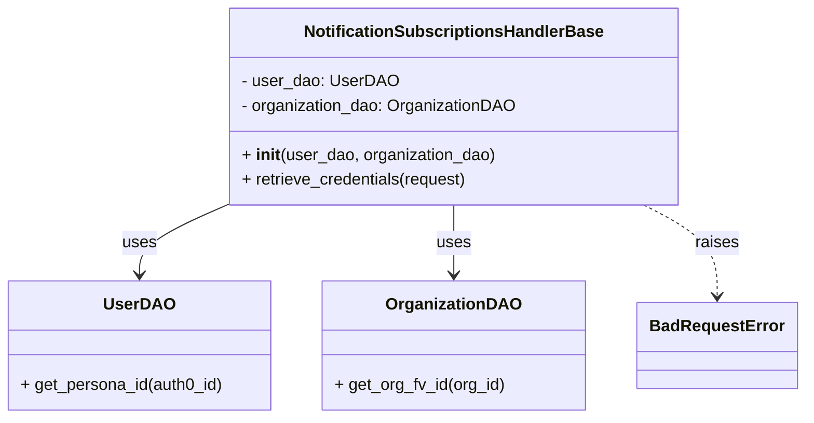

# Diagram: common/subscription_service/subscription_service/v2/service/notification_subscription_handler_base.py

> Auto-generated by Obscura crawlers

## Mermaid

### SVG

<svg id="container" width="771.5" xmlns="http://www.w3.org/2000/svg" class="classDiagram" height="408" viewBox="0 0 771.5 408" role="graphics-document document" aria-roledescription="class"><g><defs><marker id="container_class-aggregationStart" class="marker aggregation class" refX="18" refY="7" markerWidth="190" markerHeight="240" orient="auto"><path d="M 18,7 L9,13 L1,7 L9,1 Z"></path></marker></defs><defs><marker id="container_class-aggregationEnd" class="marker aggregation class" refX="1" refY="7" markerWidth="20" markerHeight="28" orient="auto"><path d="M 18,7 L9,13 L1,7 L9,1 Z"></path></marker></defs><defs><marker id="container_class-extensionStart" class="marker extension class" refX="18" refY="7" markerWidth="190" markerHeight="240" orient="auto"><path d="M 1,7 L18,13 V 1 Z"></path></marker></defs><defs><marker id="container_class-extensionEnd" class="marker extension class" refX="1" refY="7" markerWidth="20" markerHeight="28" orient="auto"><path d="M 1,1 V 13 L18,7 Z"></path></marker></defs><defs><marker id="container_class-compositionStart" class="marker composition class" refX="18" refY="7" markerWidth="190" markerHeight="240" orient="auto"><path d="M 18,7 L9,13 L1,7 L9,1 Z"></path></marker></defs><defs><marker id="container_class-compositionEnd" class="marker composition class" refX="1" refY="7" markerWidth="20" markerHeight="28" orient="auto"><path d="M 18,7 L9,13 L1,7 L9,1 Z"></path></marker></defs><defs><marker id="container_class-dependencyStart" class="marker dependency class" refX="6" refY="7" markerWidth="190" markerHeight="240" orient="auto"><path d="M 5,7 L9,13 L1,7 L9,1 Z"></path></marker></defs><defs><marker id="container_class-dependencyEnd" class="marker dependency class" refX="13" refY="7" markerWidth="20" markerHeight="28" orient="auto"><path d="M 18,7 L9,13 L14,7 L9,1 Z"></path></marker></defs><defs><marker id="container_class-lollipopStart" class="marker lollipop class" refX="13" refY="7" markerWidth="190" markerHeight="240" orient="auto"><circle stroke="black" fill="transparent" cx="7" cy="7" r="6"></circle></marker></defs><defs><marker id="container_class-lollipopEnd" class="marker lollipop class" refX="1" refY="7" markerWidth="190" markerHeight="240" orient="auto"><circle stroke="black" fill="transparent" cx="7" cy="7" r="6"></circle></marker></defs><g class="root"><g class="clusters"></g><g class="edgePaths"><path d="M223.473,198.424L208.803,204.853C194.133,211.283,164.793,224.141,150.123,235.737C135.453,247.333,135.453,257.667,135.453,262.833L135.453,268" id="id_NotificationSubscriptionsHandlerBase_UserDAO_1" class="edge-thickness-normal edge-pattern-solid relation" style=";;;" data-edge="true" data-et="edge" data-id="id_NotificationSubscriptionsHandlerBase_UserDAO_1" data-points="W3sieCI6MjIzLjQ3MjY1NjI1LCJ5IjoxOTguNDI0MDQyMzIzMTM4N30seyJ4IjoxMzUuNDUzMTI1LCJ5IjoyMzd9LHsieCI6MTM1LjQ1MzEyNSwieSI6Mjc0fV0=" marker-end="url(#container_class-dependencyEnd)"></path><path d="M438.922,200L438.922,206.167C438.922,212.333,438.922,224.667,438.922,236C438.922,247.333,438.922,257.667,438.922,262.833L438.922,268" id="id_NotificationSubscriptionsHandlerBase_OrganizationDAO_2" class="edge-thickness-normal edge-pattern-solid relation" style=";;;" data-edge="true" data-et="edge" data-id="id_NotificationSubscriptionsHandlerBase_OrganizationDAO_2" data-points="W3sieCI6NDM4LjkyMTg3NSwieSI6MjAwfSx7IngiOjQzOC45MjE4NzUsInkiOjIzN30seyJ4Ijo0MzguOTIxODc1LCJ5IjoyNzR9XQ==" marker-end="url(#container_class-dependencyEnd)"></path><path d="M619.587,200L631.193,206.167C642.798,212.333,666.008,224.667,677.614,239.5C689.219,254.333,689.219,271.667,689.219,280.333L689.219,289" id="id_NotificationSubscriptionsHandlerBase_BadRequestError_3" class="edge-thickness-normal edge-pattern-dashed relation" style=";;;" data-edge="true" data-et="edge" data-id="id_NotificationSubscriptionsHandlerBase_BadRequestError_3" data-points="W3sieCI6NjE5LjU4NzI4ODUzMzgzNDYsInkiOjIwMH0seyJ4Ijo2ODkuMjE4NzUsInkiOjIzN30seyJ4Ijo2ODkuMjE4NzUsInkiOjI5NX1d" marker-end="url(#container_class-dependencyEnd)"></path></g><g class="edgeLabels"><g class="edgeLabel" transform="translate(135.453125, 237)"><g class="label" data-id="id_NotificationSubscriptionsHandlerBase_UserDAO_1" transform="translate(-16.4921875, -12)"><foreignObject width="32.984375" height="24">

uses

</foreignObject></g></g><g class="edgeLabel" transform="translate(438.921875, 237)"><g class="label" data-id="id_NotificationSubscriptionsHandlerBase_OrganizationDAO_2" transform="translate(-16.4921875, -12)"><foreignObject width="32.984375" height="24">

uses

</foreignObject></g></g><g class="edgeLabel" transform="translate(689.21875, 237)"><g class="label" data-id="id_NotificationSubscriptionsHandlerBase_BadRequestError_3" transform="translate(-21.25, -12)"><foreignObject width="42.5" height="24">

raises

</foreignObject></g></g></g><g class="nodes"><g class="node default" id="classId-NotificationSubscriptionsHandlerBase-0" transform="translate(438.921875, 104)"><g class="basic label-container"><path d="M-215.44921875 -96 L215.44921875 -96 L215.44921875 96 L-215.44921875 96" stroke="none" stroke-width="0" fill="#ECECFF" style=""></path><path d="M-215.44921875 -96 C-125.84558991239153 -96, -36.24196107478306 -96, 215.44921875 -96 M-215.44921875 -96 C-100.32582986568717 -96, 14.797559018625662 -96, 215.44921875 -96 M215.44921875 -96 C215.44921875 -21.75807504193625, 215.44921875 52.4838499161275, 215.44921875 96 M215.44921875 -96 C215.44921875 -49.66233393378789, 215.44921875 -3.3246678675757835, 215.44921875 96 M215.44921875 96 C70.1231891707366 96, -75.20284040852681 96, -215.44921875 96 M215.44921875 96 C74.26720003157448 96, -66.91481868685105 96, -215.44921875 96 M-215.44921875 96 C-215.44921875 27.827854265032173, -215.44921875 -40.344291469935655, -215.44921875 -96 M-215.44921875 96 C-215.44921875 30.81172038760961, -215.44921875 -34.37655922478078, -215.44921875 -96" stroke="#9370DB" stroke-width="1.3" fill="none" stroke-dasharray="0 0" style=""></path></g><g class="annotation-group text" transform="translate(0, -72)"></g><g class="label-group text" transform="translate(-139.8515625, -72)"><g class="label" style="font-weight: bolder" transform="translate(0,-12)"><foreignObject width="279.703125" height="24">

NotificationSubscriptionsHandlerBase

</foreignObject></g></g><g class="members-group text" transform="translate(-203.44921875, -24)"><g class="label" style="" transform="translate(0,-12)"><foreignObject width="147.890625" height="24">

- user_dao: UserDAO

</foreignObject></g><g class="label" style="" transform="translate(0,12)"><foreignObject width="267.046875" height="24">

- organization_dao: OrganizationDAO

</foreignObject></g></g><g class="methods-group text" transform="translate(-203.44921875, 48)"><g class="label" style="" transform="translate(0,-12)"><foreignObject width="246.953125" height="24">

+ <strong>init</strong>(user_dao, organization_dao)

</foreignObject></g><g class="label" style="" transform="translate(0,12)"><foreignObject width="222.328125" height="24">

+ retrieve_credentials(request)

</foreignObject></g></g><g class="divider" style=""><path d="M-215.44921875 -48 C-91.49235678093868 -48, 32.464505188122644 -48, 215.44921875 -48 M-215.44921875 -48 C-51.15927018239864 -48, 113.13067838520271 -48, 215.44921875 -48" stroke="#9370DB" stroke-width="1.3" fill="none" stroke-dasharray="0 0" style=""></path></g><g class="divider" style=""><path d="M-215.44921875 24 C-67.67171059922822 24, 80.10579755154356 24, 215.44921875 24 M-215.44921875 24 C-49.882778545402516 24, 115.68366165919497 24, 215.44921875 24" stroke="#9370DB" stroke-width="1.3" fill="none" stroke-dasharray="0 0" style=""></path></g></g><g class="node default" id="classId-UserDAO-1" transform="translate(135.453125, 337)"><g class="basic label-container"><path d="M-127.453125 -63 L127.453125 -63 L127.453125 63 L-127.453125 63" stroke="none" stroke-width="0" fill="#ECECFF" style=""></path><path d="M-127.453125 -63 C-32.16633978555342 -63, 63.12044542889316 -63, 127.453125 -63 M-127.453125 -63 C-67.10658646435097 -63, -6.760047928701937 -63, 127.453125 -63 M127.453125 -63 C127.453125 -19.786640273803215, 127.453125 23.42671945239357, 127.453125 63 M127.453125 -63 C127.453125 -30.806678055647488, 127.453125 1.3866438887050236, 127.453125 63 M127.453125 63 C75.20443085417568 63, 22.955736708351353 63, -127.453125 63 M127.453125 63 C29.132281925612403 63, -69.1885611487752 63, -127.453125 63 M-127.453125 63 C-127.453125 19.276485622087243, -127.453125 -24.447028755825514, -127.453125 -63 M-127.453125 63 C-127.453125 31.859195767263678, -127.453125 0.7183915345273562, -127.453125 -63" stroke="#9370DB" stroke-width="1.3" fill="none" stroke-dasharray="0 0" style=""></path></g><g class="annotation-group text" transform="translate(0, -39)"></g><g class="label-group text" transform="translate(-31.953125, -39)"><g class="label" style="font-weight: bolder" transform="translate(0,-12)"><foreignObject width="63.90625" height="24">

UserDAO

</foreignObject></g></g><g class="members-group text" transform="translate(-115.453125, 9)"></g><g class="methods-group text" transform="translate(-115.453125, 39)"><g class="label" style="" transform="translate(0,-12)"><foreignObject width="198.953125" height="24">

+ get_persona_id(auth0_id)

</foreignObject></g></g><g class="divider" style=""><path d="M-127.453125 -15 C-43.929867350423535 -15, 39.59339029915293 -15, 127.453125 -15 M-127.453125 -15 C-30.3297509839 -15, 66.7936230322 -15, 127.453125 -15" stroke="#9370DB" stroke-width="1.3" fill="none" stroke-dasharray="0 0" style=""></path></g><g class="divider" style=""><path d="M-127.453125 9 C-63.6828618205604 9, 0.0874013588792053 9, 127.453125 9 M-127.453125 9 C-35.85140380782771 9, 55.750317384344584 9, 127.453125 9" stroke="#9370DB" stroke-width="1.3" fill="none" stroke-dasharray="0 0" style=""></path></g></g><g class="node default" id="classId-OrganizationDAO-2" transform="translate(438.921875, 337)"><g class="basic label-container"><path d="M-126.015625 -63 L126.015625 -63 L126.015625 63 L-126.015625 63" stroke="none" stroke-width="0" fill="#ECECFF" style=""></path><path d="M-126.015625 -63 C-58.00348950281942 -63, 10.00864599436116 -63, 126.015625 -63 M-126.015625 -63 C-37.97468068897335 -63, 50.0662636220533 -63, 126.015625 -63 M126.015625 -63 C126.015625 -18.983339310216188, 126.015625 25.033321379567624, 126.015625 63 M126.015625 -63 C126.015625 -16.275865599284842, 126.015625 30.448268801430316, 126.015625 63 M126.015625 63 C33.878105916931474 63, -58.25941316613705 63, -126.015625 63 M126.015625 63 C37.13462815927028 63, -51.746368681459444 63, -126.015625 63 M-126.015625 63 C-126.015625 35.41747397766963, -126.015625 7.83494795533926, -126.015625 -63 M-126.015625 63 C-126.015625 14.177599723816762, -126.015625 -34.644800552366476, -126.015625 -63" stroke="#9370DB" stroke-width="1.3" fill="none" stroke-dasharray="0 0" style=""></path></g><g class="annotation-group text" transform="translate(0, -39)"></g><g class="label-group text" transform="translate(-61.984375, -39)"><g class="label" style="font-weight: bolder" transform="translate(0,-12)"><foreignObject width="123.96875" height="24">

OrganizationDAO

</foreignObject></g></g><g class="members-group text" transform="translate(-114.015625, 9)"></g><g class="methods-group text" transform="translate(-114.015625, 39)"><g class="label" style="" transform="translate(0,-12)"><foreignObject width="166.046875" height="24">

+ get_org_fv_id(org_id)

</foreignObject></g></g><g class="divider" style=""><path d="M-126.015625 -15 C-39.976694071856556 -15, 46.06223685628689 -15, 126.015625 -15 M-126.015625 -15 C-51.39004271076105 -15, 23.235539578477898 -15, 126.015625 -15" stroke="#9370DB" stroke-width="1.3" fill="none" stroke-dasharray="0 0" style=""></path></g><g class="divider" style=""><path d="M-126.015625 9 C-75.46664437834896 9, -24.91766375669792 9, 126.015625 9 M-126.015625 9 C-53.9588936933022 9, 18.097837613395598 9, 126.015625 9" stroke="#9370DB" stroke-width="1.3" fill="none" stroke-dasharray="0 0" style=""></path></g></g><g class="node default" id="classId-BadRequestError-3" transform="translate(689.21875, 337)"><g class="basic label-container"><path d="M-74.28125 -42 L74.28125 -42 L74.28125 42 L-74.28125 42" stroke="none" stroke-width="0" fill="#ECECFF" style=""></path><path d="M-74.28125 -42 C-34.118804952881824 -42, 6.043640094236352 -42, 74.28125 -42 M-74.28125 -42 C-24.24534163072377 -42, 25.790566738552457 -42, 74.28125 -42 M74.28125 -42 C74.28125 -9.588340358769813, 74.28125 22.823319282460375, 74.28125 42 M74.28125 -42 C74.28125 -25.006543867119678, 74.28125 -8.013087734239356, 74.28125 42 M74.28125 42 C22.02779801597235 42, -30.225653968055298 42, -74.28125 42 M74.28125 42 C25.374057630315136 42, -23.53313473936973 42, -74.28125 42 M-74.28125 42 C-74.28125 20.76025574812368, -74.28125 -0.4794885037526413, -74.28125 -42 M-74.28125 42 C-74.28125 15.185445301860316, -74.28125 -11.629109396279368, -74.28125 -42" stroke="#9370DB" stroke-width="1.3" fill="none" stroke-dasharray="0 0" style=""></path></g><g class="annotation-group text" transform="translate(0, -18)"></g><g class="label-group text" transform="translate(-62.28125, -18)"><g class="label" style="font-weight: bolder" transform="translate(0,-12)"><foreignObject width="124.5625" height="24">

BadRequestError

</foreignObject></g></g><g class="members-group text" transform="translate(-62.28125, 30)"></g><g class="methods-group text" transform="translate(-62.28125, 60)"></g><g class="divider" style=""><path d="M-74.28125 6 C-30.66867952921872 6, 12.943890941562557 6, 74.28125 6 M-74.28125 6 C-32.15153083150638 6, 9.978188336987245 6, 74.28125 6" stroke="#9370DB" stroke-width="1.3" fill="none" stroke-dasharray="0 0" style=""></path></g><g class="divider" style=""><path d="M-74.28125 24 C-19.523849565318905 24, 35.23355086936219 24, 74.28125 24 M-74.28125 24 C-37.74457108039009 24, -1.207892160780176 24, 74.28125 24" stroke="#9370DB" stroke-width="1.3" fill="none" stroke-dasharray="0 0" style=""></path></g></g></g></g></g></svg>
