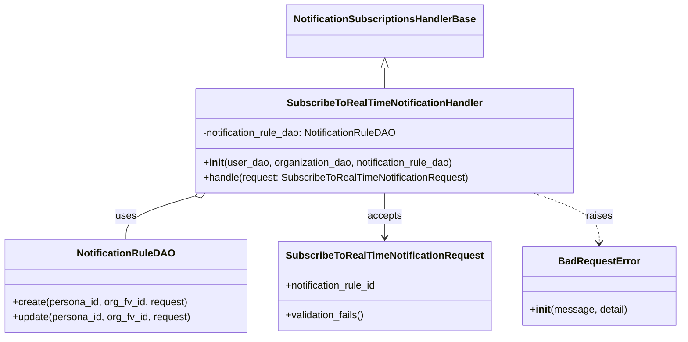
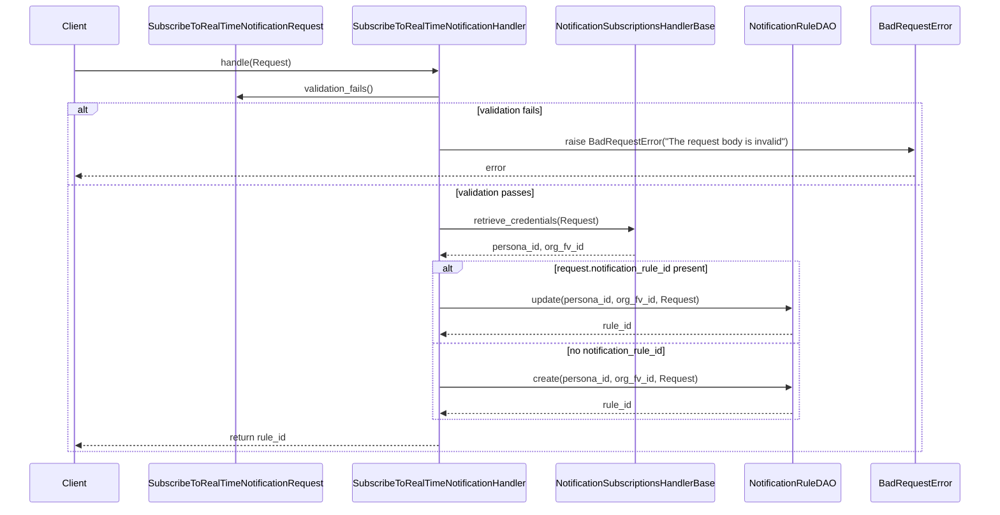

# Diagram: common/subscription_service/subscription_service/v2/service/subscribe_to_real_time_notification_handler.py

> Auto-generated by Obscura crawlers

## Diagram 1

### SVG

<svg id="container" width="1071.6328125" xmlns="http://www.w3.org/2000/svg" class="classDiagram" height="542" viewBox="0 0 1071.6328125 542" role="graphics-document document" aria-roledescription="class"><g><defs><marker id="container_class-aggregationStart" class="marker aggregation class" refX="18" refY="7" markerWidth="190" markerHeight="240" orient="auto"><path d="M 18,7 L9,13 L1,7 L9,1 Z"></path></marker></defs><defs><marker id="container_class-aggregationEnd" class="marker aggregation class" refX="1" refY="7" markerWidth="20" markerHeight="28" orient="auto"><path d="M 18,7 L9,13 L1,7 L9,1 Z"></path></marker></defs><defs><marker id="container_class-extensionStart" class="marker extension class" refX="18" refY="7" markerWidth="190" markerHeight="240" orient="auto"><path d="M 1,7 L18,13 V 1 Z"></path></marker></defs><defs><marker id="container_class-extensionEnd" class="marker extension class" refX="1" refY="7" markerWidth="20" markerHeight="28" orient="auto"><path d="M 1,1 V 13 L18,7 Z"></path></marker></defs><defs><marker id="container_class-compositionStart" class="marker composition class" refX="18" refY="7" markerWidth="190" markerHeight="240" orient="auto"><path d="M 18,7 L9,13 L1,7 L9,1 Z"></path></marker></defs><defs><marker id="container_class-compositionEnd" class="marker composition class" refX="1" refY="7" markerWidth="20" markerHeight="28" orient="auto"><path d="M 18,7 L9,13 L1,7 L9,1 Z"></path></marker></defs><defs><marker id="container_class-dependencyStart" class="marker dependency class" refX="6" refY="7" markerWidth="190" markerHeight="240" orient="auto"><path d="M 5,7 L9,13 L1,7 L9,1 Z"></path></marker></defs><defs><marker id="container_class-dependencyEnd" class="marker dependency class" refX="13" refY="7" markerWidth="20" markerHeight="28" orient="auto"><path d="M 18,7 L9,13 L14,7 L9,1 Z"></path></marker></defs><defs><marker id="container_class-lollipopStart" class="marker lollipop class" refX="13" refY="7" markerWidth="190" markerHeight="240" orient="auto"><circle stroke="black" fill="transparent" cx="7" cy="7" r="6"></circle></marker></defs><defs><marker id="container_class-lollipopEnd" class="marker lollipop class" refX="1" refY="7" markerWidth="190" markerHeight="240" orient="auto"><circle stroke="black" fill="transparent" cx="7" cy="7" r="6"></circle></marker></defs><g class="root"><g class="clusters"></g><g class="edgePaths"><path d="M609.125,109.25L609.125,110.542C609.125,111.833,609.125,114.417,609.125,119.875C609.125,125.333,609.125,133.667,609.125,137.833L609.125,142" id="id_NotificationSubscriptionsHandlerBase_SubscribeToRealTimeNotificationHandler_1" class="edge-thickness-normal edge-pattern-solid relation" style=";;;" data-edge="true" data-et="edge" data-id="id_NotificationSubscriptionsHandlerBase_SubscribeToRealTimeNotificationHandler_1" data-points="W3sieCI6NjA5LjEyNSwieSI6OTJ9LHsieCI6NjA5LjEyNSwieSI6MTE3fSx7IngiOjYwOS4xMjUsInkiOjE0Mn1d" marker-start="url(#container_class-extensionStart)"></path><path d="M309.906,314.914L291.909,320.261C273.912,325.609,237.919,336.305,219.922,347.819C201.926,359.333,201.926,371.667,201.926,377.833L201.926,384" id="id_SubscribeToRealTimeNotificationHandler_NotificationRuleDAO_2" class="edge-thickness-normal edge-pattern-solid relation" style=";;;" data-edge="true" data-et="edge" data-id="id_SubscribeToRealTimeNotificationHandler_NotificationRuleDAO_2" data-points="W3sieCI6MzI2LjQ0MTI0NDgzNDcxMDc0LCJ5IjozMTB9LHsieCI6MjAxLjkyNTc4MTI1LCJ5IjozNDd9LHsieCI6MjAxLjkyNTc4MTI1LCJ5IjozODR9XQ==" marker-start="url(#container_class-aggregationStart)"></path><path d="M609.125,310L609.125,316.167C609.125,322.333,609.125,334.667,609.125,346.5C609.125,358.333,609.125,369.667,609.125,375.333L609.125,381" id="id_SubscribeToRealTimeNotificationHandler_SubscribeToRealTimeNotificationRequest_3" class="edge-thickness-normal edge-pattern-solid relation" style=";;;" data-edge="true" data-et="edge" data-id="id_SubscribeToRealTimeNotificationHandler_SubscribeToRealTimeNotificationRequest_3" data-points="W3sieCI6NjA5LjEyNSwieSI6MzEwfSx7IngiOjYwOS4xMjUsInkiOjM0N30seyJ4Ijo2MDkuMTI1LCJ5IjozODd9XQ==" marker-end="url(#container_class-dependencyEnd)"></path><path d="M840.917,310L857.933,316.167C874.95,322.333,908.983,334.667,925.999,348C943.016,361.333,943.016,375.667,943.016,382.833L943.016,390" id="id_SubscribeToRealTimeNotificationHandler_BadRequestError_4" class="edge-thickness-normal edge-pattern-dashed relation" style=";;;" data-edge="true" data-et="edge" data-id="id_SubscribeToRealTimeNotificationHandler_BadRequestError_4" data-points="W3sieCI6ODQwLjkxNjgzODg0Mjk3NTMsInkiOjMxMH0seyJ4Ijo5NDMuMDE1NjI1LCJ5IjozNDd9LHsieCI6OTQzLjAxNTYyNSwieSI6Mzk2fV0=" marker-end="url(#container_class-dependencyEnd)"></path></g><g class="edgeLabels"><g class="edgeLabel"><g class="label" data-id="id_NotificationSubscriptionsHandlerBase_SubscribeToRealTimeNotificationHandler_1" transform="translate(0, 0)"><foreignObject width="0" height="0">

</foreignObject></g></g><g class="edgeLabel" transform="translate(201.92578125, 347)"><g class="label" data-id="id_SubscribeToRealTimeNotificationHandler_NotificationRuleDAO_2" transform="translate(-16.4921875, -12)"><foreignObject width="32.984375" height="24">

uses

</foreignObject></g></g><g class="edgeLabel" transform="translate(609.125, 347)"><g class="label" data-id="id_SubscribeToRealTimeNotificationHandler_SubscribeToRealTimeNotificationRequest_3" transform="translate(-27.421875, -12)"><foreignObject width="54.84375" height="24">

accepts

</foreignObject></g></g><g class="edgeLabel" transform="translate(943.015625, 347)"><g class="label" data-id="id_SubscribeToRealTimeNotificationHandler_BadRequestError_4" transform="translate(-21.25, -12)"><foreignObject width="42.5" height="24">

raises

</foreignObject></g></g></g><g class="nodes"><g class="node default" id="classId-NotificationSubscriptionsHandlerBase-0" transform="translate(609.125, 50)"><g class="basic label-container"><path d="M-151.8515625 -42 L151.8515625 -42 L151.8515625 42 L-151.8515625 42" stroke="none" stroke-width="0" fill="#ECECFF" style=""></path><path d="M-151.8515625 -42 C-84.35331366520097 -42, -16.855064830401943 -42, 151.8515625 -42 M-151.8515625 -42 C-59.508046679070006 -42, 32.83546914185999 -42, 151.8515625 -42 M151.8515625 -42 C151.8515625 -20.23691843511325, 151.8515625 1.5261631297735008, 151.8515625 42 M151.8515625 -42 C151.8515625 -9.55042695101217, 151.8515625 22.89914609797566, 151.8515625 42 M151.8515625 42 C36.670483290023 42, -78.510595919954 42, -151.8515625 42 M151.8515625 42 C86.18352457183028 42, 20.51548664366055 42, -151.8515625 42 M-151.8515625 42 C-151.8515625 23.510270648185415, -151.8515625 5.02054129637083, -151.8515625 -42 M-151.8515625 42 C-151.8515625 19.79428634483898, -151.8515625 -2.41142731032204, -151.8515625 -42" stroke="#9370DB" stroke-width="1.3" fill="none" stroke-dasharray="0 0" style=""></path></g><g class="annotation-group text" transform="translate(0, -18)"></g><g class="label-group text" transform="translate(-139.8515625, -18)"><g class="label" style="font-weight: bolder" transform="translate(0,-12)"><foreignObject width="279.703125" height="24">

NotificationSubscriptionsHandlerBase

</foreignObject></g></g><g class="members-group text" transform="translate(-139.8515625, 30)"></g><g class="methods-group text" transform="translate(-139.8515625, 60)"></g><g class="divider" style=""><path d="M-151.8515625 6 C-60.04984349885967 6, 31.751875502280654 6, 151.8515625 6 M-151.8515625 6 C-75.58171821022442 6, 0.6881260795511537 6, 151.8515625 6" stroke="#9370DB" stroke-width="1.3" fill="none" stroke-dasharray="0 0" style=""></path></g><g class="divider" style=""><path d="M-151.8515625 24 C-65.37041353514445 24, 21.1107354297111 24, 151.8515625 24 M-151.8515625 24 C-85.66865712217563 24, -19.485751744351262 24, 151.8515625 24" stroke="#9370DB" stroke-width="1.3" fill="none" stroke-dasharray="0 0" style=""></path></g></g><g class="node default" id="classId-SubscribeToRealTimeNotificationHandler-1" transform="translate(609.125, 226)"><g class="basic label-container"><path d="M-302.6171875 -84 L302.6171875 -84 L302.6171875 84 L-302.6171875 84" stroke="none" stroke-width="0" fill="#ECECFF" style=""></path><path d="M-302.6171875 -84 C-180.8869458699157 -84, -59.15670423983141 -84, 302.6171875 -84 M-302.6171875 -84 C-161.37176206708713 -84, -20.126336634174265 -84, 302.6171875 -84 M302.6171875 -84 C302.6171875 -34.30605135933046, 302.6171875 15.387897281339079, 302.6171875 84 M302.6171875 -84 C302.6171875 -29.081025735801482, 302.6171875 25.837948528397035, 302.6171875 84 M302.6171875 84 C111.794165637677 84, -79.028856224646 84, -302.6171875 84 M302.6171875 84 C85.13114953766274 84, -132.35488842467453 84, -302.6171875 84 M-302.6171875 84 C-302.6171875 41.35279499825919, -302.6171875 -1.294410003481616, -302.6171875 -84 M-302.6171875 84 C-302.6171875 50.39283105263701, -302.6171875 16.785662105274014, -302.6171875 -84" stroke="#9370DB" stroke-width="1.3" fill="none" stroke-dasharray="0 0" style=""></path></g><g class="annotation-group text" transform="translate(0, -60)"></g><g class="label-group text" transform="translate(-150.390625, -60)"><g class="label" style="font-weight: bolder" transform="translate(0,-12)"><foreignObject width="300.78125" height="24">

SubscribeToRealTimeNotificationHandler

</foreignObject></g></g><g class="members-group text" transform="translate(-290.6171875, -12)"><g class="label" style="" transform="translate(0,-12)"><foreignObject width="317.875" height="24">

-notification_rule_dao: NotificationRuleDAO

</foreignObject></g></g><g class="methods-group text" transform="translate(-290.6171875, 36)"><g class="label" style="" transform="translate(0,-12)"><foreignObject width="406.46875" height="24">

+<strong>init</strong>(user_dao, organization_dao, notification_rule_dao)

</foreignObject></g><g class="label" style="" transform="translate(0,12)"><foreignObject width="430.84375" height="24">

+handle(request: SubscribeToRealTimeNotificationRequest)

</foreignObject></g></g><g class="divider" style=""><path d="M-302.6171875 -36 C-176.08120295451664 -36, -49.54521840903328 -36, 302.6171875 -36 M-302.6171875 -36 C-98.3902567239495 -36, 105.83667405210099 -36, 302.6171875 -36" stroke="#9370DB" stroke-width="1.3" fill="none" stroke-dasharray="0 0" style=""></path></g><g class="divider" style=""><path d="M-302.6171875 12 C-69.28272857713401 12, 164.05173034573198 12, 302.6171875 12 M-302.6171875 12 C-133.47550351610093 12, 35.66618046779814 12, 302.6171875 12" stroke="#9370DB" stroke-width="1.3" fill="none" stroke-dasharray="0 0" style=""></path></g></g><g class="node default" id="classId-NotificationRuleDAO-2" transform="translate(201.92578125, 459)"><g class="basic label-container"><path d="M-193.92578125 -75 L193.92578125 -75 L193.92578125 75 L-193.92578125 75" stroke="none" stroke-width="0" fill="#ECECFF" style=""></path><path d="M-193.92578125 -75 C-109.69840162932671 -75, -25.47102200865342 -75, 193.92578125 -75 M-193.92578125 -75 C-49.760149385678034 -75, 94.40548247864393 -75, 193.92578125 -75 M193.92578125 -75 C193.92578125 -16.87932471261331, 193.92578125 41.24135057477338, 193.92578125 75 M193.92578125 -75 C193.92578125 -38.03957832998557, 193.92578125 -1.079156659971133, 193.92578125 75 M193.92578125 75 C93.06520273279476 75, -7.795375784410481 75, -193.92578125 75 M193.92578125 75 C58.11026542270662 75, -77.70525040458676 75, -193.92578125 75 M-193.92578125 75 C-193.92578125 23.021098862686088, -193.92578125 -28.957802274627824, -193.92578125 -75 M-193.92578125 75 C-193.92578125 28.363189470640535, -193.92578125 -18.27362105871893, -193.92578125 -75" stroke="#9370DB" stroke-width="1.3" fill="none" stroke-dasharray="0 0" style=""></path></g><g class="annotation-group text" transform="translate(0, -51)"></g><g class="label-group text" transform="translate(-74.4453125, -51)"><g class="label" style="font-weight: bolder" transform="translate(0,-12)"><foreignObject width="148.890625" height="24">

NotificationRuleDAO

</foreignObject></g></g><g class="members-group text" transform="translate(-181.92578125, -3)"></g><g class="methods-group text" transform="translate(-181.92578125, 27)"><g class="label" style="" transform="translate(0,-12)"><foreignObject width="282.921875" height="24">

+create(persona_id, org_fv_id, request)

</foreignObject></g><g class="label" style="" transform="translate(0,12)"><foreignObject width="289.40625" height="24">

+update(persona_id, org_fv_id, request)

</foreignObject></g></g><g class="divider" style=""><path d="M-193.92578125 -27 C-52.64659019838621 -27, 88.63260085322759 -27, 193.92578125 -27 M-193.92578125 -27 C-110.61455157276552 -27, -27.30332189553104 -27, 193.92578125 -27" stroke="#9370DB" stroke-width="1.3" fill="none" stroke-dasharray="0 0" style=""></path></g><g class="divider" style=""><path d="M-193.92578125 -3 C-93.77751023316769 -3, 6.370760783664622 -3, 193.92578125 -3 M-193.92578125 -3 C-45.41867762044217 -3, 103.08842600911566 -3, 193.92578125 -3" stroke="#9370DB" stroke-width="1.3" fill="none" stroke-dasharray="0 0" style=""></path></g></g><g class="node default" id="classId-SubscribeToRealTimeNotificationRequest-3" transform="translate(609.125, 459)"><g class="basic label-container"><path d="M-163.2734375 -72 L163.2734375 -72 L163.2734375 72 L-163.2734375 72" stroke="none" stroke-width="0" fill="#ECECFF" style=""></path><path d="M-163.2734375 -72 C-35.63599329179566 -72, 92.00145091640869 -72, 163.2734375 -72 M-163.2734375 -72 C-38.76941493206115 -72, 85.7346076358777 -72, 163.2734375 -72 M163.2734375 -72 C163.2734375 -37.350826322511196, 163.2734375 -2.701652645022392, 163.2734375 72 M163.2734375 -72 C163.2734375 -17.650730805475625, 163.2734375 36.69853838904875, 163.2734375 72 M163.2734375 72 C36.977614053514316 72, -89.31820939297137 72, -163.2734375 72 M163.2734375 72 C48.59320562036764 72, -66.08702625926472 72, -163.2734375 72 M-163.2734375 72 C-163.2734375 28.483786583027204, -163.2734375 -15.032426833945593, -163.2734375 -72 M-163.2734375 72 C-163.2734375 40.001954415495476, -163.2734375 8.003908830990945, -163.2734375 -72" stroke="#9370DB" stroke-width="1.3" fill="none" stroke-dasharray="0 0" style=""></path></g><g class="annotation-group text" transform="translate(0, -48)"></g><g class="label-group text" transform="translate(-151.2734375, -48)"><g class="label" style="font-weight: bolder" transform="translate(0,-12)"><foreignObject width="302.546875" height="24">

SubscribeToRealTimeNotificationRequest

</foreignObject></g></g><g class="members-group text" transform="translate(-151.2734375, 0)"><g class="label" style="" transform="translate(0,-12)"><foreignObject width="150.609375" height="24">

+notification_rule_id

</foreignObject></g></g><g class="methods-group text" transform="translate(-151.2734375, 48)"><g class="label" style="" transform="translate(0,-12)"><foreignObject width="129.21875" height="24">

+validation_fails()

</foreignObject></g></g><g class="divider" style=""><path d="M-163.2734375 -24 C-63.99750879790993 -24, 35.27841990418014 -24, 163.2734375 -24 M-163.2734375 -24 C-79.61273682443836 -24, 4.047963851123285 -24, 163.2734375 -24" stroke="#9370DB" stroke-width="1.3" fill="none" stroke-dasharray="0 0" style=""></path></g><g class="divider" style=""><path d="M-163.2734375 24 C-44.76818962648457 24, 73.73705824703086 24, 163.2734375 24 M-163.2734375 24 C-76.2829422740858 24, 10.707552951828404 24, 163.2734375 24" stroke="#9370DB" stroke-width="1.3" fill="none" stroke-dasharray="0 0" style=""></path></g></g><g class="node default" id="classId-BadRequestError-4" transform="translate(943.015625, 459)"><g class="basic label-container"><path d="M-120.6171875 -63 L120.6171875 -63 L120.6171875 63 L-120.6171875 63" stroke="none" stroke-width="0" fill="#ECECFF" style=""></path><path d="M-120.6171875 -63 C-56.45767710424404 -63, 7.701833291511917 -63, 120.6171875 -63 M-120.6171875 -63 C-56.41276977157172 -63, 7.791647956856565 -63, 120.6171875 -63 M120.6171875 -63 C120.6171875 -12.834088765304493, 120.6171875 37.331822469391014, 120.6171875 63 M120.6171875 -63 C120.6171875 -17.69173816861995, 120.6171875 27.616523662760102, 120.6171875 63 M120.6171875 63 C58.76775559955456 63, -3.0816763008908765 63, -120.6171875 63 M120.6171875 63 C40.109362129052286 63, -40.39846324189543 63, -120.6171875 63 M-120.6171875 63 C-120.6171875 28.692577633487467, -120.6171875 -5.614844733025066, -120.6171875 -63 M-120.6171875 63 C-120.6171875 26.411756788232537, -120.6171875 -10.176486423534925, -120.6171875 -63" stroke="#9370DB" stroke-width="1.3" fill="none" stroke-dasharray="0 0" style=""></path></g><g class="annotation-group text" transform="translate(0, -39)"></g><g class="label-group text" transform="translate(-62.28125, -39)"><g class="label" style="font-weight: bolder" transform="translate(0,-12)"><foreignObject width="124.5625" height="24">

BadRequestError

</foreignObject></g></g><g class="members-group text" transform="translate(-108.6171875, 9)"></g><g class="methods-group text" transform="translate(-108.6171875, 39)"><g class="label" style="" transform="translate(0,-12)"><foreignObject width="154.953125" height="24">

+<strong>init</strong>(message, detail)

</foreignObject></g></g><g class="divider" style=""><path d="M-120.6171875 -15 C-40.03826578468018 -15, 40.540655930639645 -15, 120.6171875 -15 M-120.6171875 -15 C-32.80095843988212 -15, 55.01527062023575 -15, 120.6171875 -15" stroke="#9370DB" stroke-width="1.3" fill="none" stroke-dasharray="0 0" style=""></path></g><g class="divider" style=""><path d="M-120.6171875 9 C-39.38618226340168 9, 41.84482297319664 9, 120.6171875 9 M-120.6171875 9 C-31.443874711484867 9, 57.72943807703027 9, 120.6171875 9" stroke="#9370DB" stroke-width="1.3" fill="none" stroke-dasharray="0 0" style=""></path></g></g></g></g></g></svg>

## Diagram 2

### SVG

<svg id="container" width="1753" xmlns="http://www.w3.org/2000/svg" height="899" viewBox="-50 -10 1753 899" role="graphics-document document" aria-roledescription="sequence"><g><rect x="1503" y="813" fill="#eaeaea" stroke="#666" width="150" height="65" name="Error" rx="3" ry="3" class="actor actor-bottom"></rect><text x="1578" y="845.5" dominant-baseline="central" alignment-baseline="central" class="actor actor-box" style="text-anchor: middle; font-size: 16px; font-weight: 400;"><tspan x="1578" dy="0">BadRequestError</tspan></text></g><g><rect x="1285" y="813" fill="#eaeaea" stroke="#666" width="168" height="65" name="DAO" rx="3" ry="3" class="actor actor-bottom"></rect><text x="1369" y="845.5" dominant-baseline="central" alignment-baseline="central" class="actor actor-box" style="text-anchor: middle; font-size: 16px; font-weight: 400;"><tspan x="1369" dy="0">NotificationRuleDAO</tspan></text></g><g><rect x="938" y="813" fill="#eaeaea" stroke="#666" width="297" height="65" name="Cred" rx="3" ry="3" class="actor actor-bottom"></rect><text x="1086.5" y="845.5" dominant-baseline="central" alignment-baseline="central" class="actor actor-box" style="text-anchor: middle; font-size: 16px; font-weight: 400;"><tspan x="1086.5" dy="0">NotificationSubscriptionsHandlerBase</tspan></text></g><g><rect x="569" y="813" fill="#eaeaea" stroke="#666" width="319" height="65" name="Handler" rx="3" ry="3" class="actor actor-bottom"></rect><text x="728.5" y="845.5" dominant-baseline="central" alignment-baseline="central" class="actor actor-box" style="text-anchor: middle; font-size: 16px; font-weight: 400;"><tspan x="728.5" dy="0">SubscribeToRealTimeNotificationHandler</tspan></text></g><g><rect x="200" y="813" fill="#eaeaea" stroke="#666" width="319" height="65" name="Request" rx="3" ry="3" class="actor actor-bottom"></rect><text x="359.5" y="845.5" dominant-baseline="central" alignment-baseline="central" class="actor actor-box" style="text-anchor: middle; font-size: 16px; font-weight: 400;"><tspan x="359.5" dy="0">SubscribeToRealTimeNotificationRequest</tspan></text></g><g><rect x="0" y="813" fill="#eaeaea" stroke="#666" width="150" height="65" name="Client" rx="3" ry="3" class="actor actor-bottom"></rect><text x="75" y="845.5" dominant-baseline="central" alignment-baseline="central" class="actor actor-box" style="text-anchor: middle; font-size: 16px; font-weight: 400;"><tspan x="75" dy="0">Client</tspan></text></g><g><line id="actor5" x1="1578" y1="65" x2="1578" y2="813" class="actor-line 200" stroke-width="0.5px" stroke="#999" name="Error"></line><g id="root-5"><rect x="1503" y="0" fill="#eaeaea" stroke="#666" width="150" height="65" name="Error" rx="3" ry="3" class="actor actor-top"></rect><text x="1578" y="32.5" dominant-baseline="central" alignment-baseline="central" class="actor actor-box" style="text-anchor: middle; font-size: 16px; font-weight: 400;"><tspan x="1578" dy="0">BadRequestError</tspan></text></g></g><g><line id="actor4" x1="1369" y1="65" x2="1369" y2="813" class="actor-line 200" stroke-width="0.5px" stroke="#999" name="DAO"></line><g id="root-4"><rect x="1285" y="0" fill="#eaeaea" stroke="#666" width="168" height="65" name="DAO" rx="3" ry="3" class="actor actor-top"></rect><text x="1369" y="32.5" dominant-baseline="central" alignment-baseline="central" class="actor actor-box" style="text-anchor: middle; font-size: 16px; font-weight: 400;"><tspan x="1369" dy="0">NotificationRuleDAO</tspan></text></g></g><g><line id="actor3" x1="1086.5" y1="65" x2="1086.5" y2="813" class="actor-line 200" stroke-width="0.5px" stroke="#999" name="Cred"></line><g id="root-3"><rect x="938" y="0" fill="#eaeaea" stroke="#666" width="297" height="65" name="Cred" rx="3" ry="3" class="actor actor-top"></rect><text x="1086.5" y="32.5" dominant-baseline="central" alignment-baseline="central" class="actor actor-box" style="text-anchor: middle; font-size: 16px; font-weight: 400;"><tspan x="1086.5" dy="0">NotificationSubscriptionsHandlerBase</tspan></text></g></g><g><line id="actor2" x1="728.5" y1="65" x2="728.5" y2="813" class="actor-line 200" stroke-width="0.5px" stroke="#999" name="Handler"></line><g id="root-2"><rect x="569" y="0" fill="#eaeaea" stroke="#666" width="319" height="65" name="Handler" rx="3" ry="3" class="actor actor-top"></rect><text x="728.5" y="32.5" dominant-baseline="central" alignment-baseline="central" class="actor actor-box" style="text-anchor: middle; font-size: 16px; font-weight: 400;"><tspan x="728.5" dy="0">SubscribeToRealTimeNotificationHandler</tspan></text></g></g><g><line id="actor1" x1="359.5" y1="65" x2="359.5" y2="813" class="actor-line 200" stroke-width="0.5px" stroke="#999" name="Request"></line><g id="root-1"><rect x="200" y="0" fill="#eaeaea" stroke="#666" width="319" height="65" name="Request" rx="3" ry="3" class="actor actor-top"></rect><text x="359.5" y="32.5" dominant-baseline="central" alignment-baseline="central" class="actor actor-box" style="text-anchor: middle; font-size: 16px; font-weight: 400;"><tspan x="359.5" dy="0">SubscribeToRealTimeNotificationRequest</tspan></text></g></g><g><line id="actor0" x1="75" y1="65" x2="75" y2="813" class="actor-line 200" stroke-width="0.5px" stroke="#999" name="Client"></line><g id="root-0"><rect x="0" y="0" fill="#eaeaea" stroke="#666" width="150" height="65" name="Client" rx="3" ry="3" class="actor actor-top"></rect><text x="75" y="32.5" dominant-baseline="central" alignment-baseline="central" class="actor actor-box" style="text-anchor: middle; font-size: 16px; font-weight: 400;"><tspan x="75" dy="0">Client</tspan></text></g></g><g></g><defs><symbol id="computer" width="24" height="24"><path transform="scale(.5)" d="M2 2v13h20v-13h-20zm18 11h-16v-9h16v9zm-10.228 6l.466-1h3.524l.467 1h-4.457zm14.228 3h-24l2-6h2.104l-1.33 4h18.45l-1.297-4h2.073l2 6zm-5-10h-14v-7h14v7z"></path></symbol></defs><defs><symbol id="database" fill-rule="evenodd" clip-rule="evenodd"><path transform="scale(.5)" d="M12.258.001l.256.004.255.005.253.008.251.01.249.012.247.015.246.016.242.019.241.02.239.023.236.024.233.027.231.028.229.031.225.032.223.034.22.036.217.038.214.04.211.041.208.043.205.045.201.046.198.048.194.05.191.051.187.053.183.054.18.056.175.057.172.059.168.06.163.061.16.063.155.064.15.066.074.033.073.033.071.034.07.034.069.035.068.035.067.035.066.035.064.036.064.036.062.036.06.036.06.037.058.037.058.037.055.038.055.038.053.038.052.038.051.039.05.039.048.039.047.039.045.04.044.04.043.04.041.04.04.041.039.041.037.041.036.041.034.041.033.042.032.042.03.042.029.042.027.042.026.043.024.043.023.043.021.043.02.043.018.044.017.043.015.044.013.044.012.044.011.045.009.044.007.045.006.045.004.045.002.045.001.045v17l-.001.045-.002.045-.004.045-.006.045-.007.045-.009.044-.011.045-.012.044-.013.044-.015.044-.017.043-.018.044-.02.043-.021.043-.023.043-.024.043-.026.043-.027.042-.029.042-.03.042-.032.042-.033.042-.034.041-.036.041-.037.041-.039.041-.04.041-.041.04-.043.04-.044.04-.045.04-.047.039-.048.039-.05.039-.051.039-.052.038-.053.038-.055.038-.055.038-.058.037-.058.037-.06.037-.06.036-.062.036-.064.036-.064.036-.066.035-.067.035-.068.035-.069.035-.07.034-.071.034-.073.033-.074.033-.15.066-.155.064-.16.063-.163.061-.168.06-.172.059-.175.057-.18.056-.183.054-.187.053-.191.051-.194.05-.198.048-.201.046-.205.045-.208.043-.211.041-.214.04-.217.038-.22.036-.223.034-.225.032-.229.031-.231.028-.233.027-.236.024-.239.023-.241.02-.242.019-.246.016-.247.015-.249.012-.251.01-.253.008-.255.005-.256.004-.258.001-.258-.001-.256-.004-.255-.005-.253-.008-.251-.01-.249-.012-.247-.015-.245-.016-.243-.019-.241-.02-.238-.023-.236-.024-.234-.027-.231-.028-.228-.031-.226-.032-.223-.034-.22-.036-.217-.038-.214-.04-.211-.041-.208-.043-.204-.045-.201-.046-.198-.048-.195-.05-.19-.051-.187-.053-.184-.054-.179-.056-.176-.057-.172-.059-.167-.06-.164-.061-.159-.063-.155-.064-.151-.066-.074-.033-.072-.033-.072-.034-.07-.034-.069-.035-.068-.035-.067-.035-.066-.035-.064-.036-.063-.036-.062-.036-.061-.036-.06-.037-.058-.037-.057-.037-.056-.038-.055-.038-.053-.038-.052-.038-.051-.039-.049-.039-.049-.039-.046-.039-.046-.04-.044-.04-.043-.04-.041-.04-.04-.041-.039-.041-.037-.041-.036-.041-.034-.041-.033-.042-.032-.042-.03-.042-.029-.042-.027-.042-.026-.043-.024-.043-.023-.043-.021-.043-.02-.043-.018-.044-.017-.043-.015-.044-.013-.044-.012-.044-.011-.045-.009-.044-.007-.045-.006-.045-.004-.045-.002-.045-.001-.045v-17l.001-.045.002-.045.004-.045.006-.045.007-.045.009-.044.011-.045.012-.044.013-.044.015-.044.017-.043.018-.044.02-.043.021-.043.023-.043.024-.043.026-.043.027-.042.029-.042.03-.042.032-.042.033-.042.034-.041.036-.041.037-.041.039-.041.04-.041.041-.04.043-.04.044-.04.046-.04.046-.039.049-.039.049-.039.051-.039.052-.038.053-.038.055-.038.056-.038.057-.037.058-.037.06-.037.061-.036.062-.036.063-.036.064-.036.066-.035.067-.035.068-.035.069-.035.07-.034.072-.034.072-.033.074-.033.151-.066.155-.064.159-.063.164-.061.167-.06.172-.059.176-.057.179-.056.184-.054.187-.053.19-.051.195-.05.198-.048.201-.046.204-.045.208-.043.211-.041.214-.04.217-.038.22-.036.223-.034.226-.032.228-.031.231-.028.234-.027.236-.024.238-.023.241-.02.243-.019.245-.016.247-.015.249-.012.251-.01.253-.008.255-.005.256-.004.258-.001.258.001zm-9.258 20.499v.01l.001.021.003.021.004.022.005.021.006.022.007.022.009.023.01.022.011.023.012.023.013.023.015.023.016.024.017.023.018.024.019.024.021.024.022.025.023.024.024.025.052.049.056.05.061.051.066.051.07.051.075.051.079.052.084.052.088.052.092.052.097.052.102.051.105.052.11.052.114.051.119.051.123.051.127.05.131.05.135.05.139.048.144.049.147.047.152.047.155.047.16.045.163.045.167.043.171.043.176.041.178.041.183.039.187.039.19.037.194.035.197.035.202.033.204.031.209.03.212.029.216.027.219.025.222.024.226.021.23.02.233.018.236.016.24.015.243.012.246.01.249.008.253.005.256.004.259.001.26-.001.257-.004.254-.005.25-.008.247-.011.244-.012.241-.014.237-.016.233-.018.231-.021.226-.021.224-.024.22-.026.216-.027.212-.028.21-.031.205-.031.202-.034.198-.034.194-.036.191-.037.187-.039.183-.04.179-.04.175-.042.172-.043.168-.044.163-.045.16-.046.155-.046.152-.047.148-.048.143-.049.139-.049.136-.05.131-.05.126-.05.123-.051.118-.052.114-.051.11-.052.106-.052.101-.052.096-.052.092-.052.088-.053.083-.051.079-.052.074-.052.07-.051.065-.051.06-.051.056-.05.051-.05.023-.024.023-.025.021-.024.02-.024.019-.024.018-.024.017-.024.015-.023.014-.024.013-.023.012-.023.01-.023.01-.022.008-.022.006-.022.006-.022.004-.022.004-.021.001-.021.001-.021v-4.127l-.077.055-.08.053-.083.054-.085.053-.087.052-.09.052-.093.051-.095.05-.097.05-.1.049-.102.049-.105.048-.106.047-.109.047-.111.046-.114.045-.115.045-.118.044-.12.043-.122.042-.124.042-.126.041-.128.04-.13.04-.132.038-.134.038-.135.037-.138.037-.139.035-.142.035-.143.034-.144.033-.147.032-.148.031-.15.03-.151.03-.153.029-.154.027-.156.027-.158.026-.159.025-.161.024-.162.023-.163.022-.165.021-.166.02-.167.019-.169.018-.169.017-.171.016-.173.015-.173.014-.175.013-.175.012-.177.011-.178.01-.179.008-.179.008-.181.006-.182.005-.182.004-.184.003-.184.002h-.37l-.184-.002-.184-.003-.182-.004-.182-.005-.181-.006-.179-.008-.179-.008-.178-.01-.176-.011-.176-.012-.175-.013-.173-.014-.172-.015-.171-.016-.17-.017-.169-.018-.167-.019-.166-.02-.165-.021-.163-.022-.162-.023-.161-.024-.159-.025-.157-.026-.156-.027-.155-.027-.153-.029-.151-.03-.15-.03-.148-.031-.146-.032-.145-.033-.143-.034-.141-.035-.14-.035-.137-.037-.136-.037-.134-.038-.132-.038-.13-.04-.128-.04-.126-.041-.124-.042-.122-.042-.12-.044-.117-.043-.116-.045-.113-.045-.112-.046-.109-.047-.106-.047-.105-.048-.102-.049-.1-.049-.097-.05-.095-.05-.093-.052-.09-.051-.087-.052-.085-.053-.083-.054-.08-.054-.077-.054v4.127zm0-5.654v.011l.001.021.003.021.004.021.005.022.006.022.007.022.009.022.01.022.011.023.012.023.013.023.015.024.016.023.017.024.018.024.019.024.021.024.022.024.023.025.024.024.052.05.056.05.061.05.066.051.07.051.075.052.079.051.084.052.088.052.092.052.097.052.102.052.105.052.11.051.114.051.119.052.123.05.127.051.131.05.135.049.139.049.144.048.147.048.152.047.155.046.16.045.163.045.167.044.171.042.176.042.178.04.183.04.187.038.19.037.194.036.197.034.202.033.204.032.209.03.212.028.216.027.219.025.222.024.226.022.23.02.233.018.236.016.24.014.243.012.246.01.249.008.253.006.256.003.259.001.26-.001.257-.003.254-.006.25-.008.247-.01.244-.012.241-.015.237-.016.233-.018.231-.02.226-.022.224-.024.22-.025.216-.027.212-.029.21-.03.205-.032.202-.033.198-.035.194-.036.191-.037.187-.039.183-.039.179-.041.175-.042.172-.043.168-.044.163-.045.16-.045.155-.047.152-.047.148-.048.143-.048.139-.05.136-.049.131-.05.126-.051.123-.051.118-.051.114-.052.11-.052.106-.052.101-.052.096-.052.092-.052.088-.052.083-.052.079-.052.074-.051.07-.052.065-.051.06-.05.056-.051.051-.049.023-.025.023-.024.021-.025.02-.024.019-.024.018-.024.017-.024.015-.023.014-.023.013-.024.012-.022.01-.023.01-.023.008-.022.006-.022.006-.022.004-.021.004-.022.001-.021.001-.021v-4.139l-.077.054-.08.054-.083.054-.085.052-.087.053-.09.051-.093.051-.095.051-.097.05-.1.049-.102.049-.105.048-.106.047-.109.047-.111.046-.114.045-.115.044-.118.044-.12.044-.122.042-.124.042-.126.041-.128.04-.13.039-.132.039-.134.038-.135.037-.138.036-.139.036-.142.035-.143.033-.144.033-.147.033-.148.031-.15.03-.151.03-.153.028-.154.028-.156.027-.158.026-.159.025-.161.024-.162.023-.163.022-.165.021-.166.02-.167.019-.169.018-.169.017-.171.016-.173.015-.173.014-.175.013-.175.012-.177.011-.178.009-.179.009-.179.007-.181.007-.182.005-.182.004-.184.003-.184.002h-.37l-.184-.002-.184-.003-.182-.004-.182-.005-.181-.007-.179-.007-.179-.009-.178-.009-.176-.011-.176-.012-.175-.013-.173-.014-.172-.015-.171-.016-.17-.017-.169-.018-.167-.019-.166-.02-.165-.021-.163-.022-.162-.023-.161-.024-.159-.025-.157-.026-.156-.027-.155-.028-.153-.028-.151-.03-.15-.03-.148-.031-.146-.033-.145-.033-.143-.033-.141-.035-.14-.036-.137-.036-.136-.037-.134-.038-.132-.039-.13-.039-.128-.04-.126-.041-.124-.042-.122-.043-.12-.043-.117-.044-.116-.044-.113-.046-.112-.046-.109-.046-.106-.047-.105-.048-.102-.049-.1-.049-.097-.05-.095-.051-.093-.051-.09-.051-.087-.053-.085-.052-.083-.054-.08-.054-.077-.054v4.139zm0-5.666v.011l.001.02.003.022.004.021.005.022.006.021.007.022.009.023.01.022.011.023.012.023.013.023.015.023.016.024.017.024.018.023.019.024.021.025.022.024.023.024.024.025.052.05.056.05.061.05.066.051.07.051.075.052.079.051.084.052.088.052.092.052.097.052.102.052.105.051.11.052.114.051.119.051.123.051.127.05.131.05.135.05.139.049.144.048.147.048.152.047.155.046.16.045.163.045.167.043.171.043.176.042.178.04.183.04.187.038.19.037.194.036.197.034.202.033.204.032.209.03.212.028.216.027.219.025.222.024.226.021.23.02.233.018.236.017.24.014.243.012.246.01.249.008.253.006.256.003.259.001.26-.001.257-.003.254-.006.25-.008.247-.01.244-.013.241-.014.237-.016.233-.018.231-.02.226-.022.224-.024.22-.025.216-.027.212-.029.21-.03.205-.032.202-.033.198-.035.194-.036.191-.037.187-.039.183-.039.179-.041.175-.042.172-.043.168-.044.163-.045.16-.045.155-.047.152-.047.148-.048.143-.049.139-.049.136-.049.131-.051.126-.05.123-.051.118-.052.114-.051.11-.052.106-.052.101-.052.096-.052.092-.052.088-.052.083-.052.079-.052.074-.052.07-.051.065-.051.06-.051.056-.05.051-.049.023-.025.023-.025.021-.024.02-.024.019-.024.018-.024.017-.024.015-.023.014-.024.013-.023.012-.023.01-.022.01-.023.008-.022.006-.022.006-.022.004-.022.004-.021.001-.021.001-.021v-4.153l-.077.054-.08.054-.083.053-.085.053-.087.053-.09.051-.093.051-.095.051-.097.05-.1.049-.102.048-.105.048-.106.048-.109.046-.111.046-.114.046-.115.044-.118.044-.12.043-.122.043-.124.042-.126.041-.128.04-.13.039-.132.039-.134.038-.135.037-.138.036-.139.036-.142.034-.143.034-.144.033-.147.032-.148.032-.15.03-.151.03-.153.028-.154.028-.156.027-.158.026-.159.024-.161.024-.162.023-.163.023-.165.021-.166.02-.167.019-.169.018-.169.017-.171.016-.173.015-.173.014-.175.013-.175.012-.177.01-.178.01-.179.009-.179.007-.181.006-.182.006-.182.004-.184.003-.184.001-.185.001-.185-.001-.184-.001-.184-.003-.182-.004-.182-.006-.181-.006-.179-.007-.179-.009-.178-.01-.176-.01-.176-.012-.175-.013-.173-.014-.172-.015-.171-.016-.17-.017-.169-.018-.167-.019-.166-.02-.165-.021-.163-.023-.162-.023-.161-.024-.159-.024-.157-.026-.156-.027-.155-.028-.153-.028-.151-.03-.15-.03-.148-.032-.146-.032-.145-.033-.143-.034-.141-.034-.14-.036-.137-.036-.136-.037-.134-.038-.132-.039-.13-.039-.128-.041-.126-.041-.124-.041-.122-.043-.12-.043-.117-.044-.116-.044-.113-.046-.112-.046-.109-.046-.106-.048-.105-.048-.102-.048-.1-.05-.097-.049-.095-.051-.093-.051-.09-.052-.087-.052-.085-.053-.083-.053-.08-.054-.077-.054v4.153zm8.74-8.179l-.257.004-.254.005-.25.008-.247.011-.244.012-.241.014-.237.016-.233.018-.231.021-.226.022-.224.023-.22.026-.216.027-.212.028-.21.031-.205.032-.202.033-.198.034-.194.036-.191.038-.187.038-.183.04-.179.041-.175.042-.172.043-.168.043-.163.045-.16.046-.155.046-.152.048-.148.048-.143.048-.139.049-.136.05-.131.05-.126.051-.123.051-.118.051-.114.052-.11.052-.106.052-.101.052-.096.052-.092.052-.088.052-.083.052-.079.052-.074.051-.07.052-.065.051-.06.05-.056.05-.051.05-.023.025-.023.024-.021.024-.02.025-.019.024-.018.024-.017.023-.015.024-.014.023-.013.023-.012.023-.01.023-.01.022-.008.022-.006.023-.006.021-.004.022-.004.021-.001.021-.001.021.001.021.001.021.004.021.004.022.006.021.006.023.008.022.01.022.01.023.012.023.013.023.014.023.015.024.017.023.018.024.019.024.02.025.021.024.023.024.023.025.051.05.056.05.06.05.065.051.07.052.074.051.079.052.083.052.088.052.092.052.096.052.101.052.106.052.11.052.114.052.118.051.123.051.126.051.131.05.136.05.139.049.143.048.148.048.152.048.155.046.16.046.163.045.168.043.172.043.175.042.179.041.183.04.187.038.191.038.194.036.198.034.202.033.205.032.21.031.212.028.216.027.22.026.224.023.226.022.231.021.233.018.237.016.241.014.244.012.247.011.25.008.254.005.257.004.26.001.26-.001.257-.004.254-.005.25-.008.247-.011.244-.012.241-.014.237-.016.233-.018.231-.021.226-.022.224-.023.22-.026.216-.027.212-.028.21-.031.205-.032.202-.033.198-.034.194-.036.191-.038.187-.038.183-.04.179-.041.175-.042.172-.043.168-.043.163-.045.16-.046.155-.046.152-.048.148-.048.143-.048.139-.049.136-.05.131-.05.126-.051.123-.051.118-.051.114-.052.11-.052.106-.052.101-.052.096-.052.092-.052.088-.052.083-.052.079-.052.074-.051.07-.052.065-.051.06-.05.056-.05.051-.05.023-.025.023-.024.021-.024.02-.025.019-.024.018-.024.017-.023.015-.024.014-.023.013-.023.012-.023.01-.023.01-.022.008-.022.006-.023.006-.021.004-.022.004-.021.001-.021.001-.021-.001-.021-.001-.021-.004-.021-.004-.022-.006-.021-.006-.023-.008-.022-.01-.022-.01-.023-.012-.023-.013-.023-.014-.023-.015-.024-.017-.023-.018-.024-.019-.024-.02-.025-.021-.024-.023-.024-.023-.025-.051-.05-.056-.05-.06-.05-.065-.051-.07-.052-.074-.051-.079-.052-.083-.052-.088-.052-.092-.052-.096-.052-.101-.052-.106-.052-.11-.052-.114-.052-.118-.051-.123-.051-.126-.051-.131-.05-.136-.05-.139-.049-.143-.048-.148-.048-.152-.048-.155-.046-.16-.046-.163-.045-.168-.043-.172-.043-.175-.042-.179-.041-.183-.04-.187-.038-.191-.038-.194-.036-.198-.034-.202-.033-.205-.032-.21-.031-.212-.028-.216-.027-.22-.026-.224-.023-.226-.022-.231-.021-.233-.018-.237-.016-.241-.014-.244-.012-.247-.011-.25-.008-.254-.005-.257-.004-.26-.001-.26.001z"></path></symbol></defs><defs><symbol id="clock" width="24" height="24"><path transform="scale(.5)" d="M12 2c5.514 0 10 4.486 10 10s-4.486 10-10 10-10-4.486-10-10 4.486-10 10-10zm0-2c-6.627 0-12 5.373-12 12s5.373 12 12 12 12-5.373 12-12-5.373-12-12-12zm5.848 12.459c.202.038.202.333.001.372-1.907.361-6.045 1.111-6.547 1.111-.719 0-1.301-.582-1.301-1.301 0-.512.77-5.447 1.125-7.445.034-.192.312-.181.343.014l.985 6.238 5.394 1.011z"></path></symbol></defs><defs><marker id="arrowhead" refX="7.9" refY="5" markerUnits="userSpaceOnUse" markerWidth="12" markerHeight="12" orient="auto-start-reverse"><path d="M -1 0 L 10 5 L 0 10 z"></path></marker></defs><defs><marker id="crosshead" markerWidth="15" markerHeight="8" orient="auto" refX="4" refY="4.5"><path fill="none" stroke="#000000" stroke-width="1pt" d="M 1,2 L 6,7 M 6,2 L 1,7" style="stroke-dasharray: 0, 0;"></path></marker></defs><defs><marker id="filled-head" refX="15.5" refY="7" markerWidth="20" markerHeight="28" orient="auto"><path d="M 18,7 L9,13 L14,7 L9,1 Z"></path></marker></defs><defs><marker id="sequencenumber" refX="15" refY="15" markerWidth="60" markerHeight="40" orient="auto"><circle cx="15" cy="15" r="6"></circle></marker></defs><g><line x1="717.5" y1="453" x2="1380" y2="453" class="loopLine"></line><line x1="1380" y1="453" x2="1380" y2="735" class="loopLine"></line><line x1="717.5" y1="735" x2="1380" y2="735" class="loopLine"></line><line x1="717.5" y1="453" x2="717.5" y2="735" class="loopLine"></line><line x1="717.5" y1="599" x2="1380" y2="599" class="loopLine" style="stroke-dasharray: 3, 3;"></line><polygon points="717.5,453 767.5,453 767.5,466 759.1,473 717.5,473" class="labelBox"></polygon><text x="743" y="466" text-anchor="middle" dominant-baseline="middle" alignment-baseline="middle" class="labelText" style="font-size: 16px; font-weight: 400;">alt</text><text x="1073.75" y="471" text-anchor="middle" class="loopText" style="font-size: 16px; font-weight: 400;"><tspan x="1073.75">[request.notification_rule_id present]</tspan></text><text x="1048.75" y="617" text-anchor="middle" class="loopText" style="font-size: 16px; font-weight: 400;">[no notification_rule_id]</text></g><g><line x1="64" y1="171" x2="1589" y2="171" class="loopLine"></line><line x1="1589" y1="171" x2="1589" y2="793" class="loopLine"></line><line x1="64" y1="793" x2="1589" y2="793" class="loopLine"></line><line x1="64" y1="171" x2="64" y2="793" class="loopLine"></line><line x1="64" y1="317" x2="1589" y2="317" class="loopLine" style="stroke-dasharray: 3, 3;"></line><polygon points="64,171 114,171 114,184 105.6,191 64,191" class="labelBox"></polygon><text x="89" y="184" text-anchor="middle" dominant-baseline="middle" alignment-baseline="middle" class="labelText" style="font-size: 16px; font-weight: 400;">alt</text><text x="851.5" y="189" text-anchor="middle" class="loopText" style="font-size: 16px; font-weight: 400;"><tspan x="851.5">[validation fails]</tspan></text><text x="826.5" y="335" text-anchor="middle" class="loopText" style="font-size: 16px; font-weight: 400;">[validation passes]</text></g><text x="400" y="80" text-anchor="middle" dominant-baseline="middle" alignment-baseline="middle" class="messageText" dy="1em" style="font-size: 16px; font-weight: 400;">handle(Request)</text><line x1="76" y1="113" x2="724.5" y2="113" class="messageLine0" stroke-width="2" stroke="none" marker-end="url(#arrowhead)" style="fill: none;"></line><text x="546" y="128" text-anchor="middle" dominant-baseline="middle" alignment-baseline="middle" class="messageText" dy="1em" style="font-size: 16px; font-weight: 400;">validation_fails()</text><line x1="727.5" y1="161" x2="363.5" y2="161" class="messageLine0" stroke-width="2" stroke="none" marker-end="url(#arrowhead)" style="fill: none;"></line><text x="1152" y="221" text-anchor="middle" dominant-baseline="middle" alignment-baseline="middle" class="messageText" dy="1em" style="font-size: 16px; font-weight: 400;">raise BadRequestError("The request body is invalid")</text><line x1="729.5" y1="254" x2="1574" y2="254" class="messageLine0" stroke-width="2" stroke="none" marker-end="url(#arrowhead)" style="fill: none;"></line><text x="828" y="269" text-anchor="middle" dominant-baseline="middle" alignment-baseline="middle" class="messageText" dy="1em" style="font-size: 16px; font-weight: 400;">error</text><line x1="1577" y1="302" x2="79" y2="302" class="messageLine1" stroke-width="2" stroke="none" marker-end="url(#arrowhead)" style="stroke-dasharray: 3, 3; fill: none;"></line><text x="906" y="362" text-anchor="middle" dominant-baseline="middle" alignment-baseline="middle" class="messageText" dy="1em" style="font-size: 16px; font-weight: 400;">retrieve_credentials(Request)</text><line x1="729.5" y1="395" x2="1082.5" y2="395" class="messageLine0" stroke-width="2" stroke="none" marker-end="url(#arrowhead)" style="fill: none;"></line><text x="909" y="410" text-anchor="middle" dominant-baseline="middle" alignment-baseline="middle" class="messageText" dy="1em" style="font-size: 16px; font-weight: 400;">persona_id, org_fv_id</text><line x1="1085.5" y1="443" x2="732.5" y2="443" class="messageLine1" stroke-width="2" stroke="none" marker-end="url(#arrowhead)" style="stroke-dasharray: 3, 3; fill: none;"></line><text x="1047" y="503" text-anchor="middle" dominant-baseline="middle" alignment-baseline="middle" class="messageText" dy="1em" style="font-size: 16px; font-weight: 400;">update(persona_id, org_fv_id, Request)</text><line x1="729.5" y1="536" x2="1365" y2="536" class="messageLine0" stroke-width="2" stroke="none" marker-end="url(#arrowhead)" style="fill: none;"></line><text x="1050" y="551" text-anchor="middle" dominant-baseline="middle" alignment-baseline="middle" class="messageText" dy="1em" style="font-size: 16px; font-weight: 400;">rule_id</text><line x1="1368" y1="584" x2="732.5" y2="584" class="messageLine1" stroke-width="2" stroke="none" marker-end="url(#arrowhead)" style="stroke-dasharray: 3, 3; fill: none;"></line><text x="1047" y="644" text-anchor="middle" dominant-baseline="middle" alignment-baseline="middle" class="messageText" dy="1em" style="font-size: 16px; font-weight: 400;">create(persona_id, org_fv_id, Request)</text><line x1="729.5" y1="677" x2="1365" y2="677" class="messageLine0" stroke-width="2" stroke="none" marker-end="url(#arrowhead)" style="fill: none;"></line><text x="1050" y="692" text-anchor="middle" dominant-baseline="middle" alignment-baseline="middle" class="messageText" dy="1em" style="font-size: 16px; font-weight: 400;">rule_id</text><line x1="1368" y1="725" x2="732.5" y2="725" class="messageLine1" stroke-width="2" stroke="none" marker-end="url(#arrowhead)" style="stroke-dasharray: 3, 3; fill: none;"></line><text x="403" y="750" text-anchor="middle" dominant-baseline="middle" alignment-baseline="middle" class="messageText" dy="1em" style="font-size: 16px; font-weight: 400;">return rule_id</text><line x1="727.5" y1="783" x2="79" y2="783" class="messageLine1" stroke-width="2" stroke="none" marker-end="url(#arrowhead)" style="stroke-dasharray: 3, 3; fill: none;"></line></svg>
