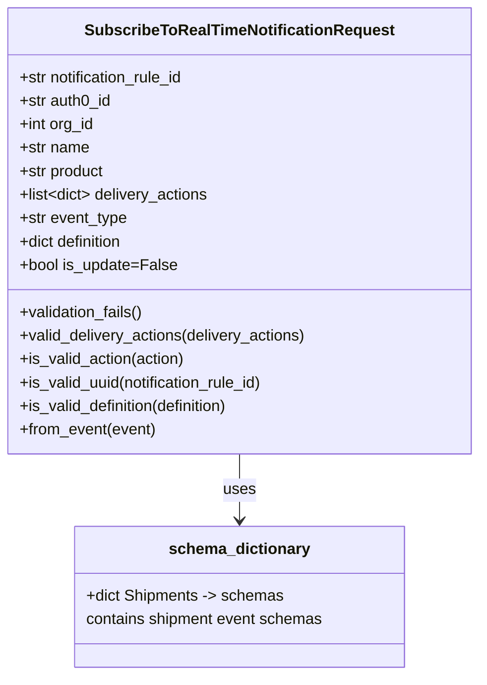

# Diagram: common/subscription_service/subscription_service/v2/service/subscribe_to_real_time_notification_request.py


> Auto-generated by Obscura crawlers

## Diagram 1



### SVG

<svg id="container" width="489.2265625" xmlns="http://www.w3.org/2000/svg" class="classDiagram" height="690" viewBox="0 0 489.2265625 690" role="graphics-document document" aria-roledescription="class"><style>#container{font-family:"trebuchet ms",verdana,arial,sans-serif;font-size:16px;fill:#333;}@keyframes edge-animation-frame{from{stroke-dashoffset:0;}}@keyframes dash{to{stroke-dashoffset:0;}}#container .edge-animation-slow{stroke-dasharray:9,5!important;stroke-dashoffset:900;animation:dash 50s linear infinite;stroke-linecap:round;}#container .edge-animation-fast{stroke-dasharray:9,5!important;stroke-dashoffset:900;animation:dash 20s linear infinite;stroke-linecap:round;}#container .error-icon{fill:#552222;}#container .error-text{fill:#552222;stroke:#552222;}#container .edge-thickness-normal{stroke-width:1px;}#container .edge-thickness-thick{stroke-width:3.5px;}#container .edge-pattern-solid{stroke-dasharray:0;}#container .edge-thickness-invisible{stroke-width:0;fill:none;}#container .edge-pattern-dashed{stroke-dasharray:3;}#container .edge-pattern-dotted{stroke-dasharray:2;}#container .marker{fill:#333333;stroke:#333333;}#container .marker.cross{stroke:#333333;}#container svg{font-family:"trebuchet ms",verdana,arial,sans-serif;font-size:16px;}#container p{margin:0;}#container g.classGroup text{fill:#9370DB;stroke:none;font-family:"trebuchet ms",verdana,arial,sans-serif;font-size:10px;}#container g.classGroup text .title{font-weight:bolder;}#container .nodeLabel,#container .edgeLabel{color:#131300;}#container .edgeLabel .label rect{fill:#ECECFF;}#container .label text{fill:#131300;}#container .labelBkg{background:#ECECFF;}#container .edgeLabel .label span{background:#ECECFF;}#container .classTitle{font-weight:bolder;}#container .node rect,#container .node circle,#container .node ellipse,#container .node polygon,#container .node path{fill:#ECECFF;stroke:#9370DB;stroke-width:1px;}#container .divider{stroke:#9370DB;stroke-width:1;}#container g.clickable{cursor:pointer;}#container g.classGroup rect{fill:#ECECFF;stroke:#9370DB;}#container g.classGroup line{stroke:#9370DB;stroke-width:1;}#container .classLabel .box{stroke:none;stroke-width:0;fill:#ECECFF;opacity:0.5;}#container .classLabel .label{fill:#9370DB;font-size:10px;}#container .relation{stroke:#333333;stroke-width:1;fill:none;}#container .dashed-line{stroke-dasharray:3;}#container .dotted-line{stroke-dasharray:1 2;}#container #compositionStart,#container .composition{fill:#333333!important;stroke:#333333!important;stroke-width:1;}#container #compositionEnd,#container .composition{fill:#333333!important;stroke:#333333!important;stroke-width:1;}#container #dependencyStart,#container .dependency{fill:#333333!important;stroke:#333333!important;stroke-width:1;}#container #dependencyStart,#container .dependency{fill:#333333!important;stroke:#333333!important;stroke-width:1;}#container #extensionStart,#container .extension{fill:transparent!important;stroke:#333333!important;stroke-width:1;}#container #extensionEnd,#container .extension{fill:transparent!important;stroke:#333333!important;stroke-width:1;}#container #aggregationStart,#container .aggregation{fill:transparent!important;stroke:#333333!important;stroke-width:1;}#container #aggregationEnd,#container .aggregation{fill:transparent!important;stroke:#333333!important;stroke-width:1;}#container #lollipopStart,#container .lollipop{fill:#ECECFF!important;stroke:#333333!important;stroke-width:1;}#container #lollipopEnd,#container .lollipop{fill:#ECECFF!important;stroke:#333333!important;stroke-width:1;}#container .edgeTerminals{font-size:11px;line-height:initial;}#container .classTitleText{text-anchor:middle;font-size:18px;fill:#333;}#container .label-icon{display:inline-block;height:1em;overflow:visible;vertical-align:-0.125em;}#container .node .label-icon path{fill:currentColor;stroke:revert;stroke-width:revert;}#container :root{--mermaid-font-family:"trebuchet ms",verdana,arial,sans-serif;}</style><g><defs><marker id="container_class-aggregationStart" class="marker aggregation class" refX="18" refY="7" markerWidth="190" markerHeight="240" orient="auto"><path d="M 18,7 L9,13 L1,7 L9,1 Z"></path></marker></defs><defs><marker id="container_class-aggregationEnd" class="marker aggregation class" refX="1" refY="7" markerWidth="20" markerHeight="28" orient="auto"><path d="M 18,7 L9,13 L1,7 L9,1 Z"></path></marker></defs><defs><marker id="container_class-extensionStart" class="marker extension class" refX="18" refY="7" markerWidth="190" markerHeight="240" orient="auto"><path d="M 1,7 L18,13 V 1 Z"></path></marker></defs><defs><marker id="container_class-extensionEnd" class="marker extension class" refX="1" refY="7" markerWidth="20" markerHeight="28" orient="auto"><path d="M 1,1 V 13 L18,7 Z"></path></marker></defs><defs><marker id="container_class-compositionStart" class="marker composition class" refX="18" refY="7" markerWidth="190" markerHeight="240" orient="auto"><path d="M 18,7 L9,13 L1,7 L9,1 Z"></path></marker></defs><defs><marker id="container_class-compositionEnd" class="marker composition class" refX="1" refY="7" markerWidth="20" markerHeight="28" orient="auto"><path d="M 18,7 L9,13 L1,7 L9,1 Z"></path></marker></defs><defs><marker id="container_class-dependencyStart" class="marker dependency class" refX="6" refY="7" markerWidth="190" markerHeight="240" orient="auto"><path d="M 5,7 L9,13 L1,7 L9,1 Z"></path></marker></defs><defs><marker id="container_class-dependencyEnd" class="marker dependency class" refX="13" refY="7" markerWidth="20" markerHeight="28" orient="auto"><path d="M 18,7 L9,13 L14,7 L9,1 Z"></path></marker></defs><defs><marker id="container_class-lollipopStart" class="marker lollipop class" refX="13" refY="7" markerWidth="190" markerHeight="240" orient="auto"><circle stroke="black" fill="transparent" cx="7" cy="7" r="6"></circle></marker></defs><defs><marker id="container_class-lollipopEnd" class="marker lollipop class" refX="1" refY="7" markerWidth="190" markerHeight="240" orient="auto"><circle stroke="black" fill="transparent" cx="7" cy="7" r="6"></circle></marker></defs><g class="root"><g class="clusters"></g><g class="edgePaths"><path d="M244.613,464L244.613,470.167C244.613,476.333,244.613,488.667,244.613,500C244.613,511.333,244.613,521.667,244.613,526.833L244.613,532" id="id_SubscribeToRealTimeNotificationRequest_schema_dictionary_1" class="edge-thickness-normal edge-pattern-solid relation" style=";;;" data-edge="true" data-et="edge" data-id="id_SubscribeToRealTimeNotificationRequest_schema_dictionary_1" data-points="W3sieCI6MjQ0LjYxMzI4MTI1LCJ5Ijo0NjR9LHsieCI6MjQ0LjYxMzI4MTI1LCJ5Ijo1MDF9LHsieCI6MjQ0LjYxMzI4MTI1LCJ5Ijo1Mzh9XQ==" marker-end="url(#container_class-dependencyEnd)"></path></g><g class="edgeLabels"><g class="edgeLabel" transform="translate(244.61328125, 501)"><g class="label" data-id="id_SubscribeToRealTimeNotificationRequest_schema_dictionary_1" transform="translate(-16.4921875, -12)"><foreignObject width="32.984375" height="24"><div xmlns="http://www.w3.org/1999/xhtml" class="labelBkg" style="display: table-cell; white-space: nowrap; line-height: 1.5; max-width: 200px; text-align: center;"><span class="edgeLabel"><p>uses</p></span></div></foreignObject></g></g></g><g class="nodes"><g class="node default" id="classId-SubscribeToRealTimeNotificationRequest-0" transform="translate(244.61328125, 236)"><g class="basic label-container"><path d="M-236.61328125 -228 L236.61328125 -228 L236.61328125 228 L-236.61328125 228" stroke="none" stroke-width="0" fill="#ECECFF" style=""></path><path d="M-236.61328125 -228 C-56.99893509760588 -228, 122.61541105478824 -228, 236.61328125 -228 M-236.61328125 -228 C-108.9936847469642 -228, 18.625911756071588 -228, 236.61328125 -228 M236.61328125 -228 C236.61328125 -81.75317491816799, 236.61328125 64.49365016366403, 236.61328125 228 M236.61328125 -228 C236.61328125 -100.06949988753362, 236.61328125 27.861000224932752, 236.61328125 228 M236.61328125 228 C80.1850449719494 228, -76.24319130610121 228, -236.61328125 228 M236.61328125 228 C62.01158779078807 228, -112.59010566842386 228, -236.61328125 228 M-236.61328125 228 C-236.61328125 101.54196944505588, -236.61328125 -24.916061109888233, -236.61328125 -228 M-236.61328125 228 C-236.61328125 129.0916053768831, -236.61328125 30.183210753766218, -236.61328125 -228" stroke="#9370DB" stroke-width="1.3" fill="none" stroke-dasharray="0 0" style=""></path></g><g class="annotation-group text" transform="translate(0, -204)"></g><g class="label-group text" transform="translate(-151.2734375, -204)"><g class="label" style="font-weight: bolder" transform="translate(0,-12)"><foreignObject width="302.546875" height="24"><div xmlns="http://www.w3.org/1999/xhtml" style="display: table-cell; white-space: nowrap; line-height: 1.5; max-width: 349px; text-align: center;"><span class="nodeLabel markdown-node-label" style=""><p>SubscribeToRealTimeNotificationRequest</p></span></div></foreignObject></g></g><g class="members-group text" transform="translate(-224.61328125, -156)"><g class="label" style="" transform="translate(0,-12)"><foreignObject width="174.28125" height="24"><div xmlns="http://www.w3.org/1999/xhtml" style="display: table-cell; white-space: nowrap; line-height: 1.5; max-width: 232px; text-align: center;"><span class="nodeLabel markdown-node-label" style=""><p>+str notification_rule_id</p></span></div></foreignObject></g><g class="label" style="" transform="translate(0,12)"><foreignObject width="95.671875" height="24"><div xmlns="http://www.w3.org/1999/xhtml" style="display: table-cell; white-space: nowrap; line-height: 1.5; max-width: 153px; text-align: center;"><span class="nodeLabel markdown-node-label" style=""><p>+str auth0_id</p></span></div></foreignObject></g><g class="label" style="" transform="translate(0,36)"><foreignObject width="77.953125" height="24"><div xmlns="http://www.w3.org/1999/xhtml" style="display: table-cell; white-space: nowrap; line-height: 1.5; max-width: 135px; text-align: center;"><span class="nodeLabel markdown-node-label" style=""><p>+int org_id</p></span></div></foreignObject></g><g class="label" style="" transform="translate(0,60)"><foreignObject width="72.171875" height="24"><div xmlns="http://www.w3.org/1999/xhtml" style="display: table-cell; white-space: nowrap; line-height: 1.5; max-width: 130px; text-align: center;"><span class="nodeLabel markdown-node-label" style=""><p>+str name</p></span></div></foreignObject></g><g class="label" style="" transform="translate(0,84)"><foreignObject width="88.5" height="24"><div xmlns="http://www.w3.org/1999/xhtml" style="display: table-cell; white-space: nowrap; line-height: 1.5; max-width: 146px; text-align: center;"><span class="nodeLabel markdown-node-label" style=""><p>+str product</p></span></div></foreignObject></g><g class="label" style="" transform="translate(0,108)"><foreignObject width="196.59375" height="24"><div xmlns="http://www.w3.org/1999/xhtml" style="display: table-cell; white-space: nowrap; line-height: 1.5; max-width: 294px; text-align: center;"><span class="nodeLabel markdown-node-label" style=""><p>+list&lt;dict&gt; delivery_actions</p></span></div></foreignObject></g><g class="label" style="" transform="translate(0,132)"><foreignObject width="111.78125" height="24"><div xmlns="http://www.w3.org/1999/xhtml" style="display: table-cell; white-space: nowrap; line-height: 1.5; max-width: 169px; text-align: center;"><span class="nodeLabel markdown-node-label" style=""><p>+str event_type</p></span></div></foreignObject></g><g class="label" style="" transform="translate(0,156)"><foreignObject width="110.125" height="24"><div xmlns="http://www.w3.org/1999/xhtml" style="display: table-cell; white-space: nowrap; line-height: 1.5; max-width: 167px; text-align: center;"><span class="nodeLabel markdown-node-label" style=""><p>+dict definition</p></span></div></foreignObject></g><g class="label" style="" transform="translate(0,180)"><foreignObject width="160.4375" height="24"><div xmlns="http://www.w3.org/1999/xhtml" style="display: table-cell; white-space: nowrap; line-height: 1.5; max-width: 218px; text-align: center;"><span class="nodeLabel markdown-node-label" style=""><p>+bool is_update=False</p></span></div></foreignObject></g></g><g class="methods-group text" transform="translate(-224.61328125, 84)"><g class="label" style="" transform="translate(0,-12)"><foreignObject width="129.21875" height="24"><div xmlns="http://www.w3.org/1999/xhtml" style="display: table-cell; white-space: nowrap; line-height: 1.5; max-width: 187px; text-align: center;"><span class="nodeLabel markdown-node-label" style=""><p>+validation_fails()</p></span></div></foreignObject></g><g class="label" style="" transform="translate(0,12)"><foreignObject width="297.953125" height="24"><div xmlns="http://www.w3.org/1999/xhtml" style="display: table-cell; white-space: nowrap; line-height: 1.5; max-width: 355px; text-align: center;"><span class="nodeLabel markdown-node-label" style=""><p>+valid_delivery_actions(delivery_actions)</p></span></div></foreignObject></g><g class="label" style="" transform="translate(0,36)"><foreignObject width="171.515625" height="24"><div xmlns="http://www.w3.org/1999/xhtml" style="display: table-cell; white-space: nowrap; line-height: 1.5; max-width: 229px; text-align: center;"><span class="nodeLabel markdown-node-label" style=""><p>+is_valid_action(action)</p></span></div></foreignObject></g><g class="label" style="" transform="translate(0,60)"><foreignObject width="256.125" height="24"><div xmlns="http://www.w3.org/1999/xhtml" style="display: table-cell; white-space: nowrap; line-height: 1.5; max-width: 313px; text-align: center;"><span class="nodeLabel markdown-node-label" style=""><p>+is_valid_uuid(notification_rule_id)</p></span></div></foreignObject></g><g class="label" style="" transform="translate(0,84)"><foreignObject width="221.5625" height="24"><div xmlns="http://www.w3.org/1999/xhtml" style="display: table-cell; white-space: nowrap; line-height: 1.5; max-width: 279px; text-align: center;"><span class="nodeLabel markdown-node-label" style=""><p>+is_valid_definition(definition)</p></span></div></foreignObject></g><g class="label" style="" transform="translate(0,108)"><foreignObject width="140.90625" height="24"><div xmlns="http://www.w3.org/1999/xhtml" style="display: table-cell; white-space: nowrap; line-height: 1.5; max-width: 198px; text-align: center;"><span class="nodeLabel markdown-node-label" style=""><p>+from_event(event)</p></span></div></foreignObject></g></g><g class="divider" style=""><path d="M-236.61328125 -180 C-73.34646813211813 -180, 89.92034498576373 -180, 236.61328125 -180 M-236.61328125 -180 C-89.05569812959234 -180, 58.50188499081531 -180, 236.61328125 -180" stroke="#9370DB" stroke-width="1.3" fill="none" stroke-dasharray="0 0" style=""></path></g><g class="divider" style=""><path d="M-236.61328125 60 C-66.80122057321262 60, 103.01084010357476 60, 236.61328125 60 M-236.61328125 60 C-123.29233811394177 60, -9.971394977883534 60, 236.61328125 60" stroke="#9370DB" stroke-width="1.3" fill="none" stroke-dasharray="0 0" style=""></path></g></g><g class="node default" id="classId-schema_dictionary-1" transform="translate(244.61328125, 610)"><g class="basic label-container"><path d="M-169.68359375 -72 L169.68359375 -72 L169.68359375 72 L-169.68359375 72" stroke="none" stroke-width="0" fill="#ECECFF" style=""></path><path d="M-169.68359375 -72 C-49.86145207758719 -72, 69.96068959482562 -72, 169.68359375 -72 M-169.68359375 -72 C-75.59867083149383 -72, 18.486252087012332 -72, 169.68359375 -72 M169.68359375 -72 C169.68359375 -26.028991480593845, 169.68359375 19.94201703881231, 169.68359375 72 M169.68359375 -72 C169.68359375 -29.94368080262089, 169.68359375 12.112638394758221, 169.68359375 72 M169.68359375 72 C84.82331140873546 72, -0.0369709325290728 72, -169.68359375 72 M169.68359375 72 C87.89590789828725 72, 6.108222046574497 72, -169.68359375 72 M-169.68359375 72 C-169.68359375 39.382791378358505, -169.68359375 6.765582756717009, -169.68359375 -72 M-169.68359375 72 C-169.68359375 42.01849356215785, -169.68359375 12.0369871243157, -169.68359375 -72" stroke="#9370DB" stroke-width="1.3" fill="none" stroke-dasharray="0 0" style=""></path></g><g class="annotation-group text" transform="translate(0, -48)"></g><g class="label-group text" transform="translate(-69.1328125, -48)"><g class="label" style="font-weight: bolder" transform="translate(0,-12)"><foreignObject width="138.265625" height="24"><div xmlns="http://www.w3.org/1999/xhtml" style="display: table-cell; white-space: nowrap; line-height: 1.5; max-width: 187px; text-align: center;"><span class="nodeLabel markdown-node-label" style=""><p>schema_dictionary</p></span></div></foreignObject></g></g><g class="members-group text" transform="translate(-157.68359375, 0)"><g class="label" style="" transform="translate(0,-12)"><foreignObject width="202.78125" height="24"><div xmlns="http://www.w3.org/1999/xhtml" style="display: table-cell; white-space: nowrap; line-height: 1.5; max-width: 281px; text-align: center;"><span class="nodeLabel markdown-node-label" style=""><p>+dict Shipments -&gt; schemas</p></span></div></foreignObject></g><g class="label" style="" transform="translate(0,12)"><foreignObject width="246.234375" height="24"><div xmlns="http://www.w3.org/1999/xhtml" style="display: table-cell; white-space: nowrap; line-height: 1.5; max-width: 296px; text-align: center;"><span class="nodeLabel markdown-node-label" style=""><p>contains shipment event schemas</p></span></div></foreignObject></g></g><g class="methods-group text" transform="translate(-157.68359375, 72)"></g><g class="divider" style=""><path d="M-169.68359375 -24 C-48.06247186299257 -24, 73.55865002401487 -24, 169.68359375 -24 M-169.68359375 -24 C-71.33643648325827 -24, 27.010720783483464 -24, 169.68359375 -24" stroke="#9370DB" stroke-width="1.3" fill="none" stroke-dasharray="0 0" style=""></path></g><g class="divider" style=""><path d="M-169.68359375 48 C-92.09861519520314 48, -14.513636640406276 48, 169.68359375 48 M-169.68359375 48 C-101.11778381023703 48, -32.55197387047406 48, 169.68359375 48" stroke="#9370DB" stroke-width="1.3" fill="none" stroke-dasharray="0 0" style=""></path></g></g></g></g></g></svg>

## Diagram 2

```mermaid
flowchart TD
    A[Incoming AWS Lambda event] --> B{get_event_body(event)}
    B -- empty --> C[Raise BadRequestError("The request body can not be empty")]
    B -- not empty --> D[Extract fields via fv.aws.lambdas]
    D --> E[Construct SubscribeToRealTimeNotificationRequest]
    E --> F{is_update? (HTTP method == PATCH)}
    F --> G[validation_fails()]
    G -->|true| H[Reject request]
    G -->|false| I[Compile schema from schema_dictionary[product][event_type]]
    I --> J{fastjsonschema.validate(definition)}
    J -->|throws| H
    J -->|valid| K[Proceed with subscription creation/update]
```

> SVG rendering failed for this diagram.
