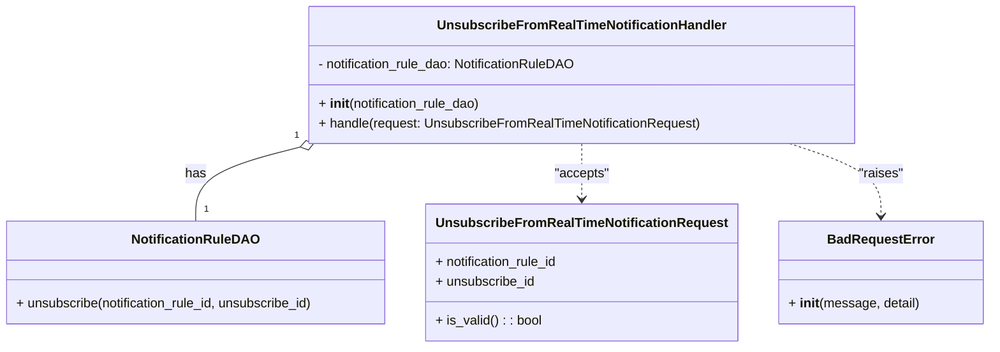

# Diagram: common/subscription_service/subscription_service/v2/service/unsubscribe_from_real_time_notification_handler.py

> Auto-generated by Obscura crawlers

## Mermaid

### SVG

<svg id="container" width="1197.0390625" xmlns="http://www.w3.org/2000/svg" class="classDiagram" height="426" viewBox="0 0 1197.0390625 426" role="graphics-document document" aria-roledescription="class"><g><defs><marker id="container_class-aggregationStart" class="marker aggregation class" refX="18" refY="7" markerWidth="190" markerHeight="240" orient="auto"><path d="M 18,7 L9,13 L1,7 L9,1 Z"></path></marker></defs><defs><marker id="container_class-aggregationEnd" class="marker aggregation class" refX="1" refY="7" markerWidth="20" markerHeight="28" orient="auto"><path d="M 18,7 L9,13 L1,7 L9,1 Z"></path></marker></defs><defs><marker id="container_class-extensionStart" class="marker extension class" refX="18" refY="7" markerWidth="190" markerHeight="240" orient="auto"><path d="M 1,7 L18,13 V 1 Z"></path></marker></defs><defs><marker id="container_class-extensionEnd" class="marker extension class" refX="1" refY="7" markerWidth="20" markerHeight="28" orient="auto"><path d="M 1,1 V 13 L18,7 Z"></path></marker></defs><defs><marker id="container_class-compositionStart" class="marker composition class" refX="18" refY="7" markerWidth="190" markerHeight="240" orient="auto"><path d="M 18,7 L9,13 L1,7 L9,1 Z"></path></marker></defs><defs><marker id="container_class-compositionEnd" class="marker composition class" refX="1" refY="7" markerWidth="20" markerHeight="28" orient="auto"><path d="M 18,7 L9,13 L1,7 L9,1 Z"></path></marker></defs><defs><marker id="container_class-dependencyStart" class="marker dependency class" refX="6" refY="7" markerWidth="190" markerHeight="240" orient="auto"><path d="M 5,7 L9,13 L1,7 L9,1 Z"></path></marker></defs><defs><marker id="container_class-dependencyEnd" class="marker dependency class" refX="13" refY="7" markerWidth="20" markerHeight="28" orient="auto"><path d="M 18,7 L9,13 L14,7 L9,1 Z"></path></marker></defs><defs><marker id="container_class-lollipopStart" class="marker lollipop class" refX="13" refY="7" markerWidth="190" markerHeight="240" orient="auto"><circle stroke="black" fill="transparent" cx="7" cy="7" r="6"></circle></marker></defs><defs><marker id="container_class-lollipopEnd" class="marker lollipop class" refX="1" refY="7" markerWidth="190" markerHeight="240" orient="auto"><circle stroke="black" fill="transparent" cx="7" cy="7" r="6"></circle></marker></defs><g class="root"><g class="clusters"></g><g class="edgePaths"><path d="M370.265,180.32L349.208,185.767C328.152,191.213,286.039,202.107,264.982,217.22C243.926,232.333,243.926,251.667,243.926,261.333L243.926,271" id="id_UnsubscribeFromRealTimeNotificationHandler_NotificationRuleDAO_1" class="edge-thickness-normal edge-pattern-solid relation" style=";;;" data-edge="true" data-et="edge" data-id="id_UnsubscribeFromRealTimeNotificationHandler_NotificationRuleDAO_1" data-points="W3sieCI6Mzg2Ljk2NTEzNDI5NzUyMDY1LCJ5IjoxNzZ9LHsieCI6MjQzLjkyNTc4MTI1LCJ5IjoyMTN9LHsieCI6MjQzLjkyNTc4MTI1LCJ5IjoyNzF9XQ==" marker-start="url(#container_class-aggregationStart)"></path><path d="M711.703,176L711.703,182.167C711.703,188.333,711.703,200.667,711.703,212C711.703,223.333,711.703,233.667,711.703,238.833L711.703,244" id="id_UnsubscribeFromRealTimeNotificationHandler_UnsubscribeFromRealTimeNotificationRequest_2" class="edge-thickness-normal edge-pattern-dashed relation" style=";;;" data-edge="true" data-et="edge" data-id="id_UnsubscribeFromRealTimeNotificationHandler_UnsubscribeFromRealTimeNotificationRequest_2" data-points="W3sieCI6NzExLjcwMzEyNSwieSI6MTc2fSx7IngiOjcxMS43MDMxMjUsInkiOjIxM30seyJ4Ijo3MTEuNzAzMTI1LCJ5IjoyNTB9XQ==" marker-end="url(#container_class-dependencyEnd)"></path><path d="M957.867,176L975.939,182.167C994.011,188.333,1030.154,200.667,1048.225,215.5C1066.297,230.333,1066.297,247.667,1066.297,256.333L1066.297,265" id="id_UnsubscribeFromRealTimeNotificationHandler_BadRequestError_3" class="edge-thickness-normal edge-pattern-dashed relation" style=";;;" data-edge="true" data-et="edge" data-id="id_UnsubscribeFromRealTimeNotificationHandler_BadRequestError_3" data-points="W3sieCI6OTU3Ljg2NzM4MTE5ODM0NzIsInkiOjE3Nn0seyJ4IjoxMDY2LjI5Njg3NSwieSI6MjEzfSx7IngiOjEwNjYuMjk2ODc1LCJ5IjoyNzF9XQ==" marker-end="url(#container_class-dependencyEnd)"></path></g><g class="edgeLabels"><g class="edgeLabel" transform="translate(243.92578125, 213)"><g class="label" data-id="id_UnsubscribeFromRealTimeNotificationHandler_NotificationRuleDAO_1" transform="translate(-12.703125, -12)"><foreignObject width="25.40625" height="24">

has

</foreignObject></g></g><g class="edgeLabel" transform="translate(711.703125, 213)"><g class="label" data-id="id_UnsubscribeFromRealTimeNotificationHandler_UnsubscribeFromRealTimeNotificationRequest_2" transform="translate(-33.5625, -12)"><foreignObject width="67.125" height="24">

"accepts"

</foreignObject></g></g><g class="edgeLabel" transform="translate(1066.296875, 213)"><g class="label" data-id="id_UnsubscribeFromRealTimeNotificationHandler_BadRequestError_3" transform="translate(-27.515625, -12)"><foreignObject width="55.03125" height="24">

"raises"

</foreignObject></g></g><g class="edgeTerminals" transform="translate(366.2663513080052, 165.86045552642696)"><g class="inner" transform="translate(0, 0)"><foreignObject style="width: 9px; height: 12px;">
1
</foreignObject></g></g><g class="edgeTerminals" transform="translate(253.92578062500002, 248.4999994642857)"><g class="inner" transform="translate(0, 0)"></g><foreignObject style="width: 9px; height: 12px;">
1
</foreignObject></g></g><g class="nodes"><g class="node default" id="classId-UnsubscribeFromRealTimeNotificationHandler-0" transform="translate(711.703125, 92)"><g class="basic label-container"><path d="M-333.03515625 -84 L333.03515625 -84 L333.03515625 84 L-333.03515625 84" stroke="none" stroke-width="0" fill="#ECECFF" style=""></path><path d="M-333.03515625 -84 C-93.3485350779321 -84, 146.3380860941358 -84, 333.03515625 -84 M-333.03515625 -84 C-177.33757642763052 -84, -21.639996605261047 -84, 333.03515625 -84 M333.03515625 -84 C333.03515625 -37.01680906589359, 333.03515625 9.966381868212821, 333.03515625 84 M333.03515625 -84 C333.03515625 -38.5518712675232, 333.03515625 6.896257464953607, 333.03515625 84 M333.03515625 84 C194.00806176452016 84, 54.98096727904033 84, -333.03515625 84 M333.03515625 84 C155.32114502071616 84, -22.392866208567682 84, -333.03515625 84 M-333.03515625 84 C-333.03515625 18.71771787424379, -333.03515625 -46.56456425151242, -333.03515625 -84 M-333.03515625 84 C-333.03515625 40.720209532769616, -333.03515625 -2.5595809344607687, -333.03515625 -84" stroke="#9370DB" stroke-width="1.3" fill="none" stroke-dasharray="0 0" style=""></path></g><g class="annotation-group text" transform="translate(0, -60)"></g><g class="label-group text" transform="translate(-168.9609375, -60)"><g class="label" style="font-weight: bolder" transform="translate(0,-12)"><foreignObject width="337.921875" height="24">

UnsubscribeFromRealTimeNotificationHandler

</foreignObject></g></g><g class="members-group text" transform="translate(-321.03515625, -12)"><g class="label" style="" transform="translate(0,-12)"><foreignObject width="322.125" height="24">

- notification_rule_dao: NotificationRuleDAO

</foreignObject></g></g><g class="methods-group text" transform="translate(-321.03515625, 36)"><g class="label" style="" transform="translate(0,-12)"><foreignObject width="202.890625" height="24">

+ <strong>init</strong>(notification_rule_dao)

</foreignObject></g><g class="label" style="" transform="translate(0,12)"><foreignObject width="473.109375" height="24">

+ handle(request: UnsubscribeFromRealTimeNotificationRequest)

</foreignObject></g></g><g class="divider" style=""><path d="M-333.03515625 -36 C-163.4795552032184 -36, 6.076045843563179 -36, 333.03515625 -36 M-333.03515625 -36 C-106.2200685541109 -36, 120.59501914177821 -36, 333.03515625 -36" stroke="#9370DB" stroke-width="1.3" fill="none" stroke-dasharray="0 0" style=""></path></g><g class="divider" style=""><path d="M-333.03515625 12 C-190.027199342687 12, -47.019242435374 12, 333.03515625 12 M-333.03515625 12 C-123.58504644069359 12, 85.86506336861282 12, 333.03515625 12" stroke="#9370DB" stroke-width="1.3" fill="none" stroke-dasharray="0 0" style=""></path></g></g><g class="node default" id="classId-NotificationRuleDAO-1" transform="translate(243.92578125, 334)"><g class="basic label-container"><path d="M-235.92578125 -63 L235.92578125 -63 L235.92578125 63 L-235.92578125 63" stroke="none" stroke-width="0" fill="#ECECFF" style=""></path><path d="M-235.92578125 -63 C-88.8750608389561 -63, 58.175659572087795 -63, 235.92578125 -63 M-235.92578125 -63 C-104.86101670066301 -63, 26.20374784867397 -63, 235.92578125 -63 M235.92578125 -63 C235.92578125 -18.48180217945047, 235.92578125 26.036395641099062, 235.92578125 63 M235.92578125 -63 C235.92578125 -25.172680113371882, 235.92578125 12.654639773256235, 235.92578125 63 M235.92578125 63 C48.22737091577986 63, -139.47103941844028 63, -235.92578125 63 M235.92578125 63 C76.7193262466416 63, -82.4871287567168 63, -235.92578125 63 M-235.92578125 63 C-235.92578125 17.858829149311767, -235.92578125 -27.282341701376467, -235.92578125 -63 M-235.92578125 63 C-235.92578125 22.486338326104914, -235.92578125 -18.027323347790173, -235.92578125 -63" stroke="#9370DB" stroke-width="1.3" fill="none" stroke-dasharray="0 0" style=""></path></g><g class="annotation-group text" transform="translate(0, -39)"></g><g class="label-group text" transform="translate(-74.4453125, -39)"><g class="label" style="font-weight: bolder" transform="translate(0,-12)"><foreignObject width="148.890625" height="24">

NotificationRuleDAO

</foreignObject></g></g><g class="members-group text" transform="translate(-223.92578125, 9)"></g><g class="methods-group text" transform="translate(-223.92578125, 39)"><g class="label" style="" transform="translate(0,-12)"><foreignObject width="373.40625" height="24">

+ unsubscribe(notification_rule_id, unsubscribe_id)

</foreignObject></g></g><g class="divider" style=""><path d="M-235.92578125 -15 C-101.36188888121649 -15, 33.202003487567026 -15, 235.92578125 -15 M-235.92578125 -15 C-137.14371179582508 -15, -38.36164234165017 -15, 235.92578125 -15" stroke="#9370DB" stroke-width="1.3" fill="none" stroke-dasharray="0 0" style=""></path></g><g class="divider" style=""><path d="M-235.92578125 9 C-74.42835101753892 9, 87.06907921492217 9, 235.92578125 9 M-235.92578125 9 C-52.067068556351614 9, 131.79164413729677 9, 235.92578125 9" stroke="#9370DB" stroke-width="1.3" fill="none" stroke-dasharray="0 0" style=""></path></g></g><g class="node default" id="classId-UnsubscribeFromRealTimeNotificationRequest-2" transform="translate(711.703125, 334)"><g class="basic label-container"><path d="M-181.8515625 -84 L181.8515625 -84 L181.8515625 84 L-181.8515625 84" stroke="none" stroke-width="0" fill="#ECECFF" style=""></path><path d="M-181.8515625 -84 C-49.14893725773746 -84, 83.55368798452508 -84, 181.8515625 -84 M-181.8515625 -84 C-88.42423301601436 -84, 5.0030964679712895 -84, 181.8515625 -84 M181.8515625 -84 C181.8515625 -17.954970368314463, 181.8515625 48.090059263371074, 181.8515625 84 M181.8515625 -84 C181.8515625 -38.40060635506737, 181.8515625 7.198787289865265, 181.8515625 84 M181.8515625 84 C93.22606374241111 84, 4.600564984822228 84, -181.8515625 84 M181.8515625 84 C83.65872692028587 84, -14.534108659428256 84, -181.8515625 84 M-181.8515625 84 C-181.8515625 47.176080834123276, -181.8515625 10.352161668246552, -181.8515625 -84 M-181.8515625 84 C-181.8515625 38.872774881998865, -181.8515625 -6.2544502360022705, -181.8515625 -84" stroke="#9370DB" stroke-width="1.3" fill="none" stroke-dasharray="0 0" style=""></path></g><g class="annotation-group text" transform="translate(0, -60)"></g><g class="label-group text" transform="translate(-169.8515625, -60)"><g class="label" style="font-weight: bolder" transform="translate(0,-12)"><foreignObject width="339.703125" height="24">

UnsubscribeFromRealTimeNotificationRequest

</foreignObject></g></g><g class="members-group text" transform="translate(-169.8515625, -12)"><g class="label" style="" transform="translate(0,-12)"><foreignObject width="154.859375" height="24">

+ notification_rule_id

</foreignObject></g><g class="label" style="" transform="translate(0,12)"><foreignObject width="123.3125" height="24">

+ unsubscribe_id

</foreignObject></g></g><g class="methods-group text" transform="translate(-169.8515625, 60)"><g class="label" style="" transform="translate(0,-12)"><foreignObject width="130.3125" height="24">

+ is_valid() : : bool

</foreignObject></g></g><g class="divider" style=""><path d="M-181.8515625 -36 C-53.167508865816046 -36, 75.51654476836791 -36, 181.8515625 -36 M-181.8515625 -36 C-75.60782508756745 -36, 30.635912324865103 -36, 181.8515625 -36" stroke="#9370DB" stroke-width="1.3" fill="none" stroke-dasharray="0 0" style=""></path></g><g class="divider" style=""><path d="M-181.8515625 36 C-81.58109274632407 36, 18.68937700735185 36, 181.8515625 36 M-181.8515625 36 C-43.212981395825125 36, 95.42559970834975 36, 181.8515625 36" stroke="#9370DB" stroke-width="1.3" fill="none" stroke-dasharray="0 0" style=""></path></g></g><g class="node default" id="classId-BadRequestError-3" transform="translate(1066.296875, 334)"><g class="basic label-container"><path d="M-122.7421875 -63 L122.7421875 -63 L122.7421875 63 L-122.7421875 63" stroke="none" stroke-width="0" fill="#ECECFF" style=""></path><path d="M-122.7421875 -63 C-41.144817384258474 -63, 40.45255273148305 -63, 122.7421875 -63 M-122.7421875 -63 C-44.949470671292644 -63, 32.84324615741471 -63, 122.7421875 -63 M122.7421875 -63 C122.7421875 -18.277635850586222, 122.7421875 26.444728298827556, 122.7421875 63 M122.7421875 -63 C122.7421875 -15.573779516334618, 122.7421875 31.852440967330764, 122.7421875 63 M122.7421875 63 C47.90436373261613 63, -26.933460034767734 63, -122.7421875 63 M122.7421875 63 C39.212617885568434 63, -44.31695172886313 63, -122.7421875 63 M-122.7421875 63 C-122.7421875 35.04251425264998, -122.7421875 7.085028505299967, -122.7421875 -63 M-122.7421875 63 C-122.7421875 16.79300230246841, -122.7421875 -29.413995395063182, -122.7421875 -63" stroke="#9370DB" stroke-width="1.3" fill="none" stroke-dasharray="0 0" style=""></path></g><g class="annotation-group text" transform="translate(0, -39)"></g><g class="label-group text" transform="translate(-62.28125, -39)"><g class="label" style="font-weight: bolder" transform="translate(0,-12)"><foreignObject width="124.5625" height="24">

BadRequestError

</foreignObject></g></g><g class="members-group text" transform="translate(-110.7421875, 9)"></g><g class="methods-group text" transform="translate(-110.7421875, 39)"><g class="label" style="" transform="translate(0,-12)"><foreignObject width="159.203125" height="24">

+ <strong>init</strong>(message, detail)

</foreignObject></g></g><g class="divider" style=""><path d="M-122.7421875 -15 C-40.47186043064026 -15, 41.798466638719475 -15, 122.7421875 -15 M-122.7421875 -15 C-30.284434826908253 -15, 62.173317846183494 -15, 122.7421875 -15" stroke="#9370DB" stroke-width="1.3" fill="none" stroke-dasharray="0 0" style=""></path></g><g class="divider" style=""><path d="M-122.7421875 9 C-68.33640707603504 9, -13.930626652070089 9, 122.7421875 9 M-122.7421875 9 C-25.212859887481997 9, 72.316467725036 9, 122.7421875 9" stroke="#9370DB" stroke-width="1.3" fill="none" stroke-dasharray="0 0" style=""></path></g></g></g></g></g></svg>
