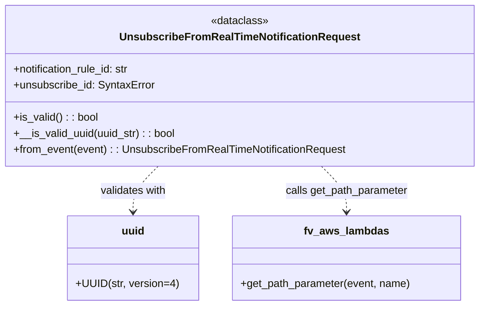

# Diagram: common/subscription_service/subscription_service/v2/service/unsubscribe_from_real_time_notification_request.py

> Auto-generated by Obscura crawlers

## Mermaid

> SVG rendering failed for this diagram.
