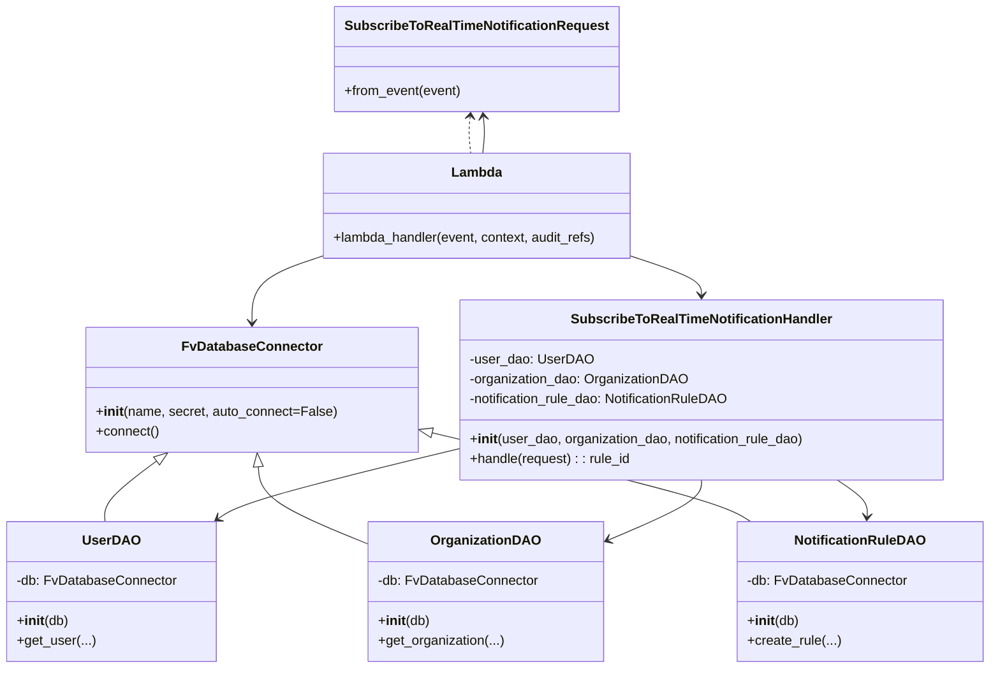

# Diagram: common/subscription_service/subscription_service/v2/subscribe_to_real_time_notification.py


> Auto-generated by Obscura crawlers

## Diagram 1

```mermaid
flowchart TD
    subgraph AWS_Lambda
        LH[lambda_handler(event, context, audit_refs)]
    end
    LH --> REQ[SubscribeToRealTimeNotificationRequest.from_event(event)]
    LH --> HND[SubscribeToRealTimeNotificationHandler.handle(request)]
    HND --> UDAO[UserDAO]
    HND --> ODAO[OrganizationDAO]
    HND --> NRDAO[NotificationRuleDAO]
    UDAO --> SHIP_DB[SHIPMENT_DB (FvDatabaseConnector)]
    ODAO --> SHIP_DB
    NRDAO --> PERSONA_DB[PERSONA_DB (FvDatabaseConnector)]
    LH --> RESP[make_response({"id": rule_id})]
    auth[NOTIFICATION_MANAGEMENT_AUTH_CHECK] -.-> LH
    PERSONA_DB -. secret names .-> SecretNames[SecretNames]
    SHIP_DB -. secret names .-> SecretNames
```

> SVG rendering failed for this diagram.

## Diagram 2



### SVG

<svg id="container" width="1170.90234375" xmlns="http://www.w3.org/2000/svg" class="classDiagram" height="802" viewBox="0 0 1170.90234375 802" role="graphics-document document" aria-roledescription="class"><style>#container{font-family:"trebuchet ms",verdana,arial,sans-serif;font-size:16px;fill:#333;}@keyframes edge-animation-frame{from{stroke-dashoffset:0;}}@keyframes dash{to{stroke-dashoffset:0;}}#container .edge-animation-slow{stroke-dasharray:9,5!important;stroke-dashoffset:900;animation:dash 50s linear infinite;stroke-linecap:round;}#container .edge-animation-fast{stroke-dasharray:9,5!important;stroke-dashoffset:900;animation:dash 20s linear infinite;stroke-linecap:round;}#container .error-icon{fill:#552222;}#container .error-text{fill:#552222;stroke:#552222;}#container .edge-thickness-normal{stroke-width:1px;}#container .edge-thickness-thick{stroke-width:3.5px;}#container .edge-pattern-solid{stroke-dasharray:0;}#container .edge-thickness-invisible{stroke-width:0;fill:none;}#container .edge-pattern-dashed{stroke-dasharray:3;}#container .edge-pattern-dotted{stroke-dasharray:2;}#container .marker{fill:#333333;stroke:#333333;}#container .marker.cross{stroke:#333333;}#container svg{font-family:"trebuchet ms",verdana,arial,sans-serif;font-size:16px;}#container p{margin:0;}#container g.classGroup text{fill:#9370DB;stroke:none;font-family:"trebuchet ms",verdana,arial,sans-serif;font-size:10px;}#container g.classGroup text .title{font-weight:bolder;}#container .nodeLabel,#container .edgeLabel{color:#131300;}#container .edgeLabel .label rect{fill:#ECECFF;}#container .label text{fill:#131300;}#container .labelBkg{background:#ECECFF;}#container .edgeLabel .label span{background:#ECECFF;}#container .classTitle{font-weight:bolder;}#container .node rect,#container .node circle,#container .node ellipse,#container .node polygon,#container .node path{fill:#ECECFF;stroke:#9370DB;stroke-width:1px;}#container .divider{stroke:#9370DB;stroke-width:1;}#container g.clickable{cursor:pointer;}#container g.classGroup rect{fill:#ECECFF;stroke:#9370DB;}#container g.classGroup line{stroke:#9370DB;stroke-width:1;}#container .classLabel .box{stroke:none;stroke-width:0;fill:#ECECFF;opacity:0.5;}#container .classLabel .label{fill:#9370DB;font-size:10px;}#container .relation{stroke:#333333;stroke-width:1;fill:none;}#container .dashed-line{stroke-dasharray:3;}#container .dotted-line{stroke-dasharray:1 2;}#container #compositionStart,#container .composition{fill:#333333!important;stroke:#333333!important;stroke-width:1;}#container #compositionEnd,#container .composition{fill:#333333!important;stroke:#333333!important;stroke-width:1;}#container #dependencyStart,#container .dependency{fill:#333333!important;stroke:#333333!important;stroke-width:1;}#container #dependencyStart,#container .dependency{fill:#333333!important;stroke:#333333!important;stroke-width:1;}#container #extensionStart,#container .extension{fill:transparent!important;stroke:#333333!important;stroke-width:1;}#container #extensionEnd,#container .extension{fill:transparent!important;stroke:#333333!important;stroke-width:1;}#container #aggregationStart,#container .aggregation{fill:transparent!important;stroke:#333333!important;stroke-width:1;}#container #aggregationEnd,#container .aggregation{fill:transparent!important;stroke:#333333!important;stroke-width:1;}#container #lollipopStart,#container .lollipop{fill:#ECECFF!important;stroke:#333333!important;stroke-width:1;}#container #lollipopEnd,#container .lollipop{fill:#ECECFF!important;stroke:#333333!important;stroke-width:1;}#container .edgeTerminals{font-size:11px;line-height:initial;}#container .classTitleText{text-anchor:middle;font-size:18px;fill:#333;}#container .label-icon{display:inline-block;height:1em;overflow:visible;vertical-align:-0.125em;}#container .node .label-icon path{fill:currentColor;stroke:revert;stroke-width:revert;}#container :root{--mermaid-font-family:"trebuchet ms",verdana,arial,sans-serif;}</style><g><defs><marker id="container_class-aggregationStart" class="marker aggregation class" refX="18" refY="7" markerWidth="190" markerHeight="240" orient="auto"><path d="M 18,7 L9,13 L1,7 L9,1 Z"></path></marker></defs><defs><marker id="container_class-aggregationEnd" class="marker aggregation class" refX="1" refY="7" markerWidth="20" markerHeight="28" orient="auto"><path d="M 18,7 L9,13 L1,7 L9,1 Z"></path></marker></defs><defs><marker id="container_class-extensionStart" class="marker extension class" refX="18" refY="7" markerWidth="190" markerHeight="240" orient="auto"><path d="M 1,7 L18,13 V 1 Z"></path></marker></defs><defs><marker id="container_class-extensionEnd" class="marker extension class" refX="1" refY="7" markerWidth="20" markerHeight="28" orient="auto"><path d="M 1,1 V 13 L18,7 Z"></path></marker></defs><defs><marker id="container_class-compositionStart" class="marker composition class" refX="18" refY="7" markerWidth="190" markerHeight="240" orient="auto"><path d="M 18,7 L9,13 L1,7 L9,1 Z"></path></marker></defs><defs><marker id="container_class-compositionEnd" class="marker composition class" refX="1" refY="7" markerWidth="20" markerHeight="28" orient="auto"><path d="M 18,7 L9,13 L1,7 L9,1 Z"></path></marker></defs><defs><marker id="container_class-dependencyStart" class="marker dependency class" refX="6" refY="7" markerWidth="190" markerHeight="240" orient="auto"><path d="M 5,7 L9,13 L1,7 L9,1 Z"></path></marker></defs><defs><marker id="container_class-dependencyEnd" class="marker dependency class" refX="13" refY="7" markerWidth="20" markerHeight="28" orient="auto"><path d="M 18,7 L9,13 L14,7 L9,1 Z"></path></marker></defs><defs><marker id="container_class-lollipopStart" class="marker lollipop class" refX="13" refY="7" markerWidth="190" markerHeight="240" orient="auto"><circle stroke="black" fill="transparent" cx="7" cy="7" r="6"></circle></marker></defs><defs><marker id="container_class-lollipopEnd" class="marker lollipop class" refX="1" refY="7" markerWidth="190" markerHeight="240" orient="auto"><circle stroke="black" fill="transparent" cx="7" cy="7" r="6"></circle></marker></defs><g class="root"><g class="clusters"></g><g class="edgePaths"><path d="M183.921,553.415L173.45,561.346C162.978,569.277,142.036,585.138,131.947,597.236C121.858,609.333,122.623,617.667,123.005,621.833L123.387,626" id="id_FvDatabaseConnector_UserDAO_1" class="edge-thickness-normal edge-pattern-solid relation" style=";;;" data-edge="true" data-et="edge" data-id="id_FvDatabaseConnector_UserDAO_1" data-points="W3sieCI6MTk3LjY3MTg3NSwieSI6NTQzfSx7IngiOjEyMS4wOTM3NSwieSI6NjAxfSx7IngiOjEyMy4zODczMjc5ODE2NTEzOCwieSI6NjI2fV0=" marker-start="url(#container_class-extensionStart)"></path><path d="M304.059,560.195L304.602,566.996C305.146,573.797,306.232,587.398,328.342,602.987C350.452,618.575,393.585,636.15,415.152,644.938L436.719,653.726" id="id_FvDatabaseConnector_OrganizationDAO_2" class="edge-thickness-normal edge-pattern-solid relation" style=";;;" data-edge="true" data-et="edge" data-id="id_FvDatabaseConnector_OrganizationDAO_2" data-points="W3sieCI6MzAyLjY4NTc1MjQ2NzEwNTI2LCJ5Ijo1NDN9LHsieCI6MzA3LjMxODM1OTM3NSwieSI6NjAxfSx7IngiOjQzNi43MTg3NSwieSI6NjUzLjcyNTcxMDk0ODA1MjR9XQ==" marker-start="url(#container_class-extensionStart)"></path><path d="M508.06,518.65L565.336,532.375C622.612,546.1,737.163,573.55,800.817,591.442C864.471,609.333,877.227,617.667,883.605,621.833L889.983,626" id="id_FvDatabaseConnector_NotificationRuleDAO_3" class="edge-thickness-normal edge-pattern-solid relation" style=";;;" data-edge="true" data-et="edge" data-id="id_FvDatabaseConnector_NotificationRuleDAO_3" data-points="W3sieCI6NDkxLjI4NTE1NjI1LCJ5Ijo1MTQuNjI5Nzk5MDYzOTQwNn0seyJ4Ijo4NTEuNzE0ODQzNzUsInkiOjYwMX0seyJ4Ijo4ODkuOTgyNjU0ODE2NTEzOCwieSI6NjI2fV0=" marker-start="url(#container_class-extensionStart)"></path><path d="M556.369,139.962L556.008,143.135C555.647,146.308,554.926,152.654,555.039,159.994C555.152,167.333,556.099,175.667,556.573,179.833L557.046,184" id="id_SubscribeToRealTimeNotificationRequest_Lambda_4" class="edge-thickness-normal edge-pattern-dashed relation" style=";;;" data-edge="true" data-et="edge" data-id="id_SubscribeToRealTimeNotificationRequest_Lambda_4" data-points="W3sieCI6NTU3LjA0NTk4NzIxNTkwOTEsInkiOjEzNH0seyJ4Ijo1NTQuMjA1MDc4MTI1LCJ5IjoxNTl9LHsieCI6NTU3LjA0NTk4NzIxNTkwOTEsInkiOjE4NH1d" marker-start="url(#container_class-dependencyStart)"></path><path d="M541.285,538.954L498.957,549.295C456.63,559.636,371.974,580.318,324.494,594.253C277.015,608.189,266.711,615.378,261.559,618.972L256.408,622.567" id="id_SubscribeToRealTimeNotificationHandler_UserDAO_5" class="edge-thickness-normal edge-pattern-solid relation" style=";;;" data-edge="true" data-et="edge" data-id="id_SubscribeToRealTimeNotificationHandler_UserDAO_5" data-points="W3sieCI6NTQxLjI4NTE1NjI1LCJ5Ijo1MzguOTU0MDczOTk5NjYyOH0seyJ4IjoyODcuMzE4MzU5Mzc1LCJ5Ijo2MDF9LHsieCI6MjUxLjQ4NzAyNjk0OTU0MTMsInkiOjYyNn1d" marker-end="url(#container_class-dependencyEnd)"></path><path d="M831.715,576L831.715,580.167C831.715,584.333,831.715,592.667,812.839,604.842C793.964,617.018,756.212,633.037,737.337,641.046L718.461,649.055" id="id_SubscribeToRealTimeNotificationHandler_OrganizationDAO_6" class="edge-thickness-normal edge-pattern-solid relation" style=";;;" data-edge="true" data-et="edge" data-id="id_SubscribeToRealTimeNotificationHandler_OrganizationDAO_6" data-points="W3sieCI6ODMxLjcxNDg0Mzc1LCJ5Ijo1NzZ9LHsieCI6ODMxLjcxNDg0Mzc1LCJ5Ijo2MDF9LHsieCI6NzEyLjkzNzUsInkiOjY1MS4zOTg1OTc5OTU4MzM1fV0=" marker-end="url(#container_class-dependencyEnd)"></path><path d="M991.561,576L997.728,580.167C1003.895,584.333,1016.229,592.667,1022.105,600.004C1027.981,607.342,1027.399,613.683,1027.108,616.854L1026.817,620.025" id="id_SubscribeToRealTimeNotificationHandler_NotificationRuleDAO_7" class="edge-thickness-normal edge-pattern-solid relation" style=";;;" data-edge="true" data-et="edge" data-id="id_SubscribeToRealTimeNotificationHandler_NotificationRuleDAO_7" data-points="W3sieCI6OTkxLjU2MTA2MDg1NTI2MzEsInkiOjU3Nn0seyJ4IjoxMDI4LjU2MjUsInkiOjYwMX0seyJ4IjoxMDI2LjI2ODkyMjAxODM0ODYsInkiOjYyNn1d" marker-end="url(#container_class-dependencyEnd)"></path><path d="M751.615,308.65L764.965,313.042C778.315,317.434,805.015,326.217,818.365,333.775C831.715,341.333,831.715,347.667,831.715,350.833L831.715,354" id="id_Lambda_SubscribeToRealTimeNotificationHandler_8" class="edge-thickness-normal edge-pattern-solid relation" style=";;;" data-edge="true" data-et="edge" data-id="id_Lambda_SubscribeToRealTimeNotificationHandler_8" data-points="W3sieCI6NzUxLjYxNTIzNDM3NSwieSI6MzA4LjY1MDQzNjI0MjgzNTh9LHsieCI6ODMxLjcxNDg0Mzc1LCJ5IjozMzV9LHsieCI6ODMxLjcxNDg0Mzc1LCJ5IjozNjB9XQ==" marker-end="url(#container_class-dependencyEnd)"></path><path d="M571.364,184L571.838,179.833C572.311,175.667,573.258,167.333,573.371,159.994C573.484,152.654,572.763,146.308,572.402,143.135L572.042,139.962" id="id_Lambda_SubscribeToRealTimeNotificationRequest_9" class="edge-thickness-normal edge-pattern-solid relation" style=";;;" data-edge="true" data-et="edge" data-id="id_Lambda_SubscribeToRealTimeNotificationRequest_9" data-points="W3sieCI6NTcxLjM2NDE2OTAzNDA5MDksInkiOjE4NH0seyJ4Ijo1NzQuMjA1MDc4MTI1LCJ5IjoxNTl9LHsieCI6NTcxLjM2NDE2OTAzNDA5MDksInkiOjEzNH1d" marker-end="url(#container_class-dependencyEnd)"></path><path d="M376.795,308.65L363.445,313.042C350.095,317.434,323.395,326.217,310.045,339.275C296.695,352.333,296.695,369.667,296.695,378.333L296.695,387" id="id_Lambda_FvDatabaseConnector_10" class="edge-thickness-normal edge-pattern-solid relation" style=";;;" data-edge="true" data-et="edge" data-id="id_Lambda_FvDatabaseConnector_10" data-points="W3sieCI6Mzc2Ljc5NDkyMTg3NSwieSI6MzA4LjY1MDQzNjI0MjgzNTh9LHsieCI6Mjk2LjY5NTMxMjUsInkiOjMzNX0seyJ4IjoyOTYuNjk1MzEyNSwieSI6MzkzfV0=" marker-end="url(#container_class-dependencyEnd)"></path></g><g class="edgeLabels"><g class="edgeLabel"><g class="label" data-id="id_FvDatabaseConnector_UserDAO_1" transform="translate(0, 0)"><foreignObject width="0" height="0"><div xmlns="http://www.w3.org/1999/xhtml" class="labelBkg" style="display: table-cell; white-space: nowrap; line-height: 1.5; max-width: 200px; text-align: center;"><span class="edgeLabel"></span></div></foreignObject></g></g><g class="edgeLabel"><g class="label" data-id="id_FvDatabaseConnector_OrganizationDAO_2" transform="translate(0, 0)"><foreignObject width="0" height="0"><div xmlns="http://www.w3.org/1999/xhtml" class="labelBkg" style="display: table-cell; white-space: nowrap; line-height: 1.5; max-width: 200px; text-align: center;"><span class="edgeLabel"></span></div></foreignObject></g></g><g class="edgeLabel"><g class="label" data-id="id_FvDatabaseConnector_NotificationRuleDAO_3" transform="translate(0, 0)"><foreignObject width="0" height="0"><div xmlns="http://www.w3.org/1999/xhtml" class="labelBkg" style="display: table-cell; white-space: nowrap; line-height: 1.5; max-width: 200px; text-align: center;"><span class="edgeLabel"></span></div></foreignObject></g></g><g class="edgeLabel"><g class="label" data-id="id_SubscribeToRealTimeNotificationRequest_Lambda_4" transform="translate(0, 0)"><foreignObject width="0" height="0"><div xmlns="http://www.w3.org/1999/xhtml" class="labelBkg" style="display: table-cell; white-space: nowrap; line-height: 1.5; max-width: 200px; text-align: center;"><span class="edgeLabel"></span></div></foreignObject></g></g><g class="edgeLabel"><g class="label" data-id="id_SubscribeToRealTimeNotificationHandler_UserDAO_5" transform="translate(0, 0)"><foreignObject width="0" height="0"><div xmlns="http://www.w3.org/1999/xhtml" class="labelBkg" style="display: table-cell; white-space: nowrap; line-height: 1.5; max-width: 200px; text-align: center;"><span class="edgeLabel"></span></div></foreignObject></g></g><g class="edgeLabel"><g class="label" data-id="id_SubscribeToRealTimeNotificationHandler_OrganizationDAO_6" transform="translate(0, 0)"><foreignObject width="0" height="0"><div xmlns="http://www.w3.org/1999/xhtml" class="labelBkg" style="display: table-cell; white-space: nowrap; line-height: 1.5; max-width: 200px; text-align: center;"><span class="edgeLabel"></span></div></foreignObject></g></g><g class="edgeLabel"><g class="label" data-id="id_SubscribeToRealTimeNotificationHandler_NotificationRuleDAO_7" transform="translate(0, 0)"><foreignObject width="0" height="0"><div xmlns="http://www.w3.org/1999/xhtml" class="labelBkg" style="display: table-cell; white-space: nowrap; line-height: 1.5; max-width: 200px; text-align: center;"><span class="edgeLabel"></span></div></foreignObject></g></g><g class="edgeLabel"><g class="label" data-id="id_Lambda_SubscribeToRealTimeNotificationHandler_8" transform="translate(0, 0)"><foreignObject width="0" height="0"><div xmlns="http://www.w3.org/1999/xhtml" class="labelBkg" style="display: table-cell; white-space: nowrap; line-height: 1.5; max-width: 200px; text-align: center;"><span class="edgeLabel"></span></div></foreignObject></g></g><g class="edgeLabel"><g class="label" data-id="id_Lambda_SubscribeToRealTimeNotificationRequest_9" transform="translate(0, 0)"><foreignObject width="0" height="0"><div xmlns="http://www.w3.org/1999/xhtml" class="labelBkg" style="display: table-cell; white-space: nowrap; line-height: 1.5; max-width: 200px; text-align: center;"><span class="edgeLabel"></span></div></foreignObject></g></g><g class="edgeLabel"><g class="label" data-id="id_Lambda_FvDatabaseConnector_10" transform="translate(0, 0)"><foreignObject width="0" height="0"><div xmlns="http://www.w3.org/1999/xhtml" class="labelBkg" style="display: table-cell; white-space: nowrap; line-height: 1.5; max-width: 200px; text-align: center;"><span class="edgeLabel"></span></div></foreignObject></g></g></g><g class="nodes"><g class="node default" id="classId-FvDatabaseConnector-0" transform="translate(296.6953125, 468)"><g class="basic label-container"><path d="M-194.58984375 -75 L194.58984375 -75 L194.58984375 75 L-194.58984375 75" stroke="none" stroke-width="0" fill="#ECECFF" style=""></path><path d="M-194.58984375 -75 C-99.47922586733753 -75, -4.368607984675066 -75, 194.58984375 -75 M-194.58984375 -75 C-71.27324592623309 -75, 52.043351897533825 -75, 194.58984375 -75 M194.58984375 -75 C194.58984375 -30.17351036241081, 194.58984375 14.652979275178382, 194.58984375 75 M194.58984375 -75 C194.58984375 -27.49204810735347, 194.58984375 20.015903785293062, 194.58984375 75 M194.58984375 75 C55.1590737391368 75, -84.2716962717264 75, -194.58984375 75 M194.58984375 75 C68.86343701477055 75, -56.86296972045889 75, -194.58984375 75 M-194.58984375 75 C-194.58984375 38.68762573057241, -194.58984375 2.3752514611448134, -194.58984375 -75 M-194.58984375 75 C-194.58984375 21.235171904991617, -194.58984375 -32.529656190016766, -194.58984375 -75" stroke="#9370DB" stroke-width="1.3" fill="none" stroke-dasharray="0 0" style=""></path></g><g class="annotation-group text" transform="translate(0, -51)"></g><g class="label-group text" transform="translate(-79.3046875, -51)"><g class="label" style="font-weight: bolder" transform="translate(0,-12)"><foreignObject width="158.609375" height="24"><div xmlns="http://www.w3.org/1999/xhtml" style="display: table-cell; white-space: nowrap; line-height: 1.5; max-width: 207px; text-align: center;"><span class="nodeLabel markdown-node-label" style=""><p>FvDatabaseConnector</p></span></div></foreignObject></g></g><g class="members-group text" transform="translate(-182.58984375, -3)"></g><g class="methods-group text" transform="translate(-182.58984375, 27)"><g class="label" style="" transform="translate(0,-12)"><foreignObject width="285.875" height="24"><div xmlns="http://www.w3.org/1999/xhtml" style="display: table-cell; white-space: nowrap; line-height: 1.5; max-width: 375px; text-align: center;"><span class="nodeLabel markdown-node-label" style=""><p>+<strong>init</strong>(name, secret, auto_connect=False)</p></span></div></foreignObject></g><g class="label" style="" transform="translate(0,12)"><foreignObject width="75.921875" height="24"><div xmlns="http://www.w3.org/1999/xhtml" style="display: table-cell; white-space: nowrap; line-height: 1.5; max-width: 133px; text-align: center;"><span class="nodeLabel markdown-node-label" style=""><p>+connect()</p></span></div></foreignObject></g></g><g class="divider" style=""><path d="M-194.58984375 -27 C-55.576005522847936 -27, 83.43783270430413 -27, 194.58984375 -27 M-194.58984375 -27 C-42.44330711906417 -27, 109.70322951187165 -27, 194.58984375 -27" stroke="#9370DB" stroke-width="1.3" fill="none" stroke-dasharray="0 0" style=""></path></g><g class="divider" style=""><path d="M-194.58984375 -3 C-105.8536776201017 -3, -17.117511490203412 -3, 194.58984375 -3 M-194.58984375 -3 C-114.15391313232567 -3, -33.71798251465134 -3, 194.58984375 -3" stroke="#9370DB" stroke-width="1.3" fill="none" stroke-dasharray="0 0" style=""></path></g></g><g class="node default" id="classId-SubscribeToRealTimeNotificationRequest-1" transform="translate(564.205078125, 71)"><g class="basic label-container"><path d="M-163.2734375 -63 L163.2734375 -63 L163.2734375 63 L-163.2734375 63" stroke="none" stroke-width="0" fill="#ECECFF" style=""></path><path d="M-163.2734375 -63 C-72.02631854145244 -63, 19.22080041709512 -63, 163.2734375 -63 M-163.2734375 -63 C-47.9884657051838 -63, 67.2965060896324 -63, 163.2734375 -63 M163.2734375 -63 C163.2734375 -20.65629143028948, 163.2734375 21.687417139421044, 163.2734375 63 M163.2734375 -63 C163.2734375 -23.961891876891244, 163.2734375 15.076216246217513, 163.2734375 63 M163.2734375 63 C45.58086961884722 63, -72.11169826230557 63, -163.2734375 63 M163.2734375 63 C71.64573462811205 63, -19.981968243775896 63, -163.2734375 63 M-163.2734375 63 C-163.2734375 29.12697918847364, -163.2734375 -4.746041623052719, -163.2734375 -63 M-163.2734375 63 C-163.2734375 21.885150605562572, -163.2734375 -19.229698788874856, -163.2734375 -63" stroke="#9370DB" stroke-width="1.3" fill="none" stroke-dasharray="0 0" style=""></path></g><g class="annotation-group text" transform="translate(0, -39)"></g><g class="label-group text" transform="translate(-151.2734375, -39)"><g class="label" style="font-weight: bolder" transform="translate(0,-12)"><foreignObject width="302.546875" height="24"><div xmlns="http://www.w3.org/1999/xhtml" style="display: table-cell; white-space: nowrap; line-height: 1.5; max-width: 349px; text-align: center;"><span class="nodeLabel markdown-node-label" style=""><p>SubscribeToRealTimeNotificationRequest</p></span></div></foreignObject></g></g><g class="members-group text" transform="translate(-151.2734375, 9)"></g><g class="methods-group text" transform="translate(-151.2734375, 39)"><g class="label" style="" transform="translate(0,-12)"><foreignObject width="140.90625" height="24"><div xmlns="http://www.w3.org/1999/xhtml" style="display: table-cell; white-space: nowrap; line-height: 1.5; max-width: 198px; text-align: center;"><span class="nodeLabel markdown-node-label" style=""><p>+from_event(event)</p></span></div></foreignObject></g></g><g class="divider" style=""><path d="M-163.2734375 -15 C-43.83219837250087 -15, 75.60904075499826 -15, 163.2734375 -15 M-163.2734375 -15 C-88.90732303266522 -15, -14.541208565330436 -15, 163.2734375 -15" stroke="#9370DB" stroke-width="1.3" fill="none" stroke-dasharray="0 0" style=""></path></g><g class="divider" style=""><path d="M-163.2734375 9 C-42.76402343103237 9, 77.74539063793526 9, 163.2734375 9 M-163.2734375 9 C-50.31526531491485 9, 62.64290687017029 9, 163.2734375 9" stroke="#9370DB" stroke-width="1.3" fill="none" stroke-dasharray="0 0" style=""></path></g></g><g class="node default" id="classId-UserDAO-2" transform="translate(131.09375, 710)"><g class="basic label-container"><path d="M-123.09375 -84 L123.09375 -84 L123.09375 84 L-123.09375 84" stroke="none" stroke-width="0" fill="#ECECFF" style=""></path><path d="M-123.09375 -84 C-25.31925838157744 -84, 72.45523323684512 -84, 123.09375 -84 M-123.09375 -84 C-61.14702305294958 -84, 0.7997038941008441 -84, 123.09375 -84 M123.09375 -84 C123.09375 -44.046506185487615, 123.09375 -4.093012370975231, 123.09375 84 M123.09375 -84 C123.09375 -23.120761432199835, 123.09375 37.75847713560033, 123.09375 84 M123.09375 84 C68.98821799376046 84, 14.882685987520901 84, -123.09375 84 M123.09375 84 C35.34364558703703 84, -52.40645882592594 84, -123.09375 84 M-123.09375 84 C-123.09375 37.08049063816533, -123.09375 -9.83901872366934, -123.09375 -84 M-123.09375 84 C-123.09375 32.69033049510517, -123.09375 -18.619339009789655, -123.09375 -84" stroke="#9370DB" stroke-width="1.3" fill="none" stroke-dasharray="0 0" style=""></path></g><g class="annotation-group text" transform="translate(0, -60)"></g><g class="label-group text" transform="translate(-31.953125, -60)"><g class="label" style="font-weight: bolder" transform="translate(0,-12)"><foreignObject width="63.90625" height="24"><div xmlns="http://www.w3.org/1999/xhtml" style="display: table-cell; white-space: nowrap; line-height: 1.5; max-width: 113px; text-align: center;"><span class="nodeLabel markdown-node-label" style=""><p>UserDAO</p></span></div></foreignObject></g></g><g class="members-group text" transform="translate(-111.09375, -12)"><g class="label" style="" transform="translate(0,-12)"><foreignObject width="190.234375" height="24"><div xmlns="http://www.w3.org/1999/xhtml" style="display: table-cell; white-space: nowrap; line-height: 1.5; max-width: 248px; text-align: center;"><span class="nodeLabel markdown-node-label" style=""><p>-db: FvDatabaseConnector</p></span></div></foreignObject></g></g><g class="methods-group text" transform="translate(-111.09375, 36)"><g class="label" style="" transform="translate(0,-12)"><foreignObject width="61.875" height="24"><div xmlns="http://www.w3.org/1999/xhtml" style="display: table-cell; white-space: nowrap; line-height: 1.5; max-width: 151px; text-align: center;"><span class="nodeLabel markdown-node-label" style=""><p>+<strong>init</strong>(db)</p></span></div></foreignObject></g><g class="label" style="" transform="translate(0,12)"><foreignObject width="92.125" height="24"><div xmlns="http://www.w3.org/1999/xhtml" style="display: table-cell; white-space: nowrap; line-height: 1.5; max-width: 149px; text-align: center;"><span class="nodeLabel markdown-node-label" style=""><p>+get_user(...)</p></span></div></foreignObject></g></g><g class="divider" style=""><path d="M-123.09375 -36 C-32.61266920468388 -36, 57.868411590632235 -36, 123.09375 -36 M-123.09375 -36 C-55.767719740728666 -36, 11.558310518542669 -36, 123.09375 -36" stroke="#9370DB" stroke-width="1.3" fill="none" stroke-dasharray="0 0" style=""></path></g><g class="divider" style=""><path d="M-123.09375 12 C-62.18471802089406 12, -1.27568604178812 12, 123.09375 12 M-123.09375 12 C-29.41443925971751 12, 64.26487148056498 12, 123.09375 12" stroke="#9370DB" stroke-width="1.3" fill="none" stroke-dasharray="0 0" style=""></path></g></g><g class="node default" id="classId-OrganizationDAO-3" transform="translate(574.828125, 710)"><g class="basic label-container"><path d="M-138.109375 -84 L138.109375 -84 L138.109375 84 L-138.109375 84" stroke="none" stroke-width="0" fill="#ECECFF" style=""></path><path d="M-138.109375 -84 C-49.42716569777714 -84, 39.25504360444572 -84, 138.109375 -84 M-138.109375 -84 C-30.926488596033437 -84, 76.25639780793313 -84, 138.109375 -84 M138.109375 -84 C138.109375 -49.096983737506264, 138.109375 -14.193967475012528, 138.109375 84 M138.109375 -84 C138.109375 -18.79898184123789, 138.109375 46.40203631752422, 138.109375 84 M138.109375 84 C73.95032089053826 84, 9.79126678107653 84, -138.109375 84 M138.109375 84 C72.52346119897464 84, 6.937547397949288 84, -138.109375 84 M-138.109375 84 C-138.109375 21.62750769915278, -138.109375 -40.74498460169444, -138.109375 -84 M-138.109375 84 C-138.109375 18.924457907289565, -138.109375 -46.15108418542087, -138.109375 -84" stroke="#9370DB" stroke-width="1.3" fill="none" stroke-dasharray="0 0" style=""></path></g><g class="annotation-group text" transform="translate(0, -60)"></g><g class="label-group text" transform="translate(-61.984375, -60)"><g class="label" style="font-weight: bolder" transform="translate(0,-12)"><foreignObject width="123.96875" height="24"><div xmlns="http://www.w3.org/1999/xhtml" style="display: table-cell; white-space: nowrap; line-height: 1.5; max-width: 172px; text-align: center;"><span class="nodeLabel markdown-node-label" style=""><p>OrganizationDAO</p></span></div></foreignObject></g></g><g class="members-group text" transform="translate(-126.109375, -12)"><g class="label" style="" transform="translate(0,-12)"><foreignObject width="190.234375" height="24"><div xmlns="http://www.w3.org/1999/xhtml" style="display: table-cell; white-space: nowrap; line-height: 1.5; max-width: 248px; text-align: center;"><span class="nodeLabel markdown-node-label" style=""><p>-db: FvDatabaseConnector</p></span></div></foreignObject></g></g><g class="methods-group text" transform="translate(-126.109375, 36)"><g class="label" style="" transform="translate(0,-12)"><foreignObject width="61.875" height="24"><div xmlns="http://www.w3.org/1999/xhtml" style="display: table-cell; white-space: nowrap; line-height: 1.5; max-width: 151px; text-align: center;"><span class="nodeLabel markdown-node-label" style=""><p>+<strong>init</strong>(db)</p></span></div></foreignObject></g><g class="label" style="" transform="translate(0,12)"><foreignObject width="150.796875" height="24"><div xmlns="http://www.w3.org/1999/xhtml" style="display: table-cell; white-space: nowrap; line-height: 1.5; max-width: 208px; text-align: center;"><span class="nodeLabel markdown-node-label" style=""><p>+get_organization(...)</p></span></div></foreignObject></g></g><g class="divider" style=""><path d="M-138.109375 -36 C-54.7172688974092 -36, 28.674837205181603 -36, 138.109375 -36 M-138.109375 -36 C-35.41790136970445 -36, 67.2735722605911 -36, 138.109375 -36" stroke="#9370DB" stroke-width="1.3" fill="none" stroke-dasharray="0 0" style=""></path></g><g class="divider" style=""><path d="M-138.109375 12 C-70.75138432105611 12, -3.3933936421122155 12, 138.109375 12 M-138.109375 12 C-29.704815959288624 12, 78.69974308142275 12, 138.109375 12" stroke="#9370DB" stroke-width="1.3" fill="none" stroke-dasharray="0 0" style=""></path></g></g><g class="node default" id="classId-NotificationRuleDAO-4" transform="translate(1018.5625, 710)"><g class="basic label-container"><path d="M-144.33984375 -84 L144.33984375 -84 L144.33984375 84 L-144.33984375 84" stroke="none" stroke-width="0" fill="#ECECFF" style=""></path><path d="M-144.33984375 -84 C-61.71324832147771 -84, 20.913347107044586 -84, 144.33984375 -84 M-144.33984375 -84 C-28.887565389346776 -84, 86.56471297130645 -84, 144.33984375 -84 M144.33984375 -84 C144.33984375 -22.195709124838615, 144.33984375 39.60858175032277, 144.33984375 84 M144.33984375 -84 C144.33984375 -45.728286674137, 144.33984375 -7.456573348274006, 144.33984375 84 M144.33984375 84 C40.550397692285216 84, -63.23904836542957 84, -144.33984375 84 M144.33984375 84 C32.700035850542065 84, -78.93977204891587 84, -144.33984375 84 M-144.33984375 84 C-144.33984375 18.000507717860927, -144.33984375 -47.998984564278146, -144.33984375 -84 M-144.33984375 84 C-144.33984375 41.44507916569894, -144.33984375 -1.1098416686021153, -144.33984375 -84" stroke="#9370DB" stroke-width="1.3" fill="none" stroke-dasharray="0 0" style=""></path></g><g class="annotation-group text" transform="translate(0, -60)"></g><g class="label-group text" transform="translate(-74.4453125, -60)"><g class="label" style="font-weight: bolder" transform="translate(0,-12)"><foreignObject width="148.890625" height="24"><div xmlns="http://www.w3.org/1999/xhtml" style="display: table-cell; white-space: nowrap; line-height: 1.5; max-width: 198px; text-align: center;"><span class="nodeLabel markdown-node-label" style=""><p>NotificationRuleDAO</p></span></div></foreignObject></g></g><g class="members-group text" transform="translate(-132.33984375, -12)"><g class="label" style="" transform="translate(0,-12)"><foreignObject width="190.234375" height="24"><div xmlns="http://www.w3.org/1999/xhtml" style="display: table-cell; white-space: nowrap; line-height: 1.5; max-width: 248px; text-align: center;"><span class="nodeLabel markdown-node-label" style=""><p>-db: FvDatabaseConnector</p></span></div></foreignObject></g></g><g class="methods-group text" transform="translate(-132.33984375, 36)"><g class="label" style="" transform="translate(0,-12)"><foreignObject width="61.875" height="24"><div xmlns="http://www.w3.org/1999/xhtml" style="display: table-cell; white-space: nowrap; line-height: 1.5; max-width: 151px; text-align: center;"><span class="nodeLabel markdown-node-label" style=""><p>+<strong>init</strong>(db)</p></span></div></foreignObject></g><g class="label" style="" transform="translate(0,12)"><foreignObject width="111.5625" height="24"><div xmlns="http://www.w3.org/1999/xhtml" style="display: table-cell; white-space: nowrap; line-height: 1.5; max-width: 169px; text-align: center;"><span class="nodeLabel markdown-node-label" style=""><p>+create_rule(...)</p></span></div></foreignObject></g></g><g class="divider" style=""><path d="M-144.33984375 -36 C-39.089472905554715 -36, 66.16089793889057 -36, 144.33984375 -36 M-144.33984375 -36 C-46.288942661686164 -36, 51.76195842662767 -36, 144.33984375 -36" stroke="#9370DB" stroke-width="1.3" fill="none" stroke-dasharray="0 0" style=""></path></g><g class="divider" style=""><path d="M-144.33984375 12 C-68.32051394656581 12, 7.698815856868379 12, 144.33984375 12 M-144.33984375 12 C-59.34116032643867 12, 25.657523097122663 12, 144.33984375 12" stroke="#9370DB" stroke-width="1.3" fill="none" stroke-dasharray="0 0" style=""></path></g></g><g class="node default" id="classId-SubscribeToRealTimeNotificationHandler-5" transform="translate(831.71484375, 468)"><g class="basic label-container"><path d="M-290.4296875 -108 L290.4296875 -108 L290.4296875 108 L-290.4296875 108" stroke="none" stroke-width="0" fill="#ECECFF" style=""></path><path d="M-290.4296875 -108 C-98.46719722296166 -108, 93.49529305407668 -108, 290.4296875 -108 M-290.4296875 -108 C-62.43070102828008 -108, 165.56828544343983 -108, 290.4296875 -108 M290.4296875 -108 C290.4296875 -26.574567953748314, 290.4296875 54.85086409250337, 290.4296875 108 M290.4296875 -108 C290.4296875 -36.394352966820534, 290.4296875 35.21129406635893, 290.4296875 108 M290.4296875 108 C164.38944074681925 108, 38.349193993638494 108, -290.4296875 108 M290.4296875 108 C139.11170600575917 108, -12.206275488481651 108, -290.4296875 108 M-290.4296875 108 C-290.4296875 26.326528812357978, -290.4296875 -55.346942375284044, -290.4296875 -108 M-290.4296875 108 C-290.4296875 56.414014400100065, -290.4296875 4.82802880020013, -290.4296875 -108" stroke="#9370DB" stroke-width="1.3" fill="none" stroke-dasharray="0 0" style=""></path></g><g class="annotation-group text" transform="translate(0, -84)"></g><g class="label-group text" transform="translate(-150.390625, -84)"><g class="label" style="font-weight: bolder" transform="translate(0,-12)"><foreignObject width="300.78125" height="24"><div xmlns="http://www.w3.org/1999/xhtml" style="display: table-cell; white-space: nowrap; line-height: 1.5; max-width: 349px; text-align: center;"><span class="nodeLabel markdown-node-label" style=""><p>SubscribeToRealTimeNotificationHandler</p></span></div></foreignObject></g></g><g class="members-group text" transform="translate(-278.4296875, -36)"><g class="label" style="" transform="translate(0,-12)"><foreignObject width="143.65625" height="24"><div xmlns="http://www.w3.org/1999/xhtml" style="display: table-cell; white-space: nowrap; line-height: 1.5; max-width: 201px; text-align: center;"><span class="nodeLabel markdown-node-label" style=""><p>-user_dao: UserDAO</p></span></div></foreignObject></g><g class="label" style="" transform="translate(0,12)"><foreignObject width="262.8125" height="24"><div xmlns="http://www.w3.org/1999/xhtml" style="display: table-cell; white-space: nowrap; line-height: 1.5; max-width: 320px; text-align: center;"><span class="nodeLabel markdown-node-label" style=""><p>-organization_dao: OrganizationDAO</p></span></div></foreignObject></g><g class="label" style="" transform="translate(0,36)"><foreignObject width="317.875" height="24"><div xmlns="http://www.w3.org/1999/xhtml" style="display: table-cell; white-space: nowrap; line-height: 1.5; max-width: 375px; text-align: center;"><span class="nodeLabel markdown-node-label" style=""><p>-notification_rule_dao: NotificationRuleDAO</p></span></div></foreignObject></g></g><g class="methods-group text" transform="translate(-278.4296875, 60)"><g class="label" style="" transform="translate(0,-12)"><foreignObject width="406.46875" height="24"><div xmlns="http://www.w3.org/1999/xhtml" style="display: table-cell; white-space: nowrap; line-height: 1.5; max-width: 495px; text-align: center;"><span class="nodeLabel markdown-node-label" style=""><p>+<strong>init</strong>(user_dao, organization_dao, notification_rule_dao)</p></span></div></foreignObject></g><g class="label" style="" transform="translate(0,12)"><foreignObject width="195.265625" height="24"><div xmlns="http://www.w3.org/1999/xhtml" style="display: table-cell; white-space: nowrap; line-height: 1.5; max-width: 253px; text-align: center;"><span class="nodeLabel markdown-node-label" style=""><p>+handle(request) : : rule_id</p></span></div></foreignObject></g></g><g class="divider" style=""><path d="M-290.4296875 -60 C-109.29729758585026 -60, 71.83509232829948 -60, 290.4296875 -60 M-290.4296875 -60 C-111.76597711729872 -60, 66.89773326540256 -60, 290.4296875 -60" stroke="#9370DB" stroke-width="1.3" fill="none" stroke-dasharray="0 0" style=""></path></g><g class="divider" style=""><path d="M-290.4296875 36 C-98.08628335880246 36, 94.25712078239508 36, 290.4296875 36 M-290.4296875 36 C-101.79289659971064 36, 86.84389430057871 36, 290.4296875 36" stroke="#9370DB" stroke-width="1.3" fill="none" stroke-dasharray="0 0" style=""></path></g></g><g class="node default" id="classId-Lambda-6" transform="translate(564.205078125, 247)"><g class="basic label-container"><path d="M-187.41015625 -63 L187.41015625 -63 L187.41015625 63 L-187.41015625 63" stroke="none" stroke-width="0" fill="#ECECFF" style=""></path><path d="M-187.41015625 -63 C-66.329784275969 -63, 54.75058769806199 -63, 187.41015625 -63 M-187.41015625 -63 C-51.41272917264206 -63, 84.58469790471588 -63, 187.41015625 -63 M187.41015625 -63 C187.41015625 -19.489446644177043, 187.41015625 24.021106711645913, 187.41015625 63 M187.41015625 -63 C187.41015625 -22.73692428033278, 187.41015625 17.52615143933444, 187.41015625 63 M187.41015625 63 C107.56292223411896 63, 27.715688218237915 63, -187.41015625 63 M187.41015625 63 C94.98752407125782 63, 2.5648918925156465 63, -187.41015625 63 M-187.41015625 63 C-187.41015625 30.904812771091315, -187.41015625 -1.19037445781737, -187.41015625 -63 M-187.41015625 63 C-187.41015625 33.44692262370221, -187.41015625 3.893845247404421, -187.41015625 -63" stroke="#9370DB" stroke-width="1.3" fill="none" stroke-dasharray="0 0" style=""></path></g><g class="annotation-group text" transform="translate(0, -39)"></g><g class="label-group text" transform="translate(-29.1328125, -39)"><g class="label" style="font-weight: bolder" transform="translate(0,-12)"><foreignObject width="58.265625" height="24"><div xmlns="http://www.w3.org/1999/xhtml" style="display: table-cell; white-space: nowrap; line-height: 1.5; max-width: 108px; text-align: center;"><span class="nodeLabel markdown-node-label" style=""><p>Lambda</p></span></div></foreignObject></g></g><g class="members-group text" transform="translate(-175.41015625, 9)"></g><g class="methods-group text" transform="translate(-175.41015625, 39)"><g class="label" style="" transform="translate(0,-12)"><foreignObject width="321.6875" height="24"><div xmlns="http://www.w3.org/1999/xhtml" style="display: table-cell; white-space: nowrap; line-height: 1.5; max-width: 379px; text-align: center;"><span class="nodeLabel markdown-node-label" style=""><p>+lambda_handler(event, context, audit_refs)</p></span></div></foreignObject></g></g><g class="divider" style=""><path d="M-187.41015625 -15 C-67.75861434932216 -15, 51.89292755135568 -15, 187.41015625 -15 M-187.41015625 -15 C-64.07677948467905 -15, 59.2565972806419 -15, 187.41015625 -15" stroke="#9370DB" stroke-width="1.3" fill="none" stroke-dasharray="0 0" style=""></path></g><g class="divider" style=""><path d="M-187.41015625 9 C-67.25957581326848 9, 52.89100462346303 9, 187.41015625 9 M-187.41015625 9 C-96.4546576170392 9, -5.499158984078406 9, 187.41015625 9" stroke="#9370DB" stroke-width="1.3" fill="none" stroke-dasharray="0 0" style=""></path></g></g></g></g></g></svg>
