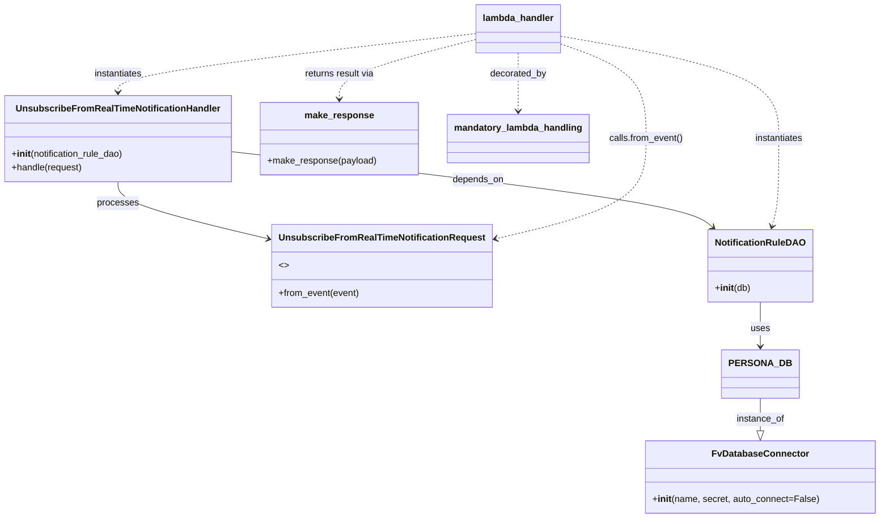

# Diagram: common/subscription_service/subscription_service/v2/unsubscribe_from_real_time_notification.py


> Auto-generated by Obscura crawlers

## Diagram 1

```mermaid
flowchart TD
    A[Lambda invoke: lambda_handler(event, context, audit_refs)] --> B[UnsubscribeFromRealTimeNotificationRequest.from_event(event)]
    B --> C[NotificationRuleDAO(PERSONA_DB)]
    C --> D[UnsubscribeFromRealTimeNotificationHandler(notification_rule_dao)]
    D --> E[handler.handle(request)]
    E --> F[make_response({})]
    A -. decorator .-> G[mandatory_lambda_handling]
```

> SVG rendering failed for this diagram.

## Diagram 2



### SVG

<svg id="container" width="1503.25390625" xmlns="http://www.w3.org/2000/svg" class="classDiagram" height="900" viewBox="0 0 1503.25390625 900" role="graphics-document document" aria-roledescription="class"><style>#container{font-family:"trebuchet ms",verdana,arial,sans-serif;font-size:16px;fill:#333;}@keyframes edge-animation-frame{from{stroke-dashoffset:0;}}@keyframes dash{to{stroke-dashoffset:0;}}#container .edge-animation-slow{stroke-dasharray:9,5!important;stroke-dashoffset:900;animation:dash 50s linear infinite;stroke-linecap:round;}#container .edge-animation-fast{stroke-dasharray:9,5!important;stroke-dashoffset:900;animation:dash 20s linear infinite;stroke-linecap:round;}#container .error-icon{fill:#552222;}#container .error-text{fill:#552222;stroke:#552222;}#container .edge-thickness-normal{stroke-width:1px;}#container .edge-thickness-thick{stroke-width:3.5px;}#container .edge-pattern-solid{stroke-dasharray:0;}#container .edge-thickness-invisible{stroke-width:0;fill:none;}#container .edge-pattern-dashed{stroke-dasharray:3;}#container .edge-pattern-dotted{stroke-dasharray:2;}#container .marker{fill:#333333;stroke:#333333;}#container .marker.cross{stroke:#333333;}#container svg{font-family:"trebuchet ms",verdana,arial,sans-serif;font-size:16px;}#container p{margin:0;}#container g.classGroup text{fill:#9370DB;stroke:none;font-family:"trebuchet ms",verdana,arial,sans-serif;font-size:10px;}#container g.classGroup text .title{font-weight:bolder;}#container .nodeLabel,#container .edgeLabel{color:#131300;}#container .edgeLabel .label rect{fill:#ECECFF;}#container .label text{fill:#131300;}#container .labelBkg{background:#ECECFF;}#container .edgeLabel .label span{background:#ECECFF;}#container .classTitle{font-weight:bolder;}#container .node rect,#container .node circle,#container .node ellipse,#container .node polygon,#container .node path{fill:#ECECFF;stroke:#9370DB;stroke-width:1px;}#container .divider{stroke:#9370DB;stroke-width:1;}#container g.clickable{cursor:pointer;}#container g.classGroup rect{fill:#ECECFF;stroke:#9370DB;}#container g.classGroup line{stroke:#9370DB;stroke-width:1;}#container .classLabel .box{stroke:none;stroke-width:0;fill:#ECECFF;opacity:0.5;}#container .classLabel .label{fill:#9370DB;font-size:10px;}#container .relation{stroke:#333333;stroke-width:1;fill:none;}#container .dashed-line{stroke-dasharray:3;}#container .dotted-line{stroke-dasharray:1 2;}#container #compositionStart,#container .composition{fill:#333333!important;stroke:#333333!important;stroke-width:1;}#container #compositionEnd,#container .composition{fill:#333333!important;stroke:#333333!important;stroke-width:1;}#container #dependencyStart,#container .dependency{fill:#333333!important;stroke:#333333!important;stroke-width:1;}#container #dependencyStart,#container .dependency{fill:#333333!important;stroke:#333333!important;stroke-width:1;}#container #extensionStart,#container .extension{fill:transparent!important;stroke:#333333!important;stroke-width:1;}#container #extensionEnd,#container .extension{fill:transparent!important;stroke:#333333!important;stroke-width:1;}#container #aggregationStart,#container .aggregation{fill:transparent!important;stroke:#333333!important;stroke-width:1;}#container #aggregationEnd,#container .aggregation{fill:transparent!important;stroke:#333333!important;stroke-width:1;}#container #lollipopStart,#container .lollipop{fill:#ECECFF!important;stroke:#333333!important;stroke-width:1;}#container #lollipopEnd,#container .lollipop{fill:#ECECFF!important;stroke:#333333!important;stroke-width:1;}#container .edgeTerminals{font-size:11px;line-height:initial;}#container .classTitleText{text-anchor:middle;font-size:18px;fill:#333;}#container .label-icon{display:inline-block;height:1em;overflow:visible;vertical-align:-0.125em;}#container .node .label-icon path{fill:currentColor;stroke:revert;stroke-width:revert;}#container :root{--mermaid-font-family:"trebuchet ms",verdana,arial,sans-serif;}</style><g><defs><marker id="container_class-aggregationStart" class="marker aggregation class" refX="18" refY="7" markerWidth="190" markerHeight="240" orient="auto"><path d="M 18,7 L9,13 L1,7 L9,1 Z"></path></marker></defs><defs><marker id="container_class-aggregationEnd" class="marker aggregation class" refX="1" refY="7" markerWidth="20" markerHeight="28" orient="auto"><path d="M 18,7 L9,13 L1,7 L9,1 Z"></path></marker></defs><defs><marker id="container_class-extensionStart" class="marker extension class" refX="18" refY="7" markerWidth="190" markerHeight="240" orient="auto"><path d="M 1,7 L18,13 V 1 Z"></path></marker></defs><defs><marker id="container_class-extensionEnd" class="marker extension class" refX="1" refY="7" markerWidth="20" markerHeight="28" orient="auto"><path d="M 1,1 V 13 L18,7 Z"></path></marker></defs><defs><marker id="container_class-compositionStart" class="marker composition class" refX="18" refY="7" markerWidth="190" markerHeight="240" orient="auto"><path d="M 18,7 L9,13 L1,7 L9,1 Z"></path></marker></defs><defs><marker id="container_class-compositionEnd" class="marker composition class" refX="1" refY="7" markerWidth="20" markerHeight="28" orient="auto"><path d="M 18,7 L9,13 L1,7 L9,1 Z"></path></marker></defs><defs><marker id="container_class-dependencyStart" class="marker dependency class" refX="6" refY="7" markerWidth="190" markerHeight="240" orient="auto"><path d="M 5,7 L9,13 L1,7 L9,1 Z"></path></marker></defs><defs><marker id="container_class-dependencyEnd" class="marker dependency class" refX="13" refY="7" markerWidth="20" markerHeight="28" orient="auto"><path d="M 18,7 L9,13 L14,7 L9,1 Z"></path></marker></defs><defs><marker id="container_class-lollipopStart" class="marker lollipop class" refX="13" refY="7" markerWidth="190" markerHeight="240" orient="auto"><circle stroke="black" fill="transparent" cx="7" cy="7" r="6"></circle></marker></defs><defs><marker id="container_class-lollipopEnd" class="marker lollipop class" refX="1" refY="7" markerWidth="190" markerHeight="240" orient="auto"><circle stroke="black" fill="transparent" cx="7" cy="7" r="6"></circle></marker></defs><g class="root"><g class="clusters"></g><g class="edgePaths"><path d="M1300.664,692L1300.664,698.167C1300.664,704.333,1300.664,716.667,1300.664,726.125C1300.664,735.583,1300.664,742.167,1300.664,745.458L1300.664,748.75" id="id_PERSONA_DB_FvDatabaseConnector_1" class="edge-thickness-normal edge-pattern-solid relation" style=";;;" data-edge="true" data-et="edge" data-id="id_PERSONA_DB_FvDatabaseConnector_1" data-points="W3sieCI6MTMwMC42NjQwNjI1LCJ5Ijo2OTJ9LHsieCI6MTMwMC42NjQwNjI1LCJ5Ijo3Mjl9LHsieCI6MTMwMC42NjQwNjI1LCJ5Ijo3NjZ9XQ==" marker-end="url(#container_class-extensionEnd)"></path><path d="M1300.664,525L1300.664,532.667C1300.664,540.333,1300.664,555.667,1300.664,568.5C1300.664,581.333,1300.664,591.667,1300.664,596.833L1300.664,602" id="id_NotificationRuleDAO_PERSONA_DB_2" class="edge-thickness-normal edge-pattern-solid relation" style=";;;" data-edge="true" data-et="edge" data-id="id_NotificationRuleDAO_PERSONA_DB_2" data-points="W3sieCI6MTMwMC42NjQwNjI1LCJ5Ijo1MjV9LHsieCI6MTMwMC42NjQwNjI1LCJ5Ijo1NzF9LHsieCI6MTMwMC42NjQwNjI1LCJ5Ijo2MDh9XQ==" marker-end="url(#container_class-dependencyEnd)"></path><path d="M399.602,263.607L528.643,278.506C657.685,293.404,915.768,323.202,1052.971,345.116C1190.174,367.03,1206.496,381.059,1214.657,388.074L1222.819,395.089" id="id_UnsubscribeFromRealTimeNotificationHandler_NotificationRuleDAO_3" class="edge-thickness-normal edge-pattern-solid relation" style=";;;" data-edge="true" data-et="edge" data-id="id_UnsubscribeFromRealTimeNotificationHandler_NotificationRuleDAO_3" data-points="W3sieCI6Mzk5LjYwMTU2MjUsInkiOjI2My42MDY3NDE3NTQwMTU4fSx7IngiOjExNzMuODUxNTYyNSwieSI6MzUzfSx7IngiOjEyMjcuMzY4NzY0MzM0ODYyNCwieSI6Mzk5fV0=" marker-end="url(#container_class-dependencyEnd)"></path><path d="M203.801,316L203.801,322.167C203.801,328.333,203.801,340.667,247.968,357.468C292.136,374.27,380.471,395.539,424.638,406.174L468.805,416.809" id="id_UnsubscribeFromRealTimeNotificationHandler_UnsubscribeFromRealTimeNotificationRequest_4" class="edge-thickness-normal edge-pattern-solid relation" style=";;;" data-edge="true" data-et="edge" data-id="id_UnsubscribeFromRealTimeNotificationHandler_UnsubscribeFromRealTimeNotificationRequest_4" data-points="W3sieCI6MjAzLjgwMDc4MTI1LCJ5IjozMTZ9LHsieCI6MjAzLjgwMDc4MTI1LCJ5IjozNTN9LHsieCI6NDc0LjYzODY3MTg3NSwieSI6NDE4LjIxMzIwNDkzNDA1M31d" marker-end="url(#container_class-dependencyEnd)"></path><path d="M962.07,75.954L986.589,84.795C1011.107,93.636,1060.143,111.318,1084.661,138.826C1109.18,166.333,1109.18,203.667,1109.18,241C1109.18,278.333,1109.18,315.667,1065.012,344.968C1020.845,374.27,932.51,395.539,888.343,406.174L844.175,416.809" id="id_lambda_handler_UnsubscribeFromRealTimeNotificationRequest_5" class="edge-thickness-normal edge-pattern-dashed relation" style=";;;" data-edge="true" data-et="edge" data-id="id_lambda_handler_UnsubscribeFromRealTimeNotificationRequest_5" data-points="W3sieCI6OTYyLjA3MDMxMjUsInkiOjc1Ljk1Mzk2MzU1NTk2NzYyfSx7IngiOjExMDkuMTc5Njg3NSwieSI6MTI5fSx7IngiOjExMDkuMTc5Njg3NSwieSI6MjQxfSx7IngiOjExMDkuMTc5Njg3NSwieSI6MzUzfSx7IngiOjgzOC4zNDE3OTY4NzUsInkiOjQxOC4yMTMyMDQ5MzQwNTN9XQ==" marker-end="url(#container_class-dependencyEnd)"></path><path d="M962.07,62.838L1023.892,73.865C1085.714,84.892,1209.357,106.946,1271.178,136.64C1333,166.333,1333,203.667,1333,241C1333,278.333,1333,315.667,1331.01,341.041C1329.02,366.416,1325.04,379.832,1323.05,386.54L1321.06,393.248" id="id_lambda_handler_NotificationRuleDAO_6" class="edge-thickness-normal edge-pattern-dashed relation" style=";;;" data-edge="true" data-et="edge" data-id="id_lambda_handler_NotificationRuleDAO_6" data-points="W3sieCI6OTYyLjA3MDMxMjUsInkiOjYyLjgzODI2NjQyMjA3MDEzNH0seyJ4IjoxMzMzLCJ5IjoxMjl9LHsieCI6MTMzMywieSI6MjQxfSx7IngiOjEzMzMsInkiOjM1M30seyJ4IjoxMzE5LjM1MzY0MTA1NTA0NiwieSI6Mzk5fV0=" marker-end="url(#container_class-dependencyEnd)"></path><path d="M818.117,58.285L715.731,70.071C613.345,81.857,408.573,105.428,306.187,122.381C203.801,139.333,203.801,149.667,203.801,154.833L203.801,160" id="id_lambda_handler_UnsubscribeFromRealTimeNotificationHandler_7" class="edge-thickness-normal edge-pattern-dashed relation" style=";;;" data-edge="true" data-et="edge" data-id="id_lambda_handler_UnsubscribeFromRealTimeNotificationHandler_7" data-points="W3sieCI6ODE4LjExNzE4NzUsInkiOjU4LjI4NTMwNzcyNzc3MjA1fSx7IngiOjIwMy44MDA3ODEyNSwieSI6MTI5fSx7IngiOjIwMy44MDA3ODEyNSwieSI6MTY2fV0=" marker-end="url(#container_class-dependencyEnd)"></path><path d="M818.117,68.645L779.286,78.705C740.456,88.764,662.794,108.882,623.964,126.108C585.133,143.333,585.133,157.667,585.133,164.833L585.133,172" id="id_lambda_handler_make_response_8" class="edge-thickness-normal edge-pattern-dashed relation" style=";;;" data-edge="true" data-et="edge" data-id="id_lambda_handler_make_response_8" data-points="W3sieCI6ODE4LjExNzE4NzUsInkiOjY4LjY0NTQ5NzYzMDMzMTc2fSx7IngiOjU4NS4xMzI4MTI1LCJ5IjoxMjl9LHsieCI6NTg1LjEzMjgxMjUsInkiOjE3OH1d" marker-end="url(#container_class-dependencyEnd)"></path><path d="M890.094,92L890.094,98.167C890.094,104.333,890.094,116.667,890.094,133.5C890.094,150.333,890.094,171.667,890.094,182.333L890.094,193" id="id_lambda_handler_mandatory_lambda_handling_9" class="edge-thickness-normal edge-pattern-dashed relation" style=";;;" data-edge="true" data-et="edge" data-id="id_lambda_handler_mandatory_lambda_handling_9" data-points="W3sieCI6ODkwLjA5Mzc1LCJ5Ijo5Mn0seyJ4Ijo4OTAuMDkzNzUsInkiOjEyOX0seyJ4Ijo4OTAuMDkzNzUsInkiOjE5OX1d" marker-end="url(#container_class-dependencyEnd)"></path></g><g class="edgeLabels"><g class="edgeLabel" transform="translate(1300.6640625, 729)"><g class="label" data-id="id_PERSONA_DB_FvDatabaseConnector_1" transform="translate(-41.7734375, -12)"><foreignObject width="83.546875" height="24"><div xmlns="http://www.w3.org/1999/xhtml" class="labelBkg" style="display: table-cell; white-space: nowrap; line-height: 1.5; max-width: 200px; text-align: center;"><span class="edgeLabel"><p>instance_of</p></span></div></foreignObject></g></g><g class="edgeLabel" transform="translate(1300.6640625, 571)"><g class="label" data-id="id_NotificationRuleDAO_PERSONA_DB_2" transform="translate(-16.4921875, -12)"><foreignObject width="32.984375" height="24"><div xmlns="http://www.w3.org/1999/xhtml" class="labelBkg" style="display: table-cell; white-space: nowrap; line-height: 1.5; max-width: 200px; text-align: center;"><span class="edgeLabel"><p>uses</p></span></div></foreignObject></g></g><g class="edgeLabel" transform="translate(821.77858, 312.3504)"><g class="label" data-id="id_UnsubscribeFromRealTimeNotificationHandler_NotificationRuleDAO_3" transform="translate(-44.671875, -12)"><foreignObject width="89.34375" height="24"><div xmlns="http://www.w3.org/1999/xhtml" class="labelBkg" style="display: table-cell; white-space: nowrap; line-height: 1.5; max-width: 200px; text-align: center;"><span class="edgeLabel"><p>depends_on</p></span></div></foreignObject></g></g><g class="edgeLabel" transform="translate(203.80078125, 353)"><g class="label" data-id="id_UnsubscribeFromRealTimeNotificationHandler_UnsubscribeFromRealTimeNotificationRequest_4" transform="translate(-35.7890625, -12)"><foreignObject width="71.578125" height="24"><div xmlns="http://www.w3.org/1999/xhtml" class="labelBkg" style="display: table-cell; white-space: nowrap; line-height: 1.5; max-width: 200px; text-align: center;"><span class="edgeLabel"><p>processes</p></span></div></foreignObject></g></g><g class="edgeLabel" transform="translate(1109.1796875, 241)"><g class="label" data-id="id_lambda_handler_UnsubscribeFromRealTimeNotificationRequest_5" transform="translate(-64.65625, -12)"><foreignObject width="129.3125" height="24"><div xmlns="http://www.w3.org/1999/xhtml" class="labelBkg" style="display: table-cell; white-space: nowrap; line-height: 1.5; max-width: 200px; text-align: center;"><span class="edgeLabel"><p>calls.from_event()</p></span></div></foreignObject></g></g><g class="edgeLabel" transform="translate(1333, 241)"><g class="label" data-id="id_lambda_handler_NotificationRuleDAO_6" transform="translate(-42.9140625, -12)"><foreignObject width="85.828125" height="24"><div xmlns="http://www.w3.org/1999/xhtml" class="labelBkg" style="display: table-cell; white-space: nowrap; line-height: 1.5; max-width: 200px; text-align: center;"><span class="edgeLabel"><p>instantiates</p></span></div></foreignObject></g></g><g class="edgeLabel" transform="translate(203.80078125, 129)"><g class="label" data-id="id_lambda_handler_UnsubscribeFromRealTimeNotificationHandler_7" transform="translate(-42.9140625, -12)"><foreignObject width="85.828125" height="24"><div xmlns="http://www.w3.org/1999/xhtml" class="labelBkg" style="display: table-cell; white-space: nowrap; line-height: 1.5; max-width: 200px; text-align: center;"><span class="edgeLabel"><p>instantiates</p></span></div></foreignObject></g></g><g class="edgeLabel" transform="translate(585.1328125, 129)"><g class="label" data-id="id_lambda_handler_make_response_8" transform="translate(-61.8828125, -12)"><foreignObject width="123.765625" height="24"><div xmlns="http://www.w3.org/1999/xhtml" class="labelBkg" style="display: table-cell; white-space: nowrap; line-height: 1.5; max-width: 200px; text-align: center;"><span class="edgeLabel"><p>returns result via</p></span></div></foreignObject></g></g><g class="edgeLabel" transform="translate(890.09375, 129)"><g class="label" data-id="id_lambda_handler_mandatory_lambda_handling_9" transform="translate(-49.375, -12)"><foreignObject width="98.75" height="24"><div xmlns="http://www.w3.org/1999/xhtml" class="labelBkg" style="display: table-cell; white-space: nowrap; line-height: 1.5; max-width: 200px; text-align: center;"><span class="edgeLabel"><p>decorated_by</p></span></div></foreignObject></g></g></g><g class="nodes"><g class="node default" id="classId-FvDatabaseConnector-0" transform="translate(1300.6640625, 829)"><g class="basic label-container"><path d="M-194.58984375 -63 L194.58984375 -63 L194.58984375 63 L-194.58984375 63" stroke="none" stroke-width="0" fill="#ECECFF" style=""></path><path d="M-194.58984375 -63 C-50.935937171432755 -63, 92.71796940713449 -63, 194.58984375 -63 M-194.58984375 -63 C-73.60854820073284 -63, 47.37274734853432 -63, 194.58984375 -63 M194.58984375 -63 C194.58984375 -21.073495615788566, 194.58984375 20.853008768422868, 194.58984375 63 M194.58984375 -63 C194.58984375 -35.057018146362, 194.58984375 -7.114036292724002, 194.58984375 63 M194.58984375 63 C88.89318781305336 63, -16.803468123893282 63, -194.58984375 63 M194.58984375 63 C40.64337549452287 63, -113.30309276095426 63, -194.58984375 63 M-194.58984375 63 C-194.58984375 20.527526774640776, -194.58984375 -21.944946450718447, -194.58984375 -63 M-194.58984375 63 C-194.58984375 20.66697890603747, -194.58984375 -21.666042187925058, -194.58984375 -63" stroke="#9370DB" stroke-width="1.3" fill="none" stroke-dasharray="0 0" style=""></path></g><g class="annotation-group text" transform="translate(0, -39)"></g><g class="label-group text" transform="translate(-79.3046875, -39)"><g class="label" style="font-weight: bolder" transform="translate(0,-12)"><foreignObject width="158.609375" height="24"><div xmlns="http://www.w3.org/1999/xhtml" style="display: table-cell; white-space: nowrap; line-height: 1.5; max-width: 207px; text-align: center;"><span class="nodeLabel markdown-node-label" style=""><p>FvDatabaseConnector</p></span></div></foreignObject></g></g><g class="members-group text" transform="translate(-182.58984375, 9)"></g><g class="methods-group text" transform="translate(-182.58984375, 39)"><g class="label" style="" transform="translate(0,-12)"><foreignObject width="285.875" height="24"><div xmlns="http://www.w3.org/1999/xhtml" style="display: table-cell; white-space: nowrap; line-height: 1.5; max-width: 375px; text-align: center;"><span class="nodeLabel markdown-node-label" style=""><p>+<strong>init</strong>(name, secret, auto_connect=False)</p></span></div></foreignObject></g></g><g class="divider" style=""><path d="M-194.58984375 -15 C-97.0955457302925 -15, 0.3987522894150004 -15, 194.58984375 -15 M-194.58984375 -15 C-94.53876770908255 -15, 5.512308331834902 -15, 194.58984375 -15" stroke="#9370DB" stroke-width="1.3" fill="none" stroke-dasharray="0 0" style=""></path></g><g class="divider" style=""><path d="M-194.58984375 9 C-89.09295430080329 9, 16.40393514839343 9, 194.58984375 9 M-194.58984375 9 C-46.354618640327516 9, 101.88060646934497 9, 194.58984375 9" stroke="#9370DB" stroke-width="1.3" fill="none" stroke-dasharray="0 0" style=""></path></g></g><g class="node default" id="classId-PERSONA_DB-1" transform="translate(1300.6640625, 650)"><g class="basic label-container"><path d="M-60.3046875 -42 L60.3046875 -42 L60.3046875 42 L-60.3046875 42" stroke="none" stroke-width="0" fill="#ECECFF" style=""></path><path d="M-60.3046875 -42 C-31.60183287185204 -42, -2.8989782437040787 -42, 60.3046875 -42 M-60.3046875 -42 C-32.865093001097506 -42, -5.425498502195019 -42, 60.3046875 -42 M60.3046875 -42 C60.3046875 -20.092310837242636, 60.3046875 1.8153783255147289, 60.3046875 42 M60.3046875 -42 C60.3046875 -15.4275211432195, 60.3046875 11.144957713560999, 60.3046875 42 M60.3046875 42 C35.23634179045372 42, 10.167996080907443 42, -60.3046875 42 M60.3046875 42 C18.159738362598624 42, -23.985210774802752 42, -60.3046875 42 M-60.3046875 42 C-60.3046875 12.549505217764736, -60.3046875 -16.900989564470528, -60.3046875 -42 M-60.3046875 42 C-60.3046875 16.008380600190453, -60.3046875 -9.983238799619095, -60.3046875 -42" stroke="#9370DB" stroke-width="1.3" fill="none" stroke-dasharray="0 0" style=""></path></g><g class="annotation-group text" transform="translate(0, -18)"></g><g class="label-group text" transform="translate(-48.3046875, -18)"><g class="label" style="font-weight: bolder" transform="translate(0,-12)"><foreignObject width="96.609375" height="24"><div xmlns="http://www.w3.org/1999/xhtml" style="display: table-cell; white-space: nowrap; line-height: 1.5; max-width: 146px; text-align: center;"><span class="nodeLabel markdown-node-label" style=""><p>PERSONA_DB</p></span></div></foreignObject></g></g><g class="members-group text" transform="translate(-48.3046875, 30)"></g><g class="methods-group text" transform="translate(-48.3046875, 60)"></g><g class="divider" style=""><path d="M-60.3046875 6 C-18.27127065648127 6, 23.76214618703746 6, 60.3046875 6 M-60.3046875 6 C-34.22993976493902 6, -8.155192029878044 6, 60.3046875 6" stroke="#9370DB" stroke-width="1.3" fill="none" stroke-dasharray="0 0" style=""></path></g><g class="divider" style=""><path d="M-60.3046875 24 C-17.21390986329591 24, 25.87686777340818 24, 60.3046875 24 M-60.3046875 24 C-17.081851256629577 24, 26.140984986740847 24, 60.3046875 24" stroke="#9370DB" stroke-width="1.3" fill="none" stroke-dasharray="0 0" style=""></path></g></g><g class="node default" id="classId-UnsubscribeFromRealTimeNotificationRequest-2" transform="translate(656.490234375, 462)"><g class="basic label-container"><path d="M-181.8515625 -72 L181.8515625 -72 L181.8515625 72 L-181.8515625 72" stroke="none" stroke-width="0" fill="#ECECFF" style=""></path><path d="M-181.8515625 -72 C-73.20782878663942 -72, 35.43590492672115 -72, 181.8515625 -72 M-181.8515625 -72 C-70.46074238191767 -72, 40.93007773616466 -72, 181.8515625 -72 M181.8515625 -72 C181.8515625 -28.191927267018208, 181.8515625 15.616145465963584, 181.8515625 72 M181.8515625 -72 C181.8515625 -38.23939338570706, 181.8515625 -4.478786771414121, 181.8515625 72 M181.8515625 72 C62.06606266467608 72, -57.719437170647836 72, -181.8515625 72 M181.8515625 72 C105.95186719532613 72, 30.05217189065226 72, -181.8515625 72 M-181.8515625 72 C-181.8515625 33.47165516278338, -181.8515625 -5.056689674433244, -181.8515625 -72 M-181.8515625 72 C-181.8515625 19.924736706654585, -181.8515625 -32.15052658669083, -181.8515625 -72" stroke="#9370DB" stroke-width="1.3" fill="none" stroke-dasharray="0 0" style=""></path></g><g class="annotation-group text" transform="translate(0, -48)"></g><g class="label-group text" transform="translate(-169.8515625, -48)"><g class="label" style="font-weight: bolder" transform="translate(0,-12)"><foreignObject width="339.703125" height="24"><div xmlns="http://www.w3.org/1999/xhtml" style="display: table-cell; white-space: nowrap; line-height: 1.5; max-width: 387px; text-align: center;"><span class="nodeLabel markdown-node-label" style=""><p>UnsubscribeFromRealTimeNotificationRequest</p></span></div></foreignObject></g></g><g class="members-group text" transform="translate(-169.8515625, 0)"><g class="label" style="" transform="translate(0,-12)"><foreignObject width="16.015625" height="24"><div xmlns="http://www.w3.org/1999/xhtml" style="display: table-cell; white-space: nowrap; line-height: 1.5; max-width: 106px; text-align: center;"><span class="nodeLabel markdown-node-label" style=""><p>&lt;&gt;</p></span></div></foreignObject></g></g><g class="methods-group text" transform="translate(-169.8515625, 48)"><g class="label" style="" transform="translate(0,-12)"><foreignObject width="140.90625" height="24"><div xmlns="http://www.w3.org/1999/xhtml" style="display: table-cell; white-space: nowrap; line-height: 1.5; max-width: 198px; text-align: center;"><span class="nodeLabel markdown-node-label" style=""><p>+from_event(event)</p></span></div></foreignObject></g></g><g class="divider" style=""><path d="M-181.8515625 -24 C-55.922413662896744 -24, 70.00673517420651 -24, 181.8515625 -24 M-181.8515625 -24 C-104.86492488745712 -24, -27.878287274914243 -24, 181.8515625 -24" stroke="#9370DB" stroke-width="1.3" fill="none" stroke-dasharray="0 0" style=""></path></g><g class="divider" style=""><path d="M-181.8515625 24 C-85.1307460508336 24, 11.590070398332813 24, 181.8515625 24 M-181.8515625 24 C-68.59812877203012 24, 44.655304955939755 24, 181.8515625 24" stroke="#9370DB" stroke-width="1.3" fill="none" stroke-dasharray="0 0" style=""></path></g></g><g class="node default" id="classId-NotificationRuleDAO-3" transform="translate(1300.6640625, 462)"><g class="basic label-container"><path d="M-86.4453125 -63 L86.4453125 -63 L86.4453125 63 L-86.4453125 63" stroke="none" stroke-width="0" fill="#ECECFF" style=""></path><path d="M-86.4453125 -63 C-31.37420732554292 -63, 23.696897848914162 -63, 86.4453125 -63 M-86.4453125 -63 C-32.12567493153521 -63, 22.193962636929584 -63, 86.4453125 -63 M86.4453125 -63 C86.4453125 -17.217662563261108, 86.4453125 28.564674873477784, 86.4453125 63 M86.4453125 -63 C86.4453125 -36.27020636017464, 86.4453125 -9.54041272034928, 86.4453125 63 M86.4453125 63 C24.588198089690117 63, -37.268916320619766 63, -86.4453125 63 M86.4453125 63 C34.767669172818735 63, -16.90997415436253 63, -86.4453125 63 M-86.4453125 63 C-86.4453125 20.670296844794414, -86.4453125 -21.65940631041117, -86.4453125 -63 M-86.4453125 63 C-86.4453125 23.283974572890024, -86.4453125 -16.432050854219952, -86.4453125 -63" stroke="#9370DB" stroke-width="1.3" fill="none" stroke-dasharray="0 0" style=""></path></g><g class="annotation-group text" transform="translate(0, -39)"></g><g class="label-group text" transform="translate(-74.4453125, -39)"><g class="label" style="font-weight: bolder" transform="translate(0,-12)"><foreignObject width="148.890625" height="24"><div xmlns="http://www.w3.org/1999/xhtml" style="display: table-cell; white-space: nowrap; line-height: 1.5; max-width: 198px; text-align: center;"><span class="nodeLabel markdown-node-label" style=""><p>NotificationRuleDAO</p></span></div></foreignObject></g></g><g class="members-group text" transform="translate(-74.4453125, 9)"></g><g class="methods-group text" transform="translate(-74.4453125, 39)"><g class="label" style="" transform="translate(0,-12)"><foreignObject width="61.875" height="24"><div xmlns="http://www.w3.org/1999/xhtml" style="display: table-cell; white-space: nowrap; line-height: 1.5; max-width: 151px; text-align: center;"><span class="nodeLabel markdown-node-label" style=""><p>+<strong>init</strong>(db)</p></span></div></foreignObject></g></g><g class="divider" style=""><path d="M-86.4453125 -15 C-33.379304906612425 -15, 19.68670268677515 -15, 86.4453125 -15 M-86.4453125 -15 C-36.92652680287273 -15, 12.592258894254542 -15, 86.4453125 -15" stroke="#9370DB" stroke-width="1.3" fill="none" stroke-dasharray="0 0" style=""></path></g><g class="divider" style=""><path d="M-86.4453125 9 C-43.75081424005894 9, -1.056315980117887 9, 86.4453125 9 M-86.4453125 9 C-26.650089604922528 9, 33.145133290154945 9, 86.4453125 9" stroke="#9370DB" stroke-width="1.3" fill="none" stroke-dasharray="0 0" style=""></path></g></g><g class="node default" id="classId-UnsubscribeFromRealTimeNotificationHandler-4" transform="translate(203.80078125, 241)"><g class="basic label-container"><path d="M-195.80078125 -75 L195.80078125 -75 L195.80078125 75 L-195.80078125 75" stroke="none" stroke-width="0" fill="#ECECFF" style=""></path><path d="M-195.80078125 -75 C-83.06882652705455 -75, 29.66312819589089 -75, 195.80078125 -75 M-195.80078125 -75 C-117.21853344143717 -75, -38.63628563287435 -75, 195.80078125 -75 M195.80078125 -75 C195.80078125 -30.364901304280586, 195.80078125 14.270197391438828, 195.80078125 75 M195.80078125 -75 C195.80078125 -28.019108024717966, 195.80078125 18.96178395056407, 195.80078125 75 M195.80078125 75 C46.174310507148135 75, -103.45216023570373 75, -195.80078125 75 M195.80078125 75 C59.510330629946026 75, -76.78011999010795 75, -195.80078125 75 M-195.80078125 75 C-195.80078125 23.527305442939358, -195.80078125 -27.945389114121284, -195.80078125 -75 M-195.80078125 75 C-195.80078125 19.131761651454163, -195.80078125 -36.736476697091675, -195.80078125 -75" stroke="#9370DB" stroke-width="1.3" fill="none" stroke-dasharray="0 0" style=""></path></g><g class="annotation-group text" transform="translate(0, -51)"></g><g class="label-group text" transform="translate(-168.9609375, -51)"><g class="label" style="font-weight: bolder" transform="translate(0,-12)"><foreignObject width="337.921875" height="24"><div xmlns="http://www.w3.org/1999/xhtml" style="display: table-cell; white-space: nowrap; line-height: 1.5; max-width: 387px; text-align: center;"><span class="nodeLabel markdown-node-label" style=""><p>UnsubscribeFromRealTimeNotificationHandler</p></span></div></foreignObject></g></g><g class="members-group text" transform="translate(-183.80078125, -3)"></g><g class="methods-group text" transform="translate(-183.80078125, 27)"><g class="label" style="" transform="translate(0,-12)"><foreignObject width="198.640625" height="24"><div xmlns="http://www.w3.org/1999/xhtml" style="display: table-cell; white-space: nowrap; line-height: 1.5; max-width: 287px; text-align: center;"><span class="nodeLabel markdown-node-label" style=""><p>+<strong>init</strong>(notification_rule_dao)</p></span></div></foreignObject></g><g class="label" style="" transform="translate(0,12)"><foreignObject width="123.96875" height="24"><div xmlns="http://www.w3.org/1999/xhtml" style="display: table-cell; white-space: nowrap; line-height: 1.5; max-width: 181px; text-align: center;"><span class="nodeLabel markdown-node-label" style=""><p>+handle(request)</p></span></div></foreignObject></g></g><g class="divider" style=""><path d="M-195.80078125 -27 C-114.95307959325329 -27, -34.105377936506585 -27, 195.80078125 -27 M-195.80078125 -27 C-117.1598176474137 -27, -38.51885404482741 -27, 195.80078125 -27" stroke="#9370DB" stroke-width="1.3" fill="none" stroke-dasharray="0 0" style=""></path></g><g class="divider" style=""><path d="M-195.80078125 -3 C-57.88361788233766 -3, 80.03354548532468 -3, 195.80078125 -3 M-195.80078125 -3 C-85.95279337840637 -3, 23.89519449318726 -3, 195.80078125 -3" stroke="#9370DB" stroke-width="1.3" fill="none" stroke-dasharray="0 0" style=""></path></g></g><g class="node default" id="classId-make_response-5" transform="translate(585.1328125, 241)"><g class="basic label-container"><path d="M-135.53125 -63 L135.53125 -63 L135.53125 63 L-135.53125 63" stroke="none" stroke-width="0" fill="#ECECFF" style=""></path><path d="M-135.53125 -63 C-48.4125860006762 -63, 38.7060779986476 -63, 135.53125 -63 M-135.53125 -63 C-32.31618230027799 -63, 70.89888539944403 -63, 135.53125 -63 M135.53125 -63 C135.53125 -32.55101825001293, 135.53125 -2.1020365000258536, 135.53125 63 M135.53125 -63 C135.53125 -30.30925518686371, 135.53125 2.3814896262725824, 135.53125 63 M135.53125 63 C48.25071239527816 63, -39.029825209443686 63, -135.53125 63 M135.53125 63 C62.54723248495267 63, -10.436785030094654 63, -135.53125 63 M-135.53125 63 C-135.53125 27.276470401738443, -135.53125 -8.447059196523114, -135.53125 -63 M-135.53125 63 C-135.53125 33.90628950366741, -135.53125 4.8125790073348185, -135.53125 -63" stroke="#9370DB" stroke-width="1.3" fill="none" stroke-dasharray="0 0" style=""></path></g><g class="annotation-group text" transform="translate(0, -39)"></g><g class="label-group text" transform="translate(-57.46875, -39)"><g class="label" style="font-weight: bolder" transform="translate(0,-12)"><foreignObject width="114.9375" height="24"><div xmlns="http://www.w3.org/1999/xhtml" style="display: table-cell; white-space: nowrap; line-height: 1.5; max-width: 164px; text-align: center;"><span class="nodeLabel markdown-node-label" style=""><p>make_response</p></span></div></foreignObject></g></g><g class="members-group text" transform="translate(-123.53125, 9)"></g><g class="methods-group text" transform="translate(-123.53125, 39)"><g class="label" style="" transform="translate(0,-12)"><foreignObject width="189.59375" height="24"><div xmlns="http://www.w3.org/1999/xhtml" style="display: table-cell; white-space: nowrap; line-height: 1.5; max-width: 247px; text-align: center;"><span class="nodeLabel markdown-node-label" style=""><p>+make_response(payload)</p></span></div></foreignObject></g></g><g class="divider" style=""><path d="M-135.53125 -15 C-54.80977618914103 -15, 25.911697621717934 -15, 135.53125 -15 M-135.53125 -15 C-61.57864927553537 -15, 12.373951448929262 -15, 135.53125 -15" stroke="#9370DB" stroke-width="1.3" fill="none" stroke-dasharray="0 0" style=""></path></g><g class="divider" style=""><path d="M-135.53125 9 C-53.85682732814354 9, 27.817595343712924 9, 135.53125 9 M-135.53125 9 C-45.677943130690096 9, 44.17536373861981 9, 135.53125 9" stroke="#9370DB" stroke-width="1.3" fill="none" stroke-dasharray="0 0" style=""></path></g></g><g class="node default" id="classId-mandatory_lambda_handling-6" transform="translate(890.09375, 241)"><g class="basic label-container"><path d="M-119.4296875 -42 L119.4296875 -42 L119.4296875 42 L-119.4296875 42" stroke="none" stroke-width="0" fill="#ECECFF" style=""></path><path d="M-119.4296875 -42 C-46.26862741732357 -42, 26.892432665352857 -42, 119.4296875 -42 M-119.4296875 -42 C-27.458612985848006 -42, 64.51246152830399 -42, 119.4296875 -42 M119.4296875 -42 C119.4296875 -19.178921190607703, 119.4296875 3.6421576187845943, 119.4296875 42 M119.4296875 -42 C119.4296875 -22.11869269415164, 119.4296875 -2.237385388303281, 119.4296875 42 M119.4296875 42 C36.48032215492749 42, -46.469043190145015 42, -119.4296875 42 M119.4296875 42 C39.45259925912231 42, -40.52448898175538 42, -119.4296875 42 M-119.4296875 42 C-119.4296875 16.507750520238474, -119.4296875 -8.984498959523052, -119.4296875 -42 M-119.4296875 42 C-119.4296875 23.492938930450165, -119.4296875 4.985877860900331, -119.4296875 -42" stroke="#9370DB" stroke-width="1.3" fill="none" stroke-dasharray="0 0" style=""></path></g><g class="annotation-group text" transform="translate(0, -18)"></g><g class="label-group text" transform="translate(-107.4296875, -18)"><g class="label" style="font-weight: bolder" transform="translate(0,-12)"><foreignObject width="214.859375" height="24"><div xmlns="http://www.w3.org/1999/xhtml" style="display: table-cell; white-space: nowrap; line-height: 1.5; max-width: 264px; text-align: center;"><span class="nodeLabel markdown-node-label" style=""><p>mandatory_lambda_handling</p></span></div></foreignObject></g></g><g class="members-group text" transform="translate(-107.4296875, 30)"></g><g class="methods-group text" transform="translate(-107.4296875, 60)"></g><g class="divider" style=""><path d="M-119.4296875 6 C-40.72380341183478 6, 37.98208067633044 6, 119.4296875 6 M-119.4296875 6 C-24.596260083785964 6, 70.23716733242807 6, 119.4296875 6" stroke="#9370DB" stroke-width="1.3" fill="none" stroke-dasharray="0 0" style=""></path></g><g class="divider" style=""><path d="M-119.4296875 24 C-66.94294917294921 24, -14.456210845898426 24, 119.4296875 24 M-119.4296875 24 C-43.08089957317749 24, 33.26788835364502 24, 119.4296875 24" stroke="#9370DB" stroke-width="1.3" fill="none" stroke-dasharray="0 0" style=""></path></g></g><g class="node default" id="classId-lambda_handler-7" transform="translate(890.09375, 50)"><g class="basic label-container"><path d="M-71.9765625 -42 L71.9765625 -42 L71.9765625 42 L-71.9765625 42" stroke="none" stroke-width="0" fill="#ECECFF" style=""></path><path d="M-71.9765625 -42 C-21.820603296707617 -42, 28.335355906584766 -42, 71.9765625 -42 M-71.9765625 -42 C-33.505097723074606 -42, 4.966367053850789 -42, 71.9765625 -42 M71.9765625 -42 C71.9765625 -19.44824234423948, 71.9765625 3.1035153115210434, 71.9765625 42 M71.9765625 -42 C71.9765625 -20.758739668644502, 71.9765625 0.48252066271099636, 71.9765625 42 M71.9765625 42 C36.111146773893815 42, 0.2457310477876291 42, -71.9765625 42 M71.9765625 42 C36.9078470564513 42, 1.8391316129026052 42, -71.9765625 42 M-71.9765625 42 C-71.9765625 16.043013822719555, -71.9765625 -9.91397235456089, -71.9765625 -42 M-71.9765625 42 C-71.9765625 15.911086589764423, -71.9765625 -10.177826820471154, -71.9765625 -42" stroke="#9370DB" stroke-width="1.3" fill="none" stroke-dasharray="0 0" style=""></path></g><g class="annotation-group text" transform="translate(0, -18)"></g><g class="label-group text" transform="translate(-59.9765625, -18)"><g class="label" style="font-weight: bolder" transform="translate(0,-12)"><foreignObject width="119.953125" height="24"><div xmlns="http://www.w3.org/1999/xhtml" style="display: table-cell; white-space: nowrap; line-height: 1.5; max-width: 170px; text-align: center;"><span class="nodeLabel markdown-node-label" style=""><p>lambda_handler</p></span></div></foreignObject></g></g><g class="members-group text" transform="translate(-59.9765625, 30)"></g><g class="methods-group text" transform="translate(-59.9765625, 60)"></g><g class="divider" style=""><path d="M-71.9765625 6 C-41.4959483631834 6, -11.015334226366804 6, 71.9765625 6 M-71.9765625 6 C-38.19357005627532 6, -4.4105776125506395 6, 71.9765625 6" stroke="#9370DB" stroke-width="1.3" fill="none" stroke-dasharray="0 0" style=""></path></g><g class="divider" style=""><path d="M-71.9765625 24 C-28.730332360045843 24, 14.515897779908315 24, 71.9765625 24 M-71.9765625 24 C-31.336326800273397 24, 9.303908899453205 24, 71.9765625 24" stroke="#9370DB" stroke-width="1.3" fill="none" stroke-dasharray="0 0" style=""></path></g></g></g></g></g></svg>
