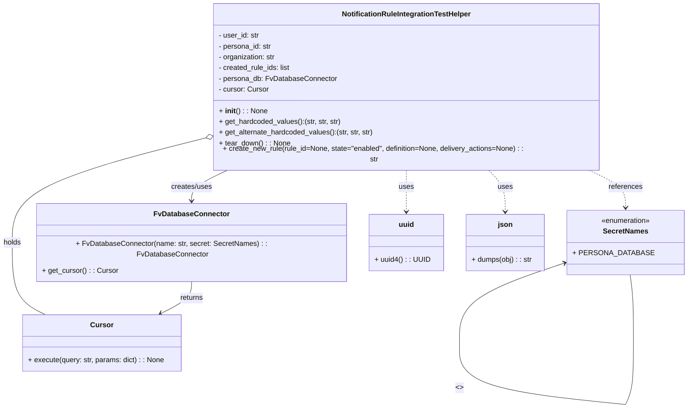

# Diagram: common/subscription_service/subscription_service_tests/integration/notification_rule_test_helper.py

> Auto-generated by Obscura crawlers

## Mermaid

### SVG

<svg id="container" width="1496.7578125" xmlns="http://www.w3.org/2000/svg" class="classDiagram" height="874.1499633789062" viewBox="0 0 1496.7578125 874.1499633789062" role="graphics-document document" aria-roledescription="class"><g><defs><marker id="container_class-aggregationStart" class="marker aggregation class" refX="18" refY="7" markerWidth="190" markerHeight="240" orient="auto"><path d="M 18,7 L9,13 L1,7 L9,1 Z"></path></marker></defs><defs><marker id="container_class-aggregationEnd" class="marker aggregation class" refX="1" refY="7" markerWidth="20" markerHeight="28" orient="auto"><path d="M 18,7 L9,13 L1,7 L9,1 Z"></path></marker></defs><defs><marker id="container_class-extensionStart" class="marker extension class" refX="18" refY="7" markerWidth="190" markerHeight="240" orient="auto"><path d="M 1,7 L18,13 V 1 Z"></path></marker></defs><defs><marker id="container_class-extensionEnd" class="marker extension class" refX="1" refY="7" markerWidth="20" markerHeight="28" orient="auto"><path d="M 1,1 V 13 L18,7 Z"></path></marker></defs><defs><marker id="container_class-compositionStart" class="marker composition class" refX="18" refY="7" markerWidth="190" markerHeight="240" orient="auto"><path d="M 18,7 L9,13 L1,7 L9,1 Z"></path></marker></defs><defs><marker id="container_class-compositionEnd" class="marker composition class" refX="1" refY="7" markerWidth="20" markerHeight="28" orient="auto"><path d="M 18,7 L9,13 L1,7 L9,1 Z"></path></marker></defs><defs><marker id="container_class-dependencyStart" class="marker dependency class" refX="6" refY="7" markerWidth="190" markerHeight="240" orient="auto"><path d="M 5,7 L9,13 L1,7 L9,1 Z"></path></marker></defs><defs><marker id="container_class-dependencyEnd" class="marker dependency class" refX="13" refY="7" markerWidth="20" markerHeight="28" orient="auto"><path d="M 18,7 L9,13 L14,7 L9,1 Z"></path></marker></defs><defs><marker id="container_class-lollipopStart" class="marker lollipop class" refX="13" refY="7" markerWidth="190" markerHeight="240" orient="auto"><circle stroke="black" fill="transparent" cx="7" cy="7" r="6"></circle></marker></defs><defs><marker id="container_class-lollipopEnd" class="marker lollipop class" refX="1" refY="7" markerWidth="190" markerHeight="240" orient="auto"><circle stroke="black" fill="transparent" cx="7" cy="7" r="6"></circle></marker></defs><g class="root"><g class="clusters"></g><g class="edgePaths"><path d="M504.367,368L490.983,374.167C477.598,380.333,450.828,392.667,437.443,404C424.059,415.333,424.059,425.667,424.059,430.833L424.059,436" id="id_NotificationRuleIntegrationTestHelper_FvDatabaseConnector_1" class="edge-thickness-normal edge-pattern-solid relation" style=";;;" data-edge="true" data-et="edge" data-id="id_NotificationRuleIntegrationTestHelper_FvDatabaseConnector_1" data-points="W3sieCI6NTA0LjM2NzM0OTUxMDM2ODcsInkiOjM2OH0seyJ4Ijo0MjQuMDU4NTkzNzUsInkiOjQwNX0seyJ4Ijo0MjQuMDU4NTkzNzUsInkiOjQ0Mn1d" marker-end="url(#container_class-dependencyEnd)"></path><path d="M447.18,300.115L377.348,317.596C307.516,335.077,167.852,370.038,98.02,406.186C28.188,442.333,28.188,479.667,28.188,517C28.188,554.333,28.188,591.667,40.394,616.5C52.6,641.333,77.012,653.667,89.218,659.833L101.424,666" id="id_NotificationRuleIntegrationTestHelper_Cursor_2" class="edge-thickness-normal edge-pattern-solid relation" style=";;;" data-edge="true" data-et="edge" data-id="id_NotificationRuleIntegrationTestHelper_Cursor_2" data-points="W3sieCI6NDYzLjkxNDA2MjUsInkiOjI5NS45MjY1MDAyMDk1MzU5fSx7IngiOjI4LjE4NzUsInkiOjQwNX0seyJ4IjoyOC4xODc1LCJ5Ijo1MTd9LHsieCI6MjguMTg3NSwieSI6NjI5fSx7IngiOjEwMS40MjM2NTIzNDM3NSwieSI6NjY2fV0=" marker-start="url(#container_class-aggregationStart)"></path><path d="M1288.543,368L1302.023,374.167C1315.504,380.333,1342.465,392.667,1355.945,404.5C1369.426,416.333,1369.426,427.667,1369.426,433.333L1369.426,439" id="id_NotificationRuleIntegrationTestHelper_SecretNames_3" class="edge-thickness-normal edge-pattern-dashed relation" style=";;;" data-edge="true" data-et="edge" data-id="id_NotificationRuleIntegrationTestHelper_SecretNames_3" data-points="W3sieCI6MTI4OC41NDI4OTY3NDUzOTE4LCJ5IjozNjh9LHsieCI6MTM2OS40MjU3ODEyNSwieSI6NDA1fSx7IngiOjEzNjkuNDI1NzgxMjUsInkiOjQ0NX1d" marker-end="url(#container_class-dependencyEnd)"></path><path d="M895.059,368L895.059,374.167C895.059,380.333,895.059,392.667,895.059,406C895.059,419.333,895.059,433.667,895.059,440.833L895.059,448" id="id_NotificationRuleIntegrationTestHelper_uuid_4" class="edge-thickness-normal edge-pattern-dashed relation" style=";;;" data-edge="true" data-et="edge" data-id="id_NotificationRuleIntegrationTestHelper_uuid_4" data-points="W3sieCI6ODk1LjA1ODU5Mzc1LCJ5IjozNjh9LHsieCI6ODk1LjA1ODU5Mzc1LCJ5Ijo0MDV9LHsieCI6ODk1LjA1ODU5Mzc1LCJ5Ijo0NTR9XQ==" marker-end="url(#container_class-dependencyEnd)"></path><path d="M1075.619,368L1081.805,374.167C1087.991,380.333,1100.363,392.667,1106.549,406C1112.734,419.333,1112.734,433.667,1112.734,440.833L1112.734,448" id="id_NotificationRuleIntegrationTestHelper_json_5" class="edge-thickness-normal edge-pattern-dashed relation" style=";;;" data-edge="true" data-et="edge" data-id="id_NotificationRuleIntegrationTestHelper_json_5" data-points="W3sieCI6MTA3NS42MTkxNDk2MjU1NzYsInkiOjM2OH0seyJ4IjoxMTEyLjczNDM3NSwieSI6NDA1fSx7IngiOjExMTIuNzM0Mzc1LCJ5Ijo0NTR9XQ==" marker-end="url(#container_class-dependencyEnd)"></path><path d="M424.059,592L424.059,598.167C424.059,604.333,424.059,616.667,412.745,628.549C401.432,640.431,378.805,651.863,367.491,657.579L356.178,663.294" id="id_FvDatabaseConnector_Cursor_6" class="edge-thickness-normal edge-pattern-solid relation" style=";;;" data-edge="true" data-et="edge" data-id="id_FvDatabaseConnector_Cursor_6" data-points="W3sieCI6NDI0LjA1ODU5Mzc1LCJ5Ijo1OTJ9LHsieCI6NDI0LjA1ODU5Mzc1LCJ5Ijo2Mjl9LHsieCI6MzUwLjgyMjQ0MTQwNjI1LCJ5Ijo2NjZ9XQ==" marker-end="url(#container_class-dependencyEnd)"></path><path d="M1244.365,555.901L1205.198,568.084C1166.031,580.268,1087.698,604.634,1048.531,633.475C1009.365,662.317,1009.365,695.633,1009.365,712.292L1009.365,728.95" id="SecretNames-cyclic-special-1" class="edge-thickness-normal edge-pattern-solid relation" style=";;;" data-edge="true" data-et="edge" data-id="SecretNames-cyclic-special-1" data-points="W3sieCI6MTI1MC4wOTM3NSwieSI6NTU0LjExOTIzNzYyOTA4NTV9LHsieCI6MTAwOS4zNjQ4NDM3NTAzNzI1LCJ5Ijo2Mjl9LHsieCI6MTAwOS4zNjQ4NDM3NTAzNzI1LCJ5Ijo3MjguOTQ5OTk5OTk5MjU0OX1d" marker-start="url(#container_class-dependencyStart)"></path><path d="M1009.365,729.05L1009.365,745.708C1009.365,762.367,1009.365,795.683,1069.367,818.516C1129.368,841.348,1249.372,853.697,1309.374,859.871L1369.376,866.045" id="SecretNames-cyclic-special-mid" class="edge-thickness-normal edge-pattern-solid relation" style=";;;" data-edge="true" data-et="edge" data-id="SecretNames-cyclic-special-mid" data-points="W3sieCI6MTAwOS4zNjQ4NDM3NTAzNzI1LCJ5Ijo3MjkuMDUwMDAwMDAwNzQ1MX0seyJ4IjoxMDA5LjM2NDg0Mzc1MDM3MjUsInkiOjgyOX0seyJ4IjoxMzY5LjM3NTc4MTI0OTI1NSwieSI6ODY2LjA0NDg1NTAzODIyNzF9XQ=="></path><path d="M1369.449,866L1372.366,859.833C1375.283,853.667,1381.117,841.333,1384.034,818.5C1386.951,795.667,1386.951,762.333,1386.951,729C1386.951,695.667,1386.951,662.333,1385.908,639C1384.864,615.667,1382.778,602.333,1381.735,595.667L1380.692,589" id="SecretNames-cyclic-special-2" class="edge-thickness-normal edge-pattern-solid relation" style=";;;" data-edge="true" data-et="edge" data-id="SecretNames-cyclic-special-2" data-points="W3sieCI6MTM2OS40NDk0MzE3MjI2ODcyLCJ5Ijo4NjZ9LHsieCI6MTM4Ni45NTA3ODEyNTAzNzI1LCJ5Ijo4Mjl9LHsieCI6MTM4Ni45NTA3ODEyNTAzNzI1LCJ5Ijo3Mjl9LHsieCI6MTM4Ni45NTA3ODEyNTAzNzI1LCJ5Ijo2Mjl9LHsieCI6MTM4MC42OTE4NTI2Nzg4MTA4LCJ5Ijo1ODl9XQ=="></path></g><g class="edgeLabels"><g class="edgeLabel" transform="translate(424.05859375, 405)"><g class="label" data-id="id_NotificationRuleIntegrationTestHelper_FvDatabaseConnector_1" transform="translate(-46.578125, -12)"><foreignObject width="93.15625" height="24">

creates/uses

</foreignObject></g></g><g class="edgeLabel" transform="translate(28.1875, 517)"><g class="label" data-id="id_NotificationRuleIntegrationTestHelper_Cursor_2" transform="translate(-20.1875, -12)"><foreignObject width="40.375" height="24">

holds

</foreignObject></g></g><g class="edgeLabel" transform="translate(1369.42578125, 405)"><g class="label" data-id="id_NotificationRuleIntegrationTestHelper_SecretNames_3" transform="translate(-37.828125, -12)"><foreignObject width="75.65625" height="24">

references

</foreignObject></g></g><g class="edgeLabel" transform="translate(895.05859375, 405)"><g class="label" data-id="id_NotificationRuleIntegrationTestHelper_uuid_4" transform="translate(-16.4921875, -12)"><foreignObject width="32.984375" height="24">

uses

</foreignObject></g></g><g class="edgeLabel" transform="translate(1112.734375, 405)"><g class="label" data-id="id_NotificationRuleIntegrationTestHelper_json_5" transform="translate(-16.4921875, -12)"><foreignObject width="32.984375" height="24">

uses

</foreignObject></g></g><g class="edgeLabel" transform="translate(424.05859375, 629)"><g class="label" data-id="id_FvDatabaseConnector_Cursor_6" transform="translate(-26.265625, -12)"><foreignObject width="52.53125" height="24">

returns

</foreignObject></g></g><g class="edgeLabel"><g class="label" data-id="SecretNames-cyclic-special-1" transform="translate(0, 0)"><foreignObject width="0" height="0">

</foreignObject></g></g><g class="edgeLabel" transform="translate(1009.3648437503725, 829)"><g class="label" data-id="SecretNames-cyclic-special-mid" transform="translate(-8.0078125, -12)"><foreignObject width="16.015625" height="24">

&lt;&gt;

</foreignObject></g></g><g class="edgeLabel"><g class="label" data-id="SecretNames-cyclic-special-2" transform="translate(0, 0)"><foreignObject width="0" height="0">

</foreignObject></g></g></g><g class="nodes"><g class="node default" id="classId-NotificationRuleIntegrationTestHelper-0" transform="translate(895.05859375, 188)"><g class="basic label-container"><path d="M-431.14453125 -180 L431.14453125 -180 L431.14453125 180 L-431.14453125 180" stroke="none" stroke-width="0" fill="#ECECFF" style=""></path><path d="M-431.14453125 -180 C-125.55076708650842 -180, 180.04299707698317 -180, 431.14453125 -180 M-431.14453125 -180 C-194.790223523244 -180, 41.56408420351198 -180, 431.14453125 -180 M431.14453125 -180 C431.14453125 -56.24695510595802, 431.14453125 67.50608978808395, 431.14453125 180 M431.14453125 -180 C431.14453125 -89.86334279769311, 431.14453125 0.2733144046137852, 431.14453125 180 M431.14453125 180 C237.11369768211765 180, 43.08286411423529 180, -431.14453125 180 M431.14453125 180 C234.68898998094485 180, 38.23344871188971 180, -431.14453125 180 M-431.14453125 180 C-431.14453125 69.62342030299746, -431.14453125 -40.75315939400508, -431.14453125 -180 M-431.14453125 180 C-431.14453125 78.38780482646422, -431.14453125 -23.224390347071562, -431.14453125 -180" stroke="#9370DB" stroke-width="1.3" fill="none" stroke-dasharray="0 0" style=""></path></g><g class="annotation-group text" transform="translate(0, -156)"></g><g class="label-group text" transform="translate(-139.5859375, -156)"><g class="label" style="font-weight: bolder" transform="translate(0,-12)"><foreignObject width="279.171875" height="24">

NotificationRuleIntegrationTestHelper

</foreignObject></g></g><g class="members-group text" transform="translate(-419.14453125, -108)"><g class="label" style="" transform="translate(0,-12)"><foreignObject width="91" height="24">

- user_id: str

</foreignObject></g><g class="label" style="" transform="translate(0,12)"><foreignObject width="119.65625" height="24">

- persona_id: str

</foreignObject></g><g class="label" style="" transform="translate(0,36)"><foreignObject width="128.546875" height="24">

- organization: str

</foreignObject></g><g class="label" style="" transform="translate(0,60)"><foreignObject width="162.34375" height="24">

- created_rule_ids: list

</foreignObject></g><g class="label" style="" transform="translate(0,84)"><foreignObject width="261.53125" height="24">

- persona_db: FvDatabaseConnector

</foreignObject></g><g class="label" style="" transform="translate(0,108)"><foreignObject width="111.59375" height="24">

- cursor: Cursor

</foreignObject></g></g><g class="methods-group text" transform="translate(-419.14453125, 60)"><g class="label" style="" transform="translate(0,-12)"><foreignObject width="105.8125" height="24">

+ <strong>init</strong>() : : None

</foreignObject></g><g class="label" style="" transform="translate(0,12)"><foreignObject width="271.625" height="24">

+ get_hardcoded_values():(str, str, str)

</foreignObject></g><g class="label" style="" transform="translate(0,36)"><foreignObject width="345.296875" height="24">

+ get_alternate_hardcoded_values():(str, str, str)

</foreignObject></g><g class="label" style="" transform="translate(0,60)"><foreignObject width="156.828125" height="24">

+ tear_down() : : None

</foreignObject></g><g class="label" style="" transform="translate(0,84)"><foreignObject width="698.703125" height="24">

+ create_new_rule(rule_id=None, state="enabled", definition=None, delivery_actions=None) : : str

</foreignObject></g></g><g class="divider" style=""><path d="M-431.14453125 -132 C-196.01566675846655 -132, 39.1131977330669 -132, 431.14453125 -132 M-431.14453125 -132 C-224.29615173774158 -132, -17.447772225483163 -132, 431.14453125 -132" stroke="#9370DB" stroke-width="1.3" fill="none" stroke-dasharray="0 0" style=""></path></g><g class="divider" style=""><path d="M-431.14453125 36 C-200.92495082366915 36, 29.2946296026617 36, 431.14453125 36 M-431.14453125 36 C-252.10887022583623 36, -73.07320920167246 36, 431.14453125 36" stroke="#9370DB" stroke-width="1.3" fill="none" stroke-dasharray="0 0" style=""></path></g></g><g class="node default" id="classId-FvDatabaseConnector-1" transform="translate(424.05859375, 517)"><g class="basic label-container"><path d="M-340.68359375 -75 L340.68359375 -75 L340.68359375 75 L-340.68359375 75" stroke="none" stroke-width="0" fill="#ECECFF" style=""></path><path d="M-340.68359375 -75 C-102.81766662753418 -75, 135.04826049493164 -75, 340.68359375 -75 M-340.68359375 -75 C-158.78824448384853 -75, 23.10710478230294 -75, 340.68359375 -75 M340.68359375 -75 C340.68359375 -23.700220756266923, 340.68359375 27.599558487466155, 340.68359375 75 M340.68359375 -75 C340.68359375 -27.37382731922144, 340.68359375 20.25234536155712, 340.68359375 75 M340.68359375 75 C182.11575623257346 75, 23.54791871514692 75, -340.68359375 75 M340.68359375 75 C165.1388949019188 75, -10.405803946162393 75, -340.68359375 75 M-340.68359375 75 C-340.68359375 39.539947416615234, -340.68359375 4.079894833230469, -340.68359375 -75 M-340.68359375 75 C-340.68359375 38.290619890868776, -340.68359375 1.5812397817375512, -340.68359375 -75" stroke="#9370DB" stroke-width="1.3" fill="none" stroke-dasharray="0 0" style=""></path></g><g class="annotation-group text" transform="translate(0, -51)"></g><g class="label-group text" transform="translate(-79.3046875, -51)"><g class="label" style="font-weight: bolder" transform="translate(0,-12)"><foreignObject width="158.609375" height="24">

FvDatabaseConnector

</foreignObject></g></g><g class="members-group text" transform="translate(-328.68359375, -3)"></g><g class="methods-group text" transform="translate(-328.68359375, 27)"><g class="label" style="" transform="translate(0,-12)"><foreignObject width="578.0625" height="24">

+ FvDatabaseConnector(name: str, secret: SecretNames) : : FvDatabaseConnector

</foreignObject></g><g class="label" style="" transform="translate(0,12)"><foreignObject width="166.21875" height="24">

+ get_cursor() : : Cursor

</foreignObject></g></g><g class="divider" style=""><path d="M-340.68359375 -27 C-103.8041472072228 -27, 133.0752993355544 -27, 340.68359375 -27 M-340.68359375 -27 C-138.50024428239664 -27, 63.68310518520673 -27, 340.68359375 -27" stroke="#9370DB" stroke-width="1.3" fill="none" stroke-dasharray="0 0" style=""></path></g><g class="divider" style=""><path d="M-340.68359375 -3 C-137.88486530272436 -3, 64.91386314455127 -3, 340.68359375 -3 M-340.68359375 -3 C-161.24630345703653 -3, 18.190986835926935 -3, 340.68359375 -3" stroke="#9370DB" stroke-width="1.3" fill="none" stroke-dasharray="0 0" style=""></path></g></g><g class="node default" id="classId-SecretNames-2" transform="translate(1369.42578125, 517)"><g class="basic label-container"><path d="M-119.33203125 -72 L119.33203125 -72 L119.33203125 72 L-119.33203125 72" stroke="none" stroke-width="0" fill="#ECECFF" style=""></path><path d="M-119.33203125 -72 C-31.82341483536274 -72, 55.68520157927452 -72, 119.33203125 -72 M-119.33203125 -72 C-47.94931569099056 -72, 23.43339986801888 -72, 119.33203125 -72 M119.33203125 -72 C119.33203125 -41.26482926168396, 119.33203125 -10.529658523367914, 119.33203125 72 M119.33203125 -72 C119.33203125 -40.20882637680812, 119.33203125 -8.417652753616238, 119.33203125 72 M119.33203125 72 C54.885059567238585 72, -9.56191211552283 72, -119.33203125 72 M119.33203125 72 C61.92707239833665 72, 4.522113546673296 72, -119.33203125 72 M-119.33203125 72 C-119.33203125 36.3489978065224, -119.33203125 0.697995613044796, -119.33203125 -72 M-119.33203125 72 C-119.33203125 25.054049642973297, -119.33203125 -21.891900714053406, -119.33203125 -72" stroke="#9370DB" stroke-width="1.3" fill="none" stroke-dasharray="0 0" style=""></path></g><g class="annotation-group text" transform="translate(-55.5546875, -48)"><g class="label" style="" transform="translate(0,-12)"><foreignObject width="111.109375" height="24">

«enumeration»

</foreignObject></g></g><g class="label-group text" transform="translate(-48.03125, -24)"><g class="label" style="font-weight: bolder" transform="translate(0,-12)"><foreignObject width="96.0625" height="24">

SecretNames

</foreignObject></g></g><g class="members-group text" transform="translate(-107.33203125, 24)"><g class="label" style="" transform="translate(0,-12)"><foreignObject width="159.109375" height="24">

+ PERSONA_DATABASE

</foreignObject></g></g><g class="methods-group text" transform="translate(-107.33203125, 72)"></g><g class="divider" style=""><path d="M-119.33203125 0 C-56.55893921084772 0, 6.214152828304563 0, 119.33203125 0 M-119.33203125 0 C-50.38769237196887 0, 18.556646506062265 0, 119.33203125 0" stroke="#9370DB" stroke-width="1.3" fill="none" stroke-dasharray="0 0" style=""></path></g><g class="divider" style=""><path d="M-119.33203125 48 C-69.0300215844851 48, -18.72801191897021 48, 119.33203125 48 M-119.33203125 48 C-24.459771772686565 48, 70.41248770462687 48, 119.33203125 48" stroke="#9370DB" stroke-width="1.3" fill="none" stroke-dasharray="0 0" style=""></path></g></g><g class="node default" id="classId-uuid-3" transform="translate(895.05859375, 517)"><g class="basic label-container"><path d="M-80.31640625 -63 L80.31640625 -63 L80.31640625 63 L-80.31640625 63" stroke="none" stroke-width="0" fill="#ECECFF" style=""></path><path d="M-80.31640625 -63 C-28.859797883721782 -63, 22.596810482556435 -63, 80.31640625 -63 M-80.31640625 -63 C-18.34103107994489 -63, 43.63434409011022 -63, 80.31640625 -63 M80.31640625 -63 C80.31640625 -34.98433948262898, 80.31640625 -6.968678965257972, 80.31640625 63 M80.31640625 -63 C80.31640625 -36.266742757595964, 80.31640625 -9.533485515191927, 80.31640625 63 M80.31640625 63 C43.36838398770416 63, 6.420361725408327 63, -80.31640625 63 M80.31640625 63 C43.340421390965545 63, 6.364436531931091 63, -80.31640625 63 M-80.31640625 63 C-80.31640625 22.28008741369549, -80.31640625 -18.43982517260902, -80.31640625 -63 M-80.31640625 63 C-80.31640625 37.050248580448994, -80.31640625 11.100497160897994, -80.31640625 -63" stroke="#9370DB" stroke-width="1.3" fill="none" stroke-dasharray="0 0" style=""></path></g><g class="annotation-group text" transform="translate(0, -39)"></g><g class="label-group text" transform="translate(-16.2109375, -39)"><g class="label" style="font-weight: bolder" transform="translate(0,-12)"><foreignObject width="32.421875" height="24">

uuid

</foreignObject></g></g><g class="members-group text" transform="translate(-68.31640625, 9)"></g><g class="methods-group text" transform="translate(-68.31640625, 39)"><g class="label" style="" transform="translate(0,-12)"><foreignObject width="120.421875" height="24">

+ uuid4() : : UUID

</foreignObject></g></g><g class="divider" style=""><path d="M-80.31640625 -15 C-35.584299030421974 -15, 9.147808189156052 -15, 80.31640625 -15 M-80.31640625 -15 C-36.2199069781273 -15, 7.876592293745404 -15, 80.31640625 -15" stroke="#9370DB" stroke-width="1.3" fill="none" stroke-dasharray="0 0" style=""></path></g><g class="divider" style=""><path d="M-80.31640625 9 C-35.90634208214053 9, 8.503722085718934 9, 80.31640625 9 M-80.31640625 9 C-21.418775354706064 9, 37.47885554058787 9, 80.31640625 9" stroke="#9370DB" stroke-width="1.3" fill="none" stroke-dasharray="0 0" style=""></path></g></g><g class="node default" id="classId-json-4" transform="translate(1112.734375, 517)"><g class="basic label-container"><path d="M-87.359375 -63 L87.359375 -63 L87.359375 63 L-87.359375 63" stroke="none" stroke-width="0" fill="#ECECFF" style=""></path><path d="M-87.359375 -63 C-50.857194429187416 -63, -14.355013858374832 -63, 87.359375 -63 M-87.359375 -63 C-25.54467719390223 -63, 36.27002061219554 -63, 87.359375 -63 M87.359375 -63 C87.359375 -36.353576314598996, 87.359375 -9.707152629197992, 87.359375 63 M87.359375 -63 C87.359375 -33.94710509553318, 87.359375 -4.894210191066364, 87.359375 63 M87.359375 63 C25.49373624393472 63, -36.37190251213056 63, -87.359375 63 M87.359375 63 C50.01173002405983 63, 12.66408504811966 63, -87.359375 63 M-87.359375 63 C-87.359375 30.933361551569938, -87.359375 -1.1332768968601243, -87.359375 -63 M-87.359375 63 C-87.359375 34.64854399355818, -87.359375 6.297087987116349, -87.359375 -63" stroke="#9370DB" stroke-width="1.3" fill="none" stroke-dasharray="0 0" style=""></path></g><g class="annotation-group text" transform="translate(0, -39)"></g><g class="label-group text" transform="translate(-15.40625, -39)"><g class="label" style="font-weight: bolder" transform="translate(0,-12)"><foreignObject width="30.8125" height="24">

json

</foreignObject></g></g><g class="members-group text" transform="translate(-75.359375, 9)"></g><g class="methods-group text" transform="translate(-75.359375, 39)"><g class="label" style="" transform="translate(0,-12)"><foreignObject width="135.3125" height="24">

+ dumps(obj) : : str

</foreignObject></g></g><g class="divider" style=""><path d="M-87.359375 -15 C-43.729075899716634 -15, -0.09877679943326712 -15, 87.359375 -15 M-87.359375 -15 C-28.02686286728745 -15, 31.305649265425103 -15, 87.359375 -15" stroke="#9370DB" stroke-width="1.3" fill="none" stroke-dasharray="0 0" style=""></path></g><g class="divider" style=""><path d="M-87.359375 9 C-45.81323292612238 9, -4.267090852244763 9, 87.359375 9 M-87.359375 9 C-34.07731837966118 9, 19.204738240677642 9, 87.359375 9" stroke="#9370DB" stroke-width="1.3" fill="none" stroke-dasharray="0 0" style=""></path></g></g><g class="node default" id="classId-Cursor-5" transform="translate(226.123046875, 729)"><g class="basic label-container"><path d="M-175.1953125 -63 L175.1953125 -63 L175.1953125 63 L-175.1953125 63" stroke="none" stroke-width="0" fill="#ECECFF" style=""></path><path d="M-175.1953125 -63 C-51.14731281630091 -63, 72.90068686739818 -63, 175.1953125 -63 M-175.1953125 -63 C-99.0028807680843 -63, -22.810449036168592 -63, 175.1953125 -63 M175.1953125 -63 C175.1953125 -23.442007215788998, 175.1953125 16.115985568422005, 175.1953125 63 M175.1953125 -63 C175.1953125 -30.42105299774186, 175.1953125 2.1578940045162796, 175.1953125 63 M175.1953125 63 C50.86042247929369 63, -73.47446754141262 63, -175.1953125 63 M175.1953125 63 C45.345810965956815 63, -84.50369056808637 63, -175.1953125 63 M-175.1953125 63 C-175.1953125 34.225293276663095, -175.1953125 5.450586553326183, -175.1953125 -63 M-175.1953125 63 C-175.1953125 15.3057015350864, -175.1953125 -32.3885969298272, -175.1953125 -63" stroke="#9370DB" stroke-width="1.3" fill="none" stroke-dasharray="0 0" style=""></path></g><g class="annotation-group text" transform="translate(0, -39)"></g><g class="label-group text" transform="translate(-23.90625, -39)"><g class="label" style="font-weight: bolder" transform="translate(0,-12)"><foreignObject width="47.8125" height="24">

Cursor

</foreignObject></g></g><g class="members-group text" transform="translate(-163.1953125, 9)"></g><g class="methods-group text" transform="translate(-163.1953125, 39)"><g class="label" style="" transform="translate(0,-12)"><foreignObject width="302.484375" height="24">

+ execute(query: str, params: dict) : : None

</foreignObject></g></g><g class="divider" style=""><path d="M-175.1953125 -15 C-56.63281858816288 -15, 61.929675323674246 -15, 175.1953125 -15 M-175.1953125 -15 C-57.3608225183243 -15, 60.473667463351404 -15, 175.1953125 -15" stroke="#9370DB" stroke-width="1.3" fill="none" stroke-dasharray="0 0" style=""></path></g><g class="divider" style=""><path d="M-175.1953125 9 C-63.05760047209955 9, 49.0801115558009 9, 175.1953125 9 M-175.1953125 9 C-52.529159125243524 9, 70.13699424951295 9, 175.1953125 9" stroke="#9370DB" stroke-width="1.3" fill="none" stroke-dasharray="0 0" style=""></path></g></g><g class="label edgeLabel" id="SecretNames---SecretNames---1" transform="translate(1009.3648437503725, 729)"><rect width="0.1" height="0.1"></rect><g class="label" style="" transform="translate(0, 0)"><rect></rect><foreignObject width="0" height="0">

</foreignObject></g></g><g class="label edgeLabel" id="SecretNames---SecretNames---2" transform="translate(1369.42578125, 866.0500000007451)"><rect width="0.1" height="0.1"></rect><g class="label" style="" transform="translate(0, 0)"><rect></rect><foreignObject width="0" height="0">

</foreignObject></g></g></g></g></g></svg>
