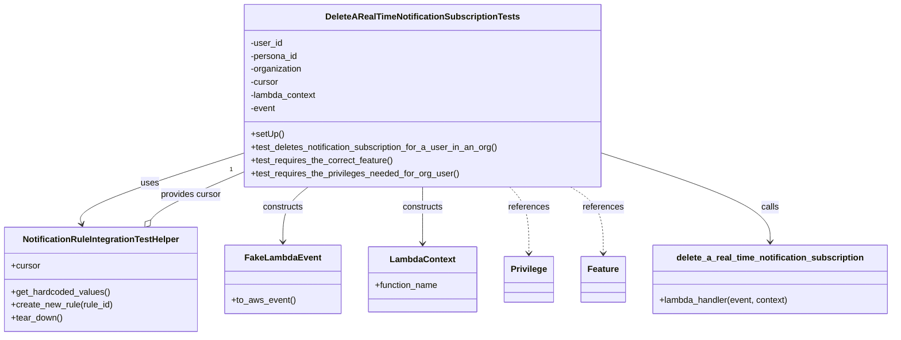
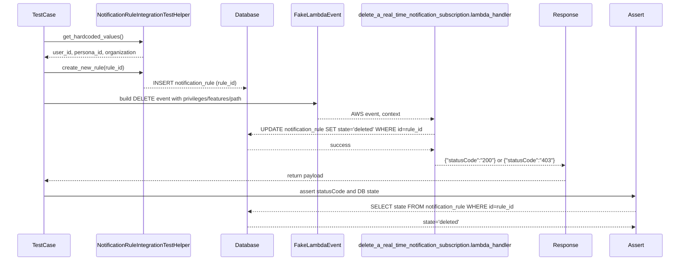

# Diagram: common/subscription_service/subscription_service_tests/integration/test_delete_a_real_time_notification_subscription.py

> Auto-generated by Obscura crawlers

## Diagram 1

### SVG

<svg id="container" width="1620.015625" xmlns="http://www.w3.org/2000/svg" class="classDiagram" height="618" viewBox="0 0 1620.015625 618" role="graphics-document document" aria-roledescription="class"><g><defs><marker id="container_class-aggregationStart" class="marker aggregation class" refX="18" refY="7" markerWidth="190" markerHeight="240" orient="auto"><path d="M 18,7 L9,13 L1,7 L9,1 Z"></path></marker></defs><defs><marker id="container_class-aggregationEnd" class="marker aggregation class" refX="1" refY="7" markerWidth="20" markerHeight="28" orient="auto"><path d="M 18,7 L9,13 L1,7 L9,1 Z"></path></marker></defs><defs><marker id="container_class-extensionStart" class="marker extension class" refX="18" refY="7" markerWidth="190" markerHeight="240" orient="auto"><path d="M 1,7 L18,13 V 1 Z"></path></marker></defs><defs><marker id="container_class-extensionEnd" class="marker extension class" refX="1" refY="7" markerWidth="20" markerHeight="28" orient="auto"><path d="M 1,1 V 13 L18,7 Z"></path></marker></defs><defs><marker id="container_class-compositionStart" class="marker composition class" refX="18" refY="7" markerWidth="190" markerHeight="240" orient="auto"><path d="M 18,7 L9,13 L1,7 L9,1 Z"></path></marker></defs><defs><marker id="container_class-compositionEnd" class="marker composition class" refX="1" refY="7" markerWidth="20" markerHeight="28" orient="auto"><path d="M 18,7 L9,13 L1,7 L9,1 Z"></path></marker></defs><defs><marker id="container_class-dependencyStart" class="marker dependency class" refX="6" refY="7" markerWidth="190" markerHeight="240" orient="auto"><path d="M 5,7 L9,13 L1,7 L9,1 Z"></path></marker></defs><defs><marker id="container_class-dependencyEnd" class="marker dependency class" refX="13" refY="7" markerWidth="20" markerHeight="28" orient="auto"><path d="M 18,7 L9,13 L14,7 L9,1 Z"></path></marker></defs><defs><marker id="container_class-lollipopStart" class="marker lollipop class" refX="13" refY="7" markerWidth="190" markerHeight="240" orient="auto"><circle stroke="black" fill="transparent" cx="7" cy="7" r="6"></circle></marker></defs><defs><marker id="container_class-lollipopEnd" class="marker lollipop class" refX="1" refY="7" markerWidth="190" markerHeight="240" orient="auto"><circle stroke="black" fill="transparent" cx="7" cy="7" r="6"></circle></marker></defs><g class="root"><g class="clusters"></g><g class="edgePaths"><path d="M438.453,282.81L388.319,299.175C338.185,315.54,237.917,348.27,189.604,369.857C141.292,391.445,144.935,401.89,146.757,407.112L148.579,412.335" id="id_DeleteARealTimeNotificationSubscriptionTests_NotificationRuleIntegrationTestHelper_1" class="edge-thickness-normal edge-pattern-solid relation" style=";;;" data-edge="true" data-et="edge" data-id="id_DeleteARealTimeNotificationSubscriptionTests_NotificationRuleIntegrationTestHelper_1" data-points="W3sieCI6NDM4LjQ1MzEyNSwieSI6MjgyLjgwOTgzMDA2OTkxMjY2fSx7IngiOjEzNy42NDg0Mzc1LCJ5IjozODF9LHsieCI6MTUwLjU1NTE4Njc5NTExMjc3LCJ5Ijo0MTh9XQ==" marker-end="url(#container_class-dependencyEnd)"></path><path d="M558.792,344L551.198,350.167C543.605,356.333,528.418,368.667,520.824,385.5C513.23,402.333,513.23,423.667,513.23,434.333L513.23,445" id="id_DeleteARealTimeNotificationSubscriptionTests_FakeLambdaEvent_2" class="edge-thickness-normal edge-pattern-solid relation" style=";;;" data-edge="true" data-et="edge" data-id="id_DeleteARealTimeNotificationSubscriptionTests_FakeLambdaEvent_2" data-points="W3sieCI6NTU4Ljc5MTY1Mzk2MzQxNDcsInkiOjM0NH0seyJ4Ijo1MTMuMjMwNDY4NzUsInkiOjM4MX0seyJ4Ijo1MTMuMjMwNDY4NzUsInkiOjQ1MX1d" marker-end="url(#container_class-dependencyEnd)"></path><path d="M765.664,344L765.664,350.167C765.664,356.333,765.664,368.667,765.664,386C765.664,403.333,765.664,425.667,765.664,436.833L765.664,448" id="id_DeleteARealTimeNotificationSubscriptionTests_LambdaContext_3" class="edge-thickness-normal edge-pattern-solid relation" style=";;;" data-edge="true" data-et="edge" data-id="id_DeleteARealTimeNotificationSubscriptionTests_LambdaContext_3" data-points="W3sieCI6NzY1LjY2NDA2MjUsInkiOjM0NH0seyJ4Ijo3NjUuNjY0MDYyNSwieSI6MzgxfSx7IngiOjc2NS42NjQwNjI1LCJ5Ijo0NTR9XQ==" marker-end="url(#container_class-dependencyEnd)"></path><path d="M923.958,344L929.768,350.167C935.579,356.333,947.2,368.667,953.01,389C958.82,409.333,958.82,437.667,958.82,451.833L958.82,466" id="id_DeleteARealTimeNotificationSubscriptionTests_Privilege_4" class="edge-thickness-normal edge-pattern-dashed relation" style=";;;" data-edge="true" data-et="edge" data-id="id_DeleteARealTimeNotificationSubscriptionTests_Privilege_4" data-points="W3sieCI6OTIzLjk1Nzk2NDkzOTAyNDQsInkiOjM0NH0seyJ4Ijo5NTguODIwMzEyNSwieSI6MzgxfSx7IngiOjk1OC44MjAzMTI1LCJ5Ijo0NzJ9XQ==" marker-end="url(#container_class-dependencyEnd)"></path><path d="M1033.164,344L1042.983,350.167C1052.802,356.333,1072.44,368.667,1082.259,389C1092.078,409.333,1092.078,437.667,1092.078,451.833L1092.078,466" id="id_DeleteARealTimeNotificationSubscriptionTests_Feature_5" class="edge-thickness-normal edge-pattern-dashed relation" style=";;;" data-edge="true" data-et="edge" data-id="id_DeleteARealTimeNotificationSubscriptionTests_Feature_5" data-points="W3sieCI6MTAzMy4xNjQzNjczNzgwNDg4LCJ5IjozNDR9LHsieCI6MTA5Mi4wNzgxMjUsInkiOjM4MX0seyJ4IjoxMDkyLjA3ODEyNSwieSI6NDcyfV0=" marker-end="url(#container_class-dependencyEnd)"></path><path d="M1092.875,282.292L1143.52,298.743C1194.164,315.194,1295.453,348.097,1346.098,375.215C1396.742,402.333,1396.742,423.667,1396.742,434.333L1396.742,445" id="id_DeleteARealTimeNotificationSubscriptionTests_delete_a_real_time_notification_subscription_6" class="edge-thickness-normal edge-pattern-solid relation" style=";;;" data-edge="true" data-et="edge" data-id="id_DeleteARealTimeNotificationSubscriptionTests_delete_a_real_time_notification_subscription_6" data-points="W3sieCI6MTA5Mi44NzUsInkiOjI4Mi4yOTE1MDI2MzY4NTY1M30seyJ4IjoxMzk2Ljc0MjE4NzUsInkiOjM4MX0seyJ4IjoxMzk2Ljc0MjE4NzUsInkiOjQ1MX1d" marker-end="url(#container_class-dependencyEnd)"></path><path d="M272.499,404.585L275.677,400.655C278.855,396.724,285.211,388.862,312.87,374.345C340.529,359.829,389.491,338.657,413.972,328.072L438.453,317.486" id="id_NotificationRuleIntegrationTestHelper_DeleteARealTimeNotificationSubscriptionTests_7" class="edge-thickness-normal edge-pattern-solid relation" style=";;;" data-edge="true" data-et="edge" data-id="id_NotificationRuleIntegrationTestHelper_DeleteARealTimeNotificationSubscriptionTests_7" data-points="W3sieCI6MjYxLjY1Mzg3MTAwNTYzOTEsInkiOjQxOH0seyJ4IjoyOTEuNTY2NDA2MjUsInkiOjM4MX0seyJ4Ijo0MzguNDUzMTI1LCJ5IjozMTcuNDg2MTI5MDc3NDQxNTV9XQ==" marker-start="url(#container_class-aggregationStart)"></path></g><g class="edgeLabels"><g class="edgeLabel" transform="translate(269.42474, 337.98492)"><g class="label" data-id="id_DeleteARealTimeNotificationSubscriptionTests_NotificationRuleIntegrationTestHelper_1" transform="translate(-16.4921875, -12)"><foreignObject width="32.984375" height="24">

uses

</foreignObject></g></g><g class="edgeLabel" transform="translate(513.23046875, 381)"><g class="label" data-id="id_DeleteARealTimeNotificationSubscriptionTests_FakeLambdaEvent_2" transform="translate(-37.84375, -12)"><foreignObject width="75.6875" height="24">

constructs

</foreignObject></g></g><g class="edgeLabel" transform="translate(765.6640625, 381)"><g class="label" data-id="id_DeleteARealTimeNotificationSubscriptionTests_LambdaContext_3" transform="translate(-37.84375, -12)"><foreignObject width="75.6875" height="24">

constructs

</foreignObject></g></g><g class="edgeLabel" transform="translate(958.8203125, 381)"><g class="label" data-id="id_DeleteARealTimeNotificationSubscriptionTests_Privilege_4" transform="translate(-37.828125, -12)"><foreignObject width="75.65625" height="24">

references

</foreignObject></g></g><g class="edgeLabel" transform="translate(1092.078125, 381)"><g class="label" data-id="id_DeleteARealTimeNotificationSubscriptionTests_Feature_5" transform="translate(-37.828125, -12)"><foreignObject width="75.65625" height="24">

references

</foreignObject></g></g><g class="edgeLabel" transform="translate(1396.7421875, 381)"><g class="label" data-id="id_DeleteARealTimeNotificationSubscriptionTests_delete_a_real_time_notification_subscription_6" transform="translate(-16.4453125, -12)"><foreignObject width="32.890625" height="24">

calls

</foreignObject></g></g><g class="edgeLabel" transform="translate(343.17416, 358.68479)"><g class="label" data-id="id_NotificationRuleIntegrationTestHelper_DeleteARealTimeNotificationSubscriptionTests_7" transform="translate(-56.296875, -12)"><foreignObject width="112.59375" height="24">

provides cursor

</foreignObject></g></g><g class="edgeTerminals" transform="translate(411.4371432591109, 305.66362269963327)"><g class="inner" transform="translate(0, 0)"></g><foreignObject style="width: 9px; height: 12px;">
1
</foreignObject></g></g><g class="nodes"><g class="node default" id="classId-DeleteARealTimeNotificationSubscriptionTests-0" transform="translate(765.6640625, 176)"><g class="basic label-container"><path d="M-327.2109375 -168 L327.2109375 -168 L327.2109375 168 L-327.2109375 168" stroke="none" stroke-width="0" fill="#ECECFF" style=""></path><path d="M-327.2109375 -168 C-116.89315471172631 -168, 93.42462807654738 -168, 327.2109375 -168 M-327.2109375 -168 C-182.13950648763574 -168, -37.068075475271485 -168, 327.2109375 -168 M327.2109375 -168 C327.2109375 -69.99098559514631, 327.2109375 28.018028809707374, 327.2109375 168 M327.2109375 -168 C327.2109375 -71.29544859482088, 327.2109375 25.409102810358235, 327.2109375 168 M327.2109375 168 C161.47437205830278 168, -4.262193383394447 168, -327.2109375 168 M327.2109375 168 C157.4467521686056 168, -12.317433162788802 168, -327.2109375 168 M-327.2109375 168 C-327.2109375 59.34179937442188, -327.2109375 -49.316401251156236, -327.2109375 -168 M-327.2109375 168 C-327.2109375 56.10237475452253, -327.2109375 -55.79525049095494, -327.2109375 -168" stroke="#9370DB" stroke-width="1.3" fill="none" stroke-dasharray="0 0" style=""></path></g><g class="annotation-group text" transform="translate(0, -144)"></g><g class="label-group text" transform="translate(-170.53125, -144)"><g class="label" style="font-weight: bolder" transform="translate(0,-12)"><foreignObject width="341.0625" height="24">

DeleteARealTimeNotificationSubscriptionTests

</foreignObject></g></g><g class="members-group text" transform="translate(-315.2109375, -96)"><g class="label" style="" transform="translate(0,-12)"><foreignObject width="59.25" height="24">

-user_id

</foreignObject></g><g class="label" style="" transform="translate(0,12)"><foreignObject width="87.90625" height="24">

-persona_id

</foreignObject></g><g class="label" style="" transform="translate(0,36)"><foreignObject width="96.8125" height="24">

-organization

</foreignObject></g><g class="label" style="" transform="translate(0,60)"><foreignObject width="52.1875" height="24">

-cursor

</foreignObject></g><g class="label" style="" transform="translate(0,84)"><foreignObject width="122.953125" height="24">

-lambda_context

</foreignObject></g><g class="label" style="" transform="translate(0,108)"><foreignObject width="46.796875" height="24">

-event

</foreignObject></g></g><g class="methods-group text" transform="translate(-315.2109375, 72)"><g class="label" style="" transform="translate(0,-12)"><foreignObject width="60.421875" height="24">

+setUp()

</foreignObject></g><g class="label" style="" transform="translate(0,12)"><foreignObject width="459.890625" height="24">

+test_deletes_notification_subscription_for_a_user_in_an_org()

</foreignObject></g><g class="label" style="" transform="translate(0,36)"><foreignObject width="263.6875" height="24">

+test_requires_the_correct_feature()

</foreignObject></g><g class="label" style="" transform="translate(0,60)"><foreignObject width="384.96875" height="24">

+test_requires_the_privileges_needed_for_org_user()

</foreignObject></g></g><g class="divider" style=""><path d="M-327.2109375 -120 C-81.87448620864168 -120, 163.46196508271663 -120, 327.2109375 -120 M-327.2109375 -120 C-111.4423606521741 -120, 104.3262161956518 -120, 327.2109375 -120" stroke="#9370DB" stroke-width="1.3" fill="none" stroke-dasharray="0 0" style=""></path></g><g class="divider" style=""><path d="M-327.2109375 48 C-76.79345491619955 48, 173.6240276676009 48, 327.2109375 48 M-327.2109375 48 C-114.17091290451185 48, 98.8691116909763 48, 327.2109375 48" stroke="#9370DB" stroke-width="1.3" fill="none" stroke-dasharray="0 0" style=""></path></g></g><g class="node default" id="classId-NotificationRuleIntegrationTestHelper-1" transform="translate(184.04296875, 514)"><g class="basic label-container"><path d="M-176.04296875 -96 L176.04296875 -96 L176.04296875 96 L-176.04296875 96" stroke="none" stroke-width="0" fill="#ECECFF" style=""></path><path d="M-176.04296875 -96 C-41.89845389851976 -96, 92.24606095296048 -96, 176.04296875 -96 M-176.04296875 -96 C-95.76908184938215 -96, -15.495194948764293 -96, 176.04296875 -96 M176.04296875 -96 C176.04296875 -19.29560756768589, 176.04296875 57.40878486462822, 176.04296875 96 M176.04296875 -96 C176.04296875 -32.63265922151066, 176.04296875 30.734681556978686, 176.04296875 96 M176.04296875 96 C99.34088004114425 96, 22.63879133228849 96, -176.04296875 96 M176.04296875 96 C80.5165004141816 96, -15.009967921636786 96, -176.04296875 96 M-176.04296875 96 C-176.04296875 19.52132747640067, -176.04296875 -56.95734504719866, -176.04296875 -96 M-176.04296875 96 C-176.04296875 25.90041328566963, -176.04296875 -44.19917342866074, -176.04296875 -96" stroke="#9370DB" stroke-width="1.3" fill="none" stroke-dasharray="0 0" style=""></path></g><g class="annotation-group text" transform="translate(0, -72)"></g><g class="label-group text" transform="translate(-139.5859375, -72)"><g class="label" style="font-weight: bolder" transform="translate(0,-12)"><foreignObject width="279.171875" height="24">

NotificationRuleIntegrationTestHelper

</foreignObject></g></g><g class="members-group text" transform="translate(-164.04296875, -24)"><g class="label" style="" transform="translate(0,-12)"><foreignObject width="53.71875" height="24">

+cursor

</foreignObject></g></g><g class="methods-group text" transform="translate(-164.04296875, 24)"><g class="label" style="" transform="translate(0,-12)"><foreignObject width="181.296875" height="24">

+get_hardcoded_values()

</foreignObject></g><g class="label" style="" transform="translate(0,12)"><foreignObject width="188.5" height="24">

+create_new_rule(rule_id)

</foreignObject></g><g class="label" style="" transform="translate(0,36)"><foreignObject width="93.734375" height="24">

+tear_down()

</foreignObject></g></g><g class="divider" style=""><path d="M-176.04296875 -48 C-73.14403275376013 -48, 29.75490324247974 -48, 176.04296875 -48 M-176.04296875 -48 C-39.59835407112894 -48, 96.84626060774212 -48, 176.04296875 -48" stroke="#9370DB" stroke-width="1.3" fill="none" stroke-dasharray="0 0" style=""></path></g><g class="divider" style=""><path d="M-176.04296875 0 C-44.24528548791841 0, 87.55239777416318 0, 176.04296875 0 M-176.04296875 0 C-74.20315263586568 0, 27.636663478268645 0, 176.04296875 0" stroke="#9370DB" stroke-width="1.3" fill="none" stroke-dasharray="0 0" style=""></path></g></g><g class="node default" id="classId-FakeLambdaEvent-2" transform="translate(513.23046875, 514)"><g class="basic label-container"><path d="M-103.14453125 -63 L103.14453125 -63 L103.14453125 63 L-103.14453125 63" stroke="none" stroke-width="0" fill="#ECECFF" style=""></path><path d="M-103.14453125 -63 C-61.30236088995778 -63, -19.460190529915565 -63, 103.14453125 -63 M-103.14453125 -63 C-29.618151231752876 -63, 43.90822878649425 -63, 103.14453125 -63 M103.14453125 -63 C103.14453125 -24.56376384232012, 103.14453125 13.872472315359758, 103.14453125 63 M103.14453125 -63 C103.14453125 -14.209854304384848, 103.14453125 34.580291391230304, 103.14453125 63 M103.14453125 63 C56.30048238139729 63, 9.456433512794575 63, -103.14453125 63 M103.14453125 63 C38.02906697925242 63, -27.08639729149516 63, -103.14453125 63 M-103.14453125 63 C-103.14453125 17.331735218971033, -103.14453125 -28.336529562057933, -103.14453125 -63 M-103.14453125 63 C-103.14453125 33.109106907394136, -103.14453125 3.218213814788271, -103.14453125 -63" stroke="#9370DB" stroke-width="1.3" fill="none" stroke-dasharray="0 0" style=""></path></g><g class="annotation-group text" transform="translate(0, -39)"></g><g class="label-group text" transform="translate(-65.8671875, -39)"><g class="label" style="font-weight: bolder" transform="translate(0,-12)"><foreignObject width="131.734375" height="24">

FakeLambdaEvent

</foreignObject></g></g><g class="members-group text" transform="translate(-91.14453125, 9)"></g><g class="methods-group text" transform="translate(-91.14453125, 39)"><g class="label" style="" transform="translate(0,-12)"><foreignObject width="116.421875" height="24">

+to_aws_event()

</foreignObject></g></g><g class="divider" style=""><path d="M-103.14453125 -15 C-27.47154618098554 -15, 48.20143888802892 -15, 103.14453125 -15 M-103.14453125 -15 C-34.50295356342447 -15, 34.13862412315106 -15, 103.14453125 -15" stroke="#9370DB" stroke-width="1.3" fill="none" stroke-dasharray="0 0" style=""></path></g><g class="divider" style=""><path d="M-103.14453125 9 C-21.07038303005436 9, 61.00376518989128 9, 103.14453125 9 M-103.14453125 9 C-49.7078733600464 9, 3.7287845299072018 9, 103.14453125 9" stroke="#9370DB" stroke-width="1.3" fill="none" stroke-dasharray="0 0" style=""></path></g></g><g class="node default" id="classId-LambdaContext-3" transform="translate(765.6640625, 514)"><g class="basic label-container"><path d="M-99.2890625 -60 L99.2890625 -60 L99.2890625 60 L-99.2890625 60" stroke="none" stroke-width="0" fill="#ECECFF" style=""></path><path d="M-99.2890625 -60 C-39.07140743056002 -60, 21.146247638879956 -60, 99.2890625 -60 M-99.2890625 -60 C-40.33595163525244 -60, 18.617159229495115 -60, 99.2890625 -60 M99.2890625 -60 C99.2890625 -20.58393033599046, 99.2890625 18.832139328019082, 99.2890625 60 M99.2890625 -60 C99.2890625 -27.909562562402115, 99.2890625 4.180874875195769, 99.2890625 60 M99.2890625 60 C33.681465246433916 60, -31.926132007132168 60, -99.2890625 60 M99.2890625 60 C36.287763393300416 60, -26.713535713399168 60, -99.2890625 60 M-99.2890625 60 C-99.2890625 22.89981536066619, -99.2890625 -14.200369278667623, -99.2890625 -60 M-99.2890625 60 C-99.2890625 31.067285992798027, -99.2890625 2.134571985596054, -99.2890625 -60" stroke="#9370DB" stroke-width="1.3" fill="none" stroke-dasharray="0 0" style=""></path></g><g class="annotation-group text" transform="translate(0, -36)"></g><g class="label-group text" transform="translate(-57.296875, -36)"><g class="label" style="font-weight: bolder" transform="translate(0,-12)"><foreignObject width="114.59375" height="24">

LambdaContext

</foreignObject></g></g><g class="members-group text" transform="translate(-87.2890625, 12)"><g class="label" style="" transform="translate(0,-12)"><foreignObject width="117.28125" height="24">

+function_name

</foreignObject></g></g><g class="methods-group text" transform="translate(-87.2890625, 60)"></g><g class="divider" style=""><path d="M-99.2890625 -12 C-56.67940578385095 -12, -14.069749067701906 -12, 99.2890625 -12 M-99.2890625 -12 C-40.81175727952663 -12, 17.665547940946738 -12, 99.2890625 -12" stroke="#9370DB" stroke-width="1.3" fill="none" stroke-dasharray="0 0" style=""></path></g><g class="divider" style=""><path d="M-99.2890625 36 C-32.44797597561325 36, 34.39311054877351 36, 99.2890625 36 M-99.2890625 36 C-36.319140068149636 36, 26.650782363700728 36, 99.2890625 36" stroke="#9370DB" stroke-width="1.3" fill="none" stroke-dasharray="0 0" style=""></path></g></g><g class="node default" id="classId-Privilege-4" transform="translate(958.8203125, 514)"><g class="basic label-container"><path d="M-43.8671875 -42 L43.8671875 -42 L43.8671875 42 L-43.8671875 42" stroke="none" stroke-width="0" fill="#ECECFF" style=""></path><path d="M-43.8671875 -42 C-23.10517263408899 -42, -2.3431577681779814 -42, 43.8671875 -42 M-43.8671875 -42 C-16.22174154611634 -42, 11.423704407767318 -42, 43.8671875 -42 M43.8671875 -42 C43.8671875 -8.634705722814786, 43.8671875 24.730588554370428, 43.8671875 42 M43.8671875 -42 C43.8671875 -15.030594205285734, 43.8671875 11.938811589428532, 43.8671875 42 M43.8671875 42 C9.934871565598876 42, -23.99744436880225 42, -43.8671875 42 M43.8671875 42 C8.880051074318708 42, -26.107085351362585 42, -43.8671875 42 M-43.8671875 42 C-43.8671875 11.457544299658391, -43.8671875 -19.084911400683218, -43.8671875 -42 M-43.8671875 42 C-43.8671875 9.168462383277955, -43.8671875 -23.66307523344409, -43.8671875 -42" stroke="#9370DB" stroke-width="1.3" fill="none" stroke-dasharray="0 0" style=""></path></g><g class="annotation-group text" transform="translate(0, -18)"></g><g class="label-group text" transform="translate(-31.8671875, -18)"><g class="label" style="font-weight: bolder" transform="translate(0,-12)"><foreignObject width="63.734375" height="24">

Privilege

</foreignObject></g></g><g class="members-group text" transform="translate(-31.8671875, 30)"></g><g class="methods-group text" transform="translate(-31.8671875, 60)"></g><g class="divider" style=""><path d="M-43.8671875 6 C-23.635770535610533 6, -3.4043535712210655 6, 43.8671875 6 M-43.8671875 6 C-23.097754670724328 6, -2.3283218414486555 6, 43.8671875 6" stroke="#9370DB" stroke-width="1.3" fill="none" stroke-dasharray="0 0" style=""></path></g><g class="divider" style=""><path d="M-43.8671875 24 C-8.905933053102473 24, 26.055321393795055 24, 43.8671875 24 M-43.8671875 24 C-23.098858949374325 24, -2.3305303987486496 24, 43.8671875 24" stroke="#9370DB" stroke-width="1.3" fill="none" stroke-dasharray="0 0" style=""></path></g></g><g class="node default" id="classId-Feature-5" transform="translate(1092.078125, 514)"><g class="basic label-container"><path d="M-39.390625 -42 L39.390625 -42 L39.390625 42 L-39.390625 42" stroke="none" stroke-width="0" fill="#ECECFF" style=""></path><path d="M-39.390625 -42 C-12.764949232830102 -42, 13.860726534339797 -42, 39.390625 -42 M-39.390625 -42 C-22.90087892312626 -42, -6.411132846252521 -42, 39.390625 -42 M39.390625 -42 C39.390625 -13.836737216248189, 39.390625 14.326525567503623, 39.390625 42 M39.390625 -42 C39.390625 -23.941782020259826, 39.390625 -5.883564040519651, 39.390625 42 M39.390625 42 C14.681999961557203 42, -10.026625076885594 42, -39.390625 42 M39.390625 42 C12.32662698565014 42, -14.73737102869972 42, -39.390625 42 M-39.390625 42 C-39.390625 17.80539681054982, -39.390625 -6.3892063789003615, -39.390625 -42 M-39.390625 42 C-39.390625 18.898671177713343, -39.390625 -4.202657644573314, -39.390625 -42" stroke="#9370DB" stroke-width="1.3" fill="none" stroke-dasharray="0 0" style=""></path></g><g class="annotation-group text" transform="translate(0, -18)"></g><g class="label-group text" transform="translate(-27.390625, -18)"><g class="label" style="font-weight: bolder" transform="translate(0,-12)"><foreignObject width="54.78125" height="24">

Feature

</foreignObject></g></g><g class="members-group text" transform="translate(-27.390625, 30)"></g><g class="methods-group text" transform="translate(-27.390625, 60)"></g><g class="divider" style=""><path d="M-39.390625 6 C-14.060901039491629 6, 11.268822921016742 6, 39.390625 6 M-39.390625 6 C-8.498065209803855 6, 22.39449458039229 6, 39.390625 6" stroke="#9370DB" stroke-width="1.3" fill="none" stroke-dasharray="0 0" style=""></path></g><g class="divider" style=""><path d="M-39.390625 24 C-22.297164307758305 24, -5.203703615516609 24, 39.390625 24 M-39.390625 24 C-11.116376843272484 24, 17.157871313455033 24, 39.390625 24" stroke="#9370DB" stroke-width="1.3" fill="none" stroke-dasharray="0 0" style=""></path></g></g><g class="node default" id="classId-delete_a_real_time_notification_subscription-6" transform="translate(1396.7421875, 514)"><g class="basic label-container"><path d="M-215.2734375 -63 L215.2734375 -63 L215.2734375 63 L-215.2734375 63" stroke="none" stroke-width="0" fill="#ECECFF" style=""></path><path d="M-215.2734375 -63 C-59.947053202097976 -63, 95.37933109580405 -63, 215.2734375 -63 M-215.2734375 -63 C-126.26749470800509 -63, -37.26155191601018 -63, 215.2734375 -63 M215.2734375 -63 C215.2734375 -35.73313683723873, 215.2734375 -8.466273674477463, 215.2734375 63 M215.2734375 -63 C215.2734375 -34.507862227200924, 215.2734375 -6.015724454401848, 215.2734375 63 M215.2734375 63 C111.64174603077242 63, 8.010054561544848 63, -215.2734375 63 M215.2734375 63 C110.95046336693228 63, 6.627489233864566 63, -215.2734375 63 M-215.2734375 63 C-215.2734375 34.89215710998256, -215.2734375 6.784314219965125, -215.2734375 -63 M-215.2734375 63 C-215.2734375 27.40257720206106, -215.2734375 -8.19484559587788, -215.2734375 -63" stroke="#9370DB" stroke-width="1.3" fill="none" stroke-dasharray="0 0" style=""></path></g><g class="annotation-group text" transform="translate(0, -39)"></g><g class="label-group text" transform="translate(-166.359375, -39)"><g class="label" style="font-weight: bolder" transform="translate(0,-12)"><foreignObject width="332.71875" height="24">

delete_a_real_time_notification_subscription

</foreignObject></g></g><g class="members-group text" transform="translate(-203.2734375, 9)"></g><g class="methods-group text" transform="translate(-203.2734375, 39)"><g class="label" style="" transform="translate(0,-12)"><foreignObject width="240.1875" height="24">

+lambda_handler(event, context)

</foreignObject></g></g><g class="divider" style=""><path d="M-215.2734375 -15 C-90.3309616220569 -15, 34.61151425588619 -15, 215.2734375 -15 M-215.2734375 -15 C-122.44940381131995 -15, -29.625370122639907 -15, 215.2734375 -15" stroke="#9370DB" stroke-width="1.3" fill="none" stroke-dasharray="0 0" style=""></path></g><g class="divider" style=""><path d="M-215.2734375 9 C-99.3443715931402 9, 16.58469431371961 9, 215.2734375 9 M-215.2734375 9 C-122.14681619057147 9, -29.02019488114294 9, 215.2734375 9" stroke="#9370DB" stroke-width="1.3" fill="none" stroke-dasharray="0 0" style=""></path></g></g></g></g></g></svg>

## Diagram 2

### SVG

<svg id="container" width="2019.5" xmlns="http://www.w3.org/2000/svg" height="795" viewBox="-50 -10 2019.5 795" role="graphics-document document" aria-roledescription="sequence"><g><rect x="1769.5" y="709" fill="#eaeaea" stroke="#666" width="150" height="65" name="Assert" rx="3" ry="3" class="actor actor-bottom"></rect><text x="1844.5" y="741.5" dominant-baseline="central" alignment-baseline="central" class="actor actor-box" style="text-anchor: middle; font-size: 16px; font-weight: 400;"><tspan x="1844.5" dy="0">Assert</tspan></text></g><g><rect x="1569.5" y="709" fill="#eaeaea" stroke="#666" width="150" height="65" name="Response" rx="3" ry="3" class="actor actor-bottom"></rect><text x="1644.5" y="741.5" dominant-baseline="central" alignment-baseline="central" class="actor actor-box" style="text-anchor: middle; font-size: 16px; font-weight: 400;"><tspan x="1644.5" dy="0">Response</tspan></text></g><g><rect x="1023" y="709" fill="#eaeaea" stroke="#666" width="473" height="65" name="Lambda" rx="3" ry="3" class="actor actor-bottom"></rect><text x="1259.5" y="741.5" dominant-baseline="central" alignment-baseline="central" class="actor actor-box" style="text-anchor: middle; font-size: 16px; font-weight: 400;"><tspan x="1259.5" dy="0">delete_a_real_time_notification_subscription.lambda_handler</tspan></text></g><g><rect x="822" y="709" fill="#eaeaea" stroke="#666" width="151" height="65" name="Event" rx="3" ry="3" class="actor actor-bottom"></rect><text x="897.5" y="741.5" dominant-baseline="central" alignment-baseline="central" class="actor actor-box" style="text-anchor: middle; font-size: 16px; font-weight: 400;"><tspan x="897.5" dy="0">FakeLambdaEvent</tspan></text></g><g><rect x="622" y="709" fill="#eaeaea" stroke="#666" width="150" height="65" name="DB" rx="3" ry="3" class="actor actor-bottom"></rect><text x="697" y="741.5" dominant-baseline="central" alignment-baseline="central" class="actor actor-box" style="text-anchor: middle; font-size: 16px; font-weight: 400;"><tspan x="697" dy="0">Database</tspan></text></g><g><rect x="238" y="709" fill="#eaeaea" stroke="#666" width="296" height="65" name="Helper" rx="3" ry="3" class="actor actor-bottom"></rect><text x="386" y="741.5" dominant-baseline="central" alignment-baseline="central" class="actor actor-box" style="text-anchor: middle; font-size: 16px; font-weight: 400;"><tspan x="386" dy="0">NotificationRuleIntegrationTestHelper</tspan></text></g><g><rect x="0" y="709" fill="#eaeaea" stroke="#666" width="150" height="65" name="Test" rx="3" ry="3" class="actor actor-bottom"></rect><text x="75" y="741.5" dominant-baseline="central" alignment-baseline="central" class="actor actor-box" style="text-anchor: middle; font-size: 16px; font-weight: 400;"><tspan x="75" dy="0">TestCase</tspan></text></g><g><line id="actor6" x1="1844.5" y1="65" x2="1844.5" y2="709" class="actor-line 200" stroke-width="0.5px" stroke="#999" name="Assert"></line><g id="root-6"><rect x="1769.5" y="0" fill="#eaeaea" stroke="#666" width="150" height="65" name="Assert" rx="3" ry="3" class="actor actor-top"></rect><text x="1844.5" y="32.5" dominant-baseline="central" alignment-baseline="central" class="actor actor-box" style="text-anchor: middle; font-size: 16px; font-weight: 400;"><tspan x="1844.5" dy="0">Assert</tspan></text></g></g><g><line id="actor5" x1="1644.5" y1="65" x2="1644.5" y2="709" class="actor-line 200" stroke-width="0.5px" stroke="#999" name="Response"></line><g id="root-5"><rect x="1569.5" y="0" fill="#eaeaea" stroke="#666" width="150" height="65" name="Response" rx="3" ry="3" class="actor actor-top"></rect><text x="1644.5" y="32.5" dominant-baseline="central" alignment-baseline="central" class="actor actor-box" style="text-anchor: middle; font-size: 16px; font-weight: 400;"><tspan x="1644.5" dy="0">Response</tspan></text></g></g><g><line id="actor4" x1="1259.5" y1="65" x2="1259.5" y2="709" class="actor-line 200" stroke-width="0.5px" stroke="#999" name="Lambda"></line><g id="root-4"><rect x="1023" y="0" fill="#eaeaea" stroke="#666" width="473" height="65" name="Lambda" rx="3" ry="3" class="actor actor-top"></rect><text x="1259.5" y="32.5" dominant-baseline="central" alignment-baseline="central" class="actor actor-box" style="text-anchor: middle; font-size: 16px; font-weight: 400;"><tspan x="1259.5" dy="0">delete_a_real_time_notification_subscription.lambda_handler</tspan></text></g></g><g><line id="actor3" x1="897.5" y1="65" x2="897.5" y2="709" class="actor-line 200" stroke-width="0.5px" stroke="#999" name="Event"></line><g id="root-3"><rect x="822" y="0" fill="#eaeaea" stroke="#666" width="151" height="65" name="Event" rx="3" ry="3" class="actor actor-top"></rect><text x="897.5" y="32.5" dominant-baseline="central" alignment-baseline="central" class="actor actor-box" style="text-anchor: middle; font-size: 16px; font-weight: 400;"><tspan x="897.5" dy="0">FakeLambdaEvent</tspan></text></g></g><g><line id="actor2" x1="697" y1="65" x2="697" y2="709" class="actor-line 200" stroke-width="0.5px" stroke="#999" name="DB"></line><g id="root-2"><rect x="622" y="0" fill="#eaeaea" stroke="#666" width="150" height="65" name="DB" rx="3" ry="3" class="actor actor-top"></rect><text x="697" y="32.5" dominant-baseline="central" alignment-baseline="central" class="actor actor-box" style="text-anchor: middle; font-size: 16px; font-weight: 400;"><tspan x="697" dy="0">Database</tspan></text></g></g><g><line id="actor1" x1="386" y1="65" x2="386" y2="709" class="actor-line 200" stroke-width="0.5px" stroke="#999" name="Helper"></line><g id="root-1"><rect x="238" y="0" fill="#eaeaea" stroke="#666" width="296" height="65" name="Helper" rx="3" ry="3" class="actor actor-top"></rect><text x="386" y="32.5" dominant-baseline="central" alignment-baseline="central" class="actor actor-box" style="text-anchor: middle; font-size: 16px; font-weight: 400;"><tspan x="386" dy="0">NotificationRuleIntegrationTestHelper</tspan></text></g></g><g><line id="actor0" x1="75" y1="65" x2="75" y2="709" class="actor-line 200" stroke-width="0.5px" stroke="#999" name="Test"></line><g id="root-0"><rect x="0" y="0" fill="#eaeaea" stroke="#666" width="150" height="65" name="Test" rx="3" ry="3" class="actor actor-top"></rect><text x="75" y="32.5" dominant-baseline="central" alignment-baseline="central" class="actor actor-box" style="text-anchor: middle; font-size: 16px; font-weight: 400;"><tspan x="75" dy="0">TestCase</tspan></text></g></g><g></g><defs><symbol id="computer" width="24" height="24"><path transform="scale(.5)" d="M2 2v13h20v-13h-20zm18 11h-16v-9h16v9zm-10.228 6l.466-1h3.524l.467 1h-4.457zm14.228 3h-24l2-6h2.104l-1.33 4h18.45l-1.297-4h2.073l2 6zm-5-10h-14v-7h14v7z"></path></symbol></defs><defs><symbol id="database" fill-rule="evenodd" clip-rule="evenodd"><path transform="scale(.5)" d="M12.258.001l.256.004.255.005.253.008.251.01.249.012.247.015.246.016.242.019.241.02.239.023.236.024.233.027.231.028.229.031.225.032.223.034.22.036.217.038.214.04.211.041.208.043.205.045.201.046.198.048.194.05.191.051.187.053.183.054.18.056.175.057.172.059.168.06.163.061.16.063.155.064.15.066.074.033.073.033.071.034.07.034.069.035.068.035.067.035.066.035.064.036.064.036.062.036.06.036.06.037.058.037.058.037.055.038.055.038.053.038.052.038.051.039.05.039.048.039.047.039.045.04.044.04.043.04.041.04.04.041.039.041.037.041.036.041.034.041.033.042.032.042.03.042.029.042.027.042.026.043.024.043.023.043.021.043.02.043.018.044.017.043.015.044.013.044.012.044.011.045.009.044.007.045.006.045.004.045.002.045.001.045v17l-.001.045-.002.045-.004.045-.006.045-.007.045-.009.044-.011.045-.012.044-.013.044-.015.044-.017.043-.018.044-.02.043-.021.043-.023.043-.024.043-.026.043-.027.042-.029.042-.03.042-.032.042-.033.042-.034.041-.036.041-.037.041-.039.041-.04.041-.041.04-.043.04-.044.04-.045.04-.047.039-.048.039-.05.039-.051.039-.052.038-.053.038-.055.038-.055.038-.058.037-.058.037-.06.037-.06.036-.062.036-.064.036-.064.036-.066.035-.067.035-.068.035-.069.035-.07.034-.071.034-.073.033-.074.033-.15.066-.155.064-.16.063-.163.061-.168.06-.172.059-.175.057-.18.056-.183.054-.187.053-.191.051-.194.05-.198.048-.201.046-.205.045-.208.043-.211.041-.214.04-.217.038-.22.036-.223.034-.225.032-.229.031-.231.028-.233.027-.236.024-.239.023-.241.02-.242.019-.246.016-.247.015-.249.012-.251.01-.253.008-.255.005-.256.004-.258.001-.258-.001-.256-.004-.255-.005-.253-.008-.251-.01-.249-.012-.247-.015-.245-.016-.243-.019-.241-.02-.238-.023-.236-.024-.234-.027-.231-.028-.228-.031-.226-.032-.223-.034-.22-.036-.217-.038-.214-.04-.211-.041-.208-.043-.204-.045-.201-.046-.198-.048-.195-.05-.19-.051-.187-.053-.184-.054-.179-.056-.176-.057-.172-.059-.167-.06-.164-.061-.159-.063-.155-.064-.151-.066-.074-.033-.072-.033-.072-.034-.07-.034-.069-.035-.068-.035-.067-.035-.066-.035-.064-.036-.063-.036-.062-.036-.061-.036-.06-.037-.058-.037-.057-.037-.056-.038-.055-.038-.053-.038-.052-.038-.051-.039-.049-.039-.049-.039-.046-.039-.046-.04-.044-.04-.043-.04-.041-.04-.04-.041-.039-.041-.037-.041-.036-.041-.034-.041-.033-.042-.032-.042-.03-.042-.029-.042-.027-.042-.026-.043-.024-.043-.023-.043-.021-.043-.02-.043-.018-.044-.017-.043-.015-.044-.013-.044-.012-.044-.011-.045-.009-.044-.007-.045-.006-.045-.004-.045-.002-.045-.001-.045v-17l.001-.045.002-.045.004-.045.006-.045.007-.045.009-.044.011-.045.012-.044.013-.044.015-.044.017-.043.018-.044.02-.043.021-.043.023-.043.024-.043.026-.043.027-.042.029-.042.03-.042.032-.042.033-.042.034-.041.036-.041.037-.041.039-.041.04-.041.041-.04.043-.04.044-.04.046-.04.046-.039.049-.039.049-.039.051-.039.052-.038.053-.038.055-.038.056-.038.057-.037.058-.037.06-.037.061-.036.062-.036.063-.036.064-.036.066-.035.067-.035.068-.035.069-.035.07-.034.072-.034.072-.033.074-.033.151-.066.155-.064.159-.063.164-.061.167-.06.172-.059.176-.057.179-.056.184-.054.187-.053.19-.051.195-.05.198-.048.201-.046.204-.045.208-.043.211-.041.214-.04.217-.038.22-.036.223-.034.226-.032.228-.031.231-.028.234-.027.236-.024.238-.023.241-.02.243-.019.245-.016.247-.015.249-.012.251-.01.253-.008.255-.005.256-.004.258-.001.258.001zm-9.258 20.499v.01l.001.021.003.021.004.022.005.021.006.022.007.022.009.023.01.022.011.023.012.023.013.023.015.023.016.024.017.023.018.024.019.024.021.024.022.025.023.024.024.025.052.049.056.05.061.051.066.051.07.051.075.051.079.052.084.052.088.052.092.052.097.052.102.051.105.052.11.052.114.051.119.051.123.051.127.05.131.05.135.05.139.048.144.049.147.047.152.047.155.047.16.045.163.045.167.043.171.043.176.041.178.041.183.039.187.039.19.037.194.035.197.035.202.033.204.031.209.03.212.029.216.027.219.025.222.024.226.021.23.02.233.018.236.016.24.015.243.012.246.01.249.008.253.005.256.004.259.001.26-.001.257-.004.254-.005.25-.008.247-.011.244-.012.241-.014.237-.016.233-.018.231-.021.226-.021.224-.024.22-.026.216-.027.212-.028.21-.031.205-.031.202-.034.198-.034.194-.036.191-.037.187-.039.183-.04.179-.04.175-.042.172-.043.168-.044.163-.045.16-.046.155-.046.152-.047.148-.048.143-.049.139-.049.136-.05.131-.05.126-.05.123-.051.118-.052.114-.051.11-.052.106-.052.101-.052.096-.052.092-.052.088-.053.083-.051.079-.052.074-.052.07-.051.065-.051.06-.051.056-.05.051-.05.023-.024.023-.025.021-.024.02-.024.019-.024.018-.024.017-.024.015-.023.014-.024.013-.023.012-.023.01-.023.01-.022.008-.022.006-.022.006-.022.004-.022.004-.021.001-.021.001-.021v-4.127l-.077.055-.08.053-.083.054-.085.053-.087.052-.09.052-.093.051-.095.05-.097.05-.1.049-.102.049-.105.048-.106.047-.109.047-.111.046-.114.045-.115.045-.118.044-.12.043-.122.042-.124.042-.126.041-.128.04-.13.04-.132.038-.134.038-.135.037-.138.037-.139.035-.142.035-.143.034-.144.033-.147.032-.148.031-.15.03-.151.03-.153.029-.154.027-.156.027-.158.026-.159.025-.161.024-.162.023-.163.022-.165.021-.166.02-.167.019-.169.018-.169.017-.171.016-.173.015-.173.014-.175.013-.175.012-.177.011-.178.01-.179.008-.179.008-.181.006-.182.005-.182.004-.184.003-.184.002h-.37l-.184-.002-.184-.003-.182-.004-.182-.005-.181-.006-.179-.008-.179-.008-.178-.01-.176-.011-.176-.012-.175-.013-.173-.014-.172-.015-.171-.016-.17-.017-.169-.018-.167-.019-.166-.02-.165-.021-.163-.022-.162-.023-.161-.024-.159-.025-.157-.026-.156-.027-.155-.027-.153-.029-.151-.03-.15-.03-.148-.031-.146-.032-.145-.033-.143-.034-.141-.035-.14-.035-.137-.037-.136-.037-.134-.038-.132-.038-.13-.04-.128-.04-.126-.041-.124-.042-.122-.042-.12-.044-.117-.043-.116-.045-.113-.045-.112-.046-.109-.047-.106-.047-.105-.048-.102-.049-.1-.049-.097-.05-.095-.05-.093-.052-.09-.051-.087-.052-.085-.053-.083-.054-.08-.054-.077-.054v4.127zm0-5.654v.011l.001.021.003.021.004.021.005.022.006.022.007.022.009.022.01.022.011.023.012.023.013.023.015.024.016.023.017.024.018.024.019.024.021.024.022.024.023.025.024.024.052.05.056.05.061.05.066.051.07.051.075.052.079.051.084.052.088.052.092.052.097.052.102.052.105.052.11.051.114.051.119.052.123.05.127.051.131.05.135.049.139.049.144.048.147.048.152.047.155.046.16.045.163.045.167.044.171.042.176.042.178.04.183.04.187.038.19.037.194.036.197.034.202.033.204.032.209.03.212.028.216.027.219.025.222.024.226.022.23.02.233.018.236.016.24.014.243.012.246.01.249.008.253.006.256.003.259.001.26-.001.257-.003.254-.006.25-.008.247-.01.244-.012.241-.015.237-.016.233-.018.231-.02.226-.022.224-.024.22-.025.216-.027.212-.029.21-.03.205-.032.202-.033.198-.035.194-.036.191-.037.187-.039.183-.039.179-.041.175-.042.172-.043.168-.044.163-.045.16-.045.155-.047.152-.047.148-.048.143-.048.139-.05.136-.049.131-.05.126-.051.123-.051.118-.051.114-.052.11-.052.106-.052.101-.052.096-.052.092-.052.088-.052.083-.052.079-.052.074-.051.07-.052.065-.051.06-.05.056-.051.051-.049.023-.025.023-.024.021-.025.02-.024.019-.024.018-.024.017-.024.015-.023.014-.023.013-.024.012-.022.01-.023.01-.023.008-.022.006-.022.006-.022.004-.021.004-.022.001-.021.001-.021v-4.139l-.077.054-.08.054-.083.054-.085.052-.087.053-.09.051-.093.051-.095.051-.097.05-.1.049-.102.049-.105.048-.106.047-.109.047-.111.046-.114.045-.115.044-.118.044-.12.044-.122.042-.124.042-.126.041-.128.04-.13.039-.132.039-.134.038-.135.037-.138.036-.139.036-.142.035-.143.033-.144.033-.147.033-.148.031-.15.03-.151.03-.153.028-.154.028-.156.027-.158.026-.159.025-.161.024-.162.023-.163.022-.165.021-.166.02-.167.019-.169.018-.169.017-.171.016-.173.015-.173.014-.175.013-.175.012-.177.011-.178.009-.179.009-.179.007-.181.007-.182.005-.182.004-.184.003-.184.002h-.37l-.184-.002-.184-.003-.182-.004-.182-.005-.181-.007-.179-.007-.179-.009-.178-.009-.176-.011-.176-.012-.175-.013-.173-.014-.172-.015-.171-.016-.17-.017-.169-.018-.167-.019-.166-.02-.165-.021-.163-.022-.162-.023-.161-.024-.159-.025-.157-.026-.156-.027-.155-.028-.153-.028-.151-.03-.15-.03-.148-.031-.146-.033-.145-.033-.143-.033-.141-.035-.14-.036-.137-.036-.136-.037-.134-.038-.132-.039-.13-.039-.128-.04-.126-.041-.124-.042-.122-.043-.12-.043-.117-.044-.116-.044-.113-.046-.112-.046-.109-.046-.106-.047-.105-.048-.102-.049-.1-.049-.097-.05-.095-.051-.093-.051-.09-.051-.087-.053-.085-.052-.083-.054-.08-.054-.077-.054v4.139zm0-5.666v.011l.001.02.003.022.004.021.005.022.006.021.007.022.009.023.01.022.011.023.012.023.013.023.015.023.016.024.017.024.018.023.019.024.021.025.022.024.023.024.024.025.052.05.056.05.061.05.066.051.07.051.075.052.079.051.084.052.088.052.092.052.097.052.102.052.105.051.11.052.114.051.119.051.123.051.127.05.131.05.135.05.139.049.144.048.147.048.152.047.155.046.16.045.163.045.167.043.171.043.176.042.178.04.183.04.187.038.19.037.194.036.197.034.202.033.204.032.209.03.212.028.216.027.219.025.222.024.226.021.23.02.233.018.236.017.24.014.243.012.246.01.249.008.253.006.256.003.259.001.26-.001.257-.003.254-.006.25-.008.247-.01.244-.013.241-.014.237-.016.233-.018.231-.02.226-.022.224-.024.22-.025.216-.027.212-.029.21-.03.205-.032.202-.033.198-.035.194-.036.191-.037.187-.039.183-.039.179-.041.175-.042.172-.043.168-.044.163-.045.16-.045.155-.047.152-.047.148-.048.143-.049.139-.049.136-.049.131-.051.126-.05.123-.051.118-.052.114-.051.11-.052.106-.052.101-.052.096-.052.092-.052.088-.052.083-.052.079-.052.074-.052.07-.051.065-.051.06-.051.056-.05.051-.049.023-.025.023-.025.021-.024.02-.024.019-.024.018-.024.017-.024.015-.023.014-.024.013-.023.012-.023.01-.022.01-.023.008-.022.006-.022.006-.022.004-.022.004-.021.001-.021.001-.021v-4.153l-.077.054-.08.054-.083.053-.085.053-.087.053-.09.051-.093.051-.095.051-.097.05-.1.049-.102.048-.105.048-.106.048-.109.046-.111.046-.114.046-.115.044-.118.044-.12.043-.122.043-.124.042-.126.041-.128.04-.13.039-.132.039-.134.038-.135.037-.138.036-.139.036-.142.034-.143.034-.144.033-.147.032-.148.032-.15.03-.151.03-.153.028-.154.028-.156.027-.158.026-.159.024-.161.024-.162.023-.163.023-.165.021-.166.02-.167.019-.169.018-.169.017-.171.016-.173.015-.173.014-.175.013-.175.012-.177.01-.178.01-.179.009-.179.007-.181.006-.182.006-.182.004-.184.003-.184.001-.185.001-.185-.001-.184-.001-.184-.003-.182-.004-.182-.006-.181-.006-.179-.007-.179-.009-.178-.01-.176-.01-.176-.012-.175-.013-.173-.014-.172-.015-.171-.016-.17-.017-.169-.018-.167-.019-.166-.02-.165-.021-.163-.023-.162-.023-.161-.024-.159-.024-.157-.026-.156-.027-.155-.028-.153-.028-.151-.03-.15-.03-.148-.032-.146-.032-.145-.033-.143-.034-.141-.034-.14-.036-.137-.036-.136-.037-.134-.038-.132-.039-.13-.039-.128-.041-.126-.041-.124-.041-.122-.043-.12-.043-.117-.044-.116-.044-.113-.046-.112-.046-.109-.046-.106-.048-.105-.048-.102-.048-.1-.05-.097-.049-.095-.051-.093-.051-.09-.052-.087-.052-.085-.053-.083-.053-.08-.054-.077-.054v4.153zm8.74-8.179l-.257.004-.254.005-.25.008-.247.011-.244.012-.241.014-.237.016-.233.018-.231.021-.226.022-.224.023-.22.026-.216.027-.212.028-.21.031-.205.032-.202.033-.198.034-.194.036-.191.038-.187.038-.183.04-.179.041-.175.042-.172.043-.168.043-.163.045-.16.046-.155.046-.152.048-.148.048-.143.048-.139.049-.136.05-.131.05-.126.051-.123.051-.118.051-.114.052-.11.052-.106.052-.101.052-.096.052-.092.052-.088.052-.083.052-.079.052-.074.051-.07.052-.065.051-.06.05-.056.05-.051.05-.023.025-.023.024-.021.024-.02.025-.019.024-.018.024-.017.023-.015.024-.014.023-.013.023-.012.023-.01.023-.01.022-.008.022-.006.023-.006.021-.004.022-.004.021-.001.021-.001.021.001.021.001.021.004.021.004.022.006.021.006.023.008.022.01.022.01.023.012.023.013.023.014.023.015.024.017.023.018.024.019.024.02.025.021.024.023.024.023.025.051.05.056.05.06.05.065.051.07.052.074.051.079.052.083.052.088.052.092.052.096.052.101.052.106.052.11.052.114.052.118.051.123.051.126.051.131.05.136.05.139.049.143.048.148.048.152.048.155.046.16.046.163.045.168.043.172.043.175.042.179.041.183.04.187.038.191.038.194.036.198.034.202.033.205.032.21.031.212.028.216.027.22.026.224.023.226.022.231.021.233.018.237.016.241.014.244.012.247.011.25.008.254.005.257.004.26.001.26-.001.257-.004.254-.005.25-.008.247-.011.244-.012.241-.014.237-.016.233-.018.231-.021.226-.022.224-.023.22-.026.216-.027.212-.028.21-.031.205-.032.202-.033.198-.034.194-.036.191-.038.187-.038.183-.04.179-.041.175-.042.172-.043.168-.043.163-.045.16-.046.155-.046.152-.048.148-.048.143-.048.139-.049.136-.05.131-.05.126-.051.123-.051.118-.051.114-.052.11-.052.106-.052.101-.052.096-.052.092-.052.088-.052.083-.052.079-.052.074-.051.07-.052.065-.051.06-.05.056-.05.051-.05.023-.025.023-.024.021-.024.02-.025.019-.024.018-.024.017-.023.015-.024.014-.023.013-.023.012-.023.01-.023.01-.022.008-.022.006-.023.006-.021.004-.022.004-.021.001-.021.001-.021-.001-.021-.001-.021-.004-.021-.004-.022-.006-.021-.006-.023-.008-.022-.01-.022-.01-.023-.012-.023-.013-.023-.014-.023-.015-.024-.017-.023-.018-.024-.019-.024-.02-.025-.021-.024-.023-.024-.023-.025-.051-.05-.056-.05-.06-.05-.065-.051-.07-.052-.074-.051-.079-.052-.083-.052-.088-.052-.092-.052-.096-.052-.101-.052-.106-.052-.11-.052-.114-.052-.118-.051-.123-.051-.126-.051-.131-.05-.136-.05-.139-.049-.143-.048-.148-.048-.152-.048-.155-.046-.16-.046-.163-.045-.168-.043-.172-.043-.175-.042-.179-.041-.183-.04-.187-.038-.191-.038-.194-.036-.198-.034-.202-.033-.205-.032-.21-.031-.212-.028-.216-.027-.22-.026-.224-.023-.226-.022-.231-.021-.233-.018-.237-.016-.241-.014-.244-.012-.247-.011-.25-.008-.254-.005-.257-.004-.26-.001-.26.001z"></path></symbol></defs><defs><symbol id="clock" width="24" height="24"><path transform="scale(.5)" d="M12 2c5.514 0 10 4.486 10 10s-4.486 10-10 10-10-4.486-10-10 4.486-10 10-10zm0-2c-6.627 0-12 5.373-12 12s5.373 12 12 12 12-5.373 12-12-5.373-12-12-12zm5.848 12.459c.202.038.202.333.001.372-1.907.361-6.045 1.111-6.547 1.111-.719 0-1.301-.582-1.301-1.301 0-.512.77-5.447 1.125-7.445.034-.192.312-.181.343.014l.985 6.238 5.394 1.011z"></path></symbol></defs><defs><marker id="arrowhead" refX="7.9" refY="5" markerUnits="userSpaceOnUse" markerWidth="12" markerHeight="12" orient="auto-start-reverse"><path d="M -1 0 L 10 5 L 0 10 z"></path></marker></defs><defs><marker id="crosshead" markerWidth="15" markerHeight="8" orient="auto" refX="4" refY="4.5"><path fill="none" stroke="#000000" stroke-width="1pt" d="M 1,2 L 6,7 M 6,2 L 1,7" style="stroke-dasharray: 0, 0;"></path></marker></defs><defs><marker id="filled-head" refX="15.5" refY="7" markerWidth="20" markerHeight="28" orient="auto"><path d="M 18,7 L9,13 L14,7 L9,1 Z"></path></marker></defs><defs><marker id="sequencenumber" refX="15" refY="15" markerWidth="60" markerHeight="40" orient="auto"><circle cx="15" cy="15" r="6"></circle></marker></defs><text x="229" y="80" text-anchor="middle" dominant-baseline="middle" alignment-baseline="middle" class="messageText" dy="1em" style="font-size: 16px; font-weight: 400;">get_hardcoded_values()</text><line x1="76" y1="113" x2="382" y2="113" class="messageLine0" stroke-width="2" stroke="none" marker-end="url(#arrowhead)" style="fill: none;"></line><text x="232" y="128" text-anchor="middle" dominant-baseline="middle" alignment-baseline="middle" class="messageText" dy="1em" style="font-size: 16px; font-weight: 400;">user_id, persona_id, organization</text><line x1="385" y1="161" x2="79" y2="161" class="messageLine1" stroke-width="2" stroke="none" marker-end="url(#arrowhead)" style="stroke-dasharray: 3, 3; fill: none;"></line><text x="229" y="176" text-anchor="middle" dominant-baseline="middle" alignment-baseline="middle" class="messageText" dy="1em" style="font-size: 16px; font-weight: 400;">create_new_rule(rule_id)</text><line x1="76" y1="209" x2="382" y2="209" class="messageLine0" stroke-width="2" stroke="none" marker-end="url(#arrowhead)" style="fill: none;"></line><text x="540" y="224" text-anchor="middle" dominant-baseline="middle" alignment-baseline="middle" class="messageText" dy="1em" style="font-size: 16px; font-weight: 400;">INSERT notification_rule (rule_id)</text><line x1="387" y1="257" x2="693" y2="257" class="messageLine1" stroke-width="2" stroke="none" marker-end="url(#arrowhead)" style="stroke-dasharray: 3, 3; fill: none;"></line><text x="485" y="272" text-anchor="middle" dominant-baseline="middle" alignment-baseline="middle" class="messageText" dy="1em" style="font-size: 16px; font-weight: 400;">build DELETE event with privileges/features/path</text><line x1="76" y1="305" x2="893.5" y2="305" class="messageLine0" stroke-width="2" stroke="none" marker-end="url(#arrowhead)" style="fill: none;"></line><text x="1077" y="320" text-anchor="middle" dominant-baseline="middle" alignment-baseline="middle" class="messageText" dy="1em" style="font-size: 16px; font-weight: 400;">AWS event, context</text><line x1="898.5" y1="353" x2="1255.5" y2="353" class="messageLine1" stroke-width="2" stroke="none" marker-end="url(#arrowhead)" style="stroke-dasharray: 3, 3; fill: none;"></line><text x="980" y="368" text-anchor="middle" dominant-baseline="middle" alignment-baseline="middle" class="messageText" dy="1em" style="font-size: 16px; font-weight: 400;">UPDATE notification_rule SET state='deleted' WHERE id=rule_id</text><line x1="1258.5" y1="401" x2="701" y2="401" class="messageLine1" stroke-width="2" stroke="none" marker-end="url(#arrowhead)" style="stroke-dasharray: 3, 3; fill: none;"></line><text x="977" y="416" text-anchor="middle" dominant-baseline="middle" alignment-baseline="middle" class="messageText" dy="1em" style="font-size: 16px; font-weight: 400;">success</text><line x1="698" y1="449" x2="1255.5" y2="449" class="messageLine1" stroke-width="2" stroke="none" marker-end="url(#arrowhead)" style="stroke-dasharray: 3, 3; fill: none;"></line><text x="1451" y="464" text-anchor="middle" dominant-baseline="middle" alignment-baseline="middle" class="messageText" dy="1em" style="font-size: 16px; font-weight: 400;">{"statusCode":"200"} or {"statusCode":"403"}</text><line x1="1260.5" y1="497" x2="1640.5" y2="497" class="messageLine1" stroke-width="2" stroke="none" marker-end="url(#arrowhead)" style="stroke-dasharray: 3, 3; fill: none;"></line><text x="861" y="512" text-anchor="middle" dominant-baseline="middle" alignment-baseline="middle" class="messageText" dy="1em" style="font-size: 16px; font-weight: 400;">return payload</text><line x1="1643.5" y1="545" x2="79" y2="545" class="messageLine1" stroke-width="2" stroke="none" marker-end="url(#arrowhead)" style="stroke-dasharray: 3, 3; fill: none;"></line><text x="958" y="560" text-anchor="middle" dominant-baseline="middle" alignment-baseline="middle" class="messageText" dy="1em" style="font-size: 16px; font-weight: 400;">assert statusCode and DB state</text><line x1="76" y1="593" x2="1840.5" y2="593" class="messageLine0" stroke-width="2" stroke="none" marker-end="url(#arrowhead)" style="fill: none;"></line><text x="1272" y="608" text-anchor="middle" dominant-baseline="middle" alignment-baseline="middle" class="messageText" dy="1em" style="font-size: 16px; font-weight: 400;">SELECT state FROM notification_rule WHERE id=rule_id</text><line x1="1843.5" y1="641" x2="701" y2="641" class="messageLine1" stroke-width="2" stroke="none" marker-end="url(#arrowhead)" style="stroke-dasharray: 3, 3; fill: none;"></line><text x="1269" y="656" text-anchor="middle" dominant-baseline="middle" alignment-baseline="middle" class="messageText" dy="1em" style="font-size: 16px; font-weight: 400;">state='deleted'</text><line x1="698" y1="689" x2="1840.5" y2="689" class="messageLine1" stroke-width="2" stroke="none" marker-end="url(#arrowhead)" style="stroke-dasharray: 3, 3; fill: none;"></line></svg>
