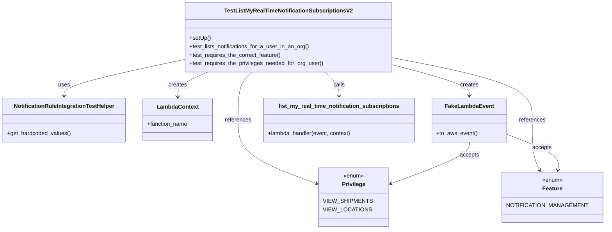

# Diagram: common/subscription_service/subscription_service_tests/integration/test_list_my_real_time_notification_subscriptions.py

> Auto-generated by Obscura crawlers

## Mermaid

### SVG

<svg id="container" width="1691.6875" xmlns="http://www.w3.org/2000/svg" class="classDiagram" height="656" viewBox="0 0 1691.6875 656" role="graphics-document document" aria-roledescription="class"><g><defs><marker id="container_class-aggregationStart" class="marker aggregation class" refX="18" refY="7" markerWidth="190" markerHeight="240" orient="auto"><path d="M 18,7 L9,13 L1,7 L9,1 Z"></path></marker></defs><defs><marker id="container_class-aggregationEnd" class="marker aggregation class" refX="1" refY="7" markerWidth="20" markerHeight="28" orient="auto"><path d="M 18,7 L9,13 L1,7 L9,1 Z"></path></marker></defs><defs><marker id="container_class-extensionStart" class="marker extension class" refX="18" refY="7" markerWidth="190" markerHeight="240" orient="auto"><path d="M 1,7 L18,13 V 1 Z"></path></marker></defs><defs><marker id="container_class-extensionEnd" class="marker extension class" refX="1" refY="7" markerWidth="20" markerHeight="28" orient="auto"><path d="M 1,1 V 13 L18,7 Z"></path></marker></defs><defs><marker id="container_class-compositionStart" class="marker composition class" refX="18" refY="7" markerWidth="190" markerHeight="240" orient="auto"><path d="M 18,7 L9,13 L1,7 L9,1 Z"></path></marker></defs><defs><marker id="container_class-compositionEnd" class="marker composition class" refX="1" refY="7" markerWidth="20" markerHeight="28" orient="auto"><path d="M 18,7 L9,13 L1,7 L9,1 Z"></path></marker></defs><defs><marker id="container_class-dependencyStart" class="marker dependency class" refX="6" refY="7" markerWidth="190" markerHeight="240" orient="auto"><path d="M 5,7 L9,13 L1,7 L9,1 Z"></path></marker></defs><defs><marker id="container_class-dependencyEnd" class="marker dependency class" refX="13" refY="7" markerWidth="20" markerHeight="28" orient="auto"><path d="M 18,7 L9,13 L14,7 L9,1 Z"></path></marker></defs><defs><marker id="container_class-lollipopStart" class="marker lollipop class" refX="13" refY="7" markerWidth="190" markerHeight="240" orient="auto"><circle stroke="black" fill="transparent" cx="7" cy="7" r="6"></circle></marker></defs><defs><marker id="container_class-lollipopEnd" class="marker lollipop class" refX="1" refY="7" markerWidth="190" markerHeight="240" orient="auto"><circle stroke="black" fill="transparent" cx="7" cy="7" r="6"></circle></marker></defs><g class="root"><g class="clusters"></g><g class="edgePaths"><path d="M526.266,169.232L468.628,181.527C410.991,193.821,295.716,218.411,238.079,235.872C180.441,253.333,180.441,263.667,180.441,268.833L180.441,274" id="id_TestListMyRealTimeNotificationSubscriptionsV2_NotificationRuleIntegrationTestHelper_1" class="edge-thickness-normal edge-pattern-solid relation" style=";;;" data-edge="true" data-et="edge" data-id="id_TestListMyRealTimeNotificationSubscriptionsV2_NotificationRuleIntegrationTestHelper_1" data-points="W3sieCI6NTI2LjI2NTYyNSwieSI6MTY5LjIzMTg1MDg0ODg2OTl9LHsieCI6MTgwLjQ0MTQwNjI1LCJ5IjoyNDN9LHsieCI6MTgwLjQ0MTQwNjI1LCJ5IjoyODB9XQ==" marker-end="url(#container_class-dependencyEnd)"></path><path d="M588.098,206L573.777,212.167C559.456,218.333,530.814,230.667,516.493,242.5C502.172,254.333,502.172,265.667,502.172,271.333L502.172,277" id="id_TestListMyRealTimeNotificationSubscriptionsV2_LambdaContext_2" class="edge-thickness-normal edge-pattern-solid relation" style=";;;" data-edge="true" data-et="edge" data-id="id_TestListMyRealTimeNotificationSubscriptionsV2_LambdaContext_2" data-points="W3sieCI6NTg4LjA5NzgyODU4NDU1ODgsInkiOjIwNn0seyJ4Ijo1MDIuMTcxODc1LCJ5IjoyNDN9LHsieCI6NTAyLjE3MTg3NSwieSI6MjgzfV0=" marker-end="url(#container_class-dependencyEnd)"></path><path d="M1109.75,184.574L1146.372,194.312C1182.993,204.049,1256.237,223.525,1292.859,238.429C1329.48,253.333,1329.48,263.667,1329.48,268.833L1329.48,274" id="id_TestListMyRealTimeNotificationSubscriptionsV2_FakeLambdaEvent_3" class="edge-thickness-normal edge-pattern-solid relation" style=";;;" data-edge="true" data-et="edge" data-id="id_TestListMyRealTimeNotificationSubscriptionsV2_FakeLambdaEvent_3" data-points="W3sieCI6MTEwOS43NSwieSI6MTg0LjU3MzkxNzIyNzM2ODl9LHsieCI6MTMyOS40ODA0Njg3NSwieSI6MjQzfSx7IngiOjEzMjkuNDgwNDY4NzUsInkiOjI4MH1d" marker-end="url(#container_class-dependencyEnd)"></path><path d="M922.627,206L929.143,212.167C935.66,218.333,948.693,230.667,955.21,242C961.727,253.333,961.727,263.667,961.727,268.833L961.727,274" id="id_TestListMyRealTimeNotificationSubscriptionsV2_list_my_real_time_notification_subscriptions_4" class="edge-thickness-normal edge-pattern-solid relation" style=";;;" data-edge="true" data-et="edge" data-id="id_TestListMyRealTimeNotificationSubscriptionsV2_list_my_real_time_notification_subscriptions_4" data-points="W3sieCI6OTIyLjYyNjYwODQ1NTg4MjMsInkiOjIwNn0seyJ4Ijo5NjEuNzI2NTYyNSwieSI6MjQzfSx7IngiOjk2MS43MjY1NjI1LCJ5IjoyODB9XQ==" marker-end="url(#container_class-dependencyEnd)"></path><path d="M713.389,206L706.872,212.167C700.356,218.333,687.322,230.667,680.806,253.5C674.289,276.333,674.289,309.667,674.289,343C674.289,376.333,674.289,409.667,712.946,440.611C751.602,471.556,828.916,500.113,867.572,514.391L906.229,528.669" id="id_TestListMyRealTimeNotificationSubscriptionsV2_Privilege_5" class="edge-thickness-normal edge-pattern-solid relation" style=";;;" data-edge="true" data-et="edge" data-id="id_TestListMyRealTimeNotificationSubscriptionsV2_Privilege_5" data-points="W3sieCI6NzEzLjM4OTAxNjU0NDExNzcsInkiOjIwNn0seyJ4Ijo2NzQuMjg5MDYyNSwieSI6MjQzfSx7IngiOjY3NC4yODkwNjI1LCJ5IjozNDN9LHsieCI6Njc0LjI4OTA2MjUsInkiOjQ0M30seyJ4Ijo5MTEuODU3NDIxODc1LCJ5Ijo1MzAuNzQ3NzA2MTIxMTgzNn1d" marker-end="url(#container_class-dependencyEnd)"></path><path d="M1109.75,164.717L1175.701,177.764C1241.651,190.811,1373.552,216.906,1439.503,246.619C1505.453,276.333,1505.453,309.667,1505.453,343C1505.453,376.333,1505.453,409.667,1508.289,433.569C1511.126,457.471,1516.798,471.943,1519.634,479.178L1522.471,486.414" id="id_TestListMyRealTimeNotificationSubscriptionsV2_Feature_6" class="edge-thickness-normal edge-pattern-solid relation" style=";;;" data-edge="true" data-et="edge" data-id="id_TestListMyRealTimeNotificationSubscriptionsV2_Feature_6" data-points="W3sieCI6MTEwOS43NSwieSI6MTY0LjcxNjUwMDE3NjE1MDM2fSx7IngiOjE1MDUuNDUzMTI1LCJ5IjoyNDN9LHsieCI6MTUwNS40NTMxMjUsInkiOjM0M30seyJ4IjoxNTA1LjQ1MzEyNSwieSI6NDQzfSx7IngiOjE1MjQuNjYwMTg4NTMzMDU3OSwieSI6NDkyfV0=" marker-end="url(#container_class-dependencyEnd)"></path><path d="M1329.48,406L1329.48,412.167C1329.48,418.333,1329.48,430.667,1290.824,451.111C1252.167,471.556,1174.854,500.113,1136.197,514.391L1097.54,528.669" id="id_FakeLambdaEvent_Privilege_7" class="edge-thickness-normal edge-pattern-solid relation" style=";;;" data-edge="true" data-et="edge" data-id="id_FakeLambdaEvent_Privilege_7" data-points="W3sieCI6MTMyOS40ODA0Njg3NSwieSI6NDA2fSx7IngiOjEzMjkuNDgwNDY4NzUsInkiOjQ0M30seyJ4IjoxMDkxLjkxMjEwOTM3NSwieSI6NTMwLjc0NzcwNjEyMTE4MzZ9XQ==" marker-end="url(#container_class-dependencyEnd)"></path><path d="M1432.625,384.74L1456.62,394.45C1480.615,404.16,1528.604,423.58,1551.191,440.475C1573.778,457.371,1570.962,471.741,1569.554,478.927L1568.146,486.112" id="id_FakeLambdaEvent_Feature_8" class="edge-thickness-normal edge-pattern-solid relation" style=";;;" data-edge="true" data-et="edge" data-id="id_FakeLambdaEvent_Feature_8" data-points="W3sieCI6MTQzMi42MjUsInkiOjM4NC43Mzk3NzY0ODE1NjA1fSx7IngiOjE1NzYuNTkzNzUsInkiOjQ0M30seyJ4IjoxNTY2Ljk5MTgwMDEwMzMwNTksInkiOjQ5Mn1d" marker-end="url(#container_class-dependencyEnd)"></path></g><g class="edgeLabels"><g class="edgeLabel" transform="translate(180.44140625, 243)"><g class="label" data-id="id_TestListMyRealTimeNotificationSubscriptionsV2_NotificationRuleIntegrationTestHelper_1" transform="translate(-16.4921875, -12)"><foreignObject width="32.984375" height="24">

uses

</foreignObject></g></g><g class="edgeLabel" transform="translate(502.171875, 243)"><g class="label" data-id="id_TestListMyRealTimeNotificationSubscriptionsV2_LambdaContext_2" transform="translate(-26.171875, -12)"><foreignObject width="52.34375" height="24">

creates

</foreignObject></g></g><g class="edgeLabel" transform="translate(1329.48046875, 243)"><g class="label" data-id="id_TestListMyRealTimeNotificationSubscriptionsV2_FakeLambdaEvent_3" transform="translate(-26.171875, -12)"><foreignObject width="52.34375" height="24">

creates

</foreignObject></g></g><g class="edgeLabel" transform="translate(961.7265625, 243)"><g class="label" data-id="id_TestListMyRealTimeNotificationSubscriptionsV2_list_my_real_time_notification_subscriptions_4" transform="translate(-16.4453125, -12)"><foreignObject width="32.890625" height="24">

calls

</foreignObject></g></g><g class="edgeLabel" transform="translate(674.2890625, 343)"><g class="label" data-id="id_TestListMyRealTimeNotificationSubscriptionsV2_Privilege_5" transform="translate(-37.828125, -12)"><foreignObject width="75.65625" height="24">

references

</foreignObject></g></g><g class="edgeLabel" transform="translate(1505.453125, 343)"><g class="label" data-id="id_TestListMyRealTimeNotificationSubscriptionsV2_Feature_6" transform="translate(-37.828125, -12)"><foreignObject width="75.65625" height="24">

references

</foreignObject></g></g><g class="edgeLabel" transform="translate(1329.48046875, 443)"><g class="label" data-id="id_FakeLambdaEvent_Privilege_7" transform="translate(-27.421875, -12)"><foreignObject width="54.84375" height="24">

accepts

</foreignObject></g></g><g class="edgeLabel" transform="translate(1527.75221, 423.23516)"><g class="label" data-id="id_FakeLambdaEvent_Feature_8" transform="translate(-27.421875, -12)"><foreignObject width="54.84375" height="24">

accepts

</foreignObject></g></g></g><g class="nodes"><g class="node default" id="classId-TestListMyRealTimeNotificationSubscriptionsV2-0" transform="translate(818.0078125, 107)"><g class="basic label-container"><path d="M-291.7421875 -99 L291.7421875 -99 L291.7421875 99 L-291.7421875 99" stroke="none" stroke-width="0" fill="#ECECFF" style=""></path><path d="M-291.7421875 -99 C-158.28386421037558 -99, -24.825540920751166 -99, 291.7421875 -99 M-291.7421875 -99 C-114.5062528153828 -99, 62.72968186923441 -99, 291.7421875 -99 M291.7421875 -99 C291.7421875 -57.377531453395626, 291.7421875 -15.755062906791252, 291.7421875 99 M291.7421875 -99 C291.7421875 -51.25764268217291, 291.7421875 -3.5152853643458144, 291.7421875 99 M291.7421875 99 C72.9625120470946 99, -145.8171634058108 99, -291.7421875 99 M291.7421875 99 C166.47269704281823 99, 41.20320658563645 99, -291.7421875 99 M-291.7421875 99 C-291.7421875 44.04083076150367, -291.7421875 -10.918338476992659, -291.7421875 -99 M-291.7421875 99 C-291.7421875 57.27648474455277, -291.7421875 15.552969489105536, -291.7421875 -99" stroke="#9370DB" stroke-width="1.3" fill="none" stroke-dasharray="0 0" style=""></path></g><g class="annotation-group text" transform="translate(0, -75)"></g><g class="label-group text" transform="translate(-174.515625, -75)"><g class="label" style="font-weight: bolder" transform="translate(0,-12)"><foreignObject width="349.03125" height="24">

TestListMyRealTimeNotificationSubscriptionsV2

</foreignObject></g></g><g class="members-group text" transform="translate(-279.7421875, -27)"></g><g class="methods-group text" transform="translate(-279.7421875, 3)"><g class="label" style="" transform="translate(0,-12)"><foreignObject width="60.421875" height="24">

+setUp()

</foreignObject></g><g class="label" style="" transform="translate(0,12)"><foreignObject width="344.859375" height="24">

+test_lists_notifications_for_a_user_in_an_org()

</foreignObject></g><g class="label" style="" transform="translate(0,36)"><foreignObject width="263.6875" height="24">

+test_requires_the_correct_feature()

</foreignObject></g><g class="label" style="" transform="translate(0,60)"><foreignObject width="384.96875" height="24">

+test_requires_the_privileges_needed_for_org_user()

</foreignObject></g></g><g class="divider" style=""><path d="M-291.7421875 -51 C-79.85999381344183 -51, 132.02219987311634 -51, 291.7421875 -51 M-291.7421875 -51 C-172.26523009349813 -51, -52.788272686996265 -51, 291.7421875 -51" stroke="#9370DB" stroke-width="1.3" fill="none" stroke-dasharray="0 0" style=""></path></g><g class="divider" style=""><path d="M-291.7421875 -27 C-63.92723901757171 -27, 163.88770946485658 -27, 291.7421875 -27 M-291.7421875 -27 C-62.40820923924406 -27, 166.92576902151188 -27, 291.7421875 -27" stroke="#9370DB" stroke-width="1.3" fill="none" stroke-dasharray="0 0" style=""></path></g></g><g class="node default" id="classId-NotificationRuleIntegrationTestHelper-1" transform="translate(180.44140625, 343)"><g class="basic label-container"><path d="M-172.44140625 -63 L172.44140625 -63 L172.44140625 63 L-172.44140625 63" stroke="none" stroke-width="0" fill="#ECECFF" style=""></path><path d="M-172.44140625 -63 C-83.61077344373844 -63, 5.219859362523124 -63, 172.44140625 -63 M-172.44140625 -63 C-44.63227254718031 -63, 83.17686115563939 -63, 172.44140625 -63 M172.44140625 -63 C172.44140625 -31.04141424543683, 172.44140625 0.9171715091263408, 172.44140625 63 M172.44140625 -63 C172.44140625 -30.621951984407204, 172.44140625 1.7560960311855922, 172.44140625 63 M172.44140625 63 C40.395814121877606 63, -91.64977800624479 63, -172.44140625 63 M172.44140625 63 C47.41226962652901 63, -77.61686699694198 63, -172.44140625 63 M-172.44140625 63 C-172.44140625 30.42430549397652, -172.44140625 -2.1513890120469625, -172.44140625 -63 M-172.44140625 63 C-172.44140625 37.07577697821455, -172.44140625 11.15155395642909, -172.44140625 -63" stroke="#9370DB" stroke-width="1.3" fill="none" stroke-dasharray="0 0" style=""></path></g><g class="annotation-group text" transform="translate(0, -39)"></g><g class="label-group text" transform="translate(-139.5859375, -39)"><g class="label" style="font-weight: bolder" transform="translate(0,-12)"><foreignObject width="279.171875" height="24">

NotificationRuleIntegrationTestHelper

</foreignObject></g></g><g class="members-group text" transform="translate(-160.44140625, 9)"></g><g class="methods-group text" transform="translate(-160.44140625, 39)"><g class="label" style="" transform="translate(0,-12)"><foreignObject width="181.296875" height="24">

+get_hardcoded_values()

</foreignObject></g></g><g class="divider" style=""><path d="M-172.44140625 -15 C-68.58918465955331 -15, 35.26303693089338 -15, 172.44140625 -15 M-172.44140625 -15 C-84.69222669142442 -15, 3.0569528671511534 -15, 172.44140625 -15" stroke="#9370DB" stroke-width="1.3" fill="none" stroke-dasharray="0 0" style=""></path></g><g class="divider" style=""><path d="M-172.44140625 9 C-43.981191201702615 9, 84.47902384659477 9, 172.44140625 9 M-172.44140625 9 C-52.180291652103975 9, 68.08082294579205 9, 172.44140625 9" stroke="#9370DB" stroke-width="1.3" fill="none" stroke-dasharray="0 0" style=""></path></g></g><g class="node default" id="classId-LambdaContext-2" transform="translate(502.171875, 343)"><g class="basic label-container"><path d="M-99.2890625 -60 L99.2890625 -60 L99.2890625 60 L-99.2890625 60" stroke="none" stroke-width="0" fill="#ECECFF" style=""></path><path d="M-99.2890625 -60 C-58.49158708512909 -60, -17.69411167025818 -60, 99.2890625 -60 M-99.2890625 -60 C-28.286292385311214 -60, 42.71647772937757 -60, 99.2890625 -60 M99.2890625 -60 C99.2890625 -20.90037464800416, 99.2890625 18.19925070399168, 99.2890625 60 M99.2890625 -60 C99.2890625 -16.305519722313285, 99.2890625 27.38896055537343, 99.2890625 60 M99.2890625 60 C37.92119990944925 60, -23.4466626811015 60, -99.2890625 60 M99.2890625 60 C51.88808477086237 60, 4.487107041724741 60, -99.2890625 60 M-99.2890625 60 C-99.2890625 17.85969179768481, -99.2890625 -24.28061640463038, -99.2890625 -60 M-99.2890625 60 C-99.2890625 14.238283125731861, -99.2890625 -31.523433748536277, -99.2890625 -60" stroke="#9370DB" stroke-width="1.3" fill="none" stroke-dasharray="0 0" style=""></path></g><g class="annotation-group text" transform="translate(0, -36)"></g><g class="label-group text" transform="translate(-57.296875, -36)"><g class="label" style="font-weight: bolder" transform="translate(0,-12)"><foreignObject width="114.59375" height="24">

LambdaContext

</foreignObject></g></g><g class="members-group text" transform="translate(-87.2890625, 12)"><g class="label" style="" transform="translate(0,-12)"><foreignObject width="117.28125" height="24">

+function_name

</foreignObject></g></g><g class="methods-group text" transform="translate(-87.2890625, 60)"></g><g class="divider" style=""><path d="M-99.2890625 -12 C-28.73432664643039 -12, 41.82040920713922 -12, 99.2890625 -12 M-99.2890625 -12 C-49.86855608877198 -12, -0.4480496775439633 -12, 99.2890625 -12" stroke="#9370DB" stroke-width="1.3" fill="none" stroke-dasharray="0 0" style=""></path></g><g class="divider" style=""><path d="M-99.2890625 36 C-20.75407140751821 36, 57.78091968496358 36, 99.2890625 36 M-99.2890625 36 C-21.551122422919022 36, 56.186817654161956 36, 99.2890625 36" stroke="#9370DB" stroke-width="1.3" fill="none" stroke-dasharray="0 0" style=""></path></g></g><g class="node default" id="classId-FakeLambdaEvent-3" transform="translate(1329.48046875, 343)"><g class="basic label-container"><path d="M-103.14453125 -63 L103.14453125 -63 L103.14453125 63 L-103.14453125 63" stroke="none" stroke-width="0" fill="#ECECFF" style=""></path><path d="M-103.14453125 -63 C-24.305983676573405 -63, 54.53256389685319 -63, 103.14453125 -63 M-103.14453125 -63 C-50.87712020616452 -63, 1.3902908376709604 -63, 103.14453125 -63 M103.14453125 -63 C103.14453125 -35.73893879009576, 103.14453125 -8.477877580191524, 103.14453125 63 M103.14453125 -63 C103.14453125 -22.36953307485676, 103.14453125 18.260933850286477, 103.14453125 63 M103.14453125 63 C45.371255518811495 63, -12.40202021237701 63, -103.14453125 63 M103.14453125 63 C39.39493350223834 63, -24.354664245523324 63, -103.14453125 63 M-103.14453125 63 C-103.14453125 14.467034595443273, -103.14453125 -34.06593080911345, -103.14453125 -63 M-103.14453125 63 C-103.14453125 30.410417692756987, -103.14453125 -2.1791646144860266, -103.14453125 -63" stroke="#9370DB" stroke-width="1.3" fill="none" stroke-dasharray="0 0" style=""></path></g><g class="annotation-group text" transform="translate(0, -39)"></g><g class="label-group text" transform="translate(-65.8671875, -39)"><g class="label" style="font-weight: bolder" transform="translate(0,-12)"><foreignObject width="131.734375" height="24">

FakeLambdaEvent

</foreignObject></g></g><g class="members-group text" transform="translate(-91.14453125, 9)"></g><g class="methods-group text" transform="translate(-91.14453125, 39)"><g class="label" style="" transform="translate(0,-12)"><foreignObject width="116.421875" height="24">

+to_aws_event()

</foreignObject></g></g><g class="divider" style=""><path d="M-103.14453125 -15 C-42.53924253176849 -15, 18.066046186463026 -15, 103.14453125 -15 M-103.14453125 -15 C-37.217747493628906 -15, 28.70903626274219 -15, 103.14453125 -15" stroke="#9370DB" stroke-width="1.3" fill="none" stroke-dasharray="0 0" style=""></path></g><g class="divider" style=""><path d="M-103.14453125 9 C-28.897467589840005 9, 45.34959607031999 9, 103.14453125 9 M-103.14453125 9 C-52.90571546335481 9, -2.666899676709619 9, 103.14453125 9" stroke="#9370DB" stroke-width="1.3" fill="none" stroke-dasharray="0 0" style=""></path></g></g><g class="node default" id="classId-list_my_real_time_notification_subscriptions-4" transform="translate(961.7265625, 343)"><g class="basic label-container"><path d="M-214.609375 -63 L214.609375 -63 L214.609375 63 L-214.609375 63" stroke="none" stroke-width="0" fill="#ECECFF" style=""></path><path d="M-214.609375 -63 C-57.906681833905765 -63, 98.79601133218847 -63, 214.609375 -63 M-214.609375 -63 C-116.95866575174615 -63, -19.307956503492306 -63, 214.609375 -63 M214.609375 -63 C214.609375 -30.309687692620855, 214.609375 2.3806246147582897, 214.609375 63 M214.609375 -63 C214.609375 -16.898723325596393, 214.609375 29.202553348807214, 214.609375 63 M214.609375 63 C48.44107617472653 63, -117.72722265054693 63, -214.609375 63 M214.609375 63 C108.53667441021688 63, 2.4639738204337505 63, -214.609375 63 M-214.609375 63 C-214.609375 34.41489063109832, -214.609375 5.829781262196633, -214.609375 -63 M-214.609375 63 C-214.609375 25.16991104011494, -214.609375 -12.66017791977012, -214.609375 -63" stroke="#9370DB" stroke-width="1.3" fill="none" stroke-dasharray="0 0" style=""></path></g><g class="annotation-group text" transform="translate(0, -39)"></g><g class="label-group text" transform="translate(-165.03125, -39)"><g class="label" style="font-weight: bolder" transform="translate(0,-12)"><foreignObject width="330.0625" height="24">

list_my_real_time_notification_subscriptions

</foreignObject></g></g><g class="members-group text" transform="translate(-202.609375, 9)"></g><g class="methods-group text" transform="translate(-202.609375, 39)"><g class="label" style="" transform="translate(0,-12)"><foreignObject width="240.1875" height="24">

+lambda_handler(event, context)

</foreignObject></g></g><g class="divider" style=""><path d="M-214.609375 -15 C-65.53748776036846 -15, 83.53439947926307 -15, 214.609375 -15 M-214.609375 -15 C-108.1052829542797 -15, -1.6011909085594027 -15, 214.609375 -15" stroke="#9370DB" stroke-width="1.3" fill="none" stroke-dasharray="0 0" style=""></path></g><g class="divider" style=""><path d="M-214.609375 9 C-73.12503094392957 9, 68.35931311214085 9, 214.609375 9 M-214.609375 9 C-89.5546627674854 9, 35.50004946502921 9, 214.609375 9" stroke="#9370DB" stroke-width="1.3" fill="none" stroke-dasharray="0 0" style=""></path></g></g><g class="node default" id="classId-Privilege-5" transform="translate(1001.884765625, 564)"><g class="basic label-container"><path d="M-90.02734375 -84 L90.02734375 -84 L90.02734375 84 L-90.02734375 84" stroke="none" stroke-width="0" fill="#ECECFF" style=""></path><path d="M-90.02734375 -84 C-20.045467063383796 -84, 49.93640962323241 -84, 90.02734375 -84 M-90.02734375 -84 C-30.82196377920569 -84, 28.383416191588623 -84, 90.02734375 -84 M90.02734375 -84 C90.02734375 -40.355000141977996, 90.02734375 3.289999716044008, 90.02734375 84 M90.02734375 -84 C90.02734375 -24.935337430515006, 90.02734375 34.12932513896999, 90.02734375 84 M90.02734375 84 C49.6203477745354 84, 9.213351799070793 84, -90.02734375 84 M90.02734375 84 C37.501728279472964 84, -15.023887191054072 84, -90.02734375 84 M-90.02734375 84 C-90.02734375 41.48683116299572, -90.02734375 -1.026337674008559, -90.02734375 -84 M-90.02734375 84 C-90.02734375 31.253476197505194, -90.02734375 -21.493047604989613, -90.02734375 -84" stroke="#9370DB" stroke-width="1.3" fill="none" stroke-dasharray="0 0" style=""></path></g><g class="annotation-group text" transform="translate(-29.53125, -60)"><g class="label" style="" transform="translate(0,-12)"><foreignObject width="59.0625" height="24">

«enum»

</foreignObject></g></g><g class="label-group text" transform="translate(-31.8671875, -36)"><g class="label" style="font-weight: bolder" transform="translate(0,-12)"><foreignObject width="63.734375" height="24">

Privilege

</foreignObject></g></g><g class="members-group text" transform="translate(-78.02734375, 12)"><g class="label" style="" transform="translate(0,-12)"><foreignObject width="124.1875" height="24">

VIEW_SHIPMENTS

</foreignObject></g><g class="label" style="" transform="translate(0,12)"><foreignObject width="122.125" height="24">

VIEW_LOCATIONS

</foreignObject></g></g><g class="methods-group text" transform="translate(-78.02734375, 84)"></g><g class="divider" style=""><path d="M-90.02734375 -12 C-49.00660567784902 -12, -7.985867605698047 -12, 90.02734375 -12 M-90.02734375 -12 C-24.719766775464933 -12, 40.587810199070134 -12, 90.02734375 -12" stroke="#9370DB" stroke-width="1.3" fill="none" stroke-dasharray="0 0" style=""></path></g><g class="divider" style=""><path d="M-90.02734375 60 C-21.450418850288315 60, 47.12650604942337 60, 90.02734375 60 M-90.02734375 60 C-50.0904407779037 60, -10.153537805807403 60, 90.02734375 60" stroke="#9370DB" stroke-width="1.3" fill="none" stroke-dasharray="0 0" style=""></path></g></g><g class="node default" id="classId-Feature-6" transform="translate(1552.8828125, 564)"><g class="basic label-container"><path d="M-130.8046875 -72 L130.8046875 -72 L130.8046875 72 L-130.8046875 72" stroke="none" stroke-width="0" fill="#ECECFF" style=""></path><path d="M-130.8046875 -72 C-75.7071289581057 -72, -20.609570416211383 -72, 130.8046875 -72 M-130.8046875 -72 C-36.27089855816256 -72, 58.262890383674886 -72, 130.8046875 -72 M130.8046875 -72 C130.8046875 -25.285479192544067, 130.8046875 21.429041614911867, 130.8046875 72 M130.8046875 -72 C130.8046875 -34.88780986294559, 130.8046875 2.2243802741088246, 130.8046875 72 M130.8046875 72 C55.67497658676049 72, -19.454734326479013 72, -130.8046875 72 M130.8046875 72 C31.166676304822488 72, -68.47133489035502 72, -130.8046875 72 M-130.8046875 72 C-130.8046875 41.536490764493294, -130.8046875 11.072981528986588, -130.8046875 -72 M-130.8046875 72 C-130.8046875 30.976262737894245, -130.8046875 -10.047474524211509, -130.8046875 -72" stroke="#9370DB" stroke-width="1.3" fill="none" stroke-dasharray="0 0" style=""></path></g><g class="annotation-group text" transform="translate(-29.53125, -48)"><g class="label" style="" transform="translate(0,-12)"><foreignObject width="59.0625" height="24">

«enum»

</foreignObject></g></g><g class="label-group text" transform="translate(-27.390625, -24)"><g class="label" style="font-weight: bolder" transform="translate(0,-12)"><foreignObject width="54.78125" height="24">

Feature

</foreignObject></g></g><g class="members-group text" transform="translate(-118.8046875, 24)"><g class="label" style="" transform="translate(0,-12)"><foreignObject width="208.078125" height="24">

NOTIFICATION_MANAGEMENT

</foreignObject></g></g><g class="methods-group text" transform="translate(-118.8046875, 72)"></g><g class="divider" style=""><path d="M-130.8046875 0 C-26.518523410397535 0, 77.76764067920493 0, 130.8046875 0 M-130.8046875 0 C-72.69090440724764 0, -14.577121314495301 0, 130.8046875 0" stroke="#9370DB" stroke-width="1.3" fill="none" stroke-dasharray="0 0" style=""></path></g><g class="divider" style=""><path d="M-130.8046875 48 C-52.18316589557324 48, 26.43835570885352 48, 130.8046875 48 M-130.8046875 48 C-57.579869602453016 48, 15.644948295093968 48, 130.8046875 48" stroke="#9370DB" stroke-width="1.3" fill="none" stroke-dasharray="0 0" style=""></path></g></g></g></g></g></svg>
