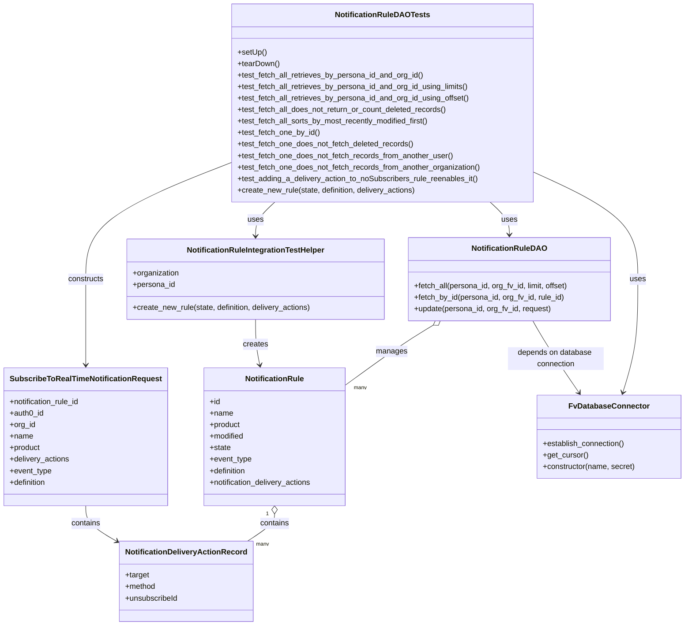

# Diagram: common/subscription_service/subscription_service_tests/integration/test_notification_rule_dao.py

> Auto-generated by Obscura crawlers

## Mermaid

### SVG

<svg id="container" width="1424.861328125" xmlns="http://www.w3.org/2000/svg" class="classDiagram" height="1306" viewBox="0 0 1424.861328125 1306" role="graphics-document document" aria-roledescription="class"><g><defs><marker id="container_class-aggregationStart" class="marker aggregation class" refX="18" refY="7" markerWidth="190" markerHeight="240" orient="auto"><path d="M 18,7 L9,13 L1,7 L9,1 Z"></path></marker></defs><defs><marker id="container_class-aggregationEnd" class="marker aggregation class" refX="1" refY="7" markerWidth="20" markerHeight="28" orient="auto"><path d="M 18,7 L9,13 L1,7 L9,1 Z"></path></marker></defs><defs><marker id="container_class-extensionStart" class="marker extension class" refX="18" refY="7" markerWidth="190" markerHeight="240" orient="auto"><path d="M 1,7 L18,13 V 1 Z"></path></marker></defs><defs><marker id="container_class-extensionEnd" class="marker extension class" refX="1" refY="7" markerWidth="20" markerHeight="28" orient="auto"><path d="M 1,1 V 13 L18,7 Z"></path></marker></defs><defs><marker id="container_class-compositionStart" class="marker composition class" refX="18" refY="7" markerWidth="190" markerHeight="240" orient="auto"><path d="M 18,7 L9,13 L1,7 L9,1 Z"></path></marker></defs><defs><marker id="container_class-compositionEnd" class="marker composition class" refX="1" refY="7" markerWidth="20" markerHeight="28" orient="auto"><path d="M 18,7 L9,13 L1,7 L9,1 Z"></path></marker></defs><defs><marker id="container_class-dependencyStart" class="marker dependency class" refX="6" refY="7" markerWidth="190" markerHeight="240" orient="auto"><path d="M 5,7 L9,13 L1,7 L9,1 Z"></path></marker></defs><defs><marker id="container_class-dependencyEnd" class="marker dependency class" refX="13" refY="7" markerWidth="20" markerHeight="28" orient="auto"><path d="M 18,7 L9,13 L14,7 L9,1 Z"></path></marker></defs><defs><marker id="container_class-lollipopStart" class="marker lollipop class" refX="13" refY="7" markerWidth="190" markerHeight="240" orient="auto"><circle stroke="black" fill="transparent" cx="7" cy="7" r="6"></circle></marker></defs><defs><marker id="container_class-lollipopEnd" class="marker lollipop class" refX="1" refY="7" markerWidth="190" markerHeight="240" orient="auto"><circle stroke="black" fill="transparent" cx="7" cy="7" r="6"></circle></marker></defs><g class="root"><g class="clusters"></g><g class="edgePaths"><path d="M1106.895,358.279L1143.754,375.066C1180.614,391.853,1254.333,425.426,1291.193,462.88C1328.053,500.333,1328.053,541.667,1328.053,585C1328.053,628.333,1328.053,673.667,1322.857,713.045C1317.662,752.423,1307.271,785.847,1302.076,802.559L1296.881,819.27" id="id_NotificationRuleDAOTests_FvDatabaseConnector_1" class="edge-thickness-normal edge-pattern-solid relation" style=";;;" data-edge="true" data-et="edge" data-id="id_NotificationRuleDAOTests_FvDatabaseConnector_1" data-points="W3sieCI6MTEwNi44OTQ1MzEyNSwieSI6MzU4LjI3OTA5NTYyNTAzODc0fSx7IngiOjEzMjguMDUyNzM0Mzc1LCJ5Ijo0NTl9LHsieCI6MTMyOC4wNTI3MzQzNzUsInkiOjU4M30seyJ4IjoxMzI4LjA1MjczNDM3NSwieSI6NzE5fSx7IngiOjEyOTUuMDk5MzY2NDk5MzUyMywieSI6ODI1fV0=" marker-end="url(#container_class-dependencyEnd)"></path><path d="M565.611,422L558.858,428.167C552.105,434.333,538.6,446.667,531.847,458.5C525.094,470.333,525.094,481.667,525.094,487.333L525.094,493" id="id_NotificationRuleDAOTests_NotificationRuleIntegrationTestHelper_2" class="edge-thickness-normal edge-pattern-solid relation" style=";;;" data-edge="true" data-et="edge" data-id="id_NotificationRuleDAOTests_NotificationRuleIntegrationTestHelper_2" data-points="W3sieCI6NTY1LjYxMTA3MTk3NzQ1OSwieSI6NDIyfSx7IngiOjUyNS4wOTM3NSwieSI6NDU5fSx7IngiOjUyNS4wOTM3NSwieSI6NDk5fV0=" marker-end="url(#container_class-dependencyEnd)"></path><path d="M1018.967,422L1025.72,428.167C1032.473,434.333,1045.979,446.667,1052.731,458C1059.484,469.333,1059.484,479.667,1059.484,484.833L1059.484,490" id="id_NotificationRuleDAOTests_NotificationRuleDAO_3" class="edge-thickness-normal edge-pattern-solid relation" style=";;;" data-edge="true" data-et="edge" data-id="id_NotificationRuleDAOTests_NotificationRuleDAO_3" data-points="W3sieCI6MTAxOC45NjcwNTMwMjI1NDEsInkiOjQyMn0seyJ4IjoxMDU5LjQ4NDM3NSwieSI6NDU5fSx7IngiOjEwNTkuNDg0Mzc1LCJ5Ijo0OTZ9XQ==" marker-end="url(#container_class-dependencyEnd)"></path><path d="M477.684,338.61L426.615,358.675C375.547,378.74,273.41,418.87,222.342,459.602C171.273,500.333,171.273,541.667,171.273,585C171.273,628.333,171.273,673.667,171.273,703.5C171.273,733.333,171.273,747.667,171.273,754.833L171.273,762" id="id_NotificationRuleDAOTests_SubscribeToRealTimeNotificationRequest_4" class="edge-thickness-normal edge-pattern-solid relation" style=";;;" data-edge="true" data-et="edge" data-id="id_NotificationRuleDAOTests_SubscribeToRealTimeNotificationRequest_4" data-points="W3sieCI6NDc3LjY4MzU5Mzc1LCJ5IjozMzguNjA5OTg4Njc3ODIxMX0seyJ4IjoxNzEuMjczNDM3NSwieSI6NDU5fSx7IngiOjE3MS4yNzM0Mzc1LCJ5Ijo1ODN9LHsieCI6MTcxLjI3MzQzNzUsInkiOjcxOX0seyJ4IjoxNzEuMjczNDM3NSwieSI6NzY4fV0=" marker-end="url(#container_class-dependencyEnd)"></path><path d="M898.842,678.838L887.623,685.532C876.403,692.225,853.963,705.613,823.291,726.357C792.618,747.102,753.714,775.203,734.261,789.254L714.809,803.305" id="id_NotificationRuleDAO_NotificationRule_5" class="edge-thickness-normal edge-pattern-solid relation" style=";;;" data-edge="true" data-et="edge" data-id="id_NotificationRuleDAO_NotificationRule_5" data-points="W3sieCI6OTEzLjY1NjQyMjMzNDU1ODgsInkiOjY3MH0seyJ4Ijo4MzEuNTIzNDM3NSwieSI6NzE5fSx7IngiOjcxNC44MDg1OTM3NSwieSI6ODAzLjMwNTIzOTYxMjg3Njh9XQ==" marker-start="url(#container_class-aggregationStart)"></path><path d="M564.328,1073.25L564.328,1076.542C564.328,1079.833,564.328,1086.417,555.059,1095.875C545.79,1105.333,527.251,1117.667,517.982,1123.833L508.713,1130" id="id_NotificationRule_NotificationDeliveryActionRecord_6" class="edge-thickness-normal edge-pattern-solid relation" style=";;;" data-edge="true" data-et="edge" data-id="id_NotificationRule_NotificationDeliveryActionRecord_6" data-points="W3sieCI6NTY0LjMyODEyNSwieSI6MTA1Nn0seyJ4Ijo1NjQuMzI4MTI1LCJ5IjoxMDkzfSx7IngiOjUwOC43MTI4NTgzNDE5NDIxNCwieSI6MTEzMH1d" marker-start="url(#container_class-aggregationStart)"></path><path d="M171.273,1056L171.273,1062.167C171.273,1068.333,171.273,1080.667,183.356,1093.756C195.439,1106.846,219.604,1120.692,231.686,1127.615L243.769,1134.538" id="id_SubscribeToRealTimeNotificationRequest_NotificationDeliveryActionRecord_7" class="edge-thickness-normal edge-pattern-solid relation" style=";;;" data-edge="true" data-et="edge" data-id="id_SubscribeToRealTimeNotificationRequest_NotificationDeliveryActionRecord_7" data-points="W3sieCI6MTcxLjI3MzQzNzUsInkiOjEwNTZ9LHsieCI6MTcxLjI3MzQzNzUsInkiOjEwOTN9LHsieCI6MjQ4Ljk3NDYwOTM3NSwieSI6MTEzNy41MjA5ODk5ODM2Mjk4fV0=" marker-end="url(#container_class-dependencyEnd)"></path><path d="M525.094,667L525.094,675.667C525.094,684.333,525.094,701.667,526.555,717.52C528.016,733.373,530.938,747.747,532.399,754.934L533.86,762.12" id="id_NotificationRuleIntegrationTestHelper_NotificationRule_8" class="edge-thickness-normal edge-pattern-solid relation" style=";;;" data-edge="true" data-et="edge" data-id="id_NotificationRuleIntegrationTestHelper_NotificationRule_8" data-points="W3sieCI6NTI1LjA5Mzc1LCJ5Ijo2Njd9LHsieCI6NTI1LjA5Mzc1LCJ5Ijo3MTl9LHsieCI6NTM1LjA1NDgwODkzNzgyMzksInkiOjc2OH1d" marker-end="url(#container_class-dependencyEnd)"></path><path d="M1108.197,670L1112.77,678.167C1117.342,686.333,1126.488,702.667,1142.616,727.675C1158.744,752.684,1181.855,786.368,1193.411,803.21L1204.966,820.053" id="id_NotificationRuleDAO_FvDatabaseConnector_9" class="edge-thickness-normal edge-pattern-solid relation" style=";;;" data-edge="true" data-et="edge" data-id="id_NotificationRuleDAO_FvDatabaseConnector_9" data-points="W3sieCI6MTEwOC4xOTY5Nzg0MDA3MzU0LCJ5Ijo2NzB9LHsieCI6MTEzNS42MzI4MTI1LCJ5Ijo3MTl9LHsieCI6MTIwOC4zNjA4NTI0OTM1MjMyLCJ5Ijo4MjV9XQ==" marker-end="url(#container_class-dependencyEnd)"></path></g><g class="edgeLabels"><g class="edgeLabel" transform="translate(1328.052734375, 583)"><g class="label" data-id="id_NotificationRuleDAOTests_FvDatabaseConnector_1" transform="translate(-16.4921875, -12)"><foreignObject width="32.984375" height="24">

uses

</foreignObject></g></g><g class="edgeLabel" transform="translate(525.09375, 459)"><g class="label" data-id="id_NotificationRuleDAOTests_NotificationRuleIntegrationTestHelper_2" transform="translate(-16.4921875, -12)"><foreignObject width="32.984375" height="24">

uses

</foreignObject></g></g><g class="edgeLabel" transform="translate(1059.484375, 459)"><g class="label" data-id="id_NotificationRuleDAOTests_NotificationRuleDAO_3" transform="translate(-16.4921875, -12)"><foreignObject width="32.984375" height="24">

uses

</foreignObject></g></g><g class="edgeLabel" transform="translate(171.2734375, 583)"><g class="label" data-id="id_NotificationRuleDAOTests_SubscribeToRealTimeNotificationRequest_4" transform="translate(-37.84375, -12)"><foreignObject width="75.6875" height="24">

constructs

</foreignObject></g></g><g class="edgeLabel" transform="translate(811.93055, 733.1523)"><g class="label" data-id="id_NotificationRuleDAO_NotificationRule_5" transform="translate(-32.296875, -12)"><foreignObject width="64.59375" height="24">

manages

</foreignObject></g></g><g class="edgeLabel" transform="translate(564.328125, 1093)"><g class="label" data-id="id_NotificationRule_NotificationDeliveryActionRecord_6" transform="translate(-30.890625, -12)"><foreignObject width="61.78125" height="24">

contains

</foreignObject></g></g><g class="edgeLabel" transform="translate(171.2734375, 1093)"><g class="label" data-id="id_SubscribeToRealTimeNotificationRequest_NotificationDeliveryActionRecord_7" transform="translate(-30.890625, -12)"><foreignObject width="61.78125" height="24">

contains

</foreignObject></g></g><g class="edgeLabel" transform="translate(525.09375, 719)"><g class="label" data-id="id_NotificationRuleIntegrationTestHelper_NotificationRule_8" transform="translate(-26.171875, -12)"><foreignObject width="52.34375" height="24">

creates

</foreignObject></g></g><g class="edgeLabel" transform="translate(1156.11106, 748.84674)"><g class="label" data-id="id_NotificationRuleDAO_FvDatabaseConnector_9" transform="translate(-100, -24)"><foreignObject width="200" height="48">

depends on database connection

</foreignObject></g></g><g class="edgeTerminals" transform="translate(890.94260968224, 666.084292244955)"><g class="inner" transform="translate(0, 0)"><foreignObject style="width: 9px; height: 12px;">
1
</foreignObject></g></g><g class="edgeTerminals" transform="translate(549.3281275, 1073.500002142857)"><g class="inner" transform="translate(0, 0)"><foreignObject style="width: 9px; height: 12px;">
1
</foreignObject></g></g><g class="edgeTerminals" transform="translate(732.777961144909, 800.2178950007743)"><g class="inner" transform="translate(0, 0)"></g><foreignObject style="width: 36px; height: 12px;">
many
</foreignObject></g><g class="edgeTerminals" transform="translate(526.5915757210644, 1127.7954037504003)"><g class="inner" transform="translate(0, 0)"></g><foreignObject style="width: 36px; height: 12px;">
many
</foreignObject></g></g><g class="nodes"><g class="node default" id="classId-NotificationRuleDAOTests-0" transform="translate(792.2890625, 215)"><g class="basic label-container"><path d="M-314.60546875 -207 L314.60546875 -207 L314.60546875 207 L-314.60546875 207" stroke="none" stroke-width="0" fill="#ECECFF" style=""></path><path d="M-314.60546875 -207 C-142.73294918444458 -207, 29.139570381110843 -207, 314.60546875 -207 M-314.60546875 -207 C-102.30589191847068 -207, 109.99368491305864 -207, 314.60546875 -207 M314.60546875 -207 C314.60546875 -69.41041524352124, 314.60546875 68.17916951295751, 314.60546875 207 M314.60546875 -207 C314.60546875 -45.60341644082399, 314.60546875 115.79316711835202, 314.60546875 207 M314.60546875 207 C162.93305183025353 207, 11.260634910507065 207, -314.60546875 207 M314.60546875 207 C153.8876255379137 207, -6.830217674172616 207, -314.60546875 207 M-314.60546875 207 C-314.60546875 91.30176098788657, -314.60546875 -24.396478024226866, -314.60546875 -207 M-314.60546875 207 C-314.60546875 111.88895252679934, -314.60546875 16.777905053598687, -314.60546875 -207" stroke="#9370DB" stroke-width="1.3" fill="none" stroke-dasharray="0 0" style=""></path></g><g class="annotation-group text" transform="translate(0, -183)"></g><g class="label-group text" transform="translate(-93.2734375, -183)"><g class="label" style="font-weight: bolder" transform="translate(0,-12)"><foreignObject width="186.546875" height="24">

NotificationRuleDAOTests

</foreignObject></g></g><g class="members-group text" transform="translate(-302.60546875, -135)"></g><g class="methods-group text" transform="translate(-302.60546875, -105)"><g class="label" style="" transform="translate(0,-12)"><foreignObject width="60.421875" height="24">

+setUp()

</foreignObject></g><g class="label" style="" transform="translate(0,12)"><foreignObject width="87.75" height="24">

+tearDown()

</foreignObject></g><g class="label" style="" transform="translate(0,36)"><foreignObject width="392.359375" height="24">

+test_fetch_all_retrieves_by_persona_id_and_org_id()

</foreignObject></g><g class="label" style="" transform="translate(0,60)"><foreignObject width="488.25" height="24">

+test_fetch_all_retrieves_by_persona_id_and_org_id_using_limits()

</foreignObject></g><g class="label" style="" transform="translate(0,84)"><foreignObject width="489.375" height="24">

+test_fetch_all_retrieves_by_persona_id_and_org_id_using_offset()

</foreignObject></g><g class="label" style="" transform="translate(0,108)"><foreignObject width="442.125" height="24">

+test_fetch_all_does_not_return_or_count_deleted_records()

</foreignObject></g><g class="label" style="" transform="translate(0,132)"><foreignObject width="405.21875" height="24">

+test_fetch_all_sorts_by_most_recently_modified_first()

</foreignObject></g><g class="label" style="" transform="translate(0,156)"><foreignObject width="172.9375" height="24">

+test_fetch_one_by_id()

</foreignObject></g><g class="label" style="" transform="translate(0,180)"><foreignObject width="371.046875" height="24">

+test_fetch_one_does_not_fetch_deleted_records()

</foreignObject></g><g class="label" style="" transform="translate(0,204)"><foreignObject width="453.265625" height="24">

+test_fetch_one_does_not_fetch_records_from_another_user()

</foreignObject></g><g class="label" style="" transform="translate(0,228)"><foreignObject width="511.9375" height="24">

+test_fetch_one_does_not_fetch_records_from_another_organization()

</foreignObject></g><g class="label" style="" transform="translate(0,252)"><foreignObject width="508.75" height="24">

+test_adding_a_delivery_action_to_noSubscribers_rule_reenables_it()

</foreignObject></g><g class="label" style="" transform="translate(0,276)"><foreignObject width="378.5" height="24">

+create_new_rule(state, definition, delivery_actions)

</foreignObject></g></g><g class="divider" style=""><path d="M-314.60546875 -159 C-88.60428473934843 -159, 137.39689927130314 -159, 314.60546875 -159 M-314.60546875 -159 C-147.8941793136412 -159, 18.817110122717622 -159, 314.60546875 -159" stroke="#9370DB" stroke-width="1.3" fill="none" stroke-dasharray="0 0" style=""></path></g><g class="divider" style=""><path d="M-314.60546875 -135 C-117.13798792372654 -135, 80.32949290254692 -135, 314.60546875 -135 M-314.60546875 -135 C-125.61668959814679 -135, 63.37208955370642 -135, 314.60546875 -135" stroke="#9370DB" stroke-width="1.3" fill="none" stroke-dasharray="0 0" style=""></path></g></g><g class="node default" id="classId-NotificationRuleDAO-1" transform="translate(1059.484375, 583)"><g class="basic label-container"><path d="M-213.34765625 -87 L213.34765625 -87 L213.34765625 87 L-213.34765625 87" stroke="none" stroke-width="0" fill="#ECECFF" style=""></path><path d="M-213.34765625 -87 C-80.38393788662722 -87, 52.579780476745555 -87, 213.34765625 -87 M-213.34765625 -87 C-108.55341873850787 -87, -3.7591812270157448 -87, 213.34765625 -87 M213.34765625 -87 C213.34765625 -40.27928315741911, 213.34765625 6.441433685161783, 213.34765625 87 M213.34765625 -87 C213.34765625 -48.13477409323417, 213.34765625 -9.269548186468342, 213.34765625 87 M213.34765625 87 C79.56592008642392 87, -54.21581607715217 87, -213.34765625 87 M213.34765625 87 C124.49989241433792 87, 35.65212857867584 87, -213.34765625 87 M-213.34765625 87 C-213.34765625 31.91827748072439, -213.34765625 -23.163445038551217, -213.34765625 -87 M-213.34765625 87 C-213.34765625 45.26143086762827, -213.34765625 3.522861735256541, -213.34765625 -87" stroke="#9370DB" stroke-width="1.3" fill="none" stroke-dasharray="0 0" style=""></path></g><g class="annotation-group text" transform="translate(0, -63)"></g><g class="label-group text" transform="translate(-74.4453125, -63)"><g class="label" style="font-weight: bolder" transform="translate(0,-12)"><foreignObject width="148.890625" height="24">

NotificationRuleDAO

</foreignObject></g></g><g class="members-group text" transform="translate(-201.34765625, -15)"></g><g class="methods-group text" transform="translate(-201.34765625, 15)"><g class="label" style="" transform="translate(0,-12)"><foreignObject width="328.25" height="24">

+fetch_all(persona_id, org_fv_id, limit, offset)

</foreignObject></g><g class="label" style="" transform="translate(0,12)"><foreignObject width="317.484375" height="24">

+fetch_by_id(persona_id, org_fv_id, rule_id)

</foreignObject></g><g class="label" style="" transform="translate(0,36)"><foreignObject width="289.40625" height="24">

+update(persona_id, org_fv_id, request)

</foreignObject></g></g><g class="divider" style=""><path d="M-213.34765625 -39 C-62.60732590520888 -39, 88.13300443958224 -39, 213.34765625 -39 M-213.34765625 -39 C-77.33702252261727 -39, 58.67361120476545 -39, 213.34765625 -39" stroke="#9370DB" stroke-width="1.3" fill="none" stroke-dasharray="0 0" style=""></path></g><g class="divider" style=""><path d="M-213.34765625 -15 C-103.691750379744 -15, 5.964155490512013 -15, 213.34765625 -15 M-213.34765625 -15 C-87.06280797679531 -15, 39.222040296409375 -15, 213.34765625 -15" stroke="#9370DB" stroke-width="1.3" fill="none" stroke-dasharray="0 0" style=""></path></g></g><g class="node default" id="classId-NotificationRule-2" transform="translate(564.328125, 912)"><g class="basic label-container"><path d="M-150.48046875 -144 L150.48046875 -144 L150.48046875 144 L-150.48046875 144" stroke="none" stroke-width="0" fill="#ECECFF" style=""></path><path d="M-150.48046875 -144 C-78.20657399909189 -144, -5.932679248183774 -144, 150.48046875 -144 M-150.48046875 -144 C-32.38908655337892 -144, 85.70229564324217 -144, 150.48046875 -144 M150.48046875 -144 C150.48046875 -51.39307021528981, 150.48046875 41.21385956942038, 150.48046875 144 M150.48046875 -144 C150.48046875 -49.02846336526194, 150.48046875 45.943073269476116, 150.48046875 144 M150.48046875 144 C89.55624786554225 144, 28.632026981084508 144, -150.48046875 144 M150.48046875 144 C74.00148242489384 144, -2.4775039002123265 144, -150.48046875 144 M-150.48046875 144 C-150.48046875 75.2155456713573, -150.48046875 6.431091342714609, -150.48046875 -144 M-150.48046875 144 C-150.48046875 78.58730305465656, -150.48046875 13.174606109313117, -150.48046875 -144" stroke="#9370DB" stroke-width="1.3" fill="none" stroke-dasharray="0 0" style=""></path></g><g class="annotation-group text" transform="translate(0, -120)"></g><g class="label-group text" transform="translate(-59.1484375, -120)"><g class="label" style="font-weight: bolder" transform="translate(0,-12)"><foreignObject width="118.296875" height="24">

NotificationRule

</foreignObject></g></g><g class="members-group text" transform="translate(-138.48046875, -72)"><g class="label" style="" transform="translate(0,-12)"><foreignObject width="22.078125" height="24">

+id

</foreignObject></g><g class="label" style="" transform="translate(0,12)"><foreignObject width="48.5" height="24">

+name

</foreignObject></g><g class="label" style="" transform="translate(0,36)"><foreignObject width="64.84375" height="24">

+product

</foreignObject></g><g class="label" style="" transform="translate(0,60)"><foreignObject width="72.609375" height="24">

+modified

</foreignObject></g><g class="label" style="" transform="translate(0,84)"><foreignObject width="44.09375" height="24">

+state

</foreignObject></g><g class="label" style="" transform="translate(0,108)"><foreignObject width="88.125" height="24">

+event_type

</foreignObject></g><g class="label" style="" transform="translate(0,132)"><foreignObject width="78.375" height="24">

+definition

</foreignObject></g><g class="label" style="" transform="translate(0,156)"><foreignObject width="217.8125" height="24">

+notification_delivery_actions

</foreignObject></g></g><g class="methods-group text" transform="translate(-138.48046875, 144)"></g><g class="divider" style=""><path d="M-150.48046875 -96 C-86.03815743264018 -96, -21.595846115280352 -96, 150.48046875 -96 M-150.48046875 -96 C-66.13314970778688 -96, 18.21416933442623 -96, 150.48046875 -96" stroke="#9370DB" stroke-width="1.3" fill="none" stroke-dasharray="0 0" style=""></path></g><g class="divider" style=""><path d="M-150.48046875 120 C-67.43958652054624 120, 15.601295708907514 120, 150.48046875 120 M-150.48046875 120 C-36.738116932010726 120, 77.00423488597855 120, 150.48046875 120" stroke="#9370DB" stroke-width="1.3" fill="none" stroke-dasharray="0 0" style=""></path></g></g><g class="node default" id="classId-NotificationDeliveryActionRecord-3" transform="translate(382.451171875, 1214)"><g class="basic label-container"><path d="M-133.4765625 -84 L133.4765625 -84 L133.4765625 84 L-133.4765625 84" stroke="none" stroke-width="0" fill="#ECECFF" style=""></path><path d="M-133.4765625 -84 C-56.63098719586996 -84, 20.214588108260074 -84, 133.4765625 -84 M-133.4765625 -84 C-41.340294979142485 -84, 50.79597254171503 -84, 133.4765625 -84 M133.4765625 -84 C133.4765625 -39.636314469767, 133.4765625 4.727371060465998, 133.4765625 84 M133.4765625 -84 C133.4765625 -43.229173716519604, 133.4765625 -2.458347433039208, 133.4765625 84 M133.4765625 84 C48.52859045827326 84, -36.419381583453486 84, -133.4765625 84 M133.4765625 84 C65.87588195845048 84, -1.7247985830990444 84, -133.4765625 84 M-133.4765625 84 C-133.4765625 29.353893505286983, -133.4765625 -25.292212989426034, -133.4765625 -84 M-133.4765625 84 C-133.4765625 31.956622962337008, -133.4765625 -20.086754075325985, -133.4765625 -84" stroke="#9370DB" stroke-width="1.3" fill="none" stroke-dasharray="0 0" style=""></path></g><g class="annotation-group text" transform="translate(0, -60)"></g><g class="label-group text" transform="translate(-121.4765625, -60)"><g class="label" style="font-weight: bolder" transform="translate(0,-12)"><foreignObject width="242.953125" height="24">

NotificationDeliveryActionRecord

</foreignObject></g></g><g class="members-group text" transform="translate(-121.4765625, -12)"><g class="label" style="" transform="translate(0,-12)"><foreignObject width="50.78125" height="24">

+target

</foreignObject></g><g class="label" style="" transform="translate(0,12)"><foreignObject width="64.484375" height="24">

+method

</foreignObject></g><g class="label" style="" transform="translate(0,36)"><foreignObject width="111.28125" height="24">

+unsubscribeId

</foreignObject></g></g><g class="methods-group text" transform="translate(-121.4765625, 84)"></g><g class="divider" style=""><path d="M-133.4765625 -36 C-30.221008887884878 -36, 73.03454472423024 -36, 133.4765625 -36 M-133.4765625 -36 C-62.025538785380064 -36, 9.425484929239872 -36, 133.4765625 -36" stroke="#9370DB" stroke-width="1.3" fill="none" stroke-dasharray="0 0" style=""></path></g><g class="divider" style=""><path d="M-133.4765625 60 C-32.190074161406656 60, 69.09641417718669 60, 133.4765625 60 M-133.4765625 60 C-31.67424354386513 60, 70.12807541226974 60, 133.4765625 60" stroke="#9370DB" stroke-width="1.3" fill="none" stroke-dasharray="0 0" style=""></path></g></g><g class="node default" id="classId-SubscribeToRealTimeNotificationRequest-4" transform="translate(171.2734375, 912)"><g class="basic label-container"><path d="M-163.2734375 -144 L163.2734375 -144 L163.2734375 144 L-163.2734375 144" stroke="none" stroke-width="0" fill="#ECECFF" style=""></path><path d="M-163.2734375 -144 C-72.07806503657177 -144, 19.117307426856456 -144, 163.2734375 -144 M-163.2734375 -144 C-75.52722141268886 -144, 12.21899467462228 -144, 163.2734375 -144 M163.2734375 -144 C163.2734375 -60.522606880566, 163.2734375 22.954786238867996, 163.2734375 144 M163.2734375 -144 C163.2734375 -55.404153639191435, 163.2734375 33.19169272161713, 163.2734375 144 M163.2734375 144 C42.528022854386904 144, -78.21739179122619 144, -163.2734375 144 M163.2734375 144 C84.79584275239942 144, 6.318248004798846 144, -163.2734375 144 M-163.2734375 144 C-163.2734375 57.03002336624132, -163.2734375 -29.939953267517353, -163.2734375 -144 M-163.2734375 144 C-163.2734375 72.2604780205493, -163.2734375 0.5209560410986, -163.2734375 -144" stroke="#9370DB" stroke-width="1.3" fill="none" stroke-dasharray="0 0" style=""></path></g><g class="annotation-group text" transform="translate(0, -120)"></g><g class="label-group text" transform="translate(-151.2734375, -120)"><g class="label" style="font-weight: bolder" transform="translate(0,-12)"><foreignObject width="302.546875" height="24">

SubscribeToRealTimeNotificationRequest

</foreignObject></g></g><g class="members-group text" transform="translate(-151.2734375, -72)"><g class="label" style="" transform="translate(0,-12)"><foreignObject width="150.609375" height="24">

+notification_rule_id

</foreignObject></g><g class="label" style="" transform="translate(0,12)"><foreignObject width="71.765625" height="24">

+auth0_id

</foreignObject></g><g class="label" style="" transform="translate(0,36)"><foreignObject width="54.0625" height="24">

+org_id

</foreignObject></g><g class="label" style="" transform="translate(0,60)"><foreignObject width="48.5" height="24">

+name

</foreignObject></g><g class="label" style="" transform="translate(0,84)"><foreignObject width="64.84375" height="24">

+product

</foreignObject></g><g class="label" style="" transform="translate(0,108)"><foreignObject width="126.40625" height="24">

+delivery_actions

</foreignObject></g><g class="label" style="" transform="translate(0,132)"><foreignObject width="88.125" height="24">

+event_type

</foreignObject></g><g class="label" style="" transform="translate(0,156)"><foreignObject width="78.375" height="24">

+definition

</foreignObject></g></g><g class="methods-group text" transform="translate(-151.2734375, 144)"></g><g class="divider" style=""><path d="M-163.2734375 -96 C-74.0030978519291 -96, 15.267241796141803 -96, 163.2734375 -96 M-163.2734375 -96 C-59.267597758368794 -96, 44.73824198326241 -96, 163.2734375 -96" stroke="#9370DB" stroke-width="1.3" fill="none" stroke-dasharray="0 0" style=""></path></g><g class="divider" style=""><path d="M-163.2734375 120 C-41.49183017942383 120, 80.28977714115234 120, 163.2734375 120 M-163.2734375 120 C-48.2409438937177 120, 66.7915497125646 120, 163.2734375 120" stroke="#9370DB" stroke-width="1.3" fill="none" stroke-dasharray="0 0" style=""></path></g></g><g class="node default" id="classId-NotificationRuleIntegrationTestHelper-5" transform="translate(525.09375, 583)"><g class="basic label-container"><path d="M-271.04296875 -84 L271.04296875 -84 L271.04296875 84 L-271.04296875 84" stroke="none" stroke-width="0" fill="#ECECFF" style=""></path><path d="M-271.04296875 -84 C-123.29845872566864 -84, 24.446051298662724 -84, 271.04296875 -84 M-271.04296875 -84 C-55.18436148923706 -84, 160.67424577152588 -84, 271.04296875 -84 M271.04296875 -84 C271.04296875 -18.404451076460035, 271.04296875 47.19109784707993, 271.04296875 84 M271.04296875 -84 C271.04296875 -46.757901119213884, 271.04296875 -9.515802238427767, 271.04296875 84 M271.04296875 84 C72.50117693053775 84, -126.0406148889245 84, -271.04296875 84 M271.04296875 84 C83.75952515738743 84, -103.52391843522514 84, -271.04296875 84 M-271.04296875 84 C-271.04296875 44.775816422266054, -271.04296875 5.551632844532108, -271.04296875 -84 M-271.04296875 84 C-271.04296875 39.31778493434099, -271.04296875 -5.3644301313180165, -271.04296875 -84" stroke="#9370DB" stroke-width="1.3" fill="none" stroke-dasharray="0 0" style=""></path></g><g class="annotation-group text" transform="translate(0, -60)"></g><g class="label-group text" transform="translate(-139.5859375, -60)"><g class="label" style="font-weight: bolder" transform="translate(0,-12)"><foreignObject width="279.171875" height="24">

NotificationRuleIntegrationTestHelper

</foreignObject></g></g><g class="members-group text" transform="translate(-259.04296875, -12)"><g class="label" style="" transform="translate(0,-12)"><foreignObject width="98.34375" height="24">

+organization

</foreignObject></g><g class="label" style="" transform="translate(0,12)"><foreignObject width="89.453125" height="24">

+persona_id

</foreignObject></g></g><g class="methods-group text" transform="translate(-259.04296875, 60)"><g class="label" style="" transform="translate(0,-12)"><foreignObject width="378.5" height="24">

+create_new_rule(state, definition, delivery_actions)

</foreignObject></g></g><g class="divider" style=""><path d="M-271.04296875 -36 C-83.08374079236526 -36, 104.87548716526948 -36, 271.04296875 -36 M-271.04296875 -36 C-95.18966626427763 -36, 80.66363622144473 -36, 271.04296875 -36" stroke="#9370DB" stroke-width="1.3" fill="none" stroke-dasharray="0 0" style=""></path></g><g class="divider" style=""><path d="M-271.04296875 36 C-80.98544433930323 36, 109.07208007139354 36, 271.04296875 36 M-271.04296875 36 C-70.12118375001577 36, 130.80060124996845 36, 271.04296875 36" stroke="#9370DB" stroke-width="1.3" fill="none" stroke-dasharray="0 0" style=""></path></g></g><g class="node default" id="classId-FvDatabaseConnector-6" transform="translate(1268.052734375, 912)"><g class="basic label-container"><path d="M-148.80859375 -87 L148.80859375 -87 L148.80859375 87 L-148.80859375 87" stroke="none" stroke-width="0" fill="#ECECFF" style=""></path><path d="M-148.80859375 -87 C-46.20343278842017 -87, 56.401728173159654 -87, 148.80859375 -87 M-148.80859375 -87 C-43.56644345703701 -87, 61.67570683592598 -87, 148.80859375 -87 M148.80859375 -87 C148.80859375 -40.79905341277202, 148.80859375 5.401893174455964, 148.80859375 87 M148.80859375 -87 C148.80859375 -30.81537952801056, 148.80859375 25.36924094397888, 148.80859375 87 M148.80859375 87 C66.27358985584031 87, -16.261414038319373 87, -148.80859375 87 M148.80859375 87 C80.66391228023392 87, 12.519230810467832 87, -148.80859375 87 M-148.80859375 87 C-148.80859375 38.00608486429775, -148.80859375 -10.987830271404505, -148.80859375 -87 M-148.80859375 87 C-148.80859375 49.950560730929865, -148.80859375 12.90112146185973, -148.80859375 -87" stroke="#9370DB" stroke-width="1.3" fill="none" stroke-dasharray="0 0" style=""></path></g><g class="annotation-group text" transform="translate(0, -63)"></g><g class="label-group text" transform="translate(-79.3046875, -63)"><g class="label" style="font-weight: bolder" transform="translate(0,-12)"><foreignObject width="158.609375" height="24">

FvDatabaseConnector

</foreignObject></g></g><g class="members-group text" transform="translate(-136.80859375, -15)"></g><g class="methods-group text" transform="translate(-136.80859375, 15)"><g class="label" style="" transform="translate(0,-12)"><foreignObject width="173.265625" height="24">

+establish_connection()

</foreignObject></g><g class="label" style="" transform="translate(0,12)"><foreignObject width="94.640625" height="24">

+get_cursor()

</foreignObject></g><g class="label" style="" transform="translate(0,36)"><foreignObject width="194.3125" height="24">

+constructor(name, secret)

</foreignObject></g></g><g class="divider" style=""><path d="M-148.80859375 -39 C-65.84351914946143 -39, 17.121555451077143 -39, 148.80859375 -39 M-148.80859375 -39 C-88.59787652155842 -39, -28.387159293116852 -39, 148.80859375 -39" stroke="#9370DB" stroke-width="1.3" fill="none" stroke-dasharray="0 0" style=""></path></g><g class="divider" style=""><path d="M-148.80859375 -15 C-81.86529246992079 -15, -14.921991189841577 -15, 148.80859375 -15 M-148.80859375 -15 C-53.08124996011706 -15, 42.646093829765874 -15, 148.80859375 -15" stroke="#9370DB" stroke-width="1.3" fill="none" stroke-dasharray="0 0" style=""></path></g></g></g></g></g></svg>
