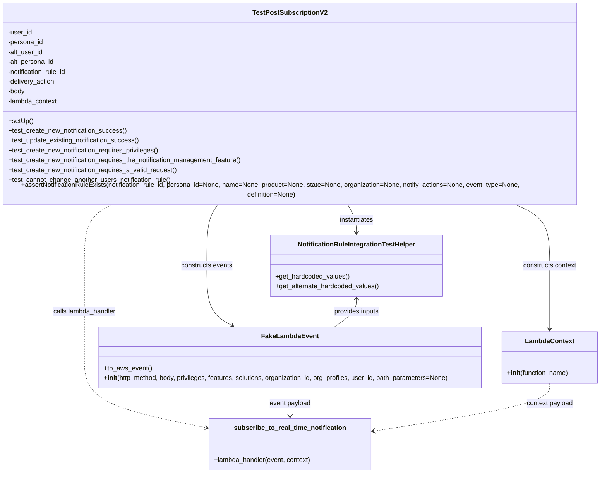

# Diagram: common/subscription_service/subscription_service_tests/integration/test_subscribe_to_real_time_notification.py

> Auto-generated by Obscura crawlers

## Mermaid

### SVG

<svg id="container" width="1506.74609375" xmlns="http://www.w3.org/2000/svg" class="classDiagram" height="1144" viewBox="0 0 1506.74609375 1144" role="graphics-document document" aria-roledescription="class"><g><defs><marker id="container_class-aggregationStart" class="marker aggregation class" refX="18" refY="7" markerWidth="190" markerHeight="240" orient="auto"><path d="M 18,7 L9,13 L1,7 L9,1 Z"></path></marker></defs><defs><marker id="container_class-aggregationEnd" class="marker aggregation class" refX="1" refY="7" markerWidth="20" markerHeight="28" orient="auto"><path d="M 18,7 L9,13 L1,7 L9,1 Z"></path></marker></defs><defs><marker id="container_class-extensionStart" class="marker extension class" refX="18" refY="7" markerWidth="190" markerHeight="240" orient="auto"><path d="M 1,7 L18,13 V 1 Z"></path></marker></defs><defs><marker id="container_class-extensionEnd" class="marker extension class" refX="1" refY="7" markerWidth="20" markerHeight="28" orient="auto"><path d="M 1,1 V 13 L18,7 Z"></path></marker></defs><defs><marker id="container_class-compositionStart" class="marker composition class" refX="18" refY="7" markerWidth="190" markerHeight="240" orient="auto"><path d="M 18,7 L9,13 L1,7 L9,1 Z"></path></marker></defs><defs><marker id="container_class-compositionEnd" class="marker composition class" refX="1" refY="7" markerWidth="20" markerHeight="28" orient="auto"><path d="M 18,7 L9,13 L1,7 L9,1 Z"></path></marker></defs><defs><marker id="container_class-dependencyStart" class="marker dependency class" refX="6" refY="7" markerWidth="190" markerHeight="240" orient="auto"><path d="M 5,7 L9,13 L1,7 L9,1 Z"></path></marker></defs><defs><marker id="container_class-dependencyEnd" class="marker dependency class" refX="13" refY="7" markerWidth="20" markerHeight="28" orient="auto"><path d="M 18,7 L9,13 L14,7 L9,1 Z"></path></marker></defs><defs><marker id="container_class-lollipopStart" class="marker lollipop class" refX="13" refY="7" markerWidth="190" markerHeight="240" orient="auto"><circle stroke="black" fill="transparent" cx="7" cy="7" r="6"></circle></marker></defs><defs><marker id="container_class-lollipopEnd" class="marker lollipop class" refX="1" refY="7" markerWidth="190" markerHeight="240" orient="auto"><circle stroke="black" fill="transparent" cx="7" cy="7" r="6"></circle></marker></defs><g class="root"><g class="clusters"></g><g class="edgePaths"><path d="M884.181,488L887.847,494.167C891.513,500.333,898.844,512.667,902.51,524C906.176,535.333,906.176,545.667,906.176,550.833L906.176,556" id="id_TestPostSubscriptionV2_NotificationRuleIntegrationTestHelper_1" class="edge-thickness-normal edge-pattern-solid relation" style=";;;" data-edge="true" data-et="edge" data-id="id_TestPostSubscriptionV2_NotificationRuleIntegrationTestHelper_1" data-points="W3sieCI6ODg0LjE4MTQ2NDM1MDE4MDUsInkiOjQ4OH0seyJ4Ijo5MDYuMTc1NzgxMjUsInkiOjUyNX0seyJ4Ijo5MDYuMTc1NzgxMjUsInkiOjU2Mn1d" marker-end="url(#container_class-dependencyEnd)"></path><path d="M563.805,488L559.239,494.167C554.673,500.333,545.541,512.667,540.974,537.5C536.408,562.333,536.408,599.667,536.408,637C536.408,674.333,536.408,711.667,546.824,736.021C557.239,760.375,578.07,771.75,588.485,777.437L598.901,783.124" id="id_TestPostSubscriptionV2_FakeLambdaEvent_2" class="edge-thickness-normal edge-pattern-solid relation" style=";;;" data-edge="true" data-et="edge" data-id="id_TestPostSubscriptionV2_FakeLambdaEvent_2" data-points="W3sieCI6NTYzLjgwNTIyMzM3NTQ1MTMsInkiOjQ4OH0seyJ4Ijo1MzYuNDA4MjAzMTI1LCJ5Ijo1MjV9LHsieCI6NTM2LjQwODIwMzEyNSwieSI6NjM3fSx7IngiOjUzNi40MDgyMDMxMjUsInkiOjc0OX0seyJ4Ijo2MDQuMTY2OTA0OTk0NDE5NiwieSI6Nzg2fV0=" marker-end="url(#container_class-dependencyEnd)"></path><path d="M1296.39,488L1310.648,494.167C1324.905,500.333,1353.419,512.667,1367.676,537.5C1381.934,562.333,1381.934,599.667,1381.934,637C1381.934,674.333,1381.934,711.667,1381.934,737.5C1381.934,763.333,1381.934,777.667,1381.934,784.833L1381.934,792" id="id_TestPostSubscriptionV2_LambdaContext_3" class="edge-thickness-normal edge-pattern-solid relation" style=";;;" data-edge="true" data-et="edge" data-id="id_TestPostSubscriptionV2_LambdaContext_3" data-points="W3sieCI6MTI5Ni4zOTAzOTkzNjgyMzEsInkiOjQ4OH0seyJ4IjoxMzgxLjkzMzU5Mzc1LCJ5Ijo1MjV9LHsieCI6MTM4MS45MzM1OTM3NSwieSI6NjM3fSx7IngiOjEzODEuOTMzNTkzNzUsInkiOjc0OX0seyJ4IjoxMzgxLjkzMzU5Mzc1LCJ5Ijo3OTh9XQ==" marker-end="url(#container_class-dependencyEnd)"></path><path d="M300.847,488L289.524,494.167C278.201,500.333,255.556,512.667,244.233,537.5C232.91,562.333,232.91,599.667,232.91,637C232.91,674.333,232.91,711.667,232.91,749C232.91,786.333,232.91,823.667,232.91,861C232.91,898.333,232.91,935.667,283.704,964.32C334.497,992.974,436.084,1012.947,486.878,1022.934L537.671,1032.921" id="id_TestPostSubscriptionV2_subscribe_to_real_time_notification_4" class="edge-thickness-normal edge-pattern-dashed relation" style=";;;" data-edge="true" data-et="edge" data-id="id_TestPostSubscriptionV2_subscribe_to_real_time_notification_4" data-points="W3sieCI6MzAwLjg0NjYyNjgwNTA1NDE0LCJ5Ijo0ODh9LHsieCI6MjMyLjkxMDE1NjI1LCJ5Ijo1MjV9LHsieCI6MjMyLjkxMDE1NjI1LCJ5Ijo2Mzd9LHsieCI6MjMyLjkxMDE1NjI1LCJ5Ijo3NDl9LHsieCI6MjMyLjkxMDE1NjI1LCJ5Ijo4NjF9LHsieCI6MjMyLjkxMDE1NjI1LCJ5Ijo5NzN9LHsieCI6NTQzLjU1ODU5Mzc1LCJ5IjoxMDM0LjA3ODQ2OTc3NDEyMn1d" marker-end="url(#container_class-dependencyEnd)"></path><path d="M906.176,718L906.176,723.167C906.176,728.333,906.176,738.667,897.11,750C888.044,761.333,869.911,773.667,860.845,779.833L851.779,786" id="id_NotificationRuleIntegrationTestHelper_FakeLambdaEvent_5" class="edge-thickness-normal edge-pattern-solid relation" style=";;;" data-edge="true" data-et="edge" data-id="id_NotificationRuleIntegrationTestHelper_FakeLambdaEvent_5" data-points="W3sieCI6OTA2LjE3NTc4MTI1LCJ5Ijo3MTJ9LHsieCI6OTA2LjE3NTc4MTI1LCJ5Ijo3NDl9LHsieCI6ODUxLjc3OTEyMjQ4ODgzOTMsInkiOjc4Nn1d" marker-start="url(#container_class-dependencyStart)"></path><path d="M741.516,936L741.516,942.167C741.516,948.333,741.516,960.667,741.516,972C741.516,983.333,741.516,993.667,741.516,998.833L741.516,1004" id="id_FakeLambdaEvent_subscribe_to_real_time_notification_6" class="edge-thickness-normal edge-pattern-dashed relation" style=";;;" data-edge="true" data-et="edge" data-id="id_FakeLambdaEvent_subscribe_to_real_time_notification_6" data-points="W3sieCI6NzQxLjUxNTYyNSwieSI6OTM2fSx7IngiOjc0MS41MTU2MjUsInkiOjk3M30seyJ4Ijo3NDEuNTE1NjI1LCJ5IjoxMDEwfV0=" marker-end="url(#container_class-dependencyEnd)"></path><path d="M1381.934,924L1381.934,932.167C1381.934,940.333,1381.934,956.667,1309.178,976.194C1236.423,995.721,1090.912,1018.442,1018.156,1029.803L945.401,1041.164" id="id_LambdaContext_subscribe_to_real_time_notification_7" class="edge-thickness-normal edge-pattern-dashed relation" style=";;;" data-edge="true" data-et="edge" data-id="id_LambdaContext_subscribe_to_real_time_notification_7" data-points="W3sieCI6MTM4MS45MzM1OTM3NSwieSI6OTI0fSx7IngiOjEzODEuOTMzNTkzNzUsInkiOjk3M30seyJ4Ijo5MzkuNDcyNjU2MjUsInkiOjEwNDIuMDg5NDAwODQyOTU1NX1d" marker-end="url(#container_class-dependencyEnd)"></path></g><g class="edgeLabels"><g class="edgeLabel" transform="translate(906.17578125, 525)"><g class="label" data-id="id_TestPostSubscriptionV2_NotificationRuleIntegrationTestHelper_1" transform="translate(-42.9140625, -12)"><foreignObject width="85.828125" height="24">

instantiates

</foreignObject></g></g><g class="edgeLabel" transform="translate(536.408203125, 637)"><g class="label" data-id="id_TestPostSubscriptionV2_FakeLambdaEvent_2" transform="translate(-63.8671875, -12)"><foreignObject width="127.734375" height="24">

constructs events

</foreignObject></g></g><g class="edgeLabel" transform="translate(1381.93359375, 637)"><g class="label" data-id="id_TestPostSubscriptionV2_LambdaContext_3" transform="translate(-66.8125, -12)"><foreignObject width="133.625" height="24">

constructs context

</foreignObject></g></g><g class="edgeLabel" transform="translate(232.91015625, 749)"><g class="label" data-id="id_TestPostSubscriptionV2_subscribe_to_real_time_notification_4" transform="translate(-78.390625, -12)"><foreignObject width="156.78125" height="24">

calls lambda_handler

</foreignObject></g></g><g class="edgeLabel" transform="translate(906.17578125, 749)"><g class="label" data-id="id_NotificationRuleIntegrationTestHelper_FakeLambdaEvent_5" transform="translate(-56.4140625, -12)"><foreignObject width="112.828125" height="24">

provides inputs

</foreignObject></g></g><g class="edgeLabel" transform="translate(741.515625, 973)"><g class="label" data-id="id_FakeLambdaEvent_subscribe_to_real_time_notification_6" transform="translate(-51.1640625, -12)"><foreignObject width="102.328125" height="24">

event payload

</foreignObject></g></g><g class="edgeLabel" transform="translate(1381.93359375, 973)"><g class="label" data-id="id_LambdaContext_subscribe_to_real_time_notification_7" transform="translate(-57.84375, -12)"><foreignObject width="115.6875" height="24">

context payload

</foreignObject></g></g></g><g class="nodes"><g class="node default" id="classId-TestPostSubscriptionV2-0" transform="translate(741.515625, 248)"><g class="basic label-container"><path d="M-733.515625 -240 L733.515625 -240 L733.515625 240 L-733.515625 240" stroke="none" stroke-width="0" fill="#ECECFF" style=""></path><path d="M-733.515625 -240 C-173.34836011251662 -240, 386.81890477496677 -240, 733.515625 -240 M-733.515625 -240 C-318.7075525105213 -240, 96.10051997895744 -240, 733.515625 -240 M733.515625 -240 C733.515625 -118.5971621994135, 733.515625 2.805675601172993, 733.515625 240 M733.515625 -240 C733.515625 -74.07202254572394, 733.515625 91.85595490855212, 733.515625 240 M733.515625 240 C339.54841052082514 240, -54.41880395834971 240, -733.515625 240 M733.515625 240 C199.16822479880386 240, -335.1791754023923 240, -733.515625 240 M-733.515625 240 C-733.515625 104.01710776400395, -733.515625 -31.965784471992094, -733.515625 -240 M-733.515625 240 C-733.515625 119.41171747796416, -733.515625 -1.1765650440716797, -733.515625 -240" stroke="#9370DB" stroke-width="1.3" fill="none" stroke-dasharray="0 0" style=""></path></g><g class="annotation-group text" transform="translate(0, -216)"></g><g class="label-group text" transform="translate(-86.625, -216)"><g class="label" style="font-weight: bolder" transform="translate(0,-12)"><foreignObject width="173.25" height="24">

TestPostSubscriptionV2

</foreignObject></g></g><g class="members-group text" transform="translate(-721.515625, -168)"><g class="label" style="" transform="translate(0,-12)"><foreignObject width="59.25" height="24">

-user_id

</foreignObject></g><g class="label" style="" transform="translate(0,12)"><foreignObject width="87.90625" height="24">

-persona_id

</foreignObject></g><g class="label" style="" transform="translate(0,36)"><foreignObject width="86.03125" height="24">

-alt_user_id

</foreignObject></g><g class="label" style="" transform="translate(0,60)"><foreignObject width="115" height="24">

-alt_persona_id

</foreignObject></g><g class="label" style="" transform="translate(0,84)"><foreignObject width="149.078125" height="24">

-notification_rule_id

</foreignObject></g><g class="label" style="" transform="translate(0,108)"><foreignObject width="117.40625" height="24">

-delivery_action

</foreignObject></g><g class="label" style="" transform="translate(0,132)"><foreignObject width="42.75" height="24">

-body

</foreignObject></g><g class="label" style="" transform="translate(0,156)"><foreignObject width="122.953125" height="24">

-lambda_context

</foreignObject></g></g><g class="methods-group text" transform="translate(-721.515625, 48)"><g class="label" style="" transform="translate(0,-12)"><foreignObject width="60.421875" height="24">

+setUp()

</foreignObject></g><g class="label" style="" transform="translate(0,12)"><foreignObject width="290.890625" height="24">

+test_create_new_notification_success()

</foreignObject></g><g class="label" style="" transform="translate(0,36)"><foreignObject width="324.171875" height="24">

+test_update_existing_notification_success()

</foreignObject></g><g class="label" style="" transform="translate(0,60)"><foreignObject width="373.796875" height="24">

+test_create_new_notification_requires_privileges()

</foreignObject></g><g class="label" style="" transform="translate(0,84)"><foreignObject width="581.59375" height="24">

+test_create_new_notification_requires_the_notification_management_feature()

</foreignObject></g><g class="label" style="" transform="translate(0,108)"><foreignObject width="418.375" height="24">

+test_create_new_notification_requires_a_valid_request()

</foreignObject></g><g class="label" style="" transform="translate(0,132)"><foreignObject width="403.0625" height="24">

+test_cannot_change_another_users_notification_rule()

</foreignObject></g><g class="label" style="" transform="translate(0,156)"><foreignObject width="1356.40625" height="24">

+assertNotificationRuleExists(notification_rule_id, persona_id=None, name=None, product=None, state=None, organization=None, notify_actions=None, event_type=None, definition=None)

</foreignObject></g></g><g class="divider" style=""><path d="M-733.515625 -192 C-266.36777369964886 -192, 200.78007760070227 -192, 733.515625 -192 M-733.515625 -192 C-423.72412954114475 -192, -113.9326340822895 -192, 733.515625 -192" stroke="#9370DB" stroke-width="1.3" fill="none" stroke-dasharray="0 0" style=""></path></g><g class="divider" style=""><path d="M-733.515625 24 C-429.05028827457016 24, -124.58495154914033 24, 733.515625 24 M-733.515625 24 C-282.0175820008319 24, 169.48046099833618 24, 733.515625 24" stroke="#9370DB" stroke-width="1.3" fill="none" stroke-dasharray="0 0" style=""></path></g></g><g class="node default" id="classId-NotificationRuleIntegrationTestHelper-1" transform="translate(906.17578125, 637)"><g class="basic label-container"><path d="M-209.28515625 -75 L209.28515625 -75 L209.28515625 75 L-209.28515625 75" stroke="none" stroke-width="0" fill="#ECECFF" style=""></path><path d="M-209.28515625 -75 C-64.72986841961537 -75, 79.82541941076926 -75, 209.28515625 -75 M-209.28515625 -75 C-99.9818344830101 -75, 9.321487283979792 -75, 209.28515625 -75 M209.28515625 -75 C209.28515625 -20.471350872401665, 209.28515625 34.05729825519667, 209.28515625 75 M209.28515625 -75 C209.28515625 -21.988196217498903, 209.28515625 31.023607565002195, 209.28515625 75 M209.28515625 75 C110.22274459843128 75, 11.160332946862553 75, -209.28515625 75 M209.28515625 75 C96.323131010689 75, -16.638894228622007 75, -209.28515625 75 M-209.28515625 75 C-209.28515625 26.798026713875394, -209.28515625 -21.40394657224921, -209.28515625 -75 M-209.28515625 75 C-209.28515625 31.62523555844613, -209.28515625 -11.749528883107743, -209.28515625 -75" stroke="#9370DB" stroke-width="1.3" fill="none" stroke-dasharray="0 0" style=""></path></g><g class="annotation-group text" transform="translate(0, -51)"></g><g class="label-group text" transform="translate(-139.5859375, -51)"><g class="label" style="font-weight: bolder" transform="translate(0,-12)"><foreignObject width="279.171875" height="24">

NotificationRuleIntegrationTestHelper

</foreignObject></g></g><g class="members-group text" transform="translate(-197.28515625, -3)"></g><g class="methods-group text" transform="translate(-197.28515625, 27)"><g class="label" style="" transform="translate(0,-12)"><foreignObject width="181.296875" height="24">

+get_hardcoded_values()

</foreignObject></g><g class="label" style="" transform="translate(0,12)"><foreignObject width="254.984375" height="24">

+get_alternate_hardcoded_values()

</foreignObject></g></g><g class="divider" style=""><path d="M-209.28515625 -27 C-83.21191375707923 -27, 42.86132873584154 -27, 209.28515625 -27 M-209.28515625 -27 C-87.17385485658531 -27, 34.937446536829384 -27, 209.28515625 -27" stroke="#9370DB" stroke-width="1.3" fill="none" stroke-dasharray="0 0" style=""></path></g><g class="divider" style=""><path d="M-209.28515625 -3 C-50.52344694980164 -3, 108.23826235039672 -3, 209.28515625 -3 M-209.28515625 -3 C-90.86499964115058 -3, 27.55515696769885 -3, 209.28515625 -3" stroke="#9370DB" stroke-width="1.3" fill="none" stroke-dasharray="0 0" style=""></path></g></g><g class="node default" id="classId-FakeLambdaEvent-2" transform="translate(741.515625, 861)"><g class="basic label-container"><path d="M-473.60546875 -75 L473.60546875 -75 L473.60546875 75 L-473.60546875 75" stroke="none" stroke-width="0" fill="#ECECFF" style=""></path><path d="M-473.60546875 -75 C-265.0261677195807 -75, -56.446866689161425 -75, 473.60546875 -75 M-473.60546875 -75 C-161.42243770537294 -75, 150.76059333925411 -75, 473.60546875 -75 M473.60546875 -75 C473.60546875 -44.47487954930578, 473.60546875 -13.949759098611558, 473.60546875 75 M473.60546875 -75 C473.60546875 -23.032848550833904, 473.60546875 28.93430289833219, 473.60546875 75 M473.60546875 75 C132.11814768612055 75, -209.3691733777589 75, -473.60546875 75 M473.60546875 75 C194.24611392206566 75, -85.11324090586868 75, -473.60546875 75 M-473.60546875 75 C-473.60546875 17.708070229031428, -473.60546875 -39.583859541937144, -473.60546875 -75 M-473.60546875 75 C-473.60546875 26.704674230297883, -473.60546875 -21.590651539404234, -473.60546875 -75" stroke="#9370DB" stroke-width="1.3" fill="none" stroke-dasharray="0 0" style=""></path></g><g class="annotation-group text" transform="translate(0, -51)"></g><g class="label-group text" transform="translate(-65.8671875, -51)"><g class="label" style="font-weight: bolder" transform="translate(0,-12)"><foreignObject width="131.734375" height="24">

FakeLambdaEvent

</foreignObject></g></g><g class="members-group text" transform="translate(-461.60546875, -3)"></g><g class="methods-group text" transform="translate(-461.60546875, 27)"><g class="label" style="" transform="translate(0,-12)"><foreignObject width="116.421875" height="24">

+to_aws_event()

</foreignObject></g><g class="label" style="" transform="translate(0,12)"><foreignObject width="857.34375" height="24">

+<strong>init</strong>(http_method, body, privileges, features, solutions, organization_id, org_profiles, user_id, path_parameters=None)

</foreignObject></g></g><g class="divider" style=""><path d="M-473.60546875 -27 C-257.9439543562613 -27, -42.28243996252263 -27, 473.60546875 -27 M-473.60546875 -27 C-194.0060473686449 -27, 85.59337401271023 -27, 473.60546875 -27" stroke="#9370DB" stroke-width="1.3" fill="none" stroke-dasharray="0 0" style=""></path></g><g class="divider" style=""><path d="M-473.60546875 -3 C-235.96041080779085 -3, 1.6846471344182987 -3, 473.60546875 -3 M-473.60546875 -3 C-159.1717604854481 -3, 155.26194777910382 -3, 473.60546875 -3" stroke="#9370DB" stroke-width="1.3" fill="none" stroke-dasharray="0 0" style=""></path></g></g><g class="node default" id="classId-LambdaContext-3" transform="translate(1381.93359375, 861)"><g class="basic label-container"><path d="M-116.8125 -63 L116.8125 -63 L116.8125 63 L-116.8125 63" stroke="none" stroke-width="0" fill="#ECECFF" style=""></path><path d="M-116.8125 -63 C-37.442646392236696 -63, 41.92720721552661 -63, 116.8125 -63 M-116.8125 -63 C-61.331589700042215 -63, -5.850679400084431 -63, 116.8125 -63 M116.8125 -63 C116.8125 -21.02040441110713, 116.8125 20.95919117778574, 116.8125 63 M116.8125 -63 C116.8125 -18.030106705153493, 116.8125 26.939786589693014, 116.8125 63 M116.8125 63 C62.349218479947204 63, 7.8859369598944085 63, -116.8125 63 M116.8125 63 C62.29777710853708 63, 7.783054217074167 63, -116.8125 63 M-116.8125 63 C-116.8125 21.797008255823997, -116.8125 -19.405983488352007, -116.8125 -63 M-116.8125 63 C-116.8125 20.474703262418736, -116.8125 -22.05059347516253, -116.8125 -63" stroke="#9370DB" stroke-width="1.3" fill="none" stroke-dasharray="0 0" style=""></path></g><g class="annotation-group text" transform="translate(0, -39)"></g><g class="label-group text" transform="translate(-57.296875, -39)"><g class="label" style="font-weight: bolder" transform="translate(0,-12)"><foreignObject width="114.59375" height="24">

LambdaContext

</foreignObject></g></g><g class="members-group text" transform="translate(-104.8125, 9)"></g><g class="methods-group text" transform="translate(-104.8125, 39)"><g class="label" style="" transform="translate(0,-12)"><foreignObject width="152.328125" height="24">

+<strong>init</strong>(function_name)

</foreignObject></g></g><g class="divider" style=""><path d="M-116.8125 -15 C-64.58130944940932 -15, -12.350118898818636 -15, 116.8125 -15 M-116.8125 -15 C-33.40994243044352 -15, 49.99261513911296 -15, 116.8125 -15" stroke="#9370DB" stroke-width="1.3" fill="none" stroke-dasharray="0 0" style=""></path></g><g class="divider" style=""><path d="M-116.8125 9 C-56.18813880424658 9, 4.4362223915068455 9, 116.8125 9 M-116.8125 9 C-64.79110712617168 9, -12.769714252343377 9, 116.8125 9" stroke="#9370DB" stroke-width="1.3" fill="none" stroke-dasharray="0 0" style=""></path></g></g><g class="node default" id="classId-subscribe_to_real_time_notification-4" transform="translate(741.515625, 1073)"><g class="basic label-container"><path d="M-197.95703125 -63 L197.95703125 -63 L197.95703125 63 L-197.95703125 63" stroke="none" stroke-width="0" fill="#ECECFF" style=""></path><path d="M-197.95703125 -63 C-66.67516587068889 -63, 64.60669950862223 -63, 197.95703125 -63 M-197.95703125 -63 C-99.05746257334505 -63, -0.1578938966900978 -63, 197.95703125 -63 M197.95703125 -63 C197.95703125 -28.26093713394124, 197.95703125 6.478125732117519, 197.95703125 63 M197.95703125 -63 C197.95703125 -13.655456297779494, 197.95703125 35.68908740444101, 197.95703125 63 M197.95703125 63 C105.80002514166551 63, 13.64301903333103 63, -197.95703125 63 M197.95703125 63 C98.45127141598242 63, -1.054488418035163 63, -197.95703125 63 M-197.95703125 63 C-197.95703125 30.9933267510795, -197.95703125 -1.013346497840999, -197.95703125 -63 M-197.95703125 63 C-197.95703125 36.630143123506016, -197.95703125 10.260286247012033, -197.95703125 -63" stroke="#9370DB" stroke-width="1.3" fill="none" stroke-dasharray="0 0" style=""></path></g><g class="annotation-group text" transform="translate(0, -39)"></g><g class="label-group text" transform="translate(-131.7265625, -39)"><g class="label" style="font-weight: bolder" transform="translate(0,-12)"><foreignObject width="263.453125" height="24">

subscribe_to_real_time_notification

</foreignObject></g></g><g class="members-group text" transform="translate(-185.95703125, 9)"></g><g class="methods-group text" transform="translate(-185.95703125, 39)"><g class="label" style="" transform="translate(0,-12)"><foreignObject width="240.1875" height="24">

+lambda_handler(event, context)

</foreignObject></g></g><g class="divider" style=""><path d="M-197.95703125 -15 C-74.16806059443819 -15, 49.620910061123624 -15, 197.95703125 -15 M-197.95703125 -15 C-56.22826691198301 -15, 85.50049742603397 -15, 197.95703125 -15" stroke="#9370DB" stroke-width="1.3" fill="none" stroke-dasharray="0 0" style=""></path></g><g class="divider" style=""><path d="M-197.95703125 9 C-77.91459683999821 9, 42.12783757000358 9, 197.95703125 9 M-197.95703125 9 C-48.15150805598387 9, 101.65401513803226 9, 197.95703125 9" stroke="#9370DB" stroke-width="1.3" fill="none" stroke-dasharray="0 0" style=""></path></g></g></g></g></g></svg>
