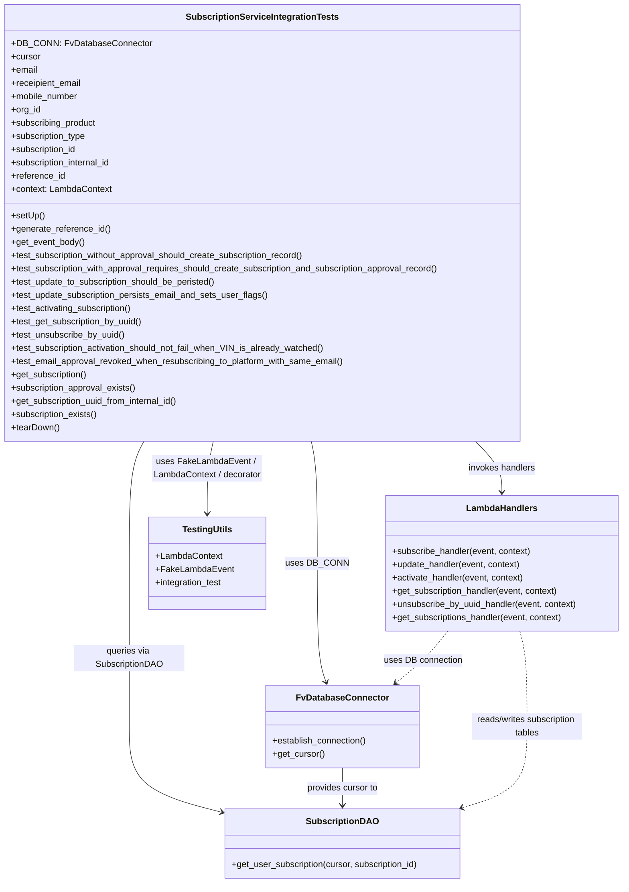

# Diagram: common/subscription_service/subscription_service_tests/integration/test_subscription_service.py

> Auto-generated by Obscura crawlers

## Mermaid

### SVG

<svg id="container" width="1132.27734375" xmlns="http://www.w3.org/2000/svg" class="classDiagram" height="1624" viewBox="0 0 1132.27734375 1624" role="graphics-document document" aria-roledescription="class"><g><defs><marker id="container_class-aggregationStart" class="marker aggregation class" refX="18" refY="7" markerWidth="190" markerHeight="240" orient="auto"><path d="M 18,7 L9,13 L1,7 L9,1 Z"></path></marker></defs><defs><marker id="container_class-aggregationEnd" class="marker aggregation class" refX="1" refY="7" markerWidth="20" markerHeight="28" orient="auto"><path d="M 18,7 L9,13 L1,7 L9,1 Z"></path></marker></defs><defs><marker id="container_class-extensionStart" class="marker extension class" refX="18" refY="7" markerWidth="190" markerHeight="240" orient="auto"><path d="M 1,7 L18,13 V 1 Z"></path></marker></defs><defs><marker id="container_class-extensionEnd" class="marker extension class" refX="1" refY="7" markerWidth="20" markerHeight="28" orient="auto"><path d="M 1,1 V 13 L18,7 Z"></path></marker></defs><defs><marker id="container_class-compositionStart" class="marker composition class" refX="18" refY="7" markerWidth="190" markerHeight="240" orient="auto"><path d="M 18,7 L9,13 L1,7 L9,1 Z"></path></marker></defs><defs><marker id="container_class-compositionEnd" class="marker composition class" refX="1" refY="7" markerWidth="20" markerHeight="28" orient="auto"><path d="M 18,7 L9,13 L1,7 L9,1 Z"></path></marker></defs><defs><marker id="container_class-dependencyStart" class="marker dependency class" refX="6" refY="7" markerWidth="190" markerHeight="240" orient="auto"><path d="M 5,7 L9,13 L1,7 L9,1 Z"></path></marker></defs><defs><marker id="container_class-dependencyEnd" class="marker dependency class" refX="13" refY="7" markerWidth="20" markerHeight="28" orient="auto"><path d="M 18,7 L9,13 L14,7 L9,1 Z"></path></marker></defs><defs><marker id="container_class-lollipopStart" class="marker lollipop class" refX="13" refY="7" markerWidth="190" markerHeight="240" orient="auto"><circle stroke="black" fill="transparent" cx="7" cy="7" r="6"></circle></marker></defs><defs><marker id="container_class-lollipopEnd" class="marker lollipop class" refX="1" refY="7" markerWidth="190" markerHeight="240" orient="auto"><circle stroke="black" fill="transparent" cx="7" cy="7" r="6"></circle></marker></defs><g class="root"><g class="clusters"></g><g class="edgePaths"><path d="M565.844,800L567.967,810.167C570.091,820.333,574.337,840.667,576.461,881.5C578.584,922.333,578.584,983.667,578.584,1043C578.584,1102.333,578.584,1159.667,581.241,1195.561C583.897,1231.456,589.21,1245.912,591.867,1253.14L594.523,1260.368" id="id_SubscriptionServiceIntegrationTests_FvDatabaseConnector_1" class="edge-thickness-normal edge-pattern-solid relation" style=";;;" data-edge="true" data-et="edge" data-id="id_SubscriptionServiceIntegrationTests_FvDatabaseConnector_1" data-points="W3sieCI6NTY1Ljg0Mzc1ODU0NzU5MywieSI6ODAwfSx7IngiOjU3OC41ODM5ODQzNzUsInkiOjg2MX0seyJ4Ijo1NzguNTgzOTg0Mzc1LCJ5IjoxMDQ1fSx7IngiOjU3OC41ODM5ODQzNzUsInkiOjEyMTd9LHsieCI6NTk2LjU5MzE1MTQ2MTY5MzUsInkiOjEyNjZ9XQ==" marker-end="url(#container_class-dependencyEnd)"></path><path d="M281.022,800L275.833,810.167C270.645,820.333,260.267,840.667,255.078,881.5C249.889,922.333,249.889,983.667,249.889,1043C249.889,1102.333,249.889,1159.667,249.889,1209C249.889,1258.333,249.889,1299.667,249.889,1339C249.889,1378.333,249.889,1415.667,275.503,1441.177C301.117,1466.687,352.345,1480.375,377.959,1487.219L403.572,1494.062" id="id_SubscriptionServiceIntegrationTests_SubscriptionDAO_2" class="edge-thickness-normal edge-pattern-solid relation" style=";;;" data-edge="true" data-et="edge" data-id="id_SubscriptionServiceIntegrationTests_SubscriptionDAO_2" data-points="W3sieCI6MjgxLjAyMjQzNzQzMTYxOTI3LCJ5Ijo4MDB9LHsieCI6MjQ5Ljg4ODY3MTg3NSwieSI6ODYxfSx7IngiOjI0OS44ODg2NzE4NzUsInkiOjEwNDV9LHsieCI6MjQ5Ljg4ODY3MTg3NSwieSI6MTIxN30seyJ4IjoyNDkuODg4NjcxODc1LCJ5IjoxMzQxfSx7IngiOjI0OS44ODg2NzE4NzUsInkiOjE0NTN9LHsieCI6NDA5LjM2OTE0MDYyNSwieSI6MTQ5NS42MTExMjc5MjYyNzN9XQ==" marker-end="url(#container_class-dependencyEnd)"></path><path d="M854.17,800L863.696,810.167C873.221,820.333,892.273,840.667,901.799,860C911.324,879.333,911.324,897.667,911.324,906.833L911.324,916" id="id_SubscriptionServiceIntegrationTests_LambdaHandlers_3" class="edge-thickness-normal edge-pattern-solid relation" style=";;;" data-edge="true" data-et="edge" data-id="id_SubscriptionServiceIntegrationTests_LambdaHandlers_3" data-points="W3sieCI6ODU0LjE3MDA4ODU1MzA2MzUsInkiOjgwMH0seyJ4Ijo5MTEuMzI0MjE4NzUsInkiOjg2MX0seyJ4Ijo5MTEuMzI0MjE4NzUsInkiOjkyMn1d" marker-end="url(#container_class-dependencyEnd)"></path><path d="M400.43,800L398.306,810.167C396.183,820.333,391.936,840.667,389.813,866.5C387.689,892.333,387.689,923.667,387.689,939.333L387.689,955" id="id_SubscriptionServiceIntegrationTests_TestingUtils_4" class="edge-thickness-normal edge-pattern-solid relation" style=";;;" data-edge="true" data-et="edge" data-id="id_SubscriptionServiceIntegrationTests_TestingUtils_4" data-points="W3sieCI6NDAwLjQyOTY3ODk1MjQwNywieSI6ODAwfSx7IngiOjM4Ny42ODk0NTMxMjUsInkiOjg2MX0seyJ4IjozODcuNjg5NDUzMTI1LCJ5Ijo5NjF9XQ==" marker-end="url(#container_class-dependencyEnd)"></path><path d="M624.158,1416L624.158,1422.167C624.158,1428.333,624.158,1440.667,624.158,1452C624.158,1463.333,624.158,1473.667,624.158,1478.833L624.158,1484" id="id_FvDatabaseConnector_SubscriptionDAO_5" class="edge-thickness-normal edge-pattern-solid relation" style=";;;" data-edge="true" data-et="edge" data-id="id_FvDatabaseConnector_SubscriptionDAO_5" data-points="W3sieCI6NjI0LjE1ODIwMzEyNSwieSI6MTQxNn0seyJ4Ijo2MjQuMTU4MjAzMTI1LCJ5IjoxNDUzfSx7IngiOjYyNC4xNTgyMDMxMjUsInkiOjE0OTB9XQ==" marker-end="url(#container_class-dependencyEnd)"></path><path d="M943.915,1168L946.079,1176.167C948.243,1184.333,952.571,1200.667,954.735,1229.5C956.898,1258.333,956.898,1299.667,956.898,1339C956.898,1378.333,956.898,1415.667,937.337,1440.212C917.776,1464.758,878.653,1476.515,859.092,1482.394L839.531,1488.273" id="id_LambdaHandlers_SubscriptionDAO_6" class="edge-thickness-normal edge-pattern-dashed relation" style=";;;" data-edge="true" data-et="edge" data-id="id_LambdaHandlers_SubscriptionDAO_6" data-points="W3sieCI6OTQzLjkxNTA4NDQ4NDAxMTcsInkiOjExNjh9LHsieCI6OTU2Ljg5ODQzNzUsInkiOjEyMTd9LHsieCI6OTU2Ljg5ODQzNzUsInkiOjEzNDF9LHsieCI6OTU2Ljg5ODQzNzUsInkiOjE0NTN9LHsieCI6ODMzLjc4NDU1MDc4MTI1LCJ5IjoxNDkwfV0=" marker-end="url(#container_class-dependencyEnd)"></path><path d="M813.609,1168L807.121,1176.167C800.633,1184.333,787.657,1200.667,772.028,1216.364C756.398,1232.062,738.115,1247.123,728.973,1254.654L719.832,1262.185" id="id_LambdaHandlers_FvDatabaseConnector_7" class="edge-thickness-normal edge-pattern-dashed relation" style=";;;" data-edge="true" data-et="edge" data-id="id_LambdaHandlers_FvDatabaseConnector_7" data-points="W3sieCI6ODEzLjYwODg4NjcxODc1LCJ5IjoxMTY4fSx7IngiOjc3NC42ODE2NDA2MjUsInkiOjEyMTd9LHsieCI6NzE1LjIwMDYwNDgzODcwOTYsInkiOjEyNjZ9XQ==" marker-end="url(#container_class-dependencyEnd)"></path></g><g class="edgeLabels"><g class="edgeLabel" transform="translate(578.583984375, 1045)"><g class="label" data-id="id_SubscriptionServiceIntegrationTests_FvDatabaseConnector_1" transform="translate(-53.09375, -12)"><foreignObject width="106.1875" height="24">

uses DB_CONN

</foreignObject></g></g><g class="edgeLabel" transform="translate(249.888671875, 1217)"><g class="label" data-id="id_SubscriptionServiceIntegrationTests_SubscriptionDAO_2" transform="translate(-100, -24)"><foreignObject width="200" height="48">

queries via SubscriptionDAO

</foreignObject></g></g><g class="edgeLabel" transform="translate(911.32421875, 861)"><g class="label" data-id="id_SubscriptionServiceIntegrationTests_LambdaHandlers_3" transform="translate(-61.5859375, -12)"><foreignObject width="123.171875" height="24">

invokes handlers

</foreignObject></g></g><g class="edgeLabel" transform="translate(387.689453125, 861)"><g class="label" data-id="id_SubscriptionServiceIntegrationTests_TestingUtils_4" transform="translate(-100, -36)"><foreignObject width="200" height="72">

uses FakeLambdaEvent / LambdaContext / decorator

</foreignObject></g></g><g class="edgeLabel" transform="translate(624.158203125, 1453)"><g class="label" data-id="id_FvDatabaseConnector_SubscriptionDAO_5" transform="translate(-65.859375, -12)"><foreignObject width="131.71875" height="24">

provides cursor to

</foreignObject></g></g><g class="edgeLabel" transform="translate(956.8984375, 1341)"><g class="label" data-id="id_LambdaHandlers_SubscriptionDAO_6" transform="translate(-100, -24)"><foreignObject width="200" height="48">

reads/writes subscription tables

</foreignObject></g></g><g class="edgeLabel" transform="translate(769.09194, 1221.60475)"><g class="label" data-id="id_LambdaHandlers_FvDatabaseConnector_7" transform="translate(-71.1484375, -12)"><foreignObject width="142.296875" height="24">

uses DB connection

</foreignObject></g></g></g><g class="nodes"><g class="node default" id="classId-SubscriptionServiceIntegrationTests-0" transform="translate(483.13671875, 404)"><g class="basic label-container"><path d="M-475.13671875 -396 L475.13671875 -396 L475.13671875 396 L-475.13671875 396" stroke="none" stroke-width="0" fill="#ECECFF" style=""></path><path d="M-475.13671875 -396 C-211.74077479367503 -396, 51.65516916264994 -396, 475.13671875 -396 M-475.13671875 -396 C-251.63801386474015 -396, -28.13930897948029 -396, 475.13671875 -396 M475.13671875 -396 C475.13671875 -155.0446693227302, 475.13671875 85.91066135453963, 475.13671875 396 M475.13671875 -396 C475.13671875 -108.18468637566406, 475.13671875 179.63062724867189, 475.13671875 396 M475.13671875 396 C142.43451684443477 396, -190.26768506113046 396, -475.13671875 396 M475.13671875 396 C254.93745416991396 396, 34.738189589827925 396, -475.13671875 396 M-475.13671875 396 C-475.13671875 95.1505272976217, -475.13671875 -205.6989454047566, -475.13671875 -396 M-475.13671875 396 C-475.13671875 120.06865794268003, -475.13671875 -155.86268411463993, -475.13671875 -396" stroke="#9370DB" stroke-width="1.3" fill="none" stroke-dasharray="0 0" style=""></path></g><g class="annotation-group text" transform="translate(0, -372)"></g><g class="label-group text" transform="translate(-132.9296875, -372)"><g class="label" style="font-weight: bolder" transform="translate(0,-12)"><foreignObject width="265.859375" height="24">

SubscriptionServiceIntegrationTests

</foreignObject></g></g><g class="members-group text" transform="translate(-463.13671875, -324)"><g class="label" style="" transform="translate(0,-12)"><foreignObject width="241.65625" height="24">

+DB_CONN: FvDatabaseConnector

</foreignObject></g><g class="label" style="" transform="translate(0,12)"><foreignObject width="53.71875" height="24">

+cursor

</foreignObject></g><g class="label" style="" transform="translate(0,36)"><foreignObject width="48.328125" height="24">

+email

</foreignObject></g><g class="label" style="" transform="translate(0,60)"><foreignObject width="129.1875" height="24">

+receipient_email

</foreignObject></g><g class="label" style="" transform="translate(0,84)"><foreignObject width="123.1875" height="24">

+mobile_number

</foreignObject></g><g class="label" style="" transform="translate(0,108)"><foreignObject width="54.0625" height="24">

+org_id

</foreignObject></g><g class="label" style="" transform="translate(0,132)"><foreignObject width="157.03125" height="24">

+subscribing_product

</foreignObject></g><g class="label" style="" transform="translate(0,156)"><foreignObject width="138.390625" height="24">

+subscription_type

</foreignObject></g><g class="label" style="" transform="translate(0,180)"><foreignObject width="121" height="24">

+subscription_id

</foreignObject></g><g class="label" style="" transform="translate(0,204)"><foreignObject width="186.25" height="24">

+subscription_internal_id

</foreignObject></g><g class="label" style="" transform="translate(0,228)"><foreignObject width="98.25" height="24">

+reference_id

</foreignObject></g><g class="label" style="" transform="translate(0,252)"><foreignObject width="182.84375" height="24">

+context: LambdaContext

</foreignObject></g></g><g class="methods-group text" transform="translate(-463.13671875, -12)"><g class="label" style="" transform="translate(0,-12)"><foreignObject width="60.421875" height="24">

+setUp()

</foreignObject></g><g class="label" style="" transform="translate(0,12)"><foreignObject width="180.078125" height="24">

+generate_reference_id()

</foreignObject></g><g class="label" style="" transform="translate(0,36)"><foreignObject width="133.859375" height="24">

+get_event_body()

</foreignObject></g><g class="label" style="" transform="translate(0,60)"><foreignObject width="543.953125" height="24">

+test_subscription_without_approval_should_create_subscription_record()

</foreignObject></g><g class="label" style="" transform="translate(0,84)"><foreignObject width="793.34375" height="24">

+test_subscription_with_approval_requires_should_create_subscription_and_subscription_approval_record()

</foreignObject></g><g class="label" style="" transform="translate(0,108)"><foreignObject width="379.046875" height="24">

+test_update_to_subscription_should_be_peristed()

</foreignObject></g><g class="label" style="" transform="translate(0,132)"><foreignObject width="470.046875" height="24">

+test_update_subscription_persists_email_and_sets_user_flags()

</foreignObject></g><g class="label" style="" transform="translate(0,156)"><foreignObject width="223.71875" height="24">

+test_activating_subscription()

</foreignObject></g><g class="label" style="" transform="translate(0,180)"><foreignObject width="241.59375" height="24">

+test_get_subscription_by_uuid()

</foreignObject></g><g class="label" style="" transform="translate(0,204)"><foreignObject width="208.328125" height="24">

+test_unsubscribe_by_uuid()

</foreignObject></g><g class="label" style="" transform="translate(0,228)"><foreignObject width="575.390625" height="24">

+test_subscription_activation_should_not_fail_when_VIN_is_already_watched()

</foreignObject></g><g class="label" style="" transform="translate(0,252)"><foreignObject width="613.1875" height="24">

+test_email_approval_revoked_when_resubscribing_to_platform_with_same_email()

</foreignObject></g><g class="label" style="" transform="translate(0,276)"><foreignObject width="139.84375" height="24">

+get_subscription()

</foreignObject></g><g class="label" style="" transform="translate(0,300)"><foreignObject width="230.078125" height="24">

+subscription_approval_exists()

</foreignObject></g><g class="label" style="" transform="translate(0,324)"><foreignObject width="310.3125" height="24">

+get_subscription_uuid_from_internal_id()

</foreignObject></g><g class="label" style="" transform="translate(0,348)"><foreignObject width="158.53125" height="24">

+subscription_exists()

</foreignObject></g><g class="label" style="" transform="translate(0,372)"><foreignObject width="87.75" height="24">

+tearDown()

</foreignObject></g></g><g class="divider" style=""><path d="M-475.13671875 -348 C-176.01361664335553 -348, 123.10948546328893 -348, 475.13671875 -348 M-475.13671875 -348 C-246.328230420009 -348, -17.519742090017985 -348, 475.13671875 -348" stroke="#9370DB" stroke-width="1.3" fill="none" stroke-dasharray="0 0" style=""></path></g><g class="divider" style=""><path d="M-475.13671875 -36 C-97.48551976581501 -36, 280.16567921837 -36, 475.13671875 -36 M-475.13671875 -36 C-153.84977004708776 -36, 167.43717865582448 -36, 475.13671875 -36" stroke="#9370DB" stroke-width="1.3" fill="none" stroke-dasharray="0 0" style=""></path></g></g><g class="node default" id="classId-FvDatabaseConnector-1" transform="translate(624.158203125, 1341)"><g class="basic label-container"><path d="M-138.28515625 -75 L138.28515625 -75 L138.28515625 75 L-138.28515625 75" stroke="none" stroke-width="0" fill="#ECECFF" style=""></path><path d="M-138.28515625 -75 C-43.0666024077578 -75, 52.1519514344844 -75, 138.28515625 -75 M-138.28515625 -75 C-54.53496832585225 -75, 29.215219598295505 -75, 138.28515625 -75 M138.28515625 -75 C138.28515625 -41.40574124224913, 138.28515625 -7.811482484498256, 138.28515625 75 M138.28515625 -75 C138.28515625 -30.511404081910115, 138.28515625 13.97719183617977, 138.28515625 75 M138.28515625 75 C64.83853625158798 75, -8.608083746824036 75, -138.28515625 75 M138.28515625 75 C74.36869599441246 75, 10.45223573882491 75, -138.28515625 75 M-138.28515625 75 C-138.28515625 21.378008258393194, -138.28515625 -32.24398348321361, -138.28515625 -75 M-138.28515625 75 C-138.28515625 44.74541158244439, -138.28515625 14.490823164888774, -138.28515625 -75" stroke="#9370DB" stroke-width="1.3" fill="none" stroke-dasharray="0 0" style=""></path></g><g class="annotation-group text" transform="translate(0, -51)"></g><g class="label-group text" transform="translate(-79.3046875, -51)"><g class="label" style="font-weight: bolder" transform="translate(0,-12)"><foreignObject width="158.609375" height="24">

FvDatabaseConnector

</foreignObject></g></g><g class="members-group text" transform="translate(-126.28515625, -3)"></g><g class="methods-group text" transform="translate(-126.28515625, 27)"><g class="label" style="" transform="translate(0,-12)"><foreignObject width="173.265625" height="24">

+establish_connection()

</foreignObject></g><g class="label" style="" transform="translate(0,12)"><foreignObject width="94.640625" height="24">

+get_cursor()

</foreignObject></g></g><g class="divider" style=""><path d="M-138.28515625 -27 C-67.42617959020951 -27, 3.432797069580971 -27, 138.28515625 -27 M-138.28515625 -27 C-42.51451573698226 -27, 53.25612477603548 -27, 138.28515625 -27" stroke="#9370DB" stroke-width="1.3" fill="none" stroke-dasharray="0 0" style=""></path></g><g class="divider" style=""><path d="M-138.28515625 -3 C-56.84598596496026 -3, 24.593184320079473 -3, 138.28515625 -3 M-138.28515625 -3 C-59.118867123167945 -3, 20.04742200366411 -3, 138.28515625 -3" stroke="#9370DB" stroke-width="1.3" fill="none" stroke-dasharray="0 0" style=""></path></g></g><g class="node default" id="classId-SubscriptionDAO-2" transform="translate(624.158203125, 1553)"><g class="basic label-container"><path d="M-214.7890625 -63 L214.7890625 -63 L214.7890625 63 L-214.7890625 63" stroke="none" stroke-width="0" fill="#ECECFF" style=""></path><path d="M-214.7890625 -63 C-60.94663557712548 -63, 92.89579134574905 -63, 214.7890625 -63 M-214.7890625 -63 C-99.11062073178168 -63, 16.56782103643664 -63, 214.7890625 -63 M214.7890625 -63 C214.7890625 -27.98355514700203, 214.7890625 7.032889705995942, 214.7890625 63 M214.7890625 -63 C214.7890625 -36.400778263672635, 214.7890625 -9.80155652734527, 214.7890625 63 M214.7890625 63 C66.6609633136942 63, -81.4671358726116 63, -214.7890625 63 M214.7890625 63 C91.70057022536696 63, -31.38792204926608 63, -214.7890625 63 M-214.7890625 63 C-214.7890625 15.615357979205982, -214.7890625 -31.769284041588037, -214.7890625 -63 M-214.7890625 63 C-214.7890625 37.63093705173452, -214.7890625 12.261874103469047, -214.7890625 -63" stroke="#9370DB" stroke-width="1.3" fill="none" stroke-dasharray="0 0" style=""></path></g><g class="annotation-group text" transform="translate(0, -39)"></g><g class="label-group text" transform="translate(-61.796875, -39)"><g class="label" style="font-weight: bolder" transform="translate(0,-12)"><foreignObject width="123.59375" height="24">

SubscriptionDAO

</foreignObject></g></g><g class="members-group text" transform="translate(-202.7890625, 9)"></g><g class="methods-group text" transform="translate(-202.7890625, 39)"><g class="label" style="" transform="translate(0,-12)"><foreignObject width="343.78125" height="24">

+get_user_subscription(cursor, subscription_id)

</foreignObject></g></g><g class="divider" style=""><path d="M-214.7890625 -15 C-95.34914366695139 -15, 24.090775166097217 -15, 214.7890625 -15 M-214.7890625 -15 C-102.8499648369155 -15, 9.089132826168992 -15, 214.7890625 -15" stroke="#9370DB" stroke-width="1.3" fill="none" stroke-dasharray="0 0" style=""></path></g><g class="divider" style=""><path d="M-214.7890625 9 C-102.45023272258638 9, 9.888597054827244 9, 214.7890625 9 M-214.7890625 9 C-113.17038714487535 9, -11.551711789750698 9, 214.7890625 9" stroke="#9370DB" stroke-width="1.3" fill="none" stroke-dasharray="0 0" style=""></path></g></g><g class="node default" id="classId-LambdaHandlers-3" transform="translate(911.32421875, 1045)"><g class="basic label-container"><path d="M-212.953125 -123 L212.953125 -123 L212.953125 123 L-212.953125 123" stroke="none" stroke-width="0" fill="#ECECFF" style=""></path><path d="M-212.953125 -123 C-103.78792199678058 -123, 5.377281006438835 -123, 212.953125 -123 M-212.953125 -123 C-48.01897279674296 -123, 116.91517940651408 -123, 212.953125 -123 M212.953125 -123 C212.953125 -72.25362751372441, 212.953125 -21.50725502744882, 212.953125 123 M212.953125 -123 C212.953125 -67.25918547434819, 212.953125 -11.518370948696372, 212.953125 123 M212.953125 123 C70.35204404379243 123, -72.24903691241514 123, -212.953125 123 M212.953125 123 C77.24553372250253 123, -58.46205755499494 123, -212.953125 123 M-212.953125 123 C-212.953125 59.891628250609664, -212.953125 -3.216743498780673, -212.953125 -123 M-212.953125 123 C-212.953125 69.86393903143089, -212.953125 16.727878062861777, -212.953125 -123" stroke="#9370DB" stroke-width="1.3" fill="none" stroke-dasharray="0 0" style=""></path></g><g class="annotation-group text" transform="translate(0, -99)"></g><g class="label-group text" transform="translate(-61.984375, -99)"><g class="label" style="font-weight: bolder" transform="translate(0,-12)"><foreignObject width="123.96875" height="24">

LambdaHandlers

</foreignObject></g></g><g class="members-group text" transform="translate(-200.953125, -51)"></g><g class="methods-group text" transform="translate(-200.953125, -21)"><g class="label" style="" transform="translate(0,-12)"><foreignObject width="255.390625" height="24">

+subscribe_handler(event, context)

</foreignObject></g><g class="label" style="" transform="translate(0,12)"><foreignObject width="236.40625" height="24">

+update_handler(event, context)

</foreignObject></g><g class="label" style="" transform="translate(0,36)"><foreignObject width="242.046875" height="24">

+activate_handler(event, context)

</foreignObject></g><g class="label" style="" transform="translate(0,60)"><foreignObject width="306.875" height="24">

+get_subscription_handler(event, context)

</foreignObject></g><g class="label" style="" transform="translate(0,84)"><foreignObject width="339.921875" height="24">

+unsubscribe_by_uuid_handler(event, context)

</foreignObject></g><g class="label" style="" transform="translate(0,108)"><foreignObject width="314.03125" height="24">

+get_subscriptions_handler(event, context)

</foreignObject></g></g><g class="divider" style=""><path d="M-212.953125 -75 C-52.08759757795474 -75, 108.77792984409052 -75, 212.953125 -75 M-212.953125 -75 C-57.819754814443655 -75, 97.31361537111269 -75, 212.953125 -75" stroke="#9370DB" stroke-width="1.3" fill="none" stroke-dasharray="0 0" style=""></path></g><g class="divider" style=""><path d="M-212.953125 -51 C-58.813381270796725 -51, 95.32636245840655 -51, 212.953125 -51 M-212.953125 -51 C-81.45992402849507 -51, 50.03327694300987 -51, 212.953125 -51" stroke="#9370DB" stroke-width="1.3" fill="none" stroke-dasharray="0 0" style=""></path></g></g><g class="node default" id="classId-TestingUtils-4" transform="translate(387.689453125, 1045)"><g class="basic label-container"><path d="M-102.80078125 -84 L102.80078125 -84 L102.80078125 84 L-102.80078125 84" stroke="none" stroke-width="0" fill="#ECECFF" style=""></path><path d="M-102.80078125 -84 C-58.679866228003775 -84, -14.55895120600755 -84, 102.80078125 -84 M-102.80078125 -84 C-37.15298896194619 -84, 28.494803326107615 -84, 102.80078125 -84 M102.80078125 -84 C102.80078125 -35.279640755380996, 102.80078125 13.440718489238009, 102.80078125 84 M102.80078125 -84 C102.80078125 -47.97667504006909, 102.80078125 -11.95335008013818, 102.80078125 84 M102.80078125 84 C34.780021645217545 84, -33.24073795956491 84, -102.80078125 84 M102.80078125 84 C58.254422621347665 84, 13.70806399269533 84, -102.80078125 84 M-102.80078125 84 C-102.80078125 34.96233443391866, -102.80078125 -14.075331132162674, -102.80078125 -84 M-102.80078125 84 C-102.80078125 39.99516482930792, -102.80078125 -4.009670341384165, -102.80078125 -84" stroke="#9370DB" stroke-width="1.3" fill="none" stroke-dasharray="0 0" style=""></path></g><g class="annotation-group text" transform="translate(0, -60)"></g><g class="label-group text" transform="translate(-43.3203125, -60)"><g class="label" style="font-weight: bolder" transform="translate(0,-12)"><foreignObject width="86.640625" height="24">

TestingUtils

</foreignObject></g></g><g class="members-group text" transform="translate(-90.80078125, -12)"><g class="label" style="" transform="translate(0,-12)"><foreignObject width="121" height="24">

+LambdaContext

</foreignObject></g><g class="label" style="" transform="translate(0,12)"><foreignObject width="138.28125" height="24">

+FakeLambdaEvent

</foreignObject></g><g class="label" style="" transform="translate(0,36)"><foreignObject width="123.28125" height="24">

+integration_test

</foreignObject></g></g><g class="methods-group text" transform="translate(-90.80078125, 84)"></g><g class="divider" style=""><path d="M-102.80078125 -36 C-35.07283605324541 -36, 32.65510914350918 -36, 102.80078125 -36 M-102.80078125 -36 C-29.586612536592966 -36, 43.62755617681407 -36, 102.80078125 -36" stroke="#9370DB" stroke-width="1.3" fill="none" stroke-dasharray="0 0" style=""></path></g><g class="divider" style=""><path d="M-102.80078125 60 C-32.213691854190586 60, 38.37339754161883 60, 102.80078125 60 M-102.80078125 60 C-26.541118471716388 60, 49.718544306567225 60, 102.80078125 60" stroke="#9370DB" stroke-width="1.3" fill="none" stroke-dasharray="0 0" style=""></path></g></g></g></g></g></svg>
