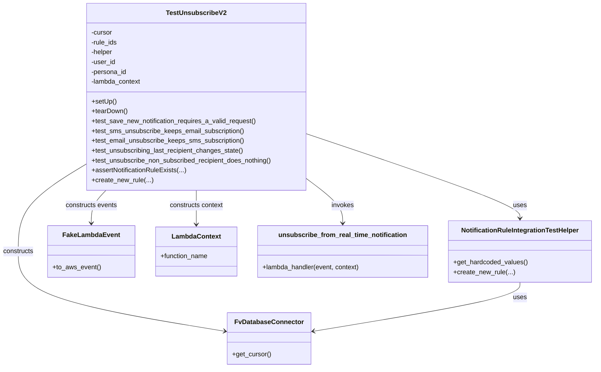

# Diagram: common/subscription_service/subscription_service_tests/integration/test_unsubscribe_from_real_time_notification.py


> Auto-generated by Obscura crawlers

## Diagram 1



### SVG

<svg id="container" width="1441.3359375" xmlns="http://www.w3.org/2000/svg" class="classDiagram" height="896" viewBox="0 0 1441.3359375 896" role="graphics-document document" aria-roledescription="class"><style>#container{font-family:"trebuchet ms",verdana,arial,sans-serif;font-size:16px;fill:#333;}@keyframes edge-animation-frame{from{stroke-dashoffset:0;}}@keyframes dash{to{stroke-dashoffset:0;}}#container .edge-animation-slow{stroke-dasharray:9,5!important;stroke-dashoffset:900;animation:dash 50s linear infinite;stroke-linecap:round;}#container .edge-animation-fast{stroke-dasharray:9,5!important;stroke-dashoffset:900;animation:dash 20s linear infinite;stroke-linecap:round;}#container .error-icon{fill:#552222;}#container .error-text{fill:#552222;stroke:#552222;}#container .edge-thickness-normal{stroke-width:1px;}#container .edge-thickness-thick{stroke-width:3.5px;}#container .edge-pattern-solid{stroke-dasharray:0;}#container .edge-thickness-invisible{stroke-width:0;fill:none;}#container .edge-pattern-dashed{stroke-dasharray:3;}#container .edge-pattern-dotted{stroke-dasharray:2;}#container .marker{fill:#333333;stroke:#333333;}#container .marker.cross{stroke:#333333;}#container svg{font-family:"trebuchet ms",verdana,arial,sans-serif;font-size:16px;}#container p{margin:0;}#container g.classGroup text{fill:#9370DB;stroke:none;font-family:"trebuchet ms",verdana,arial,sans-serif;font-size:10px;}#container g.classGroup text .title{font-weight:bolder;}#container .nodeLabel,#container .edgeLabel{color:#131300;}#container .edgeLabel .label rect{fill:#ECECFF;}#container .label text{fill:#131300;}#container .labelBkg{background:#ECECFF;}#container .edgeLabel .label span{background:#ECECFF;}#container .classTitle{font-weight:bolder;}#container .node rect,#container .node circle,#container .node ellipse,#container .node polygon,#container .node path{fill:#ECECFF;stroke:#9370DB;stroke-width:1px;}#container .divider{stroke:#9370DB;stroke-width:1;}#container g.clickable{cursor:pointer;}#container g.classGroup rect{fill:#ECECFF;stroke:#9370DB;}#container g.classGroup line{stroke:#9370DB;stroke-width:1;}#container .classLabel .box{stroke:none;stroke-width:0;fill:#ECECFF;opacity:0.5;}#container .classLabel .label{fill:#9370DB;font-size:10px;}#container .relation{stroke:#333333;stroke-width:1;fill:none;}#container .dashed-line{stroke-dasharray:3;}#container .dotted-line{stroke-dasharray:1 2;}#container #compositionStart,#container .composition{fill:#333333!important;stroke:#333333!important;stroke-width:1;}#container #compositionEnd,#container .composition{fill:#333333!important;stroke:#333333!important;stroke-width:1;}#container #dependencyStart,#container .dependency{fill:#333333!important;stroke:#333333!important;stroke-width:1;}#container #dependencyStart,#container .dependency{fill:#333333!important;stroke:#333333!important;stroke-width:1;}#container #extensionStart,#container .extension{fill:transparent!important;stroke:#333333!important;stroke-width:1;}#container #extensionEnd,#container .extension{fill:transparent!important;stroke:#333333!important;stroke-width:1;}#container #aggregationStart,#container .aggregation{fill:transparent!important;stroke:#333333!important;stroke-width:1;}#container #aggregationEnd,#container .aggregation{fill:transparent!important;stroke:#333333!important;stroke-width:1;}#container #lollipopStart,#container .lollipop{fill:#ECECFF!important;stroke:#333333!important;stroke-width:1;}#container #lollipopEnd,#container .lollipop{fill:#ECECFF!important;stroke:#333333!important;stroke-width:1;}#container .edgeTerminals{font-size:11px;line-height:initial;}#container .classTitleText{text-anchor:middle;font-size:18px;fill:#333;}#container .label-icon{display:inline-block;height:1em;overflow:visible;vertical-align:-0.125em;}#container .node .label-icon path{fill:currentColor;stroke:revert;stroke-width:revert;}#container :root{--mermaid-font-family:"trebuchet ms",verdana,arial,sans-serif;}</style><g><defs><marker id="container_class-aggregationStart" class="marker aggregation class" refX="18" refY="7" markerWidth="190" markerHeight="240" orient="auto"><path d="M 18,7 L9,13 L1,7 L9,1 Z"></path></marker></defs><defs><marker id="container_class-aggregationEnd" class="marker aggregation class" refX="1" refY="7" markerWidth="20" markerHeight="28" orient="auto"><path d="M 18,7 L9,13 L1,7 L9,1 Z"></path></marker></defs><defs><marker id="container_class-extensionStart" class="marker extension class" refX="18" refY="7" markerWidth="190" markerHeight="240" orient="auto"><path d="M 1,7 L18,13 V 1 Z"></path></marker></defs><defs><marker id="container_class-extensionEnd" class="marker extension class" refX="1" refY="7" markerWidth="20" markerHeight="28" orient="auto"><path d="M 1,1 V 13 L18,7 Z"></path></marker></defs><defs><marker id="container_class-compositionStart" class="marker composition class" refX="18" refY="7" markerWidth="190" markerHeight="240" orient="auto"><path d="M 18,7 L9,13 L1,7 L9,1 Z"></path></marker></defs><defs><marker id="container_class-compositionEnd" class="marker composition class" refX="1" refY="7" markerWidth="20" markerHeight="28" orient="auto"><path d="M 18,7 L9,13 L1,7 L9,1 Z"></path></marker></defs><defs><marker id="container_class-dependencyStart" class="marker dependency class" refX="6" refY="7" markerWidth="190" markerHeight="240" orient="auto"><path d="M 5,7 L9,13 L1,7 L9,1 Z"></path></marker></defs><defs><marker id="container_class-dependencyEnd" class="marker dependency class" refX="13" refY="7" markerWidth="20" markerHeight="28" orient="auto"><path d="M 18,7 L9,13 L14,7 L9,1 Z"></path></marker></defs><defs><marker id="container_class-lollipopStart" class="marker lollipop class" refX="13" refY="7" markerWidth="190" markerHeight="240" orient="auto"><circle stroke="black" fill="transparent" cx="7" cy="7" r="6"></circle></marker></defs><defs><marker id="container_class-lollipopEnd" class="marker lollipop class" refX="1" refY="7" markerWidth="190" markerHeight="240" orient="auto"><circle stroke="black" fill="transparent" cx="7" cy="7" r="6"></circle></marker></defs><g class="root"><g class="clusters"></g><g class="edgePaths"><path d="M744.469,327.026L830.54,356.022C916.611,385.017,1088.753,443.009,1174.824,477.171C1260.895,511.333,1260.895,521.667,1260.895,526.833L1260.895,532" id="id_TestUnsubscribeV2_NotificationRuleIntegrationTestHelper_1" class="edge-thickness-normal edge-pattern-solid relation" style=";;;" data-edge="true" data-et="edge" data-id="id_TestUnsubscribeV2_NotificationRuleIntegrationTestHelper_1" data-points="W3sieCI6NzQ0LjQ2ODc1LCJ5IjozMjcuMDI2MTg0NzE4MjE1MDZ9LHsieCI6MTI2MC44OTQ1MzEyNSwieSI6NTAxfSx7IngiOjEyNjAuODk0NTMxMjUsInkiOjUzOH1d" marker-end="url(#container_class-dependencyEnd)"></path><path d="M204.063,403.134L177.693,419.445C151.323,435.756,98.583,468.378,72.214,503.356C45.844,538.333,45.844,575.667,45.844,613C45.844,650.333,45.844,687.667,129.616,720.122C213.388,752.578,380.932,780.156,464.704,793.945L548.476,807.734" id="id_TestUnsubscribeV2_FvDatabaseConnector_2" class="edge-thickness-normal edge-pattern-solid relation" style=";;;" data-edge="true" data-et="edge" data-id="id_TestUnsubscribeV2_FvDatabaseConnector_2" data-points="W3sieCI6MjA0LjA2MjUsInkiOjQwMy4xMzM5MjE3MzMxMDQ4fSx7IngiOjQ1Ljg0Mzc1LCJ5Ijo1MDF9LHsieCI6NDUuODQzNzUsInkiOjYxM30seyJ4Ijo0NS44NDM3NSwieSI6NzI1fSx7IngiOjU1NC4zOTY0ODQzNzUsInkiOjgwOC43MDg4ODU2MjM5OTMzfV0=" marker-end="url(#container_class-dependencyEnd)"></path><path d="M257.077,464L251.203,470.167C245.329,476.333,233.581,488.667,227.706,502C221.832,515.333,221.832,529.667,221.832,536.833L221.832,544" id="id_TestUnsubscribeV2_FakeLambdaEvent_3" class="edge-thickness-normal edge-pattern-solid relation" style=";;;" data-edge="true" data-et="edge" data-id="id_TestUnsubscribeV2_FakeLambdaEvent_3" data-points="W3sieCI6MjU3LjA3NzQ3NjQxNTA5NDM0LCJ5Ijo0NjR9LHsieCI6MjIxLjgzMjAzMTI1LCJ5Ijo1MDF9LHsieCI6MjIxLjgzMjAzMTI1LCJ5Ijo1NTB9XQ==" marker-end="url(#container_class-dependencyEnd)"></path><path d="M474.266,464L474.266,470.167C474.266,476.333,474.266,488.667,474.266,502.5C474.266,516.333,474.266,531.667,474.266,539.333L474.266,547" id="id_TestUnsubscribeV2_LambdaContext_4" class="edge-thickness-normal edge-pattern-solid relation" style=";;;" data-edge="true" data-et="edge" data-id="id_TestUnsubscribeV2_LambdaContext_4" data-points="W3sieCI6NDc0LjI2NTYyNSwieSI6NDY0fSx7IngiOjQ3NC4yNjU2MjUsInkiOjUwMX0seyJ4Ijo0NzQuMjY1NjI1LCJ5Ijo1NTN9XQ==" marker-end="url(#container_class-dependencyEnd)"></path><path d="M744.469,436.718L758.891,447.432C773.314,458.145,802.159,479.573,816.581,497.453C831.004,515.333,831.004,529.667,831.004,536.833L831.004,544" id="id_TestUnsubscribeV2_unsubscribe_from_real_time_notification_5" class="edge-thickness-normal edge-pattern-solid relation" style=";;;" data-edge="true" data-et="edge" data-id="id_TestUnsubscribeV2_unsubscribe_from_real_time_notification_5" data-points="W3sieCI6NzQ0LjQ2ODc1LCJ5Ijo0MzYuNzE4MDk0NzE2NjcxMn0seyJ4Ijo4MzEuMDAzOTA2MjUsInkiOjUwMX0seyJ4Ijo4MzEuMDAzOTA2MjUsInkiOjU1MH1d" marker-end="url(#container_class-dependencyEnd)"></path><path d="M1260.895,688L1260.895,694.167C1260.895,700.333,1260.895,712.667,1177.122,732.622C1093.35,752.578,925.806,780.156,842.034,793.945L758.262,807.734" id="id_NotificationRuleIntegrationTestHelper_FvDatabaseConnector_6" class="edge-thickness-normal edge-pattern-solid relation" style=";;;" data-edge="true" data-et="edge" data-id="id_NotificationRuleIntegrationTestHelper_FvDatabaseConnector_6" data-points="W3sieCI6MTI2MC44OTQ1MzEyNSwieSI6Njg4fSx7IngiOjEyNjAuODk0NTMxMjUsInkiOjcyNX0seyJ4Ijo3NTIuMzQxNzk2ODc1LCJ5Ijo4MDguNzA4ODg1NjIzOTkzM31d" marker-end="url(#container_class-dependencyEnd)"></path></g><g class="edgeLabels"><g class="edgeLabel" transform="translate(1260.89453125, 501)"><g class="label" data-id="id_TestUnsubscribeV2_NotificationRuleIntegrationTestHelper_1" transform="translate(-16.4921875, -12)"><foreignObject width="32.984375" height="24"><div xmlns="http://www.w3.org/1999/xhtml" class="labelBkg" style="display: table-cell; white-space: nowrap; line-height: 1.5; max-width: 200px; text-align: center;"><span class="edgeLabel"><p>uses</p></span></div></foreignObject></g></g><g class="edgeLabel" transform="translate(45.84375, 613)"><g class="label" data-id="id_TestUnsubscribeV2_FvDatabaseConnector_2" transform="translate(-37.84375, -12)"><foreignObject width="75.6875" height="24"><div xmlns="http://www.w3.org/1999/xhtml" class="labelBkg" style="display: table-cell; white-space: nowrap; line-height: 1.5; max-width: 200px; text-align: center;"><span class="edgeLabel"><p>constructs</p></span></div></foreignObject></g></g><g class="edgeLabel" transform="translate(221.83203125, 501)"><g class="label" data-id="id_TestUnsubscribeV2_FakeLambdaEvent_3" transform="translate(-63.8671875, -12)"><foreignObject width="127.734375" height="24"><div xmlns="http://www.w3.org/1999/xhtml" class="labelBkg" style="display: table-cell; white-space: nowrap; line-height: 1.5; max-width: 200px; text-align: center;"><span class="edgeLabel"><p>constructs events</p></span></div></foreignObject></g></g><g class="edgeLabel" transform="translate(474.265625, 501)"><g class="label" data-id="id_TestUnsubscribeV2_LambdaContext_4" transform="translate(-66.8125, -12)"><foreignObject width="133.625" height="24"><div xmlns="http://www.w3.org/1999/xhtml" class="labelBkg" style="display: table-cell; white-space: nowrap; line-height: 1.5; max-width: 200px; text-align: center;"><span class="edgeLabel"><p>constructs context</p></span></div></foreignObject></g></g><g class="edgeLabel" transform="translate(831.00390625, 501)"><g class="label" data-id="id_TestUnsubscribeV2_unsubscribe_from_real_time_notification_5" transform="translate(-27.5859375, -12)"><foreignObject width="55.171875" height="24"><div xmlns="http://www.w3.org/1999/xhtml" class="labelBkg" style="display: table-cell; white-space: nowrap; line-height: 1.5; max-width: 200px; text-align: center;"><span class="edgeLabel"><p>invokes</p></span></div></foreignObject></g></g><g class="edgeLabel" transform="translate(1260.89453125, 725)"><g class="label" data-id="id_NotificationRuleIntegrationTestHelper_FvDatabaseConnector_6" transform="translate(-16.4921875, -12)"><foreignObject width="32.984375" height="24"><div xmlns="http://www.w3.org/1999/xhtml" class="labelBkg" style="display: table-cell; white-space: nowrap; line-height: 1.5; max-width: 200px; text-align: center;"><span class="edgeLabel"><p>uses</p></span></div></foreignObject></g></g></g><g class="nodes"><g class="node default" id="classId-TestUnsubscribeV2-0" transform="translate(474.265625, 236)"><g class="basic label-container"><path d="M-270.203125 -228 L270.203125 -228 L270.203125 228 L-270.203125 228" stroke="none" stroke-width="0" fill="#ECECFF" style=""></path><path d="M-270.203125 -228 C-117.93661804484555 -228, 34.32988891030891 -228, 270.203125 -228 M-270.203125 -228 C-143.040681308453 -228, -15.878237616906006 -228, 270.203125 -228 M270.203125 -228 C270.203125 -121.07137583782001, 270.203125 -14.142751675640028, 270.203125 228 M270.203125 -228 C270.203125 -97.64813310465965, 270.203125 32.7037337906807, 270.203125 228 M270.203125 228 C120.63207382613155 228, -28.93897734773691 228, -270.203125 228 M270.203125 228 C111.81373087902116 228, -46.57566324195767 228, -270.203125 228 M-270.203125 228 C-270.203125 50.58185432426379, -270.203125 -126.83629135147243, -270.203125 -228 M-270.203125 228 C-270.203125 106.29881990677714, -270.203125 -15.40236018644572, -270.203125 -228" stroke="#9370DB" stroke-width="1.3" fill="none" stroke-dasharray="0 0" style=""></path></g><g class="annotation-group text" transform="translate(0, -204)"></g><g class="label-group text" transform="translate(-69.34375, -204)"><g class="label" style="font-weight: bolder" transform="translate(0,-12)"><foreignObject width="138.6875" height="24"><div xmlns="http://www.w3.org/1999/xhtml" style="display: table-cell; white-space: nowrap; line-height: 1.5; max-width: 187px; text-align: center;"><span class="nodeLabel markdown-node-label" style=""><p>TestUnsubscribeV2</p></span></div></foreignObject></g></g><g class="members-group text" transform="translate(-258.203125, -156)"><g class="label" style="" transform="translate(0,-12)"><foreignObject width="52.1875" height="24"><div xmlns="http://www.w3.org/1999/xhtml" style="display: table-cell; white-space: nowrap; line-height: 1.5; max-width: 110px; text-align: center;"><span class="nodeLabel markdown-node-label" style=""><p>-cursor</p></span></div></foreignObject></g><g class="label" style="" transform="translate(0,12)"><foreignObject width="64.828125" height="24"><div xmlns="http://www.w3.org/1999/xhtml" style="display: table-cell; white-space: nowrap; line-height: 1.5; max-width: 122px; text-align: center;"><span class="nodeLabel markdown-node-label" style=""><p>-rule_ids</p></span></div></foreignObject></g><g class="label" style="" transform="translate(0,36)"><foreignObject width="53.640625" height="24"><div xmlns="http://www.w3.org/1999/xhtml" style="display: table-cell; white-space: nowrap; line-height: 1.5; max-width: 112px; text-align: center;"><span class="nodeLabel markdown-node-label" style=""><p>-helper</p></span></div></foreignObject></g><g class="label" style="" transform="translate(0,60)"><foreignObject width="59.25" height="24"><div xmlns="http://www.w3.org/1999/xhtml" style="display: table-cell; white-space: nowrap; line-height: 1.5; max-width: 117px; text-align: center;"><span class="nodeLabel markdown-node-label" style=""><p>-user_id</p></span></div></foreignObject></g><g class="label" style="" transform="translate(0,84)"><foreignObject width="87.90625" height="24"><div xmlns="http://www.w3.org/1999/xhtml" style="display: table-cell; white-space: nowrap; line-height: 1.5; max-width: 145px; text-align: center;"><span class="nodeLabel markdown-node-label" style=""><p>-persona_id</p></span></div></foreignObject></g><g class="label" style="" transform="translate(0,108)"><foreignObject width="122.953125" height="24"><div xmlns="http://www.w3.org/1999/xhtml" style="display: table-cell; white-space: nowrap; line-height: 1.5; max-width: 181px; text-align: center;"><span class="nodeLabel markdown-node-label" style=""><p>-lambda_context</p></span></div></foreignObject></g></g><g class="methods-group text" transform="translate(-258.203125, 12)"><g class="label" style="" transform="translate(0,-12)"><foreignObject width="60.421875" height="24"><div xmlns="http://www.w3.org/1999/xhtml" style="display: table-cell; white-space: nowrap; line-height: 1.5; max-width: 118px; text-align: center;"><span class="nodeLabel markdown-node-label" style=""><p>+setUp()</p></span></div></foreignObject></g><g class="label" style="" transform="translate(0,12)"><foreignObject width="87.75" height="24"><div xmlns="http://www.w3.org/1999/xhtml" style="display: table-cell; white-space: nowrap; line-height: 1.5; max-width: 145px; text-align: center;"><span class="nodeLabel markdown-node-label" style=""><p>+tearDown()</p></span></div></foreignObject></g><g class="label" style="" transform="translate(0,36)"><foreignObject width="406.140625" height="24"><div xmlns="http://www.w3.org/1999/xhtml" style="display: table-cell; white-space: nowrap; line-height: 1.5; max-width: 464px; text-align: center;"><span class="nodeLabel markdown-node-label" style=""><p>+test_save_new_notification_requires_a_valid_request()</p></span></div></foreignObject></g><g class="label" style="" transform="translate(0,60)"><foreignObject width="376.859375" height="24"><div xmlns="http://www.w3.org/1999/xhtml" style="display: table-cell; white-space: nowrap; line-height: 1.5; max-width: 434px; text-align: center;"><span class="nodeLabel markdown-node-label" style=""><p>+test_sms_unsubscribe_keeps_email_subscription()</p></span></div></foreignObject></g><g class="label" style="" transform="translate(0,84)"><foreignObject width="376.859375" height="24"><div xmlns="http://www.w3.org/1999/xhtml" style="display: table-cell; white-space: nowrap; line-height: 1.5; max-width: 434px; text-align: center;"><span class="nodeLabel markdown-node-label" style=""><p>+test_email_unsubscribe_keeps_sms_subscription()</p></span></div></foreignObject></g><g class="label" style="" transform="translate(0,108)"><foreignObject width="375.140625" height="24"><div xmlns="http://www.w3.org/1999/xhtml" style="display: table-cell; white-space: nowrap; line-height: 1.5; max-width: 433px; text-align: center;"><span class="nodeLabel markdown-node-label" style=""><p>+test_unsubscribing_last_recipient_changes_state()</p></span></div></foreignObject></g><g class="label" style="" transform="translate(0,132)"><foreignObject width="447.0625" height="24"><div xmlns="http://www.w3.org/1999/xhtml" style="display: table-cell; white-space: nowrap; line-height: 1.5; max-width: 504px; text-align: center;"><span class="nodeLabel markdown-node-label" style=""><p>+test_unsubscribe_non_subscribed_recipient_does_nothing()</p></span></div></foreignObject></g><g class="label" style="" transform="translate(0,156)"><foreignObject width="232.46875" height="24"><div xmlns="http://www.w3.org/1999/xhtml" style="display: table-cell; white-space: nowrap; line-height: 1.5; max-width: 290px; text-align: center;"><span class="nodeLabel markdown-node-label" style=""><p>+assertNotificationRuleExists(...)</p></span></div></foreignObject></g><g class="label" style="" transform="translate(0,180)"><foreignObject width="149.125" height="24"><div xmlns="http://www.w3.org/1999/xhtml" style="display: table-cell; white-space: nowrap; line-height: 1.5; max-width: 206px; text-align: center;"><span class="nodeLabel markdown-node-label" style=""><p>+create_new_rule(...)</p></span></div></foreignObject></g></g><g class="divider" style=""><path d="M-270.203125 -180 C-60.293223631139114 -180, 149.61667773772177 -180, 270.203125 -180 M-270.203125 -180 C-59.27997906013479 -180, 151.64316687973042 -180, 270.203125 -180" stroke="#9370DB" stroke-width="1.3" fill="none" stroke-dasharray="0 0" style=""></path></g><g class="divider" style=""><path d="M-270.203125 -12 C-79.74283972195559 -12, 110.71744555608882 -12, 270.203125 -12 M-270.203125 -12 C-149.31393963309398 -12, -28.424754266187932 -12, 270.203125 -12" stroke="#9370DB" stroke-width="1.3" fill="none" stroke-dasharray="0 0" style=""></path></g></g><g class="node default" id="classId-NotificationRuleIntegrationTestHelper-1" transform="translate(1260.89453125, 613)"><g class="basic label-container"><path d="M-172.44140625 -75 L172.44140625 -75 L172.44140625 75 L-172.44140625 75" stroke="none" stroke-width="0" fill="#ECECFF" style=""></path><path d="M-172.44140625 -75 C-38.92678398066542 -75, 94.58783828866916 -75, 172.44140625 -75 M-172.44140625 -75 C-98.80458990466722 -75, -25.16777355933445 -75, 172.44140625 -75 M172.44140625 -75 C172.44140625 -37.37719216944515, 172.44140625 0.2456156611096958, 172.44140625 75 M172.44140625 -75 C172.44140625 -24.90675678301465, 172.44140625 25.1864864339707, 172.44140625 75 M172.44140625 75 C36.3112143160798 75, -99.8189776178404 75, -172.44140625 75 M172.44140625 75 C78.41461309385333 75, -15.612180062293334 75, -172.44140625 75 M-172.44140625 75 C-172.44140625 25.412307819790605, -172.44140625 -24.17538436041879, -172.44140625 -75 M-172.44140625 75 C-172.44140625 36.75840480409681, -172.44140625 -1.4831903918063745, -172.44140625 -75" stroke="#9370DB" stroke-width="1.3" fill="none" stroke-dasharray="0 0" style=""></path></g><g class="annotation-group text" transform="translate(0, -51)"></g><g class="label-group text" transform="translate(-139.5859375, -51)"><g class="label" style="font-weight: bolder" transform="translate(0,-12)"><foreignObject width="279.171875" height="24"><div xmlns="http://www.w3.org/1999/xhtml" style="display: table-cell; white-space: nowrap; line-height: 1.5; max-width: 326px; text-align: center;"><span class="nodeLabel markdown-node-label" style=""><p>NotificationRuleIntegrationTestHelper</p></span></div></foreignObject></g></g><g class="members-group text" transform="translate(-160.44140625, -3)"></g><g class="methods-group text" transform="translate(-160.44140625, 27)"><g class="label" style="" transform="translate(0,-12)"><foreignObject width="181.296875" height="24"><div xmlns="http://www.w3.org/1999/xhtml" style="display: table-cell; white-space: nowrap; line-height: 1.5; max-width: 239px; text-align: center;"><span class="nodeLabel markdown-node-label" style=""><p>+get_hardcoded_values()</p></span></div></foreignObject></g><g class="label" style="" transform="translate(0,12)"><foreignObject width="149.125" height="24"><div xmlns="http://www.w3.org/1999/xhtml" style="display: table-cell; white-space: nowrap; line-height: 1.5; max-width: 206px; text-align: center;"><span class="nodeLabel markdown-node-label" style=""><p>+create_new_rule(...)</p></span></div></foreignObject></g></g><g class="divider" style=""><path d="M-172.44140625 -27 C-74.80908544468416 -27, 22.823235360631685 -27, 172.44140625 -27 M-172.44140625 -27 C-42.897505384870755 -27, 86.64639548025849 -27, 172.44140625 -27" stroke="#9370DB" stroke-width="1.3" fill="none" stroke-dasharray="0 0" style=""></path></g><g class="divider" style=""><path d="M-172.44140625 -3 C-102.88862628543639 -3, -33.335846320872776 -3, 172.44140625 -3 M-172.44140625 -3 C-72.03262904794907 -3, 28.376148154101855 -3, 172.44140625 -3" stroke="#9370DB" stroke-width="1.3" fill="none" stroke-dasharray="0 0" style=""></path></g></g><g class="node default" id="classId-FvDatabaseConnector-2" transform="translate(653.369140625, 825)"><g class="basic label-container"><path d="M-98.97265625 -63 L98.97265625 -63 L98.97265625 63 L-98.97265625 63" stroke="none" stroke-width="0" fill="#ECECFF" style=""></path><path d="M-98.97265625 -63 C-40.69361238225137 -63, 17.585431485497267 -63, 98.97265625 -63 M-98.97265625 -63 C-47.287821506266674 -63, 4.397013237466652 -63, 98.97265625 -63 M98.97265625 -63 C98.97265625 -27.77143767306005, 98.97265625 7.457124653879902, 98.97265625 63 M98.97265625 -63 C98.97265625 -36.38043113287929, 98.97265625 -9.760862265758576, 98.97265625 63 M98.97265625 63 C23.428380230949244 63, -52.11589578810151 63, -98.97265625 63 M98.97265625 63 C38.006753904125624 63, -22.959148441748752 63, -98.97265625 63 M-98.97265625 63 C-98.97265625 33.118517158221884, -98.97265625 3.2370343164437685, -98.97265625 -63 M-98.97265625 63 C-98.97265625 34.611413936010806, -98.97265625 6.222827872021618, -98.97265625 -63" stroke="#9370DB" stroke-width="1.3" fill="none" stroke-dasharray="0 0" style=""></path></g><g class="annotation-group text" transform="translate(0, -39)"></g><g class="label-group text" transform="translate(-79.3046875, -39)"><g class="label" style="font-weight: bolder" transform="translate(0,-12)"><foreignObject width="158.609375" height="24"><div xmlns="http://www.w3.org/1999/xhtml" style="display: table-cell; white-space: nowrap; line-height: 1.5; max-width: 207px; text-align: center;"><span class="nodeLabel markdown-node-label" style=""><p>FvDatabaseConnector</p></span></div></foreignObject></g></g><g class="members-group text" transform="translate(-86.97265625, 9)"></g><g class="methods-group text" transform="translate(-86.97265625, 39)"><g class="label" style="" transform="translate(0,-12)"><foreignObject width="94.640625" height="24"><div xmlns="http://www.w3.org/1999/xhtml" style="display: table-cell; white-space: nowrap; line-height: 1.5; max-width: 152px; text-align: center;"><span class="nodeLabel markdown-node-label" style=""><p>+get_cursor()</p></span></div></foreignObject></g></g><g class="divider" style=""><path d="M-98.97265625 -15 C-55.34148451810523 -15, -11.710312786210466 -15, 98.97265625 -15 M-98.97265625 -15 C-29.297998861049507 -15, 40.376658527900986 -15, 98.97265625 -15" stroke="#9370DB" stroke-width="1.3" fill="none" stroke-dasharray="0 0" style=""></path></g><g class="divider" style=""><path d="M-98.97265625 9 C-28.803778450797125 9, 41.36509934840575 9, 98.97265625 9 M-98.97265625 9 C-33.979320632010285 9, 31.01401498597943 9, 98.97265625 9" stroke="#9370DB" stroke-width="1.3" fill="none" stroke-dasharray="0 0" style=""></path></g></g><g class="node default" id="classId-FakeLambdaEvent-3" transform="translate(221.83203125, 613)"><g class="basic label-container"><path d="M-103.14453125 -63 L103.14453125 -63 L103.14453125 63 L-103.14453125 63" stroke="none" stroke-width="0" fill="#ECECFF" style=""></path><path d="M-103.14453125 -63 C-39.05575479248051 -63, 25.033021665038973 -63, 103.14453125 -63 M-103.14453125 -63 C-24.959175913573517 -63, 53.226179422852965 -63, 103.14453125 -63 M103.14453125 -63 C103.14453125 -25.331128477171212, 103.14453125 12.337743045657575, 103.14453125 63 M103.14453125 -63 C103.14453125 -18.6055096621671, 103.14453125 25.788980675665798, 103.14453125 63 M103.14453125 63 C41.60880647853663 63, -19.926918292926743 63, -103.14453125 63 M103.14453125 63 C42.280789420036186 63, -18.58295240992763 63, -103.14453125 63 M-103.14453125 63 C-103.14453125 31.037199484150385, -103.14453125 -0.9256010316992302, -103.14453125 -63 M-103.14453125 63 C-103.14453125 18.27971372832767, -103.14453125 -26.440572543344658, -103.14453125 -63" stroke="#9370DB" stroke-width="1.3" fill="none" stroke-dasharray="0 0" style=""></path></g><g class="annotation-group text" transform="translate(0, -39)"></g><g class="label-group text" transform="translate(-65.8671875, -39)"><g class="label" style="font-weight: bolder" transform="translate(0,-12)"><foreignObject width="131.734375" height="24"><div xmlns="http://www.w3.org/1999/xhtml" style="display: table-cell; white-space: nowrap; line-height: 1.5; max-width: 181px; text-align: center;"><span class="nodeLabel markdown-node-label" style=""><p>FakeLambdaEvent</p></span></div></foreignObject></g></g><g class="members-group text" transform="translate(-91.14453125, 9)"></g><g class="methods-group text" transform="translate(-91.14453125, 39)"><g class="label" style="" transform="translate(0,-12)"><foreignObject width="116.421875" height="24"><div xmlns="http://www.w3.org/1999/xhtml" style="display: table-cell; white-space: nowrap; line-height: 1.5; max-width: 174px; text-align: center;"><span class="nodeLabel markdown-node-label" style=""><p>+to_aws_event()</p></span></div></foreignObject></g></g><g class="divider" style=""><path d="M-103.14453125 -15 C-59.7315340882971 -15, -16.318536926594206 -15, 103.14453125 -15 M-103.14453125 -15 C-28.28481128238606 -15, 46.57490868522788 -15, 103.14453125 -15" stroke="#9370DB" stroke-width="1.3" fill="none" stroke-dasharray="0 0" style=""></path></g><g class="divider" style=""><path d="M-103.14453125 9 C-44.157372723295296 9, 14.829785803409408 9, 103.14453125 9 M-103.14453125 9 C-33.77173867983292 9, 35.60105389033416 9, 103.14453125 9" stroke="#9370DB" stroke-width="1.3" fill="none" stroke-dasharray="0 0" style=""></path></g></g><g class="node default" id="classId-LambdaContext-4" transform="translate(474.265625, 613)"><g class="basic label-container"><path d="M-99.2890625 -60 L99.2890625 -60 L99.2890625 60 L-99.2890625 60" stroke="none" stroke-width="0" fill="#ECECFF" style=""></path><path d="M-99.2890625 -60 C-32.305002311856256 -60, 34.67905787628749 -60, 99.2890625 -60 M-99.2890625 -60 C-28.78252096662868 -60, 41.72402056674264 -60, 99.2890625 -60 M99.2890625 -60 C99.2890625 -28.011427734174138, 99.2890625 3.9771445316517244, 99.2890625 60 M99.2890625 -60 C99.2890625 -34.09745565744902, 99.2890625 -8.194911314898029, 99.2890625 60 M99.2890625 60 C57.94652758376216 60, 16.603992667524324 60, -99.2890625 60 M99.2890625 60 C47.08917967318428 60, -5.110703153631434 60, -99.2890625 60 M-99.2890625 60 C-99.2890625 30.459950824582773, -99.2890625 0.9199016491655456, -99.2890625 -60 M-99.2890625 60 C-99.2890625 27.795232730866026, -99.2890625 -4.409534538267948, -99.2890625 -60" stroke="#9370DB" stroke-width="1.3" fill="none" stroke-dasharray="0 0" style=""></path></g><g class="annotation-group text" transform="translate(0, -36)"></g><g class="label-group text" transform="translate(-57.296875, -36)"><g class="label" style="font-weight: bolder" transform="translate(0,-12)"><foreignObject width="114.59375" height="24"><div xmlns="http://www.w3.org/1999/xhtml" style="display: table-cell; white-space: nowrap; line-height: 1.5; max-width: 163px; text-align: center;"><span class="nodeLabel markdown-node-label" style=""><p>LambdaContext</p></span></div></foreignObject></g></g><g class="members-group text" transform="translate(-87.2890625, 12)"><g class="label" style="" transform="translate(0,-12)"><foreignObject width="117.28125" height="24"><div xmlns="http://www.w3.org/1999/xhtml" style="display: table-cell; white-space: nowrap; line-height: 1.5; max-width: 175px; text-align: center;"><span class="nodeLabel markdown-node-label" style=""><p>+function_name</p></span></div></foreignObject></g></g><g class="methods-group text" transform="translate(-87.2890625, 60)"></g><g class="divider" style=""><path d="M-99.2890625 -12 C-36.745060659884885 -12, 25.79894118023023 -12, 99.2890625 -12 M-99.2890625 -12 C-47.86843290432976 -12, 3.552196691340484 -12, 99.2890625 -12" stroke="#9370DB" stroke-width="1.3" fill="none" stroke-dasharray="0 0" style=""></path></g><g class="divider" style=""><path d="M-99.2890625 36 C-58.35123065213532 36, -17.413398804270642 36, 99.2890625 36 M-99.2890625 36 C-19.880113972805745 36, 59.52883455438851 36, 99.2890625 36" stroke="#9370DB" stroke-width="1.3" fill="none" stroke-dasharray="0 0" style=""></path></g></g><g class="node default" id="classId-unsubscribe_from_real_time_notification-5" transform="translate(831.00390625, 613)"><g class="basic label-container"><path d="M-207.44921875 -63 L207.44921875 -63 L207.44921875 63 L-207.44921875 63" stroke="none" stroke-width="0" fill="#ECECFF" style=""></path><path d="M-207.44921875 -63 C-99.66199643657235 -63, 8.125225876855296 -63, 207.44921875 -63 M-207.44921875 -63 C-60.807310882504225 -63, 85.83459698499155 -63, 207.44921875 -63 M207.44921875 -63 C207.44921875 -33.35831299136899, 207.44921875 -3.7166259827379804, 207.44921875 63 M207.44921875 -63 C207.44921875 -32.05886258922885, 207.44921875 -1.1177251784577038, 207.44921875 63 M207.44921875 63 C87.02700462549545 63, -33.3952094990091 63, -207.44921875 63 M207.44921875 63 C74.68978166211522 63, -58.069655425769554 63, -207.44921875 63 M-207.44921875 63 C-207.44921875 34.61251711947557, -207.44921875 6.225034238951146, -207.44921875 -63 M-207.44921875 63 C-207.44921875 37.194489244933294, -207.44921875 11.388978489866595, -207.44921875 -63" stroke="#9370DB" stroke-width="1.3" fill="none" stroke-dasharray="0 0" style=""></path></g><g class="annotation-group text" transform="translate(0, -39)"></g><g class="label-group text" transform="translate(-150.7109375, -39)"><g class="label" style="font-weight: bolder" transform="translate(0,-12)"><foreignObject width="301.421875" height="24"><div xmlns="http://www.w3.org/1999/xhtml" style="display: table-cell; white-space: nowrap; line-height: 1.5; max-width: 349px; text-align: center;"><span class="nodeLabel markdown-node-label" style=""><p>unsubscribe_from_real_time_notification</p></span></div></foreignObject></g></g><g class="members-group text" transform="translate(-195.44921875, 9)"></g><g class="methods-group text" transform="translate(-195.44921875, 39)"><g class="label" style="" transform="translate(0,-12)"><foreignObject width="240.1875" height="24"><div xmlns="http://www.w3.org/1999/xhtml" style="display: table-cell; white-space: nowrap; line-height: 1.5; max-width: 298px; text-align: center;"><span class="nodeLabel markdown-node-label" style=""><p>+lambda_handler(event, context)</p></span></div></foreignObject></g></g><g class="divider" style=""><path d="M-207.44921875 -15 C-116.36675586533076 -15, -25.28429298066152 -15, 207.44921875 -15 M-207.44921875 -15 C-43.93392621968445 -15, 119.5813663106311 -15, 207.44921875 -15" stroke="#9370DB" stroke-width="1.3" fill="none" stroke-dasharray="0 0" style=""></path></g><g class="divider" style=""><path d="M-207.44921875 9 C-64.490676908256 9, 78.46786493348799 9, 207.44921875 9 M-207.44921875 9 C-86.00380408043459 9, 35.44161058913082 9, 207.44921875 9" stroke="#9370DB" stroke-width="1.3" fill="none" stroke-dasharray="0 0" style=""></path></g></g></g></g></g></svg>

## Diagram 2

```mermaid
flowchart TD
    A[Incoming POST request] --> B{Valid request?}
    B -- No --> C[Return 400]
    B -- Yes --> D[Lookup notification_rule by id]
    D --> E{Found rule?}
    E -- No --> F[Return 200 (no-op)]
    E -- Yes --> G[Find delivery action matching unsubscribe_id]
    G --> H{Action found?}
    H -- No --> I[Leave rule unchanged]
    H -- Yes --> J[Remove delivery action]
    J --> K{Any remaining actions?}
    K -- Yes --> L[Update rule notify_actions and keep state enabled]
    K -- No --> M[Set rule state = noSubscribers and clear notify_actions]
    L --> N[Persist changes]
    M --> N
    I --> N
    N --> O[Return 200]
```

> SVG rendering failed for this diagram.
