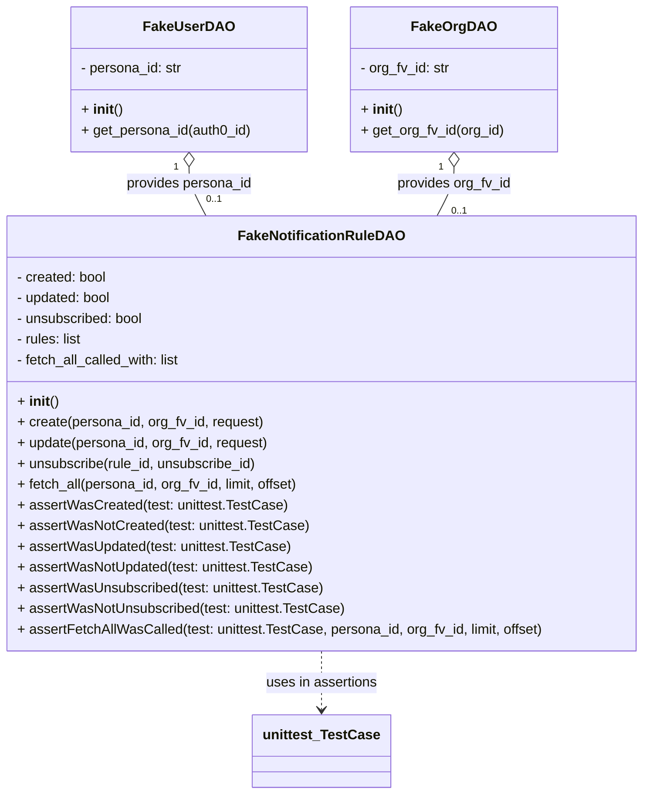

# Diagram: common/subscription_service/subscription_service_tests/unit/fakes.py

> Auto-generated by Obscura crawlers

## Mermaid

### SVG

<svg id="container" width="741.984375" xmlns="http://www.w3.org/2000/svg" class="classDiagram" height="920" viewBox="0 0 741.984375 920" role="graphics-document document" aria-roledescription="class"><g><defs><marker id="container_class-aggregationStart" class="marker aggregation class" refX="18" refY="7" markerWidth="190" markerHeight="240" orient="auto"><path d="M 18,7 L9,13 L1,7 L9,1 Z"></path></marker></defs><defs><marker id="container_class-aggregationEnd" class="marker aggregation class" refX="1" refY="7" markerWidth="20" markerHeight="28" orient="auto"><path d="M 18,7 L9,13 L1,7 L9,1 Z"></path></marker></defs><defs><marker id="container_class-extensionStart" class="marker extension class" refX="18" refY="7" markerWidth="190" markerHeight="240" orient="auto"><path d="M 1,7 L18,13 V 1 Z"></path></marker></defs><defs><marker id="container_class-extensionEnd" class="marker extension class" refX="1" refY="7" markerWidth="20" markerHeight="28" orient="auto"><path d="M 1,1 V 13 L18,7 Z"></path></marker></defs><defs><marker id="container_class-compositionStart" class="marker composition class" refX="18" refY="7" markerWidth="190" markerHeight="240" orient="auto"><path d="M 18,7 L9,13 L1,7 L9,1 Z"></path></marker></defs><defs><marker id="container_class-compositionEnd" class="marker composition class" refX="1" refY="7" markerWidth="20" markerHeight="28" orient="auto"><path d="M 18,7 L9,13 L1,7 L9,1 Z"></path></marker></defs><defs><marker id="container_class-dependencyStart" class="marker dependency class" refX="6" refY="7" markerWidth="190" markerHeight="240" orient="auto"><path d="M 5,7 L9,13 L1,7 L9,1 Z"></path></marker></defs><defs><marker id="container_class-dependencyEnd" class="marker dependency class" refX="13" refY="7" markerWidth="20" markerHeight="28" orient="auto"><path d="M 18,7 L9,13 L14,7 L9,1 Z"></path></marker></defs><defs><marker id="container_class-lollipopStart" class="marker lollipop class" refX="13" refY="7" markerWidth="190" markerHeight="240" orient="auto"><circle stroke="black" fill="transparent" cx="7" cy="7" r="6"></circle></marker></defs><defs><marker id="container_class-lollipopEnd" class="marker lollipop class" refX="1" refY="7" markerWidth="190" markerHeight="240" orient="auto"><circle stroke="black" fill="transparent" cx="7" cy="7" r="6"></circle></marker></defs><g class="root"><g class="clusters"></g><g class="edgePaths"><path d="M219.402,193.25L219.402,196.542C219.402,199.833,219.402,206.417,222.637,215.875C225.872,225.333,232.341,237.667,235.575,243.833L238.81,250" id="id_FakeUserDAO_FakeNotificationRuleDAO_1" class="edge-thickness-normal edge-pattern-solid relation" style=";;;" data-edge="true" data-et="edge" data-id="id_FakeUserDAO_FakeNotificationRuleDAO_1" data-points="W3sieCI6MjE5LjQwMjM0Mzc1LCJ5IjoxNzZ9LHsieCI6MjE5LjQwMjM0Mzc1LCJ5IjoyMTN9LHsieCI6MjM4LjgxMDA0MDAwODY1MDUzLCJ5IjoyNTB9XQ==" marker-start="url(#container_class-aggregationStart)"></path><path d="M522.582,193.25L522.582,196.542C522.582,199.833,522.582,206.417,519.347,215.875C516.113,225.333,509.644,237.667,506.409,243.833L503.174,250" id="id_FakeOrgDAO_FakeNotificationRuleDAO_2" class="edge-thickness-normal edge-pattern-solid relation" style=";;;" data-edge="true" data-et="edge" data-id="id_FakeOrgDAO_FakeNotificationRuleDAO_2" data-points="W3sieCI6NTIyLjU4MjAzMTI1LCJ5IjoxNzZ9LHsieCI6NTIyLjU4MjAzMTI1LCJ5IjoyMTN9LHsieCI6NTAzLjE3NDMzNDk5MTM0OTUsInkiOjI1MH1d" marker-start="url(#container_class-aggregationStart)"></path><path d="M370.992,754L370.992,760.167C370.992,766.333,370.992,778.667,370.992,790C370.992,801.333,370.992,811.667,370.992,816.833L370.992,822" id="id_FakeNotificationRuleDAO_unittest_TestCase_3" class="edge-thickness-normal edge-pattern-dashed relation" style=";;;" data-edge="true" data-et="edge" data-id="id_FakeNotificationRuleDAO_unittest_TestCase_3" data-points="W3sieCI6MzcwLjk5MjE4NzUsInkiOjc1NH0seyJ4IjozNzAuOTkyMTg3NSwieSI6NzkxfSx7IngiOjM3MC45OTIxODc1LCJ5Ijo4Mjh9XQ==" marker-end="url(#container_class-dependencyEnd)"></path></g><g class="edgeLabels"><g class="edgeLabel" transform="translate(219.40234375, 213)"><g class="label" data-id="id_FakeUserDAO_FakeNotificationRuleDAO_1" transform="translate(-74.1640625, -12)"><foreignObject width="148.328125" height="24">

provides persona_id

</foreignObject></g></g><g class="edgeLabel" transform="translate(522.58203125, 213)"><g class="label" data-id="id_FakeOrgDAO_FakeNotificationRuleDAO_2" transform="translate(-66.84375, -12)"><foreignObject width="133.6875" height="24">

provides org_fv_id

</foreignObject></g></g><g class="edgeLabel" transform="translate(370.9921875, 791)"><g class="label" data-id="id_FakeNotificationRuleDAO_unittest_TestCase_3" transform="translate(-65.03125, -12)"><foreignObject width="130.0625" height="24">

uses in assertions

</foreignObject></g></g><g class="edgeTerminals" transform="translate(204.40234187500008, 193.49999839285715)"><g class="inner" transform="translate(0, 0)"><foreignObject style="width: 9px; height: 12px;">
1
</foreignObject></g></g><g class="edgeTerminals" transform="translate(507.582030625, 193.49999946428574)"><g class="inner" transform="translate(0, 0)"><foreignObject style="width: 9px; height: 12px;">
1
</foreignObject></g></g><g class="edgeTerminals" transform="translate(238.96465473709372, 222.53491761894114)"><g class="inner" transform="translate(0, 0)"></g><foreignObject style="width: 36px; height: 12px;">
0..1
</foreignObject></g><g class="edgeTerminals" transform="translate(519.586771346969, 236.47019406155425)"><g class="inner" transform="translate(0, 0)"></g><foreignObject style="width: 36px; height: 12px;">
0..1
</foreignObject></g></g><g class="nodes"><g class="node default" id="classId-FakeUserDAO-0" transform="translate(219.40234375, 92)"><g class="basic label-container"><path d="M-135.71875 -84 L135.71875 -84 L135.71875 84 L-135.71875 84" stroke="none" stroke-width="0" fill="#ECECFF" style=""></path><path d="M-135.71875 -84 C-44.48793198045358 -84, 46.74288603909284 -84, 135.71875 -84 M-135.71875 -84 C-33.68781975275975 -84, 68.3431104944805 -84, 135.71875 -84 M135.71875 -84 C135.71875 -24.77423791805603, 135.71875 34.45152416388794, 135.71875 84 M135.71875 -84 C135.71875 -45.41286927297362, 135.71875 -6.825738545947246, 135.71875 84 M135.71875 84 C56.17159774821586 84, -23.37555450356828 84, -135.71875 84 M135.71875 84 C46.987272650307034 84, -41.74420469938593 84, -135.71875 84 M-135.71875 84 C-135.71875 49.27780941639626, -135.71875 14.555618832792518, -135.71875 -84 M-135.71875 84 C-135.71875 22.20211745663139, -135.71875 -39.59576508673722, -135.71875 -84" stroke="#9370DB" stroke-width="1.3" fill="none" stroke-dasharray="0 0" style=""></path></g><g class="annotation-group text" transform="translate(0, -60)"></g><g class="label-group text" transform="translate(-48.484375, -60)"><g class="label" style="font-weight: bolder" transform="translate(0,-12)"><foreignObject width="96.96875" height="24">

FakeUserDAO

</foreignObject></g></g><g class="members-group text" transform="translate(-123.71875, -12)"><g class="label" style="" transform="translate(0,-12)"><foreignObject width="119.65625" height="24">

- persona_id: str

</foreignObject></g></g><g class="methods-group text" transform="translate(-123.71875, 36)"><g class="label" style="" transform="translate(0,-12)"><foreignObject width="47.046875" height="24">

+ <strong>init</strong>()

</foreignObject></g><g class="label" style="" transform="translate(0,12)"><foreignObject width="198.953125" height="24">

+ get_persona_id(auth0_id)

</foreignObject></g></g><g class="divider" style=""><path d="M-135.71875 -36 C-33.28685539994993 -36, 69.14503920010014 -36, 135.71875 -36 M-135.71875 -36 C-63.8377240702618 -36, 8.0433018594764 -36, 135.71875 -36" stroke="#9370DB" stroke-width="1.3" fill="none" stroke-dasharray="0 0" style=""></path></g><g class="divider" style=""><path d="M-135.71875 12 C-66.64215910255446 12, 2.4344317948910827 12, 135.71875 12 M-135.71875 12 C-53.741852879694406 12, 28.235044240611188 12, 135.71875 12" stroke="#9370DB" stroke-width="1.3" fill="none" stroke-dasharray="0 0" style=""></path></g></g><g class="node default" id="classId-FakeOrgDAO-1" transform="translate(522.58203125, 92)"><g class="basic label-container"><path d="M-117.4609375 -84 L117.4609375 -84 L117.4609375 84 L-117.4609375 84" stroke="none" stroke-width="0" fill="#ECECFF" style=""></path><path d="M-117.4609375 -84 C-55.73881087480298 -84, 5.983315750394041 -84, 117.4609375 -84 M-117.4609375 -84 C-59.658495427073994 -84, -1.8560533541479884 -84, 117.4609375 -84 M117.4609375 -84 C117.4609375 -20.797776905205666, 117.4609375 42.40444618958867, 117.4609375 84 M117.4609375 -84 C117.4609375 -35.338979778113455, 117.4609375 13.32204044377309, 117.4609375 84 M117.4609375 84 C70.11415432168545 84, 22.76737114337088 84, -117.4609375 84 M117.4609375 84 C65.71997933425769 84, 13.979021168515388 84, -117.4609375 84 M-117.4609375 84 C-117.4609375 47.28892891472235, -117.4609375 10.577857829444696, -117.4609375 -84 M-117.4609375 84 C-117.4609375 17.881104534202137, -117.4609375 -48.237790931595725, -117.4609375 -84" stroke="#9370DB" stroke-width="1.3" fill="none" stroke-dasharray="0 0" style=""></path></g><g class="annotation-group text" transform="translate(0, -60)"></g><g class="label-group text" transform="translate(-44.875, -60)"><g class="label" style="font-weight: bolder" transform="translate(0,-12)"><foreignObject width="89.75" height="24">

FakeOrgDAO

</foreignObject></g></g><g class="members-group text" transform="translate(-105.4609375, -12)"><g class="label" style="" transform="translate(0,-12)"><foreignObject width="105.015625" height="24">

- org_fv_id: str

</foreignObject></g></g><g class="methods-group text" transform="translate(-105.4609375, 36)"><g class="label" style="" transform="translate(0,-12)"><foreignObject width="47.046875" height="24">

+ <strong>init</strong>()

</foreignObject></g><g class="label" style="" transform="translate(0,12)"><foreignObject width="166.046875" height="24">

+ get_org_fv_id(org_id)

</foreignObject></g></g><g class="divider" style=""><path d="M-117.4609375 -36 C-61.82807343982248 -36, -6.1952093796449645 -36, 117.4609375 -36 M-117.4609375 -36 C-29.57057237125244 -36, 58.31979275749512 -36, 117.4609375 -36" stroke="#9370DB" stroke-width="1.3" fill="none" stroke-dasharray="0 0" style=""></path></g><g class="divider" style=""><path d="M-117.4609375 12 C-33.54107766530066 12, 50.378782169398676 12, 117.4609375 12 M-117.4609375 12 C-60.84336747840684 12, -4.22579745681368 12, 117.4609375 12" stroke="#9370DB" stroke-width="1.3" fill="none" stroke-dasharray="0 0" style=""></path></g></g><g class="node default" id="classId-FakeNotificationRuleDAO-2" transform="translate(370.9921875, 502)"><g class="basic label-container"><path d="M-362.9921875 -252 L362.9921875 -252 L362.9921875 252 L-362.9921875 252" stroke="none" stroke-width="0" fill="#ECECFF" style=""></path><path d="M-362.9921875 -252 C-203.87783668137973 -252, -44.76348586275947 -252, 362.9921875 -252 M-362.9921875 -252 C-203.26017784416453 -252, -43.52816818832906 -252, 362.9921875 -252 M362.9921875 -252 C362.9921875 -109.5162508144895, 362.9921875 32.96749837102101, 362.9921875 252 M362.9921875 -252 C362.9921875 -132.63417100388222, 362.9921875 -13.268342007764403, 362.9921875 252 M362.9921875 252 C144.09904536616781 252, -74.79409676766437 252, -362.9921875 252 M362.9921875 252 C196.22581374972313 252, 29.45943999944626 252, -362.9921875 252 M-362.9921875 252 C-362.9921875 97.79853677972937, -362.9921875 -56.40292644054125, -362.9921875 -252 M-362.9921875 252 C-362.9921875 56.05694514593344, -362.9921875 -139.88610970813312, -362.9921875 -252" stroke="#9370DB" stroke-width="1.3" fill="none" stroke-dasharray="0 0" style=""></path></g><g class="annotation-group text" transform="translate(0, -228)"></g><g class="label-group text" transform="translate(-90.96875, -228)"><g class="label" style="font-weight: bolder" transform="translate(0,-12)"><foreignObject width="181.9375" height="24">

FakeNotificationRuleDAO

</foreignObject></g></g><g class="members-group text" transform="translate(-350.9921875, -180)"><g class="label" style="" transform="translate(0,-12)"><foreignObject width="106.09375" height="24">

- created: bool

</foreignObject></g><g class="label" style="" transform="translate(0,12)"><foreignObject width="112.5625" height="24">

- updated: bool

</foreignObject></g><g class="label" style="" transform="translate(0,36)"><foreignObject width="150.234375" height="24">

- unsubscribed: bool

</foreignObject></g><g class="label" style="" transform="translate(0,60)"><foreignObject width="77.515625" height="24">

- rules: list

</foreignObject></g><g class="label" style="" transform="translate(0,84)"><foreignObject width="194.375" height="24">

- fetch_all_called_with: list

</foreignObject></g></g><g class="methods-group text" transform="translate(-350.9921875, -36)"><g class="label" style="" transform="translate(0,-12)"><foreignObject width="47.046875" height="24">

+ <strong>init</strong>()

</foreignObject></g><g class="label" style="" transform="translate(0,12)"><foreignObject width="287.15625" height="24">

+ create(persona_id, org_fv_id, request)

</foreignObject></g><g class="label" style="" transform="translate(0,36)"><foreignObject width="293.640625" height="24">

+ update(persona_id, org_fv_id, request)

</foreignObject></g><g class="label" style="" transform="translate(0,60)"><foreignObject width="281.671875" height="24">

+ unsubscribe(rule_id, unsubscribe_id)

</foreignObject></g><g class="label" style="" transform="translate(0,84)"><foreignObject width="332.734375" height="24">

+ fetch_all(persona_id, org_fv_id, limit, offset)

</foreignObject></g><g class="label" style="" transform="translate(0,108)"><foreignObject width="308.828125" height="24">

+ assertWasCreated(test: unittest.TestCase)

</foreignObject></g><g class="label" style="" transform="translate(0,132)"><foreignObject width="334.875" height="24">

+ assertWasNotCreated(test: unittest.TestCase)

</foreignObject></g><g class="label" style="" transform="translate(0,156)"><foreignObject width="315.515625" height="24">

+ assertWasUpdated(test: unittest.TestCase)

</foreignObject></g><g class="label" style="" transform="translate(0,180)"><foreignObject width="341.5625" height="24">

+ assertWasNotUpdated(test: unittest.TestCase)

</foreignObject></g><g class="label" style="" transform="translate(0,204)"><foreignObject width="353.171875" height="24">

+ assertWasUnsubscribed(test: unittest.TestCase)

</foreignObject></g><g class="label" style="" transform="translate(0,228)"><foreignObject width="379.21875" height="24">

+ assertWasNotUnsubscribed(test: unittest.TestCase)

</foreignObject></g><g class="label" style="" transform="translate(0,252)"><foreignObject width="611.015625" height="24">

+ assertFetchAllWasCalled(test: unittest.TestCase, persona_id, org_fv_id, limit, offset)

</foreignObject></g></g><g class="divider" style=""><path d="M-362.9921875 -204 C-122.3214544018002 -204, 118.34927869639961 -204, 362.9921875 -204 M-362.9921875 -204 C-214.49156128601555 -204, -65.9909350720311 -204, 362.9921875 -204" stroke="#9370DB" stroke-width="1.3" fill="none" stroke-dasharray="0 0" style=""></path></g><g class="divider" style=""><path d="M-362.9921875 -60 C-140.70340159967992 -60, 81.58538430064016 -60, 362.9921875 -60 M-362.9921875 -60 C-187.06328394911378 -60, -11.134380398227563 -60, 362.9921875 -60" stroke="#9370DB" stroke-width="1.3" fill="none" stroke-dasharray="0 0" style=""></path></g></g><g class="node default" id="classId-unittest_TestCase-3" transform="translate(370.9921875, 870)"><g class="basic label-container"><path d="M-76.9609375 -42 L76.9609375 -42 L76.9609375 42 L-76.9609375 42" stroke="none" stroke-width="0" fill="#ECECFF" style=""></path><path d="M-76.9609375 -42 C-38.270395978231555 -42, 0.42014554353688993 -42, 76.9609375 -42 M-76.9609375 -42 C-39.93970259390541 -42, -2.918467687810818 -42, 76.9609375 -42 M76.9609375 -42 C76.9609375 -14.44879897413589, 76.9609375 13.10240205172822, 76.9609375 42 M76.9609375 -42 C76.9609375 -11.641389890330178, 76.9609375 18.717220219339644, 76.9609375 42 M76.9609375 42 C23.08872223469391 42, -30.783493030612178 42, -76.9609375 42 M76.9609375 42 C17.517263174269715 42, -41.92641115146057 42, -76.9609375 42 M-76.9609375 42 C-76.9609375 13.054610217128257, -76.9609375 -15.890779565743486, -76.9609375 -42 M-76.9609375 42 C-76.9609375 19.5856754839521, -76.9609375 -2.8286490320957967, -76.9609375 -42" stroke="#9370DB" stroke-width="1.3" fill="none" stroke-dasharray="0 0" style=""></path></g><g class="annotation-group text" transform="translate(0, -18)"></g><g class="label-group text" transform="translate(-64.9609375, -18)"><g class="label" style="font-weight: bolder" transform="translate(0,-12)"><foreignObject width="129.921875" height="24">

unittest_TestCase

</foreignObject></g></g><g class="members-group text" transform="translate(-64.9609375, 30)"></g><g class="methods-group text" transform="translate(-64.9609375, 60)"></g><g class="divider" style=""><path d="M-76.9609375 6 C-44.84545888748893 6, -12.729980274977862 6, 76.9609375 6 M-76.9609375 6 C-16.42225188001909 6, 44.11643373996182 6, 76.9609375 6" stroke="#9370DB" stroke-width="1.3" fill="none" stroke-dasharray="0 0" style=""></path></g><g class="divider" style=""><path d="M-76.9609375 24 C-28.53666551144115 24, 19.8876064771177 24, 76.9609375 24 M-76.9609375 24 C-34.88295557115193 24, 7.195026357696136 24, 76.9609375 24" stroke="#9370DB" stroke-width="1.3" fill="none" stroke-dasharray="0 0" style=""></path></g></g></g></g></g></svg>
