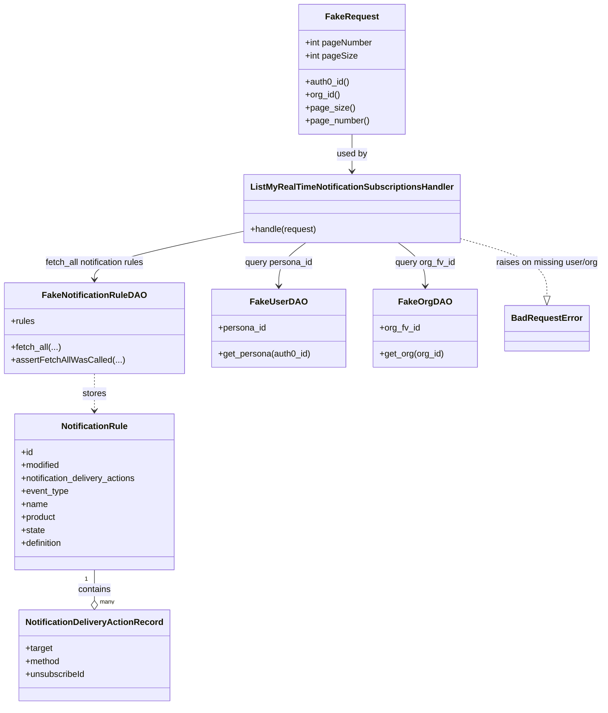
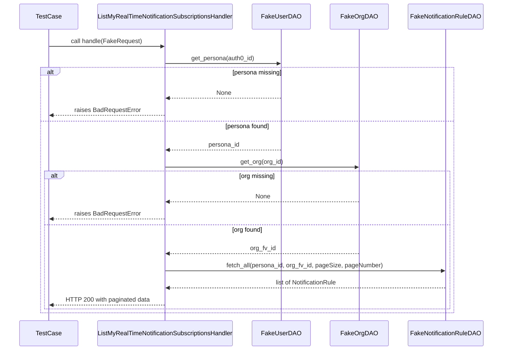

# Diagram: common/subscription_service/subscription_service_tests/unit/test_list_my_real_time_notification_subscriptions_handler.py

> Auto-generated by Obscura crawlers

## Diagram 1

### SVG

<svg id="container" width="1087.4375" xmlns="http://www.w3.org/2000/svg" class="classDiagram" height="1302" viewBox="0 0 1087.4375 1302" role="graphics-document document" aria-roledescription="class"><g><defs><marker id="container_class-aggregationStart" class="marker aggregation class" refX="18" refY="7" markerWidth="190" markerHeight="240" orient="auto"><path d="M 18,7 L9,13 L1,7 L9,1 Z"></path></marker></defs><defs><marker id="container_class-aggregationEnd" class="marker aggregation class" refX="1" refY="7" markerWidth="20" markerHeight="28" orient="auto"><path d="M 18,7 L9,13 L1,7 L9,1 Z"></path></marker></defs><defs><marker id="container_class-extensionStart" class="marker extension class" refX="18" refY="7" markerWidth="190" markerHeight="240" orient="auto"><path d="M 1,7 L18,13 V 1 Z"></path></marker></defs><defs><marker id="container_class-extensionEnd" class="marker extension class" refX="1" refY="7" markerWidth="20" markerHeight="28" orient="auto"><path d="M 1,1 V 13 L18,7 Z"></path></marker></defs><defs><marker id="container_class-compositionStart" class="marker composition class" refX="18" refY="7" markerWidth="190" markerHeight="240" orient="auto"><path d="M 18,7 L9,13 L1,7 L9,1 Z"></path></marker></defs><defs><marker id="container_class-compositionEnd" class="marker composition class" refX="1" refY="7" markerWidth="20" markerHeight="28" orient="auto"><path d="M 18,7 L9,13 L1,7 L9,1 Z"></path></marker></defs><defs><marker id="container_class-dependencyStart" class="marker dependency class" refX="6" refY="7" markerWidth="190" markerHeight="240" orient="auto"><path d="M 5,7 L9,13 L1,7 L9,1 Z"></path></marker></defs><defs><marker id="container_class-dependencyEnd" class="marker dependency class" refX="13" refY="7" markerWidth="20" markerHeight="28" orient="auto"><path d="M 18,7 L9,13 L14,7 L9,1 Z"></path></marker></defs><defs><marker id="container_class-lollipopStart" class="marker lollipop class" refX="13" refY="7" markerWidth="190" markerHeight="240" orient="auto"><circle stroke="black" fill="transparent" cx="7" cy="7" r="6"></circle></marker></defs><defs><marker id="container_class-lollipopEnd" class="marker lollipop class" refX="1" refY="7" markerWidth="190" markerHeight="240" orient="auto"><circle stroke="black" fill="transparent" cx="7" cy="7" r="6"></circle></marker></defs><g class="root"><g class="clusters"></g><g class="edgePaths"><path d="M632.867,248L632.867,254.167C632.867,260.333,632.867,272.667,632.867,284C632.867,295.333,632.867,305.667,632.867,310.833L632.867,316" id="id_FakeRequest_ListMyRealTimeNotificationSubscriptionsHandler_1" class="edge-thickness-normal edge-pattern-solid relation" style=";;;" data-edge="true" data-et="edge" data-id="id_FakeRequest_ListMyRealTimeNotificationSubscriptionsHandler_1" data-points="W3sieCI6NjMyLjg2NzE4NzUsInkiOjI0OH0seyJ4Ijo2MzIuODY3MTg3NSwieSI6Mjg1fSx7IngiOjYzMi44NjcxODc1LCJ5IjozMjJ9XQ==" marker-end="url(#container_class-dependencyEnd)"></path><path d="M549.038,448L540.832,454.167C532.627,460.333,516.216,472.667,508.01,486C499.805,499.333,499.805,513.667,499.805,520.833L499.805,528" id="id_ListMyRealTimeNotificationSubscriptionsHandler_FakeUserDAO_2" class="edge-thickness-normal edge-pattern-solid relation" style=";;;" data-edge="true" data-et="edge" data-id="id_ListMyRealTimeNotificationSubscriptionsHandler_FakeUserDAO_2" data-points="W3sieCI6NTQ5LjAzNzgxMjUsInkiOjQ0OH0seyJ4Ijo0OTkuODA0Njg3NSwieSI6NDg1fSx7IngiOjQ5OS44MDQ2ODc1LCJ5Ijo1MzR9XQ==" marker-end="url(#container_class-dependencyEnd)"></path><path d="M716.697,448L724.902,454.167C733.108,460.333,749.519,472.667,757.724,486C765.93,499.333,765.93,513.667,765.93,520.833L765.93,528" id="id_ListMyRealTimeNotificationSubscriptionsHandler_FakeOrgDAO_3" class="edge-thickness-normal edge-pattern-solid relation" style=";;;" data-edge="true" data-et="edge" data-id="id_ListMyRealTimeNotificationSubscriptionsHandler_FakeOrgDAO_3" data-points="W3sieCI6NzE2LjY5NjU2MjUsInkiOjQ0OH0seyJ4Ijo3NjUuOTI5Njg3NSwieSI6NDg1fSx7IngiOjc2NS45Mjk2ODc1LCJ5Ijo1MzR9XQ==" marker-end="url(#container_class-dependencyEnd)"></path><path d="M441.203,426.204L395.62,436.003C350.036,445.802,258.87,465.401,213.286,480.367C167.703,495.333,167.703,505.667,167.703,510.833L167.703,516" id="id_ListMyRealTimeNotificationSubscriptionsHandler_FakeNotificationRuleDAO_4" class="edge-thickness-normal edge-pattern-solid relation" style=";;;" data-edge="true" data-et="edge" data-id="id_ListMyRealTimeNotificationSubscriptionsHandler_FakeNotificationRuleDAO_4" data-points="W3sieCI6NDQxLjIwMzEyNSwieSI6NDI2LjIwMzU0MDQxNzUyNzR9LHsieCI6MTY3LjcwMzEyNSwieSI6NDg1fSx7IngiOjE2Ny43MDMxMjUsInkiOjUyMn1d" marker-end="url(#container_class-dependencyEnd)"></path><path d="M167.703,1052L167.703,1058.167C167.703,1064.333,167.703,1076.667,167.703,1086.125C167.703,1095.583,167.703,1102.167,167.703,1105.458L167.703,1108.75" id="id_NotificationRule_NotificationDeliveryActionRecord_5" class="edge-thickness-normal edge-pattern-solid relation" style=";;;" data-edge="true" data-et="edge" data-id="id_NotificationRule_NotificationDeliveryActionRecord_5" data-points="W3sieCI6MTY3LjcwMzEyNSwieSI6MTA1Mn0seyJ4IjoxNjcuNzAzMTI1LCJ5IjoxMDg5fSx7IngiOjE2Ny43MDMxMjUsInkiOjExMjZ9XQ==" marker-end="url(#container_class-aggregationEnd)"></path><path d="M167.703,690L167.703,696.167C167.703,702.333,167.703,714.667,167.703,726C167.703,737.333,167.703,747.667,167.703,752.833L167.703,758" id="id_FakeNotificationRuleDAO_NotificationRule_6" class="edge-thickness-normal edge-pattern-dashed relation" style=";;;" data-edge="true" data-et="edge" data-id="id_FakeNotificationRuleDAO_NotificationRule_6" data-points="W3sieCI6MTY3LjcwMzEyNSwieSI6NjkwfSx7IngiOjE2Ny43MDMxMjUsInkiOjcyN30seyJ4IjoxNjcuNzAzMTI1LCJ5Ijo3NjR9XQ==" marker-end="url(#container_class-dependencyEnd)"></path><path d="M824.531,439.594L851.099,447.162C877.667,454.729,930.802,469.865,957.37,487.724C983.938,505.583,983.938,526.167,983.938,536.458L983.938,546.75" id="id_ListMyRealTimeNotificationSubscriptionsHandler_BadRequestError_7" class="edge-thickness-normal edge-pattern-dashed relation" style=";;;" data-edge="true" data-et="edge" data-id="id_ListMyRealTimeNotificationSubscriptionsHandler_BadRequestError_7" data-points="W3sieCI6ODI0LjUzMTI1LCJ5Ijo0MzkuNTk0MjA5NjcxMzE3Nn0seyJ4Ijo5ODMuOTM3NSwieSI6NDg1fSx7IngiOjk4My45Mzc1LCJ5Ijo1NjR9XQ==" marker-end="url(#container_class-extensionEnd)"></path></g><g class="edgeLabels"><g class="edgeLabel" transform="translate(632.8671875, 285)"><g class="label" data-id="id_FakeRequest_ListMyRealTimeNotificationSubscriptionsHandler_1" transform="translate(-28.3125, -12)"><foreignObject width="56.625" height="24">

used by

</foreignObject></g></g><g class="edgeLabel" transform="translate(499.8046875, 485)"><g class="label" data-id="id_ListMyRealTimeNotificationSubscriptionsHandler_FakeUserDAO_2" transform="translate(-63.6796875, -12)"><foreignObject width="127.359375" height="24">

query persona_id

</foreignObject></g></g><g class="edgeLabel" transform="translate(765.9296875, 485)"><g class="label" data-id="id_ListMyRealTimeNotificationSubscriptionsHandler_FakeOrgDAO_3" transform="translate(-56.359375, -12)"><foreignObject width="112.71875" height="24">

query org_fv_id

</foreignObject></g></g><g class="edgeLabel" transform="translate(167.703125, 485)"><g class="label" data-id="id_ListMyRealTimeNotificationSubscriptionsHandler_FakeNotificationRuleDAO_4" transform="translate(-95.2890625, -12)"><foreignObject width="190.578125" height="24">

fetch_all notification rules

</foreignObject></g></g><g class="edgeLabel" transform="translate(167.703125, 1089)"><g class="label" data-id="id_NotificationRule_NotificationDeliveryActionRecord_5" transform="translate(-30.890625, -12)"><foreignObject width="61.78125" height="24">

contains

</foreignObject></g></g><g class="edgeLabel" transform="translate(167.703125, 727)"><g class="label" data-id="id_FakeNotificationRuleDAO_NotificationRule_6" transform="translate(-22.125, -12)"><foreignObject width="44.25" height="24">

stores

</foreignObject></g></g><g class="edgeLabel" transform="translate(983.9375, 485)"><g class="label" data-id="id_ListMyRealTimeNotificationSubscriptionsHandler_BadRequestError_7" transform="translate(-95.5, -12)"><foreignObject width="191" height="24">

raises on missing user/org

</foreignObject></g></g><g class="edgeTerminals" transform="translate(152.70312750000014, 1069.500002142857)"><g class="inner" transform="translate(0, 0)"><foreignObject style="width: 9px; height: 12px;">
1
</foreignObject></g></g><g class="edgeTerminals" transform="translate(177.70312749999985, 1103.500002142857)"><g class="inner" transform="translate(0, 0)"></g><foreignObject style="width: 36px; height: 12px;">
many
</foreignObject></g></g><g class="nodes"><g class="node default" id="classId-FakeRequest-0" transform="translate(632.8671875, 128)"><g class="basic label-container"><path d="M-97.71484375 -120 L97.71484375 -120 L97.71484375 120 L-97.71484375 120" stroke="none" stroke-width="0" fill="#ECECFF" style=""></path><path d="M-97.71484375 -120 C-20.97320344589066 -120, 55.76843685821868 -120, 97.71484375 -120 M-97.71484375 -120 C-33.312030055175 -120, 31.09078363965 -120, 97.71484375 -120 M97.71484375 -120 C97.71484375 -54.18628378801327, 97.71484375 11.62743242397346, 97.71484375 120 M97.71484375 -120 C97.71484375 -33.968766667562676, 97.71484375 52.06246666487465, 97.71484375 120 M97.71484375 120 C44.68943475408392 120, -8.335974241832162 120, -97.71484375 120 M97.71484375 120 C36.36523001742804 120, -24.98438371514392 120, -97.71484375 120 M-97.71484375 120 C-97.71484375 63.34133091723757, -97.71484375 6.682661834475141, -97.71484375 -120 M-97.71484375 120 C-97.71484375 28.580278503572742, -97.71484375 -62.839442992854515, -97.71484375 -120" stroke="#9370DB" stroke-width="1.3" fill="none" stroke-dasharray="0 0" style=""></path></g><g class="annotation-group text" transform="translate(0, -96)"></g><g class="label-group text" transform="translate(-46.5078125, -96)"><g class="label" style="font-weight: bolder" transform="translate(0,-12)"><foreignObject width="93.015625" height="24">

FakeRequest

</foreignObject></g></g><g class="members-group text" transform="translate(-85.71484375, -48)"><g class="label" style="" transform="translate(0,-12)"><foreignObject width="124.921875" height="24">

+int pageNumber

</foreignObject></g><g class="label" style="" transform="translate(0,12)"><foreignObject width="95.40625" height="24">

+int pageSize

</foreignObject></g></g><g class="methods-group text" transform="translate(-85.71484375, 24)"><g class="label" style="" transform="translate(0,-12)"><foreignObject width="82.140625" height="24">

+auth0_id()

</foreignObject></g><g class="label" style="" transform="translate(0,12)"><foreignObject width="64.421875" height="24">

+org_id()

</foreignObject></g><g class="label" style="" transform="translate(0,36)"><foreignObject width="88.609375" height="24">

+page_size()

</foreignObject></g><g class="label" style="" transform="translate(0,60)"><foreignObject width="117.828125" height="24">

+page_number()

</foreignObject></g></g><g class="divider" style=""><path d="M-97.71484375 -72 C-36.64055320981645 -72, 24.433737330367094 -72, 97.71484375 -72 M-97.71484375 -72 C-30.058752919714607 -72, 37.597337910570786 -72, 97.71484375 -72" stroke="#9370DB" stroke-width="1.3" fill="none" stroke-dasharray="0 0" style=""></path></g><g class="divider" style=""><path d="M-97.71484375 0 C-55.180178497560576 0, -12.645513245121151 0, 97.71484375 0 M-97.71484375 0 C-51.986081300723285 0, -6.25731885144657 0, 97.71484375 0" stroke="#9370DB" stroke-width="1.3" fill="none" stroke-dasharray="0 0" style=""></path></g></g><g class="node default" id="classId-NotificationRule-1" transform="translate(167.703125, 908)"><g class="basic label-container"><path d="M-150.48046875 -144 L150.48046875 -144 L150.48046875 144 L-150.48046875 144" stroke="none" stroke-width="0" fill="#ECECFF" style=""></path><path d="M-150.48046875 -144 C-48.094379344492864 -144, 54.29171006101427 -144, 150.48046875 -144 M-150.48046875 -144 C-57.48023727753966 -144, 35.519994194920685 -144, 150.48046875 -144 M150.48046875 -144 C150.48046875 -84.27498222334356, 150.48046875 -24.5499644466871, 150.48046875 144 M150.48046875 -144 C150.48046875 -61.32620813178232, 150.48046875 21.347583736435354, 150.48046875 144 M150.48046875 144 C58.47100863784897 144, -33.538451474302065 144, -150.48046875 144 M150.48046875 144 C60.756951183405334 144, -28.96656638318933 144, -150.48046875 144 M-150.48046875 144 C-150.48046875 43.07384250402525, -150.48046875 -57.8523149919495, -150.48046875 -144 M-150.48046875 144 C-150.48046875 78.87294927566467, -150.48046875 13.745898551329333, -150.48046875 -144" stroke="#9370DB" stroke-width="1.3" fill="none" stroke-dasharray="0 0" style=""></path></g><g class="annotation-group text" transform="translate(0, -120)"></g><g class="label-group text" transform="translate(-59.1484375, -120)"><g class="label" style="font-weight: bolder" transform="translate(0,-12)"><foreignObject width="118.296875" height="24">

NotificationRule

</foreignObject></g></g><g class="members-group text" transform="translate(-138.48046875, -72)"><g class="label" style="" transform="translate(0,-12)"><foreignObject width="22.078125" height="24">

+id

</foreignObject></g><g class="label" style="" transform="translate(0,12)"><foreignObject width="72.609375" height="24">

+modified

</foreignObject></g><g class="label" style="" transform="translate(0,36)"><foreignObject width="217.8125" height="24">

+notification_delivery_actions

</foreignObject></g><g class="label" style="" transform="translate(0,60)"><foreignObject width="88.125" height="24">

+event_type

</foreignObject></g><g class="label" style="" transform="translate(0,84)"><foreignObject width="48.5" height="24">

+name

</foreignObject></g><g class="label" style="" transform="translate(0,108)"><foreignObject width="64.84375" height="24">

+product

</foreignObject></g><g class="label" style="" transform="translate(0,132)"><foreignObject width="44.09375" height="24">

+state

</foreignObject></g><g class="label" style="" transform="translate(0,156)"><foreignObject width="78.375" height="24">

+definition

</foreignObject></g></g><g class="methods-group text" transform="translate(-138.48046875, 144)"></g><g class="divider" style=""><path d="M-150.48046875 -96 C-89.65630517270299 -96, -28.832141595405986 -96, 150.48046875 -96 M-150.48046875 -96 C-66.21117705584423 -96, 18.058114638311537 -96, 150.48046875 -96" stroke="#9370DB" stroke-width="1.3" fill="none" stroke-dasharray="0 0" style=""></path></g><g class="divider" style=""><path d="M-150.48046875 120 C-51.78325142004705 120, 46.9139659099059 120, 150.48046875 120 M-150.48046875 120 C-30.55549656095576 120, 89.36947562808848 120, 150.48046875 120" stroke="#9370DB" stroke-width="1.3" fill="none" stroke-dasharray="0 0" style=""></path></g></g><g class="node default" id="classId-NotificationDeliveryActionRecord-2" transform="translate(167.703125, 1210)"><g class="basic label-container"><path d="M-133.4765625 -84 L133.4765625 -84 L133.4765625 84 L-133.4765625 84" stroke="none" stroke-width="0" fill="#ECECFF" style=""></path><path d="M-133.4765625 -84 C-55.06345177352941 -84, 23.349658952941184 -84, 133.4765625 -84 M-133.4765625 -84 C-34.473109651422305 -84, 64.53034319715539 -84, 133.4765625 -84 M133.4765625 -84 C133.4765625 -28.087561274711206, 133.4765625 27.82487745057759, 133.4765625 84 M133.4765625 -84 C133.4765625 -40.081208667027475, 133.4765625 3.8375826659450496, 133.4765625 84 M133.4765625 84 C61.08113945886164 84, -11.314283582276715 84, -133.4765625 84 M133.4765625 84 C64.62837704552875 84, -4.219808408942498 84, -133.4765625 84 M-133.4765625 84 C-133.4765625 29.767664486249153, -133.4765625 -24.464671027501694, -133.4765625 -84 M-133.4765625 84 C-133.4765625 23.943076223025763, -133.4765625 -36.113847553948474, -133.4765625 -84" stroke="#9370DB" stroke-width="1.3" fill="none" stroke-dasharray="0 0" style=""></path></g><g class="annotation-group text" transform="translate(0, -60)"></g><g class="label-group text" transform="translate(-121.4765625, -60)"><g class="label" style="font-weight: bolder" transform="translate(0,-12)"><foreignObject width="242.953125" height="24">

NotificationDeliveryActionRecord

</foreignObject></g></g><g class="members-group text" transform="translate(-121.4765625, -12)"><g class="label" style="" transform="translate(0,-12)"><foreignObject width="50.78125" height="24">

+target

</foreignObject></g><g class="label" style="" transform="translate(0,12)"><foreignObject width="64.484375" height="24">

+method

</foreignObject></g><g class="label" style="" transform="translate(0,36)"><foreignObject width="111.28125" height="24">

+unsubscribeId

</foreignObject></g></g><g class="methods-group text" transform="translate(-121.4765625, 84)"></g><g class="divider" style=""><path d="M-133.4765625 -36 C-45.853865613723755 -36, 41.76883127255249 -36, 133.4765625 -36 M-133.4765625 -36 C-32.352815413218806 -36, 68.77093167356239 -36, 133.4765625 -36" stroke="#9370DB" stroke-width="1.3" fill="none" stroke-dasharray="0 0" style=""></path></g><g class="divider" style=""><path d="M-133.4765625 60 C-76.69748301776087 60, -19.918403535521747 60, 133.4765625 60 M-133.4765625 60 C-69.9753659483253 60, -6.474169396650595 60, 133.4765625 60" stroke="#9370DB" stroke-width="1.3" fill="none" stroke-dasharray="0 0" style=""></path></g></g><g class="node default" id="classId-ListMyRealTimeNotificationSubscriptionsHandler-3" transform="translate(632.8671875, 385)"><g class="basic label-container"><path d="M-191.6640625 -63 L191.6640625 -63 L191.6640625 63 L-191.6640625 63" stroke="none" stroke-width="0" fill="#ECECFF" style=""></path><path d="M-191.6640625 -63 C-112.50304588957324 -63, -33.34202927914649 -63, 191.6640625 -63 M-191.6640625 -63 C-101.10432452061109 -63, -10.544586541222174 -63, 191.6640625 -63 M191.6640625 -63 C191.6640625 -12.955318360314436, 191.6640625 37.08936327937113, 191.6640625 63 M191.6640625 -63 C191.6640625 -31.751951820366116, 191.6640625 -0.5039036407322328, 191.6640625 63 M191.6640625 63 C98.10735023455527 63, 4.550637969110539 63, -191.6640625 63 M191.6640625 63 C45.54220757882342 63, -100.57964734235316 63, -191.6640625 63 M-191.6640625 63 C-191.6640625 32.16974769600327, -191.6640625 1.3394953920065333, -191.6640625 -63 M-191.6640625 63 C-191.6640625 25.041215093524556, -191.6640625 -12.917569812950887, -191.6640625 -63" stroke="#9370DB" stroke-width="1.3" fill="none" stroke-dasharray="0 0" style=""></path></g><g class="annotation-group text" transform="translate(0, -39)"></g><g class="label-group text" transform="translate(-179.6640625, -39)"><g class="label" style="font-weight: bolder" transform="translate(0,-12)"><foreignObject width="359.328125" height="24">

ListMyRealTimeNotificationSubscriptionsHandler

</foreignObject></g></g><g class="members-group text" transform="translate(-179.6640625, 9)"></g><g class="methods-group text" transform="translate(-179.6640625, 39)"><g class="label" style="" transform="translate(0,-12)"><foreignObject width="123.96875" height="24">

+handle(request)

</foreignObject></g></g><g class="divider" style=""><path d="M-191.6640625 -15 C-64.57974975794 -15, 62.504562984120014 -15, 191.6640625 -15 M-191.6640625 -15 C-64.26711150774412 -15, 63.12983948451176 -15, 191.6640625 -15" stroke="#9370DB" stroke-width="1.3" fill="none" stroke-dasharray="0 0" style=""></path></g><g class="divider" style=""><path d="M-191.6640625 9 C-41.364028056110214 9, 108.93600638777957 9, 191.6640625 9 M-191.6640625 9 C-44.953999616524726 9, 101.75606326695055 9, 191.6640625 9" stroke="#9370DB" stroke-width="1.3" fill="none" stroke-dasharray="0 0" style=""></path></g></g><g class="node default" id="classId-FakeNotificationRuleDAO-4" transform="translate(167.703125, 606)"><g class="basic label-container"><path d="M-159.703125 -84 L159.703125 -84 L159.703125 84 L-159.703125 84" stroke="none" stroke-width="0" fill="#ECECFF" style=""></path><path d="M-159.703125 -84 C-51.10853453568873 -84, 57.486055928622534 -84, 159.703125 -84 M-159.703125 -84 C-86.99619031896131 -84, -14.289255637922622 -84, 159.703125 -84 M159.703125 -84 C159.703125 -25.003403155920957, 159.703125 33.99319368815809, 159.703125 84 M159.703125 -84 C159.703125 -16.98701648976541, 159.703125 50.02596702046918, 159.703125 84 M159.703125 84 C58.24431793929935 84, -43.2144891214013 84, -159.703125 84 M159.703125 84 C41.14313204100684 84, -77.41686091798633 84, -159.703125 84 M-159.703125 84 C-159.703125 37.5647710631134, -159.703125 -8.870457873773205, -159.703125 -84 M-159.703125 84 C-159.703125 17.86277152949792, -159.703125 -48.27445694100416, -159.703125 -84" stroke="#9370DB" stroke-width="1.3" fill="none" stroke-dasharray="0 0" style=""></path></g><g class="annotation-group text" transform="translate(0, -60)"></g><g class="label-group text" transform="translate(-90.96875, -60)"><g class="label" style="font-weight: bolder" transform="translate(0,-12)"><foreignObject width="181.9375" height="24">

FakeNotificationRuleDAO

</foreignObject></g></g><g class="members-group text" transform="translate(-147.703125, -12)"><g class="label" style="" transform="translate(0,-12)"><foreignObject width="44.28125" height="24">

+rules

</foreignObject></g></g><g class="methods-group text" transform="translate(-147.703125, 36)"><g class="label" style="" transform="translate(0,-12)"><foreignObject width="92.046875" height="24">

+fetch_all(...)

</foreignObject></g><g class="label" style="" transform="translate(0,12)"><foreignObject width="204.4375" height="24">

+assertFetchAllWasCalled(...)

</foreignObject></g></g><g class="divider" style=""><path d="M-159.703125 -36 C-56.98931661624984 -36, 45.724491767500325 -36, 159.703125 -36 M-159.703125 -36 C-44.39792503624783 -36, 70.90727492750435 -36, 159.703125 -36" stroke="#9370DB" stroke-width="1.3" fill="none" stroke-dasharray="0 0" style=""></path></g><g class="divider" style=""><path d="M-159.703125 12 C-52.16575193822011 12, 55.37162112355978 12, 159.703125 12 M-159.703125 12 C-82.33596011717154 12, -4.968795234343077 12, 159.703125 12" stroke="#9370DB" stroke-width="1.3" fill="none" stroke-dasharray="0 0" style=""></path></g></g><g class="node default" id="classId-FakeUserDAO-5" transform="translate(499.8046875, 606)"><g class="basic label-container"><path d="M-122.3984375 -72 L122.3984375 -72 L122.3984375 72 L-122.3984375 72" stroke="none" stroke-width="0" fill="#ECECFF" style=""></path><path d="M-122.3984375 -72 C-68.38663652401152 -72, -14.374835548023057 -72, 122.3984375 -72 M-122.3984375 -72 C-38.57103109267504 -72, 45.256375314649915 -72, 122.3984375 -72 M122.3984375 -72 C122.3984375 -23.16388284723859, 122.3984375 25.67223430552282, 122.3984375 72 M122.3984375 -72 C122.3984375 -31.291098825815233, 122.3984375 9.417802348369534, 122.3984375 72 M122.3984375 72 C51.586711889588955 72, -19.22501372082209 72, -122.3984375 72 M122.3984375 72 C63.20528299736419 72, 4.012128494728387 72, -122.3984375 72 M-122.3984375 72 C-122.3984375 17.51723261096761, -122.3984375 -36.96553477806478, -122.3984375 -72 M-122.3984375 72 C-122.3984375 17.842530878883444, -122.3984375 -36.31493824223311, -122.3984375 -72" stroke="#9370DB" stroke-width="1.3" fill="none" stroke-dasharray="0 0" style=""></path></g><g class="annotation-group text" transform="translate(0, -48)"></g><g class="label-group text" transform="translate(-48.484375, -48)"><g class="label" style="font-weight: bolder" transform="translate(0,-12)"><foreignObject width="96.96875" height="24">

FakeUserDAO

</foreignObject></g></g><g class="members-group text" transform="translate(-110.3984375, 0)"><g class="label" style="" transform="translate(0,-12)"><foreignObject width="89.453125" height="24">

+persona_id

</foreignObject></g></g><g class="methods-group text" transform="translate(-110.3984375, 48)"><g class="label" style="" transform="translate(0,-12)"><foreignObject width="172.3125" height="24">

+get_persona(auth0_id)

</foreignObject></g></g><g class="divider" style=""><path d="M-122.3984375 -24 C-32.10597778276036 -24, 58.186481934479275 -24, 122.3984375 -24 M-122.3984375 -24 C-46.17427191940622 -24, 30.049893661187554 -24, 122.3984375 -24" stroke="#9370DB" stroke-width="1.3" fill="none" stroke-dasharray="0 0" style=""></path></g><g class="divider" style=""><path d="M-122.3984375 24 C-29.598224485092643 24, 63.20198852981471 24, 122.3984375 24 M-122.3984375 24 C-55.5921859146209 24, 11.214065670758202 24, 122.3984375 24" stroke="#9370DB" stroke-width="1.3" fill="none" stroke-dasharray="0 0" style=""></path></g></g><g class="node default" id="classId-FakeOrgDAO-6" transform="translate(765.9296875, 606)"><g class="basic label-container"><path d="M-93.7265625 -72 L93.7265625 -72 L93.7265625 72 L-93.7265625 72" stroke="none" stroke-width="0" fill="#ECECFF" style=""></path><path d="M-93.7265625 -72 C-46.157492786514915 -72, 1.4115769269701701 -72, 93.7265625 -72 M-93.7265625 -72 C-55.30779698947397 -72, -16.889031478947942 -72, 93.7265625 -72 M93.7265625 -72 C93.7265625 -36.84900041859632, 93.7265625 -1.6980008371926374, 93.7265625 72 M93.7265625 -72 C93.7265625 -36.38997795231976, 93.7265625 -0.7799559046395217, 93.7265625 72 M93.7265625 72 C38.497549314295185 72, -16.73146387140963 72, -93.7265625 72 M93.7265625 72 C52.15679141516763 72, 10.587020330335264 72, -93.7265625 72 M-93.7265625 72 C-93.7265625 30.037473519524298, -93.7265625 -11.925052960951405, -93.7265625 -72 M-93.7265625 72 C-93.7265625 16.675086365105948, -93.7265625 -38.649827269788105, -93.7265625 -72" stroke="#9370DB" stroke-width="1.3" fill="none" stroke-dasharray="0 0" style=""></path></g><g class="annotation-group text" transform="translate(0, -48)"></g><g class="label-group text" transform="translate(-44.875, -48)"><g class="label" style="font-weight: bolder" transform="translate(0,-12)"><foreignObject width="89.75" height="24">

FakeOrgDAO

</foreignObject></g></g><g class="members-group text" transform="translate(-81.7265625, 0)"><g class="label" style="" transform="translate(0,-12)"><foreignObject width="74.8125" height="24">

+org_fv_id

</foreignObject></g></g><g class="methods-group text" transform="translate(-81.7265625, 48)"><g class="label" style="" transform="translate(0,-12)"><foreignObject width="118.578125" height="24">

+get_org(org_id)

</foreignObject></g></g><g class="divider" style=""><path d="M-93.7265625 -24 C-28.532936222491458 -24, 36.660690055017085 -24, 93.7265625 -24 M-93.7265625 -24 C-30.993326514775056 -24, 31.739909470449888 -24, 93.7265625 -24" stroke="#9370DB" stroke-width="1.3" fill="none" stroke-dasharray="0 0" style=""></path></g><g class="divider" style=""><path d="M-93.7265625 24 C-35.65864154135635 24, 22.409279417287294 24, 93.7265625 24 M-93.7265625 24 C-54.033376380716696 24, -14.340190261433392 24, 93.7265625 24" stroke="#9370DB" stroke-width="1.3" fill="none" stroke-dasharray="0 0" style=""></path></g></g><g class="node default" id="classId-BadRequestError-7" transform="translate(983.9375, 606)"><g class="basic label-container"><path d="M-74.28125 -42 L74.28125 -42 L74.28125 42 L-74.28125 42" stroke="none" stroke-width="0" fill="#ECECFF" style=""></path><path d="M-74.28125 -42 C-21.312025151994945 -42, 31.65719969601011 -42, 74.28125 -42 M-74.28125 -42 C-20.06841455222822 -42, 34.14442089554356 -42, 74.28125 -42 M74.28125 -42 C74.28125 -9.677976041353887, 74.28125 22.644047917292227, 74.28125 42 M74.28125 -42 C74.28125 -17.340113469579407, 74.28125 7.319773060841186, 74.28125 42 M74.28125 42 C23.845482617273753 42, -26.590284765452495 42, -74.28125 42 M74.28125 42 C18.849119334667293 42, -36.583011330665414 42, -74.28125 42 M-74.28125 42 C-74.28125 18.641588241205213, -74.28125 -4.7168235175895745, -74.28125 -42 M-74.28125 42 C-74.28125 19.062342229123804, -74.28125 -3.875315541752393, -74.28125 -42" stroke="#9370DB" stroke-width="1.3" fill="none" stroke-dasharray="0 0" style=""></path></g><g class="annotation-group text" transform="translate(0, -18)"></g><g class="label-group text" transform="translate(-62.28125, -18)"><g class="label" style="font-weight: bolder" transform="translate(0,-12)"><foreignObject width="124.5625" height="24">

BadRequestError

</foreignObject></g></g><g class="members-group text" transform="translate(-62.28125, 30)"></g><g class="methods-group text" transform="translate(-62.28125, 60)"></g><g class="divider" style=""><path d="M-74.28125 6 C-40.7889421916013 6, -7.296634383202601 6, 74.28125 6 M-74.28125 6 C-22.450864292708793 6, 29.379521414582413 6, 74.28125 6" stroke="#9370DB" stroke-width="1.3" fill="none" stroke-dasharray="0 0" style=""></path></g><g class="divider" style=""><path d="M-74.28125 24 C-20.344461370156182 24, 33.592327259687636 24, 74.28125 24 M-74.28125 24 C-25.139335495888346 24, 24.002579008223307 24, 74.28125 24" stroke="#9370DB" stroke-width="1.3" fill="none" stroke-dasharray="0 0" style=""></path></g></g></g></g></g></svg>

## Diagram 2

### SVG

<svg id="container" width="1326" xmlns="http://www.w3.org/2000/svg" height="947" viewBox="-50 -10 1326 947" role="graphics-document document" aria-roledescription="sequence"><g><rect x="1026" y="861" fill="#eaeaea" stroke="#666" width="200" height="65" name="RuleDAO" rx="3" ry="3" class="actor actor-bottom"></rect><text x="1126" y="893.5" dominant-baseline="central" alignment-baseline="central" class="actor actor-box" style="text-anchor: middle; font-size: 16px; font-weight: 400;"><tspan x="1126" dy="0">FakeNotificationRuleDAO</tspan></text></g><g><rect x="826" y="861" fill="#eaeaea" stroke="#666" width="150" height="65" name="OrgDAO" rx="3" ry="3" class="actor actor-bottom"></rect><text x="901" y="893.5" dominant-baseline="central" alignment-baseline="central" class="actor actor-box" style="text-anchor: middle; font-size: 16px; font-weight: 400;"><tspan x="901" dy="0">FakeOrgDAO</tspan></text></g><g><rect x="626" y="861" fill="#eaeaea" stroke="#666" width="150" height="65" name="UserDAO" rx="3" ry="3" class="actor actor-bottom"></rect><text x="701" y="893.5" dominant-baseline="central" alignment-baseline="central" class="actor actor-box" style="text-anchor: middle; font-size: 16px; font-weight: 400;"><tspan x="701" dy="0">FakeUserDAO</tspan></text></g><g><rect x="200" y="861" fill="#eaeaea" stroke="#666" width="376" height="65" name="Handler" rx="3" ry="3" class="actor actor-bottom"></rect><text x="388" y="893.5" dominant-baseline="central" alignment-baseline="central" class="actor actor-box" style="text-anchor: middle; font-size: 16px; font-weight: 400;"><tspan x="388" dy="0">ListMyRealTimeNotificationSubscriptionsHandler</tspan></text></g><g><rect x="0" y="861" fill="#eaeaea" stroke="#666" width="150" height="65" name="Test" rx="3" ry="3" class="actor actor-bottom"></rect><text x="75" y="893.5" dominant-baseline="central" alignment-baseline="central" class="actor actor-box" style="text-anchor: middle; font-size: 16px; font-weight: 400;"><tspan x="75" dy="0">TestCase</tspan></text></g><g><line id="actor4" x1="1126" y1="65" x2="1126" y2="861" class="actor-line 200" stroke-width="0.5px" stroke="#999" name="RuleDAO"></line><g id="root-4"><rect x="1026" y="0" fill="#eaeaea" stroke="#666" width="200" height="65" name="RuleDAO" rx="3" ry="3" class="actor actor-top"></rect><text x="1126" y="32.5" dominant-baseline="central" alignment-baseline="central" class="actor actor-box" style="text-anchor: middle; font-size: 16px; font-weight: 400;"><tspan x="1126" dy="0">FakeNotificationRuleDAO</tspan></text></g></g><g><line id="actor3" x1="901" y1="65" x2="901" y2="861" class="actor-line 200" stroke-width="0.5px" stroke="#999" name="OrgDAO"></line><g id="root-3"><rect x="826" y="0" fill="#eaeaea" stroke="#666" width="150" height="65" name="OrgDAO" rx="3" ry="3" class="actor actor-top"></rect><text x="901" y="32.5" dominant-baseline="central" alignment-baseline="central" class="actor actor-box" style="text-anchor: middle; font-size: 16px; font-weight: 400;"><tspan x="901" dy="0">FakeOrgDAO</tspan></text></g></g><g><line id="actor2" x1="701" y1="65" x2="701" y2="861" class="actor-line 200" stroke-width="0.5px" stroke="#999" name="UserDAO"></line><g id="root-2"><rect x="626" y="0" fill="#eaeaea" stroke="#666" width="150" height="65" name="UserDAO" rx="3" ry="3" class="actor actor-top"></rect><text x="701" y="32.5" dominant-baseline="central" alignment-baseline="central" class="actor actor-box" style="text-anchor: middle; font-size: 16px; font-weight: 400;"><tspan x="701" dy="0">FakeUserDAO</tspan></text></g></g><g><line id="actor1" x1="388" y1="65" x2="388" y2="861" class="actor-line 200" stroke-width="0.5px" stroke="#999" name="Handler"></line><g id="root-1"><rect x="200" y="0" fill="#eaeaea" stroke="#666" width="376" height="65" name="Handler" rx="3" ry="3" class="actor actor-top"></rect><text x="388" y="32.5" dominant-baseline="central" alignment-baseline="central" class="actor actor-box" style="text-anchor: middle; font-size: 16px; font-weight: 400;"><tspan x="388" dy="0">ListMyRealTimeNotificationSubscriptionsHandler</tspan></text></g></g><g><line id="actor0" x1="75" y1="65" x2="75" y2="861" class="actor-line 200" stroke-width="0.5px" stroke="#999" name="Test"></line><g id="root-0"><rect x="0" y="0" fill="#eaeaea" stroke="#666" width="150" height="65" name="Test" rx="3" ry="3" class="actor actor-top"></rect><text x="75" y="32.5" dominant-baseline="central" alignment-baseline="central" class="actor actor-box" style="text-anchor: middle; font-size: 16px; font-weight: 400;"><tspan x="75" dy="0">TestCase</tspan></text></g></g><g></g><defs><symbol id="computer" width="24" height="24"><path transform="scale(.5)" d="M2 2v13h20v-13h-20zm18 11h-16v-9h16v9zm-10.228 6l.466-1h3.524l.467 1h-4.457zm14.228 3h-24l2-6h2.104l-1.33 4h18.45l-1.297-4h2.073l2 6zm-5-10h-14v-7h14v7z"></path></symbol></defs><defs><symbol id="database" fill-rule="evenodd" clip-rule="evenodd"><path transform="scale(.5)" d="M12.258.001l.256.004.255.005.253.008.251.01.249.012.247.015.246.016.242.019.241.02.239.023.236.024.233.027.231.028.229.031.225.032.223.034.22.036.217.038.214.04.211.041.208.043.205.045.201.046.198.048.194.05.191.051.187.053.183.054.18.056.175.057.172.059.168.06.163.061.16.063.155.064.15.066.074.033.073.033.071.034.07.034.069.035.068.035.067.035.066.035.064.036.064.036.062.036.06.036.06.037.058.037.058.037.055.038.055.038.053.038.052.038.051.039.05.039.048.039.047.039.045.04.044.04.043.04.041.04.04.041.039.041.037.041.036.041.034.041.033.042.032.042.03.042.029.042.027.042.026.043.024.043.023.043.021.043.02.043.018.044.017.043.015.044.013.044.012.044.011.045.009.044.007.045.006.045.004.045.002.045.001.045v17l-.001.045-.002.045-.004.045-.006.045-.007.045-.009.044-.011.045-.012.044-.013.044-.015.044-.017.043-.018.044-.02.043-.021.043-.023.043-.024.043-.026.043-.027.042-.029.042-.03.042-.032.042-.033.042-.034.041-.036.041-.037.041-.039.041-.04.041-.041.04-.043.04-.044.04-.045.04-.047.039-.048.039-.05.039-.051.039-.052.038-.053.038-.055.038-.055.038-.058.037-.058.037-.06.037-.06.036-.062.036-.064.036-.064.036-.066.035-.067.035-.068.035-.069.035-.07.034-.071.034-.073.033-.074.033-.15.066-.155.064-.16.063-.163.061-.168.06-.172.059-.175.057-.18.056-.183.054-.187.053-.191.051-.194.05-.198.048-.201.046-.205.045-.208.043-.211.041-.214.04-.217.038-.22.036-.223.034-.225.032-.229.031-.231.028-.233.027-.236.024-.239.023-.241.02-.242.019-.246.016-.247.015-.249.012-.251.01-.253.008-.255.005-.256.004-.258.001-.258-.001-.256-.004-.255-.005-.253-.008-.251-.01-.249-.012-.247-.015-.245-.016-.243-.019-.241-.02-.238-.023-.236-.024-.234-.027-.231-.028-.228-.031-.226-.032-.223-.034-.22-.036-.217-.038-.214-.04-.211-.041-.208-.043-.204-.045-.201-.046-.198-.048-.195-.05-.19-.051-.187-.053-.184-.054-.179-.056-.176-.057-.172-.059-.167-.06-.164-.061-.159-.063-.155-.064-.151-.066-.074-.033-.072-.033-.072-.034-.07-.034-.069-.035-.068-.035-.067-.035-.066-.035-.064-.036-.063-.036-.062-.036-.061-.036-.06-.037-.058-.037-.057-.037-.056-.038-.055-.038-.053-.038-.052-.038-.051-.039-.049-.039-.049-.039-.046-.039-.046-.04-.044-.04-.043-.04-.041-.04-.04-.041-.039-.041-.037-.041-.036-.041-.034-.041-.033-.042-.032-.042-.03-.042-.029-.042-.027-.042-.026-.043-.024-.043-.023-.043-.021-.043-.02-.043-.018-.044-.017-.043-.015-.044-.013-.044-.012-.044-.011-.045-.009-.044-.007-.045-.006-.045-.004-.045-.002-.045-.001-.045v-17l.001-.045.002-.045.004-.045.006-.045.007-.045.009-.044.011-.045.012-.044.013-.044.015-.044.017-.043.018-.044.02-.043.021-.043.023-.043.024-.043.026-.043.027-.042.029-.042.03-.042.032-.042.033-.042.034-.041.036-.041.037-.041.039-.041.04-.041.041-.04.043-.04.044-.04.046-.04.046-.039.049-.039.049-.039.051-.039.052-.038.053-.038.055-.038.056-.038.057-.037.058-.037.06-.037.061-.036.062-.036.063-.036.064-.036.066-.035.067-.035.068-.035.069-.035.07-.034.072-.034.072-.033.074-.033.151-.066.155-.064.159-.063.164-.061.167-.06.172-.059.176-.057.179-.056.184-.054.187-.053.19-.051.195-.05.198-.048.201-.046.204-.045.208-.043.211-.041.214-.04.217-.038.22-.036.223-.034.226-.032.228-.031.231-.028.234-.027.236-.024.238-.023.241-.02.243-.019.245-.016.247-.015.249-.012.251-.01.253-.008.255-.005.256-.004.258-.001.258.001zm-9.258 20.499v.01l.001.021.003.021.004.022.005.021.006.022.007.022.009.023.01.022.011.023.012.023.013.023.015.023.016.024.017.023.018.024.019.024.021.024.022.025.023.024.024.025.052.049.056.05.061.051.066.051.07.051.075.051.079.052.084.052.088.052.092.052.097.052.102.051.105.052.11.052.114.051.119.051.123.051.127.05.131.05.135.05.139.048.144.049.147.047.152.047.155.047.16.045.163.045.167.043.171.043.176.041.178.041.183.039.187.039.19.037.194.035.197.035.202.033.204.031.209.03.212.029.216.027.219.025.222.024.226.021.23.02.233.018.236.016.24.015.243.012.246.01.249.008.253.005.256.004.259.001.26-.001.257-.004.254-.005.25-.008.247-.011.244-.012.241-.014.237-.016.233-.018.231-.021.226-.021.224-.024.22-.026.216-.027.212-.028.21-.031.205-.031.202-.034.198-.034.194-.036.191-.037.187-.039.183-.04.179-.04.175-.042.172-.043.168-.044.163-.045.16-.046.155-.046.152-.047.148-.048.143-.049.139-.049.136-.05.131-.05.126-.05.123-.051.118-.052.114-.051.11-.052.106-.052.101-.052.096-.052.092-.052.088-.053.083-.051.079-.052.074-.052.07-.051.065-.051.06-.051.056-.05.051-.05.023-.024.023-.025.021-.024.02-.024.019-.024.018-.024.017-.024.015-.023.014-.024.013-.023.012-.023.01-.023.01-.022.008-.022.006-.022.006-.022.004-.022.004-.021.001-.021.001-.021v-4.127l-.077.055-.08.053-.083.054-.085.053-.087.052-.09.052-.093.051-.095.05-.097.05-.1.049-.102.049-.105.048-.106.047-.109.047-.111.046-.114.045-.115.045-.118.044-.12.043-.122.042-.124.042-.126.041-.128.04-.13.04-.132.038-.134.038-.135.037-.138.037-.139.035-.142.035-.143.034-.144.033-.147.032-.148.031-.15.03-.151.03-.153.029-.154.027-.156.027-.158.026-.159.025-.161.024-.162.023-.163.022-.165.021-.166.02-.167.019-.169.018-.169.017-.171.016-.173.015-.173.014-.175.013-.175.012-.177.011-.178.01-.179.008-.179.008-.181.006-.182.005-.182.004-.184.003-.184.002h-.37l-.184-.002-.184-.003-.182-.004-.182-.005-.181-.006-.179-.008-.179-.008-.178-.01-.176-.011-.176-.012-.175-.013-.173-.014-.172-.015-.171-.016-.17-.017-.169-.018-.167-.019-.166-.02-.165-.021-.163-.022-.162-.023-.161-.024-.159-.025-.157-.026-.156-.027-.155-.027-.153-.029-.151-.03-.15-.03-.148-.031-.146-.032-.145-.033-.143-.034-.141-.035-.14-.035-.137-.037-.136-.037-.134-.038-.132-.038-.13-.04-.128-.04-.126-.041-.124-.042-.122-.042-.12-.044-.117-.043-.116-.045-.113-.045-.112-.046-.109-.047-.106-.047-.105-.048-.102-.049-.1-.049-.097-.05-.095-.05-.093-.052-.09-.051-.087-.052-.085-.053-.083-.054-.08-.054-.077-.054v4.127zm0-5.654v.011l.001.021.003.021.004.021.005.022.006.022.007.022.009.022.01.022.011.023.012.023.013.023.015.024.016.023.017.024.018.024.019.024.021.024.022.024.023.025.024.024.052.05.056.05.061.05.066.051.07.051.075.052.079.051.084.052.088.052.092.052.097.052.102.052.105.052.11.051.114.051.119.052.123.05.127.051.131.05.135.049.139.049.144.048.147.048.152.047.155.046.16.045.163.045.167.044.171.042.176.042.178.04.183.04.187.038.19.037.194.036.197.034.202.033.204.032.209.03.212.028.216.027.219.025.222.024.226.022.23.02.233.018.236.016.24.014.243.012.246.01.249.008.253.006.256.003.259.001.26-.001.257-.003.254-.006.25-.008.247-.01.244-.012.241-.015.237-.016.233-.018.231-.02.226-.022.224-.024.22-.025.216-.027.212-.029.21-.03.205-.032.202-.033.198-.035.194-.036.191-.037.187-.039.183-.039.179-.041.175-.042.172-.043.168-.044.163-.045.16-.045.155-.047.152-.047.148-.048.143-.048.139-.05.136-.049.131-.05.126-.051.123-.051.118-.051.114-.052.11-.052.106-.052.101-.052.096-.052.092-.052.088-.052.083-.052.079-.052.074-.051.07-.052.065-.051.06-.05.056-.051.051-.049.023-.025.023-.024.021-.025.02-.024.019-.024.018-.024.017-.024.015-.023.014-.023.013-.024.012-.022.01-.023.01-.023.008-.022.006-.022.006-.022.004-.021.004-.022.001-.021.001-.021v-4.139l-.077.054-.08.054-.083.054-.085.052-.087.053-.09.051-.093.051-.095.051-.097.05-.1.049-.102.049-.105.048-.106.047-.109.047-.111.046-.114.045-.115.044-.118.044-.12.044-.122.042-.124.042-.126.041-.128.04-.13.039-.132.039-.134.038-.135.037-.138.036-.139.036-.142.035-.143.033-.144.033-.147.033-.148.031-.15.03-.151.03-.153.028-.154.028-.156.027-.158.026-.159.025-.161.024-.162.023-.163.022-.165.021-.166.02-.167.019-.169.018-.169.017-.171.016-.173.015-.173.014-.175.013-.175.012-.177.011-.178.009-.179.009-.179.007-.181.007-.182.005-.182.004-.184.003-.184.002h-.37l-.184-.002-.184-.003-.182-.004-.182-.005-.181-.007-.179-.007-.179-.009-.178-.009-.176-.011-.176-.012-.175-.013-.173-.014-.172-.015-.171-.016-.17-.017-.169-.018-.167-.019-.166-.02-.165-.021-.163-.022-.162-.023-.161-.024-.159-.025-.157-.026-.156-.027-.155-.028-.153-.028-.151-.03-.15-.03-.148-.031-.146-.033-.145-.033-.143-.033-.141-.035-.14-.036-.137-.036-.136-.037-.134-.038-.132-.039-.13-.039-.128-.04-.126-.041-.124-.042-.122-.043-.12-.043-.117-.044-.116-.044-.113-.046-.112-.046-.109-.046-.106-.047-.105-.048-.102-.049-.1-.049-.097-.05-.095-.051-.093-.051-.09-.051-.087-.053-.085-.052-.083-.054-.08-.054-.077-.054v4.139zm0-5.666v.011l.001.02.003.022.004.021.005.022.006.021.007.022.009.023.01.022.011.023.012.023.013.023.015.023.016.024.017.024.018.023.019.024.021.025.022.024.023.024.024.025.052.05.056.05.061.05.066.051.07.051.075.052.079.051.084.052.088.052.092.052.097.052.102.052.105.051.11.052.114.051.119.051.123.051.127.05.131.05.135.05.139.049.144.048.147.048.152.047.155.046.16.045.163.045.167.043.171.043.176.042.178.04.183.04.187.038.19.037.194.036.197.034.202.033.204.032.209.03.212.028.216.027.219.025.222.024.226.021.23.02.233.018.236.017.24.014.243.012.246.01.249.008.253.006.256.003.259.001.26-.001.257-.003.254-.006.25-.008.247-.01.244-.013.241-.014.237-.016.233-.018.231-.02.226-.022.224-.024.22-.025.216-.027.212-.029.21-.03.205-.032.202-.033.198-.035.194-.036.191-.037.187-.039.183-.039.179-.041.175-.042.172-.043.168-.044.163-.045.16-.045.155-.047.152-.047.148-.048.143-.049.139-.049.136-.049.131-.051.126-.05.123-.051.118-.052.114-.051.11-.052.106-.052.101-.052.096-.052.092-.052.088-.052.083-.052.079-.052.074-.052.07-.051.065-.051.06-.051.056-.05.051-.049.023-.025.023-.025.021-.024.02-.024.019-.024.018-.024.017-.024.015-.023.014-.024.013-.023.012-.023.01-.022.01-.023.008-.022.006-.022.006-.022.004-.022.004-.021.001-.021.001-.021v-4.153l-.077.054-.08.054-.083.053-.085.053-.087.053-.09.051-.093.051-.095.051-.097.05-.1.049-.102.048-.105.048-.106.048-.109.046-.111.046-.114.046-.115.044-.118.044-.12.043-.122.043-.124.042-.126.041-.128.04-.13.039-.132.039-.134.038-.135.037-.138.036-.139.036-.142.034-.143.034-.144.033-.147.032-.148.032-.15.03-.151.03-.153.028-.154.028-.156.027-.158.026-.159.024-.161.024-.162.023-.163.023-.165.021-.166.02-.167.019-.169.018-.169.017-.171.016-.173.015-.173.014-.175.013-.175.012-.177.01-.178.01-.179.009-.179.007-.181.006-.182.006-.182.004-.184.003-.184.001-.185.001-.185-.001-.184-.001-.184-.003-.182-.004-.182-.006-.181-.006-.179-.007-.179-.009-.178-.01-.176-.01-.176-.012-.175-.013-.173-.014-.172-.015-.171-.016-.17-.017-.169-.018-.167-.019-.166-.02-.165-.021-.163-.023-.162-.023-.161-.024-.159-.024-.157-.026-.156-.027-.155-.028-.153-.028-.151-.03-.15-.03-.148-.032-.146-.032-.145-.033-.143-.034-.141-.034-.14-.036-.137-.036-.136-.037-.134-.038-.132-.039-.13-.039-.128-.041-.126-.041-.124-.041-.122-.043-.12-.043-.117-.044-.116-.044-.113-.046-.112-.046-.109-.046-.106-.048-.105-.048-.102-.048-.1-.05-.097-.049-.095-.051-.093-.051-.09-.052-.087-.052-.085-.053-.083-.053-.08-.054-.077-.054v4.153zm8.74-8.179l-.257.004-.254.005-.25.008-.247.011-.244.012-.241.014-.237.016-.233.018-.231.021-.226.022-.224.023-.22.026-.216.027-.212.028-.21.031-.205.032-.202.033-.198.034-.194.036-.191.038-.187.038-.183.04-.179.041-.175.042-.172.043-.168.043-.163.045-.16.046-.155.046-.152.048-.148.048-.143.048-.139.049-.136.05-.131.05-.126.051-.123.051-.118.051-.114.052-.11.052-.106.052-.101.052-.096.052-.092.052-.088.052-.083.052-.079.052-.074.051-.07.052-.065.051-.06.05-.056.05-.051.05-.023.025-.023.024-.021.024-.02.025-.019.024-.018.024-.017.023-.015.024-.014.023-.013.023-.012.023-.01.023-.01.022-.008.022-.006.023-.006.021-.004.022-.004.021-.001.021-.001.021.001.021.001.021.004.021.004.022.006.021.006.023.008.022.01.022.01.023.012.023.013.023.014.023.015.024.017.023.018.024.019.024.02.025.021.024.023.024.023.025.051.05.056.05.06.05.065.051.07.052.074.051.079.052.083.052.088.052.092.052.096.052.101.052.106.052.11.052.114.052.118.051.123.051.126.051.131.05.136.05.139.049.143.048.148.048.152.048.155.046.16.046.163.045.168.043.172.043.175.042.179.041.183.04.187.038.191.038.194.036.198.034.202.033.205.032.21.031.212.028.216.027.22.026.224.023.226.022.231.021.233.018.237.016.241.014.244.012.247.011.25.008.254.005.257.004.26.001.26-.001.257-.004.254-.005.25-.008.247-.011.244-.012.241-.014.237-.016.233-.018.231-.021.226-.022.224-.023.22-.026.216-.027.212-.028.21-.031.205-.032.202-.033.198-.034.194-.036.191-.038.187-.038.183-.04.179-.041.175-.042.172-.043.168-.043.163-.045.16-.046.155-.046.152-.048.148-.048.143-.048.139-.049.136-.05.131-.05.126-.051.123-.051.118-.051.114-.052.11-.052.106-.052.101-.052.096-.052.092-.052.088-.052.083-.052.079-.052.074-.051.07-.052.065-.051.06-.05.056-.05.051-.05.023-.025.023-.024.021-.024.02-.025.019-.024.018-.024.017-.023.015-.024.014-.023.013-.023.012-.023.01-.023.01-.022.008-.022.006-.023.006-.021.004-.022.004-.021.001-.021.001-.021-.001-.021-.001-.021-.004-.021-.004-.022-.006-.021-.006-.023-.008-.022-.01-.022-.01-.023-.012-.023-.013-.023-.014-.023-.015-.024-.017-.023-.018-.024-.019-.024-.02-.025-.021-.024-.023-.024-.023-.025-.051-.05-.056-.05-.06-.05-.065-.051-.07-.052-.074-.051-.079-.052-.083-.052-.088-.052-.092-.052-.096-.052-.101-.052-.106-.052-.11-.052-.114-.052-.118-.051-.123-.051-.126-.051-.131-.05-.136-.05-.139-.049-.143-.048-.148-.048-.152-.048-.155-.046-.16-.046-.163-.045-.168-.043-.172-.043-.175-.042-.179-.041-.183-.04-.187-.038-.191-.038-.194-.036-.198-.034-.202-.033-.205-.032-.21-.031-.212-.028-.216-.027-.22-.026-.224-.023-.226-.022-.231-.021-.233-.018-.237-.016-.241-.014-.244-.012-.247-.011-.25-.008-.254-.005-.257-.004-.26-.001-.26.001z"></path></symbol></defs><defs><symbol id="clock" width="24" height="24"><path transform="scale(.5)" d="M12 2c5.514 0 10 4.486 10 10s-4.486 10-10 10-10-4.486-10-10 4.486-10 10-10zm0-2c-6.627 0-12 5.373-12 12s5.373 12 12 12 12-5.373 12-12-5.373-12-12-12zm5.848 12.459c.202.038.202.333.001.372-1.907.361-6.045 1.111-6.547 1.111-.719 0-1.301-.582-1.301-1.301 0-.512.77-5.447 1.125-7.445.034-.192.312-.181.343.014l.985 6.238 5.394 1.011z"></path></symbol></defs><defs><marker id="arrowhead" refX="7.9" refY="5" markerUnits="userSpaceOnUse" markerWidth="12" markerHeight="12" orient="auto-start-reverse"><path d="M -1 0 L 10 5 L 0 10 z"></path></marker></defs><defs><marker id="crosshead" markerWidth="15" markerHeight="8" orient="auto" refX="4" refY="4.5"><path fill="none" stroke="#000000" stroke-width="1pt" d="M 1,2 L 6,7 M 6,2 L 1,7" style="stroke-dasharray: 0, 0;"></path></marker></defs><defs><marker id="filled-head" refX="15.5" refY="7" markerWidth="20" markerHeight="28" orient="auto"><path d="M 18,7 L9,13 L14,7 L9,1 Z"></path></marker></defs><defs><marker id="sequencenumber" refX="15" refY="15" markerWidth="60" markerHeight="40" orient="auto"><circle cx="15" cy="15" r="6"></circle></marker></defs><g><line x1="64" y1="453" x2="1137" y2="453" class="loopLine"></line><line x1="1137" y1="453" x2="1137" y2="831" class="loopLine"></line><line x1="64" y1="831" x2="1137" y2="831" class="loopLine"></line><line x1="64" y1="453" x2="64" y2="831" class="loopLine"></line><line x1="64" y1="599" x2="1137" y2="599" class="loopLine" style="stroke-dasharray: 3, 3;"></line><polygon points="64,453 114,453 114,466 105.6,473 64,473" class="labelBox"></polygon><text x="89" y="466" text-anchor="middle" dominant-baseline="middle" alignment-baseline="middle" class="labelText" style="font-size: 16px; font-weight: 400;">alt</text><text x="625.5" y="471" text-anchor="middle" class="loopText" style="font-size: 16px; font-weight: 400;"><tspan x="625.5">[org missing]</tspan></text><text x="600.5" y="617" text-anchor="middle" class="loopText" style="font-size: 16px; font-weight: 400;">[org found]</text></g><g><line x1="54" y1="171" x2="1147" y2="171" class="loopLine"></line><line x1="1147" y1="171" x2="1147" y2="841" class="loopLine"></line><line x1="54" y1="841" x2="1147" y2="841" class="loopLine"></line><line x1="54" y1="171" x2="54" y2="841" class="loopLine"></line><line x1="54" y1="317" x2="1147" y2="317" class="loopLine" style="stroke-dasharray: 3, 3;"></line><polygon points="54,171 104,171 104,184 95.6,191 54,191" class="labelBox"></polygon><text x="79" y="184" text-anchor="middle" dominant-baseline="middle" alignment-baseline="middle" class="labelText" style="font-size: 16px; font-weight: 400;">alt</text><text x="625.5" y="189" text-anchor="middle" class="loopText" style="font-size: 16px; font-weight: 400;"><tspan x="625.5">[persona missing]</tspan></text><text x="600.5" y="335" text-anchor="middle" class="loopText" style="font-size: 16px; font-weight: 400;">[persona found]</text></g><text x="230" y="80" text-anchor="middle" dominant-baseline="middle" alignment-baseline="middle" class="messageText" dy="1em" style="font-size: 16px; font-weight: 400;">call handle(FakeRequest)</text><line x1="76" y1="113" x2="384" y2="113" class="messageLine0" stroke-width="2" stroke="none" marker-end="url(#arrowhead)" style="fill: none;"></line><text x="543" y="128" text-anchor="middle" dominant-baseline="middle" alignment-baseline="middle" class="messageText" dy="1em" style="font-size: 16px; font-weight: 400;">get_persona(auth0_id)</text><line x1="389" y1="161" x2="697" y2="161" class="messageLine0" stroke-width="2" stroke="none" marker-end="url(#arrowhead)" style="fill: none;"></line><text x="546" y="221" text-anchor="middle" dominant-baseline="middle" alignment-baseline="middle" class="messageText" dy="1em" style="font-size: 16px; font-weight: 400;">None</text><line x1="700" y1="254" x2="392" y2="254" class="messageLine1" stroke-width="2" stroke="none" marker-end="url(#arrowhead)" style="stroke-dasharray: 3, 3; fill: none;"></line><text x="233" y="269" text-anchor="middle" dominant-baseline="middle" alignment-baseline="middle" class="messageText" dy="1em" style="font-size: 16px; font-weight: 400;">raises BadRequestError</text><line x1="387" y1="302" x2="79" y2="302" class="messageLine1" stroke-width="2" stroke="none" marker-end="url(#arrowhead)" style="stroke-dasharray: 3, 3; fill: none;"></line><text x="546" y="362" text-anchor="middle" dominant-baseline="middle" alignment-baseline="middle" class="messageText" dy="1em" style="font-size: 16px; font-weight: 400;">persona_id</text><line x1="700" y1="395" x2="392" y2="395" class="messageLine1" stroke-width="2" stroke="none" marker-end="url(#arrowhead)" style="stroke-dasharray: 3, 3; fill: none;"></line><text x="643" y="410" text-anchor="middle" dominant-baseline="middle" alignment-baseline="middle" class="messageText" dy="1em" style="font-size: 16px; font-weight: 400;">get_org(org_id)</text><line x1="389" y1="443" x2="897" y2="443" class="messageLine0" stroke-width="2" stroke="none" marker-end="url(#arrowhead)" style="fill: none;"></line><text x="646" y="503" text-anchor="middle" dominant-baseline="middle" alignment-baseline="middle" class="messageText" dy="1em" style="font-size: 16px; font-weight: 400;">None</text><line x1="900" y1="536" x2="392" y2="536" class="messageLine1" stroke-width="2" stroke="none" marker-end="url(#arrowhead)" style="stroke-dasharray: 3, 3; fill: none;"></line><text x="233" y="551" text-anchor="middle" dominant-baseline="middle" alignment-baseline="middle" class="messageText" dy="1em" style="font-size: 16px; font-weight: 400;">raises BadRequestError</text><line x1="387" y1="584" x2="79" y2="584" class="messageLine1" stroke-width="2" stroke="none" marker-end="url(#arrowhead)" style="stroke-dasharray: 3, 3; fill: none;"></line><text x="646" y="644" text-anchor="middle" dominant-baseline="middle" alignment-baseline="middle" class="messageText" dy="1em" style="font-size: 16px; font-weight: 400;">org_fv_id</text><line x1="900" y1="677" x2="392" y2="677" class="messageLine1" stroke-width="2" stroke="none" marker-end="url(#arrowhead)" style="stroke-dasharray: 3, 3; fill: none;"></line><text x="756" y="692" text-anchor="middle" dominant-baseline="middle" alignment-baseline="middle" class="messageText" dy="1em" style="font-size: 16px; font-weight: 400;">fetch_all(persona_id, org_fv_id, pageSize, pageNumber)</text><line x1="389" y1="725" x2="1122" y2="725" class="messageLine0" stroke-width="2" stroke="none" marker-end="url(#arrowhead)" style="fill: none;"></line><text x="759" y="740" text-anchor="middle" dominant-baseline="middle" alignment-baseline="middle" class="messageText" dy="1em" style="font-size: 16px; font-weight: 400;">list of NotificationRule</text><line x1="1125" y1="773" x2="392" y2="773" class="messageLine1" stroke-width="2" stroke="none" marker-end="url(#arrowhead)" style="stroke-dasharray: 3, 3; fill: none;"></line><text x="233" y="788" text-anchor="middle" dominant-baseline="middle" alignment-baseline="middle" class="messageText" dy="1em" style="font-size: 16px; font-weight: 400;">HTTP 200 with paginated data</text><line x1="387" y1="821" x2="79" y2="821" class="messageLine1" stroke-width="2" stroke="none" marker-end="url(#arrowhead)" style="stroke-dasharray: 3, 3; fill: none;"></line></svg>
