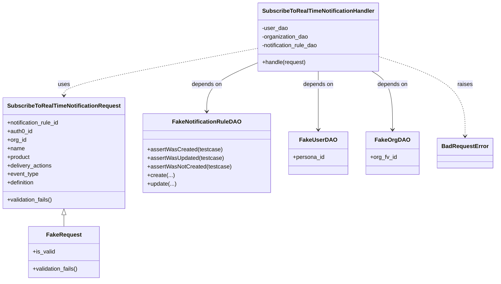
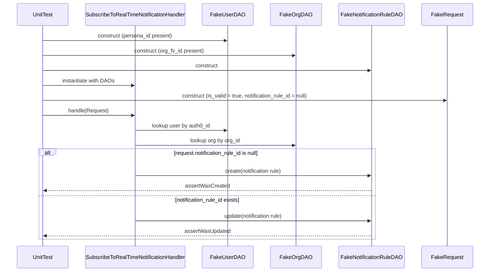
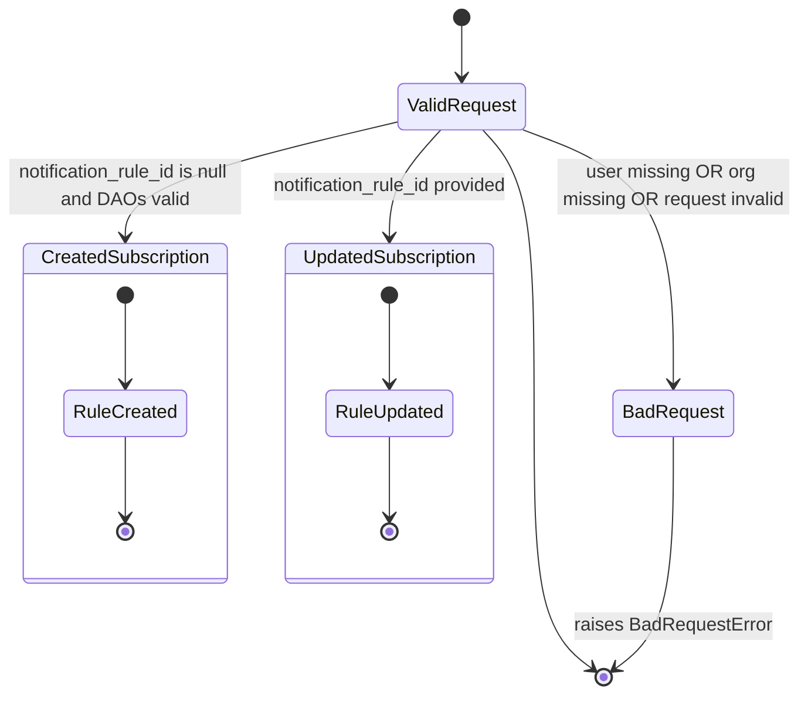

# Diagram: common/subscription_service/subscription_service_tests/unit/test_subscribe_to_real_time_notification_handler.py


> Auto-generated by Obscura crawlers

## Diagram 1



### SVG

<svg id="container" width="1343.609375" xmlns="http://www.w3.org/2000/svg" class="classDiagram" height="788" viewBox="0 0 1343.609375 788" role="graphics-document document" aria-roledescription="class"><style>#container{font-family:"trebuchet ms",verdana,arial,sans-serif;font-size:16px;fill:#333;}@keyframes edge-animation-frame{from{stroke-dashoffset:0;}}@keyframes dash{to{stroke-dashoffset:0;}}#container .edge-animation-slow{stroke-dasharray:9,5!important;stroke-dashoffset:900;animation:dash 50s linear infinite;stroke-linecap:round;}#container .edge-animation-fast{stroke-dasharray:9,5!important;stroke-dashoffset:900;animation:dash 20s linear infinite;stroke-linecap:round;}#container .error-icon{fill:#552222;}#container .error-text{fill:#552222;stroke:#552222;}#container .edge-thickness-normal{stroke-width:1px;}#container .edge-thickness-thick{stroke-width:3.5px;}#container .edge-pattern-solid{stroke-dasharray:0;}#container .edge-thickness-invisible{stroke-width:0;fill:none;}#container .edge-pattern-dashed{stroke-dasharray:3;}#container .edge-pattern-dotted{stroke-dasharray:2;}#container .marker{fill:#333333;stroke:#333333;}#container .marker.cross{stroke:#333333;}#container svg{font-family:"trebuchet ms",verdana,arial,sans-serif;font-size:16px;}#container p{margin:0;}#container g.classGroup text{fill:#9370DB;stroke:none;font-family:"trebuchet ms",verdana,arial,sans-serif;font-size:10px;}#container g.classGroup text .title{font-weight:bolder;}#container .nodeLabel,#container .edgeLabel{color:#131300;}#container .edgeLabel .label rect{fill:#ECECFF;}#container .label text{fill:#131300;}#container .labelBkg{background:#ECECFF;}#container .edgeLabel .label span{background:#ECECFF;}#container .classTitle{font-weight:bolder;}#container .node rect,#container .node circle,#container .node ellipse,#container .node polygon,#container .node path{fill:#ECECFF;stroke:#9370DB;stroke-width:1px;}#container .divider{stroke:#9370DB;stroke-width:1;}#container g.clickable{cursor:pointer;}#container g.classGroup rect{fill:#ECECFF;stroke:#9370DB;}#container g.classGroup line{stroke:#9370DB;stroke-width:1;}#container .classLabel .box{stroke:none;stroke-width:0;fill:#ECECFF;opacity:0.5;}#container .classLabel .label{fill:#9370DB;font-size:10px;}#container .relation{stroke:#333333;stroke-width:1;fill:none;}#container .dashed-line{stroke-dasharray:3;}#container .dotted-line{stroke-dasharray:1 2;}#container #compositionStart,#container .composition{fill:#333333!important;stroke:#333333!important;stroke-width:1;}#container #compositionEnd,#container .composition{fill:#333333!important;stroke:#333333!important;stroke-width:1;}#container #dependencyStart,#container .dependency{fill:#333333!important;stroke:#333333!important;stroke-width:1;}#container #dependencyStart,#container .dependency{fill:#333333!important;stroke:#333333!important;stroke-width:1;}#container #extensionStart,#container .extension{fill:transparent!important;stroke:#333333!important;stroke-width:1;}#container #extensionEnd,#container .extension{fill:transparent!important;stroke:#333333!important;stroke-width:1;}#container #aggregationStart,#container .aggregation{fill:transparent!important;stroke:#333333!important;stroke-width:1;}#container #aggregationEnd,#container .aggregation{fill:transparent!important;stroke:#333333!important;stroke-width:1;}#container #lollipopStart,#container .lollipop{fill:#ECECFF!important;stroke:#333333!important;stroke-width:1;}#container #lollipopEnd,#container .lollipop{fill:#ECECFF!important;stroke:#333333!important;stroke-width:1;}#container .edgeTerminals{font-size:11px;line-height:initial;}#container .classTitleText{text-anchor:middle;font-size:18px;fill:#333;}#container .label-icon{display:inline-block;height:1em;overflow:visible;vertical-align:-0.125em;}#container .node .label-icon path{fill:currentColor;stroke:revert;stroke-width:revert;}#container :root{--mermaid-font-family:"trebuchet ms",verdana,arial,sans-serif;}</style><g><defs><marker id="container_class-aggregationStart" class="marker aggregation class" refX="18" refY="7" markerWidth="190" markerHeight="240" orient="auto"><path d="M 18,7 L9,13 L1,7 L9,1 Z"></path></marker></defs><defs><marker id="container_class-aggregationEnd" class="marker aggregation class" refX="1" refY="7" markerWidth="20" markerHeight="28" orient="auto"><path d="M 18,7 L9,13 L1,7 L9,1 Z"></path></marker></defs><defs><marker id="container_class-extensionStart" class="marker extension class" refX="18" refY="7" markerWidth="190" markerHeight="240" orient="auto"><path d="M 1,7 L18,13 V 1 Z"></path></marker></defs><defs><marker id="container_class-extensionEnd" class="marker extension class" refX="1" refY="7" markerWidth="20" markerHeight="28" orient="auto"><path d="M 1,1 V 13 L18,7 Z"></path></marker></defs><defs><marker id="container_class-compositionStart" class="marker composition class" refX="18" refY="7" markerWidth="190" markerHeight="240" orient="auto"><path d="M 18,7 L9,13 L1,7 L9,1 Z"></path></marker></defs><defs><marker id="container_class-compositionEnd" class="marker composition class" refX="1" refY="7" markerWidth="20" markerHeight="28" orient="auto"><path d="M 18,7 L9,13 L1,7 L9,1 Z"></path></marker></defs><defs><marker id="container_class-dependencyStart" class="marker dependency class" refX="6" refY="7" markerWidth="190" markerHeight="240" orient="auto"><path d="M 5,7 L9,13 L1,7 L9,1 Z"></path></marker></defs><defs><marker id="container_class-dependencyEnd" class="marker dependency class" refX="13" refY="7" markerWidth="20" markerHeight="28" orient="auto"><path d="M 18,7 L9,13 L14,7 L9,1 Z"></path></marker></defs><defs><marker id="container_class-lollipopStart" class="marker lollipop class" refX="13" refY="7" markerWidth="190" markerHeight="240" orient="auto"><circle stroke="black" fill="transparent" cx="7" cy="7" r="6"></circle></marker></defs><defs><marker id="container_class-lollipopEnd" class="marker lollipop class" refX="1" refY="7" markerWidth="190" markerHeight="240" orient="auto"><circle stroke="black" fill="transparent" cx="7" cy="7" r="6"></circle></marker></defs><g class="root"><g class="clusters"></g><g class="edgePaths"><path d="M171.273,603.25L171.273,604.542C171.273,605.833,171.273,608.417,171.273,613.875C171.273,619.333,171.273,627.667,171.273,631.833L171.273,636" id="id_SubscribeToRealTimeNotificationRequest_FakeRequest_1" class="edge-thickness-normal edge-pattern-solid relation" style=";;;" data-edge="true" data-et="edge" data-id="id_SubscribeToRealTimeNotificationRequest_FakeRequest_1" data-points="W3sieCI6MTcxLjI3MzQzNzUsInkiOjU4Nn0seyJ4IjoxNzEuMjczNDM3NSwieSI6NjExfSx7IngiOjE3MS4yNzM0Mzc1LCJ5Ijo2MzZ9XQ==" marker-start="url(#container_class-extensionStart)"></path><path d="M862.391,200L862.391,206.167C862.391,212.333,862.391,224.667,862.391,252C862.391,279.333,862.391,321.667,862.391,342.833L862.391,364" id="id_SubscribeToRealTimeNotificationHandler_FakeUserDAO_2" class="edge-thickness-normal edge-pattern-solid relation" style=";;;" data-edge="true" data-et="edge" data-id="id_SubscribeToRealTimeNotificationHandler_FakeUserDAO_2" data-points="W3sieCI6ODYyLjM5MDYyNSwieSI6MjAwfSx7IngiOjg2Mi4zOTA2MjUsInkiOjIzN30seyJ4Ijo4NjIuMzkwNjI1LCJ5IjozNzB9XQ==" marker-end="url(#container_class-dependencyEnd)"></path><path d="M1008.782,200L1018.185,206.167C1027.589,212.333,1046.396,224.667,1055.8,252C1065.203,279.333,1065.203,321.667,1065.203,342.833L1065.203,364" id="id_SubscribeToRealTimeNotificationHandler_FakeOrgDAO_3" class="edge-thickness-normal edge-pattern-solid relation" style=";;;" data-edge="true" data-et="edge" data-id="id_SubscribeToRealTimeNotificationHandler_FakeOrgDAO_3" data-points="W3sieCI6MTAwOC43ODE2MDI0NDM2MDksInkiOjIwMH0seyJ4IjoxMDY1LjIwMzEyNSwieSI6MjM3fSx7IngiOjEwNjUuMjAzMTI1LCJ5IjozNzB9XQ==" marker-end="url(#container_class-dependencyEnd)"></path><path d="M694.047,177.552L671.37,187.46C648.693,197.368,603.339,217.184,580.661,239.759C557.984,262.333,557.984,287.667,557.984,300.333L557.984,313" id="id_SubscribeToRealTimeNotificationHandler_FakeNotificationRuleDAO_4" class="edge-thickness-normal edge-pattern-solid relation" style=";;;" data-edge="true" data-et="edge" data-id="id_SubscribeToRealTimeNotificationHandler_FakeNotificationRuleDAO_4" data-points="W3sieCI6Njk0LjA0Njg3NSwieSI6MTc3LjU1MjA5OTM3Mzc4MDkyfSx7IngiOjU1Ny45ODQzNzUsInkiOjIzN30seyJ4Ijo1NTcuOTg0Mzc1LCJ5IjozMTl9XQ==" marker-end="url(#container_class-dependencyEnd)"></path><path d="M694.047,136.396L606.918,153.164C519.789,169.931,345.531,203.465,258.402,225.399C171.273,247.333,171.273,257.667,171.273,262.833L171.273,268" id="id_SubscribeToRealTimeNotificationHandler_SubscribeToRealTimeNotificationRequest_5" class="edge-thickness-normal edge-pattern-dashed relation" style=";;;" data-edge="true" data-et="edge" data-id="id_SubscribeToRealTimeNotificationHandler_SubscribeToRealTimeNotificationRequest_5" data-points="W3sieCI6Njk0LjA0Njg3NSwieSI6MTM2LjM5NjQxNDMyMDExMTIzfSx7IngiOjE3MS4yNzM0Mzc1LCJ5IjoyMzd9LHsieCI6MTcxLjI3MzQzNzUsInkiOjI3NH1d" marker-end="url(#container_class-dependencyEnd)"></path><path d="M1030.734,160.123L1069.167,172.936C1107.599,185.749,1184.464,211.374,1222.896,248.354C1261.328,285.333,1261.328,333.667,1261.328,357.833L1261.328,382" id="id_SubscribeToRealTimeNotificationHandler_BadRequestError_6" class="edge-thickness-normal edge-pattern-dashed relation" style=";;;" data-edge="true" data-et="edge" data-id="id_SubscribeToRealTimeNotificationHandler_BadRequestError_6" data-points="W3sieCI6MTAzMC43MzQzNzUsInkiOjE2MC4xMjMzNzQ1ODg3NTEzN30seyJ4IjoxMjYxLjMyODEyNSwieSI6MjM3fSx7IngiOjEyNjEuMzI4MTI1LCJ5IjozODh9XQ==" marker-end="url(#container_class-dependencyEnd)"></path></g><g class="edgeLabels"><g class="edgeLabel"><g class="label" data-id="id_SubscribeToRealTimeNotificationRequest_FakeRequest_1" transform="translate(0, 0)"><foreignObject width="0" height="0"><div xmlns="http://www.w3.org/1999/xhtml" class="labelBkg" style="display: table-cell; white-space: nowrap; line-height: 1.5; max-width: 200px; text-align: center;"><span class="edgeLabel"></span></div></foreignObject></g></g><g class="edgeLabel" transform="translate(862.390625, 237)"><g class="label" data-id="id_SubscribeToRealTimeNotificationHandler_FakeUserDAO_2" transform="translate(-42.9453125, -12)"><foreignObject width="85.890625" height="24"><div xmlns="http://www.w3.org/1999/xhtml" class="labelBkg" style="display: table-cell; white-space: nowrap; line-height: 1.5; max-width: 200px; text-align: center;"><span class="edgeLabel"><p>depends on</p></span></div></foreignObject></g></g><g class="edgeLabel" transform="translate(1065.203125, 237)"><g class="label" data-id="id_SubscribeToRealTimeNotificationHandler_FakeOrgDAO_3" transform="translate(-42.9453125, -12)"><foreignObject width="85.890625" height="24"><div xmlns="http://www.w3.org/1999/xhtml" class="labelBkg" style="display: table-cell; white-space: nowrap; line-height: 1.5; max-width: 200px; text-align: center;"><span class="edgeLabel"><p>depends on</p></span></div></foreignObject></g></g><g class="edgeLabel" transform="translate(557.984375, 237)"><g class="label" data-id="id_SubscribeToRealTimeNotificationHandler_FakeNotificationRuleDAO_4" transform="translate(-42.9453125, -12)"><foreignObject width="85.890625" height="24"><div xmlns="http://www.w3.org/1999/xhtml" class="labelBkg" style="display: table-cell; white-space: nowrap; line-height: 1.5; max-width: 200px; text-align: center;"><span class="edgeLabel"><p>depends on</p></span></div></foreignObject></g></g><g class="edgeLabel" transform="translate(171.2734375, 237)"><g class="label" data-id="id_SubscribeToRealTimeNotificationHandler_SubscribeToRealTimeNotificationRequest_5" transform="translate(-16.4921875, -12)"><foreignObject width="32.984375" height="24"><div xmlns="http://www.w3.org/1999/xhtml" class="labelBkg" style="display: table-cell; white-space: nowrap; line-height: 1.5; max-width: 200px; text-align: center;"><span class="edgeLabel"><p>uses</p></span></div></foreignObject></g></g><g class="edgeLabel" transform="translate(1261.328125, 237)"><g class="label" data-id="id_SubscribeToRealTimeNotificationHandler_BadRequestError_6" transform="translate(-21.25, -12)"><foreignObject width="42.5" height="24"><div xmlns="http://www.w3.org/1999/xhtml" class="labelBkg" style="display: table-cell; white-space: nowrap; line-height: 1.5; max-width: 200px; text-align: center;"><span class="edgeLabel"><p>raises</p></span></div></foreignObject></g></g></g><g class="nodes"><g class="node default" id="classId-SubscribeToRealTimeNotificationHandler-0" transform="translate(862.390625, 104)"><g class="basic label-container"><path d="M-168.34375 -96 L168.34375 -96 L168.34375 96 L-168.34375 96" stroke="none" stroke-width="0" fill="#ECECFF" style=""></path><path d="M-168.34375 -96 C-49.82644636430251 -96, 68.69085727139498 -96, 168.34375 -96 M-168.34375 -96 C-71.05764595684454 -96, 26.228458086310923 -96, 168.34375 -96 M168.34375 -96 C168.34375 -29.4406050576992, 168.34375 37.1187898846016, 168.34375 96 M168.34375 -96 C168.34375 -44.48058365205311, 168.34375 7.038832695893774, 168.34375 96 M168.34375 96 C62.861537918367276 96, -42.62067416326545 96, -168.34375 96 M168.34375 96 C71.61403819117339 96, -25.115673617653215 96, -168.34375 96 M-168.34375 96 C-168.34375 53.71445680894006, -168.34375 11.428913617880113, -168.34375 -96 M-168.34375 96 C-168.34375 48.9144652011304, -168.34375 1.828930402260795, -168.34375 -96" stroke="#9370DB" stroke-width="1.3" fill="none" stroke-dasharray="0 0" style=""></path></g><g class="annotation-group text" transform="translate(0, -72)"></g><g class="label-group text" transform="translate(-150.390625, -72)"><g class="label" style="font-weight: bolder" transform="translate(0,-12)"><foreignObject width="300.78125" height="24"><div xmlns="http://www.w3.org/1999/xhtml" style="display: table-cell; white-space: nowrap; line-height: 1.5; max-width: 349px; text-align: center;"><span class="nodeLabel markdown-node-label" style=""><p>SubscribeToRealTimeNotificationHandler</p></span></div></foreignObject></g></g><g class="members-group text" transform="translate(-156.34375, -24)"><g class="label" style="" transform="translate(0,-12)"><foreignObject width="72.46875" height="24"><div xmlns="http://www.w3.org/1999/xhtml" style="display: table-cell; white-space: nowrap; line-height: 1.5; max-width: 130px; text-align: center;"><span class="nodeLabel markdown-node-label" style=""><p>-user_dao</p></span></div></foreignObject></g><g class="label" style="" transform="translate(0,12)"><foreignObject width="132.421875" height="24"><div xmlns="http://www.w3.org/1999/xhtml" style="display: table-cell; white-space: nowrap; line-height: 1.5; max-width: 190px; text-align: center;"><span class="nodeLabel markdown-node-label" style=""><p>-organization_dao</p></span></div></foreignObject></g><g class="label" style="" transform="translate(0,36)"><foreignObject width="162.296875" height="24"><div xmlns="http://www.w3.org/1999/xhtml" style="display: table-cell; white-space: nowrap; line-height: 1.5; max-width: 220px; text-align: center;"><span class="nodeLabel markdown-node-label" style=""><p>-notification_rule_dao</p></span></div></foreignObject></g></g><g class="methods-group text" transform="translate(-156.34375, 72)"><g class="label" style="" transform="translate(0,-12)"><foreignObject width="123.96875" height="24"><div xmlns="http://www.w3.org/1999/xhtml" style="display: table-cell; white-space: nowrap; line-height: 1.5; max-width: 181px; text-align: center;"><span class="nodeLabel markdown-node-label" style=""><p>+handle(request)</p></span></div></foreignObject></g></g><g class="divider" style=""><path d="M-168.34375 -48 C-41.744724599933946 -48, 84.85430080013211 -48, 168.34375 -48 M-168.34375 -48 C-89.63304043322329 -48, -10.922330866446572 -48, 168.34375 -48" stroke="#9370DB" stroke-width="1.3" fill="none" stroke-dasharray="0 0" style=""></path></g><g class="divider" style=""><path d="M-168.34375 48 C-62.151718359105644 48, 44.04031328178871 48, 168.34375 48 M-168.34375 48 C-96.32735063099516 48, -24.31095126199031 48, 168.34375 48" stroke="#9370DB" stroke-width="1.3" fill="none" stroke-dasharray="0 0" style=""></path></g></g><g class="node default" id="classId-SubscribeToRealTimeNotificationRequest-1" transform="translate(171.2734375, 430)"><g class="basic label-container"><path d="M-163.2734375 -156 L163.2734375 -156 L163.2734375 156 L-163.2734375 156" stroke="none" stroke-width="0" fill="#ECECFF" style=""></path><path d="M-163.2734375 -156 C-73.80601701326 -156, 15.661403473479993 -156, 163.2734375 -156 M-163.2734375 -156 C-96.41687505773689 -156, -29.560312615473777 -156, 163.2734375 -156 M163.2734375 -156 C163.2734375 -35.65424027207234, 163.2734375 84.69151945585531, 163.2734375 156 M163.2734375 -156 C163.2734375 -67.99669639925494, 163.2734375 20.006607201490112, 163.2734375 156 M163.2734375 156 C37.49766071571584 156, -88.27811606856832 156, -163.2734375 156 M163.2734375 156 C50.89983911614699 156, -61.473759267706015 156, -163.2734375 156 M-163.2734375 156 C-163.2734375 93.25814779097306, -163.2734375 30.51629558194611, -163.2734375 -156 M-163.2734375 156 C-163.2734375 55.11614214885991, -163.2734375 -45.767715702280185, -163.2734375 -156" stroke="#9370DB" stroke-width="1.3" fill="none" stroke-dasharray="0 0" style=""></path></g><g class="annotation-group text" transform="translate(0, -132)"></g><g class="label-group text" transform="translate(-151.2734375, -132)"><g class="label" style="font-weight: bolder" transform="translate(0,-12)"><foreignObject width="302.546875" height="24"><div xmlns="http://www.w3.org/1999/xhtml" style="display: table-cell; white-space: nowrap; line-height: 1.5; max-width: 349px; text-align: center;"><span class="nodeLabel markdown-node-label" style=""><p>SubscribeToRealTimeNotificationRequest</p></span></div></foreignObject></g></g><g class="members-group text" transform="translate(-151.2734375, -84)"><g class="label" style="" transform="translate(0,-12)"><foreignObject width="150.609375" height="24"><div xmlns="http://www.w3.org/1999/xhtml" style="display: table-cell; white-space: nowrap; line-height: 1.5; max-width: 208px; text-align: center;"><span class="nodeLabel markdown-node-label" style=""><p>+notification_rule_id</p></span></div></foreignObject></g><g class="label" style="" transform="translate(0,12)"><foreignObject width="71.765625" height="24"><div xmlns="http://www.w3.org/1999/xhtml" style="display: table-cell; white-space: nowrap; line-height: 1.5; max-width: 129px; text-align: center;"><span class="nodeLabel markdown-node-label" style=""><p>+auth0_id</p></span></div></foreignObject></g><g class="label" style="" transform="translate(0,36)"><foreignObject width="54.0625" height="24"><div xmlns="http://www.w3.org/1999/xhtml" style="display: table-cell; white-space: nowrap; line-height: 1.5; max-width: 111px; text-align: center;"><span class="nodeLabel markdown-node-label" style=""><p>+org_id</p></span></div></foreignObject></g><g class="label" style="" transform="translate(0,60)"><foreignObject width="48.5" height="24"><div xmlns="http://www.w3.org/1999/xhtml" style="display: table-cell; white-space: nowrap; line-height: 1.5; max-width: 106px; text-align: center;"><span class="nodeLabel markdown-node-label" style=""><p>+name</p></span></div></foreignObject></g><g class="label" style="" transform="translate(0,84)"><foreignObject width="64.84375" height="24"><div xmlns="http://www.w3.org/1999/xhtml" style="display: table-cell; white-space: nowrap; line-height: 1.5; max-width: 122px; text-align: center;"><span class="nodeLabel markdown-node-label" style=""><p>+product</p></span></div></foreignObject></g><g class="label" style="" transform="translate(0,108)"><foreignObject width="126.40625" height="24"><div xmlns="http://www.w3.org/1999/xhtml" style="display: table-cell; white-space: nowrap; line-height: 1.5; max-width: 184px; text-align: center;"><span class="nodeLabel markdown-node-label" style=""><p>+delivery_actions</p></span></div></foreignObject></g><g class="label" style="" transform="translate(0,132)"><foreignObject width="88.125" height="24"><div xmlns="http://www.w3.org/1999/xhtml" style="display: table-cell; white-space: nowrap; line-height: 1.5; max-width: 145px; text-align: center;"><span class="nodeLabel markdown-node-label" style=""><p>+event_type</p></span></div></foreignObject></g><g class="label" style="" transform="translate(0,156)"><foreignObject width="78.375" height="24"><div xmlns="http://www.w3.org/1999/xhtml" style="display: table-cell; white-space: nowrap; line-height: 1.5; max-width: 136px; text-align: center;"><span class="nodeLabel markdown-node-label" style=""><p>+definition</p></span></div></foreignObject></g></g><g class="methods-group text" transform="translate(-151.2734375, 132)"><g class="label" style="" transform="translate(0,-12)"><foreignObject width="129.21875" height="24"><div xmlns="http://www.w3.org/1999/xhtml" style="display: table-cell; white-space: nowrap; line-height: 1.5; max-width: 187px; text-align: center;"><span class="nodeLabel markdown-node-label" style=""><p>+validation_fails()</p></span></div></foreignObject></g></g><g class="divider" style=""><path d="M-163.2734375 -108 C-59.64421298438738 -108, 43.98501153122524 -108, 163.2734375 -108 M-163.2734375 -108 C-79.04441119161781 -108, 5.184615116764377 -108, 163.2734375 -108" stroke="#9370DB" stroke-width="1.3" fill="none" stroke-dasharray="0 0" style=""></path></g><g class="divider" style=""><path d="M-163.2734375 108 C-89.26722040768551 108, -15.261003315371028 108, 163.2734375 108 M-163.2734375 108 C-67.7137631232301 108, 27.84591125353981 108, 163.2734375 108" stroke="#9370DB" stroke-width="1.3" fill="none" stroke-dasharray="0 0" style=""></path></g></g><g class="node default" id="classId-FakeRequest-2" transform="translate(171.2734375, 708)"><g class="basic label-container"><path d="M-99.86328125 -72 L99.86328125 -72 L99.86328125 72 L-99.86328125 72" stroke="none" stroke-width="0" fill="#ECECFF" style=""></path><path d="M-99.86328125 -72 C-37.295313319011214 -72, 25.272654611977572 -72, 99.86328125 -72 M-99.86328125 -72 C-32.94518493290539 -72, 33.97291138418922 -72, 99.86328125 -72 M99.86328125 -72 C99.86328125 -37.50268243721804, 99.86328125 -3.005364874436083, 99.86328125 72 M99.86328125 -72 C99.86328125 -33.64555906213532, 99.86328125 4.708881875729361, 99.86328125 72 M99.86328125 72 C58.276985282196165 72, 16.69068931439233 72, -99.86328125 72 M99.86328125 72 C42.15383856926288 72, -15.555604111474238 72, -99.86328125 72 M-99.86328125 72 C-99.86328125 17.18588233064174, -99.86328125 -37.62823533871652, -99.86328125 -72 M-99.86328125 72 C-99.86328125 41.462397912914554, -99.86328125 10.924795825829108, -99.86328125 -72" stroke="#9370DB" stroke-width="1.3" fill="none" stroke-dasharray="0 0" style=""></path></g><g class="annotation-group text" transform="translate(0, -48)"></g><g class="label-group text" transform="translate(-46.5078125, -48)"><g class="label" style="font-weight: bolder" transform="translate(0,-12)"><foreignObject width="93.015625" height="24"><div xmlns="http://www.w3.org/1999/xhtml" style="display: table-cell; white-space: nowrap; line-height: 1.5; max-width: 142px; text-align: center;"><span class="nodeLabel markdown-node-label" style=""><p>FakeRequest</p></span></div></foreignObject></g></g><g class="members-group text" transform="translate(-87.86328125, 0)"><g class="label" style="" transform="translate(0,-12)"><foreignObject width="62.421875" height="24"><div xmlns="http://www.w3.org/1999/xhtml" style="display: table-cell; white-space: nowrap; line-height: 1.5; max-width: 120px; text-align: center;"><span class="nodeLabel markdown-node-label" style=""><p>+is_valid</p></span></div></foreignObject></g></g><g class="methods-group text" transform="translate(-87.86328125, 48)"><g class="label" style="" transform="translate(0,-12)"><foreignObject width="129.21875" height="24"><div xmlns="http://www.w3.org/1999/xhtml" style="display: table-cell; white-space: nowrap; line-height: 1.5; max-width: 187px; text-align: center;"><span class="nodeLabel markdown-node-label" style=""><p>+validation_fails()</p></span></div></foreignObject></g></g><g class="divider" style=""><path d="M-99.86328125 -24 C-24.799699617242496 -24, 50.26388201551501 -24, 99.86328125 -24 M-99.86328125 -24 C-51.72347134528009 -24, -3.583661440560178 -24, 99.86328125 -24" stroke="#9370DB" stroke-width="1.3" fill="none" stroke-dasharray="0 0" style=""></path></g><g class="divider" style=""><path d="M-99.86328125 24 C-32.81533506044259 24, 34.232611129114815 24, 99.86328125 24 M-99.86328125 24 C-41.82685802323648 24, 16.209565203527035 24, 99.86328125 24" stroke="#9370DB" stroke-width="1.3" fill="none" stroke-dasharray="0 0" style=""></path></g></g><g class="node default" id="classId-FakeNotificationRuleDAO-3" transform="translate(557.984375, 430)"><g class="basic label-container"><path d="M-173.4375 -111 L173.4375 -111 L173.4375 111 L-173.4375 111" stroke="none" stroke-width="0" fill="#ECECFF" style=""></path><path d="M-173.4375 -111 C-85.96157292532993 -111, 1.5143541493401358 -111, 173.4375 -111 M-173.4375 -111 C-69.98224452109855 -111, 33.4730109578029 -111, 173.4375 -111 M173.4375 -111 C173.4375 -47.130582615043174, 173.4375 16.73883476991365, 173.4375 111 M173.4375 -111 C173.4375 -44.53112492887087, 173.4375 21.937750142258267, 173.4375 111 M173.4375 111 C91.97938440544635 111, 10.521268810892707 111, -173.4375 111 M173.4375 111 C102.37692162073003 111, 31.31634324146006 111, -173.4375 111 M-173.4375 111 C-173.4375 52.50241412382571, -173.4375 -5.995171752348583, -173.4375 -111 M-173.4375 111 C-173.4375 45.74236253208173, -173.4375 -19.515274935836544, -173.4375 -111" stroke="#9370DB" stroke-width="1.3" fill="none" stroke-dasharray="0 0" style=""></path></g><g class="annotation-group text" transform="translate(0, -87)"></g><g class="label-group text" transform="translate(-90.96875, -87)"><g class="label" style="font-weight: bolder" transform="translate(0,-12)"><foreignObject width="181.9375" height="24"><div xmlns="http://www.w3.org/1999/xhtml" style="display: table-cell; white-space: nowrap; line-height: 1.5; max-width: 230px; text-align: center;"><span class="nodeLabel markdown-node-label" style=""><p>FakeNotificationRuleDAO</p></span></div></foreignObject></g></g><g class="members-group text" transform="translate(-161.4375, -39)"></g><g class="methods-group text" transform="translate(-161.4375, -9)"><g class="label" style="" transform="translate(0,-12)"><foreignObject width="205.859375" height="24"><div xmlns="http://www.w3.org/1999/xhtml" style="display: table-cell; white-space: nowrap; line-height: 1.5; max-width: 263px; text-align: center;"><span class="nodeLabel markdown-node-label" style=""><p>+assertWasCreated(testcase)</p></span></div></foreignObject></g><g class="label" style="" transform="translate(0,12)"><foreignObject width="212.546875" height="24"><div xmlns="http://www.w3.org/1999/xhtml" style="display: table-cell; white-space: nowrap; line-height: 1.5; max-width: 270px; text-align: center;"><span class="nodeLabel markdown-node-label" style=""><p>+assertWasUpdated(testcase)</p></span></div></foreignObject></g><g class="label" style="" transform="translate(0,36)"><foreignObject width="231.90625" height="24"><div xmlns="http://www.w3.org/1999/xhtml" style="display: table-cell; white-space: nowrap; line-height: 1.5; max-width: 289px; text-align: center;"><span class="nodeLabel markdown-node-label" style=""><p>+assertWasNotCreated(testcase)</p></span></div></foreignObject></g><g class="label" style="" transform="translate(0,60)"><foreignObject width="74.75" height="24"><div xmlns="http://www.w3.org/1999/xhtml" style="display: table-cell; white-space: nowrap; line-height: 1.5; max-width: 132px; text-align: center;"><span class="nodeLabel markdown-node-label" style=""><p>+create(...)</p></span></div></foreignObject></g><g class="label" style="" transform="translate(0,84)"><foreignObject width="81.21875" height="24"><div xmlns="http://www.w3.org/1999/xhtml" style="display: table-cell; white-space: nowrap; line-height: 1.5; max-width: 139px; text-align: center;"><span class="nodeLabel markdown-node-label" style=""><p>+update(...)</p></span></div></foreignObject></g></g><g class="divider" style=""><path d="M-173.4375 -63 C-44.36395955403876 -63, 84.70958089192249 -63, 173.4375 -63 M-173.4375 -63 C-99.60106106195693 -63, -25.764622123913853 -63, 173.4375 -63" stroke="#9370DB" stroke-width="1.3" fill="none" stroke-dasharray="0 0" style=""></path></g><g class="divider" style=""><path d="M-173.4375 -39 C-80.12652027580421 -39, 13.184459448391578 -39, 173.4375 -39 M-173.4375 -39 C-49.34604812323943 -39, 74.74540375352115 -39, 173.4375 -39" stroke="#9370DB" stroke-width="1.3" fill="none" stroke-dasharray="0 0" style=""></path></g></g><g class="node default" id="classId-FakeUserDAO-4" transform="translate(862.390625, 430)"><g class="basic label-container"><path d="M-80.96875 -60 L80.96875 -60 L80.96875 60 L-80.96875 60" stroke="none" stroke-width="0" fill="#ECECFF" style=""></path><path d="M-80.96875 -60 C-47.52367771542559 -60, -14.078605430851184 -60, 80.96875 -60 M-80.96875 -60 C-22.178894198789024 -60, 36.61096160242195 -60, 80.96875 -60 M80.96875 -60 C80.96875 -23.90013690837462, 80.96875 12.19972618325076, 80.96875 60 M80.96875 -60 C80.96875 -24.789007094314655, 80.96875 10.42198581137069, 80.96875 60 M80.96875 60 C41.28328004044771 60, 1.5978100808954139 60, -80.96875 60 M80.96875 60 C33.394750976732205 60, -14.17924804653559 60, -80.96875 60 M-80.96875 60 C-80.96875 27.412732998887748, -80.96875 -5.1745340022245045, -80.96875 -60 M-80.96875 60 C-80.96875 32.974913421843226, -80.96875 5.949826843686459, -80.96875 -60" stroke="#9370DB" stroke-width="1.3" fill="none" stroke-dasharray="0 0" style=""></path></g><g class="annotation-group text" transform="translate(0, -36)"></g><g class="label-group text" transform="translate(-48.484375, -36)"><g class="label" style="font-weight: bolder" transform="translate(0,-12)"><foreignObject width="96.96875" height="24"><div xmlns="http://www.w3.org/1999/xhtml" style="display: table-cell; white-space: nowrap; line-height: 1.5; max-width: 145px; text-align: center;"><span class="nodeLabel markdown-node-label" style=""><p>FakeUserDAO</p></span></div></foreignObject></g></g><g class="members-group text" transform="translate(-68.96875, 12)"><g class="label" style="" transform="translate(0,-12)"><foreignObject width="89.453125" height="24"><div xmlns="http://www.w3.org/1999/xhtml" style="display: table-cell; white-space: nowrap; line-height: 1.5; max-width: 147px; text-align: center;"><span class="nodeLabel markdown-node-label" style=""><p>+persona_id</p></span></div></foreignObject></g></g><g class="methods-group text" transform="translate(-68.96875, 60)"></g><g class="divider" style=""><path d="M-80.96875 -12 C-37.54934072296096 -12, 5.870068554078074 -12, 80.96875 -12 M-80.96875 -12 C-46.81718169650229 -12, -12.665613393004577 -12, 80.96875 -12" stroke="#9370DB" stroke-width="1.3" fill="none" stroke-dasharray="0 0" style=""></path></g><g class="divider" style=""><path d="M-80.96875 36 C-28.405206204592858 36, 24.158337590814284 36, 80.96875 36 M-80.96875 36 C-41.16382995169226 36, -1.3589099033845145 36, 80.96875 36" stroke="#9370DB" stroke-width="1.3" fill="none" stroke-dasharray="0 0" style=""></path></g></g><g class="node default" id="classId-FakeOrgDAO-5" transform="translate(1065.203125, 430)"><g class="basic label-container"><path d="M-71.84375 -60 L71.84375 -60 L71.84375 60 L-71.84375 60" stroke="none" stroke-width="0" fill="#ECECFF" style=""></path><path d="M-71.84375 -60 C-24.07390915576442 -60, 23.695931688471163 -60, 71.84375 -60 M-71.84375 -60 C-21.20364733652137 -60, 29.436455326957258 -60, 71.84375 -60 M71.84375 -60 C71.84375 -34.158130485660415, 71.84375 -8.31626097132083, 71.84375 60 M71.84375 -60 C71.84375 -19.1282841798338, 71.84375 21.743431640332403, 71.84375 60 M71.84375 60 C23.750609920314055 60, -24.34253015937189 60, -71.84375 60 M71.84375 60 C35.49184668395456 60, -0.860056632090874 60, -71.84375 60 M-71.84375 60 C-71.84375 13.942296798920175, -71.84375 -32.11540640215965, -71.84375 -60 M-71.84375 60 C-71.84375 26.565148036979927, -71.84375 -6.869703926040145, -71.84375 -60" stroke="#9370DB" stroke-width="1.3" fill="none" stroke-dasharray="0 0" style=""></path></g><g class="annotation-group text" transform="translate(0, -36)"></g><g class="label-group text" transform="translate(-44.875, -36)"><g class="label" style="font-weight: bolder" transform="translate(0,-12)"><foreignObject width="89.75" height="24"><div xmlns="http://www.w3.org/1999/xhtml" style="display: table-cell; white-space: nowrap; line-height: 1.5; max-width: 138px; text-align: center;"><span class="nodeLabel markdown-node-label" style=""><p>FakeOrgDAO</p></span></div></foreignObject></g></g><g class="members-group text" transform="translate(-59.84375, 12)"><g class="label" style="" transform="translate(0,-12)"><foreignObject width="74.8125" height="24"><div xmlns="http://www.w3.org/1999/xhtml" style="display: table-cell; white-space: nowrap; line-height: 1.5; max-width: 132px; text-align: center;"><span class="nodeLabel markdown-node-label" style=""><p>+org_fv_id</p></span></div></foreignObject></g></g><g class="methods-group text" transform="translate(-59.84375, 60)"></g><g class="divider" style=""><path d="M-71.84375 -12 C-20.416981521757428 -12, 31.009786956485144 -12, 71.84375 -12 M-71.84375 -12 C-33.64321702694556 -12, 4.557315946108886 -12, 71.84375 -12" stroke="#9370DB" stroke-width="1.3" fill="none" stroke-dasharray="0 0" style=""></path></g><g class="divider" style=""><path d="M-71.84375 36 C-36.96766437415035 36, -2.091578748300705 36, 71.84375 36 M-71.84375 36 C-14.880915283900308 36, 42.081919432199385 36, 71.84375 36" stroke="#9370DB" stroke-width="1.3" fill="none" stroke-dasharray="0 0" style=""></path></g></g><g class="node default" id="classId-BadRequestError-6" transform="translate(1261.328125, 430)"><g class="basic label-container"><path d="M-74.28125 -42 L74.28125 -42 L74.28125 42 L-74.28125 42" stroke="none" stroke-width="0" fill="#ECECFF" style=""></path><path d="M-74.28125 -42 C-19.120271464802087 -42, 36.040707070395825 -42, 74.28125 -42 M-74.28125 -42 C-41.76723445549782 -42, -9.253218910995642 -42, 74.28125 -42 M74.28125 -42 C74.28125 -19.38043005901735, 74.28125 3.2391398819653006, 74.28125 42 M74.28125 -42 C74.28125 -8.649189042585292, 74.28125 24.701621914829417, 74.28125 42 M74.28125 42 C17.716058435890957 42, -38.849133128218085 42, -74.28125 42 M74.28125 42 C39.0056529027028 42, 3.7300558054055983 42, -74.28125 42 M-74.28125 42 C-74.28125 21.366983650979023, -74.28125 0.7339673019580459, -74.28125 -42 M-74.28125 42 C-74.28125 24.171861839814124, -74.28125 6.343723679628248, -74.28125 -42" stroke="#9370DB" stroke-width="1.3" fill="none" stroke-dasharray="0 0" style=""></path></g><g class="annotation-group text" transform="translate(0, -18)"></g><g class="label-group text" transform="translate(-62.28125, -18)"><g class="label" style="font-weight: bolder" transform="translate(0,-12)"><foreignObject width="124.5625" height="24"><div xmlns="http://www.w3.org/1999/xhtml" style="display: table-cell; white-space: nowrap; line-height: 1.5; max-width: 174px; text-align: center;"><span class="nodeLabel markdown-node-label" style=""><p>BadRequestError</p></span></div></foreignObject></g></g><g class="members-group text" transform="translate(-62.28125, 30)"></g><g class="methods-group text" transform="translate(-62.28125, 60)"></g><g class="divider" style=""><path d="M-74.28125 6 C-27.230819873725274 6, 19.819610252549452 6, 74.28125 6 M-74.28125 6 C-40.46367999977943 6, -6.64610999955886 6, 74.28125 6" stroke="#9370DB" stroke-width="1.3" fill="none" stroke-dasharray="0 0" style=""></path></g><g class="divider" style=""><path d="M-74.28125 24 C-38.26555147356393 24, -2.249852947127863 24, 74.28125 24 M-74.28125 24 C-23.12438477565061 24, 28.032480448698777 24, 74.28125 24" stroke="#9370DB" stroke-width="1.3" fill="none" stroke-dasharray="0 0" style=""></path></g></g></g></g></g></svg>

## Diagram 2



### SVG

<svg id="container" width="1469" xmlns="http://www.w3.org/2000/svg" height="847" viewBox="-50 -10 1469 847" role="graphics-document document" aria-roledescription="sequence"><g><rect x="1219" y="761" fill="#eaeaea" stroke="#666" width="150" height="65" name="Request" rx="3" ry="3" class="actor actor-bottom"></rect><text x="1294" y="793.5" dominant-baseline="central" alignment-baseline="central" class="actor actor-box" style="text-anchor: middle; font-size: 16px; font-weight: 400;"><tspan x="1294" dy="0">FakeRequest</tspan></text></g><g><rect x="969" y="761" fill="#eaeaea" stroke="#666" width="200" height="65" name="RuleDAO" rx="3" ry="3" class="actor actor-bottom"></rect><text x="1069" y="793.5" dominant-baseline="central" alignment-baseline="central" class="actor actor-box" style="text-anchor: middle; font-size: 16px; font-weight: 400;"><tspan x="1069" dy="0">FakeNotificationRuleDAO</tspan></text></g><g><rect x="769" y="761" fill="#eaeaea" stroke="#666" width="150" height="65" name="OrgDAO" rx="3" ry="3" class="actor actor-bottom"></rect><text x="844" y="793.5" dominant-baseline="central" alignment-baseline="central" class="actor actor-box" style="text-anchor: middle; font-size: 16px; font-weight: 400;"><tspan x="844" dy="0">FakeOrgDAO</tspan></text></g><g><rect x="569" y="761" fill="#eaeaea" stroke="#666" width="150" height="65" name="UserDAO" rx="3" ry="3" class="actor actor-bottom"></rect><text x="644" y="793.5" dominant-baseline="central" alignment-baseline="central" class="actor actor-box" style="text-anchor: middle; font-size: 16px; font-weight: 400;"><tspan x="644" dy="0">FakeUserDAO</tspan></text></g><g><rect x="200" y="761" fill="#eaeaea" stroke="#666" width="319" height="65" name="Handler" rx="3" ry="3" class="actor actor-bottom"></rect><text x="359.5" y="793.5" dominant-baseline="central" alignment-baseline="central" class="actor actor-box" style="text-anchor: middle; font-size: 16px; font-weight: 400;"><tspan x="359.5" dy="0">SubscribeToRealTimeNotificationHandler</tspan></text></g><g><rect x="0" y="761" fill="#eaeaea" stroke="#666" width="150" height="65" name="Test" rx="3" ry="3" class="actor actor-bottom"></rect><text x="75" y="793.5" dominant-baseline="central" alignment-baseline="central" class="actor actor-box" style="text-anchor: middle; font-size: 16px; font-weight: 400;"><tspan x="75" dy="0">UnitTest</tspan></text></g><g><line id="actor5" x1="1294" y1="65" x2="1294" y2="761" class="actor-line 200" stroke-width="0.5px" stroke="#999" name="Request"></line><g id="root-5"><rect x="1219" y="0" fill="#eaeaea" stroke="#666" width="150" height="65" name="Request" rx="3" ry="3" class="actor actor-top"></rect><text x="1294" y="32.5" dominant-baseline="central" alignment-baseline="central" class="actor actor-box" style="text-anchor: middle; font-size: 16px; font-weight: 400;"><tspan x="1294" dy="0">FakeRequest</tspan></text></g></g><g><line id="actor4" x1="1069" y1="65" x2="1069" y2="761" class="actor-line 200" stroke-width="0.5px" stroke="#999" name="RuleDAO"></line><g id="root-4"><rect x="969" y="0" fill="#eaeaea" stroke="#666" width="200" height="65" name="RuleDAO" rx="3" ry="3" class="actor actor-top"></rect><text x="1069" y="32.5" dominant-baseline="central" alignment-baseline="central" class="actor actor-box" style="text-anchor: middle; font-size: 16px; font-weight: 400;"><tspan x="1069" dy="0">FakeNotificationRuleDAO</tspan></text></g></g><g><line id="actor3" x1="844" y1="65" x2="844" y2="761" class="actor-line 200" stroke-width="0.5px" stroke="#999" name="OrgDAO"></line><g id="root-3"><rect x="769" y="0" fill="#eaeaea" stroke="#666" width="150" height="65" name="OrgDAO" rx="3" ry="3" class="actor actor-top"></rect><text x="844" y="32.5" dominant-baseline="central" alignment-baseline="central" class="actor actor-box" style="text-anchor: middle; font-size: 16px; font-weight: 400;"><tspan x="844" dy="0">FakeOrgDAO</tspan></text></g></g><g><line id="actor2" x1="644" y1="65" x2="644" y2="761" class="actor-line 200" stroke-width="0.5px" stroke="#999" name="UserDAO"></line><g id="root-2"><rect x="569" y="0" fill="#eaeaea" stroke="#666" width="150" height="65" name="UserDAO" rx="3" ry="3" class="actor actor-top"></rect><text x="644" y="32.5" dominant-baseline="central" alignment-baseline="central" class="actor actor-box" style="text-anchor: middle; font-size: 16px; font-weight: 400;"><tspan x="644" dy="0">FakeUserDAO</tspan></text></g></g><g><line id="actor1" x1="359.5" y1="65" x2="359.5" y2="761" class="actor-line 200" stroke-width="0.5px" stroke="#999" name="Handler"></line><g id="root-1"><rect x="200" y="0" fill="#eaeaea" stroke="#666" width="319" height="65" name="Handler" rx="3" ry="3" class="actor actor-top"></rect><text x="359.5" y="32.5" dominant-baseline="central" alignment-baseline="central" class="actor actor-box" style="text-anchor: middle; font-size: 16px; font-weight: 400;"><tspan x="359.5" dy="0">SubscribeToRealTimeNotificationHandler</tspan></text></g></g><g><line id="actor0" x1="75" y1="65" x2="75" y2="761" class="actor-line 200" stroke-width="0.5px" stroke="#999" name="Test"></line><g id="root-0"><rect x="0" y="0" fill="#eaeaea" stroke="#666" width="150" height="65" name="Test" rx="3" ry="3" class="actor actor-top"></rect><text x="75" y="32.5" dominant-baseline="central" alignment-baseline="central" class="actor actor-box" style="text-anchor: middle; font-size: 16px; font-weight: 400;"><tspan x="75" dy="0">UnitTest</tspan></text></g></g><style>#container{font-family:"trebuchet ms",verdana,arial,sans-serif;font-size:16px;fill:#333;}@keyframes edge-animation-frame{from{stroke-dashoffset:0;}}@keyframes dash{to{stroke-dashoffset:0;}}#container .edge-animation-slow{stroke-dasharray:9,5!important;stroke-dashoffset:900;animation:dash 50s linear infinite;stroke-linecap:round;}#container .edge-animation-fast{stroke-dasharray:9,5!important;stroke-dashoffset:900;animation:dash 20s linear infinite;stroke-linecap:round;}#container .error-icon{fill:#552222;}#container .error-text{fill:#552222;stroke:#552222;}#container .edge-thickness-normal{stroke-width:1px;}#container .edge-thickness-thick{stroke-width:3.5px;}#container .edge-pattern-solid{stroke-dasharray:0;}#container .edge-thickness-invisible{stroke-width:0;fill:none;}#container .edge-pattern-dashed{stroke-dasharray:3;}#container .edge-pattern-dotted{stroke-dasharray:2;}#container .marker{fill:#333333;stroke:#333333;}#container .marker.cross{stroke:#333333;}#container svg{font-family:"trebuchet ms",verdana,arial,sans-serif;font-size:16px;}#container p{margin:0;}#container .actor{stroke:hsl(259.6261682243, 59.7765363128%, 87.9019607843%);fill:#ECECFF;}#container text.actor&gt;tspan{fill:black;stroke:none;}#container .actor-line{stroke:hsl(259.6261682243, 59.7765363128%, 87.9019607843%);}#container .innerArc{stroke-width:1.5;stroke-dasharray:none;}#container .messageLine0{stroke-width:1.5;stroke-dasharray:none;stroke:#333;}#container .messageLine1{stroke-width:1.5;stroke-dasharray:2,2;stroke:#333;}#container #arrowhead path{fill:#333;stroke:#333;}#container .sequenceNumber{fill:white;}#container #sequencenumber{fill:#333;}#container #crosshead path{fill:#333;stroke:#333;}#container .messageText{fill:#333;stroke:none;}#container .labelBox{stroke:hsl(259.6261682243, 59.7765363128%, 87.9019607843%);fill:#ECECFF;}#container .labelText,#container .labelText&gt;tspan{fill:black;stroke:none;}#container .loopText,#container .loopText&gt;tspan{fill:black;stroke:none;}#container .loopLine{stroke-width:2px;stroke-dasharray:2,2;stroke:hsl(259.6261682243, 59.7765363128%, 87.9019607843%);fill:hsl(259.6261682243, 59.7765363128%, 87.9019607843%);}#container .note{stroke:#aaaa33;fill:#fff5ad;}#container .noteText,#container .noteText&gt;tspan{fill:black;stroke:none;}#container .activation0{fill:#f4f4f4;stroke:#666;}#container .activation1{fill:#f4f4f4;stroke:#666;}#container .activation2{fill:#f4f4f4;stroke:#666;}#container .actorPopupMenu{position:absolute;}#container .actorPopupMenuPanel{position:absolute;fill:#ECECFF;box-shadow:0px 8px 16px 0px rgba(0,0,0,0.2);filter:drop-shadow(3px 5px 2px rgb(0 0 0 / 0.4));}#container .actor-man line{stroke:hsl(259.6261682243, 59.7765363128%, 87.9019607843%);fill:#ECECFF;}#container .actor-man circle,#container line{stroke:hsl(259.6261682243, 59.7765363128%, 87.9019607843%);fill:#ECECFF;stroke-width:2px;}#container :root{--mermaid-font-family:"trebuchet ms",verdana,arial,sans-serif;}</style><g></g><defs><symbol id="computer" width="24" height="24"><path transform="scale(.5)" d="M2 2v13h20v-13h-20zm18 11h-16v-9h16v9zm-10.228 6l.466-1h3.524l.467 1h-4.457zm14.228 3h-24l2-6h2.104l-1.33 4h18.45l-1.297-4h2.073l2 6zm-5-10h-14v-7h14v7z"></path></symbol></defs><defs><symbol id="database" fill-rule="evenodd" clip-rule="evenodd"><path transform="scale(.5)" d="M12.258.001l.256.004.255.005.253.008.251.01.249.012.247.015.246.016.242.019.241.02.239.023.236.024.233.027.231.028.229.031.225.032.223.034.22.036.217.038.214.04.211.041.208.043.205.045.201.046.198.048.194.05.191.051.187.053.183.054.18.056.175.057.172.059.168.06.163.061.16.063.155.064.15.066.074.033.073.033.071.034.07.034.069.035.068.035.067.035.066.035.064.036.064.036.062.036.06.036.06.037.058.037.058.037.055.038.055.038.053.038.052.038.051.039.05.039.048.039.047.039.045.04.044.04.043.04.041.04.04.041.039.041.037.041.036.041.034.041.033.042.032.042.03.042.029.042.027.042.026.043.024.043.023.043.021.043.02.043.018.044.017.043.015.044.013.044.012.044.011.045.009.044.007.045.006.045.004.045.002.045.001.045v17l-.001.045-.002.045-.004.045-.006.045-.007.045-.009.044-.011.045-.012.044-.013.044-.015.044-.017.043-.018.044-.02.043-.021.043-.023.043-.024.043-.026.043-.027.042-.029.042-.03.042-.032.042-.033.042-.034.041-.036.041-.037.041-.039.041-.04.041-.041.04-.043.04-.044.04-.045.04-.047.039-.048.039-.05.039-.051.039-.052.038-.053.038-.055.038-.055.038-.058.037-.058.037-.06.037-.06.036-.062.036-.064.036-.064.036-.066.035-.067.035-.068.035-.069.035-.07.034-.071.034-.073.033-.074.033-.15.066-.155.064-.16.063-.163.061-.168.06-.172.059-.175.057-.18.056-.183.054-.187.053-.191.051-.194.05-.198.048-.201.046-.205.045-.208.043-.211.041-.214.04-.217.038-.22.036-.223.034-.225.032-.229.031-.231.028-.233.027-.236.024-.239.023-.241.02-.242.019-.246.016-.247.015-.249.012-.251.01-.253.008-.255.005-.256.004-.258.001-.258-.001-.256-.004-.255-.005-.253-.008-.251-.01-.249-.012-.247-.015-.245-.016-.243-.019-.241-.02-.238-.023-.236-.024-.234-.027-.231-.028-.228-.031-.226-.032-.223-.034-.22-.036-.217-.038-.214-.04-.211-.041-.208-.043-.204-.045-.201-.046-.198-.048-.195-.05-.19-.051-.187-.053-.184-.054-.179-.056-.176-.057-.172-.059-.167-.06-.164-.061-.159-.063-.155-.064-.151-.066-.074-.033-.072-.033-.072-.034-.07-.034-.069-.035-.068-.035-.067-.035-.066-.035-.064-.036-.063-.036-.062-.036-.061-.036-.06-.037-.058-.037-.057-.037-.056-.038-.055-.038-.053-.038-.052-.038-.051-.039-.049-.039-.049-.039-.046-.039-.046-.04-.044-.04-.043-.04-.041-.04-.04-.041-.039-.041-.037-.041-.036-.041-.034-.041-.033-.042-.032-.042-.03-.042-.029-.042-.027-.042-.026-.043-.024-.043-.023-.043-.021-.043-.02-.043-.018-.044-.017-.043-.015-.044-.013-.044-.012-.044-.011-.045-.009-.044-.007-.045-.006-.045-.004-.045-.002-.045-.001-.045v-17l.001-.045.002-.045.004-.045.006-.045.007-.045.009-.044.011-.045.012-.044.013-.044.015-.044.017-.043.018-.044.02-.043.021-.043.023-.043.024-.043.026-.043.027-.042.029-.042.03-.042.032-.042.033-.042.034-.041.036-.041.037-.041.039-.041.04-.041.041-.04.043-.04.044-.04.046-.04.046-.039.049-.039.049-.039.051-.039.052-.038.053-.038.055-.038.056-.038.057-.037.058-.037.06-.037.061-.036.062-.036.063-.036.064-.036.066-.035.067-.035.068-.035.069-.035.07-.034.072-.034.072-.033.074-.033.151-.066.155-.064.159-.063.164-.061.167-.06.172-.059.176-.057.179-.056.184-.054.187-.053.19-.051.195-.05.198-.048.201-.046.204-.045.208-.043.211-.041.214-.04.217-.038.22-.036.223-.034.226-.032.228-.031.231-.028.234-.027.236-.024.238-.023.241-.02.243-.019.245-.016.247-.015.249-.012.251-.01.253-.008.255-.005.256-.004.258-.001.258.001zm-9.258 20.499v.01l.001.021.003.021.004.022.005.021.006.022.007.022.009.023.01.022.011.023.012.023.013.023.015.023.016.024.017.023.018.024.019.024.021.024.022.025.023.024.024.025.052.049.056.05.061.051.066.051.07.051.075.051.079.052.084.052.088.052.092.052.097.052.102.051.105.052.11.052.114.051.119.051.123.051.127.05.131.05.135.05.139.048.144.049.147.047.152.047.155.047.16.045.163.045.167.043.171.043.176.041.178.041.183.039.187.039.19.037.194.035.197.035.202.033.204.031.209.03.212.029.216.027.219.025.222.024.226.021.23.02.233.018.236.016.24.015.243.012.246.01.249.008.253.005.256.004.259.001.26-.001.257-.004.254-.005.25-.008.247-.011.244-.012.241-.014.237-.016.233-.018.231-.021.226-.021.224-.024.22-.026.216-.027.212-.028.21-.031.205-.031.202-.034.198-.034.194-.036.191-.037.187-.039.183-.04.179-.04.175-.042.172-.043.168-.044.163-.045.16-.046.155-.046.152-.047.148-.048.143-.049.139-.049.136-.05.131-.05.126-.05.123-.051.118-.052.114-.051.11-.052.106-.052.101-.052.096-.052.092-.052.088-.053.083-.051.079-.052.074-.052.07-.051.065-.051.06-.051.056-.05.051-.05.023-.024.023-.025.021-.024.02-.024.019-.024.018-.024.017-.024.015-.023.014-.024.013-.023.012-.023.01-.023.01-.022.008-.022.006-.022.006-.022.004-.022.004-.021.001-.021.001-.021v-4.127l-.077.055-.08.053-.083.054-.085.053-.087.052-.09.052-.093.051-.095.05-.097.05-.1.049-.102.049-.105.048-.106.047-.109.047-.111.046-.114.045-.115.045-.118.044-.12.043-.122.042-.124.042-.126.041-.128.04-.13.04-.132.038-.134.038-.135.037-.138.037-.139.035-.142.035-.143.034-.144.033-.147.032-.148.031-.15.03-.151.03-.153.029-.154.027-.156.027-.158.026-.159.025-.161.024-.162.023-.163.022-.165.021-.166.02-.167.019-.169.018-.169.017-.171.016-.173.015-.173.014-.175.013-.175.012-.177.011-.178.01-.179.008-.179.008-.181.006-.182.005-.182.004-.184.003-.184.002h-.37l-.184-.002-.184-.003-.182-.004-.182-.005-.181-.006-.179-.008-.179-.008-.178-.01-.176-.011-.176-.012-.175-.013-.173-.014-.172-.015-.171-.016-.17-.017-.169-.018-.167-.019-.166-.02-.165-.021-.163-.022-.162-.023-.161-.024-.159-.025-.157-.026-.156-.027-.155-.027-.153-.029-.151-.03-.15-.03-.148-.031-.146-.032-.145-.033-.143-.034-.141-.035-.14-.035-.137-.037-.136-.037-.134-.038-.132-.038-.13-.04-.128-.04-.126-.041-.124-.042-.122-.042-.12-.044-.117-.043-.116-.045-.113-.045-.112-.046-.109-.047-.106-.047-.105-.048-.102-.049-.1-.049-.097-.05-.095-.05-.093-.052-.09-.051-.087-.052-.085-.053-.083-.054-.08-.054-.077-.054v4.127zm0-5.654v.011l.001.021.003.021.004.021.005.022.006.022.007.022.009.022.01.022.011.023.012.023.013.023.015.024.016.023.017.024.018.024.019.024.021.024.022.024.023.025.024.024.052.05.056.05.061.05.066.051.07.051.075.052.079.051.084.052.088.052.092.052.097.052.102.052.105.052.11.051.114.051.119.052.123.05.127.051.131.05.135.049.139.049.144.048.147.048.152.047.155.046.16.045.163.045.167.044.171.042.176.042.178.04.183.04.187.038.19.037.194.036.197.034.202.033.204.032.209.03.212.028.216.027.219.025.222.024.226.022.23.02.233.018.236.016.24.014.243.012.246.01.249.008.253.006.256.003.259.001.26-.001.257-.003.254-.006.25-.008.247-.01.244-.012.241-.015.237-.016.233-.018.231-.02.226-.022.224-.024.22-.025.216-.027.212-.029.21-.03.205-.032.202-.033.198-.035.194-.036.191-.037.187-.039.183-.039.179-.041.175-.042.172-.043.168-.044.163-.045.16-.045.155-.047.152-.047.148-.048.143-.048.139-.05.136-.049.131-.05.126-.051.123-.051.118-.051.114-.052.11-.052.106-.052.101-.052.096-.052.092-.052.088-.052.083-.052.079-.052.074-.051.07-.052.065-.051.06-.05.056-.051.051-.049.023-.025.023-.024.021-.025.02-.024.019-.024.018-.024.017-.024.015-.023.014-.023.013-.024.012-.022.01-.023.01-.023.008-.022.006-.022.006-.022.004-.021.004-.022.001-.021.001-.021v-4.139l-.077.054-.08.054-.083.054-.085.052-.087.053-.09.051-.093.051-.095.051-.097.05-.1.049-.102.049-.105.048-.106.047-.109.047-.111.046-.114.045-.115.044-.118.044-.12.044-.122.042-.124.042-.126.041-.128.04-.13.039-.132.039-.134.038-.135.037-.138.036-.139.036-.142.035-.143.033-.144.033-.147.033-.148.031-.15.03-.151.03-.153.028-.154.028-.156.027-.158.026-.159.025-.161.024-.162.023-.163.022-.165.021-.166.02-.167.019-.169.018-.169.017-.171.016-.173.015-.173.014-.175.013-.175.012-.177.011-.178.009-.179.009-.179.007-.181.007-.182.005-.182.004-.184.003-.184.002h-.37l-.184-.002-.184-.003-.182-.004-.182-.005-.181-.007-.179-.007-.179-.009-.178-.009-.176-.011-.176-.012-.175-.013-.173-.014-.172-.015-.171-.016-.17-.017-.169-.018-.167-.019-.166-.02-.165-.021-.163-.022-.162-.023-.161-.024-.159-.025-.157-.026-.156-.027-.155-.028-.153-.028-.151-.03-.15-.03-.148-.031-.146-.033-.145-.033-.143-.033-.141-.035-.14-.036-.137-.036-.136-.037-.134-.038-.132-.039-.13-.039-.128-.04-.126-.041-.124-.042-.122-.043-.12-.043-.117-.044-.116-.044-.113-.046-.112-.046-.109-.046-.106-.047-.105-.048-.102-.049-.1-.049-.097-.05-.095-.051-.093-.051-.09-.051-.087-.053-.085-.052-.083-.054-.08-.054-.077-.054v4.139zm0-5.666v.011l.001.02.003.022.004.021.005.022.006.021.007.022.009.023.01.022.011.023.012.023.013.023.015.023.016.024.017.024.018.023.019.024.021.025.022.024.023.024.024.025.052.05.056.05.061.05.066.051.07.051.075.052.079.051.084.052.088.052.092.052.097.052.102.052.105.051.11.052.114.051.119.051.123.051.127.05.131.05.135.05.139.049.144.048.147.048.152.047.155.046.16.045.163.045.167.043.171.043.176.042.178.04.183.04.187.038.19.037.194.036.197.034.202.033.204.032.209.03.212.028.216.027.219.025.222.024.226.021.23.02.233.018.236.017.24.014.243.012.246.01.249.008.253.006.256.003.259.001.26-.001.257-.003.254-.006.25-.008.247-.01.244-.013.241-.014.237-.016.233-.018.231-.02.226-.022.224-.024.22-.025.216-.027.212-.029.21-.03.205-.032.202-.033.198-.035.194-.036.191-.037.187-.039.183-.039.179-.041.175-.042.172-.043.168-.044.163-.045.16-.045.155-.047.152-.047.148-.048.143-.049.139-.049.136-.049.131-.051.126-.05.123-.051.118-.052.114-.051.11-.052.106-.052.101-.052.096-.052.092-.052.088-.052.083-.052.079-.052.074-.052.07-.051.065-.051.06-.051.056-.05.051-.049.023-.025.023-.025.021-.024.02-.024.019-.024.018-.024.017-.024.015-.023.014-.024.013-.023.012-.023.01-.022.01-.023.008-.022.006-.022.006-.022.004-.022.004-.021.001-.021.001-.021v-4.153l-.077.054-.08.054-.083.053-.085.053-.087.053-.09.051-.093.051-.095.051-.097.05-.1.049-.102.048-.105.048-.106.048-.109.046-.111.046-.114.046-.115.044-.118.044-.12.043-.122.043-.124.042-.126.041-.128.04-.13.039-.132.039-.134.038-.135.037-.138.036-.139.036-.142.034-.143.034-.144.033-.147.032-.148.032-.15.03-.151.03-.153.028-.154.028-.156.027-.158.026-.159.024-.161.024-.162.023-.163.023-.165.021-.166.02-.167.019-.169.018-.169.017-.171.016-.173.015-.173.014-.175.013-.175.012-.177.01-.178.01-.179.009-.179.007-.181.006-.182.006-.182.004-.184.003-.184.001-.185.001-.185-.001-.184-.001-.184-.003-.182-.004-.182-.006-.181-.006-.179-.007-.179-.009-.178-.01-.176-.01-.176-.012-.175-.013-.173-.014-.172-.015-.171-.016-.17-.017-.169-.018-.167-.019-.166-.02-.165-.021-.163-.023-.162-.023-.161-.024-.159-.024-.157-.026-.156-.027-.155-.028-.153-.028-.151-.03-.15-.03-.148-.032-.146-.032-.145-.033-.143-.034-.141-.034-.14-.036-.137-.036-.136-.037-.134-.038-.132-.039-.13-.039-.128-.041-.126-.041-.124-.041-.122-.043-.12-.043-.117-.044-.116-.044-.113-.046-.112-.046-.109-.046-.106-.048-.105-.048-.102-.048-.1-.05-.097-.049-.095-.051-.093-.051-.09-.052-.087-.052-.085-.053-.083-.053-.08-.054-.077-.054v4.153zm8.74-8.179l-.257.004-.254.005-.25.008-.247.011-.244.012-.241.014-.237.016-.233.018-.231.021-.226.022-.224.023-.22.026-.216.027-.212.028-.21.031-.205.032-.202.033-.198.034-.194.036-.191.038-.187.038-.183.04-.179.041-.175.042-.172.043-.168.043-.163.045-.16.046-.155.046-.152.048-.148.048-.143.048-.139.049-.136.05-.131.05-.126.051-.123.051-.118.051-.114.052-.11.052-.106.052-.101.052-.096.052-.092.052-.088.052-.083.052-.079.052-.074.051-.07.052-.065.051-.06.05-.056.05-.051.05-.023.025-.023.024-.021.024-.02.025-.019.024-.018.024-.017.023-.015.024-.014.023-.013.023-.012.023-.01.023-.01.022-.008.022-.006.023-.006.021-.004.022-.004.021-.001.021-.001.021.001.021.001.021.004.021.004.022.006.021.006.023.008.022.01.022.01.023.012.023.013.023.014.023.015.024.017.023.018.024.019.024.02.025.021.024.023.024.023.025.051.05.056.05.06.05.065.051.07.052.074.051.079.052.083.052.088.052.092.052.096.052.101.052.106.052.11.052.114.052.118.051.123.051.126.051.131.05.136.05.139.049.143.048.148.048.152.048.155.046.16.046.163.045.168.043.172.043.175.042.179.041.183.04.187.038.191.038.194.036.198.034.202.033.205.032.21.031.212.028.216.027.22.026.224.023.226.022.231.021.233.018.237.016.241.014.244.012.247.011.25.008.254.005.257.004.26.001.26-.001.257-.004.254-.005.25-.008.247-.011.244-.012.241-.014.237-.016.233-.018.231-.021.226-.022.224-.023.22-.026.216-.027.212-.028.21-.031.205-.032.202-.033.198-.034.194-.036.191-.038.187-.038.183-.04.179-.041.175-.042.172-.043.168-.043.163-.045.16-.046.155-.046.152-.048.148-.048.143-.048.139-.049.136-.05.131-.05.126-.051.123-.051.118-.051.114-.052.11-.052.106-.052.101-.052.096-.052.092-.052.088-.052.083-.052.079-.052.074-.051.07-.052.065-.051.06-.05.056-.05.051-.05.023-.025.023-.024.021-.024.02-.025.019-.024.018-.024.017-.023.015-.024.014-.023.013-.023.012-.023.01-.023.01-.022.008-.022.006-.023.006-.021.004-.022.004-.021.001-.021.001-.021-.001-.021-.001-.021-.004-.021-.004-.022-.006-.021-.006-.023-.008-.022-.01-.022-.01-.023-.012-.023-.013-.023-.014-.023-.015-.024-.017-.023-.018-.024-.019-.024-.02-.025-.021-.024-.023-.024-.023-.025-.051-.05-.056-.05-.06-.05-.065-.051-.07-.052-.074-.051-.079-.052-.083-.052-.088-.052-.092-.052-.096-.052-.101-.052-.106-.052-.11-.052-.114-.052-.118-.051-.123-.051-.126-.051-.131-.05-.136-.05-.139-.049-.143-.048-.148-.048-.152-.048-.155-.046-.16-.046-.163-.045-.168-.043-.172-.043-.175-.042-.179-.041-.183-.04-.187-.038-.191-.038-.194-.036-.198-.034-.202-.033-.205-.032-.21-.031-.212-.028-.216-.027-.22-.026-.224-.023-.226-.022-.231-.021-.233-.018-.237-.016-.241-.014-.244-.012-.247-.011-.25-.008-.254-.005-.257-.004-.26-.001-.26.001z"></path></symbol></defs><defs><symbol id="clock" width="24" height="24"><path transform="scale(.5)" d="M12 2c5.514 0 10 4.486 10 10s-4.486 10-10 10-10-4.486-10-10 4.486-10 10-10zm0-2c-6.627 0-12 5.373-12 12s5.373 12 12 12 12-5.373 12-12-5.373-12-12-12zm5.848 12.459c.202.038.202.333.001.372-1.907.361-6.045 1.111-6.547 1.111-.719 0-1.301-.582-1.301-1.301 0-.512.77-5.447 1.125-7.445.034-.192.312-.181.343.014l.985 6.238 5.394 1.011z"></path></symbol></defs><defs><marker id="arrowhead" refX="7.9" refY="5" markerUnits="userSpaceOnUse" markerWidth="12" markerHeight="12" orient="auto-start-reverse"><path d="M -1 0 L 10 5 L 0 10 z"></path></marker></defs><defs><marker id="crosshead" markerWidth="15" markerHeight="8" orient="auto" refX="4" refY="4.5"><path fill="none" stroke="#000000" stroke-width="1pt" d="M 1,2 L 6,7 M 6,2 L 1,7" style="stroke-dasharray: 0, 0;"></path></marker></defs><defs><marker id="filled-head" refX="15.5" refY="7" markerWidth="20" markerHeight="28" orient="auto"><path d="M 18,7 L9,13 L14,7 L9,1 Z"></path></marker></defs><defs><marker id="sequencenumber" refX="15" refY="15" markerWidth="60" markerHeight="40" orient="auto"><circle cx="15" cy="15" r="6"></circle></marker></defs><g><line x1="64" y1="459" x2="1080" y2="459" class="loopLine"></line><line x1="1080" y1="459" x2="1080" y2="741" class="loopLine"></line><line x1="64" y1="741" x2="1080" y2="741" class="loopLine"></line><line x1="64" y1="459" x2="64" y2="741" class="loopLine"></line><line x1="64" y1="605" x2="1080" y2="605" class="loopLine" style="stroke-dasharray: 3, 3;"></line><polygon points="64,459 114,459 114,472 105.6,479 64,479" class="labelBox"></polygon><text x="89" y="472" text-anchor="middle" dominant-baseline="middle" alignment-baseline="middle" class="labelText" style="font-size: 16px; font-weight: 400;">alt</text><text x="597" y="477" text-anchor="middle" class="loopText" style="font-size: 16px; font-weight: 400;"><tspan x="597">[request.notification_rule_id is null]</tspan></text><text x="572" y="623" text-anchor="middle" class="loopText" style="font-size: 16px; font-weight: 400;">[notification_rule_id exists]</text></g><text x="358" y="80" text-anchor="middle" dominant-baseline="middle" alignment-baseline="middle" class="messageText" dy="1em" style="font-size: 16px; font-weight: 400;">construct (persona_id present)</text><line x1="76" y1="113" x2="640" y2="113" class="messageLine0" stroke-width="2" stroke="none" marker-end="url(#arrowhead)" style="fill: none;"></line><text x="458" y="128" text-anchor="middle" dominant-baseline="middle" alignment-baseline="middle" class="messageText" dy="1em" style="font-size: 16px; font-weight: 400;">construct (org_fv_id present)</text><line x1="76" y1="161" x2="840" y2="161" class="messageLine0" stroke-width="2" stroke="none" marker-end="url(#arrowhead)" style="fill: none;"></line><text x="571" y="176" text-anchor="middle" dominant-baseline="middle" alignment-baseline="middle" class="messageText" dy="1em" style="font-size: 16px; font-weight: 400;">construct</text><line x1="76" y1="209" x2="1065" y2="209" class="messageLine0" stroke-width="2" stroke="none" marker-end="url(#arrowhead)" style="fill: none;"></line><text x="216" y="224" text-anchor="middle" dominant-baseline="middle" alignment-baseline="middle" class="messageText" dy="1em" style="font-size: 16px; font-weight: 400;">instantiate with DAOs</text><line x1="76" y1="257" x2="355.5" y2="257" class="messageLine0" stroke-width="2" stroke="none" marker-end="url(#arrowhead)" style="fill: none;"></line><text x="683" y="272" text-anchor="middle" dominant-baseline="middle" alignment-baseline="middle" class="messageText" dy="1em" style="font-size: 16px; font-weight: 400;">construct (is_valid = true, notification_rule_id = null)</text><line x1="76" y1="305" x2="1290" y2="305" class="messageLine0" stroke-width="2" stroke="none" marker-end="url(#arrowhead)" style="fill: none;"></line><text x="216" y="320" text-anchor="middle" dominant-baseline="middle" alignment-baseline="middle" class="messageText" dy="1em" style="font-size: 16px; font-weight: 400;">handle(Request)</text><line x1="76" y1="353" x2="355.5" y2="353" class="messageLine0" stroke-width="2" stroke="none" marker-end="url(#arrowhead)" style="fill: none;"></line><text x="500" y="368" text-anchor="middle" dominant-baseline="middle" alignment-baseline="middle" class="messageText" dy="1em" style="font-size: 16px; font-weight: 400;">lookup user by auth0_id</text><line x1="360.5" y1="401" x2="640" y2="401" class="messageLine0" stroke-width="2" stroke="none" marker-end="url(#arrowhead)" style="fill: none;"></line><text x="600" y="416" text-anchor="middle" dominant-baseline="middle" alignment-baseline="middle" class="messageText" dy="1em" style="font-size: 16px; font-weight: 400;">lookup org by org_id</text><line x1="360.5" y1="449" x2="840" y2="449" class="messageLine0" stroke-width="2" stroke="none" marker-end="url(#arrowhead)" style="fill: none;"></line><text x="713" y="509" text-anchor="middle" dominant-baseline="middle" alignment-baseline="middle" class="messageText" dy="1em" style="font-size: 16px; font-weight: 400;">create(notification rule)</text><line x1="360.5" y1="542" x2="1065" y2="542" class="messageLine0" stroke-width="2" stroke="none" marker-end="url(#arrowhead)" style="fill: none;"></line><text x="574" y="557" text-anchor="middle" dominant-baseline="middle" alignment-baseline="middle" class="messageText" dy="1em" style="font-size: 16px; font-weight: 400;">assertWasCreated</text><line x1="1068" y1="590" x2="79" y2="590" class="messageLine1" stroke-width="2" stroke="none" marker-end="url(#arrowhead)" style="stroke-dasharray: 3, 3; fill: none;"></line><text x="713" y="650" text-anchor="middle" dominant-baseline="middle" alignment-baseline="middle" class="messageText" dy="1em" style="font-size: 16px; font-weight: 400;">update(notification rule)</text><line x1="360.5" y1="683" x2="1065" y2="683" class="messageLine0" stroke-width="2" stroke="none" marker-end="url(#arrowhead)" style="fill: none;"></line><text x="574" y="698" text-anchor="middle" dominant-baseline="middle" alignment-baseline="middle" class="messageText" dy="1em" style="font-size: 16px; font-weight: 400;">assertWasUpdated</text><line x1="1068" y1="731" x2="79" y2="731" class="messageLine1" stroke-width="2" stroke="none" marker-end="url(#arrowhead)" style="stroke-dasharray: 3, 3; fill: none;"></line></svg>

## Diagram 3



### SVG

<svg id="container" width="688.4823608398438" xmlns="http://www.w3.org/2000/svg" class="statediagram" height="599" viewBox="0 0 688.4823608398438 599" role="graphics-document document" aria-roledescription="stateDiagram"><style>#container{font-family:"trebuchet ms",verdana,arial,sans-serif;font-size:16px;fill:#333;}@keyframes edge-animation-frame{from{stroke-dashoffset:0;}}@keyframes dash{to{stroke-dashoffset:0;}}#container .edge-animation-slow{stroke-dasharray:9,5!important;stroke-dashoffset:900;animation:dash 50s linear infinite;stroke-linecap:round;}#container .edge-animation-fast{stroke-dasharray:9,5!important;stroke-dashoffset:900;animation:dash 20s linear infinite;stroke-linecap:round;}#container .error-icon{fill:#552222;}#container .error-text{fill:#552222;stroke:#552222;}#container .edge-thickness-normal{stroke-width:1px;}#container .edge-thickness-thick{stroke-width:3.5px;}#container .edge-pattern-solid{stroke-dasharray:0;}#container .edge-thickness-invisible{stroke-width:0;fill:none;}#container .edge-pattern-dashed{stroke-dasharray:3;}#container .edge-pattern-dotted{stroke-dasharray:2;}#container .marker{fill:#333333;stroke:#333333;}#container .marker.cross{stroke:#333333;}#container svg{font-family:"trebuchet ms",verdana,arial,sans-serif;font-size:16px;}#container p{margin:0;}#container defs #statediagram-barbEnd{fill:#333333;stroke:#333333;}#container g.stateGroup text{fill:#9370DB;stroke:none;font-size:10px;}#container g.stateGroup text{fill:#333;stroke:none;font-size:10px;}#container g.stateGroup .state-title{font-weight:bolder;fill:#131300;}#container g.stateGroup rect{fill:#ECECFF;stroke:#9370DB;}#container g.stateGroup line{stroke:#333333;stroke-width:1;}#container .transition{stroke:#333333;stroke-width:1;fill:none;}#container .stateGroup .composit{fill:white;border-bottom:1px;}#container .stateGroup .alt-composit{fill:#e0e0e0;border-bottom:1px;}#container .state-note{stroke:#aaaa33;fill:#fff5ad;}#container .state-note text{fill:black;stroke:none;font-size:10px;}#container .stateLabel .box{stroke:none;stroke-width:0;fill:#ECECFF;opacity:0.5;}#container .edgeLabel .label rect{fill:#ECECFF;opacity:0.5;}#container .edgeLabel{background-color:rgba(232,232,232, 0.8);text-align:center;}#container .edgeLabel p{background-color:rgba(232,232,232, 0.8);}#container .edgeLabel rect{opacity:0.5;background-color:rgba(232,232,232, 0.8);fill:rgba(232,232,232, 0.8);}#container .edgeLabel .label text{fill:#333;}#container .label div .edgeLabel{color:#333;}#container .stateLabel text{fill:#131300;font-size:10px;font-weight:bold;}#container .node circle.state-start{fill:#333333;stroke:#333333;}#container .node .fork-join{fill:#333333;stroke:#333333;}#container .node circle.state-end{fill:#9370DB;stroke:white;stroke-width:1.5;}#container .end-state-inner{fill:white;stroke-width:1.5;}#container .node rect{fill:#ECECFF;stroke:#9370DB;stroke-width:1px;}#container .node polygon{fill:#ECECFF;stroke:#9370DB;stroke-width:1px;}#container #statediagram-barbEnd{fill:#333333;}#container .statediagram-cluster rect{fill:#ECECFF;stroke:#9370DB;stroke-width:1px;}#container .cluster-label,#container .nodeLabel{color:#131300;}#container .statediagram-cluster rect.outer{rx:5px;ry:5px;}#container .statediagram-state .divider{stroke:#9370DB;}#container .statediagram-state .title-state{rx:5px;ry:5px;}#container .statediagram-cluster.statediagram-cluster .inner{fill:white;}#container .statediagram-cluster.statediagram-cluster-alt .inner{fill:#f0f0f0;}#container .statediagram-cluster .inner{rx:0;ry:0;}#container .statediagram-state rect.basic{rx:5px;ry:5px;}#container .statediagram-state rect.divider{stroke-dasharray:10,10;fill:#f0f0f0;}#container .note-edge{stroke-dasharray:5;}#container .statediagram-note rect{fill:#fff5ad;stroke:#aaaa33;stroke-width:1px;rx:0;ry:0;}#container .statediagram-note rect{fill:#fff5ad;stroke:#aaaa33;stroke-width:1px;rx:0;ry:0;}#container .statediagram-note text{fill:black;}#container .statediagram-note .nodeLabel{color:black;}#container .statediagram .edgeLabel{color:red;}#container #dependencyStart,#container #dependencyEnd{fill:#333333;stroke:#333333;stroke-width:1;}#container .statediagramTitleText{text-anchor:middle;font-size:18px;fill:#333;}#container :root{--mermaid-font-family:"trebuchet ms",verdana,arial,sans-serif;}</style><g><defs><marker id="container_stateDiagram-barbEnd" refX="19" refY="7" markerWidth="20" markerHeight="14" markerUnits="userSpaceOnUse" orient="auto"><path d="M 19,7 L9,13 L14,7 L9,1 Z"></path></marker></defs><g class="root"><g class="clusters"></g><g class="edgePaths"><path d="M397.801,22L397.801,26.167C397.801,30.333,397.801,38.667,397.884,47.083C397.967,55.5,398.134,64,398.217,68.25L398.301,72.5" id="edge0" class="edge-thickness-normal edge-pattern-solid transition" style="fill:none;;;fill:none" data-edge="true" data-et="edge" data-id="edge0" data-points="W3sieCI6Mzk3LjgwMDc4MTI1LCJ5IjoyMn0seyJ4IjozOTcuODAwNzgxMjUsInkiOjQ3fSx7IngiOjM5OC4zMDA3ODEyNSwieSI6NzIuNX1d" marker-end="url(#container_stateDiagram-barbEnd)"></path><path d="M416.454,112.5L423.783,120.583C431.113,128.667,445.771,144.833,453.1,185.5C460.43,226.167,460.43,291.333,460.43,354.5C460.43,417.667,460.43,478.833,469.489,516.06C478.548,553.287,496.666,566.574,505.726,573.217L514.785,579.86" id="edge3" class="edge-thickness-normal edge-pattern-solid transition" style="fill:none;;;fill:none" data-edge="true" data-et="edge" data-id="edge3" data-points="W3sieCI6NDE2LjQ1NDA4NzQwOTQyMDMsInkiOjExMi41fSx7IngiOjQ2MC40Mjk2ODc1LCJ5IjoxNjF9LHsieCI6NDYwLjQyOTY4NzUsInkiOjM1Ni41fSx7IngiOjQ2MC40Mjk2ODc1LCJ5Ijo1NDB9LHsieCI6NTE0Ljc4NDg1MjUyOTAxMDEsInkiOjU3OS44NjA0NTQzNTQ2MDczfV0=" marker-end="url(#container_stateDiagram-barbEnd)"></path><path d="M450.364,112.17L472.042,120.309C493.719,128.447,537.074,144.723,558.835,182.195C580.596,219.667,580.763,278.333,580.846,307.667L580.93,337" id="edge8" class="edge-thickness-normal edge-pattern-solid transition" style="fill:none;;;fill:none" data-edge="true" data-et="edge" data-id="edge8" data-points="W3sieCI6NDUwLjM2NDAyMTk4Njk4NDc3LCJ5IjoxMTIuMTcwMjkwMzQyMzk3MjJ9LHsieCI6NTgwLjQyOTY4NzUsInkiOjE2MX0seyJ4Ijo1ODAuOTI5Njg3NSwieSI6MzM3fV0=" marker-end="url(#container_stateDiagram-barbEnd)"></path><path d="M580.93,377L580.846,404.167C580.763,431.333,580.596,485.667,571.454,519.477C562.311,553.287,544.193,566.574,535.134,573.217L526.075,579.86" id="edge9" class="edge-thickness-normal edge-pattern-solid transition" style="fill:none;;;fill:none" data-edge="true" data-et="edge" data-id="edge9" data-points="W3sieCI6NTgwLjkyOTY4NzUsInkiOjM3N30seyJ4Ijo1ODAuNDI5Njg3NSwieSI6NTQwfSx7IngiOjUyNi4wNzQ1MjI0NzA5ODk5LCJ5Ijo1NzkuODYwNDU0MzU0NjA3M31d" marker-end="url(#container_stateDiagram-barbEnd)"></path><path d="M342.512,105.164L303.426,114.47C264.341,123.776,186.171,142.388,147.085,159.861C108,177.333,108,193.667,108,201.833L108,210" id="edge1" class="edge-thickness-normal edge-pattern-solid transition" style="fill:none;;;fill:none" data-edge="true" data-et="edge" data-id="edge1" data-points="W3sieCI6MzQyLjUxMTcxODc1LCJ5IjoxMDUuMTY0MDI3MDEyMDkwNzR9LHsieCI6MTA4LCJ5IjoxNjF9LHsieCI6MTA4LCJ5IjoyMTB9XQ==" marker-end="url(#container_stateDiagram-barbEnd)"></path><path d="M379.647,112L372.235,120.167C364.822,128.333,349.997,144.667,342.584,161C335.172,177.333,335.172,193.667,335.172,201.833L335.172,210" id="edge2" class="edge-thickness-normal edge-pattern-solid transition" style="fill:none;;;fill:none" data-edge="true" data-et="edge" data-id="edge2" data-points="W3sieCI6Mzc5LjY0NzQ3NTA5MDU3OTcsInkiOjExMn0seyJ4IjozMzUuMTcxODc1LCJ5IjoxNjF9LHsieCI6MzM1LjE3MTg3NSwieSI6MjEwfV0=" marker-end="url(#container_stateDiagram-barbEnd)"></path></g><g class="edgeLabels"><g class="edgeLabel"><g class="label" data-id="edge0" transform="translate(0, 0)"><foreignObject width="0" height="0"><div xmlns="http://www.w3.org/1999/xhtml" class="labelBkg" style="display: table-cell; white-space: nowrap; line-height: 1.5; max-width: 200px; text-align: center;"><span class="edgeLabel"></span></div></foreignObject></g></g><g class="edgeLabel"><g class="label" data-id="edge3" transform="translate(0, 0)"><foreignObject width="0" height="0"><div xmlns="http://www.w3.org/1999/xhtml" class="labelBkg" style="display: table-cell; white-space: nowrap; line-height: 1.5; max-width: 200px; text-align: center;"><span class="edgeLabel"></span></div></foreignObject></g></g><g class="edgeLabel" transform="translate(580.48235, 179.53551)"><g class="label" data-id="edge8" transform="translate(-100, -24)"><foreignObject width="200" height="48"><div xmlns="http://www.w3.org/1999/xhtml" class="labelBkg" style="display: table; white-space: break-spaces; line-height: 1.5; max-width: 200px; text-align: center; width: 200px;"><span class="edgeLabel"><p>user missing OR org missing OR request invalid</p></span></div></foreignObject></g></g><g class="edgeLabel" transform="translate(580.4296875, 540)"><g class="label" data-id="edge9" transform="translate(-84.7734375, -12)"><foreignObject width="169.546875" height="24"><div xmlns="http://www.w3.org/1999/xhtml" class="labelBkg" style="display: table-cell; white-space: nowrap; line-height: 1.5; max-width: 200px; text-align: center;"><span class="edgeLabel"><p>raises BadRequestError</p></span></div></foreignObject></g></g><g class="edgeLabel" transform="translate(108, 161)"><g class="label" data-id="edge1" transform="translate(-100, -24)"><foreignObject width="200" height="48"><div xmlns="http://www.w3.org/1999/xhtml" class="labelBkg" style="display: table; white-space: break-spaces; line-height: 1.5; max-width: 200px; text-align: center; width: 200px;"><span class="edgeLabel"><p>notification_rule_id is null and DAOs valid</p></span></div></foreignObject></g></g><g class="edgeLabel" transform="translate(335.171875, 161)"><g class="label" data-id="edge2" transform="translate(-100, -24)"><foreignObject width="200" height="48"><div xmlns="http://www.w3.org/1999/xhtml" class="labelBkg" style="display: table; white-space: break-spaces; line-height: 1.5; max-width: 200px; text-align: center; width: 200px;"><span class="edgeLabel"><p>notification_rule_id provided</p></span></div></foreignObject></g></g></g><g class="nodes"><g class="node default" id="state-root_start-0" transform="translate(397.80078125, 15)"><circle class="state-start" r="7" width="14" height="14"></circle></g><g class="node  statediagram-state" id="state-ValidRequest-8" transform="translate(397.80078125, 92)"><g class="basic label-container outer-path"><path d="M-50.2890625 -20 C-27.712397942157057 -20, -5.135733384314115 -20, 50.2890625 -20 C50.2890625 -20, 50.2890625 -20, 50.2890625 -20 C50.42362188290822 -19.994434582755378, 50.558181265816444 -19.988869165510756, 50.70195922736166 -19.982922465033347 C50.80493822449843 -19.970086146426812, 50.907917221635195 -19.95724982782028, 51.11203545140367 -19.931806517013612 C51.250133164032455 -19.90285047166827, 51.38823087666125 -19.873894426322924, 51.516489935703994 -19.847001329696653 C51.654733582940985 -19.805844412714418, 51.79297723017797 -19.764687495732183, 51.91255984602342 -19.729086208503173 C52.007051904141434 -19.692215293010914, 52.101543962259456 -19.655344377518656, 52.297539623264846 -19.578866633275286 C52.397052417930645 -19.530217792353213, 52.496565212596444 -19.481568951431143, 52.668799465185366 -19.397368756032446 C52.78272538602603 -19.32948364208186, 52.896651306866694 -19.261598528131273, 53.023803290612136 -19.185832391312644 C53.146704232851135 -19.098082805166367, 53.26960517509014 -19.010333219020094, 53.36012606344834 -18.94570254698197 C53.4560614465645 -18.86444942222713, 53.551996829680654 -18.78319629747229, 53.675470358128706 -18.678619553365657 C53.756552801789475 -18.597537109704884, 53.83763524545025 -18.516454666044112, 53.96768205336566 -18.386407858128706 C54.05786099192268 -18.27993378657048, 54.1480399304797 -18.17345971501226, 54.23476504698197 -18.07106356344834 C54.31407157701476 -17.959987857057108, 54.39337810704755 -17.84891215066588, 54.474894891312644 -17.734740790612136 C54.52766859874019 -17.646175082094135, 54.58044230616773 -17.55760937357614, 54.68643125603245 -17.37973696518537 C54.758143147406976 -17.23304794677935, 54.8298550387815 -17.08635892837333, 54.86792913327529 -17.008477123264846 C54.922185546525455 -16.869429852925542, 54.97644195977562 -16.730382582586238, 55.018148708503176 -16.623497346023417 C55.064849350860996 -16.46663265349454, 55.11154999321881 -16.30976796096566, 55.13606382969665 -16.227427435703994 C55.162397540268906 -16.10183621108461, 55.18873125084115 -15.976244986465229, 55.22086901701361 -15.82297295140367 C55.2348527114576 -15.710789164583685, 55.248836405901585 -15.598605377763702, 55.27198496503335 -15.412896727361662 C55.27794295615527 -15.268845783200462, 55.283900947277196 -15.12479483903926, 55.2890625 -15 C55.2890625 -15, 55.2890625 -15, 55.2890625 -15 C55.2890625 -8.072614823274305, 55.2890625 -1.1452296465486107, 55.2890625 15 C55.2890625 15, 55.2890625 15, 55.2890625 15 C55.28228326232113 15.163906855238595, 55.27550402464227 15.327813710477189, 55.27198496503335 15.412896727361662 C55.26094139109197 15.501493481941266, 55.2498978171506 15.590090236520867, 55.22086901701361 15.822972951403669 C55.19851583956621 15.929580143050714, 55.176162662118806 16.036187334697757, 55.13606382969665 16.227427435703994 C55.091323983644926 16.377705929539715, 55.0465841375932 16.527984423375436, 55.018148708503176 16.623497346023417 C54.96041380637719 16.771459219339857, 54.902678904251204 16.9194210926563, 54.86792913327529 17.008477123264846 C54.82200349005547 17.102419527996528, 54.776077846835655 17.19636193272821, 54.68643125603245 17.379736965185366 C54.60459844264097 17.51707014587933, 54.52276562924949 17.654403326573295, 54.474894891312644 17.734740790612133 C54.39998104219728 17.83966416458316, 54.32506719308192 17.944587538554185, 54.23476504698197 18.07106356344834 C54.136247163427825 18.187383408759846, 54.03772927987369 18.30370325407135, 53.96768205336566 18.386407858128706 C53.861080459825324 18.49300945166904, 53.75447886628499 18.599611045209368, 53.675470358128706 18.678619553365657 C53.59121185843641 18.749982862342748, 53.50695335874411 18.82134617131984, 53.36012606344834 18.94570254698197 C53.2558596768167 19.02014731615308, 53.151593290185055 19.094592085324184, 53.023803290612136 19.185832391312644 C52.92096261070789 19.247112135400204, 52.818121930803635 19.30839187948777, 52.668799465185366 19.397368756032446 C52.52801369669348 19.46619472437607, 52.38722792820158 19.53502069271969, 52.297539623264846 19.578866633275286 C52.1990834944072 19.617284333969998, 52.10062736554955 19.65570203466471, 51.91255984602342 19.729086208503173 C51.776920396895775 19.7694678221168, 51.64128094776814 19.809849435730424, 51.516489935703994 19.847001329696653 C51.39423961603047 19.872634526167218, 51.27198929635695 19.898267722637783, 51.11203545140367 19.931806517013612 C51.00517301284258 19.945126906088866, 50.8983105742815 19.95844729516412, 50.70195922736166 19.982922465033347 C50.58618817250957 19.987710791281405, 50.47041711765748 19.992499117529462, 50.2890625 20 C50.2890625 20, 50.2890625 20, 50.2890625 20 C11.493810905498954 20, -27.301440689002092 20, -50.2890625 20 C-50.2890625 20, -50.2890625 20, -50.2890625 20 C-50.393376521696624 19.995685540148454, -50.49769054339324 19.99137108029691, -50.70195922736166 19.982922465033347 C-50.81689855073348 19.968595293316376, -50.93183787410529 19.954268121599405, -51.11203545140367 19.931806517013612 C-51.2420211531429 19.90455138148559, -51.37200685488213 19.877296245957567, -51.516489935703994 19.847001329696653 C-51.67459233503837 19.799932206057704, -51.83269473437274 19.752863082418756, -51.91255984602342 19.729086208503173 C-52.04102016622054 19.678960836017573, -52.16948048641766 19.628835463531974, -52.297539623264846 19.578866633275286 C-52.3842351641057 19.53648376593462, -52.470930704946554 19.49410089859395, -52.668799465185366 19.397368756032446 C-52.74258282375483 19.35340341726507, -52.81636618232429 19.3094380784977, -53.023803290612136 19.185832391312644 C-53.10095181254314 19.130749405389906, -53.178100334474145 19.075666419467165, -53.36012606344834 18.94570254698197 C-53.481960571441554 18.842513982389164, -53.60379507943477 18.739325417796355, -53.675470358128706 18.67861955336566 C-53.79228916784741 18.561800743646955, -53.909107977566116 18.44498193392825, -53.96768205336566 18.386407858128706 C-54.03503932502343 18.30687927776155, -54.10239659668122 18.227350697394392, -54.23476504698197 18.07106356344834 C-54.321106651266106 17.950134622504294, -54.40744825555024 17.82920568156025, -54.474894891312644 17.734740790612133 C-54.54216484080685 17.62184724893508, -54.60943479030105 17.508953707258023, -54.68643125603244 17.37973696518537 C-54.73090636089581 17.28876168408674, -54.775381465759175 17.197786402988108, -54.86792913327528 17.00847712326485 C-54.9257906887154 16.860190665322293, -54.98365224415552 16.711904207379735, -55.018148708503176 16.623497346023417 C-55.059636284979966 16.48414303312262, -55.10112386145675 16.344788720221825, -55.13606382969665 16.227427435703994 C-55.16991994092077 16.065960237307433, -55.20377605214489 15.904493038910868, -55.22086901701361 15.82297295140367 C-55.237592551170536 15.688808879222893, -55.25431608532746 15.554644807042115, -55.27198496503335 15.412896727361664 C-55.27876414258737 15.248991325807786, -55.28554332014139 15.08508592425391, -55.2890625 15 C-55.2890625 15, -55.2890625 15, -55.2890625 15 C-55.2890625 3.343782675933909, -55.2890625 -8.312434648132182, -55.2890625 -15 C-55.2890625 -15, -55.2890625 -15, -55.2890625 -15 C-55.284369146957125 -15.11347481445885, -55.27967579391425 -15.226949628917703, -55.27198496503335 -15.41289672736166 C-55.2527322539207 -15.567351048987426, -55.233479542808055 -15.721805370613191, -55.22086901701361 -15.822972951403669 C-55.1874813716068 -15.982205933869048, -55.15409372619999 -16.14143891633443, -55.13606382969665 -16.227427435703994 C-55.10006256415656 -16.348353555013606, -55.06406129861647 -16.469279674323218, -55.018148708503176 -16.623497346023417 C-54.98785296832327 -16.701138673980385, -54.957557228143365 -16.778780001937353, -54.86792913327529 -17.008477123264846 C-54.79576277543299 -17.15609576768934, -54.72359641759069 -17.303714412113834, -54.68643125603245 -17.379736965185366 C-54.62643919129133 -17.480416640316193, -54.566447126550216 -17.58109631544702, -54.474894891312644 -17.734740790612133 C-54.3843664309386 -17.86153378836907, -54.293837970564546 -17.988326786126006, -54.23476504698197 -18.07106356344834 C-54.15316547606006 -18.167407994781005, -54.07156590513816 -18.263752426113665, -53.96768205336566 -18.386407858128706 C-53.86458626987028 -18.48950364162408, -53.76149048637491 -18.592599425119452, -53.675470358128706 -18.678619553365657 C-53.5591546373909 -18.77713394358407, -53.442838916653095 -18.875648333802484, -53.36012606344834 -18.945702546981966 C-53.227362903963 -19.040493620899493, -53.094599744477655 -19.135284694817017, -53.023803290612136 -19.185832391312644 C-52.93848382633384 -19.236671757033776, -52.85316436205553 -19.28751112275491, -52.668799465185366 -19.397368756032446 C-52.57029451887519 -19.445524889916285, -52.47178957256501 -19.493681023800125, -52.297539623264846 -19.578866633275286 C-52.18280464710183 -19.623636359899603, -52.06806967093882 -19.668406086523923, -51.91255984602342 -19.729086208503173 C-51.77722359332318 -19.769377556629443, -51.641887340622944 -19.80966890475571, -51.516489935703994 -19.847001329696653 C-51.40204936000505 -19.870996995057116, -51.287608784306116 -19.89499266041758, -51.11203545140367 -19.931806517013612 C-51.02711392061102 -19.9423919747877, -50.942192389818366 -19.952977432561784, -50.70195922736166 -19.982922465033347 C-50.604255674072775 -19.98696351388912, -50.506552120783894 -19.991004562744894, -50.2890625 -20 C-50.2890625 -20, -50.2890625 -20, -50.2890625 -20" stroke="none" stroke-width="0" fill="#ECECFF" style=""></path><path d="M-50.2890625 -20 C-25.908920957912606 -20, -1.5287794158252126 -20, 50.2890625 -20 M-50.2890625 -20 C-20.189945556789578 -20, 9.909171386420844 -20, 50.2890625 -20 M50.2890625 -20 C50.2890625 -20, 50.2890625 -20, 50.2890625 -20 M50.2890625 -20 C50.2890625 -20, 50.2890625 -20, 50.2890625 -20 M50.2890625 -20 C50.3923750905849 -19.995726959645616, 50.495687681169805 -19.991453919291235, 50.70195922736166 -19.982922465033347 M50.2890625 -20 C50.44591735718592 -19.993512435118102, 50.60277221437183 -19.987024870236205, 50.70195922736166 -19.982922465033347 M50.70195922736166 -19.982922465033347 C50.79074658705957 -19.97185513218875, 50.87953394675748 -19.960787799344157, 51.11203545140367 -19.931806517013612 M50.70195922736166 -19.982922465033347 C50.83347102109161 -19.966529537040543, 50.96498281482155 -19.950136609047735, 51.11203545140367 -19.931806517013612 M51.11203545140367 -19.931806517013612 C51.21292378578901 -19.91065245783574, 51.31381212017435 -19.889498398657867, 51.516489935703994 -19.847001329696653 M51.11203545140367 -19.931806517013612 C51.240784941163234 -19.904810587879805, 51.3695344309228 -19.877814658745994, 51.516489935703994 -19.847001329696653 M51.516489935703994 -19.847001329696653 C51.660841391836115 -19.80402603922193, 51.80519284796823 -19.76105074874721, 51.91255984602342 -19.729086208503173 M51.516489935703994 -19.847001329696653 C51.640440480861166 -19.810099653569782, 51.76439102601834 -19.773197977442912, 51.91255984602342 -19.729086208503173 M51.91255984602342 -19.729086208503173 C52.01582626835188 -19.68879152547166, 52.11909269068034 -19.648496842440153, 52.297539623264846 -19.578866633275286 M51.91255984602342 -19.729086208503173 C52.054745570298365 -19.67360516672716, 52.19693129457331 -19.618124124951144, 52.297539623264846 -19.578866633275286 M52.297539623264846 -19.578866633275286 C52.435837357678444 -19.51125699067641, 52.574135092092035 -19.443647348077533, 52.668799465185366 -19.397368756032446 M52.297539623264846 -19.578866633275286 C52.409979249441314 -19.52389824950547, 52.52241887561778 -19.46892986573566, 52.668799465185366 -19.397368756032446 M52.668799465185366 -19.397368756032446 C52.796638462257945 -19.321193248127287, 52.92447745933052 -19.24501774022213, 53.023803290612136 -19.185832391312644 M52.668799465185366 -19.397368756032446 C52.762680904256015 -19.341427560717737, 52.85656234332666 -19.285486365403024, 53.023803290612136 -19.185832391312644 M53.023803290612136 -19.185832391312644 C53.12507363124467 -19.11352675786912, 53.226343971877206 -19.041221124425594, 53.36012606344834 -18.94570254698197 M53.023803290612136 -19.185832391312644 C53.11230448952435 -19.122643749822053, 53.20080568843657 -19.059455108331463, 53.36012606344834 -18.94570254698197 M53.36012606344834 -18.94570254698197 C53.42876798968917 -18.887565801027606, 53.49740991592999 -18.82942905507324, 53.675470358128706 -18.678619553365657 M53.36012606344834 -18.94570254698197 C53.45549181890554 -18.864931872244355, 53.550857574362745 -18.784161197506737, 53.675470358128706 -18.678619553365657 M53.675470358128706 -18.678619553365657 C53.76437562610968 -18.58971428538468, 53.85328089409066 -18.500809017403704, 53.96768205336566 -18.386407858128706 M53.675470358128706 -18.678619553365657 C53.76959928857918 -18.584490622915187, 53.863728219029646 -18.490361692464713, 53.96768205336566 -18.386407858128706 M53.96768205336566 -18.386407858128706 C54.05661177149443 -18.281408738343007, 54.145541489623206 -18.176409618557308, 54.23476504698197 -18.07106356344834 M53.96768205336566 -18.386407858128706 C54.0532962232718 -18.28532339873223, 54.13891039317794 -18.184238939335756, 54.23476504698197 -18.07106356344834 M54.23476504698197 -18.07106356344834 C54.30016974650757 -17.979458582142158, 54.36557444603317 -17.88785360083597, 54.474894891312644 -17.734740790612136 M54.23476504698197 -18.07106356344834 C54.30508822816198 -17.972569819969486, 54.375411409341986 -17.874076076490628, 54.474894891312644 -17.734740790612136 M54.474894891312644 -17.734740790612136 C54.52730141784498 -17.646791291144503, 54.579707944377326 -17.55884179167687, 54.68643125603245 -17.37973696518537 M54.474894891312644 -17.734740790612136 C54.53028020576781 -17.641792239992526, 54.58566552022297 -17.548843689372916, 54.68643125603245 -17.37973696518537 M54.68643125603245 -17.37973696518537 C54.73728850394449 -17.275706801818362, 54.78814575185653 -17.171676638451352, 54.86792913327529 -17.008477123264846 M54.68643125603245 -17.37973696518537 C54.74388886250546 -17.262205552585108, 54.80134646897846 -17.14467413998485, 54.86792913327529 -17.008477123264846 M54.86792913327529 -17.008477123264846 C54.92242666881305 -16.868811909462263, 54.97692420435082 -16.729146695659676, 55.018148708503176 -16.623497346023417 M54.86792913327529 -17.008477123264846 C54.92585514610096 -16.860025475200473, 54.983781158926625 -16.711573827136096, 55.018148708503176 -16.623497346023417 M55.018148708503176 -16.623497346023417 C55.059595562626626 -16.48427981709629, 55.10104241675008 -16.345062288169167, 55.13606382969665 -16.227427435703994 M55.018148708503176 -16.623497346023417 C55.05012237063828 -16.516099708076244, 55.082096032773386 -16.40870207012907, 55.13606382969665 -16.227427435703994 M55.13606382969665 -16.227427435703994 C55.15841190023051 -16.12084460004445, 55.18075997076438 -16.01426176438491, 55.22086901701361 -15.82297295140367 M55.13606382969665 -16.227427435703994 C55.167811045137796 -16.076018022489347, 55.19955826057894 -15.924608609274701, 55.22086901701361 -15.82297295140367 M55.22086901701361 -15.82297295140367 C55.234546453347306 -15.7132461114724, 55.248223889681 -15.603519271541126, 55.27198496503335 -15.412896727361662 M55.22086901701361 -15.82297295140367 C55.237296555111065 -15.691183499103785, 55.25372409320852 -15.559394046803897, 55.27198496503335 -15.412896727361662 M55.27198496503335 -15.412896727361662 C55.277646504156216 -15.27601333170612, 55.28330804327908 -15.139129936050574, 55.2890625 -15 M55.27198496503335 -15.412896727361662 C55.27864130324575 -15.251961307262636, 55.28529764145816 -15.091025887163608, 55.2890625 -15 M55.2890625 -15 C55.2890625 -15, 55.2890625 -15, 55.2890625 -15 M55.2890625 -15 C55.2890625 -15, 55.2890625 -15, 55.2890625 -15 M55.2890625 -15 C55.2890625 -8.593140102798047, 55.2890625 -2.186280205596095, 55.2890625 15 M55.2890625 -15 C55.2890625 -5.160970915005491, 55.2890625 4.6780581699890185, 55.2890625 15 M55.2890625 15 C55.2890625 15, 55.2890625 15, 55.2890625 15 M55.2890625 15 C55.2890625 15, 55.2890625 15, 55.2890625 15 M55.2890625 15 C55.284708566241186 15.105268412781749, 55.28035463248237 15.2105368255635, 55.27198496503335 15.412896727361662 M55.2890625 15 C55.283620090159566 15.131585338075052, 55.27817768031913 15.263170676150104, 55.27198496503335 15.412896727361662 M55.27198496503335 15.412896727361662 C55.253569995677324 15.560630289819514, 55.23515502632131 15.708363852277365, 55.22086901701361 15.822972951403669 M55.27198496503335 15.412896727361662 C55.260629294671254 15.50399726650758, 55.24927362430916 15.595097805653499, 55.22086901701361 15.822972951403669 M55.22086901701361 15.822972951403669 C55.19509353340667 15.94590186954726, 55.16931804979972 16.06883078769085, 55.13606382969665 16.227427435703994 M55.22086901701361 15.822972951403669 C55.18894363294399 15.975232089771112, 55.157018248874365 16.127491228138553, 55.13606382969665 16.227427435703994 M55.13606382969665 16.227427435703994 C55.09465461377623 16.366518540135704, 55.053245397855804 16.505609644567418, 55.018148708503176 16.623497346023417 M55.13606382969665 16.227427435703994 C55.10692306035509 16.325309554493607, 55.07778229101353 16.423191673283224, 55.018148708503176 16.623497346023417 M55.018148708503176 16.623497346023417 C54.982620192005065 16.714549130362517, 54.947091675506954 16.805600914701618, 54.86792913327529 17.008477123264846 M55.018148708503176 16.623497346023417 C54.98330865751728 16.712784744468554, 54.94846860653138 16.80207214291369, 54.86792913327529 17.008477123264846 M54.86792913327529 17.008477123264846 C54.805250777118 17.136687750035208, 54.742572420960705 17.264898376805572, 54.68643125603245 17.379736965185366 M54.86792913327529 17.008477123264846 C54.803023651799855 17.141243407688684, 54.73811817032442 17.274009692112518, 54.68643125603245 17.379736965185366 M54.68643125603245 17.379736965185366 C54.637640491302925 17.461618433402048, 54.58884972657341 17.543499901618734, 54.474894891312644 17.734740790612133 M54.68643125603245 17.379736965185366 C54.60951339906455 17.50882178473118, 54.53259554209665 17.637906604276992, 54.474894891312644 17.734740790612133 M54.474894891312644 17.734740790612133 C54.400957646713586 17.83829634485295, 54.32702040211453 17.941851899093766, 54.23476504698197 18.07106356344834 M54.474894891312644 17.734740790612133 C54.37929694242812 17.86863404880299, 54.2836989935436 18.00252730699384, 54.23476504698197 18.07106356344834 M54.23476504698197 18.07106356344834 C54.1352611385109 18.18854760617937, 54.03575723003982 18.3060316489104, 53.96768205336566 18.386407858128706 M54.23476504698197 18.07106356344834 C54.15112853973087 18.16981300096032, 54.06749203247978 18.2685624384723, 53.96768205336566 18.386407858128706 M53.96768205336566 18.386407858128706 C53.85334877465297 18.500741136841388, 53.73901549594029 18.61507441555407, 53.675470358128706 18.678619553365657 M53.96768205336566 18.386407858128706 C53.909117431243594 18.444972480250765, 53.85055280912154 18.503537102372828, 53.675470358128706 18.678619553365657 M53.675470358128706 18.678619553365657 C53.60468749024814 18.7385695843927, 53.53390462236758 18.798519615419742, 53.36012606344834 18.94570254698197 M53.675470358128706 18.678619553365657 C53.56016765517699 18.776275961285172, 53.44486495222527 18.873932369204685, 53.36012606344834 18.94570254698197 M53.36012606344834 18.94570254698197 C53.27543702199651 19.006169360361408, 53.19074798054468 19.066636173740847, 53.023803290612136 19.185832391312644 M53.36012606344834 18.94570254698197 C53.288289114042115 18.996993143014574, 53.21645216463589 19.04828373904718, 53.023803290612136 19.185832391312644 M53.023803290612136 19.185832391312644 C52.94353581236995 19.233661426766464, 52.86326833412776 19.28149046222028, 52.668799465185366 19.397368756032446 M53.023803290612136 19.185832391312644 C52.89618992711902 19.26187345078728, 52.7685765636259 19.337914510261918, 52.668799465185366 19.397368756032446 M52.668799465185366 19.397368756032446 C52.53954133136369 19.460559207182904, 52.41028319754201 19.523749658333365, 52.297539623264846 19.578866633275286 M52.668799465185366 19.397368756032446 C52.56405467949174 19.448575361512063, 52.45930989379812 19.49978196699168, 52.297539623264846 19.578866633275286 M52.297539623264846 19.578866633275286 C52.165793911535104 19.63027396951499, 52.03404819980537 19.681681305754697, 51.91255984602342 19.729086208503173 M52.297539623264846 19.578866633275286 C52.19869661650664 19.617435294195243, 52.09985360974842 19.656003955115203, 51.91255984602342 19.729086208503173 M51.91255984602342 19.729086208503173 C51.76762259357888 19.77223589809627, 51.622685341134336 19.815385587689363, 51.516489935703994 19.847001329696653 M51.91255984602342 19.729086208503173 C51.756422623294256 19.77557027371801, 51.600285400565085 19.822054338932848, 51.516489935703994 19.847001329696653 M51.516489935703994 19.847001329696653 C51.35905702842986 19.880011539026714, 51.201624121155724 19.91302174835678, 51.11203545140367 19.931806517013612 M51.516489935703994 19.847001329696653 C51.421330169707566 19.866954234395745, 51.326170403711146 19.886907139094838, 51.11203545140367 19.931806517013612 M51.11203545140367 19.931806517013612 C50.955458657187684 19.951323794058723, 50.798881862971704 19.970841071103834, 50.70195922736166 19.982922465033347 M51.11203545140367 19.931806517013612 C51.02649878553698 19.942468651294714, 50.94096211967029 19.953130785575816, 50.70195922736166 19.982922465033347 M50.70195922736166 19.982922465033347 C50.55280848144402 19.98909138551617, 50.40365773552638 19.99526030599899, 50.2890625 20 M50.70195922736166 19.982922465033347 C50.5518850143959 19.989129580395808, 50.401810801430145 19.995336695758265, 50.2890625 20 M50.2890625 20 C50.2890625 20, 50.2890625 20, 50.2890625 20 M50.2890625 20 C50.2890625 20, 50.2890625 20, 50.2890625 20 M50.2890625 20 C29.33800170868358 20, 8.386940917367163 20, -50.2890625 20 M50.2890625 20 C18.205770702958368 20, -13.877521094083264 20, -50.2890625 20 M-50.2890625 20 C-50.2890625 20, -50.2890625 20, -50.2890625 20 M-50.2890625 20 C-50.2890625 20, -50.2890625 20, -50.2890625 20 M-50.2890625 20 C-50.39365943060154 19.995673838949592, -50.498256361203076 19.99134767789919, -50.70195922736166 19.982922465033347 M-50.2890625 20 C-50.41213616403581 19.99490963560192, -50.535209828071615 19.98981927120384, -50.70195922736166 19.982922465033347 M-50.70195922736166 19.982922465033347 C-50.81636568362803 19.9686617151318, -50.93077213989439 19.954400965230256, -51.11203545140367 19.931806517013612 M-50.70195922736166 19.982922465033347 C-50.79500366715931 19.97132448770771, -50.88804810695695 19.959726510382076, -51.11203545140367 19.931806517013612 M-51.11203545140367 19.931806517013612 C-51.21031765427317 19.911198906150577, -51.30859985714266 19.89059129528754, -51.516489935703994 19.847001329696653 M-51.11203545140367 19.931806517013612 C-51.26300268693299 19.90015201648326, -51.41396992246231 19.86849751595291, -51.516489935703994 19.847001329696653 M-51.516489935703994 19.847001329696653 C-51.616414839146145 19.817252397014226, -51.716339742588296 19.787503464331795, -51.91255984602342 19.729086208503173 M-51.516489935703994 19.847001329696653 C-51.670775714072356 19.80106846334974, -51.82506149244072 19.75513559700283, -51.91255984602342 19.729086208503173 M-51.91255984602342 19.729086208503173 C-52.04500200093794 19.677407119289484, -52.17744415585246 19.6257280300758, -52.297539623264846 19.578866633275286 M-51.91255984602342 19.729086208503173 C-52.01448130756698 19.689316330798462, -52.116402769110536 19.64954645309375, -52.297539623264846 19.578866633275286 M-52.297539623264846 19.578866633275286 C-52.402233131889005 19.527685095627437, -52.50692664051317 19.476503557979584, -52.668799465185366 19.397368756032446 M-52.297539623264846 19.578866633275286 C-52.38944334047755 19.533937643652962, -52.48134705769026 19.48900865403064, -52.668799465185366 19.397368756032446 M-52.668799465185366 19.397368756032446 C-52.7905205448671 19.32483873561734, -52.912241624548834 19.25230871520224, -53.023803290612136 19.185832391312644 M-52.668799465185366 19.397368756032446 C-52.746358721729344 19.35115347043669, -52.82391797827333 19.304938184840935, -53.023803290612136 19.185832391312644 M-53.023803290612136 19.185832391312644 C-53.12705537802921 19.112111817861155, -53.23030746544629 19.038391244409667, -53.36012606344834 18.94570254698197 M-53.023803290612136 19.185832391312644 C-53.15046037685548 19.09540096989414, -53.27711746309882 19.004969548475636, -53.36012606344834 18.94570254698197 M-53.36012606344834 18.94570254698197 C-53.47263331207869 18.850413768099234, -53.58514056070905 18.7551249892165, -53.675470358128706 18.67861955336566 M-53.36012606344834 18.94570254698197 C-53.44511766818078 18.873718329708584, -53.53010927291322 18.8017341124352, -53.675470358128706 18.67861955336566 M-53.675470358128706 18.67861955336566 C-53.747830059348075 18.60625985214629, -53.820189760567445 18.53390015092692, -53.96768205336566 18.386407858128706 M-53.675470358128706 18.67861955336566 C-53.784979081414825 18.569110830079538, -53.894487804700944 18.45960210679342, -53.96768205336566 18.386407858128706 M-53.96768205336566 18.386407858128706 C-54.04152671501108 18.299219630876994, -54.115371376656505 18.212031403625286, -54.23476504698197 18.07106356344834 M-53.96768205336566 18.386407858128706 C-54.0577414785656 18.280074895724535, -54.14780090376556 18.173741933320365, -54.23476504698197 18.07106356344834 M-54.23476504698197 18.07106356344834 C-54.3225132975395 17.948164491817757, -54.41026154809704 17.825265420187176, -54.474894891312644 17.734740790612133 M-54.23476504698197 18.07106356344834 C-54.31093547272314 17.96438024440988, -54.38710589846431 17.857696925371425, -54.474894891312644 17.734740790612133 M-54.474894891312644 17.734740790612133 C-54.532420335033954 17.63820063966698, -54.58994577875527 17.541660488721824, -54.68643125603244 17.37973696518537 M-54.474894891312644 17.734740790612133 C-54.531459930107005 17.63981240709751, -54.58802496890136 17.544884023582885, -54.68643125603244 17.37973696518537 M-54.68643125603244 17.37973696518537 C-54.72722740737568 17.296287103794484, -54.768023558718916 17.212837242403594, -54.86792913327528 17.00847712326485 M-54.68643125603244 17.37973696518537 C-54.7263123696273 17.29815884342567, -54.76619348322217 17.216580721665977, -54.86792913327528 17.00847712326485 M-54.86792913327528 17.00847712326485 C-54.899614547157945 16.927274366834183, -54.9312999610406 16.846071610403513, -55.018148708503176 16.623497346023417 M-54.86792913327528 17.00847712326485 C-54.92269912960466 16.868113652296366, -54.97746912593404 16.727750181327877, -55.018148708503176 16.623497346023417 M-55.018148708503176 16.623497346023417 C-55.043894534745974 16.537018640087528, -55.06964036098878 16.450539934151642, -55.13606382969665 16.227427435703994 M-55.018148708503176 16.623497346023417 C-55.053751338204236 16.503910220893843, -55.08935396790529 16.384323095764266, -55.13606382969665 16.227427435703994 M-55.13606382969665 16.227427435703994 C-55.15660290182366 16.129472109055317, -55.17714197395066 16.03151678240664, -55.22086901701361 15.82297295140367 M-55.13606382969665 16.227427435703994 C-55.16551775064088 16.08695524546406, -55.194971671585115 15.946483055224128, -55.22086901701361 15.82297295140367 M-55.22086901701361 15.82297295140367 C-55.2338462418562 15.718863538037462, -55.246823466698785 15.614754124671256, -55.27198496503335 15.412896727361664 M-55.22086901701361 15.82297295140367 C-55.23282677739646 15.727042162368841, -55.2447845377793 15.631111373334011, -55.27198496503335 15.412896727361664 M-55.27198496503335 15.412896727361664 C-55.27877320872251 15.248772126869625, -55.285561452411685 15.084647526377585, -55.2890625 15 M-55.27198496503335 15.412896727361664 C-55.27607011390461 15.314126934003117, -55.28015526277587 15.215357140644569, -55.2890625 15 M-55.2890625 15 C-55.2890625 15, -55.2890625 15, -55.2890625 15 M-55.2890625 15 C-55.2890625 15, -55.2890625 15, -55.2890625 15 M-55.2890625 15 C-55.2890625 7.046347137192811, -55.2890625 -0.9073057256143784, -55.2890625 -15 M-55.2890625 15 C-55.2890625 8.260577433752616, -55.2890625 1.5211548675052313, -55.2890625 -15 M-55.2890625 -15 C-55.2890625 -15, -55.2890625 -15, -55.2890625 -15 M-55.2890625 -15 C-55.2890625 -15, -55.2890625 -15, -55.2890625 -15 M-55.2890625 -15 C-55.284304781534274 -15.115031026904168, -55.27954706306855 -15.230062053808338, -55.27198496503335 -15.41289672736166 M-55.2890625 -15 C-55.28513708842721 -15.0949077015574, -55.281211676854426 -15.189815403114801, -55.27198496503335 -15.41289672736166 M-55.27198496503335 -15.41289672736166 C-55.25627126001894 -15.53895947426657, -55.24055755500454 -15.66502222117148, -55.22086901701361 -15.822972951403669 M-55.27198496503335 -15.41289672736166 C-55.255394953673935 -15.545989616736527, -55.23880494231452 -15.679082506111394, -55.22086901701361 -15.822972951403669 M-55.22086901701361 -15.822972951403669 C-55.19038705859778 -15.968348077166453, -55.159905100181945 -16.11372320292924, -55.13606382969665 -16.227427435703994 M-55.22086901701361 -15.822972951403669 C-55.196115409408534 -15.941028319421013, -55.171361801803464 -16.05908368743836, -55.13606382969665 -16.227427435703994 M-55.13606382969665 -16.227427435703994 C-55.10972025295419 -16.315913950175354, -55.083376676211735 -16.404400464646717, -55.018148708503176 -16.623497346023417 M-55.13606382969665 -16.227427435703994 C-55.09736509676094 -16.357414188278117, -55.05866636382522 -16.487400940852243, -55.018148708503176 -16.623497346023417 M-55.018148708503176 -16.623497346023417 C-54.974785510370985 -16.73462769858952, -54.9314223122388 -16.845758051155627, -54.86792913327529 -17.008477123264846 M-55.018148708503176 -16.623497346023417 C-54.985475870697826 -16.707230653091198, -54.952803032892476 -16.790963960158983, -54.86792913327529 -17.008477123264846 M-54.86792913327529 -17.008477123264846 C-54.804182808594284 -17.13887231456738, -54.74043648391328 -17.269267505869912, -54.68643125603245 -17.379736965185366 M-54.86792913327529 -17.008477123264846 C-54.80192081653047 -17.143499293289086, -54.73591249978565 -17.27852146331333, -54.68643125603245 -17.379736965185366 M-54.68643125603245 -17.379736965185366 C-54.6118238889623 -17.504944282376456, -54.53721652189214 -17.63015159956755, -54.474894891312644 -17.734740790612133 M-54.68643125603245 -17.379736965185366 C-54.61408613823976 -17.501147738228447, -54.54174102044707 -17.622558511271528, -54.474894891312644 -17.734740790612133 M-54.474894891312644 -17.734740790612133 C-54.40136063812209 -17.83773192026709, -54.32782638493155 -17.94072304992205, -54.23476504698197 -18.07106356344834 M-54.474894891312644 -17.734740790612133 C-54.40962527936759 -17.82615656998971, -54.344355667422526 -17.91757234936729, -54.23476504698197 -18.07106356344834 M-54.23476504698197 -18.07106356344834 C-54.163613150539774 -18.155072448832367, -54.09246125409757 -18.239081334216394, -53.96768205336566 -18.386407858128706 M-54.23476504698197 -18.07106356344834 C-54.14583022876409 -18.17606870489787, -54.056895410546204 -18.281073846347397, -53.96768205336566 -18.386407858128706 M-53.96768205336566 -18.386407858128706 C-53.89226388212599 -18.46182602936838, -53.81684571088631 -18.53724420060805, -53.675470358128706 -18.678619553365657 M-53.96768205336566 -18.386407858128706 C-53.88014338346807 -18.473946528026296, -53.792604713570476 -18.561485197923886, -53.675470358128706 -18.678619553365657 M-53.675470358128706 -18.678619553365657 C-53.567876443811954 -18.769746950358023, -53.460282529495196 -18.86087434735039, -53.36012606344834 -18.945702546981966 M-53.675470358128706 -18.678619553365657 C-53.61199284213243 -18.732382266963494, -53.548515326136155 -18.786144980561335, -53.36012606344834 -18.945702546981966 M-53.36012606344834 -18.945702546981966 C-53.27480834810537 -19.006618224892172, -53.18949063276239 -19.067533902802378, -53.023803290612136 -19.185832391312644 M-53.36012606344834 -18.945702546981966 C-53.28737279807634 -18.997647380039215, -53.21461953270434 -19.049592213096464, -53.023803290612136 -19.185832391312644 M-53.023803290612136 -19.185832391312644 C-52.93673157150206 -19.237715874281616, -52.84965985239197 -19.28959935725059, -52.668799465185366 -19.397368756032446 M-53.023803290612136 -19.185832391312644 C-52.90871752748833 -19.25440862125312, -52.79363176436452 -19.322984851193596, -52.668799465185366 -19.397368756032446 M-52.668799465185366 -19.397368756032446 C-52.54581513819658 -19.45749212991295, -52.422830811207795 -19.517615503793454, -52.297539623264846 -19.578866633275286 M-52.668799465185366 -19.397368756032446 C-52.583679047263566 -19.438981592699378, -52.49855862934177 -19.48059442936631, -52.297539623264846 -19.578866633275286 M-52.297539623264846 -19.578866633275286 C-52.15488095591709 -19.634532218010968, -52.01222228856933 -19.69019780274665, -51.91255984602342 -19.729086208503173 M-52.297539623264846 -19.578866633275286 C-52.17785486723411 -19.62556776999737, -52.05817011120338 -19.67226890671946, -51.91255984602342 -19.729086208503173 M-51.91255984602342 -19.729086208503173 C-51.82130320564182 -19.756254487460865, -51.730046565260224 -19.783422766418557, -51.516489935703994 -19.847001329696653 M-51.91255984602342 -19.729086208503173 C-51.826399065111715 -19.75473738436537, -51.74023828420001 -19.780388560227568, -51.516489935703994 -19.847001329696653 M-51.516489935703994 -19.847001329696653 C-51.41256255922084 -19.868792608992916, -51.30863518273768 -19.89058388828918, -51.11203545140367 -19.931806517013612 M-51.516489935703994 -19.847001329696653 C-51.40796170889244 -19.869757305860087, -51.29943348208087 -19.89251328202352, -51.11203545140367 -19.931806517013612 M-51.11203545140367 -19.931806517013612 C-51.001782314756426 -19.94554955616454, -50.89152917810918 -19.959292595315464, -50.70195922736166 -19.982922465033347 M-51.11203545140367 -19.931806517013612 C-50.99226772632322 -19.946735548375905, -50.87250000124277 -19.9616645797382, -50.70195922736166 -19.982922465033347 M-50.70195922736166 -19.982922465033347 C-50.61413112709241 -19.9865550621309, -50.526303026823165 -19.99018765922845, -50.2890625 -20 M-50.70195922736166 -19.982922465033347 C-50.5918691436915 -19.987475824575267, -50.48177906002133 -19.992029184117182, -50.2890625 -20 M-50.2890625 -20 C-50.2890625 -20, -50.2890625 -20, -50.2890625 -20 M-50.2890625 -20 C-50.2890625 -20, -50.2890625 -20, -50.2890625 -20" stroke="#9370DB" stroke-width="1.3" fill="none" stroke-dasharray="0 0" style=""></path></g><g class="label" style="" transform="translate(-47.2890625, -12)"><rect></rect><foreignObject width="94.578125" height="24"><div xmlns="http://www.w3.org/1999/xhtml" style="display: table-cell; white-space: nowrap; line-height: 1.5; max-width: 200px; text-align: center;"><span class="nodeLabel"><p>ValidRequest</p></span></div></foreignObject></g></g><g class="root" transform="translate(13.0859375, 202)"><g class="clusters"><g class="statediagram-state statediagram-cluster" id="CreatedSubscription" data-id="CreatedSubscription" data-look="classic"><g><rect class="outer" x="8" y="8" width="173.828125" height="293" data-look="classic"></rect></g><g class="cluster-label" transform="translate(20.7265625, 9)"><foreignObject width="148.375" height="19"><div xmlns="http://www.w3.org/1999/xhtml" style="display: inline-block; padding-right: 1px; white-space: nowrap;"><span class="nodeLabel">CreatedSubscription</span></div></foreignObject></g><rect class="inner" x="8" y="29" width="173.828125" height="268"></rect></g></g><g class="edgePaths"><path d="M94.914,59.5L94.914,65.75C94.914,72,94.914,84.5,94.997,97.083C95.081,109.667,95.247,122.333,95.331,128.667L95.414,135" id="edge4" class="edge-thickness-normal edge-pattern-solid transition" style="fill:none;;;fill:none" data-edge="true" data-et="edge" data-id="edge4" data-points="W3sieCI6OTQuOTE0MDYyNSwieSI6NTkuNX0seyJ4Ijo5NC45MTQwNjI1LCJ5Ijo5N30seyJ4Ijo5NS40MTQwNjI1LCJ5IjoxMzV9XQ==" marker-end="url(#container_stateDiagram-barbEnd)"></path><path d="M95.414,175L95.331,181.167C95.247,187.333,95.081,199.667,94.997,212.083C94.914,224.5,94.914,237,94.914,243.25L94.914,249.5" id="edge5" class="edge-thickness-normal edge-pattern-solid transition" style="fill:none;;;fill:none" data-edge="true" data-et="edge" data-id="edge5" data-points="W3sieCI6OTUuNDE0MDYyNSwieSI6MTc1fSx7IngiOjk0LjkxNDA2MjUsInkiOjIxMn0seyJ4Ijo5NC45MTQwNjI1LCJ5IjoyNDkuNX1d" marker-end="url(#container_stateDiagram-barbEnd)"></path></g><g class="edgeLabels"><g class="edgeLabel"><g class="label" data-id="edge4" transform="translate(0, 0)"><foreignObject width="0" height="0"><div xmlns="http://www.w3.org/1999/xhtml" class="labelBkg" style="display: table-cell; white-space: nowrap; line-height: 1.5; max-width: 200px; text-align: center;"><span class="edgeLabel"></span></div></foreignObject></g></g><g class="edgeLabel"><g class="label" data-id="edge5" transform="translate(0, 0)"><foreignObject width="0" height="0"><div xmlns="http://www.w3.org/1999/xhtml" class="labelBkg" style="display: table-cell; white-space: nowrap; line-height: 1.5; max-width: 200px; text-align: center;"><span class="edgeLabel"></span></div></foreignObject></g></g></g><g class="nodes"><g class="node default" id="state-CreatedSubscription_start-4" transform="translate(94.9140625, 52.5)"><circle class="state-start" r="7" width="14" height="14"></circle></g><g class="node  statediagram-state" id="state-RuleCreated-5" transform="translate(94.9140625, 154.5)"><g class="basic label-container outer-path"><path d="M-46.9140625 -20 C-27.015253325153616 -20, -7.116444150307231 -20, 46.9140625 -20 C46.9140625 -20, 46.9140625 -20, 46.9140625 -20 C47.04132460655449 -19.99473640033792, 47.16858671310897 -19.989472800675845, 47.32695922736166 -19.982922465033347 C47.41170083602422 -19.972359434529388, 47.49644244468677 -19.96179640402543, 47.73703545140367 -19.931806517013612 C47.86836983152698 -19.904268593366204, 47.999704211650275 -19.8767306697188, 48.141489935703994 -19.847001329696653 C48.29499274071856 -19.801301564616708, 48.44849554573313 -19.755601799536766, 48.53755984602342 -19.729086208503173 C48.62143515284702 -19.696357962221168, 48.70531045967061 -19.66362971593916, 48.922539623264846 -19.578866633275286 C48.99978980112687 -19.541101322526725, 49.0770399789889 -19.503336011778167, 49.293799465185366 -19.397368756032446 C49.368051523894444 -19.35312413260227, 49.442303582603515 -19.308879509172097, 49.648803290612136 -19.185832391312644 C49.765367903493356 -19.102606857372173, 49.88193251637458 -19.0193813234317, 49.98512606344834 -18.94570254698197 C50.06411185175715 -18.878804996747093, 50.14309764006596 -18.81190744651222, 50.300470358128706 -18.678619553365657 C50.403752622225355 -18.57533728926901, 50.507034886321996 -18.472055025172363, 50.59268205336566 -18.386407858128706 C50.66902670734835 -18.296267895502048, 50.74537136133105 -18.20612793287539, 50.85976504698197 -18.07106356344834 C50.92626069026846 -17.97793062033594, 50.992756333554944 -17.884797677223542, 51.099894891312644 -17.734740790612136 C51.14974689604552 -17.651078331872206, 51.199598900778405 -17.567415873132273, 51.31143125603245 -17.37973696518537 C51.36869736480745 -17.26259726738733, 51.425963473582456 -17.145457569589293, 51.49292913327529 -17.008477123264846 C51.540258478298256 -16.887182407337953, 51.58758782332123 -16.765887691411056, 51.643148708503176 -16.623497346023417 C51.68523875216888 -16.482119381507207, 51.72732879583459 -16.340741416990994, 51.76106382969665 -16.227427435703994 C51.78380181477907 -16.118985012292256, 51.80653979986149 -16.01054258888052, 51.84586901701361 -15.82297295140367 C51.860789567796715 -15.703273261526055, 51.875710118579825 -15.583573571648438, 51.89698496503335 -15.412896727361662 C51.900857319358956 -15.319271831769191, 51.90472967368457 -15.225646936176721, 51.9140625 -15 C51.9140625 -15, 51.9140625 -15, 51.9140625 -15 C51.9140625 -5.255167458514316, 51.9140625 4.489665082971367, 51.9140625 15 C51.9140625 15, 51.9140625 15, 51.9140625 15 C51.910377204018936 15.089102241799639, 51.90669190803787 15.178204483599279, 51.89698496503335 15.412896727361662 C51.87990366974317 15.549930927952758, 51.862822374453 15.686965128543854, 51.84586901701361 15.822972951403669 C51.824622446759406 15.924302491343225, 51.8033758765052 16.025632031282782, 51.76106382969665 16.227427435703994 C51.714377996331855 16.384242385702166, 51.66769216296706 16.541057335700334, 51.643148708503176 16.623497346023417 C51.59687936318617 16.742075515521144, 51.550610017869154 16.860653685018875, 51.49292913327529 17.008477123264846 C51.44220447008044 17.11223608025801, 51.39147980688559 17.215995037251176, 51.31143125603245 17.379736965185366 C51.230315965665525 17.515865986873923, 51.1492006752986 17.651995008562483, 51.099894891312644 17.734740790612133 C51.03996515108149 17.818677614317142, 50.980035410850334 17.902614438022155, 50.85976504698197 18.07106356344834 C50.78162576756174 18.16332243632515, 50.70348648814151 18.255581309201954, 50.59268205336566 18.386407858128706 C50.52276114964002 18.456328761854344, 50.45284024591438 18.52624966557998, 50.300470358128706 18.678619553365657 C50.20690743646403 18.757863305769742, 50.113344514799344 18.837107058173824, 49.98512606344834 18.94570254698197 C49.87867702822192 19.021705697296504, 49.7722279929955 19.097708847611038, 49.648803290612136 19.185832391312644 C49.523148217144346 19.26070656321212, 49.39749314367656 19.335580735111595, 49.293799465185366 19.397368756032446 C49.15371774805899 19.46585053463648, 49.01363603093261 19.534332313240512, 48.922539623264846 19.578866633275286 C48.827527517582055 19.615940471957014, 48.732515411899264 19.653014310638742, 48.53755984602342 19.729086208503173 C48.38838993819219 19.77349601420175, 48.23922003036097 19.817905819900332, 48.141489935703994 19.847001329696653 C47.99440908745526 19.87784094050737, 47.84732823920652 19.90868055131809, 47.73703545140367 19.931806517013612 C47.633275588387235 19.94474017045054, 47.52951572537079 19.95767382388747, 47.32695922736166 19.982922465033347 C47.18111488690731 19.988954631574632, 47.035270546452956 19.99498679811592, 46.9140625 20 C46.9140625 20, 46.9140625 20, 46.9140625 20 C24.93326443113882 20, 2.95246636227764 20, -46.9140625 20 C-46.9140625 20, -46.9140625 20, -46.9140625 20 C-47.072930314848364 19.993429178573333, -47.231798129696735 19.986858357146666, -47.32695922736166 19.982922465033347 C-47.45529205299904 19.966925795000037, -47.58362487863642 19.950929124966727, -47.73703545140367 19.931806517013612 C-47.869646898102026 19.904000820664166, -48.00225834480038 19.87619512431472, -48.141489935703994 19.847001329696653 C-48.266472538451204 19.809792396712755, -48.39145514119841 19.772583463728857, -48.53755984602342 19.729086208503173 C-48.62255700064908 19.695920215850425, -48.70755415527474 19.662754223197677, -48.922539623264846 19.578866633275286 C-49.032372828107995 19.52517245125256, -49.142206032951144 19.47147826922983, -49.293799465185366 19.397368756032446 C-49.42693122456793 19.318039446342095, -49.560062983950495 19.238710136651743, -49.648803290612136 19.185832391312644 C-49.77984069336233 19.09227348402085, -49.91087809611253 18.99871457672906, -49.98512606344834 18.94570254698197 C-50.052699763188016 18.888470542722956, -50.12027346292769 18.831238538463946, -50.300470358128706 18.67861955336566 C-50.38574185622883 18.593348055265533, -50.47101335432896 18.508076557165406, -50.59268205336566 18.386407858128706 C-50.68583533592983 18.27642198523722, -50.77898861849401 18.166436112345735, -50.85976504698197 18.07106356344834 C-50.95322138724214 17.940169814764023, -51.046677727502306 17.8092760660797, -51.099894891312644 17.734740790612133 C-51.181172328887534 17.598339650797755, -51.262449766462424 17.461938510983376, -51.31143125603244 17.37973696518537 C-51.36537097698973 17.269401502423758, -51.41931069794701 17.15906603966215, -51.49292913327528 17.00847712326485 C-51.52567393202531 16.924559396101284, -51.55841873077534 16.840641668937717, -51.643148708503176 16.623497346023417 C-51.672348235042385 16.525417865285927, -51.701547761581594 16.42733838454844, -51.76106382969665 16.227427435703994 C-51.79190963141156 16.080317061679267, -51.82275543312648 15.933206687654536, -51.84586901701361 15.82297295140367 C-51.86622707773029 15.659650994344599, -51.88658513844697 15.496329037285527, -51.89698496503335 15.412896727361664 C-51.90122717540968 15.31032953692182, -51.90546938578601 15.207762346481976, -51.9140625 15 C-51.9140625 15, -51.9140625 15, -51.9140625 15 C-51.9140625 6.143491198009915, -51.9140625 -2.7130176039801697, -51.9140625 -15 C-51.9140625 -15, -51.9140625 -15, -51.9140625 -15 C-51.90857818541276 -15.132598501441569, -51.903093870825515 -15.265197002883136, -51.89698496503335 -15.41289672736166 C-51.88103112959159 -15.540885913719285, -51.86507729414983 -15.668875100076907, -51.84586901701361 -15.822972951403669 C-51.82438914102929 -15.925415177391598, -51.802909265044974 -16.027857403379528, -51.76106382969665 -16.227427435703994 C-51.714168516600175 -16.384946015717563, -51.66727320350369 -16.54246459573113, -51.643148708503176 -16.623497346023417 C-51.590706310534124 -16.75789569362562, -51.53826391256507 -16.892294041227824, -51.49292913327529 -17.008477123264846 C-51.43744776044494 -17.121966085336663, -51.3819663876146 -17.23545504740848, -51.31143125603245 -17.379736965185366 C-51.24202477909963 -17.49621606254143, -51.17261830216681 -17.61269515989749, -51.099894891312644 -17.734740790612133 C-51.03674852164955 -17.823182784146205, -50.97360215198646 -17.911624777680277, -50.85976504698197 -18.07106356344834 C-50.77353626249868 -18.1728736969048, -50.68730747801539 -18.27468383036126, -50.59268205336566 -18.386407858128706 C-50.53106189528779 -18.44802801620657, -50.46944173720993 -18.509648174284436, -50.300470358128706 -18.678619553365657 C-50.23507519135944 -18.734006434318985, -50.16968002459018 -18.789393315272317, -49.98512606344834 -18.945702546981966 C-49.860577369085085 -19.034628605532284, -49.73602867472184 -19.123554664082597, -49.648803290612136 -19.185832391312644 C-49.51721323825899 -19.26424304301368, -49.38562318590584 -19.342653694714713, -49.293799465185366 -19.397368756032446 C-49.17280983140986 -19.45651698382096, -49.05182019763434 -19.51566521160948, -48.922539623264846 -19.578866633275286 C-48.831137518150136 -19.614531845364223, -48.739735413035426 -19.650197057453155, -48.53755984602342 -19.729086208503173 C-48.412923658260375 -19.76619200927789, -48.28828747049733 -19.80329781005261, -48.141489935703994 -19.847001329696653 C-48.035380807454125 -19.869250074231743, -47.929271679204255 -19.89149881876683, -47.73703545140367 -19.931806517013612 C-47.573427444627676 -19.952200233790318, -47.40981943785168 -19.972593950567028, -47.32695922736166 -19.982922465033347 C-47.18804592987926 -19.988667961516807, -47.04913263239685 -19.994413458000267, -46.9140625 -20 C-46.9140625 -20, -46.9140625 -20, -46.9140625 -20" stroke="none" stroke-width="0" fill="#ECECFF" style=""></path><path d="M-46.9140625 -20 C-10.974662971794132 -20, 24.964736556411737 -20, 46.9140625 -20 M-46.9140625 -20 C-22.941886080423494 -20, 1.0302903391530123 -20, 46.9140625 -20 M46.9140625 -20 C46.9140625 -20, 46.9140625 -20, 46.9140625 -20 M46.9140625 -20 C46.9140625 -20, 46.9140625 -20, 46.9140625 -20 M46.9140625 -20 C47.017229529091004 -19.995732980113537, 47.12039655818201 -19.991465960227075, 47.32695922736166 -19.982922465033347 M46.9140625 -20 C47.01579101041767 -19.99579247768597, 47.117519520835344 -19.991584955371945, 47.32695922736166 -19.982922465033347 M47.32695922736166 -19.982922465033347 C47.48606132037334 -19.963090409821625, 47.64516341338501 -19.943258354609902, 47.73703545140367 -19.931806517013612 M47.32695922736166 -19.982922465033347 C47.43771433685526 -19.969116855032375, 47.54846944634885 -19.955311245031407, 47.73703545140367 -19.931806517013612 M47.73703545140367 -19.931806517013612 C47.8709552912298 -19.903726479474756, 48.004875131055925 -19.8756464419359, 48.141489935703994 -19.847001329696653 M47.73703545140367 -19.931806517013612 C47.84148098426394 -19.909906591750186, 47.9459265171242 -19.88800666648676, 48.141489935703994 -19.847001329696653 M48.141489935703994 -19.847001329696653 C48.22466820530923 -19.822238085921697, 48.30784647491447 -19.797474842146737, 48.53755984602342 -19.729086208503173 M48.141489935703994 -19.847001329696653 C48.26524120453083 -19.810158980703783, 48.38899247335767 -19.773316631710912, 48.53755984602342 -19.729086208503173 M48.53755984602342 -19.729086208503173 C48.64406426709149 -19.687528054442776, 48.75056868815955 -19.64596990038238, 48.922539623264846 -19.578866633275286 M48.53755984602342 -19.729086208503173 C48.68961904907834 -19.669752523352027, 48.841678252133256 -19.610418838200882, 48.922539623264846 -19.578866633275286 M48.922539623264846 -19.578866633275286 C49.016281692536324 -19.53303892809416, 49.11002376180781 -19.487211222913032, 49.293799465185366 -19.397368756032446 M48.922539623264846 -19.578866633275286 C49.054717256898336 -19.51424892563591, 49.18689489053183 -19.449631217996536, 49.293799465185366 -19.397368756032446 M49.293799465185366 -19.397368756032446 C49.37187411243218 -19.35084636423704, 49.449948759679 -19.30432397244163, 49.648803290612136 -19.185832391312644 M49.293799465185366 -19.397368756032446 C49.40544667604358 -19.330841458509212, 49.517093886901804 -19.26431416098598, 49.648803290612136 -19.185832391312644 M49.648803290612136 -19.185832391312644 C49.78022480379024 -19.091999234446607, 49.91164631696835 -18.998166077580567, 49.98512606344834 -18.94570254698197 M49.648803290612136 -19.185832391312644 C49.74284719130547 -19.118686336814754, 49.836891091998815 -19.051540282316868, 49.98512606344834 -18.94570254698197 M49.98512606344834 -18.94570254698197 C50.06845616147301 -18.875125554107157, 50.151786259497676 -18.804548561232345, 50.300470358128706 -18.678619553365657 M49.98512606344834 -18.94570254698197 C50.107875715557235 -18.84173889486061, 50.23062536766613 -18.737775242739257, 50.300470358128706 -18.678619553365657 M50.300470358128706 -18.678619553365657 C50.41059574731559 -18.568494164178777, 50.520721136502466 -18.458368774991893, 50.59268205336566 -18.386407858128706 M50.300470358128706 -18.678619553365657 C50.379401941652446 -18.599687969841916, 50.45833352517619 -18.52075638631818, 50.59268205336566 -18.386407858128706 M50.59268205336566 -18.386407858128706 C50.694439267406295 -18.266263342538984, 50.79619648144694 -18.14611882694926, 50.85976504698197 -18.07106356344834 M50.59268205336566 -18.386407858128706 C50.69393482689085 -18.26685893433012, 50.79518760041606 -18.147310010531537, 50.85976504698197 -18.07106356344834 M50.85976504698197 -18.07106356344834 C50.90932184472383 -18.001654949638258, 50.95887864246568 -17.93224633582817, 51.099894891312644 -17.734740790612136 M50.85976504698197 -18.07106356344834 C50.94759887542941 -17.948044632525356, 51.03543270387685 -17.825025701602375, 51.099894891312644 -17.734740790612136 M51.099894891312644 -17.734740790612136 C51.14801076433367 -17.653991936821267, 51.19612663735469 -17.5732430830304, 51.31143125603245 -17.37973696518537 M51.099894891312644 -17.734740790612136 C51.183049709084386 -17.59518900030537, 51.26620452685613 -17.455637209998603, 51.31143125603245 -17.37973696518537 M51.31143125603245 -17.37973696518537 C51.381744447737624 -17.23590903268309, 51.4520576394428 -17.092081100180813, 51.49292913327529 -17.008477123264846 M51.31143125603245 -17.37973696518537 C51.37071408605897 -17.25847199813124, 51.42999691608549 -17.13720703107711, 51.49292913327529 -17.008477123264846 M51.49292913327529 -17.008477123264846 C51.552658146508186 -16.85540478116583, 51.61238715974109 -16.702332439066815, 51.643148708503176 -16.623497346023417 M51.49292913327529 -17.008477123264846 C51.548822173842666 -16.865235536578606, 51.60471521441005 -16.72199394989236, 51.643148708503176 -16.623497346023417 M51.643148708503176 -16.623497346023417 C51.674129738078165 -16.51943390207178, 51.705110767653146 -16.41537045812014, 51.76106382969665 -16.227427435703994 M51.643148708503176 -16.623497346023417 C51.67598235132458 -16.51321108387054, 51.70881599414598 -16.402924821717665, 51.76106382969665 -16.227427435703994 M51.76106382969665 -16.227427435703994 C51.79159639378932 -16.08181096040148, 51.82212895788198 -15.93619448509897, 51.84586901701361 -15.82297295140367 M51.76106382969665 -16.227427435703994 C51.79386852452432 -16.070974672035614, 51.82667321935198 -15.914521908367234, 51.84586901701361 -15.82297295140367 M51.84586901701361 -15.82297295140367 C51.86035206236432 -15.706783136284619, 51.87483510771503 -15.590593321165565, 51.89698496503335 -15.412896727361662 M51.84586901701361 -15.82297295140367 C51.861624942034496 -15.696571495710062, 51.87738086705538 -15.570170040016452, 51.89698496503335 -15.412896727361662 M51.89698496503335 -15.412896727361662 C51.902818726191526 -15.271849386798412, 51.908652487349705 -15.130802046235159, 51.9140625 -15 M51.89698496503335 -15.412896727361662 C51.9036985697381 -15.250576731132396, 51.910412174442854 -15.088256734903128, 51.9140625 -15 M51.9140625 -15 C51.9140625 -15, 51.9140625 -15, 51.9140625 -15 M51.9140625 -15 C51.9140625 -15, 51.9140625 -15, 51.9140625 -15 M51.9140625 -15 C51.9140625 -4.110639585708633, 51.9140625 6.778720828582735, 51.9140625 15 M51.9140625 -15 C51.9140625 -6.984506370171175, 51.9140625 1.0309872596576497, 51.9140625 15 M51.9140625 15 C51.9140625 15, 51.9140625 15, 51.9140625 15 M51.9140625 15 C51.9140625 15, 51.9140625 15, 51.9140625 15 M51.9140625 15 C51.907545830472 15.157558542650435, 51.901029160944006 15.315117085300868, 51.89698496503335 15.412896727361662 M51.9140625 15 C51.90929517471203 15.115263298451119, 51.90452784942406 15.230526596902235, 51.89698496503335 15.412896727361662 M51.89698496503335 15.412896727361662 C51.88033518014777 15.546469148132473, 51.86368539526218 15.680041568903285, 51.84586901701361 15.822972951403669 M51.89698496503335 15.412896727361662 C51.87912660180128 15.556164933185574, 51.86126823856922 15.699433139009486, 51.84586901701361 15.822972951403669 M51.84586901701361 15.822972951403669 C51.820672055644366 15.943142770479064, 51.79547509427512 16.06331258955446, 51.76106382969665 16.227427435703994 M51.84586901701361 15.822972951403669 C51.82456940644963 15.924555452179868, 51.80326979588566 16.026137952956066, 51.76106382969665 16.227427435703994 M51.76106382969665 16.227427435703994 C51.72583039109984 16.345774469774266, 51.69059695250303 16.464121503844538, 51.643148708503176 16.623497346023417 M51.76106382969665 16.227427435703994 C51.73745805372683 16.306717839485604, 51.713852277757006 16.386008243267213, 51.643148708503176 16.623497346023417 M51.643148708503176 16.623497346023417 C51.59555843938276 16.745460753102975, 51.547968170262344 16.867424160182537, 51.49292913327529 17.008477123264846 M51.643148708503176 16.623497346023417 C51.59317739251049 16.751562853266005, 51.543206076517805 16.879628360508594, 51.49292913327529 17.008477123264846 M51.49292913327529 17.008477123264846 C51.44011184265657 17.11651661807139, 51.387294552037844 17.224556112877938, 51.31143125603245 17.379736965185366 M51.49292913327529 17.008477123264846 C51.43648052275312 17.12394460165883, 51.38003191223096 17.239412080052816, 51.31143125603245 17.379736965185366 M51.31143125603245 17.379736965185366 C51.22708619031142 17.521286249283634, 51.14274112459039 17.6628355333819, 51.099894891312644 17.734740790612133 M51.31143125603245 17.379736965185366 C51.241853402857345 17.496503668985266, 51.17227554968223 17.613270372785166, 51.099894891312644 17.734740790612133 M51.099894891312644 17.734740790612133 C51.01093535725671 17.859336370338184, 50.92197582320079 17.98393195006424, 50.85976504698197 18.07106356344834 M51.099894891312644 17.734740790612133 C51.03249655618153 17.829138032317022, 50.96509822105041 17.923535274021916, 50.85976504698197 18.07106356344834 M50.85976504698197 18.07106356344834 C50.79044513625214 18.152909427389073, 50.721125225522314 18.234755291329805, 50.59268205336566 18.386407858128706 M50.85976504698197 18.07106356344834 C50.784812196001155 18.159560227375895, 50.70985934502034 18.248056891303445, 50.59268205336566 18.386407858128706 M50.59268205336566 18.386407858128706 C50.5333221561607 18.445767755333662, 50.473962258955744 18.505127652538615, 50.300470358128706 18.678619553365657 M50.59268205336566 18.386407858128706 C50.51773173552628 18.46135817596808, 50.44278141768691 18.536308493807457, 50.300470358128706 18.678619553365657 M50.300470358128706 18.678619553365657 C50.206341176825376 18.758342903219276, 50.112211995522046 18.8380662530729, 49.98512606344834 18.94570254698197 M50.300470358128706 18.678619553365657 C50.22252299663217 18.74463760095421, 50.14457563513564 18.810655648542763, 49.98512606344834 18.94570254698197 M49.98512606344834 18.94570254698197 C49.91224320693544 18.997739906335394, 49.839360350422545 19.049777265688814, 49.648803290612136 19.185832391312644 M49.98512606344834 18.94570254698197 C49.916648394144524 18.994594663122022, 49.848170724840706 19.04348677926208, 49.648803290612136 19.185832391312644 M49.648803290612136 19.185832391312644 C49.52279942369937 19.26091439899333, 49.39679555678659 19.335996406674013, 49.293799465185366 19.397368756032446 M49.648803290612136 19.185832391312644 C49.51453360702571 19.265839756652454, 49.38026392343929 19.345847121992264, 49.293799465185366 19.397368756032446 M49.293799465185366 19.397368756032446 C49.17948525659506 19.453253567302387, 49.06517104800475 19.509138378572327, 48.922539623264846 19.578866633275286 M49.293799465185366 19.397368756032446 C49.154473433461106 19.46548110255452, 49.01514740173685 19.533593449076598, 48.922539623264846 19.578866633275286 M48.922539623264846 19.578866633275286 C48.80658929356519 19.6241105923212, 48.69063896386553 19.669354551367114, 48.53755984602342 19.729086208503173 M48.922539623264846 19.578866633275286 C48.82525194930719 19.616828401453212, 48.727964275349535 19.654790169631138, 48.53755984602342 19.729086208503173 M48.53755984602342 19.729086208503173 C48.386888549039774 19.77394299711879, 48.23621725205612 19.818799785734413, 48.141489935703994 19.847001329696653 M48.53755984602342 19.729086208503173 C48.43843595487324 19.758596669494054, 48.339312063723064 19.78810713048493, 48.141489935703994 19.847001329696653 M48.141489935703994 19.847001329696653 C48.03071181554453 19.870229058885997, 47.91993369538506 19.893456788075344, 47.73703545140367 19.931806517013612 M48.141489935703994 19.847001329696653 C48.01895325563344 19.872694569628354, 47.896416575562895 19.89838780956006, 47.73703545140367 19.931806517013612 M47.73703545140367 19.931806517013612 C47.643292145756675 19.94349160787652, 47.549548840109686 19.955176698739432, 47.32695922736166 19.982922465033347 M47.73703545140367 19.931806517013612 C47.596556077404905 19.9493172527212, 47.45607670340614 19.96682798842879, 47.32695922736166 19.982922465033347 M47.32695922736166 19.982922465033347 C47.21577425803074 19.987521109381166, 47.10458928869981 19.992119753728986, 46.9140625 20 M47.32695922736166 19.982922465033347 C47.234800649398984 19.98673417201318, 47.142642071436306 19.990545878993014, 46.9140625 20 M46.9140625 20 C46.9140625 20, 46.9140625 20, 46.9140625 20 M46.9140625 20 C46.9140625 20, 46.9140625 20, 46.9140625 20 M46.9140625 20 C23.889157472032025 20, 0.86425244406405 20, -46.9140625 20 M46.9140625 20 C15.745914105083262 20, -15.422234289833476 20, -46.9140625 20 M-46.9140625 20 C-46.9140625 20, -46.9140625 20, -46.9140625 20 M-46.9140625 20 C-46.9140625 20, -46.9140625 20, -46.9140625 20 M-46.9140625 20 C-47.04908164303484 19.99441556693588, -47.18410078606968 19.988831133871763, -47.32695922736166 19.982922465033347 M-46.9140625 20 C-47.057788414409735 19.994055452208038, -47.201514328819464 19.988110904416075, -47.32695922736166 19.982922465033347 M-47.32695922736166 19.982922465033347 C-47.46163285013397 19.96613541546143, -47.59630647290627 19.94934836588951, -47.73703545140367 19.931806517013612 M-47.32695922736166 19.982922465033347 C-47.47711147501186 19.964206006882513, -47.627263722662065 19.94548954873168, -47.73703545140367 19.931806517013612 M-47.73703545140367 19.931806517013612 C-47.86841817731179 19.904258456321134, -47.999800903219906 19.876710395628653, -48.141489935703994 19.847001329696653 M-47.73703545140367 19.931806517013612 C-47.823668344945766 19.91364150945446, -47.91030123848786 19.89547650189531, -48.141489935703994 19.847001329696653 M-48.141489935703994 19.847001329696653 C-48.23513183290171 19.819122929017464, -48.32877373009942 19.79124452833827, -48.53755984602342 19.729086208503173 M-48.141489935703994 19.847001329696653 C-48.22196456609838 19.82304299418891, -48.302439196492756 19.79908465868117, -48.53755984602342 19.729086208503173 M-48.53755984602342 19.729086208503173 C-48.67980249382425 19.673582955098436, -48.82204514162507 19.618079701693702, -48.922539623264846 19.578866633275286 M-48.53755984602342 19.729086208503173 C-48.646403086802586 19.68661544415957, -48.75524632758176 19.644144679815966, -48.922539623264846 19.578866633275286 M-48.922539623264846 19.578866633275286 C-49.048119668265066 19.517474290182925, -49.173699713265286 19.456081947090567, -49.293799465185366 19.397368756032446 M-48.922539623264846 19.578866633275286 C-49.02624128332291 19.52816998084519, -49.129942943380975 19.47747332841509, -49.293799465185366 19.397368756032446 M-49.293799465185366 19.397368756032446 C-49.4043622177361 19.331487655399567, -49.514924970286835 19.26560655476669, -49.648803290612136 19.185832391312644 M-49.293799465185366 19.397368756032446 C-49.36927397443063 19.35239571019115, -49.44474848367589 19.307422664349854, -49.648803290612136 19.185832391312644 M-49.648803290612136 19.185832391312644 C-49.764949194184794 19.102905810072393, -49.88109509775745 19.019979228832142, -49.98512606344834 18.94570254698197 M-49.648803290612136 19.185832391312644 C-49.74484256333697 19.117261668567455, -49.8408818360618 19.048690945822266, -49.98512606344834 18.94570254698197 M-49.98512606344834 18.94570254698197 C-50.053984851248224 18.887382128656263, -50.12284363904811 18.82906171033056, -50.300470358128706 18.67861955336566 M-49.98512606344834 18.94570254698197 C-50.05899353381988 18.883139990910703, -50.13286100419142 18.820577434839432, -50.300470358128706 18.67861955336566 M-50.300470358128706 18.67861955336566 C-50.39334344410708 18.585746467387285, -50.48621653008546 18.49287338140891, -50.59268205336566 18.386407858128706 M-50.300470358128706 18.67861955336566 C-50.39526447262191 18.583825438872456, -50.490058587115115 18.489031324379248, -50.59268205336566 18.386407858128706 M-50.59268205336566 18.386407858128706 C-50.689031903124594 18.27264780548215, -50.78538175288353 18.1588877528356, -50.85976504698197 18.07106356344834 M-50.59268205336566 18.386407858128706 C-50.69468316437948 18.265975373926903, -50.7966842753933 18.1455428897251, -50.85976504698197 18.07106356344834 M-50.85976504698197 18.07106356344834 C-50.915039628375 17.993646695364824, -50.97031420976802 17.916229827281306, -51.099894891312644 17.734740790612133 M-50.85976504698197 18.07106356344834 C-50.92685130651366 17.97710341081592, -50.99393756604536 17.883143258183505, -51.099894891312644 17.734740790612133 M-51.099894891312644 17.734740790612133 C-51.166140245183 17.623566742254642, -51.23238559905336 17.51239269389715, -51.31143125603244 17.37973696518537 M-51.099894891312644 17.734740790612133 C-51.17815801349819 17.603398324731558, -51.25642113568374 17.472055858850986, -51.31143125603244 17.37973696518537 M-51.31143125603244 17.37973696518537 C-51.36394902204824 17.272310157746976, -51.416466788064035 17.164883350308582, -51.49292913327528 17.00847712326485 M-51.31143125603244 17.37973696518537 C-51.38343524725524 17.23245044698959, -51.45543923847804 17.085163928793808, -51.49292913327528 17.00847712326485 M-51.49292913327528 17.00847712326485 C-51.525065898624284 16.92611765216031, -51.55720266397328 16.843758181055772, -51.643148708503176 16.623497346023417 M-51.49292913327528 17.00847712326485 C-51.537286960628556 16.894797754464417, -51.58164478798182 16.781118385663987, -51.643148708503176 16.623497346023417 M-51.643148708503176 16.623497346023417 C-51.67568445439821 16.514211702007696, -51.70822020029324 16.404926057991972, -51.76106382969665 16.227427435703994 M-51.643148708503176 16.623497346023417 C-51.67801279078178 16.506390957956384, -51.71287687306038 16.38928456988935, -51.76106382969665 16.227427435703994 M-51.76106382969665 16.227427435703994 C-51.78433531742549 16.116440621500185, -51.80760680515432 16.005453807296377, -51.84586901701361 15.82297295140367 M-51.76106382969665 16.227427435703994 C-51.780713587681596 16.13371344268228, -51.80036334566654 16.03999944966056, -51.84586901701361 15.82297295140367 M-51.84586901701361 15.82297295140367 C-51.861826780977516 15.694952248590024, -51.87778454494143 15.566931545776377, -51.89698496503335 15.412896727361664 M-51.84586901701361 15.82297295140367 C-51.86557482681208 15.664883658591847, -51.885280636610545 15.506794365780024, -51.89698496503335 15.412896727361664 M-51.89698496503335 15.412896727361664 C-51.90050567881331 15.327773716308679, -51.90402639259327 15.242650705255691, -51.9140625 15 M-51.89698496503335 15.412896727361664 C-51.90205188681792 15.29038985346368, -51.9071188086025 15.167882979565695, -51.9140625 15 M-51.9140625 15 C-51.9140625 15, -51.9140625 15, -51.9140625 15 M-51.9140625 15 C-51.9140625 15, -51.9140625 15, -51.9140625 15 M-51.9140625 15 C-51.9140625 6.646782565849348, -51.9140625 -1.7064348683013044, -51.9140625 -15 M-51.9140625 15 C-51.9140625 3.368516919593862, -51.9140625 -8.262966160812276, -51.9140625 -15 M-51.9140625 -15 C-51.9140625 -15, -51.9140625 -15, -51.9140625 -15 M-51.9140625 -15 C-51.9140625 -15, -51.9140625 -15, -51.9140625 -15 M-51.9140625 -15 C-51.90758230745823 -15.156676610435646, -51.901102114916455 -15.31335322087129, -51.89698496503335 -15.41289672736166 M-51.9140625 -15 C-51.90963970854937 -15.106933238276751, -51.90521691709874 -15.213866476553504, -51.89698496503335 -15.41289672736166 M-51.89698496503335 -15.41289672736166 C-51.88239092690373 -15.529976978859807, -51.86779688877412 -15.647057230357952, -51.84586901701361 -15.822972951403669 M-51.89698496503335 -15.41289672736166 C-51.88201376276278 -15.533002767341854, -51.86704256049221 -15.653108807322047, -51.84586901701361 -15.822972951403669 M-51.84586901701361 -15.822972951403669 C-51.81196684578092 -15.984659820053952, -51.778064674548226 -16.146346688704234, -51.76106382969665 -16.227427435703994 M-51.84586901701361 -15.822972951403669 C-51.82122329416484 -15.940513793424984, -51.79657757131606 -16.058054635446297, -51.76106382969665 -16.227427435703994 M-51.76106382969665 -16.227427435703994 C-51.720652081982756 -16.36316810349021, -51.68024033426885 -16.498908771276426, -51.643148708503176 -16.623497346023417 M-51.76106382969665 -16.227427435703994 C-51.72806200079815 -16.338278624931554, -51.695060171899634 -16.449129814159118, -51.643148708503176 -16.623497346023417 M-51.643148708503176 -16.623497346023417 C-51.58660773022822 -16.76839945474183, -51.530066751953264 -16.913301563460237, -51.49292913327529 -17.008477123264846 M-51.643148708503176 -16.623497346023417 C-51.611870343653955 -16.703656925185207, -51.580591978804726 -16.783816504346998, -51.49292913327529 -17.008477123264846 M-51.49292913327529 -17.008477123264846 C-51.42293683016533 -17.151648667654257, -51.352944527055364 -17.294820212043668, -51.31143125603245 -17.379736965185366 M-51.49292913327529 -17.008477123264846 C-51.4463964729823 -17.10366120126595, -51.399863812689304 -17.198845279267054, -51.31143125603245 -17.379736965185366 M-51.31143125603245 -17.379736965185366 C-51.2578534795333 -17.46965207571613, -51.204275703034156 -17.55956718624689, -51.099894891312644 -17.734740790612133 M-51.31143125603245 -17.379736965185366 C-51.241947662234814 -17.49634548133923, -51.172464068437186 -17.612953997493094, -51.099894891312644 -17.734740790612133 M-51.099894891312644 -17.734740790612133 C-51.02607015934904 -17.838138761102208, -50.952245427385435 -17.941536731592283, -50.85976504698197 -18.07106356344834 M-51.099894891312644 -17.734740790612133 C-51.01394726536921 -17.855117930557217, -50.92799963942578 -17.9754950705023, -50.85976504698197 -18.07106356344834 M-50.85976504698197 -18.07106356344834 C-50.77832149747408 -18.167223780645564, -50.6968779479662 -18.263383997842787, -50.59268205336566 -18.386407858128706 M-50.85976504698197 -18.07106356344834 C-50.8048538157721 -18.135897131626713, -50.749942584562234 -18.20073069980508, -50.59268205336566 -18.386407858128706 M-50.59268205336566 -18.386407858128706 C-50.50272986335592 -18.476360048138446, -50.41277767334618 -18.566312238148182, -50.300470358128706 -18.678619553365657 M-50.59268205336566 -18.386407858128706 C-50.512335001275346 -18.466754910219016, -50.431987949185036 -18.547101962309323, -50.300470358128706 -18.678619553365657 M-50.300470358128706 -18.678619553365657 C-50.21762530599373 -18.748785733327583, -50.13478025385875 -18.818951913289506, -49.98512606344834 -18.945702546981966 M-50.300470358128706 -18.678619553365657 C-50.1846323282029 -18.776729360104223, -50.0687942982771 -18.874839166842786, -49.98512606344834 -18.945702546981966 M-49.98512606344834 -18.945702546981966 C-49.90973069880857 -18.999533802657954, -49.8343353341688 -19.05336505833394, -49.648803290612136 -19.185832391312644 M-49.98512606344834 -18.945702546981966 C-49.90124636798416 -19.005591498433162, -49.817366672519974 -19.065480449884358, -49.648803290612136 -19.185832391312644 M-49.648803290612136 -19.185832391312644 C-49.56409107362675 -19.236309916186926, -49.479378856641354 -19.286787441061204, -49.293799465185366 -19.397368756032446 M-49.648803290612136 -19.185832391312644 C-49.563839362479456 -19.236459903475073, -49.478875434346776 -19.287087415637497, -49.293799465185366 -19.397368756032446 M-49.293799465185366 -19.397368756032446 C-49.147354899592216 -19.468961141708775, -49.00091033399907 -19.5405535273851, -48.922539623264846 -19.578866633275286 M-49.293799465185366 -19.397368756032446 C-49.19717278754637 -19.444606660314754, -49.10054610990738 -19.49184456459706, -48.922539623264846 -19.578866633275286 M-48.922539623264846 -19.578866633275286 C-48.7807630197358 -19.63418803564087, -48.638986416206755 -19.689509438006453, -48.53755984602342 -19.729086208503173 M-48.922539623264846 -19.578866633275286 C-48.84412227514217 -19.609465177463488, -48.7657049270195 -19.64006372165169, -48.53755984602342 -19.729086208503173 M-48.53755984602342 -19.729086208503173 C-48.410553283307614 -19.766897700476708, -48.28354672059181 -19.804709192450243, -48.141489935703994 -19.847001329696653 M-48.53755984602342 -19.729086208503173 C-48.451699882194866 -19.754647827239488, -48.36583991836631 -19.780209445975803, -48.141489935703994 -19.847001329696653 M-48.141489935703994 -19.847001329696653 C-48.04534968339861 -19.867159820755447, -47.94920943109324 -19.88731831181424, -47.73703545140367 -19.931806517013612 M-48.141489935703994 -19.847001329696653 C-48.05732030041146 -19.864649846314617, -47.97315066511892 -19.882298362932577, -47.73703545140367 -19.931806517013612 M-47.73703545140367 -19.931806517013612 C-47.59126279229527 -19.949977060022025, -47.44549013318687 -19.96814760303044, -47.32695922736166 -19.982922465033347 M-47.73703545140367 -19.931806517013612 C-47.6372659029376 -19.94424277826055, -47.53749635447152 -19.95667903950749, -47.32695922736166 -19.982922465033347 M-47.32695922736166 -19.982922465033347 C-47.18425491972938 -19.988824758856442, -47.041550612097105 -19.994727052679533, -46.9140625 -20 M-47.32695922736166 -19.982922465033347 C-47.217527738943794 -19.987448584874137, -47.108096250525925 -19.991974704714927, -46.9140625 -20 M-46.9140625 -20 C-46.9140625 -20, -46.9140625 -20, -46.9140625 -20 M-46.9140625 -20 C-46.9140625 -20, -46.9140625 -20, -46.9140625 -20" stroke="#9370DB" stroke-width="1.3" fill="none" stroke-dasharray="0 0" style=""></path></g><g class="label" style="" transform="translate(-43.9140625, -12)"><rect></rect><foreignObject width="87.828125" height="24"><div xmlns="http://www.w3.org/1999/xhtml" style="display: table-cell; white-space: nowrap; line-height: 1.5; max-width: 200px; text-align: center;"><span class="nodeLabel"><p>RuleCreated</p></span></div></foreignObject></g></g><g class="node default" id="state-CreatedSubscription_end-5" transform="translate(94.9140625, 256.5)"><g><path d="M7 0 C7 0.40517908122283747, 6.964012880168563 0.816513743121899, 6.893654271085456 1.2155372436685123 C6.823295662002349 1.6145607442151257, 6.716427752933756 2.013397210557766, 6.5778483455013586 2.394141003279681 C6.439268938068961 2.7748847960015954, 6.26476736710249 3.149104622578984, 6.062177826491071 3.4999999999999996 C5.859588285879653 3.8508953774210153, 5.622755194947063 4.189128084166967, 5.362311101832846 4.499513267805774 C5.10186700871863 4.809898451444582, 4.809898451444583 5.10186700871863, 4.499513267805775 5.362311101832846 C4.189128084166968 5.622755194947063, 3.8508953774210166 5.859588285879652, 3.500000000000001 6.06217782649107 C3.149104622578985 6.264767367102489, 2.7748847960015963 6.439268938068961, 2.3941410032796817 6.5778483455013586 C2.013397210557767 6.716427752933756, 1.6145607442151264 6.823295662002349, 1.2155372436685128 6.893654271085456 C0.8165137431218992 6.964012880168563, 0.4051790812228379 7, 4.286263797015736e-16 7 C-0.405179081222837 7, -0.8165137431218985 6.964012880168563, -1.2155372436685121 6.893654271085456 C-1.6145607442151257 6.823295662002349, -2.0133972105577667 6.716427752933756, -2.394141003279681 6.5778483455013586 C-2.774884796001595 6.439268938068961, -3.149104622578983 6.26476736710249, -3.4999999999999982 6.062177826491071 C-3.8508953774210135 5.859588285879653, -4.189128084166966 5.6227551949470636, -4.499513267805773 5.362311101832848 C-4.809898451444581 5.101867008718632, -5.101867008718628 4.809898451444586, -5.3623111018328435 4.499513267805779 C-5.622755194947059 4.189128084166971, -5.859588285879649 3.8508953774210206, -6.062177826491068 3.5000000000000053 C-6.264767367102486 3.14910462257899, -6.439268938068958 2.774884796001602, -6.577848345501356 2.394141003279688 C-6.716427752933754 2.0133972105577738, -6.823295662002347 1.614560744215134, -6.893654271085454 1.215537243668521 C-6.9640128801685615 0.816513743121908, -6.999999999999999 0.4051790812228472, -7 1.0183126166254463e-14 C-7.000000000000001 -0.40517908122282686, -6.964012880168565 -0.8165137431218878, -6.893654271085459 -1.215537243668501 C-6.823295662002352 -1.6145607442151142, -6.716427752933759 -2.0133972105577542, -6.577848345501363 -2.394141003279669 C-6.439268938068967 -2.7748847960015834, -6.264767367102496 -3.149104622578972, -6.062177826491078 -3.4999999999999876 C-5.859588285879661 -3.8508953774210033, -5.6227551949470715 -4.1891280841669545, -5.362311101832856 -4.499513267805763 C-5.10186700871864 -4.809898451444571, -4.809898451444594 -5.10186700871862, -4.499513267805787 -5.362311101832836 C-4.189128084166979 -5.622755194947053, -3.850895377421028 -5.859588285879643, -3.5000000000000133 -6.062177826491062 C-3.1491046225789985 -6.264767367102482, -2.774884796001611 -6.439268938068954, -2.3941410032796973 -6.577848345501353 C-2.0133972105577835 -6.716427752933752, -1.6145607442151435 -6.823295662002345, -1.2155372436685306 -6.893654271085453 C-0.8165137431219176 -6.9640128801685615, -0.40517908122285695 -6.999999999999999, -1.9937625952807352e-14 -7 C0.4051790812228171 -7.000000000000001, 0.8165137431218781 -6.964012880168565, 1.2155372436684913 -6.89365427108546 C1.6145607442151044 -6.823295662002354, 2.013397210557745 -6.716427752933763, 2.3941410032796595 -6.5778483455013665 C2.774884796001574 -6.43926893806897, 3.149104622578963 -6.2647673671025, 3.499999999999979 -6.062177826491083 C3.8508953774209953 -5.859588285879665, 4.189128084166947 -5.622755194947077, 4.499513267805756 -5.362311101832862 C4.809898451444564 -5.1018670087186475, 5.101867008718613 -4.809898451444602, 5.362311101832829 -4.499513267805796 C5.622755194947046 -4.189128084166989, 5.859588285879637 -3.8508953774210393, 6.062177826491056 -3.500000000000025 C6.2647673671024755 -3.1491046225790105, 6.439268938068949 -2.774884796001623, 6.577848345501348 -2.3941410032797092 C6.716427752933747 -2.0133972105577955, 6.823295662002342 -1.6145607442151562, 6.893654271085451 -1.2155372436685434 C6.96401288016856 -0.8165137431219307, 6.982275711847575 -0.2025895406114567, 7 -3.2800750208310675e-14 C7.017724288152425 0.2025895406113911, 7.017724288152424 -0.2025895406114242, 7 0" stroke="none" stroke-width="0" fill="#ECECFF" style=""></path><path d="M7 0 C7 0.40517908122283747, 6.964012880168563 0.816513743121899, 6.893654271085456 1.2155372436685123 C6.823295662002349 1.6145607442151257, 6.716427752933756 2.013397210557766, 6.5778483455013586 2.394141003279681 C6.439268938068961 2.7748847960015954, 6.26476736710249 3.149104622578984, 6.062177826491071 3.4999999999999996 C5.859588285879653 3.8508953774210153, 5.622755194947063 4.189128084166967, 5.362311101832846 4.499513267805774 C5.10186700871863 4.809898451444582, 4.809898451444583 5.10186700871863, 4.499513267805775 5.362311101832846 C4.189128084166968 5.622755194947063, 3.8508953774210166 5.859588285879652, 3.500000000000001 6.06217782649107 C3.149104622578985 6.264767367102489, 2.7748847960015963 6.439268938068961, 2.3941410032796817 6.5778483455013586 C2.013397210557767 6.716427752933756, 1.6145607442151264 6.823295662002349, 1.2155372436685128 6.893654271085456 C0.8165137431218992 6.964012880168563, 0.4051790812228379 7, 4.286263797015736e-16 7 C-0.405179081222837 7, -0.8165137431218985 6.964012880168563, -1.2155372436685121 6.893654271085456 C-1.6145607442151257 6.823295662002349, -2.0133972105577667 6.716427752933756, -2.394141003279681 6.5778483455013586 C-2.774884796001595 6.439268938068961, -3.149104622578983 6.26476736710249, -3.4999999999999982 6.062177826491071 C-3.8508953774210135 5.859588285879653, -4.189128084166966 5.6227551949470636, -4.499513267805773 5.362311101832848 C-4.809898451444581 5.101867008718632, -5.101867008718628 4.809898451444586, -5.3623111018328435 4.499513267805779 C-5.622755194947059 4.189128084166971, -5.859588285879649 3.8508953774210206, -6.062177826491068 3.5000000000000053 C-6.264767367102486 3.14910462257899, -6.439268938068958 2.774884796001602, -6.577848345501356 2.394141003279688 C-6.716427752933754 2.0133972105577738, -6.823295662002347 1.614560744215134, -6.893654271085454 1.215537243668521 C-6.9640128801685615 0.816513743121908, -6.999999999999999 0.4051790812228472, -7 1.0183126166254463e-14 C-7.000000000000001 -0.40517908122282686, -6.964012880168565 -0.8165137431218878, -6.893654271085459 -1.215537243668501 C-6.823295662002352 -1.6145607442151142, -6.716427752933759 -2.0133972105577542, -6.577848345501363 -2.394141003279669 C-6.439268938068967 -2.7748847960015834, -6.264767367102496 -3.149104622578972, -6.062177826491078 -3.4999999999999876 C-5.859588285879661 -3.8508953774210033, -5.6227551949470715 -4.1891280841669545, -5.362311101832856 -4.499513267805763 C-5.10186700871864 -4.809898451444571, -4.809898451444594 -5.10186700871862, -4.499513267805787 -5.362311101832836 C-4.189128084166979 -5.622755194947053, -3.850895377421028 -5.859588285879643, -3.5000000000000133 -6.062177826491062 C-3.1491046225789985 -6.264767367102482, -2.774884796001611 -6.439268938068954, -2.3941410032796973 -6.577848345501353 C-2.0133972105577835 -6.716427752933752, -1.6145607442151435 -6.823295662002345, -1.2155372436685306 -6.893654271085453 C-0.8165137431219176 -6.9640128801685615, -0.40517908122285695 -6.999999999999999, -1.9937625952807352e-14 -7 C0.4051790812228171 -7.000000000000001, 0.8165137431218781 -6.964012880168565, 1.2155372436684913 -6.89365427108546 C1.6145607442151044 -6.823295662002354, 2.013397210557745 -6.716427752933763, 2.3941410032796595 -6.5778483455013665 C2.774884796001574 -6.43926893806897, 3.149104622578963 -6.2647673671025, 3.499999999999979 -6.062177826491083 C3.8508953774209953 -5.859588285879665, 4.189128084166947 -5.622755194947077, 4.499513267805756 -5.362311101832862 C4.809898451444564 -5.1018670087186475, 5.101867008718613 -4.809898451444602, 5.362311101832829 -4.499513267805796 C5.622755194947046 -4.189128084166989, 5.859588285879637 -3.8508953774210393, 6.062177826491056 -3.500000000000025 C6.2647673671024755 -3.1491046225790105, 6.439268938068949 -2.774884796001623, 6.577848345501348 -2.3941410032797092 C6.716427752933747 -2.0133972105577955, 6.823295662002342 -1.6145607442151562, 6.893654271085451 -1.2155372436685434 C6.96401288016856 -0.8165137431219307, 6.982275711847575 -0.2025895406114567, 7 -3.2800750208310675e-14 C7.017724288152425 0.2025895406113911, 7.017724288152424 -0.2025895406114242, 7 0" stroke="#333333" stroke-width="2" fill="none" stroke-dasharray="0 0" style=""></path><g><path d="M2.5 0 C2.5 0.14470681472244193, 2.487147457203058 0.29161205111496386, 2.46201938253052 0.4341204441673258 C2.436891307857982 0.5766288372196877, 2.3987241974763416 0.7190704323420595, 2.3492315519647713 0.8550503583141718 C2.299738906453201 0.991030284286284, 2.2374169168223177 1.124680222349637, 2.165063509461097 1.2499999999999998 C2.092710102099876 1.3753197776503625, 2.0081268553382365 1.496117172916774, 1.915111107797445 1.6069690242163481 C1.8220953602566536 1.7178208755159223, 1.7178208755159226 1.8220953602566536, 1.6069690242163484 1.915111107797445 C1.4961171729167742 2.0081268553382365, 1.375319777650363 2.0927101020998755, 1.2500000000000002 2.1650635094610964 C1.1246802223496375 2.2374169168223172, 0.9910302842862845 2.2997389064532, 0.8550503583141721 2.349231551964771 C0.7190704323420597 2.3987241974763416, 0.576628837219688 2.436891307857982, 0.43412044416732604 2.46201938253052 C0.291612051114964 2.487147457203058, 0.14470681472244212 2.5, 1.5308084989341916e-16 2.5 C-0.1447068147224418 2.5, -0.2916120511149638 2.487147457203058, -0.43412044416732576 2.46201938253052 C-0.5766288372196877 2.436891307857982, -0.7190704323420595 2.3987241974763416, -0.8550503583141718 2.3492315519647713 C-0.991030284286284 2.299738906453201, -1.124680222349637 2.2374169168223177, -1.2499999999999996 2.165063509461097 C-1.375319777650362 2.092710102099876, -1.4961171729167733 2.008126855338237, -1.6069690242163475 1.9151111077974459 C-1.7178208755159217 1.8220953602566548, -1.822095360256653 1.7178208755159234, -1.9151111077974443 1.6069690242163495 C-2.0081268553382357 1.4961171729167755, -2.0927101020998746 1.3753197776503645, -2.1650635094610955 1.250000000000002 C-2.2374169168223164 1.1246802223496395, -2.2997389064531992 0.9910302842862865, -2.34923155196477 0.8550503583141743 C-2.3987241974763407 0.7190704323420621, -2.436891307857981 0.5766288372196907, -2.4620193825305194 0.434120444167329 C-2.487147457203058 0.29161205111496724, -2.5 0.14470681472244545, -2.5 3.636830773662308e-15 C-2.5 -0.14470681472243818, -2.4871474572030587 -0.2916120511149599, -2.4620193825305208 -0.4341204441673218 C-2.436891307857983 -0.5766288372196837, -2.398724197476343 -0.7190704323420553, -2.3492315519647726 -0.8550503583141675 C-2.2997389064532023 -0.9910302842862798, -2.23741691682232 -1.1246802223496328, -2.165063509461099 -1.2499999999999956 C-2.092710102099878 -1.3753197776503583, -2.00812685533824 -1.4961171729167695, -1.9151111077974488 -1.606969024216344 C-1.8220953602566576 -1.7178208755159183, -1.7178208755159263 -1.82209536025665, -1.6069690242163523 -1.9151111077974416 C-1.4961171729167784 -2.0081268553382334, -1.3753197776503672 -2.0927101020998724, -1.2500000000000047 -2.1650635094610937 C-1.1246802223496422 -2.237416916822315, -0.9910302842862897 -2.299738906453198, -0.8550503583141776 -2.3492315519647686 C-0.7190704323420656 -2.3987241974763394, -0.5766288372196942 -2.4368913078579806, -0.43412044416733236 -2.462019382530519 C-0.29161205111497057 -2.4871474572030574, -0.1447068147224489 -2.4999999999999996, -7.120580697431198e-15 -2.5 C0.14470681472243463 -2.5000000000000004, 0.29161205111495647 -2.487147457203059, 0.4341204441673183 -2.4620193825305217 C0.5766288372196802 -2.436891307857984, 0.7190704323420518 -2.3987241974763442, 0.8550503583141642 -2.349231551964774 C0.9910302842862766 -2.2997389064532037, 1.1246802223496295 -2.2374169168223212, 1.2499999999999925 -2.165063509461101 C1.3753197776503554 -2.0927101020998804, 1.4961171729167668 -2.008126855338242, 1.6069690242163412 -1.915111107797451 C1.7178208755159157 -1.82209536025666, 1.8220953602566472 -1.7178208755159294, 1.915111107797439 -1.6069690242163557 C2.0081268553382308 -1.496117172916782, 2.09271010209987 -1.3753197776503712, 2.1650635094610915 -1.2500000000000089 C2.237416916822313 -1.1246802223496466, 2.299738906453196 -0.9910302842862939, 2.3492315519647673 -0.855050358314182 C2.3987241974763385 -0.71907043234207, 2.4368913078579792 -0.5766288372196986, 2.462019382530518 -0.4341204441673369 C2.487147457203057 -0.29161205111497523, 2.4936698970884197 -0.07235340736123454, 2.5 -1.1714553645825241e-14 C2.5063301029115803 0.07235340736121111, 2.50633010291158 -0.07235340736122292, 2.5 0" stroke="none" stroke-width="0" fill="#9370DB" style=""></path><path d="M2.5 0 C2.5 0.14470681472244193, 2.487147457203058 0.29161205111496386, 2.46201938253052 0.4341204441673258 C2.436891307857982 0.5766288372196877, 2.3987241974763416 0.7190704323420595, 2.3492315519647713 0.8550503583141718 C2.299738906453201 0.991030284286284, 2.2374169168223177 1.124680222349637, 2.165063509461097 1.2499999999999998 C2.092710102099876 1.3753197776503625, 2.0081268553382365 1.496117172916774, 1.915111107797445 1.6069690242163481 C1.8220953602566536 1.7178208755159223, 1.7178208755159226 1.8220953602566536, 1.6069690242163484 1.915111107797445 C1.4961171729167742 2.0081268553382365, 1.375319777650363 2.0927101020998755, 1.2500000000000002 2.1650635094610964 C1.1246802223496375 2.2374169168223172, 0.9910302842862845 2.2997389064532, 0.8550503583141721 2.349231551964771 C0.7190704323420597 2.3987241974763416, 0.576628837219688 2.436891307857982, 0.43412044416732604 2.46201938253052 C0.291612051114964 2.487147457203058, 0.14470681472244212 2.5, 1.5308084989341916e-16 2.5 C-0.1447068147224418 2.5, -0.2916120511149638 2.487147457203058, -0.43412044416732576 2.46201938253052 C-0.5766288372196877 2.436891307857982, -0.7190704323420595 2.3987241974763416, -0.8550503583141718 2.3492315519647713 C-0.991030284286284 2.299738906453201, -1.124680222349637 2.2374169168223177, -1.2499999999999996 2.165063509461097 C-1.375319777650362 2.092710102099876, -1.4961171729167733 2.008126855338237, -1.6069690242163475 1.9151111077974459 C-1.7178208755159217 1.8220953602566548, -1.822095360256653 1.7178208755159234, -1.9151111077974443 1.6069690242163495 C-2.0081268553382357 1.4961171729167755, -2.0927101020998746 1.3753197776503645, -2.1650635094610955 1.250000000000002 C-2.2374169168223164 1.1246802223496395, -2.2997389064531992 0.9910302842862865, -2.34923155196477 0.8550503583141743 C-2.3987241974763407 0.7190704323420621, -2.436891307857981 0.5766288372196907, -2.4620193825305194 0.434120444167329 C-2.487147457203058 0.29161205111496724, -2.5 0.14470681472244545, -2.5 3.636830773662308e-15 C-2.5 -0.14470681472243818, -2.4871474572030587 -0.2916120511149599, -2.4620193825305208 -0.4341204441673218 C-2.436891307857983 -0.5766288372196837, -2.398724197476343 -0.7190704323420553, -2.3492315519647726 -0.8550503583141675 C-2.2997389064532023 -0.9910302842862798, -2.23741691682232 -1.1246802223496328, -2.165063509461099 -1.2499999999999956 C-2.092710102099878 -1.3753197776503583, -2.00812685533824 -1.4961171729167695, -1.9151111077974488 -1.606969024216344 C-1.8220953602566576 -1.7178208755159183, -1.7178208755159263 -1.82209536025665, -1.6069690242163523 -1.9151111077974416 C-1.4961171729167784 -2.0081268553382334, -1.3753197776503672 -2.0927101020998724, -1.2500000000000047 -2.1650635094610937 C-1.1246802223496422 -2.237416916822315, -0.9910302842862897 -2.299738906453198, -0.8550503583141776 -2.3492315519647686 C-0.7190704323420656 -2.3987241974763394, -0.5766288372196942 -2.4368913078579806, -0.43412044416733236 -2.462019382530519 C-0.29161205111497057 -2.4871474572030574, -0.1447068147224489 -2.4999999999999996, -7.120580697431198e-15 -2.5 C0.14470681472243463 -2.5000000000000004, 0.29161205111495647 -2.487147457203059, 0.4341204441673183 -2.4620193825305217 C0.5766288372196802 -2.436891307857984, 0.7190704323420518 -2.3987241974763442, 0.8550503583141642 -2.349231551964774 C0.9910302842862766 -2.2997389064532037, 1.1246802223496295 -2.2374169168223212, 1.2499999999999925 -2.165063509461101 C1.3753197776503554 -2.0927101020998804, 1.4961171729167668 -2.008126855338242, 1.6069690242163412 -1.915111107797451 C1.7178208755159157 -1.82209536025666, 1.8220953602566472 -1.7178208755159294, 1.915111107797439 -1.6069690242163557 C2.0081268553382308 -1.496117172916782, 2.09271010209987 -1.3753197776503712, 2.1650635094610915 -1.2500000000000089 C2.237416916822313 -1.1246802223496466, 2.299738906453196 -0.9910302842862939, 2.3492315519647673 -0.855050358314182 C2.3987241974763385 -0.71907043234207, 2.4368913078579792 -0.5766288372196986, 2.462019382530518 -0.4341204441673369 C2.487147457203057 -0.29161205111497523, 2.4936698970884197 -0.07235340736123454, 2.5 -1.1714553645825241e-14 C2.5063301029115803 0.07235340736121111, 2.50633010291158 -0.07235340736122292, 2.5 0" stroke="#9370DB" stroke-width="2" fill="none" stroke-dasharray="0 0" style=""></path></g></g></g></g></g><g class="root" transform="translate(236.9140625, 202)"><g class="clusters"><g class="statediagram-state statediagram-cluster" id="UpdatedSubscription" data-id="UpdatedSubscription" data-look="classic"><g><rect class="outer" x="8" y="8" width="180.515625" height="293" data-look="classic"></rect></g><g class="cluster-label" transform="translate(20.7265625, 9)"><foreignObject width="155.0625" height="19"><div xmlns="http://www.w3.org/1999/xhtml" style="display: inline-block; padding-right: 1px; white-space: nowrap;"><span class="nodeLabel">UpdatedSubscription</span></div></foreignObject></g><rect class="inner" x="8" y="29" width="180.515625" height="268"></rect></g></g><g class="edgePaths"><path d="M98.258,59.5L98.258,65.75C98.258,72,98.258,84.5,98.341,97.083C98.424,109.667,98.591,122.333,98.674,128.667L98.758,135" id="edge6" class="edge-thickness-normal edge-pattern-solid transition" style="fill:none;;;fill:none" data-edge="true" data-et="edge" data-id="edge6" data-points="W3sieCI6OTguMjU3ODEyNSwieSI6NTkuNX0seyJ4Ijo5OC4yNTc4MTI1LCJ5Ijo5N30seyJ4Ijo5OC43NTc4MTI1LCJ5IjoxMzV9XQ==" marker-end="url(#container_stateDiagram-barbEnd)"></path><path d="M98.758,175L98.674,181.167C98.591,187.333,98.424,199.667,98.341,212.083C98.258,224.5,98.258,237,98.258,243.25L98.258,249.5" id="edge7" class="edge-thickness-normal edge-pattern-solid transition" style="fill:none;;;fill:none" data-edge="true" data-et="edge" data-id="edge7" data-points="W3sieCI6OTguNzU3ODEyNSwieSI6MTc1fSx7IngiOjk4LjI1NzgxMjUsInkiOjIxMn0seyJ4Ijo5OC4yNTc4MTI1LCJ5IjoyNDkuNX1d" marker-end="url(#container_stateDiagram-barbEnd)"></path></g><g class="edgeLabels"><g class="edgeLabel"><g class="label" data-id="edge6" transform="translate(0, 0)"><foreignObject width="0" height="0"><div xmlns="http://www.w3.org/1999/xhtml" class="labelBkg" style="display: table-cell; white-space: nowrap; line-height: 1.5; max-width: 200px; text-align: center;"><span class="edgeLabel"></span></div></foreignObject></g></g><g class="edgeLabel"><g class="label" data-id="edge7" transform="translate(0, 0)"><foreignObject width="0" height="0"><div xmlns="http://www.w3.org/1999/xhtml" class="labelBkg" style="display: table-cell; white-space: nowrap; line-height: 1.5; max-width: 200px; text-align: center;"><span class="edgeLabel"></span></div></foreignObject></g></g></g><g class="nodes"><g class="node default" id="state-UpdatedSubscription_start-6" transform="translate(98.2578125, 52.5)"><circle class="state-start" r="7" width="14" height="14"></circle></g><g class="node  statediagram-state" id="state-RuleUpdated-7" transform="translate(98.2578125, 154.5)"><g class="basic label-container outer-path"><path d="M-50.2578125 -20 C-29.671884474742274 -20, -9.085956449484549 -20, 50.2578125 -20 C50.2578125 -20, 50.2578125 -20, 50.2578125 -20 C50.40351124305837 -19.993973855411557, 50.54920998611673 -19.987947710823114, 50.67070922736166 -19.982922465033347 C50.75451861129603 -19.972475636220572, 50.8383279952304 -19.9620288074078, 51.08078545140367 -19.931806517013612 C51.17659261650571 -19.911717866996934, 51.27239978160775 -19.891629216980256, 51.485239935703994 -19.847001329696653 C51.63439684461096 -19.8025953939455, 51.78355375351793 -19.758189458194344, 51.88130984602342 -19.729086208503173 C51.97772432617262 -19.691465161606605, 52.07413880632182 -19.653844114710036, 52.266289623264846 -19.578866633275286 C52.39279230792277 -19.51702323913882, 52.51929499258069 -19.455179845002352, 52.637549465185366 -19.397368756032446 C52.762304193603526 -19.323031073334356, 52.88705892202169 -19.248693390636266, 52.992553290612136 -19.185832391312644 C53.12061579388668 -19.09439752142089, 53.24867829716122 -19.002962651529135, 53.32887606344834 -18.94570254698197 C53.43330115447969 -18.85725900640807, 53.537726245511045 -18.768815465834177, 53.644220358128706 -18.678619553365657 C53.721356143613306 -18.601483767881057, 53.79849192909791 -18.524347982396456, 53.93643205336566 -18.386407858128706 C54.003159176783704 -18.307623292382285, 54.06988630020176 -18.228838726635868, 54.20351504698197 -18.07106356344834 C54.26212456330728 -17.988975828372922, 54.320734079632594 -17.906888093297503, 54.443644891312644 -17.734740790612136 C54.5255841839561 -17.597228914676673, 54.607523476599546 -17.45971703874121, 54.65518125603245 -17.37973696518537 C54.69814486812614 -17.29185349196492, 54.741108480219836 -17.203970018744467, 54.83667913327529 -17.008477123264846 C54.87421516586884 -16.912280516101834, 54.91175119846239 -16.816083908938825, 54.986898708503176 -16.623497346023417 C55.03063572800048 -16.476587287206495, 55.0743727474978 -16.329677228389574, 55.10481382969665 -16.227427435703994 C55.13182554430447 -16.098602661566783, 55.15883725891228 -15.969777887429574, 55.18961901701361 -15.82297295140367 C55.202363284838206 -15.720732429019712, 55.2151075526628 -15.618491906635754, 55.24073496503335 -15.412896727361662 C55.24716401238418 -15.2574566936334, 55.25359305973501 -15.10201665990514, 55.2578125 -15 C55.2578125 -15, 55.2578125 -15, 55.2578125 -15 C55.2578125 -3.572283106757176, 55.2578125 7.855433786485648, 55.2578125 15 C55.2578125 15, 55.2578125 15, 55.2578125 15 C55.251529718008506 15.151903663384614, 55.24524693601702 15.303807326769228, 55.24073496503335 15.412896727361662 C55.22646015962834 15.52741594350063, 55.21218535422333 15.641935159639598, 55.18961901701361 15.822972951403669 C55.16297272958861 15.950054923391022, 55.136326442163615 16.077136895378377, 55.10481382969665 16.227427435703994 C55.07168750467908 16.338696800024042, 55.03856117966152 16.44996616434409, 54.986898708503176 16.623497346023417 C54.94336320471316 16.735069280145503, 54.89982770092315 16.846641214267592, 54.83667913327529 17.008477123264846 C54.795868081753746 17.091957463457618, 54.7550570302322 17.175437803650393, 54.65518125603245 17.379736965185366 C54.589042613137615 17.490731929419066, 54.52290397024278 17.601726893652764, 54.443644891312644 17.734740790612133 C54.37024138350163 17.837548799969394, 54.29683787569061 17.94035680932665, 54.20351504698197 18.07106356344834 C54.131361287584326 18.156255346188626, 54.05920752818669 18.24144712892891, 53.93643205336566 18.386407858128706 C53.82807263859335 18.494767272901015, 53.71971322382104 18.603126687673328, 53.644220358128706 18.678619553365657 C53.523542105500596 18.780828819618506, 53.40286385287248 18.883038085871352, 53.32887606344834 18.94570254698197 C53.25159987442651 19.000876685455538, 53.17432368540468 19.05605082392911, 52.992553290612136 19.185832391312644 C52.91174407488042 19.233984232243362, 52.83093485914869 19.282136073174083, 52.637549465185366 19.397368756032446 C52.50470526846228 19.46231232651005, 52.37186107173919 19.52725589698766, 52.266289623264846 19.578866633275286 C52.172373776571334 19.615512710372006, 52.07845792987782 19.652158787468725, 51.88130984602342 19.729086208503173 C51.72930315079105 19.774340562402692, 51.577296455558674 19.819594916302208, 51.485239935703994 19.847001329696653 C51.40144805381405 19.864570639755385, 51.31765617192411 19.882139949814118, 51.08078545140367 19.931806517013612 C50.95004733408316 19.948103006342553, 50.81930921676265 19.964399495671497, 50.67070922736166 19.982922465033347 C50.513060347066954 19.98944287095395, 50.35541146677224 19.995963276874555, 50.2578125 20 C50.2578125 20, 50.2578125 20, 50.2578125 20 C25.904562906878937 20, 1.5513133137578734 20, -50.2578125 20 C-50.2578125 20, -50.2578125 20, -50.2578125 20 C-50.35480454995191 19.995988379139924, -50.451796599903815 19.991976758279847, -50.67070922736166 19.982922465033347 C-50.80655251456746 19.965989616941844, -50.94239580177325 19.949056768850337, -51.08078545140367 19.931806517013612 C-51.23987687791749 19.898448552768595, -51.3989683044313 19.865090588523582, -51.485239935703994 19.847001329696653 C-51.616507060804416 19.807921413344378, -51.74777418590484 19.768841496992103, -51.88130984602342 19.729086208503173 C-51.96029945332214 19.698264368091564, -52.03928906062087 19.667442527679956, -52.266289623264846 19.578866633275286 C-52.34309313143693 19.541319686032278, -52.41989663960902 19.503772738789273, -52.637549465185366 19.397368756032446 C-52.72121433070267 19.34751531717154, -52.80487919621998 19.29766187831063, -52.992553290612136 19.185832391312644 C-53.06092678878342 19.137014651931644, -53.1293002869547 19.08819691255064, -53.32887606344834 18.94570254698197 C-53.43714808660636 18.854000821097728, -53.54542010976438 18.762299095213486, -53.644220358128706 18.67861955336566 C-53.73138057052046 18.59145934097391, -53.81854078291221 18.504299128582154, -53.93643205336566 18.386407858128706 C-54.00536514871402 18.30501870624586, -54.07429824406238 18.22362955436301, -54.20351504698197 18.07106356344834 C-54.296325270984 17.941074756888632, -54.389135494986036 17.811085950328923, -54.443644891312644 17.734740790612133 C-54.509042891899824 17.62498878454706, -54.574440892487004 17.51523677848199, -54.65518125603244 17.37973696518537 C-54.703240671127624 17.28142986031958, -54.751300086222805 17.18312275545379, -54.83667913327528 17.00847712326485 C-54.88101116253688 16.894863869307105, -54.92534319179848 16.781250615349364, -54.986898708503176 16.623497346023417 C-55.02837899542288 16.484167518313264, -55.06985928234258 16.344837690603107, -55.10481382969665 16.227427435703994 C-55.12626024050901 16.12514481243963, -55.147706651321364 16.022862189175264, -55.18961901701361 15.82297295140367 C-55.20931702539359 15.664946245247485, -55.22901503377357 15.506919539091301, -55.24073496503335 15.412896727361664 C-55.24602237194431 15.285059014598707, -55.25130977885527 15.15722130183575, -55.2578125 15 C-55.2578125 15, -55.2578125 15, -55.2578125 15 C-55.2578125 8.386151130836774, -55.2578125 1.7723022616735484, -55.2578125 -15 C-55.2578125 -15, -55.2578125 -15, -55.2578125 -15 C-55.25163807685739 -15.149283787965128, -55.245463653714786 -15.298567575930258, -55.24073496503335 -15.41289672736166 C-55.220429871695565 -15.575793755145702, -55.20012477835778 -15.738690782929742, -55.18961901701361 -15.822972951403669 C-55.1574369693648 -15.976456174509826, -55.12525492171599 -16.12993939761598, -55.10481382969665 -16.227427435703994 C-55.065174586936934 -16.36057330508925, -55.02553534417721 -16.493719174474503, -54.986898708503176 -16.623497346023417 C-54.932620436167475 -16.762600636397845, -54.878342163831775 -16.901703926772274, -54.83667913327529 -17.008477123264846 C-54.79830589143069 -17.08697084405995, -54.75993264958609 -17.16546456485506, -54.65518125603245 -17.379736965185366 C-54.596205051974 -17.478711806119357, -54.53722884791556 -17.57768664705335, -54.443644891312644 -17.734740790612133 C-54.35332432047836 -17.861242620952325, -54.26300374964408 -17.987744451292514, -54.20351504698197 -18.07106356344834 C-54.13143299993678 -18.15617067557409, -54.05935095289158 -18.241277787699836, -53.93643205336566 -18.386407858128706 C-53.830936512784156 -18.49190339871021, -53.72544097220265 -18.59739893929171, -53.644220358128706 -18.678619553365657 C-53.542891668792194 -18.76444057547942, -53.44156297945568 -18.85026159759318, -53.32887606344834 -18.945702546981966 C-53.214850090850774 -19.027115526598553, -53.1008241182532 -19.108528506215144, -52.992553290612136 -19.185832391312644 C-52.87351806808415 -19.256761988245614, -52.75448284555616 -19.32769158517858, -52.637549465185366 -19.397368756032446 C-52.546074090824476 -19.442088341594435, -52.45459871646359 -19.486807927156423, -52.266289623264846 -19.578866633275286 C-52.122531772042436 -19.63496112088979, -51.978773920820025 -19.691055608504296, -51.88130984602342 -19.729086208503173 C-51.75087184751387 -19.76791928317447, -51.62043384900432 -19.80675235784577, -51.485239935703994 -19.847001329696653 C-51.329770205094256 -19.87959990416736, -51.17430047448452 -19.91219847863807, -51.08078545140367 -19.931806517013612 C-50.91857585134845 -19.952025922574357, -50.75636625129324 -19.972245328135102, -50.67070922736166 -19.982922465033347 C-50.5077240674756 -19.98966358111045, -50.344738907589544 -19.996404697187547, -50.2578125 -20 C-50.2578125 -20, -50.2578125 -20, -50.2578125 -20" stroke="none" stroke-width="0" fill="#ECECFF" style=""></path><path d="M-50.2578125 -20 C-23.686789723989143 -20, 2.884233052021713 -20, 50.2578125 -20 M-50.2578125 -20 C-11.379043427413222 -20, 27.499725645173555 -20, 50.2578125 -20 M50.2578125 -20 C50.2578125 -20, 50.2578125 -20, 50.2578125 -20 M50.2578125 -20 C50.2578125 -20, 50.2578125 -20, 50.2578125 -20 M50.2578125 -20 C50.38438923098796 -19.99476474768104, 50.510965961975934 -19.989529495362078, 50.67070922736166 -19.982922465033347 M50.2578125 -20 C50.40235003535118 -19.99402188331759, 50.546887570702374 -19.98804376663518, 50.67070922736166 -19.982922465033347 M50.67070922736166 -19.982922465033347 C50.75998153258292 -19.971794683792307, 50.84925383780418 -19.960666902551264, 51.08078545140367 -19.931806517013612 M50.67070922736166 -19.982922465033347 C50.80011922156728 -19.96679152607803, 50.929529215772895 -19.950660587122712, 51.08078545140367 -19.931806517013612 M51.08078545140367 -19.931806517013612 C51.22913334310788 -19.900701235128025, 51.377481234812095 -19.869595953242435, 51.485239935703994 -19.847001329696653 M51.08078545140367 -19.931806517013612 C51.16400079497587 -19.9143580943277, 51.24721613854807 -19.896909671641783, 51.485239935703994 -19.847001329696653 M51.485239935703994 -19.847001329696653 C51.62762372178747 -19.804611839976317, 51.77000750787095 -19.76222235025598, 51.88130984602342 -19.729086208503173 M51.485239935703994 -19.847001329696653 C51.63420381597952 -19.80265286105895, 51.78316769625504 -19.758304392421245, 51.88130984602342 -19.729086208503173 M51.88130984602342 -19.729086208503173 C52.00118636986282 -19.682310243749946, 52.121062893702224 -19.635534278996715, 52.266289623264846 -19.578866633275286 M51.88130984602342 -19.729086208503173 C52.011323897901825 -19.678354568034216, 52.14133794978024 -19.627622927565263, 52.266289623264846 -19.578866633275286 M52.266289623264846 -19.578866633275286 C52.38680320059702 -19.519951135300655, 52.5073167779292 -19.46103563732602, 52.637549465185366 -19.397368756032446 M52.266289623264846 -19.578866633275286 C52.35675653533856 -19.534640054884377, 52.44722344741228 -19.490413476493472, 52.637549465185366 -19.397368756032446 M52.637549465185366 -19.397368756032446 C52.71437998993074 -19.35158770033646, 52.791210514676116 -19.30580664464047, 52.992553290612136 -19.185832391312644 M52.637549465185366 -19.397368756032446 C52.72857099117477 -19.343131699020734, 52.819592517164175 -19.288894642009023, 52.992553290612136 -19.185832391312644 M52.992553290612136 -19.185832391312644 C53.094271134814576 -19.11320724646145, 53.195988979017024 -19.04058210161026, 53.32887606344834 -18.94570254698197 M52.992553290612136 -19.185832391312644 C53.109723941600386 -19.102174154480625, 53.226894592588636 -19.018515917648607, 53.32887606344834 -18.94570254698197 M53.32887606344834 -18.94570254698197 C53.42132002256298 -18.86740650751467, 53.51376398167761 -18.789110468047372, 53.644220358128706 -18.678619553365657 M53.32887606344834 -18.94570254698197 C53.39461378950145 -18.890025533114983, 53.460351515554564 -18.834348519247996, 53.644220358128706 -18.678619553365657 M53.644220358128706 -18.678619553365657 C53.72347942642651 -18.599360485067855, 53.80273849472431 -18.52010141677005, 53.93643205336566 -18.386407858128706 M53.644220358128706 -18.678619553365657 C53.72013202778629 -18.602707883708067, 53.796043697443885 -18.52679621405048, 53.93643205336566 -18.386407858128706 M53.93643205336566 -18.386407858128706 C53.99696242035429 -18.31493978887306, 54.05749278734294 -18.24347171961741, 54.20351504698197 -18.07106356344834 M53.93643205336566 -18.386407858128706 C54.01434390068074 -18.29441751383102, 54.092255747995836 -18.20242716953334, 54.20351504698197 -18.07106356344834 M54.20351504698197 -18.07106356344834 C54.2531929819136 -18.00148528644761, 54.30287091684522 -17.93190700944688, 54.443644891312644 -17.734740790612136 M54.20351504698197 -18.07106356344834 C54.28872726509601 -17.951716426254627, 54.37393948321005 -17.832369289060917, 54.443644891312644 -17.734740790612136 M54.443644891312644 -17.734740790612136 C54.4970215096065 -17.645163267108025, 54.55039812790035 -17.555585743603913, 54.65518125603245 -17.37973696518537 M54.443644891312644 -17.734740790612136 C54.508811325836156 -17.625377402544494, 54.57397776035967 -17.516014014476852, 54.65518125603245 -17.37973696518537 M54.65518125603245 -17.37973696518537 C54.70119946154573 -17.28560522125612, 54.747217667059004 -17.19147347732687, 54.83667913327529 -17.008477123264846 M54.65518125603245 -17.37973696518537 C54.71487695625895 -17.25762745863851, 54.774572656485454 -17.135517952091647, 54.83667913327529 -17.008477123264846 M54.83667913327529 -17.008477123264846 C54.896153991696835 -16.856056124125047, 54.95562885011837 -16.703635124985247, 54.986898708503176 -16.623497346023417 M54.83667913327529 -17.008477123264846 C54.8700719644019 -16.92289863145323, 54.903464795528514 -16.83732013964161, 54.986898708503176 -16.623497346023417 M54.986898708503176 -16.623497346023417 C55.029752734844884 -16.47955320893401, 55.0726067611866 -16.335609071844605, 55.10481382969665 -16.227427435703994 M54.986898708503176 -16.623497346023417 C55.033746267303506 -16.466139169863084, 55.080593826103836 -16.30878099370275, 55.10481382969665 -16.227427435703994 M55.10481382969665 -16.227427435703994 C55.12714506599935 -16.120924886174354, 55.14947630230204 -16.01442233664471, 55.18961901701361 -15.82297295140367 M55.10481382969665 -16.227427435703994 C55.13673764126415 -16.075175796943093, 55.16866145283164 -15.922924158182191, 55.18961901701361 -15.82297295140367 M55.18961901701361 -15.82297295140367 C55.20762890002037 -15.678489182541586, 55.22563878302713 -15.534005413679502, 55.24073496503335 -15.412896727361662 M55.18961901701361 -15.82297295140367 C55.20416901378078 -15.70624602047011, 55.21871901054794 -15.589519089536548, 55.24073496503335 -15.412896727361662 M55.24073496503335 -15.412896727361662 C55.24744099605125 -15.250759845997528, 55.254147027069166 -15.088622964633394, 55.2578125 -15 M55.24073496503335 -15.412896727361662 C55.24635948675351 -15.276908329986723, 55.25198400847367 -15.140919932611785, 55.2578125 -15 M55.2578125 -15 C55.2578125 -15, 55.2578125 -15, 55.2578125 -15 M55.2578125 -15 C55.2578125 -15, 55.2578125 -15, 55.2578125 -15 M55.2578125 -15 C55.2578125 -3.442036244260393, 55.2578125 8.115927511479214, 55.2578125 15 M55.2578125 -15 C55.2578125 -7.77150537988726, 55.2578125 -0.5430107597745195, 55.2578125 15 M55.2578125 15 C55.2578125 15, 55.2578125 15, 55.2578125 15 M55.2578125 15 C55.2578125 15, 55.2578125 15, 55.2578125 15 M55.2578125 15 C55.25301276365415 15.116046925582072, 55.2482130273083 15.232093851164146, 55.24073496503335 15.412896727361662 M55.2578125 15 C55.25149250897562 15.152803294855858, 55.24517251795125 15.305606589711715, 55.24073496503335 15.412896727361662 M55.24073496503335 15.412896727361662 C55.22479114396935 15.540805573661492, 55.20884732290535 15.668714419961322, 55.18961901701361 15.822972951403669 M55.24073496503335 15.412896727361662 C55.22944169309528 15.503496676943973, 55.218148421157224 15.594096626526284, 55.18961901701361 15.822972951403669 M55.18961901701361 15.822972951403669 C55.16954395275607 15.918715323049312, 55.14946888849853 16.014457694694958, 55.10481382969665 16.227427435703994 M55.18961901701361 15.822972951403669 C55.16919402247756 15.920384217073538, 55.14876902794151 16.01779548274341, 55.10481382969665 16.227427435703994 M55.10481382969665 16.227427435703994 C55.06283212130191 16.36844150845959, 55.020850412907166 16.509455581215185, 54.986898708503176 16.623497346023417 M55.10481382969665 16.227427435703994 C55.07207766972066 16.337386258751113, 55.03934150974467 16.447345081798233, 54.986898708503176 16.623497346023417 M54.986898708503176 16.623497346023417 C54.947825152799346 16.72363428721814, 54.90875159709552 16.823771228412863, 54.83667913327529 17.008477123264846 M54.986898708503176 16.623497346023417 C54.95387844114352 16.70812103872983, 54.92085817378386 16.792744731436244, 54.83667913327529 17.008477123264846 M54.83667913327529 17.008477123264846 C54.767960227556934 17.149043891656373, 54.69924132183858 17.289610660047895, 54.65518125603245 17.379736965185366 M54.83667913327529 17.008477123264846 C54.79103985030105 17.101833768751742, 54.7454005673268 17.195190414238642, 54.65518125603245 17.379736965185366 M54.65518125603245 17.379736965185366 C54.61263782926588 17.45113404752107, 54.570094402499315 17.52253112985677, 54.443644891312644 17.734740790612133 M54.65518125603245 17.379736965185366 C54.58765351494392 17.493063136979078, 54.5201257738554 17.606389308772794, 54.443644891312644 17.734740790612133 M54.443644891312644 17.734740790612133 C54.37299509808656 17.833691982723767, 54.302345304860474 17.932643174835402, 54.20351504698197 18.07106356344834 M54.443644891312644 17.734740790612133 C54.39135919512282 17.807971464505457, 54.33907349893299 17.88120213839878, 54.20351504698197 18.07106356344834 M54.20351504698197 18.07106356344834 C54.14631095304989 18.138604309527278, 54.089106859117805 18.20614505560621, 53.93643205336566 18.386407858128706 M54.20351504698197 18.07106356344834 C54.13749680872441 18.14901115006735, 54.071478570466844 18.226958736686356, 53.93643205336566 18.386407858128706 M53.93643205336566 18.386407858128706 C53.82810591124487 18.49473400024949, 53.71977976912409 18.60306014237028, 53.644220358128706 18.678619553365657 M53.93643205336566 18.386407858128706 C53.855128669667245 18.467711241827118, 53.77382528596883 18.54901462552553, 53.644220358128706 18.678619553365657 M53.644220358128706 18.678619553365657 C53.524497672210686 18.780019495898888, 53.404774986292665 18.881419438432115, 53.32887606344834 18.94570254698197 M53.644220358128706 18.678619553365657 C53.54099665571927 18.766045569680987, 53.43777295330983 18.853471585996314, 53.32887606344834 18.94570254698197 M53.32887606344834 18.94570254698197 C53.26023199987211 18.99471346634904, 53.19158793629589 19.043724385716107, 52.992553290612136 19.185832391312644 M53.32887606344834 18.94570254698197 C53.2114289633112 19.02955816471249, 53.09398186317406 19.113413782443008, 52.992553290612136 19.185832391312644 M52.992553290612136 19.185832391312644 C52.89924291418956 19.241433307148803, 52.805932537766985 19.297034222984962, 52.637549465185366 19.397368756032446 M52.992553290612136 19.185832391312644 C52.86822044046724 19.25991868912446, 52.74388759032235 19.334004986936282, 52.637549465185366 19.397368756032446 M52.637549465185366 19.397368756032446 C52.526198761845286 19.451804797865506, 52.41484805850521 19.50624083969857, 52.266289623264846 19.578866633275286 M52.637549465185366 19.397368756032446 C52.55904453108177 19.43574747972953, 52.480539596978176 19.47412620342662, 52.266289623264846 19.578866633275286 M52.266289623264846 19.578866633275286 C52.11582370708618 19.637578615958105, 51.96535779090752 19.69629059864092, 51.88130984602342 19.729086208503173 M52.266289623264846 19.578866633275286 C52.14732286344779 19.62528760700542, 52.028356103630735 19.671708580735547, 51.88130984602342 19.729086208503173 M51.88130984602342 19.729086208503173 C51.74343387596588 19.770133663246433, 51.60555790590833 19.811181117989694, 51.485239935703994 19.847001329696653 M51.88130984602342 19.729086208503173 C51.77879516777811 19.759606150549914, 51.67628048953279 19.790126092596655, 51.485239935703994 19.847001329696653 M51.485239935703994 19.847001329696653 C51.36345031027361 19.872537928742535, 51.241660684843225 19.898074527788413, 51.08078545140367 19.931806517013612 M51.485239935703994 19.847001329696653 C51.32833235924607 19.879901388737867, 51.171424782788144 19.91280144777908, 51.08078545140367 19.931806517013612 M51.08078545140367 19.931806517013612 C50.99846437363784 19.942067828655947, 50.916143295872004 19.952329140298282, 50.67070922736166 19.982922465033347 M51.08078545140367 19.931806517013612 C50.98615576875223 19.943602094654903, 50.8915260861008 19.955397672296193, 50.67070922736166 19.982922465033347 M50.67070922736166 19.982922465033347 C50.5408888499789 19.988291875559568, 50.411068472596135 19.99366128608579, 50.2578125 20 M50.67070922736166 19.982922465033347 C50.518095165296224 19.98923462933162, 50.365481103230785 19.99554679362989, 50.2578125 20 M50.2578125 20 C50.2578125 20, 50.2578125 20, 50.2578125 20 M50.2578125 20 C50.2578125 20, 50.2578125 20, 50.2578125 20 M50.2578125 20 C19.425241973309944 20, -11.407328553380111 20, -50.2578125 20 M50.2578125 20 C20.611868991271134 20, -9.034074517457732 20, -50.2578125 20 M-50.2578125 20 C-50.2578125 20, -50.2578125 20, -50.2578125 20 M-50.2578125 20 C-50.2578125 20, -50.2578125 20, -50.2578125 20 M-50.2578125 20 C-50.395550495921135 19.99430311434869, -50.53328849184228 19.98860622869738, -50.67070922736166 19.982922465033347 M-50.2578125 20 C-50.34226828224408 19.996506883007708, -50.426724064488155 19.993013766015412, -50.67070922736166 19.982922465033347 M-50.67070922736166 19.982922465033347 C-50.830186667449304 19.9630436228574, -50.98966410753694 19.94316478068145, -51.08078545140367 19.931806517013612 M-50.67070922736166 19.982922465033347 C-50.752916161060426 19.972675381434133, -50.8351230947592 19.962428297834922, -51.08078545140367 19.931806517013612 M-51.08078545140367 19.931806517013612 C-51.193040138397926 19.90826918431665, -51.30529482539218 19.88473185161969, -51.485239935703994 19.847001329696653 M-51.08078545140367 19.931806517013612 C-51.23082548989158 19.900346429258565, -51.38086552837949 19.868886341503515, -51.485239935703994 19.847001329696653 M-51.485239935703994 19.847001329696653 C-51.59653453177413 19.813867492861622, -51.70782912784426 19.78073365602659, -51.88130984602342 19.729086208503173 M-51.485239935703994 19.847001329696653 C-51.57147164738229 19.821329036830306, -51.657703359060584 19.795656743963963, -51.88130984602342 19.729086208503173 M-51.88130984602342 19.729086208503173 C-52.03467388228637 19.66924337585431, -52.18803791854932 19.60940054320545, -52.266289623264846 19.578866633275286 M-51.88130984602342 19.729086208503173 C-52.002514331975355 19.681792071325688, -52.12371881792728 19.634497934148204, -52.266289623264846 19.578866633275286 M-52.266289623264846 19.578866633275286 C-52.36664484354231 19.529805955566715, -52.46700006381978 19.48074527785814, -52.637549465185366 19.397368756032446 M-52.266289623264846 19.578866633275286 C-52.40700566960114 19.510074750016578, -52.547721715937435 19.441282866757874, -52.637549465185366 19.397368756032446 M-52.637549465185366 19.397368756032446 C-52.74387862344846 19.33401033003337, -52.85020778171155 19.270651904034292, -52.992553290612136 19.185832391312644 M-52.637549465185366 19.397368756032446 C-52.73359208485913 19.34013977659953, -52.8296347045329 19.282910797166615, -52.992553290612136 19.185832391312644 M-52.992553290612136 19.185832391312644 C-53.0812357703633 19.122514317790824, -53.16991825011447 19.059196244269, -53.32887606344834 18.94570254698197 M-52.992553290612136 19.185832391312644 C-53.08370695126476 19.12074992854006, -53.174860611917374 19.055667465767474, -53.32887606344834 18.94570254698197 M-53.32887606344834 18.94570254698197 C-53.43317604247948 18.85736497086698, -53.537476021510614 18.76902739475199, -53.644220358128706 18.67861955336566 M-53.32887606344834 18.94570254698197 C-53.42585942424808 18.86356183040544, -53.52284278504782 18.781421113828912, -53.644220358128706 18.67861955336566 M-53.644220358128706 18.67861955336566 C-53.72640745938788 18.596432452106484, -53.80859456064705 18.51424535084731, -53.93643205336566 18.386407858128706 M-53.644220358128706 18.67861955336566 C-53.71435585152924 18.60848405996513, -53.78449134492977 18.538348566564594, -53.93643205336566 18.386407858128706 M-53.93643205336566 18.386407858128706 C-54.00055324291363 18.310700112688654, -54.0646744324616 18.234992367248598, -54.20351504698197 18.07106356344834 M-53.93643205336566 18.386407858128706 C-54.02008381281961 18.287640412374845, -54.10373557227356 18.188872966620984, -54.20351504698197 18.07106356344834 M-54.20351504698197 18.07106356344834 C-54.280308113018236 17.9635081824173, -54.357101179054496 17.85595280138626, -54.443644891312644 17.734740790612133 M-54.20351504698197 18.07106356344834 C-54.283151250763936 17.95952612024233, -54.36278745454591 17.847988677036316, -54.443644891312644 17.734740790612133 M-54.443644891312644 17.734740790612133 C-54.49685974586587 17.645434741692608, -54.5500746004191 17.556128692773086, -54.65518125603244 17.37973696518537 M-54.443644891312644 17.734740790612133 C-54.50996358723461 17.623443658410785, -54.57628228315657 17.512146526209442, -54.65518125603244 17.37973696518537 M-54.65518125603244 17.37973696518537 C-54.72691587267968 17.233001461491014, -54.798650489326924 17.086265957796662, -54.83667913327528 17.00847712326485 M-54.65518125603244 17.37973696518537 C-54.71004513431744 17.26751110839487, -54.76490901260244 17.155285251604372, -54.83667913327528 17.00847712326485 M-54.83667913327528 17.00847712326485 C-54.869761629758656 16.923693950982294, -54.90284412624202 16.838910778699738, -54.986898708503176 16.623497346023417 M-54.83667913327528 17.00847712326485 C-54.87381669689195 16.91330170457028, -54.910954260508625 16.81812628587571, -54.986898708503176 16.623497346023417 M-54.986898708503176 16.623497346023417 C-55.02353581032317 16.50043549029757, -55.06017291214316 16.37737363457172, -55.10481382969665 16.227427435703994 M-54.986898708503176 16.623497346023417 C-55.01971026825549 16.513285259592077, -55.05252182800779 16.403073173160738, -55.10481382969665 16.227427435703994 M-55.10481382969665 16.227427435703994 C-55.125619006090076 16.128202999614608, -55.1464241824835 16.02897856352522, -55.18961901701361 15.82297295140367 M-55.10481382969665 16.227427435703994 C-55.12428575631284 16.134561559369693, -55.14375768292903 16.041695683035396, -55.18961901701361 15.82297295140367 M-55.18961901701361 15.82297295140367 C-55.20836843791689 15.672556261019254, -55.227117858820165 15.52213957063484, -55.24073496503335 15.412896727361664 M-55.18961901701361 15.82297295140367 C-55.201965213393976 15.723925945741456, -55.21431140977434 15.624878940079242, -55.24073496503335 15.412896727361664 M-55.24073496503335 15.412896727361664 C-55.24599108212776 15.285815532613622, -55.25124719922218 15.158734337865582, -55.2578125 15 M-55.24073496503335 15.412896727361664 C-55.24593990114771 15.287052974622052, -55.25114483726207 15.161209221882439, -55.2578125 15 M-55.2578125 15 C-55.2578125 15, -55.2578125 15, -55.2578125 15 M-55.2578125 15 C-55.2578125 15, -55.2578125 15, -55.2578125 15 M-55.2578125 15 C-55.2578125 3.8868712502198886, -55.2578125 -7.226257499560223, -55.2578125 -15 M-55.2578125 15 C-55.2578125 6.757195858488766, -55.2578125 -1.4856082830224686, -55.2578125 -15 M-55.2578125 -15 C-55.2578125 -15, -55.2578125 -15, -55.2578125 -15 M-55.2578125 -15 C-55.2578125 -15, -55.2578125 -15, -55.2578125 -15 M-55.2578125 -15 C-55.251411593333344 -15.154759654714322, -55.24501068666668 -15.309519309428643, -55.24073496503335 -15.41289672736166 M-55.2578125 -15 C-55.25273388293485 -15.122789639711923, -55.2476552658697 -15.245579279423847, -55.24073496503335 -15.41289672736166 M-55.24073496503335 -15.41289672736166 C-55.22089870316882 -15.572032568124577, -55.201062441304295 -15.731168408887491, -55.18961901701361 -15.822972951403669 M-55.24073496503335 -15.41289672736166 C-55.22465871161748 -15.541868008398547, -55.20858245820162 -15.670839289435433, -55.18961901701361 -15.822972951403669 M-55.18961901701361 -15.822972951403669 C-55.167316006395 -15.929340886473264, -55.14501299577639 -16.03570882154286, -55.10481382969665 -16.227427435703994 M-55.18961901701361 -15.822972951403669 C-55.15821621578283 -15.972739777929418, -55.12681341455204 -16.122506604455168, -55.10481382969665 -16.227427435703994 M-55.10481382969665 -16.227427435703994 C-55.0598153011387 -16.378574828761515, -55.01481677258074 -16.529722221819036, -54.986898708503176 -16.623497346023417 M-55.10481382969665 -16.227427435703994 C-55.06209559155771 -16.370915468260353, -55.01937735341876 -16.514403500816712, -54.986898708503176 -16.623497346023417 M-54.986898708503176 -16.623497346023417 C-54.93101969302543 -16.766702989485374, -54.87514067754769 -16.90990863294733, -54.83667913327529 -17.008477123264846 M-54.986898708503176 -16.623497346023417 C-54.9542548523476 -16.707156379488325, -54.92161099619203 -16.790815412953233, -54.83667913327529 -17.008477123264846 M-54.83667913327529 -17.008477123264846 C-54.795090487036774 -17.093548058874415, -54.753501840798265 -17.178618994483983, -54.65518125603245 -17.379736965185366 M-54.83667913327529 -17.008477123264846 C-54.78942243057725 -17.10514225367784, -54.742165727879204 -17.201807384090838, -54.65518125603245 -17.379736965185366 M-54.65518125603245 -17.379736965185366 C-54.60885118673944 -17.45748885362823, -54.562521117446444 -17.535240742071093, -54.443644891312644 -17.734740790612133 M-54.65518125603245 -17.379736965185366 C-54.610996780087916 -17.45388808338938, -54.56681230414338 -17.528039201593394, -54.443644891312644 -17.734740790612133 M-54.443644891312644 -17.734740790612133 C-54.38714653394449 -17.813871663593428, -54.33064817657634 -17.89300253657472, -54.20351504698197 -18.07106356344834 M-54.443644891312644 -17.734740790612133 C-54.3881123245836 -17.81251898964059, -54.33257975785455 -17.89029718866905, -54.20351504698197 -18.07106356344834 M-54.20351504698197 -18.07106356344834 C-54.14181644976806 -18.143910959524554, -54.08011785255415 -18.216758355600767, -53.93643205336566 -18.386407858128706 M-54.20351504698197 -18.07106356344834 C-54.124539907330295 -18.164309334635547, -54.04556476767862 -18.25755510582275, -53.93643205336566 -18.386407858128706 M-53.93643205336566 -18.386407858128706 C-53.85656695978503 -18.466272951709335, -53.7767018662044 -18.546138045289965, -53.644220358128706 -18.678619553365657 M-53.93643205336566 -18.386407858128706 C-53.83494673190533 -18.48789317958903, -53.73346141044501 -18.589378501049357, -53.644220358128706 -18.678619553365657 M-53.644220358128706 -18.678619553365657 C-53.55090664087394 -18.757652240401043, -53.45759292361918 -18.83668492743643, -53.32887606344834 -18.945702546981966 M-53.644220358128706 -18.678619553365657 C-53.53553040499834 -18.770675247880437, -53.426840451867974 -18.86273094239522, -53.32887606344834 -18.945702546981966 M-53.32887606344834 -18.945702546981966 C-53.207818879860305 -19.032135714753995, -53.08676169627227 -19.118568882526024, -52.992553290612136 -19.185832391312644 M-53.32887606344834 -18.945702546981966 C-53.247061929156025 -19.004116716102864, -53.16524779486371 -19.062530885223758, -52.992553290612136 -19.185832391312644 M-52.992553290612136 -19.185832391312644 C-52.89437341181106 -19.244334900758123, -52.796193533009976 -19.3028374102036, -52.637549465185366 -19.397368756032446 M-52.992553290612136 -19.185832391312644 C-52.86836068890185 -19.259835119196786, -52.74416808719157 -19.333837847080932, -52.637549465185366 -19.397368756032446 M-52.637549465185366 -19.397368756032446 C-52.51532778026084 -19.457119296926106, -52.39310609533631 -19.516869837819762, -52.266289623264846 -19.578866633275286 M-52.637549465185366 -19.397368756032446 C-52.53986752767785 -19.4451225454293, -52.44218559017033 -19.492876334826157, -52.266289623264846 -19.578866633275286 M-52.266289623264846 -19.578866633275286 C-52.12603687139064 -19.633593426880015, -51.98578411951643 -19.68832022048474, -51.88130984602342 -19.729086208503173 M-52.266289623264846 -19.578866633275286 C-52.15831729647617 -19.62099756592526, -52.050344969687494 -19.66312849857524, -51.88130984602342 -19.729086208503173 M-51.88130984602342 -19.729086208503173 C-51.790259354599854 -19.75619311425695, -51.699208863176295 -19.783300020010724, -51.485239935703994 -19.847001329696653 M-51.88130984602342 -19.729086208503173 C-51.72591221523145 -19.77535008765834, -51.57051458443948 -19.8216139668135, -51.485239935703994 -19.847001329696653 M-51.485239935703994 -19.847001329696653 C-51.35638165025754 -19.874020070887106, -51.227523364811084 -19.90103881207756, -51.08078545140367 -19.931806517013612 M-51.485239935703994 -19.847001329696653 C-51.38526105750346 -19.867964695965675, -51.28528217930293 -19.888928062234694, -51.08078545140367 -19.931806517013612 M-51.08078545140367 -19.931806517013612 C-50.973129334696395 -19.945225837966614, -50.86547321798913 -19.95864515891962, -50.67070922736166 -19.982922465033347 M-51.08078545140367 -19.931806517013612 C-50.929789259100225 -19.950628172755764, -50.77879306679679 -19.96944982849792, -50.67070922736166 -19.982922465033347 M-50.67070922736166 -19.982922465033347 C-50.583979406068295 -19.986509636976447, -50.49724958477493 -19.990096808919546, -50.2578125 -20 M-50.67070922736166 -19.982922465033347 C-50.56690090684866 -19.987216008929224, -50.463092586335655 -19.991509552825097, -50.2578125 -20 M-50.2578125 -20 C-50.2578125 -20, -50.2578125 -20, -50.2578125 -20 M-50.2578125 -20 C-50.2578125 -20, -50.2578125 -20, -50.2578125 -20" stroke="#9370DB" stroke-width="1.3" fill="none" stroke-dasharray="0 0" style=""></path></g><g class="label" style="" transform="translate(-47.2578125, -12)"><rect></rect><foreignObject width="94.515625" height="24"><div xmlns="http://www.w3.org/1999/xhtml" style="display: table-cell; white-space: nowrap; line-height: 1.5; max-width: 200px; text-align: center;"><span class="nodeLabel"><p>RuleUpdated</p></span></div></foreignObject></g></g><g class="node default" id="state-UpdatedSubscription_end-7" transform="translate(98.2578125, 256.5)"><g><path d="M7 0 C7 0.40517908122283747, 6.964012880168563 0.816513743121899, 6.893654271085456 1.2155372436685123 C6.823295662002349 1.6145607442151257, 6.716427752933756 2.013397210557766, 6.5778483455013586 2.394141003279681 C6.439268938068961 2.7748847960015954, 6.26476736710249 3.149104622578984, 6.062177826491071 3.4999999999999996 C5.859588285879653 3.8508953774210153, 5.622755194947063 4.189128084166967, 5.362311101832846 4.499513267805774 C5.10186700871863 4.809898451444582, 4.809898451444583 5.10186700871863, 4.499513267805775 5.362311101832846 C4.189128084166968 5.622755194947063, 3.8508953774210166 5.859588285879652, 3.500000000000001 6.06217782649107 C3.149104622578985 6.264767367102489, 2.7748847960015963 6.439268938068961, 2.3941410032796817 6.5778483455013586 C2.013397210557767 6.716427752933756, 1.6145607442151264 6.823295662002349, 1.2155372436685128 6.893654271085456 C0.8165137431218992 6.964012880168563, 0.4051790812228379 7, 4.286263797015736e-16 7 C-0.405179081222837 7, -0.8165137431218985 6.964012880168563, -1.2155372436685121 6.893654271085456 C-1.6145607442151257 6.823295662002349, -2.0133972105577667 6.716427752933756, -2.394141003279681 6.5778483455013586 C-2.774884796001595 6.439268938068961, -3.149104622578983 6.26476736710249, -3.4999999999999982 6.062177826491071 C-3.8508953774210135 5.859588285879653, -4.189128084166966 5.6227551949470636, -4.499513267805773 5.362311101832848 C-4.809898451444581 5.101867008718632, -5.101867008718628 4.809898451444586, -5.3623111018328435 4.499513267805779 C-5.622755194947059 4.189128084166971, -5.859588285879649 3.8508953774210206, -6.062177826491068 3.5000000000000053 C-6.264767367102486 3.14910462257899, -6.439268938068958 2.774884796001602, -6.577848345501356 2.394141003279688 C-6.716427752933754 2.0133972105577738, -6.823295662002347 1.614560744215134, -6.893654271085454 1.215537243668521 C-6.9640128801685615 0.816513743121908, -6.999999999999999 0.4051790812228472, -7 1.0183126166254463e-14 C-7.000000000000001 -0.40517908122282686, -6.964012880168565 -0.8165137431218878, -6.893654271085459 -1.215537243668501 C-6.823295662002352 -1.6145607442151142, -6.716427752933759 -2.0133972105577542, -6.577848345501363 -2.394141003279669 C-6.439268938068967 -2.7748847960015834, -6.264767367102496 -3.149104622578972, -6.062177826491078 -3.4999999999999876 C-5.859588285879661 -3.8508953774210033, -5.6227551949470715 -4.1891280841669545, -5.362311101832856 -4.499513267805763 C-5.10186700871864 -4.809898451444571, -4.809898451444594 -5.10186700871862, -4.499513267805787 -5.362311101832836 C-4.189128084166979 -5.622755194947053, -3.850895377421028 -5.859588285879643, -3.5000000000000133 -6.062177826491062 C-3.1491046225789985 -6.264767367102482, -2.774884796001611 -6.439268938068954, -2.3941410032796973 -6.577848345501353 C-2.0133972105577835 -6.716427752933752, -1.6145607442151435 -6.823295662002345, -1.2155372436685306 -6.893654271085453 C-0.8165137431219176 -6.9640128801685615, -0.40517908122285695 -6.999999999999999, -1.9937625952807352e-14 -7 C0.4051790812228171 -7.000000000000001, 0.8165137431218781 -6.964012880168565, 1.2155372436684913 -6.89365427108546 C1.6145607442151044 -6.823295662002354, 2.013397210557745 -6.716427752933763, 2.3941410032796595 -6.5778483455013665 C2.774884796001574 -6.43926893806897, 3.149104622578963 -6.2647673671025, 3.499999999999979 -6.062177826491083 C3.8508953774209953 -5.859588285879665, 4.189128084166947 -5.622755194947077, 4.499513267805756 -5.362311101832862 C4.809898451444564 -5.1018670087186475, 5.101867008718613 -4.809898451444602, 5.362311101832829 -4.499513267805796 C5.622755194947046 -4.189128084166989, 5.859588285879637 -3.8508953774210393, 6.062177826491056 -3.500000000000025 C6.2647673671024755 -3.1491046225790105, 6.439268938068949 -2.774884796001623, 6.577848345501348 -2.3941410032797092 C6.716427752933747 -2.0133972105577955, 6.823295662002342 -1.6145607442151562, 6.893654271085451 -1.2155372436685434 C6.96401288016856 -0.8165137431219307, 6.982275711847575 -0.2025895406114567, 7 -3.2800750208310675e-14 C7.017724288152425 0.2025895406113911, 7.017724288152424 -0.2025895406114242, 7 0" stroke="none" stroke-width="0" fill="#ECECFF" style=""></path><path d="M7 0 C7 0.40517908122283747, 6.964012880168563 0.816513743121899, 6.893654271085456 1.2155372436685123 C6.823295662002349 1.6145607442151257, 6.716427752933756 2.013397210557766, 6.5778483455013586 2.394141003279681 C6.439268938068961 2.7748847960015954, 6.26476736710249 3.149104622578984, 6.062177826491071 3.4999999999999996 C5.859588285879653 3.8508953774210153, 5.622755194947063 4.189128084166967, 5.362311101832846 4.499513267805774 C5.10186700871863 4.809898451444582, 4.809898451444583 5.10186700871863, 4.499513267805775 5.362311101832846 C4.189128084166968 5.622755194947063, 3.8508953774210166 5.859588285879652, 3.500000000000001 6.06217782649107 C3.149104622578985 6.264767367102489, 2.7748847960015963 6.439268938068961, 2.3941410032796817 6.5778483455013586 C2.013397210557767 6.716427752933756, 1.6145607442151264 6.823295662002349, 1.2155372436685128 6.893654271085456 C0.8165137431218992 6.964012880168563, 0.4051790812228379 7, 4.286263797015736e-16 7 C-0.405179081222837 7, -0.8165137431218985 6.964012880168563, -1.2155372436685121 6.893654271085456 C-1.6145607442151257 6.823295662002349, -2.0133972105577667 6.716427752933756, -2.394141003279681 6.5778483455013586 C-2.774884796001595 6.439268938068961, -3.149104622578983 6.26476736710249, -3.4999999999999982 6.062177826491071 C-3.8508953774210135 5.859588285879653, -4.189128084166966 5.6227551949470636, -4.499513267805773 5.362311101832848 C-4.809898451444581 5.101867008718632, -5.101867008718628 4.809898451444586, -5.3623111018328435 4.499513267805779 C-5.622755194947059 4.189128084166971, -5.859588285879649 3.8508953774210206, -6.062177826491068 3.5000000000000053 C-6.264767367102486 3.14910462257899, -6.439268938068958 2.774884796001602, -6.577848345501356 2.394141003279688 C-6.716427752933754 2.0133972105577738, -6.823295662002347 1.614560744215134, -6.893654271085454 1.215537243668521 C-6.9640128801685615 0.816513743121908, -6.999999999999999 0.4051790812228472, -7 1.0183126166254463e-14 C-7.000000000000001 -0.40517908122282686, -6.964012880168565 -0.8165137431218878, -6.893654271085459 -1.215537243668501 C-6.823295662002352 -1.6145607442151142, -6.716427752933759 -2.0133972105577542, -6.577848345501363 -2.394141003279669 C-6.439268938068967 -2.7748847960015834, -6.264767367102496 -3.149104622578972, -6.062177826491078 -3.4999999999999876 C-5.859588285879661 -3.8508953774210033, -5.6227551949470715 -4.1891280841669545, -5.362311101832856 -4.499513267805763 C-5.10186700871864 -4.809898451444571, -4.809898451444594 -5.10186700871862, -4.499513267805787 -5.362311101832836 C-4.189128084166979 -5.622755194947053, -3.850895377421028 -5.859588285879643, -3.5000000000000133 -6.062177826491062 C-3.1491046225789985 -6.264767367102482, -2.774884796001611 -6.439268938068954, -2.3941410032796973 -6.577848345501353 C-2.0133972105577835 -6.716427752933752, -1.6145607442151435 -6.823295662002345, -1.2155372436685306 -6.893654271085453 C-0.8165137431219176 -6.9640128801685615, -0.40517908122285695 -6.999999999999999, -1.9937625952807352e-14 -7 C0.4051790812228171 -7.000000000000001, 0.8165137431218781 -6.964012880168565, 1.2155372436684913 -6.89365427108546 C1.6145607442151044 -6.823295662002354, 2.013397210557745 -6.716427752933763, 2.3941410032796595 -6.5778483455013665 C2.774884796001574 -6.43926893806897, 3.149104622578963 -6.2647673671025, 3.499999999999979 -6.062177826491083 C3.8508953774209953 -5.859588285879665, 4.189128084166947 -5.622755194947077, 4.499513267805756 -5.362311101832862 C4.809898451444564 -5.1018670087186475, 5.101867008718613 -4.809898451444602, 5.362311101832829 -4.499513267805796 C5.622755194947046 -4.189128084166989, 5.859588285879637 -3.8508953774210393, 6.062177826491056 -3.500000000000025 C6.2647673671024755 -3.1491046225790105, 6.439268938068949 -2.774884796001623, 6.577848345501348 -2.3941410032797092 C6.716427752933747 -2.0133972105577955, 6.823295662002342 -1.6145607442151562, 6.893654271085451 -1.2155372436685434 C6.96401288016856 -0.8165137431219307, 6.982275711847575 -0.2025895406114567, 7 -3.2800750208310675e-14 C7.017724288152425 0.2025895406113911, 7.017724288152424 -0.2025895406114242, 7 0" stroke="#333333" stroke-width="2" fill="none" stroke-dasharray="0 0" style=""></path><g><path d="M2.5 0 C2.5 0.14470681472244193, 2.487147457203058 0.29161205111496386, 2.46201938253052 0.4341204441673258 C2.436891307857982 0.5766288372196877, 2.3987241974763416 0.7190704323420595, 2.3492315519647713 0.8550503583141718 C2.299738906453201 0.991030284286284, 2.2374169168223177 1.124680222349637, 2.165063509461097 1.2499999999999998 C2.092710102099876 1.3753197776503625, 2.0081268553382365 1.496117172916774, 1.915111107797445 1.6069690242163481 C1.8220953602566536 1.7178208755159223, 1.7178208755159226 1.8220953602566536, 1.6069690242163484 1.915111107797445 C1.4961171729167742 2.0081268553382365, 1.375319777650363 2.0927101020998755, 1.2500000000000002 2.1650635094610964 C1.1246802223496375 2.2374169168223172, 0.9910302842862845 2.2997389064532, 0.8550503583141721 2.349231551964771 C0.7190704323420597 2.3987241974763416, 0.576628837219688 2.436891307857982, 0.43412044416732604 2.46201938253052 C0.291612051114964 2.487147457203058, 0.14470681472244212 2.5, 1.5308084989341916e-16 2.5 C-0.1447068147224418 2.5, -0.2916120511149638 2.487147457203058, -0.43412044416732576 2.46201938253052 C-0.5766288372196877 2.436891307857982, -0.7190704323420595 2.3987241974763416, -0.8550503583141718 2.3492315519647713 C-0.991030284286284 2.299738906453201, -1.124680222349637 2.2374169168223177, -1.2499999999999996 2.165063509461097 C-1.375319777650362 2.092710102099876, -1.4961171729167733 2.008126855338237, -1.6069690242163475 1.9151111077974459 C-1.7178208755159217 1.8220953602566548, -1.822095360256653 1.7178208755159234, -1.9151111077974443 1.6069690242163495 C-2.0081268553382357 1.4961171729167755, -2.0927101020998746 1.3753197776503645, -2.1650635094610955 1.250000000000002 C-2.2374169168223164 1.1246802223496395, -2.2997389064531992 0.9910302842862865, -2.34923155196477 0.8550503583141743 C-2.3987241974763407 0.7190704323420621, -2.436891307857981 0.5766288372196907, -2.4620193825305194 0.434120444167329 C-2.487147457203058 0.29161205111496724, -2.5 0.14470681472244545, -2.5 3.636830773662308e-15 C-2.5 -0.14470681472243818, -2.4871474572030587 -0.2916120511149599, -2.4620193825305208 -0.4341204441673218 C-2.436891307857983 -0.5766288372196837, -2.398724197476343 -0.7190704323420553, -2.3492315519647726 -0.8550503583141675 C-2.2997389064532023 -0.9910302842862798, -2.23741691682232 -1.1246802223496328, -2.165063509461099 -1.2499999999999956 C-2.092710102099878 -1.3753197776503583, -2.00812685533824 -1.4961171729167695, -1.9151111077974488 -1.606969024216344 C-1.8220953602566576 -1.7178208755159183, -1.7178208755159263 -1.82209536025665, -1.6069690242163523 -1.9151111077974416 C-1.4961171729167784 -2.0081268553382334, -1.3753197776503672 -2.0927101020998724, -1.2500000000000047 -2.1650635094610937 C-1.1246802223496422 -2.237416916822315, -0.9910302842862897 -2.299738906453198, -0.8550503583141776 -2.3492315519647686 C-0.7190704323420656 -2.3987241974763394, -0.5766288372196942 -2.4368913078579806, -0.43412044416733236 -2.462019382530519 C-0.29161205111497057 -2.4871474572030574, -0.1447068147224489 -2.4999999999999996, -7.120580697431198e-15 -2.5 C0.14470681472243463 -2.5000000000000004, 0.29161205111495647 -2.487147457203059, 0.4341204441673183 -2.4620193825305217 C0.5766288372196802 -2.436891307857984, 0.7190704323420518 -2.3987241974763442, 0.8550503583141642 -2.349231551964774 C0.9910302842862766 -2.2997389064532037, 1.1246802223496295 -2.2374169168223212, 1.2499999999999925 -2.165063509461101 C1.3753197776503554 -2.0927101020998804, 1.4961171729167668 -2.008126855338242, 1.6069690242163412 -1.915111107797451 C1.7178208755159157 -1.82209536025666, 1.8220953602566472 -1.7178208755159294, 1.915111107797439 -1.6069690242163557 C2.0081268553382308 -1.496117172916782, 2.09271010209987 -1.3753197776503712, 2.1650635094610915 -1.2500000000000089 C2.237416916822313 -1.1246802223496466, 2.299738906453196 -0.9910302842862939, 2.3492315519647673 -0.855050358314182 C2.3987241974763385 -0.71907043234207, 2.4368913078579792 -0.5766288372196986, 2.462019382530518 -0.4341204441673369 C2.487147457203057 -0.29161205111497523, 2.4936698970884197 -0.07235340736123454, 2.5 -1.1714553645825241e-14 C2.5063301029115803 0.07235340736121111, 2.50633010291158 -0.07235340736122292, 2.5 0" stroke="none" stroke-width="0" fill="#9370DB" style=""></path><path d="M2.5 0 C2.5 0.14470681472244193, 2.487147457203058 0.29161205111496386, 2.46201938253052 0.4341204441673258 C2.436891307857982 0.5766288372196877, 2.3987241974763416 0.7190704323420595, 2.3492315519647713 0.8550503583141718 C2.299738906453201 0.991030284286284, 2.2374169168223177 1.124680222349637, 2.165063509461097 1.2499999999999998 C2.092710102099876 1.3753197776503625, 2.0081268553382365 1.496117172916774, 1.915111107797445 1.6069690242163481 C1.8220953602566536 1.7178208755159223, 1.7178208755159226 1.8220953602566536, 1.6069690242163484 1.915111107797445 C1.4961171729167742 2.0081268553382365, 1.375319777650363 2.0927101020998755, 1.2500000000000002 2.1650635094610964 C1.1246802223496375 2.2374169168223172, 0.9910302842862845 2.2997389064532, 0.8550503583141721 2.349231551964771 C0.7190704323420597 2.3987241974763416, 0.576628837219688 2.436891307857982, 0.43412044416732604 2.46201938253052 C0.291612051114964 2.487147457203058, 0.14470681472244212 2.5, 1.5308084989341916e-16 2.5 C-0.1447068147224418 2.5, -0.2916120511149638 2.487147457203058, -0.43412044416732576 2.46201938253052 C-0.5766288372196877 2.436891307857982, -0.7190704323420595 2.3987241974763416, -0.8550503583141718 2.3492315519647713 C-0.991030284286284 2.299738906453201, -1.124680222349637 2.2374169168223177, -1.2499999999999996 2.165063509461097 C-1.375319777650362 2.092710102099876, -1.4961171729167733 2.008126855338237, -1.6069690242163475 1.9151111077974459 C-1.7178208755159217 1.8220953602566548, -1.822095360256653 1.7178208755159234, -1.9151111077974443 1.6069690242163495 C-2.0081268553382357 1.4961171729167755, -2.0927101020998746 1.3753197776503645, -2.1650635094610955 1.250000000000002 C-2.2374169168223164 1.1246802223496395, -2.2997389064531992 0.9910302842862865, -2.34923155196477 0.8550503583141743 C-2.3987241974763407 0.7190704323420621, -2.436891307857981 0.5766288372196907, -2.4620193825305194 0.434120444167329 C-2.487147457203058 0.29161205111496724, -2.5 0.14470681472244545, -2.5 3.636830773662308e-15 C-2.5 -0.14470681472243818, -2.4871474572030587 -0.2916120511149599, -2.4620193825305208 -0.4341204441673218 C-2.436891307857983 -0.5766288372196837, -2.398724197476343 -0.7190704323420553, -2.3492315519647726 -0.8550503583141675 C-2.2997389064532023 -0.9910302842862798, -2.23741691682232 -1.1246802223496328, -2.165063509461099 -1.2499999999999956 C-2.092710102099878 -1.3753197776503583, -2.00812685533824 -1.4961171729167695, -1.9151111077974488 -1.606969024216344 C-1.8220953602566576 -1.7178208755159183, -1.7178208755159263 -1.82209536025665, -1.6069690242163523 -1.9151111077974416 C-1.4961171729167784 -2.0081268553382334, -1.3753197776503672 -2.0927101020998724, -1.2500000000000047 -2.1650635094610937 C-1.1246802223496422 -2.237416916822315, -0.9910302842862897 -2.299738906453198, -0.8550503583141776 -2.3492315519647686 C-0.7190704323420656 -2.3987241974763394, -0.5766288372196942 -2.4368913078579806, -0.43412044416733236 -2.462019382530519 C-0.29161205111497057 -2.4871474572030574, -0.1447068147224489 -2.4999999999999996, -7.120580697431198e-15 -2.5 C0.14470681472243463 -2.5000000000000004, 0.29161205111495647 -2.487147457203059, 0.4341204441673183 -2.4620193825305217 C0.5766288372196802 -2.436891307857984, 0.7190704323420518 -2.3987241974763442, 0.8550503583141642 -2.349231551964774 C0.9910302842862766 -2.2997389064532037, 1.1246802223496295 -2.2374169168223212, 1.2499999999999925 -2.165063509461101 C1.3753197776503554 -2.0927101020998804, 1.4961171729167668 -2.008126855338242, 1.6069690242163412 -1.915111107797451 C1.7178208755159157 -1.82209536025666, 1.8220953602566472 -1.7178208755159294, 1.915111107797439 -1.6069690242163557 C2.0081268553382308 -1.496117172916782, 2.09271010209987 -1.3753197776503712, 2.1650635094610915 -1.2500000000000089 C2.237416916822313 -1.1246802223496466, 2.299738906453196 -0.9910302842862939, 2.3492315519647673 -0.855050358314182 C2.3987241974763385 -0.71907043234207, 2.4368913078579792 -0.5766288372196986, 2.462019382530518 -0.4341204441673369 C2.487147457203057 -0.29161205111497523, 2.4936698970884197 -0.07235340736123454, 2.5 -1.1714553645825241e-14 C2.5063301029115803 0.07235340736121111, 2.50633010291158 -0.07235340736122292, 2.5 0" stroke="#9370DB" stroke-width="2" fill="none" stroke-dasharray="0 0" style=""></path></g></g></g></g></g><g class="node default" id="state-root_end-9" transform="translate(520.4296875, 584)"><g><path d="M7 0 C7 0.40517908122283747, 6.964012880168563 0.816513743121899, 6.893654271085456 1.2155372436685123 C6.823295662002349 1.6145607442151257, 6.716427752933756 2.013397210557766, 6.5778483455013586 2.394141003279681 C6.439268938068961 2.7748847960015954, 6.26476736710249 3.149104622578984, 6.062177826491071 3.4999999999999996 C5.859588285879653 3.8508953774210153, 5.622755194947063 4.189128084166967, 5.362311101832846 4.499513267805774 C5.10186700871863 4.809898451444582, 4.809898451444583 5.10186700871863, 4.499513267805775 5.362311101832846 C4.189128084166968 5.622755194947063, 3.8508953774210166 5.859588285879652, 3.500000000000001 6.06217782649107 C3.149104622578985 6.264767367102489, 2.7748847960015963 6.439268938068961, 2.3941410032796817 6.5778483455013586 C2.013397210557767 6.716427752933756, 1.6145607442151264 6.823295662002349, 1.2155372436685128 6.893654271085456 C0.8165137431218992 6.964012880168563, 0.4051790812228379 7, 4.286263797015736e-16 7 C-0.405179081222837 7, -0.8165137431218985 6.964012880168563, -1.2155372436685121 6.893654271085456 C-1.6145607442151257 6.823295662002349, -2.0133972105577667 6.716427752933756, -2.394141003279681 6.5778483455013586 C-2.774884796001595 6.439268938068961, -3.149104622578983 6.26476736710249, -3.4999999999999982 6.062177826491071 C-3.8508953774210135 5.859588285879653, -4.189128084166966 5.6227551949470636, -4.499513267805773 5.362311101832848 C-4.809898451444581 5.101867008718632, -5.101867008718628 4.809898451444586, -5.3623111018328435 4.499513267805779 C-5.622755194947059 4.189128084166971, -5.859588285879649 3.8508953774210206, -6.062177826491068 3.5000000000000053 C-6.264767367102486 3.14910462257899, -6.439268938068958 2.774884796001602, -6.577848345501356 2.394141003279688 C-6.716427752933754 2.0133972105577738, -6.823295662002347 1.614560744215134, -6.893654271085454 1.215537243668521 C-6.9640128801685615 0.816513743121908, -6.999999999999999 0.4051790812228472, -7 1.0183126166254463e-14 C-7.000000000000001 -0.40517908122282686, -6.964012880168565 -0.8165137431218878, -6.893654271085459 -1.215537243668501 C-6.823295662002352 -1.6145607442151142, -6.716427752933759 -2.0133972105577542, -6.577848345501363 -2.394141003279669 C-6.439268938068967 -2.7748847960015834, -6.264767367102496 -3.149104622578972, -6.062177826491078 -3.4999999999999876 C-5.859588285879661 -3.8508953774210033, -5.6227551949470715 -4.1891280841669545, -5.362311101832856 -4.499513267805763 C-5.10186700871864 -4.809898451444571, -4.809898451444594 -5.10186700871862, -4.499513267805787 -5.362311101832836 C-4.189128084166979 -5.622755194947053, -3.850895377421028 -5.859588285879643, -3.5000000000000133 -6.062177826491062 C-3.1491046225789985 -6.264767367102482, -2.774884796001611 -6.439268938068954, -2.3941410032796973 -6.577848345501353 C-2.0133972105577835 -6.716427752933752, -1.6145607442151435 -6.823295662002345, -1.2155372436685306 -6.893654271085453 C-0.8165137431219176 -6.9640128801685615, -0.40517908122285695 -6.999999999999999, -1.9937625952807352e-14 -7 C0.4051790812228171 -7.000000000000001, 0.8165137431218781 -6.964012880168565, 1.2155372436684913 -6.89365427108546 C1.6145607442151044 -6.823295662002354, 2.013397210557745 -6.716427752933763, 2.3941410032796595 -6.5778483455013665 C2.774884796001574 -6.43926893806897, 3.149104622578963 -6.2647673671025, 3.499999999999979 -6.062177826491083 C3.8508953774209953 -5.859588285879665, 4.189128084166947 -5.622755194947077, 4.499513267805756 -5.362311101832862 C4.809898451444564 -5.1018670087186475, 5.101867008718613 -4.809898451444602, 5.362311101832829 -4.499513267805796 C5.622755194947046 -4.189128084166989, 5.859588285879637 -3.8508953774210393, 6.062177826491056 -3.500000000000025 C6.2647673671024755 -3.1491046225790105, 6.439268938068949 -2.774884796001623, 6.577848345501348 -2.3941410032797092 C6.716427752933747 -2.0133972105577955, 6.823295662002342 -1.6145607442151562, 6.893654271085451 -1.2155372436685434 C6.96401288016856 -0.8165137431219307, 6.982275711847575 -0.2025895406114567, 7 -3.2800750208310675e-14 C7.017724288152425 0.2025895406113911, 7.017724288152424 -0.2025895406114242, 7 0" stroke="none" stroke-width="0" fill="#ECECFF" style=""></path><path d="M7 0 C7 0.40517908122283747, 6.964012880168563 0.816513743121899, 6.893654271085456 1.2155372436685123 C6.823295662002349 1.6145607442151257, 6.716427752933756 2.013397210557766, 6.5778483455013586 2.394141003279681 C6.439268938068961 2.7748847960015954, 6.26476736710249 3.149104622578984, 6.062177826491071 3.4999999999999996 C5.859588285879653 3.8508953774210153, 5.622755194947063 4.189128084166967, 5.362311101832846 4.499513267805774 C5.10186700871863 4.809898451444582, 4.809898451444583 5.10186700871863, 4.499513267805775 5.362311101832846 C4.189128084166968 5.622755194947063, 3.8508953774210166 5.859588285879652, 3.500000000000001 6.06217782649107 C3.149104622578985 6.264767367102489, 2.7748847960015963 6.439268938068961, 2.3941410032796817 6.5778483455013586 C2.013397210557767 6.716427752933756, 1.6145607442151264 6.823295662002349, 1.2155372436685128 6.893654271085456 C0.8165137431218992 6.964012880168563, 0.4051790812228379 7, 4.286263797015736e-16 7 C-0.405179081222837 7, -0.8165137431218985 6.964012880168563, -1.2155372436685121 6.893654271085456 C-1.6145607442151257 6.823295662002349, -2.0133972105577667 6.716427752933756, -2.394141003279681 6.5778483455013586 C-2.774884796001595 6.439268938068961, -3.149104622578983 6.26476736710249, -3.4999999999999982 6.062177826491071 C-3.8508953774210135 5.859588285879653, -4.189128084166966 5.6227551949470636, -4.499513267805773 5.362311101832848 C-4.809898451444581 5.101867008718632, -5.101867008718628 4.809898451444586, -5.3623111018328435 4.499513267805779 C-5.622755194947059 4.189128084166971, -5.859588285879649 3.8508953774210206, -6.062177826491068 3.5000000000000053 C-6.264767367102486 3.14910462257899, -6.439268938068958 2.774884796001602, -6.577848345501356 2.394141003279688 C-6.716427752933754 2.0133972105577738, -6.823295662002347 1.614560744215134, -6.893654271085454 1.215537243668521 C-6.9640128801685615 0.816513743121908, -6.999999999999999 0.4051790812228472, -7 1.0183126166254463e-14 C-7.000000000000001 -0.40517908122282686, -6.964012880168565 -0.8165137431218878, -6.893654271085459 -1.215537243668501 C-6.823295662002352 -1.6145607442151142, -6.716427752933759 -2.0133972105577542, -6.577848345501363 -2.394141003279669 C-6.439268938068967 -2.7748847960015834, -6.264767367102496 -3.149104622578972, -6.062177826491078 -3.4999999999999876 C-5.859588285879661 -3.8508953774210033, -5.6227551949470715 -4.1891280841669545, -5.362311101832856 -4.499513267805763 C-5.10186700871864 -4.809898451444571, -4.809898451444594 -5.10186700871862, -4.499513267805787 -5.362311101832836 C-4.189128084166979 -5.622755194947053, -3.850895377421028 -5.859588285879643, -3.5000000000000133 -6.062177826491062 C-3.1491046225789985 -6.264767367102482, -2.774884796001611 -6.439268938068954, -2.3941410032796973 -6.577848345501353 C-2.0133972105577835 -6.716427752933752, -1.6145607442151435 -6.823295662002345, -1.2155372436685306 -6.893654271085453 C-0.8165137431219176 -6.9640128801685615, -0.40517908122285695 -6.999999999999999, -1.9937625952807352e-14 -7 C0.4051790812228171 -7.000000000000001, 0.8165137431218781 -6.964012880168565, 1.2155372436684913 -6.89365427108546 C1.6145607442151044 -6.823295662002354, 2.013397210557745 -6.716427752933763, 2.3941410032796595 -6.5778483455013665 C2.774884796001574 -6.43926893806897, 3.149104622578963 -6.2647673671025, 3.499999999999979 -6.062177826491083 C3.8508953774209953 -5.859588285879665, 4.189128084166947 -5.622755194947077, 4.499513267805756 -5.362311101832862 C4.809898451444564 -5.1018670087186475, 5.101867008718613 -4.809898451444602, 5.362311101832829 -4.499513267805796 C5.622755194947046 -4.189128084166989, 5.859588285879637 -3.8508953774210393, 6.062177826491056 -3.500000000000025 C6.2647673671024755 -3.1491046225790105, 6.439268938068949 -2.774884796001623, 6.577848345501348 -2.3941410032797092 C6.716427752933747 -2.0133972105577955, 6.823295662002342 -1.6145607442151562, 6.893654271085451 -1.2155372436685434 C6.96401288016856 -0.8165137431219307, 6.982275711847575 -0.2025895406114567, 7 -3.2800750208310675e-14 C7.017724288152425 0.2025895406113911, 7.017724288152424 -0.2025895406114242, 7 0" stroke="#333333" stroke-width="2" fill="none" stroke-dasharray="0 0" style=""></path><g><path d="M2.5 0 C2.5 0.14470681472244193, 2.487147457203058 0.29161205111496386, 2.46201938253052 0.4341204441673258 C2.436891307857982 0.5766288372196877, 2.3987241974763416 0.7190704323420595, 2.3492315519647713 0.8550503583141718 C2.299738906453201 0.991030284286284, 2.2374169168223177 1.124680222349637, 2.165063509461097 1.2499999999999998 C2.092710102099876 1.3753197776503625, 2.0081268553382365 1.496117172916774, 1.915111107797445 1.6069690242163481 C1.8220953602566536 1.7178208755159223, 1.7178208755159226 1.8220953602566536, 1.6069690242163484 1.915111107797445 C1.4961171729167742 2.0081268553382365, 1.375319777650363 2.0927101020998755, 1.2500000000000002 2.1650635094610964 C1.1246802223496375 2.2374169168223172, 0.9910302842862845 2.2997389064532, 0.8550503583141721 2.349231551964771 C0.7190704323420597 2.3987241974763416, 0.576628837219688 2.436891307857982, 0.43412044416732604 2.46201938253052 C0.291612051114964 2.487147457203058, 0.14470681472244212 2.5, 1.5308084989341916e-16 2.5 C-0.1447068147224418 2.5, -0.2916120511149638 2.487147457203058, -0.43412044416732576 2.46201938253052 C-0.5766288372196877 2.436891307857982, -0.7190704323420595 2.3987241974763416, -0.8550503583141718 2.3492315519647713 C-0.991030284286284 2.299738906453201, -1.124680222349637 2.2374169168223177, -1.2499999999999996 2.165063509461097 C-1.375319777650362 2.092710102099876, -1.4961171729167733 2.008126855338237, -1.6069690242163475 1.9151111077974459 C-1.7178208755159217 1.8220953602566548, -1.822095360256653 1.7178208755159234, -1.9151111077974443 1.6069690242163495 C-2.0081268553382357 1.4961171729167755, -2.0927101020998746 1.3753197776503645, -2.1650635094610955 1.250000000000002 C-2.2374169168223164 1.1246802223496395, -2.2997389064531992 0.9910302842862865, -2.34923155196477 0.8550503583141743 C-2.3987241974763407 0.7190704323420621, -2.436891307857981 0.5766288372196907, -2.4620193825305194 0.434120444167329 C-2.487147457203058 0.29161205111496724, -2.5 0.14470681472244545, -2.5 3.636830773662308e-15 C-2.5 -0.14470681472243818, -2.4871474572030587 -0.2916120511149599, -2.4620193825305208 -0.4341204441673218 C-2.436891307857983 -0.5766288372196837, -2.398724197476343 -0.7190704323420553, -2.3492315519647726 -0.8550503583141675 C-2.2997389064532023 -0.9910302842862798, -2.23741691682232 -1.1246802223496328, -2.165063509461099 -1.2499999999999956 C-2.092710102099878 -1.3753197776503583, -2.00812685533824 -1.4961171729167695, -1.9151111077974488 -1.606969024216344 C-1.8220953602566576 -1.7178208755159183, -1.7178208755159263 -1.82209536025665, -1.6069690242163523 -1.9151111077974416 C-1.4961171729167784 -2.0081268553382334, -1.3753197776503672 -2.0927101020998724, -1.2500000000000047 -2.1650635094610937 C-1.1246802223496422 -2.237416916822315, -0.9910302842862897 -2.299738906453198, -0.8550503583141776 -2.3492315519647686 C-0.7190704323420656 -2.3987241974763394, -0.5766288372196942 -2.4368913078579806, -0.43412044416733236 -2.462019382530519 C-0.29161205111497057 -2.4871474572030574, -0.1447068147224489 -2.4999999999999996, -7.120580697431198e-15 -2.5 C0.14470681472243463 -2.5000000000000004, 0.29161205111495647 -2.487147457203059, 0.4341204441673183 -2.4620193825305217 C0.5766288372196802 -2.436891307857984, 0.7190704323420518 -2.3987241974763442, 0.8550503583141642 -2.349231551964774 C0.9910302842862766 -2.2997389064532037, 1.1246802223496295 -2.2374169168223212, 1.2499999999999925 -2.165063509461101 C1.3753197776503554 -2.0927101020998804, 1.4961171729167668 -2.008126855338242, 1.6069690242163412 -1.915111107797451 C1.7178208755159157 -1.82209536025666, 1.8220953602566472 -1.7178208755159294, 1.915111107797439 -1.6069690242163557 C2.0081268553382308 -1.496117172916782, 2.09271010209987 -1.3753197776503712, 2.1650635094610915 -1.2500000000000089 C2.237416916822313 -1.1246802223496466, 2.299738906453196 -0.9910302842862939, 2.3492315519647673 -0.855050358314182 C2.3987241974763385 -0.71907043234207, 2.4368913078579792 -0.5766288372196986, 2.462019382530518 -0.4341204441673369 C2.487147457203057 -0.29161205111497523, 2.4936698970884197 -0.07235340736123454, 2.5 -1.1714553645825241e-14 C2.5063301029115803 0.07235340736121111, 2.50633010291158 -0.07235340736122292, 2.5 0" stroke="none" stroke-width="0" fill="#9370DB" style=""></path><path d="M2.5 0 C2.5 0.14470681472244193, 2.487147457203058 0.29161205111496386, 2.46201938253052 0.4341204441673258 C2.436891307857982 0.5766288372196877, 2.3987241974763416 0.7190704323420595, 2.3492315519647713 0.8550503583141718 C2.299738906453201 0.991030284286284, 2.2374169168223177 1.124680222349637, 2.165063509461097 1.2499999999999998 C2.092710102099876 1.3753197776503625, 2.0081268553382365 1.496117172916774, 1.915111107797445 1.6069690242163481 C1.8220953602566536 1.7178208755159223, 1.7178208755159226 1.8220953602566536, 1.6069690242163484 1.915111107797445 C1.4961171729167742 2.0081268553382365, 1.375319777650363 2.0927101020998755, 1.2500000000000002 2.1650635094610964 C1.1246802223496375 2.2374169168223172, 0.9910302842862845 2.2997389064532, 0.8550503583141721 2.349231551964771 C0.7190704323420597 2.3987241974763416, 0.576628837219688 2.436891307857982, 0.43412044416732604 2.46201938253052 C0.291612051114964 2.487147457203058, 0.14470681472244212 2.5, 1.5308084989341916e-16 2.5 C-0.1447068147224418 2.5, -0.2916120511149638 2.487147457203058, -0.43412044416732576 2.46201938253052 C-0.5766288372196877 2.436891307857982, -0.7190704323420595 2.3987241974763416, -0.8550503583141718 2.3492315519647713 C-0.991030284286284 2.299738906453201, -1.124680222349637 2.2374169168223177, -1.2499999999999996 2.165063509461097 C-1.375319777650362 2.092710102099876, -1.4961171729167733 2.008126855338237, -1.6069690242163475 1.9151111077974459 C-1.7178208755159217 1.8220953602566548, -1.822095360256653 1.7178208755159234, -1.9151111077974443 1.6069690242163495 C-2.0081268553382357 1.4961171729167755, -2.0927101020998746 1.3753197776503645, -2.1650635094610955 1.250000000000002 C-2.2374169168223164 1.1246802223496395, -2.2997389064531992 0.9910302842862865, -2.34923155196477 0.8550503583141743 C-2.3987241974763407 0.7190704323420621, -2.436891307857981 0.5766288372196907, -2.4620193825305194 0.434120444167329 C-2.487147457203058 0.29161205111496724, -2.5 0.14470681472244545, -2.5 3.636830773662308e-15 C-2.5 -0.14470681472243818, -2.4871474572030587 -0.2916120511149599, -2.4620193825305208 -0.4341204441673218 C-2.436891307857983 -0.5766288372196837, -2.398724197476343 -0.7190704323420553, -2.3492315519647726 -0.8550503583141675 C-2.2997389064532023 -0.9910302842862798, -2.23741691682232 -1.1246802223496328, -2.165063509461099 -1.2499999999999956 C-2.092710102099878 -1.3753197776503583, -2.00812685533824 -1.4961171729167695, -1.9151111077974488 -1.606969024216344 C-1.8220953602566576 -1.7178208755159183, -1.7178208755159263 -1.82209536025665, -1.6069690242163523 -1.9151111077974416 C-1.4961171729167784 -2.0081268553382334, -1.3753197776503672 -2.0927101020998724, -1.2500000000000047 -2.1650635094610937 C-1.1246802223496422 -2.237416916822315, -0.9910302842862897 -2.299738906453198, -0.8550503583141776 -2.3492315519647686 C-0.7190704323420656 -2.3987241974763394, -0.5766288372196942 -2.4368913078579806, -0.43412044416733236 -2.462019382530519 C-0.29161205111497057 -2.4871474572030574, -0.1447068147224489 -2.4999999999999996, -7.120580697431198e-15 -2.5 C0.14470681472243463 -2.5000000000000004, 0.29161205111495647 -2.487147457203059, 0.4341204441673183 -2.4620193825305217 C0.5766288372196802 -2.436891307857984, 0.7190704323420518 -2.3987241974763442, 0.8550503583141642 -2.349231551964774 C0.9910302842862766 -2.2997389064532037, 1.1246802223496295 -2.2374169168223212, 1.2499999999999925 -2.165063509461101 C1.3753197776503554 -2.0927101020998804, 1.4961171729167668 -2.008126855338242, 1.6069690242163412 -1.915111107797451 C1.7178208755159157 -1.82209536025666, 1.8220953602566472 -1.7178208755159294, 1.915111107797439 -1.6069690242163557 C2.0081268553382308 -1.496117172916782, 2.09271010209987 -1.3753197776503712, 2.1650635094610915 -1.2500000000000089 C2.237416916822313 -1.1246802223496466, 2.299738906453196 -0.9910302842862939, 2.3492315519647673 -0.855050358314182 C2.3987241974763385 -0.71907043234207, 2.4368913078579792 -0.5766288372196986, 2.462019382530518 -0.4341204441673369 C2.487147457203057 -0.29161205111497523, 2.4936698970884197 -0.07235340736123454, 2.5 -1.1714553645825241e-14 C2.5063301029115803 0.07235340736121111, 2.50633010291158 -0.07235340736122292, 2.5 0" stroke="#9370DB" stroke-width="2" fill="none" stroke-dasharray="0 0" style=""></path></g></g></g><g class="node  statediagram-state" id="state-BadRequest-9" transform="translate(580.4296875, 356.5)"><g class="basic label-container outer-path"><path d="M-46.5078125 -20 C-22.143787102996363 -20, 2.220238294007274 -20, 46.5078125 -20 C46.5078125 -20, 46.5078125 -20, 46.5078125 -20 C46.64619953126461 -19.994276270048314, 46.78458656252921 -19.98855254009663, 46.92070922736166 -19.982922465033347 C47.01301922375993 -19.97141603598197, 47.1053292201582 -19.959909606930594, 47.33078545140367 -19.931806517013612 C47.42567701907367 -19.911909847589918, 47.52056858674366 -19.892013178166227, 47.735239935703994 -19.847001329696653 C47.82107446914538 -19.821447281914622, 47.906909002586765 -19.795893234132595, 48.13130984602342 -19.729086208503173 C48.278142258973865 -19.67179202317959, 48.42497467192431 -19.614497837856007, 48.516289623264846 -19.578866633275286 C48.664529521036094 -19.506396563178296, 48.81276941880734 -19.433926493081305, 48.887549465185366 -19.397368756032446 C48.96278782288762 -19.35253642596758, 49.038026180589874 -19.30770409590271, 49.242553290612136 -19.185832391312644 C49.34926269499696 -19.109643340992147, 49.45597209938178 -19.033454290671653, 49.57887606344834 -18.94570254698197 C49.69744831262714 -18.845276974663964, 49.81602056180594 -18.744851402345958, 49.894220358128706 -18.678619553365657 C49.963906482898935 -18.608933428595428, 50.03359260766916 -18.5392473038252, 50.18643205336566 -18.386407858128706 C50.26603419976296 -18.29242178147583, 50.34563634616027 -18.198435704822955, 50.45351504698197 -18.07106356344834 C50.53939861494664 -17.950776142284777, 50.625282182911306 -17.830488721121217, 50.693644891312644 -17.734740790612136 C50.76403303820295 -17.61661423849965, 50.834421185093255 -17.49848768638716, 50.90518125603245 -17.37973696518537 C50.95258797456506 -17.282764972478045, 50.99999469309767 -17.18579297977072, 51.08667913327529 -17.008477123264846 C51.12727702268841 -16.904433649576248, 51.167874912101524 -16.800390175887653, 51.236898708503176 -16.623497346023417 C51.26660598882727 -16.523712350386663, 51.29631326915137 -16.42392735474991, 51.35481382969665 -16.227427435703994 C51.373691239627775 -16.1373969394552, 51.392568649558896 -16.047366443206403, 51.43961901701361 -15.82297295140367 C51.45916952829577 -15.666129536476078, 51.47872003957792 -15.509286121548483, 51.49073496503335 -15.412896727361662 C51.49483360448368 -15.313800761873427, 51.49893224393402 -15.21470479638519, 51.5078125 -15 C51.5078125 -15, 51.5078125 -15, 51.5078125 -15 C51.5078125 -5.655626964476358, 51.5078125 3.6887460710472837, 51.5078125 15 C51.5078125 15, 51.5078125 15, 51.5078125 15 C51.50286472772909 15.119626104257978, 51.49791695545818 15.239252208515957, 51.49073496503335 15.412896727361662 C51.479529490559436 15.5027923243109, 51.468324016085525 15.592687921260136, 51.43961901701361 15.822972951403669 C51.4077903655262 15.974770750932144, 51.375961714038795 16.12656855046062, 51.35481382969665 16.227427435703994 C51.31995786477001 16.344506558066414, 51.285101899843376 16.461585680428836, 51.236898708503176 16.623497346023417 C51.195680977439025 16.729129337722245, 51.154463246374874 16.83476132942107, 51.08667913327529 17.008477123264846 C51.0301708342922 17.124066696357144, 50.97366253530912 17.23965626944944, 50.90518125603245 17.379736965185366 C50.824531170233634 17.515085272874686, 50.74388108443482 17.65043358056401, 50.693644891312644 17.734740790612133 C50.63261000489284 17.820225467861096, 50.571575118473035 17.905710145110056, 50.45351504698197 18.07106356344834 C50.350433668936546 18.192771516524203, 50.247352290891115 18.314479469600066, 50.18643205336566 18.386407858128706 C50.069731706371336 18.50310820512303, 49.95303135937701 18.61980855211735, 49.894220358128706 18.678619553365657 C49.82322557745835 18.73874906537028, 49.752230796788 18.7988785773749, 49.57887606344834 18.94570254698197 C49.45776269956514 19.032175826713765, 49.33664933568194 19.118649106445556, 49.242553290612136 19.185832391312644 C49.11047911226088 19.264531519493, 48.97840493390963 19.34323064767336, 48.887549465185366 19.397368756032446 C48.79665121802539 19.44180620129797, 48.70575297086541 19.486243646563498, 48.516289623264846 19.578866633275286 C48.3963260143686 19.625676578723144, 48.27636240547234 19.672486524171, 48.13130984602342 19.729086208503173 C47.987690395132866 19.77184357157537, 47.844070944242304 19.814600934647572, 47.735239935703994 19.847001329696653 C47.582939966475216 19.878935275097597, 47.43063999724644 19.91086922049854, 47.33078545140367 19.931806517013612 C47.17201667280478 19.95159702462711, 47.0132478942059 19.971387532240605, 46.92070922736166 19.982922465033347 C46.75946921490038 19.989591401279043, 46.59822920243909 19.99626033752474, 46.5078125 20 C46.5078125 20, 46.5078125 20, 46.5078125 20 C13.2205965310405 20, -20.066619437919 20, -46.5078125 20 C-46.5078125 20, -46.5078125 20, -46.5078125 20 C-46.65924327387891 19.99373677686314, -46.81067404775781 19.987473553726286, -46.92070922736166 19.982922465033347 C-47.007052854262504 19.972159743164237, -47.09339648116334 19.961397021295127, -47.33078545140367 19.931806517013612 C-47.47878730121726 19.90077379248242, -47.62678915103085 19.869741067951225, -47.735239935703994 19.847001329696653 C-47.8899126368204 19.800953271456745, -48.04458533793681 19.754905213216837, -48.13130984602342 19.729086208503173 C-48.24588005269454 19.684380775134102, -48.36045025936566 19.639675341765027, -48.516289623264846 19.578866633275286 C-48.59120404835181 19.542243202478634, -48.66611847343878 19.50561977168198, -48.887549465185366 19.397368756032446 C-48.98015344268175 19.342188762592574, -49.07275742017813 19.2870087691527, -49.242553290612136 19.185832391312644 C-49.36479829807838 19.0985511335925, -49.48704330554461 19.011269875872358, -49.57887606344834 18.94570254698197 C-49.66987205452425 18.868632873886188, -49.76086804560015 18.791563200790407, -49.894220358128706 18.67861955336566 C-49.95510013107285 18.617739780421523, -50.01597990401698 18.556860007477383, -50.18643205336566 18.386407858128706 C-50.28806807579856 18.266406433199847, -50.38970409823147 18.14640500827099, -50.45351504698197 18.07106356344834 C-50.53837576007088 17.95220873967385, -50.62323647315978 17.833353915899355, -50.693644891312644 17.734740790612133 C-50.76297609514186 17.618388017823325, -50.83230729897107 17.502035245034516, -50.90518125603244 17.37973696518537 C-50.97742305708475 17.231963999208208, -51.04966485813706 17.084191033231047, -51.08667913327528 17.00847712326485 C-51.13026548073084 16.89677488799522, -51.17385182818641 16.785072652725592, -51.236898708503176 16.623497346023417 C-51.26988418830048 16.512701072458754, -51.30286966809779 16.40190479889409, -51.35481382969665 16.227427435703994 C-51.37355439730921 16.138049570398355, -51.39229496492178 16.048671705092715, -51.43961901701361 15.82297295140367 C-51.454916684841486 15.700247850871836, -51.47021435266935 15.57752275034, -51.49073496503335 15.412896727361664 C-51.494985436644185 15.310129798686928, -51.499235908255024 15.207362870012192, -51.5078125 15 C-51.5078125 15, -51.5078125 15, -51.5078125 15 C-51.5078125 6.824672124100328, -51.5078125 -1.3506557517993443, -51.5078125 -15 C-51.5078125 -15, -51.5078125 -15, -51.5078125 -15 C-51.50376678385147 -15.097816398023728, -51.49972106770294 -15.195632796047457, -51.49073496503335 -15.41289672736166 C-51.47066261150515 -15.57392660671171, -51.45059025797694 -15.734956486061758, -51.43961901701361 -15.822972951403669 C-51.41059406093903 -15.961399314370215, -51.381569104864454 -16.099825677336764, -51.35481382969665 -16.227427435703994 C-51.32871883110633 -16.315078990880682, -51.302623832516 -16.40273054605737, -51.236898708503176 -16.623497346023417 C-51.193041861905876 -16.735892811181184, -51.149185015308575 -16.848288276338955, -51.08667913327529 -17.008477123264846 C-51.01766142561386 -17.149655100800175, -50.94864371795243 -17.2908330783355, -50.90518125603245 -17.379736965185366 C-50.8333790555538 -17.500236605413857, -50.761576855075155 -17.620736245642348, -50.693644891312644 -17.734740790612133 C-50.61841814326187 -17.84010240680944, -50.543191395211096 -17.945464023006743, -50.45351504698197 -18.07106356344834 C-50.37505295639551 -18.163703578748905, -50.29659086580904 -18.25634359404947, -50.18643205336566 -18.386407858128706 C-50.07145278882677 -18.50138712266759, -49.95647352428789 -18.616366387206476, -49.894220358128706 -18.678619553365657 C-49.811789729633624 -18.748434734409145, -49.72935910113854 -18.81824991545263, -49.57887606344834 -18.945702546981966 C-49.499274573836985 -19.002536918165546, -49.419673084225636 -19.05937128934913, -49.242553290612136 -19.185832391312644 C-49.13073081370545 -19.252464124732327, -49.018908336798766 -19.31909585815201, -48.887549465185366 -19.397368756032446 C-48.80430178205966 -19.43806606844453, -48.721054098933955 -19.478763380856613, -48.516289623264846 -19.578866633275286 C-48.40999055588854 -19.620344658076508, -48.303691488512236 -19.66182268287773, -48.13130984602342 -19.729086208503173 C-48.013354698620255 -19.764202977384258, -47.89539955121709 -19.79931974626534, -47.735239935703994 -19.847001329696653 C-47.60232392239335 -19.874870886949136, -47.46940790908272 -19.902740444201623, -47.33078545140367 -19.931806517013612 C-47.183525462661535 -19.950162455467527, -47.0362654739194 -19.968518393921446, -46.92070922736166 -19.982922465033347 C-46.79157446871368 -19.988263518158938, -46.66243971006569 -19.99360457128453, -46.5078125 -20 C-46.5078125 -20, -46.5078125 -20, -46.5078125 -20" stroke="none" stroke-width="0" fill="#ECECFF" style=""></path><path d="M-46.5078125 -20 C-22.113437356457887 -20, 2.280937787084227 -20, 46.5078125 -20 M-46.5078125 -20 C-15.96288760243868 -20, 14.582037295122639 -20, 46.5078125 -20 M46.5078125 -20 C46.5078125 -20, 46.5078125 -20, 46.5078125 -20 M46.5078125 -20 C46.5078125 -20, 46.5078125 -20, 46.5078125 -20 M46.5078125 -20 C46.614860212399385 -19.995572473864634, 46.72190792479877 -19.991144947729268, 46.92070922736166 -19.982922465033347 M46.5078125 -20 C46.63222780106709 -19.994854145083842, 46.75664310213417 -19.989708290167684, 46.92070922736166 -19.982922465033347 M46.92070922736166 -19.982922465033347 C47.05195957062092 -19.966562126807727, 47.183209913880184 -19.950201788582106, 47.33078545140367 -19.931806517013612 M46.92070922736166 -19.982922465033347 C47.023175425038424 -19.97015006681284, 47.125641622715186 -19.95737766859234, 47.33078545140367 -19.931806517013612 M47.33078545140367 -19.931806517013612 C47.43642898653084 -19.909655397090233, 47.54207252165801 -19.88750427716685, 47.735239935703994 -19.847001329696653 M47.33078545140367 -19.931806517013612 C47.449554486907395 -19.906903269072693, 47.56832352241111 -19.882000021131773, 47.735239935703994 -19.847001329696653 M47.735239935703994 -19.847001329696653 C47.863528695302804 -19.808808111172038, 47.99181745490162 -19.77061489264742, 48.13130984602342 -19.729086208503173 M47.735239935703994 -19.847001329696653 C47.855630589095526 -19.811159479267328, 47.97602124248706 -19.775317628838003, 48.13130984602342 -19.729086208503173 M48.13130984602342 -19.729086208503173 C48.22257966659832 -19.69347261400185, 48.31384948717322 -19.65785901950052, 48.516289623264846 -19.578866633275286 M48.13130984602342 -19.729086208503173 C48.26057748314205 -19.67864581997727, 48.389845120260674 -19.628205431451367, 48.516289623264846 -19.578866633275286 M48.516289623264846 -19.578866633275286 C48.59666800581095 -19.539572036442877, 48.677046388357056 -19.500277439610468, 48.887549465185366 -19.397368756032446 M48.516289623264846 -19.578866633275286 C48.627680418370936 -19.524410991772115, 48.739071213477025 -19.469955350268943, 48.887549465185366 -19.397368756032446 M48.887549465185366 -19.397368756032446 C49.012814807730564 -19.32272681335609, 49.138080150275755 -19.248084870679737, 49.242553290612136 -19.185832391312644 M48.887549465185366 -19.397368756032446 C48.98825873658843 -19.33735905574098, 49.0889680079915 -19.277349355449516, 49.242553290612136 -19.185832391312644 M49.242553290612136 -19.185832391312644 C49.362101017775345 -19.100476954713148, 49.48164874493856 -19.01512151811365, 49.57887606344834 -18.94570254698197 M49.242553290612136 -19.185832391312644 C49.36008694138434 -19.10191497761646, 49.47762059215653 -19.01799756392027, 49.57887606344834 -18.94570254698197 M49.57887606344834 -18.94570254698197 C49.647880660679654 -18.88725863436732, 49.716885257910974 -18.82881472175267, 49.894220358128706 -18.678619553365657 M49.57887606344834 -18.94570254698197 C49.667680007427 -18.87048944307344, 49.75648395140567 -18.795276339164907, 49.894220358128706 -18.678619553365657 M49.894220358128706 -18.678619553365657 C49.98202068094722 -18.59081923054714, 50.06982100376574 -18.503018907728627, 50.18643205336566 -18.386407858128706 M49.894220358128706 -18.678619553365657 C50.00730140248541 -18.565538509008956, 50.12038244684211 -18.452457464652255, 50.18643205336566 -18.386407858128706 M50.18643205336566 -18.386407858128706 C50.251986438946375 -18.30900794133036, 50.317540824527086 -18.231608024532015, 50.45351504698197 -18.07106356344834 M50.18643205336566 -18.386407858128706 C50.24874273045018 -18.312837780714858, 50.3110534075347 -18.23926770330101, 50.45351504698197 -18.07106356344834 M50.45351504698197 -18.07106356344834 C50.52484982659497 -17.97115298820944, 50.596184606207984 -17.87124241297054, 50.693644891312644 -17.734740790612136 M50.45351504698197 -18.07106356344834 C50.50223944142121 -18.002820803002436, 50.55096383586046 -17.934578042556527, 50.693644891312644 -17.734740790612136 M50.693644891312644 -17.734740790612136 C50.75382902770175 -17.633738777665386, 50.81401316409085 -17.532736764718635, 50.90518125603245 -17.37973696518537 M50.693644891312644 -17.734740790612136 C50.76842155399347 -17.60924935872759, 50.843198216674296 -17.48375792684304, 50.90518125603245 -17.37973696518537 M50.90518125603245 -17.37973696518537 C50.946871302101826 -17.294458612906535, 50.9885613481712 -17.2091802606277, 51.08667913327529 -17.008477123264846 M50.90518125603245 -17.37973696518537 C50.95294710323427 -17.282030363043557, 51.0007129504361 -17.18432376090174, 51.08667913327529 -17.008477123264846 M51.08667913327529 -17.008477123264846 C51.121087015967504 -16.92029727723544, 51.15549489865972 -16.832117431206036, 51.236898708503176 -16.623497346023417 M51.08667913327529 -17.008477123264846 C51.146656722757754 -16.854767734835217, 51.20663431224022 -16.70105834640559, 51.236898708503176 -16.623497346023417 M51.236898708503176 -16.623497346023417 C51.26908369204182 -16.515389891994133, 51.30126867558046 -16.40728243796485, 51.35481382969665 -16.227427435703994 M51.236898708503176 -16.623497346023417 C51.27934317733442 -16.480928888361717, 51.32178764616567 -16.338360430700014, 51.35481382969665 -16.227427435703994 M51.35481382969665 -16.227427435703994 C51.37327471422352 -16.139383440197722, 51.391735598750394 -16.05133944469145, 51.43961901701361 -15.82297295140367 M51.35481382969665 -16.227427435703994 C51.372760993039996 -16.14183348886729, 51.39070815638333 -16.05623954203059, 51.43961901701361 -15.82297295140367 M51.43961901701361 -15.82297295140367 C51.459069846796034 -15.666929228443069, 51.47852067657846 -15.510885505482467, 51.49073496503335 -15.412896727361662 M51.43961901701361 -15.82297295140367 C51.45321170294718 -15.713926019121937, 51.46680438888074 -15.604879086840203, 51.49073496503335 -15.412896727361662 M51.49073496503335 -15.412896727361662 C51.49590748071443 -15.287836828429123, 51.50107999639552 -15.162776929496584, 51.5078125 -15 M51.49073496503335 -15.412896727361662 C51.4958885219939 -15.288295208030128, 51.50104207895444 -15.163693688698594, 51.5078125 -15 M51.5078125 -15 C51.5078125 -15, 51.5078125 -15, 51.5078125 -15 M51.5078125 -15 C51.5078125 -15, 51.5078125 -15, 51.5078125 -15 M51.5078125 -15 C51.5078125 -4.785230193073788, 51.5078125 5.429539613852423, 51.5078125 15 M51.5078125 -15 C51.5078125 -3.9996485169623384, 51.5078125 7.000702966075323, 51.5078125 15 M51.5078125 15 C51.5078125 15, 51.5078125 15, 51.5078125 15 M51.5078125 15 C51.5078125 15, 51.5078125 15, 51.5078125 15 M51.5078125 15 C51.502378168379614 15.131390024721767, 51.49694383675923 15.262780049443535, 51.49073496503335 15.412896727361662 M51.5078125 15 C51.501958245485824 15.14154282422875, 51.49610399097165 15.2830856484575, 51.49073496503335 15.412896727361662 M51.49073496503335 15.412896727361662 C51.47723387142884 15.521208862815724, 51.46373277782432 15.629520998269786, 51.43961901701361 15.822972951403669 M51.49073496503335 15.412896727361662 C51.47213271356752 15.562132755163447, 51.45353046210169 15.711368782965232, 51.43961901701361 15.822972951403669 M51.43961901701361 15.822972951403669 C51.421824281036805 15.907839938795146, 51.40402954506 15.99270692618662, 51.35481382969665 16.227427435703994 M51.43961901701361 15.822972951403669 C51.42104949113061 15.911535081296035, 51.40247996524761 16.000097211188404, 51.35481382969665 16.227427435703994 M51.35481382969665 16.227427435703994 C51.3250970221829 16.327244432606694, 51.29538021466915 16.427061429509394, 51.236898708503176 16.623497346023417 M51.35481382969665 16.227427435703994 C51.32759330170479 16.31885957749772, 51.30037277371292 16.41029171929144, 51.236898708503176 16.623497346023417 M51.236898708503176 16.623497346023417 C51.19325938958516 16.735335335516726, 51.14962007066714 16.847173325010036, 51.08667913327529 17.008477123264846 M51.236898708503176 16.623497346023417 C51.185141522232804 16.756139646541065, 51.13338433596243 16.888781947058714, 51.08667913327529 17.008477123264846 M51.08667913327529 17.008477123264846 C51.04396266986575 17.095855045771412, 51.0012462064562 17.183232968277974, 50.90518125603245 17.379736965185366 M51.08667913327529 17.008477123264846 C51.03877876919982 17.10645888406969, 50.99087840512435 17.204440644874527, 50.90518125603245 17.379736965185366 M50.90518125603245 17.379736965185366 C50.861181712116526 17.453577727400766, 50.81718216820061 17.527418489616164, 50.693644891312644 17.734740790612133 M50.90518125603245 17.379736965185366 C50.84069876168934 17.487952553532008, 50.77621626734623 17.59616814187865, 50.693644891312644 17.734740790612133 M50.693644891312644 17.734740790612133 C50.60277853301311 17.86200704385946, 50.51191217471357 17.989273297106784, 50.45351504698197 18.07106356344834 M50.693644891312644 17.734740790612133 C50.61627015937026 17.843110845433333, 50.538895427427875 17.951480900254534, 50.45351504698197 18.07106356344834 M50.45351504698197 18.07106356344834 C50.373785272475345 18.16520033032514, 50.29405549796872 18.259337097201936, 50.18643205336566 18.386407858128706 M50.45351504698197 18.07106356344834 C50.38435574863661 18.152719792705067, 50.31519645029125 18.23437602196179, 50.18643205336566 18.386407858128706 M50.18643205336566 18.386407858128706 C50.09836608918221 18.474473822312156, 50.01030012499876 18.562539786495602, 49.894220358128706 18.678619553365657 M50.18643205336566 18.386407858128706 C50.08144517168717 18.491394739807188, 49.97645829000869 18.596381621485673, 49.894220358128706 18.678619553365657 M49.894220358128706 18.678619553365657 C49.77619183047424 18.77858461704323, 49.658163302819766 18.8785496807208, 49.57887606344834 18.94570254698197 M49.894220358128706 18.678619553365657 C49.79412775405673 18.76339366466357, 49.69403514998476 18.848167775961485, 49.57887606344834 18.94570254698197 M49.57887606344834 18.94570254698197 C49.509938482305316 18.99492303386369, 49.44100090116229 19.044143520745408, 49.242553290612136 19.185832391312644 M49.57887606344834 18.94570254698197 C49.47113063995503 19.02263130072828, 49.363385216461715 19.099560054474583, 49.242553290612136 19.185832391312644 M49.242553290612136 19.185832391312644 C49.12990103682949 19.252958564429303, 49.01724878304684 19.320084737545965, 48.887549465185366 19.397368756032446 M49.242553290612136 19.185832391312644 C49.141955691391445 19.245775549426792, 49.04135809217076 19.30571870754094, 48.887549465185366 19.397368756032446 M48.887549465185366 19.397368756032446 C48.75468397158912 19.462322737916928, 48.621818477992875 19.52727671980141, 48.516289623264846 19.578866633275286 M48.887549465185366 19.397368756032446 C48.77973932037859 19.450073924268395, 48.67192917557181 19.502779092504348, 48.516289623264846 19.578866633275286 M48.516289623264846 19.578866633275286 C48.408665381881185 19.62086174257875, 48.30104114049753 19.662856851882214, 48.13130984602342 19.729086208503173 M48.516289623264846 19.578866633275286 C48.371165176782455 19.63549436801496, 48.22604073030007 19.692122102754634, 48.13130984602342 19.729086208503173 M48.13130984602342 19.729086208503173 C48.00976270281222 19.765272360869332, 47.88821555960102 19.80145851323549, 47.735239935703994 19.847001329696653 M48.13130984602342 19.729086208503173 C48.02517096671564 19.760685121954648, 47.919032087407864 19.792284035406123, 47.735239935703994 19.847001329696653 M47.735239935703994 19.847001329696653 C47.60965368095228 19.873333998197236, 47.48406742620057 19.89966666669782, 47.33078545140367 19.931806517013612 M47.735239935703994 19.847001329696653 C47.64035358563794 19.866896905103847, 47.545467235571884 19.88679248051104, 47.33078545140367 19.931806517013612 M47.33078545140367 19.931806517013612 C47.21111879005182 19.946722950795273, 47.09145212869997 19.961639384576937, 46.92070922736166 19.982922465033347 M47.33078545140367 19.931806517013612 C47.24764117506733 19.942170440250752, 47.16449689873098 19.95253436348789, 46.92070922736166 19.982922465033347 M46.92070922736166 19.982922465033347 C46.7557237900515 19.98974631319668, 46.59073835274133 19.99657016136001, 46.5078125 20 M46.92070922736166 19.982922465033347 C46.761846421720335 19.98949307927768, 46.60298361607901 19.99606369352201, 46.5078125 20 M46.5078125 20 C46.5078125 20, 46.5078125 20, 46.5078125 20 M46.5078125 20 C46.5078125 20, 46.5078125 20, 46.5078125 20 M46.5078125 20 C19.714122256916653 20, -7.079567986166694 20, -46.5078125 20 M46.5078125 20 C18.042480093444848 20, -10.422852313110305 20, -46.5078125 20 M-46.5078125 20 C-46.5078125 20, -46.5078125 20, -46.5078125 20 M-46.5078125 20 C-46.5078125 20, -46.5078125 20, -46.5078125 20 M-46.5078125 20 C-46.636896844538136 19.994661032017415, -46.76598118907627 19.989322064034834, -46.92070922736166 19.982922465033347 M-46.5078125 20 C-46.61473201309391 19.99557777622713, -46.72165152618782 19.991155552454263, -46.92070922736166 19.982922465033347 M-46.92070922736166 19.982922465033347 C-47.00872462864991 19.971951356704167, -47.09674002993816 19.960980248374987, -47.33078545140367 19.931806517013612 M-46.92070922736166 19.982922465033347 C-47.01236166080178 19.971498001119226, -47.1040140942419 19.960073537205105, -47.33078545140367 19.931806517013612 M-47.33078545140367 19.931806517013612 C-47.46736228798874 19.903169365839997, -47.60393912457381 19.874532214666385, -47.735239935703994 19.847001329696653 M-47.33078545140367 19.931806517013612 C-47.473564671572795 19.90186886276221, -47.61634389174191 19.87193120851081, -47.735239935703994 19.847001329696653 M-47.735239935703994 19.847001329696653 C-47.861327942121484 19.80946330378155, -47.98741594853898 19.771925277866448, -48.13130984602342 19.729086208503173 M-47.735239935703994 19.847001329696653 C-47.869870277130204 19.806920140462186, -48.00450061855641 19.76683895122772, -48.13130984602342 19.729086208503173 M-48.13130984602342 19.729086208503173 C-48.24808515569575 19.683520341273006, -48.36486046536807 19.637954474042843, -48.516289623264846 19.578866633275286 M-48.13130984602342 19.729086208503173 C-48.274305610025245 19.673289088244903, -48.41730137402707 19.617491967986634, -48.516289623264846 19.578866633275286 M-48.516289623264846 19.578866633275286 C-48.629471509445054 19.523535380700853, -48.74265339562526 19.46820412812642, -48.887549465185366 19.397368756032446 M-48.516289623264846 19.578866633275286 C-48.64252901146099 19.517151956935635, -48.76876839965713 19.455437280595987, -48.887549465185366 19.397368756032446 M-48.887549465185366 19.397368756032446 C-48.96625239333479 19.350471990079235, -49.04495532148422 19.30357522412603, -49.242553290612136 19.185832391312644 M-48.887549465185366 19.397368756032446 C-48.96128464514843 19.35343212548319, -49.035019825111505 19.309495494933937, -49.242553290612136 19.185832391312644 M-49.242553290612136 19.185832391312644 C-49.37541125772751 19.090973626048353, -49.508269224842884 18.996114860784065, -49.57887606344834 18.94570254698197 M-49.242553290612136 19.185832391312644 C-49.346957364323146 19.111289315456396, -49.451361438034155 19.03674623960015, -49.57887606344834 18.94570254698197 M-49.57887606344834 18.94570254698197 C-49.692092889118534 18.8498127870027, -49.805309714788734 18.753923027023436, -49.894220358128706 18.67861955336566 M-49.57887606344834 18.94570254698197 C-49.681794584154375 18.858535006384503, -49.784713104860415 18.771367465787034, -49.894220358128706 18.67861955336566 M-49.894220358128706 18.67861955336566 C-49.9978857554051 18.57495415608927, -50.10155115268149 18.471288758812875, -50.18643205336566 18.386407858128706 M-49.894220358128706 18.67861955336566 C-49.96566190987305 18.607178001621318, -50.03710346161739 18.535736449876975, -50.18643205336566 18.386407858128706 M-50.18643205336566 18.386407858128706 C-50.2459863456099 18.316092238146073, -50.305540637854136 18.24577661816344, -50.45351504698197 18.07106356344834 M-50.18643205336566 18.386407858128706 C-50.25725229464297 18.302790557257914, -50.32807253592028 18.219173256387123, -50.45351504698197 18.07106356344834 M-50.45351504698197 18.07106356344834 C-50.542714243893464 17.94613231500791, -50.63191344080496 17.821201066567486, -50.693644891312644 17.734740790612133 M-50.45351504698197 18.07106356344834 C-50.547597773653365 17.93929250600934, -50.64168050032476 17.807521448570345, -50.693644891312644 17.734740790612133 M-50.693644891312644 17.734740790612133 C-50.762983108656876 17.618376247626433, -50.832321326001114 17.502011704640733, -50.90518125603244 17.37973696518537 M-50.693644891312644 17.734740790612133 C-50.7603397306582 17.62281240829707, -50.827034570003754 17.51088402598201, -50.90518125603244 17.37973696518537 M-50.90518125603244 17.37973696518537 C-50.960718887268165 17.26613292470601, -51.01625651850388 17.152528884226655, -51.08667913327528 17.00847712326485 M-50.90518125603244 17.37973696518537 C-50.95089564855943 17.286226680652657, -50.99661004108641 17.19271639611994, -51.08667913327528 17.00847712326485 M-51.08667913327528 17.00847712326485 C-51.131254786845055 16.894239513714638, -51.17583044041483 16.780001904164425, -51.236898708503176 16.623497346023417 M-51.08667913327528 17.00847712326485 C-51.118441048952285 16.92707830953806, -51.15020296462929 16.845679495811268, -51.236898708503176 16.623497346023417 M-51.236898708503176 16.623497346023417 C-51.27096497244258 16.509070782518837, -51.30503123638198 16.394644219014253, -51.35481382969665 16.227427435703994 M-51.236898708503176 16.623497346023417 C-51.26376056776086 16.533269951270995, -51.29062242701854 16.44304255651857, -51.35481382969665 16.227427435703994 M-51.35481382969665 16.227427435703994 C-51.382441553199534 16.095664780431655, -51.41006927670242 15.963902125159313, -51.43961901701361 15.82297295140367 M-51.35481382969665 16.227427435703994 C-51.37562995895523 16.128150763005415, -51.396446088213814 16.028874090306836, -51.43961901701361 15.82297295140367 M-51.43961901701361 15.82297295140367 C-51.45563981451801 15.694446563822884, -51.471660612022404 15.5659201762421, -51.49073496503335 15.412896727361664 M-51.43961901701361 15.82297295140367 C-51.457043460896394 15.683185851089622, -51.474467904779175 15.543398750775575, -51.49073496503335 15.412896727361664 M-51.49073496503335 15.412896727361664 C-51.49483683722596 15.313722601371438, -51.498938709418574 15.214548475381212, -51.5078125 15 M-51.49073496503335 15.412896727361664 C-51.49613167461328 15.28241631971342, -51.501528384193215 15.151935912065175, -51.5078125 15 M-51.5078125 15 C-51.5078125 15, -51.5078125 15, -51.5078125 15 M-51.5078125 15 C-51.5078125 15, -51.5078125 15, -51.5078125 15 M-51.5078125 15 C-51.5078125 4.19569129473728, -51.5078125 -6.60861741052544, -51.5078125 -15 M-51.5078125 15 C-51.5078125 5.065446426111929, -51.5078125 -4.869107147776141, -51.5078125 -15 M-51.5078125 -15 C-51.5078125 -15, -51.5078125 -15, -51.5078125 -15 M-51.5078125 -15 C-51.5078125 -15, -51.5078125 -15, -51.5078125 -15 M-51.5078125 -15 C-51.5032493484717 -15.110326832073246, -51.498686196943396 -15.220653664146491, -51.49073496503335 -15.41289672736166 M-51.5078125 -15 C-51.502886515810765 -15.119099317011694, -51.49796053162152 -15.238198634023387, -51.49073496503335 -15.41289672736166 M-51.49073496503335 -15.41289672736166 C-51.47829918432901 -15.512662420688532, -51.465863403624674 -15.612428114015403, -51.43961901701361 -15.822972951403669 M-51.49073496503335 -15.41289672736166 C-51.47932252033205 -15.504452737012326, -51.46791007563075 -15.596008746662992, -51.43961901701361 -15.822972951403669 M-51.43961901701361 -15.822972951403669 C-51.41991534712232 -15.916944062096704, -51.400211677231034 -16.010915172789737, -51.35481382969665 -16.227427435703994 M-51.43961901701361 -15.822972951403669 C-51.410134473212274 -15.96359118874603, -51.38064992941094 -16.10420942608839, -51.35481382969665 -16.227427435703994 M-51.35481382969665 -16.227427435703994 C-51.330335280602604 -16.309649432732865, -51.305856731508555 -16.391871429761732, -51.236898708503176 -16.623497346023417 M-51.35481382969665 -16.227427435703994 C-51.31833617514432 -16.34995371749867, -51.28185852059199 -16.47247999929335, -51.236898708503176 -16.623497346023417 M-51.236898708503176 -16.623497346023417 C-51.19352460200881 -16.7346556543259, -51.15015049551443 -16.84581396262838, -51.08667913327529 -17.008477123264846 M-51.236898708503176 -16.623497346023417 C-51.20371151263177 -16.708548839841438, -51.17052431676037 -16.79360033365946, -51.08667913327529 -17.008477123264846 M-51.08667913327529 -17.008477123264846 C-51.03051414900276 -17.12336443489212, -50.974349164730235 -17.2382517465194, -50.90518125603245 -17.379736965185366 M-51.08667913327529 -17.008477123264846 C-51.02610998053852 -17.13237330547873, -50.96554082780175 -17.25626948769261, -50.90518125603245 -17.379736965185366 M-50.90518125603245 -17.379736965185366 C-50.82584451517346 -17.512881195678027, -50.74650777431447 -17.646025426170684, -50.693644891312644 -17.734740790612133 M-50.90518125603245 -17.379736965185366 C-50.84551510815912 -17.479869681239023, -50.78584896028579 -17.580002397292677, -50.693644891312644 -17.734740790612133 M-50.693644891312644 -17.734740790612133 C-50.610031602385725 -17.851848488142362, -50.5264183134588 -17.968956185672592, -50.45351504698197 -18.07106356344834 M-50.693644891312644 -17.734740790612133 C-50.605736869383485 -17.857863635971775, -50.51782884745433 -17.980986481331414, -50.45351504698197 -18.07106356344834 M-50.45351504698197 -18.07106356344834 C-50.36231479884575 -18.178743492948104, -50.271114550709534 -18.286423422447868, -50.18643205336566 -18.386407858128706 M-50.45351504698197 -18.07106356344834 C-50.36628606621973 -18.174054626419846, -50.27905708545749 -18.27704568939135, -50.18643205336566 -18.386407858128706 M-50.18643205336566 -18.386407858128706 C-50.08976217442995 -18.483077737064413, -49.99309229549424 -18.579747616000123, -49.894220358128706 -18.678619553365657 M-50.18643205336566 -18.386407858128706 C-50.0713691677973 -18.50147074369706, -49.95630628222895 -18.61653362926541, -49.894220358128706 -18.678619553365657 M-49.894220358128706 -18.678619553365657 C-49.830973952629996 -18.73218652635684, -49.76772754713128 -18.785753499348026, -49.57887606344834 -18.945702546981966 M-49.894220358128706 -18.678619553365657 C-49.794847555996554 -18.762784023518506, -49.6954747538644 -18.846948493671352, -49.57887606344834 -18.945702546981966 M-49.57887606344834 -18.945702546981966 C-49.473015773522235 -19.021285341231632, -49.36715548359613 -19.096868135481298, -49.242553290612136 -19.185832391312644 M-49.57887606344834 -18.945702546981966 C-49.4539452302577 -19.034901447410814, -49.329014397067056 -19.12410034783966, -49.242553290612136 -19.185832391312644 M-49.242553290612136 -19.185832391312644 C-49.16077280461575 -19.234562983699632, -49.07899231861936 -19.283293576086624, -48.887549465185366 -19.397368756032446 M-49.242553290612136 -19.185832391312644 C-49.169752224678184 -19.229212410716325, -49.09695115874423 -19.27259243012001, -48.887549465185366 -19.397368756032446 M-48.887549465185366 -19.397368756032446 C-48.80266077446676 -19.438868308172665, -48.71777208374816 -19.480367860312885, -48.516289623264846 -19.578866633275286 M-48.887549465185366 -19.397368756032446 C-48.80438941727255 -19.438023226199515, -48.72122936935974 -19.47867769636658, -48.516289623264846 -19.578866633275286 M-48.516289623264846 -19.578866633275286 C-48.37415890608167 -19.634326211217484, -48.2320281888985 -19.689785789159686, -48.13130984602342 -19.729086208503173 M-48.516289623264846 -19.578866633275286 C-48.39890026654129 -19.624672102408354, -48.28151090981774 -19.67047757154142, -48.13130984602342 -19.729086208503173 M-48.13130984602342 -19.729086208503173 C-47.9979086761716 -19.768801457504903, -47.864507506319775 -19.808516706506637, -47.735239935703994 -19.847001329696653 M-48.13130984602342 -19.729086208503173 C-47.97455416553203 -19.77575439657129, -47.81779848504063 -19.82242258463941, -47.735239935703994 -19.847001329696653 M-47.735239935703994 -19.847001329696653 C-47.65005180295584 -19.864863402773643, -47.56486367020769 -19.882725475850634, -47.33078545140367 -19.931806517013612 M-47.735239935703994 -19.847001329696653 C-47.64980739459816 -19.864914649817152, -47.56437485349234 -19.882827969937654, -47.33078545140367 -19.931806517013612 M-47.33078545140367 -19.931806517013612 C-47.17467938277638 -19.951265118175282, -47.0185733141491 -19.970723719336956, -46.92070922736166 -19.982922465033347 M-47.33078545140367 -19.931806517013612 C-47.243154896227736 -19.94272965432492, -47.1555243410518 -19.95365279163623, -46.92070922736166 -19.982922465033347 M-46.92070922736166 -19.982922465033347 C-46.810514754889354 -19.98748014212806, -46.70032028241705 -19.99203781922277, -46.5078125 -20 M-46.92070922736166 -19.982922465033347 C-46.80488531689954 -19.987712977405607, -46.68906140643741 -19.992503489777867, -46.5078125 -20 M-46.5078125 -20 C-46.5078125 -20, -46.5078125 -20, -46.5078125 -20 M-46.5078125 -20 C-46.5078125 -20, -46.5078125 -20, -46.5078125 -20" stroke="#9370DB" stroke-width="1.3" fill="none" stroke-dasharray="0 0" style=""></path></g><g class="label" style="" transform="translate(-43.5078125, -12)"><rect></rect><foreignObject width="87.015625" height="24"><div xmlns="http://www.w3.org/1999/xhtml" style="display: table-cell; white-space: nowrap; line-height: 1.5; max-width: 200px; text-align: center;"><span class="nodeLabel"><p>BadRequest</p></span></div></foreignObject></g></g></g></g></g></svg>

## Diagram 4

```mermaid
flowchart LR
    A[SubscribeToRealTimeNotificationHandler] --> B{Request valid?}
    B -- No --> E[Raise BadRequestError]
    B -- Yes --> C{User & Org found?}
    C -- No --> E
    C -- Yes --> D{notification_rule_id present?}
    D -- No --> F[Create notification rule via FakeNotificationRuleDAO]
    D -- Yes --> G[Update notification rule via FakeNotificationRuleDAO]
    F --> H[assertWasCreated(testcase)]
    G --> I[assertWasUpdated(testcase)]
    E --> J[assertWasNotCreated(testcase)]
```

> SVG rendering failed for this diagram.
