# Diagram: common/subscription_service/subscription_service_tests/unit/test_subscribe_to_real_time_notification_request.py

> Auto-generated by Obscura crawlers

## Mermaid

```mermaid
classDiagram
    class SubscribeToRealTimeNotificationRequest {
        +from_event(event)
        +validation_fails()
        +is_valid_definition(definition)
    }

    class FakeLambdaEvent {
        +to_aws_event()
        http_method
        body
        path_parameters
        privileges
        features
        organization_id
        user_id
    }

    class NotificationRuleIntegrationTestHelper {
        +user_id
        +created_rule_ids
        +tear_down()
    }

    class Privilege {
        <<enumeration>>
        VIEW_SHIPMENTS
        VIEW_LOCATIONS
    }

    class Feature {
        <<enumeration>>
        NOTIFICATION_MANAGEMENT
    }

    class TestCase {
        <<from unittest>>
        +setUp()
        +tearDown()
    }

    class SubscribeToRealTimeNotificationRequestTests {
        +setUp()
        +get_default_filters()
        +set_up_early_arrival_event()
        +set_up_carrier_delay_event()
        +set_up_carrier_delay_cleared_event()
        +set_up_excessive_dwell_event()
        +set_up_off_route_rail_event()
        +test_is_valid_when_all_fields_are_present()
        +test_id_is_not_required_for_post()
        +test_id_is_required_for_patch()
        +test_id_should_be_a_well_formed_uuid()
        +test_auth0_id_is_required()
        +test_org_id_is_required()
        +test_name_is_required()
        +test_product_is_required()
        +test_delivery_actions_are_required()
        +test_delivery_actions_should_be_correctly_formatted()
        +test_delivery_actions_requires_an_unsubscribeId()
        +test_delivery_actions_requires_a_target()
        +test_delivery_actions_requires_a_method()
        +test_event_type_is_required()
        +test_definition_is_required()
        +test_behindScheduleV1_json_schema_requires_scheduledArrivalWindowBoundary()
        +test_behindScheduleV1_json_schema_requires_lateBy()
        +test_behindScheduleV1_json_schema_catches_invalid_scheduledArrivalWindowBoundary()
        +test_behindScheduleV1_lateBy_json_schema_catches_non_iso8601_format()
        +test_behindScheduleV1_lateBy_json_schema_catches_bad_iso8601_format()
        +test_behindScheduleV1_lateBy_json_schema_catches_negative_time()
        +test_behindScheduleV1_lateBy_json_schema_accepts_mode_filter()
        +test_behindScheduleV1_lateBy_json_schema_rejects_invalid_mode()
        +test_behindScheduleV1_lateBy_json_schema_mode_should_be_array()
        +test_valid_earlyArrivalV1_json_schema()
        +test_earlyArrivalV1_json_schema_requires_earlyBy()
        +test_earlyArrivalV1_json_schema_withinRangeOfDestination_filter_requires_units()
        +test_earlyArrivalV1_json_schema_accepts_mode_filter()
        +test_earlyArrivalV1_json_schema_rejects_invalid_mode_filter()
        +test_earlyArrivalV1_json_schema_mode_should_be_array()
        +test_valid_carrierDelayV1_json_schema()
        +test_carrierDelayV1_json_schema_requires_carrierDelayV1()
        +test_carrier_delay_event_type_should_match_carrierDelayV1_definition()
        +test_carrierDelayV1_json_schema_mode_accepts_parcel_rail_truck()
        +test_carrierDelayV1_json_schema_mode_rejects_non_parcel_rail_truck()
        +test_valid_carrierDelayClearedV1_json_schema()
        +test_carrierDelayV1_json_schema_requires_carrierDelayClearedV1()
        +test_carrier_delay_event_type_should_match_carrierDelayClearedV1_definition()
        +test_carrierDelayClearedV1_json_schema_mode_accepts_parcel_rail_truck()
        +test_carrierDelayClearedV1_json_schema_mode_rejects_non_parcel_rail_truck()
        +test_mode_filters_does_not_accept_invalid_mode()
        +test_valid_excessiveDwellV1_json_schema()
        +test_excessiveDwellV1_json_schema_requires_excessiveDwellV1()
        +test_excessive_dwell_event_type_should_match_excessiveDwellV1_definition()
        +test_excessiveDwellV1_json_schema_mode_accepts_only_truck()
        +test_excessiveDwellV1_json_schema_mode_rejects_non_truck()
        +test_valid_offRouteRailV1_json_schema()
        +test_offRouteRailV1_json_schema_requires_offRouteRailV1()
        +test_off_route_rail_event_type_should_match_offRouteRailV1_definition()
        +test_offRouteRailV1_json_schema_mode_rejects_mode_filter()
    }

    SubscribeToRealTimeNotificationRequestTests --|> TestCase
    SubscribeToRealTimeNotificationRequestTests --> NotificationRuleIntegrationTestHelper : uses
    SubscribeToRealTimeNotificationRequestTests --> FakeLambdaEvent : constructs
    SubscribeToRealTimeNotificationRequestTests --> SubscribeToRealTimeNotificationRequest : validates/creates
    SubscribeToRealTimeNotificationRequestTests --> Privilege : sets privileges
    SubscribeToRealTimeNotificationRequestTests --> Feature : sets features
    FakeLambdaEvent --> SubscribeToRealTimeNotificationRequest : provides event to
    NotificationRuleIntegrationTestHelper --> SubscribeToRealTimeNotificationRequestTests : provides user_id and helpers to
    Privilege <|.. Feature : <<enumeration>>
```

### SVG

<svg id="container" width="1008.775390625" xmlns="http://www.w3.org/2000/svg" class="classDiagram" height="2362" viewBox="0 0 1008.775390625 2362" role="graphics-document document" aria-roledescription="class"><g><defs><marker id="container_class-aggregationStart" class="marker aggregation class" refX="18" refY="7" markerWidth="190" markerHeight="240" orient="auto"><path d="M 18,7 L9,13 L1,7 L9,1 Z"></path></marker></defs><defs><marker id="container_class-aggregationEnd" class="marker aggregation class" refX="1" refY="7" markerWidth="20" markerHeight="28" orient="auto"><path d="M 18,7 L9,13 L1,7 L9,1 Z"></path></marker></defs><defs><marker id="container_class-extensionStart" class="marker extension class" refX="18" refY="7" markerWidth="190" markerHeight="240" orient="auto"><path d="M 1,7 L18,13 V 1 Z"></path></marker></defs><defs><marker id="container_class-extensionEnd" class="marker extension class" refX="1" refY="7" markerWidth="20" markerHeight="28" orient="auto"><path d="M 1,1 V 13 L18,7 Z"></path></marker></defs><defs><marker id="container_class-compositionStart" class="marker composition class" refX="18" refY="7" markerWidth="190" markerHeight="240" orient="auto"><path d="M 18,7 L9,13 L1,7 L9,1 Z"></path></marker></defs><defs><marker id="container_class-compositionEnd" class="marker composition class" refX="1" refY="7" markerWidth="20" markerHeight="28" orient="auto"><path d="M 18,7 L9,13 L1,7 L9,1 Z"></path></marker></defs><defs><marker id="container_class-dependencyStart" class="marker dependency class" refX="6" refY="7" markerWidth="190" markerHeight="240" orient="auto"><path d="M 5,7 L9,13 L1,7 L9,1 Z"></path></marker></defs><defs><marker id="container_class-dependencyEnd" class="marker dependency class" refX="13" refY="7" markerWidth="20" markerHeight="28" orient="auto"><path d="M 18,7 L9,13 L14,7 L9,1 Z"></path></marker></defs><defs><marker id="container_class-lollipopStart" class="marker lollipop class" refX="13" refY="7" markerWidth="190" markerHeight="240" orient="auto"><circle stroke="black" fill="transparent" cx="7" cy="7" r="6"></circle></marker></defs><defs><marker id="container_class-lollipopEnd" class="marker lollipop class" refX="1" refY="7" markerWidth="190" markerHeight="240" orient="auto"><circle stroke="black" fill="transparent" cx="7" cy="7" r="6"></circle></marker></defs><g class="root"><g class="clusters"></g><g class="edgePaths"><path d="M549.76,1744L549.76,1750.167C549.76,1756.333,549.76,1768.667,549.76,1787.625C549.76,1806.583,549.76,1832.167,549.76,1844.958L549.76,1857.75" id="id_SubscribeToRealTimeNotificationRequestTests_TestCase_1" class="edge-thickness-normal edge-pattern-solid relation" style=";;;" data-edge="true" data-et="edge" data-id="id_SubscribeToRealTimeNotificationRequestTests_TestCase_1" data-points="W3sieCI6NTQ5Ljc1OTc2NTYyNSwieSI6MTc0NH0seyJ4Ijo1NDkuNzU5NzY1NjI1LCJ5IjoxNzgxfSx7IngiOjU0OS43NTk3NjU2MjUsInkiOjE4NzV9XQ==" marker-end="url(#container_class-extensionEnd)"></path><path d="M613.74,274L614.451,265.833C615.162,257.667,616.584,241.333,613.561,225.89C610.538,210.446,603.07,195.892,599.336,188.615L595.602,181.338" id="id_SubscribeToRealTimeNotificationRequestTests_NotificationRuleIntegrationTestHelper_2" class="edge-thickness-normal edge-pattern-solid relation" style=";;;" data-edge="true" data-et="edge" data-id="id_SubscribeToRealTimeNotificationRequestTests_NotificationRuleIntegrationTestHelper_2" data-points="W3sieCI6NjEzLjc0MDQ3ODUxNTYyNSwieSI6Mjc0fSx7IngiOjYxOC4wMDU4NTkzNzUsInkiOjIyNX0seyJ4Ijo1OTIuODYyNTYxNjc3NjMxNiwieSI6MTc2fV0=" marker-end="url(#container_class-dependencyEnd)"></path><path d="M320.24,1744L318.314,1750.167C316.388,1756.333,312.537,1768.667,310.611,1780C308.686,1791.333,308.686,1801.667,308.686,1806.833L308.686,1812" id="id_SubscribeToRealTimeNotificationRequestTests_FakeLambdaEvent_3" class="edge-thickness-normal edge-pattern-solid relation" style=";;;" data-edge="true" data-et="edge" data-id="id_SubscribeToRealTimeNotificationRequestTests_FakeLambdaEvent_3" data-points="W3sieCI6MzIwLjIzOTYyMjEyNTk3MTUsInkiOjE3NDR9LHsieCI6MzA4LjY4NTU0Njg3NSwieSI6MTc4MX0seyJ4IjozMDguNjg1NTQ2ODc1LCJ5IjoxODE4fV0=" marker-end="url(#container_class-dependencyEnd)"></path><path d="M125.507,1744L121.948,1750.167C118.388,1756.333,111.269,1768.667,107.71,1805C104.15,1841.333,104.15,1901.667,104.15,1962C104.15,2022.333,104.15,2082.667,108.6,2118.229C113.05,2153.79,121.949,2164.581,126.399,2169.976L130.848,2175.371" id="id_SubscribeToRealTimeNotificationRequestTests_SubscribeToRealTimeNotificationRequest_4" class="edge-thickness-normal edge-pattern-solid relation" style=";;;" data-edge="true" data-et="edge" data-id="id_SubscribeToRealTimeNotificationRequestTests_SubscribeToRealTimeNotificationRequest_4" data-points="W3sieCI6MTI1LjUwNzMxNjYyODg4NjAzLCJ5IjoxNzQ0fSx7IngiOjEwNC4xNTAzOTA2MjUsInkiOjE3ODF9LHsieCI6MTA0LjE1MDM5MDYyNSwieSI6MTk2Mn0seyJ4IjoxMDQuMTUwMzkwNjI1LCJ5IjoyMTQzfSx7IngiOjEzNC42NjU3MTYzNTU4NDY3NywieSI6MjE4MH1d" marker-end="url(#container_class-dependencyEnd)"></path><path d="M882.171,1744L884.96,1750.167C887.749,1756.333,893.326,1768.667,896.115,1790C898.904,1811.333,898.904,1841.667,898.904,1856.833L898.904,1872" id="id_SubscribeToRealTimeNotificationRequestTests_Privilege_5" class="edge-thickness-normal edge-pattern-solid relation" style=";;;" data-edge="true" data-et="edge" data-id="id_SubscribeToRealTimeNotificationRequestTests_Privilege_5" data-points="W3sieCI6ODgyLjE3MDY4NTkyMTMwODMsInkiOjE3NDR9LHsieCI6ODk4LjkwNDI5Njg3NSwieSI6MTc4MX0seyJ4Ijo4OTguOTA0Mjk2ODc1LCJ5IjoxODc4fV0=" marker-end="url(#container_class-dependencyEnd)"></path><path d="M707.529,1744L708.852,1750.167C710.176,1756.333,712.823,1768.667,714.147,1805C715.471,1841.333,715.471,1901.667,715.471,1962C715.471,2022.333,715.471,2082.667,721.286,2120.696C727.102,2158.725,738.733,2174.451,744.549,2182.313L750.365,2190.176" id="id_SubscribeToRealTimeNotificationRequestTests_Feature_6" class="edge-thickness-normal edge-pattern-solid relation" style=";;;" data-edge="true" data-et="edge" data-id="id_SubscribeToRealTimeNotificationRequestTests_Feature_6" data-points="W3sieCI6NzA3LjUyODU5ODYwNzUxMywieSI6MTc0NH0seyJ4Ijo3MTUuNDcwNzAzMTI1LCJ5IjoxNzgxfSx7IngiOjcxNS40NzA3MDMxMjUsInkiOjE5NjJ9LHsieCI6NzE1LjQ3MDcwMzEyNSwieSI6MjE0M30seyJ4Ijo3NTMuOTMyNTg1Njg1NDgzOSwieSI6MjE5NX1d" marker-end="url(#container_class-dependencyEnd)"></path><path d="M308.686,2106L308.686,2112.167C308.686,2118.333,308.686,2130.667,304.236,2142.229C299.786,2153.79,290.887,2164.581,286.437,2169.976L281.988,2175.371" id="id_FakeLambdaEvent_SubscribeToRealTimeNotificationRequest_7" class="edge-thickness-normal edge-pattern-solid relation" style=";;;" data-edge="true" data-et="edge" data-id="id_FakeLambdaEvent_SubscribeToRealTimeNotificationRequest_7" data-points="W3sieCI6MzA4LjY4NTU0Njg3NSwieSI6MjEwNn0seyJ4IjozMDguNjg1NTQ2ODc1LCJ5IjoyMTQzfSx7IngiOjI3OC4xNzAyMjExNDQxNTMyMywieSI6MjE4MH1d" marker-end="url(#container_class-dependencyEnd)"></path><path d="M506.657,176L502.466,184.167C498.276,192.333,489.895,208.667,486.328,224.004C482.762,239.341,484.01,253.682,484.635,260.852L485.259,268.023" id="id_NotificationRuleIntegrationTestHelper_SubscribeToRealTimeNotificationRequestTests_8" class="edge-thickness-normal edge-pattern-solid relation" style=";;;" data-edge="true" data-et="edge" data-id="id_NotificationRuleIntegrationTestHelper_SubscribeToRealTimeNotificationRequestTests_8" data-points="W3sieCI6NTA2LjY1Njk2OTU3MjM2ODQ0LCJ5IjoxNzZ9LHsieCI6NDgxLjUxMzY3MTg3NSwieSI6MjI1fSx7IngiOjQ4NS43NzkwNTI3MzQzNzUsInkiOjI3NH1d" marker-end="url(#container_class-dependencyEnd)"></path><path d="M898.904,2063.25L898.904,2076.542C898.904,2089.833,898.904,2116.417,892.494,2138.375C886.084,2160.333,873.263,2177.667,866.853,2186.333L860.442,2195" id="id_Privilege_Feature_9" class="edge-thickness-normal edge-pattern-dashed relation" style=";;;" data-edge="true" data-et="edge" data-id="id_Privilege_Feature_9" data-points="W3sieCI6ODk4LjkwNDI5Njg3NSwieSI6MjA0Nn0seyJ4Ijo4OTguOTA0Mjk2ODc1LCJ5IjoyMTQzfSx7IngiOjg2MC40NDI0MTQzMTQ1MTYxLCJ5IjoyMTk1fV0=" marker-start="url(#container_class-extensionStart)"></path></g><g class="edgeLabels"><g class="edgeLabel"><g class="label" data-id="id_SubscribeToRealTimeNotificationRequestTests_TestCase_1" transform="translate(0, 0)"><foreignObject width="0" height="0">

</foreignObject></g></g><g class="edgeLabel" transform="translate(616.66158, 222.38023)"><g class="label" data-id="id_SubscribeToRealTimeNotificationRequestTests_NotificationRuleIntegrationTestHelper_2" transform="translate(-16.4921875, -12)"><foreignObject width="32.984375" height="24">

uses

</foreignObject></g></g><g class="edgeLabel" transform="translate(308.685546875, 1781)"><g class="label" data-id="id_SubscribeToRealTimeNotificationRequestTests_FakeLambdaEvent_3" transform="translate(-37.84375, -12)"><foreignObject width="75.6875" height="24">

constructs

</foreignObject></g></g><g class="edgeLabel" transform="translate(104.150390625, 1962)"><g class="label" data-id="id_SubscribeToRealTimeNotificationRequestTests_SubscribeToRealTimeNotificationRequest_4" transform="translate(-62.609375, -12)"><foreignObject width="125.21875" height="24">

validates/creates

</foreignObject></g></g><g class="edgeLabel" transform="translate(898.904296875, 1781)"><g class="label" data-id="id_SubscribeToRealTimeNotificationRequestTests_Privilege_5" transform="translate(-51.921875, -12)"><foreignObject width="103.84375" height="24">

sets privileges

</foreignObject></g></g><g class="edgeLabel" transform="translate(715.470703125, 1962)"><g class="label" data-id="id_SubscribeToRealTimeNotificationRequestTests_Feature_6" transform="translate(-46.5625, -12)"><foreignObject width="93.125" height="24">

sets features

</foreignObject></g></g><g class="edgeLabel" transform="translate(308.685546875, 2143)"><g class="label" data-id="id_FakeLambdaEvent_SubscribeToRealTimeNotificationRequest_7" transform="translate(-63.1640625, -12)"><foreignObject width="126.328125" height="24">

provides event to

</foreignObject></g></g><g class="edgeLabel" transform="translate(482.85795, 222.38023)"><g class="label" data-id="id_NotificationRuleIntegrationTestHelper_SubscribeToRealTimeNotificationRequestTests_8" transform="translate(-100, -24)"><foreignObject width="200" height="48">

provides user_id and helpers to

</foreignObject></g></g><g class="edgeLabel" transform="translate(898.904296875, 2143)"><g class="label" data-id="id_Privilege_Feature_9" transform="translate(-8.0078125, -12)"><foreignObject width="16.015625" height="24">

&lt;&gt;

</foreignObject></g></g></g><g class="nodes"><g class="node default" id="classId-SubscribeToRealTimeNotificationRequest-0" transform="translate(206.41796875, 2267)"><g class="basic label-container"><path d="M-198.41796875 -87 L198.41796875 -87 L198.41796875 87 L-198.41796875 87" stroke="none" stroke-width="0" fill="#ECECFF" style=""></path><path d="M-198.41796875 -87 C-107.44033106902559 -87, -16.46269338805118 -87, 198.41796875 -87 M-198.41796875 -87 C-44.985094584934814 -87, 108.44777958013037 -87, 198.41796875 -87 M198.41796875 -87 C198.41796875 -45.69106031589609, 198.41796875 -4.382120631792176, 198.41796875 87 M198.41796875 -87 C198.41796875 -26.759935901820036, 198.41796875 33.48012819635993, 198.41796875 87 M198.41796875 87 C109.83516128720538 87, 21.25235382441076 87, -198.41796875 87 M198.41796875 87 C97.08070418612938 87, -4.256560377741238 87, -198.41796875 87 M-198.41796875 87 C-198.41796875 43.55746309353888, -198.41796875 0.11492618707775648, -198.41796875 -87 M-198.41796875 87 C-198.41796875 35.31544973698874, -198.41796875 -16.36910052602252, -198.41796875 -87" stroke="#9370DB" stroke-width="1.3" fill="none" stroke-dasharray="0 0" style=""></path></g><g class="annotation-group text" transform="translate(0, -63)"></g><g class="label-group text" transform="translate(-151.2734375, -63)"><g class="label" style="font-weight: bolder" transform="translate(0,-12)"><foreignObject width="302.546875" height="24">

SubscribeToRealTimeNotificationRequest

</foreignObject></g></g><g class="members-group text" transform="translate(-186.41796875, -15)"></g><g class="methods-group text" transform="translate(-186.41796875, 15)"><g class="label" style="" transform="translate(0,-12)"><foreignObject width="140.90625" height="24">

+from_event(event)

</foreignObject></g><g class="label" style="" transform="translate(0,12)"><foreignObject width="129.21875" height="24">

+validation_fails()

</foreignObject></g><g class="label" style="" transform="translate(0,36)"><foreignObject width="221.5625" height="24">

+is_valid_definition(definition)

</foreignObject></g></g><g class="divider" style=""><path d="M-198.41796875 -39 C-84.56100083549205 -39, 29.295967079015895 -39, 198.41796875 -39 M-198.41796875 -39 C-87.19896686177948 -39, 24.020035026441036 -39, 198.41796875 -39" stroke="#9370DB" stroke-width="1.3" fill="none" stroke-dasharray="0 0" style=""></path></g><g class="divider" style=""><path d="M-198.41796875 -15 C-118.02456434522361 -15, -37.63115994044722 -15, 198.41796875 -15 M-198.41796875 -15 C-42.72386956977809 -15, 112.97022961044382 -15, 198.41796875 -15" stroke="#9370DB" stroke-width="1.3" fill="none" stroke-dasharray="0 0" style=""></path></g></g><g class="node default" id="classId-FakeLambdaEvent-1" transform="translate(308.685546875, 1962)"><g class="basic label-container"><path d="M-106.92578125 -144 L106.92578125 -144 L106.92578125 144 L-106.92578125 144" stroke="none" stroke-width="0" fill="#ECECFF" style=""></path><path d="M-106.92578125 -144 C-21.578946395301784 -144, 63.76788845939643 -144, 106.92578125 -144 M-106.92578125 -144 C-43.52603952934889 -144, 19.873702191302215 -144, 106.92578125 -144 M106.92578125 -144 C106.92578125 -63.022939403413545, 106.92578125 17.95412119317291, 106.92578125 144 M106.92578125 -144 C106.92578125 -81.87295698828196, 106.92578125 -19.745913976563912, 106.92578125 144 M106.92578125 144 C25.13508814075847 144, -56.65560496848306 144, -106.92578125 144 M106.92578125 144 C46.15495786671211 144, -14.61586551657578 144, -106.92578125 144 M-106.92578125 144 C-106.92578125 84.60933150749575, -106.92578125 25.218663014991506, -106.92578125 -144 M-106.92578125 144 C-106.92578125 61.46592741971267, -106.92578125 -21.06814516057466, -106.92578125 -144" stroke="#9370DB" stroke-width="1.3" fill="none" stroke-dasharray="0 0" style=""></path></g><g class="annotation-group text" transform="translate(0, -120)"></g><g class="label-group text" transform="translate(-65.8671875, -120)"><g class="label" style="font-weight: bolder" transform="translate(0,-12)"><foreignObject width="131.734375" height="24">

FakeLambdaEvent

</foreignObject></g></g><g class="members-group text" transform="translate(-94.92578125, -72)"><g class="label" style="" transform="translate(0,-12)"><foreignObject width="94.9375" height="24">

http_method

</foreignObject></g><g class="label" style="" transform="translate(0,12)"><foreignObject width="36.296875" height="24">

body

</foreignObject></g><g class="label" style="" transform="translate(0,36)"><foreignObject width="123.984375" height="24">

path_parameters

</foreignObject></g><g class="label" style="" transform="translate(0,60)"><foreignObject width="70.171875" height="24">

privileges

</foreignObject></g><g class="label" style="" transform="translate(0,84)"><foreignObject width="59.453125" height="24">

features

</foreignObject></g><g class="label" style="" transform="translate(0,108)"><foreignObject width="112.765625" height="24">

organization_id

</foreignObject></g><g class="label" style="" transform="translate(0,132)"><foreignObject width="52.8125" height="24">

user_id

</foreignObject></g></g><g class="methods-group text" transform="translate(-94.92578125, 120)"><g class="label" style="" transform="translate(0,-12)"><foreignObject width="116.421875" height="24">

+to_aws_event()

</foreignObject></g></g><g class="divider" style=""><path d="M-106.92578125 -96 C-28.766019003238384 -96, 49.39374324352323 -96, 106.92578125 -96 M-106.92578125 -96 C-31.48100093560491 -96, 43.96377937879018 -96, 106.92578125 -96" stroke="#9370DB" stroke-width="1.3" fill="none" stroke-dasharray="0 0" style=""></path></g><g class="divider" style=""><path d="M-106.92578125 96 C-43.000479982136866 96, 20.924821285726267 96, 106.92578125 96 M-106.92578125 96 C-57.36440575780458 96, -7.803030265609166 96, 106.92578125 96" stroke="#9370DB" stroke-width="1.3" fill="none" stroke-dasharray="0 0" style=""></path></g></g><g class="node default" id="classId-NotificationRuleIntegrationTestHelper-2" transform="translate(549.759765625, 92)"><g class="basic label-container"><path d="M-151.5859375 -84 L151.5859375 -84 L151.5859375 84 L-151.5859375 84" stroke="none" stroke-width="0" fill="#ECECFF" style=""></path><path d="M-151.5859375 -84 C-48.32504517618331 -84, 54.93584714763338 -84, 151.5859375 -84 M-151.5859375 -84 C-90.89876602712658 -84, -30.211594554253153 -84, 151.5859375 -84 M151.5859375 -84 C151.5859375 -23.956823209853752, 151.5859375 36.086353580292496, 151.5859375 84 M151.5859375 -84 C151.5859375 -35.33493964246364, 151.5859375 13.330120715072724, 151.5859375 84 M151.5859375 84 C88.33767614021781 84, 25.089414780435632 84, -151.5859375 84 M151.5859375 84 C67.36408946431771 84, -16.85775857136457 84, -151.5859375 84 M-151.5859375 84 C-151.5859375 44.28102437865661, -151.5859375 4.562048757313221, -151.5859375 -84 M-151.5859375 84 C-151.5859375 26.176331760127177, -151.5859375 -31.647336479745647, -151.5859375 -84" stroke="#9370DB" stroke-width="1.3" fill="none" stroke-dasharray="0 0" style=""></path></g><g class="annotation-group text" transform="translate(0, -60)"></g><g class="label-group text" transform="translate(-139.5859375, -60)"><g class="label" style="font-weight: bolder" transform="translate(0,-12)"><foreignObject width="279.171875" height="24">

NotificationRuleIntegrationTestHelper

</foreignObject></g></g><g class="members-group text" transform="translate(-139.5859375, -12)"><g class="label" style="" transform="translate(0,-12)"><foreignObject width="60.796875" height="24">

+user_id

</foreignObject></g><g class="label" style="" transform="translate(0,12)"><foreignObject width="129.109375" height="24">

+created_rule_ids

</foreignObject></g></g><g class="methods-group text" transform="translate(-139.5859375, 60)"><g class="label" style="" transform="translate(0,-12)"><foreignObject width="93.734375" height="24">

+tear_down()

</foreignObject></g></g><g class="divider" style=""><path d="M-151.5859375 -36 C-77.17010298709052 -36, -2.754268474181032 -36, 151.5859375 -36 M-151.5859375 -36 C-67.45661386291718 -36, 16.67270977416564 -36, 151.5859375 -36" stroke="#9370DB" stroke-width="1.3" fill="none" stroke-dasharray="0 0" style=""></path></g><g class="divider" style=""><path d="M-151.5859375 36 C-66.80405557157788 36, 17.977826356844247 36, 151.5859375 36 M-151.5859375 36 C-66.71685376402104 36, 18.152229971957922 36, 151.5859375 36" stroke="#9370DB" stroke-width="1.3" fill="none" stroke-dasharray="0 0" style=""></path></g></g><g class="node default" id="classId-Privilege-3" transform="translate(898.904296875, 1962)"><g class="basic label-container"><path d="M-101.87109375 -84 L101.87109375 -84 L101.87109375 84 L-101.87109375 84" stroke="none" stroke-width="0" fill="#ECECFF" style=""></path><path d="M-101.87109375 -84 C-22.477142145197618 -84, 56.916809459604764 -84, 101.87109375 -84 M-101.87109375 -84 C-56.4682058023543 -84, -11.065317854708596 -84, 101.87109375 -84 M101.87109375 -84 C101.87109375 -34.95837784698837, 101.87109375 14.08324430602326, 101.87109375 84 M101.87109375 -84 C101.87109375 -49.689972599690826, 101.87109375 -15.379945199381652, 101.87109375 84 M101.87109375 84 C26.105053619701692 84, -49.660986510596615 84, -101.87109375 84 M101.87109375 84 C55.38540104240162 84, 8.899708334803236 84, -101.87109375 84 M-101.87109375 84 C-101.87109375 25.886245497521507, -101.87109375 -32.227509004956985, -101.87109375 -84 M-101.87109375 84 C-101.87109375 49.82298433300383, -101.87109375 15.645968666007661, -101.87109375 -84" stroke="#9370DB" stroke-width="1.3" fill="none" stroke-dasharray="0 0" style=""></path></g><g class="annotation-group text" transform="translate(-55.5546875, -60)"><g class="label" style="" transform="translate(0,-12)"><foreignObject width="111.109375" height="24">

«enumeration»

</foreignObject></g></g><g class="label-group text" transform="translate(-31.8671875, -36)"><g class="label" style="font-weight: bolder" transform="translate(0,-12)"><foreignObject width="63.734375" height="24">

Privilege

</foreignObject></g></g><g class="members-group text" transform="translate(-89.87109375, 12)"><g class="label" style="" transform="translate(0,-12)"><foreignObject width="124.1875" height="24">

VIEW_SHIPMENTS

</foreignObject></g><g class="label" style="" transform="translate(0,12)"><foreignObject width="122.125" height="24">

VIEW_LOCATIONS

</foreignObject></g></g><g class="methods-group text" transform="translate(-89.87109375, 84)"></g><g class="divider" style=""><path d="M-101.87109375 -12 C-26.583273097717765 -12, 48.70454755456447 -12, 101.87109375 -12 M-101.87109375 -12 C-26.196213342199968 -12, 49.478667065600064 -12, 101.87109375 -12" stroke="#9370DB" stroke-width="1.3" fill="none" stroke-dasharray="0 0" style=""></path></g><g class="divider" style=""><path d="M-101.87109375 60 C-59.768356042700084 60, -17.66561833540017 60, 101.87109375 60 M-101.87109375 60 C-42.139461773958715 60, 17.59217020208257 60, 101.87109375 60" stroke="#9370DB" stroke-width="1.3" fill="none" stroke-dasharray="0 0" style=""></path></g></g><g class="node default" id="classId-Feature-4" transform="translate(807.1875, 2267)"><g class="basic label-container"><path d="M-143.81640625 -72 L143.81640625 -72 L143.81640625 72 L-143.81640625 72" stroke="none" stroke-width="0" fill="#ECECFF" style=""></path><path d="M-143.81640625 -72 C-60.37898152696151 -72, 23.05844319607698 -72, 143.81640625 -72 M-143.81640625 -72 C-56.036936349488755 -72, 31.74253355102249 -72, 143.81640625 -72 M143.81640625 -72 C143.81640625 -30.032213310419593, 143.81640625 11.935573379160815, 143.81640625 72 M143.81640625 -72 C143.81640625 -16.200106653022104, 143.81640625 39.59978669395579, 143.81640625 72 M143.81640625 72 C47.46794792026142 72, -48.880510409477154 72, -143.81640625 72 M143.81640625 72 C50.465789535792496 72, -42.88482717841501 72, -143.81640625 72 M-143.81640625 72 C-143.81640625 40.59179431057489, -143.81640625 9.18358862114978, -143.81640625 -72 M-143.81640625 72 C-143.81640625 25.751215999783405, -143.81640625 -20.49756800043319, -143.81640625 -72" stroke="#9370DB" stroke-width="1.3" fill="none" stroke-dasharray="0 0" style=""></path></g><g class="annotation-group text" transform="translate(-55.5546875, -48)"><g class="label" style="" transform="translate(0,-12)"><foreignObject width="111.109375" height="24">

«enumeration»

</foreignObject></g></g><g class="label-group text" transform="translate(-27.390625, -24)"><g class="label" style="font-weight: bolder" transform="translate(0,-12)"><foreignObject width="54.78125" height="24">

Feature

</foreignObject></g></g><g class="members-group text" transform="translate(-131.81640625, 24)"><g class="label" style="" transform="translate(0,-12)"><foreignObject width="208.078125" height="24">

NOTIFICATION_MANAGEMENT

</foreignObject></g></g><g class="methods-group text" transform="translate(-131.81640625, 72)"></g><g class="divider" style=""><path d="M-143.81640625 0 C-57.46553860896793 0, 28.885329032064135 0, 143.81640625 0 M-143.81640625 0 C-30.158126947354575 0, 83.50015235529085 0, 143.81640625 0" stroke="#9370DB" stroke-width="1.3" fill="none" stroke-dasharray="0 0" style=""></path></g><g class="divider" style=""><path d="M-143.81640625 48 C-78.73966621953831 48, -13.662926189076614 48, 143.81640625 48 M-143.81640625 48 C-34.58268006360308 48, 74.65104612279384 48, 143.81640625 48" stroke="#9370DB" stroke-width="1.3" fill="none" stroke-dasharray="0 0" style=""></path></g></g><g class="node default" id="classId-TestCase-5" transform="translate(549.759765625, 1962)"><g class="basic label-container"><path d="M-84.1484375 -87 L84.1484375 -87 L84.1484375 87 L-84.1484375 87" stroke="none" stroke-width="0" fill="#ECECFF" style=""></path><path d="M-84.1484375 -87 C-19.07407546305042 -87, 46.00028657389916 -87, 84.1484375 -87 M-84.1484375 -87 C-44.045347872719695 -87, -3.9422582454393904 -87, 84.1484375 -87 M84.1484375 -87 C84.1484375 -50.39306059964364, 84.1484375 -13.78612119928728, 84.1484375 87 M84.1484375 -87 C84.1484375 -44.89904925828604, 84.1484375 -2.7980985165720824, 84.1484375 87 M84.1484375 87 C45.96620860286147 87, 7.783979705722942 87, -84.1484375 87 M84.1484375 87 C17.478925729126303 87, -49.190586041747395 87, -84.1484375 87 M-84.1484375 87 C-84.1484375 38.38390070699612, -84.1484375 -10.232198586007755, -84.1484375 -87 M-84.1484375 87 C-84.1484375 39.00728781149155, -84.1484375 -8.985424377016898, -84.1484375 -87" stroke="#9370DB" stroke-width="1.3" fill="none" stroke-dasharray="0 0" style=""></path></g><g class="annotation-group text" transform="translate(-56.546875, -63)"><g class="label" style="" transform="translate(0,-12)"><foreignObject width="113.09375" height="24">

«from unittest»

</foreignObject></g></g><g class="label-group text" transform="translate(-32.359375, -39)"><g class="label" style="font-weight: bolder" transform="translate(0,-12)"><foreignObject width="64.71875" height="24">

TestCase

</foreignObject></g></g><g class="members-group text" transform="translate(-72.1484375, 9)"></g><g class="methods-group text" transform="translate(-72.1484375, 39)"><g class="label" style="" transform="translate(0,-12)"><foreignObject width="60.421875" height="24">

+setUp()

</foreignObject></g><g class="label" style="" transform="translate(0,12)"><foreignObject width="87.75" height="24">

+tearDown()

</foreignObject></g></g><g class="divider" style=""><path d="M-84.1484375 -15 C-29.93501467378728 -15, 24.278408152425442 -15, 84.1484375 -15 M-84.1484375 -15 C-40.5759768032297 -15, 2.9964838935405993 -15, 84.1484375 -15" stroke="#9370DB" stroke-width="1.3" fill="none" stroke-dasharray="0 0" style=""></path></g><g class="divider" style=""><path d="M-84.1484375 9 C-25.839288649992525 9, 32.46986020001495 9, 84.1484375 9 M-84.1484375 9 C-48.46316883675629 9, -12.777900173512577 9, 84.1484375 9" stroke="#9370DB" stroke-width="1.3" fill="none" stroke-dasharray="0 0" style=""></path></g></g><g class="node default" id="classId-SubscribeToRealTimeNotificationRequestTests-6" transform="translate(549.759765625, 1009)"><g class="basic label-container"><path d="M-431.328125 -735 L431.328125 -735 L431.328125 735 L-431.328125 735" stroke="none" stroke-width="0" fill="#ECECFF" style=""></path><path d="M-431.328125 -735 C-194.59556124961654 -735, 42.137002500766926 -735, 431.328125 -735 M-431.328125 -735 C-182.86000444279364 -735, 65.60811611441272 -735, 431.328125 -735 M431.328125 -735 C431.328125 -334.3946892149027, 431.328125 66.21062157019458, 431.328125 735 M431.328125 -735 C431.328125 -387.58374151677964, 431.328125 -40.16748303355928, 431.328125 735 M431.328125 735 C217.10673398907304 735, 2.8853429781460704 735, -431.328125 735 M431.328125 735 C190.5735877679428 735, -50.180949464114406 735, -431.328125 735 M-431.328125 735 C-431.328125 255.34682926237667, -431.328125 -224.30634147524665, -431.328125 -735 M-431.328125 735 C-431.328125 258.7414474084454, -431.328125 -217.51710518310915, -431.328125 -735" stroke="#9370DB" stroke-width="1.3" fill="none" stroke-dasharray="0 0" style=""></path></g><g class="annotation-group text" transform="translate(0, -711)"></g><g class="label-group text" transform="translate(-170.390625, -711)"><g class="label" style="font-weight: bolder" transform="translate(0,-12)"><foreignObject width="340.78125" height="24">

SubscribeToRealTimeNotificationRequestTests

</foreignObject></g></g><g class="members-group text" transform="translate(-419.328125, -663)"></g><g class="methods-group text" transform="translate(-419.328125, -633)"><g class="label" style="" transform="translate(0,-12)"><foreignObject width="60.421875" height="24">

+setUp()

</foreignObject></g><g class="label" style="" transform="translate(0,12)"><foreignObject width="150.25" height="24">

+get_default_filters()

</foreignObject></g><g class="label" style="" transform="translate(0,36)"><foreignObject width="212.9375" height="24">

+set_up_early_arrival_event()

</foreignObject></g><g class="label" style="" transform="translate(0,60)"><foreignObject width="216.578125" height="24">

+set_up_carrier_delay_event()

</foreignObject></g><g class="label" style="" transform="translate(0,84)"><foreignObject width="278.09375" height="24">

+set_up_carrier_delay_cleared_event()

</foreignObject></g><g class="label" style="" transform="translate(0,108)"><foreignObject width="238.046875" height="24">

+set_up_excessive_dwell_event()

</foreignObject></g><g class="label" style="" transform="translate(0,132)"><foreignObject width="221.1875" height="24">

+set_up_off_route_rail_event()

</foreignObject></g><g class="label" style="" transform="translate(0,156)"><foreignObject width="323.03125" height="24">

+test_is_valid_when_all_fields_are_present()

</foreignObject></g><g class="label" style="" transform="translate(0,180)"><foreignObject width="258.953125" height="24">

+test_id_is_not_required_for_post()

</foreignObject></g><g class="label" style="" transform="translate(0,204)"><foreignObject width="234.640625" height="24">

+test_id_is_required_for_patch()

</foreignObject></g><g class="label" style="" transform="translate(0,228)"><foreignObject width="308.109375" height="24">

+test_id_should_be_a_well_formed_uuid()

</foreignObject></g><g class="label" style="" transform="translate(0,252)"><foreignObject width="207.890625" height="24">

+test_auth0_id_is_required()

</foreignObject></g><g class="label" style="" transform="translate(0,276)"><foreignObject width="189.9375" height="24">

+test_org_id_is_required()

</foreignObject></g><g class="label" style="" transform="translate(0,300)"><foreignObject width="184.390625" height="24">

+test_name_is_required()

</foreignObject></g><g class="label" style="" transform="translate(0,324)"><foreignObject width="201.046875" height="24">

+test_product_is_required()

</foreignObject></g><g class="label" style="" transform="translate(0,348)"><foreignObject width="272.796875" height="24">

+test_delivery_actions_are_required()

</foreignObject></g><g class="label" style="" transform="translate(0,372)"><foreignObject width="407.28125" height="24">

+test_delivery_actions_should_be_correctly_formatted()

</foreignObject></g><g class="label" style="" transform="translate(0,396)"><foreignObject width="376.953125" height="24">

+test_delivery_actions_requires_an_unsubscribeId()

</foreignObject></g><g class="label" style="" transform="translate(0,420)"><foreignObject width="307.140625" height="24">

+test_delivery_actions_requires_a_target()

</foreignObject></g><g class="label" style="" transform="translate(0,444)"><foreignObject width="321.09375" height="24">

+test_delivery_actions_requires_a_method()

</foreignObject></g><g class="label" style="" transform="translate(0,468)"><foreignObject width="223.6875" height="24">

+test_event_type_is_required()

</foreignObject></g><g class="label" style="" transform="translate(0,492)"><foreignObject width="214.265625" height="24">

+test_definition_is_required()

</foreignObject></g><g class="label" style="" transform="translate(0,516)"><foreignObject width="616.3125" height="24">

+test_behindScheduleV1_json_schema_requires_scheduledArrivalWindowBoundary()

</foreignObject></g><g class="label" style="" transform="translate(0,540)"><foreignObject width="411.875" height="24">

+test_behindScheduleV1_json_schema_requires_lateBy()

</foreignObject></g><g class="label" style="" transform="translate(0,564)"><foreignObject width="668.265625" height="24">

+test_behindScheduleV1_json_schema_catches_invalid_scheduledArrivalWindowBoundary()

</foreignObject></g><g class="label" style="" transform="translate(0,588)"><foreignObject width="562.109375" height="24">

+test_behindScheduleV1_lateBy_json_schema_catches_non_iso8601_format()

</foreignObject></g><g class="label" style="" transform="translate(0,612)"><foreignObject width="561.625" height="24">

+test_behindScheduleV1_lateBy_json_schema_catches_bad_iso8601_format()

</foreignObject></g><g class="label" style="" transform="translate(0,636)"><foreignObject width="516.6875" height="24">

+test_behindScheduleV1_lateBy_json_schema_catches_negative_time()

</foreignObject></g><g class="label" style="" transform="translate(0,660)"><foreignObject width="497.875" height="24">

+test_behindScheduleV1_lateBy_json_schema_accepts_mode_filter()

</foreignObject></g><g class="label" style="" transform="translate(0,684)"><foreignObject width="506.90625" height="24">

+test_behindScheduleV1_lateBy_json_schema_rejects_invalid_mode()

</foreignObject></g><g class="label" style="" transform="translate(0,708)"><foreignObject width="522.109375" height="24">

+test_behindScheduleV1_lateBy_json_schema_mode_should_be_array()

</foreignObject></g><g class="label" style="" transform="translate(0,732)"><foreignObject width="298.296875" height="24">

+test_valid_earlyArrivalV1_json_schema()

</foreignObject></g><g class="label" style="" transform="translate(0,756)"><foreignObject width="384.671875" height="24">

+test_earlyArrivalV1_json_schema_requires_earlyBy()

</foreignObject></g><g class="label" style="" transform="translate(0,780)"><foreignObject width="606.421875" height="24">

+test_earlyArrivalV1_json_schema_withinRangeOfDestination_filter_requires_units()

</foreignObject></g><g class="label" style="" transform="translate(0,804)"><foreignObject width="409.703125" height="24">

+test_earlyArrivalV1_json_schema_accepts_mode_filter()

</foreignObject></g><g class="label" style="" transform="translate(0,828)"><foreignObject width="460.734375" height="24">

+test_earlyArrivalV1_json_schema_rejects_invalid_mode_filter()

</foreignObject></g><g class="label" style="" transform="translate(0,852)"><foreignObject width="433.921875" height="24">

+test_earlyArrivalV1_json_schema_mode_should_be_array()

</foreignObject></g><g class="label" style="" transform="translate(0,876)"><foreignObject width="303.5" height="24">

+test_valid_carrierDelayV1_json_schema()

</foreignObject></g><g class="label" style="" transform="translate(0,900)"><foreignObject width="439.84375" height="24">

+test_carrierDelayV1_json_schema_requires_carrierDelayV1()

</foreignObject></g><g class="label" style="" transform="translate(0,924)"><foreignObject width="536.125" height="24">

+test_carrier_delay_event_type_should_match_carrierDelayV1_definition()

</foreignObject></g><g class="label" style="" transform="translate(0,948)"><foreignObject width="502.328125" height="24">

+test_carrierDelayV1_json_schema_mode_accepts_parcel_rail_truck()

</foreignObject></g><g class="label" style="" transform="translate(0,972)"><foreignObject width="532.75" height="24">

+test_carrierDelayV1_json_schema_mode_rejects_non_parcel_rail_truck()

</foreignObject></g><g class="label" style="" transform="translate(0,996)"><foreignObject width="358.15625" height="24">

+test_valid_carrierDelayClearedV1_json_schema()

</foreignObject></g><g class="label" style="" transform="translate(0,1020)"><foreignObject width="494.5" height="24">

+test_carrierDelayV1_json_schema_requires_carrierDelayClearedV1()

</foreignObject></g><g class="label" style="" transform="translate(0,1044)"><foreignObject width="590.78125" height="24">

+test_carrier_delay_event_type_should_match_carrierDelayClearedV1_definition()

</foreignObject></g><g class="label" style="" transform="translate(0,1068)"><foreignObject width="556.984375" height="24">

+test_carrierDelayClearedV1_json_schema_mode_accepts_parcel_rail_truck()

</foreignObject></g><g class="label" style="" transform="translate(0,1092)"><foreignObject width="587.40625" height="24">

+test_carrierDelayClearedV1_json_schema_mode_rejects_non_parcel_rail_truck()

</foreignObject></g><g class="label" style="" transform="translate(0,1116)"><foreignObject width="382.015625" height="24">

+test_mode_filters_does_not_accept_invalid_mode()

</foreignObject></g><g class="label" style="" transform="translate(0,1140)"><foreignObject width="323.515625" height="24">

+test_valid_excessiveDwellV1_json_schema()

</foreignObject></g><g class="label" style="" transform="translate(0,1164)"><foreignObject width="479.875" height="24">

+test_excessiveDwellV1_json_schema_requires_excessiveDwellV1()

</foreignObject></g><g class="label" style="" transform="translate(0,1188)"><foreignObject width="577.59375" height="24">

+test_excessive_dwell_event_type_should_match_excessiveDwellV1_definition()

</foreignObject></g><g class="label" style="" transform="translate(0,1212)"><foreignObject width="476.34375" height="24">

+test_excessiveDwellV1_json_schema_mode_accepts_only_truck()

</foreignObject></g><g class="label" style="" transform="translate(0,1236)"><foreignObject width="468.125" height="24">

+test_excessiveDwellV1_json_schema_mode_rejects_non_truck()

</foreignObject></g><g class="label" style="" transform="translate(0,1260)"><foreignObject width="305.421875" height="24">

+test_valid_offRouteRailV1_json_schema()

</foreignObject></g><g class="label" style="" transform="translate(0,1284)"><foreignObject width="443.6875" height="24">

+test_offRouteRailV1_json_schema_requires_offRouteRailV1()

</foreignObject></g><g class="label" style="" transform="translate(0,1308)"><foreignObject width="542.65625" height="24">

+test_off_route_rail_event_type_should_match_offRouteRailV1_definition()

</foreignObject></g><g class="label" style="" transform="translate(0,1332)"><foreignObject width="460.171875" height="24">

+test_offRouteRailV1_json_schema_mode_rejects_mode_filter()

</foreignObject></g></g><g class="divider" style=""><path d="M-431.328125 -687 C-257.8361140647206 -687, -84.34410312944124 -687, 431.328125 -687 M-431.328125 -687 C-258.18805488436516 -687, -85.04798476873032 -687, 431.328125 -687" stroke="#9370DB" stroke-width="1.3" fill="none" stroke-dasharray="0 0" style=""></path></g><g class="divider" style=""><path d="M-431.328125 -663 C-166.0507510514198 -663, 99.22662289716038 -663, 431.328125 -663 M-431.328125 -663 C-153.83037102664503 -663, 123.66738294670995 -663, 431.328125 -663" stroke="#9370DB" stroke-width="1.3" fill="none" stroke-dasharray="0 0" style=""></path></g></g></g></g></g></svg>
