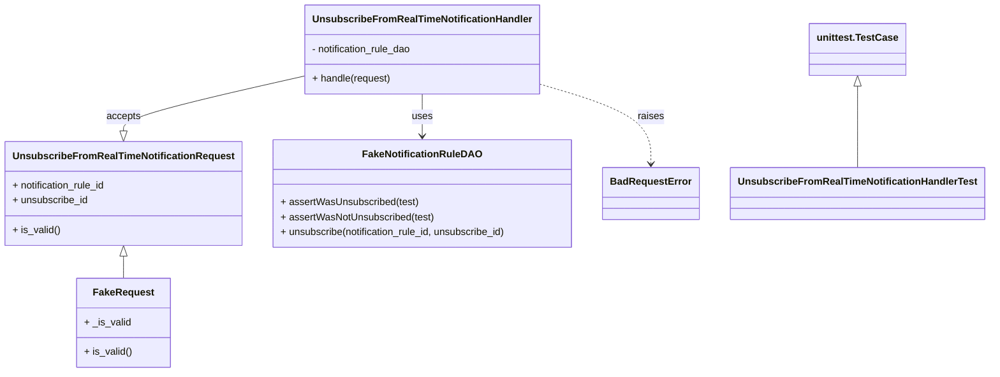
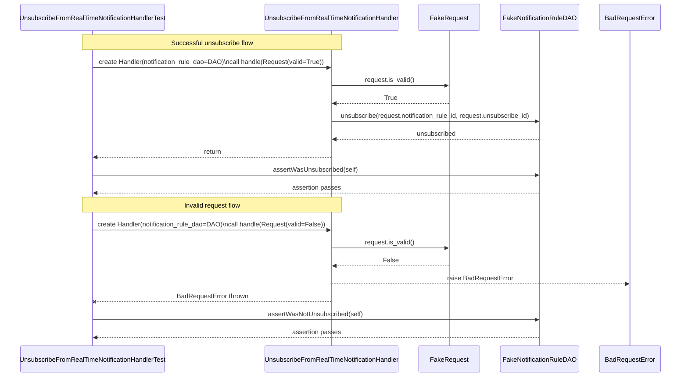

# Diagram: common/subscription_service/subscription_service_tests/unit/test_unsubscribe_from_real_time_notification_handler.py

> Auto-generated by Obscura crawlers

## Diagram 1

### SVG

<svg id="container" width="1559.0625" xmlns="http://www.w3.org/2000/svg" class="classDiagram" height="602" viewBox="0 0 1559.0625 602" role="graphics-document document" aria-roledescription="class"><g><defs><marker id="container_class-aggregationStart" class="marker aggregation class" refX="18" refY="7" markerWidth="190" markerHeight="240" orient="auto"><path d="M 18,7 L9,13 L1,7 L9,1 Z"></path></marker></defs><defs><marker id="container_class-aggregationEnd" class="marker aggregation class" refX="1" refY="7" markerWidth="20" markerHeight="28" orient="auto"><path d="M 18,7 L9,13 L1,7 L9,1 Z"></path></marker></defs><defs><marker id="container_class-extensionStart" class="marker extension class" refX="18" refY="7" markerWidth="190" markerHeight="240" orient="auto"><path d="M 1,7 L18,13 V 1 Z"></path></marker></defs><defs><marker id="container_class-extensionEnd" class="marker extension class" refX="1" refY="7" markerWidth="20" markerHeight="28" orient="auto"><path d="M 1,1 V 13 L18,7 Z"></path></marker></defs><defs><marker id="container_class-compositionStart" class="marker composition class" refX="18" refY="7" markerWidth="190" markerHeight="240" orient="auto"><path d="M 18,7 L9,13 L1,7 L9,1 Z"></path></marker></defs><defs><marker id="container_class-compositionEnd" class="marker composition class" refX="1" refY="7" markerWidth="20" markerHeight="28" orient="auto"><path d="M 18,7 L9,13 L1,7 L9,1 Z"></path></marker></defs><defs><marker id="container_class-dependencyStart" class="marker dependency class" refX="6" refY="7" markerWidth="190" markerHeight="240" orient="auto"><path d="M 5,7 L9,13 L1,7 L9,1 Z"></path></marker></defs><defs><marker id="container_class-dependencyEnd" class="marker dependency class" refX="13" refY="7" markerWidth="20" markerHeight="28" orient="auto"><path d="M 18,7 L9,13 L14,7 L9,1 Z"></path></marker></defs><defs><marker id="container_class-lollipopStart" class="marker lollipop class" refX="13" refY="7" markerWidth="190" markerHeight="240" orient="auto"><circle stroke="black" fill="transparent" cx="7" cy="7" r="6"></circle></marker></defs><defs><marker id="container_class-lollipopEnd" class="marker lollipop class" refX="1" refY="7" markerWidth="190" markerHeight="240" orient="auto"><circle stroke="black" fill="transparent" cx="7" cy="7" r="6"></circle></marker></defs><g class="root"><g class="clusters"></g><g class="edgePaths"><path d="M1354.852,139.25L1354.852,147.542C1354.852,155.833,1354.852,172.417,1354.852,194.375C1354.852,216.333,1354.852,243.667,1354.852,257.333L1354.852,271" id="id_unittest.TestCase_UnsubscribeFromRealTimeNotificationHandlerTest_1" class="edge-thickness-normal edge-pattern-solid relation" style=";;;" data-edge="true" data-et="edge" data-id="id_unittest.TestCase_UnsubscribeFromRealTimeNotificationHandlerTest_1" data-points="W3sieCI6MTM1NC44NTE1NjI1LCJ5IjoxMjJ9LHsieCI6MTM1NC44NTE1NjI1LCJ5IjoxODl9LHsieCI6MTM1NC44NTE1NjI1LCJ5IjoyNzF9XQ==" marker-start="url(#container_class-extensionStart)"></path><path d="M189.852,414.25L189.852,416.042C189.852,417.833,189.852,421.417,189.852,427.375C189.852,433.333,189.852,441.667,189.852,445.833L189.852,450" id="id_UnsubscribeFromRealTimeNotificationRequest_FakeRequest_2" class="edge-thickness-normal edge-pattern-solid relation" style=";;;" data-edge="true" data-et="edge" data-id="id_UnsubscribeFromRealTimeNotificationRequest_FakeRequest_2" data-points="W3sieCI6MTg5Ljg1MTU2MjUsInkiOjM5N30seyJ4IjoxODkuODUxNTYyNSwieSI6NDI1fSx7IngiOjE4OS44NTE1NjI1LCJ5Ijo0NTB9XQ==" marker-start="url(#container_class-extensionStart)"></path><path d="M665.891,152L665.891,158.167C665.891,164.333,665.891,176.667,665.891,188C665.891,199.333,665.891,209.667,665.891,214.833L665.891,220" id="id_UnsubscribeFromRealTimeNotificationHandler_FakeNotificationRuleDAO_3" class="edge-thickness-normal edge-pattern-solid relation" style=";;;" data-edge="true" data-et="edge" data-id="id_UnsubscribeFromRealTimeNotificationHandler_FakeNotificationRuleDAO_3" data-points="W3sieCI6NjY1Ljg5MDYyNSwieSI6MTUyfSx7IngiOjY2NS44OTA2MjUsInkiOjE4OX0seyJ4Ijo2NjUuODkwNjI1LCJ5IjoyMjZ9XQ==" marker-end="url(#container_class-dependencyEnd)"></path><path d="M484.93,121.435L435.75,132.696C386.57,143.957,288.211,166.478,239.031,181.531C189.852,196.583,189.852,204.167,189.852,207.958L189.852,211.75" id="id_UnsubscribeFromRealTimeNotificationHandler_UnsubscribeFromRealTimeNotificationRequest_4" class="edge-thickness-normal edge-pattern-solid relation" style=";;;" data-edge="true" data-et="edge" data-id="id_UnsubscribeFromRealTimeNotificationHandler_UnsubscribeFromRealTimeNotificationRequest_4" data-points="W3sieCI6NDg0LjkyOTY4NzUsInkiOjEyMS40MzUxMzM2NzE0MDk1N30seyJ4IjoxODkuODUxNTYyNSwieSI6MTg5fSx7IngiOjE4OS44NTE1NjI1LCJ5IjoyMjl9XQ==" marker-end="url(#container_class-extensionEnd)"></path><path d="M846.852,133.532L878.103,142.776C909.354,152.021,971.857,170.511,1003.108,192.422C1034.359,214.333,1034.359,239.667,1034.359,252.333L1034.359,265" id="id_UnsubscribeFromRealTimeNotificationHandler_BadRequestError_5" class="edge-thickness-normal edge-pattern-dashed relation" style=";;;" data-edge="true" data-et="edge" data-id="id_UnsubscribeFromRealTimeNotificationHandler_BadRequestError_5" data-points="W3sieCI6ODQ2Ljg1MTU2MjUsInkiOjEzMy41MzE2NTU0OTk5NTc2fSx7IngiOjEwMzQuMzU5Mzc1LCJ5IjoxODl9LHsieCI6MTAzNC4zNTkzNzUsInkiOjI3MX1d" marker-end="url(#container_class-dependencyEnd)"></path></g><g class="edgeLabels"><g class="edgeLabel"><g class="label" data-id="id_unittest.TestCase_UnsubscribeFromRealTimeNotificationHandlerTest_1" transform="translate(0, 0)"><foreignObject width="0" height="0">

</foreignObject></g></g><g class="edgeLabel"><g class="label" data-id="id_UnsubscribeFromRealTimeNotificationRequest_FakeRequest_2" transform="translate(0, 0)"><foreignObject width="0" height="0">

</foreignObject></g></g><g class="edgeLabel" transform="translate(665.890625, 189)"><g class="label" data-id="id_UnsubscribeFromRealTimeNotificationHandler_FakeNotificationRuleDAO_3" transform="translate(-16.4921875, -12)"><foreignObject width="32.984375" height="24">

uses

</foreignObject></g></g><g class="edgeLabel" transform="translate(189.8515625, 189)"><g class="label" data-id="id_UnsubscribeFromRealTimeNotificationHandler_UnsubscribeFromRealTimeNotificationRequest_4" transform="translate(-27.421875, -12)"><foreignObject width="54.84375" height="24">

accepts

</foreignObject></g></g><g class="edgeLabel" transform="translate(1034.359375, 189)"><g class="label" data-id="id_UnsubscribeFromRealTimeNotificationHandler_BadRequestError_5" transform="translate(-21.25, -12)"><foreignObject width="42.5" height="24">

raises

</foreignObject></g></g></g><g class="nodes"><g class="node default" id="classId-UnsubscribeFromRealTimeNotificationHandler-0" transform="translate(665.890625, 80)"><g class="basic label-container"><path d="M-180.9609375 -72 L180.9609375 -72 L180.9609375 72 L-180.9609375 72" stroke="none" stroke-width="0" fill="#ECECFF" style=""></path><path d="M-180.9609375 -72 C-67.53689494974536 -72, 45.88714760050928 -72, 180.9609375 -72 M-180.9609375 -72 C-107.44378193504346 -72, -33.92662637008692 -72, 180.9609375 -72 M180.9609375 -72 C180.9609375 -22.97858588869412, 180.9609375 26.04282822261176, 180.9609375 72 M180.9609375 -72 C180.9609375 -22.190125755434792, 180.9609375 27.619748489130416, 180.9609375 72 M180.9609375 72 C55.59488321698909 72, -69.77117106602182 72, -180.9609375 72 M180.9609375 72 C64.87409445553024 72, -51.21274858893952 72, -180.9609375 72 M-180.9609375 72 C-180.9609375 27.79789122849565, -180.9609375 -16.4042175430087, -180.9609375 -72 M-180.9609375 72 C-180.9609375 23.226120569016906, -180.9609375 -25.547758861966187, -180.9609375 -72" stroke="#9370DB" stroke-width="1.3" fill="none" stroke-dasharray="0 0" style=""></path></g><g class="annotation-group text" transform="translate(0, -48)"></g><g class="label-group text" transform="translate(-168.9609375, -48)"><g class="label" style="font-weight: bolder" transform="translate(0,-12)"><foreignObject width="337.921875" height="24">

UnsubscribeFromRealTimeNotificationHandler

</foreignObject></g></g><g class="members-group text" transform="translate(-168.9609375, 0)"><g class="label" style="" transform="translate(0,-12)"><foreignObject width="166.53125" height="24">

- notification_rule_dao

</foreignObject></g></g><g class="methods-group text" transform="translate(-168.9609375, 48)"><g class="label" style="" transform="translate(0,-12)"><foreignObject width="128.21875" height="24">

+ handle(request)

</foreignObject></g></g><g class="divider" style=""><path d="M-180.9609375 -24 C-98.32214519917551 -24, -15.683352898351018 -24, 180.9609375 -24 M-180.9609375 -24 C-60.50950395150808 -24, 59.94192959698384 -24, 180.9609375 -24" stroke="#9370DB" stroke-width="1.3" fill="none" stroke-dasharray="0 0" style=""></path></g><g class="divider" style=""><path d="M-180.9609375 24 C-56.779608802570664 24, 67.40171989485867 24, 180.9609375 24 M-180.9609375 24 C-48.908721018745496 24, 83.14349546250901 24, 180.9609375 24" stroke="#9370DB" stroke-width="1.3" fill="none" stroke-dasharray="0 0" style=""></path></g></g><g class="node default" id="classId-UnsubscribeFromRealTimeNotificationRequest-1" transform="translate(189.8515625, 313)"><g class="basic label-container"><path d="M-181.8515625 -84 L181.8515625 -84 L181.8515625 84 L-181.8515625 84" stroke="none" stroke-width="0" fill="#ECECFF" style=""></path><path d="M-181.8515625 -84 C-107.80650740433545 -84, -33.7614523086709 -84, 181.8515625 -84 M-181.8515625 -84 C-57.563841975911956 -84, 66.72387854817609 -84, 181.8515625 -84 M181.8515625 -84 C181.8515625 -40.12885083540217, 181.8515625 3.7422983291956626, 181.8515625 84 M181.8515625 -84 C181.8515625 -26.048952136941566, 181.8515625 31.90209572611687, 181.8515625 84 M181.8515625 84 C60.05984231071484 84, -61.731877878570316 84, -181.8515625 84 M181.8515625 84 C106.7940188501231 84, 31.73647520024619 84, -181.8515625 84 M-181.8515625 84 C-181.8515625 46.714184573261285, -181.8515625 9.42836914652257, -181.8515625 -84 M-181.8515625 84 C-181.8515625 39.03945710071953, -181.8515625 -5.921085798560938, -181.8515625 -84" stroke="#9370DB" stroke-width="1.3" fill="none" stroke-dasharray="0 0" style=""></path></g><g class="annotation-group text" transform="translate(0, -60)"></g><g class="label-group text" transform="translate(-169.8515625, -60)"><g class="label" style="font-weight: bolder" transform="translate(0,-12)"><foreignObject width="339.703125" height="24">

UnsubscribeFromRealTimeNotificationRequest

</foreignObject></g></g><g class="members-group text" transform="translate(-169.8515625, -12)"><g class="label" style="" transform="translate(0,-12)"><foreignObject width="154.859375" height="24">

+ notification_rule_id

</foreignObject></g><g class="label" style="" transform="translate(0,12)"><foreignObject width="123.3125" height="24">

+ unsubscribe_id

</foreignObject></g></g><g class="methods-group text" transform="translate(-169.8515625, 60)"><g class="label" style="" transform="translate(0,-12)"><foreignObject width="77.03125" height="24">

+ is_valid()

</foreignObject></g></g><g class="divider" style=""><path d="M-181.8515625 -36 C-38.378643867495214 -36, 105.09427476500957 -36, 181.8515625 -36 M-181.8515625 -36 C-79.16638013063452 -36, 23.518802238730956 -36, 181.8515625 -36" stroke="#9370DB" stroke-width="1.3" fill="none" stroke-dasharray="0 0" style=""></path></g><g class="divider" style=""><path d="M-181.8515625 36 C-80.06838142269298 36, 21.71479965461404 36, 181.8515625 36 M-181.8515625 36 C-108.42581879146007 36, -35.00007508292015 36, 181.8515625 36" stroke="#9370DB" stroke-width="1.3" fill="none" stroke-dasharray="0 0" style=""></path></g></g><g class="node default" id="classId-FakeRequest-2" transform="translate(189.8515625, 522)"><g class="basic label-container"><path d="M-73.76953125 -72 L73.76953125 -72 L73.76953125 72 L-73.76953125 72" stroke="none" stroke-width="0" fill="#ECECFF" style=""></path><path d="M-73.76953125 -72 C-43.82875503566351 -72, -13.887978821327025 -72, 73.76953125 -72 M-73.76953125 -72 C-39.04888989526333 -72, -4.328248540526658 -72, 73.76953125 -72 M73.76953125 -72 C73.76953125 -31.820060025550532, 73.76953125 8.359879948898936, 73.76953125 72 M73.76953125 -72 C73.76953125 -33.44334479750765, 73.76953125 5.113310404984702, 73.76953125 72 M73.76953125 72 C37.39843855363108 72, 1.027345857262162 72, -73.76953125 72 M73.76953125 72 C40.24059802003173 72, 6.711664790063466 72, -73.76953125 72 M-73.76953125 72 C-73.76953125 19.498461277316082, -73.76953125 -33.003077445367836, -73.76953125 -72 M-73.76953125 72 C-73.76953125 41.68851255144013, -73.76953125 11.377025102880253, -73.76953125 -72" stroke="#9370DB" stroke-width="1.3" fill="none" stroke-dasharray="0 0" style=""></path></g><g class="annotation-group text" transform="translate(0, -48)"></g><g class="label-group text" transform="translate(-46.5078125, -48)"><g class="label" style="font-weight: bolder" transform="translate(0,-12)"><foreignObject width="93.015625" height="24">

FakeRequest

</foreignObject></g></g><g class="members-group text" transform="translate(-61.76953125, 0)"><g class="label" style="" transform="translate(0,-12)"><foreignObject width="74.984375" height="24">

+ _is_valid

</foreignObject></g></g><g class="methods-group text" transform="translate(-61.76953125, 48)"><g class="label" style="" transform="translate(0,-12)"><foreignObject width="77.03125" height="24">

+ is_valid()

</foreignObject></g></g><g class="divider" style=""><path d="M-73.76953125 -24 C-34.4629329652798 -24, 4.8436653194404045 -24, 73.76953125 -24 M-73.76953125 -24 C-42.68334159768826 -24, -11.597151945376524 -24, 73.76953125 -24" stroke="#9370DB" stroke-width="1.3" fill="none" stroke-dasharray="0 0" style=""></path></g><g class="divider" style=""><path d="M-73.76953125 24 C-15.659509153289918 24, 42.450512943420165 24, 73.76953125 24 M-73.76953125 24 C-39.53932881754649 24, -5.309126385092981 24, 73.76953125 24" stroke="#9370DB" stroke-width="1.3" fill="none" stroke-dasharray="0 0" style=""></path></g></g><g class="node default" id="classId-FakeNotificationRuleDAO-3" transform="translate(665.890625, 313)"><g class="basic label-container"><path d="M-244.1875 -87 L244.1875 -87 L244.1875 87 L-244.1875 87" stroke="none" stroke-width="0" fill="#ECECFF" style=""></path><path d="M-244.1875 -87 C-55.68875882652094 -87, 132.80998234695812 -87, 244.1875 -87 M-244.1875 -87 C-126.83430676140102 -87, -9.481113522802048 -87, 244.1875 -87 M244.1875 -87 C244.1875 -43.35269135797426, 244.1875 0.29461728405148335, 244.1875 87 M244.1875 -87 C244.1875 -21.105072843924646, 244.1875 44.78985431215071, 244.1875 87 M244.1875 87 C75.16651138691023 87, -93.85447722617954 87, -244.1875 87 M244.1875 87 C69.77818646950846 87, -104.63112706098309 87, -244.1875 87 M-244.1875 87 C-244.1875 51.076228587177, -244.1875 15.152457174353998, -244.1875 -87 M-244.1875 87 C-244.1875 42.9864966611923, -244.1875 -1.0270066776154039, -244.1875 -87" stroke="#9370DB" stroke-width="1.3" fill="none" stroke-dasharray="0 0" style=""></path></g><g class="annotation-group text" transform="translate(0, -63)"></g><g class="label-group text" transform="translate(-90.96875, -63)"><g class="label" style="font-weight: bolder" transform="translate(0,-12)"><foreignObject width="181.9375" height="24">

FakeNotificationRuleDAO

</foreignObject></g></g><g class="members-group text" transform="translate(-232.1875, -15)"></g><g class="methods-group text" transform="translate(-232.1875, 15)"><g class="label" style="" transform="translate(0,-12)"><foreignObject width="222.71875" height="24">

+ assertWasUnsubscribed(test)

</foreignObject></g><g class="label" style="" transform="translate(0,12)"><foreignObject width="248.765625" height="24">

+ assertWasNotUnsubscribed(test)

</foreignObject></g><g class="label" style="" transform="translate(0,36)"><foreignObject width="373.40625" height="24">

+ unsubscribe(notification_rule_id, unsubscribe_id)

</foreignObject></g></g><g class="divider" style=""><path d="M-244.1875 -39 C-125.61041560132253 -39, -7.0333312026450585 -39, 244.1875 -39 M-244.1875 -39 C-107.97185155011329 -39, 28.24379689977343 -39, 244.1875 -39" stroke="#9370DB" stroke-width="1.3" fill="none" stroke-dasharray="0 0" style=""></path></g><g class="divider" style=""><path d="M-244.1875 -15 C-62.39820667575907 -15, 119.39108664848186 -15, 244.1875 -15 M-244.1875 -15 C-119.29320769796799 -15, 5.601084604064027 -15, 244.1875 -15" stroke="#9370DB" stroke-width="1.3" fill="none" stroke-dasharray="0 0" style=""></path></g></g><g class="node default" id="classId-BadRequestError-4" transform="translate(1034.359375, 313)"><g class="basic label-container"><path d="M-74.28125 -42 L74.28125 -42 L74.28125 42 L-74.28125 42" stroke="none" stroke-width="0" fill="#ECECFF" style=""></path><path d="M-74.28125 -42 C-31.928290388067047 -42, 10.424669223865905 -42, 74.28125 -42 M-74.28125 -42 C-23.082811718724294 -42, 28.115626562551412 -42, 74.28125 -42 M74.28125 -42 C74.28125 -22.579636674884974, 74.28125 -3.159273349769947, 74.28125 42 M74.28125 -42 C74.28125 -21.073580165503067, 74.28125 -0.14716033100613402, 74.28125 42 M74.28125 42 C26.33799470555509 42, -21.60526058888982 42, -74.28125 42 M74.28125 42 C34.966706729310836 42, -4.347836541378328 42, -74.28125 42 M-74.28125 42 C-74.28125 15.796112610303531, -74.28125 -10.407774779392938, -74.28125 -42 M-74.28125 42 C-74.28125 12.26629043824472, -74.28125 -17.46741912351056, -74.28125 -42" stroke="#9370DB" stroke-width="1.3" fill="none" stroke-dasharray="0 0" style=""></path></g><g class="annotation-group text" transform="translate(0, -18)"></g><g class="label-group text" transform="translate(-62.28125, -18)"><g class="label" style="font-weight: bolder" transform="translate(0,-12)"><foreignObject width="124.5625" height="24">

BadRequestError

</foreignObject></g></g><g class="members-group text" transform="translate(-62.28125, 30)"></g><g class="methods-group text" transform="translate(-62.28125, 60)"></g><g class="divider" style=""><path d="M-74.28125 6 C-26.64132794590077 6, 20.99859410819846 6, 74.28125 6 M-74.28125 6 C-27.814565804128748 6, 18.652118391742505 6, 74.28125 6" stroke="#9370DB" stroke-width="1.3" fill="none" stroke-dasharray="0 0" style=""></path></g><g class="divider" style=""><path d="M-74.28125 24 C-42.55219204493649 24, -10.823134089872973 24, 74.28125 24 M-74.28125 24 C-25.286007196051166 24, 23.709235607897668 24, 74.28125 24" stroke="#9370DB" stroke-width="1.3" fill="none" stroke-dasharray="0 0" style=""></path></g></g><g class="node default" id="classId-unittest.TestCase-5" transform="translate(1354.8515625, 80)"><g class="basic label-container"><path d="M-74.7109375 -42 L74.7109375 -42 L74.7109375 42 L-74.7109375 42" stroke="none" stroke-width="0" fill="#ECECFF" style=""></path><path d="M-74.7109375 -42 C-16.059993287978237 -42, 42.590950924043526 -42, 74.7109375 -42 M-74.7109375 -42 C-24.726418781413948 -42, 25.258099937172105 -42, 74.7109375 -42 M74.7109375 -42 C74.7109375 -16.08779799482681, 74.7109375 9.824404010346377, 74.7109375 42 M74.7109375 -42 C74.7109375 -17.42347613356864, 74.7109375 7.153047732862717, 74.7109375 42 M74.7109375 42 C29.608393606656165 42, -15.49415028668767 42, -74.7109375 42 M74.7109375 42 C18.95081733573039 42, -36.80930282853922 42, -74.7109375 42 M-74.7109375 42 C-74.7109375 13.648170874161341, -74.7109375 -14.703658251677318, -74.7109375 -42 M-74.7109375 42 C-74.7109375 23.12371901089483, -74.7109375 4.247438021789662, -74.7109375 -42" stroke="#9370DB" stroke-width="1.3" fill="none" stroke-dasharray="0 0" style=""></path></g><g class="annotation-group text" transform="translate(0, -18)"></g><g class="label-group text" transform="translate(-62.7109375, -18)"><g class="label" style="font-weight: bolder" transform="translate(0,-12)"><foreignObject width="125.421875" height="24">

unittest.TestCase

</foreignObject></g></g><g class="members-group text" transform="translate(-62.7109375, 30)"></g><g class="methods-group text" transform="translate(-62.7109375, 60)"></g><g class="divider" style=""><path d="M-74.7109375 6 C-43.98643300528474 6, -13.261928510569476 6, 74.7109375 6 M-74.7109375 6 C-42.661693166500726 6, -10.612448833001451 6, 74.7109375 6" stroke="#9370DB" stroke-width="1.3" fill="none" stroke-dasharray="0 0" style=""></path></g><g class="divider" style=""><path d="M-74.7109375 24 C-39.64292070063338 24, -4.574903901266765 24, 74.7109375 24 M-74.7109375 24 C-37.489235747658704 24, -0.2675339953174074 24, 74.7109375 24" stroke="#9370DB" stroke-width="1.3" fill="none" stroke-dasharray="0 0" style=""></path></g></g><g class="node default" id="classId-UnsubscribeFromRealTimeNotificationHandlerTest-6" transform="translate(1354.8515625, 313)"><g class="basic label-container"><path d="M-196.2109375 -42 L196.2109375 -42 L196.2109375 42 L-196.2109375 42" stroke="none" stroke-width="0" fill="#ECECFF" style=""></path><path d="M-196.2109375 -42 C-40.88992205368962 -42, 114.43109339262077 -42, 196.2109375 -42 M-196.2109375 -42 C-81.9069372043777 -42, 32.397063091244604 -42, 196.2109375 -42 M196.2109375 -42 C196.2109375 -9.908580106800194, 196.2109375 22.18283978639961, 196.2109375 42 M196.2109375 -42 C196.2109375 -16.174540064989166, 196.2109375 9.650919870021667, 196.2109375 42 M196.2109375 42 C57.18937024650677 42, -81.83219700698646 42, -196.2109375 42 M196.2109375 42 C42.77481488245732 42, -110.66130773508536 42, -196.2109375 42 M-196.2109375 42 C-196.2109375 21.47898214390384, -196.2109375 0.9579642878076768, -196.2109375 -42 M-196.2109375 42 C-196.2109375 18.97671920685943, -196.2109375 -4.046561586281143, -196.2109375 -42" stroke="#9370DB" stroke-width="1.3" fill="none" stroke-dasharray="0 0" style=""></path></g><g class="annotation-group text" transform="translate(0, -18)"></g><g class="label-group text" transform="translate(-184.2109375, -18)"><g class="label" style="font-weight: bolder" transform="translate(0,-12)"><foreignObject width="368.421875" height="24">

UnsubscribeFromRealTimeNotificationHandlerTest

</foreignObject></g></g><g class="members-group text" transform="translate(-184.2109375, 30)"></g><g class="methods-group text" transform="translate(-184.2109375, 60)"></g><g class="divider" style=""><path d="M-196.2109375 6 C-83.00984746922452 6, 30.19124256155095 6, 196.2109375 6 M-196.2109375 6 C-79.11714150406539 6, 37.976654491869226 6, 196.2109375 6" stroke="#9370DB" stroke-width="1.3" fill="none" stroke-dasharray="0 0" style=""></path></g><g class="divider" style=""><path d="M-196.2109375 24 C-116.89334865810065 24, -37.5757598162013 24, 196.2109375 24 M-196.2109375 24 C-117.47580774963767 24, -38.740677999275334 24, 196.2109375 24" stroke="#9370DB" stroke-width="1.3" fill="none" stroke-dasharray="0 0" style=""></path></g></g></g></g></g></svg>

## Diagram 2

### SVG

<svg id="container" width="1759" xmlns="http://www.w3.org/2000/svg" height="989" viewBox="-50 -10 1759 989" role="graphics-document document" aria-roledescription="sequence"><g><rect x="1509" y="903" fill="#eaeaea" stroke="#666" width="150" height="65" name="Err" rx="3" ry="3" class="actor actor-bottom"></rect><text x="1584" y="935.5" dominant-baseline="central" alignment-baseline="central" class="actor actor-box" style="text-anchor: middle; font-size: 16px; font-weight: 400;"><tspan x="1584" dy="0">BadRequestError</tspan></text></g><g><rect x="1259" y="903" fill="#eaeaea" stroke="#666" width="200" height="65" name="DAO" rx="3" ry="3" class="actor actor-bottom"></rect><text x="1359" y="935.5" dominant-baseline="central" alignment-baseline="central" class="actor actor-box" style="text-anchor: middle; font-size: 16px; font-weight: 400;"><tspan x="1359" dy="0">FakeNotificationRuleDAO</tspan></text></g><g><rect x="1059" y="903" fill="#eaeaea" stroke="#666" width="150" height="65" name="Request" rx="3" ry="3" class="actor actor-bottom"></rect><text x="1134" y="935.5" dominant-baseline="central" alignment-baseline="central" class="actor actor-box" style="text-anchor: middle; font-size: 16px; font-weight: 400;"><tspan x="1134" dy="0">FakeRequest</tspan></text></g><g><rect x="652" y="903" fill="#eaeaea" stroke="#666" width="357" height="65" name="Handler" rx="3" ry="3" class="actor actor-bottom"></rect><text x="830.5" y="935.5" dominant-baseline="central" alignment-baseline="central" class="actor actor-box" style="text-anchor: middle; font-size: 16px; font-weight: 400;"><tspan x="830.5" dy="0">UnsubscribeFromRealTimeNotificationHandler</tspan></text></g><g><rect x="0" y="903" fill="#eaeaea" stroke="#666" width="385" height="65" name="Test" rx="3" ry="3" class="actor actor-bottom"></rect><text x="192.5" y="935.5" dominant-baseline="central" alignment-baseline="central" class="actor actor-box" style="text-anchor: middle; font-size: 16px; font-weight: 400;"><tspan x="192.5" dy="0">UnsubscribeFromRealTimeNotificationHandlerTest</tspan></text></g><g><line id="actor4" x1="1584" y1="65" x2="1584" y2="903" class="actor-line 200" stroke-width="0.5px" stroke="#999" name="Err"></line><g id="root-4"><rect x="1509" y="0" fill="#eaeaea" stroke="#666" width="150" height="65" name="Err" rx="3" ry="3" class="actor actor-top"></rect><text x="1584" y="32.5" dominant-baseline="central" alignment-baseline="central" class="actor actor-box" style="text-anchor: middle; font-size: 16px; font-weight: 400;"><tspan x="1584" dy="0">BadRequestError</tspan></text></g></g><g><line id="actor3" x1="1359" y1="65" x2="1359" y2="903" class="actor-line 200" stroke-width="0.5px" stroke="#999" name="DAO"></line><g id="root-3"><rect x="1259" y="0" fill="#eaeaea" stroke="#666" width="200" height="65" name="DAO" rx="3" ry="3" class="actor actor-top"></rect><text x="1359" y="32.5" dominant-baseline="central" alignment-baseline="central" class="actor actor-box" style="text-anchor: middle; font-size: 16px; font-weight: 400;"><tspan x="1359" dy="0">FakeNotificationRuleDAO</tspan></text></g></g><g><line id="actor2" x1="1134" y1="65" x2="1134" y2="903" class="actor-line 200" stroke-width="0.5px" stroke="#999" name="Request"></line><g id="root-2"><rect x="1059" y="0" fill="#eaeaea" stroke="#666" width="150" height="65" name="Request" rx="3" ry="3" class="actor actor-top"></rect><text x="1134" y="32.5" dominant-baseline="central" alignment-baseline="central" class="actor actor-box" style="text-anchor: middle; font-size: 16px; font-weight: 400;"><tspan x="1134" dy="0">FakeRequest</tspan></text></g></g><g><line id="actor1" x1="830.5" y1="65" x2="830.5" y2="903" class="actor-line 200" stroke-width="0.5px" stroke="#999" name="Handler"></line><g id="root-1"><rect x="652" y="0" fill="#eaeaea" stroke="#666" width="357" height="65" name="Handler" rx="3" ry="3" class="actor actor-top"></rect><text x="830.5" y="32.5" dominant-baseline="central" alignment-baseline="central" class="actor actor-box" style="text-anchor: middle; font-size: 16px; font-weight: 400;"><tspan x="830.5" dy="0">UnsubscribeFromRealTimeNotificationHandler</tspan></text></g></g><g><line id="actor0" x1="192.5" y1="65" x2="192.5" y2="903" class="actor-line 200" stroke-width="0.5px" stroke="#999" name="Test"></line><g id="root-0"><rect x="0" y="0" fill="#eaeaea" stroke="#666" width="385" height="65" name="Test" rx="3" ry="3" class="actor actor-top"></rect><text x="192.5" y="32.5" dominant-baseline="central" alignment-baseline="central" class="actor actor-box" style="text-anchor: middle; font-size: 16px; font-weight: 400;"><tspan x="192.5" dy="0">UnsubscribeFromRealTimeNotificationHandlerTest</tspan></text></g></g><g></g><defs><symbol id="computer" width="24" height="24"><path transform="scale(.5)" d="M2 2v13h20v-13h-20zm18 11h-16v-9h16v9zm-10.228 6l.466-1h3.524l.467 1h-4.457zm14.228 3h-24l2-6h2.104l-1.33 4h18.45l-1.297-4h2.073l2 6zm-5-10h-14v-7h14v7z"></path></symbol></defs><defs><symbol id="database" fill-rule="evenodd" clip-rule="evenodd"><path transform="scale(.5)" d="M12.258.001l.256.004.255.005.253.008.251.01.249.012.247.015.246.016.242.019.241.02.239.023.236.024.233.027.231.028.229.031.225.032.223.034.22.036.217.038.214.04.211.041.208.043.205.045.201.046.198.048.194.05.191.051.187.053.183.054.18.056.175.057.172.059.168.06.163.061.16.063.155.064.15.066.074.033.073.033.071.034.07.034.069.035.068.035.067.035.066.035.064.036.064.036.062.036.06.036.06.037.058.037.058.037.055.038.055.038.053.038.052.038.051.039.05.039.048.039.047.039.045.04.044.04.043.04.041.04.04.041.039.041.037.041.036.041.034.041.033.042.032.042.03.042.029.042.027.042.026.043.024.043.023.043.021.043.02.043.018.044.017.043.015.044.013.044.012.044.011.045.009.044.007.045.006.045.004.045.002.045.001.045v17l-.001.045-.002.045-.004.045-.006.045-.007.045-.009.044-.011.045-.012.044-.013.044-.015.044-.017.043-.018.044-.02.043-.021.043-.023.043-.024.043-.026.043-.027.042-.029.042-.03.042-.032.042-.033.042-.034.041-.036.041-.037.041-.039.041-.04.041-.041.04-.043.04-.044.04-.045.04-.047.039-.048.039-.05.039-.051.039-.052.038-.053.038-.055.038-.055.038-.058.037-.058.037-.06.037-.06.036-.062.036-.064.036-.064.036-.066.035-.067.035-.068.035-.069.035-.07.034-.071.034-.073.033-.074.033-.15.066-.155.064-.16.063-.163.061-.168.06-.172.059-.175.057-.18.056-.183.054-.187.053-.191.051-.194.05-.198.048-.201.046-.205.045-.208.043-.211.041-.214.04-.217.038-.22.036-.223.034-.225.032-.229.031-.231.028-.233.027-.236.024-.239.023-.241.02-.242.019-.246.016-.247.015-.249.012-.251.01-.253.008-.255.005-.256.004-.258.001-.258-.001-.256-.004-.255-.005-.253-.008-.251-.01-.249-.012-.247-.015-.245-.016-.243-.019-.241-.02-.238-.023-.236-.024-.234-.027-.231-.028-.228-.031-.226-.032-.223-.034-.22-.036-.217-.038-.214-.04-.211-.041-.208-.043-.204-.045-.201-.046-.198-.048-.195-.05-.19-.051-.187-.053-.184-.054-.179-.056-.176-.057-.172-.059-.167-.06-.164-.061-.159-.063-.155-.064-.151-.066-.074-.033-.072-.033-.072-.034-.07-.034-.069-.035-.068-.035-.067-.035-.066-.035-.064-.036-.063-.036-.062-.036-.061-.036-.06-.037-.058-.037-.057-.037-.056-.038-.055-.038-.053-.038-.052-.038-.051-.039-.049-.039-.049-.039-.046-.039-.046-.04-.044-.04-.043-.04-.041-.04-.04-.041-.039-.041-.037-.041-.036-.041-.034-.041-.033-.042-.032-.042-.03-.042-.029-.042-.027-.042-.026-.043-.024-.043-.023-.043-.021-.043-.02-.043-.018-.044-.017-.043-.015-.044-.013-.044-.012-.044-.011-.045-.009-.044-.007-.045-.006-.045-.004-.045-.002-.045-.001-.045v-17l.001-.045.002-.045.004-.045.006-.045.007-.045.009-.044.011-.045.012-.044.013-.044.015-.044.017-.043.018-.044.02-.043.021-.043.023-.043.024-.043.026-.043.027-.042.029-.042.03-.042.032-.042.033-.042.034-.041.036-.041.037-.041.039-.041.04-.041.041-.04.043-.04.044-.04.046-.04.046-.039.049-.039.049-.039.051-.039.052-.038.053-.038.055-.038.056-.038.057-.037.058-.037.06-.037.061-.036.062-.036.063-.036.064-.036.066-.035.067-.035.068-.035.069-.035.07-.034.072-.034.072-.033.074-.033.151-.066.155-.064.159-.063.164-.061.167-.06.172-.059.176-.057.179-.056.184-.054.187-.053.19-.051.195-.05.198-.048.201-.046.204-.045.208-.043.211-.041.214-.04.217-.038.22-.036.223-.034.226-.032.228-.031.231-.028.234-.027.236-.024.238-.023.241-.02.243-.019.245-.016.247-.015.249-.012.251-.01.253-.008.255-.005.256-.004.258-.001.258.001zm-9.258 20.499v.01l.001.021.003.021.004.022.005.021.006.022.007.022.009.023.01.022.011.023.012.023.013.023.015.023.016.024.017.023.018.024.019.024.021.024.022.025.023.024.024.025.052.049.056.05.061.051.066.051.07.051.075.051.079.052.084.052.088.052.092.052.097.052.102.051.105.052.11.052.114.051.119.051.123.051.127.05.131.05.135.05.139.048.144.049.147.047.152.047.155.047.16.045.163.045.167.043.171.043.176.041.178.041.183.039.187.039.19.037.194.035.197.035.202.033.204.031.209.03.212.029.216.027.219.025.222.024.226.021.23.02.233.018.236.016.24.015.243.012.246.01.249.008.253.005.256.004.259.001.26-.001.257-.004.254-.005.25-.008.247-.011.244-.012.241-.014.237-.016.233-.018.231-.021.226-.021.224-.024.22-.026.216-.027.212-.028.21-.031.205-.031.202-.034.198-.034.194-.036.191-.037.187-.039.183-.04.179-.04.175-.042.172-.043.168-.044.163-.045.16-.046.155-.046.152-.047.148-.048.143-.049.139-.049.136-.05.131-.05.126-.05.123-.051.118-.052.114-.051.11-.052.106-.052.101-.052.096-.052.092-.052.088-.053.083-.051.079-.052.074-.052.07-.051.065-.051.06-.051.056-.05.051-.05.023-.024.023-.025.021-.024.02-.024.019-.024.018-.024.017-.024.015-.023.014-.024.013-.023.012-.023.01-.023.01-.022.008-.022.006-.022.006-.022.004-.022.004-.021.001-.021.001-.021v-4.127l-.077.055-.08.053-.083.054-.085.053-.087.052-.09.052-.093.051-.095.05-.097.05-.1.049-.102.049-.105.048-.106.047-.109.047-.111.046-.114.045-.115.045-.118.044-.12.043-.122.042-.124.042-.126.041-.128.04-.13.04-.132.038-.134.038-.135.037-.138.037-.139.035-.142.035-.143.034-.144.033-.147.032-.148.031-.15.03-.151.03-.153.029-.154.027-.156.027-.158.026-.159.025-.161.024-.162.023-.163.022-.165.021-.166.02-.167.019-.169.018-.169.017-.171.016-.173.015-.173.014-.175.013-.175.012-.177.011-.178.01-.179.008-.179.008-.181.006-.182.005-.182.004-.184.003-.184.002h-.37l-.184-.002-.184-.003-.182-.004-.182-.005-.181-.006-.179-.008-.179-.008-.178-.01-.176-.011-.176-.012-.175-.013-.173-.014-.172-.015-.171-.016-.17-.017-.169-.018-.167-.019-.166-.02-.165-.021-.163-.022-.162-.023-.161-.024-.159-.025-.157-.026-.156-.027-.155-.027-.153-.029-.151-.03-.15-.03-.148-.031-.146-.032-.145-.033-.143-.034-.141-.035-.14-.035-.137-.037-.136-.037-.134-.038-.132-.038-.13-.04-.128-.04-.126-.041-.124-.042-.122-.042-.12-.044-.117-.043-.116-.045-.113-.045-.112-.046-.109-.047-.106-.047-.105-.048-.102-.049-.1-.049-.097-.05-.095-.05-.093-.052-.09-.051-.087-.052-.085-.053-.083-.054-.08-.054-.077-.054v4.127zm0-5.654v.011l.001.021.003.021.004.021.005.022.006.022.007.022.009.022.01.022.011.023.012.023.013.023.015.024.016.023.017.024.018.024.019.024.021.024.022.024.023.025.024.024.052.05.056.05.061.05.066.051.07.051.075.052.079.051.084.052.088.052.092.052.097.052.102.052.105.052.11.051.114.051.119.052.123.05.127.051.131.05.135.049.139.049.144.048.147.048.152.047.155.046.16.045.163.045.167.044.171.042.176.042.178.04.183.04.187.038.19.037.194.036.197.034.202.033.204.032.209.03.212.028.216.027.219.025.222.024.226.022.23.02.233.018.236.016.24.014.243.012.246.01.249.008.253.006.256.003.259.001.26-.001.257-.003.254-.006.25-.008.247-.01.244-.012.241-.015.237-.016.233-.018.231-.02.226-.022.224-.024.22-.025.216-.027.212-.029.21-.03.205-.032.202-.033.198-.035.194-.036.191-.037.187-.039.183-.039.179-.041.175-.042.172-.043.168-.044.163-.045.16-.045.155-.047.152-.047.148-.048.143-.048.139-.05.136-.049.131-.05.126-.051.123-.051.118-.051.114-.052.11-.052.106-.052.101-.052.096-.052.092-.052.088-.052.083-.052.079-.052.074-.051.07-.052.065-.051.06-.05.056-.051.051-.049.023-.025.023-.024.021-.025.02-.024.019-.024.018-.024.017-.024.015-.023.014-.023.013-.024.012-.022.01-.023.01-.023.008-.022.006-.022.006-.022.004-.021.004-.022.001-.021.001-.021v-4.139l-.077.054-.08.054-.083.054-.085.052-.087.053-.09.051-.093.051-.095.051-.097.05-.1.049-.102.049-.105.048-.106.047-.109.047-.111.046-.114.045-.115.044-.118.044-.12.044-.122.042-.124.042-.126.041-.128.04-.13.039-.132.039-.134.038-.135.037-.138.036-.139.036-.142.035-.143.033-.144.033-.147.033-.148.031-.15.03-.151.03-.153.028-.154.028-.156.027-.158.026-.159.025-.161.024-.162.023-.163.022-.165.021-.166.02-.167.019-.169.018-.169.017-.171.016-.173.015-.173.014-.175.013-.175.012-.177.011-.178.009-.179.009-.179.007-.181.007-.182.005-.182.004-.184.003-.184.002h-.37l-.184-.002-.184-.003-.182-.004-.182-.005-.181-.007-.179-.007-.179-.009-.178-.009-.176-.011-.176-.012-.175-.013-.173-.014-.172-.015-.171-.016-.17-.017-.169-.018-.167-.019-.166-.02-.165-.021-.163-.022-.162-.023-.161-.024-.159-.025-.157-.026-.156-.027-.155-.028-.153-.028-.151-.03-.15-.03-.148-.031-.146-.033-.145-.033-.143-.033-.141-.035-.14-.036-.137-.036-.136-.037-.134-.038-.132-.039-.13-.039-.128-.04-.126-.041-.124-.042-.122-.043-.12-.043-.117-.044-.116-.044-.113-.046-.112-.046-.109-.046-.106-.047-.105-.048-.102-.049-.1-.049-.097-.05-.095-.051-.093-.051-.09-.051-.087-.053-.085-.052-.083-.054-.08-.054-.077-.054v4.139zm0-5.666v.011l.001.02.003.022.004.021.005.022.006.021.007.022.009.023.01.022.011.023.012.023.013.023.015.023.016.024.017.024.018.023.019.024.021.025.022.024.023.024.024.025.052.05.056.05.061.05.066.051.07.051.075.052.079.051.084.052.088.052.092.052.097.052.102.052.105.051.11.052.114.051.119.051.123.051.127.05.131.05.135.05.139.049.144.048.147.048.152.047.155.046.16.045.163.045.167.043.171.043.176.042.178.04.183.04.187.038.19.037.194.036.197.034.202.033.204.032.209.03.212.028.216.027.219.025.222.024.226.021.23.02.233.018.236.017.24.014.243.012.246.01.249.008.253.006.256.003.259.001.26-.001.257-.003.254-.006.25-.008.247-.01.244-.013.241-.014.237-.016.233-.018.231-.02.226-.022.224-.024.22-.025.216-.027.212-.029.21-.03.205-.032.202-.033.198-.035.194-.036.191-.037.187-.039.183-.039.179-.041.175-.042.172-.043.168-.044.163-.045.16-.045.155-.047.152-.047.148-.048.143-.049.139-.049.136-.049.131-.051.126-.05.123-.051.118-.052.114-.051.11-.052.106-.052.101-.052.096-.052.092-.052.088-.052.083-.052.079-.052.074-.052.07-.051.065-.051.06-.051.056-.05.051-.049.023-.025.023-.025.021-.024.02-.024.019-.024.018-.024.017-.024.015-.023.014-.024.013-.023.012-.023.01-.022.01-.023.008-.022.006-.022.006-.022.004-.022.004-.021.001-.021.001-.021v-4.153l-.077.054-.08.054-.083.053-.085.053-.087.053-.09.051-.093.051-.095.051-.097.05-.1.049-.102.048-.105.048-.106.048-.109.046-.111.046-.114.046-.115.044-.118.044-.12.043-.122.043-.124.042-.126.041-.128.04-.13.039-.132.039-.134.038-.135.037-.138.036-.139.036-.142.034-.143.034-.144.033-.147.032-.148.032-.15.03-.151.03-.153.028-.154.028-.156.027-.158.026-.159.024-.161.024-.162.023-.163.023-.165.021-.166.02-.167.019-.169.018-.169.017-.171.016-.173.015-.173.014-.175.013-.175.012-.177.01-.178.01-.179.009-.179.007-.181.006-.182.006-.182.004-.184.003-.184.001-.185.001-.185-.001-.184-.001-.184-.003-.182-.004-.182-.006-.181-.006-.179-.007-.179-.009-.178-.01-.176-.01-.176-.012-.175-.013-.173-.014-.172-.015-.171-.016-.17-.017-.169-.018-.167-.019-.166-.02-.165-.021-.163-.023-.162-.023-.161-.024-.159-.024-.157-.026-.156-.027-.155-.028-.153-.028-.151-.03-.15-.03-.148-.032-.146-.032-.145-.033-.143-.034-.141-.034-.14-.036-.137-.036-.136-.037-.134-.038-.132-.039-.13-.039-.128-.041-.126-.041-.124-.041-.122-.043-.12-.043-.117-.044-.116-.044-.113-.046-.112-.046-.109-.046-.106-.048-.105-.048-.102-.048-.1-.05-.097-.049-.095-.051-.093-.051-.09-.052-.087-.052-.085-.053-.083-.053-.08-.054-.077-.054v4.153zm8.74-8.179l-.257.004-.254.005-.25.008-.247.011-.244.012-.241.014-.237.016-.233.018-.231.021-.226.022-.224.023-.22.026-.216.027-.212.028-.21.031-.205.032-.202.033-.198.034-.194.036-.191.038-.187.038-.183.04-.179.041-.175.042-.172.043-.168.043-.163.045-.16.046-.155.046-.152.048-.148.048-.143.048-.139.049-.136.05-.131.05-.126.051-.123.051-.118.051-.114.052-.11.052-.106.052-.101.052-.096.052-.092.052-.088.052-.083.052-.079.052-.074.051-.07.052-.065.051-.06.05-.056.05-.051.05-.023.025-.023.024-.021.024-.02.025-.019.024-.018.024-.017.023-.015.024-.014.023-.013.023-.012.023-.01.023-.01.022-.008.022-.006.023-.006.021-.004.022-.004.021-.001.021-.001.021.001.021.001.021.004.021.004.022.006.021.006.023.008.022.01.022.01.023.012.023.013.023.014.023.015.024.017.023.018.024.019.024.02.025.021.024.023.024.023.025.051.05.056.05.06.05.065.051.07.052.074.051.079.052.083.052.088.052.092.052.096.052.101.052.106.052.11.052.114.052.118.051.123.051.126.051.131.05.136.05.139.049.143.048.148.048.152.048.155.046.16.046.163.045.168.043.172.043.175.042.179.041.183.04.187.038.191.038.194.036.198.034.202.033.205.032.21.031.212.028.216.027.22.026.224.023.226.022.231.021.233.018.237.016.241.014.244.012.247.011.25.008.254.005.257.004.26.001.26-.001.257-.004.254-.005.25-.008.247-.011.244-.012.241-.014.237-.016.233-.018.231-.021.226-.022.224-.023.22-.026.216-.027.212-.028.21-.031.205-.032.202-.033.198-.034.194-.036.191-.038.187-.038.183-.04.179-.041.175-.042.172-.043.168-.043.163-.045.16-.046.155-.046.152-.048.148-.048.143-.048.139-.049.136-.05.131-.05.126-.051.123-.051.118-.051.114-.052.11-.052.106-.052.101-.052.096-.052.092-.052.088-.052.083-.052.079-.052.074-.051.07-.052.065-.051.06-.05.056-.05.051-.05.023-.025.023-.024.021-.024.02-.025.019-.024.018-.024.017-.023.015-.024.014-.023.013-.023.012-.023.01-.023.01-.022.008-.022.006-.023.006-.021.004-.022.004-.021.001-.021.001-.021-.001-.021-.001-.021-.004-.021-.004-.022-.006-.021-.006-.023-.008-.022-.01-.022-.01-.023-.012-.023-.013-.023-.014-.023-.015-.024-.017-.023-.018-.024-.019-.024-.02-.025-.021-.024-.023-.024-.023-.025-.051-.05-.056-.05-.06-.05-.065-.051-.07-.052-.074-.051-.079-.052-.083-.052-.088-.052-.092-.052-.096-.052-.101-.052-.106-.052-.11-.052-.114-.052-.118-.051-.123-.051-.126-.051-.131-.05-.136-.05-.139-.049-.143-.048-.148-.048-.152-.048-.155-.046-.16-.046-.163-.045-.168-.043-.172-.043-.175-.042-.179-.041-.183-.04-.187-.038-.191-.038-.194-.036-.198-.034-.202-.033-.205-.032-.21-.031-.212-.028-.216-.027-.22-.026-.224-.023-.226-.022-.231-.021-.233-.018-.237-.016-.241-.014-.244-.012-.247-.011-.25-.008-.254-.005-.257-.004-.26-.001-.26.001z"></path></symbol></defs><defs><symbol id="clock" width="24" height="24"><path transform="scale(.5)" d="M12 2c5.514 0 10 4.486 10 10s-4.486 10-10 10-10-4.486-10-10 4.486-10 10-10zm0-2c-6.627 0-12 5.373-12 12s5.373 12 12 12 12-5.373 12-12-5.373-12-12-12zm5.848 12.459c.202.038.202.333.001.372-1.907.361-6.045 1.111-6.547 1.111-.719 0-1.301-.582-1.301-1.301 0-.512.77-5.447 1.125-7.445.034-.192.312-.181.343.014l.985 6.238 5.394 1.011z"></path></symbol></defs><defs><marker id="arrowhead" refX="7.9" refY="5" markerUnits="userSpaceOnUse" markerWidth="12" markerHeight="12" orient="auto-start-reverse"><path d="M -1 0 L 10 5 L 0 10 z"></path></marker></defs><defs><marker id="crosshead" markerWidth="15" markerHeight="8" orient="auto" refX="4" refY="4.5"><path fill="none" stroke="#000000" stroke-width="1pt" d="M 1,2 L 6,7 M 6,2 L 1,7" style="stroke-dasharray: 0, 0;"></path></marker></defs><defs><marker id="filled-head" refX="15.5" refY="7" markerWidth="20" markerHeight="28" orient="auto"><path d="M 18,7 L9,13 L14,7 L9,1 Z"></path></marker></defs><defs><marker id="sequencenumber" refX="15" refY="15" markerWidth="60" markerHeight="40" orient="auto"><circle cx="15" cy="15" r="6"></circle></marker></defs><g><rect x="167.5" y="75" fill="#EDF2AE" stroke="#666" width="688" height="39" class="note"></rect><text x="512" y="80" text-anchor="middle" dominant-baseline="middle" alignment-baseline="middle" class="noteText" dy="1em" style="font-size: 16px; font-weight: 400;"><tspan x="512">Successful unsubscribe flow</tspan></text></g><g><rect x="167.5" y="508" fill="#EDF2AE" stroke="#666" width="688" height="39" class="note"></rect><text x="512" y="513" text-anchor="middle" dominant-baseline="middle" alignment-baseline="middle" class="noteText" dy="1em" style="font-size: 16px; font-weight: 400;"><tspan x="512">Invalid request flow</tspan></text></g><text x="510" y="129" text-anchor="middle" dominant-baseline="middle" alignment-baseline="middle" class="messageText" dy="1em" style="font-size: 16px; font-weight: 400;">create Handler(notification_rule_dao=DAO)\ncall handle(Request(valid=True))</text><line x1="193.5" y1="162" x2="826.5" y2="162" class="messageLine0" stroke-width="2" stroke="none" marker-end="url(#arrowhead)" style="fill: none;"></line><text x="981" y="177" text-anchor="middle" dominant-baseline="middle" alignment-baseline="middle" class="messageText" dy="1em" style="font-size: 16px; font-weight: 400;">request.is_valid()</text><line x1="831.5" y1="210" x2="1130" y2="210" class="messageLine0" stroke-width="2" stroke="none" marker-end="url(#arrowhead)" style="fill: none;"></line><text x="984" y="225" text-anchor="middle" dominant-baseline="middle" alignment-baseline="middle" class="messageText" dy="1em" style="font-size: 16px; font-weight: 400;">True</text><line x1="1133" y1="258" x2="834.5" y2="258" class="messageLine1" stroke-width="2" stroke="none" marker-end="url(#arrowhead)" style="stroke-dasharray: 3, 3; fill: none;"></line><text x="1093" y="273" text-anchor="middle" dominant-baseline="middle" alignment-baseline="middle" class="messageText" dy="1em" style="font-size: 16px; font-weight: 400;">unsubscribe(request.notification_rule_id, request.unsubscribe_id)</text><line x1="831.5" y1="306" x2="1355" y2="306" class="messageLine0" stroke-width="2" stroke="none" marker-end="url(#arrowhead)" style="fill: none;"></line><text x="1096" y="321" text-anchor="middle" dominant-baseline="middle" alignment-baseline="middle" class="messageText" dy="1em" style="font-size: 16px; font-weight: 400;">unsubscribed</text><line x1="1358" y1="354" x2="834.5" y2="354" class="messageLine1" stroke-width="2" stroke="none" marker-end="url(#arrowhead)" style="stroke-dasharray: 3, 3; fill: none;"></line><text x="513" y="369" text-anchor="middle" dominant-baseline="middle" alignment-baseline="middle" class="messageText" dy="1em" style="font-size: 16px; font-weight: 400;">return</text><line x1="829.5" y1="402" x2="196.5" y2="402" class="messageLine1" stroke-width="2" stroke="none" marker-end="url(#arrowhead)" style="stroke-dasharray: 3, 3; fill: none;"></line><text x="774" y="417" text-anchor="middle" dominant-baseline="middle" alignment-baseline="middle" class="messageText" dy="1em" style="font-size: 16px; font-weight: 400;">assertWasUnsubscribed(self)</text><line x1="193.5" y1="450" x2="1355" y2="450" class="messageLine0" stroke-width="2" stroke="none" marker-end="url(#arrowhead)" style="fill: none;"></line><text x="777" y="465" text-anchor="middle" dominant-baseline="middle" alignment-baseline="middle" class="messageText" dy="1em" style="font-size: 16px; font-weight: 400;">assertion passes</text><line x1="1358" y1="498" x2="196.5" y2="498" class="messageLine1" stroke-width="2" stroke="none" marker-end="url(#arrowhead)" style="stroke-dasharray: 3, 3; fill: none;"></line><text x="510" y="562" text-anchor="middle" dominant-baseline="middle" alignment-baseline="middle" class="messageText" dy="1em" style="font-size: 16px; font-weight: 400;">create Handler(notification_rule_dao=DAO)\ncall handle(Request(valid=False))</text><line x1="193.5" y1="595" x2="826.5" y2="595" class="messageLine0" stroke-width="2" stroke="none" marker-end="url(#arrowhead)" style="fill: none;"></line><text x="981" y="610" text-anchor="middle" dominant-baseline="middle" alignment-baseline="middle" class="messageText" dy="1em" style="font-size: 16px; font-weight: 400;">request.is_valid()</text><line x1="831.5" y1="643" x2="1130" y2="643" class="messageLine0" stroke-width="2" stroke="none" marker-end="url(#arrowhead)" style="fill: none;"></line><text x="984" y="658" text-anchor="middle" dominant-baseline="middle" alignment-baseline="middle" class="messageText" dy="1em" style="font-size: 16px; font-weight: 400;">False</text><line x1="1133" y1="691" x2="834.5" y2="691" class="messageLine1" stroke-width="2" stroke="none" marker-end="url(#arrowhead)" style="stroke-dasharray: 3, 3; fill: none;"></line><text x="1206" y="706" text-anchor="middle" dominant-baseline="middle" alignment-baseline="middle" class="messageText" dy="1em" style="font-size: 16px; font-weight: 400;">raise BadRequestError</text><line x1="831.5" y1="739" x2="1580" y2="739" class="messageLine1" stroke-width="2" stroke="none" marker-end="url(#arrowhead)" style="stroke-dasharray: 3, 3; fill: none;"></line><text x="513" y="754" text-anchor="middle" dominant-baseline="middle" alignment-baseline="middle" class="messageText" dy="1em" style="font-size: 16px; font-weight: 400;">BadRequestError thrown</text><line x1="829.5" y1="787" x2="196.5" y2="787" class="messageLine1" stroke-width="2" stroke="none" marker-end="url(#crosshead)" style="stroke-dasharray: 3, 3; fill: none;"></line><text x="774" y="802" text-anchor="middle" dominant-baseline="middle" alignment-baseline="middle" class="messageText" dy="1em" style="font-size: 16px; font-weight: 400;">assertWasNotUnsubscribed(self)</text><line x1="193.5" y1="835" x2="1355" y2="835" class="messageLine0" stroke-width="2" stroke="none" marker-end="url(#arrowhead)" style="fill: none;"></line><text x="777" y="850" text-anchor="middle" dominant-baseline="middle" alignment-baseline="middle" class="messageText" dy="1em" style="font-size: 16px; font-weight: 400;">assertion passes</text><line x1="1358" y1="883" x2="196.5" y2="883" class="messageLine1" stroke-width="2" stroke="none" marker-end="url(#arrowhead)" style="stroke-dasharray: 3, 3; fill: none;"></line></svg>
