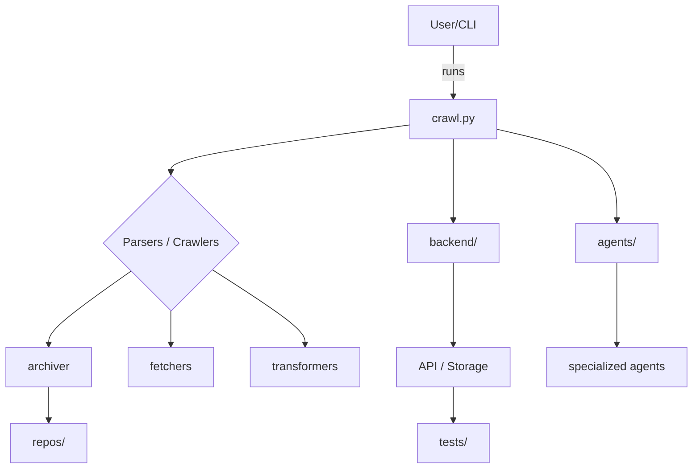
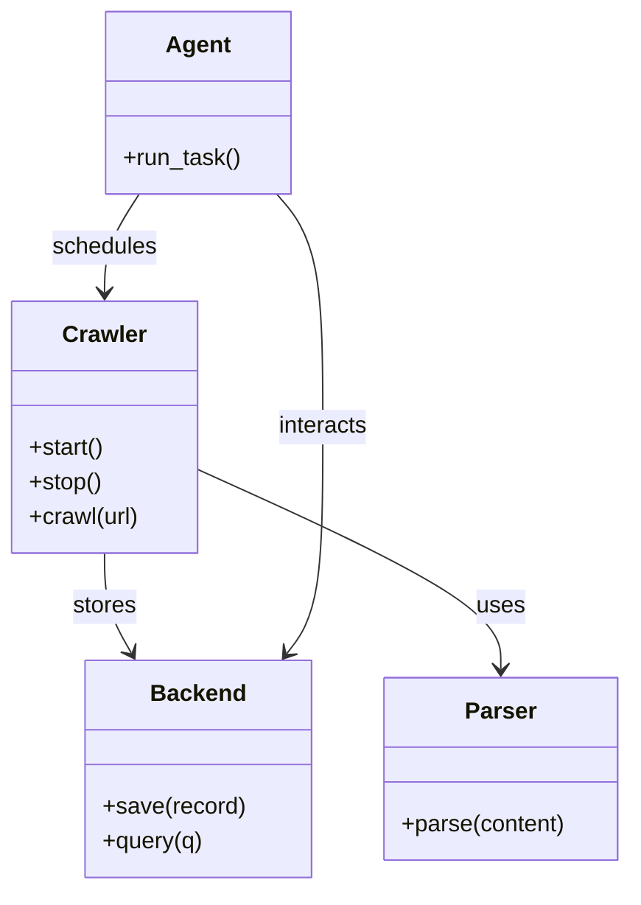

# Diagram: common/support_service/config/config.dev.yml

> Auto-generated by Obscura crawlers

## Diagram 1

### SVG

<svg id="container" width="954.265625" xmlns="http://www.w3.org/2000/svg" class="flowchart" height="640.625" viewBox="0 0 954.265625 640.625" role="graphics-document document" aria-roledescription="flowchart-v2"><g><marker id="container_flowchart-v2-pointEnd" class="marker flowchart-v2" viewBox="0 0 10 10" refX="5" refY="5" markerUnits="userSpaceOnUse" markerWidth="8" markerHeight="8" orient="auto"><path d="M 0 0 L 10 5 L 0 10 z" class="arrowMarkerPath" style="stroke-width: 1; stroke-dasharray: 1, 0;"></path></marker><marker id="container_flowchart-v2-pointStart" class="marker flowchart-v2" viewBox="0 0 10 10" refX="4.5" refY="5" markerUnits="userSpaceOnUse" markerWidth="8" markerHeight="8" orient="auto"><path d="M 0 5 L 10 10 L 10 0 z" class="arrowMarkerPath" style="stroke-width: 1; stroke-dasharray: 1, 0;"></path></marker><marker id="container_flowchart-v2-circleEnd" class="marker flowchart-v2" viewBox="0 0 10 10" refX="11" refY="5" markerUnits="userSpaceOnUse" markerWidth="11" markerHeight="11" orient="auto"><circle cx="5" cy="5" r="5" class="arrowMarkerPath" style="stroke-width: 1; stroke-dasharray: 1, 0;"></circle></marker><marker id="container_flowchart-v2-circleStart" class="marker flowchart-v2" viewBox="0 0 10 10" refX="-1" refY="5" markerUnits="userSpaceOnUse" markerWidth="11" markerHeight="11" orient="auto"><circle cx="5" cy="5" r="5" class="arrowMarkerPath" style="stroke-width: 1; stroke-dasharray: 1, 0;"></circle></marker><marker id="container_flowchart-v2-crossEnd" class="marker cross flowchart-v2" viewBox="0 0 11 11" refX="12" refY="5.2" markerUnits="userSpaceOnUse" markerWidth="11" markerHeight="11" orient="auto"><path d="M 1,1 l 9,9 M 10,1 l -9,9" class="arrowMarkerPath" style="stroke-width: 2; stroke-dasharray: 1, 0;"></path></marker><marker id="container_flowchart-v2-crossStart" class="marker cross flowchart-v2" viewBox="0 0 11 11" refX="-1" refY="5.2" markerUnits="userSpaceOnUse" markerWidth="11" markerHeight="11" orient="auto"><path d="M 1,1 l 9,9 M 10,1 l -9,9" class="arrowMarkerPath" style="stroke-width: 2; stroke-dasharray: 1, 0;"></path></marker><g class="root"><g class="clusters"></g><g class="edgePaths"><path d="M626.031,62L626.031,68.167C626.031,74.333,626.031,86.667,626.031,98.333C626.031,110,626.031,121,626.031,126.5L626.031,132" id="L_A_B_0" class="edge-thickness-normal edge-pattern-solid edge-thickness-normal edge-pattern-solid flowchart-link" style=";" data-edge="true" data-et="edge" data-id="L_A_B_0" data-points="W3sieCI6NjI2LjAzMTI1LCJ5Ijo2Mn0seyJ4Ijo2MjYuMDMxMjUsInkiOjk5fSx7IngiOjYyNi4wMzEyNSwieSI6MTM2fV0=" marker-end="url(#container_flowchart-v2-pointEnd)"></path><path d="M566.398,170.949L511.323,178.291C456.247,185.633,346.096,200.316,291.021,211.158C235.945,222,235.945,229,235.945,232.5L235.945,236" id="L_B_C_0" class="edge-thickness-normal edge-pattern-solid edge-thickness-normal edge-pattern-solid flowchart-link" style=";" data-edge="true" data-et="edge" data-id="L_B_C_0" data-points="W3sieCI6NTY2LjM5ODQzNzUsInkiOjE3MC45NDkyOTAwMjAyMjc5Mn0seyJ4IjoyMzUuOTQ1MzEyNSwieSI6MjE1fSx7IngiOjIzNS45NDUzMTI1LCJ5IjoyNDB9XQ==" marker-end="url(#container_flowchart-v2-pointEnd)"></path><path d="M181.506,370.186L162.475,383.426C143.444,396.666,105.382,423.145,86.351,439.885C67.32,456.625,67.32,463.625,67.32,467.125L67.32,470.625" id="L_C_D_0" class="edge-thickness-normal edge-pattern-solid edge-thickness-normal edge-pattern-solid flowchart-link" style=";" data-edge="true" data-et="edge" data-id="L_C_D_0" data-points="W3sieCI6MTgxLjUwNjE1OTQ5NDUzNTUyLCJ5IjozNzAuMTg1ODQ2OTk0NTM1NX0seyJ4Ijo2Ny4zMjAzMTI1LCJ5Ijo0NDkuNjI1fSx7IngiOjY3LjMyMDMxMjUsInkiOjQ3NC42MjV9XQ==" marker-end="url(#container_flowchart-v2-pointEnd)"></path><path d="M235.945,424.625L235.945,428.792C235.945,432.958,235.945,441.292,235.945,448.958C235.945,456.625,235.945,463.625,235.945,467.125L235.945,470.625" id="L_C_E_0" class="edge-thickness-normal edge-pattern-solid edge-thickness-normal edge-pattern-solid flowchart-link" style=";" data-edge="true" data-et="edge" data-id="L_C_E_0" data-points="W3sieCI6MjM1Ljk0NTMxMjUsInkiOjQyNC42MjV9LHsieCI6MjM1Ljk0NTMxMjUsInkiOjQ0OS42MjV9LHsieCI6MjM1Ljk0NTMxMjUsInkiOjQ3NC42MjV9XQ==" marker-end="url(#container_flowchart-v2-pointEnd)"></path><path d="M292.561,368.009L314.136,381.612C335.71,395.214,378.859,422.42,400.433,439.522C422.008,456.625,422.008,463.625,422.008,467.125L422.008,470.625" id="L_C_F_0" class="edge-thickness-normal edge-pattern-solid edge-thickness-normal edge-pattern-solid flowchart-link" style=";" data-edge="true" data-et="edge" data-id="L_C_F_0" data-points="W3sieCI6MjkyLjU2MTM2MzY5NDg5MDgsInkiOjM2OC4wMDg5NDg4MDUxMDkyfSx7IngiOjQyMi4wMDc4MTI1LCJ5Ijo0NDkuNjI1fSx7IngiOjQyMi4wMDc4MTI1LCJ5Ijo0NzQuNjI1fV0=" marker-end="url(#container_flowchart-v2-pointEnd)"></path><path d="M685.664,176.859L713.017,183.216C740.37,189.573,795.076,202.286,822.428,223.029C849.781,243.771,849.781,272.542,849.781,286.927L849.781,301.313" id="L_B_G_0" class="edge-thickness-normal edge-pattern-solid edge-thickness-normal edge-pattern-solid flowchart-link" style=";" data-edge="true" data-et="edge" data-id="L_B_G_0" data-points="W3sieCI6Njg1LjY2NDA2MjUsInkiOjE3Ni44NTg3OTg4ODI2ODE1NX0seyJ4Ijo4NDkuNzgxMjUsInkiOjIxNX0seyJ4Ijo4NDkuNzgxMjUsInkiOjMwNS4zMTI1fV0=" marker-end="url(#container_flowchart-v2-pointEnd)"></path><path d="M626.031,190L626.031,194.167C626.031,198.333,626.031,206.667,626.031,225.219C626.031,243.771,626.031,272.542,626.031,286.927L626.031,301.313" id="L_B_H_0" class="edge-thickness-normal edge-pattern-solid edge-thickness-normal edge-pattern-solid flowchart-link" style=";" data-edge="true" data-et="edge" data-id="L_B_H_0" data-points="W3sieCI6NjI2LjAzMTI1LCJ5IjoxOTB9LHsieCI6NjI2LjAzMTI1LCJ5IjoyMTV9LHsieCI6NjI2LjAzMTI1LCJ5IjozMDUuMzEyNX1d" marker-end="url(#container_flowchart-v2-pointEnd)"></path><path d="M626.031,359.313L626.031,374.365C626.031,389.417,626.031,419.521,626.031,438.073C626.031,456.625,626.031,463.625,626.031,467.125L626.031,470.625" id="L_H_I_0" class="edge-thickness-normal edge-pattern-solid edge-thickness-normal edge-pattern-solid flowchart-link" style=";" data-edge="true" data-et="edge" data-id="L_H_I_0" data-points="W3sieCI6NjI2LjAzMTI1LCJ5IjozNTkuMzEyNX0seyJ4Ijo2MjYuMDMxMjUsInkiOjQ0OS42MjV9LHsieCI6NjI2LjAzMTI1LCJ5Ijo0NzQuNjI1fV0=" marker-end="url(#container_flowchart-v2-pointEnd)"></path><path d="M849.781,359.313L849.781,374.365C849.781,389.417,849.781,419.521,849.781,438.073C849.781,456.625,849.781,463.625,849.781,467.125L849.781,470.625" id="L_G_J_0" class="edge-thickness-normal edge-pattern-solid edge-thickness-normal edge-pattern-solid flowchart-link" style=";" data-edge="true" data-et="edge" data-id="L_G_J_0" data-points="W3sieCI6ODQ5Ljc4MTI1LCJ5IjozNTkuMzEyNX0seyJ4Ijo4NDkuNzgxMjUsInkiOjQ0OS42MjV9LHsieCI6ODQ5Ljc4MTI1LCJ5Ijo0NzQuNjI1fV0=" marker-end="url(#container_flowchart-v2-pointEnd)"></path><path d="M67.32,528.625L67.32,532.792C67.32,536.958,67.32,545.292,67.32,552.958C67.32,560.625,67.32,567.625,67.32,571.125L67.32,574.625" id="L_D_K_0" class="edge-thickness-normal edge-pattern-solid edge-thickness-normal edge-pattern-solid flowchart-link" style=";" data-edge="true" data-et="edge" data-id="L_D_K_0" data-points="W3sieCI6NjcuMzIwMzEyNSwieSI6NTI4LjYyNX0seyJ4Ijo2Ny4zMjAzMTI1LCJ5Ijo1NTMuNjI1fSx7IngiOjY3LjMyMDMxMjUsInkiOjU3OC42MjV9XQ==" marker-end="url(#container_flowchart-v2-pointEnd)"></path><path d="M626.031,528.625L626.031,532.792C626.031,536.958,626.031,545.292,626.031,552.958C626.031,560.625,626.031,567.625,626.031,571.125L626.031,574.625" id="L_I_L_0" class="edge-thickness-normal edge-pattern-solid edge-thickness-normal edge-pattern-solid flowchart-link" style=";" data-edge="true" data-et="edge" data-id="L_I_L_0" data-points="W3sieCI6NjI2LjAzMTI1LCJ5Ijo1MjguNjI1fSx7IngiOjYyNi4wMzEyNSwieSI6NTUzLjYyNX0seyJ4Ijo2MjYuMDMxMjUsInkiOjU3OC42MjV9XQ==" marker-end="url(#container_flowchart-v2-pointEnd)"></path></g><g class="edgeLabels"><g class="edgeLabel" transform="translate(626.03125, 99)"><g class="label" data-id="L_A_B_0" transform="translate(-16.171875, -12)"><foreignObject width="32.34375" height="24">

runs

</foreignObject></g></g><g class="edgeLabel"><g class="label" data-id="L_B_C_0" transform="translate(0, 0)"><foreignObject width="0" height="0">

</foreignObject></g></g><g class="edgeLabel"><g class="label" data-id="L_C_D_0" transform="translate(0, 0)"><foreignObject width="0" height="0">

</foreignObject></g></g><g class="edgeLabel"><g class="label" data-id="L_C_E_0" transform="translate(0, 0)"><foreignObject width="0" height="0">

</foreignObject></g></g><g class="edgeLabel"><g class="label" data-id="L_C_F_0" transform="translate(0, 0)"><foreignObject width="0" height="0">

</foreignObject></g></g><g class="edgeLabel"><g class="label" data-id="L_B_G_0" transform="translate(0, 0)"><foreignObject width="0" height="0">

</foreignObject></g></g><g class="edgeLabel"><g class="label" data-id="L_B_H_0" transform="translate(0, 0)"><foreignObject width="0" height="0">

</foreignObject></g></g><g class="edgeLabel"><g class="label" data-id="L_H_I_0" transform="translate(0, 0)"><foreignObject width="0" height="0">

</foreignObject></g></g><g class="edgeLabel"><g class="label" data-id="L_G_J_0" transform="translate(0, 0)"><foreignObject width="0" height="0">

</foreignObject></g></g><g class="edgeLabel"><g class="label" data-id="L_D_K_0" transform="translate(0, 0)"><foreignObject width="0" height="0">

</foreignObject></g></g><g class="edgeLabel"><g class="label" data-id="L_I_L_0" transform="translate(0, 0)"><foreignObject width="0" height="0">

</foreignObject></g></g></g><g class="nodes"><g class="node default" id="flowchart-A-0" transform="translate(626.03125, 35)"><rect class="basic label-container" style="" x="-60.7890625" y="-27" width="121.578125" height="54"></rect><g class="label" style="" transform="translate(-30.7890625, -12)"><rect></rect><foreignObject width="61.578125" height="24">

User/CLI

</foreignObject></g></g><g class="node default" id="flowchart-B-1" transform="translate(626.03125, 163)"><rect class="basic label-container" style="" x="-59.6328125" y="-27" width="119.265625" height="54"></rect><g class="label" style="" transform="translate(-29.6328125, -12)"><rect></rect><foreignObject width="59.265625" height="24">

crawl.py

</foreignObject></g></g><g class="node default" id="flowchart-C-3" transform="translate(235.9453125, 332.3125)"><polygon points="92.3125,0 184.625,-92.3125 92.3125,-184.625 0,-92.3125" class="label-container" transform="translate(-91.8125, 92.3125)"></polygon><g class="label" style="" transform="translate(-65.3125, -12)"><rect></rect><foreignObject width="130.625" height="24">

Parsers / Crawlers

</foreignObject></g></g><g class="node default" id="flowchart-D-5" transform="translate(67.3203125, 501.625)"><rect class="basic label-container" style="" x="-59.3203125" y="-27" width="118.640625" height="54"></rect><g class="label" style="" transform="translate(-29.3203125, -12)"><rect></rect><foreignObject width="58.640625" height="24">

archiver

</foreignObject></g></g><g class="node default" id="flowchart-E-7" transform="translate(235.9453125, 501.625)"><rect class="basic label-container" style="" x="-59.3046875" y="-27" width="118.609375" height="54"></rect><g class="label" style="" transform="translate(-29.3046875, -12)"><rect></rect><foreignObject width="58.609375" height="24">

fetchers

</foreignObject></g></g><g class="node default" id="flowchart-F-9" transform="translate(422.0078125, 501.625)"><rect class="basic label-container" style="" x="-76.7578125" y="-27" width="153.515625" height="54"></rect><g class="label" style="" transform="translate(-46.7578125, -12)"><rect></rect><foreignObject width="93.515625" height="24">

transformers

</foreignObject></g></g><g class="node default" id="flowchart-G-11" transform="translate(849.78125, 332.3125)"><rect class="basic label-container" style="" x="-58.140625" y="-27" width="116.28125" height="54"></rect><g class="label" style="" transform="translate(-28.140625, -12)"><rect></rect><foreignObject width="56.28125" height="24">

agents/

</foreignObject></g></g><g class="node default" id="flowchart-H-13" transform="translate(626.03125, 332.3125)"><rect class="basic label-container" style="" x="-64.8671875" y="-27" width="129.734375" height="54"></rect><g class="label" style="" transform="translate(-34.8671875, -12)"><rect></rect><foreignObject width="69.734375" height="24">

backend/

</foreignObject></g></g><g class="node default" id="flowchart-I-15" transform="translate(626.03125, 501.625)"><rect class="basic label-container" style="" x="-77.265625" y="-27" width="154.53125" height="54"></rect><g class="label" style="" transform="translate(-47.265625, -12)"><rect></rect><foreignObject width="94.53125" height="24">

API / Storage

</foreignObject></g></g><g class="node default" id="flowchart-J-17" transform="translate(849.78125, 501.625)"><rect class="basic label-container" style="" x="-96.484375" y="-27" width="192.96875" height="54"></rect><g class="label" style="" transform="translate(-66.484375, -12)"><rect></rect><foreignObject width="132.96875" height="24">

specialized agents

</foreignObject></g></g><g class="node default" id="flowchart-K-19" transform="translate(67.3203125, 605.625)"><rect class="basic label-container" style="" x="-54.53125" y="-27" width="109.0625" height="54"></rect><g class="label" style="" transform="translate(-24.53125, -12)"><rect></rect><foreignObject width="49.0625" height="24">

repos/

</foreignObject></g></g><g class="node default" id="flowchart-L-21" transform="translate(626.03125, 605.625)"><rect class="basic label-container" style="" x="-51.6484375" y="-27" width="103.296875" height="54"></rect><g class="label" style="" transform="translate(-21.6484375, -12)"><rect></rect><foreignObject width="43.296875" height="24">

tests/

</foreignObject></g></g></g></g></g></svg>

## Diagram 2

### SVG

<svg id="container" width="433.09375" xmlns="http://www.w3.org/2000/svg" class="classDiagram" height="614" viewBox="0 0 433.09375 614" role="graphics-document document" aria-roledescription="class"><g><defs><marker id="container_class-aggregationStart" class="marker aggregation class" refX="18" refY="7" markerWidth="190" markerHeight="240" orient="auto"><path d="M 18,7 L9,13 L1,7 L9,1 Z"></path></marker></defs><defs><marker id="container_class-aggregationEnd" class="marker aggregation class" refX="1" refY="7" markerWidth="20" markerHeight="28" orient="auto"><path d="M 18,7 L9,13 L1,7 L9,1 Z"></path></marker></defs><defs><marker id="container_class-extensionStart" class="marker extension class" refX="18" refY="7" markerWidth="190" markerHeight="240" orient="auto"><path d="M 1,7 L18,13 V 1 Z"></path></marker></defs><defs><marker id="container_class-extensionEnd" class="marker extension class" refX="1" refY="7" markerWidth="20" markerHeight="28" orient="auto"><path d="M 1,1 V 13 L18,7 Z"></path></marker></defs><defs><marker id="container_class-compositionStart" class="marker composition class" refX="18" refY="7" markerWidth="190" markerHeight="240" orient="auto"><path d="M 18,7 L9,13 L1,7 L9,1 Z"></path></marker></defs><defs><marker id="container_class-compositionEnd" class="marker composition class" refX="1" refY="7" markerWidth="20" markerHeight="28" orient="auto"><path d="M 18,7 L9,13 L1,7 L9,1 Z"></path></marker></defs><defs><marker id="container_class-dependencyStart" class="marker dependency class" refX="6" refY="7" markerWidth="190" markerHeight="240" orient="auto"><path d="M 5,7 L9,13 L1,7 L9,1 Z"></path></marker></defs><defs><marker id="container_class-dependencyEnd" class="marker dependency class" refX="13" refY="7" markerWidth="20" markerHeight="28" orient="auto"><path d="M 18,7 L9,13 L14,7 L9,1 Z"></path></marker></defs><defs><marker id="container_class-lollipopStart" class="marker lollipop class" refX="13" refY="7" markerWidth="190" markerHeight="240" orient="auto"><circle stroke="black" fill="transparent" cx="7" cy="7" r="6"></circle></marker></defs><defs><marker id="container_class-lollipopEnd" class="marker lollipop class" refX="1" refY="7" markerWidth="190" markerHeight="240" orient="auto"><circle stroke="black" fill="transparent" cx="7" cy="7" r="6"></circle></marker></defs><g class="root"><g class="clusters"></g><g class="edgePaths"><path d="M136.313,324.22L170.996,340.017C205.68,355.813,275.047,387.407,309.73,410.37C344.414,433.333,344.414,447.667,344.414,454.833L344.414,462" id="id_Crawler_Parser_1" class="edge-thickness-normal edge-pattern-solid relation" style=";;;" data-edge="true" data-et="edge" data-id="id_Crawler_Parser_1" data-points="W3sieCI6MTM2LjMxMjUsInkiOjMyNC4yMjAwMDYzMTI5NTAxNX0seyJ4IjozNDQuNDE0MDYyNSwieSI6NDE5fSx7IngiOjM0NC40MTQwNjI1LCJ5Ijo0Njh9XQ==" marker-end="url(#container_class-dependencyEnd)"></path><path d="M72.156,382L72.156,388.167C72.156,394.333,72.156,406.667,75.254,418.137C78.352,429.606,84.547,440.213,87.645,445.516L90.743,450.819" id="id_Crawler_Backend_2" class="edge-thickness-normal edge-pattern-solid relation" style=";;;" data-edge="true" data-et="edge" data-id="id_Crawler_Backend_2" data-points="W3sieCI6NzIuMTU2MjUsInkiOjM4Mn0seyJ4Ijo3Mi4xNTYyNSwieSI6NDE5fSx7IngiOjkzLjc2ODgzMzcwNTM1NzE0LCJ5Ijo0NTZ9XQ==" marker-end="url(#container_class-dependencyEnd)"></path><path d="M191.236,134L196.489,140.167C201.741,146.333,212.245,158.667,217.498,185.5C222.75,212.333,222.75,253.667,222.75,295C222.75,336.333,222.75,377.667,218.666,403.704C214.582,429.741,206.413,440.483,202.329,445.853L198.245,451.224" id="id_Agent_Backend_3" class="edge-thickness-normal edge-pattern-solid relation" style=";;;" data-edge="true" data-et="edge" data-id="id_Agent_Backend_3" data-points="W3sieCI6MTkxLjIzNjQwNjI1MDAwMDAyLCJ5IjoxMzR9LHsieCI6MjIyLjc1LCJ5IjoxNzF9LHsieCI6MjIyLjc1LCJ5IjoyOTV9LHsieCI6MjIyLjc1LCJ5Ijo0MTl9LHsieCI6MTk0LjYxMjg2MjcyMzIxNDI4LCJ5Ijo0NTZ9XQ==" marker-end="url(#container_class-dependencyEnd)"></path><path d="M96.362,134L92.328,140.167C88.294,146.333,80.225,158.667,76.191,170C72.156,181.333,72.156,191.667,72.156,196.833L72.156,202" id="id_Agent_Crawler_4" class="edge-thickness-normal edge-pattern-solid relation" style=";;;" data-edge="true" data-et="edge" data-id="id_Agent_Crawler_4" data-points="W3sieCI6OTYuMzYyMzQzNzUwMDAwMDEsInkiOjEzNH0seyJ4Ijo3Mi4xNTYyNSwieSI6MTcxfSx7IngiOjcyLjE1NjI1LCJ5IjoyMDh9XQ==" marker-end="url(#container_class-dependencyEnd)"></path></g><g class="edgeLabels"><g class="edgeLabel" transform="translate(344.4140625, 419)"><g class="label" data-id="id_Crawler_Parser_1" transform="translate(-16.4921875, -12)"><foreignObject width="32.984375" height="24">

uses

</foreignObject></g></g><g class="edgeLabel" transform="translate(72.15625, 419)"><g class="label" data-id="id_Crawler_Backend_2" transform="translate(-22.125, -12)"><foreignObject width="44.25" height="24">

stores

</foreignObject></g></g><g class="edgeLabel" transform="translate(222.75, 295)"><g class="label" data-id="id_Agent_Backend_3" transform="translate(-31.6875, -12)"><foreignObject width="63.375" height="24">

interacts

</foreignObject></g></g><g class="edgeLabel" transform="translate(72.15625, 171)"><g class="label" data-id="id_Agent_Crawler_4" transform="translate(-36.453125, -12)"><foreignObject width="72.90625" height="24">

schedules

</foreignObject></g></g></g><g class="nodes"><g class="node default" id="classId-Crawler-0" transform="translate(72.15625, 295)"><g class="basic label-container"><path d="M-64.15625 -87 L64.15625 -87 L64.15625 87 L-64.15625 87" stroke="none" stroke-width="0" fill="#ECECFF" style=""></path><path d="M-64.15625 -87 C-26.36517561981129 -87, 11.425898760377422 -87, 64.15625 -87 M-64.15625 -87 C-26.948580745706494 -87, 10.259088508587013 -87, 64.15625 -87 M64.15625 -87 C64.15625 -41.11552568578803, 64.15625 4.768948628423942, 64.15625 87 M64.15625 -87 C64.15625 -17.985830250691208, 64.15625 51.028339498617584, 64.15625 87 M64.15625 87 C20.30350127965832 87, -23.54924744068336 87, -64.15625 87 M64.15625 87 C17.880137467762232 87, -28.395975064475536 87, -64.15625 87 M-64.15625 87 C-64.15625 22.288459107491775, -64.15625 -42.42308178501645, -64.15625 -87 M-64.15625 87 C-64.15625 46.986123674473575, -64.15625 6.97224734894715, -64.15625 -87" stroke="#9370DB" stroke-width="1.3" fill="none" stroke-dasharray="0 0" style=""></path></g><g class="annotation-group text" transform="translate(0, -63)"></g><g class="label-group text" transform="translate(-27.734375, -63)"><g class="label" style="font-weight: bolder" transform="translate(0,-12)"><foreignObject width="55.46875" height="24">

Crawler

</foreignObject></g></g><g class="members-group text" transform="translate(-52.15625, -15)"></g><g class="methods-group text" transform="translate(-52.15625, 15)"><g class="label" style="" transform="translate(0,-12)"><foreignObject width="52.15625" height="24">

+start()

</foreignObject></g><g class="label" style="" transform="translate(0,12)"><foreignObject width="50.21875" height="24">

+stop()

</foreignObject></g><g class="label" style="" transform="translate(0,36)"><foreignObject width="76.578125" height="24">

+crawl(url)

</foreignObject></g></g><g class="divider" style=""><path d="M-64.15625 -39 C-31.794447494115786 -39, 0.5673550117684272 -39, 64.15625 -39 M-64.15625 -39 C-20.32113165474904 -39, 23.513986690501923 -39, 64.15625 -39" stroke="#9370DB" stroke-width="1.3" fill="none" stroke-dasharray="0 0" style=""></path></g><g class="divider" style=""><path d="M-64.15625 -15 C-18.55350876706946 -15, 27.04923246586108 -15, 64.15625 -15 M-64.15625 -15 C-18.428215218013214 -15, 27.29981956397357 -15, 64.15625 -15" stroke="#9370DB" stroke-width="1.3" fill="none" stroke-dasharray="0 0" style=""></path></g></g><g class="node default" id="classId-Parser-1" transform="translate(344.4140625, 531)"><g class="basic label-container"><path d="M-80.6796875 -63 L80.6796875 -63 L80.6796875 63 L-80.6796875 63" stroke="none" stroke-width="0" fill="#ECECFF" style=""></path><path d="M-80.6796875 -63 C-45.396488403854605 -63, -10.11328930770921 -63, 80.6796875 -63 M-80.6796875 -63 C-23.3182486582293 -63, 34.0431901835414 -63, 80.6796875 -63 M80.6796875 -63 C80.6796875 -36.191829151410616, 80.6796875 -9.383658302821225, 80.6796875 63 M80.6796875 -63 C80.6796875 -23.59454379244314, 80.6796875 15.81091241511372, 80.6796875 63 M80.6796875 63 C21.196981672077328 63, -38.285724155845344 63, -80.6796875 63 M80.6796875 63 C40.92920797188597 63, 1.178728443771945 63, -80.6796875 63 M-80.6796875 63 C-80.6796875 17.141963054613598, -80.6796875 -28.716073890772805, -80.6796875 -63 M-80.6796875 63 C-80.6796875 20.615477766319856, -80.6796875 -21.76904446736029, -80.6796875 -63" stroke="#9370DB" stroke-width="1.3" fill="none" stroke-dasharray="0 0" style=""></path></g><g class="annotation-group text" transform="translate(0, -39)"></g><g class="label-group text" transform="translate(-23.375, -39)"><g class="label" style="font-weight: bolder" transform="translate(0,-12)"><foreignObject width="46.75" height="24">

Parser

</foreignObject></g></g><g class="members-group text" transform="translate(-68.6796875, 9)"></g><g class="methods-group text" transform="translate(-68.6796875, 39)"><g class="label" style="" transform="translate(0,-12)"><foreignObject width="113.984375" height="24">

+parse(content)

</foreignObject></g></g><g class="divider" style=""><path d="M-80.6796875 -15 C-20.255440912470668 -15, 40.168805675058664 -15, 80.6796875 -15 M-80.6796875 -15 C-34.705145107243105 -15, 11.26939728551379 -15, 80.6796875 -15" stroke="#9370DB" stroke-width="1.3" fill="none" stroke-dasharray="0 0" style=""></path></g><g class="divider" style=""><path d="M-80.6796875 9 C-20.84524751863892 9, 38.98919246272216 9, 80.6796875 9 M-80.6796875 9 C-22.981431513054638 9, 34.716824473890725 9, 80.6796875 9" stroke="#9370DB" stroke-width="1.3" fill="none" stroke-dasharray="0 0" style=""></path></g></g><g class="node default" id="classId-Backend-2" transform="translate(137.578125, 531)"><g class="basic label-container"><path d="M-76.15625 -75 L76.15625 -75 L76.15625 75 L-76.15625 75" stroke="none" stroke-width="0" fill="#ECECFF" style=""></path><path d="M-76.15625 -75 C-45.54094452635559 -75, -14.925639052711183 -75, 76.15625 -75 M-76.15625 -75 C-42.74109651319585 -75, -9.325943026391698 -75, 76.15625 -75 M76.15625 -75 C76.15625 -40.5407242064511, 76.15625 -6.081448412902205, 76.15625 75 M76.15625 -75 C76.15625 -26.294285034538568, 76.15625 22.411429930922864, 76.15625 75 M76.15625 75 C41.221098884928324 75, 6.285947769856648 75, -76.15625 75 M76.15625 75 C20.647074481298503 75, -34.862101037402994 75, -76.15625 75 M-76.15625 75 C-76.15625 30.073282751900635, -76.15625 -14.85343449619873, -76.15625 -75 M-76.15625 75 C-76.15625 40.08974863364563, -76.15625 5.179497267291254, -76.15625 -75" stroke="#9370DB" stroke-width="1.3" fill="none" stroke-dasharray="0 0" style=""></path></g><g class="annotation-group text" transform="translate(0, -51)"></g><g class="label-group text" transform="translate(-31.296875, -51)"><g class="label" style="font-weight: bolder" transform="translate(0,-12)"><foreignObject width="62.59375" height="24">

Backend

</foreignObject></g></g><g class="members-group text" transform="translate(-64.15625, -3)"></g><g class="methods-group text" transform="translate(-64.15625, 27)"><g class="label" style="" transform="translate(0,-12)"><foreignObject width="97.015625" height="24">

+save(record)

</foreignObject></g><g class="label" style="" transform="translate(0,12)"><foreignObject width="69.578125" height="24">

+query(q)

</foreignObject></g></g><g class="divider" style=""><path d="M-76.15625 -27 C-34.23077039269278 -27, 7.694709214614434 -27, 76.15625 -27 M-76.15625 -27 C-17.20373255748602 -27, 41.74878488502796 -27, 76.15625 -27" stroke="#9370DB" stroke-width="1.3" fill="none" stroke-dasharray="0 0" style=""></path></g><g class="divider" style=""><path d="M-76.15625 -3 C-34.96049473246802 -3, 6.235260535063958 -3, 76.15625 -3 M-76.15625 -3 C-42.95126810226182 -3, -9.746286204523642 -3, 76.15625 -3" stroke="#9370DB" stroke-width="1.3" fill="none" stroke-dasharray="0 0" style=""></path></g></g><g class="node default" id="classId-Agent-3" transform="translate(137.578125, 71)"><g class="basic label-container"><path d="M-63.0859375 -63 L63.0859375 -63 L63.0859375 63 L-63.0859375 63" stroke="none" stroke-width="0" fill="#ECECFF" style=""></path><path d="M-63.0859375 -63 C-28.669733565500223 -63, 5.746470368999553 -63, 63.0859375 -63 M-63.0859375 -63 C-16.362186090549415 -63, 30.36156531890117 -63, 63.0859375 -63 M63.0859375 -63 C63.0859375 -31.553100598312408, 63.0859375 -0.10620119662481642, 63.0859375 63 M63.0859375 -63 C63.0859375 -20.651312912639554, 63.0859375 21.697374174720892, 63.0859375 63 M63.0859375 63 C14.007616401655604 63, -35.07070469668879 63, -63.0859375 63 M63.0859375 63 C13.853539894845845 63, -35.37885771030831 63, -63.0859375 63 M-63.0859375 63 C-63.0859375 30.691350358030498, -63.0859375 -1.6172992839390048, -63.0859375 -63 M-63.0859375 63 C-63.0859375 33.132898063096405, -63.0859375 3.265796126192818, -63.0859375 -63" stroke="#9370DB" stroke-width="1.3" fill="none" stroke-dasharray="0 0" style=""></path></g><g class="annotation-group text" transform="translate(0, -39)"></g><g class="label-group text" transform="translate(-21.078125, -39)"><g class="label" style="font-weight: bolder" transform="translate(0,-12)"><foreignObject width="42.15625" height="24">

Agent

</foreignObject></g></g><g class="members-group text" transform="translate(-51.0859375, 9)"></g><g class="methods-group text" transform="translate(-51.0859375, 39)"><g class="label" style="" transform="translate(0,-12)"><foreignObject width="81.09375" height="24">

+run_task()

</foreignObject></g></g><g class="divider" style=""><path d="M-63.0859375 -15 C-21.508156242865496 -15, 20.069625014269008 -15, 63.0859375 -15 M-63.0859375 -15 C-23.28699373940944 -15, 16.51195002118112 -15, 63.0859375 -15" stroke="#9370DB" stroke-width="1.3" fill="none" stroke-dasharray="0 0" style=""></path></g><g class="divider" style=""><path d="M-63.0859375 9 C-33.33071276216107 9, -3.5754880243221336 9, 63.0859375 9 M-63.0859375 9 C-37.00753667071824 9, -10.92913584143647 9, 63.0859375 9" stroke="#9370DB" stroke-width="1.3" fill="none" stroke-dasharray="0 0" style=""></path></g></g></g></g></g></svg>
