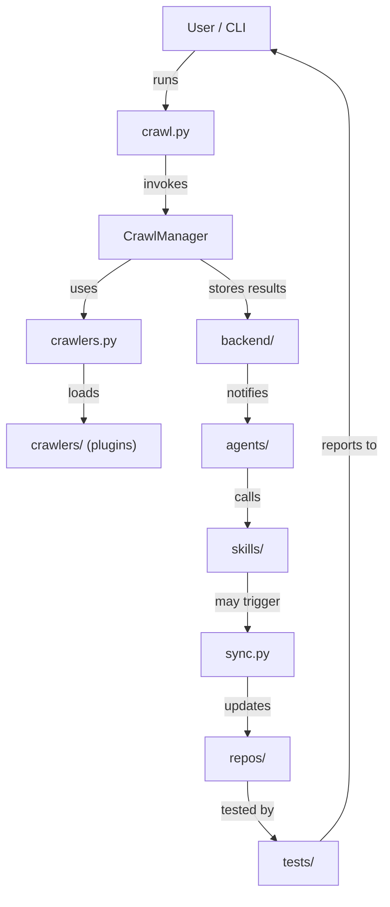
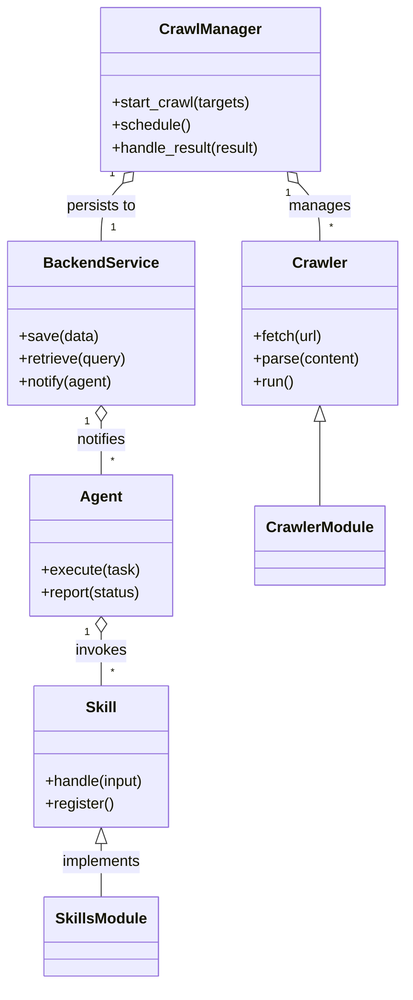

# Diagram: common/support_service/config/config.dev2.yml

> Auto-generated by Obscura crawlers

## Diagram 1

### SVG

<svg id="container" width="485.3125" xmlns="http://www.w3.org/2000/svg" class="flowchart" height="1094" viewBox="0 0 485.3125 1094" role="graphics-document document" aria-roledescription="flowchart-v2"><g><marker id="container_flowchart-v2-pointEnd" class="marker flowchart-v2" viewBox="0 0 10 10" refX="5" refY="5" markerUnits="userSpaceOnUse" markerWidth="8" markerHeight="8" orient="auto"><path d="M 0 0 L 10 5 L 0 10 z" class="arrowMarkerPath" style="stroke-width: 1; stroke-dasharray: 1, 0;"></path></marker><marker id="container_flowchart-v2-pointStart" class="marker flowchart-v2" viewBox="0 0 10 10" refX="4.5" refY="5" markerUnits="userSpaceOnUse" markerWidth="8" markerHeight="8" orient="auto"><path d="M 0 5 L 10 10 L 10 0 z" class="arrowMarkerPath" style="stroke-width: 1; stroke-dasharray: 1, 0;"></path></marker><marker id="container_flowchart-v2-circleEnd" class="marker flowchart-v2" viewBox="0 0 10 10" refX="11" refY="5" markerUnits="userSpaceOnUse" markerWidth="11" markerHeight="11" orient="auto"><circle cx="5" cy="5" r="5" class="arrowMarkerPath" style="stroke-width: 1; stroke-dasharray: 1, 0;"></circle></marker><marker id="container_flowchart-v2-circleStart" class="marker flowchart-v2" viewBox="0 0 10 10" refX="-1" refY="5" markerUnits="userSpaceOnUse" markerWidth="11" markerHeight="11" orient="auto"><circle cx="5" cy="5" r="5" class="arrowMarkerPath" style="stroke-width: 1; stroke-dasharray: 1, 0;"></circle></marker><marker id="container_flowchart-v2-crossEnd" class="marker cross flowchart-v2" viewBox="0 0 11 11" refX="12" refY="5.2" markerUnits="userSpaceOnUse" markerWidth="11" markerHeight="11" orient="auto"><path d="M 1,1 l 9,9 M 10,1 l -9,9" class="arrowMarkerPath" style="stroke-width: 2; stroke-dasharray: 1, 0;"></path></marker><marker id="container_flowchart-v2-crossStart" class="marker cross flowchart-v2" viewBox="0 0 11 11" refX="-1" refY="5.2" markerUnits="userSpaceOnUse" markerWidth="11" markerHeight="11" orient="auto"><path d="M 1,1 l 9,9 M 10,1 l -9,9" class="arrowMarkerPath" style="stroke-width: 2; stroke-dasharray: 1, 0;"></path></marker><g class="root"><g class="clusters"></g><g class="edgePaths"><path d="M246.537,62L240.32,68.167C234.103,74.333,221.669,86.667,215.451,98.333C209.234,110,209.234,121,209.234,126.5L209.234,132" id="L_User_CrawlPy_0" class="edge-thickness-normal edge-pattern-solid edge-thickness-normal edge-pattern-solid flowchart-link" style=";" data-edge="true" data-et="edge" data-id="L_User_CrawlPy_0" data-points="W3sieCI6MjQ2LjUzNjk4NzMwNDY4NzUsInkiOjYyfSx7IngiOjIwOS4yMzQzNzUsInkiOjk5fSx7IngiOjIwOS4yMzQzNzUsInkiOjEzNn1d" marker-end="url(#container_flowchart-v2-pointEnd)"></path><path d="M209.234,190L209.234,196.167C209.234,202.333,209.234,214.667,209.234,226.333C209.234,238,209.234,249,209.234,254.5L209.234,260" id="L_CrawlPy_CrawlManager_0" class="edge-thickness-normal edge-pattern-solid edge-thickness-normal edge-pattern-solid flowchart-link" style=";" data-edge="true" data-et="edge" data-id="L_CrawlPy_CrawlManager_0" data-points="W3sieCI6MjA5LjIzNDM3NSwieSI6MTkwfSx7IngiOjIwOS4yMzQzNzUsInkiOjIyN30seyJ4IjoyMDkuMjM0Mzc1LCJ5IjoyNjR9XQ==" marker-end="url(#container_flowchart-v2-pointEnd)"></path><path d="M165.729,318L155.792,324.167C145.855,330.333,125.982,342.667,116.046,354.333C106.109,366,106.109,377,106.109,382.5L106.109,388" id="L_CrawlManager_CrawlerModule_0" class="edge-thickness-normal edge-pattern-solid edge-thickness-normal edge-pattern-solid flowchart-link" style=";" data-edge="true" data-et="edge" data-id="L_CrawlManager_CrawlerModule_0" data-points="W3sieCI6MTY1LjcyODUxNTYyNSwieSI6MzE4fSx7IngiOjEwNi4xMDkzNzUsInkiOjM1NX0seyJ4IjoxMDYuMTA5Mzc1LCJ5IjozOTJ9XQ==" marker-end="url(#container_flowchart-v2-pointEnd)"></path><path d="M106.109,446L106.109,452.167C106.109,458.333,106.109,470.667,106.109,482.333C106.109,494,106.109,505,106.109,510.5L106.109,516" id="L_CrawlerModule_CrawlerPlugins_0" class="edge-thickness-normal edge-pattern-solid edge-thickness-normal edge-pattern-solid flowchart-link" style=";" data-edge="true" data-et="edge" data-id="L_CrawlerModule_CrawlerPlugins_0" data-points="W3sieCI6MTA2LjEwOTM3NSwieSI6NDQ2fSx7IngiOjEwNi4xMDkzNzUsInkiOjQ4M30seyJ4IjoxMDYuMTA5Mzc1LCJ5Ijo1MjB9XQ==" marker-end="url(#container_flowchart-v2-pointEnd)"></path><path d="M252.74,318L262.677,324.167C272.613,330.333,292.486,342.667,302.423,354.333C312.359,366,312.359,377,312.359,382.5L312.359,388" id="L_CrawlManager_Backend_0" class="edge-thickness-normal edge-pattern-solid edge-thickness-normal edge-pattern-solid flowchart-link" style=";" data-edge="true" data-et="edge" data-id="L_CrawlManager_Backend_0" data-points="W3sieCI6MjUyLjc0MDIzNDM3NSwieSI6MzE4fSx7IngiOjMxMi4zNTkzNzUsInkiOjM1NX0seyJ4IjozMTIuMzU5Mzc1LCJ5IjozOTJ9XQ==" marker-end="url(#container_flowchart-v2-pointEnd)"></path><path d="M312.359,446L312.359,452.167C312.359,458.333,312.359,470.667,312.359,482.333C312.359,494,312.359,505,312.359,510.5L312.359,516" id="L_Backend_Agents_0" class="edge-thickness-normal edge-pattern-solid edge-thickness-normal edge-pattern-solid flowchart-link" style=";" data-edge="true" data-et="edge" data-id="L_Backend_Agents_0" data-points="W3sieCI6MzEyLjM1OTM3NSwieSI6NDQ2fSx7IngiOjMxMi4zNTkzNzUsInkiOjQ4M30seyJ4IjozMTIuMzU5Mzc1LCJ5Ijo1MjB9XQ==" marker-end="url(#container_flowchart-v2-pointEnd)"></path><path d="M312.359,574L312.359,580.167C312.359,586.333,312.359,598.667,312.359,610.333C312.359,622,312.359,633,312.359,638.5L312.359,644" id="L_Agents_Skills_0" class="edge-thickness-normal edge-pattern-solid edge-thickness-normal edge-pattern-solid flowchart-link" style=";" data-edge="true" data-et="edge" data-id="L_Agents_Skills_0" data-points="W3sieCI6MzEyLjM1OTM3NSwieSI6NTc0fSx7IngiOjMxMi4zNTkzNzUsInkiOjYxMX0seyJ4IjozMTIuMzU5Mzc1LCJ5Ijo2NDh9XQ==" marker-end="url(#container_flowchart-v2-pointEnd)"></path><path d="M312.359,702L312.359,708.167C312.359,714.333,312.359,726.667,312.359,738.333C312.359,750,312.359,761,312.359,766.5L312.359,772" id="L_Skills_Sync_0" class="edge-thickness-normal edge-pattern-solid edge-thickness-normal edge-pattern-solid flowchart-link" style=";" data-edge="true" data-et="edge" data-id="L_Skills_Sync_0" data-points="W3sieCI6MzEyLjM1OTM3NSwieSI6NzAyfSx7IngiOjMxMi4zNTkzNzUsInkiOjczOX0seyJ4IjozMTIuMzU5Mzc1LCJ5Ijo3NzZ9XQ==" marker-end="url(#container_flowchart-v2-pointEnd)"></path><path d="M312.359,830L312.359,836.167C312.359,842.333,312.359,854.667,312.359,866.333C312.359,878,312.359,889,312.359,894.5L312.359,900" id="L_Sync_Repos_0" class="edge-thickness-normal edge-pattern-solid edge-thickness-normal edge-pattern-solid flowchart-link" style=";" data-edge="true" data-et="edge" data-id="L_Sync_Repos_0" data-points="W3sieCI6MzEyLjM1OTM3NSwieSI6ODMwfSx7IngiOjMxMi4zNTkzNzUsInkiOjg2N30seyJ4IjozMTIuMzU5Mzc1LCJ5Ijo5MDR9XQ==" marker-end="url(#container_flowchart-v2-pointEnd)"></path><path d="M312.359,958L312.359,964.167C312.359,970.333,312.359,982.667,318.103,994.531C323.847,1006.394,335.335,1017.789,341.078,1023.486L346.822,1029.183" id="L_Repos_Tests_0" class="edge-thickness-normal edge-pattern-solid edge-thickness-normal edge-pattern-solid flowchart-link" style=";" data-edge="true" data-et="edge" data-id="L_Repos_Tests_0" data-points="W3sieCI6MzEyLjM1OTM3NSwieSI6OTU4fSx7IngiOjMxMi4zNTkzNzUsInkiOjk5NX0seyJ4IjozNDkuNjYxOTg3MzA0Njg3NSwieSI6MTAzMn1d" marker-end="url(#container_flowchart-v2-pointEnd)"></path><path d="M404.104,1032L410.321,1025.833C416.538,1019.667,428.972,1007.333,435.189,990.5C441.406,973.667,441.406,952.333,441.406,931C441.406,909.667,441.406,888.333,441.406,867C441.406,845.667,441.406,824.333,441.406,803C441.406,781.667,441.406,760.333,441.406,739C441.406,717.667,441.406,696.333,441.406,675C441.406,653.667,441.406,632.333,441.406,611C441.406,589.667,441.406,568.333,441.406,547C441.406,525.667,441.406,504.333,441.406,483C441.406,461.667,441.406,440.333,441.406,419C441.406,397.667,441.406,376.333,441.406,355C441.406,333.667,441.406,312.333,441.406,291C441.406,269.667,441.406,248.333,441.406,227C441.406,205.667,441.406,184.333,441.406,163C441.406,141.667,441.406,120.333,425.033,103.416C408.66,86.499,375.913,73.998,359.54,67.747L343.167,61.497" id="L_Tests_User_0" class="edge-thickness-normal edge-pattern-solid edge-thickness-normal edge-pattern-solid flowchart-link" style=";" data-edge="true" data-et="edge" data-id="L_Tests_User_0" data-points="W3sieCI6NDA0LjEwMzYzNzY5NTMxMjUsInkiOjEwMzJ9LHsieCI6NDQxLjQwNjI1LCJ5Ijo5OTV9LHsieCI6NDQxLjQwNjI1LCJ5Ijo5MzF9LHsieCI6NDQxLjQwNjI1LCJ5Ijo4Njd9LHsieCI6NDQxLjQwNjI1LCJ5Ijo4MDN9LHsieCI6NDQxLjQwNjI1LCJ5Ijo3Mzl9LHsieCI6NDQxLjQwNjI1LCJ5Ijo2NzV9LHsieCI6NDQxLjQwNjI1LCJ5Ijo2MTF9LHsieCI6NDQxLjQwNjI1LCJ5Ijo1NDd9LHsieCI6NDQxLjQwNjI1LCJ5Ijo0ODN9LHsieCI6NDQxLjQwNjI1LCJ5Ijo0MTl9LHsieCI6NDQxLjQwNjI1LCJ5IjozNTV9LHsieCI6NDQxLjQwNjI1LCJ5IjoyOTF9LHsieCI6NDQxLjQwNjI1LCJ5IjoyMjd9LHsieCI6NDQxLjQwNjI1LCJ5IjoxNjN9LHsieCI6NDQxLjQwNjI1LCJ5Ijo5OX0seyJ4IjozMzkuNDI5Njg3NSwieSI6NjAuMDcwMzIwMTQ1MzkzNTR9XQ==" marker-end="url(#container_flowchart-v2-pointEnd)"></path></g><g class="edgeLabels"><g class="edgeLabel" transform="translate(209.234375, 99)"><g class="label" data-id="L_User_CrawlPy_0" transform="translate(-16.171875, -12)"><foreignObject width="32.34375" height="24">

runs

</foreignObject></g></g><g class="edgeLabel" transform="translate(209.234375, 227)"><g class="label" data-id="L_CrawlPy_CrawlManager_0" transform="translate(-27.5859375, -12)"><foreignObject width="55.171875" height="24">

invokes

</foreignObject></g></g><g class="edgeLabel" transform="translate(106.109375, 355)"><g class="label" data-id="L_CrawlManager_CrawlerModule_0" transform="translate(-16.4921875, -12)"><foreignObject width="32.984375" height="24">

uses

</foreignObject></g></g><g class="edgeLabel" transform="translate(106.109375, 483)"><g class="label" data-id="L_CrawlerModule_CrawlerPlugins_0" transform="translate(-19.7734375, -12)"><foreignObject width="39.546875" height="24">

loads

</foreignObject></g></g><g class="edgeLabel" transform="translate(312.359375, 355)"><g class="label" data-id="L_CrawlManager_Backend_0" transform="translate(-48.8125, -12)"><foreignObject width="97.625" height="24">

stores results

</foreignObject></g></g><g class="edgeLabel" transform="translate(312.359375, 483)"><g class="label" data-id="L_Backend_Agents_0" transform="translate(-27.203125, -12)"><foreignObject width="54.40625" height="24">

notifies

</foreignObject></g></g><g class="edgeLabel" transform="translate(312.359375, 611)"><g class="label" data-id="L_Agents_Skills_0" transform="translate(-16.4453125, -12)"><foreignObject width="32.890625" height="24">

calls

</foreignObject></g></g><g class="edgeLabel" transform="translate(312.359375, 739)"><g class="label" data-id="L_Skills_Sync_0" transform="translate(-41.0234375, -12)"><foreignObject width="82.046875" height="24">

may trigger

</foreignObject></g></g><g class="edgeLabel" transform="translate(312.359375, 867)"><g class="label" data-id="L_Sync_Repos_0" transform="translate(-29.4140625, -12)"><foreignObject width="58.828125" height="24">

updates

</foreignObject></g></g><g class="edgeLabel" transform="translate(312.359375, 995)"><g class="label" data-id="L_Repos_Tests_0" transform="translate(-33.5546875, -12)"><foreignObject width="67.109375" height="24">

tested by

</foreignObject></g></g><g class="edgeLabel" transform="translate(441.40625, 547)"><g class="label" data-id="L_Tests_User_0" transform="translate(-35.90625, -12)"><foreignObject width="71.8125" height="24">

reports to

</foreignObject></g></g></g><g class="nodes"><g class="node default" id="flowchart-User-0" transform="translate(273.7578125, 35)"><rect class="basic label-container" style="" x="-65.671875" y="-27" width="131.34375" height="54"></rect><g class="label" style="" transform="translate(-35.671875, -12)"><rect></rect><foreignObject width="71.34375" height="24">

User / CLI

</foreignObject></g></g><g class="node default" id="flowchart-CrawlPy-1" transform="translate(209.234375, 163)"><rect class="basic label-container" style="" x="-59.6328125" y="-27" width="119.265625" height="54"></rect><g class="label" style="" transform="translate(-29.6328125, -12)"><rect></rect><foreignObject width="59.265625" height="24">

crawl.py

</foreignObject></g></g><g class="node default" id="flowchart-CrawlManager-3" transform="translate(209.234375, 291)"><rect class="basic label-container" style="" x="-80.578125" y="-27" width="161.15625" height="54"></rect><g class="label" style="" transform="translate(-50.578125, -12)"><rect></rect><foreignObject width="101.15625" height="24">

CrawlManager

</foreignObject></g></g><g class="node default" id="flowchart-CrawlerModule-5" transform="translate(106.109375, 419)"><rect class="basic label-container" style="" x="-70.625" y="-27" width="141.25" height="54"></rect><g class="label" style="" transform="translate(-40.625, -12)"><rect></rect><foreignObject width="81.25" height="24">

crawlers.py

</foreignObject></g></g><g class="node default" id="flowchart-CrawlerPlugins-7" transform="translate(106.109375, 547)"><rect class="basic label-container" style="" x="-98.109375" y="-27" width="196.21875" height="54"></rect><g class="label" style="" transform="translate(-68.109375, -12)"><rect></rect><foreignObject width="136.21875" height="24">

crawlers/ (plugins)

</foreignObject></g></g><g class="node default" id="flowchart-Backend-9" transform="translate(312.359375, 419)"><rect class="basic label-container" style="" x="-64.8671875" y="-27" width="129.734375" height="54"></rect><g class="label" style="" transform="translate(-34.8671875, -12)"><rect></rect><foreignObject width="69.734375" height="24">

backend/

</foreignObject></g></g><g class="node default" id="flowchart-Agents-11" transform="translate(312.359375, 547)"><rect class="basic label-container" style="" x="-58.140625" y="-27" width="116.28125" height="54"></rect><g class="label" style="" transform="translate(-28.140625, -12)"><rect></rect><foreignObject width="56.28125" height="24">

agents/

</foreignObject></g></g><g class="node default" id="flowchart-Skills-13" transform="translate(312.359375, 675)"><rect class="basic label-container" style="" x="-52.6796875" y="-27" width="105.359375" height="54"></rect><g class="label" style="" transform="translate(-22.6796875, -12)"><rect></rect><foreignObject width="45.359375" height="24">

skills/

</foreignObject></g></g><g class="node default" id="flowchart-Sync-15" transform="translate(312.359375, 803)"><rect class="basic label-container" style="" x="-56.7109375" y="-27" width="113.421875" height="54"></rect><g class="label" style="" transform="translate(-26.7109375, -12)"><rect></rect><foreignObject width="53.421875" height="24">

sync.py

</foreignObject></g></g><g class="node default" id="flowchart-Repos-17" transform="translate(312.359375, 931)"><rect class="basic label-container" style="" x="-54.53125" y="-27" width="109.0625" height="54"></rect><g class="label" style="" transform="translate(-24.53125, -12)"><rect></rect><foreignObject width="49.0625" height="24">

repos/

</foreignObject></g></g><g class="node default" id="flowchart-Tests-19" transform="translate(376.8828125, 1059)"><rect class="basic label-container" style="" x="-51.6484375" y="-27" width="103.296875" height="54"></rect><g class="label" style="" transform="translate(-21.6484375, -12)"><rect></rect><foreignObject width="43.296875" height="24">

tests/

</foreignObject></g></g></g></g></g></svg>

## Diagram 2

### SVG

<svg id="container" width="429.7421875" xmlns="http://www.w3.org/2000/svg" class="classDiagram" height="1044" viewBox="0 0 429.7421875 1044" role="graphics-document document" aria-roledescription="class"><g><defs><marker id="container_class-aggregationStart" class="marker aggregation class" refX="18" refY="7" markerWidth="190" markerHeight="240" orient="auto"><path d="M 18,7 L9,13 L1,7 L9,1 Z"></path></marker></defs><defs><marker id="container_class-aggregationEnd" class="marker aggregation class" refX="1" refY="7" markerWidth="20" markerHeight="28" orient="auto"><path d="M 18,7 L9,13 L1,7 L9,1 Z"></path></marker></defs><defs><marker id="container_class-extensionStart" class="marker extension class" refX="18" refY="7" markerWidth="190" markerHeight="240" orient="auto"><path d="M 1,7 L18,13 V 1 Z"></path></marker></defs><defs><marker id="container_class-extensionEnd" class="marker extension class" refX="1" refY="7" markerWidth="20" markerHeight="28" orient="auto"><path d="M 1,1 V 13 L18,7 Z"></path></marker></defs><defs><marker id="container_class-compositionStart" class="marker composition class" refX="18" refY="7" markerWidth="190" markerHeight="240" orient="auto"><path d="M 18,7 L9,13 L1,7 L9,1 Z"></path></marker></defs><defs><marker id="container_class-compositionEnd" class="marker composition class" refX="1" refY="7" markerWidth="20" markerHeight="28" orient="auto"><path d="M 18,7 L9,13 L1,7 L9,1 Z"></path></marker></defs><defs><marker id="container_class-dependencyStart" class="marker dependency class" refX="6" refY="7" markerWidth="190" markerHeight="240" orient="auto"><path d="M 5,7 L9,13 L1,7 L9,1 Z"></path></marker></defs><defs><marker id="container_class-dependencyEnd" class="marker dependency class" refX="13" refY="7" markerWidth="20" markerHeight="28" orient="auto"><path d="M 18,7 L9,13 L14,7 L9,1 Z"></path></marker></defs><defs><marker id="container_class-lollipopStart" class="marker lollipop class" refX="13" refY="7" markerWidth="190" markerHeight="240" orient="auto"><circle stroke="black" fill="transparent" cx="7" cy="7" r="6"></circle></marker></defs><defs><marker id="container_class-lollipopEnd" class="marker lollipop class" refX="1" refY="7" markerWidth="190" markerHeight="240" orient="auto"><circle stroke="black" fill="transparent" cx="7" cy="7" r="6"></circle></marker></defs><g class="root"><g class="clusters"></g><g class="edgePaths"><path d="M316.07,194.6L319.872,198.667C323.674,202.734,331.279,210.867,335.081,221.1C338.883,231.333,338.883,243.667,338.883,249.833L338.883,256" id="id_CrawlManager_Crawler_1" class="edge-thickness-normal edge-pattern-solid relation" style=";;;" data-edge="true" data-et="edge" data-id="id_CrawlManager_Crawler_1" data-points="W3sieCI6MzA0LjI4OTE0MTI1NTA0MDMsInkiOjE4Mn0seyJ4IjozMzguODgyODEyNSwieSI6MjE5fSx7IngiOjMzOC44ODI4MTI1LCJ5IjoyNTZ9XQ==" marker-start="url(#container_class-aggregationStart)"></path><path d="M129.824,194.6L126.022,198.667C122.22,202.734,114.616,210.867,110.814,221.1C107.012,231.333,107.012,243.667,107.012,249.833L107.012,256" id="id_CrawlManager_BackendService_2" class="edge-thickness-normal edge-pattern-solid relation" style=";;;" data-edge="true" data-et="edge" data-id="id_CrawlManager_BackendService_2" data-points="W3sieCI6MTQxLjYwNTM4OTk5NDk1OTcsInkiOjE4Mn0seyJ4IjoxMDcuMDExNzE4NzUsInkiOjIxOX0seyJ4IjoxMDcuMDExNzE4NzUsInkiOjI1Nn1d" marker-start="url(#container_class-aggregationStart)"></path><path d="M107.012,447.25L107.012,450.542C107.012,453.833,107.012,460.417,107.012,469.875C107.012,479.333,107.012,491.667,107.012,497.833L107.012,504" id="id_BackendService_Agent_3" class="edge-thickness-normal edge-pattern-solid relation" style=";;;" data-edge="true" data-et="edge" data-id="id_BackendService_Agent_3" data-points="W3sieCI6MTA3LjAxMTcxODc1LCJ5Ijo0MzB9LHsieCI6MTA3LjAxMTcxODc1LCJ5Ijo0Njd9LHsieCI6MTA3LjAxMTcxODc1LCJ5Ijo1MDR9XQ==" marker-start="url(#container_class-aggregationStart)"></path><path d="M107.012,671.25L107.012,674.542C107.012,677.833,107.012,684.417,107.012,693.875C107.012,703.333,107.012,715.667,107.012,721.833L107.012,728" id="id_Agent_Skill_4" class="edge-thickness-normal edge-pattern-solid relation" style=";;;" data-edge="true" data-et="edge" data-id="id_Agent_Skill_4" data-points="W3sieCI6MTA3LjAxMTcxODc1LCJ5Ijo2NTR9LHsieCI6MTA3LjAxMTcxODc1LCJ5Ijo2OTF9LHsieCI6MTA3LjAxMTcxODc1LCJ5Ijo3Mjh9XQ==" marker-start="url(#container_class-aggregationStart)"></path><path d="M338.883,447.25L338.883,450.542C338.883,453.833,338.883,460.417,338.883,475.375C338.883,490.333,338.883,513.667,338.883,525.333L338.883,537" id="id_Crawler_CrawlerModule_5" class="edge-thickness-normal edge-pattern-solid relation" style=";;;" data-edge="true" data-et="edge" data-id="id_Crawler_CrawlerModule_5" data-points="W3sieCI6MzM4Ljg4MjgxMjUsInkiOjQzMH0seyJ4IjozMzguODgyODEyNSwieSI6NDY3fSx7IngiOjMzOC44ODI4MTI1LCJ5Ijo1Mzd9XQ==" marker-start="url(#container_class-extensionStart)"></path><path d="M107.012,895.25L107.012,898.542C107.012,901.833,107.012,908.417,107.012,917.875C107.012,927.333,107.012,939.667,107.012,945.833L107.012,952" id="id_Skill_SkillsModule_6" class="edge-thickness-normal edge-pattern-solid relation" style=";;;" data-edge="true" data-et="edge" data-id="id_Skill_SkillsModule_6" data-points="W3sieCI6MTA3LjAxMTcxODc1LCJ5Ijo4Nzh9LHsieCI6MTA3LjAxMTcxODc1LCJ5Ijo5MTV9LHsieCI6MTA3LjAxMTcxODc1LCJ5Ijo5NTJ9XQ==" marker-start="url(#container_class-extensionStart)"></path></g><g class="edgeLabels"><g class="edgeLabel" transform="translate(338.8828125, 219)"><g class="label" data-id="id_CrawlManager_Crawler_1" transform="translate(-32.296875, -12)"><foreignObject width="64.59375" height="24">

manages

</foreignObject></g></g><g class="edgeLabel" transform="translate(107.01171875, 219)"><g class="label" data-id="id_CrawlManager_BackendService_2" transform="translate(-37.9921875, -12)"><foreignObject width="75.984375" height="24">

persists to

</foreignObject></g></g><g class="edgeLabel" transform="translate(107.01171875, 467)"><g class="label" data-id="id_BackendService_Agent_3" transform="translate(-27.203125, -12)"><foreignObject width="54.40625" height="24">

notifies

</foreignObject></g></g><g class="edgeLabel" transform="translate(107.01171875, 691)"><g class="label" data-id="id_Agent_Skill_4" transform="translate(-27.5859375, -12)"><foreignObject width="55.171875" height="24">

invokes

</foreignObject></g></g><g class="edgeLabel"><g class="label" data-id="id_Crawler_CrawlerModule_5" transform="translate(0, 0)"><foreignObject width="0" height="0">

</foreignObject></g></g><g class="edgeLabel" transform="translate(107.01171875, 915)"><g class="label" data-id="id_Skill_SkillsModule_6" transform="translate(-43.0625, -12)"><foreignObject width="86.125" height="24">

implements

</foreignObject></g></g><g class="edgeTerminals" transform="translate(305.28393255931366, 205.02738323089102)"><g class="inner" transform="translate(0, 0)"><foreignObject style="width: 9px; height: 12px;">
1
</foreignObject></g></g><g class="edgeTerminals" transform="translate(118.696772196526, 184.53874648326627)"><g class="inner" transform="translate(0, 0)"><foreignObject style="width: 9px; height: 12px;">
1
</foreignObject></g></g><g class="edgeTerminals" transform="translate(92.01171937500001, 447.50000053571426)"><g class="inner" transform="translate(0, 0)"><foreignObject style="width: 9px; height: 12px;">
1
</foreignObject></g></g><g class="edgeTerminals" transform="translate(92.01171937500001, 671.5000005357143)"><g class="inner" transform="translate(0, 0)"><foreignObject style="width: 9px; height: 12px;">
1
</foreignObject></g></g><g class="edgeTerminals" transform="translate(348.88281125, 233.49999892857144)"><g class="inner" transform="translate(0, 0)"></g><foreignObject style="width: 9px; height: 12px;">
*
</foreignObject></g><g class="edgeTerminals" transform="translate(117.01171937499998, 233.5000005357143)"><g class="inner" transform="translate(0, 0)"></g><foreignObject style="width: 9px; height: 12px;">
1
</foreignObject></g><g class="edgeTerminals" transform="translate(117.01171937499998, 481.50000053571426)"><g class="inner" transform="translate(0, 0)"></g><foreignObject style="width: 9px; height: 12px;">
*
</foreignObject></g><g class="edgeTerminals" transform="translate(117.01171937499998, 705.5000005357143)"><g class="inner" transform="translate(0, 0)"></g><foreignObject style="width: 9px; height: 12px;">
*
</foreignObject></g></g><g class="nodes"><g class="node default" id="classId-CrawlManager-0" transform="translate(222.947265625, 95)"><g class="basic label-container"><path d="M-117.8203125 -87 L117.8203125 -87 L117.8203125 87 L-117.8203125 87" stroke="none" stroke-width="0" fill="#ECECFF" style=""></path><path d="M-117.8203125 -87 C-45.26203995999367 -87, 27.296232580012656 -87, 117.8203125 -87 M-117.8203125 -87 C-42.90667841469558 -87, 32.006955670608846 -87, 117.8203125 -87 M117.8203125 -87 C117.8203125 -35.066502001122515, 117.8203125 16.86699599775497, 117.8203125 87 M117.8203125 -87 C117.8203125 -43.53906205675129, 117.8203125 -0.0781241135025823, 117.8203125 87 M117.8203125 87 C62.01277036218847 87, 6.205228224376938 87, -117.8203125 87 M117.8203125 87 C37.95436545509021 87, -41.911581589819576 87, -117.8203125 87 M-117.8203125 87 C-117.8203125 26.0852316105697, -117.8203125 -34.8295367788606, -117.8203125 -87 M-117.8203125 87 C-117.8203125 43.45913265772801, -117.8203125 -0.08173468454397437, -117.8203125 -87" stroke="#9370DB" stroke-width="1.3" fill="none" stroke-dasharray="0 0" style=""></path></g><g class="annotation-group text" transform="translate(0, -63)"></g><g class="label-group text" transform="translate(-51.59375, -63)"><g class="label" style="font-weight: bolder" transform="translate(0,-12)"><foreignObject width="103.1875" height="24">

CrawlManager

</foreignObject></g></g><g class="members-group text" transform="translate(-105.8203125, -15)"></g><g class="methods-group text" transform="translate(-105.8203125, 15)"><g class="label" style="" transform="translate(0,-12)"><foreignObject width="148.53125" height="24">

+start_crawl(targets)

</foreignObject></g><g class="label" style="" transform="translate(0,12)"><foreignObject width="83.78125" height="24">

+schedule()

</foreignObject></g><g class="label" style="" transform="translate(0,36)"><foreignObject width="160.046875" height="24">

+handle_result(result)

</foreignObject></g></g><g class="divider" style=""><path d="M-117.8203125 -39 C-28.469464549109105 -39, 60.88138340178179 -39, 117.8203125 -39 M-117.8203125 -39 C-43.28186463742556 -39, 31.256583225148887 -39, 117.8203125 -39" stroke="#9370DB" stroke-width="1.3" fill="none" stroke-dasharray="0 0" style=""></path></g><g class="divider" style=""><path d="M-117.8203125 -15 C-39.76778937252925 -15, 38.2847337549415 -15, 117.8203125 -15 M-117.8203125 -15 C-32.05685558549888 -15, 53.70660132900224 -15, 117.8203125 -15" stroke="#9370DB" stroke-width="1.3" fill="none" stroke-dasharray="0 0" style=""></path></g></g><g class="node default" id="classId-Crawler-1" transform="translate(338.8828125, 343)"><g class="basic label-container"><path d="M-82.859375 -87 L82.859375 -87 L82.859375 87 L-82.859375 87" stroke="none" stroke-width="0" fill="#ECECFF" style=""></path><path d="M-82.859375 -87 C-47.34350463549976 -87, -11.827634270999525 -87, 82.859375 -87 M-82.859375 -87 C-33.209267265889494 -87, 16.440840468221012 -87, 82.859375 -87 M82.859375 -87 C82.859375 -18.822489417351406, 82.859375 49.35502116529719, 82.859375 87 M82.859375 -87 C82.859375 -37.21561235554009, 82.859375 12.568775288919824, 82.859375 87 M82.859375 87 C26.218535967175413 87, -30.422303065649174 87, -82.859375 87 M82.859375 87 C19.94426787958963 87, -42.97083924082074 87, -82.859375 87 M-82.859375 87 C-82.859375 38.45362564251694, -82.859375 -10.09274871496612, -82.859375 -87 M-82.859375 87 C-82.859375 23.41210313538558, -82.859375 -40.17579372922884, -82.859375 -87" stroke="#9370DB" stroke-width="1.3" fill="none" stroke-dasharray="0 0" style=""></path></g><g class="annotation-group text" transform="translate(0, -63)"></g><g class="label-group text" transform="translate(-27.734375, -63)"><g class="label" style="font-weight: bolder" transform="translate(0,-12)"><foreignObject width="55.46875" height="24">

Crawler

</foreignObject></g></g><g class="members-group text" transform="translate(-70.859375, -15)"></g><g class="methods-group text" transform="translate(-70.859375, 15)"><g class="label" style="" transform="translate(0,-12)"><foreignObject width="74.78125" height="24">

+fetch(url)

</foreignObject></g><g class="label" style="" transform="translate(0,12)"><foreignObject width="113.984375" height="24">

+parse(content)

</foreignObject></g><g class="label" style="" transform="translate(0,36)"><foreignObject width="43.21875" height="24">

+run()

</foreignObject></g></g><g class="divider" style=""><path d="M-82.859375 -39 C-19.05881616284252 -39, 44.74174267431496 -39, 82.859375 -39 M-82.859375 -39 C-20.53897691657373 -39, 41.78142116685254 -39, 82.859375 -39" stroke="#9370DB" stroke-width="1.3" fill="none" stroke-dasharray="0 0" style=""></path></g><g class="divider" style=""><path d="M-82.859375 -15 C-24.77738867030763 -15, 33.30459765938474 -15, 82.859375 -15 M-82.859375 -15 C-37.37821765308897 -15, 8.102939693822066 -15, 82.859375 -15" stroke="#9370DB" stroke-width="1.3" fill="none" stroke-dasharray="0 0" style=""></path></g></g><g class="node default" id="classId-BackendService-2" transform="translate(107.01171875, 343)"><g class="basic label-container"><path d="M-99.01171875 -87 L99.01171875 -87 L99.01171875 87 L-99.01171875 87" stroke="none" stroke-width="0" fill="#ECECFF" style=""></path><path d="M-99.01171875 -87 C-30.126472514922526 -87, 38.75877372015495 -87, 99.01171875 -87 M-99.01171875 -87 C-56.58183649076905 -87, -14.151954231538099 -87, 99.01171875 -87 M99.01171875 -87 C99.01171875 -41.817360454980104, 99.01171875 3.3652790900397918, 99.01171875 87 M99.01171875 -87 C99.01171875 -49.36871557841324, 99.01171875 -11.737431156826474, 99.01171875 87 M99.01171875 87 C36.22356432503219 87, -26.564590099935614 87, -99.01171875 87 M99.01171875 87 C48.028682703718985 87, -2.9543533425620296 87, -99.01171875 87 M-99.01171875 87 C-99.01171875 19.36595515071525, -99.01171875 -48.2680896985695, -99.01171875 -87 M-99.01171875 87 C-99.01171875 22.175965535820822, -99.01171875 -42.648068928358356, -99.01171875 -87" stroke="#9370DB" stroke-width="1.3" fill="none" stroke-dasharray="0 0" style=""></path></g><g class="annotation-group text" transform="translate(0, -63)"></g><g class="label-group text" transform="translate(-57.9453125, -63)"><g class="label" style="font-weight: bolder" transform="translate(0,-12)"><foreignObject width="115.890625" height="24">

BackendService

</foreignObject></g></g><g class="members-group text" transform="translate(-87.01171875, -15)"></g><g class="methods-group text" transform="translate(-87.01171875, 15)"><g class="label" style="" transform="translate(0,-12)"><foreignObject width="83.296875" height="24">

+save(data)

</foreignObject></g><g class="label" style="" transform="translate(0,12)"><foreignObject width="116.078125" height="24">

+retrieve(query)

</foreignObject></g><g class="label" style="" transform="translate(0,36)"><foreignObject width="101.078125" height="24">

+notify(agent)

</foreignObject></g></g><g class="divider" style=""><path d="M-99.01171875 -39 C-31.553313296216075 -39, 35.90509215756785 -39, 99.01171875 -39 M-99.01171875 -39 C-40.19624426027308 -39, 18.619230229453834 -39, 99.01171875 -39" stroke="#9370DB" stroke-width="1.3" fill="none" stroke-dasharray="0 0" style=""></path></g><g class="divider" style=""><path d="M-99.01171875 -15 C-40.44708977116772 -15, 18.117539207664564 -15, 99.01171875 -15 M-99.01171875 -15 C-34.49575143206863 -15, 30.02021588586274 -15, 99.01171875 -15" stroke="#9370DB" stroke-width="1.3" fill="none" stroke-dasharray="0 0" style=""></path></g></g><g class="node default" id="classId-Agent-3" transform="translate(107.01171875, 579)"><g class="basic label-container"><path d="M-76.5234375 -75 L76.5234375 -75 L76.5234375 75 L-76.5234375 75" stroke="none" stroke-width="0" fill="#ECECFF" style=""></path><path d="M-76.5234375 -75 C-39.3911230633739 -75, -2.2588086267477934 -75, 76.5234375 -75 M-76.5234375 -75 C-34.646206503302665 -75, 7.231024493394671 -75, 76.5234375 -75 M76.5234375 -75 C76.5234375 -15.833729031569511, 76.5234375 43.33254193686098, 76.5234375 75 M76.5234375 -75 C76.5234375 -44.941101035096295, 76.5234375 -14.882202070192584, 76.5234375 75 M76.5234375 75 C41.95834693819808 75, 7.393256376396167 75, -76.5234375 75 M76.5234375 75 C33.452360641265415 75, -9.61871621746917 75, -76.5234375 75 M-76.5234375 75 C-76.5234375 32.27106300128386, -76.5234375 -10.457873997432273, -76.5234375 -75 M-76.5234375 75 C-76.5234375 24.30900652601194, -76.5234375 -26.381986947976117, -76.5234375 -75" stroke="#9370DB" stroke-width="1.3" fill="none" stroke-dasharray="0 0" style=""></path></g><g class="annotation-group text" transform="translate(0, -51)"></g><g class="label-group text" transform="translate(-21.078125, -51)"><g class="label" style="font-weight: bolder" transform="translate(0,-12)"><foreignObject width="42.15625" height="24">

Agent

</foreignObject></g></g><g class="members-group text" transform="translate(-64.5234375, -3)"></g><g class="methods-group text" transform="translate(-64.5234375, 27)"><g class="label" style="" transform="translate(0,-12)"><foreignObject width="104.203125" height="24">

+execute(task)

</foreignObject></g><g class="label" style="" transform="translate(0,12)"><foreignObject width="107.96875" height="24">

+report(status)

</foreignObject></g></g><g class="divider" style=""><path d="M-76.5234375 -27 C-19.763369275945372 -27, 36.996698948109255 -27, 76.5234375 -27 M-76.5234375 -27 C-33.23940956128452 -27, 10.044618377430965 -27, 76.5234375 -27" stroke="#9370DB" stroke-width="1.3" fill="none" stroke-dasharray="0 0" style=""></path></g><g class="divider" style=""><path d="M-76.5234375 -3 C-32.225783295924764 -3, 12.071870908150473 -3, 76.5234375 -3 M-76.5234375 -3 C-26.83168509892368 -3, 22.860067302152643 -3, 76.5234375 -3" stroke="#9370DB" stroke-width="1.3" fill="none" stroke-dasharray="0 0" style=""></path></g></g><g class="node default" id="classId-Skill-4" transform="translate(107.01171875, 803)"><g class="basic label-container"><path d="M-73.59765625 -75 L73.59765625 -75 L73.59765625 75 L-73.59765625 75" stroke="none" stroke-width="0" fill="#ECECFF" style=""></path><path d="M-73.59765625 -75 C-17.817419753222893 -75, 37.962816743554214 -75, 73.59765625 -75 M-73.59765625 -75 C-40.2435569168046 -75, -6.8894575836092 -75, 73.59765625 -75 M73.59765625 -75 C73.59765625 -33.230021204622595, 73.59765625 8.53995759075481, 73.59765625 75 M73.59765625 -75 C73.59765625 -32.66899281573569, 73.59765625 9.662014368528617, 73.59765625 75 M73.59765625 75 C22.411553532949156 75, -28.774549184101687 75, -73.59765625 75 M73.59765625 75 C32.107829817703404 75, -9.381996614593191 75, -73.59765625 75 M-73.59765625 75 C-73.59765625 36.824750427732134, -73.59765625 -1.350499144535732, -73.59765625 -75 M-73.59765625 75 C-73.59765625 39.402729773567415, -73.59765625 3.8054595471348307, -73.59765625 -75" stroke="#9370DB" stroke-width="1.3" fill="none" stroke-dasharray="0 0" style=""></path></g><g class="annotation-group text" transform="translate(0, -51)"></g><g class="label-group text" transform="translate(-16.0078125, -51)"><g class="label" style="font-weight: bolder" transform="translate(0,-12)"><foreignObject width="32.015625" height="24">

Skill

</foreignObject></g></g><g class="members-group text" transform="translate(-61.59765625, -3)"></g><g class="methods-group text" transform="translate(-61.59765625, 27)"><g class="label" style="" transform="translate(0,-12)"><foreignObject width="107.1875" height="24">

+handle(input)

</foreignObject></g><g class="label" style="" transform="translate(0,12)"><foreignObject width="73.515625" height="24">

+register()

</foreignObject></g></g><g class="divider" style=""><path d="M-73.59765625 -27 C-17.969242361558962 -27, 37.659171526882076 -27, 73.59765625 -27 M-73.59765625 -27 C-26.27837716640999 -27, 21.040901917180022 -27, 73.59765625 -27" stroke="#9370DB" stroke-width="1.3" fill="none" stroke-dasharray="0 0" style=""></path></g><g class="divider" style=""><path d="M-73.59765625 -3 C-43.101701520877796 -3, -12.605746791755593 -3, 73.59765625 -3 M-73.59765625 -3 C-17.600224310420074 -3, 38.39720762915985 -3, 73.59765625 -3" stroke="#9370DB" stroke-width="1.3" fill="none" stroke-dasharray="0 0" style=""></path></g></g><g class="node default" id="classId-CrawlerModule-5" transform="translate(338.8828125, 579)"><g class="basic label-container"><path d="M-66.8203125 -42 L66.8203125 -42 L66.8203125 42 L-66.8203125 42" stroke="none" stroke-width="0" fill="#ECECFF" style=""></path><path d="M-66.8203125 -42 C-29.629491090914783 -42, 7.561330318170434 -42, 66.8203125 -42 M-66.8203125 -42 C-31.870024621038922 -42, 3.080263257922155 -42, 66.8203125 -42 M66.8203125 -42 C66.8203125 -17.646402746520163, 66.8203125 6.707194506959674, 66.8203125 42 M66.8203125 -42 C66.8203125 -18.998276344939168, 66.8203125 4.003447310121665, 66.8203125 42 M66.8203125 42 C38.41659524771485 42, 10.012877995429697 42, -66.8203125 42 M66.8203125 42 C14.114386561302993 42, -38.591539377394014 42, -66.8203125 42 M-66.8203125 42 C-66.8203125 21.487973908862227, -66.8203125 0.9759478177244532, -66.8203125 -42 M-66.8203125 42 C-66.8203125 23.040251876300836, -66.8203125 4.080503752601672, -66.8203125 -42" stroke="#9370DB" stroke-width="1.3" fill="none" stroke-dasharray="0 0" style=""></path></g><g class="annotation-group text" transform="translate(0, -18)"></g><g class="label-group text" transform="translate(-54.8203125, -18)"><g class="label" style="font-weight: bolder" transform="translate(0,-12)"><foreignObject width="109.640625" height="24">

CrawlerModule

</foreignObject></g></g><g class="members-group text" transform="translate(-54.8203125, 30)"></g><g class="methods-group text" transform="translate(-54.8203125, 60)"></g><g class="divider" style=""><path d="M-66.8203125 6 C-34.62157283334833 6, -2.4228331666966625 6, 66.8203125 6 M-66.8203125 6 C-36.25572185187234 6, -5.691131203744668 6, 66.8203125 6" stroke="#9370DB" stroke-width="1.3" fill="none" stroke-dasharray="0 0" style=""></path></g><g class="divider" style=""><path d="M-66.8203125 24 C-17.586947016094868 24, 31.646418467810264 24, 66.8203125 24 M-66.8203125 24 C-19.834247635264845 24, 27.15181722947031 24, 66.8203125 24" stroke="#9370DB" stroke-width="1.3" fill="none" stroke-dasharray="0 0" style=""></path></g></g><g class="node default" id="classId-SkillsModule-6" transform="translate(107.01171875, 994)"><g class="basic label-container"><path d="M-58.953125 -42 L58.953125 -42 L58.953125 42 L-58.953125 42" stroke="none" stroke-width="0" fill="#ECECFF" style=""></path><path d="M-58.953125 -42 C-20.105744660338523 -42, 18.741635679322954 -42, 58.953125 -42 M-58.953125 -42 C-32.79126883605788 -42, -6.629412672115755 -42, 58.953125 -42 M58.953125 -42 C58.953125 -8.73191894145608, 58.953125 24.53616211708784, 58.953125 42 M58.953125 -42 C58.953125 -11.7258295661774, 58.953125 18.5483408676452, 58.953125 42 M58.953125 42 C17.04561420542239 42, -24.861896589155222 42, -58.953125 42 M58.953125 42 C13.980305949058128 42, -30.992513101883745 42, -58.953125 42 M-58.953125 42 C-58.953125 12.566098128373788, -58.953125 -16.867803743252423, -58.953125 -42 M-58.953125 42 C-58.953125 21.051155504197077, -58.953125 0.10231100839415319, -58.953125 -42" stroke="#9370DB" stroke-width="1.3" fill="none" stroke-dasharray="0 0" style=""></path></g><g class="annotation-group text" transform="translate(0, -18)"></g><g class="label-group text" transform="translate(-46.953125, -18)"><g class="label" style="font-weight: bolder" transform="translate(0,-12)"><foreignObject width="93.90625" height="24">

SkillsModule

</foreignObject></g></g><g class="members-group text" transform="translate(-46.953125, 30)"></g><g class="methods-group text" transform="translate(-46.953125, 60)"></g><g class="divider" style=""><path d="M-58.953125 6 C-30.315810385688664 6, -1.678495771377328 6, 58.953125 6 M-58.953125 6 C-15.402911471830386 6, 28.147302056339228 6, 58.953125 6" stroke="#9370DB" stroke-width="1.3" fill="none" stroke-dasharray="0 0" style=""></path></g><g class="divider" style=""><path d="M-58.953125 24 C-26.01543777286929 24, 6.922249454261419 24, 58.953125 24 M-58.953125 24 C-21.790395118736953 24, 15.372334762526094 24, 58.953125 24" stroke="#9370DB" stroke-width="1.3" fill="none" stroke-dasharray="0 0" style=""></path></g></g></g></g></g></svg>
