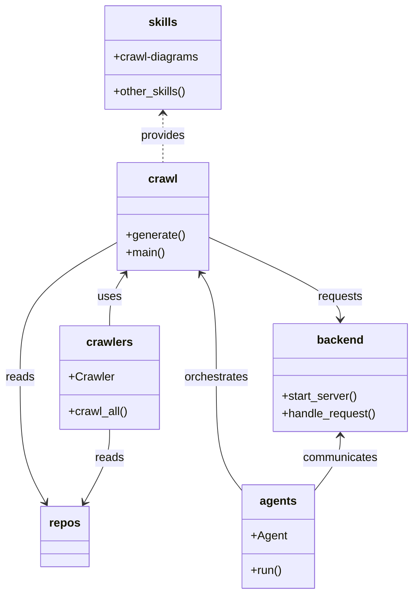

# Diagram: common/support_service/config/config.prod-a.yml

> Auto-generated by Obscura crawlers

## Mermaid

### SVG

<svg id="container" width="575.296875" xmlns="http://www.w3.org/2000/svg" class="classDiagram" height="826" viewBox="0 0 575.296875 826" role="graphics-document document" aria-roledescription="class"><g><defs><marker id="container_class-aggregationStart" class="marker aggregation class" refX="18" refY="7" markerWidth="190" markerHeight="240" orient="auto"><path d="M 18,7 L9,13 L1,7 L9,1 Z"></path></marker></defs><defs><marker id="container_class-aggregationEnd" class="marker aggregation class" refX="1" refY="7" markerWidth="20" markerHeight="28" orient="auto"><path d="M 18,7 L9,13 L1,7 L9,1 Z"></path></marker></defs><defs><marker id="container_class-extensionStart" class="marker extension class" refX="18" refY="7" markerWidth="190" markerHeight="240" orient="auto"><path d="M 1,7 L18,13 V 1 Z"></path></marker></defs><defs><marker id="container_class-extensionEnd" class="marker extension class" refX="1" refY="7" markerWidth="20" markerHeight="28" orient="auto"><path d="M 1,1 V 13 L18,7 Z"></path></marker></defs><defs><marker id="container_class-compositionStart" class="marker composition class" refX="18" refY="7" markerWidth="190" markerHeight="240" orient="auto"><path d="M 18,7 L9,13 L1,7 L9,1 Z"></path></marker></defs><defs><marker id="container_class-compositionEnd" class="marker composition class" refX="1" refY="7" markerWidth="20" markerHeight="28" orient="auto"><path d="M 18,7 L9,13 L1,7 L9,1 Z"></path></marker></defs><defs><marker id="container_class-dependencyStart" class="marker dependency class" refX="6" refY="7" markerWidth="190" markerHeight="240" orient="auto"><path d="M 5,7 L9,13 L1,7 L9,1 Z"></path></marker></defs><defs><marker id="container_class-dependencyEnd" class="marker dependency class" refX="13" refY="7" markerWidth="20" markerHeight="28" orient="auto"><path d="M 18,7 L9,13 L14,7 L9,1 Z"></path></marker></defs><defs><marker id="container_class-lollipopStart" class="marker lollipop class" refX="13" refY="7" markerWidth="190" markerHeight="240" orient="auto"><circle stroke="black" fill="transparent" cx="7" cy="7" r="6"></circle></marker></defs><defs><marker id="container_class-lollipopEnd" class="marker lollipop class" refX="1" refY="7" markerWidth="190" markerHeight="240" orient="auto"><circle stroke="black" fill="transparent" cx="7" cy="7" r="6"></circle></marker></defs><g class="root"><g class="clusters"></g><g class="edgePaths"><path d="M172.826,381L169.287,386.333C165.749,391.666,158.671,402.333,155.132,414.333C151.594,426.333,151.594,439.667,151.594,446.333L151.594,453" id="id_crawl_crawlers_1" class="edge-thickness-normal edge-pattern-solid relation" style=";;;" data-edge="true" data-et="edge" data-id="id_crawl_crawlers_1" data-points="W3sieCI6MTc2LjE0MzQxNTE3ODU3MTQ0LCJ5IjozNzZ9LHsieCI6MTUxLjU5Mzc1LCJ5Ijo0MTN9LHsieCI6MTUxLjU5Mzc1LCJ5Ijo0NTN9XQ==" marker-start="url(#container_class-dependencyStart)"></path><path d="M278.986,381L282.525,386.333C286.064,391.666,293.141,402.333,296.68,426.333C300.219,450.333,300.219,487.667,300.219,525C300.219,562.333,300.219,599.667,306.561,626.299C312.902,652.931,325.586,668.862,331.928,676.827L338.27,684.793" id="id_crawl_agents_2" class="edge-thickness-normal edge-pattern-solid relation" style=";;;" data-edge="true" data-et="edge" data-id="id_crawl_agents_2" data-points="W3sieCI6Mjc1LjY2OTA4NDgyMTQyODU2LCJ5IjozNzZ9LHsieCI6MzAwLjIxODc1LCJ5Ijo0MTN9LHsieCI6MzAwLjIxODc1LCJ5Ijo1MjV9LHsieCI6MzAwLjIxODc1LCJ5Ijo2Mzd9LHsieCI6MzM4LjI2OTUzMTI1LCJ5Ijo2ODQuNzkyOTg3MDM2MzcwMn1d" marker-start="url(#container_class-dependencyStart)"></path><path d="M473.781,606L473.781,611.167C473.781,616.333,473.781,626.667,467.439,639.799C461.098,652.931,448.414,668.862,442.072,676.827L435.73,684.793" id="id_backend_agents_3" class="edge-thickness-normal edge-pattern-solid relation" style=";;;" data-edge="true" data-et="edge" data-id="id_backend_agents_3" data-points="W3sieCI6NDczLjc4MTI1LCJ5Ijo2MDB9LHsieCI6NDczLjc4MTI1LCJ5Ijo2Mzd9LHsieCI6NDM1LjczMDQ2ODc1LCJ5Ijo2ODQuNzkyOTg3MDM2MzcwMn1d" marker-start="url(#container_class-dependencyStart)"></path><path d="M288.551,329.305L319.423,343.254C350.294,357.204,412.038,385.102,442.91,404.218C473.781,423.333,473.781,433.667,473.781,438.833L473.781,444" id="id_crawl_backend_4" class="edge-thickness-normal edge-pattern-solid relation" style=";;;" data-edge="true" data-et="edge" data-id="id_crawl_backend_4" data-points="W3sieCI6Mjg4LjU1MDc4MTI1LCJ5IjozMjkuMzA1MzQ1NDM2MjA3NzR9LHsieCI6NDczLjc4MTI1LCJ5Ijo0MTN9LHsieCI6NDczLjc4MTI1LCJ5Ijo0NTB9XQ==" marker-end="url(#container_class-dependencyEnd)"></path><path d="M163.262,336.453L140.719,349.211C118.177,361.969,73.092,387.484,50.55,418.909C28.008,450.333,28.008,487.667,28.008,525C28.008,562.333,28.008,599.667,33.845,628.63C39.682,657.593,51.357,678.187,57.194,688.484L63.032,698.78" id="id_crawl_repos_5" class="edge-thickness-normal edge-pattern-solid relation" style=";;;" data-edge="true" data-et="edge" data-id="id_crawl_repos_5" data-points="W3sieCI6MTYzLjI2MTcxODc1LCJ5IjozMzYuNDUzNDc1OTc4MDUwNn0seyJ4IjoyOC4wMDc4MTI1LCJ5Ijo0MTN9LHsieCI6MjguMDA3ODEyNSwieSI6NTI1fSx7IngiOjI4LjAwNzgxMjUsInkiOjYzN30seyJ4Ijo2NS45OTA2NDY1MDIyOTM1NywieSI6NzA0fV0=" marker-end="url(#container_class-dependencyEnd)"></path><path d="M225.906,158L225.906,163.167C225.906,168.333,225.906,178.667,225.906,190C225.906,201.333,225.906,213.667,225.906,219.833L225.906,226" id="id_skills_crawl_6" class="edge-thickness-normal edge-pattern-dashed relation" style=";;;" data-edge="true" data-et="edge" data-id="id_skills_crawl_6" data-points="W3sieCI6MjI1LjkwNjI1LCJ5IjoxNTJ9LHsieCI6MjI1LjkwNjI1LCJ5IjoxODl9LHsieCI6MjI1LjkwNjI1LCJ5IjoyMjZ9XQ==" marker-start="url(#container_class-dependencyStart)"></path><path d="M151.594,597L151.594,603.667C151.594,610.333,151.594,623.667,145.756,640.63C139.919,657.593,128.245,678.187,122.407,688.484L116.57,698.78" id="id_crawlers_repos_7" class="edge-thickness-normal edge-pattern-solid relation" style=";;;" data-edge="true" data-et="edge" data-id="id_crawlers_repos_7" data-points="W3sieCI6MTUxLjU5Mzc1LCJ5Ijo1OTd9LHsieCI6MTUxLjU5Mzc1LCJ5Ijo2Mzd9LHsieCI6MTEzLjYxMDkxNTk5NzcwNjQzLCJ5Ijo3MDR9XQ==" marker-end="url(#container_class-dependencyEnd)"></path></g><g class="edgeLabels"><g class="edgeLabel" transform="translate(151.59375, 413)"><g class="label" data-id="id_crawl_crawlers_1" transform="translate(-16.4921875, -12)"><foreignObject width="32.984375" height="24">

uses

</foreignObject></g></g><g class="edgeLabel" transform="translate(300.21875, 525)"><g class="label" data-id="id_crawl_agents_2" transform="translate(-45.046875, -12)"><foreignObject width="90.09375" height="24">

orchestrates

</foreignObject></g></g><g class="edgeLabel" transform="translate(473.78125, 637)"><g class="label" data-id="id_backend_agents_3" transform="translate(-52.609375, -12)"><foreignObject width="105.21875" height="24">

communicates

</foreignObject></g></g><g class="edgeLabel" transform="translate(473.78125, 413)"><g class="label" data-id="id_crawl_backend_4" transform="translate(-31.375, -12)"><foreignObject width="62.75" height="24">

requests

</foreignObject></g></g><g class="edgeLabel" transform="translate(28.0078125, 525)"><g class="label" data-id="id_crawl_repos_5" transform="translate(-20.0078125, -12)"><foreignObject width="40.015625" height="24">

reads

</foreignObject></g></g><g class="edgeLabel" transform="translate(225.90625, 189)"><g class="label" data-id="id_skills_crawl_6" transform="translate(-31.3125, -12)"><foreignObject width="62.625" height="24">

provides

</foreignObject></g></g><g class="edgeLabel" transform="translate(151.59375, 637)"><g class="label" data-id="id_crawlers_repos_7" transform="translate(-20.0078125, -12)"><foreignObject width="40.015625" height="24">

reads

</foreignObject></g></g></g><g class="nodes"><g class="node default" id="classId-crawl-0" transform="translate(225.90625, 301)"><g class="basic label-container"><path d="M-62.64453125 -75 L62.64453125 -75 L62.64453125 75 L-62.64453125 75" stroke="none" stroke-width="0" fill="#ECECFF" style=""></path><path d="M-62.64453125 -75 C-37.541091658569556 -75, -12.437652067139112 -75, 62.64453125 -75 M-62.64453125 -75 C-28.185402626760656 -75, 6.273725996478689 -75, 62.64453125 -75 M62.64453125 -75 C62.64453125 -37.464367879500024, 62.64453125 0.07126424099995177, 62.64453125 75 M62.64453125 -75 C62.64453125 -31.97314159251065, 62.64453125 11.0537168149787, 62.64453125 75 M62.64453125 75 C21.459704381225265 75, -19.72512248754947 75, -62.64453125 75 M62.64453125 75 C31.28281050995356 75, -0.07891023009288034 75, -62.64453125 75 M-62.64453125 75 C-62.64453125 41.26569766729447, -62.64453125 7.531395334588936, -62.64453125 -75 M-62.64453125 75 C-62.64453125 19.016750031356153, -62.64453125 -36.96649993728769, -62.64453125 -75" stroke="#9370DB" stroke-width="1.3" fill="none" stroke-dasharray="0 0" style=""></path></g><g class="annotation-group text" transform="translate(0, -51)"></g><g class="label-group text" transform="translate(-19.4765625, -51)"><g class="label" style="font-weight: bolder" transform="translate(0,-12)"><foreignObject width="38.953125" height="24">

crawl

</foreignObject></g></g><g class="members-group text" transform="translate(-50.64453125, -3)"></g><g class="methods-group text" transform="translate(-50.64453125, 27)"><g class="label" style="" transform="translate(0,-12)"><foreignObject width="81.8125" height="24">

+generate()

</foreignObject></g><g class="label" style="" transform="translate(0,12)"><foreignObject width="54.65625" height="24">

+main()

</foreignObject></g></g><g class="divider" style=""><path d="M-62.64453125 -27 C-12.999869691200885 -27, 36.64479186759823 -27, 62.64453125 -27 M-62.64453125 -27 C-36.22693048121347 -27, -9.809329712426944 -27, 62.64453125 -27" stroke="#9370DB" stroke-width="1.3" fill="none" stroke-dasharray="0 0" style=""></path></g><g class="divider" style=""><path d="M-62.64453125 -3 C-17.170882869862417 -3, 28.302765510275165 -3, 62.64453125 -3 M-62.64453125 -3 C-14.636176106294393 -3, 33.372179037411215 -3, 62.64453125 -3" stroke="#9370DB" stroke-width="1.3" fill="none" stroke-dasharray="0 0" style=""></path></g></g><g class="node default" id="classId-crawlers-1" transform="translate(151.59375, 525)"><g class="basic label-container"><path d="M-68.578125 -72 L68.578125 -72 L68.578125 72 L-68.578125 72" stroke="none" stroke-width="0" fill="#ECECFF" style=""></path><path d="M-68.578125 -72 C-15.970834374423944 -72, 36.63645625115211 -72, 68.578125 -72 M-68.578125 -72 C-15.439113117843355 -72, 37.69989876431329 -72, 68.578125 -72 M68.578125 -72 C68.578125 -22.209275206649693, 68.578125 27.581449586700614, 68.578125 72 M68.578125 -72 C68.578125 -19.664017871857226, 68.578125 32.67196425628555, 68.578125 72 M68.578125 72 C28.006191110664965 72, -12.56574277867007 72, -68.578125 72 M68.578125 72 C26.075816312704163 72, -16.426492374591675 72, -68.578125 72 M-68.578125 72 C-68.578125 18.51625878661178, -68.578125 -34.96748242677644, -68.578125 -72 M-68.578125 72 C-68.578125 31.608731212851907, -68.578125 -8.782537574296185, -68.578125 -72" stroke="#9370DB" stroke-width="1.3" fill="none" stroke-dasharray="0 0" style=""></path></g><g class="annotation-group text" transform="translate(0, -48)"></g><g class="label-group text" transform="translate(-30.828125, -48)"><g class="label" style="font-weight: bolder" transform="translate(0,-12)"><foreignObject width="61.65625" height="24">

crawlers

</foreignObject></g></g><g class="members-group text" transform="translate(-56.578125, 0)"><g class="label" style="" transform="translate(0,-12)"><foreignObject width="61.921875" height="24">

+Crawler

</foreignObject></g></g><g class="methods-group text" transform="translate(-56.578125, 48)"><g class="label" style="" transform="translate(0,-12)"><foreignObject width="82.328125" height="24">

+crawl_all()

</foreignObject></g></g><g class="divider" style=""><path d="M-68.578125 -24 C-18.934229897738476 -24, 30.70966520452305 -24, 68.578125 -24 M-68.578125 -24 C-18.54968681792348 -24, 31.47875136415304 -24, 68.578125 -24" stroke="#9370DB" stroke-width="1.3" fill="none" stroke-dasharray="0 0" style=""></path></g><g class="divider" style=""><path d="M-68.578125 24 C-33.929519804810006 24, 0.7190853903799876 24, 68.578125 24 M-68.578125 24 C-18.747443684956906 24, 31.083237630086188 24, 68.578125 24" stroke="#9370DB" stroke-width="1.3" fill="none" stroke-dasharray="0 0" style=""></path></g></g><g class="node default" id="classId-backend-2" transform="translate(473.78125, 525)"><g class="basic label-container"><path d="M-93.515625 -75 L93.515625 -75 L93.515625 75 L-93.515625 75" stroke="none" stroke-width="0" fill="#ECECFF" style=""></path><path d="M-93.515625 -75 C-48.67182890019667 -75, -3.828032800393345 -75, 93.515625 -75 M-93.515625 -75 C-36.55249968928915 -75, 20.4106256214217 -75, 93.515625 -75 M93.515625 -75 C93.515625 -40.789200333613564, 93.515625 -6.578400667227129, 93.515625 75 M93.515625 -75 C93.515625 -35.77032742819866, 93.515625 3.4593451436026754, 93.515625 75 M93.515625 75 C30.126442870313788 75, -33.262739259372424 75, -93.515625 75 M93.515625 75 C34.482108490459865 75, -24.55140801908027 75, -93.515625 75 M-93.515625 75 C-93.515625 32.1870497318003, -93.515625 -10.6259005363994, -93.515625 -75 M-93.515625 75 C-93.515625 16.589154533693588, -93.515625 -41.821690932612825, -93.515625 -75" stroke="#9370DB" stroke-width="1.3" fill="none" stroke-dasharray="0 0" style=""></path></g><g class="annotation-group text" transform="translate(0, -51)"></g><g class="label-group text" transform="translate(-31.0625, -51)"><g class="label" style="font-weight: bolder" transform="translate(0,-12)"><foreignObject width="62.125" height="24">

backend

</foreignObject></g></g><g class="members-group text" transform="translate(-81.515625, -3)"></g><g class="methods-group text" transform="translate(-81.515625, 27)"><g class="label" style="" transform="translate(0,-12)"><foreignObject width="105.546875" height="24">

+start_server()

</foreignObject></g><g class="label" style="" transform="translate(0,12)"><foreignObject width="131.96875" height="24">

+handle_request()

</foreignObject></g></g><g class="divider" style=""><path d="M-93.515625 -27 C-28.32469035534629 -27, 36.86624428930742 -27, 93.515625 -27 M-93.515625 -27 C-38.594764659303024 -27, 16.32609568139395 -27, 93.515625 -27" stroke="#9370DB" stroke-width="1.3" fill="none" stroke-dasharray="0 0" style=""></path></g><g class="divider" style=""><path d="M-93.515625 -3 C-39.46460722684156 -3, 14.586410546316884 -3, 93.515625 -3 M-93.515625 -3 C-29.516941571649916 -3, 34.48174185670017 -3, 93.515625 -3" stroke="#9370DB" stroke-width="1.3" fill="none" stroke-dasharray="0 0" style=""></path></g></g><g class="node default" id="classId-agents-3" transform="translate(387, 746)"><g class="basic label-container"><path d="M-48.73046875 -72 L48.73046875 -72 L48.73046875 72 L-48.73046875 72" stroke="none" stroke-width="0" fill="#ECECFF" style=""></path><path d="M-48.73046875 -72 C-10.603116593998635 -72, 27.52423556200273 -72, 48.73046875 -72 M-48.73046875 -72 C-27.884850995063093 -72, -7.039233240126187 -72, 48.73046875 -72 M48.73046875 -72 C48.73046875 -36.97839238650929, 48.73046875 -1.9567847730185832, 48.73046875 72 M48.73046875 -72 C48.73046875 -26.56587141327504, 48.73046875 18.86825717344992, 48.73046875 72 M48.73046875 72 C19.219008597049033 72, -10.292451555901934 72, -48.73046875 72 M48.73046875 72 C22.857375198048352 72, -3.0157183539032957 72, -48.73046875 72 M-48.73046875 72 C-48.73046875 17.541837421732282, -48.73046875 -36.916325156535436, -48.73046875 -72 M-48.73046875 72 C-48.73046875 20.987893224266365, -48.73046875 -30.02421355146727, -48.73046875 -72" stroke="#9370DB" stroke-width="1.3" fill="none" stroke-dasharray="0 0" style=""></path></g><g class="annotation-group text" transform="translate(0, -48)"></g><g class="label-group text" transform="translate(-24.5234375, -48)"><g class="label" style="font-weight: bolder" transform="translate(0,-12)"><foreignObject width="49.046875" height="24">

agents

</foreignObject></g></g><g class="members-group text" transform="translate(-36.73046875, 0)"><g class="label" style="" transform="translate(0,-12)"><foreignObject width="48.9375" height="24">

+Agent

</foreignObject></g></g><g class="methods-group text" transform="translate(-36.73046875, 48)"><g class="label" style="" transform="translate(0,-12)"><foreignObject width="43.21875" height="24">

+run()

</foreignObject></g></g><g class="divider" style=""><path d="M-48.73046875 -24 C-26.163016602040997 -24, -3.5955644540819947 -24, 48.73046875 -24 M-48.73046875 -24 C-15.601666124128421 -24, 17.527136501743158 -24, 48.73046875 -24" stroke="#9370DB" stroke-width="1.3" fill="none" stroke-dasharray="0 0" style=""></path></g><g class="divider" style=""><path d="M-48.73046875 24 C-16.233426054610582 24, 16.263616640778835 24, 48.73046875 24 M-48.73046875 24 C-16.95267257891494 24, 14.825123592170122 24, 48.73046875 24" stroke="#9370DB" stroke-width="1.3" fill="none" stroke-dasharray="0 0" style=""></path></g></g><g class="node default" id="classId-skills-4" transform="translate(225.90625, 80)"><g class="basic label-container"><path d="M-80.96875 -72 L80.96875 -72 L80.96875 72 L-80.96875 72" stroke="none" stroke-width="0" fill="#ECECFF" style=""></path><path d="M-80.96875 -72 C-45.27119347594559 -72, -9.573636951891174 -72, 80.96875 -72 M-80.96875 -72 C-38.92484478741961 -72, 3.1190604251607823 -72, 80.96875 -72 M80.96875 -72 C80.96875 -41.47419060385061, 80.96875 -10.948381207701217, 80.96875 72 M80.96875 -72 C80.96875 -38.11680188153907, 80.96875 -4.233603763078136, 80.96875 72 M80.96875 72 C21.307476424693583 72, -38.353797150612834 72, -80.96875 72 M80.96875 72 C45.85698479810571 72, 10.745219596211413 72, -80.96875 72 M-80.96875 72 C-80.96875 26.273528948688835, -80.96875 -19.45294210262233, -80.96875 -72 M-80.96875 72 C-80.96875 31.820923316703812, -80.96875 -8.358153366592376, -80.96875 -72" stroke="#9370DB" stroke-width="1.3" fill="none" stroke-dasharray="0 0" style=""></path></g><g class="annotation-group text" transform="translate(0, -48)"></g><g class="label-group text" transform="translate(-19.15625, -48)"><g class="label" style="font-weight: bolder" transform="translate(0,-12)"><foreignObject width="38.3125" height="24">

skills

</foreignObject></g></g><g class="members-group text" transform="translate(-68.96875, 0)"><g class="label" style="" transform="translate(0,-12)"><foreignObject width="118.78125" height="24">

+crawl-diagrams

</foreignObject></g></g><g class="methods-group text" transform="translate(-68.96875, 48)"><g class="label" style="" transform="translate(0,-12)"><foreignObject width="101.8125" height="24">

+other_skills()

</foreignObject></g></g><g class="divider" style=""><path d="M-80.96875 -24 C-30.581544156229484 -24, 19.805661687541033 -24, 80.96875 -24 M-80.96875 -24 C-28.19611270158657 -24, 24.576524596826857 -24, 80.96875 -24" stroke="#9370DB" stroke-width="1.3" fill="none" stroke-dasharray="0 0" style=""></path></g><g class="divider" style=""><path d="M-80.96875 24 C-21.276553379348726 24, 38.41564324130255 24, 80.96875 24 M-80.96875 24 C-18.999270177775152 24, 42.970209644449696 24, 80.96875 24" stroke="#9370DB" stroke-width="1.3" fill="none" stroke-dasharray="0 0" style=""></path></g></g><g class="node default" id="classId-repos-5" transform="translate(89.80078125, 746)"><g class="basic label-container"><path d="M-32.703125 -42 L32.703125 -42 L32.703125 42 L-32.703125 42" stroke="none" stroke-width="0" fill="#ECECFF" style=""></path><path d="M-32.703125 -42 C-7.719028838423487 -42, 17.265067323153026 -42, 32.703125 -42 M-32.703125 -42 C-17.87161640945392 -42, -3.040107818907842 -42, 32.703125 -42 M32.703125 -42 C32.703125 -23.896978057604265, 32.703125 -5.79395611520853, 32.703125 42 M32.703125 -42 C32.703125 -16.08737580454276, 32.703125 9.825248390914481, 32.703125 42 M32.703125 42 C15.068959352287859 42, -2.5652062954242822 42, -32.703125 42 M32.703125 42 C18.32574597592719 42, 3.948366951854382 42, -32.703125 42 M-32.703125 42 C-32.703125 17.47293693314803, -32.703125 -7.054126133703939, -32.703125 -42 M-32.703125 42 C-32.703125 25.194272225082457, -32.703125 8.388544450164915, -32.703125 -42" stroke="#9370DB" stroke-width="1.3" fill="none" stroke-dasharray="0 0" style=""></path></g><g class="annotation-group text" transform="translate(0, -18)"></g><g class="label-group text" transform="translate(-20.703125, -18)"><g class="label" style="font-weight: bolder" transform="translate(0,-12)"><foreignObject width="41.40625" height="24">

repos

</foreignObject></g></g><g class="members-group text" transform="translate(-20.703125, 30)"></g><g class="methods-group text" transform="translate(-20.703125, 60)"></g><g class="divider" style=""><path d="M-32.703125 6 C-7.718446694323987 6, 17.266231611352026 6, 32.703125 6 M-32.703125 6 C-17.060062300109003 6, -1.4169996002180056 6, 32.703125 6" stroke="#9370DB" stroke-width="1.3" fill="none" stroke-dasharray="0 0" style=""></path></g><g class="divider" style=""><path d="M-32.703125 24 C-18.417502144518192 24, -4.131879289036384 24, 32.703125 24 M-32.703125 24 C-13.813996318557034 24, 5.075132362885931 24, 32.703125 24" stroke="#9370DB" stroke-width="1.3" fill="none" stroke-dasharray="0 0" style=""></path></g></g></g></g></g></svg>
