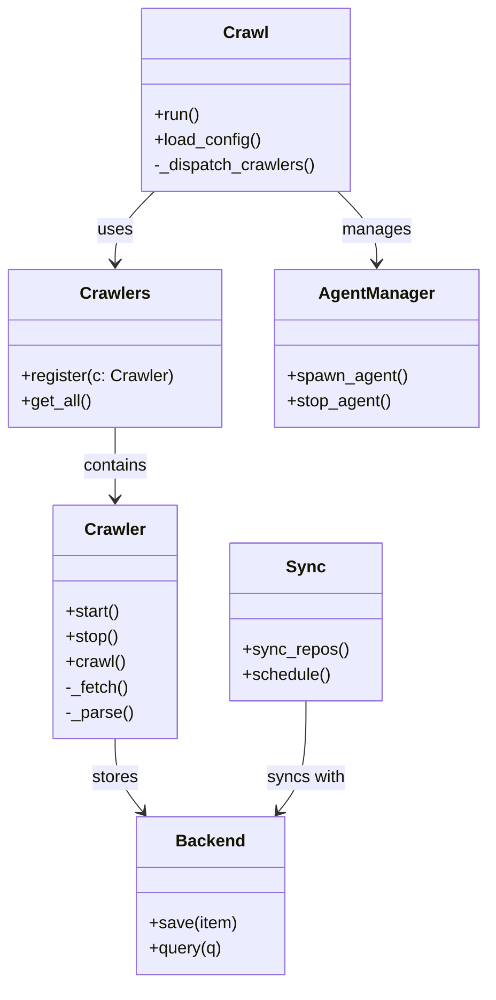
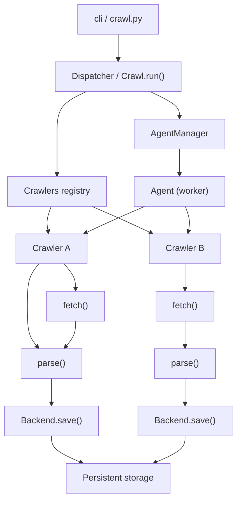

# Diagram: common/support_service/config/config.prod-b.yml

> Auto-generated by Obscura crawlers

## Diagram 1

### SVG

<svg id="container" width="454.3828125" xmlns="http://www.w3.org/2000/svg" class="classDiagram" height="934" viewBox="0 0 454.3828125 934" role="graphics-document document" aria-roledescription="class"><g><defs><marker id="container_class-aggregationStart" class="marker aggregation class" refX="18" refY="7" markerWidth="190" markerHeight="240" orient="auto"><path d="M 18,7 L9,13 L1,7 L9,1 Z"></path></marker></defs><defs><marker id="container_class-aggregationEnd" class="marker aggregation class" refX="1" refY="7" markerWidth="20" markerHeight="28" orient="auto"><path d="M 18,7 L9,13 L1,7 L9,1 Z"></path></marker></defs><defs><marker id="container_class-extensionStart" class="marker extension class" refX="18" refY="7" markerWidth="190" markerHeight="240" orient="auto"><path d="M 1,7 L18,13 V 1 Z"></path></marker></defs><defs><marker id="container_class-extensionEnd" class="marker extension class" refX="1" refY="7" markerWidth="20" markerHeight="28" orient="auto"><path d="M 1,1 V 13 L18,7 Z"></path></marker></defs><defs><marker id="container_class-compositionStart" class="marker composition class" refX="18" refY="7" markerWidth="190" markerHeight="240" orient="auto"><path d="M 18,7 L9,13 L1,7 L9,1 Z"></path></marker></defs><defs><marker id="container_class-compositionEnd" class="marker composition class" refX="1" refY="7" markerWidth="20" markerHeight="28" orient="auto"><path d="M 18,7 L9,13 L1,7 L9,1 Z"></path></marker></defs><defs><marker id="container_class-dependencyStart" class="marker dependency class" refX="6" refY="7" markerWidth="190" markerHeight="240" orient="auto"><path d="M 5,7 L9,13 L1,7 L9,1 Z"></path></marker></defs><defs><marker id="container_class-dependencyEnd" class="marker dependency class" refX="13" refY="7" markerWidth="20" markerHeight="28" orient="auto"><path d="M 18,7 L9,13 L14,7 L9,1 Z"></path></marker></defs><defs><marker id="container_class-lollipopStart" class="marker lollipop class" refX="13" refY="7" markerWidth="190" markerHeight="240" orient="auto"><circle stroke="black" fill="transparent" cx="7" cy="7" r="6"></circle></marker></defs><defs><marker id="container_class-lollipopEnd" class="marker lollipop class" refX="1" refY="7" markerWidth="190" markerHeight="240" orient="auto"><circle stroke="black" fill="transparent" cx="7" cy="7" r="6"></circle></marker></defs><g class="root"><g class="clusters"></g><g class="edgePaths"><path d="M143.799,182L137.727,188.167C131.655,194.333,119.511,206.667,113.439,218C107.367,229.333,107.367,239.667,107.367,244.833L107.367,250" id="id_Crawl_Crawlers_1" class="edge-thickness-normal edge-pattern-solid relation" style=";;;" data-edge="true" data-et="edge" data-id="id_Crawl_Crawlers_1" data-points="W3sieCI6MTQzLjc5ODk2OTg4NDA3MjU2LCJ5IjoxODJ9LHsieCI6MTA3LjM2NzE4NzUsInkiOjIxOX0seyJ4IjoxMDcuMzY3MTg3NSwieSI6MjU2fV0=" marker-end="url(#container_class-dependencyEnd)"></path><path d="M107.367,406L107.367,412.167C107.367,418.333,107.367,430.667,107.367,442C107.367,453.333,107.367,463.667,107.367,468.833L107.367,474" id="id_Crawlers_Crawler_2" class="edge-thickness-normal edge-pattern-solid relation" style=";;;" data-edge="true" data-et="edge" data-id="id_Crawlers_Crawler_2" data-points="W3sieCI6MTA3LjM2NzE4NzUsInkiOjQwNn0seyJ4IjoxMDcuMzY3MTg3NSwieSI6NDQzfSx7IngiOjEwNy4zNjcxODc1LCJ5Ijo0ODB9XQ==" marker-end="url(#container_class-dependencyEnd)"></path><path d="M315.127,182L321.199,188.167C327.271,194.333,339.415,206.667,345.487,218C351.559,229.333,351.559,239.667,351.559,244.833L351.559,250" id="id_Crawl_AgentManager_3" class="edge-thickness-normal edge-pattern-solid relation" style=";;;" data-edge="true" data-et="edge" data-id="id_Crawl_AgentManager_3" data-points="W3sieCI6MzE1LjEyNjgxMTM2NTkyNzQ0LCJ5IjoxODJ9LHsieCI6MzUxLjU1ODU5Mzc1LCJ5IjoyMTl9LHsieCI6MzUxLjU1ODU5Mzc1LCJ5IjoyNTZ9XQ==" marker-end="url(#container_class-dependencyEnd)"></path><path d="M107.367,702L107.367,708.167C107.367,714.333,107.367,726.667,111.65,738.217C115.933,749.768,124.5,760.536,128.783,765.92L133.066,771.305" id="id_Crawler_Backend_4" class="edge-thickness-normal edge-pattern-solid relation" style=";;;" data-edge="true" data-et="edge" data-id="id_Crawler_Backend_4" data-points="W3sieCI6MTA3LjM2NzE4NzUsInkiOjcwMn0seyJ4IjoxMDcuMzY3MTg3NSwieSI6NzM5fSx7IngiOjEzNi44MDEyMzQ2NTQwMTc4NiwieSI6Nzc2fV0=" marker-end="url(#container_class-dependencyEnd)"></path><path d="M285.563,666L285.563,678.167C285.563,690.333,285.563,714.667,281.279,732.217C276.996,749.768,268.43,760.536,264.147,765.92L259.864,771.305" id="id_Sync_Backend_5" class="edge-thickness-normal edge-pattern-solid relation" style=";;;" data-edge="true" data-et="edge" data-id="id_Sync_Backend_5" data-points="W3sieCI6Mjg1LjU2MjUsInkiOjY2Nn0seyJ4IjoyODUuNTYyNSwieSI6NzM5fSx7IngiOjI1Ni4xMjg0NTI4NDU5ODIxNywieSI6Nzc2fV0=" marker-end="url(#container_class-dependencyEnd)"></path></g><g class="edgeLabels"><g class="edgeLabel" transform="translate(107.3671875, 219)"><g class="label" data-id="id_Crawl_Crawlers_1" transform="translate(-16.4921875, -12)"><foreignObject width="32.984375" height="24">

uses

</foreignObject></g></g><g class="edgeLabel" transform="translate(107.3671875, 443)"><g class="label" data-id="id_Crawlers_Crawler_2" transform="translate(-30.890625, -12)"><foreignObject width="61.78125" height="24">

contains

</foreignObject></g></g><g class="edgeLabel" transform="translate(351.55859375, 219)"><g class="label" data-id="id_Crawl_AgentManager_3" transform="translate(-32.296875, -12)"><foreignObject width="64.59375" height="24">

manages

</foreignObject></g></g><g class="edgeLabel" transform="translate(107.3671875, 739)"><g class="label" data-id="id_Crawler_Backend_4" transform="translate(-22.125, -12)"><foreignObject width="44.25" height="24">

stores

</foreignObject></g></g><g class="edgeLabel" transform="translate(285.5625, 739)"><g class="label" data-id="id_Sync_Backend_5" transform="translate(-37.4765625, -12)"><foreignObject width="74.953125" height="24">

syncs with

</foreignObject></g></g></g><g class="nodes"><g class="node default" id="classId-Crawl-0" transform="translate(229.462890625, 95)"><g class="basic label-container"><path d="M-98.97265625 -87 L98.97265625 -87 L98.97265625 87 L-98.97265625 87" stroke="none" stroke-width="0" fill="#ECECFF" style=""></path><path d="M-98.97265625 -87 C-51.457762924536866 -87, -3.942869599073731 -87, 98.97265625 -87 M-98.97265625 -87 C-45.96183900969942 -87, 7.048978230601165 -87, 98.97265625 -87 M98.97265625 -87 C98.97265625 -48.82821150823365, 98.97265625 -10.6564230164673, 98.97265625 87 M98.97265625 -87 C98.97265625 -44.999158424752665, 98.97265625 -2.998316849505329, 98.97265625 87 M98.97265625 87 C50.13063473102421 87, 1.2886132120484177 87, -98.97265625 87 M98.97265625 87 C34.22972576012393 87, -30.513204729752147 87, -98.97265625 87 M-98.97265625 87 C-98.97265625 42.90434686241711, -98.97265625 -1.1913062751657861, -98.97265625 -87 M-98.97265625 87 C-98.97265625 28.345400659293162, -98.97265625 -30.309198681413676, -98.97265625 -87" stroke="#9370DB" stroke-width="1.3" fill="none" stroke-dasharray="0 0" style=""></path></g><g class="annotation-group text" transform="translate(0, -63)"></g><g class="label-group text" transform="translate(-20.1484375, -63)"><g class="label" style="font-weight: bolder" transform="translate(0,-12)"><foreignObject width="40.296875" height="24">

Crawl

</foreignObject></g></g><g class="members-group text" transform="translate(-86.97265625, -15)"></g><g class="methods-group text" transform="translate(-86.97265625, 15)"><g class="label" style="" transform="translate(0,-12)"><foreignObject width="43.21875" height="24">

+run()

</foreignObject></g><g class="label" style="" transform="translate(0,12)"><foreignObject width="101.984375" height="24">

+load_config()

</foreignObject></g><g class="label" style="" transform="translate(0,36)"><foreignObject width="153.796875" height="24">

-_dispatch_crawlers()

</foreignObject></g></g><g class="divider" style=""><path d="M-98.97265625 -39 C-51.136124182502826 -39, -3.2995921150056517 -39, 98.97265625 -39 M-98.97265625 -39 C-30.645302798611127 -39, 37.68205065277775 -39, 98.97265625 -39" stroke="#9370DB" stroke-width="1.3" fill="none" stroke-dasharray="0 0" style=""></path></g><g class="divider" style=""><path d="M-98.97265625 -15 C-47.28673328360012 -15, 4.399189682799758 -15, 98.97265625 -15 M-98.97265625 -15 C-47.006087821668906 -15, 4.960480606662188 -15, 98.97265625 -15" stroke="#9370DB" stroke-width="1.3" fill="none" stroke-dasharray="0 0" style=""></path></g></g><g class="node default" id="classId-Crawler-1" transform="translate(107.3671875, 591)"><g class="basic label-container"><path d="M-57.890625 -111 L57.890625 -111 L57.890625 111 L-57.890625 111" stroke="none" stroke-width="0" fill="#ECECFF" style=""></path><path d="M-57.890625 -111 C-18.995357791598785 -111, 19.89990941680243 -111, 57.890625 -111 M-57.890625 -111 C-31.742092927642396 -111, -5.593560855284792 -111, 57.890625 -111 M57.890625 -111 C57.890625 -25.578331003134195, 57.890625 59.84333799373161, 57.890625 111 M57.890625 -111 C57.890625 -44.88303699750335, 57.890625 21.233926004993293, 57.890625 111 M57.890625 111 C27.491084769138748 111, -2.908455461722504 111, -57.890625 111 M57.890625 111 C33.91423276458229 111, 9.937840529164575 111, -57.890625 111 M-57.890625 111 C-57.890625 29.219176419385235, -57.890625 -52.56164716122953, -57.890625 -111 M-57.890625 111 C-57.890625 38.717781828404355, -57.890625 -33.56443634319129, -57.890625 -111" stroke="#9370DB" stroke-width="1.3" fill="none" stroke-dasharray="0 0" style=""></path></g><g class="annotation-group text" transform="translate(0, -87)"></g><g class="label-group text" transform="translate(-27.734375, -87)"><g class="label" style="font-weight: bolder" transform="translate(0,-12)"><foreignObject width="55.46875" height="24">

Crawler

</foreignObject></g></g><g class="members-group text" transform="translate(-45.890625, -39)"></g><g class="methods-group text" transform="translate(-45.890625, -9)"><g class="label" style="" transform="translate(0,-12)"><foreignObject width="52.15625" height="24">

+start()

</foreignObject></g><g class="label" style="" transform="translate(0,12)"><foreignObject width="50.21875" height="24">

+stop()

</foreignObject></g><g class="label" style="" transform="translate(0,36)"><foreignObject width="56.40625" height="24">

+crawl()

</foreignObject></g><g class="label" style="" transform="translate(0,60)"><foreignObject width="60.03125" height="24">

-_fetch()

</foreignObject></g><g class="label" style="" transform="translate(0,84)"><foreignObject width="64.046875" height="24">

-_parse()

</foreignObject></g></g><g class="divider" style=""><path d="M-57.890625 -63 C-31.014185340691213 -63, -4.137745681382427 -63, 57.890625 -63 M-57.890625 -63 C-17.688141845788124 -63, 22.514341308423752 -63, 57.890625 -63" stroke="#9370DB" stroke-width="1.3" fill="none" stroke-dasharray="0 0" style=""></path></g><g class="divider" style=""><path d="M-57.890625 -39 C-25.080828391542504 -39, 7.728968216914993 -39, 57.890625 -39 M-57.890625 -39 C-13.494591422987632 -39, 30.901442154024735 -39, 57.890625 -39" stroke="#9370DB" stroke-width="1.3" fill="none" stroke-dasharray="0 0" style=""></path></g></g><g class="node default" id="classId-Crawlers-2" transform="translate(107.3671875, 331)"><g class="basic label-container"><path d="M-99.3671875 -75 L99.3671875 -75 L99.3671875 75 L-99.3671875 75" stroke="none" stroke-width="0" fill="#ECECFF" style=""></path><path d="M-99.3671875 -75 C-22.69005787428391 -75, 53.98707175143218 -75, 99.3671875 -75 M-99.3671875 -75 C-57.63918394054773 -75, -15.911180381095463 -75, 99.3671875 -75 M99.3671875 -75 C99.3671875 -37.11081152985016, 99.3671875 0.7783769402996796, 99.3671875 75 M99.3671875 -75 C99.3671875 -22.622374199979454, 99.3671875 29.755251600041092, 99.3671875 75 M99.3671875 75 C27.80926078286187 75, -43.74866593427626 75, -99.3671875 75 M99.3671875 75 C25.098590426971185 75, -49.17000664605763 75, -99.3671875 75 M-99.3671875 75 C-99.3671875 41.08543008452878, -99.3671875 7.170860169057562, -99.3671875 -75 M-99.3671875 75 C-99.3671875 32.15129015960045, -99.3671875 -10.6974196807991, -99.3671875 -75" stroke="#9370DB" stroke-width="1.3" fill="none" stroke-dasharray="0 0" style=""></path></g><g class="annotation-group text" transform="translate(0, -51)"></g><g class="label-group text" transform="translate(-31.5, -51)"><g class="label" style="font-weight: bolder" transform="translate(0,-12)"><foreignObject width="63" height="24">

Crawlers

</foreignObject></g></g><g class="members-group text" transform="translate(-87.3671875, -3)"></g><g class="methods-group text" transform="translate(-87.3671875, 27)"><g class="label" style="" transform="translate(0,-12)"><foreignObject width="143.234375" height="24">

+register(c: Crawler)

</foreignObject></g><g class="label" style="" transform="translate(0,12)"><foreignObject width="66.84375" height="24">

+get_all()

</foreignObject></g></g><g class="divider" style=""><path d="M-99.3671875 -27 C-47.10626605231915 -27, 5.154655395361701 -27, 99.3671875 -27 M-99.3671875 -27 C-23.689884007883705 -27, 51.98741948423259 -27, 99.3671875 -27" stroke="#9370DB" stroke-width="1.3" fill="none" stroke-dasharray="0 0" style=""></path></g><g class="divider" style=""><path d="M-99.3671875 -3 C-53.77591032083866 -3, -8.184633141677324 -3, 99.3671875 -3 M-99.3671875 -3 C-36.53133768855134 -3, 26.30451212289732 -3, 99.3671875 -3" stroke="#9370DB" stroke-width="1.3" fill="none" stroke-dasharray="0 0" style=""></path></g></g><g class="node default" id="classId-AgentManager-3" transform="translate(351.55859375, 331)"><g class="basic label-container"><path d="M-94.82421875 -75 L94.82421875 -75 L94.82421875 75 L-94.82421875 75" stroke="none" stroke-width="0" fill="#ECECFF" style=""></path><path d="M-94.82421875 -75 C-51.57027145053614 -75, -8.31632415107228 -75, 94.82421875 -75 M-94.82421875 -75 C-28.464728507581 -75, 37.894761734838 -75, 94.82421875 -75 M94.82421875 -75 C94.82421875 -26.780226706962374, 94.82421875 21.439546586075252, 94.82421875 75 M94.82421875 -75 C94.82421875 -23.586680117351193, 94.82421875 27.826639765297614, 94.82421875 75 M94.82421875 75 C20.80466195432544 75, -53.21489484134912 75, -94.82421875 75 M94.82421875 75 C24.405976732517743 75, -46.01226528496451 75, -94.82421875 75 M-94.82421875 75 C-94.82421875 42.843498257322935, -94.82421875 10.68699651464587, -94.82421875 -75 M-94.82421875 75 C-94.82421875 43.420116873425854, -94.82421875 11.840233746851702, -94.82421875 -75" stroke="#9370DB" stroke-width="1.3" fill="none" stroke-dasharray="0 0" style=""></path></g><g class="annotation-group text" transform="translate(0, -51)"></g><g class="label-group text" transform="translate(-52.5234375, -51)"><g class="label" style="font-weight: bolder" transform="translate(0,-12)"><foreignObject width="105.046875" height="24">

AgentManager

</foreignObject></g></g><g class="members-group text" transform="translate(-82.82421875, -3)"></g><g class="methods-group text" transform="translate(-82.82421875, 27)"><g class="label" style="" transform="translate(0,-12)"><foreignObject width="113.125" height="24">

+spawn_agent()

</foreignObject></g><g class="label" style="" transform="translate(0,12)"><foreignObject width="98.375" height="24">

+stop_agent()

</foreignObject></g></g><g class="divider" style=""><path d="M-94.82421875 -27 C-22.372231156147592 -27, 50.079756437704816 -27, 94.82421875 -27 M-94.82421875 -27 C-26.078903766643577 -27, 42.666411216712845 -27, 94.82421875 -27" stroke="#9370DB" stroke-width="1.3" fill="none" stroke-dasharray="0 0" style=""></path></g><g class="divider" style=""><path d="M-94.82421875 -3 C-20.986976525420516 -3, 52.85026569915897 -3, 94.82421875 -3 M-94.82421875 -3 C-54.35342831617351 -3, -13.882637882347026 -3, 94.82421875 -3" stroke="#9370DB" stroke-width="1.3" fill="none" stroke-dasharray="0 0" style=""></path></g></g><g class="node default" id="classId-Backend-4" transform="translate(196.46484375, 851)"><g class="basic label-container"><path d="M-69.21875 -75 L69.21875 -75 L69.21875 75 L-69.21875 75" stroke="none" stroke-width="0" fill="#ECECFF" style=""></path><path d="M-69.21875 -75 C-25.270055796367657 -75, 18.678638407264685 -75, 69.21875 -75 M-69.21875 -75 C-39.67452599293429 -75, -10.130301985868577 -75, 69.21875 -75 M69.21875 -75 C69.21875 -39.44267402380147, 69.21875 -3.885348047602946, 69.21875 75 M69.21875 -75 C69.21875 -28.560233500718837, 69.21875 17.879532998562325, 69.21875 75 M69.21875 75 C31.161693717790733 75, -6.895362564418534 75, -69.21875 75 M69.21875 75 C36.380964841810055 75, 3.54317968362011 75, -69.21875 75 M-69.21875 75 C-69.21875 15.608275338077057, -69.21875 -43.783449323845886, -69.21875 -75 M-69.21875 75 C-69.21875 32.416526363812956, -69.21875 -10.166947272374088, -69.21875 -75" stroke="#9370DB" stroke-width="1.3" fill="none" stroke-dasharray="0 0" style=""></path></g><g class="annotation-group text" transform="translate(0, -51)"></g><g class="label-group text" transform="translate(-31.296875, -51)"><g class="label" style="font-weight: bolder" transform="translate(0,-12)"><foreignObject width="62.59375" height="24">

Backend

</foreignObject></g></g><g class="members-group text" transform="translate(-57.21875, -3)"></g><g class="methods-group text" transform="translate(-57.21875, 27)"><g class="label" style="" transform="translate(0,-12)"><foreignObject width="83.140625" height="24">

+save(item)

</foreignObject></g><g class="label" style="" transform="translate(0,12)"><foreignObject width="69.578125" height="24">

+query(q)

</foreignObject></g></g><g class="divider" style=""><path d="M-69.21875 -27 C-26.286903141192177 -27, 16.644943717615647 -27, 69.21875 -27 M-69.21875 -27 C-30.843231866403876 -27, 7.532286267192248 -27, 69.21875 -27" stroke="#9370DB" stroke-width="1.3" fill="none" stroke-dasharray="0 0" style=""></path></g><g class="divider" style=""><path d="M-69.21875 -3 C-23.441385009319745 -3, 22.33597998136051 -3, 69.21875 -3 M-69.21875 -3 C-16.376473038740535 -3, 36.46580392251893 -3, 69.21875 -3" stroke="#9370DB" stroke-width="1.3" fill="none" stroke-dasharray="0 0" style=""></path></g></g><g class="node default" id="classId-Sync-5" transform="translate(285.5625, 591)"><g class="basic label-container"><path d="M-70.3046875 -75 L70.3046875 -75 L70.3046875 75 L-70.3046875 75" stroke="none" stroke-width="0" fill="#ECECFF" style=""></path><path d="M-70.3046875 -75 C-38.42007186559583 -75, -6.535456231191652 -75, 70.3046875 -75 M-70.3046875 -75 C-41.808742544921216 -75, -13.312797589842432 -75, 70.3046875 -75 M70.3046875 -75 C70.3046875 -29.286858347500342, 70.3046875 16.426283304999316, 70.3046875 75 M70.3046875 -75 C70.3046875 -18.868991314996194, 70.3046875 37.26201737000761, 70.3046875 75 M70.3046875 75 C20.74039922279642 75, -28.82388905440716 75, -70.3046875 75 M70.3046875 75 C41.26359295286106 75, 12.222498405722114 75, -70.3046875 75 M-70.3046875 75 C-70.3046875 32.475535319381336, -70.3046875 -10.048929361237327, -70.3046875 -75 M-70.3046875 75 C-70.3046875 26.594283951279607, -70.3046875 -21.811432097440786, -70.3046875 -75" stroke="#9370DB" stroke-width="1.3" fill="none" stroke-dasharray="0 0" style=""></path></g><g class="annotation-group text" transform="translate(0, -51)"></g><g class="label-group text" transform="translate(-17.09375, -51)"><g class="label" style="font-weight: bolder" transform="translate(0,-12)"><foreignObject width="34.1875" height="24">

Sync

</foreignObject></g></g><g class="members-group text" transform="translate(-58.3046875, -3)"></g><g class="methods-group text" transform="translate(-58.3046875, 27)"><g class="label" style="" transform="translate(0,-12)"><foreignObject width="99.515625" height="24">

+sync_repos()

</foreignObject></g><g class="label" style="" transform="translate(0,12)"><foreignObject width="83.78125" height="24">

+schedule()

</foreignObject></g></g><g class="divider" style=""><path d="M-70.3046875 -27 C-27.307680627488743 -27, 15.689326245022514 -27, 70.3046875 -27 M-70.3046875 -27 C-16.137488605812855 -27, 38.02971028837429 -27, 70.3046875 -27" stroke="#9370DB" stroke-width="1.3" fill="none" stroke-dasharray="0 0" style=""></path></g><g class="divider" style=""><path d="M-70.3046875 -3 C-25.825937419840585 -3, 18.65281266031883 -3, 70.3046875 -3 M-70.3046875 -3 C-25.442857783230046 -3, 19.418971933539908 -3, 70.3046875 -3" stroke="#9370DB" stroke-width="1.3" fill="none" stroke-dasharray="0 0" style=""></path></g></g></g></g></g></svg>

## Diagram 2

### SVG

<svg id="container" width="428.421875" xmlns="http://www.w3.org/2000/svg" class="flowchart" height="902" viewBox="0 0 428.421875 902" role="graphics-document document" aria-roledescription="flowchart-v2"><g><marker id="container_flowchart-v2-pointEnd" class="marker flowchart-v2" viewBox="0 0 10 10" refX="5" refY="5" markerUnits="userSpaceOnUse" markerWidth="8" markerHeight="8" orient="auto"><path d="M 0 0 L 10 5 L 0 10 z" class="arrowMarkerPath" style="stroke-width: 1; stroke-dasharray: 1, 0;"></path></marker><marker id="container_flowchart-v2-pointStart" class="marker flowchart-v2" viewBox="0 0 10 10" refX="4.5" refY="5" markerUnits="userSpaceOnUse" markerWidth="8" markerHeight="8" orient="auto"><path d="M 0 5 L 10 10 L 10 0 z" class="arrowMarkerPath" style="stroke-width: 1; stroke-dasharray: 1, 0;"></path></marker><marker id="container_flowchart-v2-circleEnd" class="marker flowchart-v2" viewBox="0 0 10 10" refX="11" refY="5" markerUnits="userSpaceOnUse" markerWidth="11" markerHeight="11" orient="auto"><circle cx="5" cy="5" r="5" class="arrowMarkerPath" style="stroke-width: 1; stroke-dasharray: 1, 0;"></circle></marker><marker id="container_flowchart-v2-circleStart" class="marker flowchart-v2" viewBox="0 0 10 10" refX="-1" refY="5" markerUnits="userSpaceOnUse" markerWidth="11" markerHeight="11" orient="auto"><circle cx="5" cy="5" r="5" class="arrowMarkerPath" style="stroke-width: 1; stroke-dasharray: 1, 0;"></circle></marker><marker id="container_flowchart-v2-crossEnd" class="marker cross flowchart-v2" viewBox="0 0 11 11" refX="12" refY="5.2" markerUnits="userSpaceOnUse" markerWidth="11" markerHeight="11" orient="auto"><path d="M 1,1 l 9,9 M 10,1 l -9,9" class="arrowMarkerPath" style="stroke-width: 2; stroke-dasharray: 1, 0;"></path></marker><marker id="container_flowchart-v2-crossStart" class="marker cross flowchart-v2" viewBox="0 0 11 11" refX="-1" refY="5.2" markerUnits="userSpaceOnUse" markerWidth="11" markerHeight="11" orient="auto"><path d="M 1,1 l 9,9 M 10,1 l -9,9" class="arrowMarkerPath" style="stroke-width: 2; stroke-dasharray: 1, 0;"></path></marker><g class="root"><g class="clusters"></g><g class="edgePaths"><path d="M213.59,62L213.59,66.167C213.59,70.333,213.59,78.667,213.59,86.333C213.59,94,213.59,101,213.59,104.5L213.59,108" id="L_CLI_Dispatcher_0" class="edge-thickness-normal edge-pattern-solid edge-thickness-normal edge-pattern-solid flowchart-link" style=";" data-edge="true" data-et="edge" data-id="L_CLI_Dispatcher_0" data-points="W3sieCI6MjEzLjU4OTg0Mzc1LCJ5Ijo2Mn0seyJ4IjoyMTMuNTg5ODQzNzUsInkiOjg3fSx7IngiOjIxMy41ODk4NDM3NSwieSI6MTEyfV0=" marker-end="url(#container_flowchart-v2-pointEnd)"></path><path d="M155.746,166L146.82,170.167C137.893,174.333,120.04,182.667,111.114,195.5C102.188,208.333,102.188,225.667,102.188,243C102.188,260.333,102.188,277.667,102.188,289.833C102.188,302,102.188,309,102.188,312.5L102.188,316" id="L_Dispatcher_Registry_0" class="edge-thickness-normal edge-pattern-solid edge-thickness-normal edge-pattern-solid flowchart-link" style=";" data-edge="true" data-et="edge" data-id="L_Dispatcher_Registry_0" data-points="W3sieCI6MTU1Ljc0NjMxOTExMDU3NjksInkiOjE2Nn0seyJ4IjoxMDIuMTg3NSwieSI6MTkxfSx7IngiOjEwMi4xODc1LCJ5IjoyNDN9LHsieCI6MTAyLjE4NzUsInkiOjI5NX0seyJ4IjoxMDIuMTg3NSwieSI6MzIwfV0=" marker-end="url(#container_flowchart-v2-pointEnd)"></path><path d="M91.803,374L90.2,378.167C88.598,382.333,85.393,390.667,84.465,398.345C83.538,406.024,84.889,413.048,85.564,416.56L86.24,420.072" id="L_Registry_C1_0" class="edge-thickness-normal edge-pattern-solid edge-thickness-normal edge-pattern-solid flowchart-link" style=";" data-edge="true" data-et="edge" data-id="L_Registry_C1_0" data-points="W3sieCI6OTEuODAyODg0NjE1Mzg0NjEsInkiOjM3NH0seyJ4Ijo4Mi4xODc1LCJ5IjozOTl9LHsieCI6ODYuOTk1MTkyMzA3NjkyMywieSI6NDI0fV0=" marker-end="url(#container_flowchart-v2-pointEnd)"></path><path d="M165.868,374L175.696,378.167C185.523,382.333,205.177,390.667,223.327,398.718C241.477,406.769,258.122,414.539,266.444,418.423L274.766,422.308" id="L_Registry_C2_0" class="edge-thickness-normal edge-pattern-solid edge-thickness-normal edge-pattern-solid flowchart-link" style=";" data-edge="true" data-et="edge" data-id="L_Registry_C2_0" data-points="W3sieCI6MTY1Ljg2ODMxNDMwMjg4NDYsInkiOjM3NH0seyJ4IjoyMjQuODMyMDMxMjUsInkiOjM5OX0seyJ4IjoyNzguMzkwODUwMzYwNTc2OSwieSI6NDI0fV0=" marker-end="url(#container_flowchart-v2-pointEnd)"></path><path d="M115.145,478L118.688,482.167C122.231,486.333,129.317,494.667,132.859,502.333C136.402,510,136.402,517,136.402,520.5L136.402,524" id="L_C1_Fetch1_0" class="edge-thickness-normal edge-pattern-solid edge-thickness-normal edge-pattern-solid flowchart-link" style=";" data-edge="true" data-et="edge" data-id="L_C1_Fetch1_0" data-points="W3sieCI6MTE1LjE0NTIwNzMzMTczMDc3LCJ5Ijo0Nzh9LHsieCI6MTM2LjQwMjM0Mzc1LCJ5Ijo1MDN9LHsieCI6MTM2LjQwMjM0Mzc1LCJ5Ijo1Mjh9XQ==" marker-end="url(#container_flowchart-v2-pointEnd)"></path><path d="M69.23,478L65.687,482.167C62.144,486.333,55.058,494.667,51.516,507.5C47.973,520.333,47.973,537.667,47.973,555C47.973,572.333,47.973,589.667,51.084,601.992C54.195,614.318,60.417,621.635,63.528,625.294L66.639,628.953" id="L_C1_Parse1_0" class="edge-thickness-normal edge-pattern-solid edge-thickness-normal edge-pattern-solid flowchart-link" style=";" data-edge="true" data-et="edge" data-id="L_C1_Parse1_0" data-points="W3sieCI6NjkuMjI5NzkyNjY4MjY5MjMsInkiOjQ3OH0seyJ4Ijo0Ny45NzI2NTYyNSwieSI6NTAzfSx7IngiOjQ3Ljk3MjY1NjI1LCJ5Ijo1NTV9LHsieCI6NDcuOTcyNjU2MjUsInkiOjYwN30seyJ4Ijo2OS4yMjk3OTI2NjgyNjkyMywieSI6NjMyfV0=" marker-end="url(#container_flowchart-v2-pointEnd)"></path><path d="M136.402,582L136.402,586.167C136.402,590.333,136.402,598.667,133.291,606.492C130.18,614.318,123.958,621.635,120.847,625.294L117.736,628.953" id="L_Fetch1_Parse1_0" class="edge-thickness-normal edge-pattern-solid edge-thickness-normal edge-pattern-solid flowchart-link" style=";" data-edge="true" data-et="edge" data-id="L_Fetch1_Parse1_0" data-points="W3sieCI6MTM2LjQwMjM0Mzc1LCJ5Ijo1ODJ9LHsieCI6MTM2LjQwMjM0Mzc1LCJ5Ijo2MDd9LHsieCI6MTE1LjE0NTIwNzMzMTczMDc3LCJ5Ijo2MzJ9XQ==" marker-end="url(#container_flowchart-v2-pointEnd)"></path><path d="M92.188,686L92.188,690.167C92.188,694.333,92.188,702.667,92.188,710.333C92.188,718,92.188,725,92.188,728.5L92.188,732" id="L_Parse1_Store1_0" class="edge-thickness-normal edge-pattern-solid edge-thickness-normal edge-pattern-solid flowchart-link" style=";" data-edge="true" data-et="edge" data-id="L_Parse1_Store1_0" data-points="W3sieCI6OTIuMTg3NSwieSI6Njg2fSx7IngiOjkyLjE4NzUsInkiOjcxMX0seyJ4Ijo5Mi4xODc1LCJ5Ijo3MzZ9XQ==" marker-end="url(#container_flowchart-v2-pointEnd)"></path><path d="M336.234,478L336.234,482.167C336.234,486.333,336.234,494.667,336.234,502.333C336.234,510,336.234,517,336.234,520.5L336.234,524" id="L_C2_Fetch2_0" class="edge-thickness-normal edge-pattern-solid edge-thickness-normal edge-pattern-solid flowchart-link" style=";" data-edge="true" data-et="edge" data-id="L_C2_Fetch2_0" data-points="W3sieCI6MzM2LjIzNDM3NSwieSI6NDc4fSx7IngiOjMzNi4yMzQzNzUsInkiOjUwM30seyJ4IjozMzYuMjM0Mzc1LCJ5Ijo1Mjh9XQ==" marker-end="url(#container_flowchart-v2-pointEnd)"></path><path d="M336.234,582L336.234,586.167C336.234,590.333,336.234,598.667,336.234,606.333C336.234,614,336.234,621,336.234,624.5L336.234,628" id="L_Fetch2_Parse2_0" class="edge-thickness-normal edge-pattern-solid edge-thickness-normal edge-pattern-solid flowchart-link" style=";" data-edge="true" data-et="edge" data-id="L_Fetch2_Parse2_0" data-points="W3sieCI6MzM2LjIzNDM3NSwieSI6NTgyfSx7IngiOjMzNi4yMzQzNzUsInkiOjYwN30seyJ4IjozMzYuMjM0Mzc1LCJ5Ijo2MzJ9XQ==" marker-end="url(#container_flowchart-v2-pointEnd)"></path><path d="M336.234,686L336.234,690.167C336.234,694.333,336.234,702.667,336.234,710.333C336.234,718,336.234,725,336.234,728.5L336.234,732" id="L_Parse2_Store2_0" class="edge-thickness-normal edge-pattern-solid edge-thickness-normal edge-pattern-solid flowchart-link" style=";" data-edge="true" data-et="edge" data-id="L_Parse2_Store2_0" data-points="W3sieCI6MzM2LjIzNDM3NSwieSI6Njg2fSx7IngiOjMzNi4yMzQzNzUsInkiOjcxMX0seyJ4IjozMzYuMjM0Mzc1LCJ5Ijo3MzZ9XQ==" marker-end="url(#container_flowchart-v2-pointEnd)"></path><path d="M92.188,790L92.188,794.167C92.188,798.333,92.188,806.667,101.302,814.738C110.417,822.808,128.647,830.617,137.762,834.521L146.877,838.425" id="L_Store1_DB_0" class="edge-thickness-normal edge-pattern-solid edge-thickness-normal edge-pattern-solid flowchart-link" style=";" data-edge="true" data-et="edge" data-id="L_Store1_DB_0" data-points="W3sieCI6OTIuMTg3NSwieSI6NzkwfSx7IngiOjkyLjE4NzUsInkiOjgxNX0seyJ4IjoxNTAuNTU0MDExNDE4MjY5MjMsInkiOjg0MH1d" marker-end="url(#container_flowchart-v2-pointEnd)"></path><path d="M336.234,790L336.234,794.167C336.234,798.333,336.234,806.667,327.021,814.74C317.807,822.813,299.38,830.626,290.167,834.532L280.953,838.439" id="L_Store2_DB_0" class="edge-thickness-normal edge-pattern-solid edge-thickness-normal edge-pattern-solid flowchart-link" style=";" data-edge="true" data-et="edge" data-id="L_Store2_DB_0" data-points="W3sieCI6MzM2LjIzNDM3NSwieSI6NzkwfSx7IngiOjMzNi4yMzQzNzUsInkiOjgxNX0seyJ4IjoyNzcuMjcwNjU4MDUyODg0NjQsInkiOjg0MH1d" marker-end="url(#container_flowchart-v2-pointEnd)"></path><path d="M272.078,166L281.104,170.167C290.13,174.333,308.182,182.667,317.208,190.333C326.234,198,326.234,205,326.234,208.5L326.234,212" id="L_Dispatcher_AgentMgr_0" class="edge-thickness-normal edge-pattern-solid edge-thickness-normal edge-pattern-solid flowchart-link" style=";" data-edge="true" data-et="edge" data-id="L_Dispatcher_AgentMgr_0" data-points="W3sieCI6MjcyLjA3ODM1MDM2MDU3NjksInkiOjE2Nn0seyJ4IjozMjYuMjM0Mzc1LCJ5IjoxOTF9LHsieCI6MzI2LjIzNDM3NSwieSI6MjE2fV0=" marker-end="url(#container_flowchart-v2-pointEnd)"></path><path d="M326.234,270L326.234,274.167C326.234,278.333,326.234,286.667,326.234,294.333C326.234,302,326.234,309,326.234,312.5L326.234,316" id="L_AgentMgr_Agent_0" class="edge-thickness-normal edge-pattern-solid edge-thickness-normal edge-pattern-solid flowchart-link" style=";" data-edge="true" data-et="edge" data-id="L_AgentMgr_Agent_0" data-points="W3sieCI6MzI2LjIzNDM3NSwieSI6MjcwfSx7IngiOjMyNi4yMzQzNzUsInkiOjI5NX0seyJ4IjozMjYuMjM0Mzc1LCJ5IjozMjB9XQ==" marker-end="url(#container_flowchart-v2-pointEnd)"></path><path d="M263.199,374L253.471,378.167C243.743,382.333,224.288,390.667,206.139,398.721C187.991,406.774,171.149,414.549,162.728,418.436L154.308,422.323" id="L_Agent_C1_0" class="edge-thickness-normal edge-pattern-solid edge-thickness-normal edge-pattern-solid flowchart-link" style=";" data-edge="true" data-et="edge" data-id="L_Agent_C1_0" data-points="W3sieCI6MjYzLjE5ODU0MjY2ODI2OTIsInkiOjM3NH0seyJ4IjoyMDQuODMyMDMxMjUsInkiOjM5OX0seyJ4IjoxNTAuNjc2MDA2NjEwNTc2OSwieSI6NDI0fV0=" marker-end="url(#container_flowchart-v2-pointEnd)"></path><path d="M336.619,374L338.222,378.167C339.824,382.333,343.029,390.667,343.956,398.345C344.884,406.024,343.533,413.048,342.857,416.56L342.182,420.072" id="L_Agent_C2_0" class="edge-thickness-normal edge-pattern-solid edge-thickness-normal edge-pattern-solid flowchart-link" style=";" data-edge="true" data-et="edge" data-id="L_Agent_C2_0" data-points="W3sieCI6MzM2LjYxODk5MDM4NDYxNTM2LCJ5IjozNzR9LHsieCI6MzQ2LjIzNDM3NSwieSI6Mzk5fSx7IngiOjM0MS40MjY2ODI2OTIzMDc3LCJ5Ijo0MjR9XQ==" marker-end="url(#container_flowchart-v2-pointEnd)"></path></g><g class="edgeLabels"><g class="edgeLabel"><g class="label" data-id="L_CLI_Dispatcher_0" transform="translate(0, 0)"><foreignObject width="0" height="0">

</foreignObject></g></g><g class="edgeLabel"><g class="label" data-id="L_Dispatcher_Registry_0" transform="translate(0, 0)"><foreignObject width="0" height="0">

</foreignObject></g></g><g class="edgeLabel"><g class="label" data-id="L_Registry_C1_0" transform="translate(0, 0)"><foreignObject width="0" height="0">

</foreignObject></g></g><g class="edgeLabel"><g class="label" data-id="L_Registry_C2_0" transform="translate(0, 0)"><foreignObject width="0" height="0">

</foreignObject></g></g><g class="edgeLabel"><g class="label" data-id="L_C1_Fetch1_0" transform="translate(0, 0)"><foreignObject width="0" height="0">

</foreignObject></g></g><g class="edgeLabel"><g class="label" data-id="L_C1_Parse1_0" transform="translate(0, 0)"><foreignObject width="0" height="0">

</foreignObject></g></g><g class="edgeLabel"><g class="label" data-id="L_Fetch1_Parse1_0" transform="translate(0, 0)"><foreignObject width="0" height="0">

</foreignObject></g></g><g class="edgeLabel"><g class="label" data-id="L_Parse1_Store1_0" transform="translate(0, 0)"><foreignObject width="0" height="0">

</foreignObject></g></g><g class="edgeLabel"><g class="label" data-id="L_C2_Fetch2_0" transform="translate(0, 0)"><foreignObject width="0" height="0">

</foreignObject></g></g><g class="edgeLabel"><g class="label" data-id="L_Fetch2_Parse2_0" transform="translate(0, 0)"><foreignObject width="0" height="0">

</foreignObject></g></g><g class="edgeLabel"><g class="label" data-id="L_Parse2_Store2_0" transform="translate(0, 0)"><foreignObject width="0" height="0">

</foreignObject></g></g><g class="edgeLabel"><g class="label" data-id="L_Store1_DB_0" transform="translate(0, 0)"><foreignObject width="0" height="0">

</foreignObject></g></g><g class="edgeLabel"><g class="label" data-id="L_Store2_DB_0" transform="translate(0, 0)"><foreignObject width="0" height="0">

</foreignObject></g></g><g class="edgeLabel"><g class="label" data-id="L_Dispatcher_AgentMgr_0" transform="translate(0, 0)"><foreignObject width="0" height="0">

</foreignObject></g></g><g class="edgeLabel"><g class="label" data-id="L_AgentMgr_Agent_0" transform="translate(0, 0)"><foreignObject width="0" height="0">

</foreignObject></g></g><g class="edgeLabel"><g class="label" data-id="L_Agent_C1_0" transform="translate(0, 0)"><foreignObject width="0" height="0">

</foreignObject></g></g><g class="edgeLabel"><g class="label" data-id="L_Agent_C2_0" transform="translate(0, 0)"><foreignObject width="0" height="0">

</foreignObject></g></g></g><g class="nodes"><g class="node default" id="flowchart-CLI-0" transform="translate(213.58984375, 35)"><rect class="basic label-container" style="" x="-76.4609375" y="-27" width="152.921875" height="54"></rect><g class="label" style="" transform="translate(-46.4609375, -12)"><rect></rect><foreignObject width="92.921875" height="24">

cli / crawl.py

</foreignObject></g></g><g class="node default" id="flowchart-Dispatcher-1" transform="translate(213.58984375, 139)"><rect class="basic label-container" style="" x="-116.4296875" y="-27" width="232.859375" height="54"></rect><g class="label" style="" transform="translate(-86.4296875, -12)"><rect></rect><foreignObject width="172.859375" height="24">

Dispatcher / Crawl.run()

</foreignObject></g></g><g class="node default" id="flowchart-Registry-3" transform="translate(102.1875, 347)"><rect class="basic label-container" style="" x="-89.9765625" y="-27" width="179.953125" height="54"></rect><g class="label" style="" transform="translate(-59.9765625, -12)"><rect></rect><foreignObject width="119.953125" height="24">

Crawlers registry

</foreignObject></g></g><g class="node default" id="flowchart-C1-5" transform="translate(92.1875, 451)"><rect class="basic label-container" style="" x="-63.6796875" y="-27" width="127.359375" height="54"></rect><g class="label" style="" transform="translate(-33.6796875, -12)"><rect></rect><foreignObject width="67.359375" height="24">

Crawler A

</foreignObject></g></g><g class="node default" id="flowchart-C2-7" transform="translate(336.234375, 451)"><rect class="basic label-container" style="" x="-63.953125" y="-27" width="127.90625" height="54"></rect><g class="label" style="" transform="translate(-33.953125, -12)"><rect></rect><foreignObject width="67.90625" height="24">

Crawler B

</foreignObject></g></g><g class="node default" id="flowchart-Fetch1-9" transform="translate(136.40234375, 555)"><rect class="basic label-container" style="" x="-53.4296875" y="-27" width="106.859375" height="54"></rect><g class="label" style="" transform="translate(-23.4296875, -12)"><rect></rect><foreignObject width="46.859375" height="24">

fetch()

</foreignObject></g></g><g class="node default" id="flowchart-Parse1-11" transform="translate(92.1875, 659)"><rect class="basic label-container" style="" x="-55.2734375" y="-27" width="110.546875" height="54"></rect><g class="label" style="" transform="translate(-25.2734375, -12)"><rect></rect><foreignObject width="50.546875" height="24">

parse()

</foreignObject></g></g><g class="node default" id="flowchart-Store1-15" transform="translate(92.1875, 763)"><rect class="basic label-container" style="" x="-84.1875" y="-27" width="168.375" height="54"></rect><g class="label" style="" transform="translate(-54.1875, -12)"><rect></rect><foreignObject width="108.375" height="24">

Backend.save()

</foreignObject></g></g><g class="node default" id="flowchart-Fetch2-17" transform="translate(336.234375, 555)"><rect class="basic label-container" style="" x="-53.4296875" y="-27" width="106.859375" height="54"></rect><g class="label" style="" transform="translate(-23.4296875, -12)"><rect></rect><foreignObject width="46.859375" height="24">

fetch()

</foreignObject></g></g><g class="node default" id="flowchart-Parse2-19" transform="translate(336.234375, 659)"><rect class="basic label-container" style="" x="-55.2734375" y="-27" width="110.546875" height="54"></rect><g class="label" style="" transform="translate(-25.2734375, -12)"><rect></rect><foreignObject width="50.546875" height="24">

parse()

</foreignObject></g></g><g class="node default" id="flowchart-Store2-21" transform="translate(336.234375, 763)"><rect class="basic label-container" style="" x="-84.1875" y="-27" width="168.375" height="54"></rect><g class="label" style="" transform="translate(-54.1875, -12)"><rect></rect><foreignObject width="108.375" height="24">

Backend.save()

</foreignObject></g></g><g class="node default" id="flowchart-DB-23" transform="translate(213.58984375, 867)"><rect class="basic label-container" style="" x="-94.9375" y="-27" width="189.875" height="54"></rect><g class="label" style="" transform="translate(-64.9375, -12)"><rect></rect><foreignObject width="129.875" height="24">

Persistent storage

</foreignObject></g></g><g class="node default" id="flowchart-AgentMgr-27" transform="translate(326.234375, 243)"><rect class="basic label-container" style="" x="-81.5703125" y="-27" width="163.140625" height="54"></rect><g class="label" style="" transform="translate(-51.5703125, -12)"><rect></rect><foreignObject width="103.140625" height="24">

AgentManager

</foreignObject></g></g><g class="node default" id="flowchart-Agent-29" transform="translate(326.234375, 347)"><rect class="basic label-container" style="" x="-82.828125" y="-27" width="165.65625" height="54"></rect><g class="label" style="" transform="translate(-52.828125, -12)"><rect></rect><foreignObject width="105.65625" height="24">

Agent (worker)

</foreignObject></g></g></g></g></g></svg>
