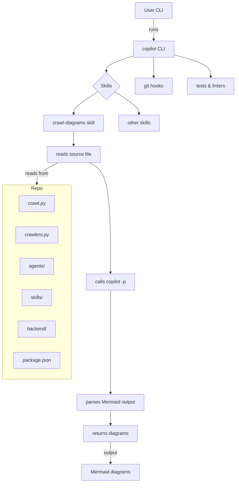

# Diagram: common/support_service/config/config.qa.yml

> Auto-generated by Obscura crawlers

## Mermaid

### SVG

<svg id="container" width="799.515625" xmlns="http://www.w3.org/2000/svg" class="flowchart" height="1602.28125" viewBox="0 0 799.515625 1602.28125" role="graphics-document document" aria-roledescription="flowchart-v2"><g><marker id="container_flowchart-v2-pointEnd" class="marker flowchart-v2" viewBox="0 0 10 10" refX="5" refY="5" markerUnits="userSpaceOnUse" markerWidth="8" markerHeight="8" orient="auto"><path d="M 0 0 L 10 5 L 0 10 z" class="arrowMarkerPath" style="stroke-width: 1; stroke-dasharray: 1, 0;"></path></marker><marker id="container_flowchart-v2-pointStart" class="marker flowchart-v2" viewBox="0 0 10 10" refX="4.5" refY="5" markerUnits="userSpaceOnUse" markerWidth="8" markerHeight="8" orient="auto"><path d="M 0 5 L 10 10 L 10 0 z" class="arrowMarkerPath" style="stroke-width: 1; stroke-dasharray: 1, 0;"></path></marker><marker id="container_flowchart-v2-circleEnd" class="marker flowchart-v2" viewBox="0 0 10 10" refX="11" refY="5" markerUnits="userSpaceOnUse" markerWidth="11" markerHeight="11" orient="auto"><circle cx="5" cy="5" r="5" class="arrowMarkerPath" style="stroke-width: 1; stroke-dasharray: 1, 0;"></circle></marker><marker id="container_flowchart-v2-circleStart" class="marker flowchart-v2" viewBox="0 0 10 10" refX="-1" refY="5" markerUnits="userSpaceOnUse" markerWidth="11" markerHeight="11" orient="auto"><circle cx="5" cy="5" r="5" class="arrowMarkerPath" style="stroke-width: 1; stroke-dasharray: 1, 0;"></circle></marker><marker id="container_flowchart-v2-crossEnd" class="marker cross flowchart-v2" viewBox="0 0 11 11" refX="12" refY="5.2" markerUnits="userSpaceOnUse" markerWidth="11" markerHeight="11" orient="auto"><path d="M 1,1 l 9,9 M 10,1 l -9,9" class="arrowMarkerPath" style="stroke-width: 2; stroke-dasharray: 1, 0;"></path></marker><marker id="container_flowchart-v2-crossStart" class="marker cross flowchart-v2" viewBox="0 0 11 11" refX="-1" refY="5.2" markerUnits="userSpaceOnUse" markerWidth="11" markerHeight="11" orient="auto"><path d="M 1,1 l 9,9 M 10,1 l -9,9" class="arrowMarkerPath" style="stroke-width: 2; stroke-dasharray: 1, 0;"></path></marker><g class="root"><g class="clusters"></g><g class="edgePaths"><path d="M516.891,62L516.891,68.167C516.891,74.333,516.891,86.667,516.891,98.333C516.891,110,516.891,121,516.891,126.5L516.891,132" id="L_A_B_0" class="edge-thickness-normal edge-pattern-solid edge-thickness-normal edge-pattern-solid flowchart-link" style=";" data-edge="true" data-et="edge" data-id="L_A_B_0" data-points="W3sieCI6NTE2Ljg5MDYyNSwieSI6NjJ9LHsieCI6NTE2Ljg5MDYyNSwieSI6OTl9LHsieCI6NTE2Ljg5MDYyNSwieSI6MTM2fV0=" marker-end="url(#container_flowchart-v2-pointEnd)"></path><path d="M448.734,185.235L433.529,190.196C418.323,195.157,387.911,205.078,372.706,213.539C357.5,222,357.5,229,357.5,232.5L357.5,236" id="L_B_C_0" class="edge-thickness-normal edge-pattern-solid edge-thickness-normal edge-pattern-solid flowchart-link" style=";" data-edge="true" data-et="edge" data-id="L_B_C_0" data-points="W3sieCI6NDQ4LjczNDM3NSwieSI6MTg1LjIzNTQ2NzExMTA2NzU1fSx7IngiOjM1Ny41LCJ5IjoyMTV9LHsieCI6MzU3LjUsInkiOjI0MH1d" marker-end="url(#container_flowchart-v2-pointEnd)"></path><path d="M329.351,304.132L315.491,312.99C301.631,321.848,273.911,339.565,260.051,351.923C246.191,364.281,246.191,371.281,246.191,374.781L246.191,378.281" id="L_C_D_0" class="edge-thickness-normal edge-pattern-solid edge-thickness-normal edge-pattern-solid flowchart-link" style=";" data-edge="true" data-et="edge" data-id="L_C_D_0" data-points="W3sieCI6MzI5LjM1MDUzMzk4MDQ1MjYsInkiOjMwNC4xMzE3ODM5ODA0NTI2fSx7IngiOjI0Ni4xOTE0MDYyNSwieSI6MzU3LjI4MTI1fSx7IngiOjI0Ni4xOTE0MDYyNSwieSI6MzgyLjI4MTI1fV0=" marker-end="url(#container_flowchart-v2-pointEnd)"></path><path d="M385.649,304.132L399.509,312.99C413.369,321.848,441.089,339.565,454.949,351.923C468.809,364.281,468.809,371.281,468.809,374.781L468.809,378.281" id="L_C_E_0" class="edge-thickness-normal edge-pattern-solid edge-thickness-normal edge-pattern-solid flowchart-link" style=";" data-edge="true" data-et="edge" data-id="L_C_E_0" data-points="W3sieCI6Mzg1LjY0OTQ2NjAxOTU0NzQsInkiOjMwNC4xMzE3ODM5ODA0NTI2fSx7IngiOjQ2OC44MDg1OTM3NSwieSI6MzU3LjI4MTI1fSx7IngiOjQ2OC44MDg1OTM3NSwieSI6MzgyLjI4MTI1fV0=" marker-end="url(#container_flowchart-v2-pointEnd)"></path><path d="M246.191,436.281L246.191,440.448C246.191,444.615,246.191,452.948,246.191,460.615C246.191,468.281,246.191,475.281,246.191,478.781L246.191,482.281" id="L_D_F_0" class="edge-thickness-normal edge-pattern-solid edge-thickness-normal edge-pattern-solid flowchart-link" style=";" data-edge="true" data-et="edge" data-id="L_D_F_0" data-points="W3sieCI6MjQ2LjE5MTQwNjI1LCJ5Ijo0MzYuMjgxMjV9LHsieCI6MjQ2LjE5MTQwNjI1LCJ5Ijo0NjEuMjgxMjV9LHsieCI6MjQ2LjE5MTQwNjI1LCJ5Ijo0ODYuMjgxMjV9XQ==" marker-end="url(#container_flowchart-v2-pointEnd)"></path><path d="M298.512,540.281L310.462,546.448C322.412,552.615,346.311,564.948,358.261,625.781C370.211,686.615,370.211,795.948,370.211,850.615L370.211,905.281" id="L_F_G_0" class="edge-thickness-normal edge-pattern-solid edge-thickness-normal edge-pattern-solid flowchart-link" style=";" data-edge="true" data-et="edge" data-id="L_F_G_0" data-points="W3sieCI6Mjk4LjUxMjE0NTk5NjA5Mzc1LCJ5Ijo1NDAuMjgxMjV9LHsieCI6MzcwLjIxMDkzNzUsInkiOjU3Ny4yODEyNX0seyJ4IjozNzAuMjEwOTM3NSwieSI6OTA5LjI4MTI1fV0=" marker-end="url(#container_flowchart-v2-pointEnd)"></path><path d="M370.211,963.281L370.211,1016.615C370.211,1069.948,370.211,1176.615,370.211,1233.448C370.211,1290.281,370.211,1297.281,370.211,1300.781L370.211,1304.281" id="L_G_H_0" class="edge-thickness-normal edge-pattern-solid edge-thickness-normal edge-pattern-solid flowchart-link" style=";" data-edge="true" data-et="edge" data-id="L_G_H_0" data-points="W3sieCI6MzcwLjIxMDkzNzUsInkiOjk2My4yODEyNX0seyJ4IjozNzAuMjEwOTM3NSwieSI6MTI4My4yODEyNX0seyJ4IjozNzAuMjEwOTM3NSwieSI6MTMwOC4yODEyNX1d" marker-end="url(#container_flowchart-v2-pointEnd)"></path><path d="M370.211,1362.281L370.211,1366.448C370.211,1370.615,370.211,1378.948,370.211,1386.615C370.211,1394.281,370.211,1401.281,370.211,1404.781L370.211,1408.281" id="L_H_I_0" class="edge-thickness-normal edge-pattern-solid edge-thickness-normal edge-pattern-solid flowchart-link" style=";" data-edge="true" data-et="edge" data-id="L_H_I_0" data-points="W3sieCI6MzcwLjIxMDkzNzUsInkiOjEzNjIuMjgxMjV9LHsieCI6MzcwLjIxMDkzNzUsInkiOjEzODcuMjgxMjV9LHsieCI6MzcwLjIxMDkzNzUsInkiOjE0MTIuMjgxMjV9XQ==" marker-end="url(#container_flowchart-v2-pointEnd)"></path><path d="M516.891,190L516.891,194.167C516.891,198.333,516.891,206.667,516.891,217.523C516.891,228.38,516.891,241.76,516.891,248.451L516.891,255.141" id="L_B_J_0" class="edge-thickness-normal edge-pattern-solid edge-thickness-normal edge-pattern-solid flowchart-link" style=";" data-edge="true" data-et="edge" data-id="L_B_J_0" data-points="W3sieCI6NTE2Ljg5MDYyNSwieSI6MTkwfSx7IngiOjUxNi44OTA2MjUsInkiOjIxNX0seyJ4Ijo1MTYuODkwNjI1LCJ5IjoyNTkuMTQwNjI1fV0=" marker-end="url(#container_flowchart-v2-pointEnd)"></path><path d="M585.047,181.275L606.01,186.895C626.974,192.516,668.901,203.758,689.865,216.069C710.828,228.38,710.828,241.76,710.828,248.451L710.828,255.141" id="L_B_K_0" class="edge-thickness-normal edge-pattern-solid edge-thickness-normal edge-pattern-solid flowchart-link" style=";" data-edge="true" data-et="edge" data-id="L_B_K_0" data-points="W3sieCI6NTg1LjA0Njg3NSwieSI6MTgxLjI3NDU3Mjk5Mzg3Njl9LHsieCI6NzEwLjgyODEyNSwieSI6MjE1fSx7IngiOjcxMC44MjgxMjUsInkiOjI1OS4xNDA2MjV9XQ==" marker-end="url(#container_flowchart-v2-pointEnd)"></path><path d="M370.211,1466.281L370.211,1472.448C370.211,1478.615,370.211,1490.948,370.211,1502.615C370.211,1514.281,370.211,1525.281,370.211,1530.781L370.211,1536.281" id="L_I_R_0" class="edge-thickness-normal edge-pattern-solid edge-thickness-normal edge-pattern-solid flowchart-link" style=";" data-edge="true" data-et="edge" data-id="L_I_R_0" data-points="W3sieCI6MzcwLjIxMDkzNzUsInkiOjE0NjYuMjgxMjV9LHsieCI6MzcwLjIxMDkzNzUsInkiOjE1MDMuMjgxMjV9LHsieCI6MzcwLjIxMDkzNzUsInkiOjE1NDAuMjgxMjV9XQ==" marker-end="url(#container_flowchart-v2-pointEnd)"></path><path d="M193.871,540.281L181.921,546.448C169.971,552.615,146.071,564.948,134.122,576.615C122.172,588.281,122.172,599.281,122.172,604.781L122.172,610.281" id="L_F_Repo_0" class="edge-thickness-normal edge-pattern-solid edge-thickness-normal edge-pattern-solid flowchart-link" style=";" data-edge="true" data-et="edge" data-id="L_F_Repo_0" data-points="W3sieCI6MTkzLjg3MDY2NjUwMzkwNjI1LCJ5Ijo1NDAuMjgxMjV9LHsieCI6MTIyLjE3MTg3NSwieSI6NTc3LjI4MTI1fSx7IngiOjEyMi4xNzE4NzUsInkiOjYxNC4yODEyNX1d" marker-end="url(#container_flowchart-v2-pointEnd)"></path></g><g class="edgeLabels"><g class="edgeLabel" transform="translate(516.890625, 99)"><g class="label" data-id="L_A_B_0" transform="translate(-16.171875, -12)"><foreignObject width="32.34375" height="24">

runs

</foreignObject></g></g><g class="edgeLabel"><g class="label" data-id="L_B_C_0" transform="translate(0, 0)"><foreignObject width="0" height="0">

</foreignObject></g></g><g class="edgeLabel"><g class="label" data-id="L_C_D_0" transform="translate(0, 0)"><foreignObject width="0" height="0">

</foreignObject></g></g><g class="edgeLabel"><g class="label" data-id="L_C_E_0" transform="translate(0, 0)"><foreignObject width="0" height="0">

</foreignObject></g></g><g class="edgeLabel"><g class="label" data-id="L_D_F_0" transform="translate(0, 0)"><foreignObject width="0" height="0">

</foreignObject></g></g><g class="edgeLabel"><g class="label" data-id="L_F_G_0" transform="translate(0, 0)"><foreignObject width="0" height="0">

</foreignObject></g></g><g class="edgeLabel"><g class="label" data-id="L_G_H_0" transform="translate(0, 0)"><foreignObject width="0" height="0">

</foreignObject></g></g><g class="edgeLabel"><g class="label" data-id="L_H_I_0" transform="translate(0, 0)"><foreignObject width="0" height="0">

</foreignObject></g></g><g class="edgeLabel"><g class="label" data-id="L_B_J_0" transform="translate(0, 0)"><foreignObject width="0" height="0">

</foreignObject></g></g><g class="edgeLabel"><g class="label" data-id="L_B_K_0" transform="translate(0, 0)"><foreignObject width="0" height="0">

</foreignObject></g></g><g class="edgeLabel" transform="translate(370.2109375, 1503.28125)"><g class="label" data-id="L_I_R_0" transform="translate(-24.515625, -12)"><foreignObject width="49.03125" height="24">

output

</foreignObject></g></g><g class="edgeLabel" transform="translate(122.171875, 577.28125)"><g class="label" data-id="L_F_Repo_0" transform="translate(-39.1796875, -12)"><foreignObject width="78.359375" height="24">

reads from

</foreignObject></g></g></g><g class="nodes"><g class="root" transform="translate(0, 606.28125)"><g class="clusters"><g class="cluster" id="Repo" data-look="classic"><rect style="" x="8" y="8" width="228.34375" height="644"></rect><g class="cluster-label" transform="translate(103.6640625, 8)"><foreignObject width="37.015625" height="24">

Repo

</foreignObject></g></g></g><g class="edgePaths"></g><g class="edgeLabels"></g><g class="nodes"><g class="node default" id="flowchart-L-20" transform="translate(122.171875, 70)"><rect class="basic label-container" style="" x="-59.6328125" y="-27" width="119.265625" height="54"></rect><g class="label" style="" transform="translate(-29.6328125, -12)"><rect></rect><foreignObject width="59.265625" height="24">

crawl.py

</foreignObject></g></g><g class="node default" id="flowchart-M-21" transform="translate(122.171875, 174)"><rect class="basic label-container" style="" x="-70.625" y="-27" width="141.25" height="54"></rect><g class="label" style="" transform="translate(-40.625, -12)"><rect></rect><foreignObject width="81.25" height="24">

crawlers.py

</foreignObject></g></g><g class="node default" id="flowchart-N-22" transform="translate(122.171875, 278)"><rect class="basic label-container" style="" x="-58.140625" y="-27" width="116.28125" height="54"></rect><g class="label" style="" transform="translate(-28.140625, -12)"><rect></rect><foreignObject width="56.28125" height="24">

agents/

</foreignObject></g></g><g class="node default" id="flowchart-O-23" transform="translate(122.171875, 382)"><rect class="basic label-container" style="" x="-52.6796875" y="-27" width="105.359375" height="54"></rect><g class="label" style="" transform="translate(-22.6796875, -12)"><rect></rect><foreignObject width="45.359375" height="24">

skills/

</foreignObject></g></g><g class="node default" id="flowchart-P-24" transform="translate(122.171875, 486)"><rect class="basic label-container" style="" x="-64.8671875" y="-27" width="129.734375" height="54"></rect><g class="label" style="" transform="translate(-34.8671875, -12)"><rect></rect><foreignObject width="69.734375" height="24">

backend/

</foreignObject></g></g><g class="node default" id="flowchart-Q-25" transform="translate(122.171875, 590)"><rect class="basic label-container" style="" x="-76.671875" y="-27" width="153.34375" height="54"></rect><g class="label" style="" transform="translate(-46.671875, -12)"><rect></rect><foreignObject width="93.34375" height="24">

package.json

</foreignObject></g></g></g></g><g class="node default" id="flowchart-A-0" transform="translate(516.890625, 35)"><rect class="basic label-container" style="" x="-59.390625" y="-27" width="118.78125" height="54"></rect><g class="label" style="" transform="translate(-29.390625, -12)"><rect></rect><foreignObject width="58.78125" height="24">

User CLI

</foreignObject></g></g><g class="node default" id="flowchart-B-1" transform="translate(516.890625, 163)"><rect class="basic label-container" style="" x="-68.15625" y="-27" width="136.3125" height="54"></rect><g class="label" style="" transform="translate(-38.15625, -12)"><rect></rect><foreignObject width="76.3125" height="24">

copilot CLI

</foreignObject></g></g><g class="node default" id="flowchart-C-3" transform="translate(357.5, 286.140625)"><polygon points="46.140625,0 92.28125,-46.140625 46.140625,-92.28125 0,-46.140625" class="label-container" transform="translate(-45.640625, 46.140625)"></polygon><g class="label" style="" transform="translate(-19.140625, -12)"><rect></rect><foreignObject width="38.28125" height="24">

Skills

</foreignObject></g></g><g class="node default" id="flowchart-D-5" transform="translate(246.19140625, 409.28125)"><rect class="basic label-container" style="" x="-102.2890625" y="-27" width="204.578125" height="54"></rect><g class="label" style="" transform="translate(-72.2890625, -12)"><rect></rect><foreignObject width="144.578125" height="24">

crawl-diagrams skill

</foreignObject></g></g><g class="node default" id="flowchart-E-7" transform="translate(468.80859375, 409.28125)"><rect class="basic label-container" style="" x="-70.328125" y="-27" width="140.65625" height="54"></rect><g class="label" style="" transform="translate(-40.328125, -12)"><rect></rect><foreignObject width="80.65625" height="24">

other skills

</foreignObject></g></g><g class="node default" id="flowchart-F-9" transform="translate(246.19140625, 513.28125)"><rect class="basic label-container" style="" x="-89.4453125" y="-27" width="178.890625" height="54"></rect><g class="label" style="" transform="translate(-59.4453125, -12)"><rect></rect><foreignObject width="118.890625" height="24">

reads source file

</foreignObject></g></g><g class="node default" id="flowchart-G-11" transform="translate(370.2109375, 936.28125)"><rect class="basic label-container" style="" x="-83.8671875" y="-27" width="167.734375" height="54"></rect><g class="label" style="" transform="translate(-53.8671875, -12)"><rect></rect><foreignObject width="107.734375" height="24">

calls copilot -p

</foreignObject></g></g><g class="node default" id="flowchart-H-13" transform="translate(370.2109375, 1335.28125)"><rect class="basic label-container" style="" x="-114.5" y="-27" width="229" height="54"></rect><g class="label" style="" transform="translate(-84.5, -12)"><rect></rect><foreignObject width="169" height="24">

parses Mermaid output

</foreignObject></g></g><g class="node default" id="flowchart-I-15" transform="translate(370.2109375, 1439.28125)"><rect class="basic label-container" style="" x="-91.609375" y="-27" width="183.21875" height="54"></rect><g class="label" style="" transform="translate(-61.609375, -12)"><rect></rect><foreignObject width="123.21875" height="24">

returns diagrams

</foreignObject></g></g><g class="node default" id="flowchart-J-17" transform="translate(516.890625, 286.140625)"><rect class="basic label-container" style="" x="-63.25" y="-27" width="126.5" height="54"></rect><g class="label" style="" transform="translate(-33.25, -12)"><rect></rect><foreignObject width="66.5" height="24">

git hooks

</foreignObject></g></g><g class="node default" id="flowchart-K-19" transform="translate(710.828125, 286.140625)"><rect class="basic label-container" style="" x="-80.6875" y="-27" width="161.375" height="54"></rect><g class="label" style="" transform="translate(-50.6875, -12)"><rect></rect><foreignObject width="101.375" height="24">

tests &amp; linters

</foreignObject></g></g><g class="node default" id="flowchart-R-29" transform="translate(370.2109375, 1567.28125)"><rect class="basic label-container" style="" x="-97.265625" y="-27" width="194.53125" height="54"></rect><g class="label" style="" transform="translate(-67.265625, -12)"><rect></rect><foreignObject width="134.53125" height="24">

Mermaid diagrams

</foreignObject></g></g></g></g></g></svg>
