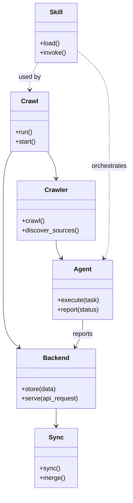

# Diagram: common/support_service/config/config.qa2.yml


> Auto-generated by Obscura crawlers

## Diagram 1



### SVG

<svg id="container" width="324.3910217285156" xmlns="http://www.w3.org/2000/svg" class="classDiagram" height="1238" viewBox="-17.68400001525879 0 324.3910217285156 1238" role="graphics-document document" aria-roledescription="class"><style>#container{font-family:"trebuchet ms",verdana,arial,sans-serif;font-size:16px;fill:#333;}@keyframes edge-animation-frame{from{stroke-dashoffset:0;}}@keyframes dash{to{stroke-dashoffset:0;}}#container .edge-animation-slow{stroke-dasharray:9,5!important;stroke-dashoffset:900;animation:dash 50s linear infinite;stroke-linecap:round;}#container .edge-animation-fast{stroke-dasharray:9,5!important;stroke-dashoffset:900;animation:dash 20s linear infinite;stroke-linecap:round;}#container .error-icon{fill:#552222;}#container .error-text{fill:#552222;stroke:#552222;}#container .edge-thickness-normal{stroke-width:1px;}#container .edge-thickness-thick{stroke-width:3.5px;}#container .edge-pattern-solid{stroke-dasharray:0;}#container .edge-thickness-invisible{stroke-width:0;fill:none;}#container .edge-pattern-dashed{stroke-dasharray:3;}#container .edge-pattern-dotted{stroke-dasharray:2;}#container .marker{fill:#333333;stroke:#333333;}#container .marker.cross{stroke:#333333;}#container svg{font-family:"trebuchet ms",verdana,arial,sans-serif;font-size:16px;}#container p{margin:0;}#container g.classGroup text{fill:#9370DB;stroke:none;font-family:"trebuchet ms",verdana,arial,sans-serif;font-size:10px;}#container g.classGroup text .title{font-weight:bolder;}#container .nodeLabel,#container .edgeLabel{color:#131300;}#container .edgeLabel .label rect{fill:#ECECFF;}#container .label text{fill:#131300;}#container .labelBkg{background:#ECECFF;}#container .edgeLabel .label span{background:#ECECFF;}#container .classTitle{font-weight:bolder;}#container .node rect,#container .node circle,#container .node ellipse,#container .node polygon,#container .node path{fill:#ECECFF;stroke:#9370DB;stroke-width:1px;}#container .divider{stroke:#9370DB;stroke-width:1;}#container g.clickable{cursor:pointer;}#container g.classGroup rect{fill:#ECECFF;stroke:#9370DB;}#container g.classGroup line{stroke:#9370DB;stroke-width:1;}#container .classLabel .box{stroke:none;stroke-width:0;fill:#ECECFF;opacity:0.5;}#container .classLabel .label{fill:#9370DB;font-size:10px;}#container .relation{stroke:#333333;stroke-width:1;fill:none;}#container .dashed-line{stroke-dasharray:3;}#container .dotted-line{stroke-dasharray:1 2;}#container #compositionStart,#container .composition{fill:#333333!important;stroke:#333333!important;stroke-width:1;}#container #compositionEnd,#container .composition{fill:#333333!important;stroke:#333333!important;stroke-width:1;}#container #dependencyStart,#container .dependency{fill:#333333!important;stroke:#333333!important;stroke-width:1;}#container #dependencyStart,#container .dependency{fill:#333333!important;stroke:#333333!important;stroke-width:1;}#container #extensionStart,#container .extension{fill:transparent!important;stroke:#333333!important;stroke-width:1;}#container #extensionEnd,#container .extension{fill:transparent!important;stroke:#333333!important;stroke-width:1;}#container #aggregationStart,#container .aggregation{fill:transparent!important;stroke:#333333!important;stroke-width:1;}#container #aggregationEnd,#container .aggregation{fill:transparent!important;stroke:#333333!important;stroke-width:1;}#container #lollipopStart,#container .lollipop{fill:#ECECFF!important;stroke:#333333!important;stroke-width:1;}#container #lollipopEnd,#container .lollipop{fill:#ECECFF!important;stroke:#333333!important;stroke-width:1;}#container .edgeTerminals{font-size:11px;line-height:initial;}#container .classTitleText{text-anchor:middle;font-size:18px;fill:#333;}#container .label-icon{display:inline-block;height:1em;overflow:visible;vertical-align:-0.125em;}#container .node .label-icon path{fill:currentColor;stroke:revert;stroke-width:revert;}#container :root{--mermaid-font-family:"trebuchet ms",verdana,arial,sans-serif;}</style><g><defs><marker id="container_class-aggregationStart" class="marker aggregation class" refX="18" refY="7" markerWidth="190" markerHeight="240" orient="auto"><path d="M 18,7 L9,13 L1,7 L9,1 Z"></path></marker></defs><defs><marker id="container_class-aggregationEnd" class="marker aggregation class" refX="1" refY="7" markerWidth="20" markerHeight="28" orient="auto"><path d="M 18,7 L9,13 L1,7 L9,1 Z"></path></marker></defs><defs><marker id="container_class-extensionStart" class="marker extension class" refX="18" refY="7" markerWidth="190" markerHeight="240" orient="auto"><path d="M 1,7 L18,13 V 1 Z"></path></marker></defs><defs><marker id="container_class-extensionEnd" class="marker extension class" refX="1" refY="7" markerWidth="20" markerHeight="28" orient="auto"><path d="M 1,1 V 13 L18,7 Z"></path></marker></defs><defs><marker id="container_class-compositionStart" class="marker composition class" refX="18" refY="7" markerWidth="190" markerHeight="240" orient="auto"><path d="M 18,7 L9,13 L1,7 L9,1 Z"></path></marker></defs><defs><marker id="container_class-compositionEnd" class="marker composition class" refX="1" refY="7" markerWidth="20" markerHeight="28" orient="auto"><path d="M 18,7 L9,13 L1,7 L9,1 Z"></path></marker></defs><defs><marker id="container_class-dependencyStart" class="marker dependency class" refX="6" refY="7" markerWidth="190" markerHeight="240" orient="auto"><path d="M 5,7 L9,13 L1,7 L9,1 Z"></path></marker></defs><defs><marker id="container_class-dependencyEnd" class="marker dependency class" refX="13" refY="7" markerWidth="20" markerHeight="28" orient="auto"><path d="M 18,7 L9,13 L14,7 L9,1 Z"></path></marker></defs><defs><marker id="container_class-lollipopStart" class="marker lollipop class" refX="13" refY="7" markerWidth="190" markerHeight="240" orient="auto"><circle stroke="black" fill="transparent" cx="7" cy="7" r="6"></circle></marker></defs><defs><marker id="container_class-lollipopEnd" class="marker lollipop class" refX="1" refY="7" markerWidth="190" markerHeight="240" orient="auto"><circle stroke="black" fill="transparent" cx="7" cy="7" r="6"></circle></marker></defs><g class="root"><g class="clusters"></g><g class="edgePaths"><path d="M100.239,382L103.864,388.167C107.489,394.333,114.738,406.667,118.363,418C121.988,429.333,121.988,439.667,121.988,444.833L121.988,450" id="id_Crawl_Crawler_1" class="edge-thickness-normal edge-pattern-solid relation" style=";;;" data-edge="true" data-et="edge" data-id="id_Crawl_Crawler_1" data-points="W3sieCI6MTAwLjIzODkwOTA0MDE3ODU3LCJ5IjozODJ9LHsieCI6MTIxLjk4ODI4MTI1LCJ5Ijo0MTl9LHsieCI6MTIxLjk4ODI4MTI1LCJ5Ijo0NTZ9XQ==" marker-end="url(#container_class-dependencyEnd)"></path><path d="M12.066,382L8.441,388.167C4.816,394.333,-2.434,406.667,-6.059,431.5C-9.684,456.333,-9.684,493.667,-9.684,529C-9.684,564.333,-9.684,597.667,-9.684,631C-9.684,664.333,-9.684,697.667,-9.684,733C-9.684,768.333,-9.684,805.667,-3.196,829.852C3.293,854.038,16.269,865.075,22.757,870.594L29.245,876.113" id="id_Crawl_Backend_2" class="edge-thickness-normal edge-pattern-solid relation" style=";;;" data-edge="true" data-et="edge" data-id="id_Crawl_Backend_2" data-points="W3sieCI6MTIuMDY1Nzc4NDU5ODIxNDMsInkiOjM4Mn0seyJ4IjotOS42ODM1OTM3NSwieSI6NDE5fSx7IngiOi05LjY4MzU5Mzc1LCJ5Ijo1MzF9LHsieCI6LTkuNjgzNTkzNzUsInkiOjYzMX0seyJ4IjotOS42ODM1OTM3NSwieSI6NzMxfSx7IngiOi05LjY4MzU5Mzc1LCJ5Ijo4NDN9LHsieCI6MzMuODE1MTUwNjY5NjQyODYsInkiOjg4MH1d" marker-end="url(#container_class-dependencyEnd)"></path><path d="M121.988,606L121.988,610.167C121.988,614.333,121.988,622.667,124.182,630.165C126.375,637.663,130.761,644.326,132.955,647.657L135.148,650.989" id="id_Crawler_Agent_3" class="edge-thickness-normal edge-pattern-solid relation" style=";;;" data-edge="true" data-et="edge" data-id="id_Crawler_Agent_3" data-points="W3sieCI6MTIxLjk4ODI4MTI1LCJ5Ijo2MDZ9LHsieCI6MTIxLjk4ODI4MTI1LCJ5Ijo2MzF9LHsieCI6MTM4LjQ0NzI2NTYyNSwieSI6NjU2fV0=" marker-end="url(#container_class-dependencyEnd)"></path><path d="M187.824,806L187.824,812.167C187.824,818.333,187.824,830.667,184.706,842.138C181.588,853.609,175.352,864.218,172.234,869.523L169.115,874.827" id="id_Agent_Backend_4" class="edge-thickness-normal edge-pattern-solid relation" style=";;;" data-edge="true" data-et="edge" data-id="id_Agent_Backend_4" data-points="W3sieCI6MTg3LjgyNDIxODc1LCJ5Ijo4MDZ9LHsieCI6MTg3LjgyNDIxODc1LCJ5Ijo4NDN9LHsieCI6MTY2LjA3NDg0NjU0MDE3ODU2LCJ5Ijo4ODB9XQ==" marker-end="url(#container_class-dependencyEnd)"></path><path d="M121.988,1030L121.988,1034.167C121.988,1038.333,121.988,1046.667,121.988,1054C121.988,1061.333,121.988,1067.667,121.988,1070.833L121.988,1074" id="id_Backend_Sync_5" class="edge-thickness-normal edge-pattern-solid relation" style=";;;" data-edge="true" data-et="edge" data-id="id_Backend_Sync_5" data-points="W3sieCI6MTIxLjk4ODI4MTI1LCJ5IjoxMDMwfSx7IngiOjEyMS45ODgyODEyNSwieSI6MTA1NX0seyJ4IjoxMjEuOTg4MjgxMjUsInkiOjEwODB9XQ==" marker-end="url(#container_class-dependencyEnd)"></path><path d="M77.902,158L74.277,164.167C70.652,170.333,63.402,182.667,59.777,194C56.152,205.333,56.152,215.667,56.152,220.833L56.152,226" id="id_Skill_Crawl_6" class="edge-thickness-normal edge-pattern-dashed relation" style=";;;" data-edge="true" data-et="edge" data-id="id_Skill_Crawl_6" data-points="W3sieCI6NzcuOTAxNzE1OTU5ODIxNDMsInkiOjE1OH0seyJ4Ijo1Ni4xNTIzNDM3NSwieSI6MTk1fSx7IngiOjU2LjE1MjM0Mzc1LCJ5IjoyMzJ9XQ==" marker-end="url(#container_class-dependencyEnd)"></path><path d="M175.023,128.112L188.13,139.26C201.236,150.408,227.448,172.704,240.554,202.519C253.66,232.333,253.66,269.667,253.66,307C253.66,344.333,253.66,381.667,253.66,419C253.66,456.333,253.66,493.667,253.66,529C253.66,564.333,253.66,597.667,251.467,617.665C249.274,637.663,244.887,644.326,242.694,647.657L240.5,650.989" id="id_Skill_Agent_7" class="edge-thickness-normal edge-pattern-dashed relation" style=";;;" data-edge="true" data-et="edge" data-id="id_Skill_Agent_7" data-points="W3sieCI6MTc1LjAyMzQzNzUsInkiOjEyOC4xMTE2NjQ4ODY2NzM4fSx7IngiOjI1My42NjAxNTYyNSwieSI6MTk1fSx7IngiOjI1My42NjAxNTYyNSwieSI6MzA3fSx7IngiOjI1My42NjAxNTYyNSwieSI6NDE5fSx7IngiOjI1My42NjAxNTYyNSwieSI6NTMxfSx7IngiOjI1My42NjAxNTYyNSwieSI6NjMxfSx7IngiOjIzNy4yMDExNzE4NzUsInkiOjY1Nn1d" marker-end="url(#container_class-dependencyEnd)"></path></g><g class="edgeLabels"><g class="edgeLabel"><g class="label" data-id="id_Crawl_Crawler_1" transform="translate(0, 0)"><foreignObject width="0" height="0"><div xmlns="http://www.w3.org/1999/xhtml" class="labelBkg" style="display: table-cell; white-space: nowrap; line-height: 1.5; max-width: 200px; text-align: center;"><span class="edgeLabel"></span></div></foreignObject></g></g><g class="edgeLabel"><g class="label" data-id="id_Crawl_Backend_2" transform="translate(0, 0)"><foreignObject width="0" height="0"><div xmlns="http://www.w3.org/1999/xhtml" class="labelBkg" style="display: table-cell; white-space: nowrap; line-height: 1.5; max-width: 200px; text-align: center;"><span class="edgeLabel"></span></div></foreignObject></g></g><g class="edgeLabel"><g class="label" data-id="id_Crawler_Agent_3" transform="translate(0, 0)"><foreignObject width="0" height="0"><div xmlns="http://www.w3.org/1999/xhtml" class="labelBkg" style="display: table-cell; white-space: nowrap; line-height: 1.5; max-width: 200px; text-align: center;"><span class="edgeLabel"></span></div></foreignObject></g></g><g class="edgeLabel" transform="translate(187.82421875, 843)"><g class="label" data-id="id_Agent_Backend_4" transform="translate(-26.3515625, -12)"><foreignObject width="52.703125" height="24"><div xmlns="http://www.w3.org/1999/xhtml" class="labelBkg" style="display: table-cell; white-space: nowrap; line-height: 1.5; max-width: 200px; text-align: center;"><span class="edgeLabel"><p>reports</p></span></div></foreignObject></g></g><g class="edgeLabel"><g class="label" data-id="id_Backend_Sync_5" transform="translate(0, 0)"><foreignObject width="0" height="0"><div xmlns="http://www.w3.org/1999/xhtml" class="labelBkg" style="display: table-cell; white-space: nowrap; line-height: 1.5; max-width: 200px; text-align: center;"><span class="edgeLabel"></span></div></foreignObject></g></g><g class="edgeLabel" transform="translate(56.15234375, 195)"><g class="label" data-id="id_Skill_Crawl_6" transform="translate(-28.3125, -12)"><foreignObject width="56.625" height="24"><div xmlns="http://www.w3.org/1999/xhtml" class="labelBkg" style="display: table-cell; white-space: nowrap; line-height: 1.5; max-width: 200px; text-align: center;"><span class="edgeLabel"><p>used by</p></span></div></foreignObject></g></g><g class="edgeLabel" transform="translate(253.66015625, 419)"><g class="label" data-id="id_Skill_Agent_7" transform="translate(-45.046875, -12)"><foreignObject width="90.09375" height="24"><div xmlns="http://www.w3.org/1999/xhtml" class="labelBkg" style="display: table-cell; white-space: nowrap; line-height: 1.5; max-width: 200px; text-align: center;"><span class="edgeLabel"><p>orchestrates</p></span></div></foreignObject></g></g></g><g class="nodes"><g class="node default" id="classId-Crawl-0" transform="translate(56.15234375, 307)"><g class="basic label-container"><path d="M-48.15234375 -75 L48.15234375 -75 L48.15234375 75 L-48.15234375 75" stroke="none" stroke-width="0" fill="#ECECFF" style=""></path><path d="M-48.15234375 -75 C-23.867681002510228 -75, 0.41698174497954454 -75, 48.15234375 -75 M-48.15234375 -75 C-13.744408958464945 -75, 20.66352583307011 -75, 48.15234375 -75 M48.15234375 -75 C48.15234375 -20.506720123891398, 48.15234375 33.986559752217204, 48.15234375 75 M48.15234375 -75 C48.15234375 -15.580214098984634, 48.15234375 43.83957180203073, 48.15234375 75 M48.15234375 75 C28.368424633369447 75, 8.584505516738894 75, -48.15234375 75 M48.15234375 75 C17.035120892274982 75, -14.082101965450036 75, -48.15234375 75 M-48.15234375 75 C-48.15234375 15.626862381615261, -48.15234375 -43.74627523676948, -48.15234375 -75 M-48.15234375 75 C-48.15234375 32.53541423400696, -48.15234375 -9.929171531986086, -48.15234375 -75" stroke="#9370DB" stroke-width="1.3" fill="none" stroke-dasharray="0 0" style=""></path></g><g class="annotation-group text" transform="translate(0, -51)"></g><g class="label-group text" transform="translate(-20.1484375, -51)"><g class="label" style="font-weight: bolder" transform="translate(0,-12)"><foreignObject width="40.296875" height="24"><div xmlns="http://www.w3.org/1999/xhtml" style="display: table-cell; white-space: nowrap; line-height: 1.5; max-width: 89px; text-align: center;"><span class="nodeLabel markdown-node-label" style=""><p>Crawl</p></span></div></foreignObject></g></g><g class="members-group text" transform="translate(-36.15234375, -3)"></g><g class="methods-group text" transform="translate(-36.15234375, 27)"><g class="label" style="" transform="translate(0,-12)"><foreignObject width="43.21875" height="24"><div xmlns="http://www.w3.org/1999/xhtml" style="display: table-cell; white-space: nowrap; line-height: 1.5; max-width: 101px; text-align: center;"><span class="nodeLabel markdown-node-label" style=""><p>+run()</p></span></div></foreignObject></g><g class="label" style="" transform="translate(0,12)"><foreignObject width="52.15625" height="24"><div xmlns="http://www.w3.org/1999/xhtml" style="display: table-cell; white-space: nowrap; line-height: 1.5; max-width: 110px; text-align: center;"><span class="nodeLabel markdown-node-label" style=""><p>+start()</p></span></div></foreignObject></g></g><g class="divider" style=""><path d="M-48.15234375 -27 C-11.506072274509748 -27, 25.140199200980504 -27, 48.15234375 -27 M-48.15234375 -27 C-17.308562756435354 -27, 13.535218237129293 -27, 48.15234375 -27" stroke="#9370DB" stroke-width="1.3" fill="none" stroke-dasharray="0 0" style=""></path></g><g class="divider" style=""><path d="M-48.15234375 -3 C-20.32334390999735 -3, 7.505655930005297 -3, 48.15234375 -3 M-48.15234375 -3 C-12.451468215323267 -3, 23.249407319353466 -3, 48.15234375 -3" stroke="#9370DB" stroke-width="1.3" fill="none" stroke-dasharray="0 0" style=""></path></g></g><g class="node default" id="classId-Crawler-1" transform="translate(121.98828125, 531)"><g class="basic label-container"><path d="M-96.671875 -75 L96.671875 -75 L96.671875 75 L-96.671875 75" stroke="none" stroke-width="0" fill="#ECECFF" style=""></path><path d="M-96.671875 -75 C-27.154675053713277 -75, 42.36252489257345 -75, 96.671875 -75 M-96.671875 -75 C-28.389080641267824 -75, 39.89371371746435 -75, 96.671875 -75 M96.671875 -75 C96.671875 -38.40250445977834, 96.671875 -1.805008919556684, 96.671875 75 M96.671875 -75 C96.671875 -23.740585588917618, 96.671875 27.518828822164764, 96.671875 75 M96.671875 75 C41.541237921850325 75, -13.58939915629935 75, -96.671875 75 M96.671875 75 C56.95030359376837 75, 17.228732187536735 75, -96.671875 75 M-96.671875 75 C-96.671875 26.843397489469012, -96.671875 -21.313205021061975, -96.671875 -75 M-96.671875 75 C-96.671875 40.65121253413936, -96.671875 6.302425068278723, -96.671875 -75" stroke="#9370DB" stroke-width="1.3" fill="none" stroke-dasharray="0 0" style=""></path></g><g class="annotation-group text" transform="translate(0, -51)"></g><g class="label-group text" transform="translate(-27.734375, -51)"><g class="label" style="font-weight: bolder" transform="translate(0,-12)"><foreignObject width="55.46875" height="24"><div xmlns="http://www.w3.org/1999/xhtml" style="display: table-cell; white-space: nowrap; line-height: 1.5; max-width: 105px; text-align: center;"><span class="nodeLabel markdown-node-label" style=""><p>Crawler</p></span></div></foreignObject></g></g><g class="members-group text" transform="translate(-84.671875, -3)"></g><g class="methods-group text" transform="translate(-84.671875, 27)"><g class="label" style="" transform="translate(0,-12)"><foreignObject width="56.40625" height="24"><div xmlns="http://www.w3.org/1999/xhtml" style="display: table-cell; white-space: nowrap; line-height: 1.5; max-width: 114px; text-align: center;"><span class="nodeLabel markdown-node-label" style=""><p>+crawl()</p></span></div></foreignObject></g><g class="label" style="" transform="translate(0,12)"><foreignObject width="141.609375" height="24"><div xmlns="http://www.w3.org/1999/xhtml" style="display: table-cell; white-space: nowrap; line-height: 1.5; max-width: 199px; text-align: center;"><span class="nodeLabel markdown-node-label" style=""><p>+discover_sources()</p></span></div></foreignObject></g></g><g class="divider" style=""><path d="M-96.671875 -27 C-45.87319048659679 -27, 4.925494026806419 -27, 96.671875 -27 M-96.671875 -27 C-35.42255791141954 -27, 25.826759177160923 -27, 96.671875 -27" stroke="#9370DB" stroke-width="1.3" fill="none" stroke-dasharray="0 0" style=""></path></g><g class="divider" style=""><path d="M-96.671875 -3 C-54.520205492070986 -3, -12.368535984141971 -3, 96.671875 -3 M-96.671875 -3 C-21.43913958613706 -3, 53.79359582772588 -3, 96.671875 -3" stroke="#9370DB" stroke-width="1.3" fill="none" stroke-dasharray="0 0" style=""></path></g></g><g class="node default" id="classId-Backend-2" transform="translate(121.98828125, 955)"><g class="basic label-container"><path d="M-99.4296875 -75 L99.4296875 -75 L99.4296875 75 L-99.4296875 75" stroke="none" stroke-width="0" fill="#ECECFF" style=""></path><path d="M-99.4296875 -75 C-35.06588488895511 -75, 29.297917722089778 -75, 99.4296875 -75 M-99.4296875 -75 C-47.800244870099014 -75, 3.8291977598019713 -75, 99.4296875 -75 M99.4296875 -75 C99.4296875 -34.61607920665019, 99.4296875 5.7678415866996176, 99.4296875 75 M99.4296875 -75 C99.4296875 -26.814043857475895, 99.4296875 21.37191228504821, 99.4296875 75 M99.4296875 75 C24.812129274432365 75, -49.80542895113527 75, -99.4296875 75 M99.4296875 75 C29.4159721513646 75, -40.5977431972708 75, -99.4296875 75 M-99.4296875 75 C-99.4296875 24.558696680443475, -99.4296875 -25.88260663911305, -99.4296875 -75 M-99.4296875 75 C-99.4296875 24.4232200028734, -99.4296875 -26.1535599942532, -99.4296875 -75" stroke="#9370DB" stroke-width="1.3" fill="none" stroke-dasharray="0 0" style=""></path></g><g class="annotation-group text" transform="translate(0, -51)"></g><g class="label-group text" transform="translate(-31.296875, -51)"><g class="label" style="font-weight: bolder" transform="translate(0,-12)"><foreignObject width="62.59375" height="24"><div xmlns="http://www.w3.org/1999/xhtml" style="display: table-cell; white-space: nowrap; line-height: 1.5; max-width: 112px; text-align: center;"><span class="nodeLabel markdown-node-label" style=""><p>Backend</p></span></div></foreignObject></g></g><g class="members-group text" transform="translate(-87.4296875, -3)"></g><g class="methods-group text" transform="translate(-87.4296875, 27)"><g class="label" style="" transform="translate(0,-12)"><foreignObject width="87.765625" height="24"><div xmlns="http://www.w3.org/1999/xhtml" style="display: table-cell; white-space: nowrap; line-height: 1.5; max-width: 145px; text-align: center;"><span class="nodeLabel markdown-node-label" style=""><p>+store(data)</p></span></div></foreignObject></g><g class="label" style="" transform="translate(0,12)"><foreignObject width="143.5625" height="24"><div xmlns="http://www.w3.org/1999/xhtml" style="display: table-cell; white-space: nowrap; line-height: 1.5; max-width: 201px; text-align: center;"><span class="nodeLabel markdown-node-label" style=""><p>+serve(api_request)</p></span></div></foreignObject></g></g><g class="divider" style=""><path d="M-99.4296875 -27 C-51.08215249689476 -27, -2.7346174937895142 -27, 99.4296875 -27 M-99.4296875 -27 C-35.87644072697015 -27, 27.676806046059696 -27, 99.4296875 -27" stroke="#9370DB" stroke-width="1.3" fill="none" stroke-dasharray="0 0" style=""></path></g><g class="divider" style=""><path d="M-99.4296875 -3 C-26.98504511058232 -3, 45.45959727883536 -3, 99.4296875 -3 M-99.4296875 -3 C-34.17548000107146 -3, 31.078727497857074 -3, 99.4296875 -3" stroke="#9370DB" stroke-width="1.3" fill="none" stroke-dasharray="0 0" style=""></path></g></g><g class="node default" id="classId-Sync-3" transform="translate(121.98828125, 1155)"><g class="basic label-container"><path d="M-52.3046875 -75 L52.3046875 -75 L52.3046875 75 L-52.3046875 75" stroke="none" stroke-width="0" fill="#ECECFF" style=""></path><path d="M-52.3046875 -75 C-14.110576834421671 -75, 24.083533831156657 -75, 52.3046875 -75 M-52.3046875 -75 C-29.70333800883507 -75, -7.1019885176701365 -75, 52.3046875 -75 M52.3046875 -75 C52.3046875 -27.956982298619586, 52.3046875 19.086035402760828, 52.3046875 75 M52.3046875 -75 C52.3046875 -19.068321816266334, 52.3046875 36.86335636746733, 52.3046875 75 M52.3046875 75 C18.988155705236302 75, -14.328376089527396 75, -52.3046875 75 M52.3046875 75 C27.944751806083246 75, 3.584816112166493 75, -52.3046875 75 M-52.3046875 75 C-52.3046875 28.665030307650973, -52.3046875 -17.669939384698054, -52.3046875 -75 M-52.3046875 75 C-52.3046875 22.985454589479893, -52.3046875 -29.029090821040214, -52.3046875 -75" stroke="#9370DB" stroke-width="1.3" fill="none" stroke-dasharray="0 0" style=""></path></g><g class="annotation-group text" transform="translate(0, -51)"></g><g class="label-group text" transform="translate(-17.09375, -51)"><g class="label" style="font-weight: bolder" transform="translate(0,-12)"><foreignObject width="34.1875" height="24"><div xmlns="http://www.w3.org/1999/xhtml" style="display: table-cell; white-space: nowrap; line-height: 1.5; max-width: 84px; text-align: center;"><span class="nodeLabel markdown-node-label" style=""><p>Sync</p></span></div></foreignObject></g></g><g class="members-group text" transform="translate(-40.3046875, -3)"></g><g class="methods-group text" transform="translate(-40.3046875, 27)"><g class="label" style="" transform="translate(0,-12)"><foreignObject width="50.453125" height="24"><div xmlns="http://www.w3.org/1999/xhtml" style="display: table-cell; white-space: nowrap; line-height: 1.5; max-width: 108px; text-align: center;"><span class="nodeLabel markdown-node-label" style=""><p>+sync()</p></span></div></foreignObject></g><g class="label" style="" transform="translate(0,12)"><foreignObject width="63.515625" height="24"><div xmlns="http://www.w3.org/1999/xhtml" style="display: table-cell; white-space: nowrap; line-height: 1.5; max-width: 121px; text-align: center;"><span class="nodeLabel markdown-node-label" style=""><p>+merge()</p></span></div></foreignObject></g></g><g class="divider" style=""><path d="M-52.3046875 -27 C-14.852338834283735 -27, 22.60000983143253 -27, 52.3046875 -27 M-52.3046875 -27 C-23.136070224356715 -27, 6.032547051286571 -27, 52.3046875 -27" stroke="#9370DB" stroke-width="1.3" fill="none" stroke-dasharray="0 0" style=""></path></g><g class="divider" style=""><path d="M-52.3046875 -3 C-15.044809817539331 -3, 22.215067864921338 -3, 52.3046875 -3 M-52.3046875 -3 C-22.541740732682317 -3, 7.221206034635365 -3, 52.3046875 -3" stroke="#9370DB" stroke-width="1.3" fill="none" stroke-dasharray="0 0" style=""></path></g></g><g class="node default" id="classId-Agent-4" transform="translate(187.82421875, 731)"><g class="basic label-container"><path d="M-76.5234375 -75 L76.5234375 -75 L76.5234375 75 L-76.5234375 75" stroke="none" stroke-width="0" fill="#ECECFF" style=""></path><path d="M-76.5234375 -75 C-21.20921242176793 -75, 34.10501265646414 -75, 76.5234375 -75 M-76.5234375 -75 C-41.61382734242535 -75, -6.704217184850705 -75, 76.5234375 -75 M76.5234375 -75 C76.5234375 -44.82439479060827, 76.5234375 -14.648789581216526, 76.5234375 75 M76.5234375 -75 C76.5234375 -24.317348904852224, 76.5234375 26.36530219029555, 76.5234375 75 M76.5234375 75 C25.281517566561256 75, -25.96040236687749 75, -76.5234375 75 M76.5234375 75 C43.330952807124895 75, 10.13846811424979 75, -76.5234375 75 M-76.5234375 75 C-76.5234375 25.674995522070617, -76.5234375 -23.650008955858766, -76.5234375 -75 M-76.5234375 75 C-76.5234375 21.518205958285797, -76.5234375 -31.963588083428405, -76.5234375 -75" stroke="#9370DB" stroke-width="1.3" fill="none" stroke-dasharray="0 0" style=""></path></g><g class="annotation-group text" transform="translate(0, -51)"></g><g class="label-group text" transform="translate(-21.078125, -51)"><g class="label" style="font-weight: bolder" transform="translate(0,-12)"><foreignObject width="42.15625" height="24"><div xmlns="http://www.w3.org/1999/xhtml" style="display: table-cell; white-space: nowrap; line-height: 1.5; max-width: 91px; text-align: center;"><span class="nodeLabel markdown-node-label" style=""><p>Agent</p></span></div></foreignObject></g></g><g class="members-group text" transform="translate(-64.5234375, -3)"></g><g class="methods-group text" transform="translate(-64.5234375, 27)"><g class="label" style="" transform="translate(0,-12)"><foreignObject width="104.203125" height="24"><div xmlns="http://www.w3.org/1999/xhtml" style="display: table-cell; white-space: nowrap; line-height: 1.5; max-width: 162px; text-align: center;"><span class="nodeLabel markdown-node-label" style=""><p>+execute(task)</p></span></div></foreignObject></g><g class="label" style="" transform="translate(0,12)"><foreignObject width="107.96875" height="24"><div xmlns="http://www.w3.org/1999/xhtml" style="display: table-cell; white-space: nowrap; line-height: 1.5; max-width: 165px; text-align: center;"><span class="nodeLabel markdown-node-label" style=""><p>+report(status)</p></span></div></foreignObject></g></g><g class="divider" style=""><path d="M-76.5234375 -27 C-40.01954330990311 -27, -3.515649119806227 -27, 76.5234375 -27 M-76.5234375 -27 C-15.4239884187528 -27, 45.6754606624944 -27, 76.5234375 -27" stroke="#9370DB" stroke-width="1.3" fill="none" stroke-dasharray="0 0" style=""></path></g><g class="divider" style=""><path d="M-76.5234375 -3 C-40.7732172994344 -3, -5.0229970988687995 -3, 76.5234375 -3 M-76.5234375 -3 C-38.07445187903815 -3, 0.3745337419236989 -3, 76.5234375 -3" stroke="#9370DB" stroke-width="1.3" fill="none" stroke-dasharray="0 0" style=""></path></g></g><g class="node default" id="classId-Skill-5" transform="translate(121.98828125, 83)"><g class="basic label-container"><path d="M-53.03515625 -75 L53.03515625 -75 L53.03515625 75 L-53.03515625 75" stroke="none" stroke-width="0" fill="#ECECFF" style=""></path><path d="M-53.03515625 -75 C-17.844273490156482 -75, 17.346609269687036 -75, 53.03515625 -75 M-53.03515625 -75 C-15.949569328721807 -75, 21.136017592556385 -75, 53.03515625 -75 M53.03515625 -75 C53.03515625 -29.730252633361154, 53.03515625 15.539494733277692, 53.03515625 75 M53.03515625 -75 C53.03515625 -44.17263191589857, 53.03515625 -13.34526383179714, 53.03515625 75 M53.03515625 75 C16.996432679302153 75, -19.042290891395695 75, -53.03515625 75 M53.03515625 75 C12.59106513967535 75, -27.8530259706493 75, -53.03515625 75 M-53.03515625 75 C-53.03515625 31.77030282174914, -53.03515625 -11.459394356501718, -53.03515625 -75 M-53.03515625 75 C-53.03515625 21.65776040512018, -53.03515625 -31.684479189759642, -53.03515625 -75" stroke="#9370DB" stroke-width="1.3" fill="none" stroke-dasharray="0 0" style=""></path></g><g class="annotation-group text" transform="translate(0, -51)"></g><g class="label-group text" transform="translate(-16.0078125, -51)"><g class="label" style="font-weight: bolder" transform="translate(0,-12)"><foreignObject width="32.015625" height="24"><div xmlns="http://www.w3.org/1999/xhtml" style="display: table-cell; white-space: nowrap; line-height: 1.5; max-width: 81px; text-align: center;"><span class="nodeLabel markdown-node-label" style=""><p>Skill</p></span></div></foreignObject></g></g><g class="members-group text" transform="translate(-41.03515625, -3)"></g><g class="methods-group text" transform="translate(-41.03515625, 27)"><g class="label" style="" transform="translate(0,-12)"><foreignObject width="50.421875" height="24"><div xmlns="http://www.w3.org/1999/xhtml" style="display: table-cell; white-space: nowrap; line-height: 1.5; max-width: 108px; text-align: center;"><span class="nodeLabel markdown-node-label" style=""><p>+load()</p></span></div></foreignObject></g><g class="label" style="" transform="translate(0,12)"><foreignObject width="66.0625" height="24"><div xmlns="http://www.w3.org/1999/xhtml" style="display: table-cell; white-space: nowrap; line-height: 1.5; max-width: 123px; text-align: center;"><span class="nodeLabel markdown-node-label" style=""><p>+invoke()</p></span></div></foreignObject></g></g><g class="divider" style=""><path d="M-53.03515625 -27 C-16.126638297786066 -27, 20.78187965442787 -27, 53.03515625 -27 M-53.03515625 -27 C-31.69330205160485 -27, -10.351447853209699 -27, 53.03515625 -27" stroke="#9370DB" stroke-width="1.3" fill="none" stroke-dasharray="0 0" style=""></path></g><g class="divider" style=""><path d="M-53.03515625 -3 C-30.67753580569918 -3, -8.319915361398358 -3, 53.03515625 -3 M-53.03515625 -3 C-22.127260444412286 -3, 8.780635361175428 -3, 53.03515625 -3" stroke="#9370DB" stroke-width="1.3" fill="none" stroke-dasharray="0 0" style=""></path></g></g></g></g></g></svg>

## Diagram 2

```mermaid
flowchart TD
    U[User / CLI] --> C[Crawl entrypoint (crawl.py)]
    C --> CP[crawlers.py / crawlers/]
    CP --> AG[agents/]
    AG --> SK[skills/]
    AG --> BE[backend/]
    BE --> REPO[repos/]
    REPO --> SYNC[sync.py]
    SYNC --> BE
    C --> EX[examples/ & docs/]
    EX --> U
```

> SVG rendering failed for this diagram.
