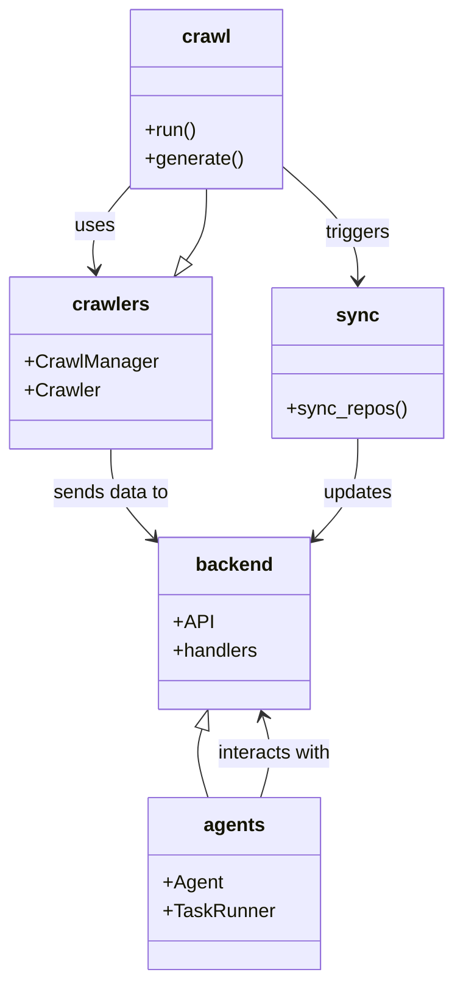

# Diagram: common/support_service/config/config.staging.yml

> Auto-generated by Obscura crawlers

## Mermaid

### SVG

<svg id="container" width="369.7890625" xmlns="http://www.w3.org/2000/svg" class="classDiagram" height="820" viewBox="0 0 369.7890625 820" role="graphics-document document" aria-roledescription="class"><g><defs><marker id="container_class-aggregationStart" class="marker aggregation class" refX="18" refY="7" markerWidth="190" markerHeight="240" orient="auto"><path d="M 18,7 L9,13 L1,7 L9,1 Z"></path></marker></defs><defs><marker id="container_class-aggregationEnd" class="marker aggregation class" refX="1" refY="7" markerWidth="20" markerHeight="28" orient="auto"><path d="M 18,7 L9,13 L1,7 L9,1 Z"></path></marker></defs><defs><marker id="container_class-extensionStart" class="marker extension class" refX="18" refY="7" markerWidth="190" markerHeight="240" orient="auto"><path d="M 1,7 L18,13 V 1 Z"></path></marker></defs><defs><marker id="container_class-extensionEnd" class="marker extension class" refX="1" refY="7" markerWidth="20" markerHeight="28" orient="auto"><path d="M 1,1 V 13 L18,7 Z"></path></marker></defs><defs><marker id="container_class-compositionStart" class="marker composition class" refX="18" refY="7" markerWidth="190" markerHeight="240" orient="auto"><path d="M 18,7 L9,13 L1,7 L9,1 Z"></path></marker></defs><defs><marker id="container_class-compositionEnd" class="marker composition class" refX="1" refY="7" markerWidth="20" markerHeight="28" orient="auto"><path d="M 18,7 L9,13 L1,7 L9,1 Z"></path></marker></defs><defs><marker id="container_class-dependencyStart" class="marker dependency class" refX="6" refY="7" markerWidth="190" markerHeight="240" orient="auto"><path d="M 5,7 L9,13 L1,7 L9,1 Z"></path></marker></defs><defs><marker id="container_class-dependencyEnd" class="marker dependency class" refX="13" refY="7" markerWidth="20" markerHeight="28" orient="auto"><path d="M 18,7 L9,13 L14,7 L9,1 Z"></path></marker></defs><defs><marker id="container_class-lollipopStart" class="marker lollipop class" refX="13" refY="7" markerWidth="190" markerHeight="240" orient="auto"><circle stroke="black" fill="transparent" cx="7" cy="7" r="6"></circle></marker></defs><defs><marker id="container_class-lollipopEnd" class="marker lollipop class" refX="1" refY="7" markerWidth="190" markerHeight="240" orient="auto"><circle stroke="black" fill="transparent" cx="7" cy="7" r="6"></circle></marker></defs><g class="root"><g class="clusters"></g><g class="edgePaths"><path d="M104.541,156.509L99.074,162.924C93.607,169.339,82.673,182.17,78.073,193.765C73.473,205.361,75.207,215.722,76.074,220.902L76.941,226.082" id="id_crawl_crawlers_1" class="edge-thickness-normal edge-pattern-solid relation" style=";;;" data-edge="true" data-et="edge" data-id="id_crawl_crawlers_1" data-points="W3sieCI6MTA0LjU0MTAxNTYyNSwieSI6MTU2LjUwODUyMjc4NTQwNTl9LHsieCI6NzEuNzM4MjgxMjUsInkiOjE5NX0seyJ4Ijo3Ny45MzE5MDk0MDM2Njk3MiwieSI6MjMyfV0=" marker-end="url(#container_class-dependencyEnd)"></path><path d="M229.83,139.268L240.172,148.556C250.513,157.845,271.196,176.423,281.537,192.378C291.879,208.333,291.879,221.667,291.879,228.333L291.879,235" id="id_crawl_sync_2" class="edge-thickness-normal edge-pattern-solid relation" style=";;;" data-edge="true" data-et="edge" data-id="id_crawl_sync_2" data-points="W3sieCI6MjI5LjgzMDA3ODEyNSwieSI6MTM5LjI2NzUzMTI4NzY5MDF9LHsieCI6MjkxLjg3ODkwNjI1LCJ5IjoxOTV9LHsieCI6MjkxLjg3ODkwNjI1LCJ5IjoyNDF9XQ==" marker-end="url(#container_class-dependencyEnd)"></path><path d="M89.984,376L89.984,382.167C89.984,388.333,89.984,400.667,95.562,412.856C101.139,425.045,112.294,437.089,117.871,443.111L123.448,449.134" id="id_crawlers_backend_3" class="edge-thickness-normal edge-pattern-solid relation" style=";;;" data-edge="true" data-et="edge" data-id="id_crawlers_backend_3" data-points="W3sieCI6ODkuOTg0Mzc1LCJ5IjozNzZ9LHsieCI6ODkuOTg0Mzc1LCJ5Ijo0MTN9LHsieCI6MTI3LjUyNTM5MDYyNSwieSI6NDUzLjUzNTcyNjAzMjY5ODF9XQ==" marker-end="url(#container_class-dependencyEnd)"></path><path d="M213.844,668L215.807,661.833C217.769,655.667,221.694,643.333,221.998,631.953C222.301,620.572,218.982,610.145,217.323,604.931L215.664,599.717" id="id_agents_backend_4" class="edge-thickness-normal edge-pattern-solid relation" style=";;;" data-edge="true" data-et="edge" data-id="id_agents_backend_4" data-points="W3sieCI6MjEzLjg0NDQ4NDY2MTY5NzI0LCJ5Ijo2Njh9LHsieCI6MjI1LjYxOTE0MDYyNSwieSI6NjMxfSx7IngiOjIxMy44NDQ0ODQ2NjE2OTcyNCwieSI6NTk0fV0=" marker-end="url(#container_class-dependencyEnd)"></path><path d="M291.879,367L291.879,374.667C291.879,382.333,291.879,397.667,286.302,411.356C280.724,425.045,269.57,437.089,263.992,443.111L258.415,449.134" id="id_sync_backend_5" class="edge-thickness-normal edge-pattern-solid relation" style=";;;" data-edge="true" data-et="edge" data-id="id_sync_backend_5" data-points="W3sieCI6MjkxLjg3ODkwNjI1LCJ5IjozNjd9LHsieCI6MjkxLjg3ODkwNjI1LCJ5Ijo0MTN9LHsieCI6MjU0LjMzNzg5MDYyNSwieSI6NDUzLjUzNTcyNjAzMjY5ODF9XQ==" marker-end="url(#container_class-dependencyEnd)"></path><path d="M162.788,610.438L161.697,613.865C160.607,617.292,158.425,624.146,159.297,633.74C160.169,643.333,164.094,655.667,166.056,661.833L168.019,668" id="id_backend_agents_6" class="edge-thickness-normal edge-pattern-solid relation" style=";;;" data-edge="true" data-et="edge" data-id="id_backend_agents_6" data-points="W3sieCI6MTY4LjAxODc5NjU4ODMwMjc2LCJ5Ijo1OTR9LHsieCI6MTU2LjI0NDE0MDYyNSwieSI6NjMxfSx7IngiOjE2OC4wMTg3OTY1ODgzMDI3NiwieSI6NjY4fV0=" marker-start="url(#container_class-extensionStart)"></path><path d="M150.95,217.923L153.656,214.103C156.362,210.282,161.774,202.641,164.48,192.654C167.186,182.667,167.186,170.333,167.186,164.167L167.186,158" id="id_crawlers_crawl_7" class="edge-thickness-normal edge-pattern-solid relation" style=";;;" data-edge="true" data-et="edge" data-id="id_crawlers_crawl_7" data-points="W3sieCI6MTQwLjk3OTY0NDQ5NTQxMjg2LCJ5IjoyMzJ9LHsieCI6MTY3LjE4NTU0Njg3NSwieSI6MTk1fSx7IngiOjE2Ny4xODU1NDY4NzUsInkiOjE1OH1d" marker-start="url(#container_class-extensionStart)"></path></g><g class="edgeLabels"><g class="edgeLabel" transform="translate(75.97316, 190.0307)"><g class="label" data-id="id_crawl_crawlers_1" transform="translate(-16.4921875, -12)"><foreignObject width="32.984375" height="24">

uses

</foreignObject></g></g><g class="edgeLabel" transform="translate(291.87890625, 195)"><g class="label" data-id="id_crawl_sync_2" transform="translate(-27.4921875, -12)"><foreignObject width="54.984375" height="24">

triggers

</foreignObject></g></g><g class="edgeLabel" transform="translate(89.984375, 413)"><g class="label" data-id="id_crawlers_backend_3" transform="translate(-49.3046875, -12)"><foreignObject width="98.609375" height="24">

sends data to

</foreignObject></g></g><g class="edgeLabel" transform="translate(225.619140625, 631)"><g class="label" data-id="id_agents_backend_4" transform="translate(-49.375, -12)"><foreignObject width="98.75" height="24">

interacts with

</foreignObject></g></g><g class="edgeLabel" transform="translate(291.87890625, 413)"><g class="label" data-id="id_sync_backend_5" transform="translate(-29.4140625, -12)"><foreignObject width="58.828125" height="24">

updates

</foreignObject></g></g><g class="edgeLabel"><g class="label" data-id="id_backend_agents_6" transform="translate(0, 0)"><foreignObject width="0" height="0">

</foreignObject></g></g><g class="edgeLabel"><g class="label" data-id="id_crawlers_crawl_7" transform="translate(0, 0)"><foreignObject width="0" height="0">

</foreignObject></g></g></g><g class="nodes"><g class="node default" id="classId-crawl-0" transform="translate(167.185546875, 83)"><g class="basic label-container"><path d="M-62.64453125 -75 L62.64453125 -75 L62.64453125 75 L-62.64453125 75" stroke="none" stroke-width="0" fill="#ECECFF" style=""></path><path d="M-62.64453125 -75 C-29.414975574515474 -75, 3.814580100969053 -75, 62.64453125 -75 M-62.64453125 -75 C-32.419269391229676 -75, -2.194007532459345 -75, 62.64453125 -75 M62.64453125 -75 C62.64453125 -28.494227785003403, 62.64453125 18.011544429993194, 62.64453125 75 M62.64453125 -75 C62.64453125 -24.319800310175182, 62.64453125 26.360399379649635, 62.64453125 75 M62.64453125 75 C36.19347858256123 75, 9.74242591512246 75, -62.64453125 75 M62.64453125 75 C24.680548235887628 75, -13.283434778224745 75, -62.64453125 75 M-62.64453125 75 C-62.64453125 30.003652232593836, -62.64453125 -14.992695534812327, -62.64453125 -75 M-62.64453125 75 C-62.64453125 34.800210001875065, -62.64453125 -5.399579996249869, -62.64453125 -75" stroke="#9370DB" stroke-width="1.3" fill="none" stroke-dasharray="0 0" style=""></path></g><g class="annotation-group text" transform="translate(0, -51)"></g><g class="label-group text" transform="translate(-19.4765625, -51)"><g class="label" style="font-weight: bolder" transform="translate(0,-12)"><foreignObject width="38.953125" height="24">

crawl

</foreignObject></g></g><g class="members-group text" transform="translate(-50.64453125, -3)"></g><g class="methods-group text" transform="translate(-50.64453125, 27)"><g class="label" style="" transform="translate(0,-12)"><foreignObject width="43.21875" height="24">

+run()

</foreignObject></g><g class="label" style="" transform="translate(0,12)"><foreignObject width="81.8125" height="24">

+generate()

</foreignObject></g></g><g class="divider" style=""><path d="M-62.64453125 -27 C-16.096546001540872 -27, 30.451439246918255 -27, 62.64453125 -27 M-62.64453125 -27 C-20.747152174860616 -27, 21.150226900278767 -27, 62.64453125 -27" stroke="#9370DB" stroke-width="1.3" fill="none" stroke-dasharray="0 0" style=""></path></g><g class="divider" style=""><path d="M-62.64453125 -3 C-29.75511756673321 -3, 3.1342961165335765 -3, 62.64453125 -3 M-62.64453125 -3 C-18.83611956900981 -3, 24.97229211198038 -3, 62.64453125 -3" stroke="#9370DB" stroke-width="1.3" fill="none" stroke-dasharray="0 0" style=""></path></g></g><g class="node default" id="classId-crawlers-1" transform="translate(89.984375, 304)"><g class="basic label-container"><path d="M-81.984375 -72 L81.984375 -72 L81.984375 72 L-81.984375 72" stroke="none" stroke-width="0" fill="#ECECFF" style=""></path><path d="M-81.984375 -72 C-21.487759917652404 -72, 39.00885516469519 -72, 81.984375 -72 M-81.984375 -72 C-46.79360492342194 -72, -11.602834846843876 -72, 81.984375 -72 M81.984375 -72 C81.984375 -23.775345534356816, 81.984375 24.449308931286367, 81.984375 72 M81.984375 -72 C81.984375 -32.61948785527736, 81.984375 6.761024289445274, 81.984375 72 M81.984375 72 C29.86571566281752 72, -22.252943674364957 72, -81.984375 72 M81.984375 72 C31.647203096416852 72, -18.689968807166295 72, -81.984375 72 M-81.984375 72 C-81.984375 40.67506180768808, -81.984375 9.350123615376162, -81.984375 -72 M-81.984375 72 C-81.984375 31.89554983645573, -81.984375 -8.208900327088543, -81.984375 -72" stroke="#9370DB" stroke-width="1.3" fill="none" stroke-dasharray="0 0" style=""></path></g><g class="annotation-group text" transform="translate(0, -48)"></g><g class="label-group text" transform="translate(-30.828125, -48)"><g class="label" style="font-weight: bolder" transform="translate(0,-12)"><foreignObject width="61.65625" height="24">

crawlers

</foreignObject></g></g><g class="members-group text" transform="translate(-69.984375, 0)"><g class="label" style="" transform="translate(0,-12)"><foreignObject width="109.140625" height="24">

+CrawlManager

</foreignObject></g><g class="label" style="" transform="translate(0,12)"><foreignObject width="61.921875" height="24">

+Crawler

</foreignObject></g></g><g class="methods-group text" transform="translate(-69.984375, 72)"></g><g class="divider" style=""><path d="M-81.984375 -24 C-18.965897714981942 -24, 44.052579570036116 -24, 81.984375 -24 M-81.984375 -24 C-22.80235008180035 -24, 36.3796748363993 -24, 81.984375 -24" stroke="#9370DB" stroke-width="1.3" fill="none" stroke-dasharray="0 0" style=""></path></g><g class="divider" style=""><path d="M-81.984375 48 C-34.57830948383818 48, 12.827756032323634 48, 81.984375 48 M-81.984375 48 C-46.41164843084912 48, -10.838921861698239 48, 81.984375 48" stroke="#9370DB" stroke-width="1.3" fill="none" stroke-dasharray="0 0" style=""></path></g></g><g class="node default" id="classId-sync-2" transform="translate(291.87890625, 304)"><g class="basic label-container"><path d="M-69.91015625 -63 L69.91015625 -63 L69.91015625 63 L-69.91015625 63" stroke="none" stroke-width="0" fill="#ECECFF" style=""></path><path d="M-69.91015625 -63 C-21.33763303984626 -63, 27.23489017030748 -63, 69.91015625 -63 M-69.91015625 -63 C-25.13495115435888 -63, 19.64025394128224 -63, 69.91015625 -63 M69.91015625 -63 C69.91015625 -32.31294939527035, 69.91015625 -1.6258987905406954, 69.91015625 63 M69.91015625 -63 C69.91015625 -25.956786474812937, 69.91015625 11.086427050374127, 69.91015625 63 M69.91015625 63 C30.213327336077377 63, -9.483501577845246 63, -69.91015625 63 M69.91015625 63 C27.147634200054924 63, -15.614887849890152 63, -69.91015625 63 M-69.91015625 63 C-69.91015625 36.88816000412349, -69.91015625 10.776320008246984, -69.91015625 -63 M-69.91015625 63 C-69.91015625 30.398625958833847, -69.91015625 -2.202748082332306, -69.91015625 -63" stroke="#9370DB" stroke-width="1.3" fill="none" stroke-dasharray="0 0" style=""></path></g><g class="annotation-group text" transform="translate(0, -39)"></g><g class="label-group text" transform="translate(-16.3046875, -39)"><g class="label" style="font-weight: bolder" transform="translate(0,-12)"><foreignObject width="32.609375" height="24">

sync

</foreignObject></g></g><g class="members-group text" transform="translate(-57.91015625, 9)"></g><g class="methods-group text" transform="translate(-57.91015625, 39)"><g class="label" style="" transform="translate(0,-12)"><foreignObject width="99.515625" height="24">

+sync_repos()

</foreignObject></g></g><g class="divider" style=""><path d="M-69.91015625 -15 C-33.70853008315723 -15, 2.4930960836855434 -15, 69.91015625 -15 M-69.91015625 -15 C-17.354823276520406 -15, 35.20050969695919 -15, 69.91015625 -15" stroke="#9370DB" stroke-width="1.3" fill="none" stroke-dasharray="0 0" style=""></path></g><g class="divider" style=""><path d="M-69.91015625 9 C-41.310704706932626 9, -12.711253163865244 9, 69.91015625 9 M-69.91015625 9 C-41.41960873101062 9, -12.929061212021239 9, 69.91015625 9" stroke="#9370DB" stroke-width="1.3" fill="none" stroke-dasharray="0 0" style=""></path></g></g><g class="node default" id="classId-backend-3" transform="translate(190.931640625, 522)"><g class="basic label-container"><path d="M-63.40625 -72 L63.40625 -72 L63.40625 72 L-63.40625 72" stroke="none" stroke-width="0" fill="#ECECFF" style=""></path><path d="M-63.40625 -72 C-17.81855320877353 -72, 27.76914358245294 -72, 63.40625 -72 M-63.40625 -72 C-30.49089602043054 -72, 2.4244579591389197 -72, 63.40625 -72 M63.40625 -72 C63.40625 -21.87548046808005, 63.40625 28.249039063839902, 63.40625 72 M63.40625 -72 C63.40625 -39.6584153549238, 63.40625 -7.3168307098475935, 63.40625 72 M63.40625 72 C25.653130870271028 72, -12.099988259457945 72, -63.40625 72 M63.40625 72 C27.317446725547526 72, -8.771356548904947 72, -63.40625 72 M-63.40625 72 C-63.40625 15.587977754063274, -63.40625 -40.82404449187345, -63.40625 -72 M-63.40625 72 C-63.40625 17.05232016584317, -63.40625 -37.89535966831366, -63.40625 -72" stroke="#9370DB" stroke-width="1.3" fill="none" stroke-dasharray="0 0" style=""></path></g><g class="annotation-group text" transform="translate(0, -48)"></g><g class="label-group text" transform="translate(-31.0625, -48)"><g class="label" style="font-weight: bolder" transform="translate(0,-12)"><foreignObject width="62.125" height="24">

backend

</foreignObject></g></g><g class="members-group text" transform="translate(-51.40625, 0)"><g class="label" style="" transform="translate(0,-12)"><foreignObject width="31.015625" height="24">

+API

</foreignObject></g><g class="label" style="" transform="translate(0,12)"><foreignObject width="71.75" height="24">

+handlers

</foreignObject></g></g><g class="methods-group text" transform="translate(-51.40625, 72)"></g><g class="divider" style=""><path d="M-63.40625 -24 C-13.297427278637919 -24, 36.81139544272416 -24, 63.40625 -24 M-63.40625 -24 C-17.745934601250795 -24, 27.91438079749841 -24, 63.40625 -24" stroke="#9370DB" stroke-width="1.3" fill="none" stroke-dasharray="0 0" style=""></path></g><g class="divider" style=""><path d="M-63.40625 48 C-27.787064164598732 48, 7.832121670802536 48, 63.40625 48 M-63.40625 48 C-28.115537571838544 48, 7.175174856322911 48, 63.40625 48" stroke="#9370DB" stroke-width="1.3" fill="none" stroke-dasharray="0 0" style=""></path></g></g><g class="node default" id="classId-agents-4" transform="translate(190.931640625, 740)"><g class="basic label-container"><path d="M-70.01953125 -72 L70.01953125 -72 L70.01953125 72 L-70.01953125 72" stroke="none" stroke-width="0" fill="#ECECFF" style=""></path><path d="M-70.01953125 -72 C-38.622471783925306 -72, -7.225412317850619 -72, 70.01953125 -72 M-70.01953125 -72 C-27.464970096316605 -72, 15.089591057366789 -72, 70.01953125 -72 M70.01953125 -72 C70.01953125 -38.318895241372225, 70.01953125 -4.63779048274445, 70.01953125 72 M70.01953125 -72 C70.01953125 -30.73798933418682, 70.01953125 10.524021331626358, 70.01953125 72 M70.01953125 72 C27.919048493617886 72, -14.181434262764228 72, -70.01953125 72 M70.01953125 72 C34.76816332052637 72, -0.48320460894726125 72, -70.01953125 72 M-70.01953125 72 C-70.01953125 31.935126990536077, -70.01953125 -8.129746018927847, -70.01953125 -72 M-70.01953125 72 C-70.01953125 20.35566460836261, -70.01953125 -31.28867078327478, -70.01953125 -72" stroke="#9370DB" stroke-width="1.3" fill="none" stroke-dasharray="0 0" style=""></path></g><g class="annotation-group text" transform="translate(0, -48)"></g><g class="label-group text" transform="translate(-24.5234375, -48)"><g class="label" style="font-weight: bolder" transform="translate(0,-12)"><foreignObject width="49.046875" height="24">

agents

</foreignObject></g></g><g class="members-group text" transform="translate(-58.01953125, 0)"><g class="label" style="" transform="translate(0,-12)"><foreignObject width="48.9375" height="24">

+Agent

</foreignObject></g><g class="label" style="" transform="translate(0,12)"><foreignObject width="91.515625" height="24">

+TaskRunner

</foreignObject></g></g><g class="methods-group text" transform="translate(-58.01953125, 72)"></g><g class="divider" style=""><path d="M-70.01953125 -24 C-15.00215896456541 -24, 40.01521332086918 -24, 70.01953125 -24 M-70.01953125 -24 C-17.99615696644571 -24, 34.02721731710858 -24, 70.01953125 -24" stroke="#9370DB" stroke-width="1.3" fill="none" stroke-dasharray="0 0" style=""></path></g><g class="divider" style=""><path d="M-70.01953125 48 C-22.14136946913984 48, 25.736792311720322 48, 70.01953125 48 M-70.01953125 48 C-37.99240110879987 48, -5.965270967599736 48, 70.01953125 48" stroke="#9370DB" stroke-width="1.3" fill="none" stroke-dasharray="0 0" style=""></path></g></g></g></g></g></svg>
