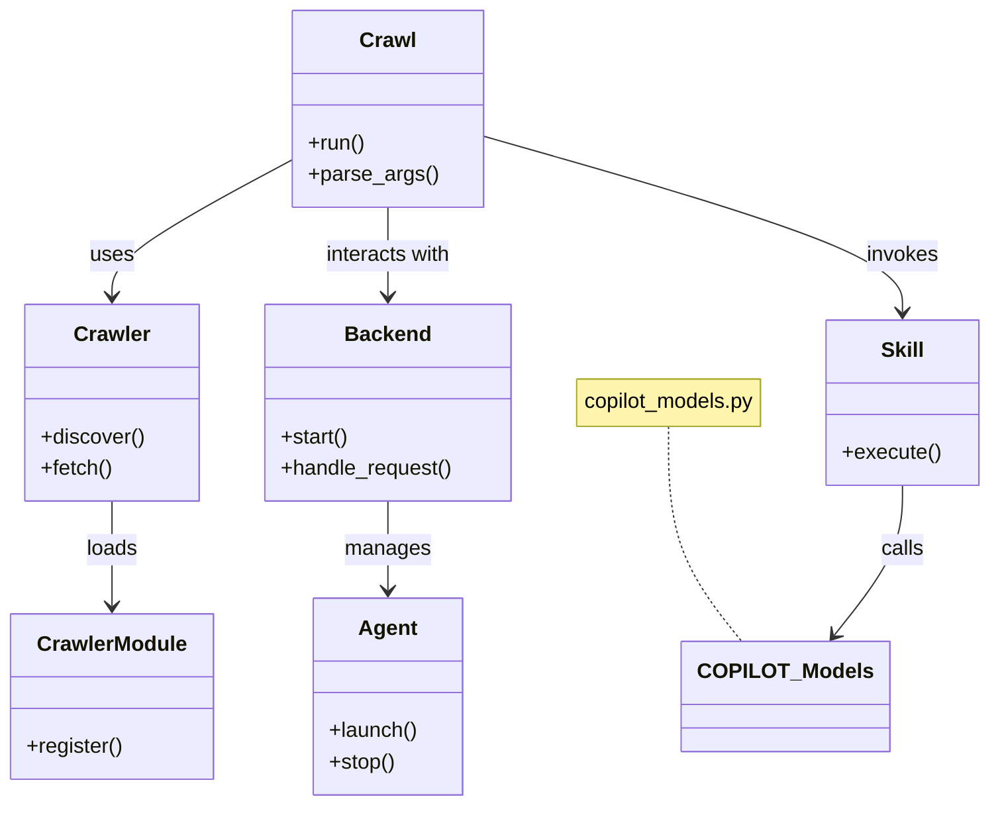

# Diagram: common/support_service/config/config.test.yml


> Auto-generated by Obscura crawlers

## Diagram 1

```mermaid
flowchart TD
    CLI[Command Line] --> CP[ crawl.py ]
    CP --> CR[crawlers.py]
    CP --> CG[crawlers/ (modules)]
    CR --> BACKEND[backend/]
    BACKEND --> REPOS[repos/]
    CP --> SKILLS[skills/]
    SKILLS --> COPILOT_MODELS[copilot_models.py]
    AGENTS[agents/] --> BACKEND
    CP --> AGENTS
    style CLI fill:#f9f,stroke:#333,stroke-width:1px
    style CP fill:#fffae6,stroke:#333,stroke-width:1px
    style BACKEND fill:#e6f7ff,stroke:#333,stroke-width:1px
```

> SVG rendering failed for this diagram.

## Diagram 2



### SVG

<svg id="container" width="754.65234375" xmlns="http://www.w3.org/2000/svg" class="classDiagram" height="614" viewBox="0 0 754.65234375 614" role="graphics-document document" aria-roledescription="class"><style>#container{font-family:"trebuchet ms",verdana,arial,sans-serif;font-size:16px;fill:#333;}@keyframes edge-animation-frame{from{stroke-dashoffset:0;}}@keyframes dash{to{stroke-dashoffset:0;}}#container .edge-animation-slow{stroke-dasharray:9,5!important;stroke-dashoffset:900;animation:dash 50s linear infinite;stroke-linecap:round;}#container .edge-animation-fast{stroke-dasharray:9,5!important;stroke-dashoffset:900;animation:dash 20s linear infinite;stroke-linecap:round;}#container .error-icon{fill:#552222;}#container .error-text{fill:#552222;stroke:#552222;}#container .edge-thickness-normal{stroke-width:1px;}#container .edge-thickness-thick{stroke-width:3.5px;}#container .edge-pattern-solid{stroke-dasharray:0;}#container .edge-thickness-invisible{stroke-width:0;fill:none;}#container .edge-pattern-dashed{stroke-dasharray:3;}#container .edge-pattern-dotted{stroke-dasharray:2;}#container .marker{fill:#333333;stroke:#333333;}#container .marker.cross{stroke:#333333;}#container svg{font-family:"trebuchet ms",verdana,arial,sans-serif;font-size:16px;}#container p{margin:0;}#container g.classGroup text{fill:#9370DB;stroke:none;font-family:"trebuchet ms",verdana,arial,sans-serif;font-size:10px;}#container g.classGroup text .title{font-weight:bolder;}#container .nodeLabel,#container .edgeLabel{color:#131300;}#container .edgeLabel .label rect{fill:#ECECFF;}#container .label text{fill:#131300;}#container .labelBkg{background:#ECECFF;}#container .edgeLabel .label span{background:#ECECFF;}#container .classTitle{font-weight:bolder;}#container .node rect,#container .node circle,#container .node ellipse,#container .node polygon,#container .node path{fill:#ECECFF;stroke:#9370DB;stroke-width:1px;}#container .divider{stroke:#9370DB;stroke-width:1;}#container g.clickable{cursor:pointer;}#container g.classGroup rect{fill:#ECECFF;stroke:#9370DB;}#container g.classGroup line{stroke:#9370DB;stroke-width:1;}#container .classLabel .box{stroke:none;stroke-width:0;fill:#ECECFF;opacity:0.5;}#container .classLabel .label{fill:#9370DB;font-size:10px;}#container .relation{stroke:#333333;stroke-width:1;fill:none;}#container .dashed-line{stroke-dasharray:3;}#container .dotted-line{stroke-dasharray:1 2;}#container #compositionStart,#container .composition{fill:#333333!important;stroke:#333333!important;stroke-width:1;}#container #compositionEnd,#container .composition{fill:#333333!important;stroke:#333333!important;stroke-width:1;}#container #dependencyStart,#container .dependency{fill:#333333!important;stroke:#333333!important;stroke-width:1;}#container #dependencyStart,#container .dependency{fill:#333333!important;stroke:#333333!important;stroke-width:1;}#container #extensionStart,#container .extension{fill:transparent!important;stroke:#333333!important;stroke-width:1;}#container #extensionEnd,#container .extension{fill:transparent!important;stroke:#333333!important;stroke-width:1;}#container #aggregationStart,#container .aggregation{fill:transparent!important;stroke:#333333!important;stroke-width:1;}#container #aggregationEnd,#container .aggregation{fill:transparent!important;stroke:#333333!important;stroke-width:1;}#container #lollipopStart,#container .lollipop{fill:#ECECFF!important;stroke:#333333!important;stroke-width:1;}#container #lollipopEnd,#container .lollipop{fill:#ECECFF!important;stroke:#333333!important;stroke-width:1;}#container .edgeTerminals{font-size:11px;line-height:initial;}#container .classTitleText{text-anchor:middle;font-size:18px;fill:#333;}#container .label-icon{display:inline-block;height:1em;overflow:visible;vertical-align:-0.125em;}#container .node .label-icon path{fill:currentColor;stroke:revert;stroke-width:revert;}#container :root{--mermaid-font-family:"trebuchet ms",verdana,arial,sans-serif;}</style><g><defs><marker id="container_class-aggregationStart" class="marker aggregation class" refX="18" refY="7" markerWidth="190" markerHeight="240" orient="auto"><path d="M 18,7 L9,13 L1,7 L9,1 Z"></path></marker></defs><defs><marker id="container_class-aggregationEnd" class="marker aggregation class" refX="1" refY="7" markerWidth="20" markerHeight="28" orient="auto"><path d="M 18,7 L9,13 L1,7 L9,1 Z"></path></marker></defs><defs><marker id="container_class-extensionStart" class="marker extension class" refX="18" refY="7" markerWidth="190" markerHeight="240" orient="auto"><path d="M 1,7 L18,13 V 1 Z"></path></marker></defs><defs><marker id="container_class-extensionEnd" class="marker extension class" refX="1" refY="7" markerWidth="20" markerHeight="28" orient="auto"><path d="M 1,1 V 13 L18,7 Z"></path></marker></defs><defs><marker id="container_class-compositionStart" class="marker composition class" refX="18" refY="7" markerWidth="190" markerHeight="240" orient="auto"><path d="M 18,7 L9,13 L1,7 L9,1 Z"></path></marker></defs><defs><marker id="container_class-compositionEnd" class="marker composition class" refX="1" refY="7" markerWidth="20" markerHeight="28" orient="auto"><path d="M 18,7 L9,13 L1,7 L9,1 Z"></path></marker></defs><defs><marker id="container_class-dependencyStart" class="marker dependency class" refX="6" refY="7" markerWidth="190" markerHeight="240" orient="auto"><path d="M 5,7 L9,13 L1,7 L9,1 Z"></path></marker></defs><defs><marker id="container_class-dependencyEnd" class="marker dependency class" refX="13" refY="7" markerWidth="20" markerHeight="28" orient="auto"><path d="M 18,7 L9,13 L14,7 L9,1 Z"></path></marker></defs><defs><marker id="container_class-lollipopStart" class="marker lollipop class" refX="13" refY="7" markerWidth="190" markerHeight="240" orient="auto"><circle stroke="black" fill="transparent" cx="7" cy="7" r="6"></circle></marker></defs><defs><marker id="container_class-lollipopEnd" class="marker lollipop class" refX="1" refY="7" markerWidth="190" markerHeight="240" orient="auto"><circle stroke="black" fill="transparent" cx="7" cy="7" r="6"></circle></marker></defs><g class="root"><g class="clusters"></g><g class="edgePaths"><path d="M509.613,325L509.613,340.667C509.613,356.333,509.613,387.667,518.982,415C528.35,442.333,547.086,465.667,556.455,477.333L565.823,489" id="edgeNote1" class="edge-thickness-normal edge-pattern-dotted relation" style="fill: none;;;fill: none" data-edge="true" data-et="edge" data-id="edgeNote1" data-points="W3sieCI6NTA5LjYxMzI4MTI1LCJ5IjozMjV9LHsieCI6NTA5LjYxMzI4MTI1LCJ5Ijo0MTl9LHsieCI6NTY1LjgyMjk5ODA0Njg3NSwieSI6NDg5fV0="></path><path d="M222.938,120.674L199.809,133.062C176.681,145.45,130.424,170.225,107.296,187.779C84.168,205.333,84.168,215.667,84.168,220.833L84.168,226" id="id_Crawl_Crawler_1" class="edge-thickness-normal edge-pattern-solid relation" style=";;;" data-edge="true" data-et="edge" data-id="id_Crawl_Crawler_1" data-points="W3sieCI6MjIyLjkzNzUsInkiOjEyMC42NzQzNjI5OTc4MzMwN30seyJ4Ijo4NC4xNjc5Njg3NSwieSI6MTk1fSx7IngiOjg0LjE2Nzk2ODc1LCJ5IjoyMzJ9XQ==" marker-end="url(#container_class-dependencyEnd)"></path><path d="M84.168,382L84.168,388.167C84.168,394.333,84.168,406.667,84.168,420C84.168,433.333,84.168,447.667,84.168,454.833L84.168,462" id="id_Crawler_CrawlerModule_2" class="edge-thickness-normal edge-pattern-solid relation" style=";;;" data-edge="true" data-et="edge" data-id="id_Crawler_CrawlerModule_2" data-points="W3sieCI6ODQuMTY3OTY4NzUsInkiOjM4Mn0seyJ4Ijo4NC4xNjc5Njg3NSwieSI6NDE5fSx7IngiOjg0LjE2Nzk2ODc1LCJ5Ijo0Njh9XQ==" marker-end="url(#container_class-dependencyEnd)"></path><path d="M293.277,158L293.277,164.167C293.277,170.333,293.277,182.667,293.277,194C293.277,205.333,293.277,215.667,293.277,220.833L293.277,226" id="id_Crawl_Backend_3" class="edge-thickness-normal edge-pattern-solid relation" style=";;;" data-edge="true" data-et="edge" data-id="id_Crawl_Backend_3" data-points="W3sieCI6MjkzLjI3NzM0Mzc1LCJ5IjoxNTh9LHsieCI6MjkzLjI3NzM0Mzc1LCJ5IjoxOTV9LHsieCI6MjkzLjI3NzM0Mzc1LCJ5IjoyMzJ9XQ==" marker-end="url(#container_class-dependencyEnd)"></path><path d="M293.277,382L293.277,388.167C293.277,394.333,293.277,406.667,293.277,418C293.277,429.333,293.277,439.667,293.277,444.833L293.277,450" id="id_Backend_Agent_4" class="edge-thickness-normal edge-pattern-solid relation" style=";;;" data-edge="true" data-et="edge" data-id="id_Backend_Agent_4" data-points="W3sieCI6MjkzLjI3NzM0Mzc1LCJ5IjozODJ9LHsieCI6MjkzLjI3NzM0Mzc1LCJ5Ijo0MTl9LHsieCI6MjkzLjI3NzM0Mzc1LCJ5Ijo0NTZ9XQ==" marker-end="url(#container_class-dependencyEnd)"></path><path d="M363.617,102.884L417.928,118.236C472.24,133.589,580.862,164.295,635.173,186.814C689.484,209.333,689.484,223.667,689.484,230.833L689.484,238" id="id_Crawl_Skill_5" class="edge-thickness-normal edge-pattern-solid relation" style=";;;" data-edge="true" data-et="edge" data-id="id_Crawl_Skill_5" data-points="W3sieCI6MzYzLjYxNzE4NzUsInkiOjEwMi44ODM3MDE4OTk4NTExM30seyJ4Ijo2ODkuNDg0Mzc1LCJ5IjoxOTV9LHsieCI6Njg5LjQ4NDM3NSwieSI6MjQ0fV0=" marker-end="url(#container_class-dependencyEnd)"></path><path d="M689.484,370L689.484,378.167C689.484,386.333,689.484,402.667,680.742,421.72C672,440.774,654.516,462.548,645.774,473.435L637.031,484.322" id="id_Skill_COPILOT_Models_6" class="edge-thickness-normal edge-pattern-solid relation" style=";;;" data-edge="true" data-et="edge" data-id="id_Skill_COPILOT_Models_6" data-points="W3sieCI6Njg5LjQ4NDM3NSwieSI6MzcwfSx7IngiOjY4OS40ODQzNzUsInkiOjQxOX0seyJ4Ijo2MzMuMjc0NjU4MjAzMTI1LCJ5Ijo0ODl9XQ==" marker-end="url(#container_class-dependencyEnd)"></path></g><g class="edgeLabels"><g class="edgeLabel"><g class="label" data-id="edgeNote1" transform="translate(0, 0)"><foreignObject width="0" height="0"><div xmlns="http://www.w3.org/1999/xhtml" class="labelBkg" style="display: table-cell; white-space: nowrap; line-height: 1.5; max-width: 200px; text-align: center;"><span class="edgeLabel"></span></div></foreignObject></g></g><g class="edgeLabel" transform="translate(84.16796875, 195)"><g class="label" data-id="id_Crawl_Crawler_1" transform="translate(-16.4921875, -12)"><foreignObject width="32.984375" height="24"><div xmlns="http://www.w3.org/1999/xhtml" class="labelBkg" style="display: table-cell; white-space: nowrap; line-height: 1.5; max-width: 200px; text-align: center;"><span class="edgeLabel"><p>uses</p></span></div></foreignObject></g></g><g class="edgeLabel" transform="translate(84.16796875, 419)"><g class="label" data-id="id_Crawler_CrawlerModule_2" transform="translate(-19.7734375, -12)"><foreignObject width="39.546875" height="24"><div xmlns="http://www.w3.org/1999/xhtml" class="labelBkg" style="display: table-cell; white-space: nowrap; line-height: 1.5; max-width: 200px; text-align: center;"><span class="edgeLabel"><p>loads</p></span></div></foreignObject></g></g><g class="edgeLabel" transform="translate(293.27734375, 195)"><g class="label" data-id="id_Crawl_Backend_3" transform="translate(-49.375, -12)"><foreignObject width="98.75" height="24"><div xmlns="http://www.w3.org/1999/xhtml" class="labelBkg" style="display: table-cell; white-space: nowrap; line-height: 1.5; max-width: 200px; text-align: center;"><span class="edgeLabel"><p>interacts with</p></span></div></foreignObject></g></g><g class="edgeLabel" transform="translate(293.27734375, 419)"><g class="label" data-id="id_Backend_Agent_4" transform="translate(-32.296875, -12)"><foreignObject width="64.59375" height="24"><div xmlns="http://www.w3.org/1999/xhtml" class="labelBkg" style="display: table-cell; white-space: nowrap; line-height: 1.5; max-width: 200px; text-align: center;"><span class="edgeLabel"><p>manages</p></span></div></foreignObject></g></g><g class="edgeLabel" transform="translate(689.484375, 195)"><g class="label" data-id="id_Crawl_Skill_5" transform="translate(-27.5859375, -12)"><foreignObject width="55.171875" height="24"><div xmlns="http://www.w3.org/1999/xhtml" class="labelBkg" style="display: table-cell; white-space: nowrap; line-height: 1.5; max-width: 200px; text-align: center;"><span class="edgeLabel"><p>invokes</p></span></div></foreignObject></g></g><g class="edgeLabel" transform="translate(689.484375, 419)"><g class="label" data-id="id_Skill_COPILOT_Models_6" transform="translate(-16.4453125, -12)"><foreignObject width="32.890625" height="24"><div xmlns="http://www.w3.org/1999/xhtml" class="labelBkg" style="display: table-cell; white-space: nowrap; line-height: 1.5; max-width: 200px; text-align: center;"><span class="edgeLabel"><p>calls</p></span></div></foreignObject></g></g></g><g class="nodes"><g class="node default" id="classId-Crawl-0" transform="translate(293.27734375, 83)"><g class="basic label-container"><path d="M-70.33984375 -75 L70.33984375 -75 L70.33984375 75 L-70.33984375 75" stroke="none" stroke-width="0" fill="#ECECFF" style=""></path><path d="M-70.33984375 -75 C-30.946995690331114 -75, 8.445852369337771 -75, 70.33984375 -75 M-70.33984375 -75 C-36.154631666191165 -75, -1.9694195823823293 -75, 70.33984375 -75 M70.33984375 -75 C70.33984375 -20.869114840971584, 70.33984375 33.26177031805683, 70.33984375 75 M70.33984375 -75 C70.33984375 -26.0831552770169, 70.33984375 22.8336894459662, 70.33984375 75 M70.33984375 75 C15.140840930445115 75, -40.05816188910977 75, -70.33984375 75 M70.33984375 75 C15.133476756013174 75, -40.07289023797365 75, -70.33984375 75 M-70.33984375 75 C-70.33984375 16.86127623107393, -70.33984375 -41.27744753785214, -70.33984375 -75 M-70.33984375 75 C-70.33984375 44.849261306281825, -70.33984375 14.69852261256365, -70.33984375 -75" stroke="#9370DB" stroke-width="1.3" fill="none" stroke-dasharray="0 0" style=""></path></g><g class="annotation-group text" transform="translate(0, -51)"></g><g class="label-group text" transform="translate(-20.1484375, -51)"><g class="label" style="font-weight: bolder" transform="translate(0,-12)"><foreignObject width="40.296875" height="24"><div xmlns="http://www.w3.org/1999/xhtml" style="display: table-cell; white-space: nowrap; line-height: 1.5; max-width: 89px; text-align: center;"><span class="nodeLabel markdown-node-label" style=""><p>Crawl</p></span></div></foreignObject></g></g><g class="members-group text" transform="translate(-58.33984375, -3)"></g><g class="methods-group text" transform="translate(-58.33984375, 27)"><g class="label" style="" transform="translate(0,-12)"><foreignObject width="43.21875" height="24"><div xmlns="http://www.w3.org/1999/xhtml" style="display: table-cell; white-space: nowrap; line-height: 1.5; max-width: 101px; text-align: center;"><span class="nodeLabel markdown-node-label" style=""><p>+run()</p></span></div></foreignObject></g><g class="label" style="" transform="translate(0,12)"><foreignObject width="96.53125" height="24"><div xmlns="http://www.w3.org/1999/xhtml" style="display: table-cell; white-space: nowrap; line-height: 1.5; max-width: 154px; text-align: center;"><span class="nodeLabel markdown-node-label" style=""><p>+parse_args()</p></span></div></foreignObject></g></g><g class="divider" style=""><path d="M-70.33984375 -27 C-26.121822507605515 -27, 18.09619873478897 -27, 70.33984375 -27 M-70.33984375 -27 C-40.082356962521715 -27, -9.824870175043436 -27, 70.33984375 -27" stroke="#9370DB" stroke-width="1.3" fill="none" stroke-dasharray="0 0" style=""></path></g><g class="divider" style=""><path d="M-70.33984375 -3 C-35.059060183049304 -3, 0.22172338390139146 -3, 70.33984375 -3 M-70.33984375 -3 C-33.46346808460031 -3, 3.4129075807993843 -3, 70.33984375 -3" stroke="#9370DB" stroke-width="1.3" fill="none" stroke-dasharray="0 0" style=""></path></g></g><g class="node default" id="classId-Crawler-1" transform="translate(84.16796875, 307)"><g class="basic label-container"><path d="M-65.4765625 -75 L65.4765625 -75 L65.4765625 75 L-65.4765625 75" stroke="none" stroke-width="0" fill="#ECECFF" style=""></path><path d="M-65.4765625 -75 C-14.796143216089703 -75, 35.88427606782059 -75, 65.4765625 -75 M-65.4765625 -75 C-33.919434416625975 -75, -2.362306333251958 -75, 65.4765625 -75 M65.4765625 -75 C65.4765625 -27.965713379319872, 65.4765625 19.068573241360255, 65.4765625 75 M65.4765625 -75 C65.4765625 -35.78065470972403, 65.4765625 3.4386905805519348, 65.4765625 75 M65.4765625 75 C26.129635656065396 75, -13.217291187869208 75, -65.4765625 75 M65.4765625 75 C25.742609298123647 75, -13.991343903752707 75, -65.4765625 75 M-65.4765625 75 C-65.4765625 44.92035606059115, -65.4765625 14.840712121182307, -65.4765625 -75 M-65.4765625 75 C-65.4765625 32.98574879953142, -65.4765625 -9.028502400937157, -65.4765625 -75" stroke="#9370DB" stroke-width="1.3" fill="none" stroke-dasharray="0 0" style=""></path></g><g class="annotation-group text" transform="translate(0, -51)"></g><g class="label-group text" transform="translate(-27.734375, -51)"><g class="label" style="font-weight: bolder" transform="translate(0,-12)"><foreignObject width="55.46875" height="24"><div xmlns="http://www.w3.org/1999/xhtml" style="display: table-cell; white-space: nowrap; line-height: 1.5; max-width: 105px; text-align: center;"><span class="nodeLabel markdown-node-label" style=""><p>Crawler</p></span></div></foreignObject></g></g><g class="members-group text" transform="translate(-53.4765625, -3)"></g><g class="methods-group text" transform="translate(-53.4765625, 27)"><g class="label" style="" transform="translate(0,-12)"><foreignObject width="79.21875" height="24"><div xmlns="http://www.w3.org/1999/xhtml" style="display: table-cell; white-space: nowrap; line-height: 1.5; max-width: 137px; text-align: center;"><span class="nodeLabel markdown-node-label" style=""><p>+discover()</p></span></div></foreignObject></g><g class="label" style="" transform="translate(0,12)"><foreignObject width="54.59375" height="24"><div xmlns="http://www.w3.org/1999/xhtml" style="display: table-cell; white-space: nowrap; line-height: 1.5; max-width: 112px; text-align: center;"><span class="nodeLabel markdown-node-label" style=""><p>+fetch()</p></span></div></foreignObject></g></g><g class="divider" style=""><path d="M-65.4765625 -27 C-32.601269106635684 -27, 0.27402428672863266 -27, 65.4765625 -27 M-65.4765625 -27 C-33.47996910225915 -27, -1.483375704518295 -27, 65.4765625 -27" stroke="#9370DB" stroke-width="1.3" fill="none" stroke-dasharray="0 0" style=""></path></g><g class="divider" style=""><path d="M-65.4765625 -3 C-38.967807229376795 -3, -12.45905195875359 -3, 65.4765625 -3 M-65.4765625 -3 C-37.992783713487356 -3, -10.509004926974711 -3, 65.4765625 -3" stroke="#9370DB" stroke-width="1.3" fill="none" stroke-dasharray="0 0" style=""></path></g></g><g class="node default" id="classId-CrawlerModule-2" transform="translate(84.16796875, 531)"><g class="basic label-container"><path d="M-76.16796875 -63 L76.16796875 -63 L76.16796875 63 L-76.16796875 63" stroke="none" stroke-width="0" fill="#ECECFF" style=""></path><path d="M-76.16796875 -63 C-15.328681594757747 -63, 45.51060556048451 -63, 76.16796875 -63 M-76.16796875 -63 C-31.818814548038105 -63, 12.53033965392379 -63, 76.16796875 -63 M76.16796875 -63 C76.16796875 -27.288619143296486, 76.16796875 8.422761713407027, 76.16796875 63 M76.16796875 -63 C76.16796875 -27.36040693009374, 76.16796875 8.279186139812523, 76.16796875 63 M76.16796875 63 C29.78322675642265 63, -16.6015152371547 63, -76.16796875 63 M76.16796875 63 C36.35460070248184 63, -3.458767345036321 63, -76.16796875 63 M-76.16796875 63 C-76.16796875 33.71001725211103, -76.16796875 4.420034504222052, -76.16796875 -63 M-76.16796875 63 C-76.16796875 35.103072390833816, -76.16796875 7.206144781667639, -76.16796875 -63" stroke="#9370DB" stroke-width="1.3" fill="none" stroke-dasharray="0 0" style=""></path></g><g class="annotation-group text" transform="translate(0, -39)"></g><g class="label-group text" transform="translate(-54.8203125, -39)"><g class="label" style="font-weight: bolder" transform="translate(0,-12)"><foreignObject width="109.640625" height="24"><div xmlns="http://www.w3.org/1999/xhtml" style="display: table-cell; white-space: nowrap; line-height: 1.5; max-width: 158px; text-align: center;"><span class="nodeLabel markdown-node-label" style=""><p>CrawlerModule</p></span></div></foreignObject></g></g><g class="members-group text" transform="translate(-64.16796875, 9)"></g><g class="methods-group text" transform="translate(-64.16796875, 39)"><g class="label" style="" transform="translate(0,-12)"><foreignObject width="73.515625" height="24"><div xmlns="http://www.w3.org/1999/xhtml" style="display: table-cell; white-space: nowrap; line-height: 1.5; max-width: 131px; text-align: center;"><span class="nodeLabel markdown-node-label" style=""><p>+register()</p></span></div></foreignObject></g></g><g class="divider" style=""><path d="M-76.16796875 -15 C-32.047056312959306 -15, 12.073856124081388 -15, 76.16796875 -15 M-76.16796875 -15 C-42.96827281074253 -15, -9.768576871485067 -15, 76.16796875 -15" stroke="#9370DB" stroke-width="1.3" fill="none" stroke-dasharray="0 0" style=""></path></g><g class="divider" style=""><path d="M-76.16796875 9 C-19.760297513650983 9, 36.647373722698035 9, 76.16796875 9 M-76.16796875 9 C-30.688788352989583 9, 14.790392044020834 9, 76.16796875 9" stroke="#9370DB" stroke-width="1.3" fill="none" stroke-dasharray="0 0" style=""></path></g></g><g class="node default" id="classId-Backend-3" transform="translate(293.27734375, 307)"><g class="basic label-container"><path d="M-93.6328125 -75 L93.6328125 -75 L93.6328125 75 L-93.6328125 75" stroke="none" stroke-width="0" fill="#ECECFF" style=""></path><path d="M-93.6328125 -75 C-21.799759804910735 -75, 50.03329289017853 -75, 93.6328125 -75 M-93.6328125 -75 C-27.051810761421947 -75, 39.529190977156105 -75, 93.6328125 -75 M93.6328125 -75 C93.6328125 -16.35986440946369, 93.6328125 42.28027118107262, 93.6328125 75 M93.6328125 -75 C93.6328125 -29.16953326101354, 93.6328125 16.660933477972918, 93.6328125 75 M93.6328125 75 C20.477701998461 75, -52.677408503078 75, -93.6328125 75 M93.6328125 75 C31.98607815235649 75, -29.660656195287018 75, -93.6328125 75 M-93.6328125 75 C-93.6328125 33.59669640769128, -93.6328125 -7.806607184617434, -93.6328125 -75 M-93.6328125 75 C-93.6328125 44.201941871980154, -93.6328125 13.403883743960314, -93.6328125 -75" stroke="#9370DB" stroke-width="1.3" fill="none" stroke-dasharray="0 0" style=""></path></g><g class="annotation-group text" transform="translate(0, -51)"></g><g class="label-group text" transform="translate(-31.296875, -51)"><g class="label" style="font-weight: bolder" transform="translate(0,-12)"><foreignObject width="62.59375" height="24"><div xmlns="http://www.w3.org/1999/xhtml" style="display: table-cell; white-space: nowrap; line-height: 1.5; max-width: 112px; text-align: center;"><span class="nodeLabel markdown-node-label" style=""><p>Backend</p></span></div></foreignObject></g></g><g class="members-group text" transform="translate(-81.6328125, -3)"></g><g class="methods-group text" transform="translate(-81.6328125, 27)"><g class="label" style="" transform="translate(0,-12)"><foreignObject width="52.15625" height="24"><div xmlns="http://www.w3.org/1999/xhtml" style="display: table-cell; white-space: nowrap; line-height: 1.5; max-width: 110px; text-align: center;"><span class="nodeLabel markdown-node-label" style=""><p>+start()</p></span></div></foreignObject></g><g class="label" style="" transform="translate(0,12)"><foreignObject width="131.96875" height="24"><div xmlns="http://www.w3.org/1999/xhtml" style="display: table-cell; white-space: nowrap; line-height: 1.5; max-width: 189px; text-align: center;"><span class="nodeLabel markdown-node-label" style=""><p>+handle_request()</p></span></div></foreignObject></g></g><g class="divider" style=""><path d="M-93.6328125 -27 C-23.96946762705616 -27, 45.69387724588768 -27, 93.6328125 -27 M-93.6328125 -27 C-43.667405082808536 -27, 6.298002334382929 -27, 93.6328125 -27" stroke="#9370DB" stroke-width="1.3" fill="none" stroke-dasharray="0 0" style=""></path></g><g class="divider" style=""><path d="M-93.6328125 -3 C-48.9309309542632 -3, -4.229049408526393 -3, 93.6328125 -3 M-93.6328125 -3 C-28.840210240310824 -3, 35.95239201937835 -3, 93.6328125 -3" stroke="#9370DB" stroke-width="1.3" fill="none" stroke-dasharray="0 0" style=""></path></g></g><g class="node default" id="classId-Agent-4" transform="translate(293.27734375, 531)"><g class="basic label-container"><path d="M-56.234375 -75 L56.234375 -75 L56.234375 75 L-56.234375 75" stroke="none" stroke-width="0" fill="#ECECFF" style=""></path><path d="M-56.234375 -75 C-32.395986056911525 -75, -8.55759711382305 -75, 56.234375 -75 M-56.234375 -75 C-23.62607770229927 -75, 8.98221959540146 -75, 56.234375 -75 M56.234375 -75 C56.234375 -42.927223591351215, 56.234375 -10.85444718270243, 56.234375 75 M56.234375 -75 C56.234375 -17.29242778419654, 56.234375 40.41514443160692, 56.234375 75 M56.234375 75 C22.797398953543194 75, -10.639577092913612 75, -56.234375 75 M56.234375 75 C14.440260301735378 75, -27.353854396529243 75, -56.234375 75 M-56.234375 75 C-56.234375 25.519480746798948, -56.234375 -23.961038506402105, -56.234375 -75 M-56.234375 75 C-56.234375 17.885206866510956, -56.234375 -39.22958626697809, -56.234375 -75" stroke="#9370DB" stroke-width="1.3" fill="none" stroke-dasharray="0 0" style=""></path></g><g class="annotation-group text" transform="translate(0, -51)"></g><g class="label-group text" transform="translate(-21.078125, -51)"><g class="label" style="font-weight: bolder" transform="translate(0,-12)"><foreignObject width="42.15625" height="24"><div xmlns="http://www.w3.org/1999/xhtml" style="display: table-cell; white-space: nowrap; line-height: 1.5; max-width: 91px; text-align: center;"><span class="nodeLabel markdown-node-label" style=""><p>Agent</p></span></div></foreignObject></g></g><g class="members-group text" transform="translate(-44.234375, -3)"></g><g class="methods-group text" transform="translate(-44.234375, 27)"><g class="label" style="" transform="translate(0,-12)"><foreignObject width="67.390625" height="24"><div xmlns="http://www.w3.org/1999/xhtml" style="display: table-cell; white-space: nowrap; line-height: 1.5; max-width: 125px; text-align: center;"><span class="nodeLabel markdown-node-label" style=""><p>+launch()</p></span></div></foreignObject></g><g class="label" style="" transform="translate(0,12)"><foreignObject width="50.21875" height="24"><div xmlns="http://www.w3.org/1999/xhtml" style="display: table-cell; white-space: nowrap; line-height: 1.5; max-width: 108px; text-align: center;"><span class="nodeLabel markdown-node-label" style=""><p>+stop()</p></span></div></foreignObject></g></g><g class="divider" style=""><path d="M-56.234375 -27 C-14.848483852057605 -27, 26.53740729588479 -27, 56.234375 -27 M-56.234375 -27 C-18.070607436379724 -27, 20.09316012724055 -27, 56.234375 -27" stroke="#9370DB" stroke-width="1.3" fill="none" stroke-dasharray="0 0" style=""></path></g><g class="divider" style=""><path d="M-56.234375 -3 C-17.88083896479133 -3, 20.47269707041734 -3, 56.234375 -3 M-56.234375 -3 C-16.050975945018315 -3, 24.13242310996337 -3, 56.234375 -3" stroke="#9370DB" stroke-width="1.3" fill="none" stroke-dasharray="0 0" style=""></path></g></g><g class="node default" id="classId-Skill-5" transform="translate(689.484375, 307)"><g class="basic label-container"><path d="M-57.16796875 -63 L57.16796875 -63 L57.16796875 63 L-57.16796875 63" stroke="none" stroke-width="0" fill="#ECECFF" style=""></path><path d="M-57.16796875 -63 C-13.824282345640988 -63, 29.519404058718024 -63, 57.16796875 -63 M-57.16796875 -63 C-28.155854873831036 -63, 0.8562590023379286 -63, 57.16796875 -63 M57.16796875 -63 C57.16796875 -21.55341132620834, 57.16796875 19.89317734758332, 57.16796875 63 M57.16796875 -63 C57.16796875 -25.709972770480682, 57.16796875 11.580054459038635, 57.16796875 63 M57.16796875 63 C18.35080942006988 63, -20.46634990986024 63, -57.16796875 63 M57.16796875 63 C28.458731654437894 63, -0.25050544112421136 63, -57.16796875 63 M-57.16796875 63 C-57.16796875 32.98403361876028, -57.16796875 2.9680672375205575, -57.16796875 -63 M-57.16796875 63 C-57.16796875 21.70167384825271, -57.16796875 -19.59665230349458, -57.16796875 -63" stroke="#9370DB" stroke-width="1.3" fill="none" stroke-dasharray="0 0" style=""></path></g><g class="annotation-group text" transform="translate(0, -39)"></g><g class="label-group text" transform="translate(-16.0078125, -39)"><g class="label" style="font-weight: bolder" transform="translate(0,-12)"><foreignObject width="32.015625" height="24"><div xmlns="http://www.w3.org/1999/xhtml" style="display: table-cell; white-space: nowrap; line-height: 1.5; max-width: 81px; text-align: center;"><span class="nodeLabel markdown-node-label" style=""><p>Skill</p></span></div></foreignObject></g></g><g class="members-group text" transform="translate(-45.16796875, 9)"></g><g class="methods-group text" transform="translate(-45.16796875, 39)"><g class="label" style="" transform="translate(0,-12)"><foreignObject width="74.328125" height="24"><div xmlns="http://www.w3.org/1999/xhtml" style="display: table-cell; white-space: nowrap; line-height: 1.5; max-width: 132px; text-align: center;"><span class="nodeLabel markdown-node-label" style=""><p>+execute()</p></span></div></foreignObject></g></g><g class="divider" style=""><path d="M-57.16796875 -15 C-15.200705193853281 -15, 26.766558362293438 -15, 57.16796875 -15 M-57.16796875 -15 C-13.961737226513335 -15, 29.24449429697333 -15, 57.16796875 -15" stroke="#9370DB" stroke-width="1.3" fill="none" stroke-dasharray="0 0" style=""></path></g><g class="divider" style=""><path d="M-57.16796875 9 C-18.111592198609884 9, 20.944784352780232 9, 57.16796875 9 M-57.16796875 9 C-32.84402185681263 9, -8.52007496362527 9, 57.16796875 9" stroke="#9370DB" stroke-width="1.3" fill="none" stroke-dasharray="0 0" style=""></path></g></g><g class="node default" id="classId-COPILOT_Models-6" transform="translate(599.548828125, 531)"><g class="basic label-container"><path d="M-72.625 -42 L72.625 -42 L72.625 42 L-72.625 42" stroke="none" stroke-width="0" fill="#ECECFF" style=""></path><path d="M-72.625 -42 C-35.223908063478774 -42, 2.177183873042452 -42, 72.625 -42 M-72.625 -42 C-19.961861771390012 -42, 32.701276457219976 -42, 72.625 -42 M72.625 -42 C72.625 -16.091511191455623, 72.625 9.816977617088753, 72.625 42 M72.625 -42 C72.625 -13.933153887529254, 72.625 14.133692224941491, 72.625 42 M72.625 42 C29.380506637465928 42, -13.863986725068145 42, -72.625 42 M72.625 42 C25.812454195364367 42, -21.000091609271266 42, -72.625 42 M-72.625 42 C-72.625 17.160473863289628, -72.625 -7.679052273420744, -72.625 -42 M-72.625 42 C-72.625 10.632854207885774, -72.625 -20.73429158422845, -72.625 -42" stroke="#9370DB" stroke-width="1.3" fill="none" stroke-dasharray="0 0" style=""></path></g><g class="annotation-group text" transform="translate(0, -18)"></g><g class="label-group text" transform="translate(-60.625, -18)"><g class="label" style="font-weight: bolder" transform="translate(0,-12)"><foreignObject width="121.25" height="24"><div xmlns="http://www.w3.org/1999/xhtml" style="display: table-cell; white-space: nowrap; line-height: 1.5; max-width: 170px; text-align: center;"><span class="nodeLabel markdown-node-label" style=""><p>COPILOT_Models</p></span></div></foreignObject></g></g><g class="members-group text" transform="translate(-60.625, 30)"></g><g class="methods-group text" transform="translate(-60.625, 60)"></g><g class="divider" style=""><path d="M-72.625 6 C-38.41838095210952 6, -4.2117619042190455 6, 72.625 6 M-72.625 6 C-42.489623166405266 6, -12.354246332810533 6, 72.625 6" stroke="#9370DB" stroke-width="1.3" fill="none" stroke-dasharray="0 0" style=""></path></g><g class="divider" style=""><path d="M-72.625 24 C-37.20135807083189 24, -1.777716141663774 24, 72.625 24 M-72.625 24 C-25.919476942431665 24, 20.78604611513667 24, 72.625 24" stroke="#9370DB" stroke-width="1.3" fill="none" stroke-dasharray="0 0" style=""></path></g></g><g class="node undefined" id="note0" transform="translate(509.61328125, 307)"><g class="basic label-container"><path d="M-72.703125 -18 L72.703125 -18 L72.703125 18 L-72.703125 18" stroke="none" stroke-width="0" fill="#fff5ad" style="fill:#fff5ad !important;stroke:#aaaa33 !important"></path><path d="M-72.703125 -18 C-31.01144663436812 -18, 10.68023173126376 -18, 72.703125 -18 M-72.703125 -18 C-24.302096475734842 -18, 24.098932048530315 -18, 72.703125 -18 M72.703125 -18 C72.703125 -8.197047325551246, 72.703125 1.6059053488975081, 72.703125 18 M72.703125 -18 C72.703125 -9.411254851603708, 72.703125 -0.822509703207416, 72.703125 18 M72.703125 18 C31.064097424704023 18, -10.574930150591953 18, -72.703125 18 M72.703125 18 C22.437198950509725 18, -27.82872709898055 18, -72.703125 18 M-72.703125 18 C-72.703125 9.635552698605565, -72.703125 1.2711053972111301, -72.703125 -18 M-72.703125 18 C-72.703125 9.92564402212103, -72.703125 1.851288044242061, -72.703125 -18" stroke="#aaaa33" stroke-width="1.3" fill="none" stroke-dasharray="0 0" style="fill:#fff5ad !important;stroke:#aaaa33 !important"></path></g><g class="label" style="text-align:left !important;white-space:nowrap !important" transform="translate(-66.703125, -12)"><rect></rect><foreignObject width="133.40625" height="24"><div style="text-align: center; white-space: nowrap; display: table-cell; line-height: 1.5; max-width: 200px;" xmlns="http://www.w3.org/1999/xhtml"><span style="text-align:left !important;white-space:nowrap !important" class="nodeLabel"><p>copilot_models.py</p></span></div></foreignObject></g></g></g></g></g></svg>
