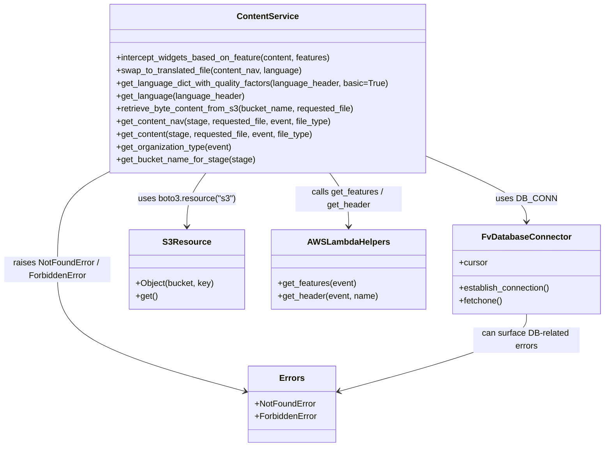

# Diagram: common/support_service/support_service/common/__init__.py

> Auto-generated by Obscura crawlers

## Mermaid

### SVG

<svg id="container" width="1127.75" xmlns="http://www.w3.org/2000/svg" class="classDiagram" height="842" viewBox="0 0 1127.75 842" role="graphics-document document" aria-roledescription="class"><g><defs><marker id="container_class-aggregationStart" class="marker aggregation class" refX="18" refY="7" markerWidth="190" markerHeight="240" orient="auto"><path d="M 18,7 L9,13 L1,7 L9,1 Z"></path></marker></defs><defs><marker id="container_class-aggregationEnd" class="marker aggregation class" refX="1" refY="7" markerWidth="20" markerHeight="28" orient="auto"><path d="M 18,7 L9,13 L1,7 L9,1 Z"></path></marker></defs><defs><marker id="container_class-extensionStart" class="marker extension class" refX="18" refY="7" markerWidth="190" markerHeight="240" orient="auto"><path d="M 1,7 L18,13 V 1 Z"></path></marker></defs><defs><marker id="container_class-extensionEnd" class="marker extension class" refX="1" refY="7" markerWidth="20" markerHeight="28" orient="auto"><path d="M 1,1 V 13 L18,7 Z"></path></marker></defs><defs><marker id="container_class-compositionStart" class="marker composition class" refX="18" refY="7" markerWidth="190" markerHeight="240" orient="auto"><path d="M 18,7 L9,13 L1,7 L9,1 Z"></path></marker></defs><defs><marker id="container_class-compositionEnd" class="marker composition class" refX="1" refY="7" markerWidth="20" markerHeight="28" orient="auto"><path d="M 18,7 L9,13 L1,7 L9,1 Z"></path></marker></defs><defs><marker id="container_class-dependencyStart" class="marker dependency class" refX="6" refY="7" markerWidth="190" markerHeight="240" orient="auto"><path d="M 5,7 L9,13 L1,7 L9,1 Z"></path></marker></defs><defs><marker id="container_class-dependencyEnd" class="marker dependency class" refX="13" refY="7" markerWidth="20" markerHeight="28" orient="auto"><path d="M 18,7 L9,13 L14,7 L9,1 Z"></path></marker></defs><defs><marker id="container_class-lollipopStart" class="marker lollipop class" refX="13" refY="7" markerWidth="190" markerHeight="240" orient="auto"><circle stroke="black" fill="transparent" cx="7" cy="7" r="6"></circle></marker></defs><defs><marker id="container_class-lollipopEnd" class="marker lollipop class" refX="1" refY="7" markerWidth="190" markerHeight="240" orient="auto"><circle stroke="black" fill="transparent" cx="7" cy="7" r="6"></circle></marker></defs><g class="root"><g class="clusters"></g><g class="edgePaths"><path d="M795.9,294.874L826.828,308.228C857.755,321.583,919.61,348.291,950.537,368.812C981.465,389.333,981.465,403.667,981.465,410.833L981.465,418" id="id_ContentService_FvDatabaseConnector_1" class="edge-thickness-normal edge-pattern-solid relation" style=";;;" data-edge="true" data-et="edge" data-id="id_ContentService_FvDatabaseConnector_1" data-points="W3sieCI6Nzk1LjkwMDM5MDYyNSwieSI6Mjk0Ljg3NDAxNjI1ODg0NDA1fSx7IngiOjk4MS40NjQ4NDM3NSwieSI6Mzc1fSx7IngiOjk4MS40NjQ4NDM3NSwieSI6NDI0fV0=" marker-end="url(#container_class-dependencyEnd)"></path><path d="M385.058,326L379.167,334.167C373.276,342.333,361.493,358.667,355.602,375.5C349.711,392.333,349.711,409.667,349.711,418.333L349.711,427" id="id_ContentService_S3Resource_2" class="edge-thickness-normal edge-pattern-solid relation" style=";;;" data-edge="true" data-et="edge" data-id="id_ContentService_S3Resource_2" data-points="W3sieCI6Mzg1LjA1ODA1ODUxODYyOTgsInkiOjMyNn0seyJ4IjozNDkuNzEwOTM3NSwieSI6Mzc1fSx7IngiOjM0OS43MTA5Mzc1LCJ5Ijo0MzN9XQ==" marker-end="url(#container_class-dependencyEnd)"></path><path d="M614.454,326L620.345,334.167C626.236,342.333,638.018,358.667,643.91,375.5C649.801,392.333,649.801,409.667,649.801,418.333L649.801,427" id="id_ContentService_AWSLambdaHelpers_3" class="edge-thickness-normal edge-pattern-solid relation" style=";;;" data-edge="true" data-et="edge" data-id="id_ContentService_AWSLambdaHelpers_3" data-points="W3sieCI6NjE0LjQ1MzY2MDIzMTM3MDIsInkiOjMyNn0seyJ4Ijo2NDkuODAwNzgxMjUsInkiOjM3NX0seyJ4Ijo2NDkuODAwNzgxMjUsInkiOjQzM31d" marker-end="url(#container_class-dependencyEnd)"></path><path d="M203.611,324.236L187.676,332.697C171.741,341.157,139.87,358.079,123.935,388.706C108,419.333,108,463.667,108,508C108,552.333,108,596.667,166.175,634.951C224.351,673.236,340.701,705.472,398.877,721.59L457.052,737.707" id="id_ContentService_Errors_4" class="edge-thickness-normal edge-pattern-solid relation" style=";;;" data-edge="true" data-et="edge" data-id="id_ContentService_Errors_4" data-points="W3sieCI6MjAzLjYxMTMyODEyNSwieSI6MzI0LjIzNTg0MjIzNjcyNDd9LHsieCI6MTA4LCJ5IjozNzV9LHsieCI6MTA4LCJ5Ijo1MDh9LHsieCI6MTA4LCJ5Ijo2NDF9LHsieCI6NDYyLjgzMzk4NDM3NSwieSI6NzM5LjMwOTQyMjMzNDcyMTF9XQ==" marker-end="url(#container_class-dependencyEnd)"></path><path d="M981.465,592L981.465,600.167C981.465,608.333,981.465,624.667,923.29,648.951C865.114,673.236,748.764,705.472,690.588,721.59L632.413,737.707" id="id_FvDatabaseConnector_Errors_5" class="edge-thickness-normal edge-pattern-solid relation" style=";;;" data-edge="true" data-et="edge" data-id="id_FvDatabaseConnector_Errors_5" data-points="W3sieCI6OTgxLjQ2NDg0Mzc1LCJ5Ijo1OTJ9LHsieCI6OTgxLjQ2NDg0Mzc1LCJ5Ijo2NDF9LHsieCI6NjI2LjYzMDg1OTM3NSwieSI6NzM5LjMwOTQyMjMzNDcyMTF9XQ==" marker-end="url(#container_class-dependencyEnd)"></path></g><g class="edgeLabels"><g class="edgeLabel" transform="translate(981.46484375, 375)"><g class="label" data-id="id_ContentService_FvDatabaseConnector_1" transform="translate(-53.09375, -12)"><foreignObject width="106.1875" height="24">

uses DB_CONN

</foreignObject></g></g><g class="edgeLabel" transform="translate(349.7109375, 375)"><g class="label" data-id="id_ContentService_S3Resource_2" transform="translate(-91.5859375, -12)"><foreignObject width="183.171875" height="24">

uses boto3.resource("s3")

</foreignObject></g></g><g class="edgeLabel" transform="translate(649.80078125, 375)"><g class="label" data-id="id_ContentService_AWSLambdaHelpers_3" transform="translate(-100, -24)"><foreignObject width="200" height="48">

calls get_features / get_header

</foreignObject></g></g><g class="edgeLabel" transform="translate(108, 508)"><g class="label" data-id="id_ContentService_Errors_4" transform="translate(-100, -24)"><foreignObject width="200" height="48">

raises NotFoundError / ForbiddenError

</foreignObject></g></g><g class="edgeLabel" transform="translate(981.46484375, 641)"><g class="label" data-id="id_FvDatabaseConnector_Errors_5" transform="translate(-100, -24)"><foreignObject width="200" height="48">

can surface DB-related errors

</foreignObject></g></g></g><g class="nodes"><g class="node default" id="classId-ContentService-0" transform="translate(499.755859375, 167)"><g class="basic label-container"><path d="M-296.14453125 -159 L296.14453125 -159 L296.14453125 159 L-296.14453125 159" stroke="none" stroke-width="0" fill="#ECECFF" style=""></path><path d="M-296.14453125 -159 C-97.91134387520748 -159, 100.32184349958504 -159, 296.14453125 -159 M-296.14453125 -159 C-66.19623312947897 -159, 163.75206499104206 -159, 296.14453125 -159 M296.14453125 -159 C296.14453125 -79.42181619974154, 296.14453125 0.15636760051691567, 296.14453125 159 M296.14453125 -159 C296.14453125 -39.671829502025545, 296.14453125 79.65634099594891, 296.14453125 159 M296.14453125 159 C165.84321779922544 159, 35.541904348450885 159, -296.14453125 159 M296.14453125 159 C63.01561203577475 159, -170.1133071784505 159, -296.14453125 159 M-296.14453125 159 C-296.14453125 58.43603233344345, -296.14453125 -42.1279353331131, -296.14453125 -159 M-296.14453125 159 C-296.14453125 51.99423699113187, -296.14453125 -55.01152601773626, -296.14453125 -159" stroke="#9370DB" stroke-width="1.3" fill="none" stroke-dasharray="0 0" style=""></path></g><g class="annotation-group text" transform="translate(0, -135)"></g><g class="label-group text" transform="translate(-55.4453125, -135)"><g class="label" style="font-weight: bolder" transform="translate(0,-12)"><foreignObject width="110.890625" height="24">

ContentService

</foreignObject></g></g><g class="members-group text" transform="translate(-284.14453125, -87)"></g><g class="methods-group text" transform="translate(-284.14453125, -57)"><g class="label" style="" transform="translate(0,-12)"><foreignObject width="408.484375" height="24">

+intercept_widgets_based_on_feature(content, features)

</foreignObject></g><g class="label" style="" transform="translate(0,12)"><foreignObject width="352.46875" height="24">

+swap_to_translated_file(content_nav, language)

</foreignObject></g><g class="label" style="" transform="translate(0,36)"><foreignObject width="512.84375" height="24">

+get_language_dict_with_quality_factors(language_header, basic=True)

</foreignObject></g><g class="label" style="" transform="translate(0,60)"><foreignObject width="239.15625" height="24">

+get_language(language_header)

</foreignObject></g><g class="label" style="" transform="translate(0,84)"><foreignObject width="452.609375" height="24">

+retrieve_byte_content_from_s3(bucket_name, requested_file)

</foreignObject></g><g class="label" style="" transform="translate(0,108)"><foreignObject width="407.03125" height="24">

+get_content_nav(stage, requested_file, event, file_type)

</foreignObject></g><g class="label" style="" transform="translate(0,132)"><foreignObject width="373" height="24">

+get_content(stage, requested_file, event, file_type)

</foreignObject></g><g class="label" style="" transform="translate(0,156)"><foreignObject width="219.40625" height="24">

+get_organization_type(event)

</foreignObject></g><g class="label" style="" transform="translate(0,180)"><foreignObject width="259.453125" height="24">

+get_bucket_name_for_stage(stage)

</foreignObject></g></g><g class="divider" style=""><path d="M-296.14453125 -111 C-176.26569112428405 -111, -56.38685099856812 -111, 296.14453125 -111 M-296.14453125 -111 C-152.3162802923534 -111, -8.488029334706823 -111, 296.14453125 -111" stroke="#9370DB" stroke-width="1.3" fill="none" stroke-dasharray="0 0" style=""></path></g><g class="divider" style=""><path d="M-296.14453125 -87 C-138.08995754100812 -87, 19.964616167983763 -87, 296.14453125 -87 M-296.14453125 -87 C-112.42929280567398 -87, 71.28594563865204 -87, 296.14453125 -87" stroke="#9370DB" stroke-width="1.3" fill="none" stroke-dasharray="0 0" style=""></path></g></g><g class="node default" id="classId-FvDatabaseConnector-1" transform="translate(981.46484375, 508)"><g class="basic label-container"><path d="M-138.28515625 -84 L138.28515625 -84 L138.28515625 84 L-138.28515625 84" stroke="none" stroke-width="0" fill="#ECECFF" style=""></path><path d="M-138.28515625 -84 C-39.02586921254678 -84, 60.23341782490644 -84, 138.28515625 -84 M-138.28515625 -84 C-63.24971159464508 -84, 11.785733060709845 -84, 138.28515625 -84 M138.28515625 -84 C138.28515625 -28.206067173645287, 138.28515625 27.587865652709425, 138.28515625 84 M138.28515625 -84 C138.28515625 -20.69195105921448, 138.28515625 42.61609788157104, 138.28515625 84 M138.28515625 84 C41.49885196130087 84, -55.287452327398256 84, -138.28515625 84 M138.28515625 84 C40.98025271285236 84, -56.324650824295276 84, -138.28515625 84 M-138.28515625 84 C-138.28515625 46.8676828826655, -138.28515625 9.735365765330997, -138.28515625 -84 M-138.28515625 84 C-138.28515625 19.613062178396433, -138.28515625 -44.773875643207134, -138.28515625 -84" stroke="#9370DB" stroke-width="1.3" fill="none" stroke-dasharray="0 0" style=""></path></g><g class="annotation-group text" transform="translate(0, -60)"></g><g class="label-group text" transform="translate(-79.3046875, -60)"><g class="label" style="font-weight: bolder" transform="translate(0,-12)"><foreignObject width="158.609375" height="24">

FvDatabaseConnector

</foreignObject></g></g><g class="members-group text" transform="translate(-126.28515625, -12)"><g class="label" style="" transform="translate(0,-12)"><foreignObject width="53.71875" height="24">

+cursor

</foreignObject></g></g><g class="methods-group text" transform="translate(-126.28515625, 36)"><g class="label" style="" transform="translate(0,-12)"><foreignObject width="173.265625" height="24">

+establish_connection()

</foreignObject></g><g class="label" style="" transform="translate(0,12)"><foreignObject width="82.046875" height="24">

+fetchone()

</foreignObject></g></g><g class="divider" style=""><path d="M-138.28515625 -36 C-46.846755826316596 -36, 44.59164459736681 -36, 138.28515625 -36 M-138.28515625 -36 C-44.557750632226146 -36, 49.16965498554771 -36, 138.28515625 -36" stroke="#9370DB" stroke-width="1.3" fill="none" stroke-dasharray="0 0" style=""></path></g><g class="divider" style=""><path d="M-138.28515625 12 C-63.52210213963403 12, 11.240951970731942 12, 138.28515625 12 M-138.28515625 12 C-36.595768157986214 12, 65.09361993402757 12, 138.28515625 12" stroke="#9370DB" stroke-width="1.3" fill="none" stroke-dasharray="0 0" style=""></path></g></g><g class="node default" id="classId-S3Resource-2" transform="translate(349.7109375, 508)"><g class="basic label-container"><path d="M-106.7109375 -75 L106.7109375 -75 L106.7109375 75 L-106.7109375 75" stroke="none" stroke-width="0" fill="#ECECFF" style=""></path><path d="M-106.7109375 -75 C-35.543405370805516 -75, 35.62412675838897 -75, 106.7109375 -75 M-106.7109375 -75 C-63.13407106530251 -75, -19.557204630605014 -75, 106.7109375 -75 M106.7109375 -75 C106.7109375 -35.05058738174395, 106.7109375 4.898825236512096, 106.7109375 75 M106.7109375 -75 C106.7109375 -36.83917984492924, 106.7109375 1.3216403101415182, 106.7109375 75 M106.7109375 75 C31.024287175778454 75, -44.66236314844309 75, -106.7109375 75 M106.7109375 75 C23.066448784875448 75, -60.578039930249105 75, -106.7109375 75 M-106.7109375 75 C-106.7109375 31.64108557692574, -106.7109375 -11.717828846148521, -106.7109375 -75 M-106.7109375 75 C-106.7109375 28.322392526515998, -106.7109375 -18.355214946968005, -106.7109375 -75" stroke="#9370DB" stroke-width="1.3" fill="none" stroke-dasharray="0 0" style=""></path></g><g class="annotation-group text" transform="translate(0, -51)"></g><g class="label-group text" transform="translate(-42.140625, -51)"><g class="label" style="font-weight: bolder" transform="translate(0,-12)"><foreignObject width="84.28125" height="24">

S3Resource

</foreignObject></g></g><g class="members-group text" transform="translate(-94.7109375, -3)"></g><g class="methods-group text" transform="translate(-94.7109375, 27)"><g class="label" style="" transform="translate(0,-12)"><foreignObject width="147.28125" height="24">

+Object(bucket, key)

</foreignObject></g><g class="label" style="" transform="translate(0,12)"><foreignObject width="40.921875" height="24">

+get()

</foreignObject></g></g><g class="divider" style=""><path d="M-106.7109375 -27 C-61.06893517030113 -27, -15.426932840602262 -27, 106.7109375 -27 M-106.7109375 -27 C-33.32089797627175 -27, 40.069141547456496 -27, 106.7109375 -27" stroke="#9370DB" stroke-width="1.3" fill="none" stroke-dasharray="0 0" style=""></path></g><g class="divider" style=""><path d="M-106.7109375 -3 C-27.142975087968168 -3, 52.424987324063665 -3, 106.7109375 -3 M-106.7109375 -3 C-44.05239079100222 -3, 18.606155917995565 -3, 106.7109375 -3" stroke="#9370DB" stroke-width="1.3" fill="none" stroke-dasharray="0 0" style=""></path></g></g><g class="node default" id="classId-AWSLambdaHelpers-3" transform="translate(649.80078125, 508)"><g class="basic label-container"><path d="M-143.37890625 -75 L143.37890625 -75 L143.37890625 75 L-143.37890625 75" stroke="none" stroke-width="0" fill="#ECECFF" style=""></path><path d="M-143.37890625 -75 C-52.542598701337596 -75, 38.29370884732481 -75, 143.37890625 -75 M-143.37890625 -75 C-34.420795970448026 -75, 74.53731430910395 -75, 143.37890625 -75 M143.37890625 -75 C143.37890625 -43.39528214848542, 143.37890625 -11.790564296970842, 143.37890625 75 M143.37890625 -75 C143.37890625 -36.450547564043376, 143.37890625 2.0989048719132484, 143.37890625 75 M143.37890625 75 C40.52151879928857 75, -62.33586865142286 75, -143.37890625 75 M143.37890625 75 C49.90639165335837 75, -43.56612294328326 75, -143.37890625 75 M-143.37890625 75 C-143.37890625 28.26060169485504, -143.37890625 -18.47879661028992, -143.37890625 -75 M-143.37890625 75 C-143.37890625 29.525003220735563, -143.37890625 -15.949993558528874, -143.37890625 -75" stroke="#9370DB" stroke-width="1.3" fill="none" stroke-dasharray="0 0" style=""></path></g><g class="annotation-group text" transform="translate(0, -51)"></g><g class="label-group text" transform="translate(-73.4140625, -51)"><g class="label" style="font-weight: bolder" transform="translate(0,-12)"><foreignObject width="146.828125" height="24">

AWSLambdaHelpers

</foreignObject></g></g><g class="members-group text" transform="translate(-131.37890625, -3)"></g><g class="methods-group text" transform="translate(-131.37890625, 27)"><g class="label" style="" transform="translate(0,-12)"><foreignObject width="148.703125" height="24">

+get_features(event)

</foreignObject></g><g class="label" style="" transform="translate(0,12)"><foreignObject width="189.34375" height="24">

+get_header(event, name)

</foreignObject></g></g><g class="divider" style=""><path d="M-143.37890625 -27 C-83.2571076270786 -27, -23.135309004157193 -27, 143.37890625 -27 M-143.37890625 -27 C-33.01820672201052 -27, 77.34249280597896 -27, 143.37890625 -27" stroke="#9370DB" stroke-width="1.3" fill="none" stroke-dasharray="0 0" style=""></path></g><g class="divider" style=""><path d="M-143.37890625 -3 C-39.575673197830014 -3, 64.22755985433997 -3, 143.37890625 -3 M-143.37890625 -3 C-78.468892557169 -3, -13.558878864337998 -3, 143.37890625 -3" stroke="#9370DB" stroke-width="1.3" fill="none" stroke-dasharray="0 0" style=""></path></g></g><g class="node default" id="classId-Errors-4" transform="translate(544.732421875, 762)"><g class="basic label-container"><path d="M-81.8984375 -72 L81.8984375 -72 L81.8984375 72 L-81.8984375 72" stroke="none" stroke-width="0" fill="#ECECFF" style=""></path><path d="M-81.8984375 -72 C-27.408391580986653 -72, 27.081654338026695 -72, 81.8984375 -72 M-81.8984375 -72 C-26.02465789384383 -72, 29.84912171231234 -72, 81.8984375 -72 M81.8984375 -72 C81.8984375 -37.07986381889915, 81.8984375 -2.159727637798298, 81.8984375 72 M81.8984375 -72 C81.8984375 -16.760038206399322, 81.8984375 38.479923587201355, 81.8984375 72 M81.8984375 72 C26.01094529482556 72, -29.87654691034888 72, -81.8984375 72 M81.8984375 72 C30.422220216072745 72, -21.05399706785451 72, -81.8984375 72 M-81.8984375 72 C-81.8984375 17.924448003900622, -81.8984375 -36.151103992198756, -81.8984375 -72 M-81.8984375 72 C-81.8984375 41.528449390984434, -81.8984375 11.056898781968876, -81.8984375 -72" stroke="#9370DB" stroke-width="1.3" fill="none" stroke-dasharray="0 0" style=""></path></g><g class="annotation-group text" transform="translate(0, -48)"></g><g class="label-group text" transform="translate(-21.953125, -48)"><g class="label" style="font-weight: bolder" transform="translate(0,-12)"><foreignObject width="43.90625" height="24">

Errors

</foreignObject></g></g><g class="members-group text" transform="translate(-69.8984375, 0)"><g class="label" style="" transform="translate(0,-12)"><foreignObject width="114.734375" height="24">

+NotFoundError

</foreignObject></g><g class="label" style="" transform="translate(0,12)"><foreignObject width="117.84375" height="24">

+ForbiddenError

</foreignObject></g></g><g class="methods-group text" transform="translate(-69.8984375, 72)"></g><g class="divider" style=""><path d="M-81.8984375 -24 C-38.42487869905976 -24, 5.048680101880478 -24, 81.8984375 -24 M-81.8984375 -24 C-47.82535698185867 -24, -13.752276463717337 -24, 81.8984375 -24" stroke="#9370DB" stroke-width="1.3" fill="none" stroke-dasharray="0 0" style=""></path></g><g class="divider" style=""><path d="M-81.8984375 48 C-32.51226456178712 48, 16.87390837642576 48, 81.8984375 48 M-81.8984375 48 C-48.445984999311165 48, -14.99353249862233 48, 81.8984375 48" stroke="#9370DB" stroke-width="1.3" fill="none" stroke-dasharray="0 0" style=""></path></g></g></g></g></g></svg>
