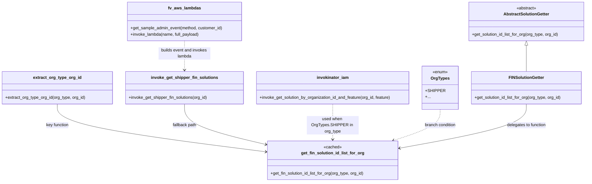

# Diagram: common/support_service/support_service/common/solution.py

> Auto-generated by Obscura crawlers

## Mermaid

### SVG

<svg id="container" width="2254.953125" xmlns="http://www.w3.org/2000/svg" class="classDiagram" height="704" viewBox="0 0 2254.953125 704" role="graphics-document document" aria-roledescription="class"><g><defs><marker id="container_class-aggregationStart" class="marker aggregation class" refX="18" refY="7" markerWidth="190" markerHeight="240" orient="auto"><path d="M 18,7 L9,13 L1,7 L9,1 Z"></path></marker></defs><defs><marker id="container_class-aggregationEnd" class="marker aggregation class" refX="1" refY="7" markerWidth="20" markerHeight="28" orient="auto"><path d="M 18,7 L9,13 L1,7 L9,1 Z"></path></marker></defs><defs><marker id="container_class-extensionStart" class="marker extension class" refX="18" refY="7" markerWidth="190" markerHeight="240" orient="auto"><path d="M 1,7 L18,13 V 1 Z"></path></marker></defs><defs><marker id="container_class-extensionEnd" class="marker extension class" refX="1" refY="7" markerWidth="20" markerHeight="28" orient="auto"><path d="M 1,1 V 13 L18,7 Z"></path></marker></defs><defs><marker id="container_class-compositionStart" class="marker composition class" refX="18" refY="7" markerWidth="190" markerHeight="240" orient="auto"><path d="M 18,7 L9,13 L1,7 L9,1 Z"></path></marker></defs><defs><marker id="container_class-compositionEnd" class="marker composition class" refX="1" refY="7" markerWidth="20" markerHeight="28" orient="auto"><path d="M 18,7 L9,13 L1,7 L9,1 Z"></path></marker></defs><defs><marker id="container_class-dependencyStart" class="marker dependency class" refX="6" refY="7" markerWidth="190" markerHeight="240" orient="auto"><path d="M 5,7 L9,13 L1,7 L9,1 Z"></path></marker></defs><defs><marker id="container_class-dependencyEnd" class="marker dependency class" refX="13" refY="7" markerWidth="20" markerHeight="28" orient="auto"><path d="M 18,7 L9,13 L14,7 L9,1 Z"></path></marker></defs><defs><marker id="container_class-lollipopStart" class="marker lollipop class" refX="13" refY="7" markerWidth="190" markerHeight="240" orient="auto"><circle stroke="black" fill="transparent" cx="7" cy="7" r="6"></circle></marker></defs><defs><marker id="container_class-lollipopEnd" class="marker lollipop class" refX="1" refY="7" markerWidth="190" markerHeight="240" orient="auto"><circle stroke="black" fill="transparent" cx="7" cy="7" r="6"></circle></marker></defs><g class="root"><g class="clusters"></g><g class="edgePaths"><path d="M2023.305,175.25L2023.305,180.542C2023.305,185.833,2023.305,196.417,2023.305,213.375C2023.305,230.333,2023.305,253.667,2023.305,265.333L2023.305,277" id="id_AbstractSolutionGetter_FINSolutionGetter_1" class="edge-thickness-normal edge-pattern-solid relation" style=";;;" data-edge="true" data-et="edge" data-id="id_AbstractSolutionGetter_FINSolutionGetter_1" data-points="W3sieCI6MjAyMy4zMDQ2ODc1LCJ5IjoxNTh9LHsieCI6MjAyMy4zMDQ2ODc1LCJ5IjoyMDd9LHsieCI6MjAyMy4zMDQ2ODc1LCJ5IjoyNzd9XQ==" marker-start="url(#container_class-extensionStart)"></path><path d="M220.273,403L220.273,416.667C220.273,430.333,220.273,457.667,354.556,488.49C488.838,519.313,757.402,553.626,891.684,570.782L1025.966,587.939" id="id_extract_org_type_org_id_get_fin_solution_id_list_for_org_2" class="edge-thickness-normal edge-pattern-solid relation" style=";;;" data-edge="true" data-et="edge" data-id="id_extract_org_type_org_id_get_fin_solution_id_list_for_org_2" data-points="W3sieCI6MjIwLjI3MzQzNzUsInkiOjQwM30seyJ4IjoyMjAuMjczNDM3NSwieSI6NDg1fSx7IngiOjEwMzEuOTE3OTY4NzUsInkiOjU4OC42OTkxMTQxMzQ5NDIxfV0=" marker-end="url(#container_class-dependencyEnd)"></path><path d="M709.77,403L709.77,416.667C709.77,430.333,709.77,457.667,762.488,483.803C815.206,509.94,920.643,534.879,973.361,547.349L1026.079,559.819" id="id_invoke_get_shipper_fin_solutions_get_fin_solution_id_list_for_org_3" class="edge-thickness-normal edge-pattern-solid relation" style=";;;" data-edge="true" data-et="edge" data-id="id_invoke_get_shipper_fin_solutions_get_fin_solution_id_list_for_org_3" data-points="W3sieCI6NzA5Ljc2OTUzMTI1LCJ5Ijo0MDN9LHsieCI6NzA5Ljc2OTUzMTI1LCJ5Ijo0ODV9LHsieCI6MTAzMS45MTc5Njg3NSwieSI6NTYxLjE5OTc2NzY0ODgzNzJ9XQ==" marker-end="url(#container_class-dependencyEnd)"></path><path d="M1284.734,403L1284.734,416.667C1284.734,430.333,1284.734,457.667,1284.734,480.5C1284.734,503.333,1284.734,521.667,1284.734,530.833L1284.734,540" id="id_invokinator_iam_get_fin_solution_id_list_for_org_4" class="edge-thickness-normal edge-pattern-dashed relation" style=";;;" data-edge="true" data-et="edge" data-id="id_invokinator_iam_get_fin_solution_id_list_for_org_4" data-points="W3sieCI6MTI4NC43MzQzNzUsInkiOjQwM30seyJ4IjoxMjg0LjczNDM3NSwieSI6NDg1fSx7IngiOjEyODQuNzM0Mzc1LCJ5Ijo1NDZ9XQ==" marker-end="url(#container_class-dependencyEnd)"></path><path d="M709.77,158L709.77,166.167C709.77,174.333,709.77,190.667,709.77,209.5C709.77,228.333,709.77,249.667,709.77,260.333L709.77,271" id="id_fv_aws_lambdas_invoke_get_shipper_fin_solutions_5" class="edge-thickness-normal edge-pattern-dashed relation" style=";;;" data-edge="true" data-et="edge" data-id="id_fv_aws_lambdas_invoke_get_shipper_fin_solutions_5" data-points="W3sieCI6NzA5Ljc2OTUzMTI1LCJ5IjoxNTh9LHsieCI6NzA5Ljc2OTUzMTI1LCJ5IjoyMDd9LHsieCI6NzA5Ljc2OTUzMTI1LCJ5IjoyNzd9XQ==" marker-end="url(#container_class-dependencyEnd)"></path><path d="M1695.852,424L1695.852,434.167C1695.852,444.333,1695.852,464.667,1666.068,484.686C1636.284,504.705,1576.717,524.41,1546.933,534.263L1517.15,544.116" id="id_OrgTypes_get_fin_solution_id_list_for_org_6" class="edge-thickness-normal edge-pattern-dashed relation" style=";;;" data-edge="true" data-et="edge" data-id="id_OrgTypes_get_fin_solution_id_list_for_org_6" data-points="W3sieCI6MTY5NS44NTE1NjI1LCJ5Ijo0MjR9LHsieCI6MTY5NS44NTE1NjI1LCJ5Ijo0ODV9LHsieCI6MTUxMS40NTM0MTIyMjQyNjQ2LCJ5Ijo1NDZ9XQ==" marker-end="url(#container_class-dependencyEnd)"></path><path d="M2023.305,403L2023.305,416.667C2023.305,430.333,2023.305,457.667,1943.329,486.06C1863.354,514.453,1703.403,543.907,1623.427,558.633L1543.452,573.36" id="id_FINSolutionGetter_get_fin_solution_id_list_for_org_7" class="edge-thickness-normal edge-pattern-solid relation" style=";;;" data-edge="true" data-et="edge" data-id="id_FINSolutionGetter_get_fin_solution_id_list_for_org_7" data-points="W3sieCI6MjAyMy4zMDQ2ODc1LCJ5Ijo0MDN9LHsieCI6MjAyMy4zMDQ2ODc1LCJ5Ijo0ODV9LHsieCI6MTUzNy41NTA3ODEyNSwieSI6NTc0LjQ0NjUwMjQyNzYyMDl9XQ==" marker-end="url(#container_class-dependencyEnd)"></path></g><g class="edgeLabels"><g class="edgeLabel"><g class="label" data-id="id_AbstractSolutionGetter_FINSolutionGetter_1" transform="translate(0, 0)"><foreignObject width="0" height="0">

</foreignObject></g></g><g class="edgeLabel" transform="translate(220.2734375, 485)"><g class="label" data-id="id_extract_org_type_org_id_get_fin_solution_id_list_for_org_2" transform="translate(-44.765625, -12)"><foreignObject width="89.53125" height="24">

key function

</foreignObject></g></g><g class="edgeLabel" transform="translate(709.76953125, 485)"><g class="label" data-id="id_invoke_get_shipper_fin_solutions_get_fin_solution_id_list_for_org_3" transform="translate(-47.1328125, -12)"><foreignObject width="94.265625" height="24">

fallback path

</foreignObject></g></g><g class="edgeLabel" transform="translate(1284.734375, 485)"><g class="label" data-id="id_invokinator_iam_get_fin_solution_id_list_for_org_4" transform="translate(-100, -36)"><foreignObject width="200" height="72">

used when OrgTypes.SHIPPER in org_type

</foreignObject></g></g><g class="edgeLabel" transform="translate(709.76953125, 207)"><g class="label" data-id="id_fv_aws_lambdas_invoke_get_shipper_fin_solutions_5" transform="translate(-100, -24)"><foreignObject width="200" height="48">

builds event and invokes lambda

</foreignObject></g></g><g class="edgeLabel" transform="translate(1695.8515625, 485)"><g class="label" data-id="id_OrgTypes_get_fin_solution_id_list_for_org_6" transform="translate(-61.8046875, -12)"><foreignObject width="123.609375" height="24">

branch condition

</foreignObject></g></g><g class="edgeLabel" transform="translate(2023.3046875, 485)"><g class="label" data-id="id_FINSolutionGetter_get_fin_solution_id_list_for_org_7" transform="translate(-77.0703125, -12)"><foreignObject width="154.140625" height="24">

delegates to function

</foreignObject></g></g></g><g class="nodes"><g class="node default" id="classId-AbstractSolutionGetter-0" transform="translate(2023.3046875, 83)"><g class="basic label-container"><path d="M-223.6484375 -75 L223.6484375 -75 L223.6484375 75 L-223.6484375 75" stroke="none" stroke-width="0" fill="#ECECFF" style=""></path><path d="M-223.6484375 -75 C-84.92356934492895 -75, 53.8012988101421 -75, 223.6484375 -75 M-223.6484375 -75 C-108.61435296431982 -75, 6.419731571360359 -75, 223.6484375 -75 M223.6484375 -75 C223.6484375 -21.321970586112727, 223.6484375 32.35605882777455, 223.6484375 75 M223.6484375 -75 C223.6484375 -31.644935468358682, 223.6484375 11.710129063282636, 223.6484375 75 M223.6484375 75 C125.96121854143581 75, 28.273999582871625 75, -223.6484375 75 M223.6484375 75 C77.18728637036739 75, -69.27386475926522 75, -223.6484375 75 M-223.6484375 75 C-223.6484375 40.280248742662344, -223.6484375 5.560497485324689, -223.6484375 -75 M-223.6484375 75 C-223.6484375 39.66081761246746, -223.6484375 4.321635224934923, -223.6484375 -75" stroke="#9370DB" stroke-width="1.3" fill="none" stroke-dasharray="0 0" style=""></path></g><g class="annotation-group text" transform="translate(-38.609375, -51)"><g class="label" style="" transform="translate(0,-12)"><foreignObject width="77.21875" height="24">

«abstract»

</foreignObject></g></g><g class="label-group text" transform="translate(-84.75, -27)"><g class="label" style="font-weight: bolder" transform="translate(0,-12)"><foreignObject width="169.5" height="24">

AbstractSolutionGetter

</foreignObject></g></g><g class="members-group text" transform="translate(-211.6484375, 21)"></g><g class="methods-group text" transform="translate(-211.6484375, 51)"><g class="label" style="" transform="translate(0,-12)"><foreignObject width="338.546875" height="24">

+get_solution_id_list_for_org(org_type, org_id)

</foreignObject></g></g><g class="divider" style=""><path d="M-223.6484375 -3 C-87.85962229662704 -3, 47.929192906745925 -3, 223.6484375 -3 M-223.6484375 -3 C-73.5604030604562 -3, 76.52763137908761 -3, 223.6484375 -3" stroke="#9370DB" stroke-width="1.3" fill="none" stroke-dasharray="0 0" style=""></path></g><g class="divider" style=""><path d="M-223.6484375 21 C-69.21462175360415 21, 85.2191939927917 21, 223.6484375 21 M-223.6484375 21 C-45.830252676219004 21, 131.987932147562 21, 223.6484375 21" stroke="#9370DB" stroke-width="1.3" fill="none" stroke-dasharray="0 0" style=""></path></g></g><g class="node default" id="classId-FINSolutionGetter-1" transform="translate(2023.3046875, 340)"><g class="basic label-container"><path d="M-214.078125 -63 L214.078125 -63 L214.078125 63 L-214.078125 63" stroke="none" stroke-width="0" fill="#ECECFF" style=""></path><path d="M-214.078125 -63 C-106.18540029626139 -63, 1.7073244074772163 -63, 214.078125 -63 M-214.078125 -63 C-53.257389823803464 -63, 107.56334535239307 -63, 214.078125 -63 M214.078125 -63 C214.078125 -29.313339574645674, 214.078125 4.373320850708652, 214.078125 63 M214.078125 -63 C214.078125 -17.07432829616014, 214.078125 28.85134340767972, 214.078125 63 M214.078125 63 C107.71446714816221 63, 1.350809296324428 63, -214.078125 63 M214.078125 63 C58.398597750803276 63, -97.28092949839345 63, -214.078125 63 M-214.078125 63 C-214.078125 32.7700191669355, -214.078125 2.5400383338709887, -214.078125 -63 M-214.078125 63 C-214.078125 16.704203713939975, -214.078125 -29.59159257212005, -214.078125 -63" stroke="#9370DB" stroke-width="1.3" fill="none" stroke-dasharray="0 0" style=""></path></g><g class="annotation-group text" transform="translate(0, -39)"></g><g class="label-group text" transform="translate(-65.609375, -39)"><g class="label" style="font-weight: bolder" transform="translate(0,-12)"><foreignObject width="131.21875" height="24">

FINSolutionGetter

</foreignObject></g></g><g class="members-group text" transform="translate(-202.078125, 9)"></g><g class="methods-group text" transform="translate(-202.078125, 39)"><g class="label" style="" transform="translate(0,-12)"><foreignObject width="338.546875" height="24">

+get_solution_id_list_for_org(org_type, org_id)

</foreignObject></g></g><g class="divider" style=""><path d="M-214.078125 -15 C-97.81355885368406 -15, 18.451007292631886 -15, 214.078125 -15 M-214.078125 -15 C-62.23111560360189 -15, 89.61589379279621 -15, 214.078125 -15" stroke="#9370DB" stroke-width="1.3" fill="none" stroke-dasharray="0 0" style=""></path></g><g class="divider" style=""><path d="M-214.078125 9 C-128.4438091853608 9, -42.80949337072158 9, 214.078125 9 M-214.078125 9 C-55.27367640978801 9, 103.53077218042398 9, 214.078125 9" stroke="#9370DB" stroke-width="1.3" fill="none" stroke-dasharray="0 0" style=""></path></g></g><g class="node default" id="classId-get_fin_solution_id_list_for_org-2" transform="translate(1284.734375, 621)"><g class="basic label-container"><path d="M-252.81640625 -75 L252.81640625 -75 L252.81640625 75 L-252.81640625 75" stroke="none" stroke-width="0" fill="#ECECFF" style=""></path><path d="M-252.81640625 -75 C-148.6318015383623 -75, -44.44719682672462 -75, 252.81640625 -75 M-252.81640625 -75 C-119.2586646215731 -75, 14.299077006853793 -75, 252.81640625 -75 M252.81640625 -75 C252.81640625 -31.283220188752402, 252.81640625 12.433559622495196, 252.81640625 75 M252.81640625 -75 C252.81640625 -41.78065505503735, 252.81640625 -8.5613101100747, 252.81640625 75 M252.81640625 75 C141.2452849118947 75, 29.67416357378937 75, -252.81640625 75 M252.81640625 75 C85.37463438492446 75, -82.06713748015108 75, -252.81640625 75 M-252.81640625 75 C-252.81640625 40.34243787685396, -252.81640625 5.684875753707914, -252.81640625 -75 M-252.81640625 75 C-252.81640625 28.34209680266759, -252.81640625 -18.31580639466482, -252.81640625 -75" stroke="#9370DB" stroke-width="1.3" fill="none" stroke-dasharray="0 0" style=""></path></g><g class="annotation-group text" transform="translate(-34.7265625, -51)"><g class="label" style="" transform="translate(0,-12)"><foreignObject width="69.453125" height="24">

«cached»

</foreignObject></g></g><g class="label-group text" transform="translate(-116.5078125, -27)"><g class="label" style="font-weight: bolder" transform="translate(0,-12)"><foreignObject width="233.015625" height="24">

get_fin_solution_id_list_for_org

</foreignObject></g></g><g class="members-group text" transform="translate(-240.81640625, 21)"></g><g class="methods-group text" transform="translate(-240.81640625, 51)"><g class="label" style="" transform="translate(0,-12)"><foreignObject width="365.125" height="24">

+get_fin_solution_id_list_for_org(org_type, org_id)

</foreignObject></g></g><g class="divider" style=""><path d="M-252.81640625 -3 C-137.11085102489972 -3, -21.405295799799433 -3, 252.81640625 -3 M-252.81640625 -3 C-96.88527119102991 -3, 59.04586386794017 -3, 252.81640625 -3" stroke="#9370DB" stroke-width="1.3" fill="none" stroke-dasharray="0 0" style=""></path></g><g class="divider" style=""><path d="M-252.81640625 21 C-84.25100647554083 21, 84.31439329891833 21, 252.81640625 21 M-252.81640625 21 C-101.05837872541872 21, 50.69964879916256 21, 252.81640625 21" stroke="#9370DB" stroke-width="1.3" fill="none" stroke-dasharray="0 0" style=""></path></g></g><g class="node default" id="classId-invoke_get_shipper_fin_solutions-3" transform="translate(709.76953125, 340)"><g class="basic label-container"><path d="M-227.22265625 -63 L227.22265625 -63 L227.22265625 63 L-227.22265625 63" stroke="none" stroke-width="0" fill="#ECECFF" style=""></path><path d="M-227.22265625 -63 C-127.71678380242697 -63, -28.21091135485395 -63, 227.22265625 -63 M-227.22265625 -63 C-124.35271655212262 -63, -21.48277685424523 -63, 227.22265625 -63 M227.22265625 -63 C227.22265625 -16.91218992351265, 227.22265625 29.1756201529747, 227.22265625 63 M227.22265625 -63 C227.22265625 -22.464426198365196, 227.22265625 18.07114760326961, 227.22265625 63 M227.22265625 63 C116.93754323026089 63, 6.652430210521771 63, -227.22265625 63 M227.22265625 63 C76.51144369625072 63, -74.19976885749855 63, -227.22265625 63 M-227.22265625 63 C-227.22265625 25.22680395782111, -227.22265625 -12.546392084357777, -227.22265625 -63 M-227.22265625 63 C-227.22265625 14.210849851586069, -227.22265625 -34.57830029682786, -227.22265625 -63" stroke="#9370DB" stroke-width="1.3" fill="none" stroke-dasharray="0 0" style=""></path></g><g class="annotation-group text" transform="translate(0, -39)"></g><g class="label-group text" transform="translate(-123.1171875, -39)"><g class="label" style="font-weight: bolder" transform="translate(0,-12)"><foreignObject width="246.234375" height="24">

invoke_get_shipper_fin_solutions

</foreignObject></g></g><g class="members-group text" transform="translate(-215.22265625, 9)"></g><g class="methods-group text" transform="translate(-215.22265625, 39)"><g class="label" style="" transform="translate(0,-12)"><foreignObject width="307.328125" height="24">

+invoke_get_shipper_fin_solutions(org_id)

</foreignObject></g></g><g class="divider" style=""><path d="M-227.22265625 -15 C-90.61911742571021 -15, 45.98442139857957 -15, 227.22265625 -15 M-227.22265625 -15 C-132.26449782289018 -15, -37.306339395780384 -15, 227.22265625 -15" stroke="#9370DB" stroke-width="1.3" fill="none" stroke-dasharray="0 0" style=""></path></g><g class="divider" style=""><path d="M-227.22265625 9 C-134.8238408137262 9, -42.425025377452414 9, 227.22265625 9 M-227.22265625 9 C-126.28843071262885 9, -25.354205175257704 9, 227.22265625 9" stroke="#9370DB" stroke-width="1.3" fill="none" stroke-dasharray="0 0" style=""></path></g></g><g class="node default" id="classId-extract_org_type_org_id-4" transform="translate(220.2734375, 340)"><g class="basic label-container"><path d="M-212.2734375 -63 L212.2734375 -63 L212.2734375 63 L-212.2734375 63" stroke="none" stroke-width="0" fill="#ECECFF" style=""></path><path d="M-212.2734375 -63 C-77.11602348059802 -63, 58.04139053880397 -63, 212.2734375 -63 M-212.2734375 -63 C-103.29734593961246 -63, 5.678745620775089 -63, 212.2734375 -63 M212.2734375 -63 C212.2734375 -27.009763696359265, 212.2734375 8.98047260728147, 212.2734375 63 M212.2734375 -63 C212.2734375 -19.355177341018702, 212.2734375 24.289645317962595, 212.2734375 63 M212.2734375 63 C48.308394686629015 63, -115.65664812674197 63, -212.2734375 63 M212.2734375 63 C62.02986437584207 63, -88.21370874831587 63, -212.2734375 63 M-212.2734375 63 C-212.2734375 35.17061584766786, -212.2734375 7.341231695335729, -212.2734375 -63 M-212.2734375 63 C-212.2734375 34.105379825129575, -212.2734375 5.210759650259156, -212.2734375 -63" stroke="#9370DB" stroke-width="1.3" fill="none" stroke-dasharray="0 0" style=""></path></g><g class="annotation-group text" transform="translate(0, -39)"></g><g class="label-group text" transform="translate(-89.6875, -39)"><g class="label" style="font-weight: bolder" transform="translate(0,-12)"><foreignObject width="179.375" height="24">

extract_org_type_org_id

</foreignObject></g></g><g class="members-group text" transform="translate(-200.2734375, 9)"></g><g class="methods-group text" transform="translate(-200.2734375, 39)"><g class="label" style="" transform="translate(0,-12)"><foreignObject width="310.859375" height="24">

+extract_org_type_org_id(org_type, org_id)

</foreignObject></g></g><g class="divider" style=""><path d="M-212.2734375 -15 C-117.80992032748367 -15, -23.346403154967334 -15, 212.2734375 -15 M-212.2734375 -15 C-50.77361649446098 -15, 110.72620451107804 -15, 212.2734375 -15" stroke="#9370DB" stroke-width="1.3" fill="none" stroke-dasharray="0 0" style=""></path></g><g class="divider" style=""><path d="M-212.2734375 9 C-103.56002048232084 9, 5.1533965353583255 9, 212.2734375 9 M-212.2734375 9 C-106.17528383351794 9, -0.07713016703587527 9, 212.2734375 9" stroke="#9370DB" stroke-width="1.3" fill="none" stroke-dasharray="0 0" style=""></path></g></g><g class="node default" id="classId-invokinator_iam-5" transform="translate(1284.734375, 340)"><g class="basic label-container"><path d="M-297.7421875 -63 L297.7421875 -63 L297.7421875 63 L-297.7421875 63" stroke="none" stroke-width="0" fill="#ECECFF" style=""></path><path d="M-297.7421875 -63 C-64.49420962097997 -63, 168.75376825804005 -63, 297.7421875 -63 M-297.7421875 -63 C-99.45537339623962 -63, 98.83144070752076 -63, 297.7421875 -63 M297.7421875 -63 C297.7421875 -29.65892496143902, 297.7421875 3.6821500771219604, 297.7421875 63 M297.7421875 -63 C297.7421875 -17.86260407519361, 297.7421875 27.274791849612782, 297.7421875 63 M297.7421875 63 C165.97328415601848 63, 34.20438081203696 63, -297.7421875 63 M297.7421875 63 C85.55683760542826 63, -126.62851228914349 63, -297.7421875 63 M-297.7421875 63 C-297.7421875 34.93061245477389, -297.7421875 6.8612249095477935, -297.7421875 -63 M-297.7421875 63 C-297.7421875 15.86104127050502, -297.7421875 -31.27791745898996, -297.7421875 -63" stroke="#9370DB" stroke-width="1.3" fill="none" stroke-dasharray="0 0" style=""></path></g><g class="annotation-group text" transform="translate(0, -39)"></g><g class="label-group text" transform="translate(-58.953125, -39)"><g class="label" style="font-weight: bolder" transform="translate(0,-12)"><foreignObject width="117.90625" height="24">

invokinator_iam

</foreignObject></g></g><g class="members-group text" transform="translate(-285.7421875, 9)"></g><g class="methods-group text" transform="translate(-285.7421875, 39)"><g class="label" style="" transform="translate(0,-12)"><foreignObject width="512.53125" height="24">

+invoke_get_solution_by_organization_id_and_feature(org_id, feature)

</foreignObject></g></g><g class="divider" style=""><path d="M-297.7421875 -15 C-171.07723128910163 -15, -44.412275078203265 -15, 297.7421875 -15 M-297.7421875 -15 C-154.27961035673226 -15, -10.817033213464526 -15, 297.7421875 -15" stroke="#9370DB" stroke-width="1.3" fill="none" stroke-dasharray="0 0" style=""></path></g><g class="divider" style=""><path d="M-297.7421875 9 C-76.14972469621529 9, 145.44273810756943 9, 297.7421875 9 M-297.7421875 9 C-156.98828732675722 9, -16.234387153514433 9, 297.7421875 9" stroke="#9370DB" stroke-width="1.3" fill="none" stroke-dasharray="0 0" style=""></path></g></g><g class="node default" id="classId-fv_aws_lambdas-6" transform="translate(709.76953125, 83)"><g class="basic label-container"><path d="M-220.6015625 -75 L220.6015625 -75 L220.6015625 75 L-220.6015625 75" stroke="none" stroke-width="0" fill="#ECECFF" style=""></path><path d="M-220.6015625 -75 C-109.06408515215769 -75, 2.4733921956846245 -75, 220.6015625 -75 M-220.6015625 -75 C-101.56782565007674 -75, 17.465911199846516 -75, 220.6015625 -75 M220.6015625 -75 C220.6015625 -24.11165648573828, 220.6015625 26.77668702852344, 220.6015625 75 M220.6015625 -75 C220.6015625 -21.422012060568328, 220.6015625 32.155975878863345, 220.6015625 75 M220.6015625 75 C85.7659181049558 75, -49.0697262900884 75, -220.6015625 75 M220.6015625 75 C61.58338863279354 75, -97.43478523441291 75, -220.6015625 75 M-220.6015625 75 C-220.6015625 34.3863391525637, -220.6015625 -6.2273216948726, -220.6015625 -75 M-220.6015625 75 C-220.6015625 23.768831409703864, -220.6015625 -27.46233718059227, -220.6015625 -75" stroke="#9370DB" stroke-width="1.3" fill="none" stroke-dasharray="0 0" style=""></path></g><g class="annotation-group text" transform="translate(0, -51)"></g><g class="label-group text" transform="translate(-60.0625, -51)"><g class="label" style="font-weight: bolder" transform="translate(0,-12)"><foreignObject width="120.125" height="24">

fv_aws_lambdas

</foreignObject></g></g><g class="members-group text" transform="translate(-208.6015625, -3)"></g><g class="methods-group text" transform="translate(-208.6015625, 27)"><g class="label" style="" transform="translate(0,-12)"><foreignObject width="357.140625" height="24">

+get_sample_admin_event(method, customer_id)

</foreignObject></g><g class="label" style="" transform="translate(0,12)"><foreignObject width="267.234375" height="24">

+invoke_lambda(name, full_payload)

</foreignObject></g></g><g class="divider" style=""><path d="M-220.6015625 -27 C-51.89380565459564 -27, 116.81395119080872 -27, 220.6015625 -27 M-220.6015625 -27 C-128.1561465500725 -27, -35.710730600144956 -27, 220.6015625 -27" stroke="#9370DB" stroke-width="1.3" fill="none" stroke-dasharray="0 0" style=""></path></g><g class="divider" style=""><path d="M-220.6015625 -3 C-88.68298301145595 -3, 43.23559647708811 -3, 220.6015625 -3 M-220.6015625 -3 C-56.34903452083083 -3, 107.90349345833835 -3, 220.6015625 -3" stroke="#9370DB" stroke-width="1.3" fill="none" stroke-dasharray="0 0" style=""></path></g></g><g class="node default" id="classId-OrgTypes-7" transform="translate(1695.8515625, 340)"><g class="basic label-container"><path d="M-63.375 -84 L63.375 -84 L63.375 84 L-63.375 84" stroke="none" stroke-width="0" fill="#ECECFF" style=""></path><path d="M-63.375 -84 C-16.986567122707086 -84, 29.401865754585828 -84, 63.375 -84 M-63.375 -84 C-24.518951057050714 -84, 14.337097885898572 -84, 63.375 -84 M63.375 -84 C63.375 -31.915242168838546, 63.375 20.169515662322908, 63.375 84 M63.375 -84 C63.375 -35.1416996502368, 63.375 13.716600699526396, 63.375 84 M63.375 84 C35.330619957836866 84, 7.2862399156737325 84, -63.375 84 M63.375 84 C24.52830495527799 84, -14.318390089444023 84, -63.375 84 M-63.375 84 C-63.375 21.62221214171408, -63.375 -40.75557571657184, -63.375 -84 M-63.375 84 C-63.375 30.82395763202809, -63.375 -22.35208473594382, -63.375 -84" stroke="#9370DB" stroke-width="1.3" fill="none" stroke-dasharray="0 0" style=""></path></g><g class="annotation-group text" transform="translate(-29.53125, -60)"><g class="label" style="" transform="translate(0,-12)"><foreignObject width="59.0625" height="24">

«enum»

</foreignObject></g></g><g class="label-group text" transform="translate(-34.25, -36)"><g class="label" style="font-weight: bolder" transform="translate(0,-12)"><foreignObject width="68.5" height="24">

OrgTypes

</foreignObject></g></g><g class="members-group text" transform="translate(-51.375, 12)"><g class="label" style="" transform="translate(0,-12)"><foreignObject width="68.5" height="24">

+SHIPPER

</foreignObject></g><g class="label" style="" transform="translate(0,12)"><foreignObject width="18.71875" height="24">

+...

</foreignObject></g></g><g class="methods-group text" transform="translate(-51.375, 84)"></g><g class="divider" style=""><path d="M-63.375 -12 C-17.877059412466735 -12, 27.62088117506653 -12, 63.375 -12 M-63.375 -12 C-24.3396782146323 -12, 14.695643570735399 -12, 63.375 -12" stroke="#9370DB" stroke-width="1.3" fill="none" stroke-dasharray="0 0" style=""></path></g><g class="divider" style=""><path d="M-63.375 60 C-33.9346786198479 60, -4.494357239695809 60, 63.375 60 M-63.375 60 C-26.684088589916293 60, 10.006822820167415 60, 63.375 60" stroke="#9370DB" stroke-width="1.3" fill="none" stroke-dasharray="0 0" style=""></path></g></g></g></g></g></svg>
