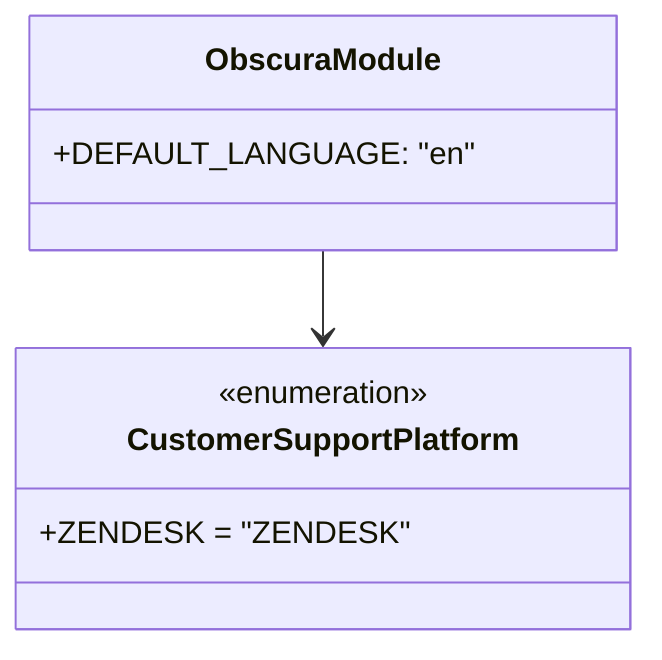

# Diagram: common/support_service/support_service/constants.py

> Auto-generated by Obscura crawlers

## Mermaid

### SVG

<svg id="container" width="302.4921875" xmlns="http://www.w3.org/2000/svg" class="classDiagram" height="330" viewBox="0 0 302.4921875 330" role="graphics-document document" aria-roledescription="class"><g><defs><marker id="container_class-aggregationStart" class="marker aggregation class" refX="18" refY="7" markerWidth="190" markerHeight="240" orient="auto"><path d="M 18,7 L9,13 L1,7 L9,1 Z"></path></marker></defs><defs><marker id="container_class-aggregationEnd" class="marker aggregation class" refX="1" refY="7" markerWidth="20" markerHeight="28" orient="auto"><path d="M 18,7 L9,13 L1,7 L9,1 Z"></path></marker></defs><defs><marker id="container_class-extensionStart" class="marker extension class" refX="18" refY="7" markerWidth="190" markerHeight="240" orient="auto"><path d="M 1,7 L18,13 V 1 Z"></path></marker></defs><defs><marker id="container_class-extensionEnd" class="marker extension class" refX="1" refY="7" markerWidth="20" markerHeight="28" orient="auto"><path d="M 1,1 V 13 L18,7 Z"></path></marker></defs><defs><marker id="container_class-compositionStart" class="marker composition class" refX="18" refY="7" markerWidth="190" markerHeight="240" orient="auto"><path d="M 18,7 L9,13 L1,7 L9,1 Z"></path></marker></defs><defs><marker id="container_class-compositionEnd" class="marker composition class" refX="1" refY="7" markerWidth="20" markerHeight="28" orient="auto"><path d="M 18,7 L9,13 L1,7 L9,1 Z"></path></marker></defs><defs><marker id="container_class-dependencyStart" class="marker dependency class" refX="6" refY="7" markerWidth="190" markerHeight="240" orient="auto"><path d="M 5,7 L9,13 L1,7 L9,1 Z"></path></marker></defs><defs><marker id="container_class-dependencyEnd" class="marker dependency class" refX="13" refY="7" markerWidth="20" markerHeight="28" orient="auto"><path d="M 18,7 L9,13 L14,7 L9,1 Z"></path></marker></defs><defs><marker id="container_class-lollipopStart" class="marker lollipop class" refX="13" refY="7" markerWidth="190" markerHeight="240" orient="auto"><circle stroke="black" fill="transparent" cx="7" cy="7" r="6"></circle></marker></defs><defs><marker id="container_class-lollipopEnd" class="marker lollipop class" refX="1" refY="7" markerWidth="190" markerHeight="240" orient="auto"><circle stroke="black" fill="transparent" cx="7" cy="7" r="6"></circle></marker></defs><g class="root"><g class="clusters"></g><g class="edgePaths"><path d="M151.246,128L151.246,132.167C151.246,136.333,151.246,144.667,151.246,152C151.246,159.333,151.246,165.667,151.246,168.833L151.246,172" id="id_ObscuraModule_CustomerSupportPlatform_1" class="edge-thickness-normal edge-pattern-solid relation" style=";;;" data-edge="true" data-et="edge" data-id="id_ObscuraModule_CustomerSupportPlatform_1" data-points="W3sieCI6MTUxLjI0NjA5Mzc1LCJ5IjoxMjh9LHsieCI6MTUxLjI0NjA5Mzc1LCJ5IjoxNTN9LHsieCI6MTUxLjI0NjA5Mzc1LCJ5IjoxNzh9XQ==" marker-end="url(#container_class-dependencyEnd)"></path></g><g class="edgeLabels"><g class="edgeLabel"><g class="label" data-id="id_ObscuraModule_CustomerSupportPlatform_1" transform="translate(0, 0)"><foreignObject width="0" height="0">

</foreignObject></g></g></g><g class="nodes"><g class="node default" id="classId-ObscuraModule-0" transform="translate(151.24609375, 68)"><g class="basic label-container"><path d="M-135.86328125 -60 L135.86328125 -60 L135.86328125 60 L-135.86328125 60" stroke="none" stroke-width="0" fill="#ECECFF" style=""></path><path d="M-135.86328125 -60 C-76.29532827309366 -60, -16.72737529618732 -60, 135.86328125 -60 M-135.86328125 -60 C-32.98037949006353 -60, 69.90252226987295 -60, 135.86328125 -60 M135.86328125 -60 C135.86328125 -20.34920794302557, 135.86328125 19.301584113948863, 135.86328125 60 M135.86328125 -60 C135.86328125 -22.618248974247834, 135.86328125 14.763502051504332, 135.86328125 60 M135.86328125 60 C30.701591305090687 60, -74.46009863981863 60, -135.86328125 60 M135.86328125 60 C60.001314148799125 60, -15.86065295240175 60, -135.86328125 60 M-135.86328125 60 C-135.86328125 35.64348592000994, -135.86328125 11.286971840019874, -135.86328125 -60 M-135.86328125 60 C-135.86328125 30.893067911548197, -135.86328125 1.7861358230963944, -135.86328125 -60" stroke="#9370DB" stroke-width="1.3" fill="none" stroke-dasharray="0 0" style=""></path></g><g class="annotation-group text" transform="translate(0, -36)"></g><g class="label-group text" transform="translate(-56.8984375, -36)"><g class="label" style="font-weight: bolder" transform="translate(0,-12)"><foreignObject width="113.796875" height="24">

ObscuraModule

</foreignObject></g></g><g class="members-group text" transform="translate(-123.86328125, 12)"><g class="label" style="" transform="translate(0,-12)"><foreignObject width="190.828125" height="24">

+DEFAULT_LANGUAGE: "en"

</foreignObject></g></g><g class="methods-group text" transform="translate(-123.86328125, 60)"></g><g class="divider" style=""><path d="M-135.86328125 -12 C-46.07259278631713 -12, 43.71809567736574 -12, 135.86328125 -12 M-135.86328125 -12 C-61.92776200321555 -12, 12.007757243568904 -12, 135.86328125 -12" stroke="#9370DB" stroke-width="1.3" fill="none" stroke-dasharray="0 0" style=""></path></g><g class="divider" style=""><path d="M-135.86328125 36 C-75.86799306511219 36, -15.872704880224376 36, 135.86328125 36 M-135.86328125 36 C-33.3816479488202 36, 69.0999853523596 36, 135.86328125 36" stroke="#9370DB" stroke-width="1.3" fill="none" stroke-dasharray="0 0" style=""></path></g></g><g class="node default" id="classId-CustomerSupportPlatform-1" transform="translate(151.24609375, 250)"><g class="basic label-container"><path d="M-143.24609375 -72 L143.24609375 -72 L143.24609375 72 L-143.24609375 72" stroke="none" stroke-width="0" fill="#ECECFF" style=""></path><path d="M-143.24609375 -72 C-39.67757971290858 -72, 63.89093432418284 -72, 143.24609375 -72 M-143.24609375 -72 C-39.55147468821039 -72, 64.14314437357922 -72, 143.24609375 -72 M143.24609375 -72 C143.24609375 -30.399693340802862, 143.24609375 11.200613318394275, 143.24609375 72 M143.24609375 -72 C143.24609375 -30.770379010918496, 143.24609375 10.459241978163007, 143.24609375 72 M143.24609375 72 C51.59709427795299 72, -40.05190519409402 72, -143.24609375 72 M143.24609375 72 C29.56251368323217 72, -84.12106638353566 72, -143.24609375 72 M-143.24609375 72 C-143.24609375 14.53853909028443, -143.24609375 -42.92292181943114, -143.24609375 -72 M-143.24609375 72 C-143.24609375 24.334207000822417, -143.24609375 -23.331585998355166, -143.24609375 -72" stroke="#9370DB" stroke-width="1.3" fill="none" stroke-dasharray="0 0" style=""></path></g><g class="annotation-group text" transform="translate(-55.5546875, -48)"><g class="label" style="" transform="translate(0,-12)"><foreignObject width="111.109375" height="24">

«enumeration»

</foreignObject></g></g><g class="label-group text" transform="translate(-96.5234375, -24)"><g class="label" style="font-weight: bolder" transform="translate(0,-12)"><foreignObject width="193.046875" height="24">

CustomerSupportPlatform

</foreignObject></g></g><g class="members-group text" transform="translate(-131.24609375, 24)"><g class="label" style="" transform="translate(0,-12)"><foreignObject width="165.96875" height="24">

+ZENDESK = "ZENDESK"

</foreignObject></g></g><g class="methods-group text" transform="translate(-131.24609375, 72)"></g><g class="divider" style=""><path d="M-143.24609375 0 C-47.92248962920263 0, 47.40111449159474 0, 143.24609375 0 M-143.24609375 0 C-34.43499926085752 0, 74.37609522828495 0, 143.24609375 0" stroke="#9370DB" stroke-width="1.3" fill="none" stroke-dasharray="0 0" style=""></path></g><g class="divider" style=""><path d="M-143.24609375 48 C-53.78409436534474 48, 35.677905019310515 48, 143.24609375 48 M-143.24609375 48 C-36.02889433931021 48, 71.18830507137957 48, 143.24609375 48" stroke="#9370DB" stroke-width="1.3" fill="none" stroke-dasharray="0 0" style=""></path></g></g></g></g></g></svg>
