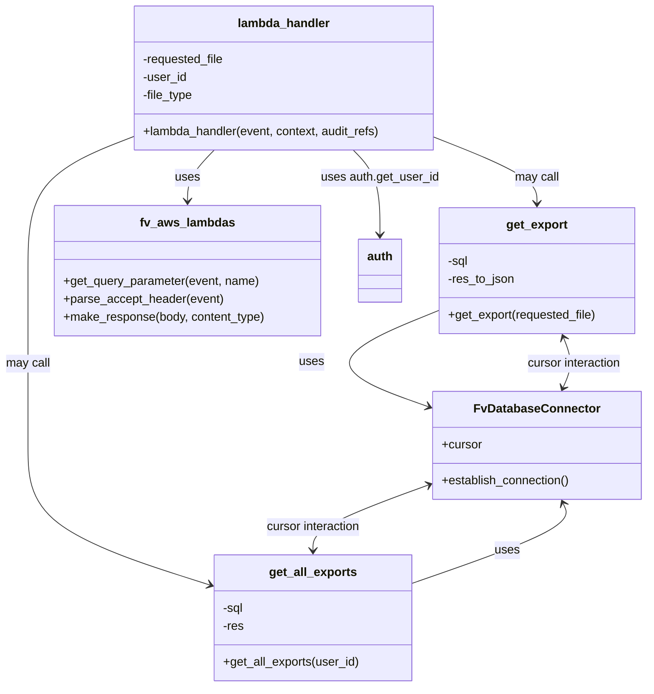

# Diagram: common/support_service/support_service/csv_exports/get_csv_export.py


> Auto-generated by Obscura crawlers

## Diagram 1

```mermaid
flowchart TD
  subgraph Lambda
    LH[lambda_handler(event, context, audit_refs)]
  end
  LH -->|reads query param "file"| get_q[fv.aws.lambdas.get_query_parameter(event,"file")]
  LH -->|auth| auth_get[auth.get_user_id(event)]
  LH -->|accept header| parse[fv.aws.lambdas.parse_accept_header(event)]
  parse -->|if "text/csv" in file_type| condCSV{"text/csv" in file_type?}
  condCSV -->|true| callGetExport[get_export(requested_file)]
  callGetExport --> makeResp[fv.aws.lambdas.make_response(body=get_export(...),"application/json")]
  condCSV -->|false| raiseErr[fv.error.BadRequestError]
  LH -->|fallback| callGetAll[get_all_exports(user_id)]
  callGetAll --> makeRespAll[fv.aws.lambdas.make_response(body=get_all_exports(...),"application/json")]

  subgraph DB["Database (DB_CONN)"]
    DB_CONN[DB_CONN: FvDatabaseConnector]
    DB_CONN --> establish[establish_connection()]
    DB_CONN --> cursor[cursor]
  end

  getAll[get_all_exports(user_id)] -->|connect| DB_CONN
  getAll -->|exec SQL| execAll[cursor.execute(sql, {"user_id": user_id})]
  getAll -->|fetch| fetchAll[cursor.fetchall()]
  getExport[get_export(requested_file)] -->|connect| DB_CONN
  getExport -->|exec SQL| execOne[cursor.execute(sql, {"req": requested_file})]
  getExport -->|fetch| fetchOne[cursor.fetchone()]

  PAGE_MAP[PAGE mapping]:::map
  PAGE_MAP -->|ENTITY| VIN[ "VIN" ]
  PAGE_MAP -->|SHIPMENTS| shipment["shipment"]
  PAGE_MAP -->|ENTITY_LOCATIONS| VIN_LOC["VIN Locations"]
  PAGE_MAP -->|GET_ORGANIZATIONS_MEMBERS| user["user"]
  PAGE_MAP -->|TRIP_PLAN| trip["trip plan"]
  PAGE_MAP -->|ENTITY_DDA| driveaway["DRIVEAWAY"]
  PAGE_MAP -->|"search-package-container"| partview["partview"]

  classDef map fill:#f9f,stroke:#333,stroke-width:1px
```

> SVG rendering failed for this diagram.

## Diagram 2



### SVG

<svg id="container" width="863.24609375" xmlns="http://www.w3.org/2000/svg" class="classDiagram" height="916" viewBox="0 0 863.24609375 916" role="graphics-document document" aria-roledescription="class"><style>#container{font-family:"trebuchet ms",verdana,arial,sans-serif;font-size:16px;fill:#333;}@keyframes edge-animation-frame{from{stroke-dashoffset:0;}}@keyframes dash{to{stroke-dashoffset:0;}}#container .edge-animation-slow{stroke-dasharray:9,5!important;stroke-dashoffset:900;animation:dash 50s linear infinite;stroke-linecap:round;}#container .edge-animation-fast{stroke-dasharray:9,5!important;stroke-dashoffset:900;animation:dash 20s linear infinite;stroke-linecap:round;}#container .error-icon{fill:#552222;}#container .error-text{fill:#552222;stroke:#552222;}#container .edge-thickness-normal{stroke-width:1px;}#container .edge-thickness-thick{stroke-width:3.5px;}#container .edge-pattern-solid{stroke-dasharray:0;}#container .edge-thickness-invisible{stroke-width:0;fill:none;}#container .edge-pattern-dashed{stroke-dasharray:3;}#container .edge-pattern-dotted{stroke-dasharray:2;}#container .marker{fill:#333333;stroke:#333333;}#container .marker.cross{stroke:#333333;}#container svg{font-family:"trebuchet ms",verdana,arial,sans-serif;font-size:16px;}#container p{margin:0;}#container g.classGroup text{fill:#9370DB;stroke:none;font-family:"trebuchet ms",verdana,arial,sans-serif;font-size:10px;}#container g.classGroup text .title{font-weight:bolder;}#container .nodeLabel,#container .edgeLabel{color:#131300;}#container .edgeLabel .label rect{fill:#ECECFF;}#container .label text{fill:#131300;}#container .labelBkg{background:#ECECFF;}#container .edgeLabel .label span{background:#ECECFF;}#container .classTitle{font-weight:bolder;}#container .node rect,#container .node circle,#container .node ellipse,#container .node polygon,#container .node path{fill:#ECECFF;stroke:#9370DB;stroke-width:1px;}#container .divider{stroke:#9370DB;stroke-width:1;}#container g.clickable{cursor:pointer;}#container g.classGroup rect{fill:#ECECFF;stroke:#9370DB;}#container g.classGroup line{stroke:#9370DB;stroke-width:1;}#container .classLabel .box{stroke:none;stroke-width:0;fill:#ECECFF;opacity:0.5;}#container .classLabel .label{fill:#9370DB;font-size:10px;}#container .relation{stroke:#333333;stroke-width:1;fill:none;}#container .dashed-line{stroke-dasharray:3;}#container .dotted-line{stroke-dasharray:1 2;}#container #compositionStart,#container .composition{fill:#333333!important;stroke:#333333!important;stroke-width:1;}#container #compositionEnd,#container .composition{fill:#333333!important;stroke:#333333!important;stroke-width:1;}#container #dependencyStart,#container .dependency{fill:#333333!important;stroke:#333333!important;stroke-width:1;}#container #dependencyStart,#container .dependency{fill:#333333!important;stroke:#333333!important;stroke-width:1;}#container #extensionStart,#container .extension{fill:transparent!important;stroke:#333333!important;stroke-width:1;}#container #extensionEnd,#container .extension{fill:transparent!important;stroke:#333333!important;stroke-width:1;}#container #aggregationStart,#container .aggregation{fill:transparent!important;stroke:#333333!important;stroke-width:1;}#container #aggregationEnd,#container .aggregation{fill:transparent!important;stroke:#333333!important;stroke-width:1;}#container #lollipopStart,#container .lollipop{fill:#ECECFF!important;stroke:#333333!important;stroke-width:1;}#container #lollipopEnd,#container .lollipop{fill:#ECECFF!important;stroke:#333333!important;stroke-width:1;}#container .edgeTerminals{font-size:11px;line-height:initial;}#container .classTitleText{text-anchor:middle;font-size:18px;fill:#333;}#container .label-icon{display:inline-block;height:1em;overflow:visible;vertical-align:-0.125em;}#container .node .label-icon path{fill:currentColor;stroke:revert;stroke-width:revert;}#container :root{--mermaid-font-family:"trebuchet ms",verdana,arial,sans-serif;}</style><g><defs><marker id="container_class-aggregationStart" class="marker aggregation class" refX="18" refY="7" markerWidth="190" markerHeight="240" orient="auto"><path d="M 18,7 L9,13 L1,7 L9,1 Z"></path></marker></defs><defs><marker id="container_class-aggregationEnd" class="marker aggregation class" refX="1" refY="7" markerWidth="20" markerHeight="28" orient="auto"><path d="M 18,7 L9,13 L1,7 L9,1 Z"></path></marker></defs><defs><marker id="container_class-extensionStart" class="marker extension class" refX="18" refY="7" markerWidth="190" markerHeight="240" orient="auto"><path d="M 1,7 L18,13 V 1 Z"></path></marker></defs><defs><marker id="container_class-extensionEnd" class="marker extension class" refX="1" refY="7" markerWidth="20" markerHeight="28" orient="auto"><path d="M 1,1 V 13 L18,7 Z"></path></marker></defs><defs><marker id="container_class-compositionStart" class="marker composition class" refX="18" refY="7" markerWidth="190" markerHeight="240" orient="auto"><path d="M 18,7 L9,13 L1,7 L9,1 Z"></path></marker></defs><defs><marker id="container_class-compositionEnd" class="marker composition class" refX="1" refY="7" markerWidth="20" markerHeight="28" orient="auto"><path d="M 18,7 L9,13 L1,7 L9,1 Z"></path></marker></defs><defs><marker id="container_class-dependencyStart" class="marker dependency class" refX="6" refY="7" markerWidth="190" markerHeight="240" orient="auto"><path d="M 5,7 L9,13 L1,7 L9,1 Z"></path></marker></defs><defs><marker id="container_class-dependencyEnd" class="marker dependency class" refX="13" refY="7" markerWidth="20" markerHeight="28" orient="auto"><path d="M 18,7 L9,13 L14,7 L9,1 Z"></path></marker></defs><defs><marker id="container_class-lollipopStart" class="marker lollipop class" refX="13" refY="7" markerWidth="190" markerHeight="240" orient="auto"><circle stroke="black" fill="transparent" cx="7" cy="7" r="6"></circle></marker></defs><defs><marker id="container_class-lollipopEnd" class="marker lollipop class" refX="1" refY="7" markerWidth="190" markerHeight="240" orient="auto"><circle stroke="black" fill="transparent" cx="7" cy="7" r="6"></circle></marker></defs><g class="root"><g class="clusters"></g><g class="edgePaths"><path d="M285.921,200L279.984,206.167C274.046,212.333,262.172,224.667,256.234,236C250.297,247.333,250.297,257.667,250.297,262.833L250.297,268" id="id_lambda_handler_fv_aws_lambdas_1" class="edge-thickness-normal edge-pattern-solid relation" style=";;;" data-edge="true" data-et="edge" data-id="id_lambda_handler_fv_aws_lambdas_1" data-points="W3sieCI6Mjg1LjkyMTExMTM3MjE4MDQ2LCJ5IjoyMDB9LHsieCI6MjUwLjI5Njg3NSwieSI6MjM3fSx7IngiOjI1MC4yOTY4NzUsInkiOjI3NH1d" marker-end="url(#container_class-dependencyEnd)"></path><path d="M470.782,200L476.719,206.167C482.657,212.333,494.532,224.667,500.469,243.5C506.406,262.333,506.406,287.667,506.406,300.333L506.406,313" id="id_lambda_handler_auth_2" class="edge-thickness-normal edge-pattern-solid relation" style=";;;" data-edge="true" data-et="edge" data-id="id_lambda_handler_auth_2" data-points="W3sieCI6NDcwLjc4MjAxMzYyNzgxOTU0LCJ5IjoyMDB9LHsieCI6NTA2LjQwNjI1LCJ5IjoyMzd9LHsieCI6NTA2LjQwNjI1LCJ5IjozMTl9XQ==" marker-end="url(#container_class-dependencyEnd)"></path><path d="M581.184,183.669L603.813,192.557C626.443,201.446,671.702,219.223,694.331,233.778C716.961,248.333,716.961,259.667,716.961,265.333L716.961,271" id="id_lambda_handler_get_export_3" class="edge-thickness-normal edge-pattern-solid relation" style=";;;" data-edge="true" data-et="edge" data-id="id_lambda_handler_get_export_3" data-points="W3sieCI6NTgxLjE4MzU5Mzc1LCJ5IjoxODMuNjY4OTcwMDUyMTQzNDR9LHsieCI6NzE2Ljk2MDkzNzUsInkiOjIzN30seyJ4Ijo3MTYuOTYwOTM3NSwieSI6Mjc3fV0=" marker-end="url(#container_class-dependencyEnd)"></path><path d="M175.52,183.227L152.575,192.189C129.63,201.151,83.741,219.076,60.796,248.704C37.852,278.333,37.852,319.667,37.852,361C37.852,402.333,37.852,443.667,37.852,482.5C37.852,521.333,37.852,557.667,37.852,594C37.852,630.333,37.852,666.667,78.614,697.751C119.377,728.835,200.903,754.67,241.666,767.588L282.429,780.506" id="id_lambda_handler_get_all_exports_4" class="edge-thickness-normal edge-pattern-solid relation" style=";;;" data-edge="true" data-et="edge" data-id="id_lambda_handler_get_all_exports_4" data-points="W3sieCI6MTc1LjUxOTUzMTI1LCJ5IjoxODMuMjI2NjA4Mzg4Mzk5NDN9LHsieCI6MzcuODUxNTYyNSwieSI6MjM3fSx7IngiOjM3Ljg1MTU2MjUsInkiOjM2MX0seyJ4IjozNy44NTE1NjI1LCJ5Ijo0ODV9LHsieCI6MzcuODUxNTYyNSwieSI6NTk0fSx7IngiOjM3Ljg1MTU2MjUsInkiOjcwM30seyJ4IjoyODguMTQ4NDM3NSwieSI6NzgyLjMxODIwNTk5OTA5OTd9XQ==" marker-end="url(#container_class-dependencyEnd)"></path><path d="M551.211,778.24L587.256,765.7C623.301,753.16,695.391,728.08,728.998,710.281C762.605,692.481,757.73,681.962,755.292,676.703L752.855,671.444" id="id_get_all_exports_FvDatabaseConnector_5" class="edge-thickness-normal edge-pattern-solid relation" style=";;;" data-edge="true" data-et="edge" data-id="id_get_all_exports_FvDatabaseConnector_5" data-points="W3sieCI6NTUxLjIxMDkzNzUsInkiOjc3OC4yNDAyMzcyMDQ3NTc2fSx7IngiOjc2Ny40ODA0Njg3NSwieSI6NzAzfSx7IngiOjc1MC4zMzE2MzcwNDEyODQ0LCJ5Ijo2NjZ9XQ==" marker-end="url(#container_class-dependencyEnd)"></path><path d="M585.07,414.379L555.988,426.149C526.906,437.919,468.742,461.46,466.734,482.862C464.726,504.264,518.875,523.528,545.949,533.16L573.023,542.792" id="id_get_export_FvDatabaseConnector_6" class="edge-thickness-normal edge-pattern-solid relation" style=";;;" data-edge="true" data-et="edge" data-id="id_get_export_FvDatabaseConnector_6" data-points="W3sieCI6NTg1LjA3MDMxMjUsInkiOjQxNC4zNzkwOTU4MDAyOTA3fSx7IngiOjQxMC41NzgxMjUsInkiOjQ4NX0seyJ4Ijo1NzguNjc1NzgxMjUsInkiOjU0NC44MDMxMDgzNDU4NzA0fV0=" marker-end="url(#container_class-dependencyEnd)"></path><path d="M573.043,646.769L547.482,656.14C521.922,665.512,470.801,684.256,445.24,698.795C419.68,713.333,419.68,723.667,419.68,728.833L419.68,734" id="id_FvDatabaseConnector_get_all_exports_7" class="edge-thickness-normal edge-pattern-solid relation" style=";;;" data-edge="true" data-et="edge" data-id="id_FvDatabaseConnector_get_all_exports_7" data-points="W3sieCI6NTc4LjY3NTc4MTI1LCJ5Ijo2NDQuNzAzMTAzNjQ3NjQwMX0seyJ4Ijo0MTkuNjc5Njg3NSwieSI6NzAzfSx7IngiOjQxOS42Nzk2ODc1LCJ5Ijo3NDB9XQ==" marker-start="url(#container_class-dependencyStart)" marker-end="url(#container_class-dependencyEnd)"></path><path d="M752.855,516.556L755.292,511.297C757.73,506.038,762.605,495.519,762.704,484.519C762.803,473.519,758.125,462.038,755.786,456.297L753.448,450.557" id="id_FvDatabaseConnector_get_export_8" class="edge-thickness-normal edge-pattern-solid relation" style=";;;" data-edge="true" data-et="edge" data-id="id_FvDatabaseConnector_get_export_8" data-points="W3sieCI6NzUwLjMzMTYzNzA0MTI4NDQsInkiOjUyMn0seyJ4Ijo3NjcuNDgwNDY4NzUsInkiOjQ4NX0seyJ4Ijo3NTEuMTgzODQ1NzY2MTI5LCJ5Ijo0NDV9XQ==" marker-start="url(#container_class-dependencyStart)" marker-end="url(#container_class-dependencyEnd)"></path></g><g class="edgeLabels"><g class="edgeLabel" transform="translate(250.296875, 237)"><g class="label" data-id="id_lambda_handler_fv_aws_lambdas_1" transform="translate(-16.4921875, -12)"><foreignObject width="32.984375" height="24"><div xmlns="http://www.w3.org/1999/xhtml" class="labelBkg" style="display: table-cell; white-space: nowrap; line-height: 1.5; max-width: 200px; text-align: center;"><span class="edgeLabel"><p>uses</p></span></div></foreignObject></g></g><g class="edgeLabel" transform="translate(506.40625, 237)"><g class="label" data-id="id_lambda_handler_auth_2" transform="translate(-78.71875, -12)"><foreignObject width="157.4375" height="24"><div xmlns="http://www.w3.org/1999/xhtml" class="labelBkg" style="display: table-cell; white-space: nowrap; line-height: 1.5; max-width: 200px; text-align: center;"><span class="edgeLabel"><p>uses auth.get_user_id</p></span></div></foreignObject></g></g><g class="edgeLabel" transform="translate(716.9609375, 237)"><g class="label" data-id="id_lambda_handler_get_export_3" transform="translate(-29.8515625, -12)"><foreignObject width="59.703125" height="24"><div xmlns="http://www.w3.org/1999/xhtml" class="labelBkg" style="display: table-cell; white-space: nowrap; line-height: 1.5; max-width: 200px; text-align: center;"><span class="edgeLabel"><p>may call</p></span></div></foreignObject></g></g><g class="edgeLabel" transform="translate(37.8515625, 485)"><g class="label" data-id="id_lambda_handler_get_all_exports_4" transform="translate(-29.8515625, -12)"><foreignObject width="59.703125" height="24"><div xmlns="http://www.w3.org/1999/xhtml" class="labelBkg" style="display: table-cell; white-space: nowrap; line-height: 1.5; max-width: 200px; text-align: center;"><span class="edgeLabel"><p>may call</p></span></div></foreignObject></g></g><g class="edgeLabel" transform="translate(678.60398, 733.92016)"><g class="label" data-id="id_get_all_exports_FvDatabaseConnector_5" transform="translate(-16.4921875, -12)"><foreignObject width="32.984375" height="24"><div xmlns="http://www.w3.org/1999/xhtml" class="labelBkg" style="display: table-cell; white-space: nowrap; line-height: 1.5; max-width: 200px; text-align: center;"><span class="edgeLabel"><p>uses</p></span></div></foreignObject></g></g><g class="edgeLabel" transform="translate(415.13076, 483.15745)"><g class="label" data-id="id_get_export_FvDatabaseConnector_6" transform="translate(-16.4921875, -12)"><foreignObject width="32.984375" height="24"><div xmlns="http://www.w3.org/1999/xhtml" class="labelBkg" style="display: table-cell; white-space: nowrap; line-height: 1.5; max-width: 200px; text-align: center;"><span class="edgeLabel"><p>uses</p></span></div></foreignObject></g></g><g class="edgeLabel" transform="translate(419.6796875, 703)"><g class="label" data-id="id_FvDatabaseConnector_get_all_exports_7" transform="translate(-64.546875, -12)"><foreignObject width="129.09375" height="24"><div xmlns="http://www.w3.org/1999/xhtml" class="labelBkg" style="display: table-cell; white-space: nowrap; line-height: 1.5; max-width: 200px; text-align: center;"><span class="edgeLabel"><p>cursor interaction</p></span></div></foreignObject></g></g><g class="edgeLabel" transform="translate(767.48046875, 485)"><g class="label" data-id="id_FvDatabaseConnector_get_export_8" transform="translate(-64.546875, -12)"><foreignObject width="129.09375" height="24"><div xmlns="http://www.w3.org/1999/xhtml" class="labelBkg" style="display: table-cell; white-space: nowrap; line-height: 1.5; max-width: 200px; text-align: center;"><span class="edgeLabel"><p>cursor interaction</p></span></div></foreignObject></g></g></g><g class="nodes"><g class="node default" id="classId-lambda_handler-0" transform="translate(378.3515625, 104)"><g class="basic label-container"><path d="M-202.83203125 -96 L202.83203125 -96 L202.83203125 96 L-202.83203125 96" stroke="none" stroke-width="0" fill="#ECECFF" style=""></path><path d="M-202.83203125 -96 C-104.97678387062034 -96, -7.121536491240676 -96, 202.83203125 -96 M-202.83203125 -96 C-75.87978343724622 -96, 51.072464375507565 -96, 202.83203125 -96 M202.83203125 -96 C202.83203125 -48.979904680111986, 202.83203125 -1.9598093602239715, 202.83203125 96 M202.83203125 -96 C202.83203125 -22.81184638829869, 202.83203125 50.37630722340262, 202.83203125 96 M202.83203125 96 C85.81967274389702 96, -31.19268576220597 96, -202.83203125 96 M202.83203125 96 C102.19574296086017 96, 1.5594546717203457 96, -202.83203125 96 M-202.83203125 96 C-202.83203125 31.900689501620704, -202.83203125 -32.19862099675859, -202.83203125 -96 M-202.83203125 96 C-202.83203125 23.823824060327865, -202.83203125 -48.35235187934427, -202.83203125 -96" stroke="#9370DB" stroke-width="1.3" fill="none" stroke-dasharray="0 0" style=""></path></g><g class="annotation-group text" transform="translate(0, -72)"></g><g class="label-group text" transform="translate(-59.9765625, -72)"><g class="label" style="font-weight: bolder" transform="translate(0,-12)"><foreignObject width="119.953125" height="24"><div xmlns="http://www.w3.org/1999/xhtml" style="display: table-cell; white-space: nowrap; line-height: 1.5; max-width: 170px; text-align: center;"><span class="nodeLabel markdown-node-label" style=""><p>lambda_handler</p></span></div></foreignObject></g></g><g class="members-group text" transform="translate(-190.83203125, -24)"><g class="label" style="" transform="translate(0,-12)"><foreignObject width="110.296875" height="24"><div xmlns="http://www.w3.org/1999/xhtml" style="display: table-cell; white-space: nowrap; line-height: 1.5; max-width: 168px; text-align: center;"><span class="nodeLabel markdown-node-label" style=""><p>-requested_file</p></span></div></foreignObject></g><g class="label" style="" transform="translate(0,12)"><foreignObject width="59.25" height="24"><div xmlns="http://www.w3.org/1999/xhtml" style="display: table-cell; white-space: nowrap; line-height: 1.5; max-width: 117px; text-align: center;"><span class="nodeLabel markdown-node-label" style=""><p>-user_id</p></span></div></foreignObject></g><g class="label" style="" transform="translate(0,36)"><foreignObject width="68.21875" height="24"><div xmlns="http://www.w3.org/1999/xhtml" style="display: table-cell; white-space: nowrap; line-height: 1.5; max-width: 126px; text-align: center;"><span class="nodeLabel markdown-node-label" style=""><p>-file_type</p></span></div></foreignObject></g></g><g class="methods-group text" transform="translate(-190.83203125, 72)"><g class="label" style="" transform="translate(0,-12)"><foreignObject width="321.6875" height="24"><div xmlns="http://www.w3.org/1999/xhtml" style="display: table-cell; white-space: nowrap; line-height: 1.5; max-width: 379px; text-align: center;"><span class="nodeLabel markdown-node-label" style=""><p>+lambda_handler(event, context, audit_refs)</p></span></div></foreignObject></g></g><g class="divider" style=""><path d="M-202.83203125 -48 C-47.29853596813652 -48, 108.23495931372696 -48, 202.83203125 -48 M-202.83203125 -48 C-69.42248171564444 -48, 63.987067818711125 -48, 202.83203125 -48" stroke="#9370DB" stroke-width="1.3" fill="none" stroke-dasharray="0 0" style=""></path></g><g class="divider" style=""><path d="M-202.83203125 48 C-47.67471266885619 48, 107.48260591228762 48, 202.83203125 48 M-202.83203125 48 C-113.07463038800883 48, -23.317229526017655 48, 202.83203125 48" stroke="#9370DB" stroke-width="1.3" fill="none" stroke-dasharray="0 0" style=""></path></g></g><g class="node default" id="classId-get_all_exports-1" transform="translate(419.6796875, 824)"><g class="basic label-container"><path d="M-131.53125 -84 L131.53125 -84 L131.53125 84 L-131.53125 84" stroke="none" stroke-width="0" fill="#ECECFF" style=""></path><path d="M-131.53125 -84 C-38.64708172410812 -84, 54.23708655178376 -84, 131.53125 -84 M-131.53125 -84 C-52.44121633971662 -84, 26.648817320566764 -84, 131.53125 -84 M131.53125 -84 C131.53125 -22.069958842991056, 131.53125 39.86008231401789, 131.53125 84 M131.53125 -84 C131.53125 -33.27339138287057, 131.53125 17.453217234258858, 131.53125 84 M131.53125 84 C66.39126208962229 84, 1.2512741792445752 84, -131.53125 84 M131.53125 84 C67.18058920706827 84, 2.829928414136532 84, -131.53125 84 M-131.53125 84 C-131.53125 45.801194015190184, -131.53125 7.602388030380368, -131.53125 -84 M-131.53125 84 C-131.53125 39.515338378759644, -131.53125 -4.969323242480712, -131.53125 -84" stroke="#9370DB" stroke-width="1.3" fill="none" stroke-dasharray="0 0" style=""></path></g><g class="annotation-group text" transform="translate(0, -60)"></g><g class="label-group text" transform="translate(-56.8125, -60)"><g class="label" style="font-weight: bolder" transform="translate(0,-12)"><foreignObject width="113.625" height="24"><div xmlns="http://www.w3.org/1999/xhtml" style="display: table-cell; white-space: nowrap; line-height: 1.5; max-width: 161px; text-align: center;"><span class="nodeLabel markdown-node-label" style=""><p>get_all_exports</p></span></div></foreignObject></g></g><g class="members-group text" transform="translate(-119.53125, -12)"><g class="label" style="" transform="translate(0,-12)"><foreignObject width="28.1875" height="24"><div xmlns="http://www.w3.org/1999/xhtml" style="display: table-cell; white-space: nowrap; line-height: 1.5; max-width: 86px; text-align: center;"><span class="nodeLabel markdown-node-label" style=""><p>-sql</p></span></div></foreignObject></g><g class="label" style="" transform="translate(0,12)"><foreignObject width="28.34375" height="24"><div xmlns="http://www.w3.org/1999/xhtml" style="display: table-cell; white-space: nowrap; line-height: 1.5; max-width: 86px; text-align: center;"><span class="nodeLabel markdown-node-label" style=""><p>-res</p></span></div></foreignObject></g></g><g class="methods-group text" transform="translate(-119.53125, 60)"><g class="label" style="" transform="translate(0,-12)"><foreignObject width="182.25" height="24"><div xmlns="http://www.w3.org/1999/xhtml" style="display: table-cell; white-space: nowrap; line-height: 1.5; max-width: 240px; text-align: center;"><span class="nodeLabel markdown-node-label" style=""><p>+get_all_exports(user_id)</p></span></div></foreignObject></g></g><g class="divider" style=""><path d="M-131.53125 -36 C-68.35179772838259 -36, -5.172345456765171 -36, 131.53125 -36 M-131.53125 -36 C-69.4405685538544 -36, -7.34988710770881 -36, 131.53125 -36" stroke="#9370DB" stroke-width="1.3" fill="none" stroke-dasharray="0 0" style=""></path></g><g class="divider" style=""><path d="M-131.53125 36 C-54.75242460759935 36, 22.026400784801297 36, 131.53125 36 M-131.53125 36 C-29.642075114744316 36, 72.24709977051137 36, 131.53125 36" stroke="#9370DB" stroke-width="1.3" fill="none" stroke-dasharray="0 0" style=""></path></g></g><g class="node default" id="classId-get_export-2" transform="translate(716.9609375, 361)"><g class="basic label-container"><path d="M-131.890625 -84 L131.890625 -84 L131.890625 84 L-131.890625 84" stroke="none" stroke-width="0" fill="#ECECFF" style=""></path><path d="M-131.890625 -84 C-48.56824215466351 -84, 34.75414069067298 -84, 131.890625 -84 M-131.890625 -84 C-56.84002882195226 -84, 18.21056735609548 -84, 131.890625 -84 M131.890625 -84 C131.890625 -18.653585875590494, 131.890625 46.69282824881901, 131.890625 84 M131.890625 -84 C131.890625 -45.95851831598753, 131.890625 -7.917036631975066, 131.890625 84 M131.890625 84 C50.451283224638956 84, -30.988058550722087 84, -131.890625 84 M131.890625 84 C52.10131922492516 84, -27.687986550149674 84, -131.890625 84 M-131.890625 84 C-131.890625 26.449210302100063, -131.890625 -31.101579395799874, -131.890625 -84 M-131.890625 84 C-131.890625 24.93055473777582, -131.890625 -34.13889052444836, -131.890625 -84" stroke="#9370DB" stroke-width="1.3" fill="none" stroke-dasharray="0 0" style=""></path></g><g class="annotation-group text" transform="translate(0, -60)"></g><g class="label-group text" transform="translate(-39.890625, -60)"><g class="label" style="font-weight: bolder" transform="translate(0,-12)"><foreignObject width="79.78125" height="24"><div xmlns="http://www.w3.org/1999/xhtml" style="display: table-cell; white-space: nowrap; line-height: 1.5; max-width: 128px; text-align: center;"><span class="nodeLabel markdown-node-label" style=""><p>get_export</p></span></div></foreignObject></g></g><g class="members-group text" transform="translate(-119.890625, -12)"><g class="label" style="" transform="translate(0,-12)"><foreignObject width="28.1875" height="24"><div xmlns="http://www.w3.org/1999/xhtml" style="display: table-cell; white-space: nowrap; line-height: 1.5; max-width: 86px; text-align: center;"><span class="nodeLabel markdown-node-label" style=""><p>-sql</p></span></div></foreignObject></g><g class="label" style="" transform="translate(0,12)"><foreignObject width="90.15625" height="24"><div xmlns="http://www.w3.org/1999/xhtml" style="display: table-cell; white-space: nowrap; line-height: 1.5; max-width: 148px; text-align: center;"><span class="nodeLabel markdown-node-label" style=""><p>-res_to_json</p></span></div></foreignObject></g></g><g class="methods-group text" transform="translate(-119.890625, 60)"><g class="label" style="" transform="translate(0,-12)"><foreignObject width="199.890625" height="24"><div xmlns="http://www.w3.org/1999/xhtml" style="display: table-cell; white-space: nowrap; line-height: 1.5; max-width: 257px; text-align: center;"><span class="nodeLabel markdown-node-label" style=""><p>+get_export(requested_file)</p></span></div></foreignObject></g></g><g class="divider" style=""><path d="M-131.890625 -36 C-42.80520360820718 -36, 46.28021778358564 -36, 131.890625 -36 M-131.890625 -36 C-36.216126668570666 -36, 59.45837166285867 -36, 131.890625 -36" stroke="#9370DB" stroke-width="1.3" fill="none" stroke-dasharray="0 0" style=""></path></g><g class="divider" style=""><path d="M-131.890625 36 C-32.76776497264348 36, 66.35509505471305 36, 131.890625 36 M-131.890625 36 C-37.17776088811078 36, 57.535103223778435 36, 131.890625 36" stroke="#9370DB" stroke-width="1.3" fill="none" stroke-dasharray="0 0" style=""></path></g></g><g class="node default" id="classId-FvDatabaseConnector-3" transform="translate(716.9609375, 594)"><g class="basic label-container"><path d="M-138.28515625 -72 L138.28515625 -72 L138.28515625 72 L-138.28515625 72" stroke="none" stroke-width="0" fill="#ECECFF" style=""></path><path d="M-138.28515625 -72 C-43.53628525818523 -72, 51.21258573362954 -72, 138.28515625 -72 M-138.28515625 -72 C-31.264246587309245 -72, 75.75666307538151 -72, 138.28515625 -72 M138.28515625 -72 C138.28515625 -26.460459011269478, 138.28515625 19.079081977461044, 138.28515625 72 M138.28515625 -72 C138.28515625 -14.728330775932498, 138.28515625 42.543338448135, 138.28515625 72 M138.28515625 72 C81.99398099924088 72, 25.70280574848175 72, -138.28515625 72 M138.28515625 72 C39.257749506084636 72, -59.76965723783073 72, -138.28515625 72 M-138.28515625 72 C-138.28515625 39.99586299785442, -138.28515625 7.991725995708833, -138.28515625 -72 M-138.28515625 72 C-138.28515625 31.592757408510764, -138.28515625 -8.814485182978473, -138.28515625 -72" stroke="#9370DB" stroke-width="1.3" fill="none" stroke-dasharray="0 0" style=""></path></g><g class="annotation-group text" transform="translate(0, -48)"></g><g class="label-group text" transform="translate(-79.3046875, -48)"><g class="label" style="font-weight: bolder" transform="translate(0,-12)"><foreignObject width="158.609375" height="24"><div xmlns="http://www.w3.org/1999/xhtml" style="display: table-cell; white-space: nowrap; line-height: 1.5; max-width: 207px; text-align: center;"><span class="nodeLabel markdown-node-label" style=""><p>FvDatabaseConnector</p></span></div></foreignObject></g></g><g class="members-group text" transform="translate(-126.28515625, 0)"><g class="label" style="" transform="translate(0,-12)"><foreignObject width="53.71875" height="24"><div xmlns="http://www.w3.org/1999/xhtml" style="display: table-cell; white-space: nowrap; line-height: 1.5; max-width: 112px; text-align: center;"><span class="nodeLabel markdown-node-label" style=""><p>+cursor</p></span></div></foreignObject></g></g><g class="methods-group text" transform="translate(-126.28515625, 48)"><g class="label" style="" transform="translate(0,-12)"><foreignObject width="173.265625" height="24"><div xmlns="http://www.w3.org/1999/xhtml" style="display: table-cell; white-space: nowrap; line-height: 1.5; max-width: 231px; text-align: center;"><span class="nodeLabel markdown-node-label" style=""><p>+establish_connection()</p></span></div></foreignObject></g></g><g class="divider" style=""><path d="M-138.28515625 -24 C-80.66885928940485 -24, -23.0525623288097 -24, 138.28515625 -24 M-138.28515625 -24 C-50.366423346899424 -24, 37.55230955620115 -24, 138.28515625 -24" stroke="#9370DB" stroke-width="1.3" fill="none" stroke-dasharray="0 0" style=""></path></g><g class="divider" style=""><path d="M-138.28515625 24 C-53.35384837154339 24, 31.577459506913215 24, 138.28515625 24 M-138.28515625 24 C-37.68533399999268 24, 62.91448825001464 24, 138.28515625 24" stroke="#9370DB" stroke-width="1.3" fill="none" stroke-dasharray="0 0" style=""></path></g></g><g class="node default" id="classId-fv_aws_lambdas-4" transform="translate(250.296875, 361)"><g class="basic label-container"><path d="M-177.4453125 -87 L177.4453125 -87 L177.4453125 87 L-177.4453125 87" stroke="none" stroke-width="0" fill="#ECECFF" style=""></path><path d="M-177.4453125 -87 C-64.78428440401287 -87, 47.87674369197427 -87, 177.4453125 -87 M-177.4453125 -87 C-97.52263494957238 -87, -17.599957399144756 -87, 177.4453125 -87 M177.4453125 -87 C177.4453125 -36.86678060844838, 177.4453125 13.26643878310324, 177.4453125 87 M177.4453125 -87 C177.4453125 -25.559033367358147, 177.4453125 35.881933265283706, 177.4453125 87 M177.4453125 87 C106.09236457131068 87, 34.739416642621364 87, -177.4453125 87 M177.4453125 87 C106.345329443452 87, 35.245346386904004 87, -177.4453125 87 M-177.4453125 87 C-177.4453125 36.29824081172666, -177.4453125 -14.403518376546685, -177.4453125 -87 M-177.4453125 87 C-177.4453125 34.958606088679126, -177.4453125 -17.082787822641748, -177.4453125 -87" stroke="#9370DB" stroke-width="1.3" fill="none" stroke-dasharray="0 0" style=""></path></g><g class="annotation-group text" transform="translate(0, -63)"></g><g class="label-group text" transform="translate(-60.0625, -63)"><g class="label" style="font-weight: bolder" transform="translate(0,-12)"><foreignObject width="120.125" height="24"><div xmlns="http://www.w3.org/1999/xhtml" style="display: table-cell; white-space: nowrap; line-height: 1.5; max-width: 168px; text-align: center;"><span class="nodeLabel markdown-node-label" style=""><p>fv_aws_lambdas</p></span></div></foreignObject></g></g><g class="members-group text" transform="translate(-165.4453125, -15)"></g><g class="methods-group text" transform="translate(-165.4453125, 15)"><g class="label" style="" transform="translate(0,-12)"><foreignObject width="262.625" height="24"><div xmlns="http://www.w3.org/1999/xhtml" style="display: table-cell; white-space: nowrap; line-height: 1.5; max-width: 320px; text-align: center;"><span class="nodeLabel markdown-node-label" style=""><p>+get_query_parameter(event, name)</p></span></div></foreignObject></g><g class="label" style="" transform="translate(0,12)"><foreignObject width="213.34375" height="24"><div xmlns="http://www.w3.org/1999/xhtml" style="display: table-cell; white-space: nowrap; line-height: 1.5; max-width: 271px; text-align: center;"><span class="nodeLabel markdown-node-label" style=""><p>+parse_accept_header(event)</p></span></div></foreignObject></g><g class="label" style="" transform="translate(0,36)"><foreignObject width="270.828125" height="24"><div xmlns="http://www.w3.org/1999/xhtml" style="display: table-cell; white-space: nowrap; line-height: 1.5; max-width: 328px; text-align: center;"><span class="nodeLabel markdown-node-label" style=""><p>+make_response(body, content_type)</p></span></div></foreignObject></g></g><g class="divider" style=""><path d="M-177.4453125 -39 C-65.8340996585351 -39, 45.77711318292981 -39, 177.4453125 -39 M-177.4453125 -39 C-72.10841081408107 -39, 33.22849087183786 -39, 177.4453125 -39" stroke="#9370DB" stroke-width="1.3" fill="none" stroke-dasharray="0 0" style=""></path></g><g class="divider" style=""><path d="M-177.4453125 -15 C-94.05785817126048 -15, -10.670403842520955 -15, 177.4453125 -15 M-177.4453125 -15 C-68.37366021790771 -15, 40.697992064184575 -15, 177.4453125 -15" stroke="#9370DB" stroke-width="1.3" fill="none" stroke-dasharray="0 0" style=""></path></g></g><g class="node default" id="classId-auth-5" transform="translate(506.40625, 361)"><g class="basic label-container"><path d="M-28.6640625 -42 L28.6640625 -42 L28.6640625 42 L-28.6640625 42" stroke="none" stroke-width="0" fill="#ECECFF" style=""></path><path d="M-28.6640625 -42 C-6.873987752088912 -42, 14.916086995822177 -42, 28.6640625 -42 M-28.6640625 -42 C-13.774862519705088 -42, 1.114337460589823 -42, 28.6640625 -42 M28.6640625 -42 C28.6640625 -24.81932010849679, 28.6640625 -7.638640216993579, 28.6640625 42 M28.6640625 -42 C28.6640625 -24.2694838252972, 28.6640625 -6.538967650594401, 28.6640625 42 M28.6640625 42 C12.803838965997912 42, -3.0563845680041766 42, -28.6640625 42 M28.6640625 42 C11.61852179859451 42, -5.427018902810978 42, -28.6640625 42 M-28.6640625 42 C-28.6640625 8.566771002188595, -28.6640625 -24.86645799562281, -28.6640625 -42 M-28.6640625 42 C-28.6640625 9.182683326317864, -28.6640625 -23.63463334736427, -28.6640625 -42" stroke="#9370DB" stroke-width="1.3" fill="none" stroke-dasharray="0 0" style=""></path></g><g class="annotation-group text" transform="translate(0, -18)"></g><g class="label-group text" transform="translate(-16.6640625, -18)"><g class="label" style="font-weight: bolder" transform="translate(0,-12)"><foreignObject width="33.328125" height="24"><div xmlns="http://www.w3.org/1999/xhtml" style="display: table-cell; white-space: nowrap; line-height: 1.5; max-width: 83px; text-align: center;"><span class="nodeLabel markdown-node-label" style=""><p>auth</p></span></div></foreignObject></g></g><g class="members-group text" transform="translate(-16.6640625, 30)"></g><g class="methods-group text" transform="translate(-16.6640625, 60)"></g><g class="divider" style=""><path d="M-28.6640625 6 C-7.621543961259402 6, 13.420974577481196 6, 28.6640625 6 M-28.6640625 6 C-5.790069038992819 6, 17.083924422014363 6, 28.6640625 6" stroke="#9370DB" stroke-width="1.3" fill="none" stroke-dasharray="0 0" style=""></path></g><g class="divider" style=""><path d="M-28.6640625 24 C-12.173248425088083 24, 4.317565649823834 24, 28.6640625 24 M-28.6640625 24 C-14.674480722878647 24, -0.6848989457572934 24, 28.6640625 24" stroke="#9370DB" stroke-width="1.3" fill="none" stroke-dasharray="0 0" style=""></path></g></g></g></g></g></svg>
