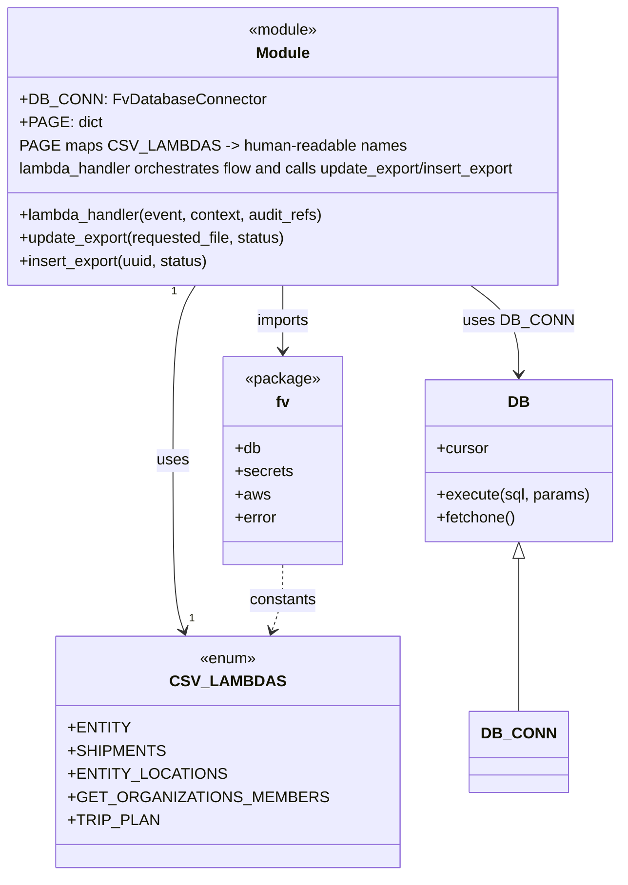

# Diagram: common/support_service/support_service/csv_exports/update_csv_export.py


> Auto-generated by Obscura crawlers

## Diagram 1

```mermaid
flowchart TD
  Start([Lambda Event])
  A[get_path_parameter(event, "file")]
  B[get_parsed_event_body(event)]
  C{requested_file exists\nand len(body) <= 1}
  D{body.status == "CANCELED" or\nbody.status == "TIMEOUT"}
  E[update_export(requested_file, status)]
  F[insert_export(requested_file, status)]
  G{export truthy?}
  H[make_response(export, 201)]
  I[NotFoundError("No export updated")]
  J[BadRequestError("Bad request")]
  K[DB_CONN.cursor.execute(SQL, params)]
  L[fetched row -> to_dict()\nmap target via PAGE]
  Start --> A
  Start --> B
  A --> C
  B --> C
  C -->|true| D
  D -->|true| E
  D -->|false| F
  E --> K
  F --> K
  K --> L
  L --> G
  G -->|true| H
  G -->|false| I
  C -->|false| J
```

> SVG rendering failed for this diagram.

## Diagram 2



### SVG

<svg id="container" width="638.421875" xmlns="http://www.w3.org/2000/svg" class="classDiagram" height="908" viewBox="0 0 638.421875 908" role="graphics-document document" aria-roledescription="class"><style>#container{font-family:"trebuchet ms",verdana,arial,sans-serif;font-size:16px;fill:#333;}@keyframes edge-animation-frame{from{stroke-dashoffset:0;}}@keyframes dash{to{stroke-dashoffset:0;}}#container .edge-animation-slow{stroke-dasharray:9,5!important;stroke-dashoffset:900;animation:dash 50s linear infinite;stroke-linecap:round;}#container .edge-animation-fast{stroke-dasharray:9,5!important;stroke-dashoffset:900;animation:dash 20s linear infinite;stroke-linecap:round;}#container .error-icon{fill:#552222;}#container .error-text{fill:#552222;stroke:#552222;}#container .edge-thickness-normal{stroke-width:1px;}#container .edge-thickness-thick{stroke-width:3.5px;}#container .edge-pattern-solid{stroke-dasharray:0;}#container .edge-thickness-invisible{stroke-width:0;fill:none;}#container .edge-pattern-dashed{stroke-dasharray:3;}#container .edge-pattern-dotted{stroke-dasharray:2;}#container .marker{fill:#333333;stroke:#333333;}#container .marker.cross{stroke:#333333;}#container svg{font-family:"trebuchet ms",verdana,arial,sans-serif;font-size:16px;}#container p{margin:0;}#container g.classGroup text{fill:#9370DB;stroke:none;font-family:"trebuchet ms",verdana,arial,sans-serif;font-size:10px;}#container g.classGroup text .title{font-weight:bolder;}#container .nodeLabel,#container .edgeLabel{color:#131300;}#container .edgeLabel .label rect{fill:#ECECFF;}#container .label text{fill:#131300;}#container .labelBkg{background:#ECECFF;}#container .edgeLabel .label span{background:#ECECFF;}#container .classTitle{font-weight:bolder;}#container .node rect,#container .node circle,#container .node ellipse,#container .node polygon,#container .node path{fill:#ECECFF;stroke:#9370DB;stroke-width:1px;}#container .divider{stroke:#9370DB;stroke-width:1;}#container g.clickable{cursor:pointer;}#container g.classGroup rect{fill:#ECECFF;stroke:#9370DB;}#container g.classGroup line{stroke:#9370DB;stroke-width:1;}#container .classLabel .box{stroke:none;stroke-width:0;fill:#ECECFF;opacity:0.5;}#container .classLabel .label{fill:#9370DB;font-size:10px;}#container .relation{stroke:#333333;stroke-width:1;fill:none;}#container .dashed-line{stroke-dasharray:3;}#container .dotted-line{stroke-dasharray:1 2;}#container #compositionStart,#container .composition{fill:#333333!important;stroke:#333333!important;stroke-width:1;}#container #compositionEnd,#container .composition{fill:#333333!important;stroke:#333333!important;stroke-width:1;}#container #dependencyStart,#container .dependency{fill:#333333!important;stroke:#333333!important;stroke-width:1;}#container #dependencyStart,#container .dependency{fill:#333333!important;stroke:#333333!important;stroke-width:1;}#container #extensionStart,#container .extension{fill:transparent!important;stroke:#333333!important;stroke-width:1;}#container #extensionEnd,#container .extension{fill:transparent!important;stroke:#333333!important;stroke-width:1;}#container #aggregationStart,#container .aggregation{fill:transparent!important;stroke:#333333!important;stroke-width:1;}#container #aggregationEnd,#container .aggregation{fill:transparent!important;stroke:#333333!important;stroke-width:1;}#container #lollipopStart,#container .lollipop{fill:#ECECFF!important;stroke:#333333!important;stroke-width:1;}#container #lollipopEnd,#container .lollipop{fill:#ECECFF!important;stroke:#333333!important;stroke-width:1;}#container .edgeTerminals{font-size:11px;line-height:initial;}#container .classTitleText{text-anchor:middle;font-size:18px;fill:#333;}#container .label-icon{display:inline-block;height:1em;overflow:visible;vertical-align:-0.125em;}#container .node .label-icon path{fill:currentColor;stroke:revert;stroke-width:revert;}#container :root{--mermaid-font-family:"trebuchet ms",verdana,arial,sans-serif;}</style><g><defs><marker id="container_class-aggregationStart" class="marker aggregation class" refX="18" refY="7" markerWidth="190" markerHeight="240" orient="auto"><path d="M 18,7 L9,13 L1,7 L9,1 Z"></path></marker></defs><defs><marker id="container_class-aggregationEnd" class="marker aggregation class" refX="1" refY="7" markerWidth="20" markerHeight="28" orient="auto"><path d="M 18,7 L9,13 L1,7 L9,1 Z"></path></marker></defs><defs><marker id="container_class-extensionStart" class="marker extension class" refX="18" refY="7" markerWidth="190" markerHeight="240" orient="auto"><path d="M 1,7 L18,13 V 1 Z"></path></marker></defs><defs><marker id="container_class-extensionEnd" class="marker extension class" refX="1" refY="7" markerWidth="20" markerHeight="28" orient="auto"><path d="M 1,1 V 13 L18,7 Z"></path></marker></defs><defs><marker id="container_class-compositionStart" class="marker composition class" refX="18" refY="7" markerWidth="190" markerHeight="240" orient="auto"><path d="M 18,7 L9,13 L1,7 L9,1 Z"></path></marker></defs><defs><marker id="container_class-compositionEnd" class="marker composition class" refX="1" refY="7" markerWidth="20" markerHeight="28" orient="auto"><path d="M 18,7 L9,13 L1,7 L9,1 Z"></path></marker></defs><defs><marker id="container_class-dependencyStart" class="marker dependency class" refX="6" refY="7" markerWidth="190" markerHeight="240" orient="auto"><path d="M 5,7 L9,13 L1,7 L9,1 Z"></path></marker></defs><defs><marker id="container_class-dependencyEnd" class="marker dependency class" refX="13" refY="7" markerWidth="20" markerHeight="28" orient="auto"><path d="M 18,7 L9,13 L14,7 L9,1 Z"></path></marker></defs><defs><marker id="container_class-lollipopStart" class="marker lollipop class" refX="13" refY="7" markerWidth="190" markerHeight="240" orient="auto"><circle stroke="black" fill="transparent" cx="7" cy="7" r="6"></circle></marker></defs><defs><marker id="container_class-lollipopEnd" class="marker lollipop class" refX="1" refY="7" markerWidth="190" markerHeight="240" orient="auto"><circle stroke="black" fill="transparent" cx="7" cy="7" r="6"></circle></marker></defs><g class="root"><g class="clusters"></g><g class="edgePaths"><path d="M215.484,296L211.652,302.167C207.82,308.333,200.156,320.667,196.324,351C192.492,381.333,192.492,429.667,192.492,478C192.492,526.333,192.492,574.667,194.364,604.059C196.235,633.45,199.979,643.901,201.85,649.126L203.722,654.351" id="id_Module_CSV_LAMBDAS_1" class="edge-thickness-normal edge-pattern-solid relation" style=";;;" data-edge="true" data-et="edge" data-id="id_Module_CSV_LAMBDAS_1" data-points="W3sieCI6MjE1LjQ4MzgzNTQ2MjcwNzIsInkiOjI5Nn0seyJ4IjoxOTIuNDkyMTg3NSwieSI6MzMzfSx7IngiOjE5Mi40OTIxODc1LCJ5Ijo0Nzh9LHsieCI6MTkyLjQ5MjE4NzUsInkiOjYyM30seyJ4IjoyMDUuNzQ1MzM0ODkyNTE1OTMsInkiOjY2MH1d" marker-end="url(#container_class-dependencyEnd)"></path><path d="M304.965,296L304.965,302.167C304.965,308.333,304.965,320.667,304.965,332C304.965,343.333,304.965,353.667,304.965,358.833L304.965,364" id="id_Module_fv_2" class="edge-thickness-normal edge-pattern-solid relation" style=";;;" data-edge="true" data-et="edge" data-id="id_Module_fv_2" data-points="W3sieCI6MzA0Ljk2NDg0Mzc1LCJ5IjoyOTZ9LHsieCI6MzA0Ljk2NDg0Mzc1LCJ5IjozMzN9LHsieCI6MzA0Ljk2NDg0Mzc1LCJ5IjozNzB9XQ==" marker-end="url(#container_class-dependencyEnd)"></path><path d="M487.557,296L495.376,302.167C503.195,308.333,518.834,320.667,526.653,336C534.473,351.333,534.473,369.667,534.473,378.833L534.473,388" id="id_Module_DB_3" class="edge-thickness-normal edge-pattern-solid relation" style=";;;" data-edge="true" data-et="edge" data-id="id_Module_DB_3" data-points="W3sieCI6NDg3LjU1NjY5NDU3ODcyOTMsInkiOjI5Nn0seyJ4Ijo1MzQuNDcyNjU2MjUsInkiOjMzM30seyJ4Ijo1MzQuNDcyNjU2MjUsInkiOjM5NH1d" marker-end="url(#container_class-dependencyEnd)"></path><path d="M304.965,586L304.965,592.167C304.965,598.333,304.965,610.667,303.093,622.059C301.222,633.45,297.478,643.901,295.607,649.126L293.735,654.351" id="id_fv_CSV_LAMBDAS_4" class="edge-thickness-normal edge-pattern-dashed relation" style=";;;" data-edge="true" data-et="edge" data-id="id_fv_CSV_LAMBDAS_4" data-points="W3sieCI6MzA0Ljk2NDg0Mzc1LCJ5Ijo1ODZ9LHsieCI6MzA0Ljk2NDg0Mzc1LCJ5Ijo2MjN9LHsieCI6MjkxLjcxMTY5NjM1NzQ4NDEsInkiOjY2MH1d" marker-end="url(#container_class-dependencyEnd)"></path><path d="M534.473,579.25L534.473,586.542C534.473,593.833,534.473,608.417,534.473,634.875C534.473,661.333,534.473,699.667,534.473,718.833L534.473,738" id="id_DB_DB_CONN_5" class="edge-thickness-normal edge-pattern-solid relation" style=";;;" data-edge="true" data-et="edge" data-id="id_DB_DB_CONN_5" data-points="W3sieCI6NTM0LjQ3MjY1NjI1LCJ5Ijo1NjJ9LHsieCI6NTM0LjQ3MjY1NjI1LCJ5Ijo2MjN9LHsieCI6NTM0LjQ3MjY1NjI1LCJ5Ijo3Mzh9XQ==" marker-start="url(#container_class-extensionStart)"></path></g><g class="edgeLabels"><g class="edgeLabel" transform="translate(192.4921875, 478)"><g class="label" data-id="id_Module_CSV_LAMBDAS_1" transform="translate(-16.4921875, -12)"><foreignObject width="32.984375" height="24"><div xmlns="http://www.w3.org/1999/xhtml" class="labelBkg" style="display: table-cell; white-space: nowrap; line-height: 1.5; max-width: 200px; text-align: center;"><span class="edgeLabel"><p>uses</p></span></div></foreignObject></g></g><g class="edgeLabel" transform="translate(304.96484375, 333)"><g class="label" data-id="id_Module_fv_2" transform="translate(-28.25, -12)"><foreignObject width="56.5" height="24"><div xmlns="http://www.w3.org/1999/xhtml" class="labelBkg" style="display: table-cell; white-space: nowrap; line-height: 1.5; max-width: 200px; text-align: center;"><span class="edgeLabel"><p>imports</p></span></div></foreignObject></g></g><g class="edgeLabel" transform="translate(534.47265625, 333)"><g class="label" data-id="id_Module_DB_3" transform="translate(-53.09375, -12)"><foreignObject width="106.1875" height="24"><div xmlns="http://www.w3.org/1999/xhtml" class="labelBkg" style="display: table-cell; white-space: nowrap; line-height: 1.5; max-width: 200px; text-align: center;"><span class="edgeLabel"><p>uses DB_CONN</p></span></div></foreignObject></g></g><g class="edgeLabel" transform="translate(304.96484375, 623)"><g class="label" data-id="id_fv_CSV_LAMBDAS_4" transform="translate(-35.2578125, -12)"><foreignObject width="70.515625" height="24"><div xmlns="http://www.w3.org/1999/xhtml" class="labelBkg" style="display: table-cell; white-space: nowrap; line-height: 1.5; max-width: 200px; text-align: center;"><span class="edgeLabel"><p>constants</p></span></div></foreignObject></g></g><g class="edgeLabel"><g class="label" data-id="id_DB_DB_CONN_5" transform="translate(0, 0)"><foreignObject width="0" height="0"><div xmlns="http://www.w3.org/1999/xhtml" class="labelBkg" style="display: table-cell; white-space: nowrap; line-height: 1.5; max-width: 200px; text-align: center;"><span class="edgeLabel"></span></div></foreignObject></g></g><g class="edgeTerminals" transform="translate(193.50683943605307, 302.9470562284303)"><g class="inner" transform="translate(0, 0)"><foreignObject style="width: 9px; height: 12px;"><div xmlns="http://www.w3.org/1999/xhtml" style="display: inline-block; padding-right: 1px; white-space: nowrap;"><span class="edgeLabel">1</span></div></foreignObject></g></g><g class="edgeTerminals" transform="translate(208.96552662511533, 633.4668057986257)"><g class="inner" transform="translate(0, 0)"></g><foreignObject style="width: 9px; height: 12px;"><div xmlns="http://www.w3.org/1999/xhtml" style="display: inline-block; padding-right: 1px; white-space: nowrap;"><span class="edgeLabel">1</span></div></foreignObject></g></g><g class="nodes"><g class="node default" id="classId-Module-0" transform="translate(304.96484375, 152)"><g class="basic label-container"><path d="M-296.96484375 -144 L296.96484375 -144 L296.96484375 144 L-296.96484375 144" stroke="none" stroke-width="0" fill="#ECECFF" style=""></path><path d="M-296.96484375 -144 C-143.66740759093335 -144, 9.630028568133298 -144, 296.96484375 -144 M-296.96484375 -144 C-157.90592117842291 -144, -18.84699860684583 -144, 296.96484375 -144 M296.96484375 -144 C296.96484375 -83.6270834308203, 296.96484375 -23.2541668616406, 296.96484375 144 M296.96484375 -144 C296.96484375 -79.40015919581802, 296.96484375 -14.80031839163604, 296.96484375 144 M296.96484375 144 C91.89992911823532 144, -113.16498551352936 144, -296.96484375 144 M296.96484375 144 C74.14472288152271 144, -148.67539798695458 144, -296.96484375 144 M-296.96484375 144 C-296.96484375 73.05672140686089, -296.96484375 2.1134428137217753, -296.96484375 -144 M-296.96484375 144 C-296.96484375 42.51478218420512, -296.96484375 -58.970435631589766, -296.96484375 -144" stroke="#9370DB" stroke-width="1.3" fill="none" stroke-dasharray="0 0" style=""></path></g><g class="annotation-group text" transform="translate(-36.6015625, -120)"><g class="label" style="" transform="translate(0,-12)"><foreignObject width="73.203125" height="24"><div xmlns="http://www.w3.org/1999/xhtml" style="display: table-cell; white-space: nowrap; line-height: 1.5; max-width: 123px; text-align: center;"><span class="nodeLabel markdown-node-label" style=""><p>«module»</p></span></div></foreignObject></g></g><g class="label-group text" transform="translate(-27.09375, -96)"><g class="label" style="font-weight: bolder" transform="translate(0,-12)"><foreignObject width="54.1875" height="24"><div xmlns="http://www.w3.org/1999/xhtml" style="display: table-cell; white-space: nowrap; line-height: 1.5; max-width: 104px; text-align: center;"><span class="nodeLabel markdown-node-label" style=""><p>Module</p></span></div></foreignObject></g></g><g class="members-group text" transform="translate(-284.96484375, -48)"><g class="label" style="" transform="translate(0,-12)"><foreignObject width="241.65625" height="24"><div xmlns="http://www.w3.org/1999/xhtml" style="display: table-cell; white-space: nowrap; line-height: 1.5; max-width: 300px; text-align: center;"><span class="nodeLabel markdown-node-label" style=""><p>+DB_CONN: FvDatabaseConnector</p></span></div></foreignObject></g><g class="label" style="" transform="translate(0,12)"><foreignObject width="79.578125" height="24"><div xmlns="http://www.w3.org/1999/xhtml" style="display: table-cell; white-space: nowrap; line-height: 1.5; max-width: 137px; text-align: center;"><span class="nodeLabel markdown-node-label" style=""><p>+PAGE: dict</p></span></div></foreignObject></g><g class="label" style="" transform="translate(0,36)"><foreignObject width="380.984375" height="24"><div xmlns="http://www.w3.org/1999/xhtml" style="display: table-cell; white-space: nowrap; line-height: 1.5; max-width: 452px; text-align: center;"><span class="nodeLabel markdown-node-label" style=""><p>PAGE maps CSV_LAMBDAS -&gt; human-readable names</p></span></div></foreignObject></g><g class="label" style="" transform="translate(0,60)"><foreignObject width="533.328125" height="24"><div xmlns="http://www.w3.org/1999/xhtml" style="display: table-cell; white-space: nowrap; line-height: 1.5; max-width: 584px; text-align: center;"><span class="nodeLabel markdown-node-label" style=""><p>lambda_handler orchestrates flow and calls update_export/insert_export</p></span></div></foreignObject></g></g><g class="methods-group text" transform="translate(-284.96484375, 72)"><g class="label" style="" transform="translate(0,-12)"><foreignObject width="321.6875" height="24"><div xmlns="http://www.w3.org/1999/xhtml" style="display: table-cell; white-space: nowrap; line-height: 1.5; max-width: 379px; text-align: center;"><span class="nodeLabel markdown-node-label" style=""><p>+lambda_handler(event, context, audit_refs)</p></span></div></foreignObject></g><g class="label" style="" transform="translate(0,12)"><foreignObject width="280.6875" height="24"><div xmlns="http://www.w3.org/1999/xhtml" style="display: table-cell; white-space: nowrap; line-height: 1.5; max-width: 338px; text-align: center;"><span class="nodeLabel markdown-node-label" style=""><p>+update_export(requested_file, status)</p></span></div></foreignObject></g><g class="label" style="" transform="translate(0,36)"><foreignObject width="200.71875" height="24"><div xmlns="http://www.w3.org/1999/xhtml" style="display: table-cell; white-space: nowrap; line-height: 1.5; max-width: 258px; text-align: center;"><span class="nodeLabel markdown-node-label" style=""><p>+insert_export(uuid, status)</p></span></div></foreignObject></g></g><g class="divider" style=""><path d="M-296.96484375 -72 C-129.36941136076337 -72, 38.22602102847327 -72, 296.96484375 -72 M-296.96484375 -72 C-80.86951115018263 -72, 135.22582144963474 -72, 296.96484375 -72" stroke="#9370DB" stroke-width="1.3" fill="none" stroke-dasharray="0 0" style=""></path></g><g class="divider" style=""><path d="M-296.96484375 48 C-156.93311616106018 48, -16.901388572120368 48, 296.96484375 48 M-296.96484375 48 C-153.3916179874783 48, -9.818392224956597 48, 296.96484375 48" stroke="#9370DB" stroke-width="1.3" fill="none" stroke-dasharray="0 0" style=""></path></g></g><g class="node default" id="classId-CSV_LAMBDAS-1" transform="translate(248.728515625, 780)"><g class="basic label-container"><path d="M-155.6796875 -120 L155.6796875 -120 L155.6796875 120 L-155.6796875 120" stroke="none" stroke-width="0" fill="#ECECFF" style=""></path><path d="M-155.6796875 -120 C-83.91746540485637 -120, -12.155243309712745 -120, 155.6796875 -120 M-155.6796875 -120 C-35.29625476113591 -120, 85.08717797772817 -120, 155.6796875 -120 M155.6796875 -120 C155.6796875 -24.849547147695347, 155.6796875 70.3009057046093, 155.6796875 120 M155.6796875 -120 C155.6796875 -56.70463220363578, 155.6796875 6.590735592728436, 155.6796875 120 M155.6796875 120 C89.49471111969505 120, 23.30973473939011 120, -155.6796875 120 M155.6796875 120 C48.0066528120349 120, -59.6663818759302 120, -155.6796875 120 M-155.6796875 120 C-155.6796875 29.545053426726028, -155.6796875 -60.909893146547944, -155.6796875 -120 M-155.6796875 120 C-155.6796875 53.48750553866604, -155.6796875 -13.024988922667916, -155.6796875 -120" stroke="#9370DB" stroke-width="1.3" fill="none" stroke-dasharray="0 0" style=""></path></g><g class="annotation-group text" transform="translate(-29.53125, -96)"><g class="label" style="" transform="translate(0,-12)"><foreignObject width="59.0625" height="24"><div xmlns="http://www.w3.org/1999/xhtml" style="display: table-cell; white-space: nowrap; line-height: 1.5; max-width: 109px; text-align: center;"><span class="nodeLabel markdown-node-label" style=""><p>«enum»</p></span></div></foreignObject></g></g><g class="label-group text" transform="translate(-51.734375, -72)"><g class="label" style="font-weight: bolder" transform="translate(0,-12)"><foreignObject width="103.46875" height="24"><div xmlns="http://www.w3.org/1999/xhtml" style="display: table-cell; white-space: nowrap; line-height: 1.5; max-width: 151px; text-align: center;"><span class="nodeLabel markdown-node-label" style=""><p>CSV_LAMBDAS</p></span></div></foreignObject></g></g><g class="members-group text" transform="translate(-143.6796875, -24)"><g class="label" style="" transform="translate(0,-12)"><foreignObject width="57.546875" height="24"><div xmlns="http://www.w3.org/1999/xhtml" style="display: table-cell; white-space: nowrap; line-height: 1.5; max-width: 115px; text-align: center;"><span class="nodeLabel markdown-node-label" style=""><p>+ENTITY</p></span></div></foreignObject></g><g class="label" style="" transform="translate(0,12)"><foreignObject width="89.09375" height="24"><div xmlns="http://www.w3.org/1999/xhtml" style="display: table-cell; white-space: nowrap; line-height: 1.5; max-width: 147px; text-align: center;"><span class="nodeLabel markdown-node-label" style=""><p>+SHIPMENTS</p></span></div></foreignObject></g><g class="label" style="" transform="translate(0,36)"><foreignObject width="143.9375" height="24"><div xmlns="http://www.w3.org/1999/xhtml" style="display: table-cell; white-space: nowrap; line-height: 1.5; max-width: 202px; text-align: center;"><span class="nodeLabel markdown-node-label" style=""><p>+ENTITY_LOCATIONS</p></span></div></foreignObject></g><g class="label" style="" transform="translate(0,60)"><foreignObject width="235.625" height="24"><div xmlns="http://www.w3.org/1999/xhtml" style="display: table-cell; white-space: nowrap; line-height: 1.5; max-width: 293px; text-align: center;"><span class="nodeLabel markdown-node-label" style=""><p>+GET_ORGANIZATIONS_MEMBERS</p></span></div></foreignObject></g><g class="label" style="" transform="translate(0,84)"><foreignObject width="83.234375" height="24"><div xmlns="http://www.w3.org/1999/xhtml" style="display: table-cell; white-space: nowrap; line-height: 1.5; max-width: 141px; text-align: center;"><span class="nodeLabel markdown-node-label" style=""><p>+TRIP_PLAN</p></span></div></foreignObject></g></g><g class="methods-group text" transform="translate(-143.6796875, 120)"></g><g class="divider" style=""><path d="M-155.6796875 -48 C-88.63922016562682 -48, -21.59875283125365 -48, 155.6796875 -48 M-155.6796875 -48 C-77.44472597847701 -48, 0.7902355430459806 -48, 155.6796875 -48" stroke="#9370DB" stroke-width="1.3" fill="none" stroke-dasharray="0 0" style=""></path></g><g class="divider" style=""><path d="M-155.6796875 96 C-59.85224444260949 96, 35.97519861478102 96, 155.6796875 96 M-155.6796875 96 C-82.82980472797652 96, -9.979921955953046 96, 155.6796875 96" stroke="#9370DB" stroke-width="1.3" fill="none" stroke-dasharray="0 0" style=""></path></g></g><g class="node default" id="classId-fv-2" transform="translate(304.96484375, 478)"><g class="basic label-container"><path d="M-60.98046875 -108 L60.98046875 -108 L60.98046875 108 L-60.98046875 108" stroke="none" stroke-width="0" fill="#ECECFF" style=""></path><path d="M-60.98046875 -108 C-32.109574953345884 -108, -3.2386811566917686 -108, 60.98046875 -108 M-60.98046875 -108 C-16.99330888960756 -108, 26.993850970784877 -108, 60.98046875 -108 M60.98046875 -108 C60.98046875 -22.91120653386453, 60.98046875 62.17758693227094, 60.98046875 108 M60.98046875 -108 C60.98046875 -36.94196369772415, 60.98046875 34.116072604551704, 60.98046875 108 M60.98046875 108 C13.36740512657601 108, -34.24565849684798 108, -60.98046875 108 M60.98046875 108 C14.766487056793608 108, -31.447494636412785 108, -60.98046875 108 M-60.98046875 108 C-60.98046875 58.81370923840084, -60.98046875 9.62741847680168, -60.98046875 -108 M-60.98046875 108 C-60.98046875 42.16842129219425, -60.98046875 -23.663157415611494, -60.98046875 -108" stroke="#9370DB" stroke-width="1.3" fill="none" stroke-dasharray="0 0" style=""></path></g><g class="annotation-group text" transform="translate(-38.4609375, -84)"><g class="label" style="" transform="translate(0,-12)"><foreignObject width="76.921875" height="24"><div xmlns="http://www.w3.org/1999/xhtml" style="display: table-cell; white-space: nowrap; line-height: 1.5; max-width: 127px; text-align: center;"><span class="nodeLabel markdown-node-label" style=""><p>«package»</p></span></div></foreignObject></g></g><g class="label-group text" transform="translate(-6.953125, -60)"><g class="label" style="font-weight: bolder" transform="translate(0,-12)"><foreignObject width="13.90625" height="24"><div xmlns="http://www.w3.org/1999/xhtml" style="display: table-cell; white-space: nowrap; line-height: 1.5; max-width: 63px; text-align: center;"><span class="nodeLabel markdown-node-label" style=""><p>fv</p></span></div></foreignObject></g></g><g class="members-group text" transform="translate(-48.98046875, -12)"><g class="label" style="" transform="translate(0,-12)"><foreignObject width="27.0625" height="24"><div xmlns="http://www.w3.org/1999/xhtml" style="display: table-cell; white-space: nowrap; line-height: 1.5; max-width: 84px; text-align: center;"><span class="nodeLabel markdown-node-label" style=""><p>+db</p></span></div></foreignObject></g><g class="label" style="" transform="translate(0,12)"><foreignObject width="59.5" height="24"><div xmlns="http://www.w3.org/1999/xhtml" style="display: table-cell; white-space: nowrap; line-height: 1.5; max-width: 117px; text-align: center;"><span class="nodeLabel markdown-node-label" style=""><p>+secrets</p></span></div></foreignObject></g><g class="label" style="" transform="translate(0,36)"><foreignObject width="35.3125" height="24"><div xmlns="http://www.w3.org/1999/xhtml" style="display: table-cell; white-space: nowrap; line-height: 1.5; max-width: 93px; text-align: center;"><span class="nodeLabel markdown-node-label" style=""><p>+aws</p></span></div></foreignObject></g><g class="label" style="" transform="translate(0,60)"><foreignObject width="44.109375" height="24"><div xmlns="http://www.w3.org/1999/xhtml" style="display: table-cell; white-space: nowrap; line-height: 1.5; max-width: 102px; text-align: center;"><span class="nodeLabel markdown-node-label" style=""><p>+error</p></span></div></foreignObject></g></g><g class="methods-group text" transform="translate(-48.98046875, 108)"></g><g class="divider" style=""><path d="M-60.98046875 -36 C-33.76755952734941 -36, -6.554650304698825 -36, 60.98046875 -36 M-60.98046875 -36 C-23.27434032284563 -36, 14.431788104308737 -36, 60.98046875 -36" stroke="#9370DB" stroke-width="1.3" fill="none" stroke-dasharray="0 0" style=""></path></g><g class="divider" style=""><path d="M-60.98046875 84 C-32.89891570538842 84, -4.81736266077683 84, 60.98046875 84 M-60.98046875 84 C-12.26664466794513 84, 36.44717941410974 84, 60.98046875 84" stroke="#9370DB" stroke-width="1.3" fill="none" stroke-dasharray="0 0" style=""></path></g></g><g class="node default" id="classId-DB-3" transform="translate(534.47265625, 478)"><g class="basic label-container"><path d="M-95.94921875 -84 L95.94921875 -84 L95.94921875 84 L-95.94921875 84" stroke="none" stroke-width="0" fill="#ECECFF" style=""></path><path d="M-95.94921875 -84 C-31.827782819289524 -84, 32.29365311142095 -84, 95.94921875 -84 M-95.94921875 -84 C-25.39968127465285 -84, 45.1498562006943 -84, 95.94921875 -84 M95.94921875 -84 C95.94921875 -34.06402337691231, 95.94921875 15.87195324617538, 95.94921875 84 M95.94921875 -84 C95.94921875 -24.64643328541962, 95.94921875 34.70713342916076, 95.94921875 84 M95.94921875 84 C54.94196980472468 84, 13.934720859449357 84, -95.94921875 84 M95.94921875 84 C40.139252932654905 84, -15.67071288469019 84, -95.94921875 84 M-95.94921875 84 C-95.94921875 37.15147039841293, -95.94921875 -9.697059203174135, -95.94921875 -84 M-95.94921875 84 C-95.94921875 18.81989241633424, -95.94921875 -46.36021516733152, -95.94921875 -84" stroke="#9370DB" stroke-width="1.3" fill="none" stroke-dasharray="0 0" style=""></path></g><g class="annotation-group text" transform="translate(0, -60)"></g><g class="label-group text" transform="translate(-10.1484375, -60)"><g class="label" style="font-weight: bolder" transform="translate(0,-12)"><foreignObject width="20.296875" height="24"><div xmlns="http://www.w3.org/1999/xhtml" style="display: table-cell; white-space: nowrap; line-height: 1.5; max-width: 70px; text-align: center;"><span class="nodeLabel markdown-node-label" style=""><p>DB</p></span></div></foreignObject></g></g><g class="members-group text" transform="translate(-83.94921875, -12)"><g class="label" style="" transform="translate(0,-12)"><foreignObject width="53.71875" height="24"><div xmlns="http://www.w3.org/1999/xhtml" style="display: table-cell; white-space: nowrap; line-height: 1.5; max-width: 112px; text-align: center;"><span class="nodeLabel markdown-node-label" style=""><p>+cursor</p></span></div></foreignObject></g></g><g class="methods-group text" transform="translate(-83.94921875, 36)"><g class="label" style="" transform="translate(0,-12)"><foreignObject width="157.75" height="24"><div xmlns="http://www.w3.org/1999/xhtml" style="display: table-cell; white-space: nowrap; line-height: 1.5; max-width: 215px; text-align: center;"><span class="nodeLabel markdown-node-label" style=""><p>+execute(sql, params)</p></span></div></foreignObject></g><g class="label" style="" transform="translate(0,12)"><foreignObject width="82.046875" height="24"><div xmlns="http://www.w3.org/1999/xhtml" style="display: table-cell; white-space: nowrap; line-height: 1.5; max-width: 139px; text-align: center;"><span class="nodeLabel markdown-node-label" style=""><p>+fetchone()</p></span></div></foreignObject></g></g><g class="divider" style=""><path d="M-95.94921875 -36 C-30.325640828274075 -36, 35.29793709345185 -36, 95.94921875 -36 M-95.94921875 -36 C-34.741678017255346 -36, 26.46586271548931 -36, 95.94921875 -36" stroke="#9370DB" stroke-width="1.3" fill="none" stroke-dasharray="0 0" style=""></path></g><g class="divider" style=""><path d="M-95.94921875 12 C-36.664060799225695 12, 22.62109715154861 12, 95.94921875 12 M-95.94921875 12 C-22.450259478219962 12, 51.048699793560075 12, 95.94921875 12" stroke="#9370DB" stroke-width="1.3" fill="none" stroke-dasharray="0 0" style=""></path></g></g><g class="node default" id="classId-DB_CONN-4" transform="translate(534.47265625, 780)"><g class="basic label-container"><path d="M-46.40625 -42 L46.40625 -42 L46.40625 42 L-46.40625 42" stroke="none" stroke-width="0" fill="#ECECFF" style=""></path><path d="M-46.40625 -42 C-15.444858056938749 -42, 15.516533886122502 -42, 46.40625 -42 M-46.40625 -42 C-15.095287183568278 -42, 16.215675632863444 -42, 46.40625 -42 M46.40625 -42 C46.40625 -23.717730500349152, 46.40625 -5.435461000698304, 46.40625 42 M46.40625 -42 C46.40625 -20.98794442714878, 46.40625 0.02411114570244166, 46.40625 42 M46.40625 42 C27.593393146628028 42, 8.780536293256056 42, -46.40625 42 M46.40625 42 C9.562985148421866 42, -27.280279703156268 42, -46.40625 42 M-46.40625 42 C-46.40625 22.116736433887517, -46.40625 2.233472867775035, -46.40625 -42 M-46.40625 42 C-46.40625 11.729141676325753, -46.40625 -18.541716647348494, -46.40625 -42" stroke="#9370DB" stroke-width="1.3" fill="none" stroke-dasharray="0 0" style=""></path></g><g class="annotation-group text" transform="translate(0, -18)"></g><g class="label-group text" transform="translate(-34.40625, -18)"><g class="label" style="font-weight: bolder" transform="translate(0,-12)"><foreignObject width="68.8125" height="24"><div xmlns="http://www.w3.org/1999/xhtml" style="display: table-cell; white-space: nowrap; line-height: 1.5; max-width: 119px; text-align: center;"><span class="nodeLabel markdown-node-label" style=""><p>DB_CONN</p></span></div></foreignObject></g></g><g class="members-group text" transform="translate(-34.40625, 30)"></g><g class="methods-group text" transform="translate(-34.40625, 60)"></g><g class="divider" style=""><path d="M-46.40625 6 C-13.959249479977679 6, 18.487751040044643 6, 46.40625 6 M-46.40625 6 C-27.83338955839622 6, -9.26052911679244 6, 46.40625 6" stroke="#9370DB" stroke-width="1.3" fill="none" stroke-dasharray="0 0" style=""></path></g><g class="divider" style=""><path d="M-46.40625 24 C-24.068490172612083 24, -1.730730345224167 24, 46.40625 24 M-46.40625 24 C-26.439403695003275 24, -6.47255739000655 24, 46.40625 24" stroke="#9370DB" stroke-width="1.3" fill="none" stroke-dasharray="0 0" style=""></path></g></g></g></g></g></svg>
